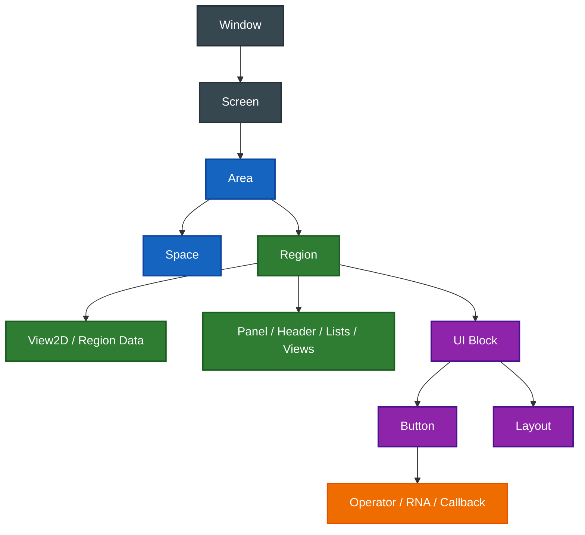
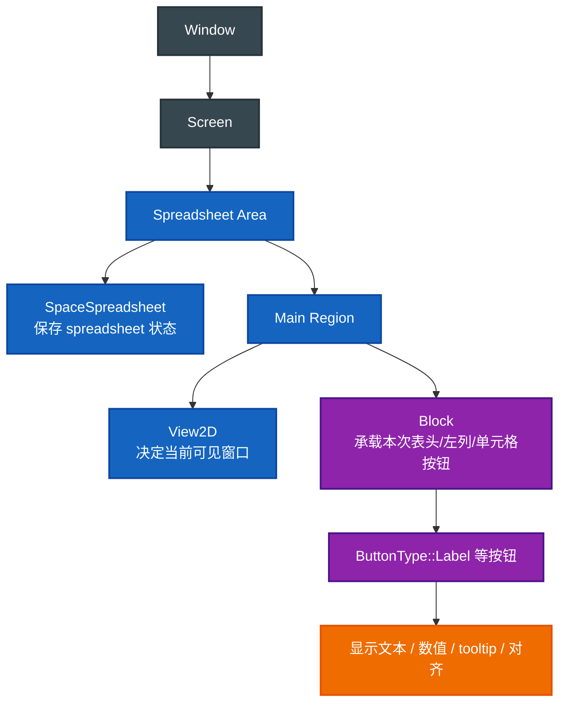

- [Blender UI 层级总览](#blender-ui-层级总览)
  - [1. 先给一张总图](#1-先给一张总图)
    - [1.1 `Context` 是“当前正在操作哪里”的快照](#11-context-是当前正在操作哪里的快照)
  - [2. `Window` 和 `Screen`](#2-window-和-screen)
    - [2.1 `Window`](#21-window)
    - [2.2 `bScreen`](#22-bscreen)
    - [2.3 `Screen` 不等于“屏幕像素”](#23-screen-不等于屏幕像素)
  - [3. `Area`](#3-area)
    - [3.1 `Area` 的职责](#31-area-的职责)
    - [3.2 读 Blender 代码时怎么认出 `Area`](#32-读-blender-代码时怎么认出-area)
    - [3.3 `Space`：Area 里真正的编辑器状态](#33-spacearea-里真正的编辑器状态)
    - [3.4 为什么 bpy 路径是 `screens["Geometry Nodes"].areas[6].spaces[0].use_filter`](#34-为什么-bpy-路径是-screensgeometry-nodesareas6spaces0use_filter)
  - [4. `Region`](#4-region)
    - [4.1 `Region` 的职责](#41-region-的职责)
    - [4.2 最常见的几个字段](#42-最常见的几个字段)
    - [4.3 为什么很多 draw 函数都拿 `ARegion *region`](#43-为什么很多-draw-函数都拿-aregion-region)
  - [5. `View2D`](#5-view2d)
    - [5.1 它为什么不是单独层级](#51-它为什么不是单独层级)
  - [6. `Panel`](#6-panel)
    - [6.1 `Panel` 和 `Region` 的关系](#61-panel-和-region-的关系)
    - [6.2 `Panel` 和 spreadsheet 的关系](#62-panel-和-spreadsheet-的关系)
  - [7. `Layout`](#7-layout)
    - [7.1 `Layout` 和 `Block` 的关系](#71-layout-和-block-的关系)
    - [7.2 为什么 spreadsheet 主绘制没大量用 `Layout`](#72-为什么-spreadsheet-主绘制没大量用-layout)
  - [8. `Block`](#8-block)
    - [8.1 `Block` 的直观作用](#81-block-的直观作用)
    - [8.2 `Block` 不是视觉上的“盒子”](#82-block-不是视觉上的盒子)
  - [9. `Button`](#9-button)
    - [9.1 为什么 label 也是 `Button`](#91-为什么-label-也是-button)
    - [9.2 为什么这个名字听起来不太合适](#92-为什么这个名字听起来不太合适)
    - [9.3 为什么函数名叫 `uiDefIconTextBut`](#93-为什么函数名叫-uideficontextbut)
    - [9.4 读代码时最值得盯的字段](#94-读代码时最值得盯的字段)
  - [10. `Operator`](#10-operator)
    - [10.1 为什么要把 operator 放到这张图里](#101-为什么要把-operator-放到这张图里)
  - [11. Spreadsheet 放到这张图里处在哪](#11-spreadsheet-放到这张图里处在哪)
  - [12. 初学者最容易混淆的几组概念](#12-初学者最容易混淆的几组概念)
    - [12.1 `Area` vs `Region`](#121-area-vs-region)
    - [12.1.1 `Area` vs `Space`](#1211-area-vs-space)
    - [12.2 `Region` vs `View2D`](#122-region-vs-view2d)
    - [12.3 `Layout` vs `Block`](#123-layout-vs-block)
    - [12.4 `Button` vs Operator](#124-button-vs-operator)
    - [12.5 `Panel` vs `Block`](#125-panel-vs-block)
  - [13. 学 Blender UI 时建议的观察顺序](#13-学-blender-ui-时建议的观察顺序)
  - [14. 一句话总结](#14-一句话总结)

# Blender UI 层级总览

这份文档不是只解释 spreadsheet，而是补一层更大的背景：

> 当你在 Blender 编辑器代码里看到 `Screen`、`Area`、`Space`、`Region`、`Context`、`Block`、`Button`、`Panel`、`Layout`、`View2D` 时，它们到底分别处在哪一层，彼此是什么关系？

这篇适合和下面几份一起读：

- [05-spreadsheet_main_region_draw详解.md](E:/blender-git/blender/.markdown/space_spreadsheet/05-spreadsheet_main_region_draw详解.md)
- [12-spreadsheet_draw文件级导读.md](E:/blender-git/blender/.markdown/space_spreadsheet/12-spreadsheet_draw文件级导读.md)
- [13-View2D-Block-Button与左列绘制.md](E:/blender-git/blender/.markdown/space_spreadsheet/13-View2D-Block-Button与左列绘制.md)

---

## 1. 先给一张总图

你可以先把 Blender UI 粗略记成下面这棵树：



如果先只记一句话：

> `Screen` 管大布局，`Area` 管编辑器块，`Region` 管编辑器内部子区域，`Block` 管一批 UI 元素，`Button` 是最具体的交互或显示单元。

### 1.1 `Context` 是“当前正在操作哪里”的快照

`Context` 在 C/C++ 里通常表现为：

- `bContext *C`
- `CTX_wm_window(C)`
- `CTX_wm_screen(C)`
- `CTX_wm_area(C)`
- `CTX_wm_region(C)`
- `CTX_wm_space_data(C)`

它不是一个新的 UI 容器层级，而是：

> 当前操作发生时，Blender 临时告诉你“现在在哪个 window、screen、area、region、space 里”。

这点很重要。`Screen/Area/Region/Space` 是数据结构和 UI 组织；`Context` 是访问这些当前对象的入口。

比如同一个 operator 可以从快捷键、菜单、按钮触发。它自己不应该死记“我属于哪个 spreadsheet area”，而是通过 `bContext` 问：

- 当前 active 的 area 是哪个？
- 当前 region 是哪个？
- 当前 space data 是哪种编辑器状态？

所以读代码时，如果看到 `C` 或 `CTX_...`，可以先把它理解成：

> 从当前 UI 环境里取对象，而不是对象本身。

---

## 2. `Window` 和 `Screen`

### 2.1 `Window`

`Window` 是操作系统层面那个真正的窗口。

你可以先把它理解成：

> Blender 把所有 UI 画到哪一个宿主窗口里。

平时读编辑器代码时，你不一定总直接碰它，但很多上下文都最终依附在 window 上。

### 2.2 `bScreen`

`bScreen` 定义在：

- [DNA_screen_types.h:92](E:/blender-git/blender/source/blender/makesdna/DNA_screen_types.h#L92)

它代表的是：

> 这个窗口当前采用的“界面布局方案”。

比如：

- 窗口怎么切成多个编辑器块
- 哪些 area 在这个 screen 里
- 当前哪个 region 是 active 的

最值得先记的字段：

- `areabase`
- `regionbase`
- `active_region`

### 2.3 `Screen` 不等于“屏幕像素”

这里的 `Screen` 不是显示器，不是 framebuffer，也不是最终绘制像素层。

它更像：

> 一张 UI 布局蓝图，定义这个窗口被分成哪些 area。

---

## 3. `Area`

`ScrArea` 定义在：

- [DNA_screen_types.h:597](E:/blender-git/blender/source/blender/makesdna/DNA_screen_types.h#L597)

它可以先理解成：

> 一个编辑器槽位。

例如：

- 3D View
- Outliner
- Spreadsheet
- Properties
- Timeline

这些通常都是不同的 area。

### 3.1 `Area` 的职责

`Area` 关心的是：

- 这个槽位里当前装的是哪种 editor
- 这个 editor 拥有哪些 region
- area 在 screen 中的整体矩形范围

它不直接等于“一个按钮容器”，也不直接等于“一个滚动视图”。

### 3.2 读 Blender 代码时怎么认出 `Area`

如果你看到：

- `ScrArea`
- `CTX_wm_area(C)`
- `CTX_wm_space_data(C)`
- `SpaceType`

通常你已经在编辑器层了。

一句话：

> `Area` 是“哪个编辑器在这里运行”的层级。

### 3.3 `Space`：Area 里真正的编辑器状态

`Area` 更像一个“编辑器槽位”，而 `Space` 更像这个槽位里当前编辑器的具体状态。

Blender 里很多编辑器都有自己的 `SpaceXXX` 数据结构，例如：

- `SpaceView3D`
- `SpaceOutliner`
- `SpaceSpreadsheet`
- `SpaceNode`

它们通常保存这个编辑器自己的状态，例如：

- 当前显示模式
- filter 开关
- pin 状态
- viewer path
- editor-specific 的配置

所以关系可以这样记：

> `Area` 回答“这里是一个什么编辑器槽位”，`Space` 回答“这个编辑器现在有哪些内部状态”。

一个 area 里面有 `spacedata` 列表，当前使用的通常是 `spacedata.first`。这也是为什么 Python 里会看到 `area.spaces[0]` 这种访问方式。

对 spreadsheet 来说，`SpaceSpreadsheet` 就是保存 spreadsheet 编辑器状态的地方。类似 `use_filter` 这种开关，不属于 screen，也不属于 region，而属于 spreadsheet 这个 editor 的 space data。

### 3.4 为什么 bpy 路径是 `screens["Geometry Nodes"].areas[6].spaces[0].use_filter`

这条路径可以逐层拆开看：

```python
bpy.data.screens["Geometry Nodes"].areas[6].spaces[0].use_filter
```

含义是：

- `bpy.data.screens["Geometry Nodes"]`：找到名为 `Geometry Nodes` 的 screen 布局数据。
- `.areas[6]`：取这个 screen 里的第 7 个 area，也就是某个编辑器槽位。
- `.spaces[0]`：取这个 area 当前/历史保存的第一个 space data。
- `.use_filter`：访问这个 space data 上的 spreadsheet filter 开关。

它看起来绕，是因为 Blender 把 UI 状态分成了几层：

```text
Screen 布局
  -> Area 编辑器槽位
    -> Space 编辑器内部状态
      -> use_filter 具体属性
```

这里最容易误会的是 `areas[6]`。它不是“第 6 个 spreadsheet 类型”，只是这个 screen 的 area 列表里的索引。用户改过布局、分屏、合并区域以后，这个索引可能变。

如果你想表达的是：

> 从当前正在运行脚本/操作的编辑器出发，遍历同一个界面布局里的其他编辑器。

那更应该从 `context` 拿当前 `screen`，再遍历这个 screen 的 `areas`：

```python
screen = bpy.context.screen
current_area = bpy.context.area

for area in screen.areas:
    if area == current_area:
        continue

    if area.type == 'SPREADSHEET':
        space = area.spaces.active
        space.use_filter = True
```

这条路径对应的是：

```text
当前 context
  -> 当前 screen
    -> screen 里的所有 area
      -> 每个 area 的 active space
```

这里的“其他编辑器”本质上就是“同一个 screen 里的其他 area”。比如你在 Text Editor 里运行脚本，也可以找到同一个窗口布局里的 Spreadsheet、3D View、Outliner 等 area。

如果脚本就是在当前 Spreadsheet 编辑器上下文里运行，才适合直接从 `bpy.context.area` 拿当前 area：

```python
area = bpy.context.area
if area and area.type == 'SPREADSHEET':
    space = area.spaces.active
    space.use_filter = True
```

这条路径对应的是：

```text
当前 context
  -> 当前 area
    -> 当前 active space
      -> use_filter
```

如果脚本可能从 Text Editor、Python Console 或其他编辑器运行，那么 `bpy.context.area` 不一定是 spreadsheet。这时就不要只看当前 area，而应该遍历 `bpy.context.screen.areas`。

C/C++ 里是同一个思路，只是 API 换成 `bContext`：

```cpp
bScreen *screen = CTX_wm_screen(C);
ScrArea *current_area = CTX_wm_area(C);

LISTBASE_FOREACH (ScrArea *, area, &screen->areabase) {
  if (area == current_area) {
    continue;
  }
  SpaceLink *space = static_cast<SpaceLink *>(area->spacedata.first);
  if (space == nullptr) {
    continue;
  }
  if (space->spacetype == SPACE_SPREADSHEET) {
    SpaceSpreadsheet *sspreadsheet = reinterpret_cast<SpaceSpreadsheet *>(space);
    /* Use sspreadsheet here. */
  }
}
```

所以可以记成：

> 要找当前编辑器，问 `context.area` / `CTX_wm_area(C)`；要找当前布局里的其他编辑器，问 `context.screen.areas` / `CTX_wm_screen(C)->areabase`。

这也解释了为什么同一个属性不是写成 `bpy.context.use_filter`：`use_filter` 不是全局当前状态，而是某个 spreadsheet space 的持久 UI 状态。

---

## 4. `Region`

`ARegion` 定义在：

- [DNA_screen_types.h:787](E:/blender-git/blender/source/blender/makesdna/DNA_screen_types.h#L787)

这是 Blender UI 里非常非常关键的一层。

它表示：

> 一个 area 内部可以独立绘制、独立响应事件的子区域。

例如一个 spreadsheet area 里，常见就可能有：

- 主内容区
- header 区
- sidebar 区

这些往往就是不同的 region。

### 4.1 `Region` 的职责

`Region` 负责：

- 自己的矩形范围
- 自己的绘制函数
- 自己的事件处理
- 自己的滚动视图数据（如果有）

### 4.2 最常见的几个字段

在 `ARegion` 里，你最常碰到的是：

- `v2d`
- `winrct`
- `winx`
- `winy`

其中：

- `winx/winy`：当前 region 的像素宽高
- `winrct`：这个 region 在窗口里的矩形
- `v2d`：如果它是一个可滚动 2D 区域，就会用到的视图信息

### 4.3 为什么很多 draw 函数都拿 `ARegion *region`

因为对绘制代码来说，最重要的局部上下文通常就是：

> 我要画到哪个 region，它有多大，现在滚动到哪里。

所以 spreadsheet 的很多绘制函数都直接以 `ARegion *region` 为输入。

---

## 5. `View2D`

`View2D` 定义在：

- [DNA_view2d_types.h:125](E:/blender-git/blender/source/blender/makesdna/DNA_view2d_types.h#L125)

它不是“一个 UI 层级节点”，但在很多 region 里都非常重要。

你可以把它理解成：

> 附着在 region 上的 2D 可滚动视图状态。

最重要的两个字段：

- `tot`
- `cur`

含义是：

- `tot`：整个可滚动内容的总范围
- `cur`：当前视口看到的那一块

所以 `View2D` 更像：

> region 的“相机和滚动窗口”。

### 5.1 它为什么不是单独层级

因为它不是 UI 容器，不持有按钮，不管理 block。

它更像是：

> region 绘制时使用的一块辅助视图数据。

---

## 6. `Panel`

`Panel` 定义在：

- [DNA_screen_types.h:244](E:/blender-git/blender/source/blender/makesdna/DNA_screen_types.h#L244)

你可以把 panel 理解成：

> region 内部带标题、可折叠、可组织内容的一块 UI 版块。

最典型的地方就是：

- Properties editor 的各个属性面板
- N 面板
- 工具栏中的分类块

### 6.1 `Panel` 和 `Region` 的关系

不是所有 region 都有 panel，但很多“属性类区域”会在 region 内组织出多个 panel。

所以关系更像：

- `Region` 是子区域容器
- `Panel` 是这个子区域里的内容组织单位之一

### 6.2 `Panel` 和 spreadsheet 的关系

Spreadsheet 主内容区不是典型 panel 式界面，它更偏自定义表格绘制。

但 sidebar、header、其他编辑器里，你会大量碰到 panel。

所以理解 panel 很有价值，因为它能帮助你区分：

- “这是通用面板式 UI”
- “这是像 spreadsheet 这样自己写的区域绘制”

---

## 7. `Layout`

你在 Blender UI 里会经常看到：

- `uiLayout`
- `layout->...`

可以把它理解成：

> 一个声明式 UI 排版器。

也就是说，当代码写：

- 这一行放几个按钮
- 这一列嵌套几个属性
- 这里再开一个 box

它往往走的是 layout 系统。

### 7.1 `Layout` 和 `Block` 的关系

这是很容易混淆的一组。

最简单的理解方式：

- `Layout` 更偏“怎么排”
- `Block` 更偏“这一批最终 UI 元素装在哪里并怎么统一绘制”

也就是说：

> `Layout` 是组织按钮排版的工具，`Block` 是承载按钮对象并参与最终绘制的容器。

### 7.2 为什么 spreadsheet 主绘制没大量用 `Layout`

因为 spreadsheet 更像一个自定义表格区域：

- 行列位置自己算
- cell 几何自己定
- 很多内容是按 View2D 滚动和可见性动态生成

这类问题用 `Layout` 不一定顺手，所以它更多直接使用：

- `Block`
- `Button`
- 自己的行列公式

---

## 8. `Block`

`Block` 定义在：

- [interface_intern.hh:650](E:/blender-git/blender/source/blender/editors/interface/interface_intern.hh#L650)

这是 Blender UI 代码里一个非常核心但又很容易被忽略的层级。

你可以把它理解成：

> 一次 UI 构建和绘制批次的容器。

它最关键的内容包括：

- `buttons_ptrs`
- `name`
- `rect`
- `winmat`
- `emboss`

### 8.1 `Block` 的直观作用

一个 block 通常表示：

- 这次我要创建一批按钮
- 这些按钮共享同一套 region/context/draw 环境
- 构建完成后统一 end，再统一 draw

所以你会看到典型生命周期：

```cpp
ui::Block *block = block_begin(...);
// 往 block 里追加按钮
block_end(...);
block_draw(...);
```

### 8.2 `Block` 不是视觉上的“盒子”

这是很多人第一次会误解的地方。

`Block` 不是说屏幕上一定画一个边框盒子。

它更像：

> 一批 UI 元素的逻辑与绘制容器。

---

## 9. `Button`

`Button` 定义在：

- [interface_intern.hh:188](E:/blender-git/blender/source/blender/editors/interface/interface_intern.hh#L188)

这是 Blender UI 的最小常见单元之一。

你可以把它理解成：

> 一个具体的 UI 元素实例。

它未必真的长得像“按钮”，也可能是：

- label
- 数值输入框
- toggle
- slider
- search box
- 菜单项

所以 `Button` 更准确地说是：

> Blender UI 系统里的基础控件对象。

### 9.1 为什么 label 也是 `Button`

因为 Blender 的 UI 基础设施希望：

- 统一排版
- 统一样式
- 统一事件和绘制机制

所以哪怕只是显示一段文字，也经常通过 `ButtonType::Label` 来走同一套系统。

这就是你在 spreadsheet 左列看到 `uiDefIconTextBut(... ButtonType::Label ...)` 的原因。

### 9.2 为什么这个名字听起来不太合适

你觉得 `Button` 这个名字不太合适，是很正常的。

在现代 UI 术语里，`Button` 通常只表示“可点击按钮”。但 Blender 这套 UI 系统历史很长，底层的 `But` / `Button` 更接近：

> 一个可绘制、可布局、可能可交互的 UI 控件单元。

也就是说，它不是狭义的 button，而是 Blender 内部的 widget/control。只是历史命名沿用了 `button`。

所以读 Blender UI 代码时，可以把 `ui::Button` 在脑中翻译成：

> UI control / widget instance。

这样就不会被名字误导。`ButtonType::Label` 并不是“一个能点击的按钮伪装成 label”，而是“用 button/widget 这套底层基础设施来创建一个 label 控件”。

### 9.3 为什么函数名叫 `uiDefIconTextBut`

`uiDefIconTextBut` 这个名字确实很 Blender C 风格，也确实不好读。

可以拆成几段：

- `ui`：UI 系统函数前缀。
- `Def`：define，创建/定义一个 UI 控件。
- `IconText`：这个控件可以同时带 icon 和 text。
- `But`：button 的历史缩写。

所以它大致等价于：

```text
UI Define Icon Text Button
```

也就是：

> 在某个 `ui::Block` 里创建一个带图标和文字能力的 UI 控件。

它的参数之所以多，是因为这是偏底层的 API，需要一次性说明：

- 放进哪个 block
- 控件类型是什么
- icon 是什么
- 显示文字是什么
- 矩形位置和尺寸是多少
- 绑定的数据或行为是什么
- tooltip 或额外参数是什么

例如 spreadsheet 里：

```cpp
uiDefIconTextBut(params.block,
                 ui::ButtonType::Label,
                 ICON_NONE,
                 value_str,
                 params.xmin,
                 params.ymin,
                 params.width,
                 params.height,
                 nullptr,
                 std::nullopt);
```

这不是在创建“传统意义上可点击的按钮”，而是在 block 里定义一个 label 类型的 UI 控件，用来显示单元格文本。

### 9.4 读代码时最值得盯的字段

如果你刚开始读，不要一下子全看。

先盯这些：

- `type`
- `flag`
- `drawflag`
- `rect`
- `str`
- `func / apply_func`

它们大致回答：

- 这个控件是什么类型
- 它怎么画
- 它在哪画
- 它显示什么
- 它响应什么行为

---

## 10. `Operator`

Operator 不是 UI 层级节点，但它和 button 的关系非常紧。

你可以把 operator 理解成：

> 一个可被 UI、快捷键、菜单触发的动作。

很多 button 最终都不是直接自己修改世界，而是：

- 触发一个 operator
- 或绑定一个 RNA 属性

所以 UI 往往只是入口，真正做事的是 operator 或底层数据修改逻辑。

### 10.1 为什么要把 operator 放到这张图里

因为如果你只看 `Button`，很容易误会：

> 按钮自己完成了行为。

其实很多时候是：

- `Button` 负责显示和接收输入
- `Operator` 负责执行动作

---

## 11. Spreadsheet 放到这张图里处在哪

把 spreadsheet 代入后，这条链就会变得非常清楚：



也就是说，spreadsheet 不是“绕开 Blender UI 的特殊系统”，而是：

- 在 `Area/Region` 层走 Blender 编辑器框架
- 在 `SpaceSpreadsheet` 里保存 spreadsheet 自己的 UI 状态
- 在几何背景层走自定义 GPU 绘制
- 在内容层走 `Block/Button` 这套 UI 基础设施

这就是为什么它读起来既像自定义绘制系统，又像标准 Blender UI 代码。

---

## 12. 初学者最容易混淆的几组概念

### 12.1 `Area` vs `Region`

- `Area`：一个编辑器块
- `Region`：这个编辑器块内部的子区域

一句话：

> `Area` 更大，`Region` 更细。

### 12.1.1 `Area` vs `Space`

- `Area`：screen 里的编辑器槽位
- `Space`：这个编辑器槽位里的具体编辑器状态

一句话：

> `Area` 是“这个格子里是什么编辑器”，`Space` 是“这个编辑器现在怎么配置”。

### 12.2 `Region` vs `View2D`

- `Region`：区域本身
- `View2D`：这个区域里的滚动/缩放视图状态

一句话：

> `View2D` 是 region 的视图数据，不是独立容器。

### 12.3 `Layout` vs `Block`

- `Layout`：偏排版组织
- `Block`：偏按钮容器与绘制批次

### 12.4 `Button` vs Operator

- `Button`：UI 控件对象
- `Operator`：动作执行体

一句话：

> button 是入口，operator 往往是动作本体。

### 12.5 `Panel` vs `Block`

- `Panel`：更高层的内容组织块
- `Block`：更底层的一批 UI 元素容器

你可以把 panel 想成“章节”，把 block 想成“这次真正装按钮的批次容器”。

---

## 13. 学 Blender UI 时建议的观察顺序

如果你打开一个新的编辑器模块，建议按下面顺序看：

1. 先看它属于哪个 `SpaceType`
2. 再看这个 area 有哪些 region
3. 再看每个 region 的 draw / listener / init
4. 再看它是 panel/layout 风格，还是自定义绘制风格
5. 最后再深入 block/button/operator 的细节

这样你不容易一上来就在按钮细节里迷路。

---

## 14. 一句话总结

Blender UI 的主层级可以记成：

> `Screen` 决定窗口里的大布局，`Area` 决定一个编辑器槽位，`Space` 保存这个编辑器自己的状态，`Region` 决定这个编辑器内部的子区域，`Context` 提供当前正在操作哪里的访问入口，`View2D` 提供可滚动视图，`Block` 承载一批 UI 元素，`Button` 是最具体的控件实例，而 `Panel`、`Layout`、`Operator` 则分别负责更高层的内容组织、排版组织和动作执行。
