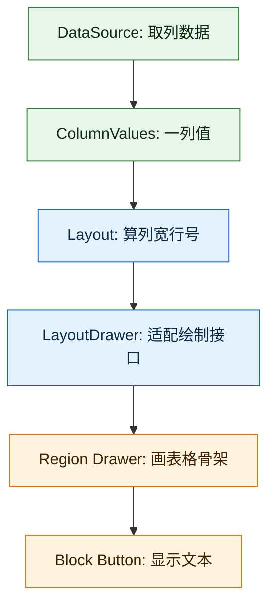
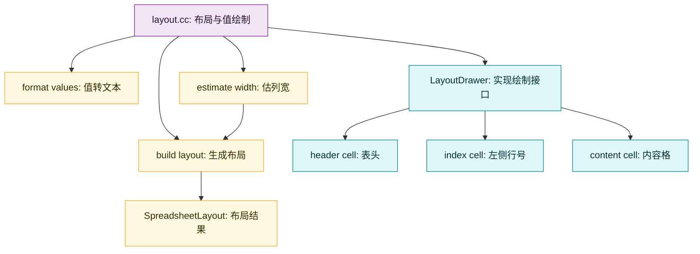
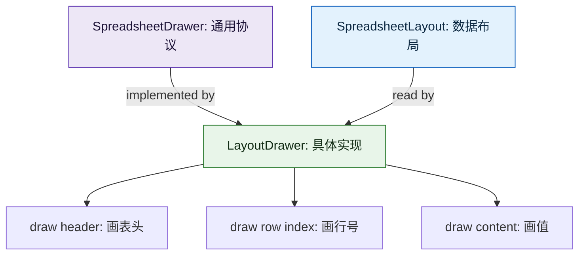
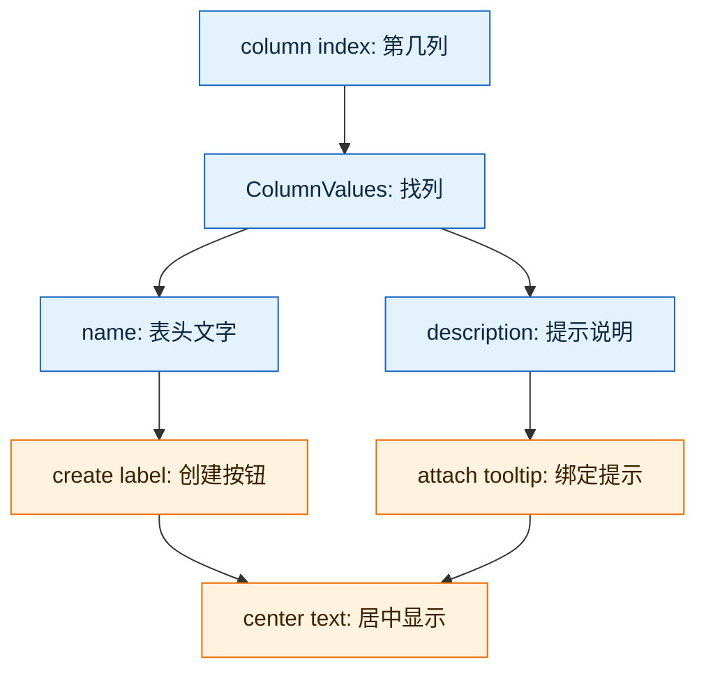
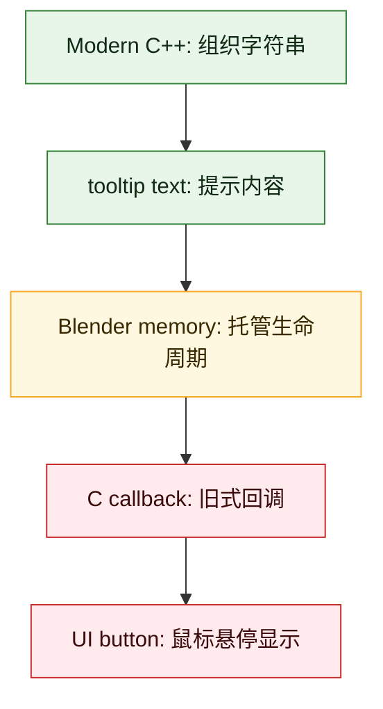
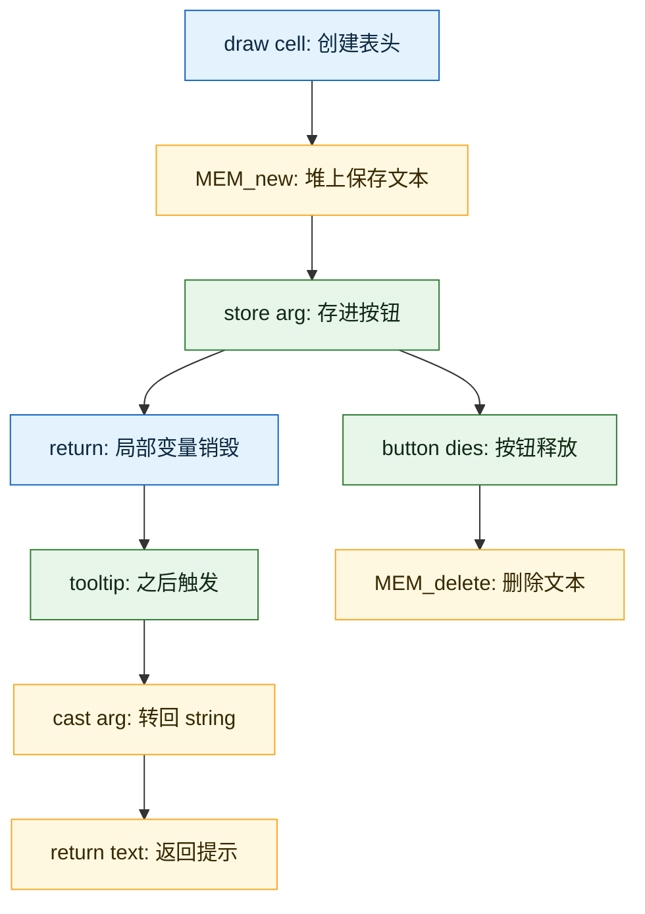
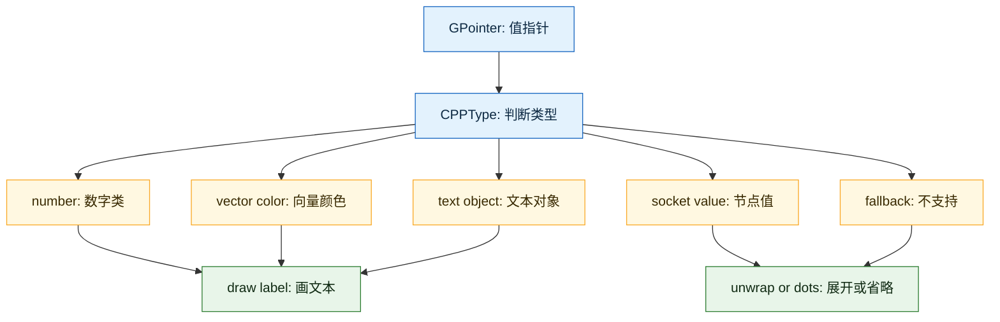
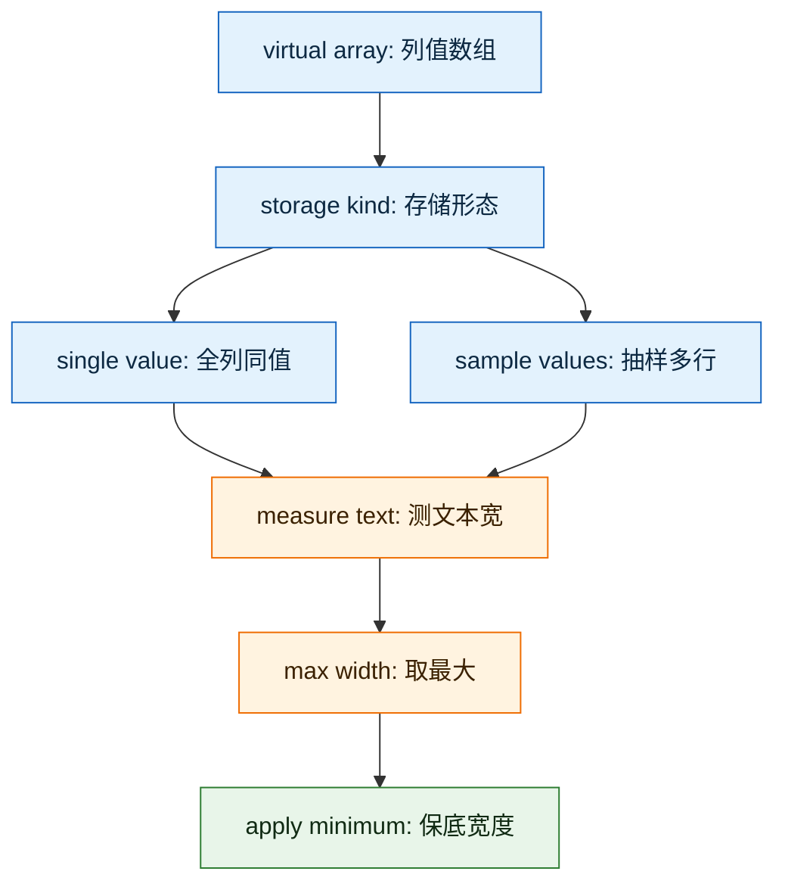
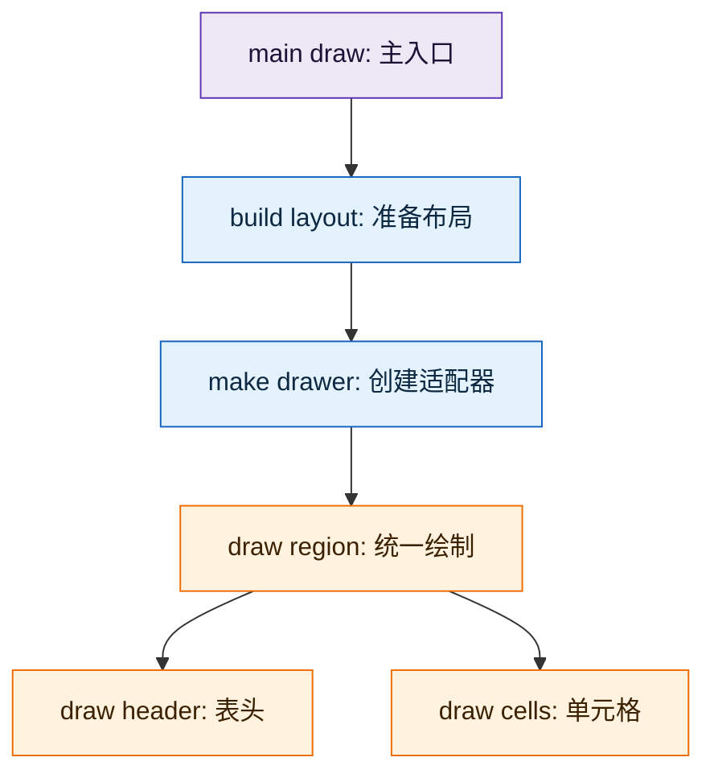

- [`spreadsheet_layout.cc` 文件详解](#spreadsheet_layoutcc-文件详解)
  - [1. 一句话定位](#1-一句话定位)
  - [2. 文件结构总览](#2-文件结构总览)
  - [3. 头文件里的核心数据结构](#3-头文件里的核心数据结构)
    - [3.1 `ColumnLayout`](#31-columnlayout)
    - [3.2 `SpreadsheetLayout`](#32-spreadsheetlayout)
    - [3.3 为什么 `row_indices` 是 `IndexMask`](#33-为什么-row_indices-是-indexmask)
  - [4. `SpreadsheetLayoutDrawer` 的角色](#4-spreadsheetlayoutdrawer-的角色)
  - [5. 构造函数做了什么](#5-构造函数做了什么)
  - [6. `draw_top_row_cell()`](#6-draw_top_row_cell)
    - [6.1 `uiDefIconTextBut()`](#61-uideficontextbut)
    - [6.2 `button_func_tooltip_set()`](#62-button_func_tooltip_set)
    - [6.3 为什么这里混用了这么多风格](#63-为什么这里混用了这么多风格)
    - [6.4 这些类型和函数各自解决什么](#64-这些类型和函数各自解决什么)
    - [6.5 为什么居中对齐是禁用左右对齐](#65-为什么居中对齐是禁用左右对齐)
  - [7. `draw_left_column_cell()`](#7-draw_left_column_cell)
  - [8. `draw_content_cell()`](#8-draw_content_cell)
    - [8.1 `GVArray`](#81-gvarray)
    - [8.2 `CPPType`](#82-cpptype)
    - [8.3 `BUFFER_FOR_CPP_TYPE_VALUE(type, buffer)`](#83-buffer_for_cpp_type_valuetype-buffer)
    - [8.4 `data.get_to_uninitialized(real_index, buffer)`](#84-dataget_to_uninitializedreal_index-buffer)
    - [8.5 `GPointer`](#85-gpointer)
    - [8.6 为什么最后 `type.destruct(buffer)`](#86-为什么最后-typedestructbuffer)
  - [9. `draw_content_cell_value()` 的类型分发](#9-draw_content_cell_value-的类型分发)
    - [9.1 为什么是一串 `type.is<T>()`](#91-为什么是一串-typeist)
  - [10. 各种值类型如何被画出来](#10-各种值类型如何被画出来)
    - [10.1 整数](#101-整数)
    - [10.2 `int8_t`](#102-int8_t)
    - [10.3 整数向量](#103-整数向量)
    - [10.4 浮点数](#104-浮点数)
    - [10.5 浮点向量](#105-浮点向量)
    - [10.6 颜色](#106-颜色)
    - [10.7 四元数](#107-四元数)
    - [10.8 矩阵](#108-矩阵)
    - [10.9 Instance Reference](#109-instance-reference)
    - [10.10 字符串](#1010-字符串)
    - [10.11 Bundle / SocketValueVariant](#1011-bundle--socketvaluevariant)
  - [11. `format_matrix_to_grid()`](#11-format_matrix_to_grid)
  - [12. 几个 helper 函数](#12-几个-helper-函数)
    - [12.1 `draw_float_vector()`](#121-draw_float_vector)
    - [12.2 `draw_int()`](#122-draw_int)
    - [12.3 `draw_int_vector()`](#123-draw_int_vector)
    - [12.4 `draw_byte_color()`](#124-draw_byte_color)
    - [12.5 `draw_float4x4()`](#125-draw_float4x4)
    - [12.6 `draw_undrawable()`](#126-draw_undrawable)
  - [13. 列宽估算模板 `estimate_max_column_width<T>()`](#13-列宽估算模板-estimate_max_column_widtht)
    - [13.1 它依赖哪些模板/泛型类型](#131-它依赖哪些模板泛型类型)
      - [`template<typename T>`](#templatetypename-t)
      - [`VArray<T>`](#varrayt)
      - [`FunctionRef<std::string(const T &)>`](#functionrefstdstringconst-t-)
      - [`std::optional<int64_t>`](#stdoptionalint64_t)
    - [13.2 它的流程](#132-它的流程)
  - [14. `ColumnValues::fit_column_values_width_px()`](#14-columnvaluesfit_column_values_width_px)
    - [14.1 为什么根据 `eSpreadsheetColumnValueType` 分支](#141-为什么根据-espreadsheetcolumnvaluetype-分支)
  - [15. `ColumnValues::fit_column_width_px()`](#15-columnvaluesfit_column_width_px)
  - [16. `spreadsheet_drawer_from_layout()`](#16-spreadsheet_drawer_from_layout)
  - [17. 文件级调用链](#17-文件级调用链)
  - [18. 这个文件用到的重要外部函数/类](#18-这个文件用到的重要外部函数类)
    - [18.1 UI 相关](#181-ui-相关)
    - [18.2 字体测量](#182-字体测量)
    - [18.3 字符串格式化](#183-字符串格式化)
    - [18.4 类型系统](#184-类型系统)
    - [18.5 Blender 数据类型](#185-blender-数据类型)
  - [19. 为什么这个文件同时负责“画 cell”和“估算列宽”](#19-为什么这个文件同时负责画-cell和估算列宽)
  - [20. 这个文件最值得学的设计思想](#20-这个文件最值得学的设计思想)
    - [20.1 适配器模式](#201-适配器模式)
    - [20.2 运行时类型分发](#202-运行时类型分发)
    - [20.3 模板复用](#203-模板复用)
    - [20.4 UI 复用](#204-ui-复用)
    - [20.5 复杂类型降级显示](#205-复杂类型降级显示)
  - [21. 当前设计评价](#21-当前设计评价)
    - [21.1 优点](#211-优点)
    - [21.2 缺点和阅读成本](#212-缺点和阅读成本)
    - [21.3 如果要重构，可以怎么想](#213-如果要重构可以怎么想)
  - [22. 一句话总结](#22-一句话总结)


# `spreadsheet_layout.cc` 文件详解

这份文档专门讲：

- [spreadsheet_layout.cc](E:/blender-git/blender/source/blender/editors/space_spreadsheet/spreadsheet_layout.cc)
- [spreadsheet_layout.hh](E:/blender-git/blender/source/blender/editors/space_spreadsheet/spreadsheet_layout.hh)

目标是回答：

1. 这个文件在 Spreadsheet 子系统里负责什么
2. 各种函数之间是什么依赖关系
3. `SpreadsheetLayoutDrawer` 为什么继承 `SpreadsheetDrawer`
4. 里面用到的 `GVArray`、`CPPType`、`GPointer`、`VArray<T>`、`Span<T>`、`FunctionRef`、`ColorGeometry4f/4b` 等类型是什么角色
5. 为什么这个文件一边画 cell，一边又负责估算列宽

---

## 1. 一句话定位

`spreadsheet_layout.cc` 的职责可以概括成：

> 把已经准备好的 `SpreadsheetLayout` 适配成可绘制的 `SpreadsheetDrawer`，并提供各种 cell 值类型的 UI 展示逻辑，同时实现 `ColumnValues` 的自动列宽估算。

它不是负责创建数据源的文件，也不是负责整体 region 绘制顺序的文件。

它处在这个位置：



---

## 2. 文件结构总览

这个文件大致分成 4 块：

1. 辅助格式化函数
2. `SpreadsheetLayoutDrawer` 类
3. 列宽估算模板和 `ColumnValues` 成员函数实现
4. `spreadsheet_drawer_from_layout()` 工厂函数



---

## 3. 头文件里的核心数据结构

先看 [spreadsheet_layout.hh](E:/blender-git/blender/source/blender/editors/space_spreadsheet/spreadsheet_layout.hh)。

### 3.1 `ColumnLayout`

```cpp
struct ColumnLayout {
  const ColumnValues *values;
  int width;
};
```

它代表一列的布局结果：

- `values`：这一列显示什么数据
- `width`：这一列最终多宽

注意：它不拥有 `ColumnValues`，只是保存指针。

### 3.2 `SpreadsheetLayout`

```cpp
struct SpreadsheetLayout {
  Vector<ColumnLayout> columns;
  IndexMask row_indices;
  int index_column_width = 100;
};
```

它代表这一帧 spreadsheet 的布局结果：

- `columns`：所有可见列及其宽度
- `row_indices`：当前可见行到真实数据行的映射
- `index_column_width`：左侧索引列宽度

### 3.3 为什么 `row_indices` 是 `IndexMask`

`IndexMask` 很适合表达：

> 不是所有行都显示，只显示过滤/筛选后的某些行。

比如经过筛选后，屏幕第 0 行可能对应真实数据第 12 行。

所以 `row_indices[row_index]` 的作用就是：

> 把“布局行号”转换成“真实数据索引”。

---

## 4. `SpreadsheetLayoutDrawer` 的角色

定义位置：

- [spreadsheet_layout.cc:79](E:/blender-git/blender/source/blender/editors/space_spreadsheet/spreadsheet_layout.cc#L79)

```cpp
class SpreadsheetLayoutDrawer : public SpreadsheetDrawer {
 private:
  const SpreadsheetLayout &spreadsheet_layout_;
```

它的核心角色是：

> 把 `SpreadsheetLayout` 适配成 `SpreadsheetDrawer` 这个通用绘制接口。

`draw_spreadsheet_in_region()` 不直接认识 `SpreadsheetLayout`，它只认识 `SpreadsheetDrawer`。

所以这里用了继承：



---

## 5. 构造函数做了什么

```cpp
SpreadsheetLayoutDrawer(const SpreadsheetLayout &spreadsheet_layout)
    : spreadsheet_layout_(spreadsheet_layout)
{
  tot_columns = spreadsheet_layout.columns.size();
  tot_rows = spreadsheet_layout.row_indices.size();
  left_column_width = spreadsheet_layout.index_column_width;
}
```

它把 layout 里的几个结果填到基类 `SpreadsheetDrawer` 的通用字段里：

- 总列数
- 总可见行数
- 左侧索引列宽度

一句话：

> 构造函数负责把 layout 的静态结果同步到绘制协议字段上。

---

## 6. `draw_top_row_cell()`

位置：

- [spreadsheet_layout.cc:92](E:/blender-git/blender/source/blender/editors/space_spreadsheet/spreadsheet_layout.cc#L92)

它负责画表头单元格。

流程是：

1. 从 `spreadsheet_layout_.columns[column_index].values` 取 `ColumnValues`
2. 取列名 `values.name()`
3. 用 `uiDefIconTextBut()` 创建一个 `ButtonType::Label`
4. 设置 tooltip
5. 禁用左/右对齐，让表头居中



### 6.1 `uiDefIconTextBut()`

它创建的是 Blender UI button。

这里用 `ButtonType::Label`，说明它不是可编辑控件，只是显示文本。

### 6.2 `button_func_tooltip_set()`

这里给表头加 tooltip：

- 如果有 description，就显示 name + description
- 如果没有 description，就只显示 name

这里用了 `MEM_new<std::string>` 保存 tooltip 参数，并用 `MEM_delete` 释放。

### 6.3 为什么这里混用了这么多风格

这段代码看起来像把好几种时代的 C++ 写法放在一起：

```cpp
const StringRefNull name = values.name();
std::string description = values.description().is_empty() ?
                              std::string(name) :
                              fmt::format("{}\n{}", name, values.description());
button_func_tooltip_set(
    but,
    [](bContext * /*C*/, void *arg, StringRef /*tip*/) {
      return *static_cast<std::string *>(arg);
    },
    MEM_new<std::string>(__func__, std::move(description)),
    [](void *arg) { MEM_delete(static_cast<std::string *>(arg)); });
```

原因不是作者随意混搭，而是 **Spreadsheet 这层在写现代 C++，但 Blender UI 底层仍然保留很多 C 风格回调接口**。

所以这里同时出现了：

- `StringRefNull`：Blender 自己的轻量字符串引用。
- `std::string`：标准库的拥有型字符串。
- `fmt::format`：现代 C++ 的格式化方式。
- `MEM_new` / `MEM_delete`：Blender 自己的内存分配和调试系统。
- `void *arg`：老式 C 回调常用的“用户数据指针”。
- `static_cast`：从 `void *` 恢复成真实 C++ 类型。
- Lambda：现代 C++ 写法，用来把小回调就地写出来。

可以把它理解成一个桥接层：



### 6.4 这些类型和函数各自解决什么

`StringRefNull` 是“借用字符串”，不是拥有字符串。它很像 `std::string_view`，但额外强调字符串以 `\0` 结尾，适合传给很多历史 C/C++ API。这里的 `name` 来自 `ColumnValues`，通常不需要复制。

`std::string description` 是“拥有字符串”。tooltip 可能是 `name`，也可能是 `name + 换行 + description`。拼接后的结果需要真实存储，所以用 `std::string`。

`std::move(description)` 表示把局部字符串的内容转移给堆上的 `std::string`。这样可以避免再复制一份较长的 tooltip 文本。

`MEM_new<std::string>(__func__, std::move(description))` 做两件事：

- 在 Blender 的内存系统里分配一个 `std::string`。
- 把局部 `description` 移动进去，让 tooltip 回调在当前函数返回后还能访问它。

为什么不能直接传局部变量地址？因为 `draw_top_row_cell()` 返回后，局部变量 `description` 就销毁了。tooltip 是以后鼠标悬停时才可能被调用，所以必须把数据放到更长生命周期的位置。

`void *arg` 是 C API 常见设计：回调系统不关心你传入什么类型，只保存一个“无类型指针”。这让 UI 系统可以服务很多不同场景，但代价是调用方要自己恢复类型。

`static_cast<std::string *>(arg)` 就是在说：“我知道这个 `void *` 实际上是 `std::string *`，现在把它转回来。”

`*static_cast<std::string *>(arg)` 前面的 `*` 是解引用。实际意思是：

```cpp
std::string *description_ptr = static_cast<std::string *>(arg);
return *description_ptr;
```

`MEM_delete(static_cast<std::string *>(arg))` 和 `MEM_new` 配对使用。它不仅释放内存，也会调用 `std::string` 的析构函数。

生命周期可以这样看：



### 6.5 为什么禁用 `BUT_TEXT_LEFT` 后会居中

代码是：

```cpp
button_drawflag_disable(but, ui::BUT_TEXT_LEFT);
button_drawflag_disable(but, ui::BUT_TEXT_RIGHT);
```

看起来反直觉：为什么不是直接 `set center`？

原因是 Blender 的很多 UI 绘制选项不是“枚举三选一”，而是“位标志”。也就是说，一个按钮上可能有很多 draw flag，每个 flag 表示一种绘制偏好。

在这种模型里，居中不一定需要一个单独的 `BUT_TEXT_CENTER`。更常见的表达是：

- 有 `BUT_TEXT_LEFT`：强制左对齐。
- 有 `BUT_TEXT_RIGHT`：强制右对齐。
- 左右都没有：走默认对齐逻辑，这里就是居中。

这里要注意一个细节：对刚创建出来的很多 label button 来说，默认通常带有左对齐倾向，而没有右对齐 flag。也就是说，很多时候仅仅这一行就足够让文本变成居中：

```cpp
button_drawflag_disable(but, ui::BUT_TEXT_LEFT);
```

你在 `draw_byte_color()`、`create_realize_on_domain_button()` 附近看到的就是这种写法：

```cpp
/* Center alignment. */
button_drawflag_disable(but, ui::BUT_TEXT_LEFT);
```

表头这里额外再清一次 `BUT_TEXT_RIGHT`，更像防御式写法：

```text
清掉左对齐
如果存在右对齐，也清掉右对齐
剩下的默认状态就是居中
```

所以更准确地说：

- `button_drawflag_disable(but, ui::BUT_TEXT_LEFT)`：在没有 `BUT_TEXT_RIGHT` 的情况下，会回到居中。
- `button_drawflag_enable(but, ui::BUT_TEXT_RIGHT)` 加上清掉 `BUT_TEXT_LEFT`：才是明确右对齐。
- 同时清掉 `BUT_TEXT_LEFT` 和 `BUT_TEXT_RIGHT`：是明确保证居中，不依赖之前有没有右对齐 flag。

这样设计的好处是避免互斥 flag 同时存在。例如如果有 `set center`，还要考虑旧的 left/right flag 是否清理干净。现在直接清掉左右，更符合这个 UI 系统原有的状态模型。

这里也能学到一个 Blender 代码阅读技巧：看到 `enable/disable flag` 时，不要马上套用“现代属性 setter”的直觉。它经常是在操作一组历史位标志，默认值本身也有语义。

---

## 7. `draw_left_column_cell()`

位置：

- [spreadsheet_layout.cc:121](E:/blender-git/blender/source/blender/editors/space_spreadsheet/spreadsheet_layout.cc#L121)

它负责画左侧索引列。

核心逻辑：

```cpp
const int real_index = spreadsheet_layout_.row_indices[row_index];
std::string index_str = std::to_string(real_index);
```

这里的重点是：

> 左侧显示的是真实数据索引，不是屏幕上的第几行。

然后它创建 label button，并设置右对齐。

为什么右对齐？

> 行号列右对齐更像传统表格，也更容易比较位数。

---

## 8. `draw_content_cell()`

位置：

- [spreadsheet_layout.cc:140](E:/blender-git/blender/source/blender/editors/space_spreadsheet/spreadsheet_layout.cc#L140)

这是内容单元格的入口。

核心流程：

```cpp
const int real_index = spreadsheet_layout_.row_indices[row_index];
const ColumnValues &column = *spreadsheet_layout_.columns[column_index].values;
const GVArray &data = column.data();
const CPPType &type = data.type();
BUFFER_FOR_CPP_TYPE_VALUE(type, buffer);
data.get_to_uninitialized(real_index, buffer);
this->draw_content_cell_value(GPointer(type, buffer), params, column);
type.destruct(buffer);
```

这段是整个文件里最重要的“泛型值读取”逻辑。

### 8.1 `GVArray`

`GVArray` 是 generic virtual array。

你可以理解成：

> 一个运行时类型已知、但 C++ 编译期类型不固定的数组视图。

Spreadsheet 的列可能是：

- int
- float
- bool
- float3
- string
- Object *
- SocketValueVariant

所以不能只用 `VArray<int>` 或 `VArray<float>`。

### 8.2 `CPPType`

`CPPType` 表示运行时的 C++ 类型信息。

它能回答：

- 这一列元素到底是什么 C++ 类型
- 如何构造/析构这个类型的值
- 如何把 buffer 解释成具体类型

### 8.3 `BUFFER_FOR_CPP_TYPE_VALUE(type, buffer)`

它创建一块足够容纳该类型值的临时栈缓冲区。

因为此时编译器不知道具体类型，只能通过 `CPPType` 来分配合适大小的临时空间。

### 8.4 `data.get_to_uninitialized(real_index, buffer)`

从 `GVArray` 里取真实数据行 `real_index` 的值，并写到这块未初始化 buffer 里。

### 8.5 `GPointer`

```cpp
GPointer(type, buffer)
```

可以理解成：

> 一个“带运行时类型信息的 void 指针”。

它把：

- `CPPType`
- 原始内存地址

绑定在一起，后面就能判断类型并安全地取值。

### 8.6 为什么最后 `type.destruct(buffer)`

因为 buffer 里可能放的是非平凡类型，比如：

- `std::string`
- `MStringProperty`
- `bke::SocketValueVariant`

所以取出来画完后，要通过 `CPPType` 正确析构。

---

## 9. `draw_content_cell_value()` 的类型分发

位置：

- [spreadsheet_layout.cc:156](E:/blender-git/blender/source/blender/editors/space_spreadsheet/spreadsheet_layout.cc#L156)

这个函数根据运行时类型选择具体绘制方式。

大致可以分成几组：



### 9.1 为什么是一串 `type.is<T>()`

因为 `GPointer` 只有运行时类型信息。

所以这里通过：

```cpp
if (type.is<int>()) { ... }
if (type.is<float3>()) { ... }
```

手动把运行时类型重新分派到具体 C++ 类型。

这是一种“运行时类型分发”。

---

## 10. 各种值类型如何被画出来

### 10.1 整数

`int`、`int64_t` 走 `draw_int()`。

它会根据 `ColumnValueDisplayHint` 决定：

- 普通整数格式
- 字节单位格式

并且右对齐。

### 10.2 `int8_t`

直接转字符串并右对齐。

### 10.3 整数向量

`short2`、`int2`、`int3` 走 `draw_int_vector()`。

它会把 cell 宽度均分成多个 segment，每个分量一个 label。

### 10.4 浮点数

`float` 使用固定 3 位小数显示，并且 tooltip 里显示更完整的 `{:f}`。

### 10.5 浮点向量

`float2`、`float3`、`float4` 走 `draw_float_vector()`。

同样把单元格分成多个 segment。

### 10.6 颜色

- `ColorGeometry4f`：当作 4 个 float 分量显示
- `ColorGeometry4b`：先 decode 成 float 显示，同时 tooltip 显示原始 byte 值

### 10.7 四元数

`math::Quaternion` 转成 `float4`，然后按 4 个 float 分量显示。

### 10.8 矩阵

`float4x4` 不是直接在单元格里展开显示。

它显示为 `...`，并在 tooltip 中用 `format_matrix_to_grid()` 展示完整矩阵。

### 10.9 Instance Reference

`bke::InstanceReference` 会显示：

- 对应 icon
- instance 名称

如果名称为空，显示翻译后的 `(Geometry)`。

### 10.10 字符串

`std::string` 和 `MStringProperty` 都显示为文本 label。

区别是：

- `std::string` 可以直接引用
- `MStringProperty` 需要复制到 heap，用 tooltip 生命周期管理

### 10.11 Bundle / SocketValueVariant

`nodes::BundleItemValue` 如果里面是 socket value，就取出 `bke::SocketValueVariant` 继续递归绘制。

`bke::SocketValueVariant` 如果是 single value，也递归绘制单值。

否则显示 `...`。

这体现了一个思想：

> 复杂包装类型最终会尽量拆回一个基础值类型来复用已有绘制逻辑。

---

## 11. `format_matrix_to_grid()`

位置：

- [spreadsheet_layout.cc:42](E:/blender-git/blender/source/blender/editors/space_spreadsheet/spreadsheet_layout.cc#L42)

它负责把 `float4x4` 格式化成 tooltip 里的 4x4 文本表格。

关键点：

- 小于 `1e-4` 的值用较短格式
- 其他值用较高精度
- 先 transpose，这样能按行输出
- 根据每列最大宽度做右对齐
- 用 `fmt::memory_buffer` 高效拼字符串

它不是核心绘制函数，但让矩阵 tooltip 更可读。

---

## 12. 几个 helper 函数

### 12.1 `draw_float_vector()`

把一个 float span 分成多个 segment，每个分量一个 label。

用到：

- `Span<float>`
- `std::stringstream`
- `uiDefIconTextBut`
- `button_func_tooltip_set`

### 12.2 `draw_int()`

根据 display hint 格式化整数。

用到：

- `BLI_str_format_byte_unit`
- `BLI_str_format_int64_grouped`
- tooltip 回调

### 12.3 `draw_int_vector()`

和 `draw_float_vector()` 类似，只是整数格式化更简单。

### 12.4 `draw_byte_color()`

把 `ColorGeometry4b` decode 成 `ColorGeometry4f` 显示，同时 tooltip 显示 byte 原值。

这里用了一个小技巧：

```cpp
POINTER_FROM_UINT(*(uint32_t *)&color)
```

把 4 个 byte 编码进一个指针参数，避免额外 heap allocation。

这是底层 UI 回调里常见的“为了少分配内存而写得不太直观”的代码。

### 12.5 `draw_float4x4()`

单元格里只显示 `...`，tooltip 显示完整矩阵。

### 12.6 `draw_undrawable()`

统一显示 `...`。

用于：

- 复杂类型
- 多值 socket variant
- 无法直接展示的类型

---

## 13. 列宽估算模板 `estimate_max_column_width<T>()`

位置：

- [spreadsheet_layout.cc:591](E:/blender-git/blender/source/blender/editors/space_spreadsheet/spreadsheet_layout.cc#L591)

签名：

```cpp
template<typename T>
static float estimate_max_column_width(
    float min_width,
    int fontid,
    std::optional<int64_t> max_sample_size,
    const VArray<T> &data,
    FunctionRef<std::string(const T &)> to_string)
```

它是一个通用列宽估算器。

### 13.1 它依赖哪些模板/泛型类型

#### `template<typename T>`

让它能支持：

- `int`
- `float`
- `float3`
- `std::string`
- `ColorGeometry4f`
- `bke::InstanceReference`

#### `VArray<T>`

这是 typed virtual array。

和 `GVArray` 不同，`VArray<T>` 的元素类型在编译期已知。

这里用于：

> 在已经知道列类型后，用强类型方式遍历值。

#### `FunctionRef<std::string(const T &)>`

这是轻量非拥有函数引用。

它接收一个“如何把 T 转成字符串”的函数或 lambda。

这里的好处是：

> 列宽估算逻辑通用，具体格式化逻辑外部传进来。

#### `std::optional<int64_t>`

用于限制最大采样数量。

如果表格有几十万行，不应该为了算列宽遍历所有行。

### 13.2 它的流程



---

## 14. `ColumnValues::fit_column_values_width_px()`

位置：

- [spreadsheet_layout.cc:612](E:/blender-git/blender/source/blender/editors/space_spreadsheet/spreadsheet_layout.cc#L612)

它负责估算“只看列值”的合适宽度。

流程：

1. 获取默认字体 `BLF_default()`
2. 设置字体大小 `BLF_size(...)`
3. 根据 `ColumnValues::type()` 得到 spreadsheet column value type
4. 对不同类型调用 `estimate_max_column_width<T>()`
5. 对固定宽度类型直接返回固定值

### 14.1 为什么根据 `eSpreadsheetColumnValueType` 分支

因为不同类型的显示宽度规则不同：

- bool 只显示 checkbox，固定宽度
- float4x4 只显示 `...`，固定宽度
- float3 通常需要 3 个数
- color 需要 4 个分量
- instance 还要额外加 icon 宽度

所以不能用一个简单通用规则解决全部类型。

---

## 15. `ColumnValues::fit_column_width_px()`

位置：

- [spreadsheet_layout.cc:790](E:/blender-git/blender/source/blender/editors/space_spreadsheet/spreadsheet_layout.cc#L790)

这个函数比 `fit_column_values_width_px()` 多考虑列名。

计算方式：

```cpp
data_width_px = fit_column_values_width_px(max_sample_size);
name_width_px = BLF_width(fontid, name_.data(), name_.size());
width_px = max(min_width, padding + max(data_width_px, name_width_px));
```

也就是说最终列宽要同时满足：

- 列名放得下
- 数据值放得下
- 至少有最小宽度
- 留一点 padding

---

## 16. `spreadsheet_drawer_from_layout()`

位置：

- [spreadsheet_layout.cc:805](E:/blender-git/blender/source/blender/editors/space_spreadsheet/spreadsheet_layout.cc#L805)

```cpp
std::unique_ptr<SpreadsheetDrawer> spreadsheet_drawer_from_layout(
    const SpreadsheetLayout &spreadsheet_layout)
{
  return std::make_unique<SpreadsheetLayoutDrawer>(spreadsheet_layout);
}
```

它是一个小工厂函数。

它的意义是：

> 对外只暴露 `SpreadsheetDrawer`，隐藏具体实现类 `SpreadsheetLayoutDrawer`。

这让 `spreadsheet_draw.cc` 可以只依赖抽象绘制接口。

---

## 17. 文件级调用链

从主入口看，它是这样被使用的：



---

## 18. 这个文件用到的重要外部函数/类

### 18.1 UI 相关

- `uiDefIconTextBut`
- `button_drawflag_enable`
- `button_drawflag_disable`
- `button_func_tooltip_set`
- `button_func_tooltip_custom_set`
- `tooltip_text_field_add`

这些都用于创建和配置 UI button。

### 18.2 字体测量

- `BLF_default`
- `BLF_size`
- `BLF_width`

用于根据真实字体计算列宽。

### 18.3 字符串格式化

- `fmt::format`
- `fmt::memory_buffer`
- `std::stringstream`
- `BLI_str_format_int64_grouped`
- `BLI_str_format_byte_unit`

用于把各种数值转成最终显示字符串。

### 18.4 类型系统

- `GVArray`
- `VArray<T>`
- `CPPType`
- `GPointer`
- `BUFFER_FOR_CPP_TYPE_VALUE`

这是本文件能处理“任意列值类型”的基础。

### 18.5 Blender 数据类型

- `bke::InstanceReference`
- `bke::SocketValueVariant`
- `nodes::BundleItemValue`
- `Object *`
- `MStringProperty`

这些是 Spreadsheet 需要展示的复杂数据。

---

## 19. 为什么这个文件同时负责“画 cell”和“估算列宽”

因为这两件事共享同一个核心问题：

> 某个列值类型最终会显示成什么文本/图标，它需要多宽？

例如：

- `float3` 显示 3 个小数
- `ColorGeometry4f` 显示 4 个分量
- `InstanceReference` 显示 icon + name
- `float4x4` 不展开，只显示 `...`

显示策略和列宽策略必须尽量一致。

所以把“值怎么显示”和“值大概需要多宽”放在同一个文件里，是有现实理由的。

---

## 20. 这个文件最值得学的设计思想

### 20.1 适配器模式

`SpreadsheetLayoutDrawer` 把 `SpreadsheetLayout` 适配成 `SpreadsheetDrawer`。

### 20.2 运行时类型分发

`GVArray + CPPType + GPointer` 让列值可以在运行时决定类型，再分发到具体绘制逻辑。

### 20.3 模板复用

`estimate_max_column_width<T>()` 把列宽估算通用流程抽出来，具体类型只提供 `to_string`。

### 20.4 UI 复用

单元格不是手写字体绘制，而是创建 `ui::Button::Label`，复用 Blender UI 系统。

### 20.5 复杂类型降级显示

矩阵、复杂 socket、多值 variant 等不适合直接展开，就显示 `...`，再用 tooltip 或 fallback 表达更多信息。

---

## 21. 当前设计评价

### 21.1 优点

这个文件最大的优点是 **显示规则集中**。一个值怎么画、怎么转字符串、列宽大概要多宽，基本都能在这里找到。对 Spreadsheet 这种“按列显示很多动态类型”的 UI 来说，这种集中策略很实用。

第二个优点是 **适配边界清楚**。`draw_spreadsheet_in_region()` 只认识 `SpreadsheetDrawer`，不需要知道 `SpreadsheetLayout` 的内部结构。`SpreadsheetLayoutDrawer` 负责把布局结果适配成绘制接口，这让通用表格绘制和具体数据布局保持了解耦。

第三个优点是 **性能和通用性折中得比较稳**。外层用 `GVArray + CPPType + GPointer` 支持运行时类型；列宽估算时又转回 `VArray<T>` 和模板函数，避免所有地方都走无类型 buffer。

第四个优点是 **复用 Blender UI 系统**。单元格文字大量使用 `ui::Button::Label`，不用自己实现文本裁剪、tooltip、主题色、交互状态。这对大型软件很重要。

### 21.2 缺点和阅读成本

缺点也很明显：**职责有点多**。这个文件既做布局适配，又做单元格绘制，又做值格式化，又做列宽估算。新读者会感觉它不是单一主题文件，而是“表格值显示策略中心”。

第二个问题是 **类型分发比较长**。`draw_content_cell_value()` 里大量 `type.is<T>()` 分支很直接，但随着支持类型增加，会越来越像一张手写 dispatch 表。优点是清楚，缺点是啰嗦。

第三个问题是 **显示和测宽存在重复知识**。例如 `float3` 如何格式化，在绘制和列宽估算中都要保持一致。虽然放在同一文件降低了发散风险，但仍然需要人工维护一致。

第四个问题是 **C++ 风格混合明显**。这里同时有现代 C++、Blender BLI 类型、老 UI callback、手动 buffer 生命周期。对学习者来说，难点不只是业务逻辑，而是要理解 Blender 的历史层级。

### 21.3 如果要重构，可以怎么想

一个可能的重构方向是把“值显示策略”抽成表驱动结构，例如每种类型对应：

- 如何画 cell。
- 如何格式化文本。
- 如何估算列宽。
- 是否需要图标。
- 默认对齐方式。

但这不一定绝对更好。表驱动会让扩展更规整，却可能让简单直接的 C++ 分支变得间接，调试时还要跳更多层。

另一个方向是把列宽估算和绘制拆成两个文件。不过它们共享“显示格式”知识，拆开后必须设计更强的公共格式化层，否则容易出现“画出来是 A，测宽按 B 算”的不一致。

所以当前设计可以评价为：

> 它不是最纯粹的单一职责设计，但很符合 Blender 这种大型 C++ 工程的现实：把强相关的显示策略集中在一个地方，用适配器连接通用绘制框架，用运行时类型系统处理动态列值。

---

## 22. 一句话总结

`spreadsheet_layout.cc` 是 Spreadsheet 的“布局到 UI 单元格显示”的适配层：它拿 `SpreadsheetLayout` 和 `ColumnValues`，通过 `SpreadsheetLayoutDrawer` 实现 `SpreadsheetDrawer` 接口，把不同运行时类型的列值转换成 Blender UI `Button`，同时用同一套显示规则估算列宽，最终服务于 `draw_spreadsheet_in_region()` 的通用表格绘制流程。
