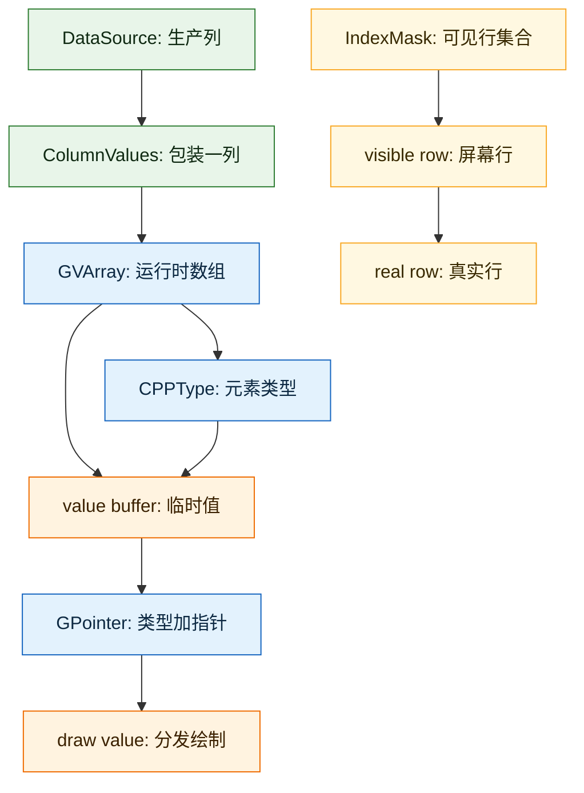
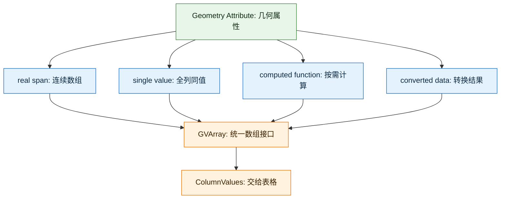
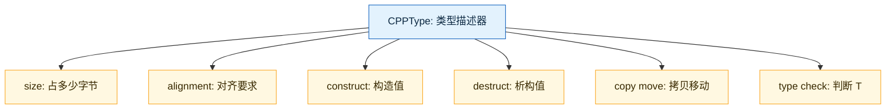
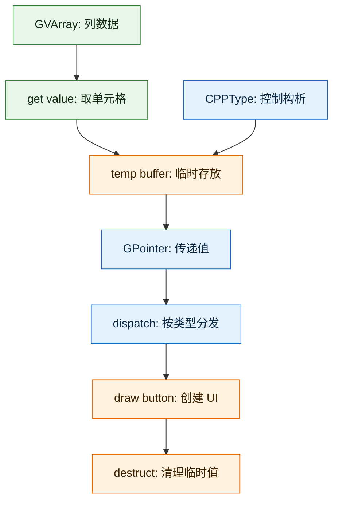
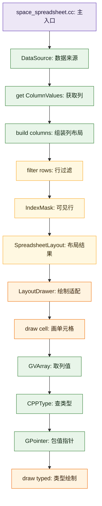
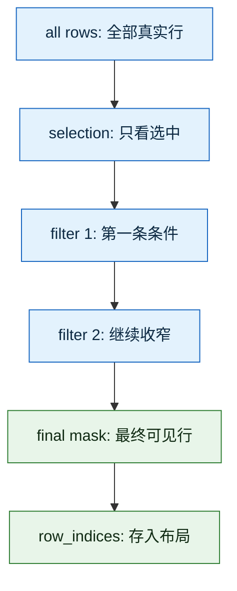
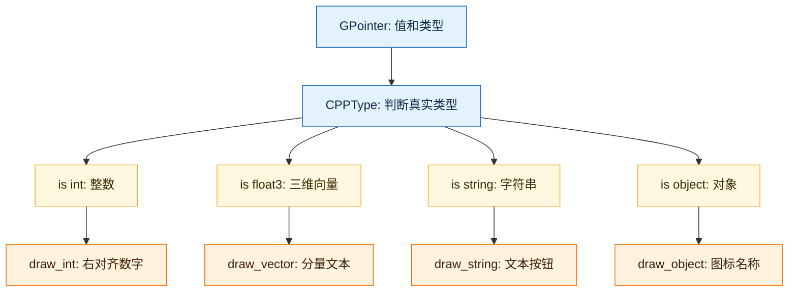

# ColumnValues、GVArray、CPPType、GPointer、IndexMask 关系详解

这篇文档专门解释 Spreadsheet 绘制链路里最容易卡住的 5 个类型：

- `ColumnValues`
- `GVArray`
- `CPPType`
- `GPointer`
- `IndexMask`

它们分布在两个层级：

- `ColumnValues` 是 Spreadsheet 编辑器自己的“列数据包装”。
- `GVArray`、`CPPType`、`GPointer`、`IndexMask` 是 Blender 基础库 `BLI` 提供的通用工具。

这 5 个类型合在一起，解决的是一个问题：

> Spreadsheet 不知道每一列具体是什么 C++ 类型，但它仍然要能过滤、估算宽度、按行取值、画成 UI。

---

## 1. 一张图先看整体关系



一句话版本：

> `ColumnValues` 拿着一列 `GVArray`；`GVArray` 用 `CPPType` 描述元素类型；绘制单个格子时把值取到临时 buffer，再用 `GPointer` 把“类型 + 指针”传给类型分发函数；`IndexMask` 决定屏幕第几行对应真实数据第几行。

---

## 2. `ColumnValues`：Spreadsheet 眼里的“一列”

源码位置：

- [spreadsheet_column_values.hh](E:/blender-git/blender/source/blender/editors/space_spreadsheet/spreadsheet_column_values.hh)

核心定义：

```cpp
class ColumnValues final {
 protected:
  std::string name_;
  std::string description_;

  GVArray data_;
  ColumnValueDisplayHint display_hint_;
```

它代表 Spreadsheet 的一列，包含：

- `name_`：列名，比如 `Position`、`Name`、`.viewer`。
- `description_`：列说明，通常用于表头 tooltip。
- `data_`：这一列的所有行值，类型是 `GVArray`。
- `display_hint_`：显示提示，比如整数是否按 `Bytes` 显示。

### 2.1 为什么它不直接用 `Vector<T>`

因为 Spreadsheet 的列类型非常多：

- `bool`
- `int`
- `int64_t`
- `float`
- `float2`
- `float3`
- `ColorGeometry4f`
- `std::string`
- `MStringProperty`
- `bke::SocketValueVariant`
- `bke::InstanceReference`

如果 `ColumnValues` 写成模板：

```cpp
template<typename T>
class ColumnValues {
  VArray<T> data_;
};
```

那么外层代码就必须到处带着 `T`。但 Spreadsheet 的列是在运行时从属性系统、几何组件、实例数据里动态拿出来的，编译期根本不知道每一列是什么类型。

所以它用：

```cpp
GVArray data_;
```

`GVArray` 的意思是：

> 一列数组，但元素类型只在运行时知道。

### 2.2 `ColumnValues` 的关键接口

```cpp
eSpreadsheetColumnValueType type() const
{
  return cpp_type_to_column_type(data_.type());
}
```

这里把底层 C++ 类型转成 Spreadsheet UI 能理解的列类型，比如：

- `float3` -> `SPREADSHEET_VALUE_TYPE_FLOAT3`
- `int` -> `SPREADSHEET_VALUE_TYPE_INT32`
- `std::string` -> `SPREADSHEET_VALUE_TYPE_STRING`

```cpp
const GVArray &data() const
{
  return data_;
}
```

这让布局、过滤、绘制代码可以继续访问底层数组。

---

## 3. `GVArray`：运行时类型的虚拟数组

源码位置：

- [BLI_generic_virtual_array.hh](E:/blender-git/blender/source/blender/blenlib/BLI_generic_virtual_array.hh)

注释里说得很直接：

> A generic virtual array is the same as a virtual array, except for the fact that the data type is only known at runtime.

中文理解：

> `GVArray` 是“泛型版虚拟数组”。它像数组，但不要求真实数据一定连续存放，也不要求元素类型在编译期已知。

### 3.1 `GVArray` 能包装哪些数据

`GVArray` 可以来自：

- 一个真实连续内存片段，比如 `Span<T>`。
- 一个单一值，比如整列都是同一个值。
- 一个函数，比如根据 index 临时算出值。
- 一个普通 `VArray<T>`。
- 一个 `GArray`。

源码里有这些构造入口：

```cpp
static GVArray from_single(...);
static GVArray from_span(GSpan span);
static GVArray from_garray(GArray<> array);
template<typename GetToUninitFn>
static GVArray from_func(...);
```

这对 Spreadsheet 很重要，因为几何属性可能来自不同存储方式：



### 3.2 在当前文件夹里的典型来源

位置：

- [spreadsheet_data_source_geometry.cc](E:/blender-git/blender/source/blender/editors/space_spreadsheet/spreadsheet_data_source_geometry.cc)

几何属性列：

```cpp
bke::GAttributeReader attribute = attributes->lookup(column_id.name);
GVArray varray = std::move(attribute.varray);
return std::make_unique<ColumnValues>(column_display_name, std::move(varray), description);
```

实例列：

```cpp
return std::make_unique<ColumnValues>(
    column_id.name,
    VArray<float3>::from_std_func(domain_num, [transforms](int64_t index) {
      return transforms[index].location();
    }));
```

注意这里传进去的是 `VArray<float3>`，但 `ColumnValues` 构造函数接收的是 `GVArray`。这是因为 `GVArray` 可以从 `VArray<T>` 转换而来。

### 3.3 `GVArray` 的关键能力

```cpp
const CPPType &type() const;
int64_t size() const;
void get_to_uninitialized(int64_t index, void *r_value) const;
template<typename T> VArray<T> typed() const;
bool is_single() const;
bool is_span() const;
```

这些接口分别用于：

- `type()`：告诉外面元素的真实 C++ 类型。
- `size()`：这一列有多少行。
- `get_to_uninitialized()`：把某一行的值构造到临时内存。
- `typed<T>()`：当代码确认类型是 `T` 后，转回 `VArray<T>`。
- `is_single()`：整列是否都是同一个值。
- `is_span()`：底层是否是连续数组。

---

## 4. `CPPType`：运行时 C++ 类型描述器

源码位置：

- [BLI_cpp_type.hh](E:/blender-git/blender/source/blender/blenlib/BLI_cpp_type.hh)

它的核心作用是：

> 在运行时描述一个 C++ 类型，并提供构造、析构、复制、移动、比较、打印等操作。

可以把它看成 Blender 自己的增强版 `std::type_info`。

`std::type_info` 主要能告诉你“这是什么类型”。  
`CPPType` 不只知道类型，还知道怎么操作这个类型。

### 4.1 `CPPType` 里有什么

源码里保存了：

```cpp
int64_t size;
int64_t alignment;
bool is_trivial;
bool is_trivially_destructible;
```

还保存了很多函数指针：

```cpp
void (*default_construct_)(void *ptr);
void (*destruct_)(void *ptr);
void (*copy_construct_)(const void *src, void *dst);
void (*move_construct_)(void *src, void *dst);
```

这就是为什么它能处理“运行时才知道的类型”。



### 4.2 在 Spreadsheet 里怎么用

在绘制单元格时：

```cpp
const GVArray &data = column.data();
const CPPType &type = data.type();
BUFFER_FOR_CPP_TYPE_VALUE(type, buffer);
data.get_to_uninitialized(real_index, buffer);
this->draw_content_cell_value(GPointer(type, buffer), params, column);
type.destruct(buffer);
```

这里 `CPPType` 负责三件关键事：

- 告诉 `BUFFER_FOR_CPP_TYPE_VALUE` 这个值要多大、怎么对齐。
- 帮 `GVArray` 知道如何把值构造到 buffer。
- 画完以后调用 `type.destruct(buffer)` 正确析构。

为什么一定要析构？

因为 cell 值可能是非平凡类型，比如：

- `std::string`
- `MStringProperty`
- `bke::SocketValueVariant`

这些类型不能只靠释放一段内存结束，必须调用析构函数。

### 4.3 `type.is<T>()`

在 `draw_content_cell_value()` 里会看到大量代码：

```cpp
if (type.is<int>()) {
  this->draw_int(params, *value_ptr.get<int>(), column.display_hint());
  return;
}
```

这就是运行时类型分发：

> 先用 `CPPType` 判断真实类型，再用 `GPointer::get<T>()` 取出对应 C++ 类型的值。

---

## 5. `GPointer`：类型 + 指针的轻量组合

源码位置：

- [BLI_generic_pointer.hh](E:/blender-git/blender/source/blender/blenlib/BLI_generic_pointer.hh)

核心定义可以简化理解为：

```cpp
class GPointer {
 private:
  const CPPType *type_ = nullptr;
  const void *data_ = nullptr;
};
```

它不拥有数据，只是临时指向一个值。

### 5.1 为什么不用 `void *`

如果只传 `void *`，函数只知道“这里有一段内存”，不知道它是什么类型。

`GPointer` 同时带着：

- `const void *data_`：值在哪里。
- `const CPPType *type_`：值是什么类型。

所以它是一个更安全、更有表达力的 `void *`。

### 5.2 在当前绘制代码里的生命周期



`GPointer` 指向的是临时 buffer，所以它不能保存到函数外面长期使用。

它适合这种短流程：

1. 从 `GVArray` 取一个 cell 值。
2. 用 `GPointer` 包一下。
3. 立刻进入 `draw_content_cell_value()`。
4. 绘制完成后析构 buffer。

---

## 6. `IndexMask`：可见行到真实行的映射

源码位置：

- [BLI_index_mask.hh](E:/blender-git/blender/source/blender/blenlib/BLI_index_mask.hh)

源码注释说：

> An IndexMask is a sequence of unique and sorted indices.

中文理解：

> `IndexMask` 是一组唯一、排序后的索引，常用来表达“只处理哪些元素”。

在 Spreadsheet 中，它主要表达：

> 当前表格显示哪些真实数据行。

### 6.1 为什么不用 `Vector<int>`

可以用 `Vector<int>` 表示过滤后的行号，但 `IndexMask` 更适合 Blender 这种大数据场景：

- 空过滤时 `IndexMask(tot_rows)` 可以 O(1) 表示完整范围。
- 支持高效切片。
- 支持按 segment 迭代。
- 大量连续范围时比普通数组更紧凑。
- 能和 Blender 的并行处理、属性系统配合。

内部实现上，它把索引拆成 segment：

- 每个 segment 最多 `16384` 个索引。
- segment 内索引用 `int16_t` 存。
- 每个 segment 再有一个 `int64_t` offset。

这让它既能表达大索引，又能减少内存占用。

### 6.2 在 Spreadsheet 里的使用

`SpreadsheetLayout` 保存：

```cpp
struct SpreadsheetLayout {
  Vector<ColumnLayout> columns;
  IndexMask row_indices;
  int index_column_width = 100;
};
```

`row_indices` 的意义是：

```text
屏幕第 row_index 行 -> 真实数据第 row_indices[row_index] 行
```

绘制内容格子时：

```cpp
const int real_index = spreadsheet_layout_.row_indices[row_index];
const ColumnValues &column = *spreadsheet_layout_.columns[column_index].values;
```

左边索引列也用它：

```cpp
const int real_index = spreadsheet_layout_.row_indices[row_index];
std::string index_str = std::to_string(real_index);
```

所以左侧显示的不是“屏幕第几行”，而是“真实数据索引”。

---

## 7. 它们在当前文件夹里的完整调用链

从主绘制入口看：



对应源码位置：

- [space_spreadsheet.cc](E:/blender-git/blender/source/blender/editors/space_spreadsheet/space_spreadsheet.cc)
- [spreadsheet_data_source_geometry.cc](E:/blender-git/blender/source/blender/editors/space_spreadsheet/spreadsheet_data_source_geometry.cc)
- [spreadsheet_layout.hh](E:/blender-git/blender/source/blender/editors/space_spreadsheet/spreadsheet_layout.hh)
- [spreadsheet_layout.cc](E:/blender-git/blender/source/blender/editors/space_spreadsheet/spreadsheet_layout.cc)
- [spreadsheet_row_filter.cc](E:/blender-git/blender/source/blender/editors/space_spreadsheet/spreadsheet_row_filter.cc)

---

## 8. 主入口如何创建 `ColumnValues`

位置：

- [space_spreadsheet.cc](E:/blender-git/blender/source/blender/editors/space_spreadsheet/space_spreadsheet.cc)

核心流程：

```cpp
for (SpreadsheetColumn *column : Span{table->columns, table->num_columns}) {
  std::unique_ptr<ColumnValues> values_ptr = data_source->get_column_values(*column->id);
  if (!values_ptr) {
    continue;
  }
  const ColumnValues *values = scope.add(std::move(values_ptr));
  const eSpreadsheetColumnValueType column_type = values->type();
  spreadsheet_layout.columns.append({values, width_in_pixels});
}
```

这里有几个重点：

- `DataSource` 负责创建 `ColumnValues`。
- `ResourceScope` 负责持有这些 `ColumnValues` 的生命周期。
- `SpreadsheetLayout` 只保存 `const ColumnValues *`，不拥有列数据。
- `ColumnValues::type()` 用于同步 UI 列类型。
- `ColumnValues::fit_column_width_px()` 用于自动列宽。

---

## 9. 几何数据源如何生成 `GVArray`

位置：

- [spreadsheet_data_source_geometry.cc](E:/blender-git/blender/source/blender/editors/space_spreadsheet/spreadsheet_data_source_geometry.cc)

普通属性列：

```cpp
bke::GAttributeReader attribute = attributes->lookup(column_id.name);
GVArray varray = std::move(attribute.varray);
return std::make_unique<ColumnValues>(column_display_name, std::move(varray), description);
```

这里属性系统已经返回了 `GVArray`。

特殊实例列：

```cpp
return std::make_unique<ColumnValues>(
    column_id.name,
    VArray<float3>::from_std_func(domain_num, [transforms](int64_t index) {
      return transforms[index].location();
    }));
```

这里没有真实的 `Position` 属性数组，而是从 transform 临时计算位置。`VArray<float3>::from_std_func()` 让这列看起来像数组。

这就是 `VArray/GVArray` 的价值：

> 不管数据是真实存储、单值、还是按需计算，Spreadsheet 都能用同一种方式读取。

---

## 10. 行过滤如何使用 `IndexMask`

位置：

- [spreadsheet_row_filter.cc](E:/blender-git/blender/source/blender/editors/space_spreadsheet/spreadsheet_row_filter.cc)

没有过滤时：

```cpp
if (!(use_filters || use_selection)) {
  return IndexMask(tot_rows);
}
```

这表示显示 `[0, tot_rows)` 的全部行。

有过滤时：

```cpp
mask = apply_row_filter(row_filter, columns, mask, scope.allocator());
```

每个过滤器都会基于上一个 `mask` 再过滤一次。

具体过滤操作：

```cpp
return IndexMask::from_predicate(
    mask, memory, [&](const int64_t i) { return check_fn(data[i]); });
```

意思是：

> 只在当前 mask 指定的真实行里检查条件，通过的行组成新的 mask。



---

## 11. 单元格绘制时 5 个类型如何配合

位置：

- [spreadsheet_layout.cc](E:/blender-git/blender/source/blender/editors/space_spreadsheet/spreadsheet_layout.cc)

核心代码：

```cpp
const int real_index = spreadsheet_layout_.row_indices[row_index];
const ColumnValues &column = *spreadsheet_layout_.columns[column_index].values;

const GVArray &data = column.data();
const CPPType &type = data.type();
BUFFER_FOR_CPP_TYPE_VALUE(type, buffer);
data.get_to_uninitialized(real_index, buffer);
this->draw_content_cell_value(GPointer(type, buffer), params, column);
type.destruct(buffer);
```

逐行解释：

1. `row_indices[row_index]`：屏幕行号转真实行号。
2. `columns[column_index].values`：找到这一列的 `ColumnValues`。
3. `column.data()`：拿到底层 `GVArray`。
4. `data.type()`：拿到元素 `CPPType`。
5. `BUFFER_FOR_CPP_TYPE_VALUE(type, buffer)`：按运行时类型创建临时 buffer。
6. `data.get_to_uninitialized(real_index, buffer)`：把真实行的值构造到 buffer。
7. `GPointer(type, buffer)`：把“类型 + 值地址”打包。
8. `draw_content_cell_value()`：根据类型分发到不同绘制函数。
9. `type.destruct(buffer)`：正确析构临时值。

---

## 12. 为什么 `GVArray` 取值要用 buffer

因为 `GVArray` 的元素类型运行时才知道。

如果是普通模板代码，可以写：

```cpp
float3 value = data[index];
```

但 `GVArray` 不知道元素是 `float3`、`std::string` 还是 `ColorGeometry4f`，所以只能让调用方准备一块内存：

```cpp
BUFFER_FOR_CPP_TYPE_VALUE(type, buffer);
data.get_to_uninitialized(index, buffer);
```

`CPPType` 告诉这块内存：

- 需要多大。
- 需要什么对齐。
- 构造后怎么析构。

这就是典型的“类型擦除”设计。

---

## 13. 类型分发：从运行时类型回到具体绘制函数

`draw_content_cell_value()` 里是这样分发的：

```cpp
const CPPType &type = *value_ptr.type();
if (type.is<int>()) {
  this->draw_int(params, *value_ptr.get<int>(), column.display_hint());
  return;
}
```

通用流程：



这是一种折中：

- 外层用 `GVArray + CPPType` 保持通用。
- 真正绘制时再回到具体类型，获得更好的格式化和 UI 表现。

---

## 14. 自动列宽如何使用 `GVArray` 和 `CPPType`

位置：

- [spreadsheet_layout.cc](E:/blender-git/blender/source/blender/editors/space_spreadsheet/spreadsheet_layout.cc)

`ColumnValues::fit_column_values_width_px()` 先看列类型：

```cpp
const eSpreadsheetColumnValueType column_type = this->type();
switch (column_type) {
  case SPREADSHEET_VALUE_TYPE_FLOAT3: {
    return estimate_max_column_width<float3>(
        ...,
        data_.typed<float3>(),
        [](const float3 value) {
          return fmt::format("{:.3f}  {:.3f}  {:.3f}", value.x, value.y, value.z);
        });
  }
}
```

这里做了两步：

1. `this->type()`：用 `CPPType` 转成 spreadsheet 列类型。
2. `data_.typed<float3>()`：确认类型后，把 `GVArray` 转成 `VArray<float3>`。

为什么要转回 `VArray<T>`？

因为列宽估算要高频读取很多值。转成 typed array 后，代码可以写成普通模板：

```cpp
for (const int i : data.index_range().take_front(sample_size)) {
  const std::string str = to_string(data[i]);
}
```

这比每次都走 `void * buffer + CPPType` 更清晰。

---

## 15. 五个类型的职责边界

| 类型 | 属于哪里 | 是否拥有数据 | 主要职责 |
|---|---|---:|---|
| `ColumnValues` | Spreadsheet | 拥有 `GVArray`，不一定拥有底层真实数据 | 表示一列，包括名字、说明、数据、显示提示 |
| `GVArray` | BLI | 可能拥有实现，也可能引用外部数据 | 运行时类型的虚拟数组 |
| `CPPType` | BLI | 不拥有具体值 | 描述运行时 C++ 类型，并提供构造/析构等操作 |
| `GPointer` | BLI | 不拥有数据 | 临时携带“类型 + 指针” |
| `IndexMask` | BLI | 不拥有复杂 mask 内存，复杂情况依赖 allocator | 表达有序索引子集，Spreadsheet 中表示可见真实行 |

---

## 16. 为什么这样设计

### 16.1 Spreadsheet 需要面对“动态类型”

几何属性不是固定 schema。不同对象、不同节点、不同 viewer 可能产生完全不同的列。

所以 Spreadsheet 不能写死：

```cpp
Vector<float3> positions;
Vector<float> radii;
Vector<std::string> names;
```

它需要一种统一抽象：

```cpp
ColumnValues {
  GVArray data;
}
```

### 16.2 运行时通用，局部再恢复类型

整体结构是：

```text
通用存储: ColumnValues + GVArray + CPPType
局部绘制: type.is<T>() + GPointer::get<T>()
```

这样既不会让整个 Spreadsheet 变成模板海洋，又能在绘制时针对不同类型做精细表现。

### 16.3 `IndexMask` 把过滤和绘制解耦

过滤代码只负责产生：

```cpp
IndexMask row_indices;
```

绘制代码只关心：

```cpp
real_index = row_indices[row_index];
```

这让“哪些行可见”和“如何画一行”分开。

---

## 17. 最值得学的思想

### 17.1 类型擦除

`GVArray` 和 `GPointer` 都是类型擦除思想：

> 把具体 `T` 藏起来，对外只暴露统一接口。

### 17.2 运行时类型描述

`CPPType` 说明 Blender 不只是用 C++ 模板，也构建了一套运行时类型系统。

这在编辑器、节点、属性、几何数据这种高度动态场景里非常重要。

### 17.3 虚拟数组

`GVArray` 的关键不是“数组”，而是“像数组一样访问”。

底层可以是真数组、单值、函数、转换结果。调用者不必关心。

### 17.4 索引掩码

`IndexMask` 让过滤、选择、可见性都变成“索引集合”问题。

这比到处传 `Vector<int>` 更适合大规模数据和并行处理。

### 17.5 生命周期要非常清楚

绘制单元格时：

```text
GVArray 取值 -> buffer 构造 -> GPointer 临时引用 -> 绘制 -> CPPType 析构
```

这条链路里没有一个步骤是随便的。特别是 `std::string`、`SocketValueVariant` 这种复杂值，少了 `type.destruct(buffer)` 就会出问题。

---

## 18. 当前设计评价

### 18.1 优点

这套设计最大的优点是 **非常适合动态数据**。Spreadsheet 面对的是几何属性、实例数据、节点 viewer、字符串、颜色、矩阵等多种运行时类型。`ColumnValues + GVArray + CPPType` 让这些类型可以用同一种列接口进入表格。

第二个优点是 **数据来源被统一了**。一列数据可以是真实数组、单一值、按需计算函数、属性转换结果，但到了 Spreadsheet 这里都表现成 `GVArray`。调用者只需要按 index 取值，不需要关心底层怎么存。

第三个优点是 **过滤和绘制解耦**。`IndexMask` 只表达“哪些真实行可见”，绘制阶段只做 `row_indices[row_index]` 映射。这让选择过滤、行过滤、可见行绘制可以串联，但不互相污染。

第四个优点是 **生命周期虽然显式，但可控**。`CPPType` 负责运行时构造和析构，`GPointer` 只做短生命周期的“类型 + 指针”传递。复杂值不会被当成裸字节随便复制。

### 18.2 缺点和代价

第一个代价是 **学习门槛高**。如果只熟悉普通 C++ 模板或普通数组，第一次看到 `GVArray`、`CPPType`、`GPointer`、`BUFFER_FOR_CPP_TYPE_VALUE` 会很不习惯，因为它们是在手动搭建一套运行时类型系统。

第二个代价是 **类型安全后移了**。模板代码很多错误能在编译期发现；这里大量类型判断发生在运行时。写代码的人必须保证 `type.is<T>()` 和 `get<T>()` 匹配。

第三个代价是 **单个 cell 取值流程偏重**。从 `GVArray` 取值要准备 buffer、构造值、包装 `GPointer`、绘制、再析构。它比 `data[index]` 难读，也更容易让新读者迷路。

第四个代价是 **调试链路长**。一个单元格的值可能来自属性系统、虚拟数组、运行时类型系统、过滤 mask、布局适配器、UI button。任何一层出问题，都要顺着抽象往回查。

### 18.3 为什么这些代价是值得的

如果 Spreadsheet 只显示固定表格，比如固定的 `Vector<float3> positions`，这套设计会显得过度复杂。

但 Blender 的 Spreadsheet 面对的是：

- 不同组件类型。
- 不同 attribute domain。
- 用户自定义属性名。
- 几何节点运行时 viewer 数据。
- 单值属性和真实数组混合。
- 多种复杂 C++ 值类型。

在这种场景里，普通模板或固定结构很快会失控。当前设计把复杂性压在基础抽象里：

```text
动态列数据 -> GVArray
运行时类型 -> CPPType
单值传递 -> GPointer
可见行集合 -> IndexMask
Spreadsheet 列语义 -> ColumnValues
```

所以评价可以更准确地说：

> 这套设计不是为了让简单情况最简单，而是为了让复杂、动态、可扩展的数据源仍然能被统一处理。

### 18.4 学习时的判断标准

学习这套代码时，不要先追求记住所有 API。更重要的是分清几个问题：

- 这是“一列数据”问题吗？看 `ColumnValues`。
- 这是“数组但类型未知”问题吗？看 `GVArray`。
- 这是“运行时怎么构造/析构值”问题吗？看 `CPPType`。
- 这是“单个值怎么传给绘制函数”问题吗？看 `GPointer`。
- 这是“哪些行可见”问题吗？看 `IndexMask`。

只要能按这个方式拆问题，这套抽象就不会显得那么乱。

---

## 19. 一句话总结

`ColumnValues` 是 Spreadsheet 的列抽象；`GVArray` 让列数据可以在运行时携带任意元素类型；`CPPType` 负责描述和操作这个运行时类型；`GPointer` 负责把单个 cell 值以“类型 + 指针”的形式传给绘制分发；`IndexMask` 负责把屏幕行映射到过滤后的真实数据行。
