# Blender 新增主题参数实现流程

这份文档说明一个“新的 Blender 主题参数”从提出需求到真正生效，为什么通常要改 7 到 8 个文件，以及每一层分别负责什么。

文档会以这次的实际例子为主：

- 目标控件：3D 视图里，N 面板折叠后边缘显示的小 tab 和箭头
- 目标改造：把原本硬编码的颜色改成主题可配置
- 最终方案：新增两个全局共享的主题参数
  - `region_toggle`：折叠标记背景
  - `region_toggle_text`：折叠标记箭头

---

## 1. 先理解问题本质

“新增一个主题参数”在 Blender 里，不只是多加一个颜色字段。

它通常意味着同时满足下面几件事：

- 要能存进用户偏好数据
- 要能被主题 UI 编辑
- 要能被运行时绘制代码统一读取
- 要有默认值
- 老用户已有的偏好文件升级后不能丢值

所以它本质上是一条完整的数据链路，而不是单点修改。

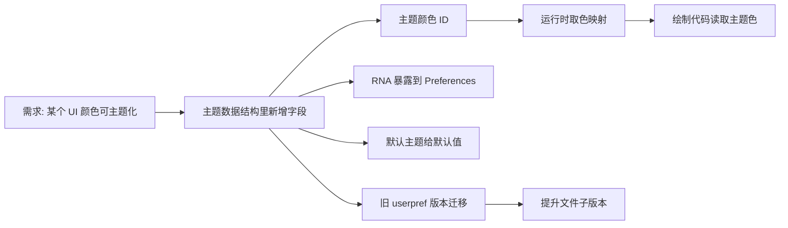

---

## 2. 这次的原始代码在哪

这次对应的折叠标记，不是 N 面板自己画的，而是“隐藏 region 的通用 action zone”。

核心绘制代码在：

- [source/blender/editors/screen/area.cc](/E:/blender-git/blender/source/blender/editors/screen/area.cc:189)
- [source/blender/editors/screen/area.cc](/E:/blender-git/blender/source/blender/editors/screen/area.cc:245)

原本这里是硬编码颜色：

- 箭头：`immUniformColor4f(0.8f, 0.8f, 0.8f, 0.4f);`
- 背景：`{0.05f, 0.05f, 0.05f, alpha}`

3D 视图的 N 面板本体注册在：

- [source/blender/editors/space_view3d/space_view3d.cc](/E:/blender-git/blender/source/blender/editors/space_view3d/space_view3d.cc:243)

它本质上只是一个：

- `RGN_TYPE_UI`
- `RGN_ALIGN_RIGHT`
- 默认 `RGN_FLAG_HIDDEN`

然后 `area.cc` 会为隐藏 region 建立 action zone，小 tab 就在那里被画出来。

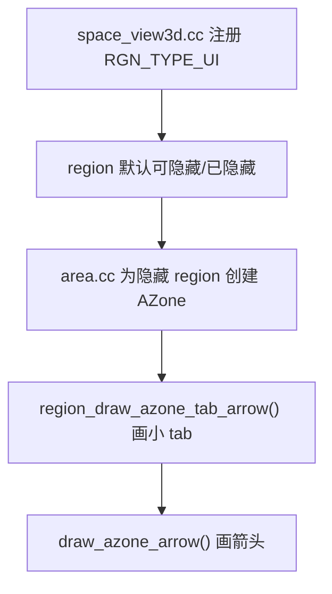

---

## 3. 为什么不能只改绘制代码

如果只是为了本地临时验证效果，当然可以只在 `area.cc` 改颜色。

但如果目标是“让主题系统可配置”，只改绘制代码不够，因为：

- 颜色没有地方持久化
- Preferences 里没有入口
- 默认主题没有值
- 老用户主题升级后新字段会是零值

所以 Blender 里一个正式的主题参数通常要穿过这些层：

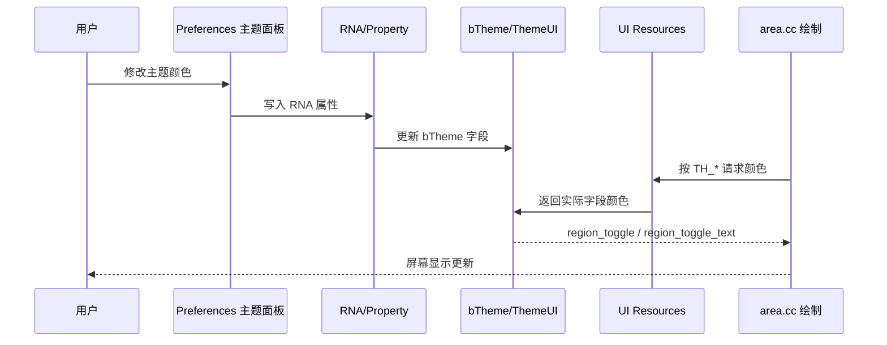

---

## 4. 这次最终选的是“共享两个主题参数”

我们中间其实有过两个设计方向。

### 方案 A：每个编辑器空间各自一份

把颜色加到 `ThemeSpace` 里。

优点：

- 每个空间都能单独配不同颜色

缺点：

- 每个 `space_*` 都有一份字段
- 默认主题要给很多 space 都补值
- userdef 迁移要给很多 space 都补值
- 改动面会明显膨胀

### 方案 B：全局共享两项

把颜色加到 `ThemeUI` 里。

优点：

- 语义更贴近这个控件本身
- 所有编辑器共用
- 改动范围更小
- 配置界面更干净

缺点：

- 不能给 3D 视图和别的编辑器单独设不同颜色

这次最后采用的是方案 B。

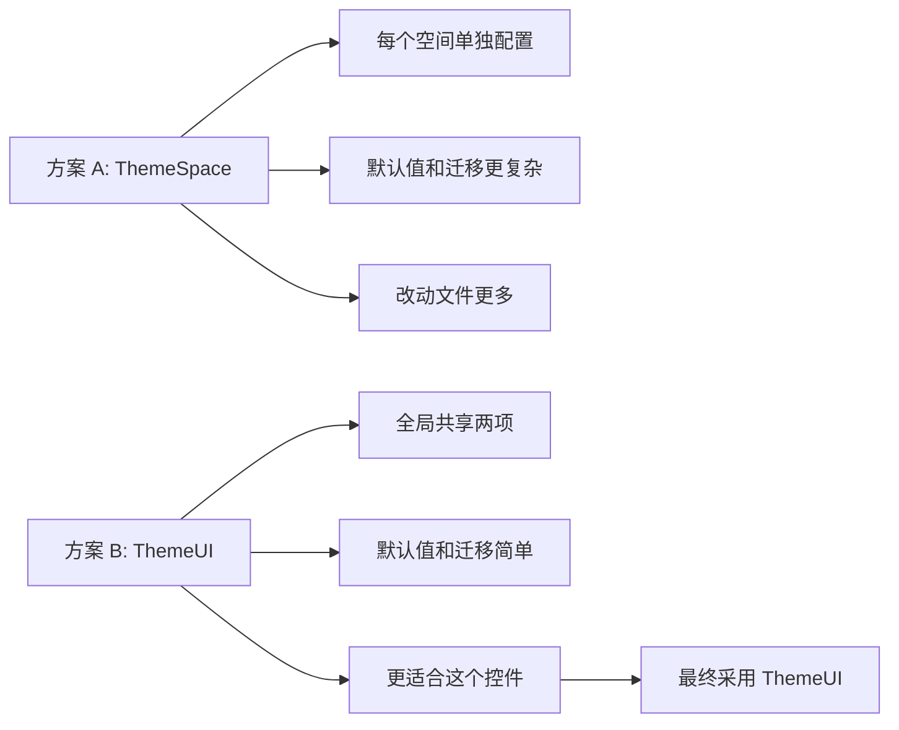

---

## 5. 实现链路详解

下面按实际代码流逐层说明。

## 5.1 数据层：在主题结构体里加字段

文件：

- [source/blender/makesdna/DNA_theme_types.h](/E:/blender-git/blender/source/blender/makesdna/DNA_theme_types.h:285)

这一步负责“存”。

新增字段放在 `ThemeUI`：

```c
unsigned char region_toggle[4];
unsigned char region_toggle_text[4];
```

为什么是这里：

- 这是全局共享 UI 参数，不是某个特定 space 的独有视觉元素
- `ThemeUI` 本来就存放偏全局的界面主题色

如果不改这里：

- 后面所有配置都没有真正落点

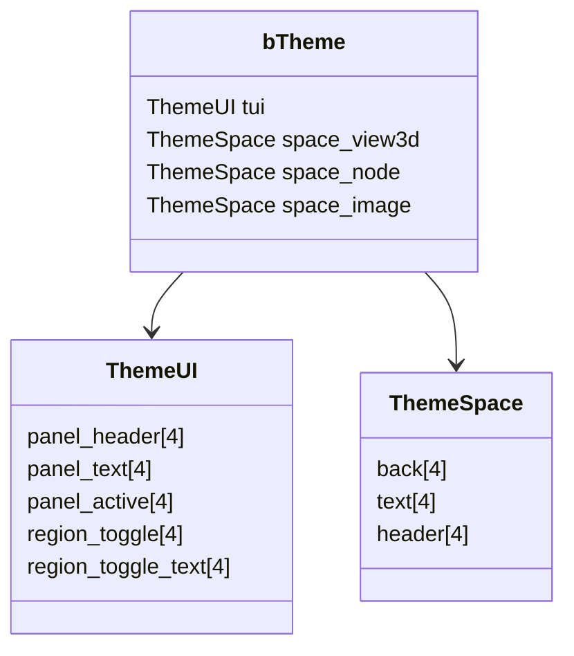

---

## 5.2 主题 ID：定义运行时统一访问入口

文件：

- [source/blender/editors/include/UI_resources.hh](/E:/blender-git/blender/source/blender/editors/include/UI_resources.hh:50)

这一步负责“给绘制代码一个统一的主题色名字”。

新增：

```c
TH_REGION_TOGGLE,
TH_REGION_TOGGLE_TEXT,
```

如果没有这一步：

- 运行时没法用 `theme::get_color_4fv(TH_...)` 这种统一接口访问

可以把它理解成“主题系统内部的颜色枚举键”。


---

## 5.3 映射层：把 TH_* 接到真实字段

文件：

- [source/blender/editors/interface/resources.cc](/E:/blender-git/blender/source/blender/editors/interface/resources.cc:123)

这一步负责“TH 枚举 -> 真实主题字段”的查表。

这次接在 `ThemeUI` 分支里：

```c
case TH_REGION_TOGGLE:
  cp = btheme->tui.region_toggle;
  break;
case TH_REGION_TOGGLE_TEXT:
  cp = btheme->tui.region_toggle_text;
  break;
```

为什么要改这里：

- `theme::get_color_*()` 最终就是走这个映射函数
- 没有映射，`TH_REGION_TOGGLE` 只是一个枚举值，拿不到真正颜色

---

## 5.4 使用层：绘制代码改为读取主题色

文件：

- [source/blender/editors/screen/area.cc](/E:/blender-git/blender/source/blender/editors/screen/area.cc:222)

这一步负责“真正把硬编码换成主题色”。

改动点有两个：

### 1. 箭头颜色

在 `draw_azone_arrow()` 里：

```c
ui::theme::get_color_4fv(TH_REGION_TOGGLE_TEXT, color);
immUniformColor4fv(color);
```

### 2. tab 背景颜色

在 `region_draw_azone_tab_arrow()` 里：

```c
ui::theme::get_color_4fv(TH_REGION_TOGGLE, color);
ui::draw_roundbox_aa(&rect, true, 4.0f, color);
```

这里还保留了 fallback：

- 如果 alpha 是 0，就退回原来的近似硬编码值

这样做的意义：

- 即使某些主题数据还没初始化完整，也不至于完全不可见

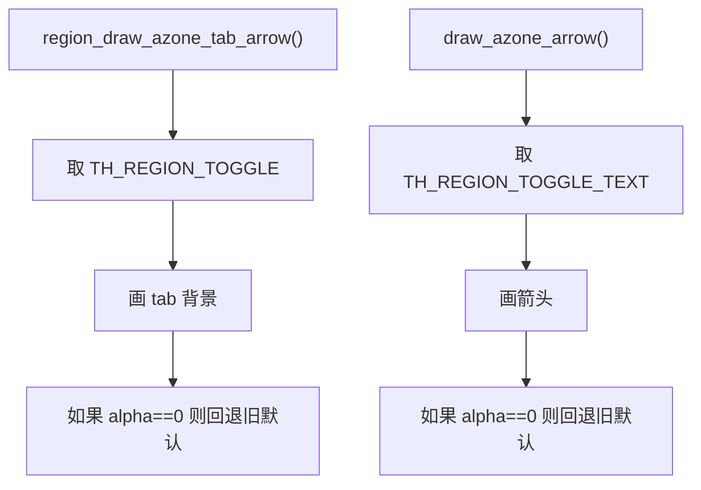

---

## 5.5 RNA 层：把参数暴露给 Preferences

文件：

- [source/blender/makesrna/intern/rna_userdef.cc](/E:/blender-git/blender/source/blender/makesrna/intern/rna_userdef.cc:2154)

这一步负责“让这个字段可以被 UI 编辑”。

新增属性：

```c
prop = RNA_def_property(srna, "region_toggle", PROP_FLOAT, PROP_COLOR_GAMMA);
prop = RNA_def_property(srna, "region_toggle_text", PROP_FLOAT, PROP_COLOR_GAMMA);
```

为什么一定要这一步：

- Blender 的 Preferences 面板不是直接硬读 struct 字段
- 主题编辑界面、属性编辑、更新通知，都是靠 RNA 定义串起来的

你可以把它理解成：

- `DNA` 是存储结构
- `RNA` 是“可编辑 API”

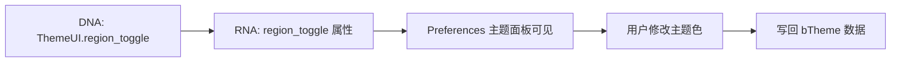

---

## 5.6 默认值：让新主题参数有初始颜色

文件：

- [release/datafiles/userdef/userdef_default_theme.c](/E:/blender-git/blender/release/datafiles/userdef/userdef_default_theme.c:285)

新增默认值：

```c
.region_toggle = RGBA(0x0d0d0d99),
.region_toggle_text = RGBA(0xcccccc66),
```

为什么要有这一步：

- 新字段如果没有默认值，很多情况下会是全 0
- 全 0 常常意味着完全透明
- 那折叠标记可能直接看不见

这一步保证：

- 新安装 Blender 的用户有稳定初始表现
- 作为迁移默认值的来源

---

## 5.7 迁移层：老用户配置升级

文件：

- [source/blender/blenloader/intern/versioning_userdef.cc](/E:/blender-git/blender/source/blender/blenloader/intern/versioning_userdef.cc:435)

新增迁移：

```c
if (!USER_VERSION_ATLEAST(502, 21)) {
  FROM_DEFAULT_V4_UCHAR(tui.region_toggle);
  FROM_DEFAULT_V4_UCHAR(tui.region_toggle_text);
}
```

为什么不能省略：

- 新用户会用默认主题
- 老用户不会自动“重新创建一份完整新主题”
- 他们已经有自己的 `userpref.blend`

如果不迁移：

- 老用户打开新版本时，这两个新字段可能还是 0
- 结果就是控件显示异常或不可见

---

## 5.8 版本号：让迁移逻辑真的被触发

文件：

- [source/blender/blenkernel/BKE_blender_version.h](/E:/blender-git/blender/source/blender/blenkernel/BKE_blender_version.h:33)

这次把：

```c
#define BLENDER_FILE_SUBVERSION 20
```

改成：

```c
#define BLENDER_FILE_SUBVERSION 21
```

原因很直接：

- `versioning_userdef.cc` 里的迁移判断是靠版本号触发的
- 你加了迁移代码，但不 bump 子版本，老配置就不会走到这段逻辑

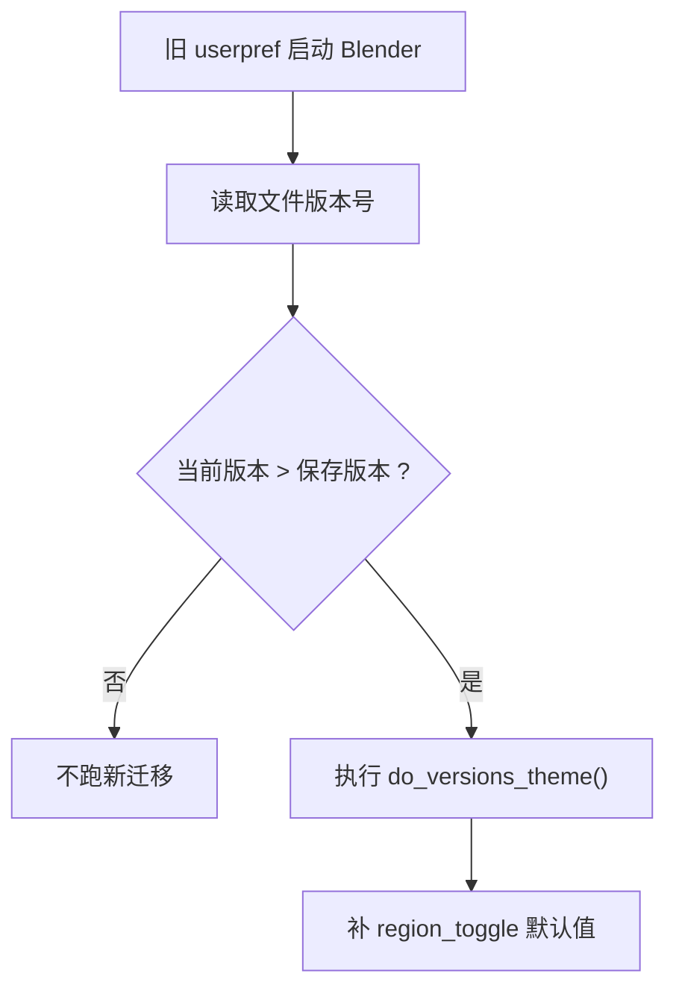

---

## 6. 为什么这次最后会改 8 个文件

这次最终的共享方案涉及：

1. `DNA_theme_types.h`
2. `UI_resources.hh`
3. `resources.cc`
4. `area.cc`
5. `rna_userdef.cc`
6. `userdef_default_theme.c`
7. `versioning_userdef.cc`
8. `BKE_blender_version.h`

这是一个“正式可提交”的最常见规模。

如果只为了本地试验，可以缩成 4 个左右：

1. `DNA_theme_types.h`
2. `UI_resources.hh`
3. `resources.cc`
4. `area.cc`

但这样会缺：

- Preferences 暴露
- 默认值
- 旧主题兼容
- 版本迁移

所以不适合正式提交。

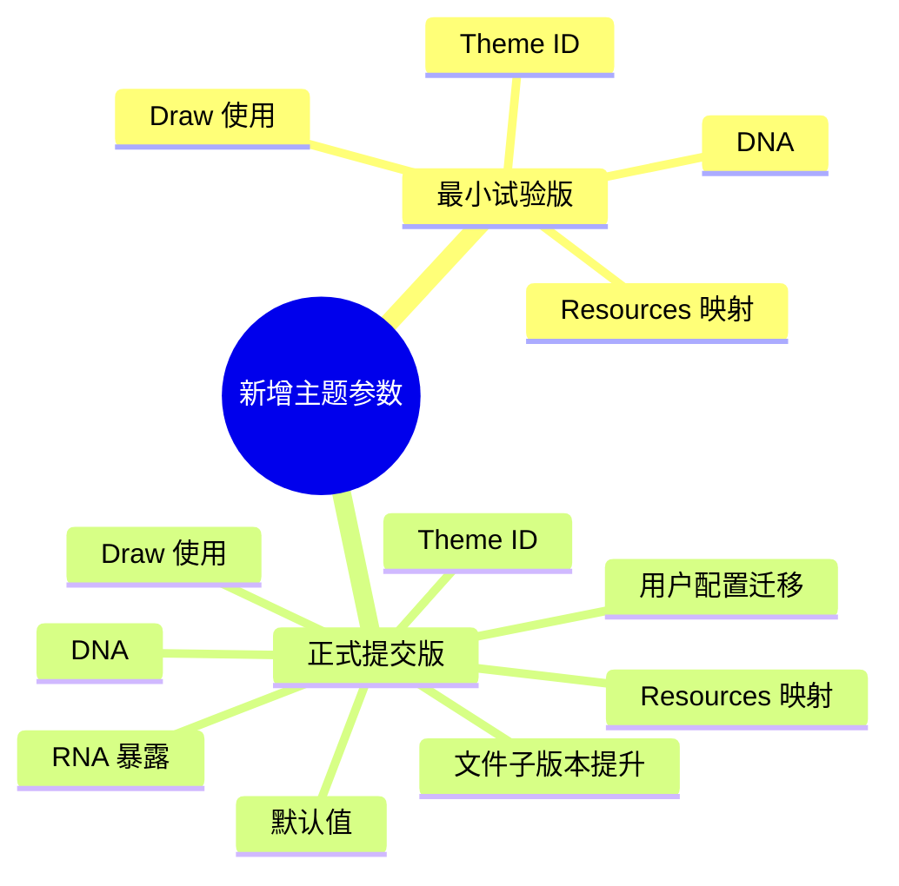

---

## 7. 这次代码的实际数据流

把这次的 `region_toggle` 例子完整串起来，大致是这样：

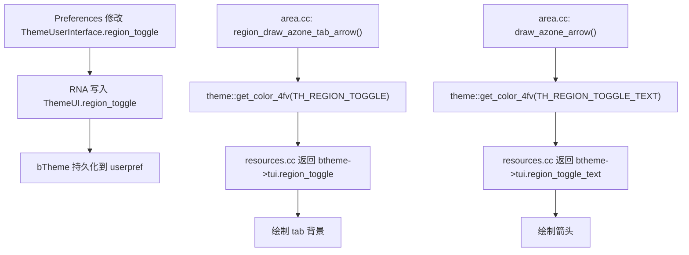

---

## 8. 几个设计判断经验

## 8.1 什么时候放 `ThemeUI`

适合：

- 全局共享的 UI 元素
- 不依赖具体编辑器空间语义
- 更像“界面控件”而不是“编辑器内容”

比如这次的隐藏 region tab，就是典型例子。

## 8.2 什么时候放 `ThemeSpace`

适合：

- 明显属于某个 space 的视觉元素
- 同一类控件在不同编辑器里可能需要不同配色
- 取色逻辑依赖 `spacetype`

例如 viewport 背景、节点背景、图编辑器曲线颜色等。

## 8.3 什么时候要新主题参数，而不是复用已有参数

优先复用已有参数的情况：

- 语义真的一致
- 用户改一个地方，期待另一个地方一起变化

应该新加参数的情况：

- 只是“颜色差不多能凑合”，但语义不同
- 复用会把两个不相干控件绑死
- 用户会因为联动而困惑

这次如果复用 `header/header_text`：

- 技术上能工作
- 但会把“折叠标记”和“真正 header”耦死
- 对亮色主题尤其容易牵一发动全身

所以最后还是新加两个参数更稳。

---

## 9. 排查主题参数不生效时看哪里

如果以后你再做类似改动，下面这个排查顺序通常最快：

1. `DNA` 字段有没有真的加进去
2. `TH_*` 枚举有没有定义
3. `resources.cc` 有没有映射到正确字段
4. 绘制代码是不是确实在取这个 `TH_*`
5. RNA 是否暴露、UI 是否可改
6. 默认主题有没有给值
7. 老配置迁移有没有补值
8. 子版本有没有 bump

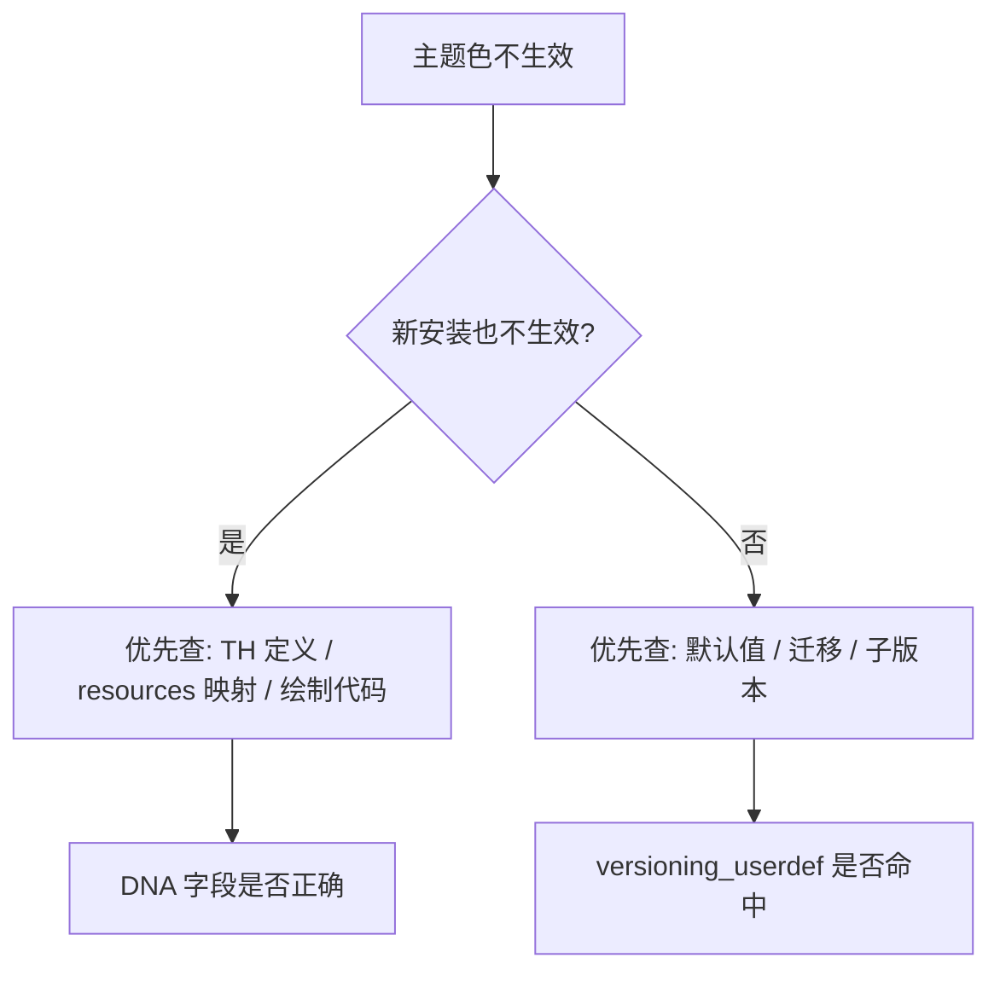

---

## 10. 这次修改涉及的关键文件索引

### 绘制相关

- [source/blender/editors/screen/area.cc](/E:/blender-git/blender/source/blender/editors/screen/area.cc:222)

### 主题 ID 与映射

- [source/blender/editors/include/UI_resources.hh](/E:/blender-git/blender/source/blender/editors/include/UI_resources.hh:50)
- [source/blender/editors/interface/resources.cc](/E:/blender-git/blender/source/blender/editors/interface/resources.cc:123)

### 存储结构

- [source/blender/makesdna/DNA_theme_types.h](/E:/blender-git/blender/source/blender/makesdna/DNA_theme_types.h:285)

### RNA 暴露

- [source/blender/makesrna/intern/rna_userdef.cc](/E:/blender-git/blender/source/blender/makesrna/intern/rna_userdef.cc:2154)

### 默认值与迁移

- [release/datafiles/userdef/userdef_default_theme.c](/E:/blender-git/blender/release/datafiles/userdef/userdef_default_theme.c:285)
- [source/blender/blenloader/intern/versioning_userdef.cc](/E:/blender-git/blender/source/blender/blenloader/intern/versioning_userdef.cc:435)
- [source/blender/blenkernel/BKE_blender_version.h](/E:/blender-git/blender/source/blender/blenkernel/BKE_blender_version.h:33)

---

## 11. 一句话总结

在 Blender 里，“新增一个主题参数”本质上不是改一个颜色，而是补齐一整条链：

`存储结构 -> 主题 ID -> 取色映射 -> 绘制使用 -> RNA 暴露 -> 默认值 -> 旧配置迁移 -> 版本号触发`

只要把这条链记住，后面再做任何主题系统改造，基本都会顺很多。
