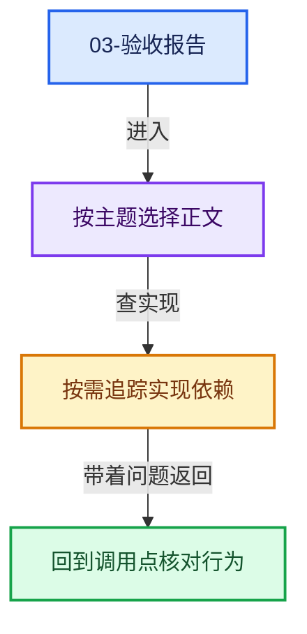
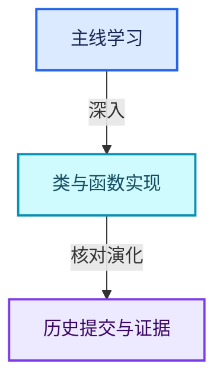

# 03-验收报告

[课程指南](../README.md)

- [验收报告](验收报告.md)
- [几何节点专题验收](../../13-几何节点专题/验收报告.md)

```mermaid
flowchart TB
  E["03-验收报告"]:::input
  Q["按主题选择正文"]:::abstraction
  S["按需追踪实现依赖"]:::compute
  R["回到调用点核对行为"]:::result
  E -->|"进入"| Q
  Q -->|"查实现"| S
  S -->|"带着问题返回"| R
  classDef input fill:#DBEAFE,stroke:#2563EB,color:#172554,stroke-width:2px;
  classDef data fill:#CFFAFE,stroke:#0891B2,color:#164E63,stroke-width:2px;
  classDef abstraction fill:#EDE9FE,stroke:#7C3AED,color:#3B0764,stroke-width:2px;
  classDef compute fill:#FEF3C7,stroke:#D97706,color:#78350F,stroke-width:2px;
  classDef result fill:#DCFCE7,stroke:#16A34A,color:#14532D,stroke-width:2px;
  classDef error fill:#FEE2E2,stroke:#DC2626,color:#7F1D1D,stroke-width:2px;
```

```mermaid
flowchart TB
  M["主线学习"]:::input
  D["类与函数实现"]:::data
  H["历史提交与证据"]:::abstraction
  M -->|"深入"| D
  D -->|"核对演化"| H
  classDef input fill:#DBEAFE,stroke:#2563EB,color:#172554,stroke-width:2px;
  classDef data fill:#CFFAFE,stroke:#0891B2,color:#164E63,stroke-width:2px;
  classDef abstraction fill:#EDE9FE,stroke:#7C3AED,color:#3B0764,stroke-width:2px;
  classDef compute fill:#FEF3C7,stroke:#D97706,color:#78350F,stroke-width:2px;
  classDef result fill:#DCFCE7,stroke:#16A34A,color:#14532D,stroke-width:2px;
  classDef error fill:#FEE2E2,stroke:#DC2626,color:#7F1D1D,stroke-width:2px;
```
