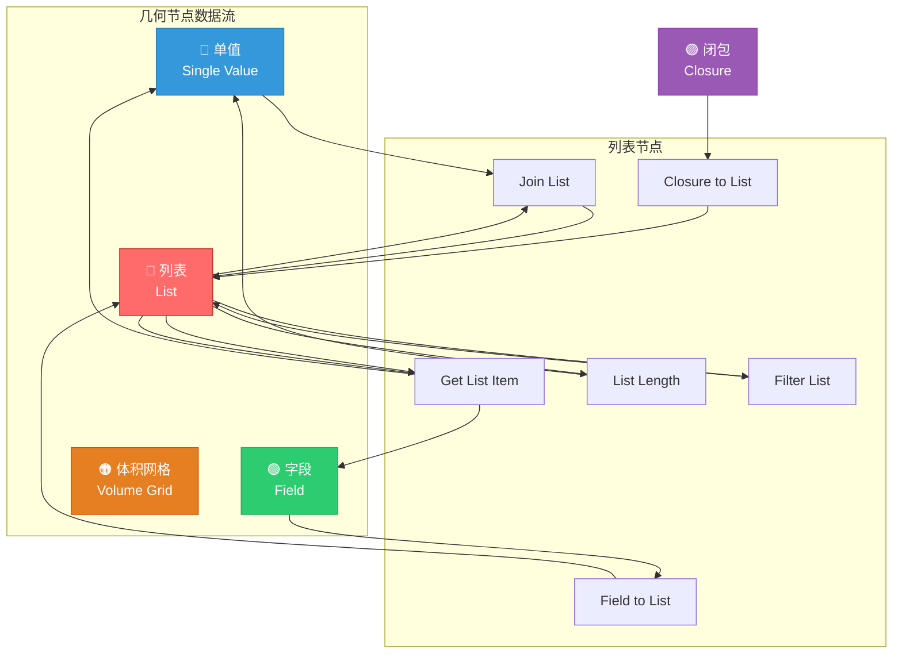
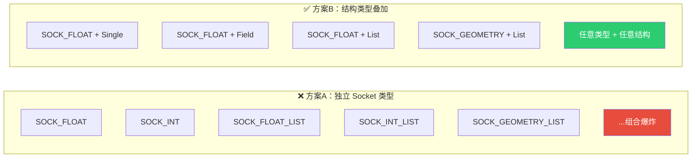
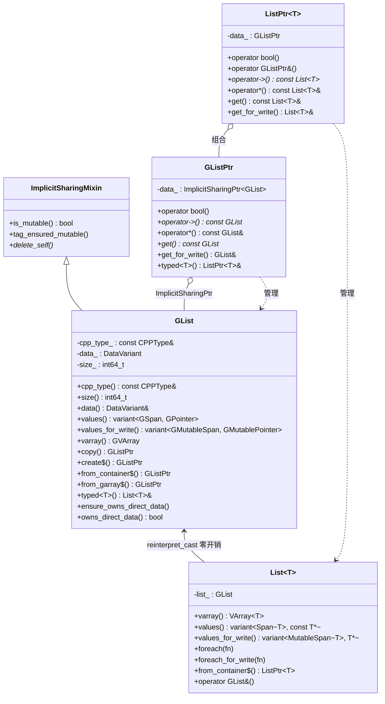
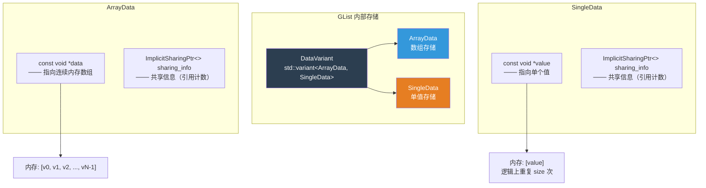
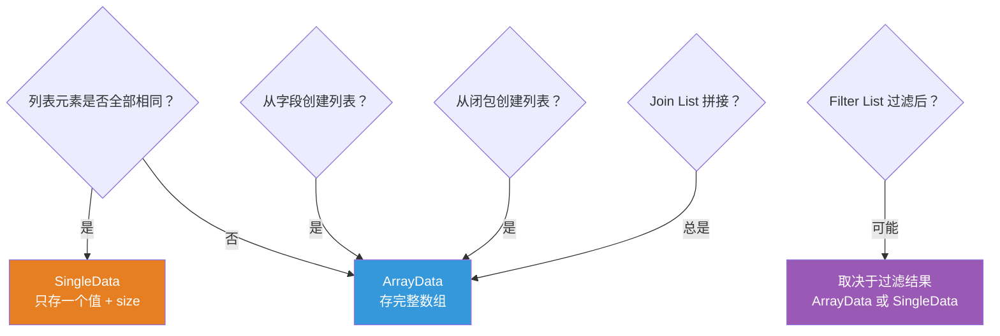
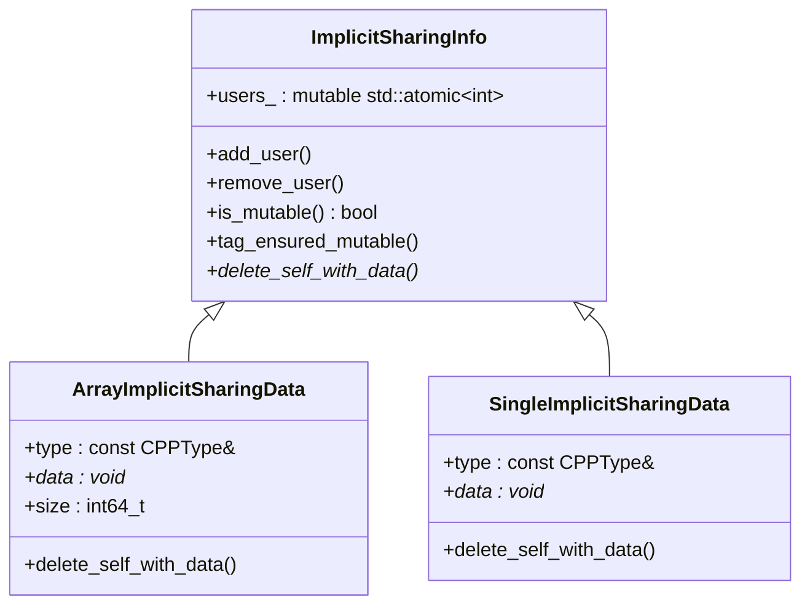
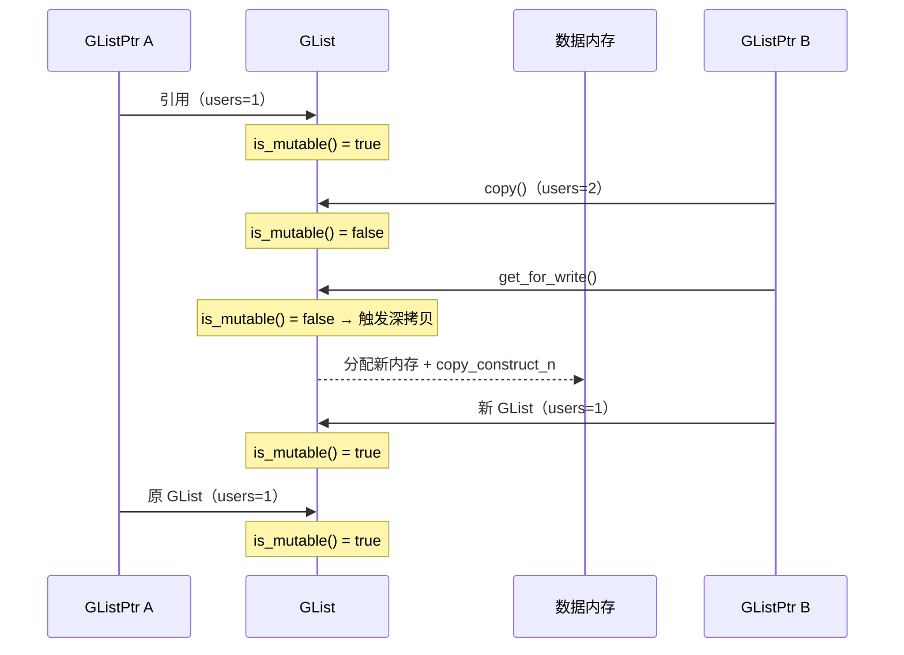
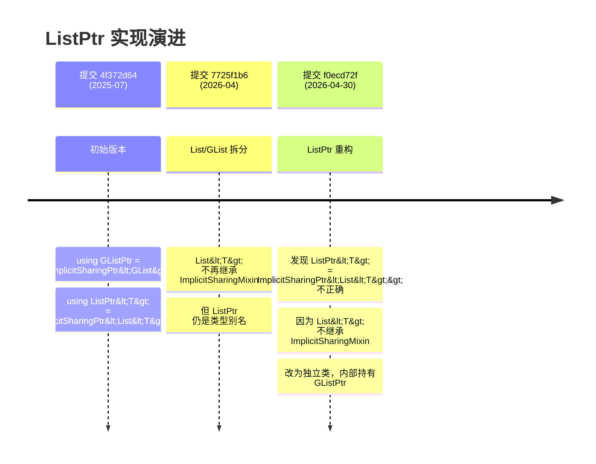
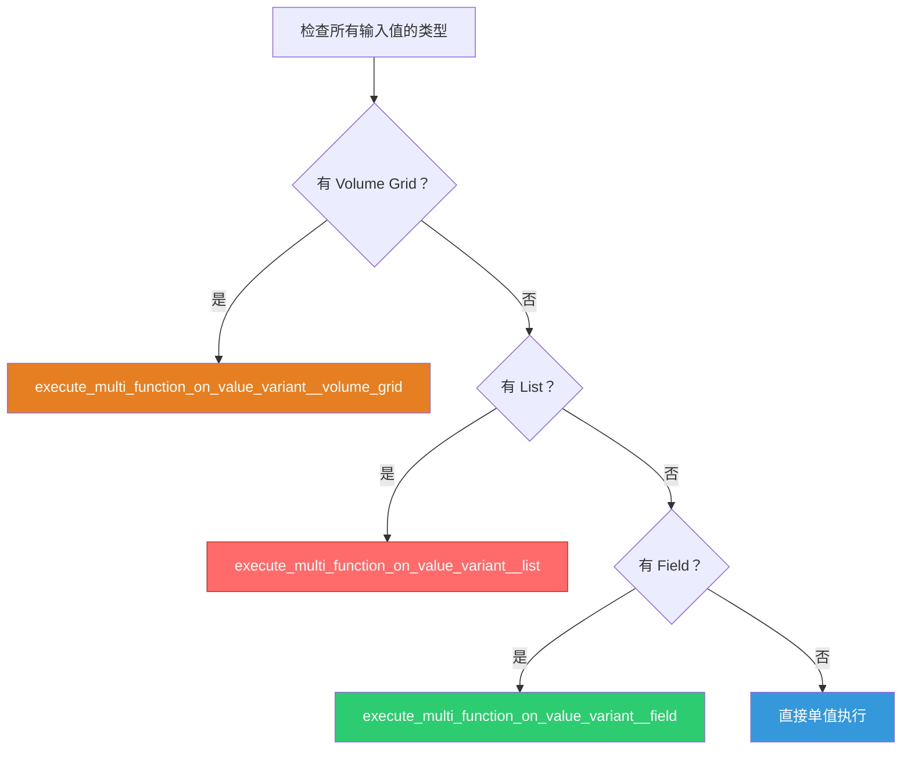
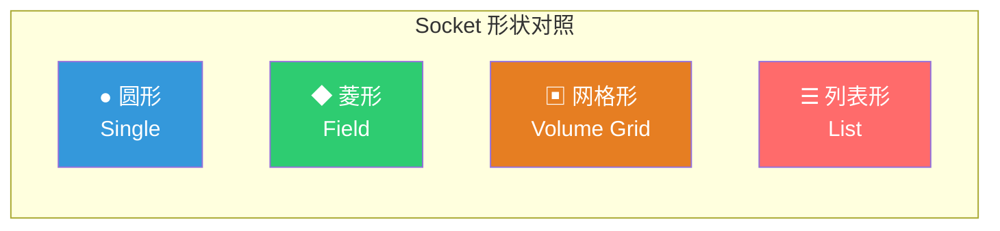

# 几何节点列表系统 — 架构与核心数据结构

> 源码版本：基于 `node-join-list` 分支（2026-05-30）
> 关键提交：`4f372d64`（初始列表支持）、`7725f1b6`（List/GList 拆分）、`f0ecd72f`（ListPtr 重构）

- [几何节点列表系统 — 架构与核心数据结构](#几何节点列表系统--架构与核心数据结构)
  - [目录](#目录)
  - [1. 总览：列表在几何节点中的位置](#1-总览列表在几何节点中的位置)
    - [列表节点的注册入口](#列表节点的注册入口)
  - [2. 设计哲学：结构类型叠加而非独立 Socket 类型](#2-设计哲学结构类型叠加而非独立-socket-类型)
    - [StructureType 枚举定义](#structuretype-枚举定义)
    - [为什么这样设计？](#为什么这样设计)
    - [结构类型间的兼容性规则](#结构类型间的兼容性规则)
  - [3. 核心类层次结构](#3-核心类层次结构)
    - [关键设计要点](#关键设计要点)
  - [4. GList — 泛型列表的内部表示](#4-glist--泛型列表的内部表示)
    - [构造函数](#构造函数)
    - [工厂方法](#工厂方法)
  - [5. DataVariant：ArrayData 与 SingleData](#5-datavariantarraydata-与-singledata)
    - [ArrayData — 数组存储](#arraydata--数组存储)
      - [ForValue — 用同一个值填充数组](#forvalue--用同一个值填充数组)
      - [ForUninitialized — 分配但不初始化](#foruninitialized--分配但不初始化)
    - [SingleData — 单值存储](#singledata--单值存储)
    - [何时使用哪种存储？](#何时使用哪种存储)
    - [values() — 统一访问接口](#values--统一访问接口)
    - [varray() — 虚拟数组视图](#varray--虚拟数组视图)
  - [6. 隐式共享与写时复制](#6-隐式共享与写时复制)
    - [自定义共享信息类](#自定义共享信息类)
    - [为什么需要自定义共享信息？](#为什么需要自定义共享信息)
    - [写时复制（Copy-on-Write）](#写时复制copy-on-write)
    - [ArrayData::span\_for\_write — 按需深拷贝](#arraydataspan_for_write--按需深拷贝)
  - [7. List\<T\> — 类型化列表的零开销抽象](#7-listt--类型化列表的零开销抽象)
    - [零开销保证](#零开销保证)
    - [类型化接口](#类型化接口)
    - [foreach — 便捷遍历](#foreach--便捷遍历)
    - [C++20 Concepts 约束](#c20-concepts-约束)
  - [8. GListPtr / ListPtr\<T\> — 智能指针与所有权](#8-glistptr--listptrt--智能指针与所有权)
    - [GListPtr — 泛型列表智能指针](#glistptr--泛型列表智能指针)
    - [ListPtr\<T\> — 类型化列表智能指针](#listptrt--类型化列表智能指针)
    - [提交历史中的重构](#提交历史中的重构)
    - [类型特征 is\_ListPtr\_v](#类型特征-is_listptr_v)
  - [9. SocketValueVariant 中的列表集成](#9-socketvaluevariant-中的列表集成)
    - [判断与获取](#判断与获取)
    - [在惰性函数求值中的分发](#在惰性函数求值中的分发)
  - [10. DNA 存储结构](#10-dna-存储结构)
    - [Field to List 的存储](#field-to-list-的存储)
    - [Closure to List 的存储](#closure-to-list-的存储)
    - [Get List Item 的存储](#get-list-item-的存储)
  - [11. Socket 显示形状](#11-socket-显示形状)
  - [12. 文件组织与依赖关系](#12-文件组织与依赖关系)
    - [关键文件速查表](#关键文件速查表)
  - [附录：关键 C++ 语法速查](#附录关键-c-语法速查)


> 📖 **系列文档目录**：
> 1. 列表系统架构与核心数据结构（本文）
> 2. [隐式共享机制详解](02-隐式共享机制详解.md)
> 3. [SocketValueVariant 与列表集成](03-SocketValueVariant与列表集成.md)
> 4. [SocketItemsAccessor 动态 Socket 模式](04-SocketItemsAccessor动态Socket模式.md)
> 5. [List Length 与 Join List 节点](05-ListLength与JoinList节点.md)
> 6. [Get List Item 节点](06-GetListItem节点.md)
> 7. [Filter List 节点](07-FilterList节点.md)
> 8. [Field to List 节点](08-FieldToList节点.md)
> 9. [Closure to List 节点](09-ClosureToList节点.md)
> 10. [列表函数求值系统](10-列表函数求值系统.md)
> 11. [结构类型推断与列表](11-结构类型推断与列表.md)
> 12. [列表节点对比与设计总结](12-列表节点对比与设计总结.md)

---

## 目录

1. [总览：列表在几何节点中的位置](#1-总览列表在几何节点中的位置)
2. [设计哲学：结构类型叠加而非独立 Socket 类型](#2-设计哲学结构类型叠加而非独立-socket-类型)
3. [核心类层次结构](#3-核心类层次结构)
4. [GList — 泛型列表的内部表示](#4-glist--泛型列表的内部表示)
5. [DataVariant：ArrayData 与 SingleData](#5-datavariantarraydata-与-singledata)
6. [隐式共享与写时复制](#6-隐式共享与写时复制)
7. [List\<T\> — 类型化列表的零开销抽象](#7-listt--类型化列表的零开销抽象)
8. [GListPtr / ListPtr\<T\> — 智能指针与所有权](#8-glistptr--listptrt--智能指针与所有权)
9. [SocketValueVariant 中的列表集成](#9-socketvaluevariant-中的列表集成)
10. [DNA 存储结构](#10-dna-存储结构)
11. [Socket 显示形状](#11-socket-显示形状)
12. [文件组织与依赖关系](#12-文件组织与依赖关系)

---

## 1. 总览：列表在几何节点中的位置

Blender 几何节点系统在 4.x 版本引入了**列表（List）**作为一种新的"结构类型"（Structure Type），允许节点网络处理同类型元素的有序集合。列表不是一种独立的 Socket 数据类型，而是在现有数据类型之上叠加的语义层。



### 列表节点的注册入口

在 [node_add_menu_geometry.py:858-863](file:///e:/blender-git/blender/scripts/startup/bl_ui/node_add_menu_geometry.py#L858-L863) 中，6 个列表节点注册在 `Utilities/List` 菜单下：

```python
class NODE_MT_gn_utilities_list_base(node_add_menu.NodeMenu):
    bl_label = "List"
    menu_path = "Utilities/List"

    def draw(self, _context):
        layout = self.layout
        self.node_operator(layout, "GeometryNodeClosureToList")
        self.node_operator(layout, "GeometryNodeFieldToList")
        self.node_operator(layout, "GeometryNodeFilterList")
        self.node_operator(layout, "GeometryNodeJoinList")
        self.node_operator(layout, "GeometryNodeListGetItem")
        self.node_operator(layout, "GeometryNodeListLength")
```

---

## 2. 设计哲学：结构类型叠加而非独立 Socket 类型

这是理解列表系统最关键的设计决策。Blender **没有**引入 `SOCK_LIST` 这样的独立 Socket 类型。相反，列表是通过 `StructureType` 枚举在现有数据类型 Socket 上叠加的语义标记。

### StructureType 枚举定义

在 [DNA_node_tree_interface_types.h:89-95](file:///e:/blender-git/blender/source/blender/makesdna/DNA_node_tree_interface_types.h#L89-L95) 中：

```cpp
// DNA 层面的枚举（用于 .blend 文件序列化）
enum class NodeSocketInterfaceStructureType : int8_t {
  Auto = 0,
  Single = 1,    // 单值
  Dynamic = 2,   // 动态（可以是单值、字段或列表）
  Field = 3,     // 字段
  Grid = 4,      // 体积网格
  List = 5,      // 列表 ← 新增
};

// C++ 运行时使用的枚举（值与 DNA 枚举对应）
namespace nodes {
enum class StructureType : int8_t {
  Single = int8_t(NodeSocketInterfaceStructureType::Single),
  Dynamic = int8_t(NodeSocketInterfaceStructureType::Dynamic),
  Field = int8_t(NodeSocketInterfaceStructureType::Field),
  Grid = int8_t(NodeSocketInterfaceStructureType::Grid),
  List = int8_t(NodeSocketInterfaceStructureType::List),
};
}
```

### 为什么这样设计？



方案A的问题：每增加一种数据类型就需要 N 个 Socket 类型变体（Single/Field/List/Grid），导致组合爆炸。方案B通过正交组合，让数据类型和结构类型独立扩展。

### 结构类型间的兼容性规则

在结构类型推断中，不同结构类型之间有明确的组合规则（[node_tree_structure_type_inferencing.cc](file:///e:/blender-git/blender/source/blender/blenkernel/intern/node_tree_structure_type_inferencing.cc)）：

| 输入 A | 输入 B | 结果 | 说明 |
|--------|--------|------|------|
| Single | List | **List** | 单值自动提升为列表 |
| Field | List | **List** | 字段与列表组合为列表 |
| Single | Grid | **Grid** | 单值自动提升为网格 |
| Single | Field | **Field** | 单值自动提升为字段 |

这意味着当你把一个单值连接到期望列表的输入时，系统会自动将单值"提升"为列表语义。

---

## 3. 核心类层次结构

列表系统的核心类遵循 Blender 中 `GField`/`Field<T>` 和 `GVArray`/`VArray<T>` 的相同模式——泛型基类 + 类型化零开销包装。



### 关键设计要点

1. **`GList` 与 `List<T>` 内存布局相同**：通过 `static_assert(sizeof(GList) == sizeof(List<T>))` 保证，`List<T>` 内部只有一个 `GList list_` 成员，因此可以安全地 `reinterpret_cast` 互相转换。

2. **`GListPtr` 与 `ListPtr<T>` 不是类型别名**：在提交 `f0ecd72f` 中，Jacques Lucke 发现最初的 `using ListPtr<T> = ImplicitSharingPtr<List<T>>` 实现是错误的——因为 `List<T>` 并非继承自 `ImplicitSharingMixin`，`ImplicitSharingPtr<List<T>>` 无法正确工作。因此 `ListPtr<T>` 被实现为包含 `GListPtr` 的新类。

3. **`GList` 继承 `ImplicitSharingMixin`**：这使得 `GList` 可以被 `ImplicitSharingPtr<GList>` 管理，实现引用计数和写时复制。

---

## 4. GList — 泛型列表的内部表示

`GList` 是列表系统的核心，定义在 [NOD_geometry_nodes_list.hh](file:///e:/blender-git/blender/source/blender/nodes/NOD_geometry_nodes_list.hh)。

### 构造函数

```cpp
// 禁止默认构造——GList 必须关联一个有效的 CPPType
GList() = delete;

// 构造空列表（size = 0）
GList(const CPPType &type) : GList(type, DataVariant{}, 0) {}

// 完整构造
GList(const CPPType &type, DataVariant data, const int64_t size);
```

> **为什么禁止默认构造？** `GList` 的 `cpp_type_` 是引用类型 `const CPPType&`，必须绑定到一个有效的 `CPPType` 对象。空列表虽然 size 为 0，但仍然需要知道元素类型。

### 工厂方法

```cpp
// 通过堆分配创建 GListPtr（最常用）
static GListPtr create(const CPPType &type, DataVariant data, const int64_t size);

// 从 STL 容器创建（如 Vector<float>, Array<int> 等）
template<typename ContainerT> static GListPtr from_container(ContainerT &&container);

// 从 GArray 创建
static GListPtr from_garray(GArray<> array);
```

`from_container` 的实现揭示了一个重要的共享机制：

```cpp
template<typename ContainerT> inline GListPtr GList::from_container(ContainerT &&container)
{
  using T = typename std::decay_t<ContainerT>::value_type;
  static_assert(std::is_convertible_v<ContainerT, MutableSpan<T>>);

  // 将容器包装进 ImplicitSharedValue，使其可被多个 GList 共享
  auto *sharable_data = new ImplicitSharedValue<std::decay_t<ContainerT>>(
      std::forward<ContainerT>(container));

  ArrayData array_data;
  array_data.data = sharable_data->data.data();         // 指向容器内部数据
  array_data.sharing_info = ImplicitSharingPtr<>(sharable_data);  // 引用计数管理
  return GList::create(CPPType::get<T>(), std::move(array_data), sharable_data->data.size());
}
```

> **`std::decay_t<ContainerT>`**：移除引用和 cv 限定符。例如 `Vector<int>&` 变为 `Vector<int>`，确保 `ImplicitSharedValue` 存储的是值类型而非引用。

> **`std::forward<ContainerT>(container)`**：完美转发——如果传入的是左值引用则拷贝，如果是右值引用则移动，避免不必要的拷贝。

---

## 5. DataVariant：ArrayData 与 SingleData

`GList` 使用 `std::variant<ArrayData, SingleData>` 来支持两种截然不同的存储策略：



### ArrayData — 数组存储

当列表中的元素各不相同时使用。数据存储为连续内存数组。

```cpp
class ArrayData {
 public:
  const void *data;              // 指向数组首元素（const 因为使用隐式共享）
  ImplicitSharingPtr<> sharing_info;  // 共享/所有权信息

  // 工厂方法
  static ArrayData ForValue(const GPointer &value, int64_t size);
  static ArrayData ForDefaultValue(const CPPType &type, int64_t size);
  static ArrayData ForConstructed(const CPPType &type, int64_t size);
  static ArrayData ForUninitialized(const CPPType &type, int64_t size);

  GMutableSpan span_for_write(const CPPType &type, int64_t size);
};
```

#### ForValue — 用同一个值填充数组

```cpp
GList::ArrayData GList::ArrayData::ForValue(const GPointer &value, const int64_t size)
{
  GList::ArrayData data{};
  const CPPType &type = *value.type();
  const void *value_ptr = type.default_value();

  void *new_data;
  // 优化：如果填充值恰好是零，使用 calloc（更快）
  if (memory_is_zero(value_ptr, type.size)) {
    new_data = MEM_new_array_zeroed_aligned(size, type.size, type.alignment, __func__);
  }
  else {
    new_data = MEM_new_array_uninitialized_aligned(size, type.size, type.alignment, __func__);
    type.fill_construct_n(value_ptr, new_data, size);  // 逐个拷贝构造
  }

  data.data = new_data;
  data.sharing_info = sharing_ptr_for_array(new_data, size, type);
  return data;
}
```

> **`memory_is_zero`**：检查一段内存是否全为零字节。对于浮点数 0.0、整数 0、空指针等，底层表示都是全零，因此 `calloc` 可以替代 `fill_construct_n`，性能更好。

> **`MEM_new_array_zeroed_aligned`** / **`MEM_new_array_uninitialized_aligned`**：Blender 的内存分配器，支持对齐分配。`zeroed` 版本等价于 `calloc`，`uninitialized` 版本等价于 `malloc`。

#### ForUninitialized — 分配但不初始化

```cpp
GList::ArrayData GList::ArrayData::ForUninitialized(const CPPType &type, const int64_t size)
{
  GList::ArrayData data{};
  void *new_data = MEM_new_array_uninitialized_aligned(size, type.size, type.alignment, __func__);
  data.data = new_data;
  data.sharing_info = sharing_ptr_for_array(new_data, size, type);
  return data;
}
```

> **为什么不初始化？** 当调用者会立即用数据覆盖整个数组时（例如字段求值结果直接写入），跳过初始化可以避免无意义的零填充开销。这是 C++ 中的常见优化模式。

### SingleData — 单值存储

当列表中所有元素都相同时使用。只存储一个值，逻辑上重复 `size` 次。这是一种**压缩表示**。

```cpp
class SingleData {
 public:
  const void *value;              // 指向单个值（const 因为使用隐式共享）
  ImplicitSharingPtr<> sharing_info;  // 共享/所有权信息

  static SingleData ForValue(const GPointer &value);
  static SingleData ForDefaultValue(const CPPType &type);

  GMutablePointer value_for_write(const CPPType &type);
};
```

### 何时使用哪种存储？



### values() — 统一访问接口

无论内部使用哪种存储，`values()` 都提供统一的访问方式：

```cpp
std::variant<GSpan, GPointer> GList::values() const
{
  if (const auto *array_data = std::get_if<ArrayData>(&data_)) {
    return GSpan(cpp_type_, array_data->data, size_);  // 返回跨度视图
  }
  if (const auto *single_data = std::get_if<SingleData>(&data_)) {
    return GPointer(cpp_type_, single_data->value);    // 返回单值指针
  }
  BLI_assert_unreachable();
  return {};
}
```

> **`std::get_if`**：`std::variant` 的非抛出访问方法。返回指向当前活跃变体的指针，如果变体不活跃则返回 `nullptr`。比 `std::get` 更安全，因为不会抛出异常。

### varray() — 虚拟数组视图

`varray()` 将列表转换为 `GVArray`（泛型虚拟数组），使得列表可以像数组一样被索引访问：

```cpp
GVArray GList::varray() const
{
  if (const auto *array_data = std::get_if<ArrayData>(&data_)) {
    // ArrayData → 基于跨度的 VArray（直接内存访问）
    return GVArray::from_span(GSpan(cpp_type_, array_data->data, size_));
  }
  if (const auto *single_data = std::get_if<SingleData>(&data_)) {
    // SingleData → 基于单值的 VArray（每个索引返回同一个值）
    return GVArray::from_single_ref(cpp_type_, size_, single_data->value);
  }
  BLI_assert_unreachable();
  return {};
}
```

> **`GVArray::from_span`**：创建一个直接映射到内存跨度的虚拟数组，O(1) 随机访问。
>
> **`GVArray::from_single_ref`**：创建一个"虚拟"数组，所有索引都返回同一个值的引用。这是 SingleData 压缩表示的核心——不需要真正复制 N 份，只需在访问时假装有 N 份。

---

## 6. 隐式共享与写时复制

隐式共享（Implicit Sharing）是 Blender 中广泛使用的零拷贝优化技术。`GList` 通过继承 `ImplicitSharingMixin` 并配合自定义的 `ImplicitSharingInfo` 子类来实现。

### 自定义共享信息类

在 [geometry_nodes_list.cc](file:///e:/blender-git/blender/source/blender/nodes/intern/geometry_nodes_list.cc) 中定义了两个自定义共享信息类：



### 为什么需要自定义共享信息？

对于**平凡可析构类型**（如 `float`、`int`），释放内存只需调用 `MEM_freeN`。但对于**非平凡析构类型**（如 `std::string`、`GeometrySet`、`BundlePtr`），释放前必须逐个调用析构函数。

```cpp
// 平凡可析构类型 → 使用标准共享信息（无需存储类型和大小）
static ImplicitSharingPtr<> sharing_ptr_for_array(void *data,
                                                  const int64_t size,
                                                  const CPPType &type)
{
  if (type.is_trivially_destructible) {
    // 简单情况：只需释放内存，不需要析构
    return ImplicitSharingPtr<>(implicit_sharing::info_for_mem_free(data));
  }
  // 复杂情况：需要存储类型和大小以便正确析构
  return ImplicitSharingPtr<>(MEM_new<ArrayImplicitSharingData>(__func__, data, size, type));
}
```

`ArrayImplicitSharingData::delete_self_with_data` 的实现：

```cpp
void ArrayImplicitSharingData::delete_self_with_data() override
{
  type.destruct_n(this->data, this->size);  // 逐个析构数组元素
  MEM_delete_void(this->data);               // 释放数组内存
  MEM_delete(this);                          // 释放共享信息自身
}
```

> **`MEM_delete_void`** vs **`MEM_delete`**：`MEM_delete` 会调用析构函数后释放内存；`MEM_delete_void` 只释放内存不调用析构函数（用于已经手动析构过的情况）。

### 写时复制（Copy-on-Write）

`GListPtr::get_for_write()` 是写时复制的入口：

```cpp
inline GList &GListPtr::get_for_write()
{
  BLI_assert(data_);
  if (!data_->is_mutable()) {
    // 数据被共享 → 创建副本
    *this = data_->copy();
  }
  BLI_assert(data_->is_mutable());
  data_->tag_ensured_mutable();
  return const_cast<GList &>(*data_);
}
```

`GList::copy()` 的实现：

```cpp
GListPtr GList::copy() const
{
  // 注意：这里只复制 GList 对象本身（包含 DataVariant）
  // DataVariant 中的 sharing_info 会增加引用计数（浅拷贝）
  // 真正的深拷贝发生在 span_for_write / value_for_write 中
  return GList::create(cpp_type_, data_, size_);
}
```

> **关键理解**：`GList::copy()` 创建的是**浅拷贝**——新的 `GList` 对象共享同一块底层数据。只有当调用者通过 `span_for_write()` 或 `value_for_write()` 请求写入权限时，才会触发真正的深拷贝。

### ArrayData::span_for_write — 按需深拷贝

```cpp
GMutableSpan GList::ArrayData::span_for_write(const CPPType &type, int64_t size)
{
  if (this->sharing_info && !this->sharing_info->is_mutable()) {
    // 数据被共享 → 深拷贝
    void *new_data = MEM_new_array_uninitialized_aligned(
        size, type.size, type.alignment, __func__);
    type.copy_construct_n(this->data, new_data, size);  // 逐个拷贝构造
    this->data = new_data;
    this->sharing_info = sharing_ptr_for_array(new_data, size, type);
  }
  if (this->sharing_info) {
    this->sharing_info->tag_ensured_mutable();
  }
  return {type, const_cast<void *>(this->data), size};
}
```



---

## 7. List\<T\> — 类型化列表的零开销抽象

`List<T>` 是 `GList` 的类型化包装，提供类型安全的接口。关键在于它是**零开销抽象**——`List<T>` 和 `GList` 在内存中布局完全相同。

### 零开销保证

```cpp
template<typename T> class List {
 private:
  GList list_;  // 唯一成员

  friend GList;  // 允许 GList 访问私有成员

 public:
  // 通过 reinterpret_cast 实现 GList ↔ List<T> 互转
  operator const GList &() const { return list_; }
};
```

`GList::typed<T>()` 的实现证实了零开销：

```cpp
template<typename T> inline const List<T> &GList::typed() const
{
  static_assert(sizeof(GList) == sizeof(List<T>));  // 编译期大小检查
  BLI_assert(this->cpp_type().is<T>());             // 运行期类型检查
  return reinterpret_cast<const List<T> &>(*this);  // 零开销转换
}
```

> **`reinterpret_cast`**：C++ 中最危险的类型转换，直接重新解释内存。在这里是安全的，因为 `static_assert` 保证了内存布局相同，`BLI_assert` 保证了类型匹配。

### 类型化接口

```cpp
template<typename T> inline VArray<T> List<T>::varray() const
{
  return list_.varray().template typed<T>();  // GList::varray() → VArray<T>
}

template<typename T> inline std::variant<Span<T>, const T *> List<T>::values() const
{
  const std::variant<GSpan, GPointer> values = list_.values();
  if (const auto *span_values = std::get_if<GSpan>(&values)) {
    return span_values->typed<T>();    // GSpan → Span<T>
  }
  if (const auto *single_value = std::get_if<GPointer>(&values)) {
    return single_value->get<T>();     // GPointer → const T*
  }
  BLI_assert_unreachable();
  return {};
}
```

### foreach — 便捷遍历

```cpp
template<typename T> template<typename Fn>
inline void List<T>::foreach(Fn &&fn) const
{
  const std::variant<Span<T>, const T *> values = this->values();
  if (const auto *span_values = std::get_if<Span<T>>(&values)) {
    for (const T &value : *span_values) {
      fn(value);  // 数组存储：逐个访问
    }
  }
  else if (const auto *single_value = std::get_if<const T *>(&values)) {
    fn(**single_value);  // 单值存储：只调用一次
  }
}
```

> **`fn(**single_value)`**：第一层 `*` 解引用 `const T*` 指针得到 `const T&`，第二层...不对。`single_value` 是 `const T**` 类型（指向指针的指针），`*single_value` 得到 `const T*`，`**single_value` 得到 `const T&`。

### C++20 Concepts 约束

`List<T>::from_container` 使用了 C++20 的 `requires` 约束：

```cpp
template<typename ContainerT>
  requires std::is_same_v<typename ContainerT::value_type, T>
static ListPtr<T> from_container(ContainerT &&container);
```

> **`requires` 子句**：C++20 Concepts 语法。这行代码约束 `ContainerT` 的 `value_type` 必须与 `T` 相同。例如 `List<float>::from_container(Vector<float>&&)` 可以编译，但 `List<float>::from_container(Vector<int>&&)` 会在编译期报错。这比 SFINAE 更清晰直观。

---

## 8. GListPtr / ListPtr\<T\> — 智能指针与所有权

### GListPtr — 泛型列表智能指针

```cpp
class GListPtr {
 private:
  ImplicitSharingPtr<GList> data_;  // 引用计数智能指针

 public:
  GListPtr() = default;
  explicit GListPtr(const GList *data) : data_(data) {}
  explicit GListPtr(const CPPType &type) : GListPtr(MEM_new<GList>(__func__, type)) {}

  const GList *get() const;
  GList &get_for_write();  // 写时复制入口
};
```

### ListPtr\<T\> — 类型化列表智能指针

`ListPtr<T>` 不是 `ImplicitSharingPtr<List<T>>` 的别名（如前所述），而是一个独立的类，内部持有 `GListPtr`：

```cpp
template<typename T> class ListPtr {
 private:
  GListPtr data_;  // 内部持有 GListPtr

 public:
  operator bool() const;
  operator const GListPtr &() const;  // 隐式转换为 GListPtr
  const List<T> *operator->() const;
  const List<T> &operator*() const;
  const List<T> &get() const;
  List<T> &get_for_write();
};
```

### 提交历史中的重构



### 类型特征 is_ListPtr_v

```cpp
template<typename T> constexpr bool is_ListPtr_v = false;
template<typename T> constexpr bool is_ListPtr_v<ListPtr<T>> = true;
```

> **模板特化**：这是一个编译期类型检查工具。`is_ListPtr_v<ListPtr<float>>` 为 `true`，其他所有类型为 `false`。用于模板元编程中判断某个类型是否是 `ListPtr`。

---

## 9. SocketValueVariant 中的列表集成

`SocketValueVariant` 是几何节点中 Socket 值的统一容器，定义在 [BKE_node_socket_value.hh](file:///e:/blender-git/blender/source/blender/blenkernel/BKE_node_socket_value.hh)。列表作为其中一种值类型被集成。

### 判断与获取

```cpp
class SocketValueVariant {
 public:
  bool is_list() const;          // 判断是否存储了列表
  // 获取列表（通过模板参数推导）
  GListPtr get<GListPtr>() const;
};
```

### 在惰性函数求值中的分发

当函数节点被执行时，系统根据输入值的类型选择不同的求值路径（[geometry_nodes_lazy_function.cc](file:///e:/blender-git/blender/source/blender/nodes/intern/geometry_nodes_lazy_function.cc)）：



优先级：**Volume Grid > List > Field > Single**。这意味着如果一个函数节点同时接收列表和字段输入，会走列表路径（字段会被先求值为列表）。

---

## 10. DNA 存储结构

DNA（Blender 的数据序列化格式）中定义了列表节点的持久化存储结构。

### Field to List 的存储

```cpp
// 单个输出项
struct GeometryNodeFieldToListItem {
  eNodeSocketDatatype socket_type = SOCK_FLOAT;  // 数据类型
  char _pad[2] = {};                              // 对齐填充
  int identifier = 0;                             // 唯一标识符（用于 socket 命名）
  char *name = nullptr;                           // 显示名称
};

// 节点存储
struct GeometryNodeFieldToList {
  char _pad[4] = {};
  int next_identifier = 0;                        // 下一个可用标识符
  GeometryNodeFieldToListItem *items = nullptr;   // 输出项数组
  int items_num = 0;                              // 项数量
  int active_index = 0;                           // 当前选中项索引
};
```

### Closure to List 的存储

```cpp
struct GeometryNodeClosureToListItem {
  eNodeSocketDatatype socket_type = SOCK_FLOAT;
  NodeSocketInterfaceStructureType structure_type = NodeSocketInterfaceStructureType::Auto;
  char _pad[1] = {};
  int identifier = 0;
  char *name = nullptr;
};

struct GeometryNodeClosureToList {
  char _pad[4] = {};
  int next_identifier = 0;
  GeometryNodeClosureToListItem *items = nullptr;
  int items_num = 0;
  int active_index = 0;
};
```

> **注意差异**：`ClosureToListItem` 比 `FieldToListItem` 多了 `structure_type` 字段，因为闭包输出的每个项可以是单值、字段或列表，而 Field to List 的输出总是列表。

### Get List Item 的存储

```cpp
struct NodeGeometryListGetItem {
  eNodeSocketDatatype socket_type = SOCK_FLOAT;
  NodeSocketInterfaceStructureType structure_type = NodeSocketInterfaceStructureType::Auto;
  char _pad = {};
};
```

> **`_pad` 填充**：DNA 结构需要严格的对齐。编译器会自动插入填充字节，但 Blender 的 DNA 系统要求显式声明填充字段以确保跨平台一致性。

---

## 11. Socket 显示形状

列表 Socket 在节点编辑器中有独特的视觉形状，定义在 [DNA_node_types.h:125](file:///e:/blender-git/blender/source/blender/makesdna/DNA_node_types.h#L125)：

```cpp
enum eNodeSocketDisplayShape {
  SOCK_DISPLAY_SHAPE_CIRCLE = 0,       // ● 单值
  SOCK_DISPLAY_SHAPE_DIAMOND = 3,      // ◆ 字段
  SOCK_DISPLAY_SHAPE_VOLUME_GRID = 7,  // ▣ 体积网格
  SOCK_DISPLAY_SHAPE_LIST = 8,         // ☰ 列表（新增）
};
```



---

## 12. 文件组织与依赖关系

```mermaid
graph TB
    subgraph "头文件 (include/)"
        FWD["NOD_geometry_nodes_list_fwd.hh<br/>前向声明"]
        MAIN["NOD_geometry_nodes_list.hh<br/>GList, List&lt;T&gt;, GListPtr, ListPtr&lt;T&gt;"]
        F2L_H["NOD_geo_field_to_list.hh<br/>FieldToListItemsAccessor"]
        C2L_H["NOD_geo_closure_to_list.hh<br/>ClosureToListItemsAccessor"]
        LFE["list_function_eval.hh<br/>ListFieldContext, 求值函数"]
    end

    subgraph "实现文件 (intern/)"
        IMPL["geometry_nodes_list.cc<br/>GList 核心实现"]
        LFE_CC["list_function_eval.cc<br/>列表函数求值"]
    end

    subgraph "节点文件 (nodes/)"
        F2L["node_geo_field_to_list.cc"]
        C2L["node_geo_closure_to_list.cc"]
        GLI["node_geo_list_get_item.cc"]
        LL["node_geo_list_length.cc"]
        FL["node_geo_filter_list.cc"]
        JL["node_geo_join_list.cc"]
    end

    subgraph "BKE 集成"
        SVV["BKE_node_socket_value.hh<br/>SocketValueVariant"]
        CTX["BKE_compute_contexts.hh<br/>ClosureToListComputeContext"]
        INFER["node_tree_structure_type_inferencing.cc"]
    end

    subgraph "DNA"
        DNA["DNA_node_types.h<br/>存储结构定义"]
        DNA2["DNA_node_tree_interface_types.h<br/>StructureType 枚举"]
    end

    FWD --> MAIN
    MAIN --> IMPL
    MAIN --> F2L
    MAIN --> C2L
    MAIN --> GLI
    MAIN --> LL
    MAIN --> FL
    MAIN --> JL
    MAIN --> LFE
    LFE --> LFE_CC
    F2L_H --> F2L
    C2L_H --> C2L
    SVV --> IMPL
    CTX --> C2L
    DNA --> F2L
    DNA --> C2L
    DNA2 --> INFER

    style MAIN fill:#e74c3c,color:#fff
    style IMPL fill:#c0392b,color:#fff
    style LFE fill:#e67e22,color:#fff
    style SVV fill:#3498db,color:#fff
```

### 关键文件速查表

| 文件 | 职责 |
|------|------|
| [NOD_geometry_nodes_list_fwd.hh](file:///e:/blender-git/blender/source/blender/nodes/NOD_geometry_nodes_list_fwd.hh) | 前向声明，避免循环依赖 |
| [NOD_geometry_nodes_list.hh](file:///e:/blender-git/blender/source/blender/nodes/NOD_geometry_nodes_list.hh) | 核心数据结构定义 + 内联实现 |
| [geometry_nodes_list.cc](file:///e:/blender-git/blender/source/blender/nodes/intern/geometry_nodes_list.cc) | GList 非内联实现、隐式共享、深拷贝 |
| [list_function_eval.hh](file:///e:/blender-git/blender/source/blender/nodes/intern/list_function_eval.hh) | 列表函数求值接口 |
| [list_function_eval.cc](file:///e:/blender-git/blender/source/blender/nodes/intern/list_function_eval.cc) | 多函数在列表上的执行逻辑 |
| [NOD_geo_field_to_list.hh](file:///e:/blender-git/blender/source/blender/nodes/geometry/include/NOD_geo_field_to_list.hh) | Field to List 的 Socket Items Accessor |
| [NOD_geo_closure_to_list.hh](file:///e:/blender-git/blender/source/blender/nodes/geometry/include/NOD_geo_closure_to_list.hh) | Closure to List 的 Socket Items Accessor |

---

## 附录：关键 C++ 语法速查

| 语法 | 含义 | 示例 |
|------|------|------|
| `std::variant<A, B>` | 类型安全的联合体 | `DataVariant = std::variant<ArrayData, SingleData>` |
| `std::get_if<T>(&v)` | 安全访问变体，返回指针 | `std::get_if<ArrayData>(&data_)` |
| `reinterpret_cast<T&>(x)` | 重新解释内存（危险但零开销） | `GList::typed<T>()` |
| `std::decay_t<T>` | 移除引用和 cv 限定符 | `std::decay_t<ContainerT>` |
| `std::forward<T>(x)` | 完美转发 | `std::forward<ContainerT>(container)` |
| `requires` | C++20 Concepts 约束 | `requires std::is_same_v<...>` |
| `static_assert` | 编译期断言 | `static_assert(sizeof(GList) == sizeof(List<T>))` |
| `BLI_assert` | Blender 运行期断言 | `BLI_assert(this->cpp_type().is<T>())` |
| `MEM_new<T>` | Blender 堆分配（调用构造函数） | `MEM_new<GList>(__func__, type)` |
| `MEM_delete` | Blender 堆释放（调用析构函数） | `MEM_delete(this)` |
| `ImplicitSharingPtr<T>` | 引用计数智能指针 | `ImplicitSharingPtr<GList>` |
| `ImplicitSharingMixin` | 支持隐式共享的基类 | `class GList : public ImplicitSharingMixin` |
| `template typed<T>()` | 模板方法调用 | `varray().template typed<T>()` |
