# 几何节点列表系统 — 架构与核心数据结构

> 源码版本：基于 `node-join-list` 分支（2026-05-30）
> 关键提交：`4f372d64`（初始列表支持）、`7725f1b6`（List/GList 拆分）、`f0ecd72f`（ListPtr 重构）

> 📖 **系列文档目录**：
> 1. 列表系统架构与核心数据结构（本文）
> 2. [隐式共享机制详解](02-隐式共享机制详解.md)
> 3. [SocketValueVariant 与列表集成](03-SocketValueVariant与列表集成.md)
> 4. [SocketItemsAccessor 动态 Socket 模式](04-SocketItemsAccessor动态Socket模式.md)
> 5. [List Length 与 Join List 节点](05-ListLength与JoinList节点.md)
> 6. [Get List Item 节点](06-GetListItem节点.md)
> 7. [Filter List 节点](07-FilterList节点.md)
> 8. [Field to List 节点](08-FieldToList节点.md)
> 9. [Closure to List 节点](09-ClosureToList节点.md)
> 10. [列表函数求值系统](10-列表函数求值系统.md)
> 11. [结构类型推断与列表](11-结构类型推断与列表.md)
> 12. [列表节点对比与设计总结](12-列表节点对比与设计总结.md)

---

## 目录

- [几何节点列表系统 — 架构与核心数据结构](#几何节点列表系统--架构与核心数据结构)
  - [目录](#目录)
  - [1. 总览：列表在几何节点中的位置](#1-总览列表在几何节点中的位置)
    - [列表节点的注册入口](#列表节点的注册入口)
  - [2. 设计哲学：结构类型叠加而非独立 Socket 类型](#2-设计哲学结构类型叠加而非独立-socket-类型)
    - [StructureType 枚举定义](#structuretype-枚举定义)
    - [为什么这样设计？](#为什么这样设计)
    - [结构类型间的兼容性规则](#结构类型间的兼容性规则)
  - [3. 核心类层次结构](#3-核心类层次结构)
    - [关键设计要点](#关键设计要点)
  - [4. GList — 泛型列表的内部表示](#4-glist--泛型列表的内部表示)
    - [构造函数](#构造函数)
    - [工厂方法](#工厂方法)
      - [`create` — 堆分配构造](#create--堆分配构造)
    - [`from_garray` — 从 GArray 创建](#from_garray--从-garray-创建)
      - [`from_container` — 从任意容器创建](#from_container--从任意容器创建)
    - [`decltype` vs `std::decay_t` 的区别？](#decltype-vs-stddecay_t-的区别)
  - [5. DataVariant：ArrayData 与 SingleData](#5-datavariantarraydata-与-singledata)
    - [ArrayData — 数组存储](#arraydata--数组存储)
      - [ForValue — 用同一个值填充数组](#forvalue--用同一个值填充数组)
      - [ForUninitialized — 分配但不初始化](#foruninitialized--分配但不初始化)
    - [SingleData — 单值存储](#singledata--单值存储)
    - [何时使用哪种存储？](#何时使用哪种存储)
    - [values() — 统一访问接口](#values--统一访问接口)
    - [varray() — 虚拟数组视图](#varray--虚拟数组视图)
  - [6. 隐式共享与写时复制](#6-隐式共享与写时复制)
    - [核心类层次](#核心类层次)
      - [ImplicitSharingInfo — 引用计数基类](#implicitsharinginfo--引用计数基类)
      - [ImplicitSharingMixin — 嵌入式共享基类](#implicitsharingmixin--嵌入式共享基类)
      - [ImplicitSharedValue\<T\> — 通用共享值包装](#implicitsharedvaluet--通用共享值包装)
      - [ImplicitSharingPtr\<T\> — 智能指针](#implicitsharingptrt--智能指针)
    - [CPPType — 运行时类型信息](#cpptype--运行时类型信息)
    - [模板函数为什么放在 .hh 文件中？为什么需要 `inline`？](#模板函数为什么放在-hh-文件中为什么需要-inline)
    - [自定义共享信息类](#自定义共享信息类)
    - [为什么需要自定义共享信息？](#为什么需要自定义共享信息)
    - [写时复制（Copy-on-Write）](#写时复制copy-on-write)
    - [ArrayData::span\_for\_write — 按需深拷贝](#arraydataspan_for_write--按需深拷贝)
  - [7. List\<T\> — 类型化列表的零开销抽象](#7-listt--类型化列表的零开销抽象)
    - [零开销保证](#零开销保证)
    - [类型化接口](#类型化接口)
    - [foreach — 便捷遍历](#foreach--便捷遍历)
    - [C++20 Concepts 约束](#c20-concepts-约束)
  - [8. GListPtr / ListPtr\<T\> — 智能指针与所有权](#8-glistptr--listptrt--智能指针与所有权)
    - [GListPtr — 泛型列表智能指针](#glistptr--泛型列表智能指针)
    - [ListPtr\<T\> — 类型化列表智能指针](#listptrt--类型化列表智能指针)
    - [提交历史中的重构](#提交历史中的重构)
    - [类型特征 is\_ListPtr\_v](#类型特征-is_listptr_v)
  - [9. SocketValueVariant 中的列表集成](#9-socketvaluevariant-中的列表集成)
    - [判断与获取](#判断与获取)
    - [在惰性函数求值中的分发](#在惰性函数求值中的分发)
  - [10. DNA 存储结构](#10-dna-存储结构)
    - [Field to List 的存储](#field-to-list-的存储)
    - [Closure to List 的存储](#closure-to-list-的存储)
    - [Get List Item 的存储](#get-list-item-的存储)
  - [11. Socket 显示形状](#11-socket-显示形状)
  - [12. 文件组织与依赖关系](#12-文件组织与依赖关系)
    - [关键文件速查表](#关键文件速查表)
  - [附录：关键 C++ 语法速查](#附录关键-c-语法速查)


---

## 1. 总览：列表在几何节点中的位置

Blender 几何节点系统在 4.x 版本引入了**列表（List）**作为一种新的"结构类型"（Structure Type），允许节点网络处理同类型元素的有序集合。列表不是一种独立的 Socket 数据类型，而是在现有数据类型之上叠加的语义层。

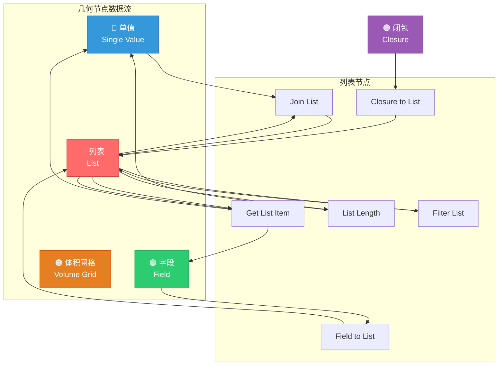

### 列表节点的注册入口

在 [node_add_menu_geometry.py:858-863](../../scripts/startup/bl_ui/node_add_menu_geometry.py#L858-L863) 中，6 个列表节点注册在 `Utilities/List` 菜单下：

```python
class NODE_MT_gn_utilities_list_base(node_add_menu.NodeMenu):
    bl_label = "List"
    menu_path = "Utilities/List"

    def draw(self, _context):
        layout = self.layout
        self.node_operator(layout, "GeometryNodeClosureToList")
        self.node_operator(layout, "GeometryNodeFieldToList")
        self.node_operator(layout, "GeometryNodeFilterList")
        self.node_operator(layout, "GeometryNodeJoinList")
        self.node_operator(layout, "GeometryNodeListGetItem")
        self.node_operator(layout, "GeometryNodeListLength")
```

---

## 2. 设计哲学：结构类型叠加而非独立 Socket 类型

这是理解列表系统最关键的设计决策。Blender **没有**引入 `SOCK_LIST` 这样的独立 Socket 类型。相反，列表是通过 `StructureType` 枚举在现有数据类型 Socket 上叠加的语义标记。

### StructureType 枚举定义

在 [DNA_node_tree_interface_types.h:89-95](../../source/blender/makesdna/DNA_node_tree_interface_types.h#L89-L95) 中：

```cpp
// DNA 层面的枚举（用于 .blend 文件序列化）
enum class NodeSocketInterfaceStructureType : int8_t {
  Auto = 0,
  Single = 1,    // 单值
  Dynamic = 2,   // 动态（可以是单值、字段或列表）
  Field = 3,     // 字段
  Grid = 4,      // 体积网格
  List = 5,      // 列表 ← 新增
};

// C++ 运行时使用的枚举（值与 DNA 枚举对应）
namespace nodes {
enum class StructureType : int8_t {
  Single = int8_t(NodeSocketInterfaceStructureType::Single),
  Dynamic = int8_t(NodeSocketInterfaceStructureType::Dynamic),
  Field = int8_t(NodeSocketInterfaceStructureType::Field),
  Grid = int8_t(NodeSocketInterfaceStructureType::Grid),
  List = int8_t(NodeSocketInterfaceStructureType::List),
};
}
```

> **为什么需要两层枚举？** `NodeSocketInterfaceStructureType` 是 DNA 层枚举，定义在 C 可见的头文件中，用于 `.blend` 文件序列化。`StructureType` 是 C++ 运行时枚举，放在 `nodes` 命名空间下避免全局污染，且不包含 `Auto`（`Auto` 只在推断阶段使用）。

> **为什么用 `int8_t` 而不是 `int`？** 节点树中每个 Socket 都有一个结构类型字段。一个复杂场景可能有数千个 Socket，每个节省 3 字节（`int8_t` 占 1 字节 vs `int` 占 4 字节）就有意义。这也是 DNA 的通用优化策略——小范围枚举用最小整数类型。

> **为什么需要 `int8_t(...)` 显式转换？** C++ 的 `enum class` 是强类型枚举，不允许隐式从另一个 `enum class` 转换。`int8_t(NodeSocketInterfaceStructureType::Single)` 先将枚举值转为 `int8_t` 整数，再作为 `StructureType` 的初始化值。这确保了两个枚举的数值对应——`StructureType::Single` 的底层值等于 `NodeSocketInterfaceStructureType::Single` 的底层值（都是 1）。

### 为什么这样设计？

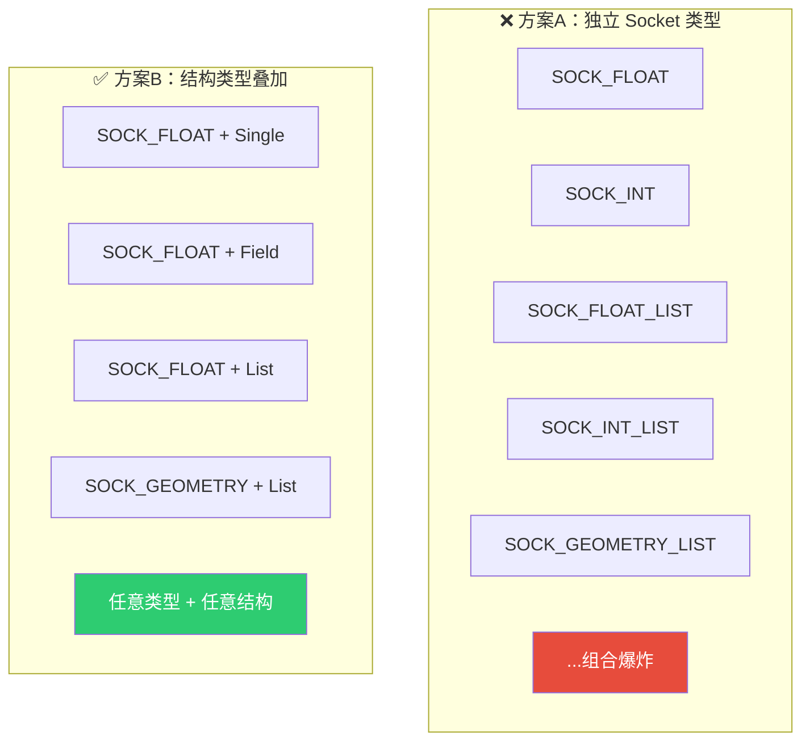

方案A的问题：每增加一种数据类型就需要 N 个 Socket 类型变体（Single/Field/List/Grid），导致组合爆炸。方案B通过正交组合，让数据类型和结构类型独立扩展。

### 结构类型间的兼容性规则

在结构类型推断中，不同结构类型之间有明确的组合规则（[node_tree_structure_type_inferencing.cc](../../source/blender/blenkernel/intern/node_tree_structure_type_inferencing.cc)）：

| 输入 A | 输入 B | 结果 | 说明 |
|--------|--------|------|------|
| Single | List | **List** | 单值自动提升为列表 |
| Field | List | **List** | 字段与列表组合为列表 |
| Single | Grid | **Grid** | 单值自动提升为网格 |
| Single | Field | **Field** | 单值自动提升为字段 |

这意味着当你把一个单值连接到期望列表的输入时，系统会自动将单值"提升"为列表语义。

---

## 3. 核心类层次结构

列表系统的核心类遵循 Blender 中 `GField`/`Field<T>` 和 `GVArray`/`VArray<T>` 的相同模式——泛型基类 + 类型化零开销包装。

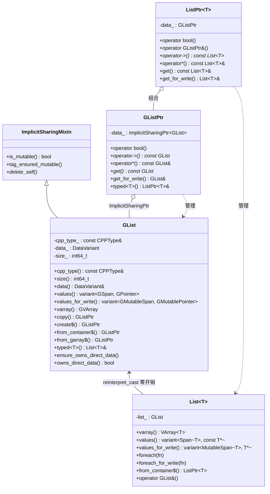

### 关键设计要点

1. **`GList` 与 `List<T>` 内存布局相同**：通过 `static_assert(sizeof(GList) == sizeof(List<T>))` 保证，`List<T>` 内部只有一个 `GList list_` 成员，因此可以安全地 `reinterpret_cast` 互相转换。

2. **`GListPtr` 与 `ListPtr<T>` 不是类型别名**：在提交 `f0ecd72f` 中，Jacques Lucke 发现最初的 `using ListPtr<T> = ImplicitSharingPtr<List<T>>` 实现是错误的——因为 `List<T>` 并非继承自 `ImplicitSharingMixin`，`ImplicitSharingPtr<List<T>>` 无法正确工作。因此 `ListPtr<T>` 被实现为包含 `GListPtr` 的新类。

3. **`GList` 继承 `ImplicitSharingMixin`**：这使得 `GList` 可以被 `ImplicitSharingPtr<GList>` 管理，实现引用计数和写时复制。

4. **`GList` vs `List<T>` 的区别**：`GList` 是泛型（类型擦除）版本，元素类型通过运行时 `CPPType` 描述，数据通过 `void*` 操作，用于节点系统内部的泛型接口。`List<T>` 是类型化版本，编译期已知元素类型 `T`，数据通过 `T&` 操作（类型安全），用于用户代码和节点实现。两者内存布局完全相同，可以 `reinterpret_cast` 零开销互转。

5. **`GListPtr` vs `ListPtr<T>` 的区别**：`GListPtr` 内部持有 `ImplicitSharingPtr<GList>`，解引用返回 `const GList&`，用于泛型接口。`ListPtr<T>` 内部持有 `GListPtr`，解引用返回 `const List<T>&`，提供类型化访问。两者也可以 `reinterpret_cast` 互转。

---

## 4. GList — 泛型列表的内部表示

`GList` 是列表系统的核心，定义在 [NOD_geometry_nodes_list.hh](../../source/blender/nodes/NOD_geometry_nodes_list.hh)。

### 构造函数

```cpp
// 禁止默认构造——GList 必须关联一个有效的 CPPType
GList() = delete;

// 构造空列表（size = 0）
GList(const CPPType &type) : GList(type, DataVariant{}, 0) {}

// 完整构造
GList(const CPPType &type, DataVariant data, const int64_t size);
```

> **为什么禁止默认构造？** `GList` 的 `cpp_type_` 是引用类型 `const CPPType&`，必须绑定到一个有效的 `CPPType` 对象。空列表虽然 size 为 0，但仍然需要知道元素类型。

> **`DataVariant{}` 是什么？** `DataVariant` 是 `std::variant<ArrayData, SingleData>` 的别名。`DataVariant{}` 是值初始化——对于 `std::variant`，值初始化会调用**第一个模板参数**的默认构造函数，即 `ArrayData{}`。这意味着空列表默认使用 `ArrayData` 存储模式（`data=nullptr`, `sharing_info=空`），而非 `SingleData`——因为 `SingleData` 表示"所有元素都相同"，对空列表没有意义。

### 工厂方法

```cpp
// 通过堆分配创建 GListPtr（最常用）
static GListPtr create(const CPPType &type, DataVariant data, const int64_t size);

// 从 STL 容器创建（如 Vector<float>, Array<int> 等）
template<typename ContainerT> static GListPtr from_container(ContainerT &&container);

// 从 GArray 创建
static GListPtr from_garray(GArray<> array);
```

> **为什么三个工厂方法都返回 `GListPtr` 而非 `GList`？** 核心原因是**所有权语义**。这三个方法都在堆上创建新的 `GList` 对象（通过 `MEM_new<GList>`），并返回管理其生命周期的智能指针。隐式共享要求对象在堆上——多个 `GListPtr` 需要共享同一个 `GList` 对象，引用计数才能正确工作。如果返回 `GList` 值，每次拷贝都会产生新对象，无法共享。写时复制（`get_for_write()`）也依赖于所有 `GListPtr` 指向同一个堆上 `GList` 对象。

> **`GArray<>` 是什么？** `GArray<>` 是 Blender 的泛型动态数组，定义在 [BLI_generic_array.hh](../../source/blender/blenlib/BLI_generic_array.hh)。它是 `Array<T>` 的泛型版本——当元素类型在编译期未知（只有 `CPPType` 运行时类型信息）时使用。`GArray<>` 的 `<>` 是模板参数——模板参数是分配器类型，默认为 `GuardedAllocator`，所以 `GArray<>` 等价于 `GArray<GuardedAllocator>`。`GArray<>` 内部存储 `const CPPType* type_`（运行时类型）、`void* data_`（数据指针）和 `int64_t size_`（元素数量），通过 `CPPType` 的方法操作 `void*` 数据。

#### `create` — 堆分配构造

```cpp
GListPtr GList::create(const CPPType &type, DataVariant data, const int64_t size)
{
  return GListPtr(MEM_new<GList>(__func__, type, std::move(data), size));
}
```

**执行步骤**：
1. `MEM_new<GList>(__func__, type, std::move(data), size)` — 在堆上分配 `sizeof(GList)` 字节，并调用 `GList(type, std::move(data), size)` 构造函数
2. `GListPtr(...)` — 用堆上 `GList*` 指针构造智能指针，引用计数初始化为 1

**为什么用 `MEM_new` 而非 `new`？** `MEM_new` 是 Blender 的内存追踪分配器，会在内存泄漏报告中显示分配位置（`__func__`）。`new` 不会出现在 Blender 的内存守护系统中。

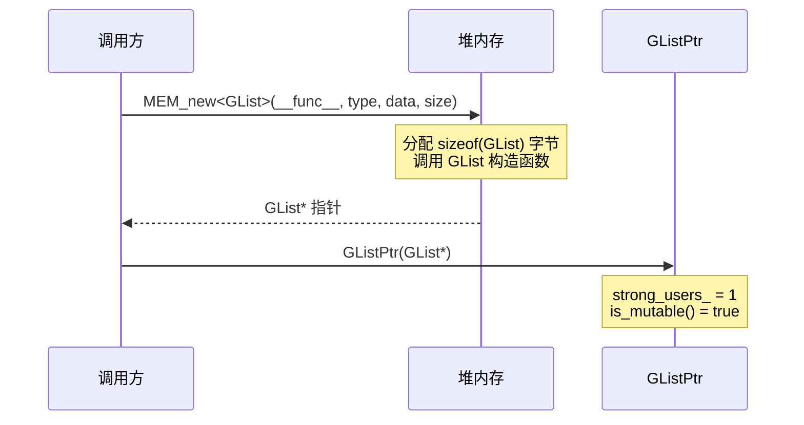

### `from_garray` — 从 GArray 创建

```cpp
GListPtr GList::from_garray(GArray<> array)
{
  auto *sharable_data = new ImplicitSharedValue<GArray<>>(std::move(array));
  ArrayData array_data;
  array_data.data = sharable_data->data.data();
  array_data.sharing_info = ImplicitSharingPtr<>(sharable_data);
  return GList::create(
      sharable_data->data.type(), std::move(array_data), sharable_data->data.size());
}
```

**逐步解析**：

1. **`new ImplicitSharedValue<GArray<>>(std::move(array))`** — 将 `GArray<>` 移动到堆上的共享包装中。`ImplicitSharedValue<GArray<>>` 继承 `ImplicitSharingInfo`，内部持有 `GArray<> data` 成员。`std::move(array)` 窃取 `GArray` 的内部缓冲区指针（零拷贝），原 `array` 变空。

2. **`sharable_data->data.data()`** — `data` 是 `GArray<>` 成员，`.data()` 返回 `void*` 指向数组首元素。这个指针指向 `GArray` 内部管理的堆缓冲区。

3. **`ImplicitSharingPtr<>(sharable_data)`** — 用基类指针管理共享对象。`ImplicitSharedValue<GArray<>>*` 向上转型为 `ImplicitSharingInfo*`，引用计数 +1。

4. **`GList::create(...)`** — 用 `ArrayData`（包含数据指针 + 共享信息）创建 `GList`。

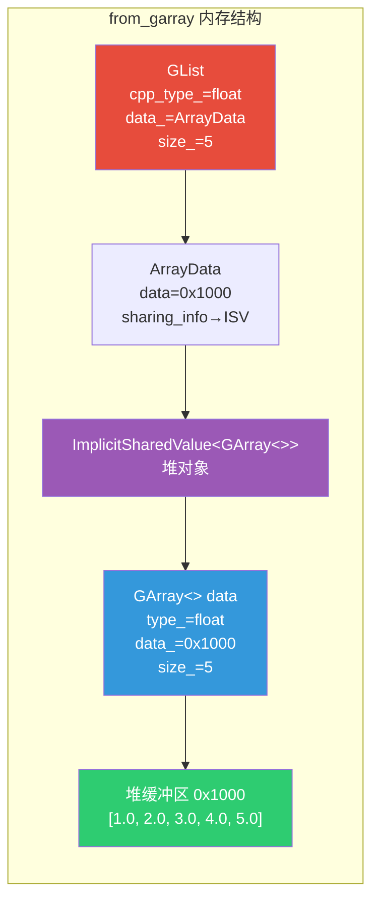

> **为什么 `from_garray` 和 `from_container` 实现不同？** `from_garray` 直接用 `new`（标准 C++ 分配），而 `from_container` 也用 `new`。两者模式相同——都是将容器包装进 `ImplicitSharedValue`，提取数据指针和共享信息，构造 `ArrayData`。区别在于 `from_garray` 的容器类型已知为 `GArray<>`，而 `from_container` 是模板，容器类型任意。

#### `from_container` — 从任意容器创建

```cpp
template<typename ContainerT> inline GListPtr GList::from_container(ContainerT &&container)
{
  using T = typename std::decay_t<ContainerT>::value_type;
  static_assert(std::is_convertible_v<ContainerT, MutableSpan<T>>);

// 将容器包装进 ImplicitSharedValue，使其可被多个 GList 共享
  auto *sharable_data = new ImplicitSharedValue<std::decay_t<ContainerT>>(
      std::forward<ContainerT>(container));

  ArrayData array_data;
  array_data.data = sharable_data->data.data();         // 指向容器内部数据
  array_data.sharing_info = ImplicitSharingPtr<>(sharable_data);  // 引用计数管理
  return GList::create(CPPType::get<T>(), std::move(array_data), sharable_data->data.size());
}
```

**逐步解析**：
> **`std::decay_t<ContainerT>`**：`std::decay` 是 C++ 类型特征（type trait），名字来源于"退化"——模拟函数参数传值时的类型转换规则。`decay_t` 是 `decay::type` 的别名。它对类型做三件事：① 移除引用（`Vector<int>&` → `Vector<int>`）；② 移除 cv 限定符（`const Vector<int>` → `Vector<int>`）；③ 将数组和函数类型转为指针（`int[5]` → `int*`）。这里主要用前两个：`ContainerT` 可能是 `Vector<int>&` 或 `const Vector<int>&&` 等，`std::decay_t` 统一变为 `Vector<int>`，确保 `ImplicitSharedValue<Vector<int>>` 存储的是值类型而非引用。

> **`std::decay_t<ContainerT>::value_type` 是否受 `decay_t` 影响？** **是的**。如果不用 `decay_t`，`ContainerT` 可能是 `Vector<int>&`（引用类型），而引用类型没有 `value_type` 成员——`Vector<int>&::value_type` 是编译错误。`decay_t` 先移除引用得到 `Vector<int>`，然后 `Vector<int>::value_type` 才能正确求值为 `int`。

> **`std::forward<ContainerT>(container)`**：完美转发——如果传入的是左值引用则拷贝，如果是右值引用则移动，避免不必要的拷贝。

> **`ImplicitSharedValue<std::decay_t<ContainerT>>`**：将容器包装进隐式共享值。`ImplicitSharedValue<T>` 继承 `ImplicitSharingInfo`，内部持有 `T data` 成员。它将引用计数和实际数据绑定在同一个堆对象中——当引用计数归零时，`delete this` 会同时释放引用计数和容器数据。

> **`ImplicitSharingPtr<>(sharable_data)`**：`ImplicitSharingPtr` 的模板声明是 `template<typename T = ImplicitSharingInfo, bool IsStrong = true>`，所以 `ImplicitSharingPtr<>` 等价于 `ImplicitSharingPtr<ImplicitSharingInfo, true>`——默认 `T` 为 `ImplicitSharingInfo`。这里将 `ImplicitSharedValue<...>*` 传入构造函数，通过基类指针向上转型（`ImplicitSharedValue` 继承 `ImplicitSharingInfo`），`ImplicitSharingPtr` 管理的是基类指针，但析构时通过虚函数 `delete_self_with_data()` 正确释放整个派生类对象。

> **`static_assert(std::is_convertible_v<ContainerT, MutableSpan<T>>)`** — 编译期检查：容器必须能转换为 `MutableSpan<T>`。这限制了 `from_container` 只接受连续内存容器（`Vector`、`Array` 等），排除 `std::list`、`std::map` 等。

> **`CPPType::get<T>()`** — 获取 `T` 类型的全局 `CPPType` 单例。与 `from_garray` 中 `sharable_data->data.type()` 不同——`from_container` 用编译期类型 `T`，`from_garray` 用运行时 `GArray` 的 `type()` 方法。

### `decltype` vs `std::decay_t` 的区别？
>
> | | `decltype(expr)` | `std::decay_t<T>` |
> |---|---|---|
> | 作用 | 获取表达式的**声明类型** | 对类型做**退化转换** |
> | 输入 | 表达式 | 类型 |
> | 保留引用？ | 是（`decltype(x)` → `int&`） | 否（`decay_t<int&>` → `int`） |
> | 保留 const？ | 是（`decltype(x)` → `const int`） | 否（`decay_t<const int>` → `int`） |
> | 数组处理 | `int[5]` 保持不变 | `int[5]` → `int*` |
> | 函数处理 | `void(int)` 保持不变 | `void(int)` → `void(*)(int)` |
> | 用途 | "这个表达式的类型是什么？" | "传值后类型变成什么？" |
>
> ```cpp
> Vector<int> vec;
> const Vector<int>& ref = vec;
>
> decltype(ref)       → const Vector<int>&   // 保留引用和 const
> std::decay_t<decltype(ref)> → Vector<int>  // 退化：去引用、去 const
> std::decay_t<decltype(vec)> → Vector<int>  // 退化：去引用（无 const）
> ```
>
> 在 `from_container` 中，`ContainerT` 通过模板推导得到（可能带引用和 cv），`decay_t` 将其退化为纯值类型，用于 `ImplicitSharedValue<纯值类型>` 的模板参数。

---

## 5. DataVariant：ArrayData 与 SingleData

`GList` 使用 `std::variant<ArrayData, SingleData>` 来支持两种截然不同的存储策略：

> **`std::variant<A, B>` 是什么？** C++17 引入的**类型安全联合体**。它可以在同一时刻存储其模板参数列表中的**一种**类型，并在运行时记住当前存储的是哪种类型。与 C 的 `union` 不同：`std::variant` 知道当前持有哪种类型（内置判别器），支持非平凡类型（有析构函数的类），通过 `std::get` / `std::get_if` 安全访问。`std::variant<ArrayData, SingleData>` 表示一个值要么是 `ArrayData`，要么是 `SingleData`，运行时通过判别器跟踪当前是哪种。

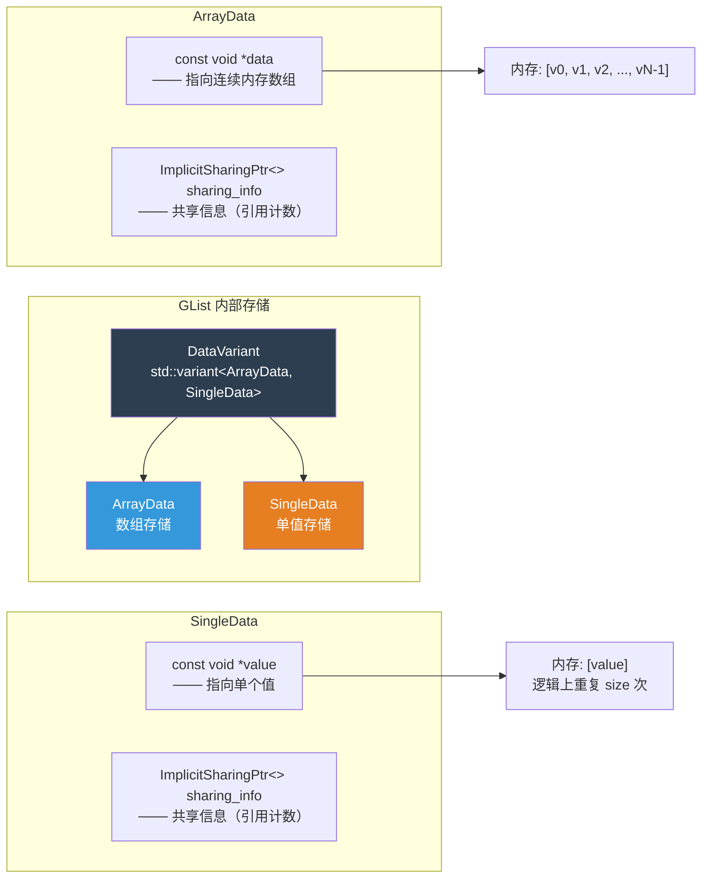

### ArrayData — 数组存储

当列表中的元素各不相同时使用。数据存储为连续内存数组。

```cpp
class ArrayData {
 public:
  const void *data;              // 指向数组首元素（const 因为使用隐式共享）
  ImplicitSharingPtr<> sharing_info;  // 共享/所有权信息

  // 工厂方法
  static ArrayData ForValue(const GPointer &value, int64_t size);
  static ArrayData ForDefaultValue(const CPPType &type, int64_t size);
  static ArrayData ForConstructed(const CPPType &type, int64_t size);
  static ArrayData ForUninitialized(const CPPType &type, int64_t size);

  GMutableSpan span_for_write(const CPPType &type, int64_t size);
};
```

#### ForValue — 用同一个值填充数组

```cpp
GList::ArrayData GList::ArrayData::ForValue(const GPointer &value, const int64_t size)
{
  GList::ArrayData data{};
  const CPPType &type = *value.type();
  const void *value_ptr = type.default_value();

  void *new_data;
  // 优化：如果填充值恰好是零，使用 calloc（更快）
  if (memory_is_zero(value_ptr, type.size)) {
    new_data = MEM_new_array_zeroed_aligned(size, type.size, type.alignment, __func__);
  }
  else {
    new_data = MEM_new_array_uninitialized_aligned(size, type.size, type.alignment, __func__);
    type.fill_construct_n(value_ptr, new_data, size);  // 逐个拷贝构造
  }

  data.data = new_data;
  data.sharing_info = sharing_ptr_for_array(new_data, size, type);
  return data;
}
```

> **`memory_is_zero`**：检查一段内存是否全为零字节。对于浮点数 0.0、整数 0、空指针等，底层表示都是全零，因此 `calloc` 可以替代 `fill_construct_n`，性能更好。

> **`MEM_new_array_zeroed_aligned`** / **`MEM_new_array_uninitialized_aligned`**：Blender 的内存分配器，支持对齐分配。`zeroed` 版本等价于 `calloc`，`uninitialized` 版本等价于 `malloc`。

#### ForUninitialized — 分配但不初始化

```cpp
GList::ArrayData GList::ArrayData::ForUninitialized(const CPPType &type, const int64_t size)
{
  GList::ArrayData data{};
  void *new_data = MEM_new_array_uninitialized_aligned(size, type.size, type.alignment, __func__);
  data.data = new_data;
  data.sharing_info = sharing_ptr_for_array(new_data, size, type);
  return data;
}
```

> **为什么不初始化？** 当调用者会立即用数据覆盖整个数组时（例如字段求值结果直接写入），跳过初始化可以避免无意义的零填充开销。这是 C++ 中的常见优化模式。

### SingleData — 单值存储

当列表中所有元素都相同时使用。只存储一个值，逻辑上重复 `size` 次。这是一种**压缩表示**。

```cpp
class SingleData {
 public:
  const void *value;              // 指向单个值（const 因为使用隐式共享）
  ImplicitSharingPtr<> sharing_info;  // 共享/所有权信息

  static SingleData ForValue(const GPointer &value);
  static SingleData ForDefaultValue(const CPPType &type);

  GMutablePointer value_for_write(const CPPType &type);
};
```

### 何时使用哪种存储？

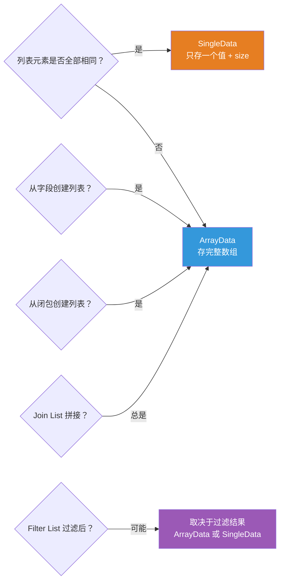

### values() — 统一访问接口

无论内部使用哪种存储，`values()` 都提供统一的访问方式：

```cpp
std::variant<GSpan, GPointer> GList::values() const
{
  if (const auto *array_data = std::get_if<ArrayData>(&data_)) {
    return GSpan(cpp_type_, array_data->data, size_);  // 返回跨度视图
  }
  if (const auto *single_data = std::get_if<SingleData>(&data_)) {
    return GPointer(cpp_type_, single_data->value);    // 返回单值指针
  }
  BLI_assert_unreachable();
  return {};
}
```

> **`std::get_if`**：`std::variant` 的非抛出访问方法。返回指向当前活跃变体的指针，如果变体不活跃则返回 `nullptr`。比 `std::get` 更安全，因为不会抛出异常。

### varray() — 虚拟数组视图

`varray()` 将列表转换为 `GVArray`（泛型虚拟数组），使得列表可以像数组一样被索引访问：

```cpp
GVArray GList::varray() const
{
  if (const auto *array_data = std::get_if<ArrayData>(&data_)) {
    // ArrayData → 基于跨度的 VArray（直接内存访问）
    return GVArray::from_span(GSpan(cpp_type_, array_data->data, size_));
  }
  if (const auto *single_data = std::get_if<SingleData>(&data_)) {
    // SingleData → 基于单值的 VArray（每个索引返回同一个值）
    return GVArray::from_single_ref(cpp_type_, size_, single_data->value);
  }
  BLI_assert_unreachable();
  return {};
}
```

> **`GVArray::from_span`**：创建一个直接映射到内存跨度的虚拟数组，O(1) 随机访问。
>
> **`GVArray::from_single_ref`**：创建一个"虚拟"数组，所有索引都返回同一个值的引用。这是 SingleData 压缩表示的核心——不需要真正复制 N 份，只需在访问时假装有 N 份。

---

## 6. 隐式共享与写时复制

隐式共享（Implicit Sharing）是 Blender 中广泛使用的零拷贝优化技术。`GList` 通过继承 `ImplicitSharingMixin` 并配合自定义的 `ImplicitSharingInfo` 子类来实现。

### 核心类层次

Blender 的隐式共享系统由三个核心类组成，定义在 [BLI_implicit_sharing.hh](../../source/blender/blenlib/BLI_implicit_sharing.hh) 和 [BLI_implicit_sharing_ptr.hh](../../source/blender/blenlib/BLI_implicit_sharing_ptr.hh)：

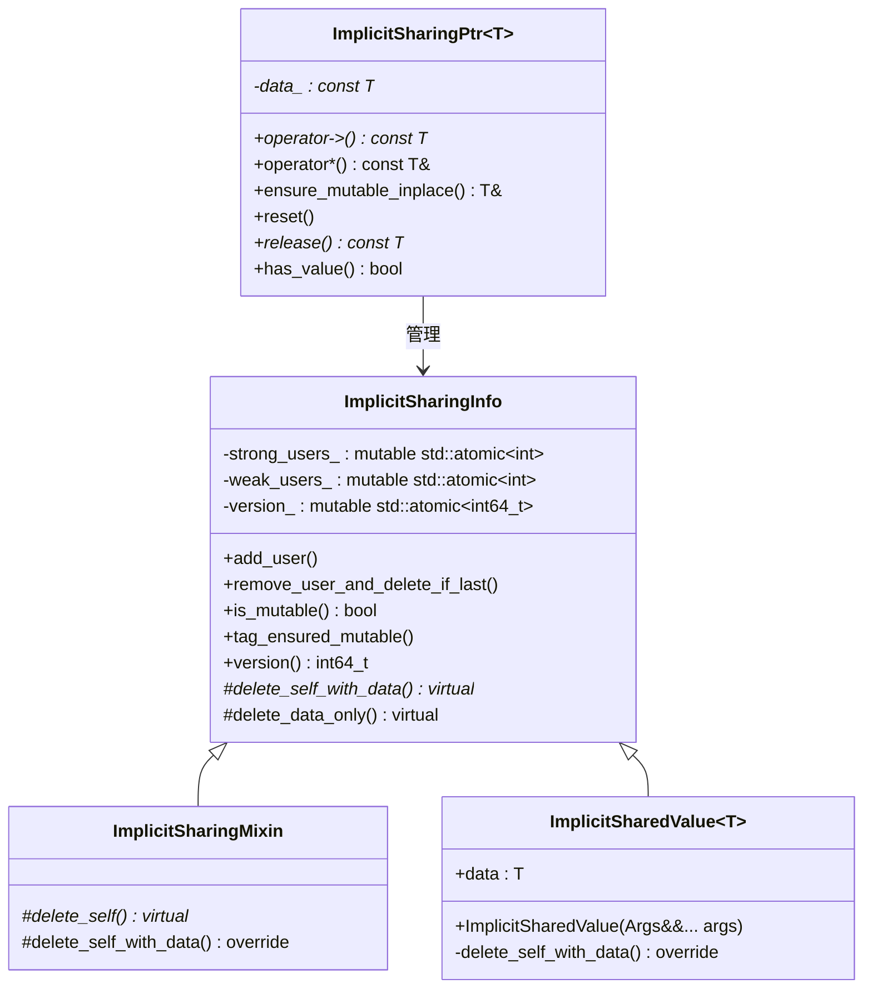

#### ImplicitSharingInfo — 引用计数基类

`ImplicitSharingInfo` 是隐式共享的核心，维护三个原子计数器：

| 字段 | 类型 | 初始值 | 说明 |
|------|------|--------|------|
| `strong_users_` | `std::atomic<int>` | 1 | 强引用计数。1=可变，>1=共享不可变，0=已过期 |
| `weak_users_` | `std::atomic<int>` | 1 | 弱引用计数。允许观察数据是否被释放，但不阻止释放 |
| `version_` | `std::atomic<int64_t>` | 0 | 版本号。每次 `tag_ensured_mutable()` 时递增，用于检测数据是否被修改 |

> **`is_mutable()`**：`strong_users_ == 1` 时返回 `true`，表示只有一个拥有者，可以就地修改。

> **`tag_ensured_mutable()`**：在修改数据前调用，递增 `version_`。其他代码可以通过比较 `version()` 来检测数据是否被修改过。

> **虚函数 `delete_self_with_data()`**：纯虚函数，由子类实现，负责释放共享信息和关联的数据。这是多态析构的关键——`ImplicitSharingPtr` 持有基类指针，但通过虚函数正确释放派生类对象。

#### ImplicitSharingMixin — 嵌入式共享基类

`ImplicitSharingMixin` 用于将隐式共享行为**嵌入**到另一个类中（如 `GList`）。它将 `delete_self_with_data()` 拆分为两步：

```cpp
class ImplicitSharingMixin : public ImplicitSharingInfo {
 private:
  void delete_self_with_data() override
  {
    this->delete_self();  // 子类实现，负责 delete this
  }
  virtual void delete_self() = 0;
};
```

> **为什么需要 `ImplicitSharingMixin`？** 当共享信息本身就是数据的一部分时（如 `GList` 既是共享信息又包含数据），使用 `ImplicitSharingMixin`。而当共享信息和数据分离时（如数组数据在另一块内存中），使用 `ImplicitSharedValue<T>` 或自定义子类。

#### ImplicitSharedValue\<T\> — 通用共享值包装

`ImplicitSharedValue<T>` 是最简单的共享方式——将任意类型 `T` 包装为可共享的堆对象：

```cpp
template<typename T> class ImplicitSharedValue : public ImplicitSharingInfo {
 public:
  T data;  // 实际数据

  template<typename... Args>
  ImplicitSharedValue(Args &&...args) : data(std::forward<Args>(args)...)
  {
  }

 private:
  void delete_self_with_data() override
  {
    delete this;  // 同时释放引用计数和 T data
  }
};
```

> **使用示例**：`from_container` 中 `new ImplicitSharedValue<Vector<float>>(std::move(vector))` 将整个 `Vector<float>` 包装为共享对象。`ImplicitSharedValue` 的 `data` 成员就是 `Vector<float>`，引用计数归零时 `delete this` 会自动析构 `Vector`。

> **`MEM_CXX_CLASS_ALLOC_FUNCS`**：Blender 的内存追踪宏，重载 `operator new` 使用 `MEM_mallocN`，使 `ImplicitSharedValue` 的分配出现在内存泄漏报告中。

#### ImplicitSharingPtr\<T\> — 智能指针

`ImplicitSharingPtr<T>` 是管理 `ImplicitSharingInfo` 子类生命周期的智能指针，类似于 `std::shared_ptr` 但要求引用计数嵌入在数据中：

```cpp
template<typename T = ImplicitSharingInfo, bool IsStrong = true> class ImplicitSharingPtr {
 private:
  const T *data_ = nullptr;
  // ...
};
```

> **`T = ImplicitSharingInfo`**：默认模板参数。所以 `ImplicitSharingPtr<>` 等价于 `ImplicitSharingPtr<ImplicitSharingInfo, true>`——持有基类指针，强引用。当传入 `ImplicitSharedValue<...>*` 时，通过基类指针向上转型，析构时通过虚函数 `delete_self_with_data()` 正确释放整个派生类对象。

> **`IsStrong = true`**：强引用会增加 `strong_users_`，阻止数据被释放。`IsStrong = false` 时是弱引用（`WeakImplicitSharingPtr`），只增加 `weak_users_`，不阻止数据释放，但能检测数据是否已过期。

> **`ensure_mutable_inplace()`**：如果数据被共享（`strong_users_ > 1`），调用 `data_->copy()` 创建副本；否则直接返回可变引用。这是写时复制的核心操作。

> **与 `std::shared_ptr` 的区别**：`std::shared_ptr` 的引用计数在控制块中（与数据分离），而 `ImplicitSharingPtr` 的引用计数嵌入在数据对象中（继承 `ImplicitSharingInfo`）。这减少了内存分配次数，但要求被管理类型必须继承 `ImplicitSharingInfo`。

### CPPType — 运行时类型信息

`CPPType` 定义在 [BLI_cpp_type.hh](../../source/blender/blenlib/BLI_cpp_type.hh)，是 Blender 的**运行时类型信息**（RTTI）系统。它将 C++ 类型的操作（构造、析构、拷贝、移动、比较、哈希等）存储为函数指针，使得在类型擦除后仍能正确操作数据：

```cpp
class CPPType : NonCopyable, NonMovable {
 public:
  int64_t size = 0;           // sizeof(T)
  int64_t alignment = 0;      // alignof(T)
  bool is_trivial = false;    // std::is_trivial_v<T>
  bool is_trivially_destructible = false;  // std::is_trivially_destructible_v<T>
  // ...

 private:
  void (*default_construct_)(void *ptr) = nullptr;
  void (*destruct_)(void *ptr) = nullptr;
  void (*copy_construct_)(const void *src, void *dst) = nullptr;
  void (*move_construct_)(void *src, void *dst) = nullptr;
  bool (*is_equal_)(const void *a, const void *b) = nullptr;
  uint64_t (*hash_)(const void *value) = nullptr;
  // ...
};
```

> **为什么不用 C++ 自带的 `typeid`？** `typeid` 只提供类型名称和比较，不提供构造/析构/拷贝等操作。`CPPType` 是一个完整的类型擦除系统——通过 `CPPType::get<float>()` 获取 `float` 类型的 `CPPType` 实例，就可以在不知道具体类型的情况下对 `void*` 数据执行 `copy_construct`、`destruct` 等操作。

> **在列表系统中的作用**：`GList` 存储 `const CPPType& cpp_type_`，通过它操作 `void*` 数据。例如 `GList::ArrayData::span_for_write` 中 `type.copy_construct_n(this->data, new_data, size)` 就是通过 `CPPType` 的函数指针逐个拷贝构造元素。

### 模板函数为什么放在 .hh 文件中？为什么需要 `inline`？

```cpp
template<typename ContainerT> inline GListPtr GList::from_container(ContainerT &&container)
```

**为什么模板函数必须放在头文件中？** C++ 编译模型要求模板定义在实例化点可见。编译器在实例化 `from_container<Vector<int>>` 时需要看到完整的函数体，如果函数体在 .cc 文件中，其他编译单元无法实例化该模板。这是 C++ 的根本限制，不是 Blender 特有的。

**为什么还需要 `inline`？** 严格来说，模板函数已经有隐式的 `inline` 语义（模板定义在头文件中不会导致多重定义错误）。但显式写 `inline` 有两个好处：
1. **文档性**：明确告诉读者"此函数定义在头文件中，可能被多个编译单元实例化"
2. **编译器提示**：建议编译器内联展开此函数（虽然编译器可以忽略）
3. **历史惯例**：Blender 代码库中模板函数通常都写 `inline`，保持一致性

### 自定义共享信息类

在 [geometry_nodes_list.cc](../../source/blender/nodes/intern/geometry_nodes_list.cc) 中定义了两个自定义共享信息类：

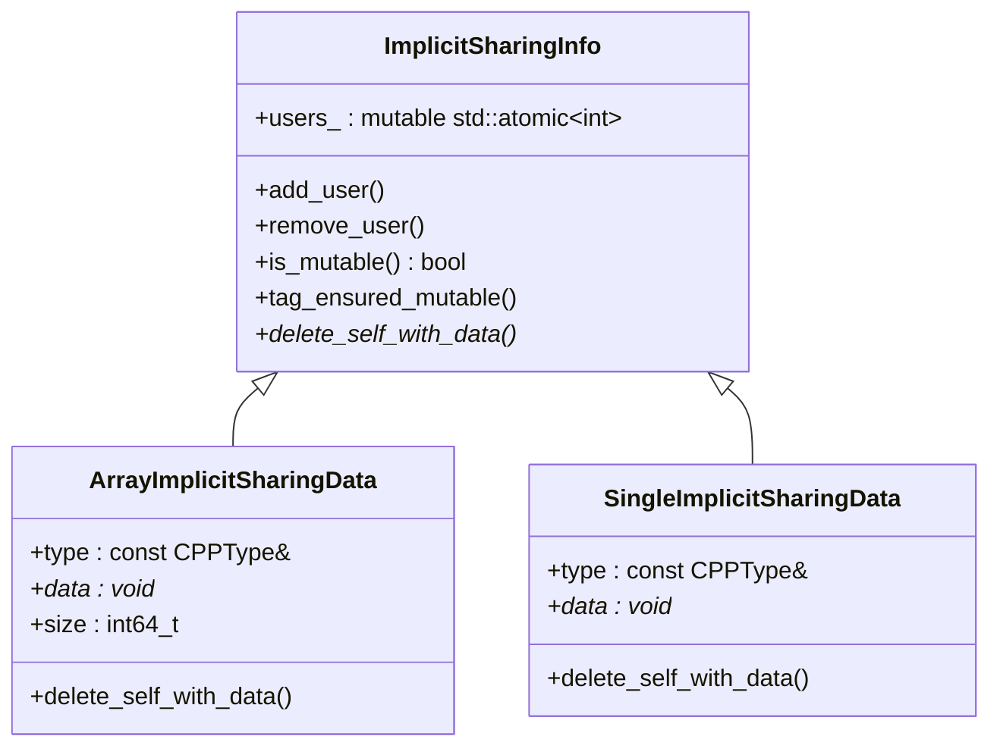

### 为什么需要自定义共享信息？

对于**平凡可析构类型**（如 `float`、`int`），释放内存只需调用 `MEM_freeN`。但对于**非平凡析构类型**（如 `std::string`、`GeometrySet`、`BundlePtr`），释放前必须逐个调用析构函数。

```cpp
// 平凡可析构类型 → 使用标准共享信息（无需存储类型和大小）
static ImplicitSharingPtr<> sharing_ptr_for_array(void *data,
                                                  const int64_t size,
                                                  const CPPType &type)
{
  if (type.is_trivially_destructible) {
    // 简单情况：只需释放内存，不需要析构
    return ImplicitSharingPtr<>(implicit_sharing::info_for_mem_free(data));
  }
  // 复杂情况：需要存储类型和大小以便正确析构
  return ImplicitSharingPtr<>(MEM_new<ArrayImplicitSharingData>(__func__, data, size, type));
}
```

`ArrayImplicitSharingData::delete_self_with_data` 的实现：

```cpp
void ArrayImplicitSharingData::delete_self_with_data() override
{
  type.destruct_n(this->data, this->size);  // 逐个析构数组元素
  MEM_delete_void(this->data);               // 释放数组内存
  MEM_delete(this);                          // 释放共享信息自身
}
```

> **`MEM_delete_void`** vs **`MEM_delete`**：`MEM_delete` 会调用析构函数后释放内存；`MEM_delete_void` 只释放内存不调用析构函数（用于已经手动析构过的情况）。

### 写时复制（Copy-on-Write）

`GListPtr::get_for_write()` 是写时复制的入口：

```cpp
inline GList &GListPtr::get_for_write()
{
  BLI_assert(data_);
  if (!data_->is_mutable()) {
    // 数据被共享 → 创建副本
    *this = data_->copy();
  }
  BLI_assert(data_->is_mutable());
  data_->tag_ensured_mutable();
  return const_cast<GList &>(*data_);
}
```

`GList::copy()` 的实现：

```cpp
GListPtr GList::copy() const
{
  // 注意：这里只复制 GList 对象本身（包含 DataVariant）
  // DataVariant 中的 sharing_info 会增加引用计数（浅拷贝）
  // 真正的深拷贝发生在 span_for_write / value_for_write 中
  return GList::create(cpp_type_, data_, size_);
}
```

> **关键理解**：`GList::copy()` 创建的是**浅拷贝**——新的 `GList` 对象共享同一块底层数据。只有当调用者通过 `span_for_write()` 或 `value_for_write()` 请求写入权限时，才会触发真正的深拷贝。

### ArrayData::span_for_write — 按需深拷贝

```cpp
GMutableSpan GList::ArrayData::span_for_write(const CPPType &type, int64_t size)
{
  if (this->sharing_info && !this->sharing_info->is_mutable()) {
    // 数据被共享 → 深拷贝
    void *new_data = MEM_new_array_uninitialized_aligned(
        size, type.size, type.alignment, __func__);
    type.copy_construct_n(this->data, new_data, size);  // 逐个拷贝构造
    this->data = new_data;
    this->sharing_info = sharing_ptr_for_array(new_data, size, type);
  }
  if (this->sharing_info) {
    this->sharing_info->tag_ensured_mutable();
  }
  return {type, const_cast<void *>(this->data), size};
}
```

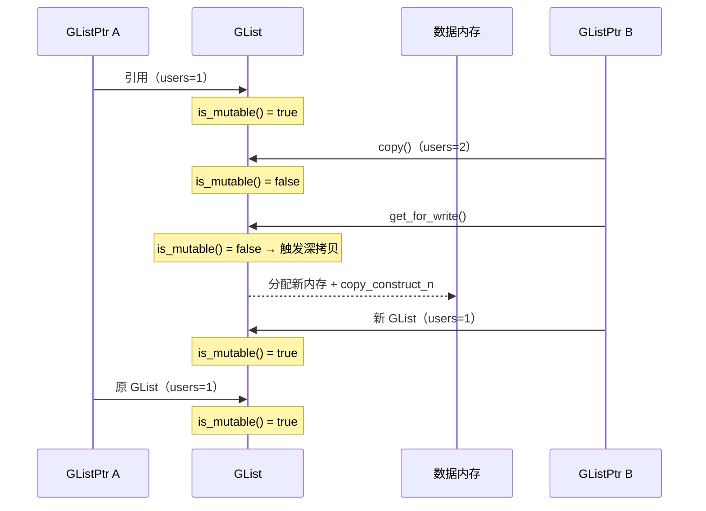

---

## 7. List\<T\> — 类型化列表的零开销抽象

`List<T>` 是 `GList` 的类型化包装，提供类型安全的接口。关键在于它是**零开销抽象**——`List<T>` 和 `GList` 在内存中布局完全相同。

### 零开销保证

```cpp
template<typename T> class List {
 private:
  GList list_;  // 唯一成员

  friend GList;  // 允许 GList 访问私有成员

 public:
  // 通过 reinterpret_cast 实现 GList ↔ List<T> 互转
  operator const GList &() const { return list_; }
};
```

> **`friend GList;` 的作用**：允许 `GList` 类访问 `List<T>` 的私有成员 `list_`。这是两者"零开销互转"设计的基础——`GList::typed<T>()` 通过 `reinterpret_cast` 将 `GList` 内存重新解释为 `List<T>`，而 `List<T>` 的隐式转换运算符 `operator const GList &()` 需要返回私有成员 `list_`。没有 `friend GList;`，`GList` 的方法无法访问 `List<T>` 的私有成员，两者就无法互相操作对方的内部数据。

`GList::typed<T>()` 的实现证实了零开销：

```cpp
template<typename T> inline const List<T> &GList::typed() const
{
  static_assert(sizeof(GList) == sizeof(List<T>));  // 编译期大小检查
  BLI_assert(this->cpp_type().is<T>());             // 运行期类型检查
  return reinterpret_cast<const List<T> &>(*this);  // 零开销转换
}
```

> **`reinterpret_cast`**：C++ 中最危险的类型转换，直接重新解释内存。在这里是安全的，因为 `static_assert` 保证了内存布局相同，`BLI_assert` 保证了类型匹配。

### 类型化接口

```cpp
template<typename T> inline VArray<T> List<T>::varray() const
{
  return list_.varray().template typed<T>();  // GList::varray() → VArray<T>
}
```

> **`.template typed<T>()` 是什么语法？** 这是 C++ 的**依赖模板成员调用语法**。当在依赖模板参数的上下文中调用成员模板时，必须在模板名前加 `template` 关键字，告诉编译器 `typed` 是一个模板而非比较运算符 `<`。

> **为什么需要 `template` 关键字？** 在 `list_.varray()` 的返回类型依赖于 `List<T>` 的模板参数 `T`（这是依赖类型），编译器在解析 `list_.varray().typed<T>()` 时不知道 `typed` 是模板还是变量名——`typed < T > ()` 可能被解析为 `typed < T`（比较表达式）`> ()`（语法错误）。加上 `.template typed<T>()` 明确告诉编译器：`typed` 是模板名，`<T>` 是模板参数，不是比较运算符。

> **什么时候必须写 `.template`？** 当满足两个条件时：①表达式的类型依赖于模板参数（依赖类型）；②调用的成员是模板。例如 `list_.varray()` 返回 `GVArray`，其类型依赖于 `List<T>` 的 `T`，而 `typed<T>()` 是 `GVArray` 的成员模板，所以必须写 `.template`。

> **对比：非依赖类型不需要 `.template`**：如果类型不依赖模板参数，如 `GVArray varray; varray.typed<float>()`，编译器已经知道 `GVArray::typed` 是模板，不需要 `.template` 前缀。
```cpp
template<typename T> inline std::variant<Span<T>, const T *> List<T>::values() const
{
  const std::variant<GSpan, GPointer> values = list_.values();
  if (const auto *span_values = std::get_if<GSpan>(&values)) {
    return span_values->typed<T>();    // GSpan → Span<T>
  }
  if (const auto *single_value = std::get_if<GPointer>(&values)) {
    return single_value->get<T>();     // GPointer → const T*
  }
  BLI_assert_unreachable();
  return {};
}
```

### foreach — 便捷遍历

```cpp
template<typename T> template<typename Fn>
inline void List<T>::foreach(Fn &&fn) const
{
  const std::variant<Span<T>, const T *> values = this->values();
  if (const auto *span_values = std::get_if<Span<T>>(&values)) {
    for (const T &value : *span_values) {
      fn(value);  // 数组存储：逐个访问
    }
  }
  else if (const auto *single_value = std::get_if<const T *>(&values)) {
    fn(**single_value);  // 单值存储：只调用一次
  }
}
```

> **`fn(**single_value)`**：第一层 `*` 解引用 `const T*` 指针得到 `const T&`，第二层...不对。`single_value` 是 `const T**` 类型（指向指针的指针），`*single_value` 得到 `const T*`，`**single_value` 得到 `const T&`。

### C++20 Concepts 约束

`List<T>::from_container` 使用了 C++20 的 `requires` 约束：

```cpp
template<typename ContainerT>
  requires std::is_same_v<typename ContainerT::value_type, T>
static ListPtr<T> from_container(ContainerT &&container);
```

> **`requires` 子句**：C++20 Concepts 语法。这行代码约束 `ContainerT` 的 `value_type` 必须与 `T` 相同。例如 `List<float>::from_container(Vector<float>&&)` 可以编译，但 `List<float>::from_container(Vector<int>&&)` 会在编译期报错。这比 SFINAE 更清晰直观。

而它的**类外定义**使用了嵌套模板声明：

```cpp
template<typename T>
template<typename ContainerT>
  requires std::is_same_v<typename ContainerT::value_type, T>
inline ListPtr<T> List<T>::from_container(ContainerT &&container)
{
  return GList::from_container(std::forward<ContainerT>(container)).template typed<T>();
}
```

> **为什么有两个 `template<>` 行？** 这是类模板的成员模板的类外定义语法。`List<T>` 本身是类模板（第一个 `template<typename T>`），而 `from_container` 是它的成员函数模板（第二个 `template<typename ContainerT>`）。在类外定义时，必须分别列出类模板参数和成员模板参数。

> **调用时什么样子？** 由于 `T` 可以从 `List<T>` 推断，`ContainerT` 可以从函数参数推断，所以调用时不需要显式指定任何模板参数：
> ```cpp
> Vector<float> vec = {1.0f, 2.0f, 3.0f};
> ListPtr<float> list = List<float>::from_container(std::move(vec));
> // T = float（从 List<float> 得到）
> // ContainerT = Vector<float>&&（从 std::move(vec) 推断）
> ```
> 编译器会自动推导：`T` = `float`（来自 `List<float>`），`ContainerT` = `Vector<float>&&`（来自右值引用参数）。`requires` 约束会检查 `Vector<float>::value_type` 是否为 `float`——是的，所以编译通过。

> **`.template typed<T>()`**：这里 `GList::from_container(...)` 返回 `GListPtr`，`.typed<T>()` 是 `GListPtr` 的成员模板。因为 `T` 是外层模板参数（依赖类型），所以必须加 `.template` 前缀告诉编译器 `typed` 是模板名。

---

## 8. GListPtr / ListPtr\<T\> — 智能指针与所有权

### GListPtr — 泛型列表智能指针

```cpp
class GListPtr {
 private:
  ImplicitSharingPtr<GList> data_;  // 引用计数智能指针

 public:
  GListPtr() = default;
  explicit GListPtr(const GList *data) : data_(data) {}
  explicit GListPtr(const CPPType &type) : GListPtr(MEM_new<GList>(__func__, type)) {}

  operator bool() const;
  const GList *operator->() const;  // ← 关键：重载箭头操作符
  const GList &operator*() const;

  const GList *get() const;
  GList &get_for_write();  // 写时复制入口
};
```

> **为什么 `GListPtr` 能直接访问 `GList` 的成员？** 因为 `GListPtr` 重载了 `operator->()`（箭头操作符）。当写 `list->cpp_type()` 时，编译器实际调用的是 `list.operator->()->cpp_type()`——先通过 `operator->()` 获取内部 `GList*` 指针，再访问 `GList` 的成员。
>
> ```cpp
> inline const GList *GListPtr::operator->() const
> {
>   return data_.get();  // ImplicitSharingPtr<GList>::get() → GList*
> }
> ```
>
> 这是 C++ 智能指针的标准模式——`std::unique_ptr`、`std::shared_ptr` 都重载了 `operator->()`，使得智能指针可以像裸指针一样使用 `->` 访问成员。`GListPtr` 的 `data_` 是 `ImplicitSharingPtr<GList>`，它的 `get()` 返回 `GList*`。
>
> **为什么 `ImplicitSharingPtr` 源码写 `const T *data_`，但 `get()` 返回的是 `GList*`？** 因为**模板实例化**——`T` 是类型的占位符，不是类型本身。当你写 `ImplicitSharingPtr<GList>` 时，编译器把所有 `T` 替换为 `GList`，生成一个专门的类：
>
> ```cpp
> // 你看到的源码（模板定义）
> template<typename T> class ImplicitSharingPtr {
>  private:
>   const T *data_ = nullptr;    // T 是占位符
>  public:
>   const T *get() const { return data_; }
> };
>
> // 编译器为 ImplicitSharingPtr<GList> 生成的实际代码
> class ImplicitSharingPtr<GList> {
>  private:
>   const GList *data_ = nullptr;   // T → GList ✅
>  public:
>   const GList *get() const { return data_; }  // 返回 const GList* ✅
> };
> ```
>
> 就像函数参数 `void foo(int x)` 中 `x` 是值的占位符（调用 `foo(42)` 时 `x` 变成 `42`），模板参数 `typename T` 是类型的占位符（实例化 `ImplicitSharingPtr<GList>` 时 `T` 变成 `GList`）。
>
> | 概念 | 函数 | 类模板 |
> |------|------|--------|
> | 定义 | `int foo(int x) { return x+1; }` | `template<typename T> class Ptr { T *data_; };` |
> | 占位符 | `x`（值的占位符） | `T`（类型的占位符） |
> | 实例化/调用 | `foo(42)` → `x=42` | `Ptr<GList>` → `T=GList` |
> | 结果 | `return 42+1` | `GList *data_` |
>
> **为什么 `ImplicitSharingPtr<GList>` 内部存的是 `GList*`（指针）而非 `GList`（值）？** 因为 `ImplicitSharingPtr` 是**共享所有权**的智能指针——多个 `GListPtr` 可以指向**同一个**堆上的 `GList` 对象，通过引用计数管理生命周期。如果存 `GList` 值，每个 `GListPtr` 都有自己的一份拷贝，无法共享，引用计数就失去了意义。
>
> ```cpp
> template<typename T> class ImplicitSharingPtr {
>  private:
>   const T *data_ = nullptr;  // ← 必须是指针，不能是值
> };
> ```
>
> | 存储方式 | 能否共享？ | 引用计数有意义？ | 写时复制可行？ |
> |---------|-----------|----------------|-------------|
> | `const T *data_`（指针）✅ | 多个 ptr 指向同一对象 | ✅ 计数 = 共享者数量 | ✅ 修改时检查计数 |
> | `T data_`（值）❌ | 每个 ptr 有独立拷贝 | ❌ 计数永远为 1 | ❌ 无需复制，但也无法共享 |
>
> 这和 `std::shared_ptr` 存指针而非值是同一个道理——**共享的前提是多个指针指向同一个对象**，只有堆上的对象才能被多个指针共享。
>
> ```mermaid
> flowchart LR
>     GP["GListPtr list"]
>     ISP["ImplicitSharingPtr&lt;GList&gt;<br/>data_"]
>     GL["GList<br/>cpp_type()<br/>size()<br/>varray()"]
> 
>     GP -->|"operator->()"| ISP -->|".get()"| GL
> 
>     code["list->cpp_type()"]
>     expanded["list.operator->()->cpp_type()<br/>= data_.get()->cpp_type()"]
> 
>     code -.->|"编译器展开"| expanded
> 
>     style GP fill:#9b59b6,color:#fff
>     style ISP fill:#f39c12,color:#fff
>     style GL fill:#2ecc71,color:#fff
> ```

### ListPtr\<T\> — 类型化列表智能指针

`ListPtr<T>` 不是 `ImplicitSharingPtr<List<T>>` 的别名（如前所述），而是一个独立的类，内部持有 `GListPtr`：

```cpp
template<typename T> class ListPtr {
 private:
  GListPtr data_;  // 内部持有 GListPtr

 public:
  operator bool() const;
  operator const GListPtr &() const;  // 隐式转换为 GListPtr
  const List<T> *operator->() const;
  const List<T> &operator*() const;
  const List<T> &get() const;
  List<T> &get_for_write();
};
```

### 提交历史中的重构

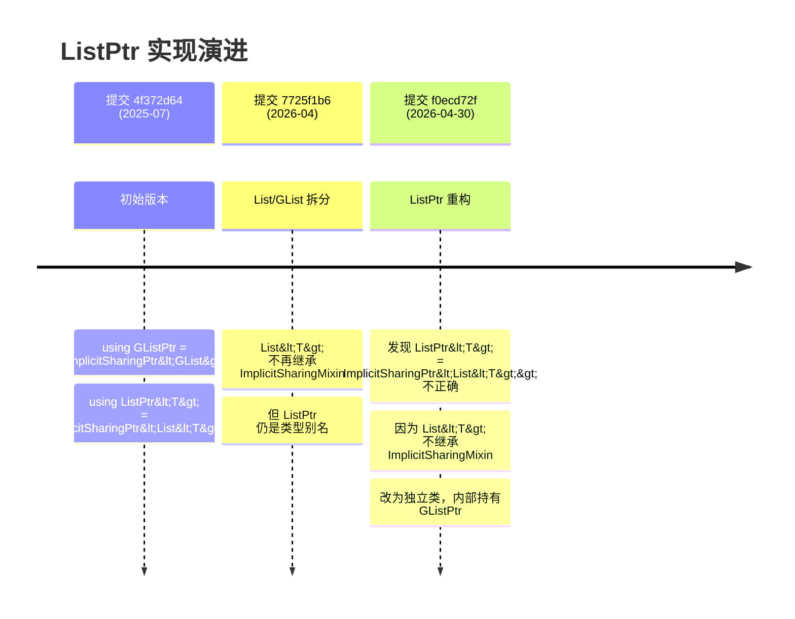

### 类型特征 is_ListPtr_v

```cpp
template<typename T> constexpr bool is_ListPtr_v = false;
template<typename T> constexpr bool is_ListPtr_v<ListPtr<T>> = true;
```

> **模板特化**：这是一个编译期类型检查工具。`is_ListPtr_v<ListPtr<float>>` 为 `true`，其他所有类型为 `false`。用于模板元编程中判断某个类型是否是 `ListPtr`。

---

## 9. SocketValueVariant 中的列表集成

`SocketValueVariant` 是几何节点中 Socket 值的统一容器，定义在 [BKE_node_socket_value.hh](../../source/blender/blenkernel/BKE_node_socket_value.hh)。列表作为其中一种值类型被集成。

### 判断与获取

```cpp
class SocketValueVariant {
 public:
  bool is_list() const;          // 判断是否存储了列表
  // 获取列表（通过模板参数推导）
  GListPtr get<GListPtr>() const;
};
```

### 在惰性函数求值中的分发

当函数节点被执行时，系统根据输入值的类型选择不同的求值路径（[geometry_nodes_lazy_function.cc](../../source/blender/nodes/intern/geometry_nodes_lazy_function.cc)）：

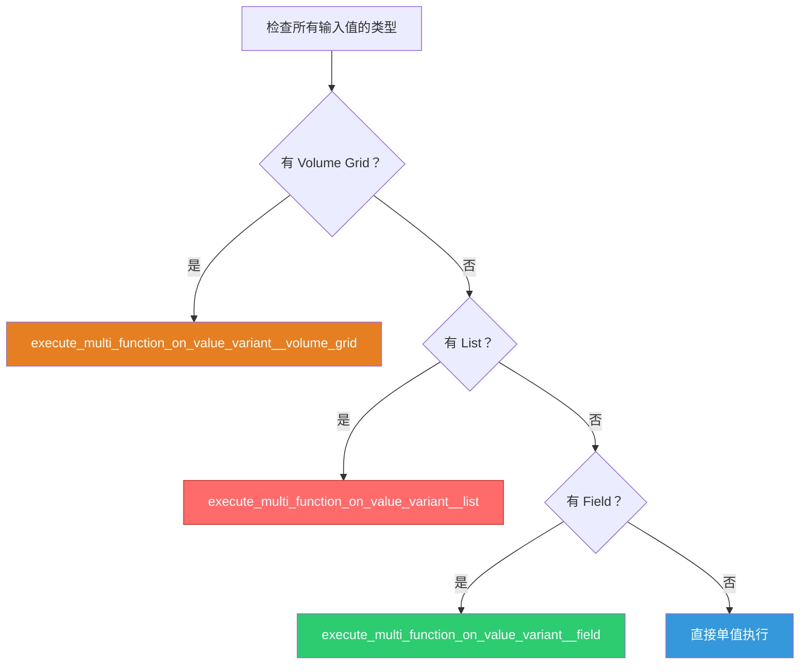

优先级：**Volume Grid > List > Field > Single**。这意味着如果一个函数节点同时接收列表和字段输入，会走列表路径（字段会被先求值为列表）。

---

## 10. DNA 存储结构

DNA（Blender 的数据序列化格式）中定义了列表节点的持久化存储结构。

### Field to List 的存储

```cpp
// 单个输出项
struct GeometryNodeFieldToListItem {
  eNodeSocketDatatype socket_type = SOCK_FLOAT;  // 数据类型
  char _pad[2] = {};                              // 对齐填充
  int identifier = 0;                             // 唯一标识符（用于 socket 命名）
  char *name = nullptr;                           // 显示名称
};

// 节点存储
struct GeometryNodeFieldToList {
  char _pad[4] = {};
  int next_identifier = 0;                        // 下一个可用标识符
  GeometryNodeFieldToListItem *items = nullptr;   // 输出项数组
  int items_num = 0;                              // 项数量
  int active_index = 0;                           // 当前选中项索引
};
```

### Closure to List 的存储

```cpp
struct GeometryNodeClosureToListItem {
  eNodeSocketDatatype socket_type = SOCK_FLOAT;
  NodeSocketInterfaceStructureType structure_type = NodeSocketInterfaceStructureType::Auto;
  char _pad[1] = {};
  int identifier = 0;
  char *name = nullptr;
};

struct GeometryNodeClosureToList {
  char _pad[4] = {};
  int next_identifier = 0;
  GeometryNodeClosureToListItem *items = nullptr;
  int items_num = 0;
  int active_index = 0;
};
```

> **注意差异**：`ClosureToListItem` 比 `FieldToListItem` 多了 `structure_type` 字段，因为闭包输出的每个项可以是单值、字段或列表，而 Field to List 的输出总是列表。

### Get List Item 的存储

```cpp
struct NodeGeometryListGetItem {
  eNodeSocketDatatype socket_type = SOCK_FLOAT;
  NodeSocketInterfaceStructureType structure_type = NodeSocketInterfaceStructureType::Auto;
  char _pad = {};
};
```

> **`_pad` 填充**：DNA 结构需要严格的对齐。编译器会自动插入填充字节，但 Blender 的 DNA 系统要求显式声明填充字段以确保跨平台一致性。

---

## 11. Socket 显示形状

列表 Socket 在节点编辑器中有独特的视觉形状，定义在 [DNA_node_types.h:125](../../source/blender/makesdna/DNA_node_types.h#L125)：

```cpp
enum eNodeSocketDisplayShape {
  SOCK_DISPLAY_SHAPE_CIRCLE = 0,       // ● 单值
  SOCK_DISPLAY_SHAPE_DIAMOND = 3,      // ◆ 字段
  SOCK_DISPLAY_SHAPE_VOLUME_GRID = 7,  // ▣ 体积网格
  SOCK_DISPLAY_SHAPE_LIST = 8,         // ☰ 列表（新增）
};
```

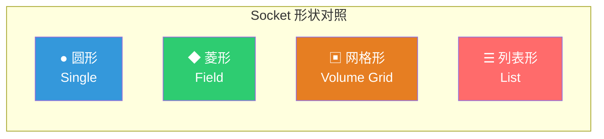

---

## 12. 文件组织与依赖关系

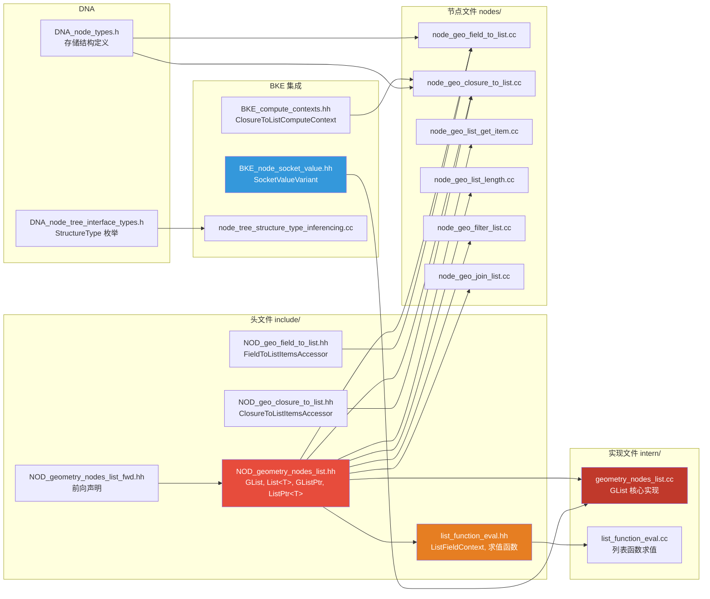

### 关键文件速查表

| 文件 | 职责 |
|------|------|
| [NOD_geometry_nodes_list_fwd.hh](../../source/blender/nodes/NOD_geometry_nodes_list_fwd.hh) | 前向声明，避免循环依赖 |
| [NOD_geometry_nodes_list.hh](../../source/blender/nodes/NOD_geometry_nodes_list.hh) | 核心数据结构定义 + 内联实现 |
| [geometry_nodes_list.cc](../../source/blender/nodes/intern/geometry_nodes_list.cc) | GList 非内联实现、隐式共享、深拷贝 |
| [list_function_eval.hh](../../source/blender/nodes/intern/list_function_eval.hh) | 列表函数求值接口 |
| [list_function_eval.cc](../../source/blender/nodes/intern/list_function_eval.cc) | 多函数在列表上的执行逻辑 |
| [NOD_geo_field_to_list.hh](../../source/blender/nodes/geometry/include/NOD_geo_field_to_list.hh) | Field to List 的 Socket Items Accessor |
| [NOD_geo_closure_to_list.hh](../../source/blender/nodes/geometry/include/NOD_geo_closure_to_list.hh) | Closure to List 的 Socket Items Accessor |

---

## 附录：关键 C++ 语法速查

| 语法 | 含义 | 示例 |
|------|------|------|
| `std::variant<A, B>` | 类型安全的联合体（C++17），同一时刻只存储一种类型，运行时跟踪当前类型 | `DataVariant = std::variant<ArrayData, SingleData>` |
| `std::get_if<T>(&v)` | 安全访问变体，返回指针（不抛异常） | `std::get_if<ArrayData>(&data_)` |
| `reinterpret_cast<T&>(x)` | 重新解释内存（危险但零开销） | `GList::typed<T>()` |
| `std::decay_t<T>` | 类型"退化"：移除引用、cv 限定符，数组/函数转指针。`decay_t` 是 `decay::type` 的别名，名字来源于模拟函数参数传值时的类型转换规则 | `std::decay_t<Vector<int>&>` → `Vector<int>` |
| `std::forward<T>(x)` | 完美转发 | `std::forward<ContainerT>(container)` |
| `ImplicitSharingInfo` | 隐式共享基类，维护原子引用计数（strong/weak/version），纯虚函数 `delete_self_with_data()` 实现多态析构 | `class GList : public ImplicitSharingMixin` |
| `ImplicitSharingMixin` | 嵌入式共享基类，将 `delete_self_with_data()` 拆为 `delete_self()` | `class GList : public ImplicitSharingMixin` |
| `ImplicitSharedValue<T>` | 通用共享值包装，继承 `ImplicitSharingInfo`，持有 `T data`，`delete this` 同时释放两者 | `new ImplicitSharedValue<Vector<float>>(std::move(v))` |
| `ImplicitSharingPtr<>` | 隐式共享智能指针，`<>` 使用默认模板参数 `ImplicitSharingInfo` | `ImplicitSharingPtr<>(sharable_data)` |
| `CPPType` | 运行时类型信息，将 C++ 类型的操作存为函数指针，使类型擦除后仍能操作 `void*` | `CPPType::get<float>()` |
| `requires` | C++20 Concepts 约束 | `requires std::is_same_v<...>` |
| `.template f<T>()` | 依赖模板成员调用语法。在依赖类型上调用成员模板时，必须加 `template` 前缀告诉编译器 `f` 是模板名而非比较运算符 | `varray.template typed<T>()` |
| `template<T> template<U>` | 类模板的成员模板的类外定义语法。第一个 `template` 对应类模板参数，第二个对应成员模板参数 | `List<T>::from_container<U>` |
| `static_assert` | 编译期断言 | `static_assert(sizeof(GList) == sizeof(List<T>))` |
| `BLI_assert` | Blender 运行期断言 | `BLI_assert(this->cpp_type().is<T>())` |
| `MEM_new<T>` | Blender 堆分配（调用构造函数） | `MEM_new<GList>(__func__, type)` |
| `MEM_delete` | Blender 堆释放（调用析构函数） | `MEM_delete(this)` |
| `ImplicitSharingPtr<T>` | 引用计数智能指针 | `ImplicitSharingPtr<GList>` |
| `ImplicitSharingMixin` | 支持隐式共享的基类 | `class GList : public ImplicitSharingMixin` |
| `template typed<T>()` | 模板方法调用 | `varray().template typed<T>()` |
