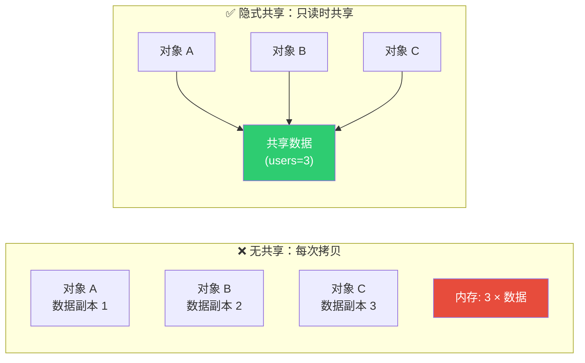
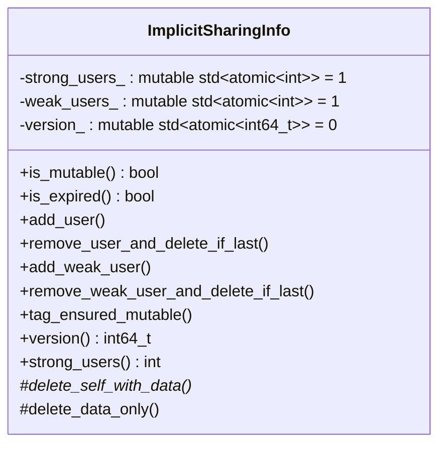
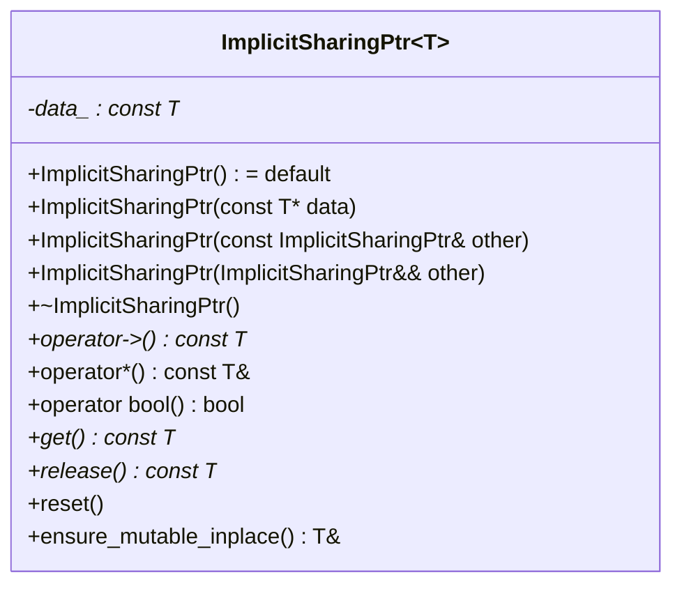
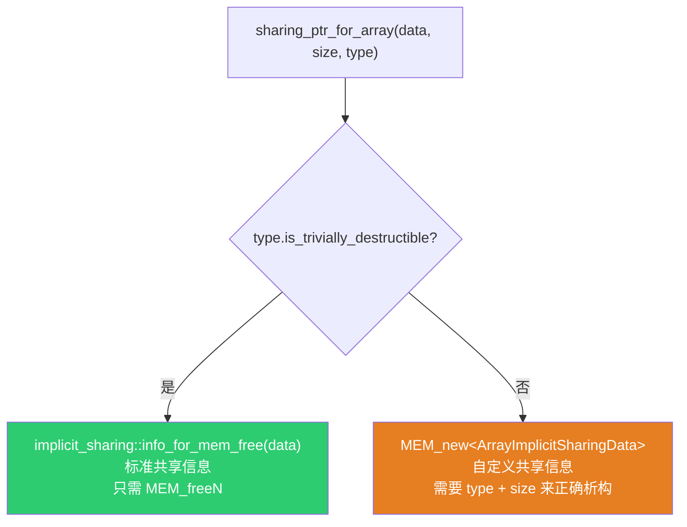
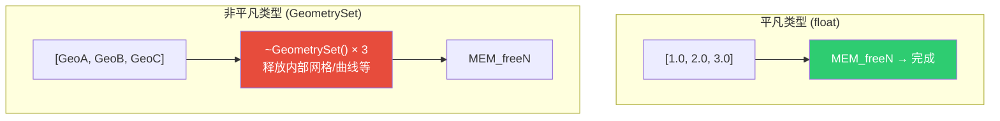
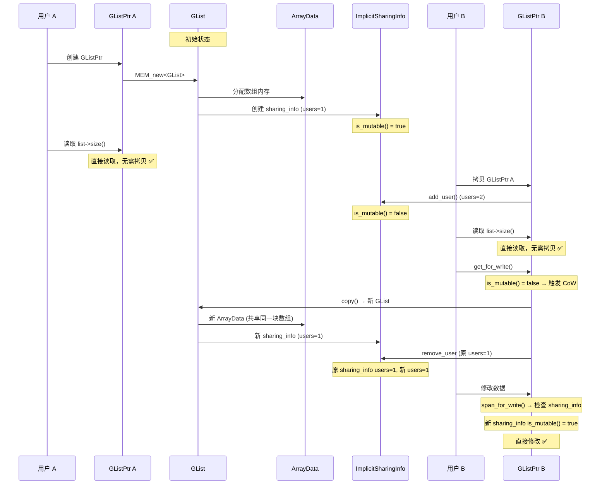
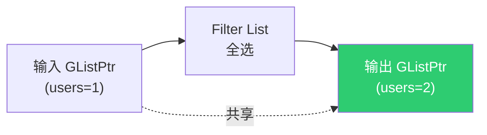
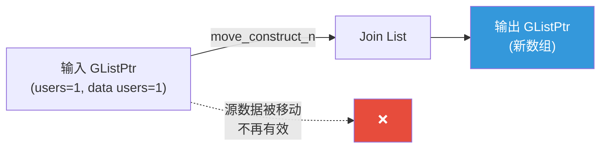
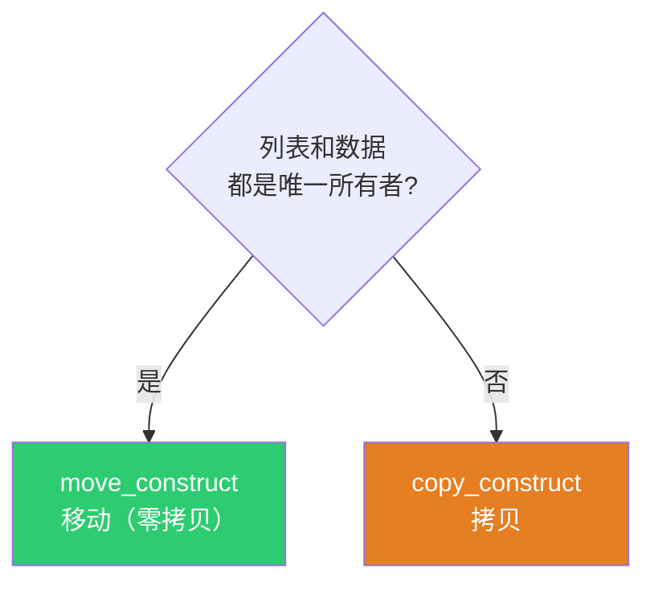
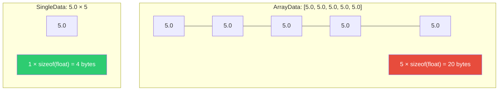

# 隐式共享机制详解

> 📖 系列文档：[目录](01-列表系统架构与核心数据结构.md) | [上一篇](01-列表系统架构与核心数据结构.md) | [下一篇](03-SocketValueVariant与列表集成.md)
> 源码文件：[BLI_implicit_sharing.hh](../../source/blender/blenlib/BLI_implicit_sharing.hh)、[BLI_implicit_sharing_ptr.hh](../../source/blender/blenlib/BLI_implicit_sharing_ptr.hh)

---

## 目录

1. [什么是隐式共享](#1-什么是隐式共享)
2. [ImplicitSharingInfo — 引用计数核心](#2-implicitsharinginfo--引用计数核心)
3. [ImplicitSharingMixin — 便捷基类](#3-implicitsharingmixin--便捷基类)
4. [ImplicitSharingPtr — 智能指针](#4-implicitsharingptr--智能指针)
5. [列表系统中的自定义共享信息](#5-列表系统中的自定义共享信息)
6. [写时复制的完整生命周期](#6-写时复制的完整生命周期)
7. [弱引用与版本控制](#7-弱引用与版本控制)
8. [列表系统中的共享场景分析](#8-列表系统中的共享场景分析)

---

## 1. 什么是隐式共享

隐式共享（Implicit Sharing）是 Blender 中广泛使用的**零拷贝优化**技术。核心思想：当多个对象需要读取同一份数据时，它们共享同一块内存；只有当某个对象需要修改数据时，才创建私有副本（写时复制，Copy-on-Write）。

> "隐式"指的是共享对使用者透明——你不需要显式调用 `share()` 或 `unshare()`，智能指针自动管理。



### 在列表系统中的应用

`GList` 继承 `ImplicitSharingMixin`，通过 `GListPtr`（即 `ImplicitSharingPtr<GList>`）管理。这意味着：

- 多个节点可以**零拷贝**地读取同一个列表
- 只有修改列表时才触发深拷贝
- `SingleData` 的"重复值"表示天然受益于共享——N 个相同元素只占 1 份内存

---

## 2. ImplicitSharingInfo — 引用计数核心

`ImplicitSharingInfo` 是隐式共享的基础设施，定义在 [BLI_implicit_sharing.hh](../../source/blender/blenlib/BLI_implicit_sharing.hh)。



### 强引用与弱引用

```cpp
class ImplicitSharingInfo : NonCopyable, NonMovable {
 private:
  mutable std::atomic<int> strong_users_ = 1;   // 强引用计数
  mutable std::atomic<int> weak_users_ = 1;     // 弱引用计数
  mutable std::atomic<int64_t> version_ = 0;    // 版本号
```

> **`std::atomic<int>`**：原子整数，保证多线程环境下的安全读写。`mutable` 允许在 `const` 方法中修改（因为引用计数是逻辑上的"元数据"，不影响对象的语义常量性）。

> **`NonCopyable, NonMovable`**：Blender 的宏，禁用拷贝构造/赋值和移动构造/赋值。共享信息对象不应被拷贝或移动——它必须稳定地存在于内存中，直到最后一个引用者释放。

### is_mutable — 可变性检查

```cpp
bool is_mutable() const
{
  return strong_users_.load(std::memory_order_relaxed) == 1;
}
```

> **`std::memory_order_relaxed`**：最宽松的内存序。只保证原子性，不保证顺序。对于引用计数检查，这是足够的——我们只关心"当前是否只有一个用户"，不需要与其他内存操作同步。

> **可变性的含义**：`is_mutable() == true` 意味着数据只有一个拥有者，可以安全地就地修改，无需创建副本。

### add_user / remove_user_and_delete_if_last

```cpp
void add_user() const
{
  strong_users_.fetch_add(1, std::memory_order_relaxed);
}

void remove_user_and_delete_if_last() const
{
  const int new_users = strong_users_.fetch_sub(1, std::memory_order_acq_rel) - 1;
  if (new_users == 0) {
    // 最后一个强引用者释放 → 删除数据
    this->delete_self_with_data();
  }
  else if (new_users < 0) {
    BLI_assert_unreachable();
  }
  this->remove_weak_user_and_delete_if_last();
}
```

> **`fetch_add` / `fetch_sub`**：原子地增加/减少值，并返回修改前的值。`fetch_sub(1) - 1` 得到修改后的值。

> **`std::memory_order_acq_rel`**：在 `fetch_sub` 中使用，既保证此操作之前的写操作对其他线程可见（release），又保证此操作之后的读操作能看到其他线程的写（acquire）。这确保了"删除数据"的决策是正确的。

> **`delete_self_with_data()`**：纯虚函数，由子类实现。负责释放关联的数据和自身。

---

## 3. ImplicitSharingMixin — 便捷基类

```cpp
class ImplicitSharingMixin : public ImplicitSharingInfo {
 private:
  void delete_self_with_data() override
  {
    this->delete_self();  // 委托给纯虚函数
  }

  virtual void delete_self() = 0;
};
```

> **设计模式：模板方法（Template Method）**：`ImplicitSharingMixin` 定义了 `delete_self_with_data()` 的骨架（调用 `delete_self()`），将具体释放逻辑延迟到子类。`GList` 实现了 `delete_self()` 为 `MEM_delete(this)`。

### GList 中的实现

```cpp
void GList::delete_self() override
{
  MEM_delete(this);  // 调用析构函数 + 释放内存
}
```

### 为什么不直接在 ImplicitSharingMixin 中 delete this？

因为 `delete_self_with_data()` 可能需要先释放关联的数据（如数组内存），再释放对象自身。`ImplicitSharingMixin` 将"释放自身"和"释放数据"分离：

- `delete_self()`：只释放对象自身
- `delete_data_only()`：只释放关联数据（虚函数，默认空实现）

列表系统中的 `ArrayImplicitSharingData` 重写了 `delete_self_with_data()` 来同时释放数组数据和自身。

---

## 4. ImplicitSharingPtr — 智能指针

`ImplicitSharingPtr` 是管理 `ImplicitSharingInfo` 子类的智能指针，定义在 [BLI_implicit_sharing_ptr.hh](../../source/blender/blenlib/BLI_implicit_sharing_ptr.hh)。



### 拷贝语义 — 增加引用

```cpp
ImplicitSharingPtr(const ImplicitSharingPtr &other) : data_(other.data_)
{
  this->add_user(data_);  // 增加引用计数
}
```

### 移动语义 — 转移所有权

```cpp
ImplicitSharingPtr(ImplicitSharingPtr &&other) : data_(other.data_)
{
  other.data_ = nullptr;  // 源指针置空，不增加引用计数
}
```

> **移动语义的关键**：`other.data_ = nullptr` 确保源指针的析构函数不会减少引用计数。所有权完全转移，零开销。

### 析构 — 减少引用

```cpp
~ImplicitSharingPtr()
{
  this->remove_user_and_delete_if_last(data_);
}
```

### ensure_mutable_inplace — 写时复制入口

```cpp
T &ensure_mutable_inplace()
{
  BLI_assert(data_);
  if (!data_->is_mutable()) {
    // 数据被共享 → 创建独占副本
    *this = data_->copy();
  }
  BLI_assert(data_->is_mutable());
  data_->tag_ensured_mutable();
  return const_cast<T &>(*data_);
}
```

> **`data_->copy()`**：调用 `ImplicitSharingInfo::copy()` 的子类实现。对于 `GList`，这是 `GList::copy()`，创建浅拷贝（共享底层数据）。

> **`const_cast<T &>`**：`data_` 是 `const T*`（因为共享数据不应被直接修改），但 `ensure_mutable_inplace` 保证返回的是唯一可变引用，所以 `const_cast` 是安全的。

---

## 5. 列表系统中的自定义共享信息

列表系统定义了两个自定义的 `ImplicitSharingInfo` 子类，用于处理非平凡析构类型的数据释放。

### ArrayImplicitSharingData — 数组共享信息

```cpp
class ArrayImplicitSharingData : public ImplicitSharingInfo {
 public:
  const CPPType &type;
  void *data;
  int64_t size;

  ArrayImplicitSharingData(void *data, const int64_t size, const CPPType &type)
      : ImplicitSharingInfo(), type(type), data(data), size(size)
  {}

 private:
  void delete_self_with_data() override
  {
    type.destruct_n(this->data, this->size);  // 逐个析构
    MEM_delete_void(this->data);               // 释放数组内存
    MEM_delete(this);                          // 释放自身
  }
};
```

### SingleImplicitSharingData — 单值共享信息

```cpp
class SingleImplicitSharingData : public ImplicitSharingInfo {
 public:
  const CPPType &type;
  void *data;

  SingleImplicitSharingData(void *data, const CPPType &type)
      : ImplicitSharingInfo(), type(type), data(data)
  {}

 private:
  void delete_self_with_data() override
  {
    type.destruct(this->data);  // 析构单个对象
    MEM_delete(this);           // 释放自身（data 是嵌入在同一块内存中的）
  }
};
```

### 选择逻辑 — sharing_ptr_for_array



```cpp
static ImplicitSharingPtr<> sharing_ptr_for_array(void *data,
                                                  const int64_t size,
                                                  const CPPType &type)
{
  if (type.is_trivially_destructible) {
    return ImplicitSharingPtr<>(implicit_sharing::info_for_mem_free(data));
  }
  return ImplicitSharingPtr<>(MEM_new<ArrayImplicitSharingData>(__func__, data, size, type));
}
```

> **`implicit_sharing::info_for_mem_free(data)`**：Blender 提供的标准共享信息工厂。创建一个简单的 `ImplicitSharingInfo`，其 `delete_self_with_data()` 只调用 `MEM_freeN(data)`。适用于 `float`、`int` 等平凡类型——不需要析构，直接释放内存即可。

### 为什么需要存储 type 和 size？



对于 `GeometrySet`，如果不先调用析构函数，内部的网格数据、材质引用等就会泄漏。`ArrayImplicitSharingData` 存储了 `type` 和 `size`，使得在最后一个引用者释放时能正确执行 `type.destruct_n(data, size)`。

---

## 6. 写时复制的完整生命周期

以 `GListPtr` 为例，追踪写时复制的完整过程：



### 关键步骤解析

1. **创建**：`GListPtr` 持有 `ImplicitSharingPtr<GList>`，引用计数为 1
2. **共享读取**：拷贝 `GListPtr` 只增加引用计数，不拷贝数据
3. **写时复制**：`get_for_write()` 检测到 `is_mutable() == false`，调用 `GList::copy()` 创建新的 `GList`（但底层数据仍然共享）
4. **按需深拷贝**：`span_for_write()` / `value_for_write()` 检测到数据共享，才真正深拷贝底层数组

> **两层写时复制**：第一层是 `GList` 对象本身的 CoW（`get_for_write`），第二层是底层数据的 CoW（`span_for_write`）。这种设计允许修改 `GList` 的元数据（如 `size_`）而不触发数据深拷贝。

---

## 7. 弱引用与版本控制

### 弱引用（Weak Reference）

```cpp
using WeakImplicitSharingPtr = ImplicitSharingPtr<ImplicitSharingInfo, false>;
```

弱引用不阻止数据被释放。当最后一个强引用消失时，数据仍然会被删除，弱引用者可以通过 `is_expired()` 检查数据是否还存在。

> **列表系统中暂未使用弱引用**，但 `ImplicitSharingInfo` 的基础设施已经支持。

### 版本控制

```cpp
mutable std::atomic<int64_t> version_ = 0;

void tag_ensured_mutable() const
{
  version_.fetch_add(1, std::memory_order_relaxed);
}
```

每次数据被修改时，版本号递增。这允许缓存系统检测数据是否已更改——如果版本号与缓存时不同，就需要重新计算。

---

## 8. 列表系统中的共享场景分析

### 场景 1：Filter List 全选 → 零拷贝返回

```cpp
static GListPtr filter_list(const GListPtr &list, const IndexMask &mask)
{
  if (mask.size() == list->size()) {
    return list;  // 直接返回原 GListPtr，共享数据
  }
  // ...
}
```



### 场景 2：Join List 可变输入 → 移动语义

```cpp
if (list->is_mutable() && src_array_data->sharing_info->is_mutable()) {
  cpp_type.move_construct_n(
      const_cast<void *>(src_array_data->data), dst.data(), dst.size());
  continue;  // 移动而非拷贝
}
```



### 场景 3：Get List Item 共享列表 → 必须拷贝

```cpp
if (list->is_mutable() && data->sharing_info->is_mutable()) {
  list->cpp_type().move_construct(data_span[index], value_ptr);
} else {
  list->cpp_type().copy_construct(data_span[index], value_ptr);
}
```



### 场景 4：SingleData 的天然共享优势



SingleData 不仅节省内存，还让所有共享操作几乎零开销：
- **拷贝**：只增加引用计数，不拷贝数据
- **过滤**：只调整 `size`，不拷贝数据
- **重复扩展**：只调整 `size`，不拷贝数据
- **广播到多函数**：作为 `GPointer` 传入，MF 框架自动广播

---

## 附录：关键 C++ 语法速查

| 语法 | 含义 | 本文档中的使用 |
|------|------|----------------|
| `std::atomic<int>` | 原子整数，线程安全 | 引用计数 `strong_users_` |
| `std::memory_order_relaxed` | 最宽松内存序 | `is_mutable()` 检查 |
| `std::memory_order_acq_rel` | 获取-释放内存序 | `remove_user_and_delete_if_last` |
| `fetch_add(1)` / `fetch_sub(1)` | 原子增减，返回旧值 | 引用计数操作 |
| `NonCopyable, NonMovable` | Blender 宏，禁用拷贝/移动 | `ImplicitSharingInfo` |
| `mutable` | 允许在 const 方法中修改 | 原子计数器 |
| `const_cast<T&>` | 移除 const 限定 | `ensure_mutable_inplace()` |
