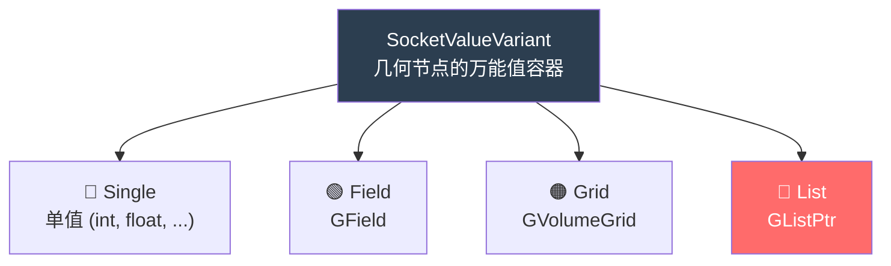
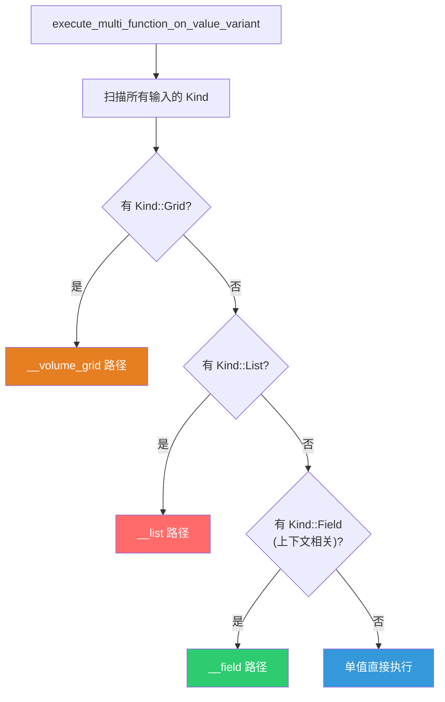
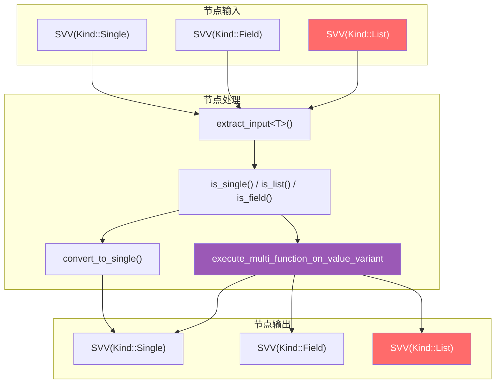

# SocketValueVariant 与列表集成

> 📖 系列文档：[目录](01-列表系统架构与核心数据结构.md) | [上一篇](02-隐式共享机制详解.md) | [下一篇](04-SocketItemsAccessor动态Socket模式.md)
> 源码文件：[BKE_node_socket_value.hh](../../source/blender/blenkernel/BKE_node_socket_value.hh)、[node_socket_value.cc](../../source/blender/blenkernel/intern/node_socket_value.cc)

---

## 目录

- [SocketValueVariant 与列表集成](#socketvaluevariant-与列表集成)
  - [目录](#目录)
  - [1. SocketValueVariant 概述](#1-socketvaluevariant-概述)
  - [2. Kind 枚举与底层存储](#2-kind-枚举与底层存储)
    - [Kind 与 Socket 数据类型的关系](#kind-与-socket-数据类型的关系)
  - [3. 列表的存入与取出](#3-列表的存入与取出)
    - [存入 — set\<GListPtr\>](#存入--setglistptr)
    - [取出 — extract\<GListPtr\>](#取出--extractglistptr)
    - [取出 — extract\<ListPtr\<T\>\>](#取出--extractlistptrt)
  - [4. is\_list 与类型判断](#4-is_list-与类型判断)
    - [类型判断方法一览](#类型判断方法一览)
  - [5. convert\_to\_single — 列表转单值](#5-convert_to_single--列表转单值)
  - [6. 在惰性函数求值中的分发](#6-在惰性函数求值中的分发)
  - [7. 列表在各节点中的 SVV 使用模式](#7-列表在各节点中的-svv-使用模式)
    - [List Length — 最简单](#list-length--最简单)
    - [Join List — 多输入提取](#join-list--多输入提取)
    - [Filter List — 动态类型判断](#filter-list--动态类型判断)
    - [Get List Item — 两条路径](#get-list-item--两条路径)
    - [SVV 类型流转总览](#svv-类型流转总览)
  - [附录：关键 C++ 语法速查](#附录关键-c-语法速查)


---

## 1. SocketValueVariant 概述

`SocketValueVariant`（简称 SVV）是几何节点中 **Socket 值的统一容器**。每个 Socket 在运行时携带的值都存储为 `SocketValueVariant`，它可以是单值、字段、体积网格或列表。



---

## 2. Kind 枚举与底层存储

```cpp
class SocketValueVariant {
 private:
  enum class Kind {
    None,     // 无值（未初始化）
    Single,   // 单值
    Field,    // GField
    Grid,     // GVolumeGrid
    List,     // GListPtr ← 列表类型
  };

  struct AnyExtraData {
    Kind kind = Kind::None;
    eNodeSocketDatatype socket_type;  // 关联的 Socket 数据类型
  };

  Any<void, 32, 16, AnyExtraData> value_;
```

> **`Any<void, 32, 16, AnyExtraData>`**：Blender 的类型擦除容器。类似于 `std::any`，但有以下区别：
> - `32`：内联存储大小（字节）。小于 32 字节的类型存储在栈上，大于的分配到堆
> - `16`：对齐要求
> - `AnyExtraData`：附加元数据（Kind + socket_type），`std::any` 不支持
>
> `GListPtr` 的大小是 `sizeof(ImplicitSharingPtr<GList>)` = 一个指针大小（8 字节），远小于 32，因此存储在栈上。

### Kind 与 Socket 数据类型的关系

| Kind | 对应的 C++ 类型 | socket_type 示例 |
|------|----------------|-----------------|
| Single | `int`, `float`, `std::string` 等 | `SOCK_FLOAT`, `SOCK_INT` |
| Field | `fn::GField` | `SOCK_FLOAT` (字段) |
| Grid | `GVolumeGrid` | `SOCK_FLOAT` (网格) |
| List | `nodes::GListPtr` | `SOCK_FLOAT` (列表) |

> **关键理解**：`socket_type` 和 `Kind` 是独立的。同一个 `SOCK_FLOAT` 可以是 Single、Field 或 List。这正是结构类型叠加的设计体现。

---

## 3. 列表的存入与取出

### 存入 — set\<GListPtr\>

```cpp
template<> void SocketValueVariant::store_impl(nodes::GListPtr value)
{
  const CPPType &list_cpp_type = value->cpp_type();

  eNodeSocketDatatype socket_type = SOCK_CUSTOM;
  if (list_cpp_type.is<bke::SocketValueVariant>()) {
    // SocketValueVariant 列表：取第一个元素的 socket_type
    const GVArray gvarray = value->varray();
    const VArray varray = gvarray.typed<bke::SocketValueVariant>();
    if (!varray.is_empty()) {
      socket_type = varray[0].socket_type();
    }
  }
  else {
    // 普通列表：从 CPPType 推导 socket_type
    const std::optional<eNodeSocketDatatype> new_socket_type =
        geo_nodes_base_cpp_type_to_socket_type(list_cpp_type);
    BLI_assert(new_socket_type);
    socket_type = *new_socket_type;
  }

  value_.emplace<nodes::GListPtr>(std::move(value));
  value_.extra.socket_type = socket_type;
  value_.extra.kind = Kind::List;
}
```

> **`SocketValueVariant` 列表的特殊处理**：当列表元素类型是 `SocketValueVariant` 时（如 Closure to List 的输出），每个元素可能有不同的 `socket_type`。此时取第一个元素的 `socket_type` 作为整个列表的 `socket_type`。

> **`geo_nodes_base_cpp_type_to_socket_type`**：将 `CPPType` 映射回 `eNodeSocketDatatype`。例如 `CPPType::get<float>()` → `SOCK_FLOAT`。

### 取出 — extract\<GListPtr\>

```cpp
else if constexpr (std::is_same_v<T, nodes::GListPtr>) {
  if (this->kind() != Kind::List) {
    return {};  // 不是列表 → 返回空 GListPtr
  }
  return std::move(value_.get<nodes::GListPtr>());
}
```

> **`extract` vs `get`**：`extract` 转移所有权（移动语义），调用后 SVV 中的值被清空；`get` 只读取，不改变 SVV。在节点执行中通常使用 `extract`，因为输入值只使用一次。

### 取出 — extract\<ListPtr\<T\>\>

```cpp
else if constexpr (nodes::is_ListPtr_v<T>) {
  if (this->kind() != Kind::List) {
    return {};
  }
  using base_type = typename T::base_type;
  BLI_assert(static_type_is_base_socket_type<base_type>(this->socket_type()));
  return this->extract<nodes::GListPtr>().typed<base_type>();
}
```

> **`is_ListPtr_v<T>`**：编译期类型特征，判断 `T` 是否是 `ListPtr<...>` 类型。这使得 `extract<ListPtr<float>>` 可以正确匹配到此分支。

> **`.typed<base_type>()`**：将 `GListPtr` 转换为 `ListPtr<T>`。零开销的 `reinterpret_cast`。

---

## 4. is_list 与类型判断

```cpp
bool SocketValueVariant::is_list() const
{
  return this->kind() == Kind::List;
}
```

### 类型判断方法一览

| 方法 | 对应 Kind | 含义 |
|------|----------|------|
| `is_single()` | `Kind::Single` | 是否为单值 |
| `is_field()` | `Kind::Field` | 是否为字段（含上下文无关） |
| `is_context_dependent_field()` | `Kind::Field` | 是否为上下文相关字段 |
| `is_volume_grid()` | `Kind::Grid` | 是否为体积网格 |
| `is_list()` | `Kind::List` | 是否为列表 |

> **`is_field()` vs `is_context_dependent_field()`**：所有字段都是 `is_field()`，但只有依赖索引或 ID 属性的字段是 `is_context_dependent_field()`。常量字段（如 `3.14`）是字段但不是上下文相关的。在列表求值中，只有上下文相关字段需要走字段求值路径。

---

## 5. convert_to_single — 列表转单值

```cpp
void SocketValueVariant::convert_to_single()
{
  switch (this->kind()) {
    case Kind::Single: {
      break;  // 已经是单值，无需转换
    }
    case Kind::Field: {
      fn::GField field = std::move(value_.get<fn::GField>());
      void *buffer = this->allocate_single(this->socket_type());
      fn::evaluate_constant_field(field, buffer);  // 求值常量字段
      break;
    }
    case Kind::List:
    case Kind::Grid: {
      // 列表和网格无法无损转换为单值 → 使用默认值
      const CPPType &cpp_type = *socket_type_to_geo_nodes_base_cpp_type(this->socket_type());
      this->store_single(this->socket_type(), cpp_type.default_value());
      break;
    }
    case Kind::None: {
      BLI_assert_unreachable();
      break;
    }
  }
}
```

> **列表转单值使用默认值**：这是有损转换——无法从列表中自动选择一个"代表性"元素。调用者应该在调用 `convert_to_single()` 之前处理列表情况（如 Get List Item 节点先提取单个元素）。

---

## 6. 在惰性函数求值中的分发

当函数节点执行时，系统检查所有输入 `SocketValueVariant` 的类型，选择合适的求值路径：



```cpp
bool any_input_is_list = false;
for (const int i : input_values.index_range()) {
  const SocketValueVariant &value = *input_values[i];
  if (value.is_context_dependent_field()) {
    any_input_is_field = true;
  }
  else if (value.is_volume_grid()) {
    any_input_is_volume_grid = true;
  }
  else if (value.is_list()) {
    any_input_is_list = true;
  }
}

if (any_input_is_volume_grid) {
  return execute_multi_function_on_value_variant__volume_grid(...);
}
if (any_input_is_list) {
  execute_multi_function_on_value_variant__list(fn, input_values, output_values, user_data);
  return true;
}
if (any_input_is_field) {
  return execute_multi_function_on_value_variant__field(...);
}
```

> **优先级设计**：Grid > List > Field > Single。列表优先于字段，因为列表是已物化的数据，而字段是延迟求值的。将字段求值为列表比反过来更自然。

---

## 7. 列表在各节点中的 SVV 使用模式

### List Length — 最简单

```cpp
auto list = params.extract_input<GListPtr>("List"_ustr);
// SVV 自动从 Kind::List 提取为 GListPtr
params.set_output("Length"_ustr, int(list->size()));
// SVV 自动将 int 包装为 Kind::Single
```

### Join List — 多输入提取

```cpp
auto inputs = params.extract_input<GeoNodesMultiInput<bke::SocketValueVariant>>("Value"_ustr);
// 每个 SVV 可能是 Single 或 List
for (const int i : inputs.values.index_range()) {
  if (inputs.values[i].is_list()) {
    size_offset_data[i] = inputs.values[i].get<GListPtr>()->size();
  }
  else if (inputs.values[i].is_single()) {
    size_offset_data[i] = 1;
  }
}
```

### Filter List — 动态类型判断

```cpp
auto filter_value = params.extract_input<bke::SocketValueVariant>("Selection"_ustr);
if (filter_value.is_single()) {
  // 单值布尔
} else if (filter_value.is_context_dependent_field()) {
  // 字段
} else if (filter_value.is_list()) {
  // 布尔列表
}
```

### Get List Item — 两条路径

```cpp
bke::SocketValueVariant index = params.extract_input<bke::SocketValueVariant>("Index"_ustr);
// 路径1：不支持字段的类型 → 直接取值
if (list_type.is<bke::SocketValueVariant>() || !socket_type_supports_fields(*socket_type)) {
  index.convert_to_single();  // 确保是单值
  const int index_int = index.get<int>();
  params.set_output("Value"_ustr, get_single_item(list, *socket_type, index_int));
}
// 路径2：支持字段的类型 → 多函数执行
else {
  bke::SocketValueVariant output_value;
  execute_multi_function_on_value_variant(
      std::make_shared<SampleIndexFunction>(std::move(list)),
      {&index}, {&output_value}, params.user_data(), error_message);
  params.set_output("Value"_ustr, std::move(output_value));
}
```

### SVV 类型流转总览



---

## 附录：关键 C++ 语法速查

| 语法 | 含义 | 本文档中的使用 |
|------|------|----------------|
| `Any<void, 32, 16, Extra>` | Blender 类型擦除容器 | SVV 底层存储 |
| `value_.emplace<T>(args)` | 在 Any 中构造 T 对象 | `store_impl` 中存入列表 |
| `value_.get<T>()` | 从 Any 中获取 T 引用 | `extract` 中取出列表 |
| `std::move(value_.get<T>())` | 从 Any 中移动出 T | `extract` 转移所有权 |
| `if constexpr` | 编译期条件分支 | `extract` 的类型分发 |
| `is_ListPtr_v<T>` | 编译期类型特征 | 判断是否为 ListPtr 类型 |
