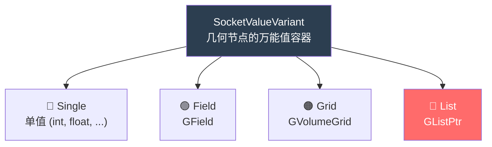
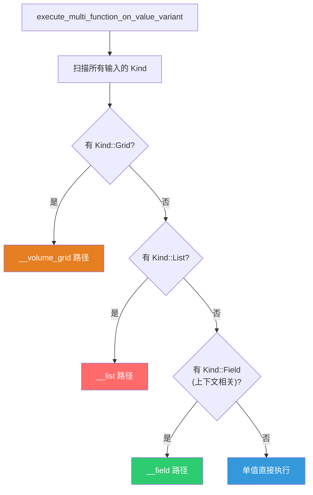
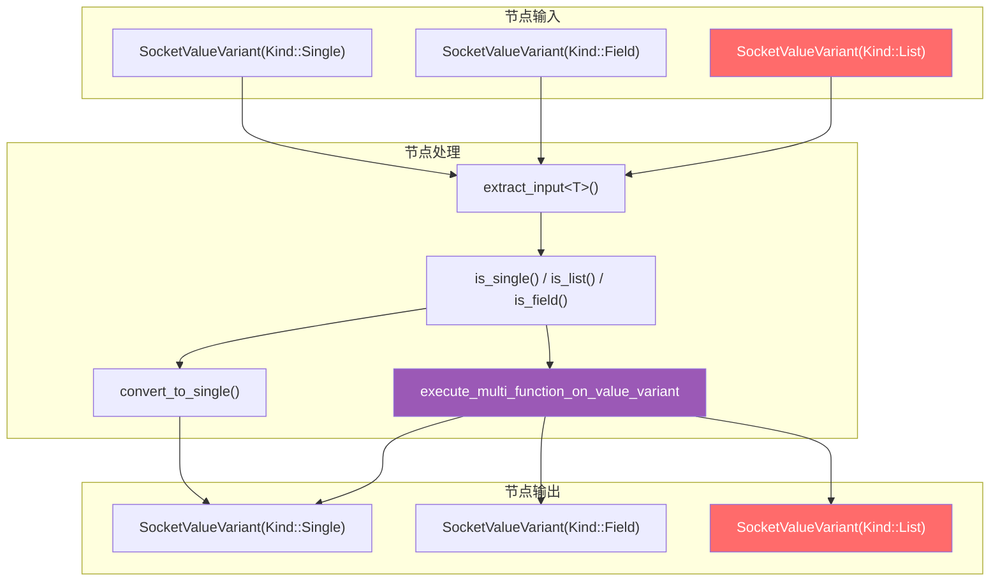

# SocketValueVariant 与列表集成

> 📖 系列文档：[目录](01-列表系统架构与核心数据结构.md) | [上一篇](02-隐式共享机制详解.md) | [下一篇](04-SocketItemsAccessor动态Socket模式.md)
> 源码文件：[BKE_node_socket_value.hh](../../source/blender/blenkernel/BKE_node_socket_value.hh)、[node_socket_value.cc](../../source/blender/blenkernel/intern/node_socket_value.cc)

---

## 目录

- [SocketValueVariant 与列表集成](#socketvaluevariant-与列表集成)
  - [目录](#目录)
  - [1. SocketValueVariant 概述](#1-socketvaluevariant-概述)
  - [2. Kind 枚举与底层存储](#2-kind-枚举与底层存储)
    - [Any 的关键成员函数](#any-的关键成员函数)
    - [Any 里存的是什么？](#any-里存的是什么)
    - [为什么 SocketValueVariant 使用 Any？](#为什么-socketvaluevariant-使用-any)
    - [Kind 与 Socket 数据类型的关系](#kind-与-socket-数据类型的关系)
  - [3. 列表的存入与取出](#3-列表的存入与取出)
    - [存入 — set\<GListPtr\>](#存入--setglistptr)
    - [取出 — extract\<GListPtr\>](#取出--extractglistptr)
    - [取出 — extract\<ListPtr\<T\>\>](#取出--extractlistptrt)
  - [4. is\_list 与类型判断](#4-is_list-与类型判断)
    - [类型判断方法一览](#类型判断方法一览)
  - [5. convert\_to\_single — 列表转单值](#5-convert_to_single--列表转单值)
  - [6. 在惰性函数求值中的分发](#6-在惰性函数求值中的分发)
  - [7. 列表在各节点中的 SocketValueVariant 使用模式](#7-列表在各节点中的-socketvaluevariant-使用模式)
    - [List Length — 最简单](#list-length--最简单)
    - [Join List — 多输入提取](#join-list--多输入提取)
    - [Filter List — 动态类型判断](#filter-list--动态类型判断)
    - [Get List Item — 两条路径](#get-list-item--两条路径)
    - [SocketValueVariant 类型流转总览](#socketvaluevariant-类型流转总览)
  - [附录：关键 C++ 语法速查](#附录关键-c-语法速查)


---

## 1. SocketValueVariant 概述

`SocketValueVariant`（简称 SocketValueVariant）是几何节点中 **Socket 值的统一容器**。每个 Socket 在运行时携带的值都存储为 `SocketValueVariant`，它可以是单值、字段、体积网格或列表。



---

## 2. Kind 枚举与底层存储

```cpp
class SocketValueVariant {
 private:
  enum class Kind {
    None,     // 无值（未初始化）
    Single,   // 单值
    Field,    // GField
    Grid,     // GVolumeGrid
    List,     // GListPtr ← 列表类型
  };

  struct AnyExtraData {
    Kind kind = Kind::None;
    eNodeSocketDatatype socket_type;  // 关联的 Socket 数据类型
  };

  Any<void, 32, 16, AnyExtraData> value_;
```

> **`Any<void, 32, 16, AnyExtraData>`**：Blender 的类型擦除容器。类似于 `std::any`，但有以下区别：
> - `32`：内联存储大小（字节）。小于 32 字节的类型存储在栈上，大于的分配到堆
> - `16`：对齐要求
> - `AnyExtraData`：附加元数据（Kind + socket_type），`std::any` 不支持
>
> `GListPtr` 的大小是 `sizeof(ImplicitSharingPtr<GList>)` = 一个指针大小（8 字节），远小于 32，因此存储在栈上。

> **`std::any` 是什么？** C++17 标准库提供的类型擦除容器——"能装任何类型的盒子"。你可以往里面放 `int`、`float`、`std::string` 或任何可复制构造的类型，运行时再取出来。
>
> ```cpp
> // 基本用法：存取不同类型的值
> std::any a = 42;            // 装 int
> a = 3.14f;                  // 换成 float
> a = std::string("hello");   // 换成 string
>
> // 取出时必须知道原始类型，否则抛异常
> int val = std::any_cast<int>(a);  // 错误！a 当前存的是 string，会抛 std::bad_any_cast
> std::string s = std::any_cast<std::string>(a);  // 正确
>
> // 安全取出：先检查类型
> if (a.type() == typeid(std::string)) {
>     std::string s = std::any_cast<std::string>(a);
> }
>
> // 存自定义类型（必须可复制构造）
> struct Vec3 { float x, y, z; };
> std::any v = Vec3{1.0f, 2.0f, 3.0f};
> Vec3 vec = std::any_cast<Vec3>(v);
> ```
>
> `std::any` 的内部原理：用一块内存（内联缓冲区或堆分配）存储值，用一个类型擦除的"虚函数表"（函数指针集合）管理拷贝、移动、销毁操作。`std::any_cast<T>()` 检查类型是否匹配，匹配则返回值，不匹配抛出 `std::bad_any_cast` 异常。
>
> **`std::any` 最常用来干什么？** 最常见的用途是**存储运行时才知道类型的值**——比如配置系统（值可能是 int/string/float）、消息传递（不同类型的消息统一传递）、插件接口（插件返回任意类型的值）。在 Blender 中，`SocketValueVariant` 用 `Any` 存储 Socket 的值——同一个 Socket 可能是单值、字段或列表，类型在运行时才确定。

> **Blender `Any` vs `std::any` 的区别？** Blender 的 `Any`（定义在 [BLI_any.hh](../../source/blender/blenlib/BLI_any.hh)）是 `std::any` 的增强版，源码注释原文："A #Any is a type-safe container for single values of any copy constructible type. It is similar to #std::any but provides the following two additional features: 1. Adjustable inline buffer capacity and alignment. 2. Can store additional user-defined type information without increasing the stack size of #Any."
>
> | 特性 | `std::any` | Blender `Any` |
> |------|-----------|---------------|
> | 内联缓冲区大小 | 实现定义（通常 8-32 字节），不可控 | **可配置**（模板参数 `InlineBufferCapacity`） |
> | 对齐要求 | 实现定义 | **可配置**（模板参数 `Alignment`） |
> | 附加元数据 | ❌ 不支持 | ✅ **可配置**（模板参数 `ExtraInfo` + `ExtraData`） |
> | 栈大小 | 通常 16-48 字节 | `InlineBufferCapacity + sizeof(Info*) + sizeof(ExtraData)` |
> | 类型检查 | `std::any_cast` 抛异常 | `is<T>()` 返回 bool |

> **copy constructible 是什么？** "可复制构造"——一个类型如果能用拷贝方式创建新对象，就是 copy constructible 的。具体来说，类型 `T` 必须有拷贝构造函数 `T(const T&)` 或 `T(T&)`。大多数类型都是 copy constructible 的，但有些不是：
>
> | 类型 | copy constructible？ | 原因 |
> |------|---------------------|------|
> | `int`, `float` | ✅ 是 | 内置类型，按位拷贝 |
> | `std::string` | ✅ 是 | 有拷贝构造函数，深拷贝 |
> | `std::unique_ptr<T>` | ❌ 否 | 独占所有权，不允许拷贝 |
> | `std::mutex` | ❌ 否 | 互斥锁不可拷贝 |
>
> `Any` 要求 copy constructible 是因为 `Any` 本身是可拷贝的——拷贝 `Any` 时需要拷贝其内部的值。如果值不可拷贝，`Any` 也无法拷贝。

> **内联缓冲区是什么？** 一块直接嵌入对象内部的内存，用于存储小数据，避免堆分配。"内联"意味着数据就在对象本身里面，而不是通过指针指向另一块内存。
>
> | 存储方式 | 数据在哪 | 分配方式 | 速度 |
> |---------|---------|---------|------|
> | 内联缓冲区 | 对象内部（栈上） | 无需分配 | 极快 |
> | 堆分配 | 堆上（通过 `new`） | 需要 `malloc` | 较慢 |
>
> 类比：内联缓冲区就像背包的内置口袋——小东西直接放口袋里（内联），大东西需要额外带一个箱子（堆分配）。`Any<..., 32, ...>` 的 32 字节内联缓冲区意味着：小于 32 字节的类型（如 `int` 4字节、`float3` 12字节、`GListPtr` 8字节）直接存在 `Any` 内部，不需要 `new`；大于 32 字节的类型（如 `std::string` 如果很长）需要堆分配。

> **四个模板参数的含义**（[BLI_any.hh:85~106](../../source/blender/blenlib/BLI_any.hh) 注释翻译）：
>
> ```cpp
> template<
>     /* 要么是 void，要么是包含额外类型信息数据成员的结构体。
>      * 该结构体必须有静态方法 ExtraInfo::get<T>()，基于类型初始化结构体。 */
>     typename ExtraInfo = void,
>
>     /* 内联缓冲区的大小。这允许足够小的类型直接存储在 Any 内部，
>      * 无需额外分配。 */
>     size_t InlineBufferCapacity = 8,
>
>     /* 内联缓冲区要求的最小对齐。如果这小于所使用类型的对齐要求，
>      * 则需要单独分配。 */
>     size_t Alignment = 8,
>
>     /* 根据 Alignment 模板参数，可能有多余的填充空间可用于存储一些数据。
>      * 此类型存储在缓冲区之后，以利用该空间。 */
>     typename ExtraData = blenlib_detail::EmptyType>
> class Any { ... };
> ```
>
> | 参数 | `Any<void, 32, 16, AnyExtraData>` 中的值 | 含义 |
> |------|----------------------------------------|------|
> | `ExtraInfo = void` | 无额外类型信息 | `void` 表示不使用类型级额外信息（详见下文） |
> | `InlineBufferCapacity = 32` | 32 字节内联缓冲区 | 小于 32 字节的类型存在栈上，大于则 `std::unique_ptr` 堆分配 |
> | `Alignment = 16` | 16 字节对齐 | 满足 SIMD 类型（如 `float4x4`）的对齐要求 |
> | `ExtraData = AnyExtraData` | 利用对齐填充存储 Kind + socket_type | 对齐填充的"废料空间"被用来存额外数据（详见下文） |

> **`ExtraInfo = void` 表示什么？** `ExtraInfo` 是**类型级**的额外信息——每个存储的类型 `T` 都可以关联一份 `ExtraInfo`，通过 `ExtraInfo::get<T>()` 静态方法获取。当设为 `void` 时，表示"我不需要类型级额外信息"，编译器会用 `NoExtraInfo` 替代（其 `get<T>()` 返回空结构体）。`SocketValueVariant` 不使用 `ExtraInfo`，而是用 `ExtraData`（实例级额外信息），因为 `Kind` 和 `socket_type` 是每个 `Any` 实例的属性，不随存储类型变化。

> **对齐填充和废料空间是什么？** 计算机要求数据存储在特定对齐的地址上——16 字节对齐意味着地址必须是 16 的倍数。当 `AlignedBuffer<32, 16>` 实际只用了 20 字节时，编译器会在末尾填充 12 字节（padding）以满足 32 字节总大小。这 12 字节就是"废料空间"——不存有用数据，但占用了内存。
>
> ```
> AlignedBuffer<32, 16> 的内存布局：
> ┌──────────────────────────────┬──────────────┐
> │ 实际数据 (20 字节)            │ 填充 (12 字节) │
> └──────────────────────────────┴──────────────┘
>                                  ↑ 废料空间
> ```
>
> Blender 的巧妙设计：用 `BLI_NO_UNIQUE_ADDRESS ExtraData extra` 把 `ExtraData` 存在填充区域。`BLI_NO_UNIQUE_ADDRESS` 是 C++20 `[[no_unique_address]]` 属性——告诉编译器"这个成员不需要独占地址空间，可以和其他成员共享"。如果 `ExtraData` 比废料空间小，它就完全嵌入填充中，**不增加 `Any` 的总大小**。
>
> **如果 `ExtraData` 比废料空间大呢？** 那 `ExtraData` 会超出填充区域，`Any` 的总大小会增加。例如，如果 `ExtraData` 是 20 字节但废料空间只有 12 字节，`Any` 会多占 8 字节。所以设计时要控制 `ExtraData` 的大小——`AnyExtraData` 只有 `Kind`（1 字节枚举）+ `eNodeSocketDatatype`（4 字节枚举）= 约 5 字节，远小于废料空间。
>
> **如果没有废料空间呢？** 如果 `InlineBufferCapacity` 恰好等于实际数据大小（无填充），`ExtraData` 就没有免费空间可用，必须额外占用内存。这就是为什么 `InlineBufferCapacity` 设为 32 而非更小的值——留出足够的填充空间给 `ExtraData`。
>
> ```mermaid
> flowchart TD
>     subgraph "Any 内部布局（栈上）"
>         B["AlignedBuffer[32]<br/>内联缓冲区<br/>存储实际值"]
>         E["ExtraData (AnyExtraData)<br/>Kind + socket_type<br/>利用对齐填充空间"]
>         I["Info*<br/>指向类型信息表<br/>（拷贝/移动/销毁函数指针）"]
>     end
>     
>     B --- E --- I
>     
>     subgraph "Info 表（静态数据）"
>         COPY["copy_construct()"]
>         MOVE["move_construct()"]
>         DEST["destruct()"]
>         GET["get()"]
>         EI["extra_info"]
>     end
>     
>     I -.-> COPY
> 
>     style B fill:#3498db,color:#fff
>     style E fill:#f39c12,color:#fff
>     style I fill:#e74c3c,color:#fff
>     style COPY fill:#2ecc71,color:#fff
> ```
>
> **`Info*` 指向的类型信息表能干什么？** 它是 `Any` 实现类型擦除的核心——每个存储的类型 `T` 都有一份静态的 `AnyTypeInfo`，包含四个函数指针和一个 `extra_info`：
>
> | 函数指针 | 作用 | 何时调用 |
> |---------|------|---------|
> | `copy_construct(dst, src)` | 在 `dst` 位置拷贝构造 `T` | 拷贝 `Any` 时 |
> | `move_construct(dst, src)` | 在 `dst` 位置移动构造 `T` | 移动 `Any` 时 |
> | `destruct(src)` | 销毁 `T` | `Any` 析构或赋新值时 |
> | `get(src)` | 获取 `T*` 指针 | `any_cast` 或 `get<T>()` 时 |
>
> 这些函数指针可以是 `nullptr`——表示该操作是 trivial 的（如 `int` 的拷贝就是按位复制，不需要调用构造函数）。这种优化避免了不必要的函数调用。
>
> **对齐要求是干什么的？** 某些类型要求数据存储在特定对齐的地址上。例如 `float4x4`（16 字节对齐）必须存在 16 的倍数地址。如果 `Any` 的内联缓冲区对齐不够（如 `Alignment=8` 但类型需要 16），就无法在内联缓冲区中存储该类型，必须堆分配。`Alignment=16` 确保大多数 SIMD 类型可以直接内联存储。

> **`AnyExtraData` 为什么存在？** 源码注释原文翻译："这允许在下面的 `Any` 中更快地查找正确的类型。例如，当获取整数 Socket 的值时，我们通常必须检查 `Any` 包含的是单个 `int` 还是字段。通过比较枚举来做这个检查更便宜。此外，要判断我们当前是否存储了单值，否则必须检查 `Any` 存储的是 int 还是 float 还是 boolean 等。"
>
> 没有 `AnyExtraData` 时，判断"当前是单值还是字段"需要调用 `value_.is<int>() || value_.is<float>() || ...`——遍历所有可能的类型。有了 `Kind` 枚举，只需 `kind_ == Kind::Single`——一次整数比较。
>
> | 方式 | 判断"是单值？" | 判断"是列表？" |
> |------|--------------|--------------|
> | 无 AnyExtraData | `value_.is<int>() \|\| value_.is<float>() \|\| ...` | `value_.is<GListPtr>()` |
> | 有 AnyExtraData | `kind_ == Kind::Single` | `kind_ == Kind::List` |
>
> **`socket_type` 的作用**：同一个 Kind 可以对应不同的 Socket 类型（如 `SOCK_FLOAT`、`SOCK_INT`）。`socket_type` 记录了当前值属于哪种 Socket，避免从 `Any` 的类型信息反推。例如，`Kind::Single + SOCK_FLOAT` 表示存的是 `float`，`Kind::Single + SOCK_INT` 表示存的是 `int`。

### Any 的关键成员函数

`Any` 提供了两种"放入值"的方式——`emplace`（分配+构造）和 `allocate`（只分配不构造）：

> **`emplace<T>(args...)`** — 分配内存并用 `args` 构造 `T`
>
> ```cpp
> template<typename T, typename... Args> std::decay_t<T> &emplace(Args &&...args)
> {
>   this->~Any();  // 先销毁旧值
>   new (this) Any(std::in_place_type<T>, std::forward<Args>(args)...);
>   return this->get<T>();
> }
> ```
>
> 一步完成：分配内存 + 调用 `T` 的构造函数。适用于已知构造参数的场景。

> **`allocate<T>()`** — 只分配内存，不构造（[BLI_any.hh:302~330](../../source/blender/blenlib/BLI_any.hh)）
>
> 注释翻译："类似 #emplace，但**不实际构造值**。调用者负责在使用值之前调用构造函数。"
>
> ```cpp
> template<typename T> void *allocate()
> {
>   this->reset();                       // 先销毁旧值
>   return this->allocate_on_empty<T>(); // 在空 Any 上分配
> }
>
> template<typename T> void *allocate_on_empty()
> {
>   BLI_assert(!this->has_value());      // 断言：当前为空
>   static_assert(is_allowed_v<T>);      // 断言：T 必须可拷贝构造
>   info_ = &this->template get_info<T>();  // 设置类型信息
>   if constexpr (is_inline_v<T>) {
>     return buffer_.ptr();              // 内联：返回缓冲区指针
>   }
>   else {
>     T *value = static_cast<T *>(::operator new(sizeof(T)));  // 堆分配
>     new (&buffer_) std::unique_ptr<T>(value);  // unique_ptr 存入缓冲区
>     return value;                      // 返回堆上指针
>   }
> }
> ```
>
> **为什么需要 `allocate`？** 因为有些场景下，分配内存和构造对象需要分开进行。`SocketValueVariant::allocate_single` 就是典型例子——先分配内存（`allocate<float>()`），然后用 `CPPType::move_construct` 在分配好的内存上构造对象。`emplace` 要求构造参数在调用时就准备好，但 `move_construct` 的参数来自另一个泛型指针（`void*`），无法直接传给 `emplace`。
>
> | 方法 | 分配 | 构造 | 适用场景 |
> |------|------|------|---------|
> | `emplace<T>(args...)` | ✅ | ✅ 用 args 构造 | 已知构造参数 |
> | `allocate<T>()` | ✅ | ❌ 返回 `void*` | 需要自定义构造方式（如 `move_construct`） |
>
> ```mermaid
> flowchart LR
>     subgraph "emplace&lt;T&gt;(args...)"
>         E1["分配内存"]
>         E2["用 args 构造 T"]
>         E1 --> E2
>     end
> 
>     subgraph "allocate&lt;T&gt;()"
>         A1["分配内存"]
>         A2["返回 void*"]
>         A1 --> A2
>         A3["调用者自己构造"] --> A4["move_construct /<br/>copy_construct"]
>     end
> 
>     style E2 fill:#3498db,color:#fff
>     style A4 fill:#e67e22,color:#fff
> ```

### Any 里存的是什么？

`Any<void, 32, 16, AnyExtraData>` 里存的是 **Socket 的实际值**——具体类型由运行时决定。根据 `Kind` 不同，存储的内容不同：

| Kind | Any 中存储的 C++ 类型 | 大小 | 内联？ |
|------|---------------------|------|--------|
| Single | `int`, `float`, `float3`, `bool`, `std::string`, `GeometrySet`, ... | 1~48 字节 | ≤32 字节内联，>32 堆分配 |
| Field | `fn::GField` | ~16 字节 | ✅ 内联 |
| Grid | `GVolumeGrid` | ~8 字节 | ✅ 内联 |
| List | `nodes::GListPtr` | ~8 字节 | ✅ 内联 |

`Any` 不知道自己存的是什么类型——它只保存一个 `Info*` 指针指向类型信息表，和一个 `AlignedBuffer[32]` 存储实际数据。`AnyExtraData`（Kind + socket_type）提供了快速判断"当前存的是什么类别"的能力。

```
Any<void, 32, 16, AnyExtraData> 的内存布局：
┌────────────────────────────────┬─────────────────┬─────────┐
│ AlignedBuffer[32]              │ AnyExtraData    │ Info*   │
│ 实际值（如 float 3.14）        │ Kind=Single     │ → float │
│ 或 GField / GListPtr / ...     │ socket_type=    │ 的类型表│
│                                │ SOCK_FLOAT      │         │
└────────────────────────────────┴─────────────────┴─────────┘
```

### 为什么 SocketValueVariant 使用 Any？

**核心原因：Socket 的值类型在运行时才知道，且需要存储额外元数据。**

1. **运行时类型多样性**：同一个 Socket 可能是单值（`float`）、字段（`GField`）、列表（`GListPtr`）或网格（`GVolumeGrid`）。`Any` 可以存储任意类型，不需要为每种情况定义不同的类。

2. **`std::any` 不够用**：`std::any` 无法存储 `Kind` 和 `socket_type` 元数据。没有这些信息，每次判断"当前是单值还是字段"都需要 `any_cast` 尝试所有类型——O(n) 而非 O(1)。

3. **32 字节内联缓冲区**：大多数 Socket 值类型 ≤ 32 字节（`float`=4, `int`=4, `float3`=12, `GField`≈16, `GListPtr`=8），可以直接内联存储，零堆分配。只有 `GeometrySet`（可能 >32 字节）需要堆分配。

4. **16 字节对齐**：满足 `float4x4`（4×4 矩阵）的对齐要求，避免运行时对齐错误。

5. **`AnyExtraData` 利用废料空间**：`Kind` + `socket_type` 约 5 字节，存在对齐填充中，不增加 `SocketValueVariant` 的总大小。

如果不用 `Any`，`SocketValueVariant` 需要自己实现类型擦除——手动管理 `void*` 缓冲区、函数指针表、类型判断逻辑。`Any` 把这些通用逻辑封装好了。

### Kind 与 Socket 数据类型的关系

| Kind | 对应的 C++ 类型 | socket_type 示例 |
|------|----------------|-----------------|
| Single | `int`, `float`, `std::string` 等 | `SOCK_FLOAT`, `SOCK_INT` |
| Field | `fn::GField` | `SOCK_FLOAT` (字段) |
| Grid | `GVolumeGrid` | `SOCK_FLOAT` (网格) |
| List | `nodes::GListPtr` | `SOCK_FLOAT` (列表) |

> **关键理解**：`socket_type` 和 `Kind` 是独立的。同一个 `SOCK_FLOAT` 可以是 Single、Field 或 List。这正是结构类型叠加的设计体现。

---

## 3. 列表的存入与取出

### 存入 — set\<GListPtr\>

```cpp
template<> void SocketValueVariant::store_impl(nodes::GListPtr value)
{
  const CPPType &list_cpp_type = value->cpp_type();

  eNodeSocketDatatype socket_type = SOCK_CUSTOM;
  if (list_cpp_type.is<bke::SocketValueVariant>()) {
    // SocketValueVariant 列表：取第一个元素的 socket_type
    const GVArray gvarray = value->varray();
    const VArray varray = gvarray.typed<bke::SocketValueVariant>();
    if (!varray.is_empty()) {
      socket_type = varray[0].socket_type();
    }
  }
  else {
    // 普通列表：从 CPPType 推导 socket_type
    const std::optional<eNodeSocketDatatype> new_socket_type =
        geo_nodes_base_cpp_type_to_socket_type(list_cpp_type);
    BLI_assert(new_socket_type);
    socket_type = *new_socket_type;
  }

  value_.emplace<nodes::GListPtr>(std::move(value));
  value_.extra.socket_type = socket_type;
  value_.extra.kind = Kind::List;
}
```

> **`SocketValueVariant` 列表的特殊处理**：当列表元素类型是 `SocketValueVariant` 时（如 Closure to List 的输出），每个元素可能有不同的 `socket_type`。此时取第一个元素的 `socket_type` 作为整个列表的 `socket_type`。

> **`geo_nodes_base_cpp_type_to_socket_type`**：将 `CPPType` 映射回 `eNodeSocketDatatype`。例如 `CPPType::get<float>()` → `SOCK_FLOAT`。

### 取出 — extract\<GListPtr\>

```cpp
else if constexpr (std::is_same_v<T, nodes::GListPtr>) {
  if (this->kind() != Kind::List) {
    return {};  // 不是列表 → 返回空 GListPtr
  }
  return std::move(value_.get<nodes::GListPtr>());
}
```

### 取出 — extract\<ListPtr\<T\>\>

```cpp
else if constexpr (nodes::is_ListPtr_v<T>) {
  if (this->kind() != Kind::List) {
    return {};
  }
  using base_type = typename T::base_type;
  BLI_assert(static_type_is_base_socket_type<base_type>(this->socket_type()));
  return this->extract<nodes::GListPtr>().typed<base_type>();
}
```

> **为什么 extract\<T\> 需要分四种 if constexpr 分支？** 因为 `SocketValueVariant` 内部统一存储 `GField` 和 `GListPtr`（泛型版本），但用户代码可能请求类型化版本 `Field<float>` 或 `ListPtr<int>`。四种分支处理四种请求：
>
> | 分支条件 | 用户请求 | 内部存储 | 处理方式 |
> |---------|---------|---------|---------|
> | `std::is_same_v<T, fn::GField>` | `extract<GField>()` | `GField` | 直接移动取出 |
> | `fn::is_field_v<T>` | `extract<Field<float>>()` | `GField` | 取出 `GField` 后调用 `.typed<float>()` |
> | `std::is_same_v<T, nodes::GListPtr>` | `extract<GListPtr>()` | `GListPtr` | 直接移动取出 |
> | `nodes::is_ListPtr_v<T>` | `extract<ListPtr<int>>()` | `GListPtr` | 取出 `GListPtr` 后调用 `.typed<int>()` |
>
> **`is_field_v<T>` 和 `is_ListPtr_v<T>` 是什么？** 它们是编译期类型特征（变量模板），判断 `T` 是否是 `Field<...>` 或 `ListPtr<...>` 的特化：
> ```cpp
> template<typename T> constexpr bool is_field_v = false;
> template<typename T> constexpr bool is_field_v<Field<T>> = true;  // 偏特化
>
> template<typename T> constexpr bool is_ListPtr_v = false;
> template<typename T> constexpr bool is_ListPtr_v<ListPtr<T>> = true;  // 偏特化
> ```
> 这利用了 C++ 模板偏特化——只有当 `T` 匹配 `Field<U>` 或 `ListPtr<U>` 时，对应的特化版本才生效，`is_field_v` / `is_ListPtr_v` 才为 `true`。
>
> **为什么不能只检查 `is_same_v<T, GField>` 和 `is_same_v<T, GListPtr>`？** 因为用户代码经常写 `extract<Field<float>>()` 而非 `extract<GField>()`。如果只有 `is_same_v<T, GField>` 分支，`Field<float>` 不会匹配，编译器会报错"没有匹配的 extract 重载"。`is_field_v` 和 `is_ListPtr_v` 让任何 `Field<T>` 和 `ListPtr<T>` 都能正确匹配。
>
> **为什么 `Field<float>` 和 `GField` 需要分开处理？** 因为 `SocketValueVariant` 内部只存 `GField`（泛型字段），不存 `Field<float>`（类型化字段）。`extract<Field<float>>()` 需要先取出 `GField`，再调用 `.typed<float>()` 转为类型化版本。而 `extract<GField>()` 直接取出，不需要转换。

---

## 4. is_list 与类型判断

```cpp
bool SocketValueVariant::is_list() const
{
  return this->kind() == Kind::List;
}
```

### 类型判断方法一览

| 方法 | 对应 Kind | 含义 |
|------|----------|------|
| `is_single()` | `Kind::Single` | 是否为单值 |
| `is_field()` | `Kind::Field` | 是否为字段（含上下文无关） |
| `is_context_dependent_field()` | `Kind::Field` | 是否为上下文相关字段 |
| `is_volume_grid()` | `Kind::Grid` | 是否为体积网格 |
| `is_list()` | `Kind::List` | 是否为列表 |

> **`is_field()` vs `is_context_dependent_field()`**：所有字段都是 `is_field()`，但只有依赖索引或 ID 属性的字段是 `is_context_dependent_field()`。常量字段（如 `3.14`）是字段但不是上下文相关的。在列表求值中，只有上下文相关字段需要走字段求值路径。

---

## 5. convert_to_single — 列表转单值

```cpp
void SocketValueVariant::convert_to_single()
{
  switch (this->kind()) {
    case Kind::Single: {
      break;  // 已经是单值，无需转换
    }
    case Kind::Field: {
      fn::GField field = std::move(value_.get<fn::GField>());
      void *buffer = this->allocate_single(this->socket_type());
      fn::evaluate_constant_field(field, buffer);  // 求值常量字段
      break;
    }
    case Kind::List:
    case Kind::Grid: {
      // 列表和网格无法无损转换为单值 → 使用默认值
      const CPPType &cpp_type = *socket_type_to_geo_nodes_base_cpp_type(this->socket_type());
      this->store_single(this->socket_type(), cpp_type.default_value());
      break;
    }
    case Kind::None: {
      BLI_assert_unreachable();
      break;
    }
  }
}
```

> **`convert_to_single()` 做了什么？** 将 `SocketValueVariant` 转换为单值模式。`SocketValueVariant` 可能是四种 Kind 之一：Single（单值）、Field（字段）、List（列表）、Grid（网格）。`convert_to_single` 确保它变成 Single 模式，以便后续用 `get<int>()` 直接取值。
>
> 三种转换路径：
>
> | 当前 Kind | 转换方式 | 说明 |
> |-----------|---------|------|
> | `Single` | 什么都不做 | 已经是单值 |
> | `Field` | `evaluate_constant_field` | 尝试在无上下文的情况下求值字段。如果字段是常量（如 `1 + 2`），得到 `3`；如果依赖上下文（如 `position`），使用默认值 |
> | `List` / `Grid` | `default_value()` | 无法从列表/网格提取单值，直接使用类型的默认值（如 `0`、`0.0`、`(0,0,0)`） |
>
> **列表转单值使用默认值**：这是有损转换——无法从列表中自动选择一个"代表性"元素。调用者应该在调用 `convert_to_single()` 之前处理列表情况（如 Get List Item 节点先提取单个元素）。
>
> **`allocate_single` 做了什么？** 在 `SocketValueVariant` 内部的 `Any` 存储中分配指定类型的空间。它是一个 switch 语句，根据 `socket_type` 分配对应类型的内存：
>
> ```cpp
> void *SocketValueVariant::allocate_single(const eNodeSocketDatatype socket_type)
> {
>   void *ptr = nullptr;
>   switch (socket_type) {
>     case SOCK_FLOAT:    ptr = value_.allocate<float>();            break;
>     case SOCK_INT:      ptr = value_.allocate<int>();              break;
>     case SOCK_VECTOR:   ptr = value_.allocate<float3>();           break;
>     case SOCK_BOOLEAN:  ptr = value_.allocate<bool>();             break;
>     case SOCK_ROTATION: ptr = value_.allocate<math::Quaternion>(); break;
>     case SOCK_MATRIX:   ptr = value_.allocate<float4x4>();         break;
>     case SOCK_RGBA:     ptr = value_.allocate<ColorGeometry4f>();  break;
>     case SOCK_STRING:   ptr = value_.allocate<std::string>();      break;
>     case SOCK_MENU:     ptr = value_.allocate<nodes::MenuValue>(); break;
>     case SOCK_BUNDLE:   ptr = value_.allocate<nodes::BundlePtr>(); break;
>     case SOCK_CLOSURE:  ptr = value_.allocate<nodes::ClosurePtr>();break;
>     case SOCK_OBJECT:   ptr = value_.allocate<Object *>();         break;
>     // ... 更多类型
>   }
>   value_.extra.kind = Kind::Single;        // ← 设置 Kind
>   value_.extra.socket_type = socket_type;  // ← 设置 socket_type
>   return ptr;  // 返回指向未初始化内存的指针
> }
> ```
>
> **返回的指针是什么？** `value_.allocate<float>()` 做了三件事：
> 1. 设置 `info_` 指向 `float` 的类型信息表（告诉 Any "我存的是 float"）
> 2. 返回 `buffer_.ptr()`（内联缓冲区的起始地址）
> 3. **不调用构造函数**——内存是未初始化的
>
> 返回的 `ptr` 指向这块**未初始化的内存**，调用者需要用 `move_construct` 或 `copy_construct` 在上面构造对象。
>
> **为什么分配后要设置 `kind = Single`？** 因为 `allocate<T>()` 只设置了 `info_`（Any 的类型信息），**不知道** `Kind` 和 `socket_type`。`Any` 是通用容器——它不知道自己被用在 `SocketValueVariant` 中，不知道"Single/Field/List"的概念。如果不设置 `kind`，后续调用 `is_single()` 会返回 false（因为 `kind()` 检查的是 `extra.kind`，不是 `info_`），导致逻辑错误。
>
> ```mermaid
> flowchart TD
>     AS["allocate_single(SOCK_FLOAT)"]
>     A1["value_.allocate&lt;float&gt;()"]
>     A1_R["→ 设置 info_ = float 的类型表<br/>→ 返回 ptr（未初始化内存）<br/>→ 但 Kind 仍然是 None！"]
>     
>     K1["value_.extra.kind = Kind::Single"]
>     K2["value_.extra.socket_type = SOCK_FLOAT"]
>     
>     AS --> A1 --> A1_R
>     AS --> K1
>     AS --> K2
>     
>     style A1_R fill:#e74c3c,color:#fff
>     style K1 fill:#2ecc71,color:#fff
>     style K2 fill:#2ecc71,color:#fff
> ```
>
> **`evaluate_constant_field` 做了什么？** 在无上下文的情况下求值字段。如果字段不依赖任何上下文输入（如 `1 + 2`），直接计算出结果。如果字段依赖上下文（如 `position.x`），无法求值，`buffer` 中保持 `allocate_single` 分配的未初始化内存——但 `convert_to_single` 会在之后设置 `kind_ = Single`，所以这个值会被当作默认值使用。
>
> ```mermaid
> flowchart TD
>     Index["SocketValueVariant"]
>     CTS["convert_to_single()"]
>     
>     CTS --> Kind{"kind()?"}
>     Kind -->|"Single"| Nop["什么都不做<br/>（已经是单值）"]
>     Kind -->|"Field"| Eval["evaluate_constant_field()<br/>尝试求值常量字段"]
>     Eval --> Const{"是常量?"}
>     Const -->|"是"| GetValue["得到值（如 3）"]
>     Const -->|"否"| Default1["使用默认值（如 0）"]
>     Kind -->|"List/Grid"| Default2["使用默认值<br/>（无法从列表提取单值）"]
> 
>     style Nop fill:#2ecc71,color:#fff
>     style Eval fill:#3498db,color:#fff
>     style Default2 fill:#f39c12,color:#fff
> ```

---

## 6. 在惰性函数求值中的分发

当函数节点执行时，系统检查所有输入 `SocketValueVariant` 的类型，选择合适的求值路径：



```cpp
bool any_input_is_list = false;
for (const int i : input_values.index_range()) {
  const SocketValueVariant &value = *input_values[i];
  if (value.is_context_dependent_field()) {
    any_input_is_field = true;
  }
  else if (value.is_volume_grid()) {
    any_input_is_volume_grid = true;
  }
  else if (value.is_list()) {
    any_input_is_list = true;
  }
}

if (any_input_is_volume_grid) {
  return execute_multi_function_on_value_variant__volume_grid(...);
}
if (any_input_is_list) {
  execute_multi_function_on_value_variant__list(fn, input_values, output_values, user_data);
  return true;
}
if (any_input_is_field) {
  return execute_multi_function_on_value_variant__field(...);
}
```

> **优先级设计**：Grid > List > Field > Single。列表优先于字段，因为列表是已物化的数据，而字段是延迟求值的。将字段求值为列表比反过来更自然。

---

## 7. 列表在各节点中的 SocketValueVariant 使用模式

### List Length — 最简单

```cpp
auto list = params.extract_input<GListPtr>("List"_ustr);
// SocketValueVariant 自动从 Kind::List 提取为 GListPtr
params.set_output("Length"_ustr, int(list->size()));
// SocketValueVariant 自动将 int 包装为 Kind::Single
```

### Join List — 多输入提取

```cpp
auto inputs = params.extract_input<GeoNodesMultiInput<bke::SocketValueVariant>>("Value"_ustr);
// 每个 SocketValueVariant 可能是 Single 或 List
for (const int i : inputs.values.index_range()) {
  if (inputs.values[i].is_list()) {
    size_offset_data[i] = inputs.values[i].get<GListPtr>()->size();
  }
  else if (inputs.values[i].is_single()) {
    size_offset_data[i] = 1;
  }
}
```

### Filter List — 动态类型判断

```cpp
auto filter_value = params.extract_input<bke::SocketValueVariant>("Selection"_ustr);
if (filter_value.is_single()) {
  // 单值布尔
} else if (filter_value.is_context_dependent_field()) {
  // 字段
} else if (filter_value.is_list()) {
  // 布尔列表
}
```

### Get List Item — 两条路径

```cpp
bke::SocketValueVariant index = params.extract_input<bke::SocketValueVariant>("Index"_ustr);
// 路径1：不支持字段的类型 → 直接取值
if (list_type.is<bke::SocketValueVariant>() || !socket_type_supports_fields(*socket_type)) {
  index.convert_to_single();  // 确保是单值
  const int index_int = index.get<int>();
  params.set_output("Value"_ustr, get_single_item(list, *socket_type, index_int));
}
// 路径2：支持字段的类型 → 多函数执行
else {
  bke::SocketValueVariant output_value;
  execute_multi_function_on_value_variant(
      std::make_shared<SampleIndexFunction>(std::move(list)),
      {&index}, {&output_value}, params.user_data(), error_message);
  params.set_output("Value"_ustr, std::move(output_value));
}
```

### SocketValueVariant 类型流转总览



---

## 附录：关键 C++ 语法速查

| 语法 | 含义 | 本文档中的使用 |
|------|------|----------------|
| `Any<void, 32, 16, Extra>` | Blender 类型擦除容器 | SocketValueVariant 底层存储 |
| `value_.emplace<T>(args)` | 在 Any 中构造 T 对象 | `store_impl` 中存入列表 |
| `value_.get<T>()` | 从 Any 中获取 T 引用 | `extract` 中取出列表 |
| `std::move(value_.get<T>())` | 从 Any 中移动出 T | `extract` 转移所有权 |
| `if constexpr` | 编译期条件分支 | `extract` 的类型分发 |
| `is_ListPtr_v<T>` | 编译期类型特征 | 判断是否为 ListPtr 类型 |
