# BLI_any.hh 深度解析

> 源文件：`source/blender/blenlib/BLI_any.hh`

- [BLI\_any.hh 深度解析](#bli_anyhh-深度解析)
  - [一、它是什么？](#一它是什么)
  - [二、模板参数](#二模板参数)
    - [SocketValueVariant 中的使用](#socketvaluevariant-中的使用)
    - [ExtraInfo vs ExtraData — 区别与联系](#extrainfo-vs-extradata--区别与联系)
  - [三、内存布局](#三内存布局)
    - [3.1 三个核心数据成员](#31-三个核心数据成员)
    - [3.2 `BLI_NO_UNIQUE_ADDRESS` — 关键优化](#32-bli_no_unique_address--关键优化)
      - [空对象为什么占 1 字节？](#空对象为什么占-1-字节)
    - [3.3 `RealInlineBufferCapacity` 的保底策略](#33-realinlinebuffercapacity-的保底策略)
  - [四、类型擦除机制 — AnyTypeInfo](#四类型擦除机制--anytypeinfo)
    - [4.1 函数指针表](#41-函数指针表)
    - [4.2 两种函数表实例](#42-两种函数表实例)
      - [模板变量语法 — `inline constexpr` 详解](#模板变量语法--inline-constexpr-详解)
      - [内联存储 — `info_for_inline`](#内联存储--info_for_inline)
      - [内联存储函数逐行详解](#内联存储函数逐行详解)
      - [堆存储 — `info_for_unique_ptr`](#堆存储--info_for_unique_ptr)
      - [堆存储函数逐行详解](#堆存储函数逐行详解)
      - [内联 vs 堆存储函数对比](#内联-vs-堆存储函数对比)
    - [4.3 `+[](...)` — Lambda 到函数指针的转换](#43---lambda-到函数指针的转换)
      - [`+` 到底干了什么？](#-到底干了什么)
      - [为什么需要 `+`？](#为什么需要-)
      - [为什么用 lambda 而不直接写函数指针？](#为什么用-lambda-而不直接写函数指针)
      - [为什么 `info_for_unique_ptr` 没有用 `+`？](#为什么-info_for_unique_ptr-没有用-)
    - [4.4 `is_trivially_xxx_extended_v` — 扩展的平凡判断](#44-is_trivially_xxx_extended_v--扩展的平凡判断)
  - [五、类型判断 — `is<T>()` 的巧妙实现](#五类型判断--ist-的巧妙实现)
    - [5.1 `this->template` — 依赖名消歧语法](#51-this-template--依赖名消歧语法)
  - [六、核心操作流程](#六核心操作流程)
    - [6.0 默认构造 — `Any() = default`](#60-默认构造--any--default)
    - [6.0.1 `is_same_any_v` — 防止模板构造函数劫持](#601-is_same_any_v--防止模板构造函数劫持)
    - [6.0.2 两个模板构造函数 — `in_place_type` 构造 \& 值构造](#602-两个模板构造函数--in_place_type-构造--值构造)
      - [构造函数1：`in_place_type` 构造 — 逐行详解](#构造函数1in_place_type-构造--逐行详解)
      - [构造函数2：值构造 — 逐行详解](#构造函数2值构造--逐行详解)
      - [他们不算特殊成员函数吗？](#他们不算特殊成员函数吗)
      - [C++ 六大特殊成员函数](#c-六大特殊成员函数)
    - [6.1 构造/赋值 — `emplace_on_empty`](#61-构造赋值--emplace_on_empty)
    - [6.2 复制构造](#62-复制构造)
    - [6.2.1 移动构造 — "moved-from state"](#621-移动构造--moved-from-state)
    - [6.2.2 `&buffer_` vs `buffer_.ptr()` — 都是取缓冲区地址](#622-buffer_-vs-buffer_ptr--都是取缓冲区地址)
    - [6.2.3 拷贝和移动构造为什么有相同的 `std::copy_n` 分支？](#623-拷贝和移动构造为什么有相同的-stdcopy_n-分支)
    - [6.3 获取值 — `get<T>()`](#63-获取值--gett)
    - [6.4 析构](#64-析构)
    - [6.5 赋值运算符 — `this->~Any()` 显式析构](#65-赋值运算符--this-any-显式析构)
    - [6.6 `get` 函数指针为什么指定返回类型](#66-get-函数指针为什么指定返回类型)
  - [七、四函数详解 — `emplace` / `emplace_on_empty` / `allocate` / `allocate_on_empty`](#七四函数详解--emplace--emplace_on_empty--allocate--allocate_on_empty)
    - [7.1 `emplace` — 替换值（析构旧值 + 构造新值）](#71-emplace--替换值析构旧值--构造新值)
    - [7.2 `emplace_on_empty` — 在空 Any 上构造值](#72-emplace_on_empty--在空-any-上构造值)
    - [7.3 `allocate` — 替换值（重置旧值 + 分配新空间）](#73-allocate--替换值重置旧值--分配新空间)
    - [7.4 `allocate_on_empty` — 在空 Any 上分配空间](#74-allocate_on_empty--在空-any-上分配空间)
    - [7.5 四函数对比总结](#75-四函数对比总结)
  - [八、ExtraInfo 机制](#八extrainfo-机制)
    - [8.1 设计目的](#81-设计目的)
    - [8.2 接口要求](#82-接口要求)
    - [8.3 SocketValueVariant 的使用](#83-socketvaluevariant-的使用)
    - [8.4 ExtraInfo vs ExtraData 的区别](#84-extrainfo-vs-extradata-的区别)
    - [8.5 `Kind` 枚举为什么能 Ctrl+跳转？](#85-kind-枚举为什么能-ctrl跳转)
  - [八、实际应用 — SocketValueVariant](#八实际应用--socketvaluevariant)
    - [8.1 赋值方式](#81-赋值方式)
    - [8.2 使用方式](#82-使用方式)
    - [8.3 类型擦除与恢复](#83-类型擦除与恢复)
    - [8.4 Blender 中 Any 的完整使用分析](#84-blender-中-any-的完整使用分析)
    - [8.5 Any 在 Blender 中的三种实例化](#85-any-在-blender-中的三种实例化)
    - [8.6 赋值运算符的调用判断](#86-赋值运算符的调用判断)
    - [8.7 `reset()` 为什么不直接调用析构函数？](#87-reset-为什么不直接调用析构函数)
  - [九、与 `std::any` 的关键差异总结](#九与-stdany-的关键差异总结)
  - [十、赋值运算符的"重建"模式](#十赋值运算符的重建模式)
  - [十一、完整生命周期示例](#十一完整生命周期示例)

## 一、它是什么？

`blender::Any` 是一个**类型擦除**容器，可以存储**任何可复制构造**的类型。它类似于 `std::any`，但增加了两个关键能力：

| 特性 | `std::any` | `blender::Any` |
|---|---|---|
| 内联缓冲区大小 | 实现定义，不可控 | **可配置** `InlineBufferCapacity` |
| 对齐要求 | 实现定义，不可控 | **可配置** `Alignment` |
| 附加类型信息 | 不支持 | **支持** `ExtraInfo` + `ExtraData` |

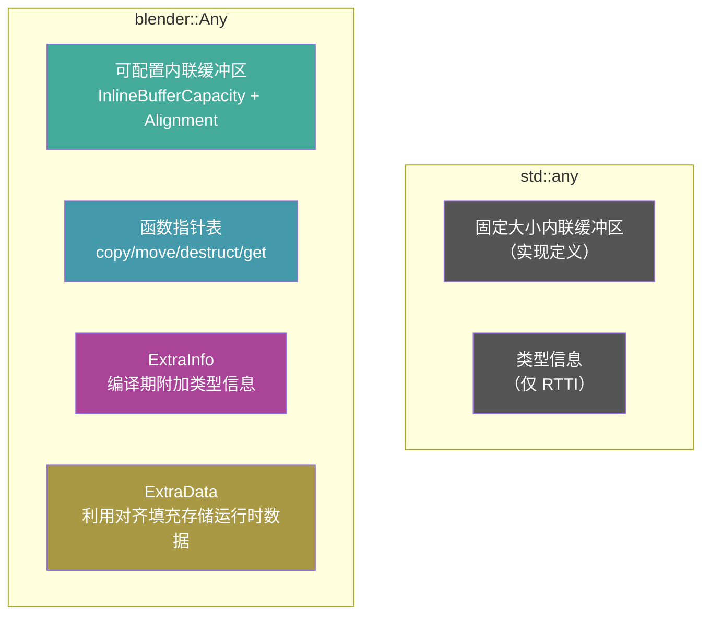
```mermaid
graph TB
    subgraph "std::any"
        A1["固定大小内联缓冲区<br/>（实现定义）"]
        A2["类型信息<br/>（仅 RTTI）"]
    end
    subgraph "blender::Any"
        B1["可配置内联缓冲区<br/>InlineBufferCapacity + Alignment"]
        B2["函数指针表<br/>copy/move/destruct/get"]
        B3["ExtraInfo<br/>编译期附加类型信息"]
        B4["ExtraData<br/>利用对齐填充存储运行时数据"]
    end
    style A1 fill:#555,color:#fff
    style A2 fill:#555,color:#fff
    style B1 fill:#4a9,color:#fff
    style B2 fill:#49a,color:#fff
    style B3 fill:#a49,color:#fff
    style B4 fill:#a94,color:#fff
```

---

## 二、模板参数

```cpp
template<
    typename ExtraInfo = void,       // 编译期附加类型信息
    size_t InlineBufferCapacity = 8, // 内联缓冲区字节数
    size_t Alignment = 8,            // 内联缓冲区对齐
    typename ExtraData = blenlib_detail::EmptyType  // 利用对齐填充的运行时数据
>
class Any;
```

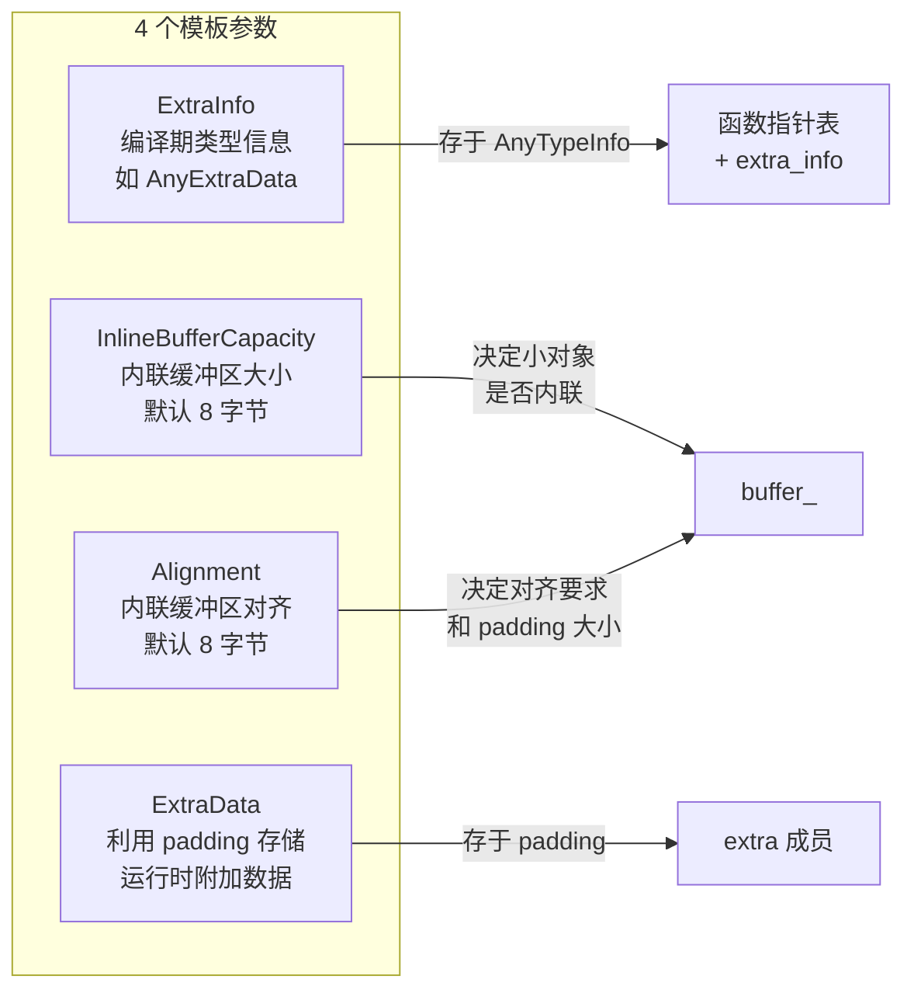
```mermaid
graph LR
    subgraph "4 个模板参数"
        EI["ExtraInfo<br/>编译期类型信息<br/>如 AnyExtraData"]
        IBC["InlineBufferCapacity<br/>内联缓冲区大小<br/>默认 8 字节"]
        AL["Alignment<br/>内联缓冲区对齐<br/>默认 8 字节"]
        ED["ExtraData<br/>利用 padding 存储<br/>运行时附加数据"]
    end
    EI --> |"存于 AnyTypeInfo"| VTable["函数指针表<br/>+ extra_info"]
    IBC --> |"决定小对象<br/>是否内联"| Buffer["buffer_"]
    AL --> |"决定对齐要求<br/>和 padding 大小"| Buffer
    ED --> |"存于 padding"| Extra["extra 成员"]
```

### SocketValueVariant 中的使用

```cpp
// BKE_node_socket_value.hh
Any<void, 32, 16, AnyExtraData> value_;
//       ↑   ↑        ↑
//      32B  16B对齐   利用 padding 存 kind + socket_type
```

- `InlineBufferCapacity = 32`：足够内联存储 `int`、`float`、`float3`、`GField` 等
- `Alignment = 16`：满足 SIMD 类型的对齐需求
- `AnyExtraData`：利用对齐产生的 padding 空间存储 `kind` 和 `socket_type`

### ExtraInfo vs ExtraData — 区别与联系

| | ExtraInfo | ExtraData |
|---|---|---|
| **存储位置** | `AnyTypeInfo` 静态变量中 | `Any` 对象实例中 |
| **何时确定** | 编译期（`ExtraInfo::get<T>()`） | 运行时（每个 Any 对象独立持有） |
| **是否共享** | 所有同类型 Any 共享一份 | 每个 Any 对象各有一份 |
| **大小影响** | 不增加 Any 对象大小 | 可能增加 Any 对象大小（但用 `no_unique_address` 优化） |
| **模板参数** | `Any` 的第 1 个模板参数 | `Any` 的第 4 个模板参数 |
| **典型内容** | 类型相关的元数据 | 每个 Any 实例的运行时数据 |

`SocketValueVariant` 用的是 `Any<void, 32, 16, AnyExtraData>`：
- `ExtraInfo = void` → 不使用 ExtraInfo（转为 `NoExtraInfo`，空类型）
- `ExtraData = AnyExtraData` → 每个 Any 对象存 `kind` 和 `socket_type`

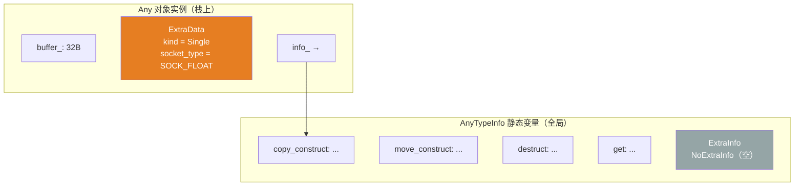
```mermaid
flowchart TB
    subgraph "Any 对象实例（栈上）"
        BUF["buffer_: 32B"]
        ED["ExtraData<br/>kind = Single<br/>socket_type = SOCK_FLOAT"]
        INFO_PTR["info_ →"]
    end

    subgraph "AnyTypeInfo 静态变量（全局）"
        CC["copy_construct: ..."]
        MC["move_construct: ..."]
        DT["destruct: ..."]
        GT["get: ..."]
        EI["ExtraInfo<br/>NoExtraInfo（空）"]
    end

    INFO_PTR --> CC

    style ED fill:#e67e22,color:#fff
    style EI fill:#95a5a6,color:#fff
```

> **为什么 `SocketValueVariant` 把 `kind` 和 `socket_type` 放在 `ExtraData` 而非 `ExtraInfo`？** 因为 `kind` 和 `socket_type` 是**运行时变化的**——同一个 `Any` 对象可能先存 `int`（`kind=Single`），后被赋值为 `GField`（`kind=Field`）。`ExtraInfo` 在编译期就固定了（每个类型 `T` 一份），无法在运行时改变。`ExtraData` 是每个 Any 实例独立持有的，可以在赋值时更新。

---

## 三、内存布局

### 3.1 三个核心数据成员

```cpp
class Any {
private:
    AlignedBuffer<RealInlineBufferCapacity, Alignment> buffer_{};  // 内联缓冲区
public:
    BLI_NO_UNIQUE_ADDRESS ExtraData extra = {};  // 利用 padding 的附加数据
private:
    const Info *info_ = nullptr;  // 指向静态函数指针表
};
```

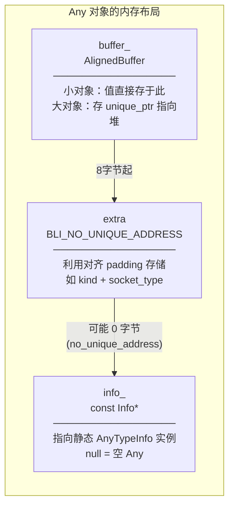
```mermaid
graph TB
    subgraph "Any 对象的内存布局"
        direction TB
        BUF["buffer_<br/>AlignedBuffer<max(InlineBufferCapacity, sizeof(unique_ptr))><br/>─────────────────<br/>小对象：值直接存于此<br/>大对象：存 unique_ptr 指向堆"]
        PAD["extra<br/>BLI_NO_UNIQUE_ADDRESS<br/>─────────────────<br/>利用对齐 padding 存储<br/>如 kind + socket_type"]
        INFO["info_<br/>const Info*<br/>─────────────────<br/>指向静态 AnyTypeInfo 实例<br/>null = 空 Any"]
    end
    BUF --> |"8字节起"| PAD
    PAD --> |"可能 0 字节<br/>(no_unique_address)"| INFO
```

### 3.2 `BLI_NO_UNIQUE_ADDRESS` — 关键优化

```cpp
// BLI_utildefines.h
#if defined(_MSC_VER) && !defined(__clang__)
#  define BLI_NO_UNIQUE_ADDRESS [[msvc::no_unique_address]]
#else
#  define BLI_NO_UNIQUE_ADDRESS [[no_unique_address]]
#endif
```

`[[no_unique_address]]` 是 C++20 属性，允许空类型或具有特定对齐的类型**不占用独立字节**，而是利用前一个成员的 padding 空间。

#### 空对象为什么占 1 字节？

C++ 要求**每个独立对象必须有唯一地址**。如果空类型占 0 字节，数组中连续元素就会共享同一地址：

```cpp
struct Empty {};
Empty arr[3];
// 如果 sizeof(Empty) == 0：
// &arr[0] == &arr[1] == &arr[2]  ← 不合法！
// 所以 C++ 规定 sizeof(Empty) >= 1
```

`[[no_unique_address]]` 告诉编译器："这个成员不需要唯一地址，可以和其他成员共享地址空间"。所以空类型成员可以占 0 字节——它借用前一个成员的地址。

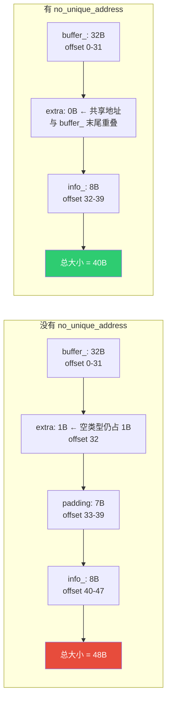
```mermaid
graph LR
    subgraph "没有 no_unique_address"
        N1["buffer_: 32B<br/>offset 0-31"]
        N2["extra: 1B ← 空类型仍占 1B<br/>offset 32"]
        N3["padding: 7B<br/>offset 33-39"]
        N4["info_: 8B<br/>offset 40-47"]
        N5["总大小 = 48B"]
        N1 --> N2 --> N3 --> N4 --> N5
    end

    subgraph "有 no_unique_address"
        Y1["buffer_: 32B<br/>offset 0-31"]
        Y2["extra: 0B ← 共享地址<br/>与 buffer_ 末尾重叠"]
        Y3["info_: 8B<br/>offset 32-39"]
        Y4["总大小 = 40B"]
        Y1 --> Y2 --> Y3 --> Y4
    end

    style N5 fill:#e74c3c,color:#fff
    style Y4 fill:#2ecc71,color:#fff
```

> **不是利用前一个成员的 padding**——那是另一种优化场景。对于空类型，`[[no_unique_address]]` 是**共享地址**（0 字节）。对于非空但有尾部 padding 的类型，`[[no_unique_address]]` 允许下一个成员塞进 padding 中（tail padding reuse）。两种情况都适用。

**实际效果**：`AlignedBuffer<32, 16>` 本身可能有尾部 padding（因为 16 字节对齐），`ExtraData` 就可以"塞进"这些 padding 中，**不增加 `Any` 的总大小**。

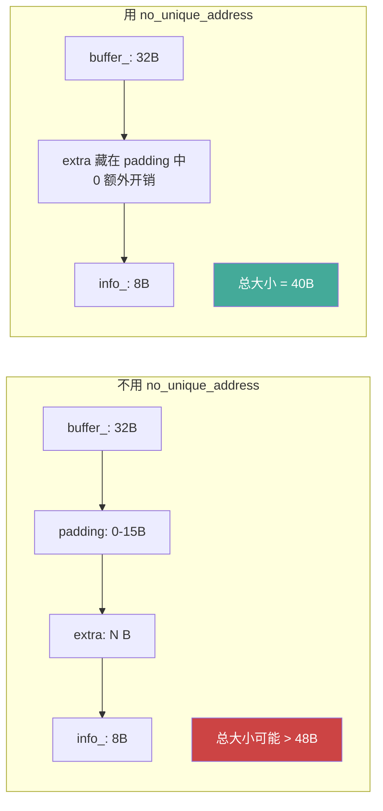
```mermaid
graph LR
    subgraph "不用 no_unique_address"
        A1["buffer_: 32B"] --> A2["padding: 0-15B"] --> A3["extra: N B"] --> A4["info_: 8B"]
        A5["总大小可能 > 48B"]
    end
    subgraph "用 no_unique_address"
        B1["buffer_: 32B"] --> B2["extra 藏在 padding 中<br/>0 额外开销"] --> B3["info_: 8B"]
        B4["总大小 = 40B"]
    end
    style A5 fill:#c44,color:#fff
    style B4 fill:#4a9,color:#fff
```

### 3.3 `RealInlineBufferCapacity` 的保底策略

```cpp
static constexpr size_t RealInlineBufferCapacity =
    std::max(InlineBufferCapacity, sizeof(std::unique_ptr<int>));
```

即使你设 `InlineBufferCapacity = 0`，实际缓冲区也至少能容纳一个 `unique_ptr`（8 字节），因为大对象需要在缓冲区中存 `unique_ptr`。

---

## 四、类型擦除机制 — AnyTypeInfo

### 4.1 函数指针表

```cpp
/**
 * Contains function pointers that manage the memory in an #Any.
 * Additional type specific #ExtraInfo can be embedded here as well.
 */
template<typename ExtraInfo>
struct AnyTypeInfo {
    void (*copy_construct)(void *dst, const void *src);  // 复制构造
    void (*move_construct)(void *dst, void *src);        // 移动构造
    void (*destruct)(void *src);                          // 析构
    const void *(*get)(const void *src);                  // 获取值指针
    ExtraInfo extra_info;                                 // 编译期附加信息
};
```

> **注释翻译**：
> - `"Contains function pointers that manage the memory in an #Any."` — 包含管理 `Any` 内存的函数指针。
> - `"Additional type specific #ExtraInfo can be embedded here as well."` — 额外的**类型特定** `ExtraInfo` 也可以嵌入这里。"type specific" 意思是每个类型 `T` 可以有不同的 `ExtraInfo` 数据。`ExtraInfo` 通过 `ExtraInfo::template get<T>()` 在编译期为每个类型生成——例如 `SocketValueVariant` 的 `ExtraInfo` 包含 `kind`（Single/Field/List/Grid）和 `socket_type` 指针，这些信息在 `AnyTypeInfo` 中随函数指针一起存储，**不增加 `Any` 对象本身的大小**。

> **"静态变量"指什么？** `info_for_inline` 和 `info_for_unique_ptr` 声明为 `inline constexpr`——每个模板实例化只有**一个全局实例**，所有 `Any` 对象共享同一个 `AnyTypeInfo`：
>
> ```cpp
> // 整个程序中只有一个 info_for_inline<NoExtraInfo, int>
> // 所有存 int 的 Any 对象的 info_ 都指向同一个地址
> template<>
> inline constexpr AnyTypeInfo<NoExtraInfo> info_for_inline<NoExtraInfo, int> = { ... };
> ```
>
> 所以 `extra_info` 存在 `AnyTypeInfo` 中不占 `Any` 对象的空间——它是静态数据，被所有同类型 `Any` 共享。

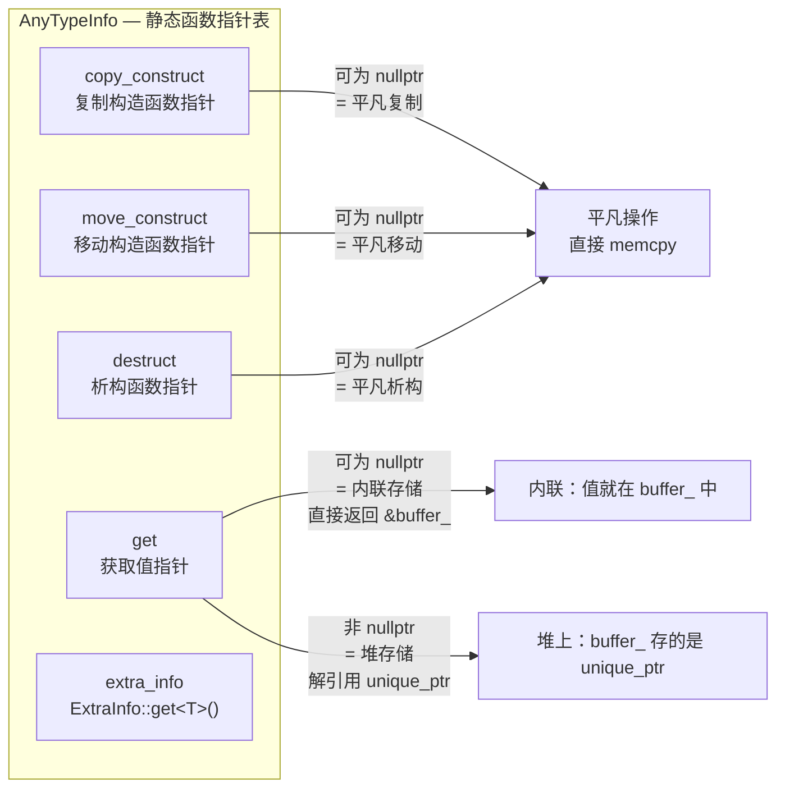
```mermaid
graph LR
    subgraph "AnyTypeInfo — 静态函数指针表"
        CC["copy_construct<br/>复制构造函数指针"]
        MC["move_construct<br/>移动构造函数指针"]
        DT["destruct<br/>析构函数指针"]
        GT["get<br/>获取值指针"]
        EI["extra_info<br/>ExtraInfo::get&lt;T&gt;()"]
    end
    CC --> |"可为 nullptr<br/>= 平凡复制"| TRIVIAL["平凡操作<br/>直接 memcpy"]
    MC --> |"可为 nullptr<br/>= 平凡移动"| TRIVIAL
    DT --> |"可为 nullptr<br/>= 平凡析构"| TRIVIAL
    GT --> |"可为 nullptr<br/>= 内联存储<br/>直接返回 &buffer_"| INLINE["内联：值就在 buffer_ 中"]
    GT --> |"非 nullptr<br/>= 堆存储<br/>解引用 unique_ptr"| HEAP["堆上：buffer_ 存的是 unique_ptr"]
```

### 4.2 两种函数表实例

根据类型大小，`Any` 选择两种存储策略之一，对应两套函数表：

#### 模板变量语法 — `inline constexpr` 详解

```cpp
template<typename ExtraInfo, typename T>
inline constexpr AnyTypeInfo<ExtraInfo> info_for_inline = { ... };
```

**变量模板**（C++14）：和函数模板、类模板类似，但生成的是**变量**而非函数或类。每个不同的 `T` 产生一个不同的变量实例。

**为什么需要 `inline`？** 头文件被多个 `.cpp` 包含时，每个 `.cpp` 都会看到这个变量定义。没有 `inline`，链接器会报"多重定义"错误。`inline` 告诉链接器："多个定义没关系，合并为一个"。

**为什么需要 `constexpr`？** `constexpr` 表示这个变量可以在**编译期求值**。这对 `is<T>()` 的指针比较很关键——编译器可以在编译期确定 `&info_for_inline<..., int>` 的地址，优化掉整个 `is<T>()` 调用。

**为什么说是"静态变量"？** `inline constexpr` 变量隐含**合并链接**——程序中只有一份实例，等价于静态存储期的全局变量。它不存储在栈上，不存储在堆上，而是在**全局数据段**中。生命周期从程序启动到程序结束——和全局变量、`static` 变量一样。

> **普通定义在文件里的变量存在哪？生命周期多久？** 和 `inline constexpr` 完全一样——全局数据段，程序启动到结束。区别不在存储位置和生命周期，而在**链接性**和**可修改性**：
>
> | 变量 | 链接性 | 可修改 | 编译期求值 |
> |------|--------|--------|-----------|
> | `int x = 42;` | 外部链接（其他 `.cpp` 可用 `extern`） | 可以 | 不保证 |
> | `static int x = 42;` | 内部链接（仅本 `.cpp`） | 可以 | 不保证 |
> | `const int x = 42;` | 内部链接（C++ 默认） | 不可以 | 不保证 |
> | `constexpr int x = 42;` | 内部链接 | 不可以 | 保证 |
> | `inline constexpr int x = 42;` | 外部链接+合并（所有 `.cpp` 共享一份） | 不可以 | 保证 |
> | `inline int x = 42;` | 外部链接+合并 | 可以 | 不保证 |
>
> 初始化为 0 的全局变量存在 `.bss` 段（不占磁盘空间），有非零初始值的存在 `.data` 段，`const`/`constexpr` 的存在 `.rodata` 段（只读）。但这些都是"全局数据段"的子区域，生命周期都一样。
>
> **为什么 `const int x = 42;` 默认内部链接？** C++ 的设计意图：`const` 变量通常用作编译期常量，编译器会把它内联到使用处（直接用 `42` 替代 `x`）。如果外部链接，每个 `.cpp` 都必须引用同一个变量，编译器就无法自由内联。所以 C++ 规定 `const` 全局变量默认内部链接——每个 `.cpp` 各有一份，编译器可以独立优化。C 语言相反——`const` 全局变量默认外部链接，这是 C++ 故意改的。
>
> **`int x = 42;` 和 `inline int x = 42;` 都是外部链接，区别在哪？** 多重定义的处理不同：
> ```cpp
> // header.h
> int x = 42;           // ❌ 被 a.cpp 和 b.cpp 包含 → 链接器报"多重定义"
> inline int x = 42;    // ✅ 被 a.cpp 和 b.cpp 包含 → 链接器合并为一份
> ```
> `inline` 的"合并"语义：链接器看到多个定义时，选一个保留，其余丢弃，不报错。没有 `inline` 时，链接器看到多个定义就报错。
>
> **头文件里的全局变量要加 `inline` 吗？** 必须加（C++17 起），否则多重包含会报链接错误：
> ```cpp
> // header.h
> int global_counter = 0;              // ❌ 多个 .cpp 包含 → 链接错误
> inline int global_counter = 0;       // ✅ 安全
> inline constexpr int MAX_SIZE = 42;  // ✅ 安全（只读）
> const int MAGIC = 7;                 // ✅ 安全（const 默认内部链接，每个 .cpp 各一份）
> ```
> C++17 之前的做法是声明放在头文件（`extern int global_counter;`），定义放在单独的 `.cpp`（`int global_counter = 0;`）。`inline` 变量让头文件定义变量变得简单。
>
> **`const int MAGIC = 7;` 在头文件不加 `inline` 也安全，加了也安全，但行为不同：**
>
> 为什么 `const` 这么特殊？因为 C++ 给 `const` 全局变量**默认内部链接**——等价于自动加了 `static`：
> ```cpp
> // header.h 被 a.cpp 和 b.cpp 包含
> const int MAGIC = 7;
> // 等价于每个 .cpp 里各自写了：
> // static const int MAGIC = 7;  ← 内部链接，仅本 .cpp 可见
> // a.cpp 有自己的 MAGIC，b.cpp 也有自己的 MAGIC
> // 互不冲突，链接器不会报"多重定义"
> ```
> 对比 `int x = 42;`——默认外部链接，两个 `.cpp` 都导出符号 `x`，链接器看到两个 `x` 就报错。`const` 自带"隔离"，所以不需要 `inline` 解决多重定义。
>
> | | `const int MAGIC = 7;` | `inline const int MAGIC = 7;` |
> |---|---|---|
> | 链接性 | 内部链接 | 外部链接+合并 |
> | 每个 .cpp | 各有一份，地址不同 | 共享一份，地址相同 |
> | 内存 | N 份（N = .cpp 数量） | 1 份 |
> | 取地址 `&MAGIC` | 每个 .cpp 得到不同地址 | 所有 .cpp 得到相同地址 |
> | 编译器内联 | 更容易（每个 .cpp 独立优化） | 也可以，但可能稍受限 |
>
> 对 `int` 这种小类型，多几份拷贝无所谓（编译器通常直接内联值，根本不分配内存）。头文件中 `const int` 不加 `inline` 是惯用写法。加了也没错，只是语义变了。
>
> **`inline` 主要用在头文件，用在 `.cpp` 里几乎没意义：**
> ```cpp
> // a.cpp
> inline int x = 42;    // 只有一个定义，inline 的"合并"功能无用
> int y = 42;           // 同样只有一个定义，效果一样
> ```
> 在 `.cpp` 中，变量只被定义一次，不存在"多重定义"问题，`inline` 的合并功能无用武之地。
>
> **模板特化（变量/函数/类都可以特化）：**
> ```cpp
> // 通用模板
> template<typename T> inline constexpr size_t type_size = sizeof(T);
> template<typename T> T max_value(T a, T b) { return a > b ? a : b; }
> template<typename T> struct TypeInfo { static constexpr size_t size = sizeof(T); };
>
> // 全特化 — 为特定类型提供不同实现
> template<> inline constexpr size_t type_size<void> = 0;           // 变量特化
> template<> const char* max_value(const char* a, const char* b) {  // 函数特化
>     return strcmp(a, b) > 0 ? a : b;  // 通用模板会比较指针地址，错误！
> }
> template<> struct TypeInfo<void> { static constexpr size_t size = 0; };  // 类特化
> ```
> **为什么需要特化？** 通用模板对大多数类型适用，但某些类型需要特殊处理（如 `const char*` 比较字符串内容而非指针地址）。
>
> **全特化 vs 偏特化放哪？**
>
> | 特化类型 | 放在哪 | 原因 |
> |---------|--------|------|
> | 全特化（`template<>`） | 通常 `.cpp`，或头文件+`inline` | 全特化不再是模板，是具体定义，放头文件会多重定义 |
> | 偏特化（`template<T*>`） | 头文件 | 仍然是模板，需要被多个 `.cpp` 实例化 |
>
> **模板定义放头文件不需要 `inline`——模板自带 ODR 豁免：**
> ```cpp
> // header.h — 模板函数，不需要 inline
> template<typename T> T add(T a, T b) { return a + b; }  // ✅ 链接器自动合并实例化
> // header.h — 模板变量，不需要 inline
> template<typename T> constexpr size_t type_size = sizeof(T);  // ✅ 同理
> ```
> C++ 标准规定：模板定义可以被多个翻译单元包含，链接器自动合并相同实例化（ODR 豁免）。
>
> 那 Blender 的 `info_for_inline` 为什么加 `inline`？不是解决多重定义，而是**保证地址一致性**——`is<T>()` 用 `info_ == &get_info<T>()` 比较指针地址，必须保证同一特化在所有 `.cpp` 中地址相同，`inline` 确保了这一点。
>
> 真正需要 `inline` 的场景：**全特化**和**非模板定义**放头文件时——它们不再是模板，ODR 豁免不适用：
> ```cpp
> template<typename T> void foo() { /* 通用 */ }      // ✅ 不需要 inline（模板）
> template<> inline void foo<int>() { /* int 特化 */ } // ❌ 不加 inline → 多重定义（全特化）
> ```
>
> **全特化也可以只把声明放头文件，定义放 `.cpp`：**
> ```cpp
> // header.h
> template<typename T> void foo();           // 通用模板声明
> template<> void foo<int>();                // 全特化声明（只有声明）
>
> // a.cpp
> template<typename T> void foo() { /* 通用 */ }
> template<> void foo<int>() { /* int 特化 */ }  // 全特化定义，不需要 inline
> ```
>
> **模板定义一般放头文件**（因为编译器需要看到完整定义才能实例化），但也可以放 `.cpp` + 显式实例化。如果模板只在一个 `.cpp` 里用，声明和定义都放那个 `.cpp` 就行——不需要头文件，不需要显式实例化。
>
> | | 模板定义 | 全特化定义 |
> |---|---|---|
> | 放头文件 | ✅ 最常见，任意类型可用 | 需加 `inline` |
> | 放 `.cpp` | 需显式实例化，只有列出类型可用 | ✅ 传统做法，不需要 `inline` |
> | 只声明放头文件 | ❌ 其他 `.cpp` 无法实例化 | ✅ 安全 |
>
> 显式实例化示例：
> ```cpp
> // a.cpp — 模板定义 + 显式实例化
> template<typename T> T add(T a, T b) { return a + b; }
> template int add<int>(int, int);      // 只生成 int 版本
> template float add<float>(float, float); // 只生成 float 版本
> // add<double>() 不可用 — 链接错误
> ```

> **`inline constexpr` 相当于 `static` 吗？** 效果类似，但机制不同：
>
> | | `static` 变量 | `inline constexpr` 变量 |
> |---|---|---|
> | **存储位置** | 全局数据段 | 全局数据段 |
> | **生命周期** | 程序启动到结束 | 程序启动到结束 |
> | **唯一性** | 每个翻译单元各有一份（内部链接） | 所有翻译单元共享一份（外部链接+合并） |
> | **可修改** | 可以 | 不可以（`constexpr` = 只读） |
> | **编译期求值** | 不保证 | 保证 |
> | **头文件中定义** | ✅ 安全（内部链接） | ✅ 安全（`inline` 允许多重定义） |
>
> 关键区别：`static` 变量在**每个 `.cpp` 中各有一份**（内部链接），`inline constexpr` 在**所有 `.cpp` 中共享一份**（合并链接）。对 `is<T>()` 的指针比较来说，必须用 `inline constexpr`——如果用 `static`，不同 `.cpp` 中的 `&info_for_inline<..., int>` 地址不同，比较会失败。
>
> ```mermaid
> flowchart TB
>     subgraph "static 变量（内部链接）"
>         S1["a.cpp<br/>info_for_inline&lt;..., int&gt;<br/>地址: 0x4000"]
>         S2["b.cpp<br/>info_for_inline&lt;..., int&gt;<br/>地址: 0x8000"]
>         S1 -.->|"不同地址！<br/>is&lt;int&gt;() 可能失败"| S2
>     end
>
>     subgraph "inline constexpr 变量（合并链接）"
>         I1["a.cpp 引用"]
>         I2["b.cpp 引用"]
>         I3["唯一实例<br/>info_for_inline&lt;..., int&gt;<br/>地址: 0x4000"]
>         I1 --> I3
>         I2 --> I3
>     end
>
>     style S1 fill:#e74c3c,color:#fff
>     style S2 fill:#e74c3c,color:#fff
>     style I3 fill:#2ecc71,color:#fff
> ```
>
> **为什么不用更清晰的语法？** C++ 历史原因。`inline` 原本是给函数用的（建议内联），C++17 扩展给变量用（允许头文件中定义变量而不报多重定义）。`constexpr` 原本是"编译期常量"的意思。两者组合恰好实现了"全局唯一实例"的效果，但语义并不直观。对比更清晰的设计（如果 C++ 重新设计）：`unique template<typename T> AnyTypeInfo info_for_inline = { ... };`——`unique` 明确表示"全局唯一实例"。但 C++ 不能破坏已有代码，只能在现有关键字上叠加含义。

**通过不同的 T 访问不同的变量？** 是的。模板变量是编译器生成的——每个不同的 `T` 产生一个独立的变量：

```cpp
// 编译器为以下代码生成 3 个独立的变量：
info_for_inline<NoExtraInfo, int>     // 变量1：int 的函数表
info_for_inline<NoExtraInfo, float>   // 变量2：float 的函数表
info_for_inline<NoExtraInfo, string>  // 变量3：string 的函数表

// 它们在内存中的地址各不相同：
&info_for_inline<NoExtraInfo, int>   != &info_for_inline<NoExtraInfo, float>
```

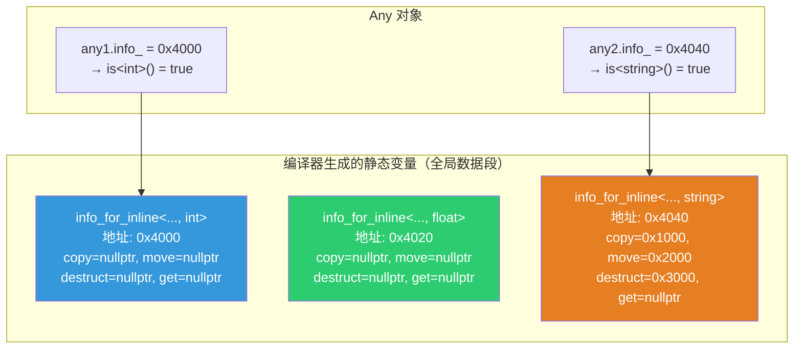
```mermaid
flowchart TD
    subgraph "编译器生成的静态变量（全局数据段）"
        V1["info_for_inline&lt;..., int&gt;<br/>地址: 0x4000<br/>copy=nullptr, move=nullptr<br/>destruct=nullptr, get=nullptr"]
        V2["info_for_inline&lt;..., float&gt;<br/>地址: 0x4020<br/>copy=nullptr, move=nullptr<br/>destruct=nullptr, get=nullptr"]
        V3["info_for_inline&lt;..., string&gt;<br/>地址: 0x4040<br/>copy=0x1000, move=0x2000<br/>destruct=0x3000, get=nullptr"]
    end

    subgraph "Any 对象"
        A1["any1.info_ = 0x4000<br/>→ is&lt;int&gt;() = true"]
        A2["any2.info_ = 0x4040<br/>→ is&lt;string&gt;() = true"]
    end

    A1 --> V1
    A2 --> V3

    style V1 fill:#3498db,color:#fff
    style V2 fill:#2ecc71,color:#fff
    style V3 fill:#e67e22,color:#fff
```

#### 内联存储 — `info_for_inline`

```cpp
template<typename ExtraInfo, typename T>
inline constexpr AnyTypeInfo<ExtraInfo> info_for_inline = {
    // copy_construct: 平凡类型 → nullptr，非平凡 → placement new 拷贝
    is_trivially_copy_constructible_extended_v<T> ?
        nullptr :
        +[](void *dst, const void *src) { new (dst) T(*static_cast<const T *>(src)); },
    // move_construct: 同理
    is_trivially_move_constructible_extended_v<T> ?
        nullptr :
        +[](void *dst, void *src) { new (dst) T(std::move(*static_cast<T *>(src))); },
    // destruct: 平凡析构 → nullptr
    is_trivially_destructible_extended_v<T> ?
        nullptr :
        +[](void *src) { std::destroy_at(static_cast<T *>(src)); },
    // get: 内联存储不需要额外间接，返回 nullptr
    nullptr,
    ExtraInfo::template get<T>()
};
```

#### 内联存储函数逐行详解

**1. `copy_construct`** — `+[](void *dst, const void *src) { new (dst) T(*static_cast<const T *>(src)); }`

```cpp
// src 指向 buffer_，其中存着 T 类型的值
// dst 指向目标 buffer_，需要构造一个新的 T

static_cast<const T *>(src)   // 将 void* 转为 const T* — 指向源 T 对象
*static_cast<const T *>(src)  // 解引用 — 得到 const T&（源对象的引用）
new (dst) T(...)              // placement new — 在 dst 位置构造 T
// 合起来：在 dst 处用源对象的拷贝构造函数构造新 T
```

> **为什么需要 `T(...)` 而非 `new (dst) T`？** `new (dst)` 只指定构造位置（placement），`T(...)` 指定**用哪个构造函数**：
> - `new (dst) T` — 默认构造（T 必须有默认构造函数）
> - `new (dst) T(x)` — 拷贝构造（用 x 的值构造）
> - `new (dst) T(std::move(x))` — 移动构造（从 x 移动资源）
>
> 这里需要拷贝/移动构造，所以必须写 `T(...)`。

**2. `move_construct`** — `+[](void *dst, void *src) { new (dst) T(std::move(*static_cast<T *>(src))); }`

```cpp
static_cast<T *>(src)         // void* → T*（注意：非 const，因为要移动）
*static_cast<T *>(src)        // 解引用 — 得到 T&（左值引用）
std::move(*static_cast<T *>(src))  // 转为 T&&（右值引用）— 标记为"可移动"
new (dst) T(std::move(...))   // 在 dst 处用移动构造函数构造新 T
// 移动后源对象处于"有效但未指定"状态
```

**3. `destruct`** — `+[](void *src) { std::destroy_at(static_cast<T *>(src)); }`

```cpp
static_cast<T *>(src)         // void* → T*（必须转！void 没有析构函数）
std::destroy_at(static_cast<T *>(src))  // 等价于 ptr->~T() — 调用析构函数
// 不释放内存！只调用析构函数（因为内存是 buffer_ 的，不需要 free）
```

> **void 指针能调 `destroy_at` 吗？** 不行。`std::destroy_at` 需要知道类型才能调用析构函数：`destroy_at(void*)` 无法编译——`void` 没有析构函数。必须先 `static_cast<T*>(src)` 转为具体类型指针。

> **整数也走 `destroy_at` 吗？** 不走。`int` 是平凡析构类型，`destruct` 为 `nullptr`。`Any` 的析构函数检查 `info_->destruct != nullptr` 才调用——`int` 直接跳过，什么都不做。

**4. `get`** — `nullptr`

内联存储时，值直接在 `buffer_` 中，`&buffer_` 就是值的地址。`Any::get()` 检查 `info_->get == nullptr` 时直接返回 `&buffer_`，无需额外间接。

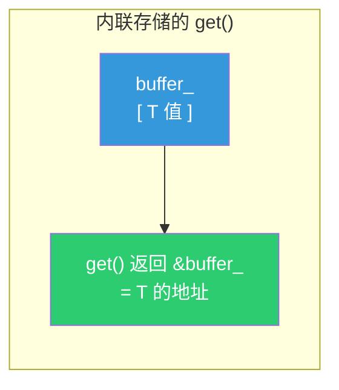
```mermaid
flowchart LR
    subgraph "内联存储的 get()"
        BUF["buffer_<br/>[ T 值 ]"]
        GET["get() 返回 &buffer_<br/>= T 的地址"]
        BUF --> GET
    end

    style BUF fill:#3498db,color:#fff
    style GET fill:#2ecc71,color:#fff
```

#### 堆存储 — `info_for_unique_ptr`

```cpp
template<typename T> using Ptr = std::unique_ptr<T>;
template<typename ExtraInfo, typename T>
inline constexpr AnyTypeInfo<ExtraInfo> info_for_unique_ptr = {
    // copy_construct: 深拷贝 — new T(**ptr)
    [](void *dst, const void *src) {
        new (dst) Ptr<T>(new T(**static_cast<const Ptr<T> *>(src)));
    },
    // move_construct: 移动构造新 unique_ptr（用移动构造函数创建新 T）
    [](void *dst, void *src) {
        new (dst) Ptr<T>(new T(std::move(**static_cast<Ptr<T> *>(src))));
    },
    // destruct: 销毁 unique_ptr，自动释放堆内存
    [](void *src) { std::destroy_at(static_cast<Ptr<T> *>(src)); },
    // get: 需要解引用 unique_ptr → 返回 &**ptr
    [](const void *src) -> const void * {
        return &**static_cast<const Ptr<T> *>(src);
    },
    ExtraInfo::template get<T>()
};
```

#### 堆存储函数逐行详解

堆存储时，`buffer_` 中存的是 `std::unique_ptr<T>`（即 `Ptr<T>`），`T` 的实际数据在堆上。

**1. `copy_construct`** — `[](void *dst, const void *src) { new (dst) Ptr<T>(new T(**static_cast<const Ptr<T> *>(src))); }`

```cpp
static_cast<const Ptr<T> *>(src)   // void* → const unique_ptr<T>* — 指向 buffer_ 中的 unique_ptr
*static_cast<const Ptr<T> *>(src)  // 解引用 — 得到 const unique_ptr<T>&
**static_cast<const Ptr<T> *>(src) // 二次解引用 — unique_ptr 的 operator* → 得到 const T&
new T(...)                         // 在堆上 new 一个 T，用拷贝构造函数
new (dst) Ptr<T>(new T(...))       // 在 dst 的 buffer_ 中 placement new 一个新的 unique_ptr，指向新 T
// 效果：深拷贝 — 源 unique_ptr 不变，目标获得全新的 unique_ptr → 新 T
```

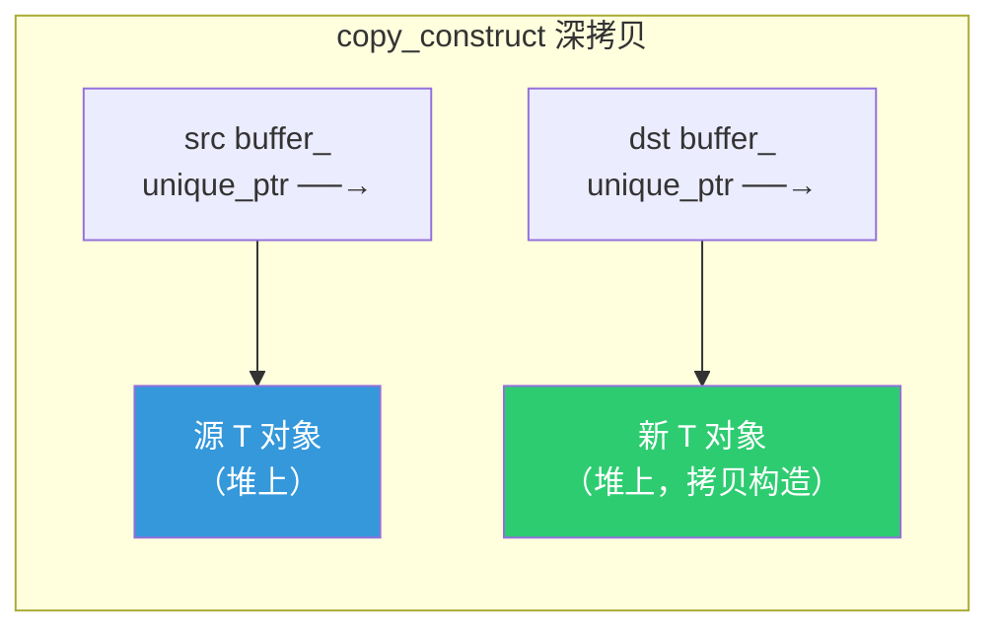
```mermaid
flowchart LR
    subgraph "copy_construct 深拷贝"
        SRC_BUF["src buffer_<br/>unique_ptr ──→"]
        SRC_T["源 T 对象<br/>（堆上）"]
        DST_BUF["dst buffer_<br/>unique_ptr ──→"]
        DST_T["新 T 对象<br/>（堆上，拷贝构造）"]
        
        SRC_BUF --> SRC_T
        DST_BUF --> DST_T
    end

    style SRC_T fill:#3498db,color:#fff
    style DST_T fill:#2ecc71,color:#fff
```

**2. `move_construct`** — `[](void *dst, void *src) { new (dst) Ptr<T>(new T(std::move(**static_cast<Ptr<T> *>(src)))); }`

```cpp
static_cast<Ptr<T> *>(src)              // void* → unique_ptr<T>*（非 const）
*static_cast<Ptr<T> *>(src)             // 解引用 — 得到 unique_ptr<T>&
**static_cast<Ptr<T> *>(src)            // 二次解引用 — 得到 T&
std::move(**static_cast<Ptr<T> *>(src)) // 转为 T&& — 标记为可移动
new T(std::move(...))                   // 在堆上 new T，用移动构造函数
new (dst) Ptr<T>(new T(std::move(...))) // 在 dst 中构造新 unique_ptr → 新 T
```

> **注意**：这里**不是**移动 `unique_ptr` 本身（那会让源 `unique_ptr` 变空），而是在堆上 `new` 一个新 T，用移动构造函数初始化。源 `unique_ptr` 仍然指向原对象（只是原对象处于移动后状态）。这是 `Any` 移动语义的设计选择——移动后的 `Any` 仍然"有值"，只是值处于移动后状态。
>
> **为什么这样设计？** `Any` 的移动语义要求"移动后源 Any 仍有值"——如果直接移动 unique_ptr 本身（`std::move(*static_cast<Ptr<T>*>(src))`），源 unique_ptr 会变空（nullptr），违反设计约束。所以创建新 unique_ptr + 移动构造新 T 对象，源 unique_ptr 保持有效。
>
> **`static_cast` 需要知道实际类型**：`static_cast<T*>(void_ptr)` 要求调用者知道实际存储的类型是 T。如果类型不匹配，结果是 UB。这就是为什么 `get<T>()` 前通常要 `is<T>()` 检查。
>
> **如何判断深浅拷贝？**
> | 场景 | 操作 | 是否深拷贝 |
> |------|------|-----------|
> | `copy_construct` 堆存储 | `new T(*static_cast<T*>(src))` | 深拷贝 — 拷贝构造新 T |
> | `move_construct` 堆存储 | `new T(std::move(*static_cast<T*>(src)))` | 移动构造 — 不是拷贝 |
> | 平凡类型 `std::copy_n` | memcpy | 浅拷贝 — 逐字节复制 |
> 
> "深拷贝"指拷贝构造函数被调用（可能涉及资源复制）。"浅拷贝"指 memcpy（不调用构造函数）。

**3. `destruct`** — `[](void *src) { std::destroy_at(static_cast<Ptr<T> *>(src)); }`

```cpp
static_cast<Ptr<T> *>(src)         // void* → unique_ptr<T>*
std::destroy_at(...)               // 调用 unique_ptr 的析构函数
// unique_ptr 析构时自动 delete 其指向的 T 对象 → 堆内存释放
```

**4. `get`** — `[](const void *src) -> const void * { return &**static_cast<const Ptr<T> *>(src); }`

```cpp
static_cast<const Ptr<T> *>(src)   // void* → const unique_ptr<T>*
*static_cast<const Ptr<T> *>(src)  // 解引用 — 得到 const unique_ptr<T>&
**static_cast<const Ptr<T> *>(src) // 二次解引用 — unique_ptr::operator* → 得到 const T&
&**static_cast<const Ptr<T> *>(src) // 取地址 — 得到 const T*（堆上 T 的地址）
// 返回 const void* — 指向堆上的 T 对象
```

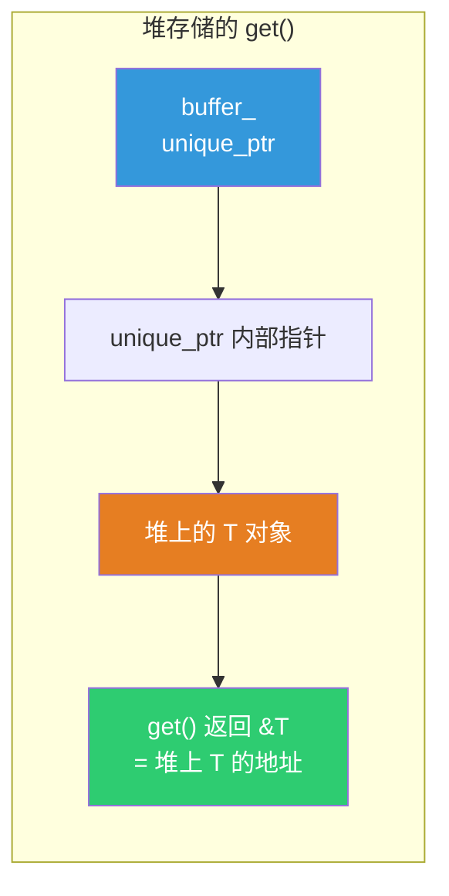
```mermaid
flowchart LR
    subgraph "堆存储的 get()"
        BUF["buffer_<br/>unique_ptr<T>"]
        PTR["unique_ptr 内部指针"]
        T_OBJ["堆上的 T 对象"]
        RESULT["get() 返回 &T<br/>= 堆上 T 的地址"]
        
        BUF --> PTR --> T_OBJ --> RESULT
    end

    style BUF fill:#3498db,color:#fff
    style T_OBJ fill:#e67e22,color:#fff
    style RESULT fill:#2ecc71,color:#fff
```

#### 内联 vs 堆存储函数对比

| 函数 | 内联存储 | 堆存储 |
|------|---------|--------|
| `copy_construct` | `new (dst) T(*src_T)` — 直接拷贝 | `new (dst) Ptr(new T(**src_ptr))` — 深拷贝 |
| `move_construct` | `new (dst) T(std::move(*src_T))` — 直接移动 | `new (dst) Ptr(new T(std::move(**src_ptr)))` — 堆上移动构造 |
| `destruct` | `destroy_at(src_T)` — 只调析构 | `destroy_at(src_ptr)` — 析构 unique_ptr → 自动 delete |
| `get` | `nullptr`（值就在 buffer_ 中） | `&**src_ptr`（需解引用 unique_ptr） |

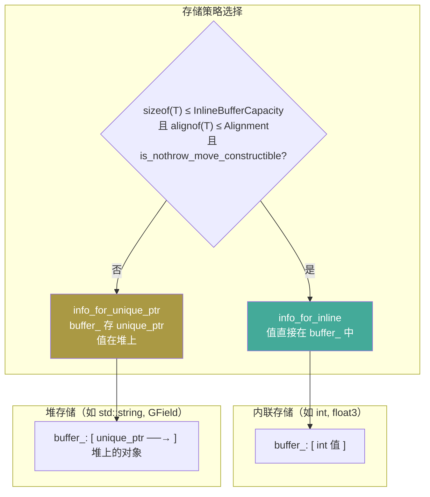
```mermaid
graph TB
    subgraph "存储策略选择"
        CHECK{"sizeof(T) ≤ InlineBufferCapacity<br/>且 alignof(T) ≤ Alignment<br/>且 is_nothrow_move_constructible?"}
        CHECK -->|"是"| INLINE["info_for_inline<br/>值直接在 buffer_ 中"]
        CHECK -->|"否"| HEAP["info_for_unique_ptr<br/>buffer_ 存 unique_ptr<br/>值在堆上"]
    end

    subgraph "内联存储（如 int, float3）"
        I_BUF["buffer_: [ int 值 ]"]
    end

    subgraph "堆存储（如 std::string, GField）"
        H_BUF["buffer_: [ unique_ptr ──→ ] 堆上的对象"]
    end

    INLINE --> I_BUF
    HEAP --> H_BUF

    style INLINE fill:#4a9,color:#fff
    style HEAP fill:#a94,color:#fff
```

> **为什么要求 `is_nothrow_move_constructible`？** `Any` 的移动构造函数声明为 `noexcept`。如果 `T` 的移动构造函数可能抛异常，`Any` 在内联存储时移动 `T` 也可能抛异常，违反 `noexcept` 保证。这会破坏容器优化——例如 `std::vector<Any>` 扩容时，如果元素移动可能抛异常，vector 必须用拷贝而非移动（更慢）。不满足此条件的类型只能走堆存储（`unique_ptr` 的移动是 `noexcept` 的）。

### 4.3 `+[](...)` — Lambda 到函数指针的转换

```cpp
+[](void *dst, const void *src) { new (dst) T(*static_cast<const T *>(src)); }
```

#### `+` 到底干了什么？

无捕获 lambda 有一个隐式转换运算符，可以转为函数指针：

```cpp
auto lambda = [](int x) { return x + 1; };
int (*fp)(int) = lambda;  // 隐式转换，OK

// + 强制显式转换：
auto fp2 = +lambda;       // 一元加法触发隐式转换 → 结果是函数指针，不是 lambda
```

`+` 是一元加法运算符，只能作用于数值/指针类型。lambda 不是指针，但可以隐式转为函数指针。`+lambda` 强制编译器执行这个转换——**结果类型从 lambda 变成了函数指针**。

#### 为什么需要 `+`？

`info_for_inline` 是 `inline constexpr` 变量，其类型是 `AnyTypeInfo<ExtraInfo>`——包含**函数指针**成员。如果初始化器是 lambda，类型不匹配（lambda ≠ 函数指针），编译失败。`+` 让初始化器变成函数指针，类型匹配。

```cpp
// ❌ 没有 +：lambda 类型 ≠ 函数指针
inline constexpr AnyTypeInfo<NoExtraInfo> info = {
    [](void *dst, const void *src) { ... },  // 类型是 lambda，不是 void(*)(void*, const void*)
    ...
};

// ✅ 有 +：lambda 转为函数指针
inline constexpr AnyTypeInfo<NoExtraInfo> info = {
    +[](void *dst, const void *src) { ... },  // 类型是 void(*)(void*, const void*)
    ...
};
```

#### 为什么用 lambda 而不直接写函数指针？

**lambda 更简洁**——它可以在初始化器中内联定义，无需单独声明函数：

```cpp
// 方式1：lambda + +（源码使用）
+[](void *dst, const void *src) { new (dst) T(*static_cast<const T *>(src)); }

// 方式2：单独定义函数（冗长）
template<typename T>
void copy_construct_fn(void *dst, const void *src) {
    new (dst) T(*static_cast<const T *>(src));
}
// 然后用 &copy_construct_fn<T>
```

方式2需要额外声明模板函数，代码更分散。lambda 把逻辑集中在初始化器中，更易读。

> **转成函数指针了，函数定义还在吗？** 在。`+[]` 的过程是：编译器生成一个普通函数（函数体就是 lambda 的 `{ ... }`），然后 `+` 取这个函数的地址得到函数指针。函数指针指向的代码就是 lambda 的函数体——定义还在，只是类型从 lambda 变成了函数指针。
>
> ```cpp
> +[](void *dst, const void *src) { new (dst) T(*static_cast<const T *>(src)); }
> // 等价于编译器生成了：
> void __generated_fn(void *dst, const void *src) {
>     new (dst) T(*static_cast<const T *>(src));
> }
> // 然后 + 取地址：&__generated_fn
> ```

#### 为什么 `info_for_unique_ptr` 没有用 `+`？

```cpp
// info_for_inline 用了 +
+[](void *dst, const void *src) { new (dst) T(*static_cast<const T *>(src)); },

// info_for_unique_ptr 没用 +
[](void *dst, const void *src) {
    new (dst) Ptr<T>(new T(**static_cast<const Ptr<T> *>(src)));
},
```

**因为 `info_for_unique_ptr` 的 lambda 永远不会是 `nullptr`**。`info_for_inline` 用三元运算符 `is_trivial ? nullptr : +[](...)`，两个分支必须是**同一类型**——`nullptr` 是 `nullptr_t`，`+[](...)` 是函数指针，两者都能转为 `void(*)(...)`。如果 lambda 没有 `+`，类型是 lambda class，无法和 `nullptr` 统一。

`info_for_unique_ptr` 没有条件分支——所有函数指针都非空。没有 `nullptr`，就不需要统一类型，lambda 可以隐式转为函数指针（在初始化 `AnyTypeInfo` 时自动转换）。但加上 `+` 也完全合法，只是多余。

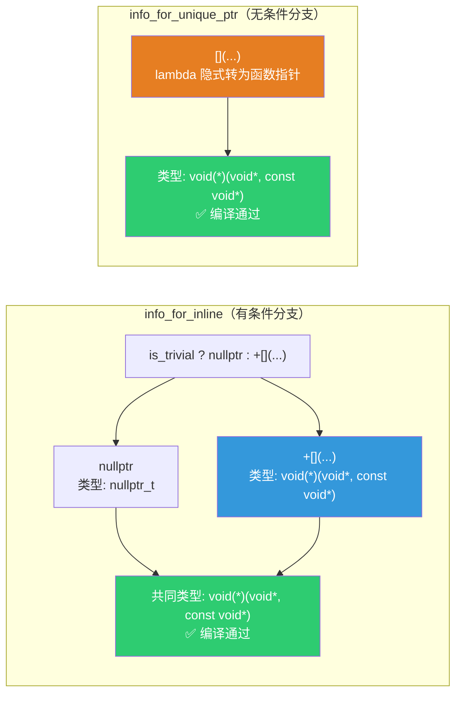
```mermaid
flowchart LR
    subgraph "info_for_inline（有条件分支）"
        COND["is_trivial ? nullptr : +[](...)"]
        NULL["nullptr<br/>类型: nullptr_t"]
        LAMBDA1["+[](...)<br/>类型: void(*)(void*, const void*)"]
        RESULT1["共同类型: void(*)(void*, const void*)<br/>✅ 编译通过"]
        
        COND --> NULL
        COND --> LAMBDA1
        NULL --> RESULT1
        LAMBDA1 --> RESULT1
    end

    subgraph "info_for_unique_ptr（无条件分支）"
        LAMBDA2["[](...)<br/>lambda 隐式转为函数指针"]
        RESULT2["类型: void(*)(void*, const void*)<br/>✅ 编译通过"]
        
        LAMBDA2 --> RESULT2
    end

    style LAMBDA1 fill:#3498db,color:#fff
    style LAMBDA2 fill:#e67e22,color:#fff
    style RESULT1 fill:#2ecc71,color:#fff
    style RESULT2 fill:#2ecc71,color:#fff
```

### 4.4 `is_trivially_xxx_extended_v` — 扩展的平凡判断

```cpp
// BLI_memory_utils.hh
template<typename T>
inline constexpr bool is_trivial_extended_v = std::is_trivial_v<T>;

template<typename T>
inline constexpr bool is_trivially_copy_constructible_extended_v =
    is_trivial_extended_v<T> || std::is_trivially_copy_constructible_v<T>;
```

> **注释翻译**："Under some circumstances `std::is_trivial_v<T>` is false even though we know that the type is actually trivial. Using that extra knowledge allows for some optimizations."
>
> 在某些情况下，`std::is_trivial_v<T>` 返回 false，但我们知道该类型实际上是平凡的。利用这个额外知识可以进行优化。

**当前 `is_trivial_extended_v` 就是 `std::is_trivial_v`**，没有扩展。这是**预留扩展点**——如果将来发现某些类型需要特殊处理，可以在这里添加特化：

```cpp
// 当前定义（无扩展）
template<typename T> inline constexpr bool is_trivial_extended_v = std::is_trivial_v<T>;

// 未来可能的特化（如果需要）
template<> inline constexpr bool is_trivial_extended_v<SomeSpecialType> = true;
// 即使 std::is_trivial_v<SomeSpecialType> 是 false，我们强制认为它是平凡的
```

**真正有用的是 `is_trivially_xxx_extended_v`**——它们用 `||` 组合了两个判断：

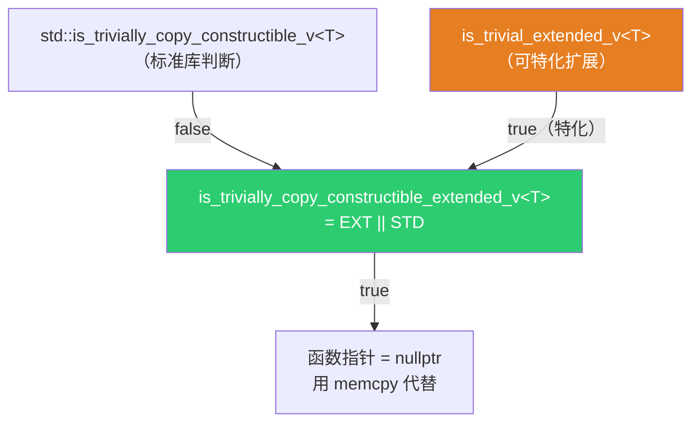
```mermaid
flowchart TD
    STD["std::is_trivially_copy_constructible_v&lt;T&gt;<br/>（标准库判断）"]
    EXT["is_trivial_extended_v&lt;T&gt;<br/>（可特化扩展）"]
    RESULT["is_trivially_copy_constructible_extended_v&lt;T&gt;<br/>= EXT || STD"]

    STD -->|"false"| RESULT
    EXT -->|"true（特化）"| RESULT

    RESULT -->|"true"| OPT["函数指针 = nullptr<br/>用 memcpy 代替"]

    style EXT fill:#e67e22,color:#fff
    style RESULT fill:#2ecc71,color:#fff
```

即使 `std::is_trivially_copy_constructible_v<T>` 是 false，如果通过特化让 `is_trivial_extended_v<T>` 为 true，结果仍然是 true。这为**自定义类型的平凡性判断**提供了扩展机制。

> **为什么某些聚合体会有这种情况？** 标准库的 `is_trivially_copy_constructible` 检查更严格——要求类型没有非平凡的基类或成员，且没有用户定义的拷贝构造函数。某些编译器对聚合体的判断有历史遗留问题，认为它们不满足 `is_trivially_copy_constructible`，但实际上它们是平凡的（可以用 memcpy 拷贝）。`is_trivial_extended` 扩展判断覆盖了这些边缘情况。
>
> **效果**：让更多类型被判定为"平凡"，函数指针为 nullptr → 用 memcpy 代替 → 提高性能。

---

## 五、类型判断 — `is<T>()` 的巧妙实现

```cpp
template<typename T> bool is() const
{
    return info_ == &this->template get_info<T>();
}
```

**不比较类型名称或 RTTI，而是比较指针地址！** 每个类型 `T` 对应的 `AnyTypeInfo` 是一个 `inline constexpr` 静态变量，地址全局唯一。`info_` 存的就是这个地址，所以直接比指针即可判断类型。

> **为什么每个类型都对应一个？** 因为 `info_for_inline` 和 `info_for_unique_ptr` 是**模板变量**——每个不同的 `T` 实例化出不同的静态变量：
> ```cpp
> template<typename ExtraInfo, typename T>
> inline constexpr AnyTypeInfo<ExtraInfo> info_for_inline = { ... };
> ```
> 编译器为每个使用的 `T` 生成一个实例：
> ```cpp
> // 编译器生成的（简化）：
> AnyTypeInfo<NoExtraInfo> info_for_inline<NoExtraInfo, int> = { nullptr, nullptr, nullptr, nullptr, {} };
> AnyTypeInfo<NoExtraInfo> info_for_inline<NoExtraInfo, float> = { nullptr, nullptr, nullptr, nullptr, {} };
> AnyTypeInfo<NoExtraInfo> info_for_inline<NoExtraInfo, std::string> = { copy_fn, move_fn, destruct_fn, nullptr, {} };
> ```
> 每个实例在内存中有唯一地址，所以 `info_ == &info_for_inline<..., int>` 可以判断类型。

> **`is<T>()` 每次调用都生成新实例吗？** 不是。`info_for_inline<ExtraInfo, T>` 是 `inline constexpr` 变量——编译器保证**每个特化只有一个实例**，无论被引用多少次：
> ```cpp
> any1.is<int>();  // 引用 &info_for_inline<..., int>（第一次，生成实例）
> any2.is<int>();  // 引用 &info_for_inline<..., int>（同一个实例，不重新生成）
> any3.is<int>();  // 同上
> ```
> `is<T>()` 只是比较 `info_` 和一个**已存在的**静态变量的地址，零开销。

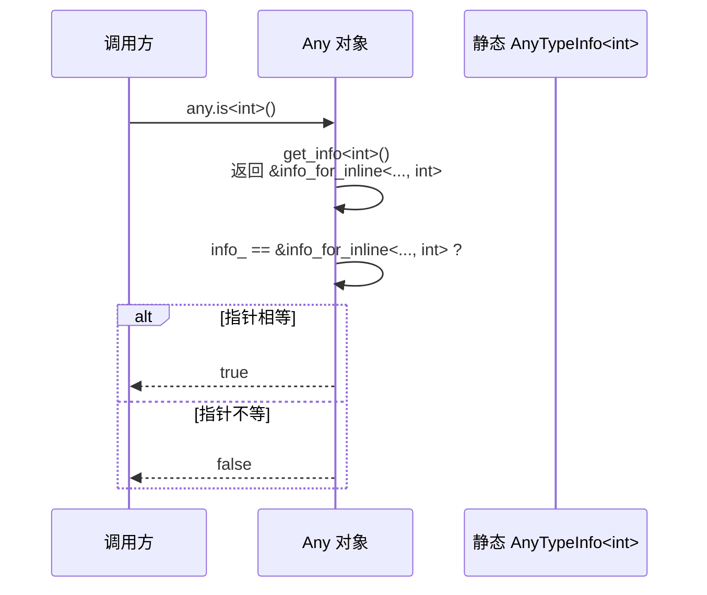
```mermaid
sequenceDiagram
    participant Code as 调用方
    participant Any as Any 对象
    participant VTable as 静态 AnyTypeInfo<int>

    Code->>Any: any.is<int>()
    Any->>Any: get_info<int>()<br/>返回 &info_for_inline<..., int>
    Any->>Any: info_ == &info_for_inline<..., int> ?
    alt 指针相等
        Any-->>Code: true
    else 指针不等
        Any-->>Code: false
    end
```

### 5.1 `this->template` — 依赖名消歧语法

`this->template get_info<T>()` 中的 `template` 关键字是 C++ 的**依赖名消歧**语法。在类模板 `Any<ExtraInfo, ...>` 中，`get_info<T>()` 是一个**依赖模板成员**——它的含义依赖于模板参数 `ExtraInfo`。编译器在解析时不知道 `get_info` 是模板还是变量，默认假设它不是模板（把 `<` 当作小于号）。`template` 关键字告诉编译器：`get_info` 是模板名，`<T>` 是模板参数列表，不是比较运算符。

```cpp
// ❌ 没有 template：编译器认为 get_info < T > 是比较表达式
return info_ == &this->get_info<T>();
// 编译器理解为：&(this->get_info) < T > (...)
//                ~~~~~~~~~~~~~~~~ < T  >  ~~~~~~
//                变量名        小于  大于  函数调用？

// ✅ 有 template：编译器知道 get_info 是模板
return info_ == &this->template get_info<T>();
// 编译器理解为：&(this->template get_info<T>)()
//                ~~~~~~~~~~~~~~~~~~~~~~~~~~~~
//                模板名 + 参数列表
```

> **为什么编译器不能自动识别？** 因为 C++ 的解析规则是"贪婪"的——在没有 `template` 提示时，编译器**必须**假设 `<` 是比较运算符。这不是编译器"不够聪明"，而是 C++ 语法本身的歧义：
> ```cpp
> // 假设有个成员变量叫 get_info，值为 3
> int get_info = 3;
> // 那么 this->get_info < T > (...)
> // = (this->get_info) < (T) > (...)  
> // = 3 < T > (...)  — 这是合法的比较表达式！
> ```
> 编译器在模板定义阶段**不知道** `get_info` 是变量还是模板名（因为外层模板参数还没确定），所以必须选一种解释。C++ 标准规定：默认假设不是模板名。`template` 关键字就是程序员给编译器的提示："这是模板名，别当比较运算符"。

> **变量名和模板名可以一样吗？** 可以。C++ 允许变量和模板同名——它们在不同的"命名空间"中：
> ```cpp
> template<typename T> struct foo {};  // 模板
> int foo = 42;                        // 变量，同名！
> foo<int> x;   // ✅ 编译器知道 foo<int> 是模板实例化
> int y = foo;  // ✅ 编译器知道 foo 是变量
> ```
> 所以在依赖上下文中，编译器**真的无法确定** `get_info` 是模板还是变量——两者都可能存在。

> **为什么为了罕见情况让语法变得繁琐？** 这是 C++ 的历史包袱。C++ 的模板语法设计于 1990 年代，当时 `<` 已经是比较运算符。后来加入模板时，`<T>` 与比较表达式产生歧义。C++ 标准委员会选择了**向后兼容**——不改变已有语法，而是加 `template` 消歧。为什么不用更清晰的语法（如 `get_info[[T]]()` 或 `get_info{T}()`）？因为这些是后来才有的语法特性，C++ 不能破坏已有代码。这是 C++ 最常被批评的设计问题之一。

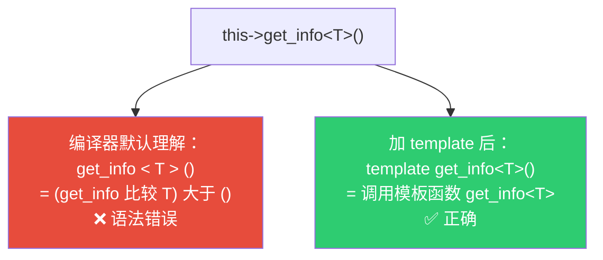
```mermaid
flowchart TD
    AMBIG["this-&gt;get_info&lt;T&gt;()"]
    WRONG["编译器默认理解：<br/>get_info &lt; T &gt; ()<br/>= (get_info 比较 T) 大于 ()<br/>❌ 语法错误"]
    RIGHT["加 template 后：<br/>template get_info&lt;T&gt;()<br/>= 调用模板函数 get_info&lt;T&gt;<br/>✅ 正确"]
    
    AMBIG --> WRONG
    AMBIG --> RIGHT

    style WRONG fill:#e74c3c,color:#fff
    style RIGHT fill:#2ecc71,color:#fff
```

> **什么时候需要 `template`？** 在**依赖上下文**中使用模板成员时——即在模板类/函数内部，访问的成员依赖于外层模板参数时。非依赖上下文不需要：
> ```cpp
> // 非依赖上下文 — 不需要 template
> std::vector<int> v;
> v.emplace_back(42);  // emplace_back 不依赖任何外层模板参数
>
> // 依赖上下文 — 需要 template
> template<typename T>
> void foo() {
>     T::template bar<int>();  // bar 依赖 T，需要 template
> }
> ```

---

## 六、核心操作流程

### 6.0 默认构造 — `Any() = default`

```cpp
Any() = default;
```

`= default` 让编译器生成默认构造函数。对 `Any` 的成员：

- `buffer_{}` — `{}` 初始化 → 零填充
- `extra = {}` — 默认初始化 → 空类型时 0 字节
- `info_ = nullptr` — 成员初始化器 → nullptr

结果：`buffer_` 全零，`info_` 为 `nullptr`——表示**空 Any**（不包含任何值）。`has_value()` 返回 `false`。

> **`Any<void, 32, 16, AnyExtraData>` 的 `info_` 是空吗？** 取决于状态：默认构造后 `info_ = nullptr`（空 Any）；`emplace<int>(42)` 后 `info_ = &info_for_inline<RealExtraInfo, int>`（指向 `int` 的静态函数表）。模板参数不同不影响 `info_` 的逻辑。

### 6.0.1 `is_same_any_v` — 防止模板构造函数劫持

```cpp
template<typename T> static constexpr bool is_same_any_v = std::is_same_v<std::decay_t<T>, Any>;
```

检查 `T` 是否就是 `Any` 本身。用于模板构造函数的约束：

```cpp
template<typename T>
Any(T &&value) requires(!is_same_any_v<T>)  // ← T 不能是 Any
    : Any(std::in_place_type<T>, std::forward<T>(value))
```

**为什么需要？** 如果没有这个约束，`Any a = other_any` 会匹配模板构造函数（`T = Any&` 或 `T = Any`），而非拷贝/移动构造函数。模板构造函数会用 `in_place_type<Any>` 构造——**嵌套 Any**，而非拷贝值：

```cpp
Any a(42);           // a 存 int
Any b = a;           // 期望：拷贝 a 的 int 到 b
// 没有 requires：匹配 Any(T&&)，T=Any& → b 存 Any(存 int) ← 嵌套！
// 有 requires：跳过模板，匹配 Any(const Any&) → b 存 int ✅
```

> **注释翻译**：`"Checks if #T is the same type as this #Any, because in this case the behavior of e.g. the assignment operator is different."` — 检查 T 是否与此 Any 是同一类型，因为在这种情况下赋值运算符的行为不同。

### 6.0.2 两个模板构造函数 — `in_place_type` 构造 & 值构造

```cpp
// 构造函数1：in_place_type 构造（第 199~207 行）
/**
 * Constructs a new #Any that contains the given type #T from #args. The #std::in_place_type_t is
 * used to disambiguate this and the copy/move constructors.
 */
template<typename T, typename... Args>
explicit Any(std::in_place_type_t<T> /*tag*/, Args &&...args)
{
  this->emplace_on_empty<T>(std::forward<Args>(args)...);
}

// 构造函数2：值构造（第 209~217 行）
/**
 * Constructs a new #Any that contains the given value.
 */
template<typename T>
Any(T &&value)
  requires(!is_same_any_v<T>)
    : Any(std::in_place_type<T>, std::forward<T>(value))
{
}
```

> **注释翻译**：
> - 构造函数1："构造一个包含给定类型 `T` 的新 `Any`，用 `args` 作为构造参数。`std::in_place_type_t` 用于消除此构造函数与拷贝/移动构造函数的歧义。"
> - 构造函数2："构造一个包含给定值的新 `Any`。"

#### 构造函数1：`in_place_type` 构造 — 逐行详解

```cpp
template<typename T, typename... Args>       // T = 要存储的类型, Args = 构造参数类型
explicit Any(std::in_place_type_t<T> /*tag*/, Args &&...args)
//        ↑ explicit: 防止隐式转换
//                     ↑ std::in_place_type_t<T>: 类型标签，编译期标记"我要存 T"
//                                       ↑ /*tag*/: 参数名注释掉 = 不使用这个参数的值
//                                                  ↑ Args&&...: 完美转发的构造参数
{
  this->emplace_on_empty<T>(std::forward<Args>(args)...);
  //     ↑ 委托给 emplace_on_empty，在空 Any 上构造 T
  //                         ↑ std::forward: 完美转发，保持参数的值类别（左值/右值）
}
```

**`std::in_place_type_t<T>` 是什么？** C++17 引入的**空标签类型**，用于消除函数重载歧义：

```cpp
// std::in_place_type_t 的定义（标准库中）
template<typename T> struct in_place_type_t {};  // 空结构体，不占空间
template<typename T> inline constexpr in_place_type_t<T> in_place_type{};  // 全局常量

// 使用方式：传入 in_place_type<int> 作为标签
Any a(std::in_place_type<int>, 42);        // 存 int，用 42 构造
Any b(std::in_place_type<std::string>, 5, 'x'); // 存 string，用 string(5, 'x') 构造
```

**为什么需要标签消歧？** 没有标签，编译器无法区分"拷贝构造 Any"和"用 T 构造 Any"：

```cpp
Any a(42);           // T=int → 模板构造函数2
Any b(a);            // 拷贝构造函数 — Any(const Any&)
Any c(std::move(a)); // 移动构造函数 — Any(Any&&)

// 但如果没有 requires(!is_same_any_v<T>)：
Any d(a);            // T=Any& → 模板构造函数2！不是拷贝构造！
// → 嵌套 Any，而非拷贝值

// in_place_type 标签让意图更明确：
Any e(std::in_place_type<int>, 42);  // 明确：存 int
Any f(std::in_place_type<Any>, a);   // 明确：存 Any（嵌套）— 很少见
```

**`/*tag*/` 为什么注释掉参数名？** `in_place_type_t<T>` 是空类型，没有数据，不需要使用它的值。注释掉参数名告诉编译器"这个参数我不用"，避免"未使用参数"警告。等价写法：`[[maybe_unused]] std::in_place_type_t<T> tag`。

**`std::forward<Args>(args)...` 做了什么？** 完美转发——保持参数的值类别：

```cpp
// 如果调用 Any(std::in_place_type<std::string>, "hello")
// → Args = const char (&)[6]
// → std::forward<Args>(args)... = "hello"（左值）
// → string 的构造函数接收 const char*，构造 "hello"

// 如果调用 Any(std::in_place_type<std::string>, std::move(str))
// → Args = std::string&&
// → std::forward<Args>(args)... = std::move(str)（右值）
// → string 的移动构造函数被调用
```

#### 构造函数2：值构造 — 逐行详解

```cpp
template<typename T>
Any(T &&value)                    // T&&: 转发引用（不是右值引用！）
  requires(!is_same_any_v<T>)     // 约束：T 不能是 Any 本身
    : Any(std::in_place_type<T>, std::forward<T>(value))  // 委托给构造函数1
{
}
```

**这是最常用的构造方式**——直接传值：

```cpp
Any a(42);              // T=int, value=42（右值）→ 存 int(42)
Any b(3.14f);           // T=float, value=3.14f → 存 float(3.14f)

int x = 10;
Any c(x);               // T=int&, value=x（左值）→ 存 int(10)（拷贝）
Any d(std::move(x));    // T=int, value=std::move(x)（右值）→ 存 int(10)（移动）

std::string s = "hello";
Any e(s);               // T=std::string&, value=s（左值）→ 拷贝构造 string
Any f(std::move(s));    // T=std::string, value=右值 → 移动构造 string
```

**`T&&` 在模板中是转发引用，不是右值引用！** 转发引用（forwarding reference）的规则：

```cpp
template<typename T> void foo(T&& arg);
//           ↑ T 是模板参数 → T&& 是转发引用

int x = 42;
foo(x);           // T=int&, arg=int& （左值 → T 推导为 int&）
foo(42);          // T=int,  arg=int&&（右值 → T 推导为 int）
foo(std::move(x));// T=int,  arg=int&&（右值 → T 推导为 int）

// 引用折叠规则：
// int& &&  → int&   （左值引用 + 右值引用 = 左值引用）
// int&& && → int&&  （右值引用 + 右值引用 = 右值引用）
```

**`requires(!is_same_any_v<T>)` 为什么必要？** 见 6.0.1 节——防止模板构造函数劫持拷贝/移动构造。

**委托构造 `: Any(std::in_place_type<T>, ...)` 的好处：** 避免重复代码——构造函数2只是构造函数1的语法糖，实际逻辑全在构造函数1（进而 `emplace_on_empty`）中。

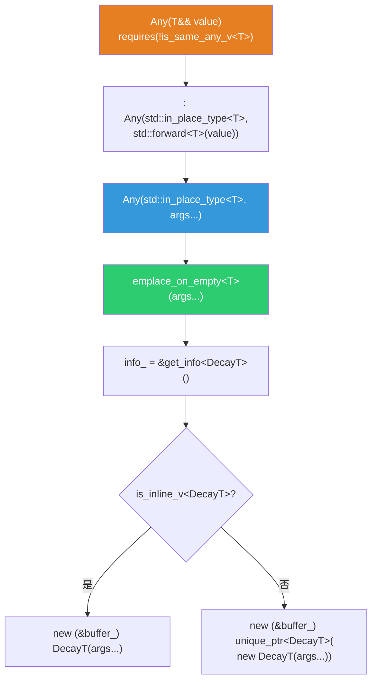
```mermaid
flowchart TD
    CALL1["Any(std::in_place_type&lt;T&gt;, args...)"]
    CALL2["Any(T&amp;&amp; value)<br/>requires(!is_same_any_v&lt;T&gt;)"]
    DELEGATE[": Any(std::in_place_type&lt;T&gt;,<br/>std::forward&lt;T&gt;(value))"]
    EMPLACE["emplace_on_empty&lt;T&gt;(args...)"]
    SET_INFO["info_ = &get_info&lt;DecayT&gt;()"]
    CHECK{"is_inline_v&lt;DecayT&gt;?"}
    INLINE["new (&buffer_) DecayT(args...)"]
    HEAP["new (&buffer_) unique_ptr&lt;DecayT&gt;(<br/>new DecayT(args...))"]

    CALL1 --> EMPLACE
    CALL2 --> DELEGATE --> CALL1
    EMPLACE --> SET_INFO --> CHECK
    CHECK -->|"是"| INLINE
    CHECK -->|"否"| HEAP

    style CALL2 fill:#e67e22,color:#fff
    style CALL1 fill:#3498db,color:#fff
    style EMPLACE fill:#2ecc71,color:#fff
```

#### 他们不算特殊成员函数吗？

**不算！** 模板构造函数**永远不是**特殊成员函数。C++ 标准明确规定：

> **C++ 标准 [class.copy.ctor]/1**：非模板构造函数声明（non-template constructor declaration）才能成为拷贝/移动构造函数。

```cpp
class Any {
  Any(const Any &other);    // ✅ 特殊成员函数：拷贝构造函数
  Any(Any &&other);         // ✅ 特殊成员函数：移动构造函数

  template<typename T>
  Any(T &&value);           // ❌ 不是特殊成员函数！是模板构造函数

  template<typename T, typename... Args>
  Any(std::in_place_type_t<T>, Args &&...args);  // ❌ 不是特殊成员函数！
};
```

**为什么？** 因为特殊成员函数的签名是固定的——编译器需要精确匹配才能识别。模板可以匹配任意类型，编译器无法确定它"应该"是哪个特殊成员函数。

#### C++ 六大特殊成员函数

| 特殊成员函数       | 签名                     | 何时被隐式生成           | 作用                     |
| ------------------ | ------------------------ | ------------------------ | ------------------------ |
| **默认构造函数**   | `T()`                    | 没有声明任何构造函数时   | 创建默认初始化的对象     |
| **析构函数**       | `~T()`                   | 总是生成（除非用户声明） | 销毁对象，释放资源       |
| **拷贝构造函数**   | `T(const T&)`            | 没有声明移动操作时       | 用另一个对象初始化新对象 |
| **拷贝赋值运算符** | `T& operator=(const T&)` | 没有声明移动操作时       | 用另一个对象赋值         |
| **移动构造函数**   | `T(T&&)`                 | 没有声明拷贝/移动/析构时 | 从右值"偷"资源           |
| **移动赋值运算符** | `T& operator=(T&&)`      | 没有声明拷贝/移动/析构时 | 从右值"偷"资源赋值       |

**隐式生成规则（Rule of Five / Rule of Zero）**：

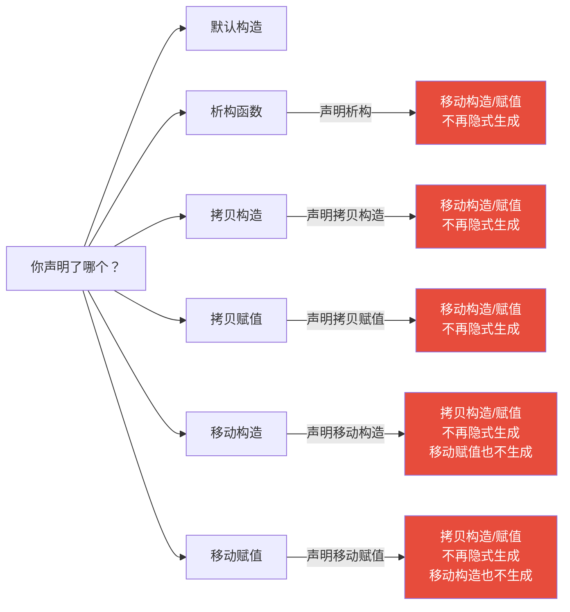
```mermaid
flowchart LR
    DECL["你声明了哪个？"] --> DC["默认构造"]
    DECL --> DD["析构函数"]
    DECL --> CC["拷贝构造"]
    DECL --> CA["拷贝赋值"]
    DECL --> MC["移动构造"]
    DECL --> MA["移动赋值"]

    DD -->|"声明析构"| NO_MOVE1["移动构造/赋值<br/>不再隐式生成"]
    CC -->|"声明拷贝构造"| NO_MOVE2["移动构造/赋值<br/>不再隐式生成"]
    CA -->|"声明拷贝赋值"| NO_MOVE3["移动构造/赋值<br/>不再隐式生成"]
    MC -->|"声明移动构造"| NO_COPY1["拷贝构造/赋值<br/>不再隐式生成<br/>移动赋值也不生成"]
    MA -->|"声明移动赋值"| NO_COPY2["拷贝构造/赋值<br/>不再隐式生成<br/>移动构造也不生成"]

    style NO_MOVE1 fill:#e74c3c,color:#fff
    style NO_MOVE2 fill:#e74c3c,color:#fff
    style NO_MOVE3 fill:#e74c3c,color:#fff
    style NO_COPY1 fill:#e74c3c,color:#fff
    style NO_COPY2 fill:#e74c3c,color:#fff
```

> **Rule of Five**：如果你声明了其中任何一个，就应该声明全部五个（或用 `= default`）。因为声明一个会抑制其他的隐式生成。
>
> **Rule of Zero**：如果类不需要自定义任何特殊成员函数（所有成员都有正确的特殊成员函数），就不要声明任何——让编译器全部自动生成。

**`Any` 的特殊成员函数**：

```cpp
Any() = default;                                    // 默认构造
~Any();                                             // 析构（自定义）
Any(const Any &other);                              // 拷贝构造（自定义）
Any(Any &&other) noexcept;                          // 移动构造（自定义）
Any &operator=(const Any &other);                   // 拷贝赋值（自定义）
template<typename T> Any &operator=(T &&other);     // 模板赋值（不是特殊成员！）
```

`Any` 遵循 Rule of Five——自定义了析构、拷贝构造、移动构造、拷贝赋值。移动赋值没有单独定义，因为模板赋值 `operator=(T&&other)` 在 `T=Any` 时会匹配（`requires` 中 `is_same_any_v<Any>` 为 true，走特殊路径）。但拷贝赋值必须单独定义——因为模板赋值不算特殊成员函数，没有它编译器会生成默认的逐成员拷贝赋值（错误行为）。

> **注释翻译**（第 228~230 行）："Only needed because the template below does not count as copy assignment operator." — 之所以需要（显式定义拷贝赋值运算符），仅仅是因为下面的模板不算拷贝赋值运算符。

### 6.1 构造/赋值 — `emplace_on_empty`

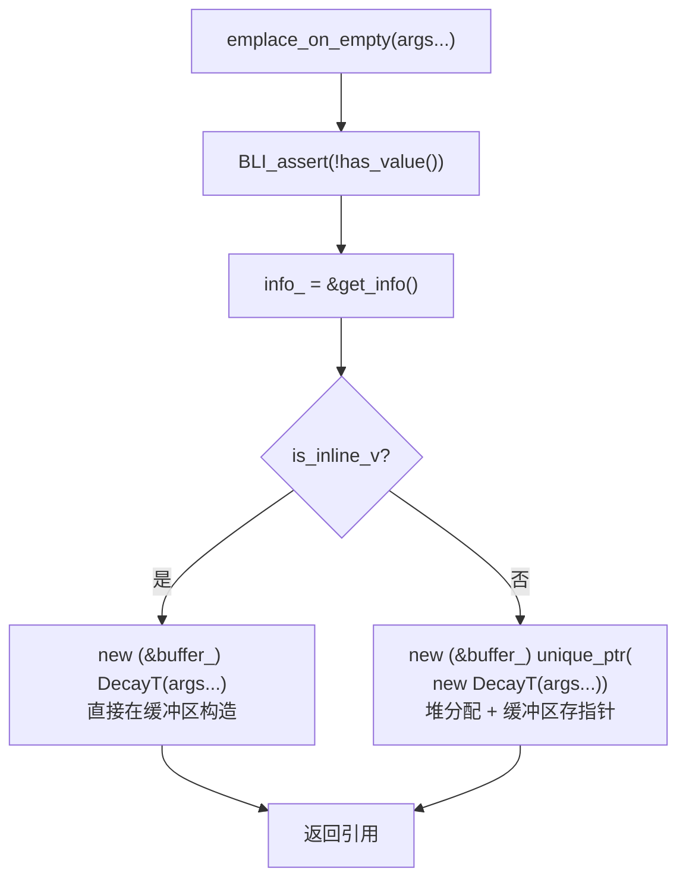
```mermaid
flowchart TD
    START["emplace_on_empty<T>(args...)"] --> ASSERT["BLI_assert(!has_value())"]
    ASSERT --> SET_INFO["info_ = &get_info<DecayT>()"]
    SET_INFO --> CHECK{"is_inline_v<DecayT>?"}
    CHECK -->|"是"| INLINE["new (&buffer_) DecayT(args...)<br/>直接在缓冲区构造"]
    CHECK -->|"否"| HEAP["new (&buffer_) unique_ptr<DecayT>(<br/>  new DecayT(args...))<br/>堆分配 + 缓冲区存指针"]
    INLINE --> RET["返回引用"]
    HEAP --> RET
```

### 6.2 复制构造

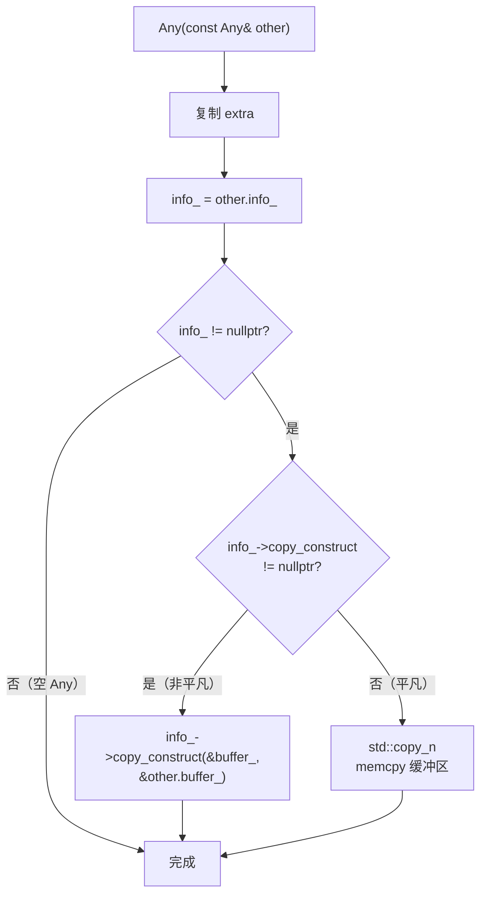
```mermaid
flowchart TD
    START["Any(const Any& other)"] --> COPY_EXTRA["复制 extra"]
    COPY_EXTRA --> COPY_INFO["info_ = other.info_"]
    COPY_INFO --> CHECK{"info_ != nullptr?"}
    CHECK -->|"否（空 Any）"| DONE["完成"]
    CHECK -->|"是"| CHECK2{"info_->copy_construct<br/>!= nullptr?"}
    CHECK2 -->|"是（非平凡）"| CALL["info_->copy_construct(&buffer_,<br/>&other.buffer_)"]
    CHECK2 -->|"否（平凡）"| MEMCPY["std::copy_n<br/>memcpy 缓冲区"]
    CALL --> DONE
    MEMCPY --> DONE
```

### 6.2.1 移动构造 — "moved-from state"

```cpp
// 源码注释：
// \note The #other #Any will not be empty afterwards if it was not before.
//       Just its value is in a moved-from state.
```

> **注释翻译**：移动后，源 `Any` **不会变空**（`info_` 不变），但它的**值处于移动后状态**。
>
> - 内联存储的 `int`：移动后值不确定（但 `info_` 仍指向 `int` 的函数表）
> - 内联存储的 `std::string`：移动后源字符串可能为空（但 `Any` 仍"有值"）
> - 堆存储：源 `unique_ptr` 仍指向原对象（只是原对象处于移动后状态）
>
> **为什么不变空？** `Any` 的移动构造函数只移动**值**（buffer 内容），不改变 `info_`：
> ```cpp
> Any(Any &&other) noexcept : extra(std::move(other.extra)), info_(other.info_)
> {
>     // info_ = other.info_ ← 源的 info_ 不变！
>     // other.info_ 仍然是原来的值，other.has_value() 仍为 true
> }
> ```
> 设 `info_ = nullptr` 需要额外一步操作，而且移动后的 Any 仍然可以被赋新值、被析构——它处于"有效但未指定"状态，这是 C++ 移动语义的标准约定（与 `std::string` 移动后源字符串仍"有效"同理）。
>
> **"值处于移动后状态"指什么？** 移动构造函数"偷走"了源对象的资源（如 `std::string` 的内部缓冲区），源对象变成一个**合法但值不确定**的对象。你可以安全地析构它或给它赋新值，但不应该读取它的值（结果未指定）。

### 6.2.2 `&buffer_` vs `buffer_.ptr()` — 都是取缓冲区地址

`buffer_` 的类型是 `AlignedBuffer<InlineBufferCapacity, alignment>`，其结构为：

```cpp
template<size_t Size, size_t Alignment> class AlignedBuffer {
  struct alignas(Alignment) Sized {
    std::byte buffer_[Size > 0 ? Size : 1];  // 唯一成员
  };
  BLI_NO_UNIQUE_ADDRESS BufferType buffer_;   // 唯一成员变量

public:
  operator void*()   { return this; }  // 隐式转换 → 对象地址
  void *ptr()        { return this; }  // 显式方法 → 对象地址
};
```

`AlignedBuffer` 只有一个成员 `buffer_`（字节数组），所以**对象地址 = 数组起始地址**。`&buffer_`、`buffer_.ptr()`、隐式转换到 `void*`，三者返回的值**完全相同**。

> **如何知道 `.ptr()` 调用的是哪个重载？** C++ 根据对象的 const 属性选择：
> ```cpp
> void *ptr()              // 非 const 版本 — 对象可修改时调用
> const void *ptr() const  // const 版本 — 对象不可修改时调用
>
> AlignedBuffer buf;       buf.ptr();   // → void*
> const AlignedBuffer &cbuf = buf;  cbuf.ptr();  // → const void*
> ```
> `static_cast<std::byte *>(buffer_.ptr())` 需要 `void*`（非 const），所以调用非 const 版本。

> **为什么 `.ptr()` 返回 `void *`？** `AlignedBuffer` 是原始内存缓冲区——不关心存储的是什么类型。`void *` 是"通用指针"，可以转换为任何对象指针类型。这让 `AlignedBuffer` 能存储任意类型的对象。

> **`std::byte` 是什么？** C++17 引入的类型，表示原始字节。与 `unsigned char` 的区别：`unsigned char` 既是字节也是字符（可打印、可算术），`std::byte` 只是字节（不能打印、不能直接算术）。`std::copy_n` 操作字节时用 `std::byte*` 比 `unsigned char*` 更语义清晰。

> **为什么 void/byte 指针能存其他类型并转成其他类型？** C++ 允许任何对象指针与 `void*` / `std::byte*` 之间双向转换。这是类型擦除的基础——存储时不知道类型（用 `void*`），取出时恢复类型（用 `static_cast<T*>`）。但必须确保转换后的类型和实际存储的类型一致，否则 UB：
> ```cpp
> int x = 42;
> void *p = &x;
> float *pf = static_cast<float*>(p);  // ❌ UB！实际存的是 int，不是 float
> ```

| 写法 | 含义 | 何时用 |
|------|------|--------|
| `&buffer_` | 取成员变量的地址 | 传给函数指针接口（如 `copy_construct(&buffer_, ...)`） |
| `buffer_.ptr()` | 显式获取缓冲区指针 | 做指针运算时更清晰（如 `static_cast<std::byte*>(buffer_.ptr())`） |
| 直接传 `buffer_` | 利用 `operator void*()` 隐式转换 | 也可以，但不够显式 |

三种写法结果相同，Blender 混用了——`copy_construct` 用 `&buffer_`，`std::copy_n` 用 `.ptr()`，只是风格差异。

### 6.2.3 拷贝和移动构造为什么有相同的 `std::copy_n` 分支？

> **为什么用 `std::copy_n` 而不是 `memcpy`？** 对 `std::byte*`（平凡类型），编译器会将 `std::copy_n` 优化为和 `memcpy` 完全相同的代码，但 `std::copy_n` 更 C++ 风格——类型安全（编译期检查迭代器类型）、不需要 `#include <cstring>`、不使用 `void*`。

```cpp
// 拷贝构造 (173-177)
else {
    std::copy_n(static_cast<const std::byte *>(other.buffer_.ptr()),
                RealInlineBufferCapacity,
                static_cast<std::byte *>(buffer_.ptr()));
}

// 移动构造 (191-195) — 完全一样！
else {
    std::copy_n(static_cast<const std::byte *>(other.buffer_.ptr()),
                RealInlineBufferCapacity,
                static_cast<std::byte *>(buffer_.ptr()));
}
```

这个 `else` 分支处理**平凡类型**（`copy_construct == nullptr` 或 `move_construct == nullptr`）。对平凡类型，拷贝 = 移动 = `memcpy`——逐字节复制即可。所以两个分支的代码完全一样。

```mermaid
flowchart TD
    subgraph "拷贝构造"
        CC_NN["copy_construct != nullptr<br/>调用 info_->copy_construct()"]
        CC_NULL["copy_construct == nullptr<br/>平凡类型 → std::copy_n (memcpy)"]
    end
    subgraph "移动构造"
        MC_NN["move_construct != nullptr<br/>调用 info_->move_construct()"]
        MC_NULL["move_construct == nullptr<br/>平凡类型 → std::copy_n (memcpy)"]
    end
    
    CC_NULL -.->|"相同代码<br/>平凡类型拷贝=移动"| MC_NULL

    style CC_NN fill:#3498db,color:#fff
    style MC_NN fill:#e67e22,color:#fff
    style CC_NULL fill:#2ecc71,color:#fff
    style MC_NULL fill:#2ecc71,color:#fff
```

### 6.3 获取值 — `get<T>()`

```cpp
template<typename T> const T &get() const
{
    BLI_assert(this->is<T>());
    const void *buffer;
    if constexpr (is_inline_v<T>) {
        buffer = &buffer_;           // 内联：直接取缓冲区地址
    } else {
        BLI_assert(info_->get != nullptr);
        buffer = info_->get(&buffer_); // 堆上：解引用 unique_ptr
    }
    return *static_cast<const T *>(buffer);
}
```

注意 `if constexpr` 分支在编译期就确定了，**零运行时开销**。

> **非 const 版本的 `get()` 如何实现？** 复用 const 版本的代码：
> ```cpp
> template<typename T> T &get() {
>     return const_cast<T &>(const_cast<const Any *>(this)->get<T>());
> }
> ```
> 步骤分解：
> 1. `const_cast<const Any *>(this)` — 把 `this`（`Any*`）转成 `const Any*`
> 2. `.get<T>()` — 调用 const 版本，返回 `const T&`
> 3. `const_cast<T &>(...)` — 把 `const T&` 转成 `T&`（去掉 const）
>
> 这样避免了写两份相同的逻辑——const 版本写一次，非 const 版本复用。这是 C++ 的常见模式（Scott Meyers 推荐）。

### 6.4 析构

```mermaid
flowchart TD
    START["~Any()"] --> CHECK{"info_ != nullptr?"}
    CHECK -->|"否"| DONE["完成"]
    CHECK -->|"是"| CHECK2{"info_->destruct<br/>!= nullptr?"}
    CHECK2 -->|"是（非平凡析构）"| CALL["info_->destruct(&buffer_)"]
    CHECK2 -->|"否（平凡析构）"| DONE
    CALL --> DONE
```

> **析构函数为什么不把 `info_ = nullptr`？** 析构函数执行完毕后，对象的生命周期就结束了。对已析构对象的任何访问（包括写 `info_ = nullptr`）都是 UB。而且没必要——析构后没人会再读 `info_`。`reset()` 才需要设 `info_ = nullptr`，因为 `reset()` 后对象**继续存活**，后续代码会检查 `info_`。
>
> ```cpp
> ~Any() {
>     if (info_ != nullptr) {
>         if (info_->destruct != nullptr) {
>             info_->destruct(&buffer_);
>         }
>         // ❌ 不写 info_ = nullptr — 对象即将销毁，设了也没用
>     }
> }
>
> void reset() {
>     if (info_ != nullptr) {
>         if (info_->destruct != nullptr) {
>             info_->destruct(&buffer_);
>         }
>         info_ = nullptr;  // ✅ 对象继续存活，必须设为空
>     }
> }
> ```

> **已析构对象的内存什么时候销毁？** 析构函数只负责"清理资源"（释放内部堆内存、关闭文件等），**不负责回收对象本身的内存**。内存回收由分配机制负责：
>
> | 对象位置 | 内存何时回收 | 机制 |
> |---------|------------|------|
> | 栈上（局部变量） | 函数返回时 | 栈帧弹出，移动栈指针 |
> | 成员对象 | 包含它的对象析构时 | 作为整体一起回收 |
> | 堆上（`new` 分配） | `delete` 时 | 调用 `operator delete` 释放 |
> | 静态/全局 | 程序退出时 | 操作系统回收 |
>
> ```cpp
> void foo() {
>     Any a(42);       // a 在栈上
>     // a.~Any() 被调用（析构函数清理 int — 无操作）
>     // 但 a 的内存（sizeof(Any) 字节）还在栈上
>     // 函数返回时，栈指针移动，a 的内存被"回收"
> }  // ← 这里才真正回收内存
> ```
>
> 所以"析构"和"内存回收"是两回事：析构 = 清理资源，内存回收 = 释放对象占用的空间。

### 6.5 赋值运算符 — `this->~Any()` 显式析构

```cpp
Any &operator=(const Any &other)
{
    if (this == &other) { return *this; }
    this->~Any();           // ← 显式调用析构函数
    new (this) Any(other);  // ← 在同一块内存上重新构造
    return *this;
}
```

**`this->~Any()`** 是显式调用析构函数——不等对象自然销毁，而是**立即**执行析构逻辑。这是 **destroy-and-construct** 模式：先析构旧值（释放旧资源），再在原位构造新值。

> **为什么写 `this->~Any()` 而非 `~Any()`？** `~Any()` 在非成员上下文中可能被编译器理解为**补运算符**（`~` 是按位取反）。`this->` 明确告诉编译器：这是成员析构函数调用。实际上在成员函数内部两者都能编译，但 `this->~Any()` 是更明确、更常见的写法。
>
> 显式调用析构函数不只有 `this->` 一种写法：
> ```cpp
> this->~Any();                          // ✅ 最常见
> this->Any::~Any();                     // ✅ 带类名限定
> Any::~Any();                           // ✅ 在成员函数内部
> Any<ExtraInfo, ...>::~Any();           // ✅ 带模板参数（复杂场景）
> ```
> `this->` 的好处是**不依赖类名**——如果类名改了或模板参数很长，`this->~Any()` 不需要改。

> **为什么必须显式调用？** 因为赋值运算符需要**先释放旧资源，再构造新值**。C++ 没有内置的"重新赋值"机制——你不能对一个已经构造的对象再次调用构造函数。显式析构 + placement new 是标准做法：
> ```cpp
> this->~Any();           // 1. 析构旧值（释放旧 string 的堆内存等）
> new (this) Any(other);  // 2. 在 this 位置构造新 Any（拷贝 other 的值）
> ```
> 如果不显式析构，旧值的资源（如 `std::string` 的堆内存）就泄漏了。

> **为什么不直接赋值成员？** 因为 `Any` 的赋值语义复杂——旧值可能需要析构，新值的类型可能不同（从 `int` 变成 `string`），需要不同的 `info_`。destroy-and-construct 一步到位：析构旧值 + 构造新值，逻辑清晰且不会遗漏。

### 6.6 `get` 函数指针为什么指定返回类型

```cpp
// 其他函数指针：返回 void，编译器自动推导
[](void *dst, const void *src) { new (dst) Ptr<T>(...); },  // 返回 void

// get 函数指针：必须显式指定 -> const void *
[](const void *src) -> const void * { return &**static_cast<const Ptr<T> *>(src); },
```

`&**static_cast<const Ptr<T> *>(src)` 的类型是 `const T*`，不是 `const void*`。lambda 的返回类型推导会得到 `const T*`，但 `AnyTypeInfo::get` 的声明是 `const void *(*)(const void *)`——类型不匹配。显式 `-> const void *` 让编译器做隐式转换（`const T*` → `const void*`，指针类型兼容）。

---

## 七、四函数详解 — `emplace` / `emplace_on_empty` / `allocate` / `allocate_on_empty`

这四个函数（第 274~330 行）是 `Any` 的核心构造/分配接口，形成两对"有值版"和"空版"：

```mermaid
flowchart TD
    subgraph "有值版（先处理旧值）"
        EMPLACE["emplace&lt;T&gt;(args...)<br/>析构旧值 → 构造新值"]
        ALLOCATE["allocate&lt;T&gt;()<br/>重置旧值 → 分配新空间"]
    end
    subgraph "空版（要求 Any 为空）"
        EMPLACE_EMPTY["emplace_on_empty&lt;T&gt;(args...)<br/>在空 Any 上构造新值"]
        ALLOCATE_EMPTY["allocate_on_empty&lt;T&gt;()<br/>在空 Any 上分配空间"]
    end

    EMPLACE -.->|"先 reset 再委托"| EMPLACE_EMPTY
    ALLOCATE -.->|"先 reset 再委托"| ALLOCATE_EMPTY

    subgraph "区别"
        D1["emplace 系列：分配 + 构造<br/>返回 T&"]
        D2["allocate 系列：只分配不构造<br/>返回 void*"]
    end

    EMPLACE --> D1
    EMPLACE_EMPTY --> D1
    ALLOCATE --> D2
    ALLOCATE_EMPTY --> D2

    style EMPLACE fill:#3498db,color:#fff
    style ALLOCATE fill:#e67e22,color:#fff
    style EMPLACE_EMPTY fill:#2ecc71,color:#fff
    style ALLOCATE_EMPTY fill:#9b59b6,color:#fff
```

### 7.1 `emplace` — 替换值（析构旧值 + 构造新值）

```cpp
template<typename T, typename... Args> std::decay_t<T> &emplace(Args &&...args)
{
  this->~Any();                                                    // ① 析构当前值
  new (this) Any(std::in_place_type<T>, std::forward<Args>(args)...); // ② 在原位构造新值
  return this->get<T>();                                           // ③ 返回新值的引用
}
```

> **注释翻译**（源码无注释，根据函数名和实现推断）

**逐行详解**：

**① `this->~Any()`** — 显式调用析构函数，销毁当前存储的值：
- 如果当前存的是 `std::string`，析构函数会释放其堆内存
- 如果当前存的是 `int`（平凡类型），析构函数什么都不做（`destruct == nullptr`）
- 如果当前是空 Any（`info_ == nullptr`），析构函数也什么都不做
- **关键**：析构后对象处于"已析构"状态，但内存仍在（栈上或成员中）

**② `new (this) Any(std::in_place_type<T>, ...)`** — placement new，在 `this` 指向的内存上重新构造 `Any`：
- `new (this)` — 不分配新内存，在 `this` 的位置构造
- `Any(std::in_place_type<T>, ...)` — 调用 `in_place_type` 构造函数（见 6.0.2 节）
- 最终调用 `emplace_on_empty<T>(args...)` — 因为刚析构完，Any 是空的

**③ `return this->get<T>()`** — 返回新构造值的引用：
- 返回类型 `std::decay_t<T>&` — 去除引用/const/数组等修饰后的 T 的引用
- 例如 `emplace<const int&>(42)` → `std::decay_t<const int&>` = `int` → 返回 `int&`

```mermaid
sequenceDiagram
    participant Code as 调用方
    participant Any as Any 对象
    participant Buffer as buffer_

    Note over Any: 存着 std::string("old")
    Code->>Any: emplace<int>(42)
    Any->>Any: ① this->~Any()
    Note over Any: 析构 string，释放堆内存<br/>对象进入"已析构"状态
    Any->>Any: ② new (this) Any(in_place_type<int>, 42)
    Note over Any: 在 this 位置重新构造<br/>info_ = &info_for_inline<..., int><br/>buffer_ = [42]
    Any->>Any: ③ get<int>()
    Any-->>Code: int& → 42
```

**为什么用 `this->~Any()` + `new (this)` 而不是 `reset()` + `emplace_on_empty()`？**

两种方式效果相同，但 `this->~Any()` + `new (this)` 更简洁——一步到位，不需要手动管理 `info_`。`reset()` 后 Any 变为空（`info_ = nullptr`），然后 `emplace_on_empty` 断言 Any 为空。而 `this->~Any()` 后 Any 处于"已析构"状态，`new (this)` 重新构造，整个生命周期管理交给构造/析构函数。

> **`emplace` vs 赋值运算符 `operator=`？** 逻辑几乎一样——都是"析构旧值 + 构造新值"。区别：
> - `emplace<T>(args...)` — 用 `args` 直接构造 T（避免临时对象）
> - `operator=(T&& value)` — 先构造临时 T，再移动/拷贝到 Any 中
>
> ```cpp
> Any a;
> a.emplace<std::string>(5, 'x');  // 直接 string(5, 'x') — 一次构造
> a = std::string(5, 'x');         // 先构造临时 string，再移动到 Any — 两次构造
> ```

### 7.2 `emplace_on_empty` — 在空 Any 上构造值

```cpp
template<typename T, typename... Args> std::decay_t<T> &emplace_on_empty(Args &&...args)
{
  BLI_assert(!this->has_value());                              // ① 断言 Any 为空
  using DecayT = std::decay_t<T>;                              // ② 去除修饰
  static_assert(is_allowed_v<DecayT>);                         // ③ 检查类型是否允许
  info_ = &this->template get_info<DecayT>();                  // ④ 设置函数指针表
  if constexpr (is_inline_v<DecayT>) {                         // ⑤ 编译期判断存储方式
    /* Construct the value directly in the inline buffer. */
    DecayT *stored_value = new (&buffer_) DecayT(std::forward<Args>(args)...);  // ⑥ 内联构造
    return *stored_value;
  }
  else {
    /* Construct the value in a new allocation and store a #std::unique_ptr to it in the inline
     * buffer. */
    std::unique_ptr<DecayT> *stored_value = new (&buffer_)     // ⑦ 堆分配
        std::unique_ptr<DecayT>(new DecayT(std::forward<Args>(args)...));
    return **stored_value;
  }
}
```

> **注释翻译**：
> - ⑥ "直接在内联缓冲区中构造值。"
> - ⑦ "在新分配中构造值，并在内联缓冲区中存储一个 `std::unique_ptr` 指向它。"

**逐行详解**：

**① `BLI_assert(!this->has_value())`** — Debug 模式断言 Any 为空（`info_ == nullptr`）。如果 Any 已有值，说明应该用 `emplace` 而非 `emplace_on_empty`。Release 模式下断言被移除，行为是 UB。

**② `using DecayT = std::decay_t<T>`** — 去除类型修饰：
```cpp
// std::decay_t 的效果：
std::decay_t<int>           → int
std::decay_t<const int>     → int
std::decay_t<int&>          → int
std::decay_t<const int&>    → int
std::decay_t<int[5]>        → int*
std::decay_t<int(int)>      → int(*)(int)

// 为什么需要？模板参数 T 可能带有引用/const：
Any a(std::in_place_type<const int&>, 42);
// T = const int&, DecayT = int → 存储的是 int，不是 const int&
```

**③ `static_assert(is_allowed_v<DecayT>)`** — 编译期检查类型是否允许存储：
```cpp
template<typename T> static constexpr bool is_allowed_v =
    !std::is_same_v<T, Any> &&              // 不能存 Any 本身（防止嵌套）
    !std::is_reference_v<T> &&              // 不能存引用（引用不是对象）
    !std::is_array_v<T> &&                  // 不能存 C 数组（用 std::array 代替）
    std::is_nothrow_move_constructible_v<T>; // 必须可 noexcept 移动
```

**④ `info_ = &this->template get_info<DecayT>()`** — 设置函数指针表。`this->template` 是依赖名消歧（见 5.1 节）。`get_info<T>()` 根据 `is_inline_v<T>` 返回 `info_for_inline` 或 `info_for_unique_ptr` 的地址。

**⑤ `if constexpr (is_inline_v<DecayT>)`** — 编译期分支，零运行时开销。`is_inline_v<T>` 判断 T 是否适合内联存储：
```cpp
template<typename T> static constexpr bool is_inline_v =
    sizeof(T) <= RealInlineBufferCapacity &&
    alignof(T) <= Alignment &&
    is_nothrow_move_constructible_v<T>;
```

**⑥ 内联构造** — `new (&buffer_) DecayT(std::forward<Args>(args)...)`：
- `&buffer_` — 缓冲区地址（等同于 `buffer_.ptr()`）
- `DecayT(std::forward<Args>(args)...)` — 用完美转发的参数构造 T
- 返回 `*stored_value` — 构造好的 T 的引用

> **`DecayT(std::forward<Args>(args)...)` 是什么？** 这是调用 `DecayT` 的**构造函数**，用完美转发后的参数作为构造参数。拆解：
> ```cpp
> DecayT(std::forward<Args>(args)...)
> //  ↑         ↑                    ↑
> //  类型名    构造函数调用          参数展开
>
> // 等价于：
> DecayT temp(arg1, arg2, arg3);  // 如果有3个参数
>
> // 但 std::forward 保持了每个参数的值类别：
> // - 如果 arg1 是左值 → 传左值引用 → 调用拷贝构造
> // - 如果 arg1 是右值 → 传右值引用 → 调用移动构造
>
> // 具体例子：
> emplace_on_empty<std::string>(5, 'x')
> // → DecayT = string, Args = {int, char}
> // → string(std::forward<int>(5), std::forward<char>('x'))
> // → string(5, 'x')  ← 调用 string(size_t, char) 构造函数
> // → 结果："xxxxx"
>
> emplace_on_empty<std::string>(std::move(str))
> // → DecayT = string, Args = {string&&}
> // → string(std::forward<string&&>(str))
> // → string(std::move(str))  ← 调用移动构造函数
> ```

**⑦ 堆分配** — 两步：
1. `new DecayT(std::forward<Args>(args)...)` — 在堆上构造 T
2. `new (&buffer_) std::unique_ptr<DecayT>(...)` — 在缓冲区中构造 unique_ptr，指向堆上的 T
3. 返回 `**stored_value` — 解引用 unique_ptr 得到 T 的引用

> **`new (&buffer_) std::unique_ptr<DecayT>(...)` 是什么语法？** 这是 **placement new**——在指定地址（`&buffer_`）上构造对象（`unique_ptr`）。拆解：
> ```cpp
> new (&buffer_) std::unique_ptr<DecayT>(new DecayT(std::forward<Args>(args)...))
> // ↑    ↑          ↑                       ↑
> // |    地址       类型名                   构造参数
> // |
> // placement new：不分配新内存，在 &buffer_ 处构造
> ```
>
> **为什么不用 `make_unique`？** `make_unique` 在堆上分配 + 构造，返回 `unique_ptr`。但这里需要把 `unique_ptr` 放在 `buffer_` 中（placement new），不是堆上。`make_unique` 无法指定构造位置：
> ```cpp
> // ❌ make_unique 方案：unique_ptr 在栈上，然后需要移动到 buffer_
> auto ptr = std::make_unique<DecayT>(args...);
> new (&buffer_) std::unique_ptr<DecayT>(std::move(ptr));
> // 多了一次移动 unique_ptr 的开销（虽然很小）
>
> // ✅ 直接 placement new：一步到位
> new (&buffer_) std::unique_ptr<DecayT>(new DecayT(args...));
> // unique_ptr 直接在 buffer_ 中构造，不需要移动
> ```
> 而且 `make_unique` 内部也是 `new T(args...)`，只是包了一层。这里直接写 `new DecayT(...)` 更直接。

```mermaid
flowchart TD
    START["emplace_on_empty&lt;T&gt;(args...)"] --> ASSERT["① BLI_assert(!has_value())"]
    ASSERT --> DECAY["② DecayT = std::decay_t&lt;T&gt;"]
    DECAY --> STATIC["③ static_assert(is_allowed_v)"]
    STATIC --> SET_INFO["④ info_ = &get_info&lt;DecayT&gt;()"]
    SET_INFO --> CHECK{"⑤ is_inline_v&lt;DecayT&gt;?"}
    CHECK -->|"是<br/>sizeof(T) ≤ 容量<br/>alignof(T) ≤ 对齐<br/>nothrow_move"| INLINE["⑥ new (&buffer_) DecayT(args...)<br/>返回 *stored_value"]
    CHECK -->|"否"| HEAP["⑦ new DecayT(args...)  ← 堆上<br/>new (&buffer_) unique_ptr(↑)<br/>返回 **stored_value"]

    style INLINE fill:#2ecc71,color:#fff
    style HEAP fill:#e67e22,color:#fff
```

### 7.3 `allocate` — 替换值（重置旧值 + 分配新空间）

```cpp
/**
 * Like #emplace but does *not* actually construct the value. The caller is responsible for
 * calling the constructor before the value is used.
 */
template<typename T> void *allocate()
{
  this->reset();                        // ① 重置（析构旧值 + info_ = nullptr）
  return this->allocate_on_empty<T>();  // ② 分配空间
}
```

> **注释翻译**："与 `emplace` 类似，但**不**实际构造值。调用者负责在使用值之前调用构造函数。"

**逐行详解**：

**① `this->reset()`** — 重置 Any 为空状态：
- 如果有旧值，调用 `info_->destruct(&buffer_)` 析构
- 设置 `info_ = nullptr`（对象仍然存在，可以继续使用）

**② `return this->allocate_on_empty<T>()`** — 在空 Any 上分配空间（见 7.4 节）

**与 `emplace` 的关键区别**：

|            | `emplace<T>(args...)`                      | `allocate<T>()`                            |
| ---------- | ------------------------------------------ | ------------------------------------------ |
| 旧值处理   | `this->~Any()`（析构，对象进入已析构状态） | `this->reset()`（析构 + 设空，对象仍可用） |
| 新值构造   | **立即构造**（`new DecayT(args...)`）      | **不构造**（只分配内存）                   |
| 返回值     | `DecayT&`（已构造的值的引用）              | `void*`（原始内存指针）                    |
| 调用者责任 | 无                                         | **必须**在返回的指针上 placement new       |

**为什么需要 `allocate`？** 某些场景下，构造对象的参数不在 `allocate` 调用时可用，或者构造过程需要特殊处理：

```cpp
// 场景：先分配空间，稍后根据条件构造
void *ptr = any.allocate<SomeType>();
// ... 做一些准备工作 ...
new (ptr) SomeType(/* 复杂参数 */);  // 手动构造

// Blender 实际使用（node_socket_value.cc）：
void *buffer = value_.allocate<T>();  // 只分配
value_.extra.socket_type = *new_socket_type;  // 先设置 extra
value_.extra.kind = Kind::Single;
new (buffer) T(std::move(value));  // 最后才构造值
```

### 7.4 `allocate_on_empty` — 在空 Any 上分配空间

```cpp
/**
 * Like #emplace_on_empty but does *not* actually construct the value. The caller is responsible
 * for calling the constructor before the value is used.
 */
template<typename T> void *allocate_on_empty()
{
  BLI_assert(!this->has_value());                              // ① 断言 Any 为空
  static_assert(is_allowed_v<T>);                              // ② 检查类型
  info_ = &this->template get_info<T>();                       // ③ 设置函数指针表
  if constexpr (is_inline_v<T>) {                              // ④ 编译期判断
    return buffer_.ptr();                                      // ⑤ 内联：返回缓冲区指针
  }
  else {
    /* Using raw allocation here. The caller is responsible for constructing the value. */
    T *value = static_cast<T *>(::operator new(sizeof(T)));    // ⑥ 堆：原始分配（不构造！）
    new (&buffer_) std::unique_ptr<T>(value);                  // ⑦ 缓冲区存 unique_ptr
    return value;                                              // ⑧ 返回堆内存指针
  }
}
```

> **注释翻译**："与 `emplace_on_empty` 类似，但**不**实际构造值。调用者负责在使用值之前调用构造函数。" 以及 ⑥ 处的注释："这里使用原始分配。调用者负责构造值。"

**逐行详解**：

**①②③** — 与 `emplace_on_empty` 完全相同。

**④ `if constexpr (is_inline_v<T>)`** — 编译期判断存储方式。

**⑤ `return buffer_.ptr()`** — 内联存储时，直接返回缓冲区指针。缓冲区是 `AlignedBuffer`，内存已经分配好（作为 `Any` 的成员），只需要返回地址。调用者在这个地址上 placement new 构造 T。

**⑥ `T *value = static_cast<T *>(::operator new(sizeof(T)))`** — 堆分配，**只分配不构造**：
- `::operator new(sizeof(T))` — 全局 `operator new`，只分配 `sizeof(T)` 字节的原始内存，不调用任何构造函数
- `static_cast<T*>(...)` — 将 `void*` 转为 `T*`
- 对比 `emplace_on_empty` 中的 `new DecayT(args...)` — 那是 `new` 表达式，分配**且**构造

> **`::operator new` 是什么？为什么不用 `new T`？**
>
> C++ 中 `new`/`delete` 是**关键字**（表达式），`operator new`/`operator delete` 是**函数**——两套东西：
>
> ```cpp
> // new 表达式（关键字）= 3 步
> std::string *p = new std::string("hello");
> // ① 调用 operator new(sizeof(std::string)) — 分配内存
> // ② 调用 std::string("hello") — 构造对象
> // ③ 返回 string* 指针
>
> // delete 表达式（关键字）= 2 步
> delete p;
> // ① 调用 p->~std::string() — 析构对象
> // ② 调用 operator delete(p) — 释放内存
> ```
>
> `operator new`/`operator delete` 只是底层函数，等价于 `malloc`/`free`：
>
> | | `new T(args...)` — 表达式 | `::operator new(sizeof(T))` — 函数 |
> |---|---|---|
> | 是什么 | 关键字（3 步组合） | 函数调用（只1步） |
> | 做了什么 | ① 分配内存 ② 构造对象 ③ 返回指针 | 只分配内存 |
> | 返回类型 | `T*`（已构造的对象指针） | `void*`（原始内存指针） |
> | 等价于 | `malloc` + 构造函数 | `malloc` |
> | 释放方式 | `delete ptr`（析构 + 释放） | `::operator delete(ptr)`（只释放） |
>
> **C++ 中所有类似的 operator 函数**：
>
> | 函数 | 作用 | 对应表达式 | 等价于 |
> |------|------|-----------|--------|
> | `::operator new(size_t)` | 分配单个对象内存 | `new T` 的第①步 | `malloc` |
> | `::operator new[](size_t)` | 分配数组内存 | `new T[n]` 的第①步 | `malloc` |
> | `::operator delete(void*)` | 释放单个对象内存 | `delete p` 的第②步 | `free` |
> | `::operator delete[](void*)` | 释放数组内存 | `delete[] p` 的第②步 | `free` |
> | `::operator new(size_t, nothrow_t)` | 分配失败返回 nullptr（不抛异常） | `new (std::nothrow) T` | `malloc` |
> | `::operator new(size_t, void*)` | placement new（不分配，返回给定地址） | `new (ptr) T(args)` | 什么都不做 |
>
> ```cpp
> // 1. 普通 new/delete
> T* p1 = new T(args);       // operator new + 构造
> delete p1;                  // 析构 + operator delete
>
> // 2. 数组 new[]/delete[]
> T* p2 = new T[10];         // operator new[] + 10次构造
> delete[] p2;                // 10次析构 + operator delete[]
>
> // 3. nothrow new（失败不抛异常）
> T* p3 = new (std::nothrow) T(args);  // operator new(size, nothrow)
> delete p3;                            // 同上
>
> // 4. placement new（不分配，在给定地址构造）
> void* raw = ::operator new(sizeof(T));
> T* p4 = new (raw) T(args); // operator new(sizeof(T), raw) → 返回 raw，然后构造
> p4->~T();                  // 手动析构
> ::operator delete(raw);    // 手动释放
>
> // 5. 直接调用 operator new/delete（只分配/释放，不构造/析构）
> void* mem = ::operator new(sizeof(T));  // 只分配
> T* p5 = new (mem) T(args);              // 手动构造
> p5->~T();                               // 手动析构
> ::operator delete(mem);                  // 只释放
> ```
>
> **`::` 前缀**表示用全局版本（不被类重载的版本）。类可以重载 `operator new`/`operator delete` 自定义内存分配：
> ```cpp
> class MyClass {
>   void* operator new(size_t size) { return custom_allocator(size); }
>   void operator delete(void* ptr) { custom_deallocator(ptr); }
> };
>
> MyClass* p = new MyClass();  // 调用 MyClass::operator new
> ::new MyClass();             // 强制调用全局 ::operator new
> ```
>
> **语法为什么这么怪？** C++ 历史原因。`new`/`delete` 是关键字，但底层需要可替换的函数。C++ 把函数命名为 `operator new`/`operator delete`，看起来像运算符重载（类似 `operator+`），但它们不是运算符——是普通函数。`::` 是作用域解析运算符，`::operator new` = 全局命名空间中的 `operator new` 函数。
>
> **`operator` 是什么？** C++ 关键字，用于定义/调用运算符重载函数：
> ```cpp
> // 运算符重载函数命名规则：operator + 运算符符号
> operator+      // 重载 +
> operator<<     // 重载 <<
> operator()     // 重载 函数调用()
> operator new   // 重载 new（虽然 new 是关键字，但 operator new 是函数名）
> operator delete // 重载 delete
> ```
> `operator new` 不是一个运算符——它是一个**函数名**，由 `operator` 关键字 + `new` 关键字组成。C++ 用这种命名方式让内存分配函数可以被重载（和重载 `operator+` 一样）。
>
> **`::operator` 合在一起是什么？** 不是合在一起。`::` 修饰的是 `operator new` 这个**完整函数名**，不是只修饰 `operator`：
> ```
> ::operator new(sizeof(T))
> ↑↑ ↑↑↑↑↑↑↑↑ ↑↑↑
> │  │        │
> │  │        函数名 = operator new
> │  │
> │  operator 不是独立的东西，它是函数名的一部分
> │
> 全局作用域，修饰整个函数名 operator new
> ```
> 就像 `::std::cout`——`::` 修饰 `std`，`std` 修饰 `cout`，不是 `::std` 合在一起。
> ```cpp
> ::foo              // 全局函数 foo
> ::operator new     // 全局函数 operator new（跳过类重载）
> MyClass::operator new  // MyClass 的 operator new
> operator new      // 不加 :: 也能调用——按名字查找规则决定版本
> ```
>
> **`operator new(100)` 不加 `::` 能调用吗？** 能。按普通名字查找规则决定调用哪个版本：
> ```cpp
> // 全局作用域 / 没有重载的类中 → 调用全局版本
> operator new(100);         // ✅ 等价于 ::operator new(100)
>
> // 在重载了 operator new 的类中 → 调用类版本
> class MyClass {
>   static void* operator new(size_t s) { return custom_alloc(s); }
>   void foo() {
>     operator new(100);     // ✅ 调用 MyClass::operator new（类版本优先）
>     ::operator new(100);   // ✅ 强制调用全局版本
>   }
> };
> ```
> 规则和普通函数查找一样：先找类作用域，再找全局。`::` 是"跳过类作用域，直接用全局"的强制写法。Blender 写 `::operator new` 是为了**明确意图**——"我就是要全局分配函数"，避免歧义。
>
> **为什么不用 `malloc(sizeof(T))`？** 两者效果几乎相同，但有关键区别：
>
> | | `malloc` | `::operator new` |
> |---|---|---|
> | 来源 | C 标准库 | C++ 语言内置 |
> | 失败时 | 返回 `NULL` | **抛出 `std::bad_alloc`** |
> | 可重载 | 不可 | 类可以重载 `operator new` |
> | 与 `delete` 配对 | 不配对（用 `free`） | **配对**（`::operator delete`） |
> | 对齐 | 只保证基本对齐 | 保证 `alignof(max_align_t)` 或更高 |
>
> Blender 用 `::operator new` 的原因：
> 1. **配对原则**：`unique_ptr` 的 `delete` 内部调 `operator delete`，分配必须用 `operator new`——配对才安全
> 2. **可重载**：`::operator new` 跳过类重载，保证用全局版本。`malloc` 完全绕过 C++ 内存管理
> 3. **异常安全**：`::operator new` 失败抛异常（C++ 惯例），`malloc` 返回 NULL（C 惯例），混用导致错误处理不一致
>
> **为什么不用 `std::byte` 数组？** 两层含义：
>
> **1. 为什么不用 `buffer_`（它就是 byte 数组）？** `buffer_` 是固定大小的内联缓冲区（32 字节），只能存小对象。大对象放不下，必须在堆上动态分配：
> ```cpp
> AlignedBuffer<32, 16> buffer_;  // 只有 32 字节，固定大小
>
> // 如果 T 是 std::string（可能几十 KB）：buffer_ 放不下！
> // 必须在堆上动态分配：
> void *raw = ::operator new(sizeof(T));  // 堆上分配，大小由 sizeof(T) 决定
> ```
>
> **2. 为什么不用 `new std::byte[sizeof(T)]` 代替 `::operator new(sizeof(T))`？** 也能工作，但有区别：
>
> | | `::operator new(sizeof(T))` | `new std::byte[sizeof(T)]` |
> |---|---|---|
> | 做了什么 | 只分配原始内存 | 分配 + 构造 byte 数组 |
> | 返回类型 | `void*` | `std::byte*` |
> | 释放方式 | `::operator delete(ptr)` | `delete[] ptr` |
> | 语义 | "我要一块原始内存" | "我要一个 byte 数组" |
>
> `::operator new` 更准确——"我要原始内存，不构造任何对象"。而且 Any 的 `unique_ptr` 用 `delete`（不是 `delete[]`），和 `::operator new` 配对，不和 `new[]` 配对：
> ```cpp
> // ❌ 配对错误：new[] 必须配 delete[]
> std::byte *raw = new std::byte[sizeof(T)];
> // ... 稍后 unique_ptr 用 delete 释放 → UB！应该用 delete[]
>
> // ✅ 配对正确：operator new 配 operator delete
> void *raw = ::operator new(sizeof(T));
> // ... 稍后 unique_ptr 用 delete 释放 → delete 内部调 operator delete ✅
> ```
>
> **为什么不能写 `new(sizeof(T))`？** `new` 是关键字，不是函数——它后面必须跟类型名，不能像函数一样调用：
> ```cpp
> new(sizeof(T));              // ❌ 语法错误！new 是关键字，不是函数
> new T;                       // ✅ 关键字后面跟类型名
> new T(args);                 // ✅ 带构造参数
> new (ptr) T(args);           // ✅ placement new
> ::operator new(sizeof(T));   // ✅ 函数调用——operator new 是函数名
> ```
> `new` 关键字永远意味着"分配+构造"，没有"只分配"模式。如果只想分配，必须直接调用底层函数 `operator new`。
>
> ```cpp
> // ::operator new 拆开看就不怪了：
> ::operator new(sizeof(T))
> //↑  ↑       ↑   ↑
> //|  |       |   参数：要分配的字节数
> //|  |       函数调用运算符
> //|  函数名：operator new（和 operator+、operator<< 同类命名）
> //全局作用域（不用类重载的版本）
> ```
> 它就是一个普通函数调用，函数名叫 `operator new`，在全局命名空间 `::` 中。
>
> ```mermaid
> flowchart TD
>     NEW["new T(args) — 关键字表达式"] --> STEP1["① operator new(sizeof(T))<br/>分配内存"]
>     NEW --> STEP2["② T(args)<br/>构造对象"]
>     NEW --> STEP3["③ 返回 T*"]
>
>     DEL["delete p — 关键字表达式"] --> STEP4["① p->~T()<br/>析构对象"]
>     DEL --> STEP5["② operator delete(p)<br/>释放内存"]
>
>     DIRECT["::operator new(sizeof(T))<br/>直接调用函数"] --> ONLY["只分配内存<br/>不构造"]
>
>     style NEW fill:#3498db,color:#fff
>     style DEL fill:#e74c3c,color:#fff
>     style DIRECT fill:#e67e22,color:#fff
> ```
>
> **`allocate_on_empty` 为什么用 `::operator new`？** 因为它是"只分配不构造"的接口。调用者稍后会自己 placement new 构造 T。如果用 `new T(args...)`，就等于构造了两次——一次在这里，一次在调用者那里。

**⑦ `new (&buffer_) std::unique_ptr<T>(value)`** — 在缓冲区中构造 unique_ptr，指向刚分配的堆内存。注意：`unique_ptr` 本身是被构造的（因为 Any 需要在析构时通过 unique_ptr 自动释放堆内存），只是堆上的 T **还没被构造**。

> **这两行为什么看起来怪？** 因为它们把"分配"和"所有权管理"分开了：
>
> ```cpp
> // ⑥ 分配堆内存（不构造 T）
> T *value = static_cast<T *>(::operator new(sizeof(T)));
> // ⑦ 在 buffer_ 中构造 unique_ptr，接管这块堆内存的所有权
> new (&buffer_) std::unique_ptr<T>(value);
> ```
>
> 看起来怪是因为：堆内存已经分配了（⑥），但 T 还没构造；unique_ptr 已经构造了（⑦），但它指向的是**未构造的原始内存**。这在 C++ 中是合法的——unique_ptr 只管释放内存（`operator delete`），不管构造/析构。调用者稍后 placement new 构造 T，Any 析构时 `info_->destruct` 会先调用 T 的析构函数，然后 unique_ptr 释放内存。
>
> ```mermaid
> sequenceDiagram
>     participant Caller as 调用者
>     participant Any as Any 对象
>     participant Buffer as buffer_
>     participant Heap as 堆内存
>
>     Caller->>Any: allocate_on_empty<T>()
>     Any->>Heap: ⑥ ::operator new(sizeof(T))<br/>分配原始内存（T 未构造）
>     Any->>Buffer: ⑦ new (&buffer_) unique_ptr(heap_ptr)<br/>unique_ptr 指向堆内存
>     Any-->>Caller: 返回堆内存指针 value
>     Note over Heap: 原始内存，无 T 对象
>
>     Caller->>Heap: new (value) T(args...)<br/>手动构造 T
>     Note over Heap: T 对象已构造
>
>     Later->>Any: ~Any()
>     Any->>Heap: info_->destruct → T::~T()<br/>析构 T
>     Any->>Buffer: unique_ptr 析构<br/>::operator delete<br/>释放堆内存
> ```
>
> **为什么 unique_ptr 能指向未构造的内存？** `unique_ptr<T>` 的析构函数调用 `delete`，而 `delete` 会先调用析构函数再释放内存。但 `allocate_on_empty` 的场景下，Any 的 `info_->destruct` 会**先**调用 T 的析构函数，然后 unique_ptr 析构时**只释放内存**（因为 T 已经被析构了，unique_ptr 的 `delete` 会对已析构的对象再次调用析构——这是 UB！）。
>
> 等等，这不对？实际上 Any 的 `info_->destruct` 对于堆存储是 `destroy_at(unique_ptr)`，即调用 unique_ptr 的析构函数，unique_ptr 的析构函数会 `delete` 其指向的对象——`delete` 会先调 T 的析构函数再释放内存。所以**不需要**先手动析构 T，unique_ptr 会处理一切。
>
> 但 `allocate_on_empty` 的调用者必须**先 placement new 构造 T**，然后 Any 析构时 unique_ptr 自动 `delete` T。如果调用者忘记构造 T，unique_ptr 会 `delete` 未构造的内存——UB！这就是为什么注释强调"调用者负责构造值"。

**⑧ `return value`** — 返回堆内存指针。调用者需要在这个指针上 placement new 构造 T。

```mermaid
flowchart TD
    START["allocate_on_empty&lt;T&gt;()"] --> ASSERT["① BLI_assert(!has_value())"]
    ASSERT --> STATIC["② static_assert(is_allowed_v)"]
    STATIC --> SET_INFO["③ info_ = &get_info&lt;T&gt;()"]
    SET_INFO --> CHECK{"④ is_inline_v&lt;T&gt;?"}
    CHECK -->|"是"| INLINE["⑤ return buffer_.ptr()<br/>返回缓冲区地址"]
    CHECK -->|"否"| HEAP["⑥ ::operator new(sizeof(T))<br/>原始堆分配（不构造！）"]
    HEAP --> UNIQUE["⑦ new (&buffer_) unique_ptr(value)<br/>缓冲区存指针"]
    UNIQUE --> RET["⑧ return value<br/>返回堆内存地址"]

    CALLER["调用者：<br/>new (ptr) T(args...)<br/>手动构造 T"]

    INLINE --> CALLER
    RET --> CALLER

    style INLINE fill:#2ecc71,color:#fff
    style HEAP fill:#e67e22,color:#fff
    style CALLER fill:#9b59b6,color:#fff
```

### 7.5 四函数对比总结

|                | `emplace`           | `emplace_on_empty` | `allocate`                  | `allocate_on_empty`         |
| -------------- | ------------------- | ------------------ | --------------------------- | --------------------------- |
| **前提**       | Any 可有值可无值    | **必须为空**       | Any 可有值可无值            | **必须为空**                |
| **旧值处理**   | `this->~Any()` 析构 | 无（断言为空）     | `this->reset()` 重置        | 无（断言为空）              |
| **新值构造**   | ✅ 立即构造          | ✅ 立即构造         | ❌ 只分配                    | ❌ 只分配                    |
| **返回值**     | `DecayT&`           | `DecayT&`          | `void*`                     | `void*`                     |
| **调用者责任** | 无                  | 无                 | 必须 placement new          | 必须 placement new          |
| **堆分配方式** | `new T(args...)`    | `new T(args...)`   | `::operator new(sizeof(T))` | `::operator new(sizeof(T))` |
| **典型场景**   | 替换值              | 首次构造           | 延迟构造                    | 延迟首次构造                |

```mermaid
flowchart TD
    subgraph "构造版（返回 T&）"
        E["emplace&lt;T&gt;(args...)"]
        EO["emplace_on_empty&lt;T&gt;(args...)"]
    end
    subgraph "分配版（返回 void*）"
        A["allocate&lt;T&gt;()"]
        AO["allocate_on_empty&lt;T&gt;()"]
    end

    E -->|"析构旧值 + 委托"| EO
    A -->|"重置旧值 + 委托"| AO

    EO -->|"内联: new (&buffer_) T(args...)"| I1["返回 T&"]
    EO -->|"堆: new T(args...) + unique_ptr"| H1["返回 T&"]
    AO -->|"内联: return buffer_.ptr()"| I2["返回 void*<br/>调用者 new (ptr) T(...)"]
    AO -->|"堆: ::operator new + unique_ptr"| H2["返回 void*<br/>调用者 new (ptr) T(...)"]

    style E fill:#3498db,color:#fff
    style EO fill:#2ecc71,color:#fff
    style A fill:#e67e22,color:#fff
    style AO fill:#9b59b6,color:#fff
```

> **`::operator new` vs `new T(...)` 的区别**：
> ```cpp
> // ::operator new — 只分配内存，不调用构造函数
> void *raw = ::operator new(sizeof(T));  // 返回 void*，原始内存
> // 等价于 malloc(sizeof(T))，但用 C++ 的分配器
>
> // new T(...) — 分配内存 + 调用构造函数
> T *obj = new T(args...);  // 返回 T*，已构造的对象
>
> // placement new — 不分配内存，只在给定地址调用构造函数
> T *obj2 = new (raw) T(args...);  // 在 raw 处构造 T
> ```
>
> `allocate` 系列用 `::operator new` 只分配不构造，调用者随后用 placement new 构造。这把"分配"和"构造"解耦——在某些场景下，两者之间需要做其他事情（如设置 `extra` 字段）。

---

## 八、ExtraInfo 机制

### 8.1 设计目的

`ExtraInfo` 允许为每个存储的类型附加编译期信息，嵌入在 `AnyTypeInfo` 中。

### 8.2 接口要求

```cpp
struct MyExtraInfo {
    template<typename T> static constexpr MyExtraInfo get() { return {...}; }
};
```

必须提供静态模板方法 `get<T>()`，返回基于类型 `T` 的附加信息。

### 8.3 SocketValueVariant 的使用

```cpp
struct AnyExtraData {
    Kind kind = Kind::None;                    // Single/Field/Grid/List
    eNodeSocketDatatype socket_type;           // SOCK_INT, SOCK_FLOAT, ...
};
```

这不是 `ExtraInfo`，而是 `ExtraData`（第四个模板参数）。`ExtraInfo` 在这里是 `void`（即 `NoExtraInfo`），而 `ExtraData` 利用 `[[no_unique_address]]` 藏在 padding 中。

```mermaid
graph TB
    subgraph "SocketValueVariant 的 Any"
        BUF["buffer_ (32B, 16B对齐)"]
        ED["extra: AnyExtraData<br/>kind + socket_type<br/>藏在 padding 中，0 额外开销"]
        INFO["info_: 指向 AnyTypeInfo"]
    end
    subgraph "AnyTypeInfo (静态)"
        CC["copy_construct"]
        MC["move_construct"]
        DT["destruct"]
        GT["get"]
        EI["extra_info: NoExtraInfo<br/>(void → 无附加)"]
    end
    INFO --> VTABLE["AnyTypeInfo"]
    ED -.->|"运行时读取"| KIND["kind: Single/Field/Grid/List"]
    ED -.->|"运行时读取"| STYPE["socket_type: SOCK_INT/..."]

    style ED fill:#a94,color:#fff
    style EI fill:#555,color:#fff
```

### 8.4 ExtraInfo vs ExtraData 的区别

| | ExtraInfo | ExtraData |
|---|---|---|
| 模板参数位置 | 第 1 个 | 第 4 个 |
| 存储位置 | 嵌入 `AnyTypeInfo`（静态区） | 嵌入 `Any` 对象本身（栈/堆） |
| 初始化方式 | `ExtraInfo::get<T>()` 编译期 | 运行时赋值 |
| 生命周期 | 永久（静态变量） | 随 `Any` 对象 |
| 访问方式 | `extra_info()` | `extra` 成员 |
| 典型用途 | 类型的编译期属性 | 类型的运行时标签 |

### 8.5 `Kind` 枚举为什么能 Ctrl+跳转？

```cpp
// BKE_node_socket_value.hh:45
enum class Kind {
    None,
    Single,
    Field,
    Grid,
    List,
};

// BKE_node_socket_value.hh:70
Kind kind = Kind::None;
```

当你在 IDE 中对 `Kind` 按 Ctrl+点击（或 F12 跳转到定义）时，能跳转到 `enum class Kind` 的定义。这是因为 `Kind` 是 `SocketValueVariant` 类的**嵌套类型**（nested type），定义在类内部：

```cpp
class SocketValueVariant {
 private:
  enum class Kind {    // ← 嵌套在 SocketValueVariant 内部
    None,
    Single,
    Field,
    Grid,
    List,
  };

  struct AnyExtraData {  // ← 也是嵌套类型
    Kind kind = Kind::None;              // ← 同一类内部，直接用 Kind
    eNodeSocketDatatype socket_type;
  };

  Any<void, 32, 16, AnyExtraData> value_;
  // ...
};
```

**IDE 如何找到 `Kind` 的定义？**

1. **语义分析**：IDE 的语言服务器（如 clangd）解析整个代码，构建符号索引
2. **作用域查找**：遇到 `Kind` 时，从内向外查找：
   - 当前函数 → 当前类（`SocketValueVariant`）→ 命名空间（`blender::bke`）→ 全局
   - 在 `SocketValueVariant` 类内找到 `enum class Kind`
3. **跳转**：IDE 知道 `Kind` 定义在 `BKE_node_socket_value.hh` 第 45 行，直接跳转

**为什么 `Kind::None` 也能跳转？** `Kind::None` 是枚举成员（enumerator），IDE 同样索引了它。对 `None` 跳转会跳到 `None` 的定义位置（第 49 行），对 `Kind` 跳转会跳到枚举类型定义（第 45 行）。

**类外能访问 `Kind` 吗？** 不能——`Kind` 是 `private` 的：

```cpp
class SocketValueVariant {
 private:              // ← private！
  enum class Kind { ... };
};

// 类外无法访问：
SocketValueVariant::Kind k;  // ❌ 编译错误：Kind 是 private

// 但 SocketValueVariant 的成员函数可以访问：
void SocketValueVariant::some_method() {
  Kind k = Kind::Single;  // ✅ 类内部，可以访问
}
```

**`Kind` 为什么定义在类内部而非全局？**

1. **封装**：`Kind` 只和 `SocketValueVariant` 相关，不应暴露给外部
2. **避免命名冲突**：全局作用域可能有其他 `Kind` 枚举（如 `eAttrDomain`），嵌套在类内避免冲突
3. **逻辑内聚**：`Kind` 和 `AnyExtraData` 紧密相关，放在一起更清晰

```mermaid
flowchart TD
    FILE["BKE_node_socket_value.hh"] --> CLASS["class SocketValueVariant"]
    CLASS --> KIND["enum class Kind<br/>None / Single / Field / Grid / List"]
    CLASS --> EXTRA["struct AnyExtraData<br/>kind + socket_type"]
    CLASS --> VALUE["Any&lt;void, 32, 16, AnyExtraData&gt; value_"]

    EXTRA -->|"kind 的类型是"| KIND

    IDE["IDE (clangd)"] -->|"解析符号"| INDEX["符号索引<br/>Kind → 第45行<br/>None → 第49行<br/>Single → 第53行"]
    CLICK["Ctrl+点击 Kind"] --> IDE
    IDE -->|"作用域查找<br/>SocketValueVariant::Kind"| JUMP["跳转到第45行"]

    style KIND fill:#3498db,color:#fff
    style EXTRA fill:#e67e22,color:#fff
    style IDE fill:#2ecc71,color:#fff
    style JUMP fill:#9b59b6,color:#fff
```

> **嵌套类型 vs 全局类型的跳转区别**：
>
> | | 全局 `enum class Kind` | 嵌套 `SocketValueVariant::Kind` |
> |---|---|---|
> | 跳转目标 | 全局定义处 | 类内部定义处 |
> | 类外使用 | `Kind::Single` | `SocketValueVariant::Kind::Single`（但 private 不可访问） |
> | 命名冲突 | 可能和其他 `Kind` 冲突 | 不会冲突（在类作用域内） |
> | IDE 查找路径 | 全局 → 命名空间 | 当前函数 → 类 → 命名空间 → 全局 |

---

## 八、实际应用 — SocketValueVariant

`SocketValueVariant` 是几何节点的核心值容器，内部用 `Any<void, 32, 16, AnyExtraData> value_`。

### 8.1 赋值方式

```cpp
// node_socket_value.cc:333-336
value_.emplace<T>(std::move(value));          // 存储值
value_.extra.socket_type = *new_socket_type;  // 设置 socket 类型（SOCK_FLOAT/INT/...）
value_.extra.kind = Kind::Single;             // 设置值类型（Single/Field/List/Grid）
```

**关键**：`emplace<T>` 构造值 + 设置 `extra.kind/socket_type` 标记值的类别。

### 8.2 使用方式

```cpp
// node_socket_value.cc:442-445 — 检查类型
if (!value_.is<fn::GField>()) { ... }
const fn::GField &field = value_.get<fn::GField>();  // 获取值

// node_socket_value.cc:504 — 获取原始指针（用于单值）
const void *data = value_.get();  // 返回 buffer_ 的地址

// node_socket_value.cc:625-641 — 根据类型分支
if (nodes::BundlePtr &bundle_ptr = value_.get<nodes::BundlePtr>()) { ... }
if (nodes::GListPtr &list_ptr = value_.get<nodes::GListPtr>()) { ... }
GeometrySet &geometry = value_.get<GeometrySet>();
```

### 8.3 类型擦除与恢复

```mermaid
flowchart TD
    subgraph "存储（类型擦除）"
        T1["int x = 42"]
        EM["value_.emplace&lt;int&gt;(x)"]
        ANY["Any&lt;void, 32, 16, AnyExtraData&gt;<br/>buffer_: [42]<br/>extra.kind = Single<br/>extra.socket_type = SOCK_INT"]
    end

    subgraph "取出（类型恢复）"
        IS["value_.is&lt;int&gt;()"]
        GET["value_.get&lt;int&gt;()"]
        T2["int y = 42"]
    end

    T1 --> EM --> ANY --> IS --> GET --> T2

    style ANY fill:#3498db,color:#fff
```

**核心**：存储时用 `emplace<T>` 擦除类型（存入 `void*` buffer），取出时用 `is<T>()` + `get<T>()` 恢复类型。调用者必须知道实际类型——`static_cast` 不做运行时检查，类型不匹配是 UB。

### 8.4 Blender 中 Any 的完整使用分析

**主要使用场景**：`SocketValueVariant`（几何节点值容器）

```cpp
// node_socket_value.cc — 各种类型的 emplace
value_.emplace<float>(...);           // 单值：float/int/float3/bool/...
value_.emplace<fn::GField>(...);      // 字段
value_.emplace<nodes::GListPtr>(...); // 列表
value_.emplace<GVolumeGrid>(...);     // 网格
value_.emplace<std::string>(...);     // 字符串
value_.emplace<Object*>(...);         // 对象指针
value_.emplace<nodes::BundlePtr>(...); // Bundle
value_.emplace<nodes::ClosurePtr>(...); // Closure
```

**使用模式汇总**：

| 场景         | 方法                     | 示例                               | 说明                |
| ------------ | ------------------------ | ---------------------------------- | ------------------- |
| 存储值       | `emplace<T>(value)`      | `value_.emplace<float>(42.0f)`     | 构造值 + 设置 info_ |
| 检查类型     | `is<T>()`                | `value_.is<fn::GField>()`          | 指针地址比较        |
| 获取值       | `get<T>()`               | `value_.get<nodes::GListPtr>()`    | 返回 T& 引用        |
| 获取原始指针 | `get()`                  | `value_.get()` → `void*`           | 用于单值访问        |
| 设置 extra   | `extra.kind/socket_type` | `value_.extra.kind = Kind::Single` | 运行时标签          |

**其他使用场景**（非 SocketValueVariant）：

```cpp
// node_tree_update.cc — Optional 模式（emplace 构造空容器）
all_trees_.emplace();        // 构造空 Set
group_node_users_.emplace(); // 构造空 Map

// armature.cc — Bounds 模式
bb_custom.emplace(Bounds<float3>{min, max}); // 存储边界

// sound.cc — 窗口数据
window.cumulative_amplitudes.emplace(fft_values.size() + 1);
```

**Any 的设计优势在 Blender 中的体现**：

1. **无 RTTI 开销**：几何节点大量使用类型擦除，`is<T>()` 用指针比较比 `typeid` 快
2. **ExtraData 零开销**：`socket_type` 和 `kind` 直接嵌入 Any，无需额外查找
3. **自动堆降级**：大对象（如 `GField`、`GListPtr`）自动走堆存储，小对象（如 `int`）内联
4. **编译期优化**：`is_inline_v<T>` 在编译期决定内联/堆，无运行时分支

### 8.5 Any 在 Blender 中的三种实例化

| 实例化                                | 使用场景                              | ExtraInfo                       | ExtraData                         |
| ------------------------------------- | ------------------------------------- | ------------------------------- | --------------------------------- |
| `Any<>` (默认参数)                    | CSV 并行解析结果的类型擦除            | `void`                          | `EmptyType`                       |
| `Any<void, 32, 16, AnyExtraData>`     | SocketValueVariant 的值存储           | `void`                          | `AnyExtraData{kind, socket_type}` |
| `Any<AnyDerivedExtraInfo<Base>, ...>` | AnyDerived 内部存储（VArray/GVArray） | `AnyDerivedExtraInfo{get_impl}` | `EmptyType`                       |

**AnyDerived** 是最重要的非 SocketValueVariant 使用场景——它是虚拟数组（VArray/GVArray）的底层存储：

```cpp
// BLI_any_derived.hh
template<typename Base, size_t InlineBufferCapacity = 8>
class AnyDerived {
    using Storage = Any<detail::AnyDerivedExtraInfo<Base>, InlineBufferCapacity, alignof(Base)>;
    Storage storage_;
};

// BLI_virtual_array.hh — 类型化虚拟数组
AnyDerived<const VArrayImpl<T>> impl_;

// BLI_generic_virtual_array.hh — 泛型虚拟数组
AnyDerived<const GVArrayImpl, 40> impl_;
```

### 8.6 赋值运算符的调用判断

```cpp
// 运算符1：拷贝赋值（Any = Any）
Any &operator=(const Any &other)

// 运算符2：模板赋值（Any = 任意值）
template<typename T> Any &operator=(T &&other)
```

**判断规则**：只要右侧是 `Any` 类型（包括右值），就调用运算符1。只有右侧**不是 Any** 时才调用运算符2。

```cpp
Any<int> a(42), b(10);
b = a;           // 运算符1 — a 是 const Any&
b = Any<int>(5); // 运算符1 — 右值 Any 也匹配 const Any&
b = 42;          // 运算符2 — 42 是 int，不是 Any
b = std::move(a); // 运算符1 — Any&& 匹配 const Any&
```

> **`Any&&` 为什么能匹配 `const Any&`？** C++ 引用绑定规则：`const T&` 可以绑定到任何值——左值、右值、const、非 const 都行。`const` 是关键——非 const 引用 `Any&` 只能绑定左值，右值不行。
>
> **`const T&` 为什么这么特殊？** 核心设计原则：`const` 意味着"我只读，不会修改"。绑定到右值（临时对象）是安全的——反正你不会改它，临时对象销毁前你只是读了它的值。非 const 引用 `T&` 意味着"我可能要修改"，绑定到右值就危险了——你修改了一个马上要销毁的对象，修改毫无意义。
>
> ```cpp
> void f(int& x);         // 非const：可能修改 x
> void g(const int& x);   // const：承诺不修改 x
>
> f(42);    // ❌ 42是右值，如果允许绑定，f可能修改42——没意义
> g(42);    // ✅ g承诺不修改，只是读取42的值——安全
>
> int a = 10;
> f(a);     // ✅ a是左值，f可以修改a
> g(a);     // ✅ const引用也能绑定左值
> g(std::move(a)); // ✅ const引用也能绑定右值
> ```
>
> `const T&` 是"万能观察者"——只看不改，所以什么都能绑。`T&` 是"修改者"——只绑左值（有持久地址的对象），因为修改临时对象没有意义。
>
> ```mermaid
> flowchart TD
>     subgraph "const T& — 万能观察者"
>         CL["const Any& x"]
>         CL --> LV["左值 Any a<br/>x = a ✅"]
>         CL --> RV["右值 Any()<br/>x = Any() ✅"]
>         CL --> CV["const 左值<br/>x = const_a ✅"]
>     end
>     subgraph "T& — 只绑左值"
>         NL["Any& x"]
>         NL --> LV2["左值 Any a<br/>x = a ✅"]
>         NL --> RV2["右值 Any()<br/>x = Any() ❌"]
>         NL --> CV2["const 左值<br/>x = const_a ❌"]
>     end
>
>     style CL fill:#2ecc71,color:#fff
>     style NL fill:#e74c3c,color:#fff
> ```
>
> **"对象不存在了"是什么意思？** C++ 对象的生命周期在析构函数执行完毕后结束。不管析构函数是否为空——析构后内存还在，但 C++ 标准规定访问已析构对象是 UB（除了 placement new 重新构造）。"不存在"不是内存被释放，而是生命周期结束。

> **注释翻译**（第229行）："Only needed because the template below does not count as copy assignment operator."
> C++ 规则：模板成员函数永远不会被当作特殊的成员函数（拷贝赋值/移动赋值）。如果没有运算符1，`b = a` 会用隐式生成的默认拷贝赋值（逐成员拷贝），而不是模板版本。

### 8.7 `reset()` 为什么不直接调用析构函数？

```cpp
void reset()
{
    if (info_ != nullptr) {
        if (info_->destruct != nullptr) {
            info_->destruct(&buffer_);
        }
    }
    info_ = nullptr;  // ← 关键：设为空，对象继续存在
}
```

**vs 析构函数**：析构函数后对象不存在了，`reset()` 后对象仍然存在（变为空 Any）。

如果 `reset()` 用 `this->~Any()`，对象进入"已析构"状态，后续使用是 UB——不能设置 `info_ = nullptr`，不能调用任何成员函数。`reset()` 的目的是**让 Any 回到空状态，继续使用**，必须手动管理 `info_` 和 `buffer_`。

---

## 九、与 `std::any` 的关键差异总结

```mermaid
graph LR
    subgraph "std::any"
        SA1["type_info / RTTI 识别类型"]
        SA2["any_cast<T> 访问<br/>类型不匹配抛 bad_any_cast"]
        SA3["固定内联缓冲区"]
        SA4["无附加信息"]
    end
    subgraph "blender::Any"
        BA1["指针地址比较识别类型<br/>无 RTTI 开销"]
        BA2["is<T>() + get<T>() 访问<br/>类型不匹配 = UB（debug assert）"]
        BA3["可配置内联缓冲区<br/>+ 自动降级为堆分配"]
        BA4["ExtraInfo + ExtraData<br/>零开销附加信息"]
    end
    SA1 -.->|对比| BA1
    SA2 -.->|对比| BA2
    SA3 -.->|对比| BA3
    SA4 -.->|对比| BA4

    style SA1 fill:#555,color:#fff
    style SA2 fill:#555,color:#fff
    style SA3 fill:#555,color:#fff
    style SA4 fill:#555,color:#fff
    style BA1 fill:#4a9,color:#fff
    style BA2 fill:#49a,color:#fff
    style BA3 fill:#a49,color:#fff
    style BA4 fill:#a94,color:#fff
```

---

## 十、赋值运算符的"重建"模式

```cpp
Any &operator=(const Any &other)
{
    if (this == &other) return *this;
    this->~Any();          // 先析构当前值
    new (this) Any(other); // placement new 复制构造
    return *this;
}
```

赋值不是"先析构再构造新值"，而是**先调用析构函数，再在原地址 placement new**。这种模式避免了实现 `assign` 逻辑，复用了拷贝构造函数。所有赋值运算符都采用这种"destroy + reconstruct"模式。

---

## 十一、完整生命周期示例

```cpp
// 1. 构造空 Any
Any<void, 32, 16> a;          // info_ = nullptr, buffer_ 未初始化

// 2. 赋值 int（内联存储）
a = 42;
// → info_ = &info_for_inline<NoExtraInfo, int>
// → buffer_ 中直接存 int(42)

// 3. 赋值 std::string（堆存储）
a = std::string("hello");
// → info_ = &info_for_unique_ptr<NoExtraInfo, std::string>
// → buffer_ 中存 unique_ptr<string> → 堆上的 "hello"

// 4. 类型检查
a.is<int>();           // false
a.is<std::string>();   // true

// 5. 获取值
const std::string &s = a.get<std::string>();  // "hello"

// 6. 析构
// ~Any() → info_->destruct(&buffer_) → destroy_at(unique_ptr) → 释放堆内存
```

```mermaid
sequenceDiagram
    participant User
    participant AnyObj as Any 对象
    participant Buffer as buffer_
    participant Heap as 堆内存
    participant VTable as AnyTypeInfo

    User->>AnyObj: Any a 空对象
    Note over AnyObj: info_ = nullptr

    User->>AnyObj: a = 42
    AnyObj->>VTable: get_info<int>() → &info_for_inline
    AnyObj->>Buffer: new (&buffer_) int(42)
    Note over AnyObj: info_ = &info_for_inline<..., int>

    User->>AnyObj: a = string("hello")
    AnyObj->>AnyObj: ~Any() → 析构 int（平凡，无操作）
    AnyObj->>VTable: get_info<string>() → &info_for_unique_ptr
    AnyObj->>Heap: new string("hello")
    AnyObj->>Buffer: new (&buffer_) unique_ptr(heap_ptr)
    Note over AnyObj: info_ = &info_for_unique_ptr<..., string>

    User->>AnyObj: a.get<string>()
    AnyObj->>Buffer: info_->get(&buffer_) → 解引用 unique_ptr
    Buffer-->>AnyObj: 堆上 string 的地址
    AnyObj-->>User: const string& → "hello"

    User->>AnyObj: ~Any()
    AnyObj->>Buffer: info_->destruct → destroy_at(unique_ptr)
    Buffer->>Heap: unique_ptr 析构 → delete string
```
