# BLI_any.hh 深度解析

> 源文件：`source/blender/blenlib/BLI_any.hh`

## 一、它是什么？

`blender::Any` 是一个**类型擦除**容器，可以存储**任何可复制构造**的类型。它类似于 `std::any`，但增加了两个关键能力：

| 特性 | `std::any` | `blender::Any` |
|---|---|---|
| 内联缓冲区大小 | 实现定义，不可控 | **可配置** `InlineBufferCapacity` |
| 对齐要求 | 实现定义，不可控 | **可配置** `Alignment` |
| 附加类型信息 | 不支持 | **支持** `ExtraInfo` + `ExtraData` |

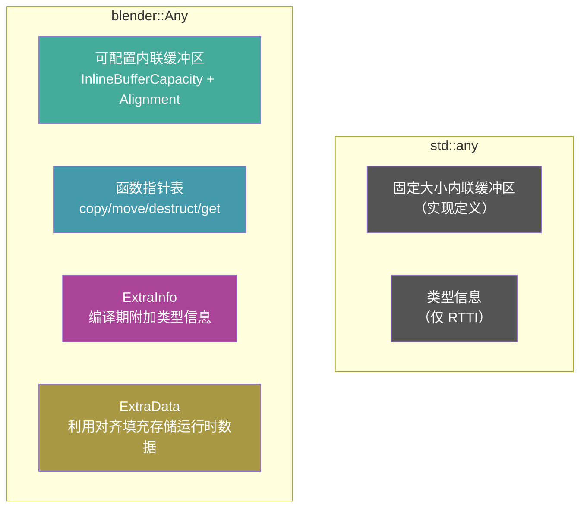

---

## 二、模板参数

```cpp
template<
    typename ExtraInfo = void,       // 编译期附加类型信息
    size_t InlineBufferCapacity = 8, // 内联缓冲区字节数
    size_t Alignment = 8,            // 内联缓冲区对齐
    typename ExtraData = blenlib_detail::EmptyType  // 利用对齐填充的运行时数据
>
class Any;
```

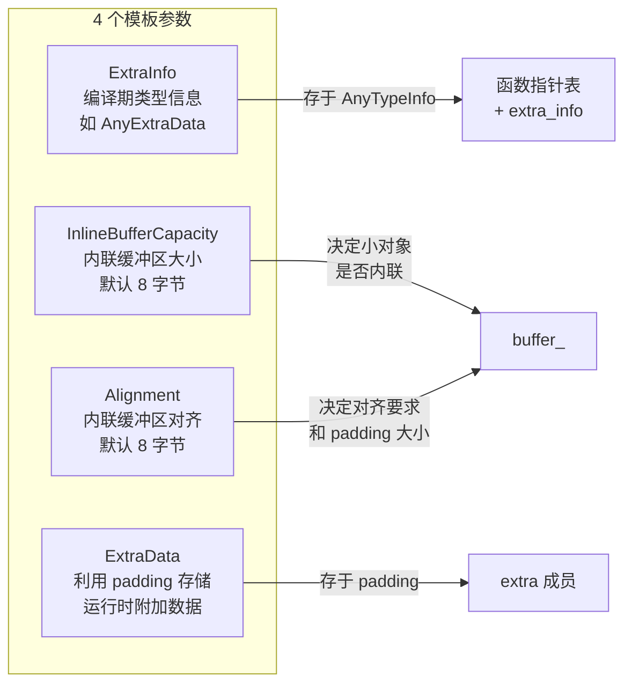

### SocketValueVariant 中的使用

```cpp
// BKE_node_socket_value.hh
Any<void, 32, 16, AnyExtraData> value_;
//       ↑   ↑        ↑
//      32B  16B对齐   利用 padding 存 kind + socket_type
```

- `InlineBufferCapacity = 32`：足够内联存储 `int`、`float`、`float3`、`GField` 等
- `Alignment = 16`：满足 SIMD 类型的对齐需求
- `AnyExtraData`：利用对齐产生的 padding 空间存储 `kind` 和 `socket_type`

---

## 三、内存布局

### 3.1 三个核心数据成员

```cpp
class Any {
private:
    AlignedBuffer<RealInlineBufferCapacity, Alignment> buffer_{};  // 内联缓冲区
public:
    BLI_NO_UNIQUE_ADDRESS ExtraData extra = {};  // 利用 padding 的附加数据
private:
    const Info *info_ = nullptr;  // 指向静态函数指针表
};
```

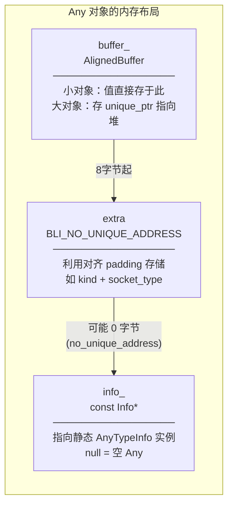

### 3.2 `BLI_NO_UNIQUE_ADDRESS` — 关键优化

```cpp
// BLI_utildefines.h
#if defined(_MSC_VER) && !defined(__clang__)
#  define BLI_NO_UNIQUE_ADDRESS [[msvc::no_unique_address]]
#else
#  define BLI_NO_UNIQUE_ADDRESS [[no_unique_address]]
#endif
```

`[[no_unique_address]]` 是 C++20 属性，允许空类型或具有特定对齐的类型**不占用独立字节**，而是利用前一个成员的 padding 空间。

**实际效果**：`AlignedBuffer<32, 16>` 本身可能有尾部 padding（因为 16 字节对齐），`ExtraData` 就可以"塞进"这些 padding 中，**不增加 `Any` 的总大小**。

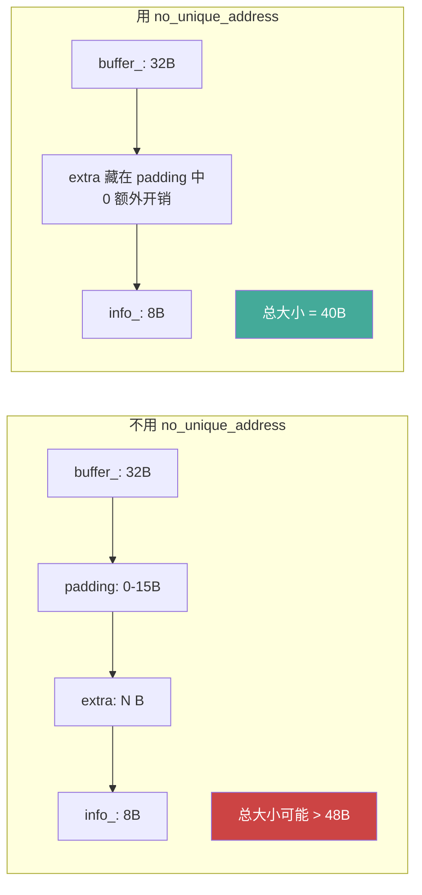

### 3.3 `RealInlineBufferCapacity` 的保底策略

```cpp
static constexpr size_t RealInlineBufferCapacity =
    std::max(InlineBufferCapacity, sizeof(std::unique_ptr<int>));
```

即使你设 `InlineBufferCapacity = 0`，实际缓冲区也至少能容纳一个 `unique_ptr`（8 字节），因为大对象需要在缓冲区中存 `unique_ptr`。

---

## 四、类型擦除机制 — AnyTypeInfo

### 4.1 函数指针表

```cpp
template<typename ExtraInfo>
struct AnyTypeInfo {
    void (*copy_construct)(void *dst, const void *src);  // 复制构造
    void (*move_construct)(void *dst, void *src);        // 移动构造
    void (*destruct)(void *src);                          // 析构
    const void *(*get)(const void *src);                  // 获取值指针
    ExtraInfo extra_info;                                 // 编译期附加信息
};
```

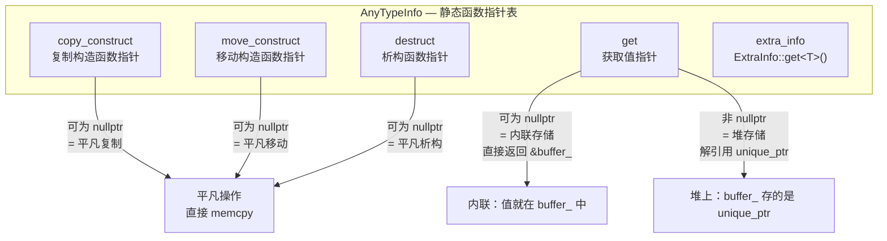

### 4.2 两种函数表实例

根据类型大小，`Any` 选择两种存储策略之一，对应两套函数表：

#### 内联存储 — `info_for_inline`

```cpp
template<typename ExtraInfo, typename T>
inline constexpr AnyTypeInfo<ExtraInfo> info_for_inline = {
    // copy_construct: 平凡类型 → nullptr，非平凡 → placement new 拷贝
    is_trivially_copy_constructible_extended_v<T> ?
        nullptr :
        +[](void *dst, const void *src) { new (dst) T(*static_cast<const T *>(src)); },
    // move_construct: 同理
    is_trivially_move_constructible_extended_v<T> ?
        nullptr :
        +[](void *dst, void *src) { new (dst) T(std::move(*static_cast<T *>(src))); },
    // destruct: 平凡析构 → nullptr
    is_trivially_destructible_extended_v<T> ?
        nullptr :
        +[](void *src) { std::destroy_at(static_cast<T *>(src)); },
    // get: 内联存储不需要额外间接，返回 nullptr
    nullptr,
    ExtraInfo::template get<T>()
};
```

#### 堆存储 — `info_for_unique_ptr`

```cpp
template<typename ExtraInfo, typename T>
inline constexpr AnyTypeInfo<ExtraInfo> info_for_unique_ptr = {
    // copy_construct: 深拷贝 — new T(**ptr)
    [](void *dst, const void *src) {
        new (dst) Ptr<T>(new T(**static_cast<const Ptr<T> *>(src)));
    },
    // move_construct: 移动构造新 unique_ptr（注意：这里也做了深拷贝而非移动！）
    [](void *dst, void *src) {
        new (dst) Ptr<T>(new T(std::move(**static_cast<Ptr<T> *>(src))));
    },
    // destruct: 销毁 unique_ptr，自动释放堆内存
    [](void *src) { std::destroy_at(static_cast<Ptr<T> *>(src)); },
    // get: 需要解引用 unique_ptr → 返回 &**ptr
    [](const void *src) -> const void * {
        return &**static_cast<const Ptr<T> *>(src);
    },
    ExtraInfo::template get<T>()
};
```

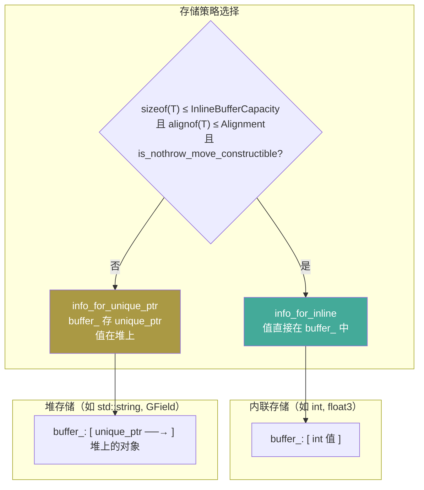

### 4.3 `+[](...)` — Lambda 到函数指针的转换

```cpp
+[](void *dst, const void *src) { new (dst) T(*static_cast<const T *>(src)); }
```

前缀 `+` 是一元加法运算符。无捕获 lambda 可以隐式转换为函数指针，`+` 强制了这个转换。这是为了确保 `info_for_inline` 中的初始化器是**编译期常量**（`inline constexpr`），而不是留下一个未决的 lambda 类型。

### 4.4 `is_trivially_xxx_extended_v` — 扩展的平凡判断

```cpp
// BLI_memory_utils.hh
template<typename T>
inline constexpr bool is_trivially_copy_constructible_extended_v =
    is_trivial_extended_v<T> || std::is_trivially_copy_constructible_v<T>;
```

比标准库多检查了 `is_trivial_v<T>`。某些类型（如某些聚合体）可能不是 `is_trivially_copy_constructible` 但却是 `is_trivial` 的，这个扩展覆盖了更多情况，让函数指针可以为 `nullptr`（即用 `memcpy` 代替）。

---

## 五、类型判断 — `is<T>()` 的巧妙实现

```cpp
template<typename T> bool is() const
{
    return info_ == &this->template get_info<T>();
}
```

**不比较类型名称或 RTTI，而是比较指针地址！** 每个类型 `T` 对应的 `AnyTypeInfo` 是一个 `inline constexpr` 静态变量，地址全局唯一。`info_` 存的就是这个地址，所以直接比指针即可判断类型。

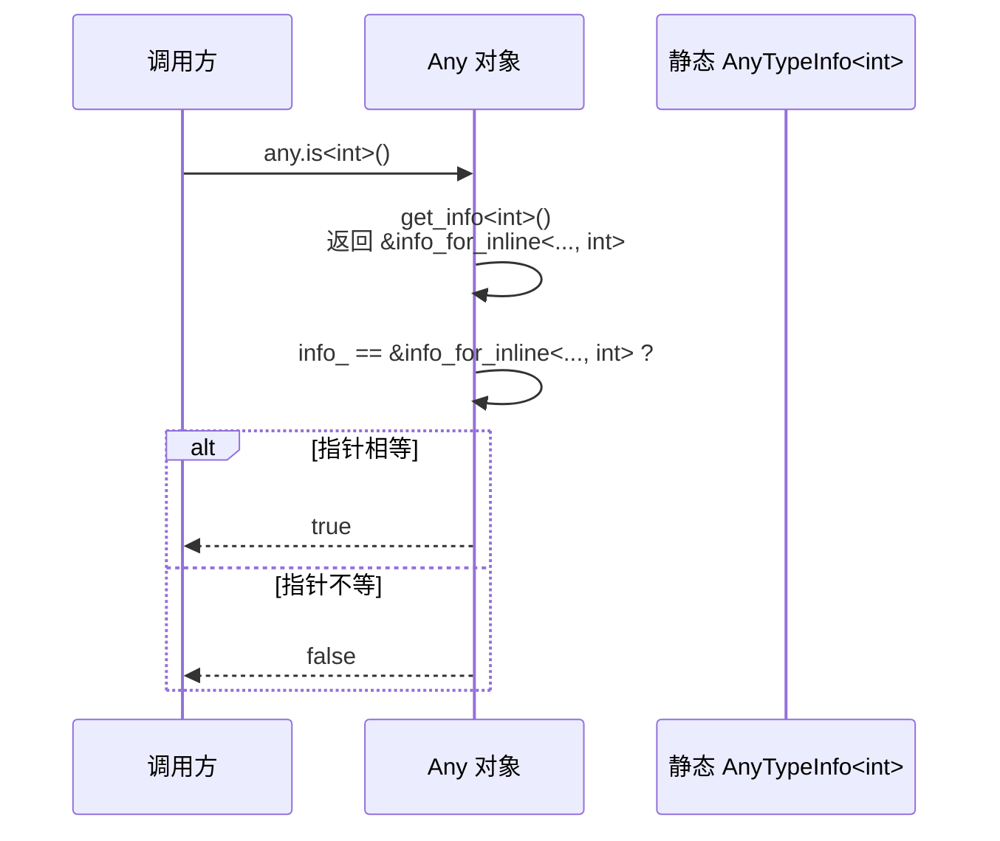

---

## 六、核心操作流程

### 6.1 构造/赋值 — `emplace_on_empty`

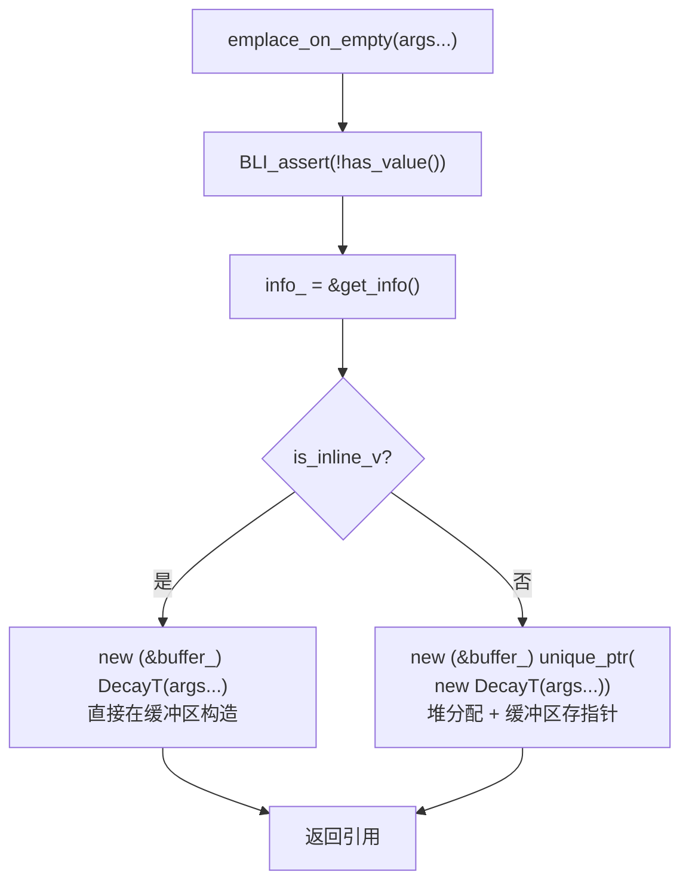

### 6.2 复制构造

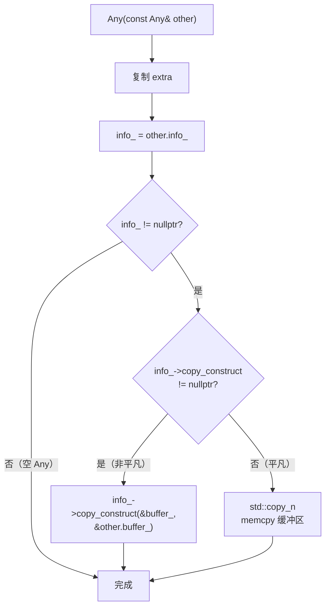

### 6.3 获取值 — `get<T>()`

```cpp
template<typename T> const T &get() const
{
    BLI_assert(this->is<T>());
    const void *buffer;
    if constexpr (is_inline_v<T>) {
        buffer = &buffer_;           // 内联：直接取缓冲区地址
    } else {
        BLI_assert(info_->get != nullptr);
        buffer = info_->get(&buffer_); // 堆上：解引用 unique_ptr
    }
    return *static_cast<const T *>(buffer);
}
```

注意 `if constexpr` 分支在编译期就确定了，**零运行时开销**。

### 6.4 析构

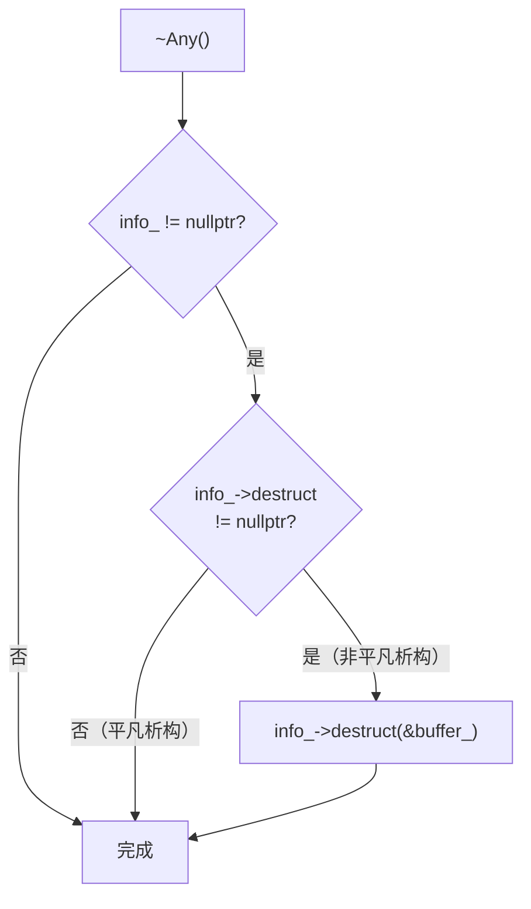

---

## 七、`allocate` — 延迟构造

```cpp
template<typename T> void *allocate_on_empty()
{
    BLI_assert(!this->has_value());
    info_ = &this->template get_info<T>();
    if constexpr (is_inline_v<T>) {
        return buffer_.ptr();  // 返回缓冲区原始指针
    } else {
        T *value = static_cast<T *>(::operator new(sizeof(T)));  // 原始堆分配
        new (&buffer_) std::unique_ptr<T>(value);
        return value;
    }
}
```

与 `emplace_on_empty` 不同，`allocate` **只分配内存，不调用构造函数**。调用者负责在返回的指针上 placement new 构造对象。这在性能敏感路径上很有用——可以先分配空间，稍后再构造。

---

## 八、ExtraInfo 机制

### 8.1 设计目的

`ExtraInfo` 允许为每个存储的类型附加编译期信息，嵌入在 `AnyTypeInfo` 中。

### 8.2 接口要求

```cpp
struct MyExtraInfo {
    template<typename T> static constexpr MyExtraInfo get() { return {...}; }
};
```

必须提供静态模板方法 `get<T>()`，返回基于类型 `T` 的附加信息。

### 8.3 SocketValueVariant 的使用

```cpp
struct AnyExtraData {
    Kind kind = Kind::None;                    // Single/Field/Grid/List
    eNodeSocketDatatype socket_type;           // SOCK_INT, SOCK_FLOAT, ...
};
```

这不是 `ExtraInfo`，而是 `ExtraData`（第四个模板参数）。`ExtraInfo` 在这里是 `void`（即 `NoExtraInfo`），而 `ExtraData` 利用 `[[no_unique_address]]` 藏在 padding 中。

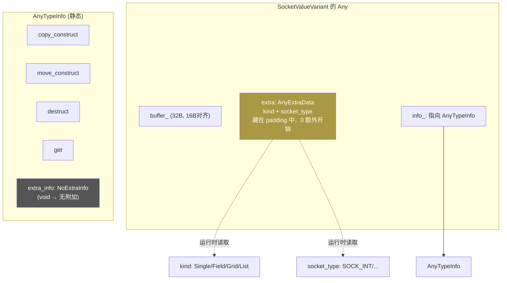

### 8.4 ExtraInfo vs ExtraData 的区别

| | ExtraInfo | ExtraData |
|---|---|---|
| 模板参数位置 | 第 1 个 | 第 4 个 |
| 存储位置 | 嵌入 `AnyTypeInfo`（静态区） | 嵌入 `Any` 对象本身（栈/堆） |
| 初始化方式 | `ExtraInfo::get<T>()` 编译期 | 运行时赋值 |
| 生命周期 | 永久（静态变量） | 随 `Any` 对象 |
| 访问方式 | `extra_info()` | `extra` 成员 |
| 典型用途 | 类型的编译期属性 | 类型的运行时标签 |

---

## 九、与 `std::any` 的关键差异总结

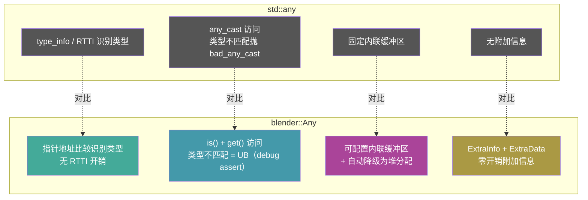

---

## 十、赋值运算符的"重建"模式

```cpp
Any &operator=(const Any &other)
{
    if (this == &other) return *this;
    this->~Any();          // 先析构当前值
    new (this) Any(other); // placement new 复制构造
    return *this;
}
```

赋值不是"先析构再构造新值"，而是**先调用析构函数，再在原地址 placement new**。这种模式避免了实现 `assign` 逻辑，复用了拷贝构造函数。所有赋值运算符都采用这种"destroy + reconstruct"模式。

---

## 十一、完整生命周期示例

```cpp
// 1. 构造空 Any
Any<void, 32, 16> a;          // info_ = nullptr, buffer_ 未初始化

// 2. 赋值 int（内联存储）
a = 42;
// → info_ = &info_for_inline<NoExtraInfo, int>
// → buffer_ 中直接存 int(42)

// 3. 赋值 std::string（堆存储）
a = std::string("hello");
// → info_ = &info_for_unique_ptr<NoExtraInfo, std::string>
// → buffer_ 中存 unique_ptr<string> → 堆上的 "hello"

// 4. 类型检查
a.is<int>();           // false
a.is<std::string>();   // true

// 5. 获取值
const std::string &s = a.get<std::string>();  // "hello"

// 6. 析构
// ~Any() → info_->destruct(&buffer_) → destroy_at(unique_ptr) → 释放堆内存
```

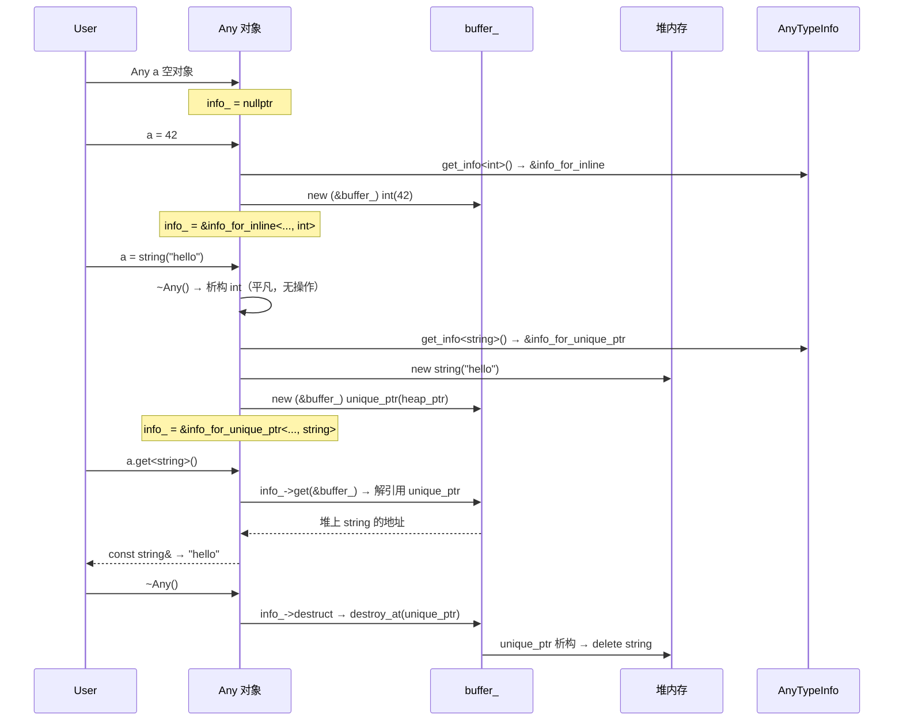
