# BLI_any.hh 深度解析

> 源文件：`source/blender/blenlib/BLI_any.hh`

## 一、它是什么？

`blender::Any` 是一个**类型擦除**容器，可以存储**任何可复制构造**的类型。它类似于 `std::any`，但增加了两个关键能力：

| 特性 | `std::any` | `blender::Any` |
|---|---|---|
| 内联缓冲区大小 | 实现定义，不可控 | **可配置** `InlineBufferCapacity` |
| 对齐要求 | 实现定义，不可控 | **可配置** `Alignment` |
| 附加类型信息 | 不支持 | **支持** `ExtraInfo` + `ExtraData` |

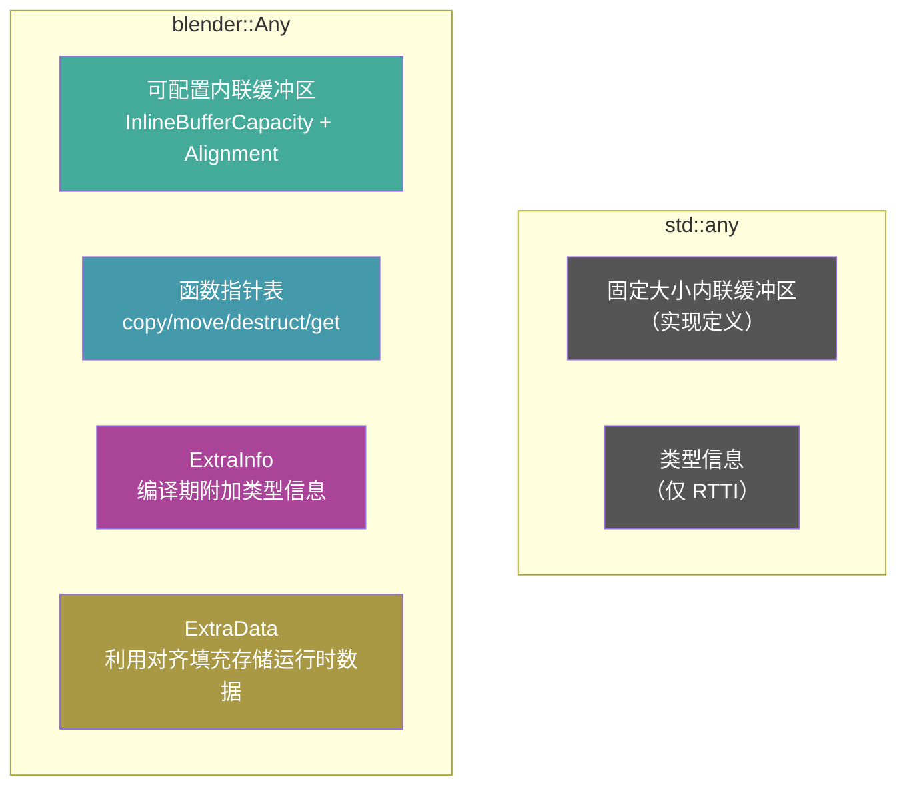
```mermaid
graph TB
    subgraph "std::any"
        A1["固定大小内联缓冲区<br/>（实现定义）"]
        A2["类型信息<br/>（仅 RTTI）"]
    end
    subgraph "blender::Any"
        B1["可配置内联缓冲区<br/>InlineBufferCapacity + Alignment"]
        B2["函数指针表<br/>copy/move/destruct/get"]
        B3["ExtraInfo<br/>编译期附加类型信息"]
        B4["ExtraData<br/>利用对齐填充存储运行时数据"]
    end
    style A1 fill:#555,color:#fff
    style A2 fill:#555,color:#fff
    style B1 fill:#4a9,color:#fff
    style B2 fill:#49a,color:#fff
    style B3 fill:#a49,color:#fff
    style B4 fill:#a94,color:#fff
```

---

## 二、模板参数

```cpp
template<
    typename ExtraInfo = void,       // 编译期附加类型信息
    size_t InlineBufferCapacity = 8, // 内联缓冲区字节数
    size_t Alignment = 8,            // 内联缓冲区对齐
    typename ExtraData = blenlib_detail::EmptyType  // 利用对齐填充的运行时数据
>
class Any;
```

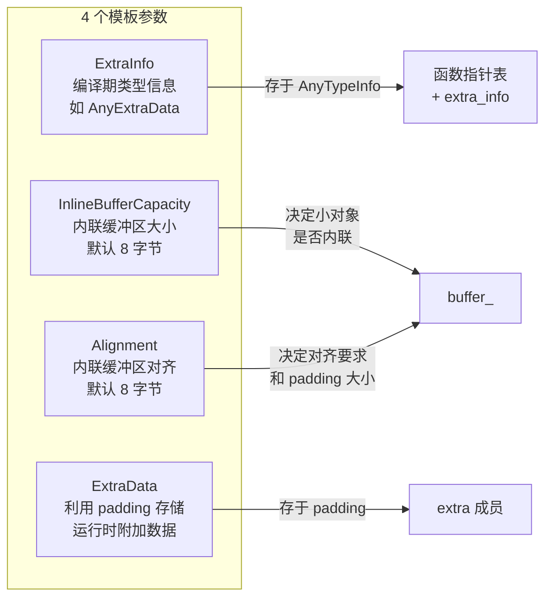
```mermaid
graph LR
    subgraph "4 个模板参数"
        EI["ExtraInfo<br/>编译期类型信息<br/>如 AnyExtraData"]
        IBC["InlineBufferCapacity<br/>内联缓冲区大小<br/>默认 8 字节"]
        AL["Alignment<br/>内联缓冲区对齐<br/>默认 8 字节"]
        ED["ExtraData<br/>利用 padding 存储<br/>运行时附加数据"]
    end
    EI --> |"存于 AnyTypeInfo"| VTable["函数指针表<br/>+ extra_info"]
    IBC --> |"决定小对象<br/>是否内联"| Buffer["buffer_"]
    AL --> |"决定对齐要求<br/>和 padding 大小"| Buffer
    ED --> |"存于 padding"| Extra["extra 成员"]
```

### SocketValueVariant 中的使用

```cpp
// BKE_node_socket_value.hh
Any<void, 32, 16, AnyExtraData> value_;
//       ↑   ↑        ↑
//      32B  16B对齐   利用 padding 存 kind + socket_type
```

- `InlineBufferCapacity = 32`：足够内联存储 `int`、`float`、`float3`、`GField` 等
- `Alignment = 16`：满足 SIMD 类型的对齐需求
- `AnyExtraData`：利用对齐产生的 padding 空间存储 `kind` 和 `socket_type`

### ExtraInfo vs ExtraData — 区别与联系

| | ExtraInfo | ExtraData |
|---|---|---|
| **存储位置** | `AnyTypeInfo` 静态变量中 | `Any` 对象实例中 |
| **何时确定** | 编译期（`ExtraInfo::get<T>()`） | 运行时（每个 Any 对象独立持有） |
| **是否共享** | 所有同类型 Any 共享一份 | 每个 Any 对象各有一份 |
| **大小影响** | 不增加 Any 对象大小 | 可能增加 Any 对象大小（但用 `no_unique_address` 优化） |
| **模板参数** | `Any` 的第 1 个模板参数 | `Any` 的第 4 个模板参数 |
| **典型内容** | 类型相关的元数据 | 每个 Any 实例的运行时数据 |

`SocketValueVariant` 用的是 `Any<void, 32, 16, AnyExtraData>`：
- `ExtraInfo = void` → 不使用 ExtraInfo（转为 `NoExtraInfo`，空类型）
- `ExtraData = AnyExtraData` → 每个 Any 对象存 `kind` 和 `socket_type`

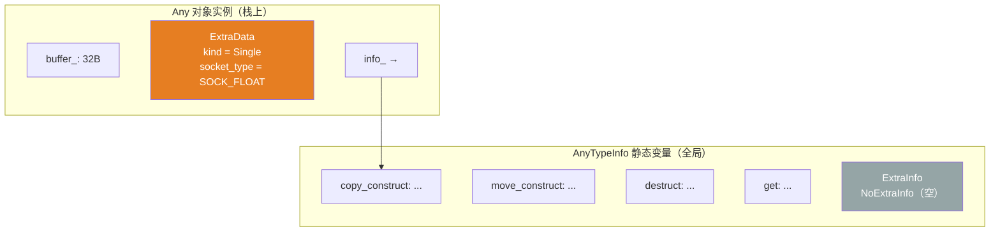
```mermaid
flowchart TB
    subgraph "Any 对象实例（栈上）"
        BUF["buffer_: 32B"]
        ED["ExtraData<br/>kind = Single<br/>socket_type = SOCK_FLOAT"]
        INFO_PTR["info_ →"]
    end

    subgraph "AnyTypeInfo 静态变量（全局）"
        CC["copy_construct: ..."]
        MC["move_construct: ..."]
        DT["destruct: ..."]
        GT["get: ..."]
        EI["ExtraInfo<br/>NoExtraInfo（空）"]
    end

    INFO_PTR --> CC

    style ED fill:#e67e22,color:#fff
    style EI fill:#95a5a6,color:#fff
```

> **为什么 `SocketValueVariant` 把 `kind` 和 `socket_type` 放在 `ExtraData` 而非 `ExtraInfo`？** 因为 `kind` 和 `socket_type` 是**运行时变化的**——同一个 `Any` 对象可能先存 `int`（`kind=Single`），后被赋值为 `GField`（`kind=Field`）。`ExtraInfo` 在编译期就固定了（每个类型 `T` 一份），无法在运行时改变。`ExtraData` 是每个 Any 实例独立持有的，可以在赋值时更新。

---

## 三、内存布局

### 3.1 三个核心数据成员

```cpp
class Any {
private:
    AlignedBuffer<RealInlineBufferCapacity, Alignment> buffer_{};  // 内联缓冲区
public:
    BLI_NO_UNIQUE_ADDRESS ExtraData extra = {};  // 利用 padding 的附加数据
private:
    const Info *info_ = nullptr;  // 指向静态函数指针表
};
```

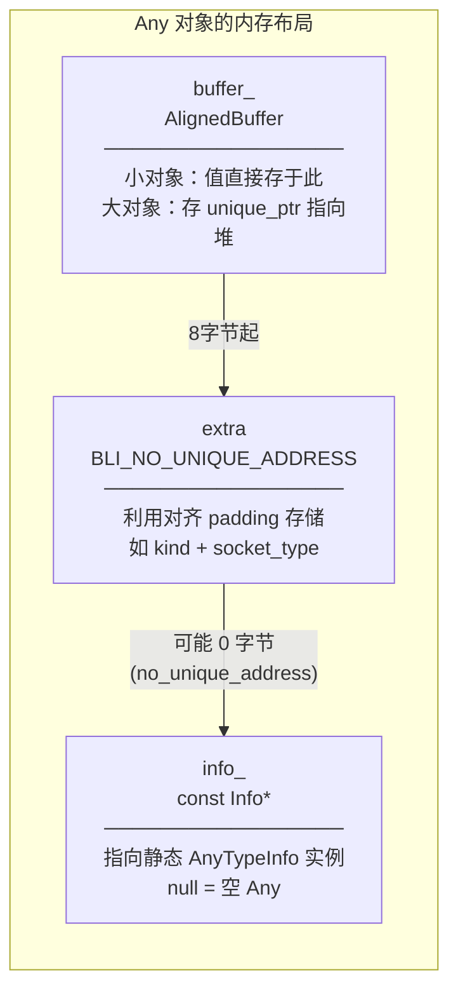
```mermaid
graph TB
    subgraph "Any 对象的内存布局"
        direction TB
        BUF["buffer_<br/>AlignedBuffer<max(InlineBufferCapacity, sizeof(unique_ptr))><br/>─────────────────<br/>小对象：值直接存于此<br/>大对象：存 unique_ptr 指向堆"]
        PAD["extra<br/>BLI_NO_UNIQUE_ADDRESS<br/>─────────────────<br/>利用对齐 padding 存储<br/>如 kind + socket_type"]
        INFO["info_<br/>const Info*<br/>─────────────────<br/>指向静态 AnyTypeInfo 实例<br/>null = 空 Any"]
    end
    BUF --> |"8字节起"| PAD
    PAD --> |"可能 0 字节<br/>(no_unique_address)"| INFO
```

### 3.2 `BLI_NO_UNIQUE_ADDRESS` — 关键优化

```cpp
// BLI_utildefines.h
#if defined(_MSC_VER) && !defined(__clang__)
#  define BLI_NO_UNIQUE_ADDRESS [[msvc::no_unique_address]]
#else
#  define BLI_NO_UNIQUE_ADDRESS [[no_unique_address]]
#endif
```

`[[no_unique_address]]` 是 C++20 属性，允许空类型或具有特定对齐的类型**不占用独立字节**，而是利用前一个成员的 padding 空间。

#### 空对象为什么占 1 字节？

C++ 要求**每个独立对象必须有唯一地址**。如果空类型占 0 字节，数组中连续元素就会共享同一地址：

```cpp
struct Empty {};
Empty arr[3];
// 如果 sizeof(Empty) == 0：
// &arr[0] == &arr[1] == &arr[2]  ← 不合法！
// 所以 C++ 规定 sizeof(Empty) >= 1
```

`[[no_unique_address]]` 告诉编译器："这个成员不需要唯一地址，可以和其他成员共享地址空间"。所以空类型成员可以占 0 字节——它借用前一个成员的地址。

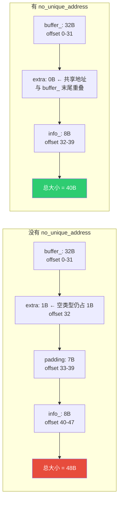
```mermaid
graph LR
    subgraph "没有 no_unique_address"
        N1["buffer_: 32B<br/>offset 0-31"]
        N2["extra: 1B ← 空类型仍占 1B<br/>offset 32"]
        N3["padding: 7B<br/>offset 33-39"]
        N4["info_: 8B<br/>offset 40-47"]
        N5["总大小 = 48B"]
        N1 --> N2 --> N3 --> N4 --> N5
    end

    subgraph "有 no_unique_address"
        Y1["buffer_: 32B<br/>offset 0-31"]
        Y2["extra: 0B ← 共享地址<br/>与 buffer_ 末尾重叠"]
        Y3["info_: 8B<br/>offset 32-39"]
        Y4["总大小 = 40B"]
        Y1 --> Y2 --> Y3 --> Y4
    end

    style N5 fill:#e74c3c,color:#fff
    style Y4 fill:#2ecc71,color:#fff
```

> **不是利用前一个成员的 padding**——那是另一种优化场景。对于空类型，`[[no_unique_address]]` 是**共享地址**（0 字节）。对于非空但有尾部 padding 的类型，`[[no_unique_address]]` 允许下一个成员塞进 padding 中（tail padding reuse）。两种情况都适用。

**实际效果**：`AlignedBuffer<32, 16>` 本身可能有尾部 padding（因为 16 字节对齐），`ExtraData` 就可以"塞进"这些 padding 中，**不增加 `Any` 的总大小**。

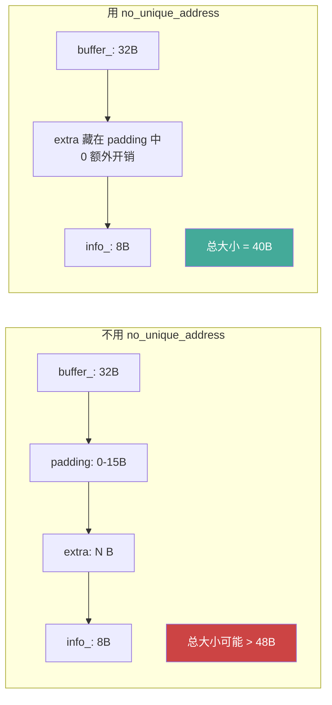
```mermaid
graph LR
    subgraph "不用 no_unique_address"
        A1["buffer_: 32B"] --> A2["padding: 0-15B"] --> A3["extra: N B"] --> A4["info_: 8B"]
        A5["总大小可能 > 48B"]
    end
    subgraph "用 no_unique_address"
        B1["buffer_: 32B"] --> B2["extra 藏在 padding 中<br/>0 额外开销"] --> B3["info_: 8B"]
        B4["总大小 = 40B"]
    end
    style A5 fill:#c44,color:#fff
    style B4 fill:#4a9,color:#fff
```

### 3.3 `RealInlineBufferCapacity` 的保底策略

```cpp
static constexpr size_t RealInlineBufferCapacity =
    std::max(InlineBufferCapacity, sizeof(std::unique_ptr<int>));
```

即使你设 `InlineBufferCapacity = 0`，实际缓冲区也至少能容纳一个 `unique_ptr`（8 字节），因为大对象需要在缓冲区中存 `unique_ptr`。

---

## 四、类型擦除机制 — AnyTypeInfo

### 4.1 函数指针表

```cpp
/**
 * Contains function pointers that manage the memory in an #Any.
 * Additional type specific #ExtraInfo can be embedded here as well.
 */
template<typename ExtraInfo>
struct AnyTypeInfo {
    void (*copy_construct)(void *dst, const void *src);  // 复制构造
    void (*move_construct)(void *dst, void *src);        // 移动构造
    void (*destruct)(void *src);                          // 析构
    const void *(*get)(const void *src);                  // 获取值指针
    ExtraInfo extra_info;                                 // 编译期附加信息
};
```

> **注释翻译**：
> - `"Contains function pointers that manage the memory in an #Any."` — 包含管理 `Any` 内存的函数指针。
> - `"Additional type specific #ExtraInfo can be embedded here as well."` — 额外的**类型特定** `ExtraInfo` 也可以嵌入这里。"type specific" 意思是每个类型 `T` 可以有不同的 `ExtraInfo` 数据。`ExtraInfo` 通过 `ExtraInfo::template get<T>()` 在编译期为每个类型生成——例如 `SocketValueVariant` 的 `ExtraInfo` 包含 `kind`（Single/Field/List/Grid）和 `socket_type` 指针，这些信息在 `AnyTypeInfo` 中随函数指针一起存储，**不增加 `Any` 对象本身的大小**。

> **"静态变量"指什么？** `info_for_inline` 和 `info_for_unique_ptr` 声明为 `inline constexpr`——每个模板实例化只有**一个全局实例**，所有 `Any` 对象共享同一个 `AnyTypeInfo`：
>
> ```cpp
> // 整个程序中只有一个 info_for_inline<NoExtraInfo, int>
> // 所有存 int 的 Any 对象的 info_ 都指向同一个地址
> template<>
> inline constexpr AnyTypeInfo<NoExtraInfo> info_for_inline<NoExtraInfo, int> = { ... };
> ```
>
> 所以 `extra_info` 存在 `AnyTypeInfo` 中不占 `Any` 对象的空间——它是静态数据，被所有同类型 `Any` 共享。

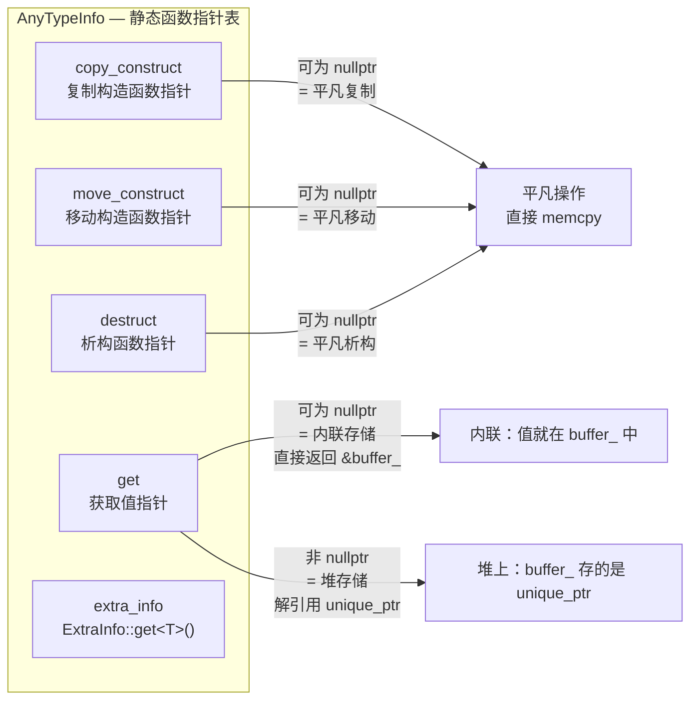
```mermaid
graph LR
    subgraph "AnyTypeInfo — 静态函数指针表"
        CC["copy_construct<br/>复制构造函数指针"]
        MC["move_construct<br/>移动构造函数指针"]
        DT["destruct<br/>析构函数指针"]
        GT["get<br/>获取值指针"]
        EI["extra_info<br/>ExtraInfo::get&lt;T&gt;()"]
    end
    CC --> |"可为 nullptr<br/>= 平凡复制"| TRIVIAL["平凡操作<br/>直接 memcpy"]
    MC --> |"可为 nullptr<br/>= 平凡移动"| TRIVIAL
    DT --> |"可为 nullptr<br/>= 平凡析构"| TRIVIAL
    GT --> |"可为 nullptr<br/>= 内联存储<br/>直接返回 &buffer_"| INLINE["内联：值就在 buffer_ 中"]
    GT --> |"非 nullptr<br/>= 堆存储<br/>解引用 unique_ptr"| HEAP["堆上：buffer_ 存的是 unique_ptr"]
```

### 4.2 两种函数表实例

根据类型大小，`Any` 选择两种存储策略之一，对应两套函数表：

#### 模板变量语法 — `inline constexpr` 详解

```cpp
template<typename ExtraInfo, typename T>
inline constexpr AnyTypeInfo<ExtraInfo> info_for_inline = { ... };
```

**变量模板**（C++14）：和函数模板、类模板类似，但生成的是**变量**而非函数或类。每个不同的 `T` 产生一个不同的变量实例。

**为什么需要 `inline`？** 头文件被多个 `.cpp` 包含时，每个 `.cpp` 都会看到这个变量定义。没有 `inline`，链接器会报"多重定义"错误。`inline` 告诉链接器："多个定义没关系，合并为一个"。

**为什么需要 `constexpr`？** `constexpr` 表示这个变量可以在**编译期求值**。这对 `is<T>()` 的指针比较很关键——编译器可以在编译期确定 `&info_for_inline<..., int>` 的地址，优化掉整个 `is<T>()` 调用。

**为什么说是"静态变量"？** `inline constexpr` 变量隐含**合并链接**——程序中只有一份实例，等价于静态存储期的全局变量。它不存储在栈上，不存储在堆上，而是在**全局数据段**中。生命周期从程序启动到程序结束——和全局变量、`static` 变量一样。

> **普通定义在文件里的变量存在哪？生命周期多久？** 和 `inline constexpr` 完全一样——全局数据段，程序启动到结束。区别不在存储位置和生命周期，而在**链接性**和**可修改性**：
>
> | 变量 | 链接性 | 可修改 | 编译期求值 |
> |------|--------|--------|-----------|
> | `int x = 42;` | 外部链接（其他 `.cpp` 可用 `extern`） | 可以 | 不保证 |
> | `static int x = 42;` | 内部链接（仅本 `.cpp`） | 可以 | 不保证 |
> | `const int x = 42;` | 内部链接（C++ 默认） | 不可以 | 不保证 |
> | `constexpr int x = 42;` | 内部链接 | 不可以 | 保证 |
> | `inline constexpr int x = 42;` | 外部链接+合并（所有 `.cpp` 共享一份） | 不可以 | 保证 |
> | `inline int x = 42;` | 外部链接+合并 | 可以 | 不保证 |
>
> 初始化为 0 的全局变量存在 `.bss` 段（不占磁盘空间），有非零初始值的存在 `.data` 段，`const`/`constexpr` 的存在 `.rodata` 段（只读）。但这些都是"全局数据段"的子区域，生命周期都一样。
>
> **为什么 `const int x = 42;` 默认内部链接？** C++ 的设计意图：`const` 变量通常用作编译期常量，编译器会把它内联到使用处（直接用 `42` 替代 `x`）。如果外部链接，每个 `.cpp` 都必须引用同一个变量，编译器就无法自由内联。所以 C++ 规定 `const` 全局变量默认内部链接——每个 `.cpp` 各有一份，编译器可以独立优化。C 语言相反——`const` 全局变量默认外部链接，这是 C++ 故意改的。
>
> **`int x = 42;` 和 `inline int x = 42;` 都是外部链接，区别在哪？** 多重定义的处理不同：
> ```cpp
> // header.h
> int x = 42;           // ❌ 被 a.cpp 和 b.cpp 包含 → 链接器报"多重定义"
> inline int x = 42;    // ✅ 被 a.cpp 和 b.cpp 包含 → 链接器合并为一份
> ```
> `inline` 的"合并"语义：链接器看到多个定义时，选一个保留，其余丢弃，不报错。没有 `inline` 时，链接器看到多个定义就报错。
>
> **头文件里的全局变量要加 `inline` 吗？** 必须加（C++17 起），否则多重包含会报链接错误：
> ```cpp
> // header.h
> int global_counter = 0;              // ❌ 多个 .cpp 包含 → 链接错误
> inline int global_counter = 0;       // ✅ 安全
> inline constexpr int MAX_SIZE = 42;  // ✅ 安全（只读）
> const int MAGIC = 7;                 // ✅ 安全（const 默认内部链接，每个 .cpp 各一份）
> ```
> C++17 之前的做法是声明放在头文件（`extern int global_counter;`），定义放在单独的 `.cpp`（`int global_counter = 0;`）。`inline` 变量让头文件定义变量变得简单。
>
> **`const int MAGIC = 7;` 在头文件不加 `inline` 也安全，加了也安全，但行为不同：**
>
> 为什么 `const` 这么特殊？因为 C++ 给 `const` 全局变量**默认内部链接**——等价于自动加了 `static`：
> ```cpp
> // header.h 被 a.cpp 和 b.cpp 包含
> const int MAGIC = 7;
> // 等价于每个 .cpp 里各自写了：
> // static const int MAGIC = 7;  ← 内部链接，仅本 .cpp 可见
> // a.cpp 有自己的 MAGIC，b.cpp 也有自己的 MAGIC
> // 互不冲突，链接器不会报"多重定义"
> ```
> 对比 `int x = 42;`——默认外部链接，两个 `.cpp` 都导出符号 `x`，链接器看到两个 `x` 就报错。`const` 自带"隔离"，所以不需要 `inline` 解决多重定义。
>
> | | `const int MAGIC = 7;` | `inline const int MAGIC = 7;` |
> |---|---|---|
> | 链接性 | 内部链接 | 外部链接+合并 |
> | 每个 .cpp | 各有一份，地址不同 | 共享一份，地址相同 |
> | 内存 | N 份（N = .cpp 数量） | 1 份 |
> | 取地址 `&MAGIC` | 每个 .cpp 得到不同地址 | 所有 .cpp 得到相同地址 |
> | 编译器内联 | 更容易（每个 .cpp 独立优化） | 也可以，但可能稍受限 |
>
> 对 `int` 这种小类型，多几份拷贝无所谓（编译器通常直接内联值，根本不分配内存）。头文件中 `const int` 不加 `inline` 是惯用写法。加了也没错，只是语义变了。
>
> **`inline` 主要用在头文件，用在 `.cpp` 里几乎没意义：**
> ```cpp
> // a.cpp
> inline int x = 42;    // 只有一个定义，inline 的"合并"功能无用
> int y = 42;           // 同样只有一个定义，效果一样
> ```
> 在 `.cpp` 中，变量只被定义一次，不存在"多重定义"问题，`inline` 的合并功能无用武之地。
>
> **模板特化（变量/函数/类都可以特化）：**
> ```cpp
> // 通用模板
> template<typename T> inline constexpr size_t type_size = sizeof(T);
> template<typename T> T max_value(T a, T b) { return a > b ? a : b; }
> template<typename T> struct TypeInfo { static constexpr size_t size = sizeof(T); };
>
> // 全特化 — 为特定类型提供不同实现
> template<> inline constexpr size_t type_size<void> = 0;           // 变量特化
> template<> const char* max_value(const char* a, const char* b) {  // 函数特化
>     return strcmp(a, b) > 0 ? a : b;  // 通用模板会比较指针地址，错误！
> }
> template<> struct TypeInfo<void> { static constexpr size_t size = 0; };  // 类特化
> ```
> **为什么需要特化？** 通用模板对大多数类型适用，但某些类型需要特殊处理（如 `const char*` 比较字符串内容而非指针地址）。
>
> **全特化 vs 偏特化放哪？**
>
> | 特化类型 | 放在哪 | 原因 |
> |---------|--------|------|
> | 全特化（`template<>`） | 通常 `.cpp`，或头文件+`inline` | 全特化不再是模板，是具体定义，放头文件会多重定义 |
> | 偏特化（`template<T*>`） | 头文件 | 仍然是模板，需要被多个 `.cpp` 实例化 |
>
> **模板定义放头文件不需要 `inline`——模板自带 ODR 豁免：**
> ```cpp
> // header.h — 模板函数，不需要 inline
> template<typename T> T add(T a, T b) { return a + b; }  // ✅ 链接器自动合并实例化
> // header.h — 模板变量，不需要 inline
> template<typename T> constexpr size_t type_size = sizeof(T);  // ✅ 同理
> ```
> C++ 标准规定：模板定义可以被多个翻译单元包含，链接器自动合并相同实例化（ODR 豁免）。
>
> 那 Blender 的 `info_for_inline` 为什么加 `inline`？不是解决多重定义，而是**保证地址一致性**——`is<T>()` 用 `info_ == &get_info<T>()` 比较指针地址，必须保证同一特化在所有 `.cpp` 中地址相同，`inline` 确保了这一点。
>
> 真正需要 `inline` 的场景：**全特化**和**非模板定义**放头文件时——它们不再是模板，ODR 豁免不适用：
> ```cpp
> template<typename T> void foo() { /* 通用 */ }      // ✅ 不需要 inline（模板）
> template<> inline void foo<int>() { /* int 特化 */ } // ❌ 不加 inline → 多重定义（全特化）
> ```
>
> **全特化也可以只把声明放头文件，定义放 `.cpp`：**
> ```cpp
> // header.h
> template<typename T> void foo();           // 通用模板声明
> template<> void foo<int>();                // 全特化声明（只有声明）
>
> // a.cpp
> template<typename T> void foo() { /* 通用 */ }
> template<> void foo<int>() { /* int 特化 */ }  // 全特化定义，不需要 inline
> ```
>
> **模板定义一般放头文件**（因为编译器需要看到完整定义才能实例化），但也可以放 `.cpp` + 显式实例化。如果模板只在一个 `.cpp` 里用，声明和定义都放那个 `.cpp` 就行——不需要头文件，不需要显式实例化。
>
> | | 模板定义 | 全特化定义 |
> |---|---|---|
> | 放头文件 | ✅ 最常见，任意类型可用 | 需加 `inline` |
> | 放 `.cpp` | 需显式实例化，只有列出类型可用 | ✅ 传统做法，不需要 `inline` |
> | 只声明放头文件 | ❌ 其他 `.cpp` 无法实例化 | ✅ 安全 |
>
> 显式实例化示例：
> ```cpp
> // a.cpp — 模板定义 + 显式实例化
> template<typename T> T add(T a, T b) { return a + b; }
> template int add<int>(int, int);      // 只生成 int 版本
> template float add<float>(float, float); // 只生成 float 版本
> // add<double>() 不可用 — 链接错误
> ```

> **`inline constexpr` 相当于 `static` 吗？** 效果类似，但机制不同：
>
> | | `static` 变量 | `inline constexpr` 变量 |
> |---|---|---|
> | **存储位置** | 全局数据段 | 全局数据段 |
> | **生命周期** | 程序启动到结束 | 程序启动到结束 |
> | **唯一性** | 每个翻译单元各有一份（内部链接） | 所有翻译单元共享一份（外部链接+合并） |
> | **可修改** | 可以 | 不可以（`constexpr` = 只读） |
> | **编译期求值** | 不保证 | 保证 |
> | **头文件中定义** | ✅ 安全（内部链接） | ✅ 安全（`inline` 允许多重定义） |
>
> 关键区别：`static` 变量在**每个 `.cpp` 中各有一份**（内部链接），`inline constexpr` 在**所有 `.cpp` 中共享一份**（合并链接）。对 `is<T>()` 的指针比较来说，必须用 `inline constexpr`——如果用 `static`，不同 `.cpp` 中的 `&info_for_inline<..., int>` 地址不同，比较会失败。
>
> ```mermaid
> flowchart TB
>     subgraph "static 变量（内部链接）"
>         S1["a.cpp<br/>info_for_inline&lt;..., int&gt;<br/>地址: 0x4000"]
>         S2["b.cpp<br/>info_for_inline&lt;..., int&gt;<br/>地址: 0x8000"]
>         S1 -.->|"不同地址！<br/>is&lt;int&gt;() 可能失败"| S2
>     end
>
>     subgraph "inline constexpr 变量（合并链接）"
>         I1["a.cpp 引用"]
>         I2["b.cpp 引用"]
>         I3["唯一实例<br/>info_for_inline&lt;..., int&gt;<br/>地址: 0x4000"]
>         I1 --> I3
>         I2 --> I3
>     end
>
>     style S1 fill:#e74c3c,color:#fff
>     style S2 fill:#e74c3c,color:#fff
>     style I3 fill:#2ecc71,color:#fff
> ```
>
> **为什么不用更清晰的语法？** C++ 历史原因。`inline` 原本是给函数用的（建议内联），C++17 扩展给变量用（允许头文件中定义变量而不报多重定义）。`constexpr` 原本是"编译期常量"的意思。两者组合恰好实现了"全局唯一实例"的效果，但语义并不直观。对比更清晰的设计（如果 C++ 重新设计）：`unique template<typename T> AnyTypeInfo info_for_inline = { ... };`——`unique` 明确表示"全局唯一实例"。但 C++ 不能破坏已有代码，只能在现有关键字上叠加含义。

**通过不同的 T 访问不同的变量？** 是的。模板变量是编译器生成的——每个不同的 `T` 产生一个独立的变量：

```cpp
// 编译器为以下代码生成 3 个独立的变量：
info_for_inline<NoExtraInfo, int>     // 变量1：int 的函数表
info_for_inline<NoExtraInfo, float>   // 变量2：float 的函数表
info_for_inline<NoExtraInfo, string>  // 变量3：string 的函数表

// 它们在内存中的地址各不相同：
&info_for_inline<NoExtraInfo, int>   != &info_for_inline<NoExtraInfo, float>
```

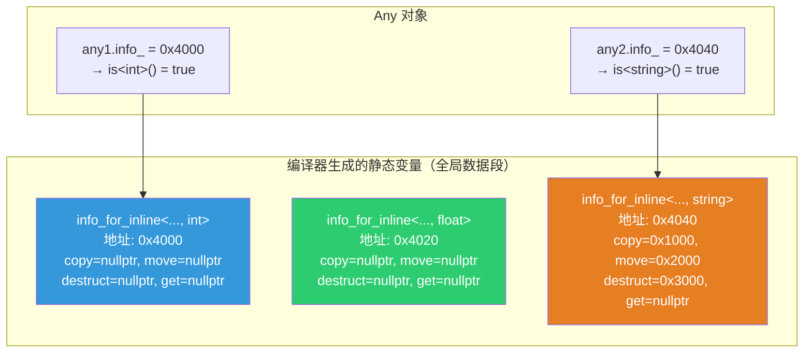
```mermaid
flowchart TD
    subgraph "编译器生成的静态变量（全局数据段）"
        V1["info_for_inline&lt;..., int&gt;<br/>地址: 0x4000<br/>copy=nullptr, move=nullptr<br/>destruct=nullptr, get=nullptr"]
        V2["info_for_inline&lt;..., float&gt;<br/>地址: 0x4020<br/>copy=nullptr, move=nullptr<br/>destruct=nullptr, get=nullptr"]
        V3["info_for_inline&lt;..., string&gt;<br/>地址: 0x4040<br/>copy=0x1000, move=0x2000<br/>destruct=0x3000, get=nullptr"]
    end

    subgraph "Any 对象"
        A1["any1.info_ = 0x4000<br/>→ is&lt;int&gt;() = true"]
        A2["any2.info_ = 0x4040<br/>→ is&lt;string&gt;() = true"]
    end

    A1 --> V1
    A2 --> V3

    style V1 fill:#3498db,color:#fff
    style V2 fill:#2ecc71,color:#fff
    style V3 fill:#e67e22,color:#fff
```

#### 内联存储 — `info_for_inline`

```cpp
template<typename ExtraInfo, typename T>
inline constexpr AnyTypeInfo<ExtraInfo> info_for_inline = {
    // copy_construct: 平凡类型 → nullptr，非平凡 → placement new 拷贝
    is_trivially_copy_constructible_extended_v<T> ?
        nullptr :
        +[](void *dst, const void *src) { new (dst) T(*static_cast<const T *>(src)); },
    // move_construct: 同理
    is_trivially_move_constructible_extended_v<T> ?
        nullptr :
        +[](void *dst, void *src) { new (dst) T(std::move(*static_cast<T *>(src))); },
    // destruct: 平凡析构 → nullptr
    is_trivially_destructible_extended_v<T> ?
        nullptr :
        +[](void *src) { std::destroy_at(static_cast<T *>(src)); },
    // get: 内联存储不需要额外间接，返回 nullptr
    nullptr,
    ExtraInfo::template get<T>()
};
```

#### 内联存储函数逐行详解

**1. `copy_construct`** — `+[](void *dst, const void *src) { new (dst) T(*static_cast<const T *>(src)); }`

```cpp
// src 指向 buffer_，其中存着 T 类型的值
// dst 指向目标 buffer_，需要构造一个新的 T

static_cast<const T *>(src)   // 将 void* 转为 const T* — 指向源 T 对象
*static_cast<const T *>(src)  // 解引用 — 得到 const T&（源对象的引用）
new (dst) T(...)              // placement new — 在 dst 位置构造 T
// 合起来：在 dst 处用源对象的拷贝构造函数构造新 T
```

> **为什么需要 `T(...)` 而非 `new (dst) T`？** `new (dst)` 只指定构造位置（placement），`T(...)` 指定**用哪个构造函数**：
> - `new (dst) T` — 默认构造（T 必须有默认构造函数）
> - `new (dst) T(x)` — 拷贝构造（用 x 的值构造）
> - `new (dst) T(std::move(x))` — 移动构造（从 x 移动资源）
>
> 这里需要拷贝/移动构造，所以必须写 `T(...)`。

**2. `move_construct`** — `+[](void *dst, void *src) { new (dst) T(std::move(*static_cast<T *>(src))); }`

```cpp
static_cast<T *>(src)         // void* → T*（注意：非 const，因为要移动）
*static_cast<T *>(src)        // 解引用 — 得到 T&（左值引用）
std::move(*static_cast<T *>(src))  // 转为 T&&（右值引用）— 标记为"可移动"
new (dst) T(std::move(...))   // 在 dst 处用移动构造函数构造新 T
// 移动后源对象处于"有效但未指定"状态
```

**3. `destruct`** — `+[](void *src) { std::destroy_at(static_cast<T *>(src)); }`

```cpp
static_cast<T *>(src)         // void* → T*（必须转！void 没有析构函数）
std::destroy_at(static_cast<T *>(src))  // 等价于 ptr->~T() — 调用析构函数
// 不释放内存！只调用析构函数（因为内存是 buffer_ 的，不需要 free）
```

> **void 指针能调 `destroy_at` 吗？** 不行。`std::destroy_at` 需要知道类型才能调用析构函数：`destroy_at(void*)` 无法编译——`void` 没有析构函数。必须先 `static_cast<T*>(src)` 转为具体类型指针。

> **整数也走 `destroy_at` 吗？** 不走。`int` 是平凡析构类型，`destruct` 为 `nullptr`。`Any` 的析构函数检查 `info_->destruct != nullptr` 才调用——`int` 直接跳过，什么都不做。

**4. `get`** — `nullptr`

内联存储时，值直接在 `buffer_` 中，`&buffer_` 就是值的地址。`Any::get()` 检查 `info_->get == nullptr` 时直接返回 `&buffer_`，无需额外间接。

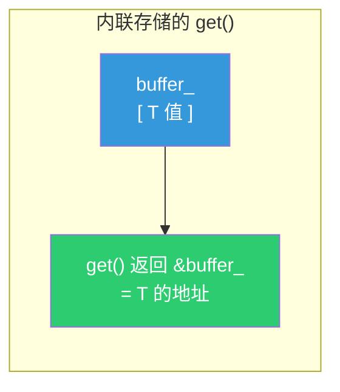
```mermaid
flowchart LR
    subgraph "内联存储的 get()"
        BUF["buffer_<br/>[ T 值 ]"]
        GET["get() 返回 &buffer_<br/>= T 的地址"]
        BUF --> GET
    end

    style BUF fill:#3498db,color:#fff
    style GET fill:#2ecc71,color:#fff
```

#### 堆存储 — `info_for_unique_ptr`

```cpp
template<typename T> using Ptr = std::unique_ptr<T>;
template<typename ExtraInfo, typename T>
inline constexpr AnyTypeInfo<ExtraInfo> info_for_unique_ptr = {
    // copy_construct: 深拷贝 — new T(**ptr)
    [](void *dst, const void *src) {
        new (dst) Ptr<T>(new T(**static_cast<const Ptr<T> *>(src)));
    },
    // move_construct: 移动构造新 unique_ptr（注意：这里也做了深拷贝而非移动！）
    [](void *dst, void *src) {
        new (dst) Ptr<T>(new T(std::move(**static_cast<Ptr<T> *>(src))));
    },
    // destruct: 销毁 unique_ptr，自动释放堆内存
    [](void *src) { std::destroy_at(static_cast<Ptr<T> *>(src)); },
    // get: 需要解引用 unique_ptr → 返回 &**ptr
    [](const void *src) -> const void * {
        return &**static_cast<const Ptr<T> *>(src);
    },
    ExtraInfo::template get<T>()
};
```

#### 堆存储函数逐行详解

堆存储时，`buffer_` 中存的是 `std::unique_ptr<T>`（即 `Ptr<T>`），`T` 的实际数据在堆上。

**1. `copy_construct`** — `[](void *dst, const void *src) { new (dst) Ptr<T>(new T(**static_cast<const Ptr<T> *>(src))); }`

```cpp
static_cast<const Ptr<T> *>(src)   // void* → const unique_ptr<T>* — 指向 buffer_ 中的 unique_ptr
*static_cast<const Ptr<T> *>(src)  // 解引用 — 得到 const unique_ptr<T>&
**static_cast<const Ptr<T> *>(src) // 二次解引用 — unique_ptr 的 operator* → 得到 const T&
new T(...)                         // 在堆上 new 一个 T，用拷贝构造函数
new (dst) Ptr<T>(new T(...))       // 在 dst 的 buffer_ 中 placement new 一个新的 unique_ptr，指向新 T
// 效果：深拷贝 — 源 unique_ptr 不变，目标获得全新的 unique_ptr → 新 T
```

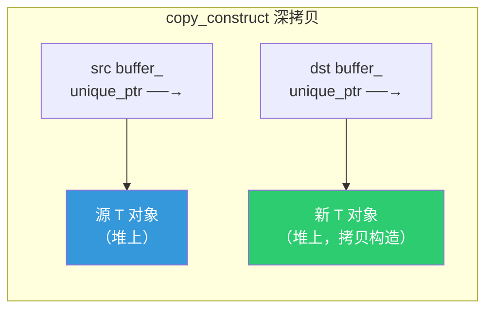
```mermaid
flowchart LR
    subgraph "copy_construct 深拷贝"
        SRC_BUF["src buffer_<br/>unique_ptr ──→"]
        SRC_T["源 T 对象<br/>（堆上）"]
        DST_BUF["dst buffer_<br/>unique_ptr ──→"]
        DST_T["新 T 对象<br/>（堆上，拷贝构造）"]
        
        SRC_BUF --> SRC_T
        DST_BUF --> DST_T
    end

    style SRC_T fill:#3498db,color:#fff
    style DST_T fill:#2ecc71,color:#fff
```

**2. `move_construct`** — `[](void *dst, void *src) { new (dst) Ptr<T>(new T(std::move(**static_cast<Ptr<T> *>(src)))); }`

```cpp
static_cast<Ptr<T> *>(src)              // void* → unique_ptr<T>*（非 const）
*static_cast<Ptr<T> *>(src)             // 解引用 — 得到 unique_ptr<T>&
**static_cast<Ptr<T> *>(src)            // 二次解引用 — 得到 T&
std::move(**static_cast<Ptr<T> *>(src)) // 转为 T&& — 标记为可移动
new T(std::move(...))                   // 在堆上 new T，用移动构造函数
new (dst) Ptr<T>(new T(std::move(...))) // 在 dst 中构造新 unique_ptr → 新 T
```

> **注意**：这里**不是**移动 `unique_ptr` 本身（那会让源 `unique_ptr` 变空），而是在堆上 `new` 一个新 T，用移动构造函数初始化。源 `unique_ptr` 仍然指向原对象（只是原对象处于移动后状态）。这是 `Any` 移动语义的设计选择——移动后的 `Any` 仍然"有值"，只是值处于移动后状态。

**3. `destruct`** — `[](void *src) { std::destroy_at(static_cast<Ptr<T> *>(src)); }`

```cpp
static_cast<Ptr<T> *>(src)         // void* → unique_ptr<T>*
std::destroy_at(...)               // 调用 unique_ptr 的析构函数
// unique_ptr 析构时自动 delete 其指向的 T 对象 → 堆内存释放
```

**4. `get`** — `[](const void *src) -> const void * { return &**static_cast<const Ptr<T> *>(src); }`

```cpp
static_cast<const Ptr<T> *>(src)   // void* → const unique_ptr<T>*
*static_cast<const Ptr<T> *>(src)  // 解引用 — 得到 const unique_ptr<T>&
**static_cast<const Ptr<T> *>(src) // 二次解引用 — unique_ptr::operator* → 得到 const T&
&**static_cast<const Ptr<T> *>(src) // 取地址 — 得到 const T*（堆上 T 的地址）
// 返回 const void* — 指向堆上的 T 对象
```

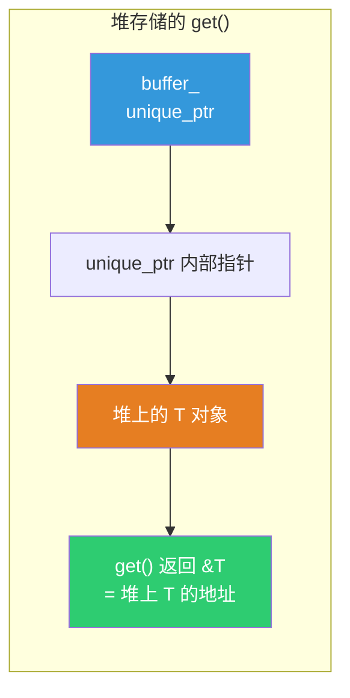
```mermaid
flowchart LR
    subgraph "堆存储的 get()"
        BUF["buffer_<br/>unique_ptr<T>"]
        PTR["unique_ptr 内部指针"]
        T_OBJ["堆上的 T 对象"]
        RESULT["get() 返回 &T<br/>= 堆上 T 的地址"]
        
        BUF --> PTR --> T_OBJ --> RESULT
    end

    style BUF fill:#3498db,color:#fff
    style T_OBJ fill:#e67e22,color:#fff
    style RESULT fill:#2ecc71,color:#fff
```

#### 内联 vs 堆存储函数对比

| 函数 | 内联存储 | 堆存储 |
|------|---------|--------|
| `copy_construct` | `new (dst) T(*src_T)` — 直接拷贝 | `new (dst) Ptr(new T(**src_ptr))` — 深拷贝 |
| `move_construct` | `new (dst) T(std::move(*src_T))` — 直接移动 | `new (dst) Ptr(new T(std::move(**src_ptr)))` — 堆上移动构造 |
| `destruct` | `destroy_at(src_T)` — 只调析构 | `destroy_at(src_ptr)` — 析构 unique_ptr → 自动 delete |
| `get` | `nullptr`（值就在 buffer_ 中） | `&**src_ptr`（需解引用 unique_ptr） |

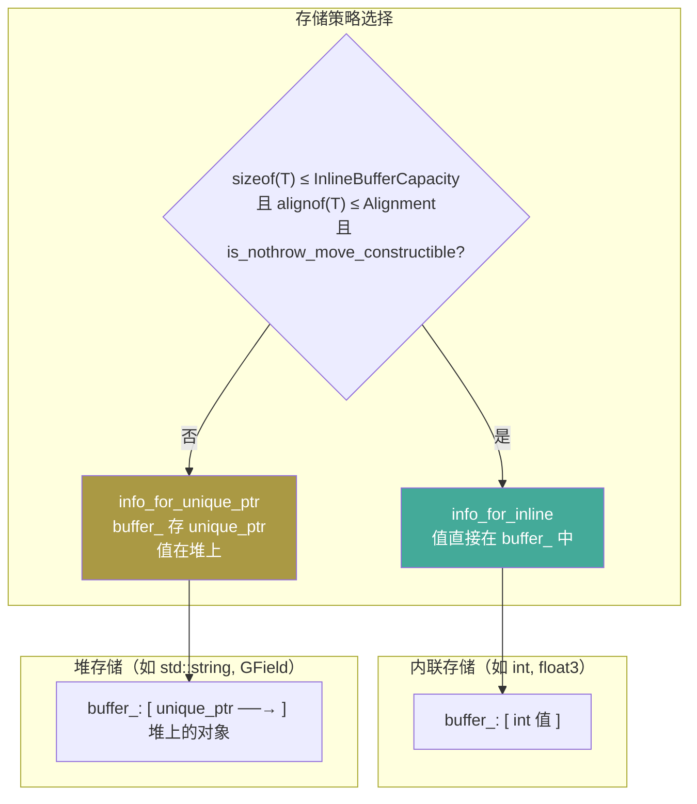
```mermaid
graph TB
    subgraph "存储策略选择"
        CHECK{"sizeof(T) ≤ InlineBufferCapacity<br/>且 alignof(T) ≤ Alignment<br/>且 is_nothrow_move_constructible?"}
        CHECK -->|"是"| INLINE["info_for_inline<br/>值直接在 buffer_ 中"]
        CHECK -->|"否"| HEAP["info_for_unique_ptr<br/>buffer_ 存 unique_ptr<br/>值在堆上"]
    end

    subgraph "内联存储（如 int, float3）"
        I_BUF["buffer_: [ int 值 ]"]
    end

    subgraph "堆存储（如 std::string, GField）"
        H_BUF["buffer_: [ unique_ptr ──→ ] 堆上的对象"]
    end

    INLINE --> I_BUF
    HEAP --> H_BUF

    style INLINE fill:#4a9,color:#fff
    style HEAP fill:#a94,color:#fff
```

> **为什么要求 `is_nothrow_move_constructible`？** `Any` 的移动构造函数声明为 `noexcept`。如果 `T` 的移动构造函数可能抛异常，`Any` 在内联存储时移动 `T` 也可能抛异常，违反 `noexcept` 保证。这会破坏容器优化——例如 `std::vector<Any>` 扩容时，如果元素移动可能抛异常，vector 必须用拷贝而非移动（更慢）。不满足此条件的类型只能走堆存储（`unique_ptr` 的移动是 `noexcept` 的）。

### 4.3 `+[](...)` — Lambda 到函数指针的转换

```cpp
+[](void *dst, const void *src) { new (dst) T(*static_cast<const T *>(src)); }
```

#### `+` 到底干了什么？

无捕获 lambda 有一个隐式转换运算符，可以转为函数指针：

```cpp
auto lambda = [](int x) { return x + 1; };
int (*fp)(int) = lambda;  // 隐式转换，OK

// + 强制显式转换：
auto fp2 = +lambda;       // 一元加法触发隐式转换 → 结果是函数指针，不是 lambda
```

`+` 是一元加法运算符，只能作用于数值/指针类型。lambda 不是指针，但可以隐式转为函数指针。`+lambda` 强制编译器执行这个转换——**结果类型从 lambda 变成了函数指针**。

#### 为什么需要 `+`？

`info_for_inline` 是 `inline constexpr` 变量，其类型是 `AnyTypeInfo<ExtraInfo>`——包含**函数指针**成员。如果初始化器是 lambda，类型不匹配（lambda ≠ 函数指针），编译失败。`+` 让初始化器变成函数指针，类型匹配。

```cpp
// ❌ 没有 +：lambda 类型 ≠ 函数指针
inline constexpr AnyTypeInfo<NoExtraInfo> info = {
    [](void *dst, const void *src) { ... },  // 类型是 lambda，不是 void(*)(void*, const void*)
    ...
};

// ✅ 有 +：lambda 转为函数指针
inline constexpr AnyTypeInfo<NoExtraInfo> info = {
    +[](void *dst, const void *src) { ... },  // 类型是 void(*)(void*, const void*)
    ...
};
```

#### 为什么用 lambda 而不直接写函数指针？

**lambda 更简洁**——它可以在初始化器中内联定义，无需单独声明函数：

```cpp
// 方式1：lambda + +（源码使用）
+[](void *dst, const void *src) { new (dst) T(*static_cast<const T *>(src)); }

// 方式2：单独定义函数（冗长）
template<typename T>
void copy_construct_fn(void *dst, const void *src) {
    new (dst) T(*static_cast<const T *>(src));
}
// 然后用 &copy_construct_fn<T>
```

方式2需要额外声明模板函数，代码更分散。lambda 把逻辑集中在初始化器中，更易读。

> **转成函数指针了，函数定义还在吗？** 在。`+[]` 的过程是：编译器生成一个普通函数（函数体就是 lambda 的 `{ ... }`），然后 `+` 取这个函数的地址得到函数指针。函数指针指向的代码就是 lambda 的函数体——定义还在，只是类型从 lambda 变成了函数指针。
>
> ```cpp
> +[](void *dst, const void *src) { new (dst) T(*static_cast<const T *>(src)); }
> // 等价于编译器生成了：
> void __generated_fn(void *dst, const void *src) {
>     new (dst) T(*static_cast<const T *>(src));
> }
> // 然后 + 取地址：&__generated_fn
> ```

#### 为什么 `info_for_unique_ptr` 没有用 `+`？

```cpp
// info_for_inline 用了 +
+[](void *dst, const void *src) { new (dst) T(*static_cast<const T *>(src)); },

// info_for_unique_ptr 没用 +
[](void *dst, const void *src) {
    new (dst) Ptr<T>(new T(**static_cast<const Ptr<T> *>(src)));
},
```

**因为 `info_for_unique_ptr` 的 lambda 永远不会是 `nullptr`**。`info_for_inline` 用三元运算符 `is_trivial ? nullptr : +[](...)`，两个分支必须是**同一类型**——`nullptr` 是 `nullptr_t`，`+[](...)` 是函数指针，两者都能转为 `void(*)(...)`。如果 lambda 没有 `+`，类型是 lambda class，无法和 `nullptr` 统一。

`info_for_unique_ptr` 没有条件分支——所有函数指针都非空。没有 `nullptr`，就不需要统一类型，lambda 可以隐式转为函数指针（在初始化 `AnyTypeInfo` 时自动转换）。但加上 `+` 也完全合法，只是多余。

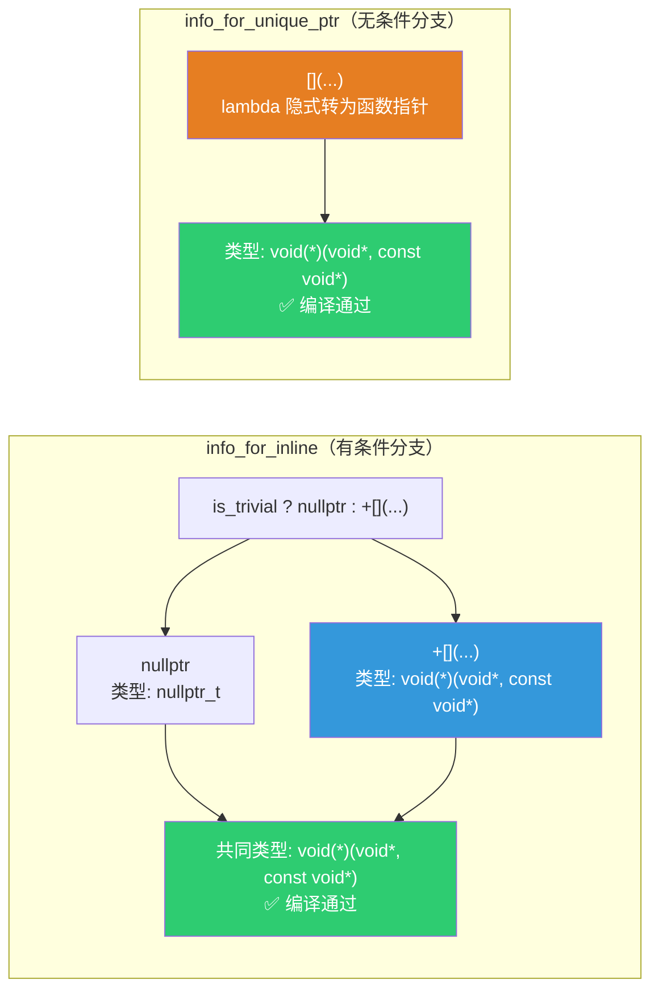
```mermaid
flowchart LR
    subgraph "info_for_inline（有条件分支）"
        COND["is_trivial ? nullptr : +[](...)"]
        NULL["nullptr<br/>类型: nullptr_t"]
        LAMBDA1["+[](...)<br/>类型: void(*)(void*, const void*)"]
        RESULT1["共同类型: void(*)(void*, const void*)<br/>✅ 编译通过"]
        
        COND --> NULL
        COND --> LAMBDA1
        NULL --> RESULT1
        LAMBDA1 --> RESULT1
    end

    subgraph "info_for_unique_ptr（无条件分支）"
        LAMBDA2["[](...)<br/>lambda 隐式转为函数指针"]
        RESULT2["类型: void(*)(void*, const void*)<br/>✅ 编译通过"]
        
        LAMBDA2 --> RESULT2
    end

    style LAMBDA1 fill:#3498db,color:#fff
    style LAMBDA2 fill:#e67e22,color:#fff
    style RESULT1 fill:#2ecc71,color:#fff
    style RESULT2 fill:#2ecc71,color:#fff
```

### 4.4 `is_trivially_xxx_extended_v` — 扩展的平凡判断

```cpp
// BLI_memory_utils.hh
template<typename T>
inline constexpr bool is_trivially_copy_constructible_extended_v =
    is_trivial_extended_v<T> || std::is_trivially_copy_constructible_v<T>;
```

比标准库多检查了 `is_trivial_v<T>`。某些类型（如某些聚合体）可能不是 `is_trivially_copy_constructible` 但却是 `is_trivial` 的，这个扩展覆盖了更多情况，让函数指针可以为 `nullptr`（即用 `memcpy` 代替）。

---

## 五、类型判断 — `is<T>()` 的巧妙实现

```cpp
template<typename T> bool is() const
{
    return info_ == &this->template get_info<T>();
}
```

**不比较类型名称或 RTTI，而是比较指针地址！** 每个类型 `T` 对应的 `AnyTypeInfo` 是一个 `inline constexpr` 静态变量，地址全局唯一。`info_` 存的就是这个地址，所以直接比指针即可判断类型。

> **为什么每个类型都对应一个？** 因为 `info_for_inline` 和 `info_for_unique_ptr` 是**模板变量**——每个不同的 `T` 实例化出不同的静态变量：
> ```cpp
> template<typename ExtraInfo, typename T>
> inline constexpr AnyTypeInfo<ExtraInfo> info_for_inline = { ... };
> ```
> 编译器为每个使用的 `T` 生成一个实例：
> ```cpp
> // 编译器生成的（简化）：
> AnyTypeInfo<NoExtraInfo> info_for_inline<NoExtraInfo, int> = { nullptr, nullptr, nullptr, nullptr, {} };
> AnyTypeInfo<NoExtraInfo> info_for_inline<NoExtraInfo, float> = { nullptr, nullptr, nullptr, nullptr, {} };
> AnyTypeInfo<NoExtraInfo> info_for_inline<NoExtraInfo, std::string> = { copy_fn, move_fn, destruct_fn, nullptr, {} };
> ```
> 每个实例在内存中有唯一地址，所以 `info_ == &info_for_inline<..., int>` 可以判断类型。

> **`is<T>()` 每次调用都生成新实例吗？** 不是。`info_for_inline<ExtraInfo, T>` 是 `inline constexpr` 变量——编译器保证**每个特化只有一个实例**，无论被引用多少次：
> ```cpp
> any1.is<int>();  // 引用 &info_for_inline<..., int>（第一次，生成实例）
> any2.is<int>();  // 引用 &info_for_inline<..., int>（同一个实例，不重新生成）
> any3.is<int>();  // 同上
> ```
> `is<T>()` 只是比较 `info_` 和一个**已存在的**静态变量的地址，零开销。

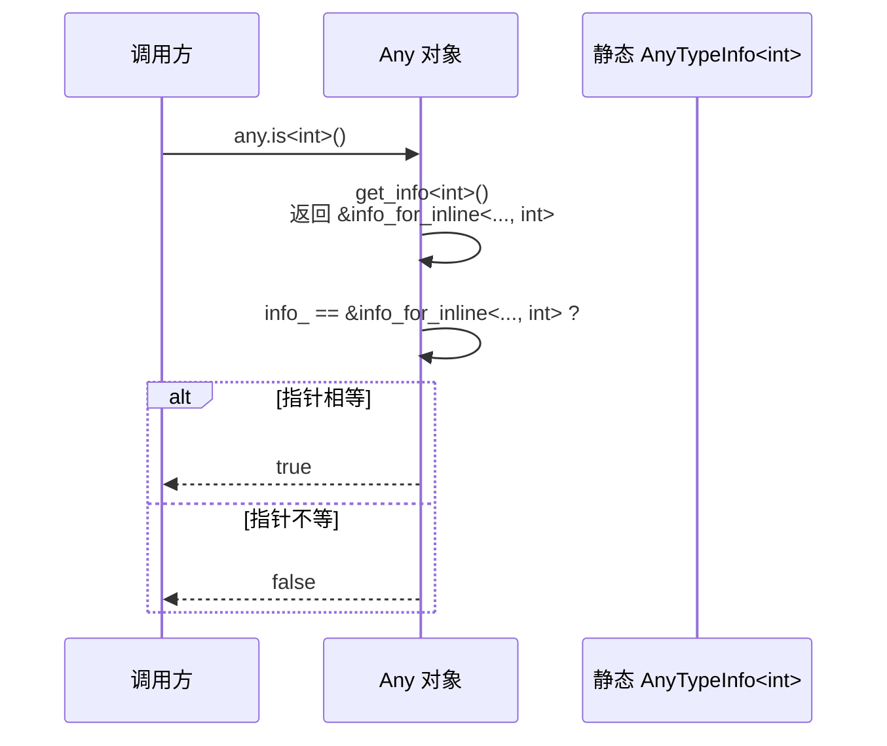
```mermaid
sequenceDiagram
    participant Code as 调用方
    participant Any as Any 对象
    participant VTable as 静态 AnyTypeInfo<int>

    Code->>Any: any.is<int>()
    Any->>Any: get_info<int>()<br/>返回 &info_for_inline<..., int>
    Any->>Any: info_ == &info_for_inline<..., int> ?
    alt 指针相等
        Any-->>Code: true
    else 指针不等
        Any-->>Code: false
    end
```

### 5.1 `this->template` — 依赖名消歧语法

`this->template get_info<T>()` 中的 `template` 关键字是 C++ 的**依赖名消歧**语法。在类模板 `Any<ExtraInfo, ...>` 中，`get_info<T>()` 是一个**依赖模板成员**——它的含义依赖于模板参数 `ExtraInfo`。编译器在解析时不知道 `get_info` 是模板还是变量，默认假设它不是模板（把 `<` 当作小于号）。`template` 关键字告诉编译器：`get_info` 是模板名，`<T>` 是模板参数列表，不是比较运算符。

```cpp
// ❌ 没有 template：编译器认为 get_info < T > 是比较表达式
return info_ == &this->get_info<T>();
// 编译器理解为：&(this->get_info) < T > (...)
//                ~~~~~~~~~~~~~~~~ < T  >  ~~~~~~
//                变量名        小于  大于  函数调用？

// ✅ 有 template：编译器知道 get_info 是模板
return info_ == &this->template get_info<T>();
// 编译器理解为：&(this->template get_info<T>)()
//                ~~~~~~~~~~~~~~~~~~~~~~~~~~~~
//                模板名 + 参数列表
```

> **为什么编译器不能自动识别？** 因为 C++ 的解析规则是"贪婪"的——在没有 `template` 提示时，编译器**必须**假设 `<` 是比较运算符。这不是编译器"不够聪明"，而是 C++ 语法本身的歧义：
> ```cpp
> // 假设有个成员变量叫 get_info，值为 3
> int get_info = 3;
> // 那么 this->get_info < T > (...)
> // = (this->get_info) < (T) > (...)  
> // = 3 < T > (...)  — 这是合法的比较表达式！
> ```
> 编译器在模板定义阶段**不知道** `get_info` 是变量还是模板名（因为外层模板参数还没确定），所以必须选一种解释。C++ 标准规定：默认假设不是模板名。`template` 关键字就是程序员给编译器的提示："这是模板名，别当比较运算符"。

> **变量名和模板名可以一样吗？** 可以。C++ 允许变量和模板同名——它们在不同的"命名空间"中：
> ```cpp
> template<typename T> struct foo {};  // 模板
> int foo = 42;                        // 变量，同名！
> foo<int> x;   // ✅ 编译器知道 foo<int> 是模板实例化
> int y = foo;  // ✅ 编译器知道 foo 是变量
> ```
> 所以在依赖上下文中，编译器**真的无法确定** `get_info` 是模板还是变量——两者都可能存在。

> **为什么为了罕见情况让语法变得繁琐？** 这是 C++ 的历史包袱。C++ 的模板语法设计于 1990 年代，当时 `<` 已经是比较运算符。后来加入模板时，`<T>` 与比较表达式产生歧义。C++ 标准委员会选择了**向后兼容**——不改变已有语法，而是加 `template` 消歧。为什么不用更清晰的语法（如 `get_info[[T]]()` 或 `get_info{T}()`）？因为这些是后来才有的语法特性，C++ 不能破坏已有代码。这是 C++ 最常被批评的设计问题之一。

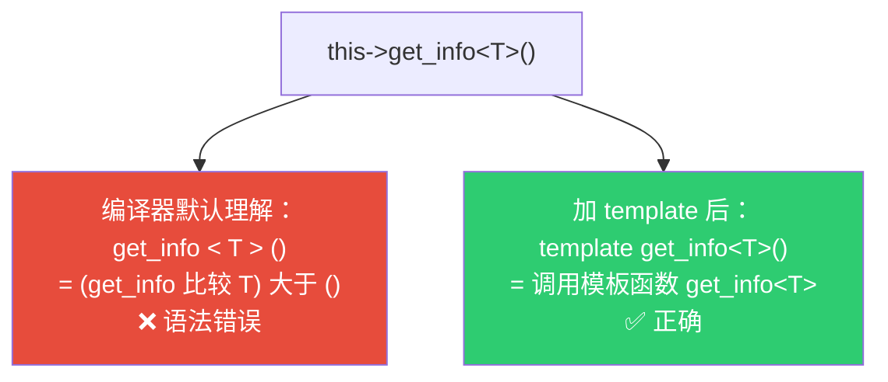
```mermaid
flowchart TD
    AMBIG["this-&gt;get_info&lt;T&gt;()"]
    WRONG["编译器默认理解：<br/>get_info &lt; T &gt; ()<br/>= (get_info 比较 T) 大于 ()<br/>❌ 语法错误"]
    RIGHT["加 template 后：<br/>template get_info&lt;T&gt;()<br/>= 调用模板函数 get_info&lt;T&gt;<br/>✅ 正确"]
    
    AMBIG --> WRONG
    AMBIG --> RIGHT

    style WRONG fill:#e74c3c,color:#fff
    style RIGHT fill:#2ecc71,color:#fff
```

> **什么时候需要 `template`？** 在**依赖上下文**中使用模板成员时——即在模板类/函数内部，访问的成员依赖于外层模板参数时。非依赖上下文不需要：
> ```cpp
> // 非依赖上下文 — 不需要 template
> std::vector<int> v;
> v.emplace_back(42);  // emplace_back 不依赖任何外层模板参数
>
> // 依赖上下文 — 需要 template
> template<typename T>
> void foo() {
>     T::template bar<int>();  // bar 依赖 T，需要 template
> }
> ```

---

## 六、核心操作流程

### 6.0 默认构造 — `Any() = default`

```cpp
Any() = default;
```

`= default` 让编译器生成默认构造函数。对 `Any` 的成员：

- `buffer_{}` — `{}` 初始化 → 零填充
- `extra = {}` — 默认初始化 → 空类型时 0 字节
- `info_ = nullptr` — 成员初始化器 → nullptr

结果：`buffer_` 全零，`info_` 为 `nullptr`——表示**空 Any**（不包含任何值）。`has_value()` 返回 `false`。

> **`Any<void, 32, 16, AnyExtraData>` 的 `info_` 是空吗？** 取决于状态：默认构造后 `info_ = nullptr`（空 Any）；`emplace<int>(42)` 后 `info_ = &info_for_inline<RealExtraInfo, int>`（指向 `int` 的静态函数表）。模板参数不同不影响 `info_` 的逻辑。

### 6.0.1 `is_same_any_v` — 防止模板构造函数劫持

```cpp
template<typename T> static constexpr bool is_same_any_v = std::is_same_v<std::decay_t<T>, Any>;
```

检查 `T` 是否就是 `Any` 本身。用于模板构造函数的约束：

```cpp
template<typename T>
Any(T &&value) requires(!is_same_any_v<T>)  // ← T 不能是 Any
    : Any(std::in_place_type<T>, std::forward<T>(value))
```

**为什么需要？** 如果没有这个约束，`Any a = other_any` 会匹配模板构造函数（`T = Any&` 或 `T = Any`），而非拷贝/移动构造函数。模板构造函数会用 `in_place_type<Any>` 构造——**嵌套 Any**，而非拷贝值：

```cpp
Any a(42);           // a 存 int
Any b = a;           // 期望：拷贝 a 的 int 到 b
// 没有 requires：匹配 Any(T&&)，T=Any& → b 存 Any(存 int) ← 嵌套！
// 有 requires：跳过模板，匹配 Any(const Any&) → b 存 int ✅
```

> **注释翻译**：`"Checks if #T is the same type as this #Any, because in this case the behavior of e.g. the assignment operator is different."` — 检查 T 是否与此 Any 是同一类型，因为在这种情况下赋值运算符的行为不同。

### 6.1 构造/赋值 — `emplace_on_empty`

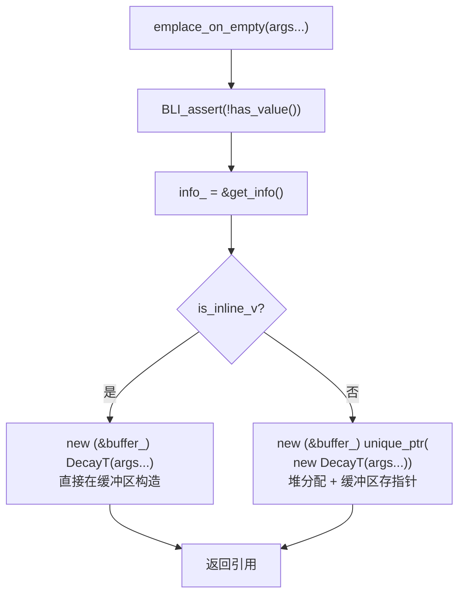
```mermaid
flowchart TD
    START["emplace_on_empty<T>(args...)"] --> ASSERT["BLI_assert(!has_value())"]
    ASSERT --> SET_INFO["info_ = &get_info<DecayT>()"]
    SET_INFO --> CHECK{"is_inline_v<DecayT>?"}
    CHECK -->|"是"| INLINE["new (&buffer_) DecayT(args...)<br/>直接在缓冲区构造"]
    CHECK -->|"否"| HEAP["new (&buffer_) unique_ptr<DecayT>(<br/>  new DecayT(args...))<br/>堆分配 + 缓冲区存指针"]
    INLINE --> RET["返回引用"]
    HEAP --> RET
```

### 6.2 复制构造

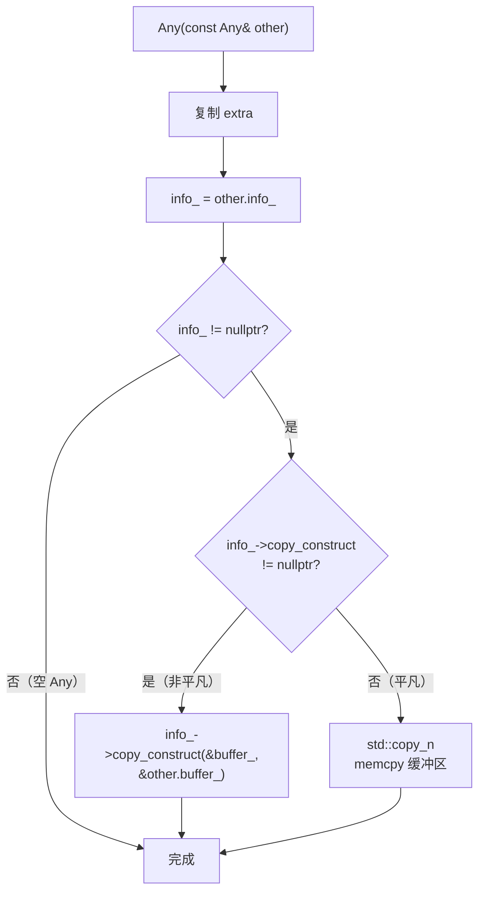
```mermaid
flowchart TD
    START["Any(const Any& other)"] --> COPY_EXTRA["复制 extra"]
    COPY_EXTRA --> COPY_INFO["info_ = other.info_"]
    COPY_INFO --> CHECK{"info_ != nullptr?"}
    CHECK -->|"否（空 Any）"| DONE["完成"]
    CHECK -->|"是"| CHECK2{"info_->copy_construct<br/>!= nullptr?"}
    CHECK2 -->|"是（非平凡）"| CALL["info_->copy_construct(&buffer_,<br/>&other.buffer_)"]
    CHECK2 -->|"否（平凡）"| MEMCPY["std::copy_n<br/>memcpy 缓冲区"]
    CALL --> DONE
    MEMCPY --> DONE
```

### 6.2.1 移动构造 — "moved-from state"

```cpp
// 源码注释：
// \note The #other #Any will not be empty afterwards if it was not before.
//       Just its value is in a moved-from state.
```

> **注释翻译**：移动后，源 `Any` **不会变空**（`info_` 不变），但它的**值处于移动后状态**。
>
> - 内联存储的 `int`：移动后值不确定（但 `info_` 仍指向 `int` 的函数表）
> - 内联存储的 `std::string`：移动后源字符串可能为空（但 `Any` 仍"有值"）
> - 堆存储：源 `unique_ptr` 仍指向原对象（只是原对象处于移动后状态）
>
> **为什么不变空？** `Any` 的移动构造函数只移动**值**（buffer 内容），不改变 `info_`：
> ```cpp
> Any(Any &&other) noexcept : extra(std::move(other.extra)), info_(other.info_)
> {
>     // info_ = other.info_ ← 源的 info_ 不变！
>     // other.info_ 仍然是原来的值，other.has_value() 仍为 true
> }
> ```
> 设 `info_ = nullptr` 需要额外一步操作，而且移动后的 Any 仍然可以被赋新值、被析构——它处于"有效但未指定"状态，这是 C++ 移动语义的标准约定（与 `std::string` 移动后源字符串仍"有效"同理）。
>
> **"值处于移动后状态"指什么？** 移动构造函数"偷走"了源对象的资源（如 `std::string` 的内部缓冲区），源对象变成一个**合法但值不确定**的对象。你可以安全地析构它或给它赋新值，但不应该读取它的值（结果未指定）。

### 6.2.2 拷贝和移动构造为什么有相同的 `std::copy_n` 分支？

```cpp
// 拷贝构造 (173-177)
else {
    std::copy_n(static_cast<const std::byte *>(other.buffer_.ptr()),
                RealInlineBufferCapacity,
                static_cast<std::byte *>(buffer_.ptr()));
}

// 移动构造 (191-195) — 完全一样！
else {
    std::copy_n(static_cast<const std::byte *>(other.buffer_.ptr()),
                RealInlineBufferCapacity,
                static_cast<std::byte *>(buffer_.ptr()));
}
```

这个 `else` 分支处理**平凡类型**（`copy_construct == nullptr` 或 `move_construct == nullptr`）。对平凡类型，拷贝 = 移动 = `memcpy`——逐字节复制即可。所以两个分支的代码完全一样。

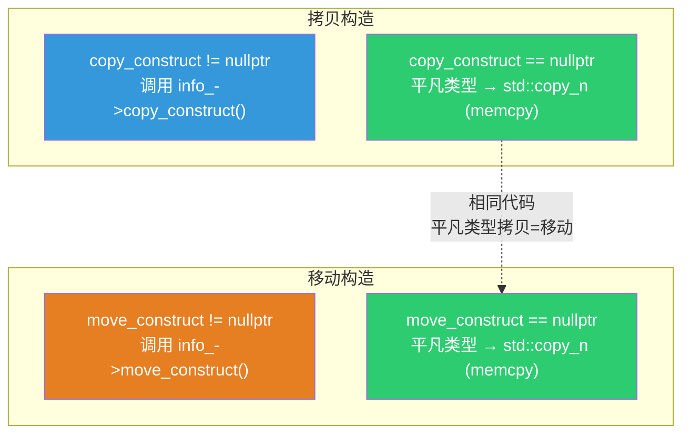
```mermaid
flowchart TD
    subgraph "拷贝构造"
        CC_NN["copy_construct != nullptr<br/>调用 info_->copy_construct()"]
        CC_NULL["copy_construct == nullptr<br/>平凡类型 → std::copy_n (memcpy)"]
    end
    subgraph "移动构造"
        MC_NN["move_construct != nullptr<br/>调用 info_->move_construct()"]
        MC_NULL["move_construct == nullptr<br/>平凡类型 → std::copy_n (memcpy)"]
    end
    
    CC_NULL -.->|"相同代码<br/>平凡类型拷贝=移动"| MC_NULL

    style CC_NN fill:#3498db,color:#fff
    style MC_NN fill:#e67e22,color:#fff
    style CC_NULL fill:#2ecc71,color:#fff
    style MC_NULL fill:#2ecc71,color:#fff
```

### 6.3 获取值 — `get<T>()`

```cpp
template<typename T> const T &get() const
{
    BLI_assert(this->is<T>());
    const void *buffer;
    if constexpr (is_inline_v<T>) {
        buffer = &buffer_;           // 内联：直接取缓冲区地址
    } else {
        BLI_assert(info_->get != nullptr);
        buffer = info_->get(&buffer_); // 堆上：解引用 unique_ptr
    }
    return *static_cast<const T *>(buffer);
}
```

注意 `if constexpr` 分支在编译期就确定了，**零运行时开销**。

### 6.4 析构

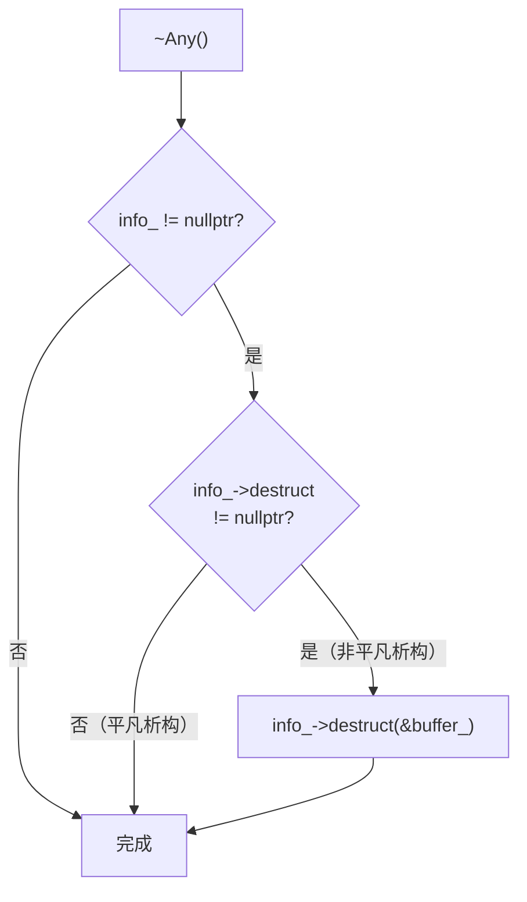
```mermaid
flowchart TD
    START["~Any()"] --> CHECK{"info_ != nullptr?"}
    CHECK -->|"否"| DONE["完成"]
    CHECK -->|"是"| CHECK2{"info_->destruct<br/>!= nullptr?"}
    CHECK2 -->|"是（非平凡析构）"| CALL["info_->destruct(&buffer_)"]
    CHECK2 -->|"否（平凡析构）"| DONE
    CALL --> DONE
```

### 6.5 赋值运算符 — `this->~Any()` 显式析构

```cpp
Any &operator=(const Any &other)
{
    if (this == &other) { return *this; }
    this->~Any();           // ← 显式调用析构函数
    new (this) Any(other);  // ← 在同一块内存上重新构造
    return *this;
}
```

**`this->~Any()`** 是显式调用析构函数——不等对象自然销毁，而是**立即**执行析构逻辑。这是 **destroy-and-construct** 模式：先析构旧值（释放旧资源），再在原位构造新值。

> **为什么写 `this->~Any()` 而非 `~Any()`？** `~Any()` 在非成员上下文中可能被编译器理解为**补运算符**（`~` 是按位取反）。`this->` 明确告诉编译器：这是成员析构函数调用。实际上在成员函数内部两者都能编译，但 `this->~Any()` 是更明确、更常见的写法。
>
> 显式调用析构函数不只有 `this->` 一种写法：
> ```cpp
> this->~Any();                          // ✅ 最常见
> this->Any::~Any();                     // ✅ 带类名限定
> Any::~Any();                           // ✅ 在成员函数内部
> Any<ExtraInfo, ...>::~Any();           // ✅ 带模板参数（复杂场景）
> ```
> `this->` 的好处是**不依赖类名**——如果类名改了或模板参数很长，`this->~Any()` 不需要改。

> **为什么必须显式调用？** 因为赋值运算符需要**先释放旧资源，再构造新值**。C++ 没有内置的"重新赋值"机制——你不能对一个已经构造的对象再次调用构造函数。显式析构 + placement new 是标准做法：
> ```cpp
> this->~Any();           // 1. 析构旧值（释放旧 string 的堆内存等）
> new (this) Any(other);  // 2. 在 this 位置构造新 Any（拷贝 other 的值）
> ```
> 如果不显式析构，旧值的资源（如 `std::string` 的堆内存）就泄漏了。

> **为什么不直接赋值成员？** 因为 `Any` 的赋值语义复杂——旧值可能需要析构，新值的类型可能不同（从 `int` 变成 `string`），需要不同的 `info_`。destroy-and-construct 一步到位：析构旧值 + 构造新值，逻辑清晰且不会遗漏。

### 6.6 `get` 函数指针为什么指定返回类型

```cpp
// 其他函数指针：返回 void，编译器自动推导
[](void *dst, const void *src) { new (dst) Ptr<T>(...); },  // 返回 void

// get 函数指针：必须显式指定 -> const void *
[](const void *src) -> const void * { return &**static_cast<const Ptr<T> *>(src); },
```

`&**static_cast<const Ptr<T> *>(src)` 的类型是 `const T*`，不是 `const void*`。lambda 的返回类型推导会得到 `const T*`，但 `AnyTypeInfo::get` 的声明是 `const void *(*)(const void *)`——类型不匹配。显式 `-> const void *` 让编译器做隐式转换（`const T*` → `const void*`，指针类型兼容）。

---

## 七、`allocate` — 延迟构造

```cpp
template<typename T> void *allocate_on_empty()
{
    BLI_assert(!this->has_value());
    info_ = &this->template get_info<T>();
    if constexpr (is_inline_v<T>) {
        return buffer_.ptr();  // 返回缓冲区原始指针
    } else {
        T *value = static_cast<T *>(::operator new(sizeof(T)));  // 原始堆分配
        new (&buffer_) std::unique_ptr<T>(value);
        return value;
    }
}
```

与 `emplace_on_empty` 不同，`allocate` **只分配内存，不调用构造函数**。调用者负责在返回的指针上 placement new 构造对象。这在性能敏感路径上很有用——可以先分配空间，稍后再构造。

---

## 八、ExtraInfo 机制

### 8.1 设计目的

`ExtraInfo` 允许为每个存储的类型附加编译期信息，嵌入在 `AnyTypeInfo` 中。

### 8.2 接口要求

```cpp
struct MyExtraInfo {
    template<typename T> static constexpr MyExtraInfo get() { return {...}; }
};
```

必须提供静态模板方法 `get<T>()`，返回基于类型 `T` 的附加信息。

### 8.3 SocketValueVariant 的使用

```cpp
struct AnyExtraData {
    Kind kind = Kind::None;                    // Single/Field/Grid/List
    eNodeSocketDatatype socket_type;           // SOCK_INT, SOCK_FLOAT, ...
};
```

这不是 `ExtraInfo`，而是 `ExtraData`（第四个模板参数）。`ExtraInfo` 在这里是 `void`（即 `NoExtraInfo`），而 `ExtraData` 利用 `[[no_unique_address]]` 藏在 padding 中。

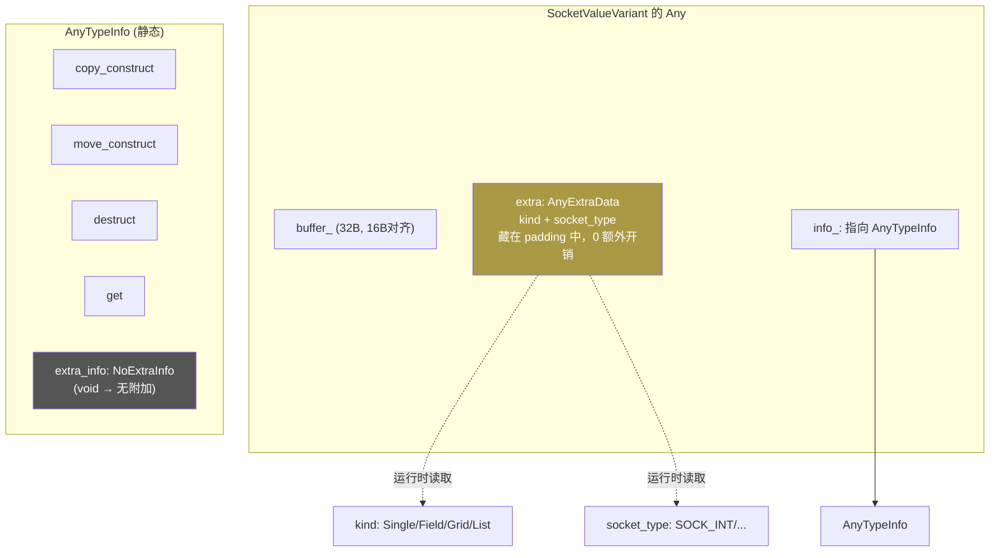
```mermaid
graph TB
    subgraph "SocketValueVariant 的 Any"
        BUF["buffer_ (32B, 16B对齐)"]
        ED["extra: AnyExtraData<br/>kind + socket_type<br/>藏在 padding 中，0 额外开销"]
        INFO["info_: 指向 AnyTypeInfo"]
    end
    subgraph "AnyTypeInfo (静态)"
        CC["copy_construct"]
        MC["move_construct"]
        DT["destruct"]
        GT["get"]
        EI["extra_info: NoExtraInfo<br/>(void → 无附加)"]
    end
    INFO --> VTABLE["AnyTypeInfo"]
    ED -.->|"运行时读取"| KIND["kind: Single/Field/Grid/List"]
    ED -.->|"运行时读取"| STYPE["socket_type: SOCK_INT/..."]

    style ED fill:#a94,color:#fff
    style EI fill:#555,color:#fff
```

### 8.4 ExtraInfo vs ExtraData 的区别

| | ExtraInfo | ExtraData |
|---|---|---|
| 模板参数位置 | 第 1 个 | 第 4 个 |
| 存储位置 | 嵌入 `AnyTypeInfo`（静态区） | 嵌入 `Any` 对象本身（栈/堆） |
| 初始化方式 | `ExtraInfo::get<T>()` 编译期 | 运行时赋值 |
| 生命周期 | 永久（静态变量） | 随 `Any` 对象 |
| 访问方式 | `extra_info()` | `extra` 成员 |
| 典型用途 | 类型的编译期属性 | 类型的运行时标签 |

---

## 九、与 `std::any` 的关键差异总结

```mermaid
graph TB
    subgraph "std::any"
        SA1["type_info / RTTI 识别类型"]
        SA2["any_cast<T> 访问<br/>类型不匹配抛 bad_any_cast"]
        SA3["固定内联缓冲区"]
        SA4["无附加信息"]
    end
    subgraph "blender::Any"
        BA1["指针地址比较识别类型<br/>无 RTTI 开销"]
        BA2["is<T>() + get<T>() 访问<br/>类型不匹配 = UB（debug assert）"]
        BA3["可配置内联缓冲区<br/>+ 自动降级为堆分配"]
        BA4["ExtraInfo + ExtraData<br/>零开销附加信息"]
    end
    SA1 -.->|对比| BA1
    SA2 -.->|对比| BA2
    SA3 -.->|对比| BA3
    SA4 -.->|对比| BA4

    style SA1 fill:#555,color:#fff
    style SA2 fill:#555,color:#fff
    style SA3 fill:#555,color:#fff
    style SA4 fill:#555,color:#fff
    style BA1 fill:#4a9,color:#fff
    style BA2 fill:#49a,color:#fff
    style BA3 fill:#a49,color:#fff
    style BA4 fill:#a94,color:#fff
```

---

## 十、赋值运算符的"重建"模式

```cpp
Any &operator=(const Any &other)
{
    if (this == &other) return *this;
    this->~Any();          // 先析构当前值
    new (this) Any(other); // placement new 复制构造
    return *this;
}
```

赋值不是"先析构再构造新值"，而是**先调用析构函数，再在原地址 placement new**。这种模式避免了实现 `assign` 逻辑，复用了拷贝构造函数。所有赋值运算符都采用这种"destroy + reconstruct"模式。

---

## 十一、完整生命周期示例

```cpp
// 1. 构造空 Any
Any<void, 32, 16> a;          // info_ = nullptr, buffer_ 未初始化

// 2. 赋值 int（内联存储）
a = 42;
// → info_ = &info_for_inline<NoExtraInfo, int>
// → buffer_ 中直接存 int(42)

// 3. 赋值 std::string（堆存储）
a = std::string("hello");
// → info_ = &info_for_unique_ptr<NoExtraInfo, std::string>
// → buffer_ 中存 unique_ptr<string> → 堆上的 "hello"

// 4. 类型检查
a.is<int>();           // false
a.is<std::string>();   // true

// 5. 获取值
const std::string &s = a.get<std::string>();  // "hello"

// 6. 析构
// ~Any() → info_->destruct(&buffer_) → destroy_at(unique_ptr) → 释放堆内存
```

```mermaid
sequenceDiagram
    participant User
    participant AnyObj as Any 对象
    participant Buffer as buffer_
    participant Heap as 堆内存
    participant VTable as AnyTypeInfo

    User->>AnyObj: Any a 空对象
    Note over AnyObj: info_ = nullptr

    User->>AnyObj: a = 42
    AnyObj->>VTable: get_info<int>() → &info_for_inline
    AnyObj->>Buffer: new (&buffer_) int(42)
    Note over AnyObj: info_ = &info_for_inline<..., int>

    User->>AnyObj: a = string("hello")
    AnyObj->>AnyObj: ~Any() → 析构 int（平凡，无操作）
    AnyObj->>VTable: get_info<string>() → &info_for_unique_ptr
    AnyObj->>Heap: new string("hello")
    AnyObj->>Buffer: new (&buffer_) unique_ptr(heap_ptr)
    Note over AnyObj: info_ = &info_for_unique_ptr<..., string>

    User->>AnyObj: a.get<string>()
    AnyObj->>Buffer: info_->get(&buffer_) → 解引用 unique_ptr
    Buffer-->>AnyObj: 堆上 string 的地址
    AnyObj-->>User: const string& → "hello"

    User->>AnyObj: ~Any()
    AnyObj->>Buffer: info_->destruct → destroy_at(unique_ptr)
    Buffer->>Heap: unique_ptr 析构 → delete string
```
