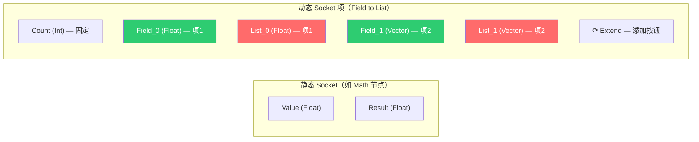
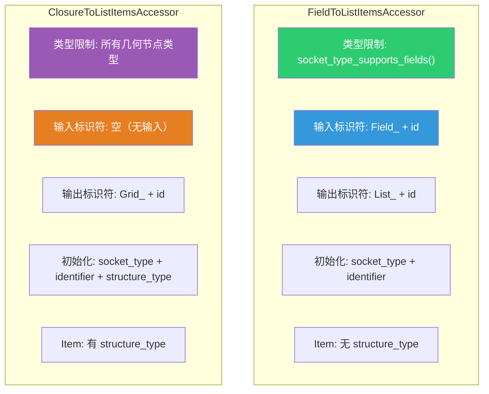
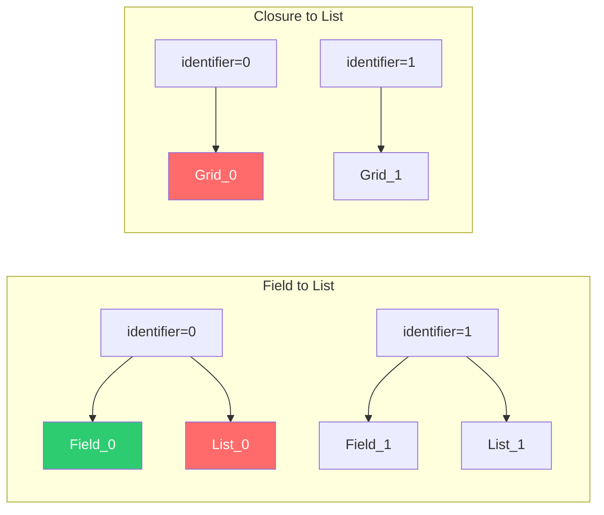

# SocketItemsAccessor 动态 Socket 模式

> 📖 系列文档：[目录](01-列表系统架构与核心数据结构.md) | [上一篇](03-SocketValueVariant与列表集成.md) | [下一篇](05-ListLength与JoinList节点.md)
> 源码文件：[NOD_socket_items.hh](../../source/blender/nodes/NOD_socket_items.hh)、[NOD_geo_field_to_list.hh](../../source/blender/nodes/geometry/include/NOD_geo_field_to_list.hh)、[NOD_geo_closure_to_list.hh](../../source/blender/nodes/geometry/include/NOD_geo_closure_to_list.hh)

---

## 目录

1. [为什么需要动态 Socket](#1-为什么需要动态-socket)
2. [SocketItemsAccessorDefaults — 默认配置](#2-socketitemsaccessordefaults--默认配置)
3. [Accessor 必须实现的接口](#3-accessor-必须实现的接口)
4. [FieldToListItemsAccessor 详解](#4-fieldtolistitemsaccessor-详解)
5. [ClosureToListItemsAccessor 详解](#5-closuretolistitemsaccessor-详解)
6. [两个 Accessor 的对比](#6-两个-accessor-的对比)
7. [Accessor 驱动的节点基础设施](#7-accessor-驱动的节点基础设施)
8. [Socket 标识符命名规则](#8-socket-标识符命名规则)

---

## 1. 为什么需要动态 Socket

普通节点的 Socket 在编译期就确定了。但 Field to List 和 Closure to List 需要用户**动态添加/删除输出项**，每个项对应一对输入-输出 Socket。



SocketItemsAccessor 模式将动态 Socket 的通用逻辑（添加/删除/排序/序列化/UI）抽象为模板参数化的框架，节点只需提供一个 Accessor 结构体即可复用所有基础设施。

---

## 2. SocketItemsAccessorDefaults — 默认配置

```cpp
struct SocketItemsAccessorDefaults {
  static constexpr bool has_single_identifier_str = true;
  static constexpr bool has_name_validation = false;
  static constexpr bool has_custom_initial_name = false;
  static constexpr bool has_vector_dimensions = false;
  static constexpr bool can_have_empty_name = false;
  static constexpr char unique_name_separator = '.';
};
```

| 字段 | 默认值 | 含义 |
|------|--------|------|
| `has_single_identifier_str` | `true` | 输入输出是否共用一个标识符 |
| `has_name_validation` | `false` | 是否验证名称格式 |
| `has_custom_initial_name` | `false` | 是否自定义初始名称 |
| `has_vector_dimensions` | `false` | 是否支持向量维度 |
| `can_have_empty_name` | `false` | 是否允许空名称 |
| `unique_name_separator` | `'.'` | 唯一名称分隔符 |

> **`has_single_identifier_str = true`** 被两个列表 Accessor 都覆盖为 `false`，因为它们的输入和输出 Socket 有不同的标识符前缀（如 `"Field_"` 和 `"List_"`）。

---

## 3. Accessor 必须实现的接口

### 核心接口

| 方法 | 用途 | 必须实现 |
|------|------|---------|
| `using ItemT = ...` | 项的类型 | ✅ |
| `item_srna` | RNA 类型（用于属性面板） | ✅ |
| `node_idname` | 节点 ID 名称 | ✅ |
| `has_type` | 项是否有数据类型 | ✅ |
| `has_name` | 项是否有名称 | ✅ |
| `get_items_from_node()` | 从节点获取项数组 | ✅ |
| `copy_item()` | 拷贝项 | ✅ |
| `destruct_item()` | 析构项 | ✅ |
| `get_socket_type()` | 获取项的数据类型 | ✅ |
| `supports_socket_type()` | 判断是否支持某种类型 | ✅ |
| `get_name()` | 获取项名称指针 | ✅ |
| `init_with_socket_type_and_name()` | 初始化新项 | ✅ |
| `input_socket_identifier_for_item()` | 输入 Socket 标识符 | ✅ |
| `output_socket_identifier_for_item()` | 输出 Socket 标识符 | ✅ |
| `blend_write_item()` | .blend 文件写入 | ✅ |
| `blend_read_data_item()` | .blend 文件读取 | ✅ |

### 操作 ID 和 UI ID

```cpp
struct operator_idnames {
  static constexpr StringRefNull add_item = "...";
  static constexpr StringRefNull remove_item = "...";
  static constexpr StringRefNull move_item = "...";
};

struct ui_idnames {
  static constexpr StringRefNull list = "...";
};

struct rna_names {
  static constexpr StringRefNull items = "...";
  static constexpr StringRefNull active_index = "...";
};
```

这些 ID 用于注册 Blender 操作符（Operator）和 UI 列表，支持撤销/重做。

---

## 4. FieldToListItemsAccessor 详解

```cpp
struct FieldToListItemsAccessor : public socket_items::SocketItemsAccessorDefaults {
  using ItemT = GeometryNodeFieldToListItem;
  static StructRNA **item_srna;
  static constexpr StringRefNull node_idname = "GeometryNodeFieldToList";
  static constexpr bool has_type = true;
  static constexpr bool has_name = true;
  static constexpr bool has_single_identifier_str = false;  // ← 覆盖默认值
```

### 类型限制

```cpp
static bool supports_socket_type(const eNodeSocketDatatype socket_type, const int /*ntree_type*/)
{
  return socket_type_supports_fields(socket_type);  // 只支持字段兼容类型
}
```

支持的类型：Float、Int、Vector、Color、Boolean、Quaternion、Matrix 等数值类型。
**不支持**：Geometry、String、Object、Collection、Volume Grid 等。

> **为什么？** Field to List 的输入是字段（Field），而字段只能产生数值类型。Geometry 和 String 不能作为字段输出。

### Socket 标识符

```cpp
static std::string input_socket_identifier_for_item(const GeometryNodeFieldToListItem &item)
{
  return "Field_" + std::to_string(item.identifier);
}

static std::string output_socket_identifier_for_item(const GeometryNodeFieldToListItem &item)
{
  return "List_" + std::to_string(item.identifier);
}
```

### 项初始化

```cpp
static void init_with_socket_type_and_name(bNode &node,
                                           GeometryNodeFieldToListItem &item,
                                           const eNodeSocketDatatype socket_type,
                                           const char *name)
{
  auto *storage = static_cast<GeometryNodeFieldToList *>(node.storage);
  item.socket_type = socket_type;
  item.identifier = storage->next_identifier++;  // 递增唯一标识符
  socket_items::set_item_name_and_make_unique<FieldToListItemsAccessor>(node, item, name);
}
```

> **`next_identifier++`**：后缀递增——先返回当前值，再递增。确保每个项有唯一的数字标识符，即使项被删除后添加新项，标识符也不会重复。

---

## 5. ClosureToListItemsAccessor 详解

```cpp
struct ClosureToListItemsAccessor : public socket_items::SocketItemsAccessorDefaults {
  using ItemT = GeometryNodeClosureToListItem;
  static constexpr StringRefNull node_idname = "GeometryNodeClosureToList";
  static constexpr bool has_single_identifier_str = false;  // ← 覆盖默认值
```

### 与 FieldToList 的关键差异

#### 差异 1：类型限制更宽松

```cpp
static bool supports_socket_type(const eNodeSocketDatatype socket_type, const int ntree_type)
{
  return bke::node_tree_type_supports_socket_type_static(ntree_type, socket_type);
  // 支持所有几何节点类型！包括 Geometry、String、Volume Grid 等
}
```

#### 差异 2：无输入 Socket 标识符

```cpp
static std::string input_socket_identifier_for_item(
    const GeometryNodeClosureToListItem & /*item*/)
{
  return {};  // 空字符串 — 没有对应的输入 Socket
}
```

> **为什么没有输入 Socket？** Closure to List 的输入是闭包（Closure），不是每个项独立的字段。闭包的输出项与节点的动态输出项对应，但输入只有一个 Closure Socket。

#### 差异 3：输出标识符使用 "Grid_" 前缀

```cpp
static std::string output_socket_identifier_for_item(const GeometryNodeClosureToListItem &item)
{
  return "Grid_" + std::to_string(item.identifier);
}
```

> **历史遗留**：`"Grid_"` 前缀可能是开发过程中的临时命名。功能上不影响，因为标识符只需要唯一。

#### 差异 4：初始化时设置 structure_type

```cpp
static void init_with_socket_type_and_name(bNode &node,
                                           GeometryNodeClosureToListItem &item,
                                           const eNodeSocketDatatype socket_type,
                                           const char *name)
{
  auto *storage = static_cast<GeometryNodeClosureToList *>(node.storage);
  item.socket_type = socket_type;
  item.identifier = storage->next_identifier++;
  item.structure_type = NodeSocketInterfaceStructureType::Single;  // ← 额外设置
  socket_items::set_item_name_and_make_unique<ClosureToListItemsAccessor>(node, item, name);
}
```

> **默认为 Single**：新添加的输出项默认输出单值。用户可以在属性面板中修改为 Field 或 List。

---

## 6. 两个 Accessor 的对比



| 特性 | FieldToList | ClosureToList |
|------|-------------|---------------|
| Item 类型 | `GeometryNodeFieldToListItem` | `GeometryNodeClosureToListItem` |
| 有输入 Socket | ✅ `Field_` 前缀 | ❌ 空字符串 |
| 输出 Socket 前缀 | `List_` | `Grid_` |
| 类型限制 | 仅字段兼容类型 | 所有几何节点类型 |
| Item 有 structure_type | ❌ | ✅ |
| 初始化设置 | socket_type + identifier | socket_type + identifier + structure_type |

---

## 7. Accessor 驱动的节点基础设施

Accessor 不仅定义了数据访问接口，还驱动了节点的许多通用功能：

### 节点声明（Socket 创建）

```cpp
// 在 node_declare 中，遍历所有项创建 Socket
const Span<GeometryNodeFieldToListItem> items(storage.items, storage.items_num);
for (const int i : items.index_range()) {
  const std::string input_id = ItemsAccessor::input_socket_identifier_for_item(items[i]);
  const std::string output_id = ItemsAccessor::output_socket_identifier_for_item(items[i]);
  b.add_input(type, name, UString(input_id)).structure_type(StructureType::Field);
  b.add_output(type, name, UString(output_id)).structure_type(StructureType::List);
}
```

### UI 面板

```cpp
socket_items::ui::draw_items_list_with_operators<ItemsAccessor>(C, panel, tree, node);
socket_items::ui::draw_active_item_props<ItemsAccessor>(tree, node, [&](PointerRNA *item_ptr) {
  panel->prop(item_ptr, "socket_type", UI_ITEM_NONE, std::nullopt, ICON_NONE);
});
```

### 节点操作符

```cpp
socket_items::ops::make_common_operators<ItemsAccessor>();
```

自动注册添加/删除/移动操作符，支持撤销/重做。

### 链接插入

```cpp
static bool node_insert_link(bke::NodeInsertLinkParams &params)
{
  return socket_items::try_add_item_via_any_extend_socket<ItemsAccessor>(
      params.ntree, params.node, params.node, params.link);
}
```

当用户拖拽连线到 Extend Socket 时，自动添加新项。

### .blend 文件序列化

```cpp
socket_items::blend_write<ItemsAccessor>(&writer, node);
socket_items::blend_read_data<ItemsAccessor>(&reader, node);
```

### 存储管理

```cpp
static void node_free_storage(bNode *node)
{
  socket_items::destruct_array<ItemsAccessor>(*node);
  MEM_delete_void(node->storage);
}

static void node_copy_storage(bNodeTree *, bNode *dst_node, const bNode *src_node)
{
  auto *dst_storage = MEM_new<GeometryNodeFieldToList>(__func__, src_storage);
  dst_node->storage = dst_storage;
  socket_items::copy_array<ItemsAccessor>(*src_node, *dst_node);
}
```

---

## 8. Socket 标识符命名规则

标识符是 Socket 的内部名称，用于在节点存储和 Socket 之间建立映射。



### 标识符的唯一性保证

```cpp
item.identifier = storage->next_identifier++;
```

`next_identifier` 是递增计数器，**永不回退**。即使删除了 identifier=2 的项，下一个新项的 identifier 也是 3，不会重用 2。这确保了：

1. **动画关键帧不失效**：如果标识符被重用，之前设置的动画关键帧会错误地应用到新项
2. **链接不断裂**：其他节点连接到 `Field_2`，如果 identifier 2 被重用，连接可能指向错误的新项
3. **撤销/重做安全**：标识符在操作历史中保持一致

### 内部链接（Internally Linked Input）

```cpp
static const bNodeSocket *node_internally_linked_input(const bNodeTree &,
                                                       const bNode &node,
                                                       const bNodeSocket &output_socket)
{
  return node.input_by_identifier(output_socket.identifier_ustr());
}
```

> **内部链接**：当输出 Socket 没有外部连接时，Blender 可能会创建"内部链接"——将输出直接连接到对应的输入。对于 Field to List，`List_0` 输出的内部链接指向 `Field_0` 输入。这使得在禁用节点时，数据能正确地从输入传递到输出。
