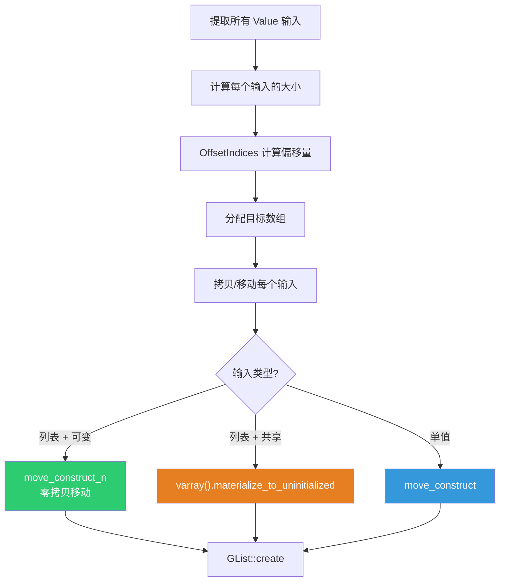
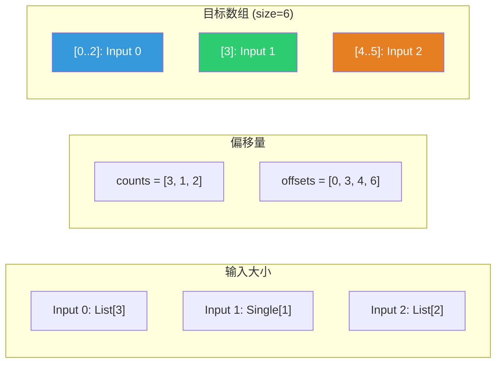
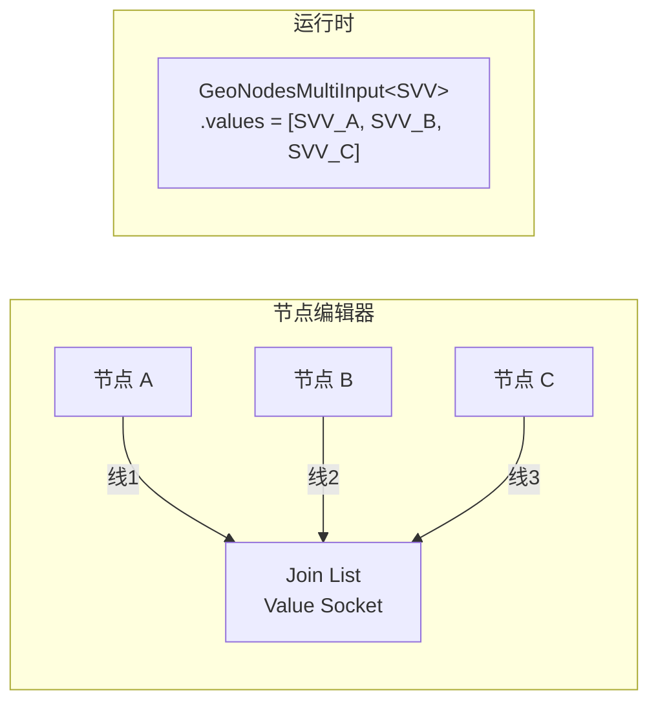

# List Length 与 Join List 节点

> 📖 系列文档：[目录](01-列表系统架构与核心数据结构.md) | [上一篇](04-SocketItemsAccessor动态Socket模式.md) | [下一篇](06-GetListItem节点.md)
> 源码文件：[node_geo_list_length.cc](../../source/blender/nodes/geometry/nodes/node_geo_list_length.cc)、[node_geo_join_list.cc](../../source/blender/nodes/geometry/nodes/node_geo_join_list.cc)

---

## 目录

1. [List Length 节点](#1-list-length-节点)
2. [Join List 节点](#2-join-list-节点)

---

## 1. List Length 节点

**节点 ID**：`GeometryNodeListLength`
**功能**：返回列表的元素数量
**复杂度**：⭐（最简单的列表节点）

### 1.1 节点声明

```cpp
static void node_declare(NodeDeclarationBuilder &b)
{
  const bNode *node = b.node_or_null();
  if (node != nullptr) {
    const eNodeSocketDatatype type = eNodeSocketDatatype(node->custom1);
    b.add_input(type, "List"_ustr).structure_type(StructureType::List).hide_value();
  }
  b.add_output<decl::Int>("Length"_ustr);
}
```

> **`node->custom1`**：使用节点的自定义整数属性存储数据类型，而非 `node->storage`。简单节点用 `custom1/custom2`，复杂节点用 `storage`。

> **`b.node_or_null()`**：声明阶段节点可能还不存在（如首次注册时）。必须检查 `nullptr`。

### 1.2 执行逻辑

```cpp
static void node_geo_exec(GeoNodeExecParams params)
{
  auto list = params.extract_input<GListPtr>("List"_ustr);
  if (!list) {
    params.set_default_remaining_outputs();
    return;
  }
  params.set_output("Length"_ustr, int(list->size()));
}
```

> **`int(list->size())`**：`GList::size()` 返回 `int64_t`，Socket 输出类型是 `int`（32位）。

> **空列表检查**：`!list` 为 true 时，`GListPtr` 内部的 `ImplicitSharingPtr` 为空（默认构造）。这通常意味着上游没有连接或输出了空值。

### 1.3 数据类型选择 UI

```cpp
static void node_layout(ui::Layout &layout, bContext * /*C*/, PointerRNA *ptr)
{
  layout.prop(ptr, "data_type", UI_ITEM_NONE, "", ICON_NONE);
}
```

```cpp
RNA_def_node_enum(
    srna, "data_type", "Data Type", "",
    rna_enum_node_socket_data_type_items,
    NOD_inline_enum_accessors(custom1),  // 直接映射到 custom1
    SOCK_GEOMETRY);  // 默认值
```

> **`NOD_inline_enum_accessors(custom1)`**：生成直接读写 `custom1` 的 getter/setter。与 `NOD_storage_enum_accessors`（读写 `storage`）不同。

> **`SOCK_GEOMETRY` 默认值**：Geometry 是最常用的列表元素类型之一。

### 1.4 链接搜索

```cpp
class SocketSearchOp {
 public:
  UString socket_name;
  eNodeSocketDatatype socket_type;
  void operator()(LinkSearchOpParams &params)
  {
    bNode &node = params.add_node("GeometryNodeListLength"_ustr);
    node.custom1 = socket_type;
    params.update_and_connect_available_socket(node, socket_name);
  }
};
```

> **`SocketSearchOp`**：函数对象（Functor）。当用户从搜索菜单选择时，创建节点、设置类型、连接 Socket。

---

## 2. Join List 节点

**节点 ID**：`GeometryNodeJoinList`
**功能**：将多个列表和/或单值拼接为一个列表
**复杂度**：⭐⭐

### 2.1 节点声明

```cpp
static void node_declare(NodeDeclarationBuilder &b)
{
  b.use_custom_socket_order();
  b.allow_any_socket_order();
  b.add_default_layout();

  const bNode *node = b.node_or_null();
  if (node != nullptr) {
    const eNodeSocketDatatype type = eNodeSocketDatatype(node->custom1);
    b.add_input(type, "Value"_ustr)
        .multi_input()                          // ← 多输入 Socket
        .hide_value()
        .structure_type(StructureType::Dynamic); // ← 接受单值或列表
  }
  if (node != nullptr) {
    const eNodeSocketDatatype type = eNodeSocketDatatype(node->custom1);
    b.add_output(type, "List"_ustr).structure_type(StructureType::List).align_with_previous();
  }
}
```

> **`.multi_input()`**：声明多输入 Socket，可以连接多条线。

> **`.structure_type(StructureType::Dynamic)`**：Value 输入接受单值或列表。

> **`b.add_default_layout()`**：使用默认布局（输入在左，输出在右）。

### 2.2 核心执行逻辑



### 2.3 OffsetIndices — 偏移量计算

```cpp
Array<int, 16> size_offset_data(inputs.values.size() + 1);
for (const int i : inputs.values.index_range()) {
  if (inputs.values[i].is_list()) {
    size_offset_data[i] = inputs.values[i].get<GListPtr>()->size();
  }
  else if (inputs.values[i].is_single()) {
    size_offset_data[i] = 1;
  }
  else {
    params.set_default_remaining_outputs();
    return;
  }
}

const OffsetIndices offsets = offset_indices::accumulate_counts_to_offsets(size_offset_data);
const int64_t size = offsets.total_size();
```



> **`Array<int, 16>`**：小数组优化（Small Buffer Optimization, SBO）。第二个模板参数 `16` 是内联缓冲区大小——当元素数 ≤ 16 时，数据直接存储在栈上的内联缓冲区中，不需要堆分配；超过 16 时才回退到堆分配。
>
> **优点**：①**避免堆分配**：堆分配（`malloc`/`new`）需要锁、遍历空闲列表、更新元数据，可能比栈分配慢 100 倍以上；②**缓存友好**：栈数据在当前函数的栈帧中，与局部变量在同一个缓存行；③**无碎片**：不产生堆碎片。Join List 节点通常只有几到十几个输入，16 个元素的缓冲区足够覆盖绝大多数情况。

> **`offsets.total_size()`**：最后一个偏移值，即总大小。

### 2.4 分配目标数组

```cpp
const CPPType &cpp_type = *bke::socket_type_to_geo_nodes_base_cpp_type(socket_type);
GList::ArrayData array_data = GList::ArrayData::ForUninitialized(cpp_type, size);
GMutableSpan dst_list_data(cpp_type, const_cast<void *>(array_data.data), size);
```

> **`socket_type_to_geo_nodes_base_cpp_type(socket_type)`**：将 Socket 类型枚举（如 `SOCK_FLOAT`）映射到对应的 `CPPType`（如 `CPPType::get<float>()`）。这是 Socket 类型系统与 CPPType 运行时类型系统之间的桥梁。实现是一个 `switch` 语句，常见类型直接返回（`SOCK_FLOAT` → `float`，`SOCK_INT` → `int`），不常见的走慢路径 `slow_socket_type_to_geo_nodes_base_cpp_type`（查找 `bNodeSocketType` 的 `base_cpp_type` 字段）。
>
> **为什么叫 "base" cpp_type？** 因为有些 Socket 类型在几何节点中有"基础类型"的概念。例如 `SOCK_VECTOR` 的基础类型是 `float3`，`SOCK_RGBA` 的基础类型是 `ColorGeometry4f`。这些是几何节点实际操作的 C++ 类型，与 Socket 的 UI 类型不一定相同。

> **`GList::ArrayData::ForUninitialized(cpp_type, size)`**：分配一块足够容纳 `size` 个元素的内存，但**不初始化**。返回的 `ArrayData` 包含 `data`（内存指针）和 `sharing_info`（隐式共享信息）。
>
> **为什么用 ForUninitialized 而非 ForDefaultValue？** 因为接下来会逐个移动/拷贝数据到这块内存中，初始化是浪费——默认构造的值马上就被覆盖了。省掉 `default_construct_n` 调用，对于 `std::string` 等非平凡类型可以省掉大量无用构造。

> **`const_cast<void*>(array_data.data)`**：`ArrayData::data` 是 `const void*`（因为 `ArrayData` 设计为只读视图），但 `GMutableSpan` 需要 `void*`（可变指针）。`const_cast` 移除 const，因为我们刚分配了这块内存，确实拥有写权限。

### 2.5 移动语义优化

```cpp
for (const int i : inputs.values.index_range()) {
  GMutableSpan dst = dst_list_data.slice(offsets[i]);

  if (inputs.values[i].is_list()) {
    const GListPtr list = inputs.values[i].get<GListPtr>();

    if (const auto *src_array_data = std::get_if<GList::ArrayData>(&list->data())) {
      if (list->is_mutable() && src_array_data->sharing_info->is_mutable()) {
        // 列表是唯一所有者 → 移动数据（零拷贝）
        cpp_type.move_construct_n(
            const_cast<void *>(src_array_data->data), dst.data(), dst.size());
        continue;
      }
    }

    // 列表被共享 → 必须拷贝
    list->varray().materialize_to_uninitialized(dst.data());
  }
  else {
    // 单值输入 → 移动
    GMutablePointer src = inputs.values[i].get_single_ptr();
    cpp_type.move_construct(src.get(), dst.data());
  }
}
```

> **双重可变性检查**：`list->is_mutable()` 检查 GList 是否被共享；`src_array_data->sharing_info->is_mutable()` 检查底层数据是否被共享。两者都为 true 才能安全移动。

> **`cpp_type.move_construct_n(src, dst, n)`**：对数组中 `n` 个元素逐个调用移动构造函数。对于平凡类型（`float`、`int`）等价于 `memcpy`；对于非平凡类型（`std::string`、`GeometrySet`）逐个移动构造，转移所有权而非拷贝数据。移动后源对象处于"有效但未指定"状态（可能为空壳）。

> **`list->varray()`**：将列表数据作为 `GVArray`（泛型虚拟数组）暴露。无论底层是 `ArrayData`（连续内存）还是 `SingleData`（单值重复），都统一为虚拟数组接口。

> **`materialize_to_uninitialized(dst)`**：将虚拟数组的所有元素写入 `dst` 指向的**未初始化内存**。内部会检查 `common_info()`：如果是 Span 模式，直接 `copy_construct_n`（对于平凡类型就是 `memcpy`）；如果是 Single 模式，用 `fill_construct_n`（重复构造同一个值）。比逐个 `get(i)` 高效得多。
>
> **为什么叫 "materialize"（物化）？** 虚拟数组的数据可能是"虚拟的"——按需计算而非存储在内存中。"物化"就是把虚拟数据变成实实在在的内存数据。

> **`inputs.values[i].get_single_ptr()`**：从 `SocketValueVariant` 中获取单值的 `GMutablePointer`。`get_single_ptr()` 返回指向 `SVV` 内部存储值的可变指针。内部实现是 `GPointer(*socket_type_to_geo_nodes_base_cpp_type(socket_type()), value_.get())`。

> **`cpp_type.move_construct(src, dst)`**：对单个元素调用移动构造。`src` 是 `void*`（源），`dst` 是 `void*`（目标，未初始化内存）。移动后 `src` 指向的对象处于"有效但未指定"状态。

> **`GList::create(cpp_type, std::move(array_data), size)`**：在堆上创建 `GList` 对象，包装 `array_data` 和 `size`，返回 `GListPtr`（智能指针）。`std::move` 将 `array_data` 转为右值引用，表示"我要转移所有权，不再使用原变量"。

> **`std::move(list)`**：C++11 的无条件右值转换。`std::move(list)` 本身不移动任何数据——它只是把 `list` 从左值转为右值引用，使得 `set_output` 的参数匹配移动语义的重载版本。真正的"移动"发生在 `set_output` 内部——它会把 `GListPtr` 的内部指针转移给输出，而不是增加引用计数。

### 2.6 GeoNodesMultiInput — 多输入容器

```cpp
auto inputs = params.extract_input<GeoNodesMultiInput<bke::SocketValueVariant>>("Value"_ustr);
```

`GeoNodesMultiInput<T>` 是多输入 Socket 的值容器，内部存储 `Vector<T>` 类型的 `values` 成员。每个连接到多输入 Socket 的线提供一个值。


