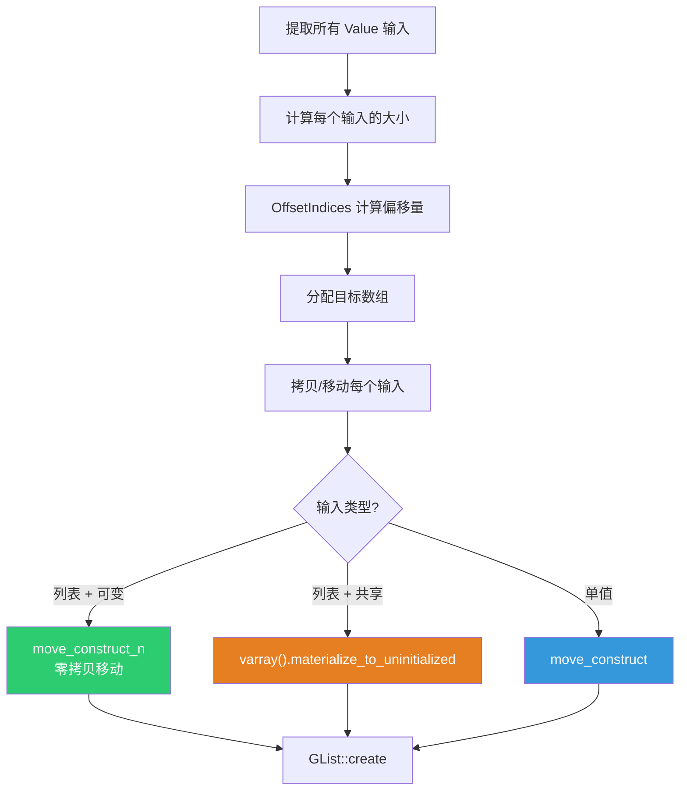
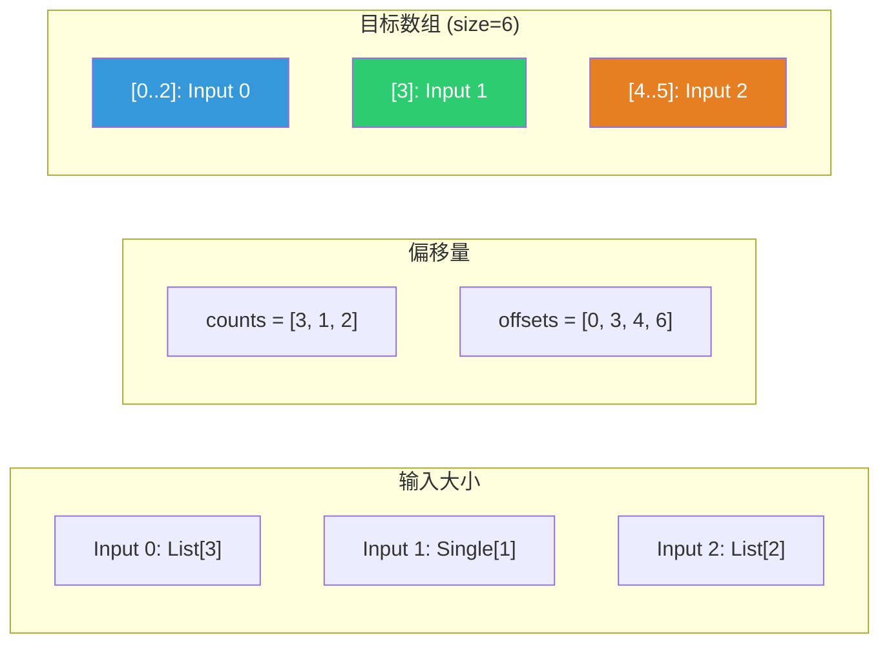
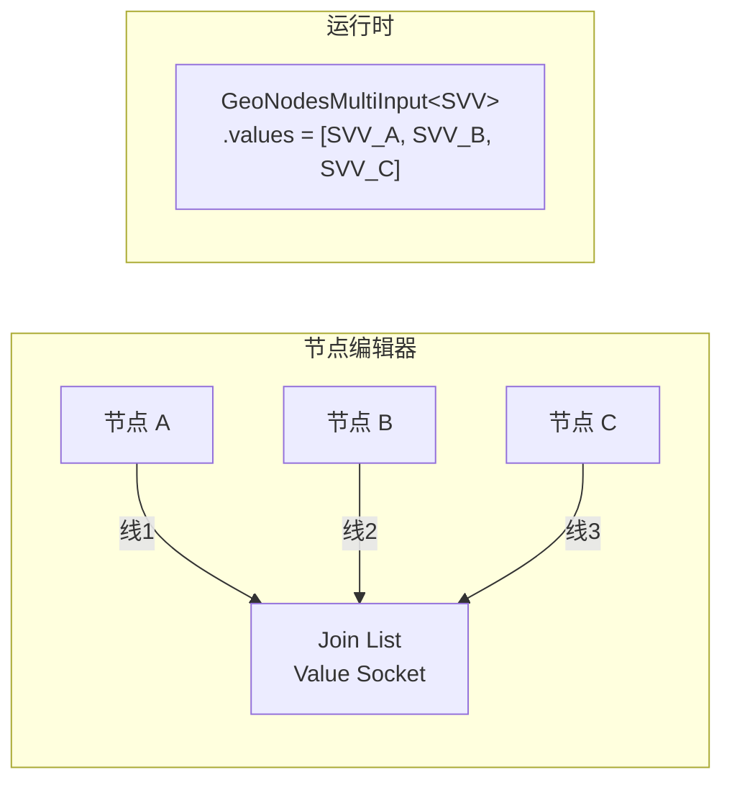

# List Length 与 Join List 节点

> 📖 系列文档：[目录](01-列表系统架构与核心数据结构.md) | [上一篇](04-SocketItemsAccessor动态Socket模式.md) | [下一篇](06-GetListItem节点.md)
> 源码文件：[node_geo_list_length.cc](file:///e:/blender-git/blender/source/blender/nodes/geometry/nodes/node_geo_list_length.cc)、[node_geo_join_list.cc](file:///e:/blender-git/blender/source/blender/nodes/geometry/nodes/node_geo_join_list.cc)

---

## 目录

1. [List Length 节点](#1-list-length-节点)
2. [Join List 节点](#2-join-list-节点)

---

## 1. List Length 节点

**节点 ID**：`GeometryNodeListLength`
**功能**：返回列表的元素数量
**复杂度**：⭐（最简单的列表节点）

### 1.1 节点声明

```cpp
static void node_declare(NodeDeclarationBuilder &b)
{
  const bNode *node = b.node_or_null();
  if (node != nullptr) {
    const eNodeSocketDatatype type = eNodeSocketDatatype(node->custom1);
    b.add_input(type, "List"_ustr).structure_type(StructureType::List).hide_value();
  }
  b.add_output<decl::Int>("Length"_ustr);
}
```

> **`node->custom1`**：使用节点的自定义整数属性存储数据类型，而非 `node->storage`。简单节点用 `custom1/custom2`，复杂节点用 `storage`。

> **`b.node_or_null()`**：声明阶段节点可能还不存在（如首次注册时）。必须检查 `nullptr`。

### 1.2 执行逻辑

```cpp
static void node_geo_exec(GeoNodeExecParams params)
{
  auto list = params.extract_input<GListPtr>("List"_ustr);
  if (!list) {
    params.set_default_remaining_outputs();
    return;
  }
  params.set_output("Length"_ustr, int(list->size()));
}
```

> **`int(list->size())`**：`GList::size()` 返回 `int64_t`，Socket 输出类型是 `int`（32位）。

> **空列表检查**：`!list` 为 true 时，`GListPtr` 内部的 `ImplicitSharingPtr` 为空（默认构造）。这通常意味着上游没有连接或输出了空值。

### 1.3 数据类型选择 UI

```cpp
static void node_layout(ui::Layout &layout, bContext * /*C*/, PointerRNA *ptr)
{
  layout.prop(ptr, "data_type", UI_ITEM_NONE, "", ICON_NONE);
}
```

```cpp
RNA_def_node_enum(
    srna, "data_type", "Data Type", "",
    rna_enum_node_socket_data_type_items,
    NOD_inline_enum_accessors(custom1),  // 直接映射到 custom1
    SOCK_GEOMETRY);  // 默认值
```

> **`NOD_inline_enum_accessors(custom1)`**：生成直接读写 `custom1` 的 getter/setter。与 `NOD_storage_enum_accessors`（读写 `storage`）不同。

> **`SOCK_GEOMETRY` 默认值**：Geometry 是最常用的列表元素类型之一。

### 1.4 链接搜索

```cpp
class SocketSearchOp {
 public:
  UString socket_name;
  eNodeSocketDatatype socket_type;
  void operator()(LinkSearchOpParams &params)
  {
    bNode &node = params.add_node("GeometryNodeListLength"_ustr);
    node.custom1 = socket_type;
    params.update_and_connect_available_socket(node, socket_name);
  }
};
```

> **`SocketSearchOp`**：函数对象（Functor）。当用户从搜索菜单选择时，创建节点、设置类型、连接 Socket。

---

## 2. Join List 节点

**节点 ID**：`GeometryNodeJoinList`
**功能**：将多个列表和/或单值拼接为一个列表
**复杂度**：⭐⭐

### 2.1 节点声明

```cpp
static void node_declare(NodeDeclarationBuilder &b)
{
  b.use_custom_socket_order();
  b.allow_any_socket_order();
  b.add_default_layout();

  const bNode *node = b.node_or_null();
  if (node != nullptr) {
    const eNodeSocketDatatype type = eNodeSocketDatatype(node->custom1);
    b.add_input(type, "Value"_ustr)
        .multi_input()                          // ← 多输入 Socket
        .hide_value()
        .structure_type(StructureType::Dynamic); // ← 接受单值或列表
  }
  if (node != nullptr) {
    const eNodeSocketDatatype type = eNodeSocketDatatype(node->custom1);
    b.add_output(type, "List"_ustr).structure_type(StructureType::List).align_with_previous();
  }
}
```

> **`.multi_input()`**：声明多输入 Socket，可以连接多条线。

> **`.structure_type(StructureType::Dynamic)`**：Value 输入接受单值或列表。

> **`b.add_default_layout()`**：使用默认布局（输入在左，输出在右）。

### 2.2 核心执行逻辑



### 2.3 OffsetIndices — 偏移量计算

```cpp
Array<int, 16> size_offset_data(inputs.values.size() + 1);
for (const int i : inputs.values.index_range()) {
  if (inputs.values[i].is_list()) {
    size_offset_data[i] = inputs.values[i].get<GListPtr>()->size();
  }
  else if (inputs.values[i].is_single()) {
    size_offset_data[i] = 1;
  }
  else {
    params.set_default_remaining_outputs();
    return;
  }
}

const OffsetIndices offsets = offset_indices::accumulate_counts_to_offsets(size_offset_data);
const int64_t size = offsets.total_size();
```



> **`Array<int, 16>`**：小数组优化。不超过 16 个元素时栈上分配。

> **`offsets.total_size()`**：最后一个偏移值，即总大小。

### 2.4 移动语义优化

```cpp
for (const int i : inputs.values.index_range()) {
  GMutableSpan dst = dst_list_data.slice(offsets[i]);

  if (inputs.values[i].is_list()) {
    const GListPtr list = inputs.values[i].get<GListPtr>();

    if (const auto *src_array_data = std::get_if<GList::ArrayData>(&list->data())) {
      if (list->is_mutable() && src_array_data->sharing_info->is_mutable()) {
        // 列表是唯一所有者 → 移动数据（零拷贝）
        cpp_type.move_construct_n(
            const_cast<void *>(src_array_data->data), dst.data(), dst.size());
        continue;
      }
    }

    // 列表被共享 → 必须拷贝
    list->varray().materialize_to_uninitialized(dst.data());
  }
  else {
    // 单值输入 → 移动
    GMutablePointer src = inputs.values[i].get_single_ptr();
    cpp_type.move_construct(src.get(), dst.data());
  }
}
```

> **双重可变性检查**：`list->is_mutable()` 检查 GList 是否被共享；`src_array_data->sharing_info->is_mutable()` 检查底层数据是否被共享。两者都为 true 才能安全移动。

> **`move_construct_n`**：对数组中每个元素调用移动构造函数。移动后源对象处于"有效但未指定"状态。

> **`materialize_to_uninitialized`**：将虚拟数组物化到未初始化内存。无论底层是 ArrayData 还是 SingleData，都能正确工作。

### 2.5 GeoNodesMultiInput — 多输入容器

```cpp
auto inputs = params.extract_input<GeoNodesMultiInput<bke::SocketValueVariant>>("Value"_ustr);
```

`GeoNodesMultiInput<T>` 是多输入 Socket 的值容器，内部存储 `Vector<T>` 类型的 `values` 成员。每个连接到多输入 Socket 的线提供一个值。


