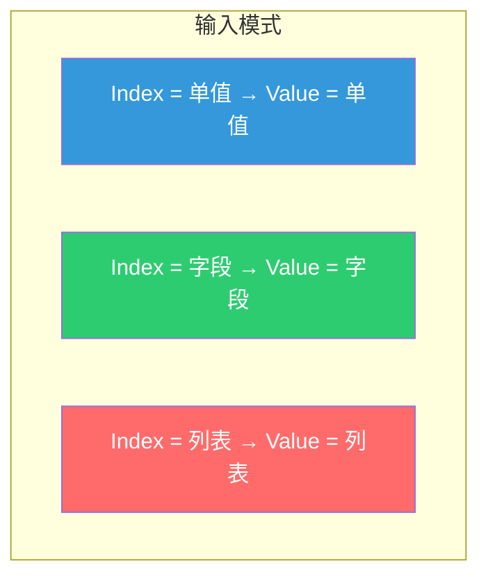
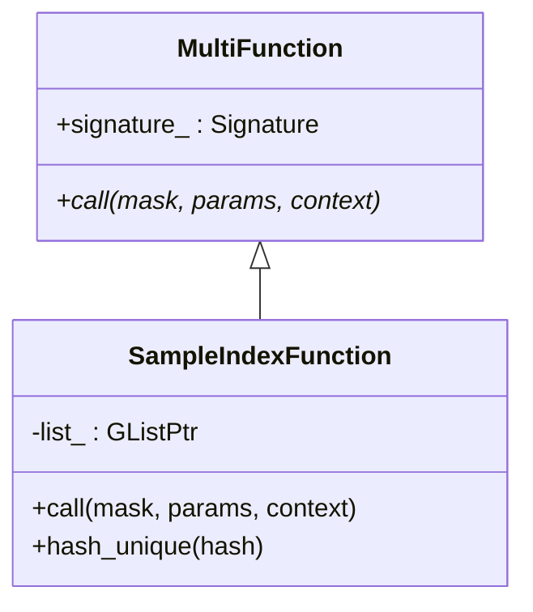
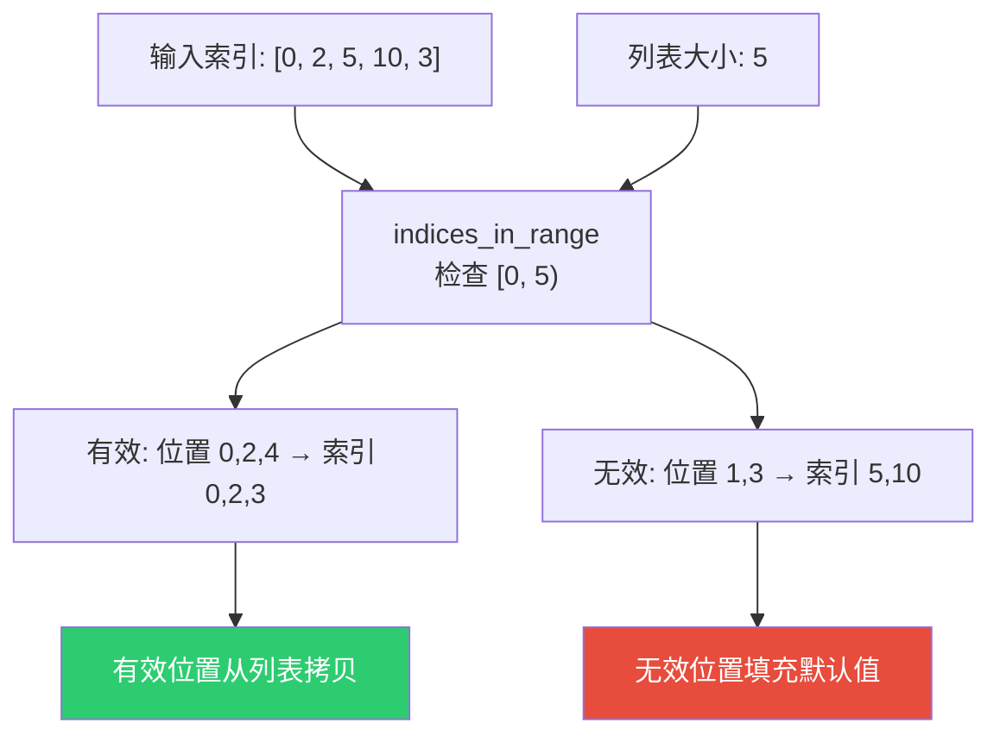
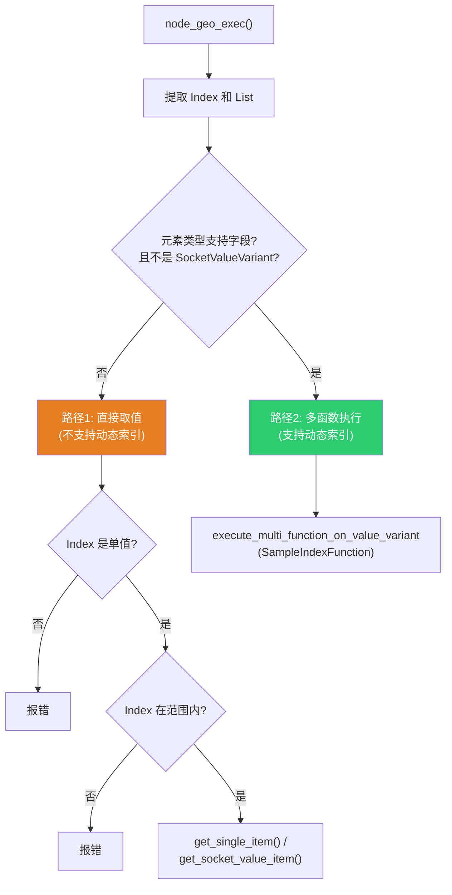

# Get List Item 节点

> 📖 系列文档：[目录](01-列表系统架构与核心数据结构.md) | [上一篇](05-ListLength与JoinList节点.md) | [下一篇](07-FilterList节点.md)
> 源码文件：[node_geo_list_get_item.cc](../../source/blender/nodes/geometry/nodes/node_geo_list_get_item.cc)

---

## 目录

1. [节点概述](#1-节点概述)
2. [节点声明与动态输出结构类型](#2-节点声明与动态输出结构类型)
3. [SampleIndexFunction — 自定义多函数](#3-sampleindexfunction--自定义多函数)
4. [索引越界处理](#4-索引越界处理)
5. [两条执行路径](#5-两条执行路径)
6. [get_single_item — 直接取值](#6-get_single_item--直接取值)
7. [get_socket_value_item — 复杂类型取值](#7-get_socket_value_item--复杂类型取值)
8. [输出结构类型的动态性](#8-输出结构类型的动态性)

---

## 1. 节点概述

**节点 ID**：`GeometryNodeListGetItem`
**功能**：从列表中按索引取值
**复杂度**：⭐⭐⭐

Get List Item 是最复杂的"消费型"列表节点，因为它需要处理多种输入输出模式：



---

## 2. 节点声明与动态输出结构类型

```cpp
static void node_declare(NodeDeclarationBuilder &b)
{
  const bNode *node = b.node_or_null();
  if (!node) return;

  const NodeGeometryListGetItem &storage = node_storage(*node);
  const eNodeSocketDatatype type = storage.socket_type;
  const bool is_auto_structure_type = storage.structure_type ==
                                      NodeSocketInterfaceStructureType::Auto;

  auto &list = b.add_input(type, "List"_ustr).structure_type(StructureType::List).hide_value();
  b.add_input<decl::Int>("Index"_ustr).min(0).structure_type(StructureType::Dynamic);
  b.add_output(type, "Value"_ustr)
      .propagate_all({list.index()})
      .propagate_references()
      .structure_type(is_auto_structure_type ? StructureType::Dynamic :
                                               StructureType(storage.structure_type));
}
```

> **`StructureType::Dynamic`**：输出结构类型取决于 Index 输入的实际类型。Auto 模式下由推断系统决定；用户也可以手动指定为 Single/Field/List。

> **`.propagate_all({list.index()})`**：声明此输出需要传播来自 List 输入的匿名属性。

> **`.propagate_references()`**：标记此输出需要传播引用信息。

### DNA 存储

```cpp
struct NodeGeometryListGetItem {
  eNodeSocketDatatype socket_type = SOCK_FLOAT;
  NodeSocketInterfaceStructureType structure_type = NodeSocketInterfaceStructureType::Auto;
  char _pad = {};
};
```

---

## 3. SampleIndexFunction — 自定义多函数

Get List Item 的核心是 `SampleIndexFunction`——一个自定义的 `MultiFunction`，将列表"采样"操作封装为可组合的函数单元。



```cpp
class SampleIndexFunction : public mf::MultiFunction {
  GListPtr list_;           // 持有列表引用（通过 GListPtr 共享）
  mf::Signature signature_;

 public:
  SampleIndexFunction(GListPtr list) : list_(std::move(list))
  {
    mf::SignatureBuilder builder{"Sample Index", signature_};
    builder.single_input<int>("Index");
    builder.single_output("Value", list_->cpp_type());
    this->set_signature(&signature_);
  }
```

> **`GListPtr list_`**：通过共享指针持有列表。`SampleIndexFunction` 被包装为 `std::shared_ptr` 传入字段系统，列表的生命周期由 `GListPtr` 管理。

> **`builder.single_input<int>("Index")`**：声明 Index 为单值输入（每个索引位置一个 int）。

> **`builder.single_output("Value", ...)`**：声明 Value 为单值输出（每个索引位置一个值）。

### call 方法实现

```cpp
void call(const IndexMask &mask, mf::Params params, mf::Context /*context*/) const override
{
  const VArraySpan<int> indices = params.readonly_single_input<int>(0, "Index");
  GMutableSpan dst = params.uninitialized_single_output(1, "Value");

  // 步骤1：分离有效和无效索引
  IndexMaskMemory memory;
  const IndexMask valid_indices = array_utils::indices_in_range(
      mask, indices, IndexRange(list_->size()), memory);

  // 步骤2：对无效索引填充默认值
  if (valid_indices.size() != mask.size()) {
    const IndexMask invalid_indices = valid_indices.complement(mask, memory);
    list_->cpp_type().fill_construct_indices(
        list_->cpp_type().default_value(), dst.data(), invalid_indices);
  }

  // 步骤3：根据存储变体读取值
  const GList::DataVariant &data = list_->data();
  if (const auto *array_data = std::get_if<nodes::GList::ArrayData>(&data)) {
    const GSpan src(list_->cpp_type(), array_data->data, list_->size());
    valid_indices.foreach_index([&](const int i, const int mask) {
      list_->cpp_type().copy_construct(src[indices[i]], dst[mask]);
    });
  }
  else if (const auto *single_data = std::get_if<nodes::GList::SingleData>(&data)) {
    list_->cpp_type().fill_construct_indices(single_data->value, dst.data(), valid_indices);
  }
}
```

> **`VArraySpan<int>`**：VArray 的跨度视图。当 VArray 内部是连续内存时直接提供指针访问；否则先物化。

> **`array_utils::indices_in_range`**：向量化边界检查，返回在 `[0, list_size)` 范围内的索引掩码。

> **`fill_construct_indices`**：只在掩码指定位置填充值，跳过其他位置。

> **`valid_indices.foreach_index`**：遍历有效索引。lambda 接收两个参数：`i` 是原始索引位置，`mask` 是掩码中的位置。

### hash_unique — 字段去重

```cpp
void hash_unique(UniqueHashBytes &hash) const override
{
  static constexpr int8_t id = 0;
  hash.add(&id);
  hash.add(list_.get());  // 使用列表指针作为哈希的一部分
}
```

> **字段去重**：如果两个 `SampleIndexFunction` 持有相同的列表指针，哈希相同，字段系统可以合并它们避免重复计算。

---

## 4. 索引越界处理



越界索引**不会报错**，而是静默填充默认值。这与 Blender 的"Sample Index"节点行为一致。

---

## 5. 两条执行路径



**路径1**：不支持字段的类型（Geometry、String、SocketValueVariant 等），只能用单值索引。

**路径2**：支持字段的类型（Float、Int、Vector 等），可以使用动态索引（字段/列表）。

---

## 6. get_single_item — 直接取值

```cpp
static bke::SocketValueVariant get_single_item(GListPtr &list,
                                               const eNodeSocketDatatype socket_type,
                                               const int64_t index)
{
  bke::SocketValueVariant value;
  void *value_ptr = value.allocate_single(socket_type);

  if (const auto *data = std::get_if<GList::ArrayData>(&list->data())) {
    if (list->is_mutable() && data->sharing_info->is_mutable()) {
      // 唯一所有者 → 移动（避免拷贝）
      GMutableSpan data_span(list->cpp_type(), const_cast<void *>(data->data), list->size());
      list->cpp_type().move_construct(data_span[index], value_ptr);
      return value;
    }
    // 被共享 → 必须拷贝
    const GSpan data_span(list->cpp_type(), data->data, list->size());
    list->cpp_type().copy_construct(data_span[index], value_ptr);
    return value;
  }

  if (const auto *data = std::get_if<GList::SingleData>(&list->data())) {
    if (list->is_mutable() && data->sharing_info->is_mutable()) {
      list->cpp_type().move_construct(const_cast<void *>(data->value), value_ptr);
      return value;
    }
    list->cpp_type().copy_construct(data->value, value_ptr);
    return value;
  }
}
```

> **移动 vs 拷贝**：当列表和数据都是唯一所有者时，可以安全移动。移动后列表中该位置的元素处于"有效但未指定"状态，但因为我们已经提取了整个列表（`extract_input`），不会再使用它。

---

## 7. get_socket_value_item — 复杂类型取值

```cpp
static bke::SocketValueVariant get_socket_value_item(GListPtr &list, const int64_t index)
{
  if (const auto *data = std::get_if<GList::ArrayData>(&list->data())) {
    if (list->is_mutable() && data->sharing_info->is_mutable()) {
      MutableSpan data_span(
          static_cast<bke::SocketValueVariant *>(const_cast<void *>(data->data)),
          list->size());
      return std::move(data_span[index]);  // 移动整个 SocketValueVariant
    }
    const Span data_span(
        static_cast<bke::SocketValueVariant *>(const_cast<void *>(data->data)),
        list->size());
    return data_span[index];  // 拷贝
  }
  // SingleData 处理...
}
```

> **`static_cast<SVV*>(const_cast<void*>(data->data))`**：双重类型转换。先 `const_cast` 移除 const，再 `static_cast` 转为具体类型。安全因为我们知道 `cpp_type()` 是 `SocketValueVariant`。

> **为什么需要单独的函数？** `SocketValueVariant` 本身是变体类型，不能像 `float` 一样简单地 `copy_construct`。需要移动/拷贝整个 `SocketValueVariant` 对象。

---

## 8. 输出结构类型的动态性

| Index 类型 | 输出结构类型 | 说明 |
|-----------|-------------|------|
| 单值 (Single) | Single | 取一个值 |
| 字段 (Field) | Field | 每个索引取一个值，形成字段 |
| 列表 (List) | List | 每个索引取一个值，形成列表 |

这种动态性通过 `StructureType::Dynamic` 声明和结构类型推断系统实现。当用户选择 "Auto" 时，推断系统根据 Index 输入的实际类型自动决定输出结构类型。
