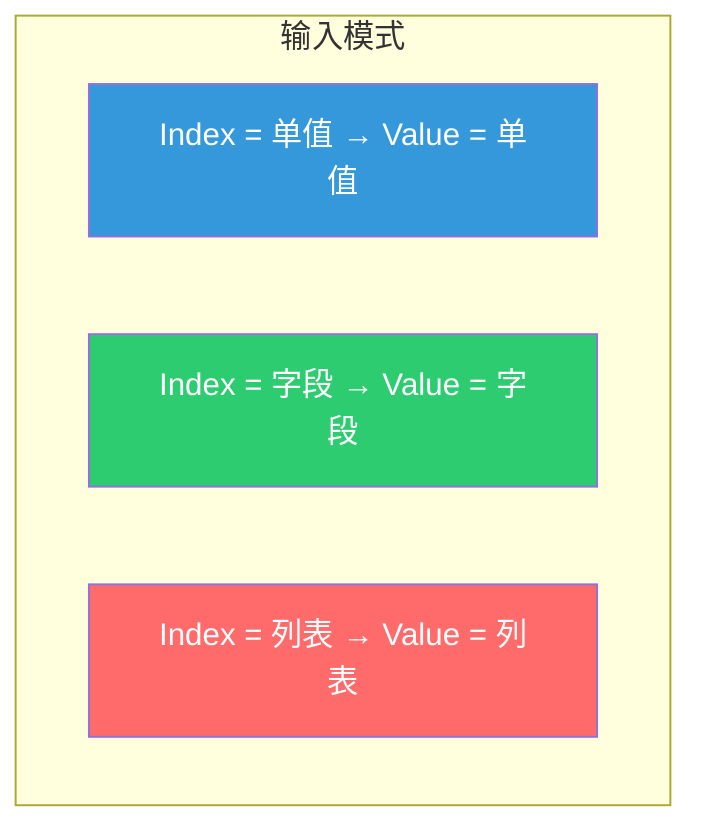
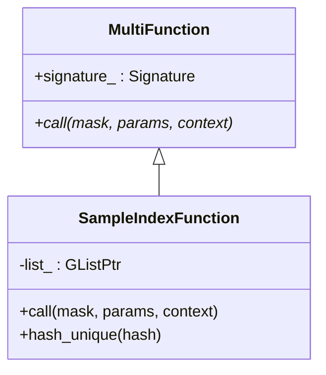
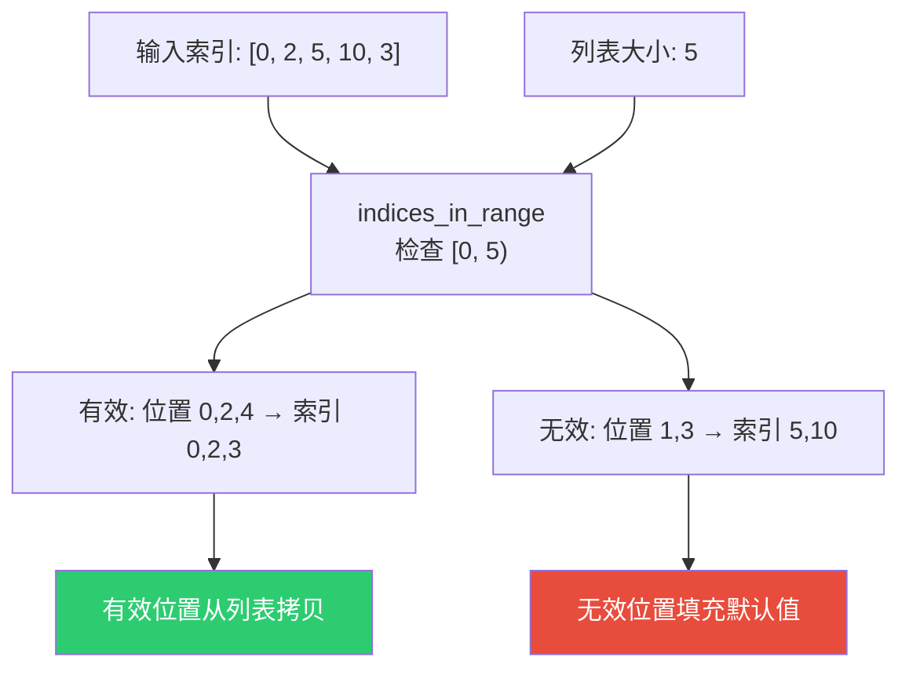
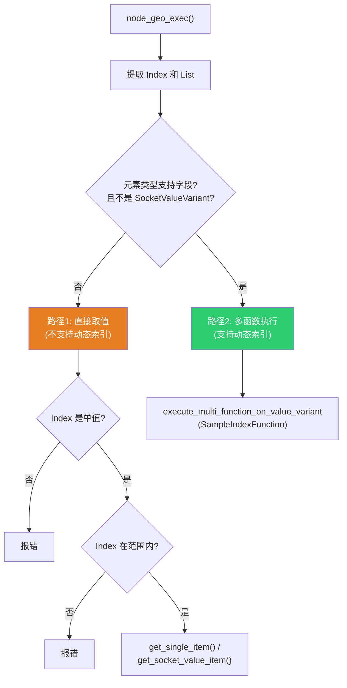
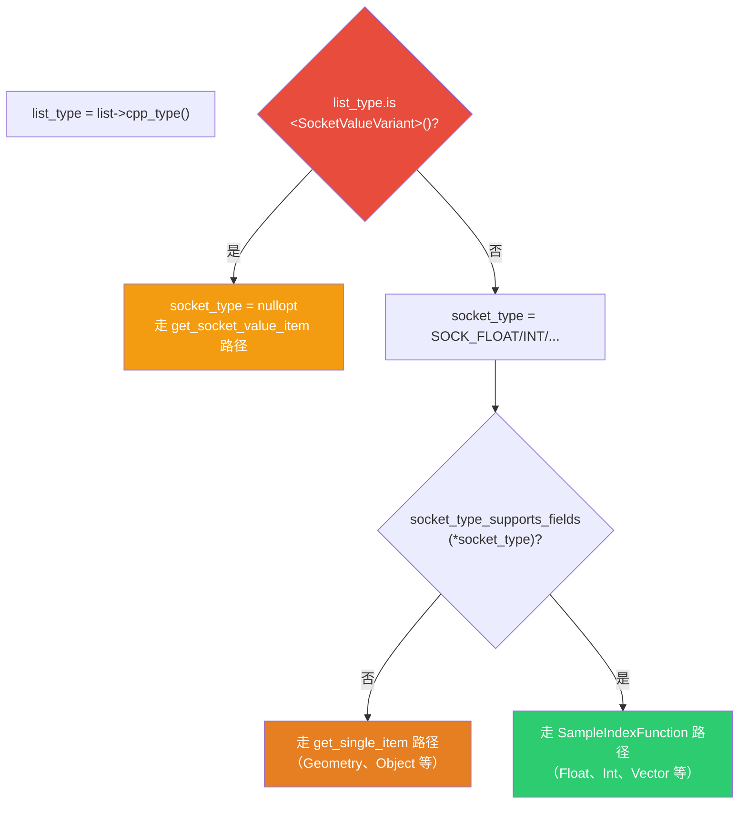

# Get List Item 节点

> 📖 系列文档：[目录](01-列表系统架构与核心数据结构.md) | [上一篇](05-ListLength与JoinList节点.md) | [下一篇](07-FilterList节点.md)
> 源码文件：[node_geo_list_get_item.cc](../../source/blender/nodes/geometry/nodes/node_geo_list_get_item.cc)

---

## 目录

- [Get List Item 节点](#get-list-item-节点)
  - [目录](#目录)
  - [1. 节点概述](#1-节点概述)
  - [2. 节点声明与动态输出结构类型](#2-节点声明与动态输出结构类型)
    - [DNA 存储](#dna-存储)
  - [3. SampleIndexFunction — 自定义多函数](#3-sampleindexfunction--自定义多函数)
    - [call 方法实现](#call-方法实现)
    - [hash\_unique — 字段去重](#hash_unique--字段去重)
  - [4. 索引越界处理](#4-索引越界处理)
  - [5. 两条执行路径](#5-两条执行路径)
    - [路径选择的代码实现](#路径选择的代码实现)
    - [路径1：`index.convert_to_single()`](#路径1indexconvert_to_single)
  - [6. get\_single\_item — 直接取值](#6-get_single_item--直接取值)
  - [7. get\_socket\_value\_item — 复杂类型取值](#7-get_socket_value_item--复杂类型取值)
  - [8. 输出结构类型的动态性](#8-输出结构类型的动态性)

---

## 1. 节点概述

**节点 ID**：`GeometryNodeListGetItem`
**功能**：从列表中按索引取值
**复杂度**：⭐⭐⭐

Get List Item 是最复杂的"消费型"列表节点，因为它需要处理多种输入输出模式：



---

## 2. 节点声明与动态输出结构类型

```cpp
static void node_declare(NodeDeclarationBuilder &b)
{
  const bNode *node = b.node_or_null();
  if (!node) return;

  const NodeGeometryListGetItem &storage = node_storage(*node);
  const eNodeSocketDatatype type = storage.socket_type;
  const bool is_auto_structure_type = storage.structure_type ==
                                      NodeSocketInterfaceStructureType::Auto;

  auto &list = b.add_input(type, "List"_ustr).structure_type(StructureType::List).hide_value();
  b.add_input<decl::Int>("Index"_ustr).min(0).structure_type(StructureType::Dynamic);
  b.add_output(type, "Value"_ustr)
      .propagate_all({list.index()})
      .propagate_references()
      .structure_type(is_auto_structure_type ? StructureType::Dynamic :
                                               StructureType(storage.structure_type));
}
```

> **`StructureType::Dynamic`**：输出结构类型取决于 Index 输入的实际类型。Auto 模式下由推断系统决定；用户也可以手动指定为 Single/Field/List。

> **`.propagate_all({list.index()})`**：传播**匿名属性**（如 Store Named Attribute 节点创建的属性）。从列表中取出一个几何体后，该几何体上的匿名属性仍然有效，需要传播到下游。

> **`.propagate_references()`**：传播**引用关系**——告诉声明系统"此输出的数据可能直接引用了输入列表中的数据"。与 `.propagate_all()` 的区别：
>
> | 传播方式 | 传播什么 | 类比 |
> |---------|---------|------|
> | `.propagate_all()` | 匿名属性（几何体上的属性数据） | 搬家时带上家具 |
> | `.propagate_references()` | 引用关系（输出引用了输入的数据） | 搬家时告诉新地址"我的信件还在旧邮箱" |
>
> 具体场景：列表中有 `[Mesh_A, Mesh_B, Mesh_C]`，Mesh_A 上有匿名属性 "position"。
>
> **Get List Item（Index=0）**：输出 = Mesh_A。输出**直接共享**输入列表中的数据（隐式共享，同一块内存），所以需要 `propagate_references()` 告诉声明系统"输出引用了输入的数据，输入不能被提前释放"。同时 Mesh_A 上的 "position" 属性需要 `propagate_all()` 传播。
>
> **Filter List（选择 [0, 2]）**：输出 = `[Mesh_A, Mesh_C]`。输出是**新创建的数组**（gather 产生新内存），不直接引用输入，所以不需要 `propagate_references()`。但匿名属性仍需 `propagate_all()` 传播。
>
> ```mermaid
> flowchart LR
>     subgraph "Get List Item — 输出直接共享输入数据"
>         GLI_In["输入列表<br/>[Mesh_A, Mesh_B, Mesh_C]"]
>         GLI_Out["输出 = Mesh_A<br/>↑ 隐式共享，同一块内存"]
>         GLI_In -.->|"隐式共享"| GLI_Out
>     end
>
>     subgraph "Filter List — 输出是新创建的数组"
>         FL_In["输入列表<br/>[Mesh_A, Mesh_B, Mesh_C]"]
>         FL_Out["输出列表<br/>[Mesh_A, Mesh_C]<br/>↑ gather 创建新内存"]
>         FL_In -->|"gather"| FL_Out
>     end
>
>     style GLI_Out fill:#9b59b6,color:#fff
>     style FL_Out fill:#2ecc71,color:#fff
> ```

### DNA 存储

```cpp
struct NodeGeometryListGetItem {
  eNodeSocketDatatype socket_type = SOCK_FLOAT;
  NodeSocketInterfaceStructureType structure_type = NodeSocketInterfaceStructureType::Auto;
  char _pad = {};
};
```

---

## 3. SampleIndexFunction — 自定义多函数

Get List Item 的核心是 `SampleIndexFunction`——一个自定义的 `MultiFunction`，将列表"采样"操作封装为可组合的函数单元。



```cpp
class SampleIndexFunction : public mf::MultiFunction {
  GListPtr list_;           // 持有列表引用（通过 GListPtr 共享）
  mf::Signature signature_;

 public:
  SampleIndexFunction(GListPtr list) : list_(std::move(list))
  {
    mf::SignatureBuilder builder{"Sample Index", signature_};
    builder.single_input<int>("Index");
    builder.single_output("Value", list_->cpp_type());
    this->set_signature(&signature_);
  }
```

> **`GListPtr list_`**：通过共享指针持有列表。`SampleIndexFunction` 被包装为 `std::shared_ptr` 传入字段系统，列表的生命周期由 `GListPtr` 管理。

> **`builder.single_input<int>("Index")`**：声明 Index 为单值输入（每个索引位置一个 int）。
>
> **`builder.single_output("Value", ...)`**：声明 Value 为单值输出（每个索引位置一个值）。
>
> **"Single" vs "Vector"**：多函数系统的参数有 6 种类别（`ParamCategory` 枚举）：
>
> | 参数类别 | 含义 | 数据类型 |
> |---------|------|---------|
> | `SingleInput` | 单值输入（只读） | 每个索引一个值 |
> | `VectorInput` | 向量输入（只读） | 每个索引一个数组 |
> | `SingleOutput` | 单值输出（只写） | 每个索引一个值 |
> | `VectorOutput` | 向量输出（只写） | 每个索引一个数组 |
> | `SingleMutable` | 单值可变（读写） | 每个索引一个值 |
> | `VectorMutable` | 向量可变（读写） | 每个索引一个数组 |
>
> `SampleIndexFunction` 用 `SingleInput`/`SingleOutput` 是因为 Get List Item 的语义是"每个索引位置取一个元素"——输入一个索引（int），输出一个值。`VectorInput`/`VectorOutput` 用于"每个索引位置产生多个结果"的函数（如 Accumulate Field 节点）。
>
> ```mermaid
> flowchart LR
>     subgraph "Single 模式（本函数使用）"
>         S_I["Index: [0, 1, 2, 3]<br/>每个索引一个 int"]
>         S_O["Value: [A, B, C, D]<br/>每个索引一个值"]
>         S_I --> S_O
>     end
>     
>     subgraph "Vector 模式（其他函数使用）"
>         V_I["Index: [0, 1, 2, 3]"]
>         V_O["Values: [[A,B], [C], [D,E,F], [G]]<br/>每个索引一个数组"]
>         V_I --> V_O
>     end
>     
>     style S_I fill:#3498db,color:#fff
>     style S_O fill:#2ecc71,color:#fff
>     style V_O fill:#e67e22,color:#fff
> ```

### call 方法实现

```cpp
void call(const IndexMask &mask, mf::Params params, mf::Context /*context*/) const override
{
  const VArraySpan<int> indices = params.readonly_single_input<int>(0, "Index");
  GMutableSpan dst = params.uninitialized_single_output(1, "Value");

  // 步骤1：分离有效和无效索引
  IndexMaskMemory memory;
  const IndexMask valid_indices = array_utils::indices_in_range(
      mask, indices, IndexRange(list_->size()), memory);

  // 步骤2：对无效索引填充默认值
  if (valid_indices.size() != mask.size()) {
    const IndexMask invalid_indices = valid_indices.complement(mask, memory);
    list_->cpp_type().fill_construct_indices(
        list_->cpp_type().default_value(), dst.data(), invalid_indices);
  }

  // 步骤3：根据存储变体读取值
  const GList::DataVariant &data = list_->data();
  if (const auto *array_data = std::get_if<nodes::GList::ArrayData>(&data)) {
    const GSpan src(list_->cpp_type(), array_data->data, list_->size());
    valid_indices.foreach_index([&](const int i, const int mask) {
      list_->cpp_type().copy_construct(src[indices[i]], dst[mask]);
    });
  }
  else if (const auto *single_data = std::get_if<nodes::GList::SingleData>(&data)) {
    list_->cpp_type().fill_construct_indices(single_data->value, dst.data(), valid_indices);
  }
}
```

> **`VArraySpan<int>`**：VArray 的跨度视图。当 VArray 内部是连续内存时直接提供指针访问；否则先物化。

> **`array_utils::indices_in_range`**：向量化边界检查，返回在 `[0, list_size)` 范围内的索引掩码。

> **`fill_construct_indices`**：只在掩码指定位置填充值，跳过其他位置。

> **`valid_indices.foreach_index`**：遍历有效索引。lambda 接收两个参数：`i` 是原始索引位置，`mask` 是掩码中的位置。

### hash_unique — 字段去重

```cpp
void hash_unique(UniqueHashBytes &hash) const override
{
  static constexpr int8_t id = 0;
  hash.add(&id);
  hash.add(list_.get());  // 使用列表指针作为哈希的一部分
}
```

> **字段去重**：如果两个 `SampleIndexFunction` 持有相同的列表指针，哈希相同，字段系统可以合并它们避免重复计算。

---

## 4. 索引越界处理



越界索引**不会报错**，而是静默填充默认值。这与 Blender 的"Sample Index"节点行为一致。

---

## 5. 两条执行路径



**路径1**：不支持字段的类型（Geometry、String、SocketValueVariant 等），只能用单值索引。

**路径2**：支持字段的类型（Float、Int、Vector 等），可以使用动态索引（字段/列表）。

> **路径1的局限**：当前路径1只支持单值索引——如果 index 是列表或字段，直接报错 "Index must be a single value"。但用户可能想用列表索引取多个元素（如 index=[0,2,4] → 取出第 0、2、4 个元素，输出新列表）。
>
> 路径2通过 `SampleIndexFunction` 已经支持了列表索引→列表输出。路径1缺少这个功能是因为**不支持字段的类型**（如 Geometry、Object）在设计上被认为不需要批量索引操作。
>
> 如果要支持，核心思路是：当 index 是列表时，用 `array_utils::gather` 按索引收集元素，生成新列表。但有几个难点：
>
> 1. **IndexMask 不支持重复/乱序索引**：`IndexMask` 假设索引是 `[0,1,...,n-1]` 的子集，不支持 `[0,0,2]`（重复）或 `[3,1,4]`（乱序）。但用户可能想取重复元素
> 2. **SocketValueVariant 列表的 gather**：`array_utils::gather` 基于 `GSpan`，但 `SocketValueVariant` 需要特殊的移动/拷贝逻辑
> 3. **输出结构类型**：当 index 是列表时，输出应该是列表，但需要确保类型推断正确
>
> ```mermaid
> flowchart TD
>     L["List: [A, B, C, D, E]"]
>     I["Index: [0, 2, 4]"]
>     G["gather()"]
>     O["Output: [A, C, E]"]
>     
>     L --> G
>     I --> G
>     G --> O
>     
>     style O fill:#2ecc71,color:#fff
> ```

### 路径选择的代码实现

```cpp
const CPPType &list_type = list->cpp_type();
const std::optional<eNodeSocketDatatype> socket_type =
    bke::geo_nodes_base_cpp_type_to_socket_type(list_type);

if (list_type.is<bke::SocketValueVariant>() || !socket_type_supports_fields(*socket_type)) {
  // 路径1：直接取值
  // ...
  if (list->cpp_type().is<bke::SocketValueVariant>()) {  // ← 为什么不用 list_type？
    params.set_output("Value"_ustr, get_socket_value_item(list, index_int));
  }
  else {
    params.set_output("Value"_ustr, get_single_item(list, *socket_type, index_int));
  }
}
else {
  // 路径2：多函数执行
}
```

> **为什么第 244 行写 `list->cpp_type().is<SocketValueVariant>()` 而非 `list_type.is<SocketValueVariant>()`？** 两者完全等价——`list_type` 就是第 227 行 `const CPPType &list_type = list->cpp_type()` 保存的引用，`list->cpp_type()` 返回的也是同一个 `CPPType&`。第 244 行重复调用是代码风格不一致，没有技术原因。使用 `list_type` 更好——避免一次函数调用（虽然 `cpp_type()` 只是返回成员引用，开销可忽略），且意图更清晰。

> **`geo_nodes_base_cpp_type_to_socket_type(list_type)`**：将 `CPPType` 映射回 `eNodeSocketDatatype` 枚举。返回 `std::optional` 因为**不是所有 CPPType 都有对应的 Socket 类型**——`CPPType` 可以注册任意 C++ 类型，但 Socket 类型只有有限的几种。没有匹配时返回 `std::nullopt`。
>
> 内部实现是一个 if 链：`type.is<float>() → SOCK_FLOAT`，`type.is<int>() → SOCK_INT`，...，最后 `return std::nullopt`。
>
> **`return SOCK_FLOAT` 是隐式转换吗？** 是的。`SOCK_FLOAT` 是 `eNodeSocketDatatype` 枚举值，`std::optional<eNodeSocketDatatype>` 有非 explicit 构造函数接受 `eNodeSocketDatatype`，所以 `return SOCK_FLOAT` 隐式构造了 `std::optional(SOCK_FLOAT)`。等价于 `return std::optional<eNodeSocketDatatype>(SOCK_FLOAT)`。

> **`list_type.is<bke::SocketValueVariant>()` 为什么需要单独检查？** 因为 `SocketValueVariant` 是内部容器类型，`geo_nodes_base_cpp_type_to_socket_type` 的 if 链中**没有** `type.is<bke::SocketValueVariant>()` 这个分支，所以 `socket_type` 会是 `std::nullopt`。如果直接对 `*socket_type` 解引用会崩溃（空 optional 不能解引用），所以必须先检查。
>
> **调试器为什么报 "has no member 'is<bke::SocketValueVariant>()'"？** 这是调试器的显示限制，不是编译错误。`CPPType::is<T>()` 是模板成员函数，调试器无法在"成员列表"中显示模板实例化后的函数名。代码本身是正确的——`SocketValueVariant` 已注册到 CPPType 系统（`BLI_CPP_TYPE_REGISTER(bke::SocketValueVariant, ...)`），`is<SocketValueVariant>()` 可以正常调用。

### 路径1：`index.convert_to_single()` 

路径1中，`index` 必须是单值。`convert_to_single()` 将 `SocketValueVariant` 转换为单值模式——如果已经是 Single 则什么都不做，如果是 Field 则尝试求值常量字段，如果是 List/Grid 则使用默认值。详见 [03-SocketValueVariant与列表集成.md 的 convert_to_single 章节](03-SocketValueVariant与列表集成.md#5-convert_to_single--列表转单值)。

> **为什么 Get List Item 不支持负数索引？** 源码用 `IndexRange(list->size()).contains(index_int)` 检查索引范围——`IndexRange` 生成 `[0, 1, ..., size-1]`，负数不在范围内，直接报 "Index out of range"。C++ 的 `[]` 索引不支持负数（对普通数组是未定义行为），Blender 的 `GSpan[index]`、`VArray[index]` 都用 `int64_t` 索引。如果需要从末尾取元素，可以用 `List Length - 1 - N` 的方式。



---

## 6. get_single_item — 直接取值

```cpp
static bke::SocketValueVariant get_single_item(GListPtr &list,
                                               const eNodeSocketDatatype socket_type,
                                               const int64_t index)
{
  bke::SocketValueVariant value;                        // ① 创建空的 SocketValueVariant
  void *value_ptr = value.allocate_single(socket_type); // ② 分配内存，返回指针

  if (const auto *data = std::get_if<GList::ArrayData>(&list->data())) {
    if (list->is_mutable() && data->sharing_info->is_mutable()) {
      // 唯一所有者 → 移动（避免拷贝）
      GMutableSpan data_span(list->cpp_type(), const_cast<void *>(data->data), list->size());
      list->cpp_type().move_construct(data_span[index], value_ptr);  // ③ 在 value_ptr 上构造
      return value;  // ④ 返回完整的 SocketValueVariant
    }
    // 被共享 → 必须拷贝
    const GSpan data_span(list->cpp_type(), data->data, list->size());
    list->cpp_type().copy_construct(data_span[index], value_ptr);
    return value;
  }

  if (const auto *data = std::get_if<GList::SingleData>(&list->data())) {
    if (list->is_mutable() && data->sharing_info->is_mutable()) {
      list->cpp_type().move_construct(const_cast<void *>(data->value), value_ptr);
      return value;
    }
    list->cpp_type().copy_construct(data->value, value_ptr);
    return value;
  }
}
```

> **`value` 和 `value_ptr` 的关系**：`value` 是**整个容器**（SocketValueVariant），`value_ptr` 是容器内部**值的存放地址**。
>
> ```mermaid
> flowchart TD
>     subgraph "value (SocketValueVariant)"
>         subgraph "value_ (Any)"
>             BUF["AlignedBuffer[32]<br/>← value_ptr 指向这里"]
>             EXT["AnyExtraData<br/>Kind=Single, SOCK_FLOAT"]
>             INF["Info* → float 的类型表"]
>         end
>     end
>     
>     VP["value_ptr<br/>void* 指向<br/>BUF 内部的地址"]
>     
>     VP -.->|"指向"| BUF
>     
>     style BUF fill:#3498db,color:#fff
>     style VP fill:#e74c3c,color:#fff
> ```
>
> 整个流程：
> 1. `value` 创建时是空的（`Kind::None`）
> 2. `allocate_single` 在 `value` 内部分配内存，返回 `value_ptr`（指向那块未初始化的内存）
> 3. `move_construct(src, value_ptr)` 把数据从列表搬到 `value_ptr` 指向的内存
> 4. 此时 `value` 内部的 `Any` 已经包含了正确的值（通过 `info_` 知道类型，通过 `buffer_` 存储数据，通过 `extra` 知道 Kind）
> 5. 返回 `value`——一个完整的、包含正确值的 `SocketValueVariant`
>
> **为什么用 `value_ptr` 而非直接操作 `value`？** 因为 `CPPType::move_construct` 和 `copy_construct` 是泛型函数——它们接受 `void*` 指针，不知道 `SocketValueVariant` 的存在。它们只知道"在 `dst` 地址上构造一个 `T` 类型的对象"。
>
> **类比**：`value` 是房子，`value_ptr` 是房子的地址。你先建好房子的框架（`allocate_single`），得到地址（`value_ptr`），然后把家具搬进去（`move_construct`），最后交付整个房子（`return value`）。

> **为什么这里用 `std::get_if` 而非 `std::visit`？** 因为这里需要对两种变体类型执行**几乎相同的逻辑**（判断可变 → 移动或拷贝），只是数据来源不同（ArrayData 从数组取，SingleData 从单值取）。`std::visit` + `if constexpr` 需要在 lambda 内部重复写两遍几乎一样的代码，而 `std::get_if` + 两个 if 更直观。
>
> 对比 `filter_list`（[07-FilterList节点.md](07-FilterList节点.md)）用 `std::visit` + `if constexpr`——因为它的两种分支逻辑**完全不同**（ArrayData 用 gather，SingleData 只改 size），`std::visit` 保证类型覆盖且代码清晰。
>
> | 特性 | `std::visit` + `if constexpr` | `std::get_if` + 两个 `if` |
> |------|-------------------------------|--------------------------|
> | 保证处理所有类型 | ✅ 编译器检查 | ❌ 遗漏不会报错 |
> | 适合逻辑不同的分支 | ✅ 清晰 | 也可以 |
> | 适合逻辑相似的分支 | 代码重复 | ✅ 更直观 |
> | 需要 `typename T` | ✅ 模板 lambda | ❌ 不需要 |

> **为什么不用 `if constexpr`？** `if constexpr` 是**编译期**分支——要求条件在编译时就能确定。但 `list->data()` 是 `std::variant`，其当前持有的类型是**运行时**才知道的。`if constexpr (std::is_same_v<T, ArrayData>)` 中的 `T` 必须是编译期类型，而这里没有模板参数 `T`——只有运行时的 variant。`std::get_if` 正是处理运行时 variant 的标准方式。
>
> | 机制 | 判断时机 | 适用场景 |
> |------|---------|---------|
> | `if constexpr` | 编译期 | 模板参数 `T` 已知（如在模板 lambda 中） |
> | `std::get_if` | 运行时 | variant 的实际类型运行时才知道 |
> | `std::visit` | 运行时 | 需要保证处理所有变体类型 |

> **什么时候是 SingleData？** 当列表中**所有元素都相同**时，GList 使用 SingleData 存储——只保存一个值和大小，而非数组。这出现在：
>
> - **Join List 合并多个相同值**：如 `[X, X, X]` → SingleData(value=X, size=3)
> - **Filter List 全选**：mask = 全部 → 直接返回原列表（如果是 SingleData 则保持）
> - **GList::create(type, value, size)**：显式创建单值列表
>
> SingleData 是**空间优化**——5 个相同的 `float3` 用 SingleData 只需 12 字节 + 8 字节 = 20 字节，用 ArrayData 则需 5 × 12 = 60 字节。
>
> ```mermaid
> flowchart LR
>     subgraph "ArrayData: [3.0, 3.0, 3.0, 3.0, 3.0]"
>         A1["3.0"] --> A2["3.0"] --> A3["3.0"] --> A4["3.0"] --> A5["3.0"]
>         AN["60 字节"]
>     end
>     subgraph "SingleData: value=3.0, size=5"
>         S1["3.0"]
>         SN["20 字节"]
>     end
> 
>     style AN fill:#e74c3c,color:#fff
>     style SN fill:#2ecc71,color:#fff
> ```

> **`move_construct` 和 `copy_construct` 详解**：这两个是 `CPPType` 的函数指针成员，在运行时执行类型正确的构造操作。
>
> **`CPPType::move_construct(src, dst)`**：在 `dst` 位置**移动构造**一个新对象。移动后 `src` 处于"有效但未指定"状态。
>
> ```cpp
> // 等价于：new (dst) T(std::move(*static_cast<const T*>(src)));
> // 例如 T = float3：把 src 的 12 字节搬到 dst，src 不再有效
> ```
>
> **`CPPType::copy_construct(src, dst)`**：在 `dst` 位置**拷贝构造**一个新对象。`src` 保持不变。
>
> ```cpp
> // 等价于：new (dst) T(*static_cast<const T*>(src));
> // 例如 T = float3：把 src 的 12 字节复制到 dst，src 仍然有效
> ```
>
> | 操作 | 源对象状态 | 速度 | 何时使用 |
> |------|-----------|------|---------|
> | `move_construct` | 变为"有效但未指定" | 快（可能零拷贝） | 唯一所有者时 |
> | `copy_construct` | 保持不变 | 慢（必须深拷贝） | 被共享时 |
>
> **为什么需要判断 `is_mutable()`？** 隐式共享机制要求：只有**唯一所有者**才能修改数据。`list->is_mutable()` 检查 GList 的引用计数是否为 1，`data->sharing_info->is_mutable()` 检查数据的引用计数是否为 1。两者都为 true 时，可以安全移动（因为没人 else 在用这个数据）。否则必须拷贝（因为其他人可能还在引用原数据）。
>
> ```mermaid
> flowchart TD
>     Start["从列表取元素"]
>     Check{"is_mutable() &&<br/>sharing_info->is_mutable()?"}
>     
>     Check -->|"是：唯一所有者"| Move["move_construct<br/>移动（快）<br/>源对象变为未指定"]
>     Check -->|"否：被共享"| Copy["copy_construct<br/>拷贝（慢）<br/>源对象保持不变"]
> 
>     style Move fill:#2ecc71,color:#fff
>     style Copy fill:#e67e22,color:#fff
> ```
>
> **移动为什么快？** 对于简单类型（`int`、`float3`），移动和拷贝一样快（都是复制字节）。但对于复杂类型（`std::string`、`GeometrySet`），移动只转移内部指针（O(1)），拷贝需要复制所有数据（O(n)）。例如移动 `std::string` 只需交换 3 个指针（8 字节 × 3 = 24 字节），拷贝需要复制整个字符串内容。

---

## 7. get_socket_value_item — 复杂类型取值

```cpp
static bke::SocketValueVariant get_socket_value_item(GListPtr &list, const int64_t index)
{
  if (const auto *data = std::get_if<GList::ArrayData>(&list->data())) {
    if (list->is_mutable() && data->sharing_info->is_mutable()) {
      MutableSpan data_span(
          static_cast<bke::SocketValueVariant *>(const_cast<void *>(data->data)),
          list->size());
      return std::move(data_span[index]);  // 移动整个 SocketValueVariant
    }
    const Span data_span(
        static_cast<bke::SocketValueVariant *>(const_cast<void *>(data->data)),
        list->size());
    return data_span[index];  // 拷贝
  }
  // SingleData 处理...
}
```

> **`static_cast<SocketValueVariant*>(const_cast<void*>(data->data))`**：双重类型转换。先 `const_cast` 移除 const，再 `static_cast` 转为具体类型。安全因为我们知道 `cpp_type()` 是 `SocketValueVariant`。

> **为什么需要单独的函数？** `SocketValueVariant` 本身是变体类型，不能像 `float` 一样简单地 `copy_construct`。需要移动/拷贝整个 `SocketValueVariant` 对象。

> **为什么 `get_socket_value_item` 用 `std::move` 而非 `move_construct`？** 因为这个函数**编译期就知道类型是 `SocketValueVariant`**——`data_span` 是 `Span<SocketValueVariant>`，编译器可以直接生成移动/拷贝构造代码：
>
> - `return std::move(data_span[index])` → 编译器调用 `SocketValueVariant` 的移动构造函数
> - `return data_span[index]` → 编译器调用 `SocketValueVariant` 的拷贝构造函数
>
> 而 `get_single_item` **编译期不知道类型**（只有 `CPPType*`），编译器无法生成对应的构造代码，只能通过 `CPPType::move_construct(src, dst)` 函数指针在运行时调用。
>
> | 函数 | 编译期知道类型？ | 构造方式 | 原因 |
> |------|---------------|---------|------|
> | `get_socket_value_item` | ✅ `SocketValueVariant` | `std::move` / 直接 return | 编译器生成构造代码 |
> | `get_single_item` | ❌ 只有 `CPPType*` | `move_construct` / `copy_construct` | 运行时函数指针调用 |
>
> **类比**：`get_socket_value_item` 像你明确知道箱子里是苹果，直接拿出来吃；`get_single_item` 像你只知道箱子里是"某种水果"，需要先查说明书（CPPType）才能正确处理。

> **为什么 `ArrayData::data` 和 `SingleData::value` 设计成 `const void*`？** 源码注释原文："This is const because it uses implicit sharing. In some contexts the const can be cast away when it's clear that the data is not shared."（这是 const 的因为它使用了隐式共享。在某些上下文中，当明确数据不被共享时，可以去掉 const。）
>
> 隐式共享意味着多个所有者可能同时持有同一块数据的引用。如果允许直接修改 `data`/`value` 指向的内存，就会影响所有共享者。`const` 是"软锁"——编译器阻止直接修改，提醒你必须先确认安全（通过 `is_mutable()` 检查）才能 `const_cast` 去掉 const。
>
> 正式的写入口是 `span_for_write()` 和 `value_for_write()`——内部检查引用计数，必要时写时复制。`get_socket_value_item` 中的 `const_cast` 是合法的，因为先检查了 `is_mutable()` 确认自己是唯一所有者。
>
> ```cpp
> // ❌ 非法：const void* → SocketValueVariant* 丢失了 const
> static_cast<bke::SocketValueVariant *>(data->data)
> 
> // ✅ 合法方式1：先 const_cast 去 const，再 static_cast
> static_cast<bke::SocketValueVariant *>(const_cast<void *>(data->data))
> 
> // ✅ 合法方式2：直接转为 const SocketValueVariant*（保留 const）
> static_cast<const bke::SocketValueVariant *>(data->data)
> ```
>
> | 行 | 场景 | 需要修改？ | 用的方式 | 原因 |
> |---|------|----------|---------|-------|
> | 201 | ArrayData 可变 | ✅ 移动 | `const_cast` + 非 const 指针 | `MutableSpan` 要求 `T*`（非 const），必须去掉 const |
> | 205 | ArrayData 不可变 | ❌ 拷贝 | `const_cast` + 非 const 指针 | 不是必须的！`Span` 接受 `const T*`，可以不用 `const_cast`。作者可能为了和第 201 行保持代码结构一致 |
> | 211 | SingleData 可变 | ✅ 移动 | `const_cast` + 非 const 指针 | `std::move` 需要非 const 引用，必须去掉 const |
> | 213 | SingleData 不可变 | ❌ 拷贝 | 直接 `const SocketValueVariant*` | 只需读取，保留 const 即可 |
>
> **第 205 行完全可以改成不需要 `const_cast` 的写法**：
> ```cpp
> const Span data_span(static_cast<const bke::SocketValueVariant *>(data->data),
>                      list->size());
> ```
> 但作者选择了 `const_cast` 写法，可能是为了和第 201 行（MutableSpan 情况）保持代码结构一致。

> **什么时候列表类型是 `SocketValueVariant`？** 当列表存储的元素本身可能是多种类型时——最典型的是 **Closure to List** 节点的输出。Closure to List 的每个闭包可能返回不同类型的值（一个返回 float，另一个返回 int），所以每个元素被包装为 `SocketValueVariant`，列表的 `cpp_type()` 就是 `SocketValueVariant`。
>
> 注意：`cpp_type()` 返回的是列表**元素**的类型，不是列表本身的类型。`List<float>` 的 `cpp_type()` 是 `CPPType::get<float>()`，`List<SocketValueVariant>` 的 `cpp_type()` 是 `CPPType::get<SocketValueVariant>()`。所以 `list->cpp_type().is<bke::SocketValueVariant>()` = true 意味着**这个列表的每一个元素都是 `SocketValueVariant`**。
>
> 这种列表无法走字段路径（因为 `SocketValueVariant` 不是字段支持的类型），也无法走 `get_single_item` 路径（因为 `copy_construct` 不知道 `SocketValueVariant` 内部存的是什么），所以需要专门的 `get_socket_value_item` 函数，直接移动/拷贝整个 `SocketValueVariant` 对象。
>
> ```mermaid
> flowchart TD
>     CTL["Closure to List 节点"]
>     C1["闭包1 → 返回 float 3.14"]
>     C2["闭包2 → 返回 int 42"]
>     C3["闭包3 → 返回 Geometry"]
>     
>     SVV1["SocketValueVariant(Single, SOCK_FLOAT, 3.14)"]
>     SVV2["SocketValueVariant(Single, SOCK_INT, 42)"]
>     SVV3["SocketValueVariant(Single, SOCK_GEOMETRY, ...)"]
>     
>     LIST["List&lt;SocketValueVariant&gt;<br/>cpp_type() = SocketValueVariant"]
>     
>     C1 --> SVV1 --> LIST
>     C2 --> SVV2 --> LIST
>     C3 --> SVV3 --> LIST
>     
>     LIST --> GLI["Get List Item<br/>list_type.is&lt;SocketValueVariant&gt;() = true<br/>→ get_socket_value_item()"]
> 
>     style LIST fill:#e74c3c,color:#fff
>     style GLI fill:#9b59b6,color:#fff
> ```

---

## 8. 输出结构类型的动态性

| Index 类型 | 输出结构类型 | 说明 |
|-----------|-------------|------|
| 单值 (Single) | Single | 取一个值 |
| 字段 (Field) | Field | 每个索引取一个值，形成字段 |
| 列表 (List) | List | 每个索引取一个值，形成列表 |

这种动态性通过 `StructureType::Dynamic` 声明和结构类型推断系统实现。当用户选择 "Auto" 时，推断系统根据 Index 输入的实际类型自动决定输出结构类型。
