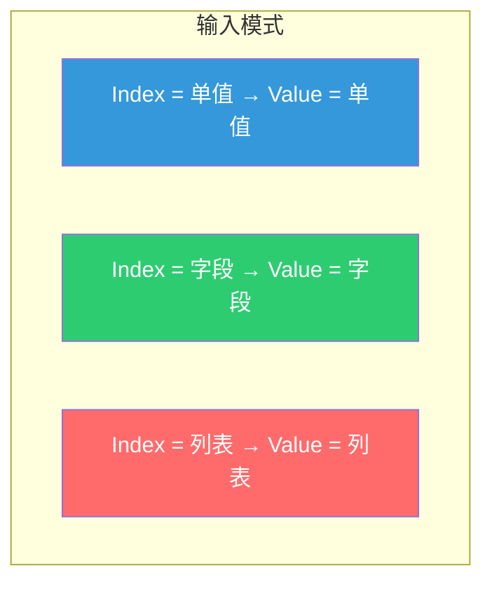
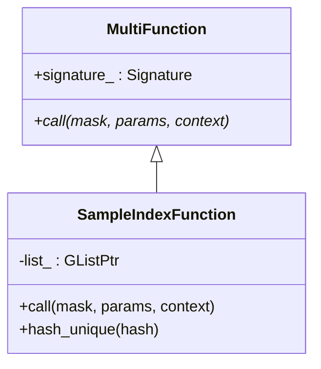
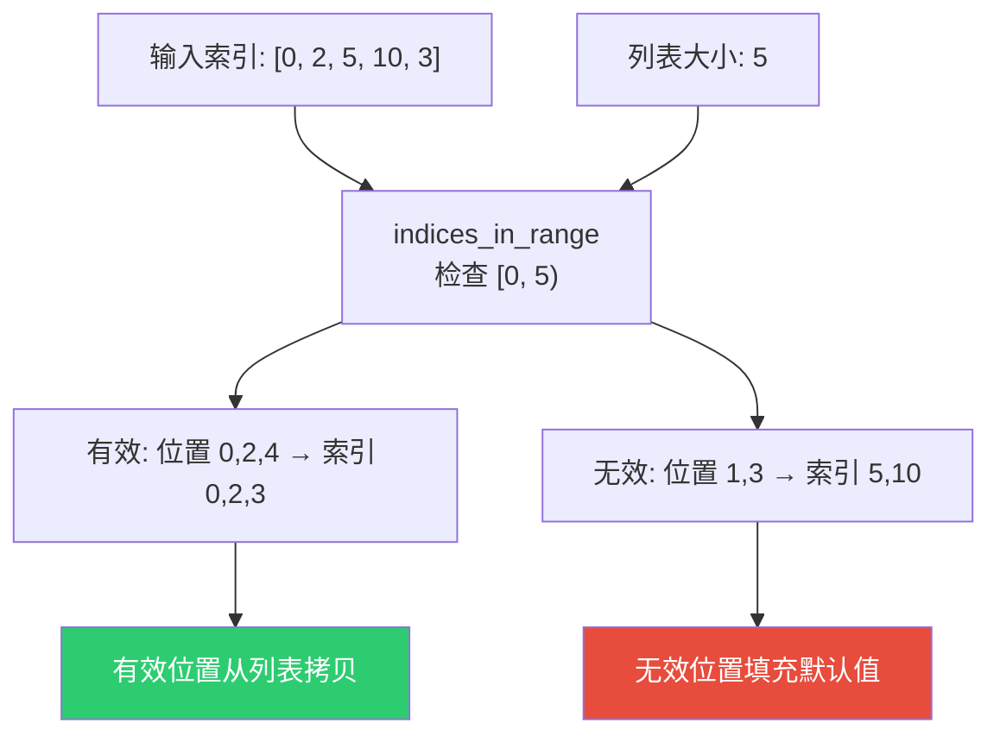
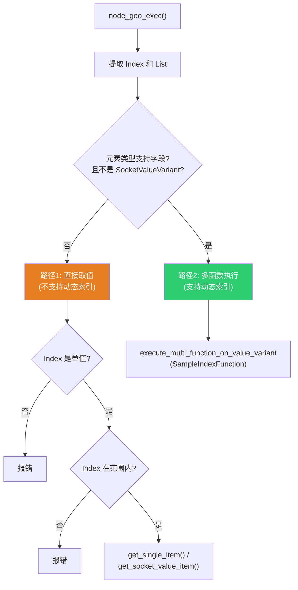

# Get List Item 节点

> 📖 系列文档：[目录](01-列表系统架构与核心数据结构.md) | [上一篇](05-ListLength与JoinList节点.md) | [下一篇](07-FilterList节点.md)
> 源码文件：[node_geo_list_get_item.cc](../../source/blender/nodes/geometry/nodes/node_geo_list_get_item.cc)

---

## 目录

1. [节点概述](#1-节点概述)
2. [节点声明与动态输出结构类型](#2-节点声明与动态输出结构类型)
3. [SampleIndexFunction — 自定义多函数](#3-sampleindexfunction--自定义多函数)
4. [索引越界处理](#4-索引越界处理)
5. [两条执行路径](#5-两条执行路径)
6. [get_single_item — 直接取值](#6-get_single_item--直接取值)
7. [get_socket_value_item — 复杂类型取值](#7-get_socket_value_item--复杂类型取值)
8. [输出结构类型的动态性](#8-输出结构类型的动态性)

---

## 1. 节点概述

**节点 ID**：`GeometryNodeListGetItem`
**功能**：从列表中按索引取值
**复杂度**：⭐⭐⭐

Get List Item 是最复杂的"消费型"列表节点，因为它需要处理多种输入输出模式：



---

## 2. 节点声明与动态输出结构类型

```cpp
static void node_declare(NodeDeclarationBuilder &b)
{
  const bNode *node = b.node_or_null();
  if (!node) return;

  const NodeGeometryListGetItem &storage = node_storage(*node);
  const eNodeSocketDatatype type = storage.socket_type;
  const bool is_auto_structure_type = storage.structure_type ==
                                      NodeSocketInterfaceStructureType::Auto;

  auto &list = b.add_input(type, "List"_ustr).structure_type(StructureType::List).hide_value();
  b.add_input<decl::Int>("Index"_ustr).min(0).structure_type(StructureType::Dynamic);
  b.add_output(type, "Value"_ustr)
      .propagate_all({list.index()})
      .propagate_references()
      .structure_type(is_auto_structure_type ? StructureType::Dynamic :
                                               StructureType(storage.structure_type));
}
```

> **`StructureType::Dynamic`**：输出结构类型取决于 Index 输入的实际类型。Auto 模式下由推断系统决定；用户也可以手动指定为 Single/Field/List。

> **`.propagate_all({list.index()})`**：传播**匿名属性**（如 Store Named Attribute 节点创建的属性）。从列表中取出一个几何体后，该几何体上的匿名属性仍然有效，需要传播到下游。

> **`.propagate_references()`**：传播**引用关系**——告诉声明系统"此输出的数据可能直接引用了输入列表中的数据"。与 `.propagate_all()` 的区别：
>
> | 传播方式 | 传播什么 | 类比 |
> |---------|---------|------|
> | `.propagate_all()` | 匿名属性（几何体上的属性数据） | 搬家时带上家具 |
> | `.propagate_references()` | 引用关系（输出引用了输入的数据） | 搬家时告诉新地址"我的信件还在旧邮箱" |
>
> 具体场景：列表中有 `[Mesh_A, Mesh_B, Mesh_C]`，Mesh_A 上有匿名属性 "position"。
>
> **Get List Item（Index=0）**：输出 = Mesh_A。输出**直接共享**输入列表中的数据（隐式共享，同一块内存），所以需要 `propagate_references()` 告诉声明系统"输出引用了输入的数据，输入不能被提前释放"。同时 Mesh_A 上的 "position" 属性需要 `propagate_all()` 传播。
>
> **Filter List（选择 [0, 2]）**：输出 = `[Mesh_A, Mesh_C]`。输出是**新创建的数组**（gather 产生新内存），不直接引用输入，所以不需要 `propagate_references()`。但匿名属性仍需 `propagate_all()` 传播。
>
> ```mermaid
> flowchart TD
>     subgraph "Get List Item — 输出直接共享输入数据"
>         GLI_In["输入列表<br/>[Mesh_A, Mesh_B, Mesh_C]"]
>         GLI_Out["输出 = Mesh_A<br/>↑ 隐式共享，同一块内存"]
>         GLI_In -.->|"隐式共享"| GLI_Out
>     end
>
>     subgraph "Filter List — 输出是新创建的数组"
>         FL_In["输入列表<br/>[Mesh_A, Mesh_B, Mesh_C]"]
>         FL_Out["输出列表<br/>[Mesh_A, Mesh_C]<br/>↑ gather 创建新内存"]
>         FL_In -->|"gather"| FL_Out
>     end
>
>     style GLI_Out fill:#9b59b6,color:#fff
>     style FL_Out fill:#2ecc71,color:#fff
> ```

### DNA 存储

```cpp
struct NodeGeometryListGetItem {
  eNodeSocketDatatype socket_type = SOCK_FLOAT;
  NodeSocketInterfaceStructureType structure_type = NodeSocketInterfaceStructureType::Auto;
  char _pad = {};
};
```

---

## 3. SampleIndexFunction — 自定义多函数

Get List Item 的核心是 `SampleIndexFunction`——一个自定义的 `MultiFunction`，将列表"采样"操作封装为可组合的函数单元。



```cpp
class SampleIndexFunction : public mf::MultiFunction {
  GListPtr list_;           // 持有列表引用（通过 GListPtr 共享）
  mf::Signature signature_;

 public:
  SampleIndexFunction(GListPtr list) : list_(std::move(list))
  {
    mf::SignatureBuilder builder{"Sample Index", signature_};
    builder.single_input<int>("Index");
    builder.single_output("Value", list_->cpp_type());
    this->set_signature(&signature_);
  }
```

> **`GListPtr list_`**：通过共享指针持有列表。`SampleIndexFunction` 被包装为 `std::shared_ptr` 传入字段系统，列表的生命周期由 `GListPtr` 管理。

> **`builder.single_input<int>("Index")`**：声明 Index 为单值输入（每个索引位置一个 int）。

> **`builder.single_output("Value", ...)`**：声明 Value 为单值输出（每个索引位置一个值）。

### call 方法实现

```cpp
void call(const IndexMask &mask, mf::Params params, mf::Context /*context*/) const override
{
  const VArraySpan<int> indices = params.readonly_single_input<int>(0, "Index");
  GMutableSpan dst = params.uninitialized_single_output(1, "Value");

  // 步骤1：分离有效和无效索引
  IndexMaskMemory memory;
  const IndexMask valid_indices = array_utils::indices_in_range(
      mask, indices, IndexRange(list_->size()), memory);

  // 步骤2：对无效索引填充默认值
  if (valid_indices.size() != mask.size()) {
    const IndexMask invalid_indices = valid_indices.complement(mask, memory);
    list_->cpp_type().fill_construct_indices(
        list_->cpp_type().default_value(), dst.data(), invalid_indices);
  }

  // 步骤3：根据存储变体读取值
  const GList::DataVariant &data = list_->data();
  if (const auto *array_data = std::get_if<nodes::GList::ArrayData>(&data)) {
    const GSpan src(list_->cpp_type(), array_data->data, list_->size());
    valid_indices.foreach_index([&](const int i, const int mask) {
      list_->cpp_type().copy_construct(src[indices[i]], dst[mask]);
    });
  }
  else if (const auto *single_data = std::get_if<nodes::GList::SingleData>(&data)) {
    list_->cpp_type().fill_construct_indices(single_data->value, dst.data(), valid_indices);
  }
}
```

> **`VArraySpan<int>`**：VArray 的跨度视图。当 VArray 内部是连续内存时直接提供指针访问；否则先物化。

> **`array_utils::indices_in_range`**：向量化边界检查，返回在 `[0, list_size)` 范围内的索引掩码。

> **`fill_construct_indices`**：只在掩码指定位置填充值，跳过其他位置。

> **`valid_indices.foreach_index`**：遍历有效索引。lambda 接收两个参数：`i` 是原始索引位置，`mask` 是掩码中的位置。

### hash_unique — 字段去重

```cpp
void hash_unique(UniqueHashBytes &hash) const override
{
  static constexpr int8_t id = 0;
  hash.add(&id);
  hash.add(list_.get());  // 使用列表指针作为哈希的一部分
}
```

> **字段去重**：如果两个 `SampleIndexFunction` 持有相同的列表指针，哈希相同，字段系统可以合并它们避免重复计算。

---

## 4. 索引越界处理



越界索引**不会报错**，而是静默填充默认值。这与 Blender 的"Sample Index"节点行为一致。

---

## 5. 两条执行路径



**路径1**：不支持字段的类型（Geometry、String、SocketValueVariant 等），只能用单值索引。

**路径2**：支持字段的类型（Float、Int、Vector 等），可以使用动态索引（字段/列表）。

### 路径选择的代码实现

```cpp
const CPPType &list_type = list->cpp_type();
const std::optional<eNodeSocketDatatype> socket_type =
    bke::geo_nodes_base_cpp_type_to_socket_type(list_type);

if (list_type.is<bke::SocketValueVariant>() || !socket_type_supports_fields(*socket_type)) {
  // 路径1：直接取值
  // ...
  if (list->cpp_type().is<bke::SocketValueVariant>()) {  // ← 为什么不用 list_type？
    params.set_output("Value"_ustr, get_socket_value_item(list, index_int));
  }
  else {
    params.set_output("Value"_ustr, get_single_item(list, *socket_type, index_int));
  }
}
else {
  // 路径2：多函数执行
}
```

> **为什么第 244 行写 `list->cpp_type().is<SocketValueVariant>()` 而非 `list_type.is<SocketValueVariant>()`？** 两者完全等价——`list_type` 就是第 227 行 `const CPPType &list_type = list->cpp_type()` 保存的引用，`list->cpp_type()` 返回的也是同一个 `CPPType&`。第 244 行重复调用是代码风格不一致，没有技术原因。使用 `list_type` 更好——避免一次函数调用（虽然 `cpp_type()` 只是返回成员引用，开销可忽略），且意图更清晰。
```

> **`geo_nodes_base_cpp_type_to_socket_type(list_type)`**：将 `CPPType` 映射回 `eNodeSocketDatatype` 枚举。返回 `std::optional` 因为**不是所有 CPPType 都有对应的 Socket 类型**——`CPPType` 可以注册任意 C++ 类型，但 Socket 类型只有有限的几种。没有匹配时返回 `std::nullopt`。
>
> 内部实现是一个 if 链：`type.is<float>() → SOCK_FLOAT`，`type.is<int>() → SOCK_INT`，...，最后 `return std::nullopt`。
>
> **`return SOCK_FLOAT` 是隐式转换吗？** 是的。`SOCK_FLOAT` 是 `eNodeSocketDatatype` 枚举值，`std::optional<eNodeSocketDatatype>` 有非 explicit 构造函数接受 `eNodeSocketDatatype`，所以 `return SOCK_FLOAT` 隐式构造了 `std::optional(SOCK_FLOAT)`。等价于 `return std::optional<eNodeSocketDatatype>(SOCK_FLOAT)`。

> **`list_type.is<bke::SocketValueVariant>()` 为什么需要单独检查？** 因为 `SocketValueVariant` 是内部容器类型，`geo_nodes_base_cpp_type_to_socket_type` 的 if 链中**没有** `type.is<bke::SocketValueVariant>()` 这个分支，所以 `socket_type` 会是 `std::nullopt`。如果直接对 `*socket_type` 解引用会崩溃（空 optional 不能解引用），所以必须先检查。
>
> **调试器为什么报 "has no member 'is<bke::SocketValueVariant>()'"？** 这是调试器的显示限制，不是编译错误。`CPPType::is<T>()` 是模板成员函数，调试器无法在"成员列表"中显示模板实例化后的函数名。代码本身是正确的——`SocketValueVariant` 已注册到 CPPType 系统（`BLI_CPP_TYPE_REGISTER(bke::SocketValueVariant, ...)`），`is<SocketValueVariant>()` 可以正常调用。

### 路径1：`index.convert_to_single()` 详解

路径1的代码：

```cpp
if (!index.is_single()) {
  params.error_message_add(NodeWarningType::Error, "Index must be a single value");
  params.set_default_remaining_outputs();
  return;
}
index.convert_to_single();
const int index_int = index.get<int>();
```

> **`index.convert_to_single()` 做了什么？** 将 `SocketValueVariant` 转换为单值模式。`index` 可能是三种 Kind 之一：Single（单值）、Field（字段）、List（列表）。`convert_to_single` 确保它变成 Single 模式，以便后续用 `get<int>()` 直接取值。
>
> 实现源码（[node_socket_value.cc:469~497](../../source/blender/blenkernel/intern/node_socket_value.cc)）：
>
> ```cpp
> void SocketValueVariant::convert_to_single()
> {
>   switch (this->kind()) {
>     case Kind::Single: {
>       /* Nothing to do. */
>       break;  // 已经是单值，什么都不做
>     }
>     case Kind::Field: {
>       /* Evaluates the field without inputs to try to get a single value.
>        * If the field depends on context, the default value is used instead. */
>       fn::GField field = std::move(value_.get<fn::GField>());
>       void *buffer = this->allocate_single(this->socket_type());
>       fn::evaluate_constant_field(field, buffer);
>       break;  // 字段 → 尝试求值为常量
>     }
>     case Kind::List:
>     case Kind::Grid: {
>       /* Can't convert a grid to a single value, so just use the default value. */
>       const CPPType &cpp_type = *socket_type_to_geo_nodes_base_cpp_type(this->socket_type());
>       this->store_single(this->socket_type(), cpp_type.default_value());
>       break;  // 列表/网格 → 使用默认值
>     }
>     case Kind::None: {
>       BLI_assert_unreachable();
>       break;
>     }
>   }
> }
> ```
>
> 三种转换路径：
>
> | 当前 Kind | 转换方式 | 说明 |
> |-----------|---------|------|
> | `Single` | 什么都不做 | 已经是单值 |
> | `Field` | `evaluate_constant_field` | 尝试在无上下文的情况下求值字段。如果字段是常量（如 `1 + 2`），得到 `3`；如果依赖上下文（如 `position`），使用默认值 |
> | `List` / `Grid` | `default_value()` | 无法从列表/网格提取单值，直接使用类型的默认值（如 `0`、`0.0`、`(0,0,0)`） |
>
> **为什么路径1要先检查 `!index.is_single()` 再调用 `convert_to_single()`？** 因为路径1不支持动态索引。如果 index 是字段或列表，说明用户连了一个动态索引，但当前元素类型（如 Geometry）不支持字段操作。所以先报错，不执行。但 `convert_to_single()` 仍然被调用——这是为了处理 index 可能是"常量字段"的情况（如一个整数常量被包装为字段），`convert_to_single()` 可以从中提取出单值。
>
> ```mermaid
> flowchart TD
>     Index["index (SocketValueVariant)"]
>     Check{"index.is_single()?"}
>     
>     Check -->|"否"| Error["报错: Index must be a single value"]
>     Check -->|"是"| CTS["convert_to_single()"]
>     
>     CTS --> Kind{"kind()?"}
>     Kind -->|"Single"| Nop["什么都不做<br/>（已经是单值）"]
>     Kind -->|"Field"| Eval["evaluate_constant_field()<br/>尝试求值常量字段"]
>     Eval --> Const{"是常量?"}
>     Const -->|"是"| GetValue["得到值（如 3）"]
>     Const -->|"否"| Default1["使用默认值（如 0）"]
>     Kind -->|"List/Grid"| Default2["使用默认值<br/>（无法从列表提取单值）"]
>     
>     Nop --> Get["index.get&lt;int&gt;()"]
>     GetValue --> Get
>     Default1 --> Get
>     Default2 --> Get
> 
>     style Error fill:#e74c3c,color:#fff
>     style Nop fill:#2ecc71,color:#fff
>     style Eval fill:#3498db,color:#fff
>     style Default2 fill:#f39c12,color:#fff
>     style Get fill:#9b59b6,color:#fff
> ```
>
> **`allocate_single` 做了什么？** 在 `SocketValueVariant` 内部的 `Any` 存储中分配指定类型的空间。它是一个 switch 语句，根据 `socket_type` 分配对应类型的内存：
>
> ```cpp
> void *SocketValueVariant::allocate_single(const eNodeSocketDatatype socket_type)
> {
>   void *ptr = nullptr;
>   switch (socket_type) {
>     case SOCK_FLOAT:   ptr = value_.allocate<float>();           break;
>     case SOCK_INT:     ptr = value_.allocate<int>();             break;
>     case SOCK_VECTOR:  ptr = value_.allocate<float3>();          break;
>     case SOCK_BOOLEAN: ptr = value_.allocate<bool>();            break;
>     case SOCK_ROTATION: ptr = value_.allocate<math::Quaternion>(); break;
>     case SOCK_MATRIX:  ptr = value_.allocate<float4x4>();        break;
>     case SOCK_RGBA:    ptr = value_.allocate<ColorGeometry4f>(); break;
>     case SOCK_STRING:  ptr = value_.allocate<std::string>();     break;
>     // ... 更多类型
>   }
>   return ptr;
> }
> ```
>
> **`evaluate_constant_field` 做了什么？** 在无上下文的情况下求值字段。如果字段不依赖任何上下文输入（如 `1 + 2`），直接计算出结果。如果字段依赖上下文（如 `position.x`），无法求值，`buffer` 中保持 `allocate_single` 分配的未初始化内存——但 `convert_to_single` 会在之后设置 `kind_ = Single`，所以这个值会被当作默认值使用。
>
> ```mermaid
> flowchart TD
>     LT["list_type = list->cpp_type()"]
>     Check1{"list_type.is<br/>&lt;SocketValueVariant&gt;()?"}
>     
>     Check1 -->|"是"| SVV["socket_type = nullopt<br/>走 get_socket_value_item 路径"]
>     Check1 -->|"否"| ST["socket_type = SOCK_FLOAT/INT/..."]
>     
>     ST --> Check2{"socket_type_supports_fields<br/>(*socket_type)?"}
>     Check2 -->|"否"| Single["走 get_single_item 路径<br/>（Geometry、Object 等）"]
>     Check2 -->|"是"| Field["走 SampleIndexFunction 路径<br/>（Float、Int、Vector 等）"]
> 
>     style Check1 fill:#e74c3c,color:#fff
>     style SVV fill:#f39c12,color:#fff
>     style Single fill:#e67e22,color:#fff
>     style Field fill:#2ecc71,color:#fff
> ```

---

## 6. get_single_item — 直接取值

```cpp
static bke::SocketValueVariant get_single_item(GListPtr &list,
                                               const eNodeSocketDatatype socket_type,
                                               const int64_t index)
{
  bke::SocketValueVariant value;
  void *value_ptr = value.allocate_single(socket_type);

  if (const auto *data = std::get_if<GList::ArrayData>(&list->data())) {
    if (list->is_mutable() && data->sharing_info->is_mutable()) {
      // 唯一所有者 → 移动（避免拷贝）
      GMutableSpan data_span(list->cpp_type(), const_cast<void *>(data->data), list->size());
      list->cpp_type().move_construct(data_span[index], value_ptr);
      return value;
    }
    // 被共享 → 必须拷贝
    const GSpan data_span(list->cpp_type(), data->data, list->size());
    list->cpp_type().copy_construct(data_span[index], value_ptr);
    return value;
  }

  if (const auto *data = std::get_if<GList::SingleData>(&list->data())) {
    if (list->is_mutable() && data->sharing_info->is_mutable()) {
      list->cpp_type().move_construct(const_cast<void *>(data->value), value_ptr);
      return value;
    }
    list->cpp_type().copy_construct(data->value, value_ptr);
    return value;
  }
}
```

> **移动 vs 拷贝**：当列表和数据都是唯一所有者时，可以安全移动。移动后列表中该位置的元素处于"有效但未指定"状态，但因为我们已经提取了整个列表（`extract_input`），不会再使用它。

---

## 7. get_socket_value_item — 复杂类型取值

```cpp
static bke::SocketValueVariant get_socket_value_item(GListPtr &list, const int64_t index)
{
  if (const auto *data = std::get_if<GList::ArrayData>(&list->data())) {
    if (list->is_mutable() && data->sharing_info->is_mutable()) {
      MutableSpan data_span(
          static_cast<bke::SocketValueVariant *>(const_cast<void *>(data->data)),
          list->size());
      return std::move(data_span[index]);  // 移动整个 SocketValueVariant
    }
    const Span data_span(
        static_cast<bke::SocketValueVariant *>(const_cast<void *>(data->data)),
        list->size());
    return data_span[index];  // 拷贝
  }
  // SingleData 处理...
}
```

> **`static_cast<SocketValueVariant*>(const_cast<void*>(data->data))`**：双重类型转换。先 `const_cast` 移除 const，再 `static_cast` 转为具体类型。安全因为我们知道 `cpp_type()` 是 `SocketValueVariant`。

> **为什么需要单独的函数？** `SocketValueVariant` 本身是变体类型，不能像 `float` 一样简单地 `copy_construct`。需要移动/拷贝整个 `SocketValueVariant` 对象。

---

## 8. 输出结构类型的动态性

| Index 类型 | 输出结构类型 | 说明 |
|-----------|-------------|------|
| 单值 (Single) | Single | 取一个值 |
| 字段 (Field) | Field | 每个索引取一个值，形成字段 |
| 列表 (List) | List | 每个索引取一个值，形成列表 |

这种动态性通过 `StructureType::Dynamic` 声明和结构类型推断系统实现。当用户选择 "Auto" 时，推断系统根据 Index 输入的实际类型自动决定输出结构类型。
