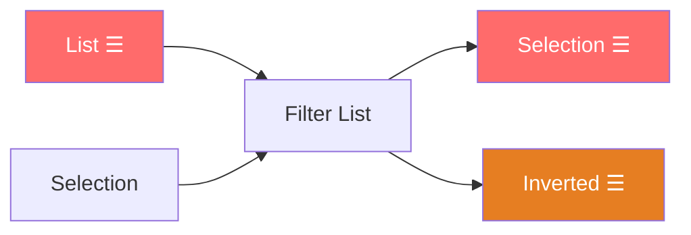
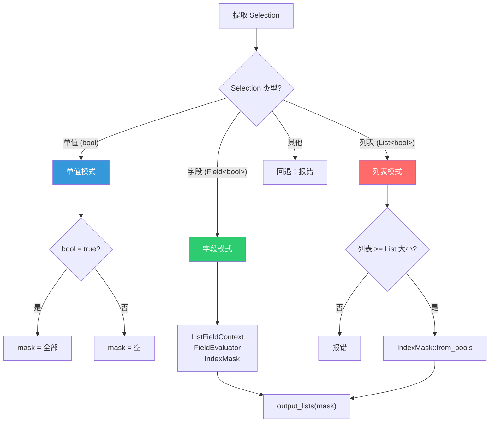
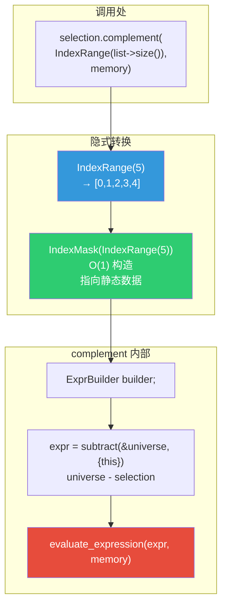
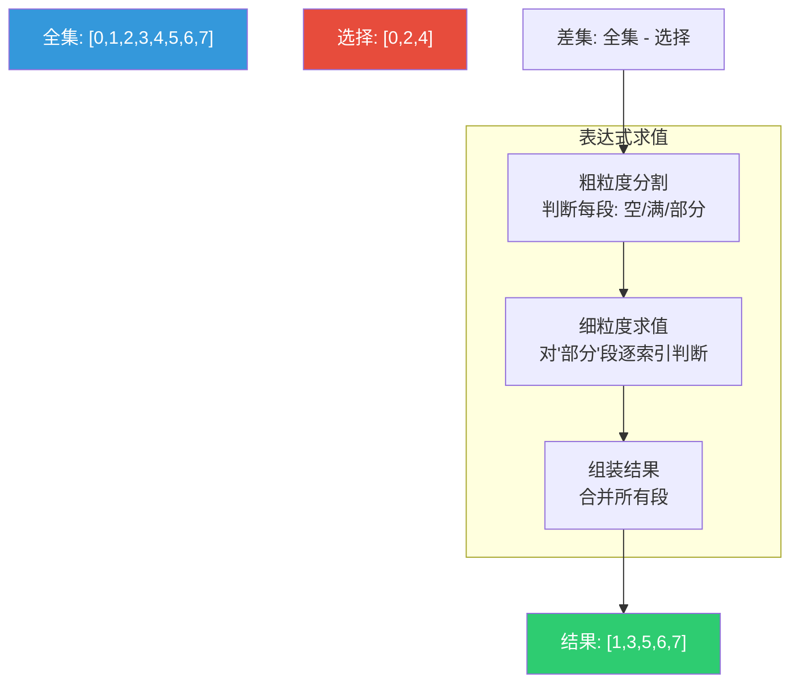
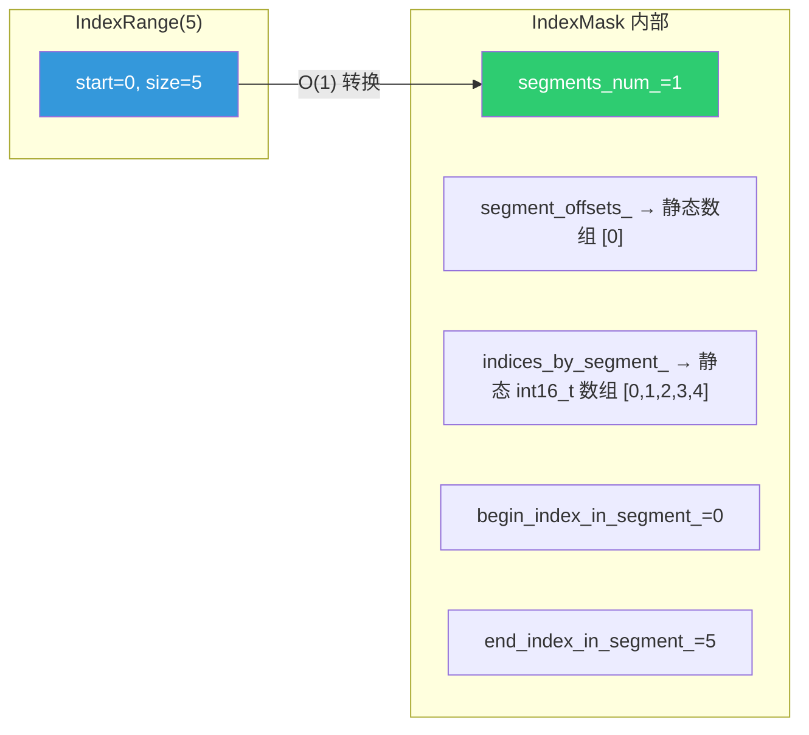
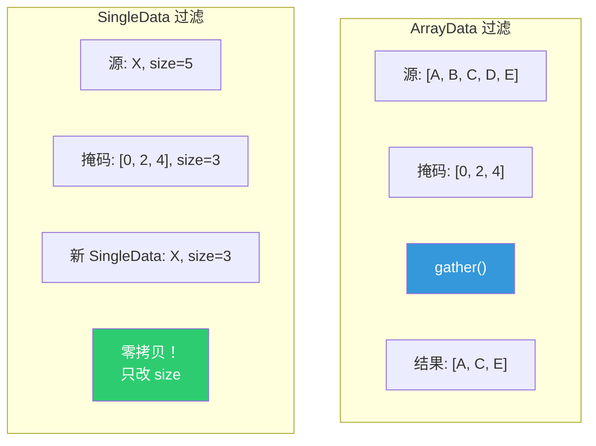
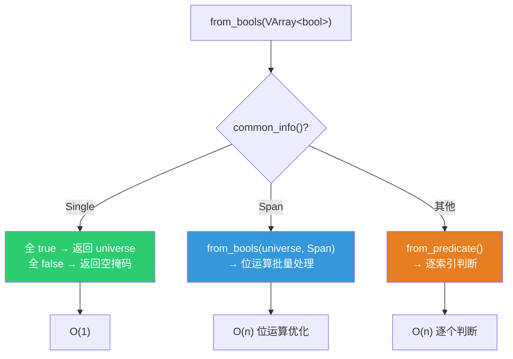
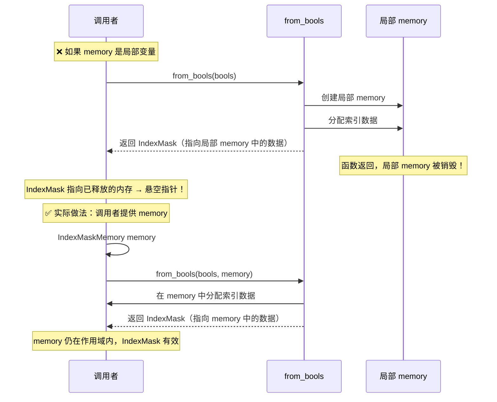
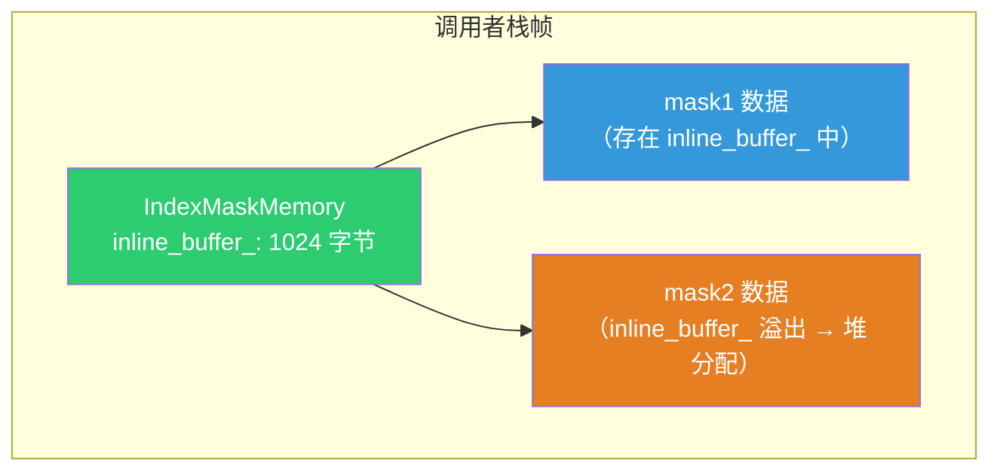

# Filter List 节点

> 📖 系列文档：[目录](01-列表系统架构与核心数据结构.md) | [上一篇](06-GetListItem节点.md) | [下一篇](08-FieldToList节点.md)
> 源码文件：[node_geo_filter_list.cc](../../source/blender/nodes/geometry/nodes/node_geo_filter_list.cc)

---

## 目录

- [Filter List 节点](#filter-list-节点)
  - [目录](#目录)
  - [1. 节点概述](#1-节点概述)
    - [核心设计](#核心设计)
  - [2. 节点声明](#2-节点声明)
  - [3. 核心过滤函数 filter\_list](#3-核心过滤函数-filter_list)
  - [4. 三种过滤模式](#4-三种过滤模式)
    - [单值模式](#单值模式)
    - [字段模式](#字段模式)
    - [列表模式](#列表模式)
  - [5. 双输出：Selection 与 Inverted](#5-双输出selection-与-inverted)
    - [complement() 实现详解](#complement-实现详解)
    - [IndexRange → IndexMask 的隐式转换](#indexrange--indexmask-的隐式转换)
  - [6. SingleData 的零开销过滤](#6-singledata-的零开销过滤)
  - [7. IndexMask::from\_bools 实现详解](#7-indexmaskfrom_bools-实现详解)
    - [内部实现](#内部实现)
    - [为什么传入 memory 而不是函数内局部变量？](#为什么传入-memory-而不是函数内局部变量)

---

## 1. 节点概述

**节点 ID**：`GeometryNodeFilterList`
**功能**：按布尔选择条件过滤列表元素，同时输出选中项和反转项
**复杂度**：⭐⭐⭐

### 核心设计

Filter List 有两个输出——Selection（选中的元素）和 Inverted（未选中的元素）。Selection 输入支持三种类型：单值布尔、布尔字段、布尔列表。



---

## 2. 节点声明

```cpp
static void node_declare(NodeDeclarationBuilder &b)
{
  const bNode *node = b.node_or_null();
  if (!node) return;
  const auto type = eNodeSocketDatatype(node->custom1);

  b.add_input(type, "List"_ustr).structure_type(StructureType::List).hide_value();
  b.add_input<decl::Bool>("Selection"_ustr)
      .default_value(true)
      .hide_value()
      .description("A field or list representing the values that will not be removed")
      .structure_type(StructureType::Dynamic);  // 单值/字段/列表

  b.add_output(type, "Selection"_ustr)
      .propagate_all({0})
      .structure_type(StructureType::List)
      .align_with_previous();
  b.add_output(type, "Inverted"_ustr)
      .propagate_all({0})
      .structure_type(StructureType::List)
      .align_with_previous();
}
```

> **`.propagate_all({0})`**：传播来自第 0 个输入（List）的匿名属性。列表元素可能是几何体，几何体上可能有匿名属性（如 Store Named Attribute 节点创建的）。如果不传播，过滤后的几何体会丢失匿名属性，下游节点无法引用它们。

> **为什么 Filter List 不需要 `.propagate_references()`？** 与 Get List Item 不同，Filter List 的输出是**新创建的数组**（`gather` 产生新内存），不直接引用输入列表的数据。因此不需要告诉声明系统"输出引用了输入的数据"。对比：
>
> | 节点 | 输出与输入的关系 | 需要 `propagate_references()`？ | 原因 |
> |------|----------------|-------------------------------|------|
> | Get List Item | 输出**直接共享**输入列表中的数据（隐式共享） | ✅ 需要 | 输出引用了输入，输入不能被提前释放 |
> | Filter List | 输出是 `gather` 创建的**新数组** | ❌ 不需要 | 输出不引用输入，两者内存独立 |
>
> ```mermaid
> flowchart LR
>     subgraph "Get List Item — 需要 propagate_references()"
>         GLI_In["输入列表<br/>[Mesh_A, Mesh_B, Mesh_C]"]
>         GLI_Out["输出 = Mesh_A<br/>↑ 隐式共享，同一块内存"]
>         GLI_In -.->|"隐式共享"| GLI_Out
>     end
>
>     subgraph "Filter List — 不需要 propagate_references()"
>         FL_In["输入列表<br/>[Mesh_A, Mesh_B, Mesh_C]"]
>         FL_Out["输出列表<br/>[Mesh_A, Mesh_C]<br/>↑ gather 创建新内存"]
>         FL_In -->|"gather"| FL_Out
>     end
>
>     style GLI_Out fill:#9b59b6,color:#fff
>     style FL_Out fill:#2ecc71,color:#fff
> ```

> **`.align_with_previous()`**：Selection 和 Inverted 输出并排显示。

---

## 3. 核心过滤函数 filter_list

```cpp
static GListPtr filter_list(const GListPtr &list, const IndexMask &mask)
{
  if (mask.size() == list->size()) {
    return list;  // 全选 → 零拷贝返回
  }

  const CPPType &list_type = list->cpp_type();
  return std::visit(
      [&]<typename T>(const T &src_data) {
        if constexpr (std::is_same_v<T, GList::ArrayData>) {
          GArray<> dst_data(list_type, mask.size());
          array_utils::gather(GSpan(list_type, src_data.data, list->size()), mask, dst_data);
          return GList::from_garray(std::move(dst_data));
        }
        else if constexpr (std::is_same_v<T, GList::SingleData>) {
          return GList::create(list_type, src_data, mask.size());
        }
      },
      list->data());
}
```

> **`std::visit` + 模板 Lambda**：`std::visit` 是 C++17 的变体访问函数——"根据变体当前持有的类型，自动调用对应的处理代码，且保证你处理了所有可能的类型"。
>
> 为什么需要它？`list->data()` 返回 `std::variant<ArrayData, SingleData>`——你不知道它当前是哪个，必须先判断再处理。没有 `std::visit` 的写法是手动 `std::get_if` + `if-else`，但那样如果 variant 新增了第三种类型，不会报错，只会静默忽略。`std::visit` 会**编译报错**——"你没有处理所有类型"，保证不遗漏。

> **`[&]<typename T>` — 模板 Lambda（C++20）**：这是 C++20 引入的**带显式模板参数的 Lambda**，俗称"模板匿名函数"。语法拆解：
>
> | 部分 | 含义 |
> |------|------|
> | `[&]` | 按引用捕获外部变量（`list_type`、`mask`、`list`） |
> | `<typename T>` | 声明模板参数 `T`（C++20 新增） |
> | `(const T &src_data)` | 参数类型由 `std::visit` 用变体的实际类型替换 |
>
> `std::visit` 调用这个 lambda 时，如果变体持有 `ArrayData`，则 `T = GList::ArrayData`；如果持有 `SingleData`，则 `T = GList::SingleData`。这样 `T` 就是一个**真正的类型名**，可以在 `if constexpr` 中使用。

> **为什么不能用 C++14 的 `auto` Lambda？** C++14 允许 `[](const auto &src_data)`，但 `auto` 是**占位类型说明符**（Placeholder Type Specifier），不是类型名——它的含义是"请编译器帮我推导类型"，你无法在 `if constexpr` 中写 `std::is_same_v<auto?, GList::ArrayData>`，因为 `auto` 不是一个可以在类型计算中使用的名字。
>
> | 特性 | `auto`（C++14 泛型 Lambda） | `typename T`（C++20 模板 Lambda） |
> |------|---------------------------|--------------------------------|
> | 本质 | 占位符——"请编译器推导" | 真正的模板类型参数 |
> | 能否在 `if constexpr` 中判断类型 | ❌ `auto` 不是类型名，无法写 `std::is_same_v` | ✅ `T` 是类型名，可以写 `std::is_same_v<T, X>` |
> | 能否做类型计算 | ❌ 不能写 `typename auto::value_type` | ✅ 可以写 `typename T::value_type` |
> | 类比 | 快递柜取件码——"有东西在这，但不知道是什么" | 身份证——"知道这个人是谁，能查所有信息" |
>
> 对比两种写法：
>
> ```cpp
> // ❌ C++14 auto lambda：无法在 if constexpr 中判断类型
> std::visit([](const auto &src_data) {
>     // auto 不是类型名，无法写 std::is_same_v<decltype(src_data), X>
>     // 即使能写，也不如 T 直观
> }, list->data());
>
> // ✅ C++20 模板 lambda：T 是真正的类型名
> std::visit([&]<typename T>(const T &src_data) {
>     if constexpr (std::is_same_v<T, GList::ArrayData>) { ... }
>     else if constexpr (std::is_same_v<T, GList::SingleData>) { ... }
> }, list->data());
> ```

> **`if constexpr`**：编译期分支。在编译时决定保留哪个分支，另一个分支的代码根本不存在（不会编译）。比运行时 `if` 更高效，且允许两个分支有不兼容的代码。**必须配合 `typename T`**——因为 `if constexpr (std::is_same_v<T, ...>)` 需要在编译期知道 `T` 是什么，而 `auto` 不是类型名，无法参与这个判断。

> **ArrayData 分支**：`array_utils::gather` 从源数组中按 `mask` 指定的索引收集元素到目标数组。例如 mask={0,2,4}，则取 src[0]、src[2]、src[4]。内部使用 SIMD 优化。`GList::from_garray` 将收集结果包装为 GList。

> **`GArray<>` 为什么不写模板参数？** `GArray` 的完整声明是 `template<typename Allocator = GuardedAllocator> class GArray`——它只有一个模板参数：**分配器类型**，默认值是 `GuardedAllocator`。`<>` 表示使用默认参数，等价于 `GArray<GuardedAllocator>`。注意 `GArray` **没有元素类型参数**——它是泛型数组，元素类型在运行时通过 `CPPType` 指针存储（`const CPPType *type_`），而非编译期模板参数。这与 `Array<T>` 不同：`Array<float>` 在编译期知道类型，`GArray<>` 在运行时才知道类型。
>
> | 类 | 元素类型 | 分配器 | 何时知道类型 |
> |------|---------|--------|------------|
> | `Array<T>` | 编译期（模板参数 `T`） | 可选，默认 `GuardedAllocator` | 编译期 |
> | `GArray<>` | 运行时（构造函数参数 `const CPPType &type`） | 可选，默认 `GuardedAllocator` | 运行期 |
>
> 所以 `GArray<> dst_data(list_type, mask.size())` 创建一个运行时类型为 `list_type` 的泛型数组，大小为 `mask.size()`。

> **为什么 ArrayData 分支用 `from_garray` 而非 `GList::create`？** 两种方法都可以创建包含 ArrayData 的 GList，但 `from_garray` 做了**隐式共享**的包装——它把 `GArray` 包进 `ImplicitSharedValue<GArray<>>`，使得 GList 的数据可以被多个消费者共享（写时复制）。而 `GList::create` 是底层工厂方法，只做堆分配，不管隐式共享：
>
> ```cpp
> // from_garray 的实现：自动包装隐式共享
> GListPtr GList::from_garray(GArray<> array)
> {
>   auto *sharable_data = new ImplicitSharedValue<GArray<>>(std::move(array));
>   ArrayData array_data;
>   array_data.data = sharable_data->data.data();
>   array_data.sharing_info = ImplicitSharingPtr<>(sharable_data);  // ← 关键：设置共享信息
>   return GList::create(
>       sharable_data->data.type(), std::move(array_data), sharable_data->data.size());
> }
> ```
>
> 如果直接用 `GList::create`，你需要手动构造 `ArrayData` 并设置 `sharing_info`——容易出错。`from_garray` 一步到位：`GArray` → 隐式共享包装 → `ArrayData` → `GList`。
>
> ```mermaid
> flowchart LR
>     GA["GArray<br/>dst_data"]
>     ISV["ImplicitSharedValue<br/>GArray"]
>     AD["ArrayData<br/>data + sharing_info"]
>     GL["GListPtr"]
>
>     GA -->|"std::move"| ISV --> AD -->|"GList::create"| GL
>
>     style GA fill:#3498db,color:#fff
>     style ISV fill:#f39c12,color:#fff
>     style GL fill:#2ecc71,color:#fff
> ```

> **`GList::create` 为什么用 `MEM_new` 而非 `new`？** `MEM_new<GList>(__func__, ...)` 是 Blender 的内存分配函数，等价于 `new GList(...)` 但多了两个功能：
>
> 1. **内存泄漏检测**：`__func__`（当前函数名）作为分配标签，Blender 的 GuardedAlloc 系统可以在程序退出时报告"哪些分配没有被释放"，方便排查泄漏
> 2. **统计信息**：Blender 可以统计每种类型的内存使用量，用于性能分析
>
> ```cpp
> // MEM_new 的实现（简化）
> template<typename T, typename... Args>
> inline T *MEM_new(const char *allocation_name, Args &&...args)
> {
>   void *buffer = mem_mallocN_aligned(sizeof(T), alignof(T), allocation_name, ...);
>   return new (buffer) T(std::forward<Args>(args)...);  // placement new
> }
> ```
>
> `MEM_new` = `malloc`（带标签）+ `placement new`（调用构造函数）。`new GList(...)` 也能工作，但无法被 Blender 的内存追踪系统监控。Blender 代码规范要求所有堆分配都使用 `MEM_*` 系列函数。

> **SingleData 分支**：单值重复模式——所有元素都相同，过滤后仍然相同，只需改变 `size`。不需要 gather，直接 `GList::create(list_type, src_data, mask.size())` 创建新的 SingleData。这里用 `GList::create` 而非 `from_garray` 是因为 SingleData 不需要隐式共享包装——它只存一个值，共享开销不值得。

---

## 4. 三种过滤模式



### 单值模式

```cpp
if (filter_value.is_single()) {
  if (filter_value.get<bool>()) {
    output_lists(params, list, IndexMask(list->size()));  // 全选
  } else {
    output_lists(params, list, {});  // 全不选
  }
}
```

> **最简单的模式**：Selection 是单个布尔值。true → 全选（mask = 列表大小范围），false → 全不选（mask = 空）。`IndexMask(list->size())` 构造包含 `[0, 1, ..., size-1]` 的掩码，`{}` 构造空掩码。

### 字段模式

```cpp
else if (filter_value.is_context_dependent_field()) {
  ListFieldContext field_context;
  fn::FieldEvaluator field_evaluator(field_context, list->size());
  field_evaluator.add(filter_value.extract<Field<bool>>());
  field_evaluator.evaluate();
  output_lists(params, list, field_evaluator.get_evaluated_as_mask(0));
}
```

> **为什么这么复杂？** 因为字段（Field）不是数据，而是**计算公式**。你不能直接"读取"一个字段的值——你必须**求值**它。这个过程需要三样东西：
>
> 1. **上下文**（`ListFieldContext`）：告诉字段"你在什么环境下求值"。几何节点中的字段通常依赖几何体上下文（如位置、法线），但列表上下文没有几何体——只有索引。`ListFieldContext` 的 `get_varray_for_input` 只识别两种输入：`IndexFieldInput`（返回索引数组 `[0,1,2,...]`）和 `IDAttributeFieldInput`（也返回索引），其他输入返回空。
>
> 2. **大小**（`list->size()`）：告诉求值器"有多少个元素需要计算"。字段是惰性的——你不告诉它大小，它不知道该算几个值。
>
> 3. **求值器**（`FieldEvaluator`）：实际执行计算的引擎。`add()` 注册要计算的字段，`evaluate()` 执行计算，`get_evaluated_as_mask(0)` 将第 0 个字段的布尔结果转为 `IndexMask`。
>
> ```mermaid
> sequenceDiagram
>     participant SVV as SocketValueVariant
>     participant FE as FieldEvaluator
>     participant LFC as ListFieldContext
>     participant Field as Field<bool>
>
>     SVV->>FE: extract<Field<bool>>()
>     FE->>FE: add(field)
>     FE->>FE: evaluate()
>     FE->>LFC: get_varray_for_input(IndexFieldInput)
>     LFC-->>FE: VArray: [0, 1, 2, ..., n-1]
>     FE->>Field: 用索引数组求值
>     Field-->>FE: VArray<bool>: [true, false, true, ...]
>     FE->>FE: get_evaluated_as_mask(0)
>     FE-->>FE: IndexMask: [0, 2, ...]
> ```
>
> **为什么不能像单值模式那样直接取值？** 因为字段的值**还不存在**——它是一个延迟计算的函数。单值模式中 `filter_value.get<bool>()` 直接读取已存在的值；字段模式中 `filter_value.extract<Field<bool>>()` 取出的是**计算公式**，必须经过 `FieldEvaluator` 执行后才能得到结果。

> **`ListFieldContext field_context;`**：在栈上构造列表字段上下文。`ListFieldContext` 继承 `FieldContext`，代表"列表上下文"（不关联几何体，只有列表大小）。声明变量就是在栈上构造对象，不需要 `new` 或指针。它没有参数是因为构造函数不需要——与关联几何体的 `FieldContext` 不同，列表上下文只需要知道大小（通过 `FieldEvaluator` 的第二个参数传入）。

> **`filter_value.extract<Field<bool>>()`**：从 `SocketValueVariant` 中**移动取出**字段。`extract` 与 `get` 的区别：`extract` 取出后原变量不再持有该值（移动语义），`get` 只是读取（拷贝/引用）。这里用 `extract` 是因为字段求值后 `filter_value` 不再需要。

> **`get_evaluated_as_mask(0)`**：将第 0 个字段的求值结果转换为 `IndexMask`。对于布尔字段，true 的位置被包含在掩码中。

### 列表模式

```cpp
else if (filter_value.is_list()) {
  const GListPtr keep_list = filter_value.get<GListPtr>();
  const VArray<bool> values = keep_list->varray().typed<bool>();
  if (values.size() < list->size()) {
    params.error_message_add(NodeWarningType::Error, "\"Selection\" list is too small");
    params.set_default_remaining_outputs();
    return;
  }
  IndexMaskMemory memory;
  output_lists(params, list, IndexMask::from_bools(values, memory));
}
```

> **`filter_value.get<GListPtr>()`**：从 `SocketValueVariant` 中**读取**列表指针。注意这里用 `get` 而非 `extract`——因为后面还需要 `filter_value` 的信息（如 `list->size()` 检查），而且 `GListPtr` 是共享指针，`get` 返回的是拷贝（增加引用计数），不会转移所有权。

> **为什么变量名叫 `keep_list`？** 因为这个列表代表"要保留（keep）的元素"——列表中为 true 的位置对应"不被移除"的元素。Filter List 的 Selection 输入描述是 "A field or list representing the values that will not be removed"，所以 `keep_list` = "要保留的列表"。如果叫 `selection_list` 或 `filter_list` 则含义不够明确——是"用来过滤的列表"还是"过滤后保留的列表"？`keep_list` 一目了然。

> **`keep_list->varray().typed<bool>()`**：这一行做了两件事，拆解如下：
>
> **第一步：`keep_list->varray()`** — 将列表数据转为泛型虚拟数组 `GVArray`
>
> **为什么函数名是 `varray()` 而非 `gvarray()`？** 因为 `GList` 本身已经是泛型类（`G` 前缀代表 Generic），它的成员函数不需要再加 `g` 前缀。`GList::varray()` 返回 `GVArray` 是自然的——就像 `GSpan::type()` 返回 `const CPPType&` 而非 `gtype()`。`G` 前缀只用于**类名**，不用于**方法名**。Blender 的命名惯例：类型化版本（`List<T>`）和泛型版本（`GList`）的方法名相同，只是返回类型不同。
>
> ```cpp
> // GList（泛型）的方法
> GVArray GList::varray() const;
>
> // List<T>（类型化）的方法
> VArray<T> List<T>::varray() const;  // 同名，但返回类型化版本
> ```
>
> ```cpp
> GVArray GList::varray() const
> {
>   if (const auto *array_data = std::get_if<ArrayData>(&data_)) {
>     return GVArray::from_span(GSpan(cpp_type_, array_data->data, size_));
>   }
>   if (const auto *single_data = std::get_if<SingleData>(&data_)) {
>     return GVArray::from_single_ref(cpp_type_, size_, single_data->value);
>   }
>   BLI_assert_unreachable();
>   return {};
> }
> ```
>
> `varray()` 根据 `DataVariant` 的实际类型返回不同的 `GVArray`：
> - **ArrayData** → `GVArray::from_span()`：从连续内存创建 Span 模式的虚拟数组（零开销，直接引用原数据）
> - **SingleData** → `GVArray::from_single_ref()`：从单值创建 Single 模式的虚拟数组（所有索引返回同一个值）
>
> **第二步：`.typed<bool>()`** — 将泛型 `GVArray` 转为类型化的 `VArray<bool>`
>
> ```cpp
> template<typename T> VArray<T> typed() const;
> ```
>
> `typed<bool>()` 将类型擦除的 `GVArray` 恢复为类型安全的 `VArray<bool>`。内部通过 `static_cast` 实现——`VArray<bool>` 和 `GVArray` 在内存布局上是兼容的（`VArray<T>` 是 `GVArray` 的类型化包装），转换几乎零开销。转换后会断言检查 `type_->is<bool>()`，确保类型匹配。
>
> **为什么需要两步？** 因为 `GList` 是泛型容器——它不知道自己存的是 `bool` 还是 `float`。`varray()` 返回泛型接口 `GVArray`，`typed<bool>()` 告诉编译器"我知道这是 bool 类型，请给我类型化的访问"。这是类型擦除模式的典型用法：存储时擦除类型，使用时恢复类型。
>
> ```mermaid
> flowchart LR
>     subgraph "GList 内部"
>         AD["ArrayData<br/>data: void*, size: 3"]
>     end
>
>     subgraph "varray()"
>         GV["GVArray<br/>type: CPPType::get&lt;bool&gt;()<br/>data: void* → [true, false, true]"]
>     end
>
>     subgraph "typed&lt;bool&gt;()"
>         TV["VArray&lt;bool&gt;<br/>[true, false, true]"]
>     end
>
>     AD -->|"from_span()"| GV -->|"static_cast"| TV
>
>     style AD fill:#e74c3c,color:#fff
>     style GV fill:#f39c12,color:#fff
>     style TV fill:#2ecc71,color:#fff
> ```

> **大小检查**：`values.size() < list->size()` — Selection 列表必须**至少**和被过滤列表一样大。如果 Selection 只有 3 个元素但列表有 5 个，无法判断第 4、5 个元素是否应该保留，因此报错。

> **`IndexMask::from_bools(values, memory)`**：从布尔虚拟数组创建索引掩码。详见[第 7 节](#7-indexmaskfrom_bools-实现详解)。

---

## 5. 双输出：Selection 与 Inverted

```cpp
static void output_lists(GeoNodesExecParams &params,
                         const GListPtr &list,
                         const IndexMask &selection)
{
  if (params.output_is_required("Selection"_ustr)) {
    params.set_output("Selection"_ustr, filter_list(list, selection));
  }
  if (params.output_is_required("Inverted"_ustr)) {
    IndexMaskMemory memory;
    const IndexMask inverted = selection.complement(IndexRange(list->size()), memory);
    params.set_output("Inverted"_ustr, filter_list(list, inverted));
  }
}
```

> **惰性输出**：只计算被连接的输出。如果只连接了 Selection，Inverted 不会被计算。

> **`selection.complement(IndexRange(list->size()), memory)`**：计算补集掩码。例如列表大小 5，选择 [0, 2, 4]，补集为 [1, 3]。
>
> **为什么取反这么麻烦，不能直接 `~selection`？** 三个原因：
> 1. **需要知道范围**：取反需要知道"全集"是什么——`{1,3}` 在 `{0,1,2,3,4}` 中的补集是 `{0,2,4}`，在 `{0,1,2,3,4,5,6,7}` 中是 `{0,2,4,5,6,7}`。`IndexRange(list->size())` 提供全集。
> 2. **需要分配内存**：`IndexMask` 是零拷贝设计——不存储索引数组，只存储引用。取反产生的新索引需要存储在某个地方，`memory`（`IndexMaskMemory` 是 `LinearAllocator<>` 的别名）负责分配。
> 3. **性能优化**：`IndexMask` 内部使用多种编码方式（连续范围、位掩码、索引数组），取反可能需要切换编码方式。显式提供内存分配器让调用者控制分配策略。
>
> **`universe` 翻译**：在 `IndexMask` 的 API 中，`complement` 的第一个参数名为 `universe`（全集），源自数学中的[全集概念](https://en.wikipedia.org/wiki/Universe_(mathematics))——补集运算需要一个"全集"作为参照。Blender 源码注释原文："The term comes from mathematics"。翻译为**全集**最准确，也可以理解为**论域**（所有可能索引的集合）。

### complement() 实现详解

`complement` 的函数签名是：

```cpp
IndexMask complement(const IndexMask &universe, LinearAllocator<> &memory) const;
```

**注意参数类型差异**：调用处传入的是 `IndexRange(list->size())`，但函数参数类型是 `const IndexMask &`。这是因为 `IndexMask` 有一个**非 explicit 的构造函数**接受 `IndexRange`，允许隐式转换：

```cpp
IndexMask(IndexRange range);  // 非 explicit，允许隐式转换
```

这个构造函数是 O(1) 的——它不需要分配任何内存，只是设置几个指针指向**预分配的静态数据**。Blender 在程序启动时创建了一个覆盖 `[0, 2^31)` 范围的静态 `IndexMask`，任何 `IndexRange` 都可以通过调整偏移量和大小来"切片"这个静态掩码，零堆分配。



**`complement` 的实现**：

```cpp
IndexMask IndexMask::complement(const IndexMask &universe, LinearAllocator<> &memory) const
{
  ExprBuilder builder;
  const Expr &expr = builder.subtract(&universe, {this});
  return evaluate_expression(expr, memory);
}
```

它使用了 `IndexMask` 的**表达式求值系统**——定义在 [BLI_index_mask_expression.hh](../../source/blender/blenlib/BLI_index_mask_expression.hh) 中。这个系统支持集合运算：

| 表达式类型 | 含义 | 类比 |
|-----------|------|------|
| `AtomicExpr` | 原子表达式（一个具体的 IndexMask） | 数字 |
| `UnionExpr` | 并集（A ∪ B） | A + B |
| `IntersectionExpr` | 交集（A ∩ B） | A × B |
| `DifferenceExpr` | 差集（A - B） | A - B |

`complement(universe, this)` 等价于 `universe - this`，即 `subtract(&universe, {this})`。

**`evaluate_expression` 的实现**（简化）：

```cpp
IndexMask evaluate_expression(const Expr &expression, LinearAllocator<> &memory)
{
  const ExactEvalMode exact_eval_mode = determine_exact_eval_mode(expression);
  IndexMask mask = evaluate_expression_impl(expression, memory, exact_eval_mode);
  return mask;
}
```

内部流程：
1. **确定求值模式**：根据表达式结构选择最优的求值策略（位运算 vs 索引遍历）
2. **粗粒度分割**：将全集按段（segment，每段最多 16384 个索引）分割，对每段判断结果是否为空/满/部分
3. **细粒度求值**：对"部分"段逐索引精确判断
4. **组装结果**：将所有段合并为最终的 `IndexMask`



### IndexRange → IndexMask 的隐式转换

为什么 `IndexRange` 能隐式转为 `IndexMask`？因为 `IndexMask` 的内部结构天然支持连续范围——它不需要存储每个索引，只需要记录"起始位置"和"长度"。



**静态数据**：Blender 在程序启动时预分配了一个覆盖 `[0, 2^31)` 的静态 `IndexMask`。`IndexRange` 转 `IndexMask` 只需要调整指针偏移，指向这个静态数据的不同位置。所以转换是 O(1) 的，**零堆分配**。

---

## 6. SingleData 的零开销过滤



SingleData 过滤几乎零开销——复用同一个 `SingleData`，只改变 `size`。因为所有元素相同，"过滤"只是改变了逻辑长度。

---

## 7. IndexMask::from_bools 实现详解

```cpp
IndexMaskMemory memory;
output_lists(params, list, IndexMask::from_bools(values, memory));
```

`from_bools` 有多个重载，Filter List 调用的是接受 `VArray<bool>` 的版本：

```cpp
static IndexMask from_bools(const VArray<bool> &bools, LinearAllocator<> &memory);
```

### 内部实现

```cpp
IndexMask IndexMask::from_bools(const VArray<bool> &bools, LinearAllocator<> &memory)
{
  return IndexMask::from_bools(bools.index_range(), bools, memory);
}
```

它委托给带 `universe` 参数的重载，默认 universe 为 `bools.index_range()`（即 `[0, 1, ..., size-1]`）。

带 `universe` 和 `VArray<bool>` 的版本：

```cpp
IndexMask IndexMask::from_bools(const IndexMask &universe,
                                const VArray<bool> &bools,
                                LinearAllocator<> &memory)
{
  const CommonVArrayInfo info = bools.common_info();
  if (info.type == CommonVArrayInfo::Type::Single) {
    return *static_cast<const bool *>(info.data) ? universe : IndexMask();
  }
  if (info.type == CommonVArrayInfo::Type::Span) {
    const Span<bool> span(static_cast<const bool *>(info.data), bools.size());
    return IndexMask::from_bools(universe, span, memory);
  }
  return IndexMask::from_predicate(
      universe,
      memory,
      [&](const int64_t index) { return bools[index]; },
      exec_mode::grain_size(4096));
}
```

**三条路径**，根据 `VArray` 的内部存储模式选择最优策略：



| 路径 | 条件 | 复杂度 | 说明 |
|------|------|--------|------|
| **Single** | `VArray` 所有元素相同（如 SingleData） | O(1) | 直接判断：全 true → 返回全集，全 false → 返回空集 |
| **Span** | `VArray` 底层是连续内存（如 ArrayData） | O(n) | 将 bool 数组转为位图，用 SIMD 批量找出 true 的索引 |
| **Predicate** | `VArray` 是虚拟计算（如字段求值结果） | O(n) | 逐索引调用 `bools[index]`，可能多线程 |

**Span 路径的优化**：`from_bools(universe, Span<bool>)` 的实现：

```cpp
IndexMask IndexMask::from_bools(const IndexMask &universe,
                                Span<bool> bools,
                                LinearAllocator<> &memory)
{
  return IndexMask::from_batch_predicate(
      universe,
      memory,
      [&](const IndexMaskSegment universe_segment,
          IndexRangesBuilder<int16_t> &builder) -> int64_t {
        const IndexRange slice = IndexRange::from_begin_end_inclusive(
            universe_segment[0], universe_segment.last());
        BitVector<max_segment_size + 16> bits;
        bits.resize(slice.size(), false);
        const bool any_true = bits::or_bools_into_bits(bools.slice(slice), bits, ...);
        if (!any_true) return 0;
        return from_bits_batch_predicate(universe_segment, builder, bits);
      },
      exec_mode::grain_size(max_segment_size));
}
```

1. 将 `bool` 数组转为**位图**（`BitVector`）——8 个 bool 从 8 字节压缩为 1 字节
2. 用位运算批量找出 true 的索引范围（`bits_to_index_ranges`）
3. 支持多线程——每 16384 个索引为一段，不同段可以并行处理

**Predicate 路径**：最慢的路径，但适用于任何 `VArray`：

```cpp
IndexMask::from_predicate(
    universe,
    memory,
    [&](const int64_t index) { return bools[index]; },
    exec_mode::grain_size(4096));
```

逐索引调用 `bools[index]`，将返回 true 的索引收集起来。粒度大小 4096，超过此大小时启用多线程。

### 为什么传入 memory 而不是函数内局部变量？

`from_bools` 的签名是：

```cpp
static IndexMask from_bools(const VArray<bool> &bools, LinearAllocator<> &memory);
```

**为什么不在函数内部创建局部 `IndexMaskMemory`？** 这是 Blender 的核心设计模式——**调用者管理内存生命周期**。原因有三：

**1. 生命周期问题**

`IndexMask` 是**非拥有**容器——它不存储索引数据，只存储指向数据的指针。如果 `from_bools` 内部创建局部 `memory`，函数返回后 `memory` 被销毁，`IndexMask` 指向的内存就悬空了：



**2. 内存复用**

调用者可能连续创建多个 `IndexMask`。如果每个 `from_bools` 内部都创建自己的 `memory`，每个都会独立分配堆内存。而让调用者提供同一个 `memory`，多次分配可以在同一块内存上连续进行（`LinearAllocator` 的特性），减少堆分配次数：

```cpp
IndexMaskMemory memory;  // 一次创建
auto mask1 = IndexMask::from_bools(bools1, memory);  // 在 memory 上分配
auto mask2 = IndexMask::from_bools(bools2, memory);  // 继续在同一块 memory 上分配
auto mask3 = mask1.complement(range, memory);         // 继续在同一块 memory 上分配
```

**3. 栈上小缓冲区优化**

`IndexMaskMemory` 内部有一个 1024 字节的内联缓冲区：

```cpp
class IndexMaskMemory : public LinearAllocator<> {
 private:
  AlignedBuffer<1024, 8> inline_buffer_;  // 栈上缓冲区
 public:
  IndexMaskMemory() { this->provide_buffer(inline_buffer_); }
};
```

对于小掩码（索引数据 < 1024 字节），完全不需要堆分配——数据直接存在栈上的内联缓冲区中。这个优化只有在调用者的栈帧上才有效——如果 `from_bools` 内部创建局部 `memory`，内联缓冲区在函数返回时就没了。



**总结**：`memory` 参数的设计遵循了 **RAII 延伸原则**——资源的生命周期应该由最外层的所有者管理，而非由中间函数创建和销毁。`IndexMask` 是轻量视图，`IndexMaskMemory` 是所有者，两者的生命周期必须匹配。
