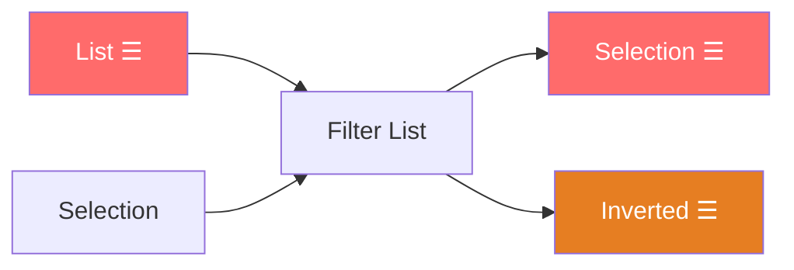
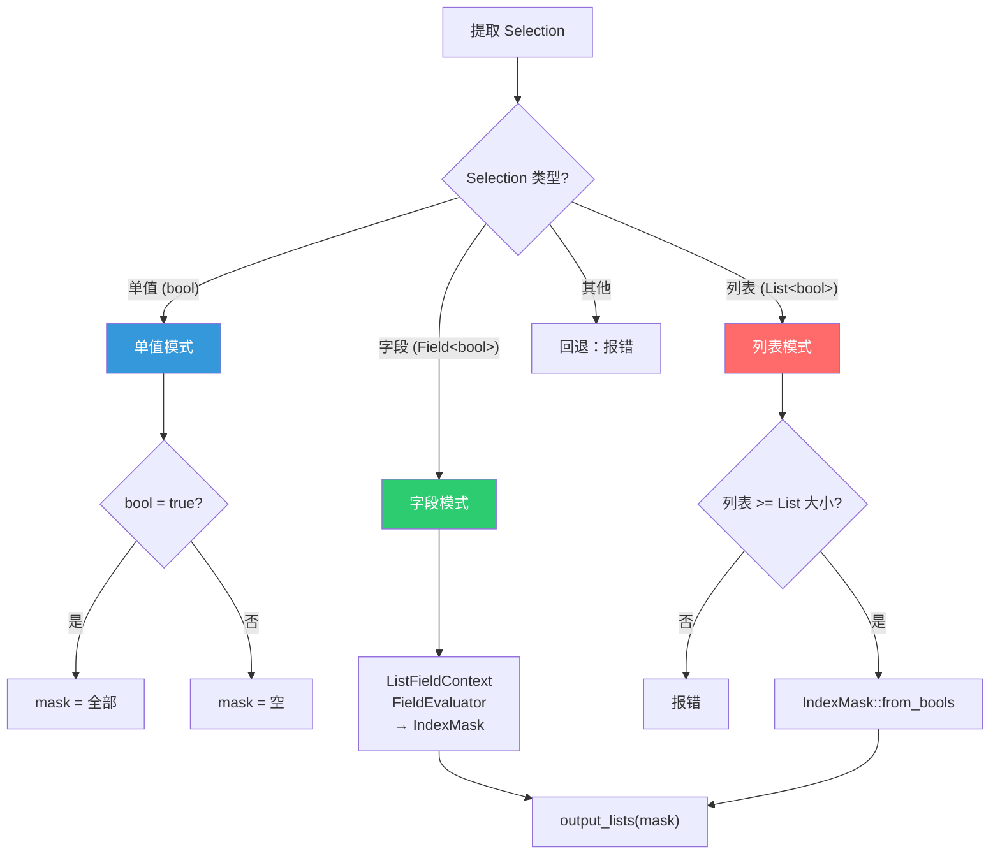
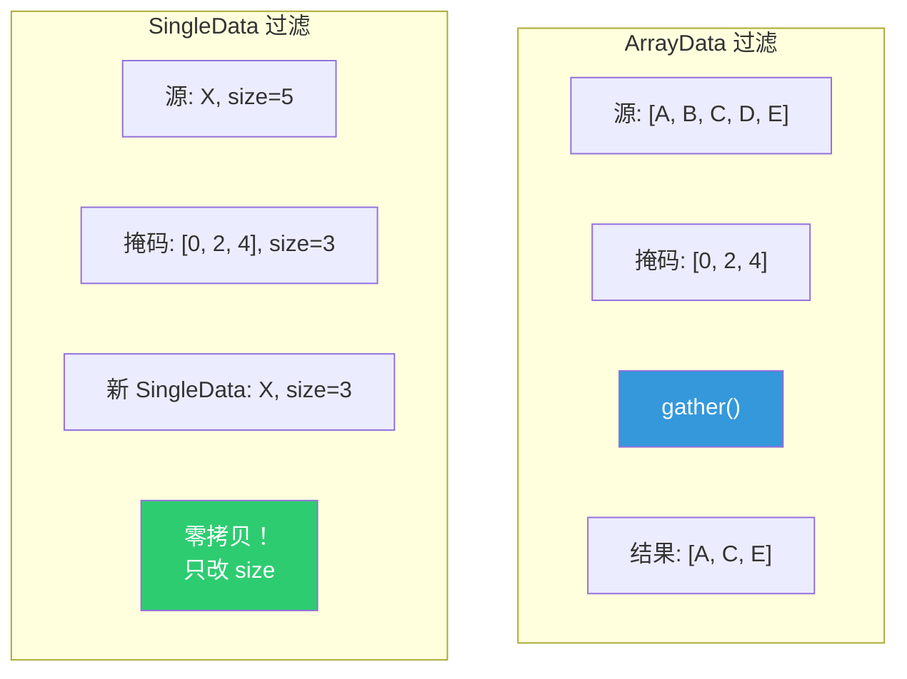

# Filter List 节点

> 📖 系列文档：[目录](01-列表系统架构与核心数据结构.md) | [上一篇](06-GetListItem节点.md) | [下一篇](08-FieldToList节点.md)
> 源码文件：[node_geo_filter_list.cc](file:///e:/blender-git/blender/source/blender/nodes/geometry/nodes/node_geo_filter_list.cc)

---

## 目录

1. [节点概述](#1-节点概述)
2. [节点声明](#2-节点声明)
3. [核心过滤函数 filter_list](#3-核心过滤函数-filter_list)
4. [三种过滤模式](#4-三种过滤模式)
5. [双输出：Selection 与 Inverted](#5-双输出selection-与-inverted)
6. [SingleData 的零开销过滤](#6-singledata-的零开销过滤)

---

## 1. 节点概述

**节点 ID**：`GeometryNodeFilterList`
**功能**：按布尔选择条件过滤列表元素，同时输出选中项和反转项
**复杂度**：⭐⭐⭐

### 核心设计

Filter List 有两个输出——Selection（选中的元素）和 Inverted（未选中的元素）。Selection 输入支持三种类型：单值布尔、布尔字段、布尔列表。



---

## 2. 节点声明

```cpp
static void node_declare(NodeDeclarationBuilder &b)
{
  const bNode *node = b.node_or_null();
  if (!node) return;
  const auto type = eNodeSocketDatatype(node->custom1);

  b.add_input(type, "List"_ustr).structure_type(StructureType::List).hide_value();
  b.add_input<decl::Bool>("Selection"_ustr)
      .default_value(true)
      .hide_value()
      .description("A field or list representing the values that will not be removed")
      .structure_type(StructureType::Dynamic);  // 单值/字段/列表

  b.add_output(type, "Selection"_ustr)
      .propagate_all({0})
      .structure_type(StructureType::List)
      .align_with_previous();
  b.add_output(type, "Inverted"_ustr)
      .propagate_all({0})
      .structure_type(StructureType::List)
      .align_with_previous();
}
```

> **`.propagate_all({0})`**：传播来自第 0 个输入（List）的匿名属性。

> **`.align_with_previous()`**：Selection 和 Inverted 输出并排显示。

---

## 3. 核心过滤函数 filter_list

```cpp
static GListPtr filter_list(const GListPtr &list, const IndexMask &mask)
{
  if (mask.size() == list->size()) {
    return list;  // 全选 → 零拷贝返回
  }

  const CPPType &list_type = list->cpp_type();
  return std::visit(
      [&]<typename T>(const T &src_data) {
        if constexpr (std::is_same_v<T, GList::ArrayData>) {
          GArray<> dst_data(list_type, mask.size());
          array_utils::gather(GSpan(list_type, src_data.data, list->size()), mask, dst_data);
          return GList::from_garray(std::move(dst_data));
        }
        else if constexpr (std::is_same_v<T, GList::SingleData>) {
          return GList::create(list_type, src_data, mask.size());
        }
      },
      list->data());
}
```

> **`std::visit` + 泛型 lambda**：C++17 的优雅变体访问方式。编译器为每种变体生成特化代码，`if constexpr` 在编译期消除不匹配分支。

> **`array_utils::gather`**：高效收集函数，按掩码从源跨度拷贝元素到目标数组。内部使用 SIMD 优化。

---

## 4. 三种过滤模式



### 单值模式

```cpp
if (filter_value.is_single()) {
  if (filter_value.get<bool>()) {
    output_lists(params, list, IndexMask(list->size()));  // 全选
  } else {
    output_lists(params, list, {});  // 全不选
  }
}
```

### 字段模式

```cpp
else if (filter_value.is_context_dependent_field()) {
  ListFieldContext field_context;
  fn::FieldEvaluator field_evaluator(field_context, list->size());
  field_evaluator.add(filter_value.extract<Field<bool>>());
  field_evaluator.evaluate();
  output_lists(params, list, field_evaluator.get_evaluated_as_mask(0));
}
```

> **`get_evaluated_as_mask(0)`**：将第 0 个字段的求值结果转换为 `IndexMask`。对于布尔字段，true 的位置被包含在掩码中。

### 列表模式

```cpp
else if (filter_value.is_list()) {
  const GListPtr keep_list = filter_value.get<GListPtr>();
  const VArray<bool> values = keep_list->varray().typed<bool>();
  if (values.size() < list->size()) {
    params.error_message_add(NodeWarningType::Error, "\"Selection\" list is too small");
    params.set_default_remaining_outputs();
    return;
  }
  IndexMaskMemory memory;
  output_lists(params, list, IndexMask::from_bools(values, memory));
}
```

> **`IndexMask::from_bools`**：从布尔虚拟数组创建索引掩码。内部优化：如果数组全为 true，返回全范围掩码；如果全为 false，返回空掩码。

---

## 5. 双输出：Selection 与 Inverted

```cpp
static void output_lists(GeoNodesExecParams &params,
                         const GListPtr &list,
                         const IndexMask &selection)
{
  if (params.output_is_required("Selection"_ustr)) {
    params.set_output("Selection"_ustr, filter_list(list, selection));
  }
  if (params.output_is_required("Inverted"_ustr)) {
    IndexMaskMemory memory;
    const IndexMask inverted = selection.complement(IndexRange(list->size()), memory);
    params.set_output("Inverted"_ustr, filter_list(list, inverted));
  }
}
```

> **惰性输出**：只计算被连接的输出。如果只连接了 Selection，Inverted 不会被计算。

> **`selection.complement`**：计算补集掩码。例如列表大小 5，选择 [0, 2, 4]，补集为 [1, 3]。

---

## 6. SingleData 的零开销过滤



SingleData 过滤几乎零开销——复用同一个 `SingleData`，只改变 `size`。因为所有元素相同，"过滤"只是改变了逻辑长度。
