# Sort List 节点详解

> 📖 系列文档：[目录](01-列表系统架构与核心数据结构.md) | [上一篇](07-FilterList节点.md) | [下一篇](09-ClosureToList节点.md)
>
> 源码文件：[node_geo_sort_list.cc](../../source/blender/nodes/geometry/nodes/node_geo_sort_list.cc)
> 相关文件：[GEO_reorder.hh](../../source/blender/geometry/GEO_reorder.hh)、[reorder.cc](../../source/blender/geometry/intern/reorder.cc)、[list_function_eval.hh](../../source/blender/nodes/intern/list_function_eval.hh)

---

## 目录

1. [节点概述](#1-节点概述)
2. [提交背景与设计动机](#2-提交背景与设计动机)
3. [节点声明与 UI](#3-节点声明与-ui)
4. [核心执行流程](#4-核心执行流程)
5. [get_varray_or_evaluate 模板函数详解](#5-get_varray_or_evaluate-模板函数详解)
6. [Selection 的三种输入模式](#6-selection-的三种输入模式)
7. [SampleIndexFunction 详解](#7-sampleindexfunction-详解)
8. [sort_indices_by_weights 核心排序算法](#8-sort_indices_by_weights-核心排序算法)
9. [grouped_sort 分组排序](#9-grouped_sort-分组排序)
10. [identifiers_to_indices 标识符转索引](#10-identifiers_to_indices-标识符转索引)
11. [gather 重排列表数据](#11-gather-重排列表数据)
12. [to_static_type 类型分发宏](#12-to_static_type-类型分发宏)
13. [与 Sort Elements 节点的对比](#13-与-sort-elements-节点的对比)
14. [关键语法与注释翻译](#14-关键语法与注释翻译)

---

## 1. 节点概述

**Sort List** 节点根据权重值对列表中的元素重新排序。它支持三种控制输入：

| 输入 | 类型 | 说明 |
|------|------|------|
| **List** | 动态类型（List） | 待排序的列表 |
| **Selection** | Bool（Dynamic） | 哪些元素参与排序 |
| **Group ID** | Int（Dynamic） | 相同 Group ID 的元素在同一组内排序 |
| **Sort Weight** | Float（Dynamic） | 决定排序顺序的权重值 |

**输出**：排序后的列表（与输入类型相同）

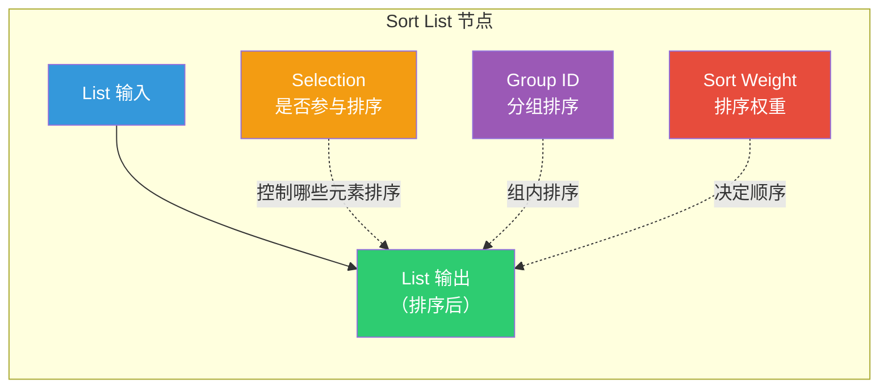

**核心特性**：
- Selection、Group ID、Sort Weight 都可以是**单值、字段或列表**
- 与 Sort Elements 节点共享排序算法（`sort_indices_by_weights`）
- SingleData 列表直接返回（所有元素相同，排序无意义）
- 使用 `to_static_type` 处理所有支持的元素类型

---

## 2. 提交背景与设计动机

**提交**：`a62bcf847a3954fcac3a24ac12bc1e22f550f347`
**作者**：Brady Johnston, Hans Goudey
**日期**：2026-06-03
**PR**：[#159014](https://projects.blender.org/blender/blender/pulls/159014)

提交信息翻译：

> **"This adds a new Sort List node for changing the ordering of items in a list."**
> 新增 Sort List 节点，用于改变列表中元素的顺序。
>
> **"It moves the interface and sorting code from Sort Elements node into the shared GEO_reorder.hh to re-use the same interface code."**
> 将 Sort Elements 节点的接口和排序代码移到共享的 `GEO_reorder.hh`，复用相同的接口代码。
>
> **"The interface is then the same as the Sort Elements but selecting a list data type instead of a domain."**
> 接口与 Sort Elements 相同，但选择列表数据类型而非域。
>
> **"Selection, Group ID and Sort Weight can all be either single values, fields or lists of values."**
> Selection、Group ID 和 Sort Weight 都可以是单值、字段或值列表。

### 代码重构关系

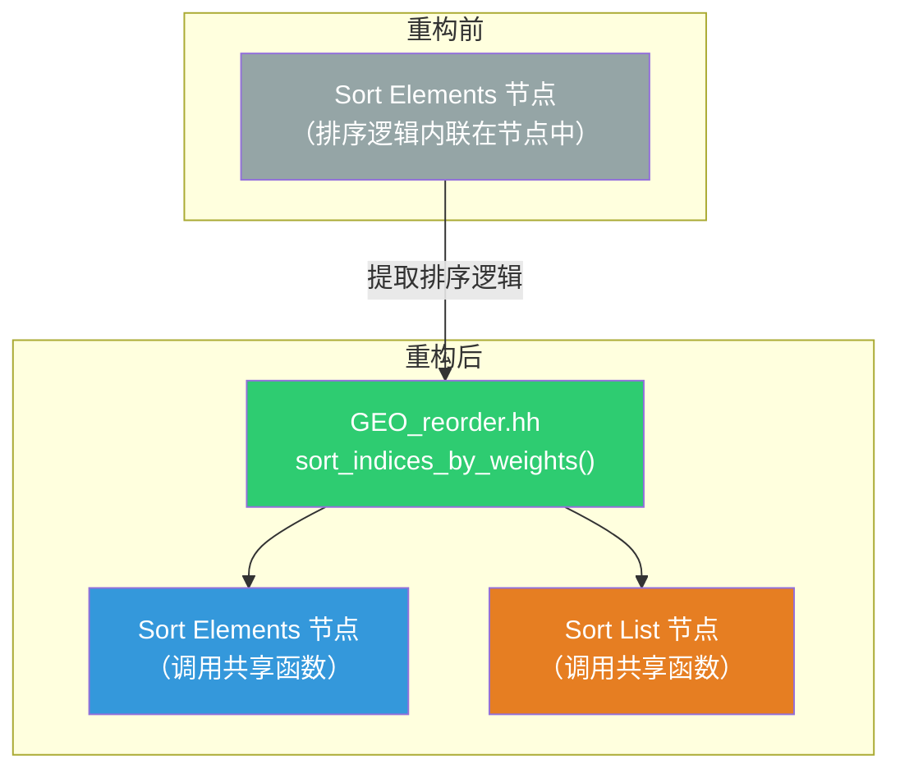

### 变更文件一览

| 文件 | 变更类型 | 说明 |
|------|---------|------|
| `node_geo_sort_list.cc` | **新增** | Sort List 节点实现（258 行） |
| `GEO_reorder.hh` | 修改 | 新增 `sort_indices_by_weights` 声明 |
| `reorder.cc` | 修改 | 新增排序算法实现（117 行） |
| `list_function_eval.cc` | 修改 | 新增 `SampleIndexFunction` |
| `list_function_eval.hh` | 修改 | 新增 `SampleIndexFunction` 声明 |
| `node_geo_sort_elements.cc` | 修改 | 删除内联排序逻辑，改用共享函数 |
| `node_geo_list_get_item.cc` | 修改 | 移除 `SampleIndexFunction`（移到 list_function_eval） |
| `node_add_menu_geometry.py` | 修改 | 添加菜单项 |
| `rna_nodetree.cc` | 修改 | 注册节点 RNA |
| `CMakeLists.txt` | 修改 | 添加新源文件 |

---

## 3. 节点声明与 UI

### 3.1 node_declare — Socket 声明

```cpp
static void node_declare(NodeDeclarationBuilder &b)
{
  const bNode *node = b.node_or_null();
  if (!node) {
    return;  // 首次声明时节点还不存在
  }

  b.use_custom_socket_order();    // 使用自定义 Socket 顺序
  b.allow_any_socket_order();     // 允许任意顺序排列
  b.add_default_layout();         // 添加默认布局

  const auto type = eNodeSocketDatatype(node->custom1);  // 从 DNA 读取数据类型

  // 列表输入/输出——类型由 custom1 决定
  b.add_input(type, "List"_ustr).structure_type(StructureType::List).hide_value();
  b.add_output(type, "List"_ustr)
      .propagate_all({0})                          // 传播匿名属性
      .structure_type(StructureType::List)
      .align_with_previous();                      // 与上一个 Socket 对齐

  // 三个控制输入——都是 Dynamic 结构类型（可以是 Single/Field/List）
  b.add_input<decl::Bool>("Selection"_ustr)
      .default_value(true)
      .hide_value()
      .structure_type(StructureType::Dynamic)      // ← 关键：Dynamic
      .description("Whether each element should participate in sorting");
  b.add_input<decl::Int>("Group ID"_ustr)
      .default_value(0)
      .hide_value()
      .structure_type(StructureType::Dynamic)
      .description("Elements with the same Group ID are sorted together");
  b.add_input<decl::Float>("Sort Weight"_ustr)
      .default_value(0.0f)
      .hide_value()
      .structure_type(StructureType::Dynamic)
      .description("A field or list of values that will determine the sorted order");
}
```

> **注释翻译**：
> - `"Whether each element should participate in sorting"` — 每个元素是否参与排序
> - `"Elements with the same Group ID are sorted together"` — 相同 Group ID 的元素在同一组内排序
> - `"A field or list of values that will determine the sorted order"` — 决定排序顺序的字段或值列表

### 3.2 StructureType::Dynamic 的含义

三个控制输入使用 `StructureType::Dynamic`，意味着它们可以接受三种输入形式：

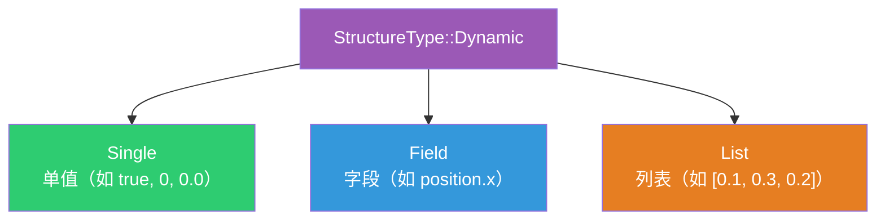

### 3.3 node_layout — UI 布局

```cpp
static void node_layout(ui::Layout &layout, bContext * /*C*/, PointerRNA *ptr)
{
  layout.prop(ptr, "socket_type", UI_ITEM_NONE, "", ICON_NONE);
}
```

在节点侧边栏显示数据类型选择器（`socket_type`），用户可以切换列表的元素类型。

### 3.4 node_gather_link_searches — 搜索链接

```cpp
static void node_gather_link_searches(GatherLinkSearchOpParams &params)
{
  const eNodeSocketDatatype socket_type = eNodeSocketDatatype(params.other_socket().type);
  if (params.in_out() == SOCK_IN) {
    // 输入端：Sort Weight 只在可以链接到 Float 时显示
    if (params.node_tree().typeinfo->validate_link(socket_type, SOCK_FLOAT)) {
      params.add_item(IFACE_("Sort Weight"), SocketSearchOp{"Sort Weight"_ustr, SOCK_FLOAT});
    }
    params.add_item(IFACE_("List"), SocketSearchOp{"List"_ustr, socket_type});
  }
  else {
    // 输出端：只显示 List
    params.add_item(IFACE_("List"), SocketSearchOp{"List"_ustr, socket_type});
  }
}
```

> **`validate_link(socket_type, SOCK_FLOAT)`** — 验证源类型能否链接到 Float。Sort Weight 是 Float 类型，只有当拖拽的 Socket 可以连接 Float 时才显示搜索结果。

---

## 4. 核心执行流程

### 4.1 node_geo_exec 完整流程

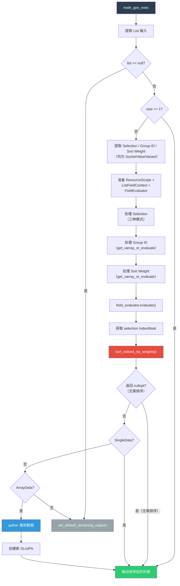

### 4.2 早期退出条件

```cpp
static void node_geo_exec(GeoNodeExecParams params)
{
  GListPtr list = params.extract_input<GListPtr>("List"_ustr);
  if (!list) {
    params.set_default_remaining_outputs();  // 空列表 → 默认输出
    return;
  }

  const int list_size = list->size();
  if (list_size <= 1) {
    params.set_output("List"_ustr, std::move(list));  // 0 或 1 个元素 → 无需排序
    return;
  }
  // ...
}
```

| 条件 | 处理 | 原因 |
|------|------|------|
| `list == null` | 默认输出 | 没有输入列表 |
| `list_size <= 1` | 直接返回原列表 | 0 或 1 个元素无需排序 |
| `sort_indices_by_weights` 返回 `nullopt` | 直接返回原列表 | 排序结果与原序相同 |
| `SingleData` | 直接返回原列表 | 所有元素相同，排序无意义 |

---

## 5. get_varray_or_evaluate 模板函数详解

### 5.1 函数签名

```cpp
template<typename T>
static void get_varray_or_evaluate(const int list_size,
                                   bke::SocketValueVariant &value,
                                   ResourceScope &scope,
                                   fn::FieldEvaluator &field_evaluator,
                                   const T &default_value,
                                   VArray<T> &r_varray)
```

> **功能**：将 `SocketValueVariant` 转换为 `VArray<T>`，统一处理三种输入模式（字段/列表/单值）。

### 5.2 三种模式详解

```cpp
if (value.is_context_dependent_field()) {
  // 模式1：上下文依赖字段 → 加入 FieldEvaluator 延迟求值
  field_evaluator.add(value.extract<fn::Field<T>>(), &r_varray);
}
else if (value.is_list()) {
  // 模式2：列表 → 转为 VArray
  auto list = value.extract<GListPtr>();
  if (list && list->size() == list_size) {
    // 列表大小匹配 → 转为 VArray
    r_varray = scope.add_value(std::move(list))->varray().typed<T>();
  }
  else {
    // 列表大小不匹配 → 用默认值填充
    r_varray = VArray<T>::from_single(default_value, list_size);
  }
}
else {
  // 模式3：单值 → 广播为 VArray
  r_varray = VArray<T>::from_single(value.extract<T>(), list_size);
}
```

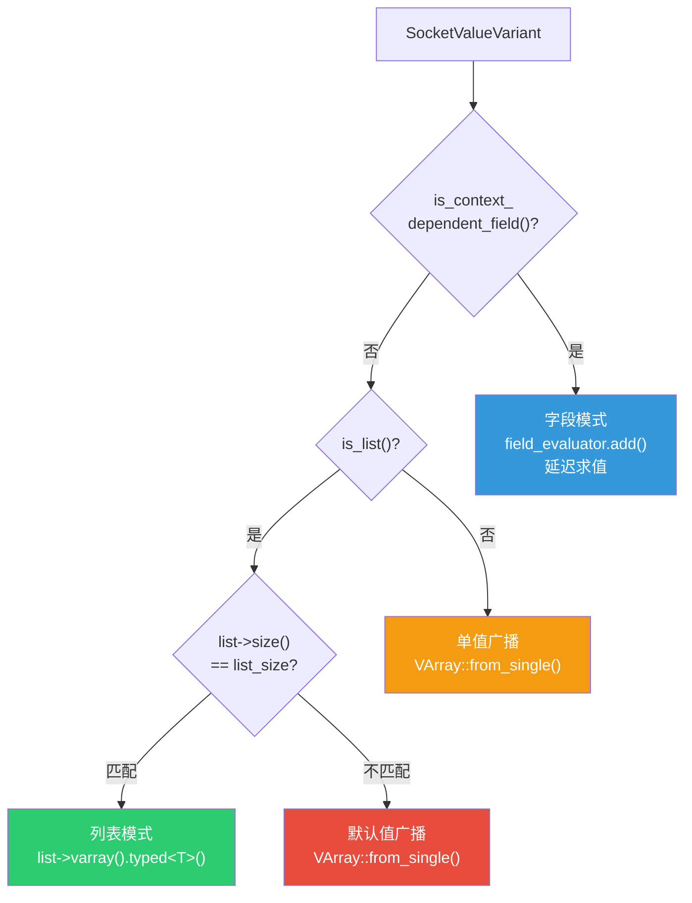

### 5.3 关键语法解释

**`scope.add_value(std::move(list))`**：

`ResourceScope::add_value` 将对象存入作用域，返回指向该对象的指针。`std::move(list)` 转移 `GListPtr` 的所有权到 scope 中，确保列表在 FieldEvaluator 求值期间有效。

为什么需要 scope？因为 `list->varray()` 返回的 `GVArray` 可能引用 `GList` 内部的数据。如果 `list` 是局部变量，函数返回后 `GVArray` 就悬空了。`scope` 延长了 `list` 的生命周期到整个求值过程结束。

**`->varray().typed<T>()`**：

1. `list->varray()` — `GList` 的 `varray()` 方法返回 `GVArray`（泛型虚拟数组）
2. `.typed<T>()` — 将 `GVArray` 转为 `VArray<T>`（类型化虚拟数组），零开销 `static_cast`

---

## 6. Selection 的三种输入模式

Selection 的处理比 Group ID 和 Sort Weight 更复杂，因为它需要作为 `FieldEvaluator` 的**选择条件**（`set_selection`），而非普通输入。

```cpp
if (selection_variant.is_context_dependent_field()) {
  // 模式1：字段 → 直接设为选择条件
  field_evaluator.set_selection(selection_variant.extract<fn::Field<bool>>());
}
else if (selection_variant.is_list()) {
  // 模式2：列表 → 包装为 SampleIndexFunction 字段
  auto fn = fn::FieldOperation::from(
      std::make_shared<SampleIndexFunction>(weights_variant.extract<GListPtr>()),
      {fn::IndexFieldInput::get_field()});
  field_evaluator.set_selection(fn::Field<bool>(std::move(fn)));
}
else {
  // 模式3：单值 → 包装为常量字段
  field_evaluator.set_selection(fn::Field<bool>(selection_variant.extract<bool>()));
}
```

> **注意：疑似 Bug** — 第 149 行使用 `weights_variant.extract<GListPtr>()` 而非 `selection_variant.extract<GListPtr>()`。当 Selection 是列表时，应该用 Selection 列表创建 `SampleIndexFunction`，但代码错误地使用了 Sort Weight 列表。这意味着 Selection 列表模式实际上会用 Sort Weight 的值来决定哪些元素参与排序，而非 Selection 本身的值。
>
> 正确代码应为：
> ```cpp
> std::make_shared<SampleIndexFunction>(selection_variant.extract<GListPtr>())
> ```

### 6.1 为什么列表模式需要 SampleIndexFunction？

`FieldEvaluator::set_selection` 只接受 `Field<bool>`——一个**字段**。但用户输入的是一个**列表**。列表不是字段，不能直接传给 `set_selection`。

**解决方案**：用 `SampleIndexFunction` 把列表包装成一个字段——这个字段的行为是"给定索引 i，返回列表中第 i 个元素"。

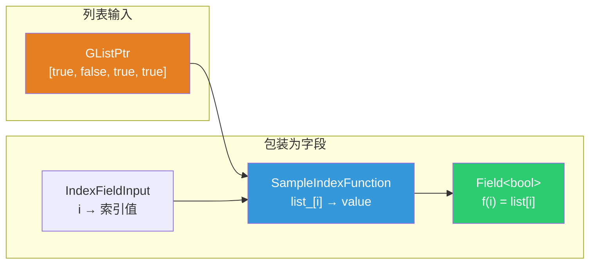

### 6.2 Selection 列表模式的完整求值流程

当 Selection 是列表 `[true, false, true, true]` 时，完整的求值流程如下：

```mermaid
sequenceDiagram
    participant User as 用户输入
    participant Sort as Sort List 节点
    participant SIF as SampleIndexFunction
    participant IDX as IndexFieldInput
    participant FE as FieldEvaluator
    participant LFC as ListFieldContext

    User->>Sort: Selection = [true, false, true, true]
    Note over Sort: selection_variant.is_list() = true

    Sort->>SIF: new SampleIndexFunction(list)
    Note over SIF: list_ = [true, false, true, true]<br/>signature: Index(int) → Value(bool)

    Sort->>IDX: IndexFieldInput::get_field()
    Note over IDX: f(i) = i

    Sort->>FE: FieldOperation(SIF, {IDX})
    Note over FE: Field&lt;bool&gt; f(i) = list[i]

    Sort->>FE: set_selection(Field&lt;bool&gt;)
    Sort->>FE: add(group_id_field, &group_id_varray)
    Sort->>FE: add(weight_field, &weight_varray)
    Sort->>FE: evaluate()

    FE->>LFC: get_varray_for_input(IndexFieldInput)
    LFC-->>FE: VArray [0, 1, 2, 3]

    FE->>SIF: call(mask=[0,1,2,3], params)
    Note over SIF: indices = [0, 1, 2, 3]<br/>list_[0]=true, list_[1]=false<br/>list_[2]=true, list_[3]=true
    SIF-->>FE: dst = [true, false, true, true]

    FE->>FE: selection_mask = {0, 2, 3}
    Note over FE: 只对索引 0, 2, 3 的元素排序<br/>索引 1 不参与排序
```

> **关键步骤**：`FieldEvaluator` 求值 Selection 字段时，`IndexFieldInput` 通过 `ListFieldContext` 获取索引 `[0, 1, 2, 3]`，`SampleIndexFunction` 用这些索引从列表中取值 `[true, false, true, true]`，`FieldEvaluator` 将非零值转为 `IndexMask {0, 2, 3}`——只有索引 0、2、3 的元素参与排序。

### 6.3 `fn::FieldOperation::from` 语法

```cpp
auto fn = fn::FieldOperation::from(
    std::make_shared<SampleIndexFunction>(weights_variant.extract<GListPtr>()),
    {fn::IndexFieldInput::get_field()});
```

> **`fn::FieldOperation::from`**：创建一个字段操作节点。参数：
> 1. **多函数**（`MultiFunction`）：`SampleIndexFunction` — "给定索引，返回列表元素"
> 2. **输入字段列表**：`{fn::IndexFieldInput::get_field()}` — 索引字段，每个位置返回自己的索引值
>
> 组合起来：`Field<bool> f(i) = SampleIndexFunction(list, IndexFieldInput(i)) = list[i]`

**`fn::IndexFieldInput::get_field()`**：返回一个字段，求值时每个位置返回自己的索引值（0, 1, 2, ...）。

### 6.3 单值模式为什么也要包装为字段？

```cpp
field_evaluator.set_selection(fn::Field<bool>(selection_variant.extract<bool>()));
```

`fn::Field<bool>(true)` 创建一个常量字段——每个位置都返回 `true`。`FieldEvaluator::set_selection` 只接受 `Field<bool>`，不接受裸 `bool`，所以必须包装。

---

## 7. SampleIndexFunction 详解

### 7.1 类定义

```cpp
// list_function_eval.hh
class SampleIndexFunction : public mf::MultiFunction {
  GListPtr list_;           // 持有列表的共享指针
  mf::Signature signature_; // 多函数签名

 public:
  SampleIndexFunction(GListPtr list);

  void call(const IndexMask &mask, mf::Params params, mf::Context /*context*/) const override;
  void hash_unique(UniqueHashBytes &hash) const override;
};
```

> **功能**：将列表包装为多函数——输入索引，输出列表中对应位置的值。这是把"列表"适配为"字段"的桥梁。

### 7.2 构造函数

```cpp
SampleIndexFunction::SampleIndexFunction(GListPtr list) : list_(std::move(list))
{
  mf::SignatureBuilder builder{"Sample Index", signature_};
  builder.single_input<int>("Index");                    // 输入：索引
  builder.single_output("Value", list_->cpp_type());     // 输出：列表元素类型
  this->set_signature(&signature_);
}
```

> **`builder.single_input<int>("Index")`** — 声明一个 `int` 类型的单值输入参数，名为 "Index"。
>
> **`builder.single_output("Value", list_->cpp_type())`** — 声明一个输出参数，类型由列表的元素类型决定。注意输出参数没有模板参数——类型通过 `CPPType` 在运行时指定。

### 7.3 call 方法详解

```cpp
void SampleIndexFunction::call(const IndexMask &mask,
                               mf::Params params,
                               mf::Context /*context*/) const
{
  const VArraySpan<int> indices = params.readonly_single_input<int>(0, "Index");
  GMutableSpan dst = params.uninitialized_single_output(1, "Value");

  // 步骤1：过滤有效索引（在列表范围内的）
  IndexMaskMemory memory;
  const IndexMask valid_indices = array_utils::indices_in_range(
      mask, indices, IndexRange(list_->size()), memory);

  // 步骤2：对无效索引填充默认值
  if (valid_indices.size() != mask.size()) {
    const IndexMask invalid_indices = valid_indices.complement(mask, memory);
    list_->cpp_type().fill_construct_indices(
        list_->cpp_type().default_value(), dst.data(), invalid_indices);
  }

  // 步骤3：根据列表数据类型读取值
  const GList::DataVariant &data = list_->data();
  if (const auto *array_data = std::get_if<nodes::GList::ArrayData>(&data)) {
    // ArrayData：从连续数组中按索引取值
    const GSpan src(list_->cpp_type(), array_data->data, list_->size());
    valid_indices.foreach_index(
        [&](const int i) { list_->cpp_type().copy_construct(src[indices[i]], dst[i]); });
  }
  else if (const auto *single_data = std::get_if<nodes::GList::SingleData>(&data)) {
    // SingleData：所有位置都是同一个值
    list_->cpp_type().fill_construct_indices(single_data->value, dst.data(), valid_indices);
  }
}
```

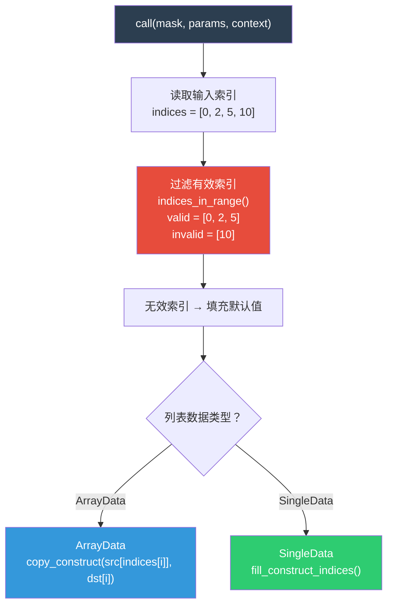

### 7.4 关键语法解释

**`VArraySpan<int> indices`**：`VArraySpan` 是 `VArray` 的视图——如果底层是 Span，直接引用；否则物化为临时数组。这里索引输入可能来自字段求值结果，`VArraySpan` 自动处理两种情况。

**`array_utils::indices_in_range`**：检查 `indices` 中哪些值在 `[0, list_size)` 范围内，返回有效的 `IndexMask`。例如 `indices = [0, 2, 5, 10]`，`list_size = 8`，则 `valid = [0, 2, 5]`，`invalid = [10]`。

**`fill_construct_indices(default_value, dst, invalid_indices)`**：在 `dst` 的 `invalid_indices` 位置用默认值构造对象。越界索引返回类型默认值（如 `float` 返回 `0.0f`）。

**`hash_unique`**：

```cpp
void SampleIndexFunction::hash_unique(UniqueHashBytes &hash) const
{
  static constexpr int8_t id = 0;
  hash.add(&id);
  hash.add(list_.get());  // 用列表指针作为哈希的一部分
}
```

> **`hash_unique`** 用于字段去重——如果两个 `SampleIndexFunction` 持有相同的列表指针，它们的哈希相同，可以合并。`list_.get()` 返回底层 `GList*` 指针。

---

## 8. sort_indices_by_weights 核心排序算法

### 8.1 函数签名

```cpp
// GEO_reorder.hh
std::optional<Array<int>> sort_indices_by_weights(int domain_size,
                                                  const IndexMask &mask,
                                                  const VArray<int> &group_id,
                                                  const VArray<float> &weight);
```

> **参数**：
> - `domain_size`：列表大小
> - `mask`：参与排序的元素索引掩码
> - `group_id`：每个元素的分组 ID
> - `weight`：每个元素的排序权重
>
> **返回值**：
> - `std::nullopt`：无需排序（结果与原序相同）
> - `Array<int>`：排序后的索引映射数组，`result[i]` 表示位置 `i` 应放原来位置 `result[i]` 的元素

### 8.2 早期退出

```cpp
if (group_id.is_single() && weight.is_single()) {
  return std::nullopt;  // 所有元素同一组同一权重 → 无需排序
}
if (mask.is_empty()) {
  return std::nullopt;  // 没有选中元素 → 无需排序
}
```

### 8.3 两条路径

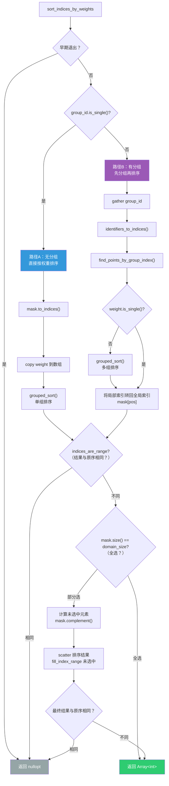

### 8.4 路径A：无分组（group_id 是单值）

```cpp
if (group_id.is_single()) {
  mask.to_indices<int>(gathered_indices);  // 收集选中索引
  Array<float> weight_values(domain_size);
  array_utils::copy(weight, mask, weight_values.as_mutable_span());  // 收集权重
  grouped_sort(Span({0, int(mask.size())}), weight_values, gathered_indices);
  // Span({0, mask.size()}) 表示一个组 [0, mask.size())
}
```

> **`Span({0, int(mask.size())})`** — 构造一个包含两个元素的 Span：`[0, mask.size()]`，表示一个偏移区间 `[0, mask.size())`。`grouped_sort` 把所有元素当作一个组来排序。

### 8.5 路径B：有分组

```cpp
else {
  Array<int> gathered_group_id(mask.size());
  array_utils::gather(group_id, mask, gathered_group_id.as_mutable_span());
  // 1. 收集选中元素的 group_id

  const int total_groups = identifiers_to_indices(gathered_group_id);
  // 2. 将 group_id 转为连续索引 [0, total_groups)

  Array<int> offsets_to_sort(total_groups + 1, 0);
  find_points_by_group_index(gathered_group_id, offsets_to_sort, gathered_indices);
  // 3. 按组分配索引，计算每组的偏移量

  if (!weight.is_single()) {
    Array<float> weight_values(mask.size());
    array_utils::gather(weight, mask, weight_values.as_mutable_span());
    grouped_sort(offsets_to_sort.as_span(), weight_values, gathered_indices);
    // 4. 在每组内按权重排序
  }

  parallel_transform<int>(gathered_indices, 2048, [&](const int pos) { return mask[pos]; });
  // 5. 将局部索引转回全局索引
}
```

> **步骤5 详解**：`gathered_indices` 中存的是局部索引（在 mask 范围内的位置），需要转回全局索引。例如 `mask = [2, 5, 7]`，`gathered_indices = [1, 0, 2]`，则 `mask[1]=5, mask[0]=2, mask[2]=7`，最终排序结果为 `[5, 2, 7]`。

### 8.6 处理未选中元素

```cpp
if (mask.size() == domain_size) {
  return gathered_indices;  // 全选 → 直接返回
}

// 部分选中 → 未选中元素保持原位
IndexMaskMemory memory;
const IndexMask unselected = mask.complement(IndexRange(domain_size), memory);
Array<int> indices(domain_size);
array_utils::scatter<int>(gathered_indices, mask, indices);       // 排序结果放到选中位置
array_utils::fill_index_range<int>(unselected, indices);           // 未选中位置保持原索引
```

> **`scatter`**：将 `gathered_indices` 中的值分散到 `indices` 的 `mask` 位置。与 `gather` 相反——`gather` 是"从源中按索引收集"，`scatter` 是"按索引散布到目标"。
>
> **`fill_index_range`**：在 `unselected` 位置填入 `0, 1, 2, ...`（保持原位）。

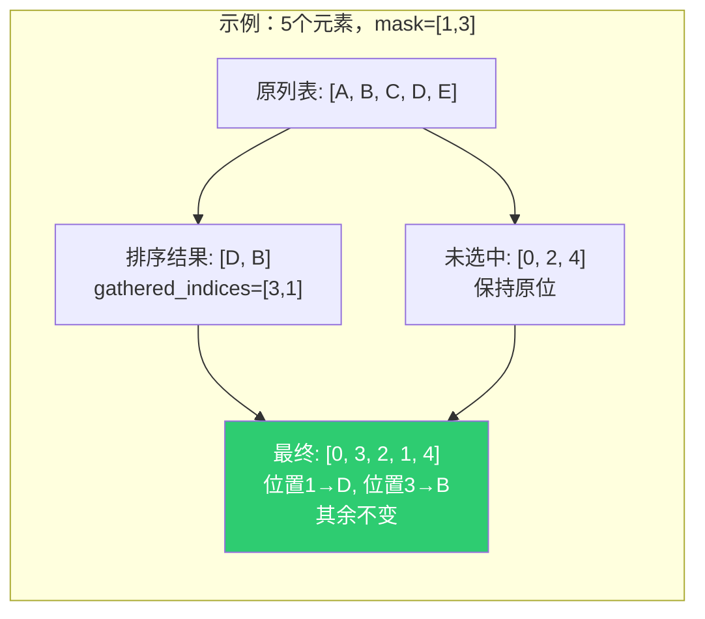

---

## 9. grouped_sort 分组排序

```cpp
static void grouped_sort(const OffsetIndices<int> offsets,
                         const Span<float> weights,
                         MutableSpan<int> indices)
{
  const auto comparator = [&](const int index_a, const int index_b) {
    const float weight_a = weights[index_a];
    const float weight_b = weights[index_b];
    if (UNLIKELY(weight_a == weight_b)) {
      return index_a < index_b;  // 权重相同 → 保持原序（稳定排序）
    }
    return weight_a < weight_b;  // 按权重升序
  };

  threading::parallel_for(offsets.index_range(), 250, [&](const IndexRange range) {
    for (const int group_index : range) {
      MutableSpan<int> group = indices.slice(offsets[group_index]);
      parallel_sort(group.begin(), group.end(), comparator);
    }
  });
}
```

> **注释翻译**：
> - `UNLIKELY(weight_a == weight_b)` — 权重相等的情况不太可能发生。`UNLIKELY` 是编译器提示，告诉分支预测器这个分支很少执行，优化 CPU 流水线。
> - `return index_a < index_b` — 权重相同时，保持原始顺序（索引小的在前），实现**稳定排序**。

### 9.1 OffsetIndices 详解

`OffsetIndices<int>` 是 Blender 的偏移索引结构——用一组偏移量表示多个区间：

```
offsets = [0, 3, 5, 8]
         → 组0: [0, 3)  → indices[0], indices[1], indices[2]
         → 组1: [3, 5)  → indices[3], indices[4]
         → 组2: [5, 8)  → indices[5], indices[6], indices[7]
```

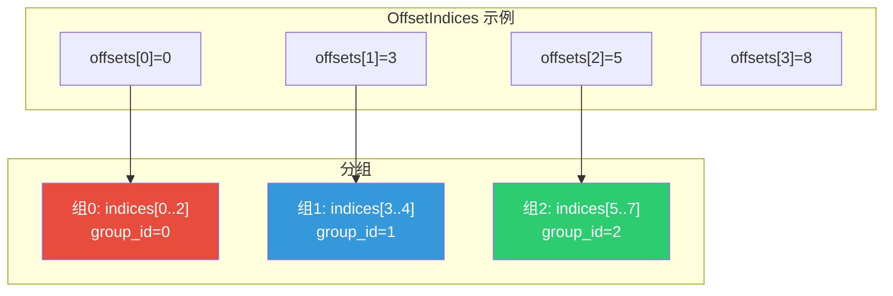

### 9.2 parallel_sort

`parallel_sort` 是 Blender 的并行排序实现——当数据量足够大时，使用多线程排序；数据量小时退化为单线程 `std::sort`。

### 9.3 parallel_transform

```cpp
template<typename T, typename Func>
static void parallel_transform(MutableSpan<T> values, const int64_t grain_size, const Func &func)
{
  threading::parallel_for(values.index_range(), grain_size, [&](const IndexRange range) {
    MutableSpan<T> values_range = values.slice(range);
    std::transform(values_range.begin(), values_range.end(), values_range.begin(), func);
  });
}
```

> **功能**：并行地对每个元素应用 `func`，结果写回原位。`grain_size` 是每个线程处理的最小元素数——避免线程开销超过计算收益。

---

## 10. identifiers_to_indices 标识符转索引

```cpp
static int identifiers_to_indices(MutableSpan<int> r_identifiers_to_indices)
{
  // 步骤1：去重，建立标识符→索引的映射
  const VectorSet<int> deduplicated_identifiers(r_identifiers_to_indices);

  // 步骤2：将每个标识符替换为其在 VectorSet 中的索引
  parallel_transform(r_identifiers_to_indices, 2048, [&](const int identifier) {
    return deduplicated_identifiers.index_of(identifier);
  });

  // 步骤3：按标识符值排序，确保索引顺序与标识符值顺序一致
  Array<int> indices(deduplicated_identifiers.size());
  array_utils::fill_index_range<int>(indices);
  parallel_sort(indices.begin(), indices.end(), [&](const int index_a, const int index_b) {
    return deduplicated_identifiers[index_a] < deduplicated_identifiers[index_b];
  });

  // 步骤4：构建排列映射，将"VectorSet 顺序"转为"标识符值顺序"
  Array<int> permutation = invert_permutation(indices);
  parallel_transform(
      r_identifiers_to_indices, 4096, [&](const int index) { return permutation[index]; });

  return deduplicated_identifiers.size();
}
```

> **为什么需要这个函数？** `group_id` 可能是任意整数（如 `100, 200, 50`），但 `find_points_by_group_index` 需要连续的索引（`0, 1, 2`）。`identifiers_to_indices` 将任意标识符映射为连续索引，同时保持标识符值的大小顺序。

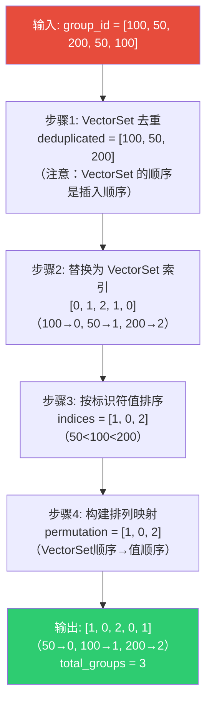

### 10.1 invert_permutation

```cpp
Array<int> permutation = invert_permutation(indices);
```

> **`invert_permutation`**：反转排列。如果 `indices = [1, 0, 2]`（表示"位置0应放元素1，位置1应放元素0，位置2应放元素2"），则 `invert_permutation` 返回 `[1, 0, 2]`（表示"元素0应放到位置1，元素1应放到位置0，元素2应放到位置2"）。
>
> **类比**：`indices` 是"座位→人"的映射，`invert_permutation` 是"人→座位"的映射。

---

## 11. gather 重排列表数据

### 11.1 代码

```cpp
if (const auto *array_data = std::get_if<GList::ArrayData>(&list_data)) {
  // 1. 分配未初始化的数组
  GList::ArrayData sorted_array_data = GList::ArrayData::ForUninitialized(type, list_size);

  // 2. 构造源/目标 Span
  const GSpan src_span(type, array_data->data, list_size);
  GMutableSpan dst_span = sorted_array_data.span_for_write(type, list_size);

  // 3. 按排序索引 gather
  type.to_static_type<float, float2, float3, float4, int, int2, bool, int8_t,
                       short2, ColorGeometry4f, ColorGeometry4b, math::Quaternion,
                       float4x4, nodes::MenuValue, std::string, nodes::BundlePtr,
                       nodes::ClosurePtr, GeometrySet, Material *, Object *, Image *,
                       VFont *, Scene *, bSound *>([&]<typename T>() {
    array_utils::gather(src_span.typed<T>(), sorted->as_span(), dst_span.typed<T>());
  });

  // 4. 创建新列表
  GListPtr sorted_list = GList::create(type, std::move(sorted_array_data), list_size);
  params.set_output("List"_ustr, std::move(sorted_list));
  return;
}
```

### 11.2 gather 操作详解

`array_utils::gather(src, indices, dst)` 的含义：

```
src    = [A, B, C, D, E]     （原列表数据）
indices = [3, 1, 4, 0, 2]    （排序索引映射）
dst    = [D, B, E, A, C]     （结果：dst[i] = src[indices[i]]）
```

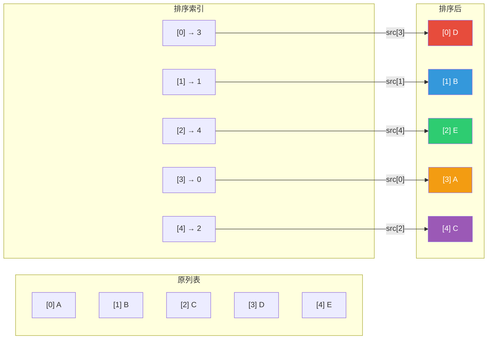

### 11.3 ForUninitialized 和 span_for_write

**`GList::ArrayData::ForUninitialized(type, list_size)`**：分配内存但不初始化——因为 `gather` 会覆盖每个位置，不需要先构造默认值。

**`sorted_array_data.span_for_write(type, list_size)`**：获取可变 Span。因为 `ArrayData::data` 是 `const void*`（隐式共享的"软锁"），`span_for_write` 检查引用计数，确认唯一所有权后返回 `GMutableSpan`。

---

## 12. to_static_type 类型分发宏

### 12.1 语法

```cpp
type.to_static_type<float, float2, float3, ..., bSound *>([&]<typename T>() {
  array_utils::gather(src_span.typed<T>(), sorted->as_span(), dst_span.typed<T>());
});
```

> **`to_static_type<T1, T2, ..., Tn>(callback)`**：运行时类型分发。根据 `type`（`CPPType` 引用）在编译期生成的类型列表中匹配，匹配成功则调用 `callback` 的对应模板实例化。
>
> **`[&]<typename T>()`**：C++20 模板 Lambda——`T` 由 `to_static_type` 用匹配到的类型替换。

### 12.2 为什么需要列出所有类型？

因为 `gather` 需要类型化的 `Span<T>` 和 `MutableSpan<T>`，而 `GSpan`/`GMutableSpan` 是类型擦除的。`to_static_type` 在编译期为每种可能的类型生成一份 `gather` 代码，运行时通过函数指针表跳转到正确的实例化。

### 12.3 支持的类型列表

| 类型 | 说明 | 大小 |
|------|------|------|
| `float` | 浮点数 | 4 |
| `float2` | 二维向量 | 8 |
| `float3` | 三维向量 | 12 |
| `float4` | 四维向量 | 16 |
| `int` | 整数 | 4 |
| `int2` | 二维整数 | 8 |
| `bool` | 布尔值 | 1 |
| `int8_t` | 8位整数 | 1 |
| `short2` | 短整数向量 | 4 |
| `ColorGeometry4f` | 浮点颜色 | 16 |
| `ColorGeometry4b` | 字节颜色 | 4 |
| `math::Quaternion` | 四元数 | 16 |
| `float4x4` | 4×4矩阵 | 64 |
| `MenuValue` | 菜单值 | 变长 |
| `std::string` | 字符串 | 32（内联） |
| `BundlePtr` | 包指针 | 8 |
| `ClosurePtr` | 闭包指针 | 8 |
| `GeometrySet` | 几何集 | >32 |
| `Material *` | 材质指针 | 8 |
| `Object *` | 对象指针 | 8 |
| `Image *` | 图像指针 | 8 |
| `VFont *` | 字体指针 | 8 |
| `Scene *` | 场景指针 | 8 |
| `bSound *` | 声音指针 | 8 |

---

## 13. 与 Sort Elements 节点的对比

### 13.1 共享的排序算法

Sort List 和 Sort Elements 共享 `sort_indices_by_weights` 函数，但使用场景不同：

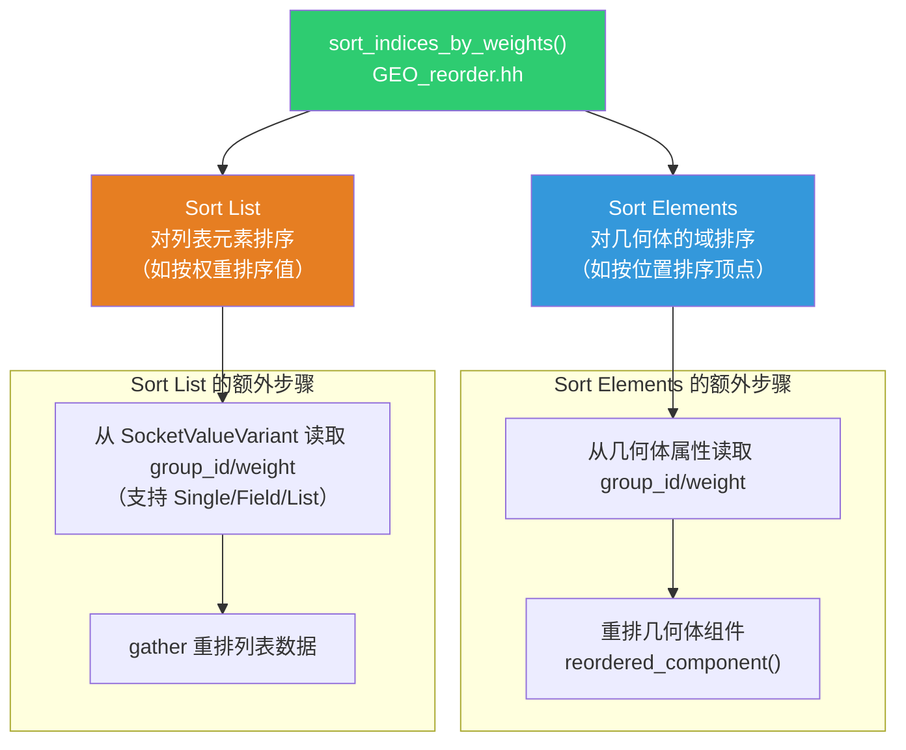

### 13.2 差异对比

| 特性 | Sort Elements | Sort List |
|------|--------------|-----------|
| 操作对象 | 几何体域（点/面/边） | 列表 |
| 输入类型 | 属性字段 | Single/Field/List |
| Selection 来源 | 域上的布尔属性 | SocketValueVariant |
| Group ID 来源 | 域上的整数属性 | SocketValueVariant |
| Sort Weight 来源 | 域上的浮点属性 | SocketValueVariant |
| 排序后处理 | 重排几何体组件 | gather 重排列表数据 |
| SampleIndexFunction | 不需要 | 需要（列表→字段适配） |

---

## 14. 关键语法与注释翻译

### 14.1 ResourceScope

```cpp
ResourceScope scope;
```

> **`ResourceScope`**：资源作用域——一个 RAII 容器，存储任意类型的对象。当 `scope` 离开作用域时，所有存储的对象自动销毁。用于延长临时对象（如从列表转换的 `VArray`）的生命周期。

### 14.2 ListFieldContext

```cpp
ListFieldContext field_context;
fn::FieldEvaluator field_evaluator(field_context, list_size);
```

> **`ListFieldContext`**：列表字段上下文——告诉 `FieldEvaluator` "在列表环境下求值"。与几何体字段上下文不同，列表没有域（domain）的概念，只有大小。

### 14.3 std::optional 和 std::nullopt

```cpp
const std::optional<Array<int>> sorted = geometry::sort_indices_by_weights(...);
if (!sorted) { ... }  // 等价于 sorted == std::nullopt
```

> **`std::optional<T>`**：可能包含值也可能不包含的容器。`std::nullopt` 表示"不包含值"。`sort_indices_by_weights` 返回 `nullopt` 表示"无需排序"——排序结果与原序相同，不需要重排。

### 14.4 std::get_if

```cpp
if (std::get_if<GList::SingleData>(&list_data)) { ... }
if (const auto *array_data = std::get_if<GList::ArrayData>(&list_data)) { ... }
```

> **`std::get_if<T>(&variant)`**：检查 variant 是否持有类型 `T`。如果持有，返回指向数据的指针；否则返回 `nullptr`。与 `std::get<T>` 不同——`std::get` 在类型不匹配时抛出异常，`std::get_if` 返回 `nullptr`。

### 14.5 UNLIKELY 宏

```cpp
if (UNLIKELY(weight_a == weight_b)) {
```

> **`UNLIKELY(condition)`**：编译器提示宏，告诉分支预测器这个条件**很少为真**。CPU 流水线会优化"大概率路径"的执行。等价于 `__builtin_expect(!!(condition), 0)`。

### 14.6 NOD_REGISTER_NODE

```cpp
NOD_REGISTER_NODE(node_register)
```

> **`NOD_REGISTER_NODE`**：Blender 的节点注册宏。在全局初始化阶段调用 `node_register` 函数，将节点类型注册到 Blender 的节点类型系统中。确保节点在 Blender 启动时可用。

---

> 📖 系列文档：[目录](01-列表系统架构与核心数据结构.md) | [上一篇](07-FilterList节点.md) | [下一篇](09-ClosureToList节点.md)
