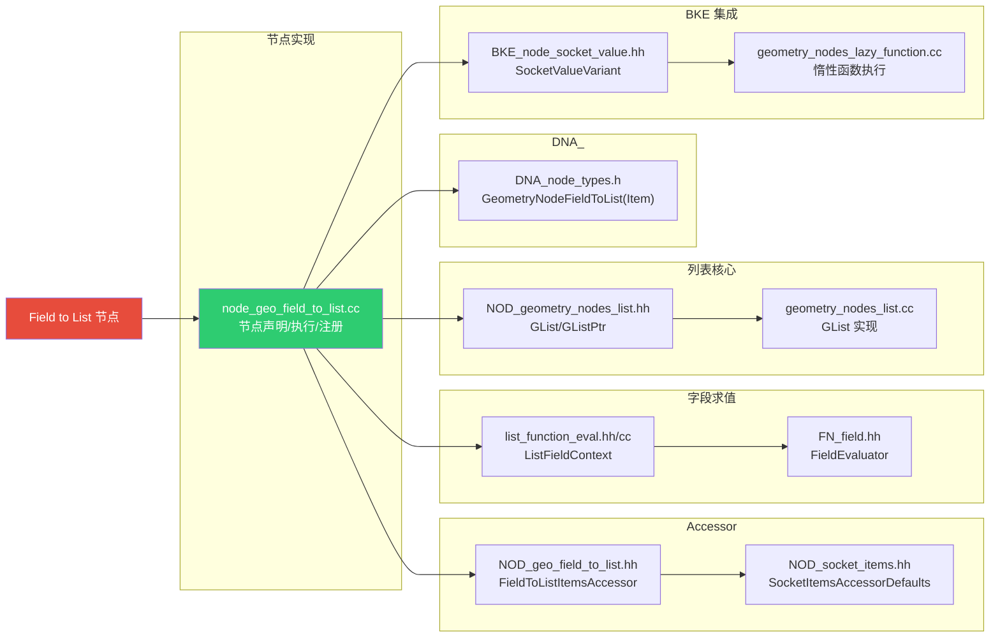
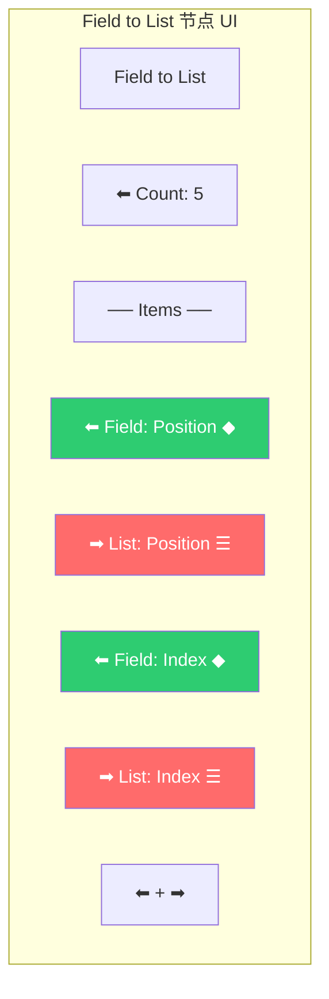
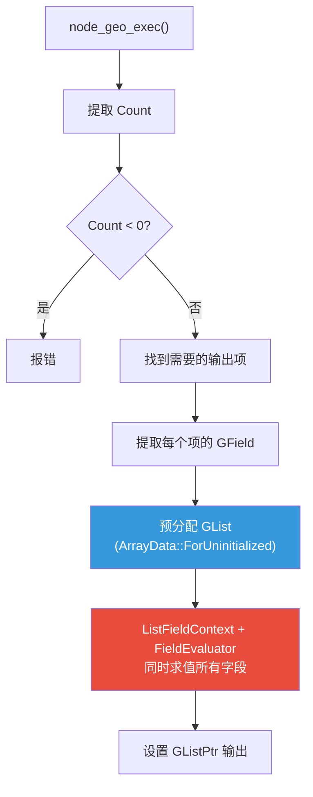
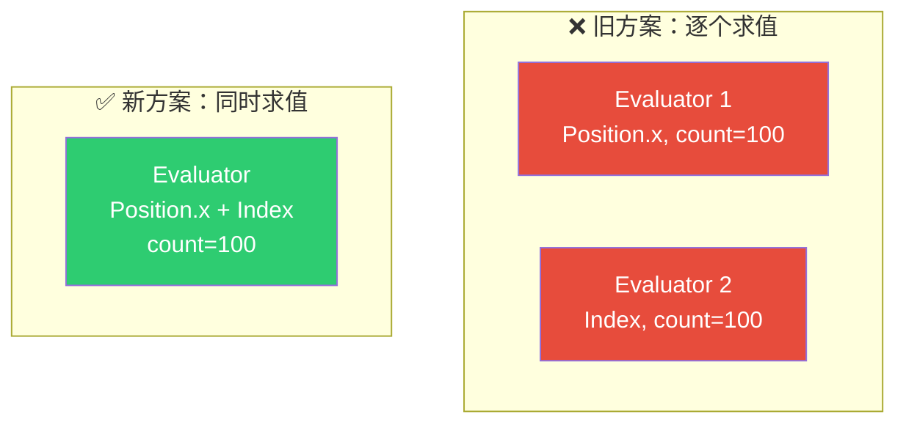
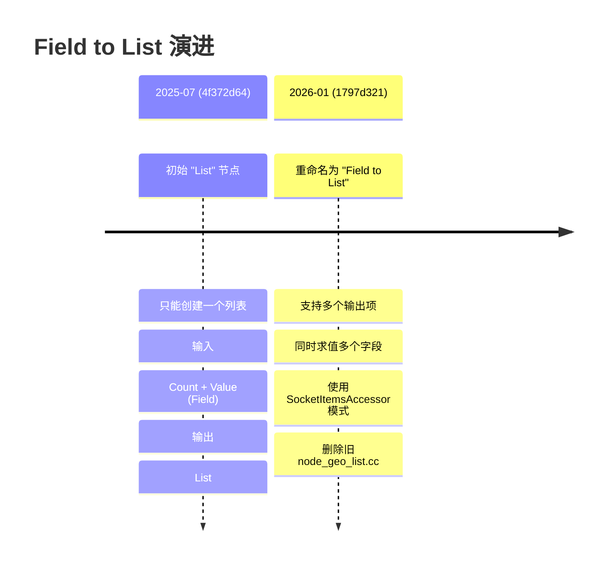

# Field to List 节点

> 📖 系列文档：[目录](01-列表系统架构与核心数据结构.md) | [上一篇](07-FilterList节点.md) | [下一篇](09-ClosureToList节点.md)
> 源码文件：[node_geo_field_to_list.cc](../../source/blender/nodes/geometry/nodes/node_geo_field_to_list.cc)
> 相关文件：[NOD_geo_field_to_list.hh](../../source/blender/nodes/geometry/include/NOD_geo_field_to_list.hh)、[list_function_eval.hh](../../source/blender/nodes/intern/list_function_eval.hh)

---

## 目录

- [Field to List 节点](#field-to-list-节点)
  - [目录](#目录)
  - [1. 节点概述与涉及文件](#1-节点概述与涉及文件)
  - [2. 节点声明 — 动态 Socket 项](#2-节点声明--动态-socket-项)
  - [3. 节点 UI 布局](#3-节点-ui-布局)
  - [4. 核心执行逻辑](#4-核心执行逻辑)
  - [5. ListFieldContext — 字段求值上下文](#5-listfieldcontext--字段求值上下文)
  - [6. 同时求值多个字段的优化](#6-同时求值多个字段的优化)
  - [7. 直接写入列表内存的零拷贝优化](#7-直接写入列表内存的零拷贝优化)
  - [8. 链接搜索与节点注册](#8-链接搜索与节点注册)
    - [链接搜索](#链接搜索)
    - [注册](#注册)
  - [9. 提交历史与演进](#9-提交历史与演进)

---

## 1. 节点概述与涉及文件

**节点 ID**：`GeometryNodeFieldToList`
**功能**：将字段（Field）在指定数量的索引上求值，生成列表
**复杂度**：⭐⭐⭐⭐

Field to List 涉及的文件众多，因为它是"创建型"节点，需要动态 Socket 管理、字段求值、列表构建等多个子系统协作：



### 涉及文件完整列表

| 文件 | 修改行数 | 变更类型 | 职责 |
|------|---------|---------|------|
| `node_geo_field_to_list.cc` | +247 | 新增 | 节点完整实现（声明/执行/注册/生命周期） |
| `NOD_geo_field_to_list.hh` | +95 | 新增 | FieldToListItemsAccessor 定义 |
| `rna_nodetree.cc` | +63/-1 | 修改 | RNA 属性定义 |
| `DNA_node_types.h` | +16 | 修改 | GeometryNodeFieldToList(Item) DNA 结构 |
| `list_function_eval.cc` | +12/-19 | 修改 | ListFieldContext 重构（提取为独立类） |
| `list_function_eval.hh` | +9 | 修改 | ListFieldContext 声明提取 |
| `CMakeLists.txt` | +2/-1 | 修改 | 构建系统更新 |
| `node_add_menu_geometry.py` | +1/-1 | 修改 | 菜单注册（List → Field to List） |
| `node_geo_list.cc` | -121 | 删除 | 旧 List 节点移除 |
| `basic_eval.blend` | +2/-2 | 修改 | 测试文件更新 |
| `get_item_dynamic.blend` | +2/-2 | 修改 | 测试文件更新 |
| `to_single_value.blend` | +2/-2 | 修改 | 测试文件更新 |

> 共 12 个文件，+451/-149（净增 302 行）

### 为什么这么多代码？

Field to List 的核心执行逻辑（`node_geo_exec`）仅约 50 行，但整个提交新增 451 行。约 **89% 是管道代码**（plumbing），用于将节点接入 Blender 的各个子系统：

| 子系统 | 行数 | 占比 | 说明 |
|--------|------|------|------|
| 节点实现 | +247 | 55% | 声明/执行/注册/生命周期函数/UI/链接搜索 |
| Accessor | +95 | 21% | Socket Items 框架适配器（项 CRUD/标识符/类型支持） |
| RNA | +63 | 14% | Python API 和 UI 属性定义 |
| DNA | +16 | 4% | 持久化存储结构（.blend 文件格式） |
| 其他 | +30 | 7% | 构建系统/菜单/字段求值重构 |

这是 Blender 节点系统的固有特征——每个节点必须集成以下子系统：

1. **DNA**（~16行）：持久化存储结构，定义 .blend 文件中的二进制布局，保证文件格式向后兼容
2. **RNA**（~63行）：Python API 和 UI 属性系统，每个动态项需要定义 `socket_type`、`name`、`identifier` 等属性
3. **Accessor**（~95行）：Socket Items 框架的适配器，定义项的 CRUD、标识符映射、类型支持等
4. **节点实现**（~247行）：核心逻辑 + 生命周期函数（init/free/copy/blend_write/blend_read）+ UI 布局 + 链接搜索 + 注册
5. **构建系统**（~2行）：CMakeLists.txt
6. **菜单注册**（~1行）：node_add_menu_geometry.py

SocketItemsAccessor 模式已经大幅减少了重复代码（通用的 UI 绘制、操作符注册、序列化逻辑都由框架提供），但每个节点仍需编写自己的 Accessor 适配器和生命周期函数。

---

## 2. 节点声明 — 动态 Socket 项

```cpp
static void node_declare(NodeDeclarationBuilder &b)
{
  b.use_custom_socket_order();
  b.allow_any_socket_order();

  // 固定输入：列表元素数量
  b.add_input<decl::Int>("Count"_ustr)
      .default_value(1)
      .min(1)
      .description("The number of elements in the list");

  // 动态项：每个项一对 Field 输入 + List 输出
  const bNode *node = b.node_or_null();
  if (!node) return;
  const GeometryNodeFieldToList &storage = node_storage(*node);
  const Span<GeometryNodeFieldToListItem> items(storage.items, storage.items_num);

  for (const int i : items.index_range()) {
    const GeometryNodeFieldToListItem &item = items[i];
    const eNodeSocketDatatype type = item.socket_type;
    const std::string input_id = ItemsAccessor::input_socket_identifier_for_item(item);
    const std::string output_id = ItemsAccessor::output_socket_identifier_for_item(item);
    const UString name(item.name);

    b.add_input(type, name, UString(input_id))
        .structure_type(StructureType::Field)       // ← 标记为字段
        .socket_name_ptr(&tree->id, *ItemsAccessor::item_srna, &item, "name");
    b.add_output(type, name, UString(output_id))
        .structure_type(StructureType::List)         // ← 标记为列表
        .align_with_previous()
        .description("Output list with evaluated field values");
  }

  // 扩展按钮
  b.add_input<decl::Extend>(""_ustr, "__extend__"_ustr)
      .structure_type(StructureType::Field)
      .custom_draw(socket_items::ui::draw_extend_socket_fn<FieldToListItemsAccessor>());
  b.add_output<decl::Extend>(""_ustr, "__extend__"_ustr)
      .structure_type(StructureType::List)
      .align_with_previous();
}
```

> **`b.use_custom_socket_order()` + `b.allow_any_socket_order()`**：允许输入输出交错排列。每个项的 Field 输入和 List 输出需要并排显示。

> **`.socket_name_ptr(...)`**：将 Socket 显示名称绑定到 RNA 属性，修改项名称时自动更新。

> **`decl::Extend`**：特殊的 Socket 类型，渲染为 "+" 按钮。

---

## 3. 节点 UI 布局

```cpp
static void node_layout_ex(ui::Layout &layout, bContext *C, PointerRNA *ptr)
{
  bNodeTree &tree = *reinterpret_cast<bNodeTree *>(ptr->owner_id);
  bNode &node = *static_cast<bNode *>(ptr->data);
  if (ui::Layout *panel = layout.panel(C, "field_to_list_items", false, IFACE_("Items"))) {
    socket_items::ui::draw_items_list_with_operators<ItemsAccessor>(C, panel, tree, node);
    socket_items::ui::draw_active_item_props<ItemsAccessor>(tree, node, [&](PointerRNA *item_ptr) {
      panel->use_property_split_set(true);
      panel->use_property_decorate_set(false);
      panel->prop(item_ptr, "socket_type", UI_ITEM_NONE, std::nullopt, ICON_NONE);
    });
  }
}
```



---

## 4. 核心执行逻辑



```cpp
static void node_geo_exec(GeoNodeExecParams params)
{
  const int count = params.extract_input<int>("Count"_ustr);
  if (count < 0) {
    params.error_message_add(NodeWarningType::Error, "Count must not be negative");
    params.set_default_remaining_outputs();
    return;
  }

  const GeometryNodeFieldToList &storage = node_storage(params.node());
  const Span<GeometryNodeFieldToListItem> items(storage.items, storage.items_num);

  // 步骤1：只处理需要的输出项
  Vector<int> required_items;
  for (const int i : items.index_range()) {
    if (params.output_is_required(
            UString(ItemsAccessor::output_socket_identifier_for_item(items[i]))))
    {
      required_items.append(i);
    }
  }

  // 步骤2：提取字段
  Vector<fn::GField> fields;
  for (const int i : required_items.index_range()) {
    const int item_i = required_items[i];
    const std::string identifier = ItemsAccessor::input_socket_identifier_for_item(items[item_i]);
    fields.append(params.extract_input<fn::GField>(UString(identifier)));
  }

  // 步骤3：预分配列表存储
  Vector<GListPtr> lists(required_items.size());
  for (const int i : required_items.index_range()) {
    const int item_i = required_items[i];
    const eNodeSocketDatatype type = items[item_i].socket_type;
    const CPPType &cpp_type = *bke::socket_type_to_geo_nodes_base_cpp_type(type);
    lists[i] = GList::create(cpp_type, GList::ArrayData::ForUninitialized(cpp_type, count), count);
  }

  // 步骤4：同时求值所有字段
  ListFieldContext context;
  fn::FieldEvaluator evaluator{context, count};
  for (const int i : fields.index_range()) {
    GMutableSpan values(lists[i]->cpp_type(),
                        const_cast<void *>(std::get<GList::ArrayData>(lists[i]->data()).data),
                        count);
    evaluator.add_with_destination(std::move(fields[i]), values);
  }
  evaluator.evaluate();

  // 步骤5：设置输出
  for (const int i : required_items.index_range()) {
    const int item_i = required_items[i];
    const std::string identifier = ItemsAccessor::output_socket_identifier_for_item(items[item_i]);
    params.set_output(UString(identifier), std::move(lists[i]));
  }
}
```

---

## 5. ListFieldContext — 字段求值上下文

```cpp
class ListFieldContext : public FieldContext {
 public:
  GVArray get_varray_for_input(const FieldInput &field_input,
                               const IndexMask &mask,
                               ResourceScope & /*scope*/) const override
  {
    const auto *id_field_input = dynamic_cast<const bke::IDAttributeFieldInput *>(&field_input);
    const auto *index_field_input = dynamic_cast<const fn::IndexFieldInput *>(&field_input);

    if (id_field_input == nullptr && index_field_input == nullptr) {
      return {};  // 不支持的输入类型
    }
    return fn::IndexFieldInput::get_index_varray(mask);
  }
};
```

> **只支持 Index 和 ID**：在列表上下文中，唯一可用的"几何信息"就是索引号。

> **`dynamic_cast`**：运行时类型识别。在字段输入的多态层次中判断具体类型。

---

## 6. 同时求值多个字段的优化



`FieldEvaluator` 可以合并公共子表达式。当多个字段共享相同的子表达式（如都依赖 Index），只计算一次。

---

## 7. 直接写入列表内存的零拷贝优化

```cpp
// 预分配未初始化的列表存储
lists[i] = GList::create(cpp_type, GList::ArrayData::ForUninitialized(cpp_type, count), count);

// 将列表内部数据直接作为字段求值的目标缓冲区
GMutableSpan values(lists[i]->cpp_type(),
                    const_cast<void *>(std::get<GList::ArrayData>(lists[i]->data()).data),
                    count);
evaluator.add_with_destination(std::move(fields[i]), values);
```

> **`add_with_destination`**：字段求值结果直接写入列表内存，零拷贝。

> **`const_cast<void*>`**：安全，因为列表是唯一所有者。

---

## 8. 链接搜索与节点注册

### 链接搜索

```cpp
static void node_gather_link_search_ops(GatherLinkSearchOpParams &params)
{
  const eNodeSocketDatatype data_type = params.other_socket().type;
  if (params.in_out() == SOCK_IN) {
    if (params.node_tree().typeinfo->validate_link(data_type, SOCK_INT)) {
      params.add_item(IFACE_("Count"), [](LinkSearchOpParams &params) { ... });
    }
    if (ItemsAccessor::supports_socket_type(data_type, NTREE_GEOMETRY)) {
      params.add_item(IFACE_("Field"), [data_type](LinkSearchOpParams &params) { ... });
    }
  } else {
    if (ItemsAccessor::supports_socket_type(data_type, NTREE_GEOMETRY)) {
      params.add_item(IFACE_("List"), [data_type](LinkSearchOpParams &params) { ... });
    }
  }
}
```

### 注册

```cpp
static void node_register()
{
  static blender::bke::bNodeType ntype;
  geo_node_type_base(&ntype, "GeometryNodeFieldToList"_ustr);
  ntype.ui_name = "Field to List";
  ntype.ui_description = "Create a list of values";
  ntype.nclass = NODE_CLASS_CONVERTER;
  ntype.declare = node_declare;
  ntype.initfunc = node_init;
  blender::bke::node_type_storage(
      ntype, "GeometryNodeFieldToList", node_free_storage, node_copy_storage);
  ntype.geometry_node_execute = node_geo_exec;
  ntype.draw_buttons_ex = node_layout_ex;
  ntype.register_operators = node_operators;
  ntype.insert_link = node_insert_link;
  ntype.ignore_inferred_input_socket_visibility = true;
  ntype.gather_link_search_ops = node_gather_link_search_ops;
  ntype.internally_linked_input = node_internally_linked_input;
  ntype.blend_write_storage_content = node_blend_write;
  ntype.blend_data_read_storage_content = node_blend_read;
  blender::bke::node_register_type(ntype);
}
NOD_REGISTER_NODE(node_register)
```

> **`ignore_inferred_input_socket_visibility = true`**：输入 Socket 可见性由用户控制，不被自动推断规则隐藏。

---

## 9. 提交历史与演进


