# Closure to List 节点

> 📖 系列文档：[目录](01-列表系统架构与核心数据结构.md) | [上一篇](08-FieldToList节点.md) | [下一篇](10-列表函数求值系统.md)
> 源码文件：[node_geo_closure_to_list.cc](../../source/blender/nodes/geometry/nodes/node_geo_closure_to_list.cc)
> 相关文件：[NOD_geo_closure_to_list.hh](../../source/blender/nodes/geometry/include/NOD_geo_closure_to_list.hh)、[BKE_compute_contexts.hh](../../source/blender/blenkernel/BKE_compute_contexts.hh)、[geometry_nodes_closure.cc](../../source/blender/nodes/intern/geometry_nodes_closure.cc)、[sync_sockets.cc](../../source/blender/nodes/intern/sync_sockets.cc)、[compute_contexts.cc](../../source/blender/blenkernel/intern/compute_contexts.cc)、[NOD_geometry_nodes_closure_eval.hh](../../source/blender/nodes/NOD_geometry_nodes_closure_eval.hh)、[geometry_nodes_closure_zone.cc](../../source/blender/nodes/intern/geometry_nodes_closure_zone.cc)、[DNA_node_types.h](../../source/blender/makesdna/DNA_node_types.h)、[rna_nodetree.cc](../../source/blender/makesrna/intern/rna_nodetree.cc)、[node_declaration.cc](../../source/blender/nodes/intern/node_declaration.cc)、[trace_values.cc](../../source/blender/nodes/intern/trace_values.cc)

---

## 目录

1. [节点概述与涉及文件](#1-节点概述与涉及文件)
2. [与 Field to List 的根本区别](#2-与-field-to-list-的根本区别)
3. [DNA 存储结构详解](#3-dna-存储结构详解)
4. [ClosureToListItemsAccessor 详解](#4-closuretolistitemsaccessor-详解)
5. [节点声明 — 闭包签名](#5-节点声明--闭包签名)
6. [节点 UI 布局与 structure_type 属性](#6-节点-ui-布局与-structure_type-属性)
7. [核心执行逻辑](#7-核心执行逻辑)
8. [并行执行详解](#8-并行执行详解)
9. [evaluate_closure_eagerly 内部机制](#9-evaluate_closure_eagerly-内部机制)
10. [ClosureToListComputeContext — 计算上下文](#10-closuretolistcomputecontext--计算上下文)
11. [结果收集的两种路径](#11-结果收集的两种路径)
12. [节点生命周期函数](#12-节点生命周期函数)
13. [闭包签名（Closure Signature）详解](#13-闭包签名closure-signature详解)
14. [Socket 自动同步机制](#14-socket-自动同步机制)
15. [同步系统完整调用链](#15-同步系统完整调用链)
16. [references_other_outputs 与声明系统变更](#16-references_other_outputs-与声明系统变更)
17. [链接搜索与节点注册](#17-链接搜索与节点注册)
18. [RNA 定义完整分析](#18-rna-定义完整分析)
19. [trace_values 与值追踪集成](#19-trace_values-与值追踪集成)
20. [完整执行流程端到端追踪](#20-完整执行流程端到端追踪)
21. [提交历史](#21-提交历史)

---

## 1. 节点概述与涉及文件

**节点 ID**：`GeometryNodeClosureToList`
**功能**：将闭包（Closure）在每个索引上执行一次，收集输出形成列表
**复杂度**：⭐⭐⭐⭐⭐（最复杂的列表节点）
**提交**：`e7e84d44`（2026-05-28，Hans Goudey & Jacques Lucke，[PR #145984](https://projects.blender.org/blender/blender/pulls/145984)）

Closure to List 是所有列表节点中最复杂的，涉及 19 个文件的修改（741 行新增），因为它需要闭包执行、并行化、计算上下文、Socket 自动同步、多种输出类型等多个子系统协作：

```mermaid
graph TB
    C2L["Closure to List 节点"]

    subgraph "节点实现 (308行)"
        CC["node_geo_closure_to_list.cc<br/>声明/执行/注册"]
    end

    subgraph "Accessor (98行)"
        HH["NOD_geo_closure_to_list.hh<br/>ClosureToListItemsAccessor"]
    end

    subgraph "闭包执行"
        CE["evaluate_closure_eagerly()<br/>(closure_zone.cc 130行)"]
        CEP["ClosureEagerEvalParams<br/>(closure_eval.hh)"]
        CS["ClosureSignature<br/>from_closure_to_list_node()"]
        GC["geometry_nodes_closure.cc<br/>签名构建"]
    end

    subgraph "并行化"
        TP["threading::parallel_for<br/>grain_size=8"]
    end

    subgraph "计算上下文 (13+17行)"
        CTX_H["BKE_compute_contexts.hh<br/>ClosureToListComputeContext 声明"]
        CTX_C["compute_contexts.cc<br/>哈希计算/打印"]
    end

    subgraph "Socket 自动同步 (93行)"
        SYNC["sync_sockets.cc<br/>sync_sockets_closure_to_list()"]
    end

    subgraph "列表核心"
        LIST["NOD_geometry_nodes_list.hh"]
    end

    subgraph "DNA (16行)"
        DNA["DNA_node_types.h<br/>GeometryNodeClosureToList(Item)"]
    end

    subgraph "RNA (131行)"
        RNA["rna_nodetree.cc<br/>属性定义"]
    end

    subgraph "声明系统变更 (31行)"
        DECL_H["NOD_node_declaration.hh<br/>references_other_outputs()"]
        DECL_C["node_declaration.cc<br/>实现 + 重构"]
    end

    subgraph "值追踪 (3行)"
        TRACE["trace_values.cc<br/>define_signature=true"]
    end

    subgraph "BKE 集成"
        SocketValueVariant["BKE_node_socket_value.hh"]
    end

    C2L --> CC
    CC --> HH
    CC --> CE
    CE --> CEP
    CC --> CS
    CS --> GC
    CC --> TP
    CC --> CTX_H
    CTX_H --> CTX_C
    CC --> SYNC
    CC --> LIST
    CC --> DNA
    DNA --> RNA
    CC --> DECL_H
    DECL_H --> DECL_C
    CC --> TRACE
    CC --> SocketValueVariant

    style C2L fill:#9b59b6,color:#fff
    style CC fill:#e74c3c,color:#fff
    style SYNC fill:#e67e22,color:#fff
    style RNA fill:#3498db,color:#fff
    style CE fill:#1abc9c,color:#fff
    style DECL_H fill:#f39c12,color:#fff
```

### 涉及文件完整列表

| 文件 | 修改行数 | 变更类型 | 职责 |
|------|---------|---------|------|
| `node_geo_closure_to_list.cc` | +308 | 新增 | 节点完整实现 |
| `NOD_geo_closure_to_list.hh` | +98 | 新增 | Accessor 定义 |
| `BKE_compute_contexts.hh` | +13 | 修改 | ClosureToListComputeContext 声明 |
| `compute_contexts.cc` | +17 | 修改 | 上下文哈希/打印实现 |
| `sync_sockets.cc` | +93 | 修改 | Socket 自动同步 |
| `geometry_nodes_closure.cc` | +19 | 修改 | ClosureSignature::from_closure_to_list_node |
| `DNA_node_types.h` | +16 | 修改 | DNA 存储结构 |
| `rna_nodetree.cc` | +131 | 修改 | RNA 属性定义 |
| `node_add_menu_geometry.py` | +1 | 修改 | 菜单注册 |
| `node_draw.cc` | +1 | 修改 | 节点绘制 |
| `NOD_geometry_nodes_closure_signature.hh` | +1 | 修改 | 签名前向声明 |
| `NOD_node_declaration.hh` | +7 | 修改 | references_other_outputs() 声明 |
| `NOD_sync_sockets.hh` | +4 | 修改 | 同步接口声明 |
| `node_declaration.cc` | +24/-4 | 修改 | references_other_outputs() 实现 + 重构 |
| `node_common.cc` | +1 | 修改 | 通用节点支持（include 头文件） |
| `trace_values.cc` | +3 | 修改 | 值追踪集成 |

---

## 2. 与 Field to List 的根本区别

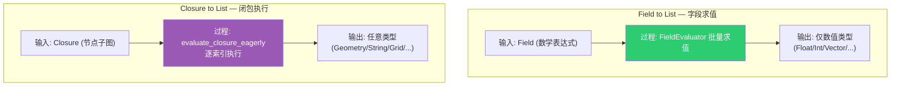

| 特性 | Field to List | Closure to List |
|------|---------------|-----------------|
| 输入类型 | 字段（Field） | 闭包（Closure） |
| 输出类型 | 仅字段兼容类型 | **任意类型**（Geometry、String、Grid 等） |
| 执行方式 | 批量字段求值 | 逐索引执行闭包 |
| 并行化 | FieldEvaluator 内部 | `threading::parallel_for` |
| 输入 Socket | 每项一个 Field 输入 | 共享一个 Closure 输入 |
| 输出项结构类型 | 固定为 List | 可选（Single/Field/List） |
| 计算上下文 | ListFieldContext | ClosureToListComputeContext |
| Socket 同步 | 无 | 自动同步闭包签名 |
| 项属性面板 | socket_type | socket_type + structure_type |
| Count 最小值 | 1 | 0 |
| 每项输入 Socket | 有（Field 输入） | **无**（仅闭包输入） |
| 标识符前缀 | `"Item_"` | `"Grid_"`（历史遗留） |

---

## 3. DNA 存储结构详解

Closure to List 的 DNA 结构定义在 [DNA_node_types.h](../../source/blender/makesdna/DNA_node_types.h) 中，是节点持久化数据的核心。

### GeometryNodeClosureToListItem

```cpp
struct GeometryNodeClosureToListItem {
  eNodeSocketDatatype socket_type = SOCK_FLOAT;
  NodeSocketInterfaceStructureType structure_type = NodeSocketInterfaceStructureType::Auto;
  char _pad[1] = {};
  int identifier = 0;
  char *name = nullptr;
};
```

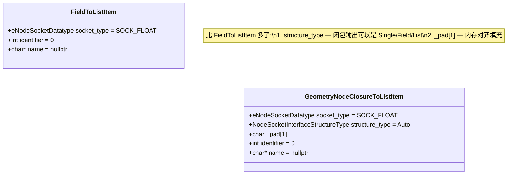

**字段详解**：

| 字段 | 类型 | 默认值 | 说明 |
|------|------|--------|------|
| `socket_type` | `eNodeSocketDatatype` | `SOCK_FLOAT` | 输出 Socket 的数据类型（Float/Int/Vector/Geometry/String/...） |
| `structure_type` | `NodeSocketInterfaceStructureType` | `Auto` | 输出的结构类型（Single/Field/Grid/List） |
| `_pad[1]` | `char[1]` | — | 内存对齐填充。`structure_type` 是 4 字节枚举，后跟 `int identifier`，中间需要 1 字节填充保证 4 字节对齐 |
| `identifier` | `int` | `0` | 唯一标识符，用于生成 Socket 标识符 `"Grid_" + identifier`。由 `next_identifier++` 递增分配 |
| `name` | `char*` | `nullptr` | 输出项的显示名称，动态分配的 C 字符串。需要手动管理内存（`BLI_strdup_null` / `MEM_SAFE_DELETE`） |

> **`structure_type` 默认为 `Auto`**：但在 `init_with_socket_type_and_name` 中会被显式设为 `Single`。`Auto` 值在 `from_closure_to_list_node` 中不会出现——签名构建时直接读取存储的值。

> **`_pad[1]` 的由来**：`eNodeSocketDatatype` 是 4 字节枚举，`NodeSocketInterfaceStructureType` 也是 4 字节枚举。但 `structure_type` 后面紧跟 `char _pad[1]` 和 `int identifier`。因为 `int` 需要 4 字节对齐，而 `4 + 4 + 1 = 9`，需要 3 字节填充到 12。但这里只声明了 `_pad[1]`，编译器会自动添加剩余的 2 字节填充。

### GeometryNodeClosureToList

```cpp
struct GeometryNodeClosureToList {
  char _pad[4] = {};
  int next_identifier = 0;
  GeometryNodeClosureToListItem *items = nullptr;
  int items_num = 0;
  int active_index = 0;
};
```

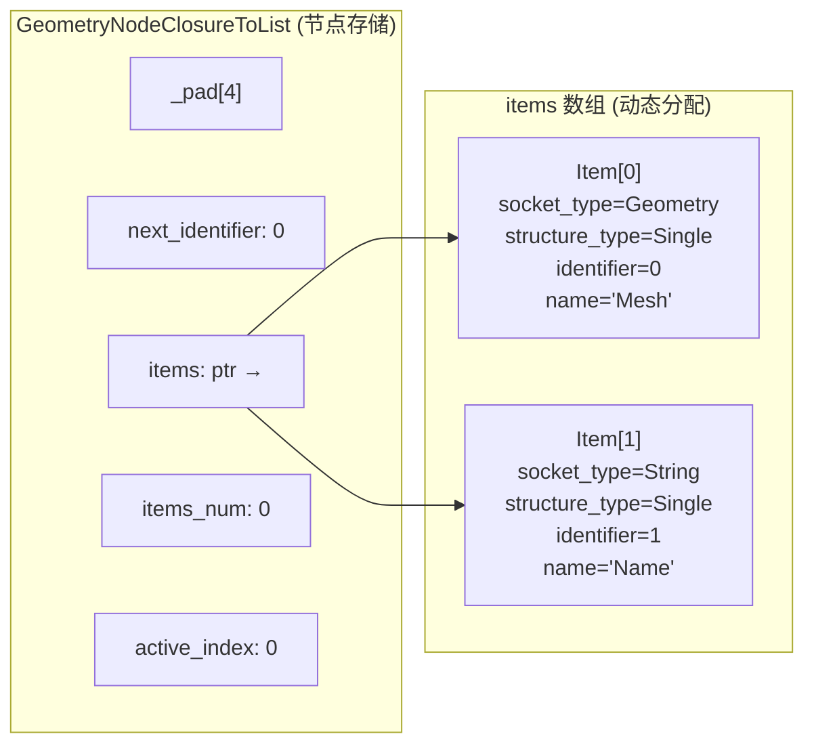

**字段详解**：

| 字段 | 类型 | 默认值 | 说明 |
|------|------|--------|------|
| `_pad[4]` | `char[4]` | — | 内存对齐填充。因为第一个有意义的字段 `next_identifier` 是 `int`（4 字节对齐），但 DNA 要求结构体起始对齐 |
| `next_identifier` | `int` | `0` | 下一个分配的标识符。每次添加新项时递增，确保标识符唯一 |
| `items` | `GeometryNodeClosureToListItem*` | `nullptr` | 动态分配的项数组。使用 C 风格数组而非 `Vector`，因为 DNA 需要简单的内存布局 |
| `items_num` | `int` | `0` | 项数组中的元素数量 |
| `active_index` | `int` | `0` | 当前在属性面板中选中（高亮）的项索引 |

> **为什么用 `_pad[4]` 而不是更有意义的字段？** 这是 DNA 的设计惯例——如果将来需要在存储结构开头添加字段，可以利用 `_pad` 空间而不改变结构体大小，保持文件格式兼容。

> **`next_identifier` 的递增语义**：即使删除了某个项，`next_identifier` 也不会回退。这确保了标识符的单调递增，避免与已删除项的标识符冲突。例如：添加 Item(id=0)、Item(id=1)、删除 Item(id=1)、再添加 Item(id=2)——而不是复用 id=1。

### 与 FieldToList DNA 的对比

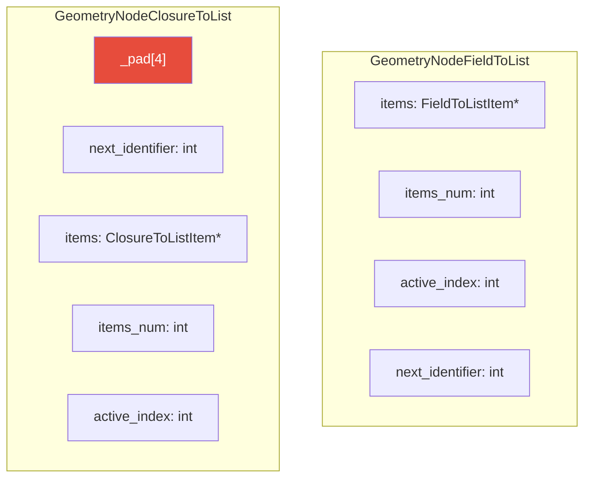

关键差异：
1. ClosureToList 的项多了 `structure_type` 和 `_pad[1]` 字段
2. ClosureToList 的存储结构开头有 `_pad[4]`，字段顺序与 FieldToList 不同
3. ClosureToList 的项**没有对应的输入 Socket**（`input_socket_identifier_for_item` 返回空字符串）

---

## 4. ClosureToListItemsAccessor 详解

Accessor 是 Closure to List 与通用 Socket Items 框架的桥梁，定义在 [NOD_geo_closure_to_list.hh](../../source/blender/nodes/geometry/include/NOD_geo_closure_to_list.hh)。它使得各种通用函数（UI、操作符、序列化等）可以统一处理不同节点的动态项。

### 完整定义

```cpp
struct ClosureToListItemsAccessor : public socket_items::SocketItemsAccessorDefaults {
  using ItemT = GeometryNodeClosureToListItem;
  static StructRNA **item_srna;
  static int node_type;
  static constexpr StringRefNull node_idname = "GeometryNodeClosureToList";
  static constexpr bool has_type = true;
  static constexpr bool has_name = true;
  static constexpr bool has_single_identifier_str = false;
  struct operator_idnames {
    static constexpr StringRefNull add_item = "NODE_OT_closure_to_list_item_add";
    static constexpr StringRefNull remove_item = "NODE_OT_closure_to_list_item_remove";
    static constexpr StringRefNull move_item = "NODE_OT_closure_to_list_item_move";
  };
  struct ui_idnames {
    static constexpr StringRefNull list = "NODE_UL_closure_to_list_items";
  };
  struct rna_names {
    static constexpr StringRefNull items = "list_items";
    static constexpr StringRefNull active_index = "active_index";
  };

  static socket_items::SocketItemsRef<GeometryNodeClosureToListItem> get_items_from_node(
      bNode &node)
  {
    auto &storage = *static_cast<GeometryNodeClosureToList *>(node.storage);
    return {&storage.items, &storage.items_num, &storage.active_index};
  }

  static void copy_item(const GeometryNodeClosureToListItem &src,
                        GeometryNodeClosureToListItem &dst)
  {
    dst = src;
    dst.name = BLI_strdup_null(dst.name);
  }

  static void destruct_item(GeometryNodeClosureToListItem *item)
  {
    MEM_SAFE_DELETE(item->name);
  }

  static void blend_write_item(BlendWriter *writer, const ItemT &item);
  static void blend_read_data_item(BlendDataReader *reader, ItemT &item);

  static eNodeSocketDatatype get_socket_type(const ItemT &item)
  {
    return eNodeSocketDatatype(item.socket_type);
  }

  static bool supports_socket_type(const eNodeSocketDatatype socket_type, const int ntree_type)
  {
    return bke::node_tree_type_supports_socket_type_static(ntree_type, socket_type);
  }

  static char **get_name(GeometryNodeClosureToListItem &item)
  {
    return &item.name;
  }

  static void init_with_socket_type_and_name(bNode &node,
                                             GeometryNodeClosureToListItem &item,
                                             const eNodeSocketDatatype socket_type,
                                             const char *name)
  {
    auto *storage = static_cast<GeometryNodeClosureToList *>(node.storage);
    item.socket_type = socket_type;
    item.identifier = storage->next_identifier++;
    item.structure_type = NodeSocketInterfaceStructureType::Single;
    socket_items::set_item_name_and_make_unique<ClosureToListItemsAccessor>(node, item, name);
  }

  static std::string input_socket_identifier_for_item(
      const GeometryNodeClosureToListItem & /*item*/)
  {
    return {};
  }
  static std::string output_socket_identifier_for_item(const GeometryNodeClosureToListItem &item)
  {
    return "Grid_" + std::to_string(item.identifier);
  }
};
```

### 关键常量与方法详解

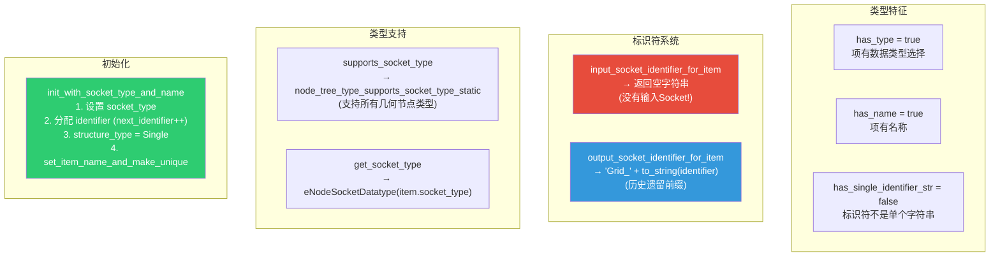

#### `has_single_identifier_str = false`

这个常量告诉 Socket Items 框架：项的标识符**不是**一个简单的字符串字段。当 `has_single_identifier_str = true` 时（如 Repeat Zone），框架可以直接操作 `item.identifier` 字符串来匹配 Socket。但 Closure to List 的标识符是 `int` 类型，需要通过 `output_socket_identifier_for_item` 方法转换为 `"Grid_" + id` 格式。

#### `input_socket_identifier_for_item` 返回空字符串

这是 Closure to List 与 Field to List 最关键的区别之一。Field to List 的每个项都有对应的输入 Socket（如 `"Item_0"` 用于接收 Field），但 Closure to List **没有**——所有输入都通过唯一的 Closure 输入传递。

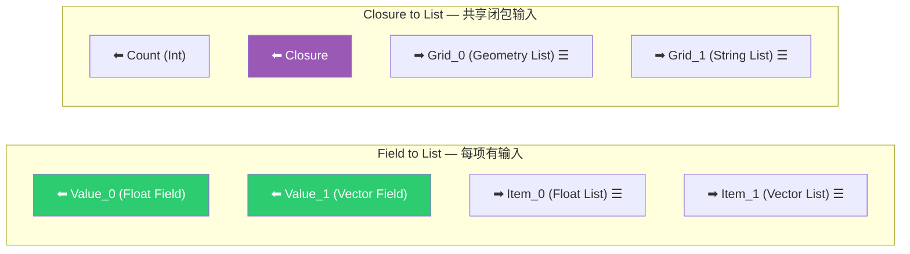

#### `supports_socket_type` — 支持所有几何节点类型

```cpp
static bool supports_socket_type(const eNodeSocketDatatype socket_type, const int ntree_type)
{
  return bke::node_tree_type_supports_socket_type_static(ntree_type, socket_type);
}
```

与 Field to List（仅支持字段兼容类型）不同，Closure to List 支持几何节点中的**所有** Socket 类型，包括 Geometry、String、Volume Grid 等非字段类型。这正是该节点存在的核心价值。

#### `copy_item` — 深拷贝名称

```cpp
static void copy_item(const GeometryNodeClosureToListItem &src,
                      GeometryNodeClosureToListItem &dst)
{
  dst = src;                           // 浅拷贝所有字段
  dst.name = BLI_strdup_null(dst.name); // 深拷贝名称字符串
}
```

> **`BLI_strdup_null`**：如果指针非空则调用 `BLI_strdup` 复制字符串，否则返回 `nullptr`。比 `BLI_strdup` 更安全，不需要先检查空指针。

> **为什么需要深拷贝？** `dst = src` 会执行默认的成员逐一拷贝，包括指针 `name`。如果两个项共享同一个 `name` 指针，当一个项被销毁时（`MEM_SAFE_DELETE(item->name)`），另一个项的 `name` 就变成了悬空指针。

#### `destruct_item` — 安全释放名称

```cpp
static void destruct_item(GeometryNodeClosureToListItem *item)
{
  MEM_SAFE_DELETE(item->name);
}
```

> **`MEM_SAFE_DELETE`**：Blender 的安全删除宏。等价于 `if (ptr) { MEM_freeN(ptr); ptr = nullptr; }`。先检查空指针，释放后将指针置空，防止双重释放。

### Accessor 与 FieldToListItemsAccessor 对比

| 方法 | FieldToList | ClosureToList |
|------|-------------|---------------|
| `has_type` | `true` | `true` |
| `has_name` | `true` | `true` |
| `has_single_identifier_str` | `false` | `false` |
| `input_socket_identifier_for_item` | `"Item_" + id` | `""` (空) |
| `output_socket_identifier_for_item` | `"Item_" + id` | `"Grid_" + id` |
| `supports_socket_type` | 仅字段兼容类型 | **所有**几何节点类型 |
| `init_with_socket_type_and_name` | 无 structure_type | 设置 `structure_type = Single` |
| `copy_item` | `BLI_strdup_null` | `BLI_strdup_null` |

---

## 5. 节点声明 — 闭包签名

```cpp
static void node_declare(NodeDeclarationBuilder &b)
{
  b.use_custom_socket_order();
  b.allow_any_socket_order();

  b.add_input<decl::Int>("Count"_ustr)
      .default_value(1)
      .min(0)  // 允许 0（Field to List 要求 >= 1）
      .description("The number of elements in the list");

  // 动态输出项（注意：没有对应的输入 Socket！）
  const bNode *node = b.node_or_null();
  if (!node) return;
  const GeometryNodeClosureToList &storage = node_storage(*node);
  const Span<GeometryNodeClosureToListItem> items(storage.items, storage.items_num);

  for (const int i : items.index_range()) {
    const GeometryNodeClosureToListItem &item = items[i];
    const UString output_identifier{ItemsAccessor::output_socket_identifier_for_item(item)};
    const UString name{item.name};
    const eNodeSocketDatatype type = item.socket_type;
    b.add_output(type, name, output_identifier)
        .structure_type(StructureType::List)
        .propagate_all()          // ← 传播匿名属性
        .references_other_outputs();  // ← 引用其他输出
  }

  // 扩展按钮
  b.add_output<decl::Extend>(""_ustr, "__extend__"_ustr)
      .structure_type(StructureType::List)
      .custom_draw(socket_items::ui::draw_extend_socket_fn<ItemsAccessor>());

  // 闭包输入（放在最后）
  b.add_input<decl::Closure>("Closure"_ustr).create_signature([](const bNode &node) {
    return ClosureSignature::from_closure_to_list_node(node);
  });
}
```

> **`.propagate_all()`**：传播匿名属性。闭包执行可能产生新的匿名属性（如通过 Store Named Attribute 节点），需要正确传播到下游。

> **`.references_other_outputs()`**：标记此 Socket 引用了其他输出，影响求值顺序——被引用的输出会先求值。这是本提交新增的方法（详见[第16节](#16-references_other_outputs-与声明系统变更)）。

> **`.create_signature(...)`**：为闭包输入创建签名。签名定义了闭包期望的输入（Index）和输出（与动态项对应），使得用户在连接闭包时能看到正确的 Socket 提示。

> **Count 允许 0**：与 Field to List 不同，Closure to List 允许 Count=0，此时输出空列表。这是因为闭包执行的开销较高，用户可能需要动态控制是否执行。

### Socket 布局

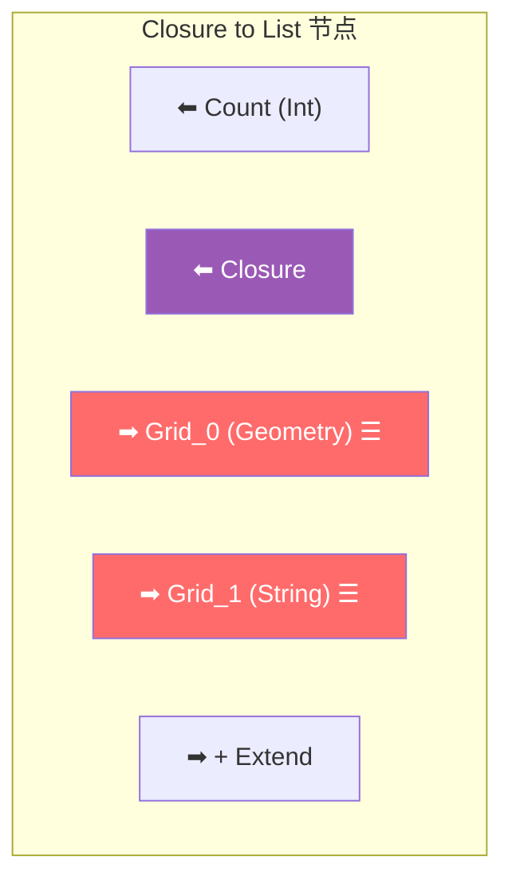

> **注意**：输出标识符使用 `"Grid_"` 前缀（历史遗留命名），功能上不影响。

### 声明顺序的重要性


`b.use_custom_socket_order()` 和 `b.allow_any_socket_order()` 允许自由控制 Socket 的显示顺序。Closure 输入放在最后，使得节点的视觉布局更清晰——上方是 Count 和输出，下方是闭包连接。

---

## 6. 节点 UI 布局与 structure_type 属性

与 Field to List 不同，Closure to List 的属性面板多了一个 **structure_type**（形状）选项：

```cpp
static void node_layout_ex(ui::Layout &layout, bContext *C, PointerRNA *ptr)
{
  bNodeTree &tree = *reinterpret_cast<bNodeTree *>(ptr->owner_id);
  bNode &node = *static_cast<bNode *>(ptr->data);
  if (ui::Layout *panel = layout.panel(C, "closure_to_list_items", false, IFACE_("Items"))) {
    socket_items::ui::draw_items_list_with_operators<ItemsAccessor>(C, panel, tree, node);
    socket_items::ui::draw_active_item_props<ItemsAccessor>(tree, node, [&](PointerRNA *item_ptr) {
      panel->use_property_split_set(true);
      panel->use_property_decorate_set(false);
      panel->prop(item_ptr, "socket_type", UI_ITEM_NONE, std::nullopt, ICON_NONE);
      panel->prop(item_ptr, "structure_type", UI_ITEM_NONE, IFACE_("Shape"), ICON_NONE);  // ← 额外属性
    });
  }
}
```

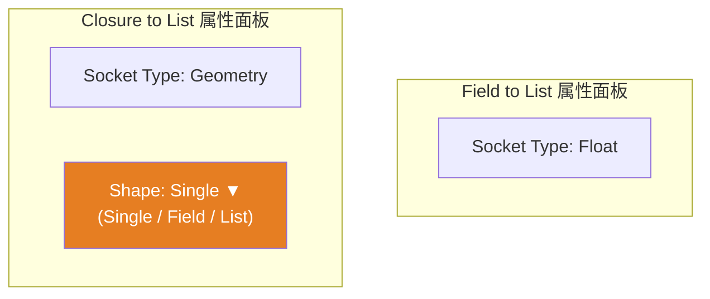

> **为什么需要 structure_type？** 闭包的输出可以是单值、字段或列表。例如：
> - 闭包输出一个 Geometry → structure_type = Single
> - 闭包输出一个 Float 字段 → structure_type = Field
> - 闭包输出一个 Float 列表 → structure_type = List
>
> Field to List 不需要这个属性，因为它的输出**总是**列表。

> **`IFACE_("Shape")`**：在 UI 中显示为 "Shape" 而非 "Structure Type"，更简洁易懂。

---

## 7. 核心执行逻辑

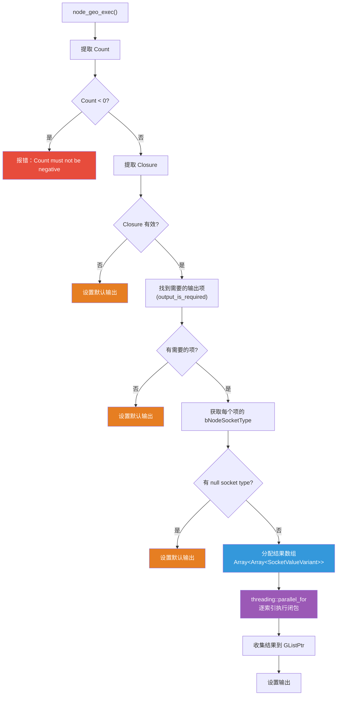

### 结果数组分配

```cpp
Array<Array<bke::SocketValueVariant>> closure_results(required_items.size(), NoInitialization());
for (const int i : closure_results.index_range()) {
  new (&closure_results[i]) Array<bke::SocketValueVariant>(count, NoInitialization());
}
```

> **`NoInitialization{}`**：不初始化内存。因为闭包执行会覆盖每个位置，跳过初始化节省时间。

> **`placement new`**：在已分配的 `Array<Array<...>>` 内存上构造内部 `Array`。外层 `Array` 使用 `NoInitialization`，所以需要手动构造每个元素。这是 C++ 的高级用法——将对象构造与内存分配分离。

### output_is_required 优化

```cpp
Vector<int> required_items;
for (const int i : items.index_range()) {
  if (params.output_is_required(
          UString(ItemsAccessor::output_socket_identifier_for_item(items[i]))))
  {
    required_items.append(i);
  }
}
```

> **`output_is_required`**：检查某个输出 Socket 是否有下游连接。如果某个输出没有被使用，就跳过该输出的闭包求值，避免不必要的计算。例如，如果用户只连接了 `Grid_0`，`Grid_1` 的闭包输出就不会被计算。

### Socket 类型验证

```cpp
Array<const bke::bNodeSocketType *> socket_types(required_items.size());
for (const int required_i : required_items.index_range()) {
  const int item_i = required_items[required_i];
  const eNodeSocketDatatype type = items[item_i].socket_type;
  socket_types[required_i] = bke::node_socket_type_find_static(type);
}
if (socket_types.as_span().contains(nullptr)) {
  params.set_default_remaining_outputs();
  return;
}
```

> **`node_socket_type_find_static`**：通过枚举值查找 Socket 类型信息。如果返回 `nullptr`，说明该类型不被支持（可能是自定义类型或已废弃的类型）。

> **为什么需要验证？** 项的 `socket_type` 存储在 DNA 中，可能来自旧版本的 .blend 文件，其中的类型枚举值在当前版本中已不存在。

---

## 8. 并行执行详解

```cpp
const bke::bNodeSocketType *int_type = bke::node_socket_type_find("NodeSocketInt");
threading::parallel_for(IndexRange(count), 8, [&](const IndexRange range) {
  ClosureEagerEvalParams closure_params;

  // 创建输入：Index
  closure_params.inputs.resize(1);
  closure_params.inputs[0].key = "Index";
  closure_params.inputs[0].type = int_type;

  // 创建输出：与动态项对应
  closure_params.outputs.resize(required_items.size());
  for (const int required_i : required_items.index_range()) {
    const int item_i = required_items[required_i];
    closure_params.outputs[required_i].key = items[item_i].name;
    closure_params.outputs[required_i].type = socket_types[required_i];
  }

  for (const int64_t list_i : range) {
    // 设置当前索引作为输入
    BLI_assert(list_i < std::numeric_limits<int>::max());
    closure_params.inputs[0].value = bke::SocketValueVariant::From(int(list_i));

    // 设置输出位置
    for (const int required_i : required_items.index_range()) {
      closure_params.outputs[required_i].value = &closure_results[required_i][list_i];
    }

    // 创建计算上下文
    const bke::ClosureToListComputeContext context(
        parent_user_data.compute_context, node.identifier, int(list_i));
    GeoNodesUserData user_data = parent_user_data;
    user_data.compute_context = &context;
    user_data.verbose_log = should_log_verbose_in_context(user_data, context.hash());
    closure_params.user_data = &user_data;

    // 执行闭包
    evaluate_closure_eagerly(*closure, closure_params);
  }
});
```

> **`grain_size = 8`**：每个任务至少处理 8 个索引。注释原文："The grain size is completely arbitrary since we don't know how expensive the closure is. However since the closure evaluation itself has fairly high overhead, it makes to optimize for the case where each task has a relatively high cost."

> **`BLI_assert(list_i < std::numeric_limits<int>::max())`**：确保索引值不超出 `int` 范围。`list_i` 是 `int64_t`，但闭包输入的 Index 是 `int` 类型。

> **`ClosureEagerEvalParams`**：闭包急切求值参数。"急切"（eager）意味着立即执行，而非延迟求值。每个参数有 `key`（名称）、`type`（Socket 类型）、`value`（值指针）。

> **`bke::SocketValueVariant::From(int(list_i))`**：工厂方法，从值创建 `SocketValueVariant`。等价于 `SocketValueVariant(int(list_i))`，但更明确。

> **`should_log_verbose_in_context`**：检查当前上下文是否需要详细日志。对于调试和性能分析很有用。

```mermaid
gantt
    title Closure to List 并行执行（Count=8, grain=2）
    dateFormat X
    axisFormat %s

    section Thread 1
    闭包[0] :t1_0, 0, 1
    闭包[1] :t1_1, 1, 2

    section Thread 2
    闭包[2] :t2_0, 0, 1
    闭包[3] :t2_1, 1, 2

    section Thread 3
    闭包[4] :t3_0, 0, 1
    闭包[5] :t3_1, 1, 2

    section Thread 4
    闭包[6] :t4_0, 0, 1
    闭包[7] :t4_1, 1, 2
```

### 闭包参数的生命周期

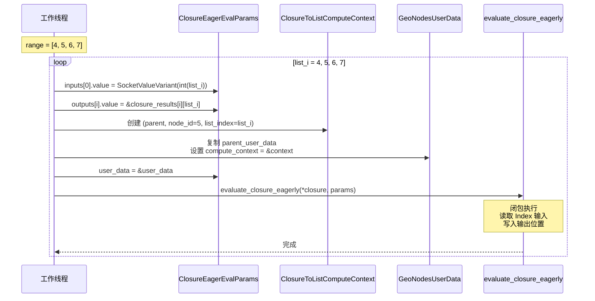

> **`closure_params` 在循环外创建**：输入输出的 `key` 和 `type` 只需设置一次，循环内只更新 `value`。这避免了重复的字符串比较和类型查找。

> **`GeoNodesUserData user_data = parent_user_data`**：每个索引需要独立的 `user_data` 副本，因为 `compute_context` 指针不同。`user_data` 是值类型复制，不会影响父级数据。

### 线程安全分析

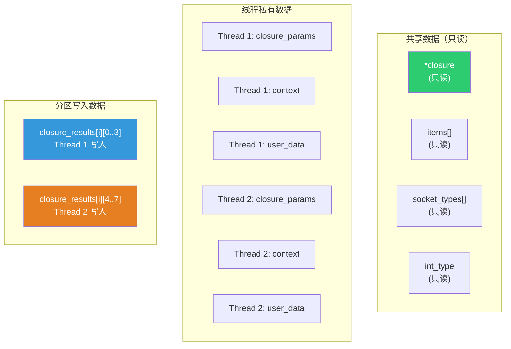

- **`closure`**：`ClosurePtr`（即 `std::shared_ptr<Closure>`），闭包对象本身是不可变的，多个线程可以安全地读取
- **`closure_results[i][list_i]`**：每个线程写入不同的 `list_i` 位置，没有写入冲突
- **`closure_params`**：每个线程有自己的实例，完全独立
- **`context` / `user_data`**：栈上变量，每个线程独立

---

## 9. evaluate_closure_eagerly 内部机制

`evaluate_closure_eagerly` 是闭包执行的核心函数，定义在 [geometry_nodes_closure_zone.cc](../../source/blender/nodes/intern/geometry_nodes_closure_zone.cc)。它将闭包的 Lazy Function 框架与急切求值模式桥接起来。

### ClosureEagerEvalParams 结构

```cpp
struct ClosureEagerEvalParams {
  struct InputItem {
    std::string key;
    const bke::bNodeSocketType *type = nullptr;
    bke::SocketValueVariant value;  // 可被移动
  };

  struct OutputItem {
    std::string key;
    const bke::bNodeSocketType *type = nullptr;
    bke::SocketValueVariant *value = nullptr;  // 指向未初始化内存
  };

  Vector<InputItem> inputs;
  Vector<OutputItem> outputs;
  GeoNodesUserData *user_data = nullptr;
};
```

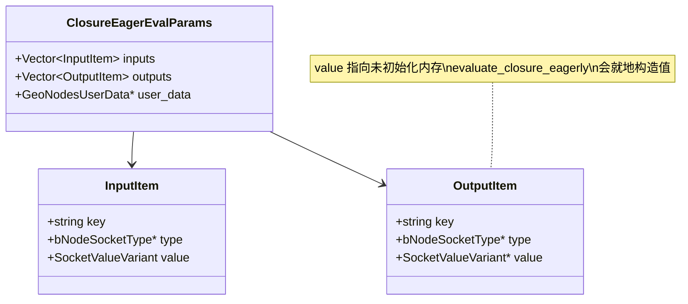

> **`OutputItem::value` 指向未初始化内存**：这是关键设计。`evaluate_closure_eagerly` 会在 `*value` 位置就地构造（placement new）`SocketValueVariant`，而不是返回值。这避免了额外的拷贝/移动。

### evaluate_closure_eagerly 执行流程

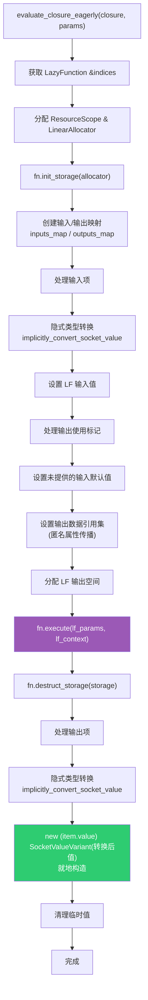

### 关键步骤详解

#### 1. 输入/输出映射

```cpp
Array<std::optional<int>> inputs_map(params.inputs.size());
for (const int i : inputs_map.index_range()) {
  inputs_map[i] = signature.find_input_index(params.inputs[i].key);
}
Array<std::optional<int>> outputs_map(params.outputs.size());
for (const int i : outputs_map.index_range()) {
  outputs_map[i] = signature.find_output_index(params.outputs[i].key);
}
```

> **`find_input_index` / `find_output_index`**：通过 `key`（名称）在闭包签名中查找对应的索引。如果找不到，返回 `std::nullopt`，表示该输入/输出在闭包中不存在。

> **为什么用 `std::optional<int>`？** 调用者可能请求了闭包不提供的输出。例如，Closure to List 请求了 "Mesh" 输出，但闭包只输出 "Value"。此时 `outputs_map[i]` 为 `nullopt`，该输出会被设为默认值。

#### 2. 隐式类型转换

```cpp
if (std::optional<bke::SocketValueVariant> value = implicitly_convert_socket_value(
        from_type, item.value, to_type))
{
  input_value = *value;
}
else {
  input_value = *to_type.geometry_nodes_default_value;
}
```

> **`implicitly_convert_socket_value`**：尝试在 Socket 类型之间进行隐式转换。例如 Float → Int、Int → Float。如果转换不可行，使用目标类型的默认值。

#### 3. 就地构造输出

```cpp
for (const int output_item_i : params.outputs.index_range()) {
  ClosureEagerEvalParams::OutputItem &item = params.outputs[output_item_i];
  if (const std::optional<int> mapped_i = outputs_map[output_item_i]) {
    const bke::bNodeSocketType &from_type = *signature.outputs[*mapped_i].type;
    const bke::bNodeSocketType &to_type = *item.type;
    if (std::optional<bke::SocketValueVariant> value = implicitly_convert_socket_value(
            from_type,
            *lf_output_values[indices.outputs.main[*mapped_i]].get<bke::SocketValueVariant>(),
            to_type))
    {
      new (item.value) bke::SocketValueVariant(std::move(*value));
    }
    else {
      new (item.value) bke::SocketValueVariant(*to_type.geometry_nodes_default_value);
    }
  }
  else {
    construct_socket_default_value(*item.type, item.value);
  }
}
```

> **`new (item.value) SocketValueVariant(...)`**：在 `item.value` 指向的未初始化内存上就地构造 `SocketValueVariant`。这就是为什么 `closure_results` 使用 `NoInitialization`——`evaluate_closure_eagerly` 会负责构造每个元素。

> **闭包不提供的输出**：如果 `outputs_map[output_item_i]` 为 `nullopt`，说明闭包没有这个输出，使用 `construct_socket_default_value` 构造默认值。

---

## 10. ClosureToListComputeContext — 计算上下文

### 头文件声明

```cpp
class ClosureToListComputeContext : public NodeComputeContext {
 private:
  int32_t node_id_;
  int list_index_;

 public:
  ClosureToListComputeContext(const ComputeContext *parent,
                              int32_t node_id,
                              int list_index);

 private:
  ComputeContextHash compute_hash() const override;
  void print_current_in_line(std::ostream &stream) const override;
};
```

### 实现

```cpp
ClosureToListComputeContext::ClosureToListComputeContext(
    const ComputeContext *parent,
    const int32_t node_id,
    const int list_index)
    : NodeComputeContext(parent, node_id, nullptr),  // nullptr = 无额外哈希数据
      list_index_(list_index)
{
}

ComputeContextHash ClosureToListComputeContext::compute_hash() const
{
  return ComputeContextHash::from(parent_, "CLOSURE_TO_LIST", node_id_, list_index_);
}

void ClosureToListComputeContext::print_current_in_line(std::ostream &stream) const
{
  stream << "Closure to List ID: " << node_id_ << ", List Index: " << list_index_;
}
```

> **`ComputeContextHash::from(parent_, "CLOSURE_TO_LIST", node_id_, list_index_)`**：哈希计算包含父上下文、固定标签、节点 ID 和列表索引。这确保了每个索引的上下文哈希唯一。

> **`print_current_in_line`**：用于调试日志。当节点执行出错时，日志会显示 "Closure to List ID: 5, List Index: 3"，帮助定位问题。

### 上下文层次

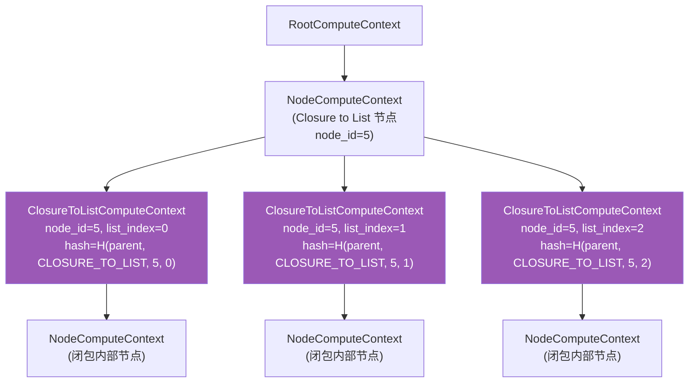

> **为什么需要独立的计算上下文？**
> 1. **匿名属性隔离**：每个索引的闭包执行可能产生不同的匿名属性，需要通过上下文哈希来区分
> 2. **日志追踪**：调试时需要知道哪个索引的执行出了问题
> 3. **递归检测**：`is_recursive()` 继承自 `NodeComputeContext`，默认返回 `false`（与 `EvaluateClosureComputeContext` 不同，后者会检查递归）
> 4. **缓存隔离**：不同索引的闭包执行结果需要独立缓存，上下文哈希作为缓存键

### 与其他计算上下文的对比

| 上下文类 | 父类 | 哈希标签 | 额外数据 | 递归检测 |
|---------|------|---------|---------|---------|
| `NodeComputeContext` | `ComputeContext` | `"NODE"` | `node_id` | 否 |
| `ForeachGeometryElementComputeContext` | `NodeComputeContext` | `"FOREACH"` | `index` | 否 |
| `EvaluateClosureComputeContext` | `NodeComputeContext` | `"EVAL_CLOSURE"` | — | **是** |
| `ClosureToListComputeContext` | `NodeComputeContext` | `"CLOSURE_TO_LIST"` | `list_index` | 否 |

> **为什么 ClosureToList 不需要递归检测？** Evaluate Closure 节点可以递归调用自身（闭包 A 调用闭包 B，B 又调用 A），所以需要递归检测。而 Closure to List 只是重复执行同一个闭包 N 次，不存在递归风险。

---

## 11. 结果收集的两种路径

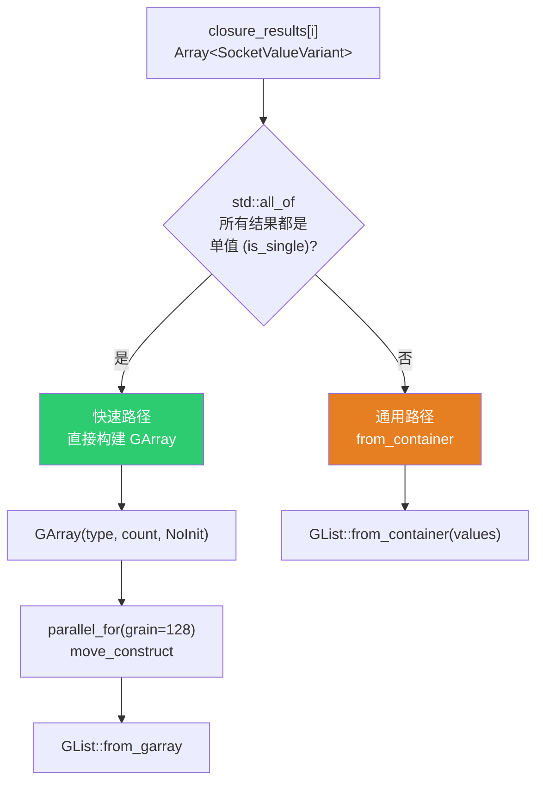

### 快速路径（所有结果都是单值）

```cpp
if (std::all_of(values.begin(), values.end(), [](const bke::SocketValueVariant &value) {
      return value.is_single();
    }))
{
  const eNodeSocketDatatype socket_type = items[item_i].socket_type;
  const CPPType &type = *bke::socket_type_to_geo_nodes_base_cpp_type(socket_type);

  GArray<> array(type, count, NoInitialization());
  threading::parallel_for(IndexRange(count), 128, [&](const IndexRange range) {
    for (const int list_i : range) {
      void *closure_result = const_cast<void *>(values[list_i].get_single_ptr_raw());
      type.move_construct(closure_result, array[list_i]);
    }
  });
  params.set_output(identifier, GList::from_garray(std::move(array)));
}
```

> **`std::all_of`**：检查范围内所有元素是否满足谓词。这里检查所有闭包结果是否都是单值。

> **`move_construct`**：移动而非拷贝。对于 `GeometrySet`、`std::string` 等类型，移动比拷贝快得多。

> **`grain_size = 128`**：结果收集的粒度比闭包执行（8）大得多，因为 `move_construct` 是非常轻量的操作。

> **`get_single_ptr_raw()`**：获取单值的原始指针。`const_cast<void*>` 是因为 `move_construct` 需要非 const 源指针（移动语义会修改源对象）。

> **`socket_type_to_geo_nodes_base_cpp_type`**：将 Socket 类型映射到对应的 `CPPType`。例如 `SOCK_FLOAT` → `CPPType::get<float>()`，`SOCK_GEOMETRY` → `CPPType::get<GeometrySet>()`。

### 通用路径（结果包含复杂类型）

```cpp
else {
  params.set_output(identifier, GList::from_container(std::move(values)));
}
```

> **为什么需要两种路径？** 当闭包输出的是几何体列表或字段列表时，每个 `SocketValueVariant` 本身包含 `GListPtr` 或 `GField`。这种情况下不能简单放入 `GArray`（`GArray` 要求元素是同一 `CPPType` 的平凡布局），而 `SocketValueVariant` 的变体性质使得直接构建 `GArray` 更合理。

> **`GList::from_container`**：从 `Array<SocketValueVariant>` 构建 `GList`。内部会遍历数组，提取每个 `SocketValueVariant` 中的值，构建类型擦除的列表。

### 何时走快速路径 vs 通用路径？

| 闭包输出类型 | 结果 SocketValueVariant Kind | 路径 | 原因 |
|-------------|--------------|------|------|
| Geometry | Single | 快速 | 单值，可直接 move_construct |
| String | Single | 快速 | 单值，可直接 move_construct |
| Float | Single | 快速 | 单值，可直接 move_construct |
| Int | Single | 快速 | 单值，可直接 move_construct |
| Float (字段) | Field | 通用 | SocketValueVariant 包含 GField，非平凡类型 |
| Float (列表) | List | 通用 | SocketValueVariant 包含 GListPtr，非平凡类型 |
| Volume Grid | Grid | 通用 | SocketValueVariant 包含 Grid 数据，非平凡类型 |

### 快速路径的性能优势

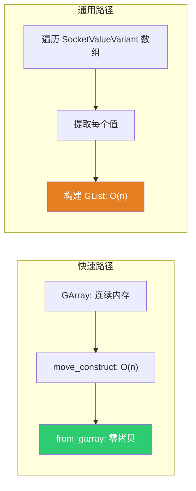

快速路径的优势：
1. **连续内存布局**：`GArray` 的元素在内存中连续，缓存友好
2. **零拷贝构建**：`from_garray` 直接接管 `GArray` 的内存，无需额外分配
3. **并行化**：`move_construct` 可以并行执行（grain_size=128）

---

## 12. 节点生命周期函数

### node_init — 初始化

```cpp
static void node_init(bNodeTree * /*tree*/, bNode *node)
{
  node->storage = MEM_new<GeometryNodeClosureToList>(__func__);
}
```

> **`MEM_new<T>(__func__)`**：Blender 的内存分配宏，等价于 `new T()` 但使用 Blender 自定义分配器。`__func__` 是 C++ 预定义标识符，表示当前函数名，用于内存泄漏追踪。

> **默认构造**：`GeometryNodeClosureToList` 的默认构造函数将所有字段初始化为零值（`_pad={}`, `next_identifier=0`, `items=nullptr`, `items_num=0`, `active_index=0`）。

### node_free_storage — 释放

```cpp
static void node_free_storage(bNode *node)
{
  socket_items::destruct_array<ItemsAccessor>(*node);
  MEM_delete(static_cast<GeometryNodeClosureToList *>(node->storage));
}
```

> **两步释放**：
> 1. `destruct_array<ItemsAccessor>`：遍历项数组，对每个项调用 `destruct_item`（释放 `name` 字符串），然后释放项数组本身
> 2. `MEM_delete`：释放 `GeometryNodeClosureToList` 结构体本身

> **顺序很重要**：必须先释放项数组中的资源（`name` 字符串），再释放存储结构。如果反过来，项数组的指针就变成悬空指针了。

### node_copy_storage — 复制

```cpp
static void node_copy_storage(bNodeTree * /*dst_tree*/, bNode *dst_node, const bNode *src_node)
{
  const GeometryNodeClosureToList &src_storage = node_storage(*src_node);
  auto *dst_storage = MEM_new<GeometryNodeClosureToList>(__func__, src_storage);
  dst_node->storage = dst_storage;

  socket_items::copy_array<ItemsAccessor>(*src_node, *dst_node);
}
```

> **`MEM_new<T>(__func__, src_storage)`**：拷贝构造。先浅拷贝整个存储结构（包括 `items` 指针和 `items_num`），然后通过 `copy_array` 深拷贝项数组。

> **`copy_array<ItemsAccessor>`**：分配新的项数组，对每个项调用 `copy_item`（深拷贝 `name` 字符串），更新 `dst_storage` 的 `items` 指针。

### node_blend_write / node_blend_read — 序列化

```cpp
static void node_blend_write(const bNodeTree & /*tree*/, const bNode &node, BlendWriter &writer)
{
  socket_items::blend_write<ItemsAccessor>(&writer, node);
}

static void node_blend_read(bNodeTree & /*tree*/, bNode &node, BlendDataReader &reader)
{
  socket_items::blend_read_data<ItemsAccessor>(&reader, node);
}
```

> **`blend_write`**：将项数组写入 .blend 文件。`ClosureToListItemsAccessor::blend_write_item` 负责写入每个项的 `name` 字符串。

> **`blend_read`**：从 .blend 文件读取项数组。`ClosureToListItemsAccessor::blend_read_data_item` 负责读取每个项的 `name` 字符串。

### Accessor 的 blend_write_item / blend_read_data_item

```cpp
void ClosureToListItemsAccessor::blend_write_item(BlendWriter *writer, const ItemT &item)
{
  writer->write_string(item.name);
}

void ClosureToListItemsAccessor::blend_read_data_item(BlendDataReader *reader, ItemT &item)
{
  BLO_read_string(reader, &item.name);
}
```

> **为什么只序列化 `name`？** 其他字段（`socket_type`、`structure_type`、`identifier`）是简单类型，由 `blend_write`/`blend_read` 的通用逻辑自动处理。只有 `name` 是指针，需要特殊处理——写入时将字符串内容写入文件，读取时重新分配内存并读取字符串。

### node_internally_linked_input — 内部链接

```cpp
static const bNodeSocket *node_internally_linked_input(const bNodeTree & /*tree*/,
                                                       const bNode &node,
                                                       const bNodeSocket &output_socket)
{
  return node.input_by_identifier(output_socket.identifier_ustr());
}
```

> **内部链接**：当输出 Socket 没有被连接时，Blender 会尝试从输入 Socket 获取默认值。这个函数告诉 Blender：输出 `Grid_0` 的默认值来自与 `Grid_0` 标识符匹配的输入 Socket。

> **但 Closure to List 没有对应的输入 Socket！** 所以 `input_by_identifier` 会返回 `nullptr`，Blender 会使用该 Socket 类型的默认值。这个函数的存在是为了满足框架的接口要求，实际效果等同于返回 `nullptr`。

### node_insert_link — 拖拽添加项

```cpp
static bool node_insert_link(bke::NodeInsertLinkParams &params)
{
  return socket_items::try_add_item_via_any_extend_socket<ItemsAccessor>(
      params.ntree, params.node, params.node, params.link);
}
```

> **`try_add_item_via_any_extend_socket`**：当用户将线拖到 Extend 按钮上时，自动添加一个新项。新项的类型由拖入的线的 Socket 类型决定。

### 生命周期函数总览

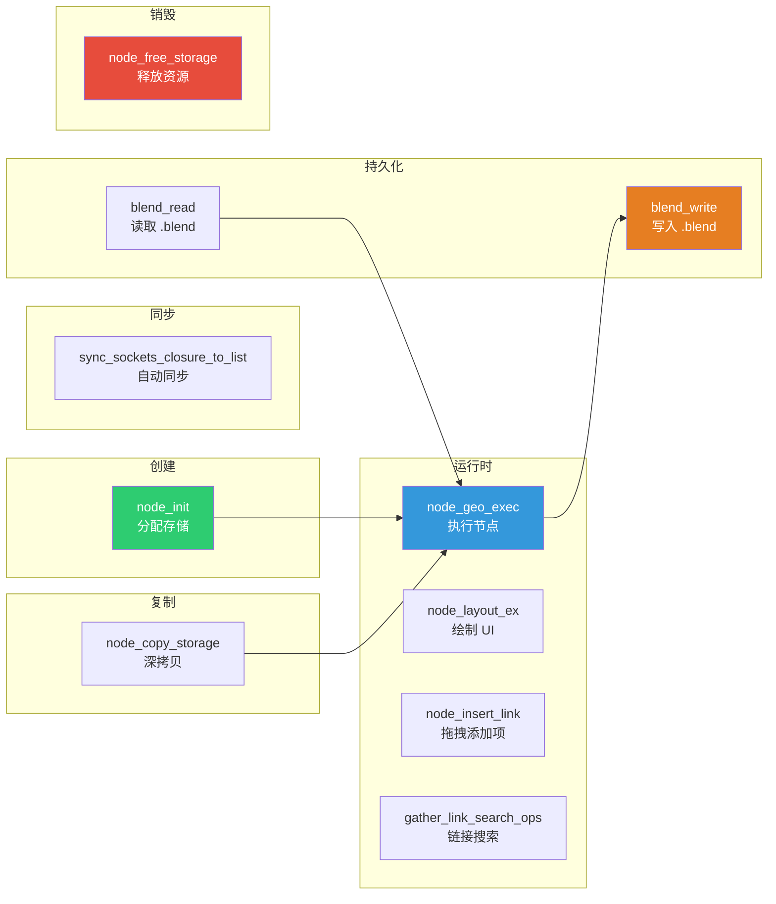

---

## 13. 闭包签名（Closure Signature）详解

### ClosureSignature 类结构

```cpp
class ClosureSignature {
 public:
  struct Item {
    std::string key;
    const bke::bNodeSocketType *type = nullptr;
    NodeSocketInterfaceStructureType structure_type;

    friend bool operator==(const Item &a, const Item &b) = default;
  };

  struct ItemKeyGetter {
    std::string operator()(const Item &item)
    {
      return item.key;
    }
  };

  CustomIDVectorSet<Item, ItemKeyGetter> inputs;
  CustomIDVectorSet<Item, ItemKeyGetter> outputs;

  std::optional<int> find_input_index(StringRef key) const;
  std::optional<int> find_output_index(StringRef key) const;

  friend bool operator==(const ClosureSignature &a, const ClosureSignature &b);
  friend bool operator!=(const ClosureSignature &a, const ClosureSignature &b);

  static ClosureSignature from_closure_output_node(const bNode &node, bool allow_auto_structure_type);
  static ClosureSignature from_evaluate_closure_node(const bNode &node, bool allow_auto_structure_type);
  static ClosureSignature from_closure_to_list_node(const bNode &node);

  void set_auto_structure_types();
};
```

```mermaid
classDiagram
    class ClosureSignature {
        +CustomIDVectorSet~Item~ inputs
        +CustomIDVectorSet~Item~ outputs
        +find_input_index(key) optional~int~
        +find_output_index(key) optional~int~
        +from_closure_output_node(node, allow_auto)$ ClosureSignature
        +from_evaluate_closure_node(node, allow_auto)$ ClosureSignature
        +from_closure_to_list_node(node)$ ClosureSignature
        +set_auto_structure_types()
    }

    class Item {
        +string key
        +bNodeSocketType* type
        +NodeSocketInterfaceStructureType structure_type
        +operator==(Item, Item) default
    }

    ClosureSignature --> Item : inputs / outputs
```

> **`CustomIDVectorSet<Item, ItemKeyGetter>`**：一个有序集合，元素按 `key` 去重。`ItemKeyGetter` 提取 `key` 作为唯一标识。这意味着签名中不能有同名的输入/输出。

> **`operator==` 使用 `= default`**：C++20 的默认比较运算符，逐一比较所有成员。用于签名比较（同步机制中判断是否需要更新）。

### from_closure_to_list_node 实现

```cpp
ClosureSignature ClosureSignature::from_closure_to_list_node(const bNode &node)
{
  BLI_assert(node.is_type("GeometryNodeClosureToList"_ustr));
  const auto &storage = *static_cast<const GeometryNodeClosureToList *>(node.storage);
  ClosureSignature signature;

  // 输入：Index（整数，单值）
  signature.inputs.add({.key = "Index",
                        .type = bke::node_socket_type_find("NodeSocketInt"),
                        .structure_type = NodeSocketInterfaceStructureType::Single});

  // 输出：与动态项对应
  for (const int i : IndexRange(storage.items_num)) {
    const GeometryNodeClosureToListItem &item = storage.items[i];
    const auto type = eNodeSocketDatatype(item.socket_type);
    signature.outputs.add(
        {.key = item.name,
         .type = bke::node_socket_type_find_static(type),
         .structure_type = NodeSocketInterfaceStructureType(item.structure_type)});
  }
  return signature;
}
```

> **C++20 指定初始化器（Designated Initializers）**：`{.key = "Index", .type = ..., .structure_type = ...}` 是 C++20 语法，允许按名称初始化结构体成员。比位置初始化更清晰。

> **`node_socket_type_find("NodeSocketInt")` vs `node_socket_type_find_static(type)`**：前者通过字符串名称查找（用于固定类型），后者通过枚举值查找（用于动态类型）。`_static` 版本更快，因为不需要字符串比较。

### 签名的作用

```mermaid
sequenceDiagram
    participant User as 用户
    participant UI as 节点编辑器
    participant Sig as ClosureSignature
    participant C2L as Closure to List

    User->>UI: 拖拽闭包输出到 Closure 输入
    UI->>Sig: 查询闭包签名
    Sig-->>UI: 输入: [Index(Int)]<br/>输出: [Mesh(Geometry), Name(String)]
    UI->>C2L: 自动创建匹配的输出项
    Note over C2L: Grid_0: Geometry<br/>Grid_1: String
```

签名使得闭包连接时自动匹配输出项，用户不需要手动添加和配置每个输出。

### 三种签名工厂方法对比

| 方法 | 来源节点 | 输入 | 输出 | structure_type |
|------|---------|------|------|---------------|
| `from_closure_output_node` | Closure Output | 闭包输出项 | 无 | 从节点声明推断 |
| `from_evaluate_closure_node` | Evaluate Closure | 闭包输入项 | 闭包输出项 | 从节点声明推断 |
| `from_closure_to_list_node` | Closure to List | 固定 Index | 动态项 | 从项存储读取 |

> **`from_closure_to_list_node` 的独特之处**：它是唯一一个输入固定为 `Index` 的签名工厂方法。其他两个方法的输入/输出都来自节点的动态 Socket。

---

## 14. Socket 自动同步机制

Closure to List 有一个 Field to List 没有的重要特性：**Socket 自动同步**。当连接的闭包签名改变时，节点的输出项会自动更新。

### 同步状态枚举

```cpp
enum class NodeSyncState {
  Synced,               // 已同步
  NoSyncSource,         // 无同步源（闭包未连接）
  ConflictingSyncSources, // 冲突的同步源
  CanBeSynced,          // 可以同步（签名不匹配）
};
```

```mermaid
stateDiagram-v2
    [*] --> NoSyncSource : 闭包未连接
    NoSyncSource --> CanBeSynced : 连接闭包
    CanBeSynced --> Synced : 执行同步
    Synced --> CanBeSynced : 闭包签名改变
    Synced --> NoSyncSource : 断开闭包
    CanBeSynced --> ConflictingSyncSources : 连接多个冲突闭包
    ConflictingSyncSources --> CanBeSynced : 解决冲突
```

### ClosureSyncState 结构

```cpp
struct ClosureSyncState {
  NodeSyncState state;
  std::optional<nodes::ClosureSignature> source_signature;
};
```

> **`source_signature`**：仅在 `CanBeSynced` 状态时有值，包含目标签名（闭包的实际签名）。用于同步时创建新的输出项。

### get_sync_state_closure_to_list

```cpp
static ClosureSyncState get_sync_state_closure_to_list(
    const SpaceNode &snode,
    const bNode &closure_to_list_node,
    const bNodeSocket *src_closure_socket = nullptr)
{
  snode.edittree->ensure_topology_cache();

  // 获取闭包输入 Socket
  if (!src_closure_socket) {
    src_closure_socket = closure_to_list_node.input_by_identifier("Closure"_ustr);
  }

  // 计算当前上下文
  bke::ComputeContextCache compute_context_cache;
  const ComputeContext *current_context = ed::space_node::compute_context_for_edittree_socket(
      snode, compute_context_cache, *src_closure_socket);
  if (!current_context) {
    return {NodeSyncState::NoSyncSource};
  }

  // 收集连接的闭包签名
  const LinkedClosureSignatures linked_signatures = gather_linked_origin_closure_signatures(
      current_context, *src_closure_socket, compute_context_cache);
  if (linked_signatures.items.is_empty()) {
    return {NodeSyncState::NoSyncSource};
  }

  // 合并多个签名源
  std::optional<ClosureSignature> merged_signature = linked_signatures.get_merged_signature();
  if (!merged_signature.has_value()) {
    return {NodeSyncState::ConflictingSyncSources};
  }

  // 比较当前签名和目标签名
  const ClosureSignature &current_signature = ClosureSignature::from_closure_to_list_node(
      closure_to_list_node);
  if (*merged_signature != current_signature) {
    return {NodeSyncState::CanBeSynced, merged_signature};
  }
  return {NodeSyncState::Synced};
}
```

```mermaid
flowchart TD
    Start["get_sync_state_closure_to_list"] --> EnsureCache["ensure_topology_cache()"]
    EnsureCache --> GetSocket["获取 Closure 输入 Socket"]
    GetSocket --> GetContext["compute_context_for_edittree_socket<br/>计算编辑树中的上下文"]
    GetContext --> HasContext{"有上下文?"}
    HasContext -->|"否"| NoSource1["NoSyncSource"]
    HasContext -->|"是"| Gather["gather_linked_origin_closure_signatures<br/>收集连接的闭包签名"]
    Gather --> HasSigs{"有签名?"}
    HasSigs -->|"否"| NoSource2["NoSyncSource"]
    HasSigs -->|"是"| Merge["get_merged_signature<br/>合并多个签名"]
    Merge --> CanMerge{"能合并?"}
    CanMerge -->|"否"| Conflict["ConflictingSyncSources"]
    CanMerge -->|"是"| Compare["比较当前签名 vs 合并签名"]
    Compare --> Same{"相同?"}
    Same -->|"是"| Synced["Synced"]
    Same -->|"否"| CanSync["CanBeSynced<br/>(携带 merged_signature)"]

    style NoSource1 fill:#95a5a6,color:#fff
    style NoSource2 fill:#95a5a6,color:#fff
    style Conflict fill:#e74c3c,color:#fff
    style Synced fill:#2ecc71,color:#fff
    style CanSync fill:#f39c12,color:#fff
```

> **`ensure_topology_cache()`**：确保节点树的拓扑缓存是最新的。因为后续操作（如 `input_by_identifier`）依赖拓扑缓存。

> **`compute_context_for_edittree_socket`**：计算 Socket 在编辑树中的计算上下文。这对于嵌套节点树（如节点组内的 Closure to List）很重要。

> **`gather_linked_origin_closure_signatures`**：沿着连接线追溯到源闭包输出节点，收集所有可能的签名。如果多个源闭包连接到同一个输入，会收集多个签名。

> **`get_merged_signature`**：尝试合并多个签名。如果所有签名兼容（相同的输入/输出名称和类型），返回合并后的签名；否则返回 `nullopt`（冲突）。

### sync_sockets_closure_to_list — 执行同步

```cpp
void sync_sockets_closure_to_list(SpaceNode &snode,
                                  bNode &closure_to_list_node,
                                  ReportList *reports,
                                  const bNodeSocket *src_closure_socket)
{
  const ClosureSyncState sync_state = get_sync_state_closure_to_list(
      snode, closure_to_list_node, src_closure_socket);

  switch (sync_state.state) {
    case NodeSyncState::Synced:
      return;  // 已同步，无需操作
    case NodeSyncState::NoSyncSource:
      BKE_report(reports, RPT_INFO, "No closure signature found");
      return;
    case NodeSyncState::ConflictingSyncSources:
      BKE_report(reports, RPT_WARNING, "Found conflicting closure signatures");
      return;
    case NodeSyncState::CanBeSynced:
      break;  // 继续同步
  }

  const ClosureSignature &signature = *sync_state.source_signature;
  auto &storage = *static_cast<GeometryNodeClosureToList *>(closure_to_list_node.storage);

  // 保存旧标识符映射（用于保持动画关键帧和连接）
  Map<std::string, int> old_identifiers;
  for (const int i : IndexRange(storage.items_num)) {
    const GeometryNodeClosureToListItem &item = storage.items[i];
    old_identifiers.add_new(StringRef(item.name), item.identifier);
  }

  // 清除旧项
  nodes::socket_items::clear<ClosureToListItemsAccessor>(closure_to_list_node);

  // 根据签名创建新项
  for (const nodes::ClosureSignature::Item &item : signature.outputs) {
    GeometryNodeClosureToListItem &new_item =
        *socket_items::add_item_with_socket_type_and_name<ClosureToListItemsAccessor>(
            *snode.edittree, closure_to_list_node, item.type->type, item.key.c_str());
    new_item.structure_type = item.structure_type;

    // 尝试复用旧标识符（保持动画关键帧和连接不断裂）
    if (const std::optional<int> old_identifier = old_identifiers.lookup_try(item.key)) {
      new_item.identifier = *old_identifier;
    }
  }

  // 更新节点
  BKE_ntree_update_tag_node_property(snode.edittree, &closure_to_list_node);
  update_node_declaration_and_sockets(*snode.edittree, closure_to_list_node);
}
```

```mermaid
flowchart TD
    Start["用户修改闭包签名"] --> GetState["get_sync_state_closure_to_list"]
    GetState --> Check{"同步状态?"}
    Check -->|"Synced"| Done["无需操作"]
    Check -->|"NoSyncSource"| Info["提示：No closure signature found"]
    Check -->|"Conflicting"| Warn["警告：Conflicting signatures"]
    Check -->|"CanBeSynced"| SaveOld["保存旧标识符映射<br/>name → identifier"]
    SaveOld --> Clear["清除旧输出项<br/>socket_items::clear"]
    Clear --> CreateNew["根据新签名创建输出项<br/>add_item_with_socket_type_and_name"]
    CreateNew --> SetStruct["设置 structure_type<br/>从签名中读取"]
    SetStruct --> Reuse["尝试复用旧标识符<br/>old_identifiers.lookup_try(name)"]
    Reuse --> Update["更新节点声明和 Socket<br/>BKE_ntree_update_tag_node_property<br/>update_node_declaration_and_sockets"]

    style Update fill:#2ecc71,color:#fff
    style Warn fill:#e74c3c,color:#fff
    style Clear fill:#e67e22,color:#fff
```

> **标识符复用**：如果新签名中有与旧签名同名的输出项，会复用旧的 `identifier`。这确保了：
> 1. **动画关键帧不断裂**：连接到 `Grid_2` 的动画关键帧仍然有效
> 2. **节点连接不断裂**：下游节点连接到 `Grid_2` 的线不会丢失

> **`BKE_report` 的级别**：`RPT_INFO` 是信息级别（蓝色图标），`RPT_WARNING` 是警告级别（黄色图标）。不同级别影响用户对问题的感知。

### 同步触发时机

同步在以下时机触发：
1. 用户右键点击节点 → "Sync Sockets" 菜单
2. 节点被创建时（如果已连接闭包）
3. 连接闭包线时

---

## 15. 同步系统完整调用链

Closure to List 的同步机制集成在 Blender 的通用同步框架中。以下是完整的调用链分析。

### sync_node — 同步入口

```cpp
void sync_node(bContext &C, bNode &node, ReportList *reports)
{
  // ... 其他节点类型的同步 ...
  else if (node.is_type("GeometryNodeClosureToList"_ustr)) {
    sync_sockets_closure_to_list(snode, node, reports);
  }
}
```

### node_can_sync_sockets — 判断是否可同步

```cpp
bool node_can_sync_sockets(const bContext &C, const bNodeTree & /*tree*/, const bNode &node)
{
  // ... 其他节点类型的判断 ...
  if (node.is_type("GeometryNodeClosureToList"_ustr)) {
    return get_sync_state_closure_to_list(*snode, node).source_signature.has_value();
  }
  // ...
}
```

### sync_node_description_get — 同步提示文本

```cpp
std::string sync_node_description_get(const bContext &C, const bNode &node)
{
  // ... 其他节点类型 ...
  else if (node.is_type("GeometryNodeClosureToList"_ustr)) {
    const nodes::ClosureSignature old_signature =
        nodes::ClosureSignature::from_closure_to_list_node(node);
    if (const std::optional<nodes::ClosureSignature> new_signature =
            get_sync_state_closure_to_list(*snode, node).source_signature)
    {
      return get_closure_sync_tooltip(old_signature, *new_signature);
    }
  }
  return "";
}
```

### 完整调用链

```mermaid
sequenceDiagram
    participant User as 用户
    participant UI as 节点编辑器
    participant SyncNode as sync_node
    participant CanSync as node_can_sync_sockets
    participant DescGet as sync_node_description_get
    participant GetState as get_sync_state_closure_to_list
    participant DoSync as sync_sockets_closure_to_list

    User->>UI: 右键点击节点
    UI->>CanSync: 检查是否可同步
    CanSync->>GetState: 获取同步状态
    GetState-->>CanSync: source_signature.has_value()?
    CanSync-->>UI: true/false

    alt 可同步
        UI->>DescGet: 获取同步提示文本
        DescGet->>GetState: 获取目标签名
        GetState-->>DescGet: merged_signature
        DescGet-->>UI: "Sync: [Mesh→Geometry, Name→String]"
        UI-->>User: 显示 "Sync Sockets" 菜单项

        User->>UI: 点击 "Sync Sockets"
        UI->>SyncNode: 执行同步
        SyncNode->>DoSync: sync_sockets_closure_to_list
        DoSync->>GetState: 获取同步状态
        GetState-->>DoSync: CanBeSynced + signature
        DoSync->>DoSync: 保存旧标识符 → 清除 → 创建新项 → 复用标识符
        DoSync-->>SyncNode: 完成
        SyncNode-->>UI: 节点更新
    else 不可同步
        UI-->>User: 不显示 "Sync Sockets" 菜单项
    end
```

---

## 16. references_other_outputs 与声明系统变更

本提交引入了一个新的声明方法 `references_other_outputs()`，并重构了 `anonymous_attribute_output()` 的实现。

### 新增声明

```cpp
// NOD_node_declaration.hh 新增
class BaseSocketDeclarationBuilder {
  // ...
  BaseSocketDeclarationBuilder &references_other_outputs();
  BaseSocketDeclarationBuilder &references_other_outputs(Span<int> output_indices);
  // ...
};
```

### 实现

```cpp
// node_declaration.cc
BaseSocketDeclarationBuilder &BaseSocketDeclarationBuilder::references_other_outputs()
{
  BLI_assert(this->is_output());
  output_reference_available_on_all_data_ = true;
  return *this;
}

BaseSocketDeclarationBuilder &BaseSocketDeclarationBuilder::references_other_outputs(
    const Span<int> output_indices)
{
  BLI_assert(this->is_output());
  rl::RelationsInNode &relations = node_decl_builder_->get_reference_lifetime_relations();
  for (const int index : output_indices) {
    rl::AvailableRelation relation;
    relation.data_output = index;
    relation.reference_output = decl_base_->index;
    relations.available_relations.append(relation);
  }
  return *this;
}
```

### 重构 anonymous_attribute_output

```cpp
// 重构前
BaseSocketDeclarationBuilder &BaseSocketDeclarationBuilder::anonymous_attribute_output(...)
{
  decl_base_->is_anonymous_attribute_output = true;
  output_reference_available_on_all_data_ = true;  // ← 直接设置
  decl_base_->structure_type = StructureType::Field;
  return *this;
}

// 重构后
BaseSocketDeclarationBuilder &BaseSocketDeclarationBuilder::anonymous_attribute_output(...)
{
  decl_base_->is_anonymous_attribute_output = true;
  this->references_other_outputs();  // ← 委托给新方法
  decl_base_->structure_type = StructureType::Field;
  return *this;
}
```

```mermaid
graph TB
    subgraph "重构前"
        OLD_AAO["anonymous_attribute_output()"] --> OLD_SET["直接设置 output_reference_available_on_all_data_ = true"]
    end

    subgraph "重构后"
        NEW_AAO["anonymous_attribute_output()"] --> NEW_ROO["references_other_outputs()"]
        NEW_ROO --> NEW_SET["设置 output_reference_available_on_all_data_ = true"]
        NEW_C2L[".references_other_outputs()"] --> NEW_ROO
    end

    style NEW_C2L fill:#9b59b6,color:#fff
    style NEW_ROO fill:#2ecc71,color:#fff
```

> **为什么需要重构？** `anonymous_attribute_output()` 的语义是"此输出是匿名属性输出"，它隐含了"引用其他输出"的语义。重构后，`references_other_outputs()` 成为一个独立的概念，可以被非匿名属性输出使用——比如 Closure to List 的输出。

> **`output_reference_available_on_all_data_`**：标记此输出引用了所有数据输出上的数据。这影响匿名属性的可用性分析——如果某个输出引用了其他输出，那么被引用的输出必须先求值。

> **`rl::AvailableRelation`**：参考生命周期关系。`data_output` 是被引用的输出索引，`reference_output` 是引用者。这用于确定求值顺序和匿名属性传播。

### Closure to List 中的使用

```cpp
b.add_output(type, name, output_identifier)
    .structure_type(StructureType::List)
    .propagate_all()           // 传播所有匿名属性
    .references_other_outputs(); // 引用其他输出上的数据
```

> **为什么需要 `references_other_outputs()`？** 闭包执行可能产生匿名属性（如 Store Named Attribute 节点），这些属性需要通过 Closure to List 的输出传播到下游。`references_other_outputs()` 告诉声明系统：此输出的数据可能引用其他输出上的几何体数据，需要正确处理属性传播。

---

## 17. 链接搜索与节点注册

### 链接搜索

```cpp
static void node_gather_link_search_ops(GatherLinkSearchOpParams &params)
{
  const eNodeSocketDatatype data_type = params.other_socket().type;
  if (params.in_out() == SOCK_IN) {
    // 拖到输入端
    if (params.node_tree().typeinfo->validate_link(data_type, SOCK_INT)) {
      params.add_item(IFACE_("Count"), [](LinkSearchOpParams &params) {
        bNode &node = params.add_node("GeometryNodeClosureToList"_ustr);
        params.update_and_connect_available_socket(node, "Count"_ustr);
      });
    }
    if (params.node_tree().typeinfo->validate_link(data_type, SOCK_CLOSURE)) {
      params.add_item(IFACE_("Closure"), [](LinkSearchOpParams &params) {
        bNode &node = params.add_node("GeometryNodeClosureToList"_ustr);
        params.update_and_connect_available_socket(node, "Closure"_ustr);
      });
    }
  }
  else {
    // 拖到输出端 → 自动添加匹配类型的项
    params.add_item(IFACE_("List"), [data_type](LinkSearchOpParams &params) {
      bNode &node = params.add_node("GeometryNodeClosureToList"_ustr);
      socket_items::add_item_with_socket_type_and_name<ItemsAccessor>(
          params.node_tree, node, data_type, params.socket.name);
      params.update_and_connect_available_socket(node, UString(params.socket.name));
    });
  }
}
```

```mermaid
flowchart TD
    Drag["用户拖拽线"] --> Direction{"方向?"}

    Direction -->|"拖到输入端"| CheckInt{"兼容 Int?"}
    CheckInt -->|"是"| AddCount["添加 'Count' 搜索项"]
    CheckInt -->|"否"| CheckClosure{"兼容 Closure?"}
    CheckClosure -->|"是"| AddClosure["添加 'Closure' 搜索项"]

    Direction -->|"拖到输出端"| AddList["添加 'List' 搜索项<br/>自动创建匹配类型的项"]

    style AddCount fill:#3498db,color:#fff
    style AddClosure fill:#9b59b6,color:#fff
    style AddList fill:#2ecc71,color:#fff
```

> **`validate_link(data_type, SOCK_INT)`**：检查源 Socket 类型是否可以连接到 Int 输入。例如 Float → Int 是合法的（隐式转换），Geometry → Int 不合法。

> **输出端搜索**：当用户从其他节点拖线到 Closure to List 的输出区域时，自动创建一个匹配类型的输出项。例如拖 Float 线 → 自动添加 Float 类型的输出项。

### 注册

```cpp
static void node_register()
{
  static bke::bNodeType ntype;
  geo_node_type_base(&ntype, "GeometryNodeClosureToList"_ustr);
  ntype.ui_name = "Closure to List";
  ntype.ui_description = "Create a list of values";
  ntype.nclass = NODE_CLASS_CONVERTER;
  ntype.declare = node_declare;
  ntype.initfunc = node_init;
  bke::node_type_storage(ntype, "GeometryNodeClosureToList", node_free_storage, node_copy_storage);
  ntype.geometry_node_execute = node_geo_exec;
  ntype.draw_buttons_ex = node_layout_ex;
  ntype.register_operators = node_operators;
  ntype.insert_link = node_insert_link;
  ntype.ignore_inferred_input_socket_visibility = true;
  ntype.gather_link_search_ops = node_gather_link_search_ops;
  ntype.internally_linked_input = node_internally_linked_input;
  ntype.blend_write_storage_content = node_blend_write;
  ntype.blend_data_read_storage_content = node_blend_read;
  bke::node_register_type(ntype);
}
NOD_REGISTER_NODE(node_register)
```

### 注册回调详解

| 回调 | 函数 | 说明 |
|------|------|------|
| `declare` | `node_declare` | 声明动态 Socket |
| `initfunc` | `node_init` | 初始化存储 |
| `geometry_node_execute` | `node_geo_exec` | 核心执行逻辑 |
| `draw_buttons_ex` | `node_layout_ex` | 属性面板 UI |
| `register_operators` | `node_operators` | 注册添加/删除/移动操作符 |
| `insert_link` | `node_insert_link` | 拖拽到 Extend 按钮时添加项 |
| `ignore_inferred_input_socket_visibility` | `true` | 忽略推断的输入 Socket 可见性 |
| `gather_link_search_ops` | `node_gather_link_search_ops` | 链接搜索 |
| `internally_linked_input` | `node_internally_linked_input` | 内部链接（默认值来源） |
| `blend_write_storage_content` | `node_blend_write` | 写入 .blend 文件 |
| `blend_data_read_storage_content` | `node_blend_read` | 读取 .blend 文件 |

> **`ignore_inferred_input_socket_visibility = true`**：Closure to List 的输入 Socket（Count、Closure）的可见性不由推断系统控制，而是始终可见。这是因为 Count 和 Closure 是必需的输入，不应该被自动隐藏。

> **`NOD_REGISTER_NODE(node_register)`**：将注册函数添加到自动执行列表。Blender 启动时会调用所有注册函数。

---

## 18. RNA 定义完整分析

### rna_GeometryNodeClosureToListItem_structure_type_itemf — 动态枚举过滤

```cpp
static const EnumPropertyItem *rna_GeometryNodeClosureToListItem_structure_type_itemf(
    bContext * /*C*/, PointerRNA *ptr, PropertyRNA * /*prop*/, bool *r_free)
{
  const bNodeTree *ntree = reinterpret_cast<const bNodeTree *>(ptr->owner_id);
  const auto &item = *static_cast<const GeometryNodeClosureToListItem *>(ptr->data);
  const auto socket_type = eNodeSocketDatatype(item.socket_type);

  if (!ntree) {
    return rna_enum_dummy_NULL_items;
  }
  const bool is_geometry_nodes = ntree->type == NTREE_GEOMETRY;
  const bool supports_fields = is_geometry_nodes &&
                               nodes::socket_type_supports_fields(socket_type);
  const bool supports_grids = is_geometry_nodes && nodes::socket_type_supports_grids(socket_type);
  const bool supports_lists = false;  // 列表的列表暂不支持

  *r_free = true;
  EnumPropertyItem *items = nullptr;
  int items_count = 0;

  for (const EnumPropertyItem *item = rna_enum_node_socket_structure_type_items; item->identifier;
       item++)
  {
    switch (NodeSocketInterfaceStructureType(item->value)) {
      case NodeSocketInterfaceStructureType::Single: {
        RNA_enum_item_add(&items, &items_count, item);
        break;
      }
      case NodeSocketInterfaceStructureType::Auto: {
        break;  // 不显示 Auto 选项
      }
      case NodeSocketInterfaceStructureType::Dynamic: {
        if (supports_fields || supports_grids) {
          RNA_enum_item_add(&items, &items_count, item);
        }
        break;
      }
      case NodeSocketInterfaceStructureType::Field: {
        if (supports_fields) {
          RNA_enum_item_add(&items, &items_count, item);
        }
        break;
      }
      case NodeSocketInterfaceStructureType::Grid: {
        if (supports_grids) {
          RNA_enum_item_add(&items, &items_count, item);
        }
        break;
      }
      case NodeSocketInterfaceStructureType::List: {
        if (supports_lists) {  // 目前始终为 false
          RNA_enum_item_add(&items, &items_count, item);
        }
        break;
      }
    }
  }
  RNA_enum_item_end(&items, &items_count);
  return items;
}
```

```mermaid
flowchart TD
    Start["structure_type_itemf"] --> GetSocketType["获取当前项的 socket_type"]
    GetSocketType --> CheckGN{"是几何节点树?"}
    CheckGN -->|"否"| ReturnDummy["返回空枚举"]
    CheckGN -->|"是"| CheckSupports["检查类型支持<br/>supports_fields<br/>supports_grids"]

    CheckSupports --> Loop["遍历所有 structure_type 枚举项"]
    Loop --> Single["Single: 始终显示"]
    Loop --> Auto["Auto: 始终隐藏"]
    Loop --> Dynamic["Dynamic: fields||grids 时显示"]
    Loop --> Field["Field: fields 时显示"]
    Loop --> Grid["Grid: grids 时显示"]
    Loop --> List["List: 暂不显示<br/>(supports_lists=false)"]

    style Single fill:#2ecc71,color:#fff
    style Auto fill:#e74c3c,color:#fff
    style List fill:#e74c3c,color:#fff
```

**不同 Socket 类型可用的 structure_type**：

| Socket 类型 | supports_fields | supports_grids | 可选项 |
|-------------|:-:|:-:|--------|
| Float | ✅ | ❌ | Single, Dynamic, Field |
| Int | ✅ | ❌ | Single, Dynamic, Field |
| Vector | ✅ | ❌ | Single, Dynamic, Field |
| Boolean | ✅ | ❌ | Single, Dynamic, Field |
| Color | ✅ | ❌ | Single, Dynamic, Field |
| Geometry | ❌ | ❌ | Single |
| String | ❌ | ❌ | Single |
| Object | ❌ | ❌ | Single |
| Collection | ❌ | ❌ | Single |
| Matrix | ✅ | ❌ | Single, Dynamic, Field |
| Float (Volume) | ❌ | ✅ | Single, Dynamic, Grid |

> **`supports_lists = false`**：列表的列表（嵌套列表）目前不支持。这是一个有意的设计限制，未来可能会开放。

> **`Auto` 被隐藏**：`Auto` 结构类型只在推断阶段使用，用户不应手动选择。

### rna_def_geo_closure_to_list_item — 项 RNA

```cpp
static void rna_def_geo_closure_to_list_item(BlenderRNA *brna)
{
  PropertyRNA *prop;

  StructRNA *srna = RNA_def_struct(brna, "GeometryNodeClosureToListItem", nullptr);
  RNA_def_struct_ui_text(srna, "Closure to List Item", "");
  RNA_def_struct_sdna(srna, "GeometryNodeClosureToListItem");

  rna_def_node_item_array_socket_item_common(srna, "ClosureToListItemsAccessor", true);

  prop = RNA_def_property(srna, "structure_type", PROP_ENUM, PROP_NONE);
  RNA_def_property_enum_items(prop, rna_enum_node_socket_structure_type_items);
  RNA_def_property_enum_funcs(
      prop, nullptr, nullptr, "rna_GeometryNodeClosureToListItem_structure_type_itemf");

  prop = RNA_def_property(srna, "identifier", PROP_INT, PROP_NONE);
  RNA_def_property_clear_flag(prop, PROP_EDITABLE);
}
```

> **`rna_def_node_item_array_socket_item_common`**：通用函数，定义 `socket_type` 和 `name` 属性。第二个参数 `true` 表示项有名称。

> **`identifier` 不可编辑**：`PROP_EDITABLE` 标志被清除。标识符是内部使用的，用户不应修改。

### rna_def_geo_closure_to_list_items — 集合 RNA

```cpp
static void rna_def_geo_closure_to_list_items(BlenderRNA *brna)
{
  StructRNA *srna = RNA_def_struct(brna, "GeometryNodeClosureToListItems", nullptr);
  RNA_def_struct_ui_text(srna, "Items", "Collection of closure to list items");
  RNA_def_struct_sdna(srna, "bNode");

  rna_def_node_item_array_new_with_socket_and_name(
      srna, "GeometryNodeClosureToListItem", "ClosureToListItemsAccessor");
  rna_def_node_item_array_common_functions(
      srna, "GeometryNodeClosureToListItem", "ClosureToListItemsAccessor");
}
```

> **`rna_def_node_item_array_new_with_socket_and_name`**：定义 `new(type, name)` 方法，用于 Python API 创建新项。

> **`rna_def_node_item_array_common_functions`**：定义 `remove(index)`、`move(from, to)` 等通用集合操作。

### def_geo_closure_to_list — 节点 RNA

```cpp
static void def_geo_closure_to_list(BlenderRNA *brna, StructRNA *srna)
{
  PropertyRNA *prop;

  rna_def_geo_closure_to_list_item(brna);
  rna_def_geo_closure_to_list_items(brna);

  RNA_def_struct_sdna_from(srna, "GeometryNodeClosureToList", "storage");

  prop = RNA_def_property(srna, "list_items", PROP_COLLECTION, PROP_NONE);
  RNA_def_property_collection_sdna(prop, nullptr, "items", "items_num");
  RNA_def_property_struct_type(prop, "GeometryNodeClosureToListItem");
  RNA_def_property_ui_text(prop, "Items", "");
  RNA_def_property_srna(prop, "GeometryNodeClosureToListItems");

  prop = RNA_def_property(srna, "active_index", PROP_INT, PROP_UNSIGNED);
  RNA_def_property_int_sdna(prop, nullptr, "active_index");
  RNA_def_property_ui_text(prop, "Active Item Index", "Index of the active item");
  RNA_def_property_clear_flag(prop, PROP_ANIMATABLE);
  RNA_def_property_flag(prop, PROP_NO_DEG_UPDATE);
  RNA_def_property_update(prop, NC_NODE, nullptr);

  prop = RNA_def_property(srna, "active_item", PROP_POINTER, PROP_NONE);
  RNA_def_property_struct_type(prop, "RepeatItem");
  RNA_def_property_pointer_funcs(prop,
                                 "rna_Node_ItemArray_active_get<ClosureToListItemsAccessor>",
                                 "rna_Node_ItemArray_active_set<ClosureToListItemsAccessor>",
                                 nullptr,
                                 nullptr);
  RNA_def_property_flag(prop, PROP_EDITABLE | PROP_NO_DEG_UPDATE);
  RNA_def_property_ui_text(prop, "Active Item Index", "Index of the active item");
  RNA_def_property_update(prop, NC_NODE, nullptr);
}
```

> **`RNA_def_struct_sdna_from(srna, "GeometryNodeClosureToList", "storage")`**：将 RNA 结构的内存布局映射到 `bNode.storage` 指向的 `GeometryNodeClosureToList`。之后定义的属性（`list_items`、`active_index`、`active_item`）都从这个结构体读取。

> **`PROP_NO_DEG_UPDATE`**：属性变化不触发依赖图更新。因为项的增删改已经通过 `BKE_ntree_update_tag_node_property` 手动触发更新，不需要 RNA 自动触发。

> **`active_item` 的 `struct_type` 是 `RepeatItem`**：这看起来像是一个 bug 或复制粘贴错误。`active_item` 的实际类型应该是 `GeometryNodeClosureToListItem`，但 `struct_type` 设置为 `RepeatItem`。这可能是因为 `rna_def_node_item_array_common_functions` 使用了模板化的 getter/setter，`struct_type` 只是用于类型信息显示，不影响实际功能。

### Python API 使用示例

```python
# Python 脚本访问 Closure to List 节点
node = tree.nodes.new("GeometryNodeClosureToList")

# 添加输出项
item = node.list_items.new("NodeSocketGeometry", "Mesh")
item.structure_type = 'SINGLE'  # Single / Field / Grid

# 访问属性
print(node.list_items[0].socket_type)      # 'GEOMETRY'
print(node.list_items[0].structure_type)    # 'SINGLE'
print(node.list_items[0].name)             # 'Mesh'
print(node.list_items[0].identifier)       # 0 (只读)

# 删除项
node.list_items.remove(0)

# 移动项
node.list_items.move(0, 1)
```

---

## 19. trace_values 与值追踪集成

本提交修改了 [trace_values.cc](../../source/blender/nodes/intern/trace_values.cc)，将 Closure to List 节点集成到值追踪系统中。

### 修改内容

```cpp
// trace_values.cc 中的 gather_linked_target_closure_signatures 函数
// ...
else if (node.is_type("GeometryNodeClosureToList"_ustr)) {
  define_signature = true;
}
// ...
```

### 值追踪的作用

值追踪系统用于在节点编辑器中显示 Socket 值的来源信息。当用户悬停在某个 Socket 上时，系统会追踪值的来源路径。

```mermaid
sequenceDiagram
    participant User as 用户
    participant UI as 节点编辑器
    participant Trace as trace_values
    participant C2L as Closure to List

    User->>UI: 悬停在输出 Socket 上
    UI->>Trace: 查询值来源
    Trace->>Trace: gather_linked_target_closure_signatures
    Trace->>C2L: 检测到 Closure to List
    Note over Trace: define_signature = true<br/>表示此节点定义了闭包签名
    Trace-->>UI: 返回签名信息
    UI-->>User: 显示值来源提示
```

> **`define_signature = true`**：表示 Closure to List 节点**定义**了闭包签名（而非仅仅使用签名）。这影响值追踪时签名的传播方式——定义签名的节点是签名的"权威来源"。

> **与 Evaluate Closure 的区别**：Evaluate Closure 节点的 `define_signature` 取决于 `NODE_EVALUATE_CLOSURE_FLAG_DEFINE_SIGNATURE` 标志，而 Closure to List 始终定义签名。

---

## 20. 完整执行流程端到端追踪

以下是从用户设置 Count=3、连接闭包到最终输出的完整执行流程。

### 场景设定

```
Count = 3
Closure → 输出: Mesh (Geometry, Single), Name (String, Single)
```

### 端到端流程

```mermaid
flowchart TD
    subgraph "1. 参数提取"
        A1["count = 3"]
        A2["closure = 用户连接的闭包"]
        A3["items = [Mesh(Geometry), Name(String)]"]
        A4["required_items = [0, 1] (两个都需要)"]
    end

    subgraph "2. 类型验证"
        B1["socket_types[0] = NodeSocketGeometry"]
        B2["socket_types[1] = NodeSocketString"]
        B3["无 nullptr → 继续"]
    end

    subgraph "3. 结果数组分配"
        C1["closure_results[0]: Array&lt;SocketValueVariant&gt;(3, NoInit)"]
        C2["closure_results[1]: Array&lt;SocketValueVariant&gt;(3, NoInit)"]
    end

    subgraph "4. 并行执行 (grain=8, count=3 → 单线程)"
        D1["list_i=0: context(parent, 5, 0)"]
        D2["list_i=1: context(parent, 5, 1)"]
        D3["list_i=2: context(parent, 5, 2)"]
    end

    subgraph "5. 结果收集"
        E1["Mesh: all_single? → 是 → GArray → from_garray"]
        E2["Name: all_single? → 是 → GArray → from_garray"]
    end

    subgraph "6. 输出设置"
        F1["Grid_0 = GList(Geometry, [mesh0, mesh1, mesh2])"]
        F2["Grid_1 = GList(String, [name0, name1, name2])"]
    end

    A1 --> B1
    A2 --> B1
    A3 --> B1
    B1 --> C1
    C1 --> D1
    D1 --> E1
    E1 --> F1

    style D1 fill:#9b59b6,color:#fff
    style D2 fill:#9b59b6,color:#fff
    style D3 fill:#9b59b6,color:#fff
    style E1 fill:#2ecc71,color:#fff
    style E2 fill:#2ecc71,color:#fff
```

### 单次闭包执行详解（list_i=1）

```mermaid
sequenceDiagram
    participant C2L as Closure to List
    participant Params as ClosureEagerEvalParams
    participant Context as ClosureToListComputeContext
    participant Eager as evaluate_closure_eagerly
    participant LF as LazyFunction
    participant Closure as 闭包内部节点

    C2L->>Params: inputs[0] = {key="Index", type=Int, value=SocketValueVariant(1)}
    C2L->>Params: outputs[0] = {key="Mesh", type=Geometry, value=&results[0][1]}
    C2L->>Params: outputs[1] = {key="Name", type=String, value=&results[1][1]}
    C2L->>Context: 创建 (parent, node_id=5, list_index=1)
    C2L->>Params: user_data = {compute_context=&context, ...}

    C2L->>Eager: evaluate_closure_eagerly(*closure, params)
    Eager->>Eager: 创建 inputs_map / outputs_map
    Note over Eager: inputs_map[0] → "Index" → 0<br/>outputs_map[0] → "Mesh" → 0<br/>outputs_map[1] → "Name" → 1

    Eager->>Eager: 隐式类型转换 (Int → Int, 无需转换)
    Eager->>LF: fn.execute(lf_params, lf_context)
    LF->>Closure: 执行闭包内部节点
    Note over Closure: 读取 Index=1<br/>生成 Mesh 和 Name
    Closure-->>LF: 完成
    LF-->>Eager: 输出值写入 lf_output_values

    Eager->>Eager: 隐式类型转换 (输出)
    Eager->>Eager: new (&results[0][1]) SocketValueVariant(mesh_value)
    Eager->>Eager: new (&results[1][1]) SocketValueVariant(name_value)
    Eager-->>C2L: 完成

    Note over C2L: results[0][1] 现在包含 Mesh<br/>results[1][1] 现在包含 Name
```

### Count=0 的特殊情况

```cpp
const int count = params.extract_input<int>("Count"_ustr);
if (count < 0) {
  params.error_message_add(NodeWarningType::Error, "Count must not be negative");
  params.set_default_remaining_outputs();
  return;
}
// count == 0 时继续执行
// closure_results[i] 会是空数组 (Array<SocketValueVariant>(0, NoInit))
// 结果收集时 all_of(空范围) 返回 true → 快速路径
// GArray(type, 0, NoInit) → 空列表
// params.set_output(identifier, GList::from_garray(std::move(array)))
// → 输出空列表
```

```mermaid
flowchart TD
    Count0["Count = 0"] --> AllocEmpty["closure_results[i] = Array&lt;SocketValueVariant&gt;(0)"]
    AllocEmpty --> NoParallel["parallel_for(IndexRange(0), ...) → 不执行"]
    NoParallel --> AllOf["all_of(空范围) → true"]
    AllOf --> EmptyGArray["GArray(type, 0, NoInit)"]
    EmptyGArray --> EmptyList["GList::from_garray → 空列表"]
    EmptyList --> Output["输出空列表"]

    style EmptyList fill:#3498db,color:#fff
```

> **`std::all_of` 对空范围返回 `true`**：这是 C++ 标准规定的行为——"对于空范围中的所有元素"这个命题是空真的（vacuously true）。

---

## 21. 提交历史

```mermaid
timeline
    title Closure to List 演进
    section 2026-05-28 (e7e84d44)
        新增 Closure to List 节点 : 19 个文件，741 行新增
        核心实现 : node_geo_closure_to_list.cc (308行)
        Accessor : NOD_geo_closure_to_list.hh (98行)
        计算上下文 : ClosureToListComputeContext
        Socket 同步 : sync_sockets_closure_to_list (93行)
        签名构建 : from_closure_to_list_node (19行)
        RNA 定义 : 131行属性定义
        DNA : GeometryNodeClosureToList(Item)
        声明系统 : references_other_outputs() 新方法
        值追踪 : define_signature=true
```

### 提交中的关键设计决策

1. **使用 `evaluate_closure_eagerly` 而非 Lazy Function 直接调用**：闭包执行需要急切求值（每个索引立即执行），而非延迟求值。这使得结果可以直接写入预分配的数组。

2. **`grain_size = 8` 的选择**：闭包执行的开销不可预测，但每次执行都有较高的固定开销（参数设置、上下文创建等），所以选择较大的粒度。

3. **快速路径 vs 通用路径**：大多数情况下闭包输出是单值（Geometry、String），快速路径避免了 `SocketValueVariant` 的额外开销。

4. **标识符复用机制**：同步时保留旧标识符，确保动画关键帧和节点连接不断裂。这是一个重要的用户体验细节。

5. **`references_other_outputs()` 的引入**：将匿名属性传播的语义从 `anonymous_attribute_output()` 中提取出来，使其可以被非匿名属性输出使用。

6. **`supports_lists = false`**：嵌套列表暂不支持，这是一个有意的设计限制，简化了实现复杂度。
