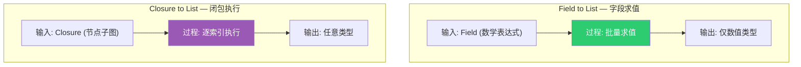
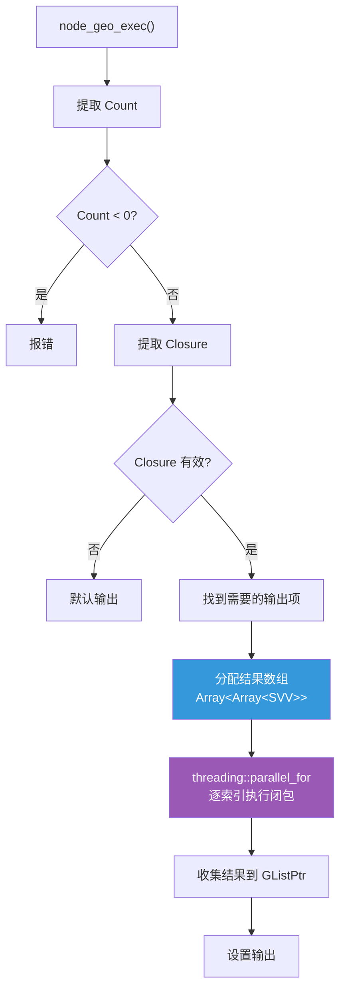
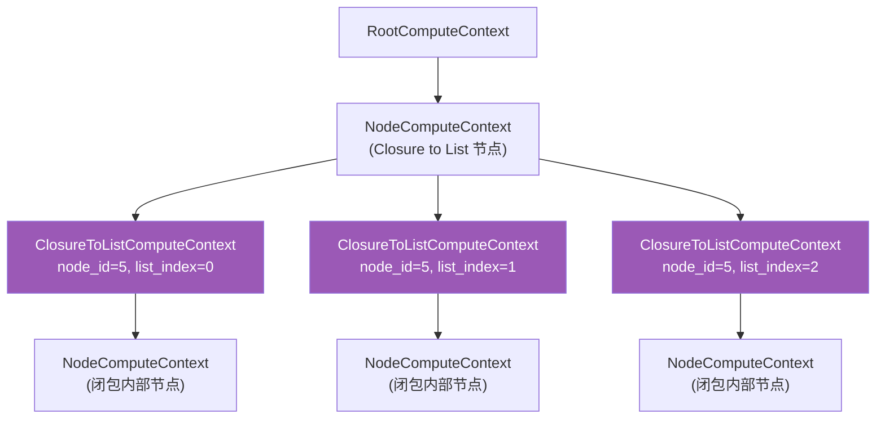
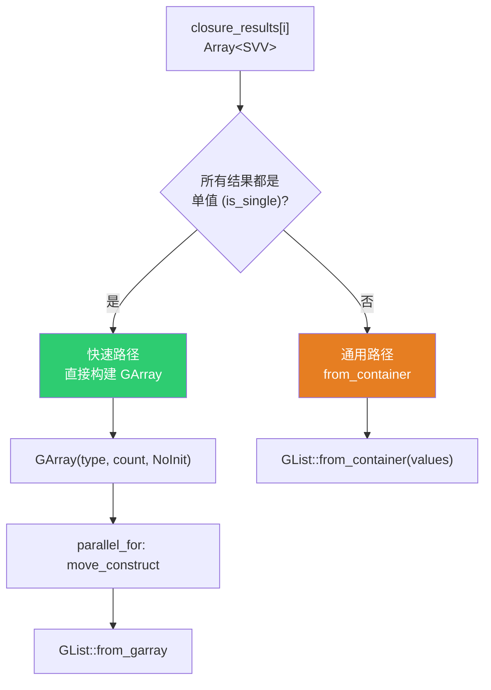
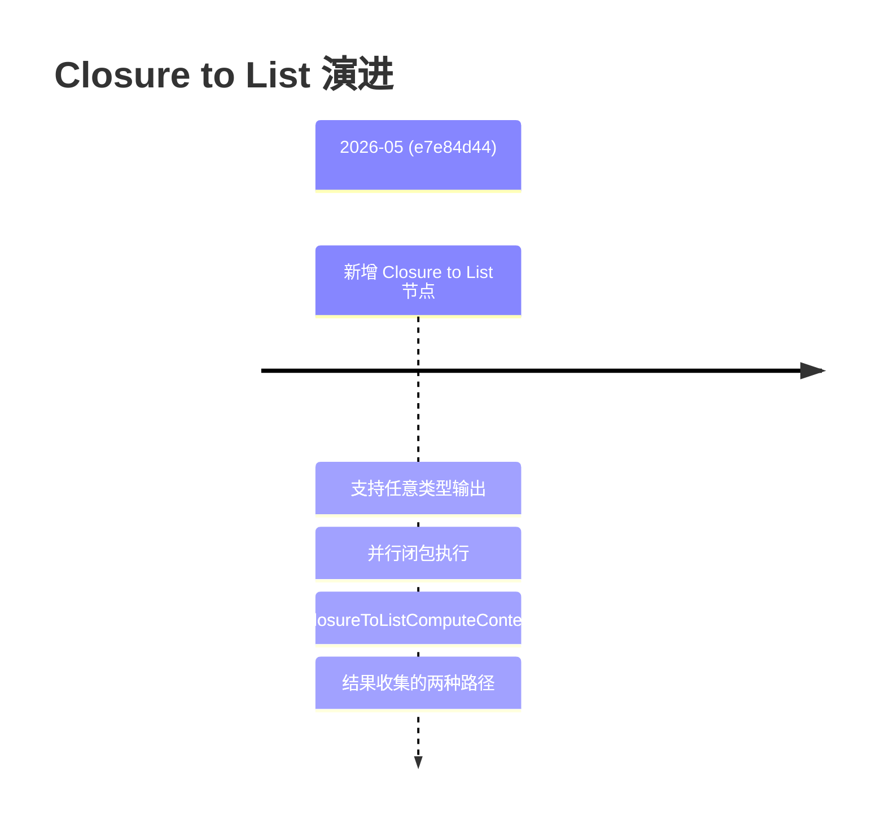

# Closure to List 节点

> 📖 系列文档：[目录](01-列表系统架构与核心数据结构.md) | [上一篇](08-FieldToList节点.md) | [下一篇](10-列表函数求值系统.md)
> 源码文件：[node_geo_closure_to_list.cc](file:///e:/blender-git/blender/source/blender/nodes/geometry/nodes/node_geo_closure_to_list.cc)
> 相关文件：[NOD_geo_closure_to_list.hh](file:///e:/blender-git/blender/source/blender/nodes/geometry/include/NOD_geo_closure_to_list.hh)、[BKE_compute_contexts.hh](file:///e:/blender-git/blender/source/blender/blenkernel/BKE_compute_contexts.hh)

---

## 目录

1. [节点概述与涉及文件](#1-节点概述与涉及文件)
2. [与 Field to List 的根本区别](#2-与-field-to-list-的根本区别)
3. [节点声明 — 闭包签名](#3-节点声明--闭包签名)
4. [核心执行逻辑](#4-核心执行逻辑)
5. [并行执行详解](#5-并行执行详解)
6. [ClosureToListComputeContext — 计算上下文](#6-closuretolistcomputecontext--计算上下文)
7. [结果收集的两种路径](#7-结果收集的两种路径)
8. [闭包签名（Closure Signature）](#8-闭包签名closure-signature)
9. [提交历史](#9-提交历史)

---

## 1. 节点概述与涉及文件

**节点 ID**：`GeometryNodeClosureToList`
**功能**：将闭包（Closure）在每个索引上执行一次，收集输出形成列表
**复杂度**：⭐⭐⭐⭐⭐（最复杂的列表节点）

Closure to List 是所有列表节点中最复杂的，因为它涉及闭包执行、并行化、计算上下文、多种输出类型等多个子系统：

```mermaid
graph TB
    C2L["Closure to List 节点"]

    subgraph "节点实现"
        CC["node_geo_closure_to_list.cc"]
    end

    subgraph "Accessor"
        HH["NOD_geo_closure_to_list.hh"]
    end

    subgraph "闭包执行"
        CE["evaluate_closure_eagerly()"]
        CS["ClosureSignature"]
    end

    subgraph "并行化"
        TP["threading::parallel_for"]
    end

    subgraph "计算上下文"
        CTX["BKE_compute_contexts.hh<br/>ClosureToListComputeContext"]
    end

    subgraph "列表核心"
        LIST["NOD_geometry_nodes_list.hh"]
    end

    subgraph "DNA"
        DNA["DNA_node_types.h<br/>GeometryNodeClosureToList(Item)"]
    end

    subgraph "BKE 集成"
        SVV["BKE_node_socket_value.hh"]
        LF["geometry_nodes_lazy_function.cc"]
    end

    C2L --> CC
    CC --> HH
    CC --> CE
    CC --> CS
    CC --> TP
    CC --> CTX
    CC --> LIST
    CC --> DNA
    CC --> SVV

    style C2L fill:#9b59b6,color:#fff
```

---

## 2. 与 Field to List 的根本区别



| 特性 | Field to List | Closure to List |
|------|---------------|-----------------|
| 输入类型 | 字段（Field） | 闭包（Closure） |
| 输出类型 | 仅字段兼容类型 | **任意类型**（Geometry、String、Grid 等） |
| 执行方式 | 批量字段求值 | 逐索引执行闭包 |
| 并行化 | FieldEvaluator 内部 | `threading::parallel_for` |
| 输入 Socket | 每项一个 Field 输入 | 共享一个 Closure 输入 |
| 输出项结构类型 | 固定为 List | 可选（Single/Field/List） |
| 计算上下文 | ListFieldContext | ClosureToListComputeContext |

---

## 3. 节点声明 — 闭包签名

```cpp
static void node_declare(NodeDeclarationBuilder &b)
{
  b.use_custom_socket_order();
  b.allow_any_socket_order();

  b.add_input<decl::Int>("Count"_ustr)
      .default_value(1)
      .min(0)  // 允许 0（Field to List 要求 >= 1）
      .description("The number of elements in the list");

  // 动态输出项（注意：没有对应的输入 Socket！）
  const bNode *node = b.node_or_null();
  if (!node) return;
  const GeometryNodeClosureToList &storage = node_storage(*node);
  const Span<GeometryNodeClosureToListItem> items(storage.items, storage.items_num);

  for (const int i : items.index_range()) {
    const GeometryNodeClosureToListItem &item = items[i];
    const UString output_identifier{ItemsAccessor::output_socket_identifier_for_item(item)};
    const UString name{item.name};
    const eNodeSocketDatatype type = item.socket_type;
    b.add_output(type, name, output_identifier)
        .structure_type(StructureType::List)
        .propagate_all()
        .references_other_outputs();
  }

  // 扩展按钮
  b.add_output<decl::Extend>(""_ustr, "__extend__"_ustr)
      .structure_type(StructureType::List)
      .custom_draw(socket_items::ui::draw_extend_socket_fn<ItemsAccessor>());

  // 闭包输入（放在最后）
  b.add_input<decl::Closure>("Closure"_ustr).create_signature([](const bNode &node) {
    return ClosureSignature::from_closure_to_list_node(node);
  });
}
```

> **`.propagate_all()`**：传播匿名属性。闭包执行可能产生新的匿名属性。

> **`.references_other_outputs()`**：标记此 Socket 引用了其他输出，影响求值顺序。

> **`.create_signature(...)`**：为闭包输入创建签名，定义期望的输入（Index）和输出（与动态项对应）。

---

## 4. 核心执行逻辑



### 结果数组分配

```cpp
Array<Array<bke::SocketValueVariant>> closure_results(required_items.size(), NoInitialization());
for (const int i : closure_results.index_range()) {
  new (&closure_results[i]) Array<bke::SocketValueVariant>(count, NoInitialization());
}
```

> **`NoInitialization{}`**：不初始化内存。因为闭包执行会覆盖每个位置，跳过初始化节省时间。

> **`placement new`**：在已分配的 `Array<Array<...>>` 内存上构造内部 `Array`。外层 `Array` 使用 `NoInitialization`，所以需要手动构造每个元素。

---

## 5. 并行执行详解

```cpp
threading::parallel_for(IndexRange(count), 8, [&](const IndexRange range) {
  ClosureEagerEvalParams closure_params;
  closure_params.inputs.resize(1);
  closure_params.inputs[0].key = "Index";
  closure_params.inputs[0].type = int_type;

  closure_params.outputs.resize(required_items.size());
  for (const int required_i : required_items.index_range()) {
    const int item_i = required_items[required_i];
    closure_params.outputs[required_i].key = items[item_i].name;
    closure_params.outputs[required_i].type = socket_types[required_i];
  }

  for (const int64_t list_i : range) {
    closure_params.inputs[0].value = bke::SocketValueVariant::From(int(list_i));

    for (const int required_i : required_items.index_range()) {
      closure_params.outputs[required_i].value = &closure_results[required_i][list_i];
    }

    const bke::ClosureToListComputeContext context(
        parent_user_data.compute_context, node.identifier, int(list_i));
    GeoNodesUserData user_data = parent_user_data;
    user_data.compute_context = &context;
    closure_params.user_data = &user_data;

    evaluate_closure_eagerly(*closure, closure_params);
  }
});
```

> **`grain_size = 8`**：每个任务至少处理 8 个索引。注释原文："The grain size is completely arbitrary since we don't know how expensive the closure is."

> **`ClosureEagerEvalParams`**：闭包急切求值参数。设置输入（Index）和输出（与动态项对应）。

> **`bke::SocketValueVariant::From(int(list_i))`**：工厂方法，从值创建 `SocketValueVariant`。

```mermaid
gantt
    title Closure to List 并行执行（Count=8, grain=2）
    dateFormat X
    axisFormat %s

    section Thread 1
    闭包[0] :t1_0, 0, 1
    闭包[1] :t1_1, 1, 2

    section Thread 2
    闭包[2] :t2_0, 0, 1
    闭包[3] :t2_1, 1, 2

    section Thread 3
    闭包[4] :t3_0, 0, 1
    闭包[5] :t3_1, 1, 2

    section Thread 4
    闭包[6] :t4_0, 0, 1
    闭包[7] :t4_1, 1, 2
```



---

## 6. ClosureToListComputeContext — 计算上下文

```cpp
class ClosureToListComputeContext : public NodeComputeContext {
 private:
  int32_t node_id_;
  int list_index_;

 public:
  ClosureToListComputeContext(const ComputeContext *parent,
                              int32_t node_id,
                              int list_index);
};
```



> **为什么需要独立的计算上下文？**
> 1. **匿名属性隔离**：每个索引的闭包执行可能产生不同的匿名属性
> 2. **日志追踪**：调试时需要知道哪个索引的执行出了问题
> 3. **递归检测**：防止闭包内部再次调用自身

---

## 7. 结果收集的两种路径



### 快速路径（所有结果都是单值）

```cpp
GArray<> array(type, count, NoInitialization());
threading::parallel_for(IndexRange(count), 128, [&](const IndexRange range) {
  for (const int list_i : range) {
    void *closure_result = const_cast<void *>(values[list_i].get_single_ptr_raw());
    type.move_construct(closure_result, array[list_i]);
  }
});
params.set_output(identifier, GList::from_garray(std::move(array)));
```

> **`move_construct`**：移动而非拷贝。对于 `GeometrySet`、`std::string` 等类型，移动比拷贝快得多。

### 通用路径（结果包含复杂类型）

```cpp
params.set_output(identifier, GList::from_container(std::move(values)));
```

> **为什么需要两种路径？** 当闭包输出的是几何体列表或字段列表时，每个 `SVV` 本身包含 `GListPtr` 或 `GField`。不能简单放入 `GArray`，因为 `GArray` 要求元素是同一 `CPPType` 的平凡布局。

---

## 8. 闭包签名（Closure Signature）

```cpp
b.add_input<decl::Closure>("Closure"_ustr).create_signature([](const bNode &node) {
  return ClosureSignature::from_closure_to_list_node(node);
});
```

签名规定了：
- **输入**：`Index`（整数类型）—— 当前列表索引
- **输出**：与节点动态项对应的 Socket（名称和类型匹配）

这使得当用户将闭包输出连接到 Closure to List 时，系统可以自动匹配输出项。

---

## 9. 提交历史


