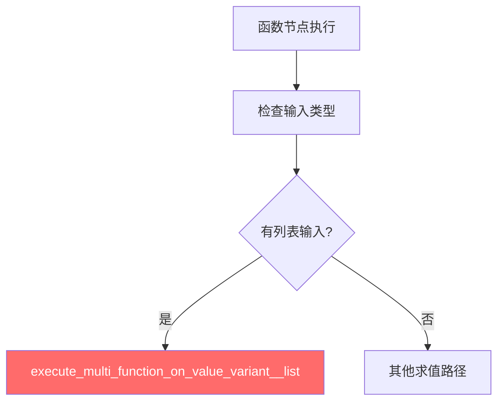
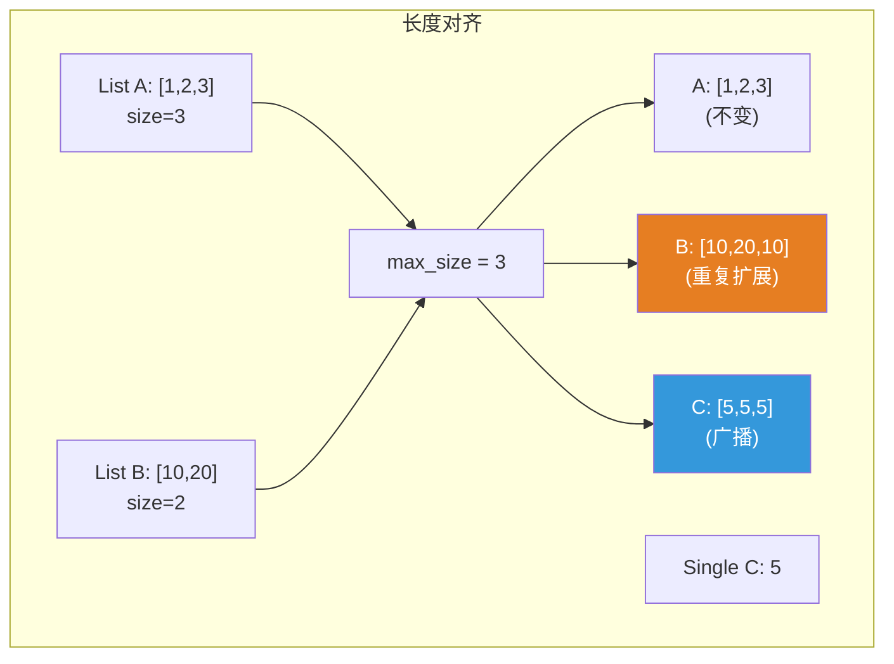
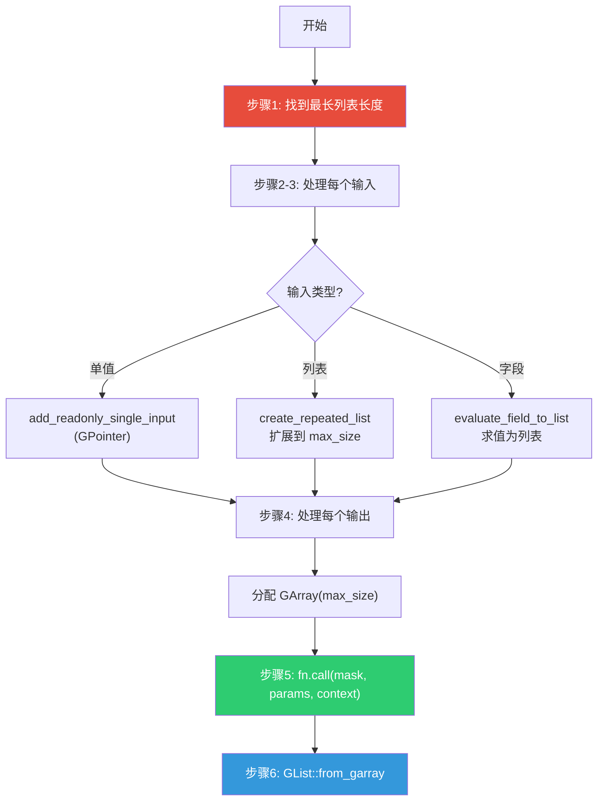
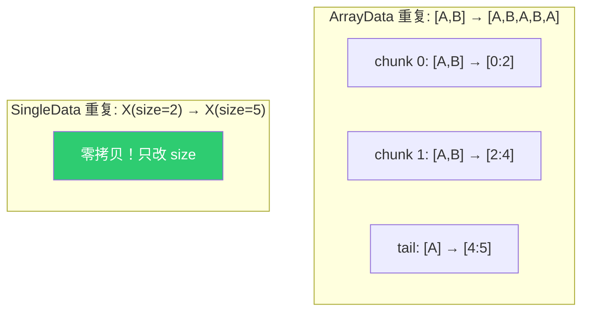
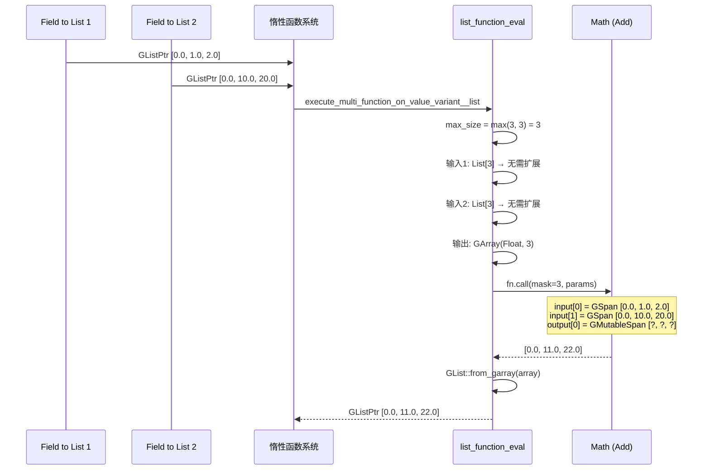
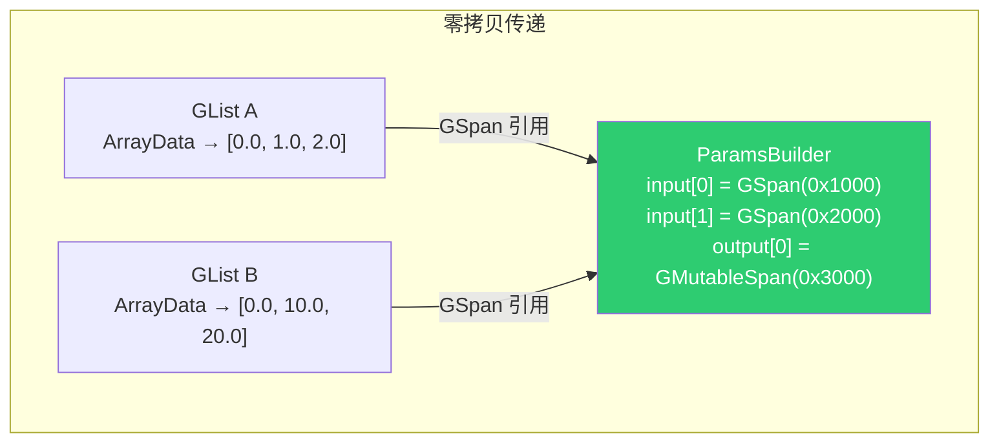

# 列表函数求值系统

> 📖 系列文档：[目录](01-列表系统架构与核心数据结构.md) | [上一篇](09-ClosureToList节点.md) | [下一篇](11-结构类型推断与列表.md)
> 源码文件：[list_function_eval.hh](../../source/blender/nodes/intern/list_function_eval.hh)、[list_function_eval.cc](../../source/blender/nodes/intern/list_function_eval.cc)

---

## 目录

1. [函数节点如何处理列表输入](#1-函数节点如何处理列表输入)
2. [核心问题：长度对齐](#2-核心问题长度对齐)
3. [execute_multi_function_on_value_variant__list — 核心执行器](#3-execute_multi_function_on_value_variant__list--核心执行器)
4. [输入处理的三种模式](#4-输入处理的三种模式)
5. [create_repeated_list — 列表重复扩展](#5-create_repeated_list--列表重复扩展)
6. [add_list_to_params — 列表到参数的映射](#6-add_list_to_params--列表到参数的映射)
7. [输出处理与 GListPtr 包装](#7-输出处理与-glistptr-包装)
8. [完整数据流追踪](#8-完整数据流追踪)

---

## 1. 函数节点如何处理列表输入

当函数节点（如 Math、Vector Math 等）接收列表输入时，需要一套特殊的求值机制。这套机制定义在 [list_function_eval.hh](../../source/blender/nodes/intern/list_function_eval.hh) 和 [list_function_eval.cc](../../source/blender/nodes/intern/list_function_eval.cc) 中。



---

## 2. 核心问题：长度对齐

当函数节点同时接收不同长度的列表时，如何处理？

**答案**：最短列表被重复扩展到最长列表的长度，然后逐元素执行函数。

```
A: [1, 2, 3]       → [1,  2,  3 ]
B: [10, 20]         → [10, 20, 10]  (重复扩展)
C: 5                → [5,  5,  5 ]  (广播)
结果: [1+10×5, 2+20×5, 3+10×5] = [51, 102, 53]
```



---

## 3. execute_multi_function_on_value_variant__list — 核心执行器

```cpp
void execute_multi_function_on_value_variant__list(
    const MultiFunction &fn,
    const Span<SocketValueVariant *> input_values,
    const Span<SocketValueVariant *> output_values,
    GeoNodesUserData *user_data)
```

### 完整执行流程



### 步骤 1：找到最长列表长度

```cpp
int64_t max_size = 0;
for (const int i : input_values.index_range()) {
  SocketValueVariant &input_variant = *input_values[i];
  if (input_variant.is_list()) {
    if (GListPtr list = input_variant.get<GListPtr>()) {
      max_size = std::max(max_size, list->size());
    }
  }
}
```

> **只检查列表输入**：单值和字段不贡献长度。如果所有输入都是单值/字段，`max_size` 为 0。

---

## 4. 输入处理的三种模式

### 单值 → 直接作为常量输入

```cpp
if (input_variant.is_single()) {
  const void *value = input_variant.get_single_ptr_raw();
  params.add_readonly_single_input(GPointer(cpp_type, value));
}
```

> **`GPointer`**：泛型指针，指向单个值。`add_readonly_single_input` 会自动将单值广播到所有索引。

### 列表 → 重复扩展

```cpp
else if (input_variant.is_list()) {
  GListPtr list_ptr = input_variant.get<GListPtr>();
  if (!list_ptr || list_ptr->size() == 0) {
    params.add_readonly_single_input(GPointer(cpp_type, cpp_type.default_value()));
    continue;
  }
  input_lists[i] = create_repeated_list(std::move(list_ptr), max_size);
  add_list_to_params(params, param_type, *input_lists[i]);
}
```

> **空列表处理**：空列表使用默认值作为常量输入。

### 字段 → 先求值为列表

```cpp
else if (input_variant.is_context_dependent_field()) {
  fn::GField field = input_variant.extract<fn::GField>();
  input_lists[i] = evaluate_field_to_list(std::move(field), max_size);
  add_list_to_params(params, param_type, *input_lists[i]);
}
```

> **`extract` vs `get`**：`extract` 转移所有权，调用后 SocketValueVariant 中的值被清空。

---

## 5. create_repeated_list — 列表重复扩展

```cpp
static GListPtr create_repeated_list(GListPtr list, const int64_t dst_size)
{
  if (list->size() >= dst_size) {
    return list;  // 已经足够长
  }

  if (const auto *data = std::get_if<nodes::GList::ArrayData>(&list->data())) {
    const int64_t size = list->size();
    const CPPType &cpp_type = list->cpp_type();

    GArray new_data(cpp_type, dst_size, NoInitialization{});

    // 整块重复拷贝
    const int64_t chunks = dst_size / size;
    for (const int64_t i : IndexRange(chunks)) {
      cpp_type.copy_construct_n(data->data, new_data[i * size], size);
    }

    // 处理尾部不完整的块
    const int64_t last_chunk_size = dst_size % size;
    if (last_chunk_size > 0) {
      cpp_type.copy_construct_n(data->data, new_data[chunks * size], last_chunk_size);
    }

    return GList::from_garray(std::move(new_data));
  }

  if (const auto *data = std::get_if<nodes::GList::SingleData>(&list->data())) {
    // SingleData → 只需调整 size（零开销！）
    return GList::create(list->cpp_type(), *data, dst_size);
  }
}
```



> **SingleData 的零开销扩展**：只需创建新 `GList`，复用 `SingleData`，只改 `size`。

---

## 6. add_list_to_params — 列表到参数的映射

```cpp
static void add_list_to_params(mf::ParamsBuilder &params,
                               const mf::ParamType &param_type,
                               const GList &list)
{
  const CPPType &cpp_type = param_type.data_type().single_type();

  if (const auto *array_data = std::get_if<nodes::GList::ArrayData>(&list.data())) {
    // ArrayData → GSpan（连续内存视图）
    params.add_readonly_single_input(GSpan(cpp_type, array_data->data, list.size()));
  }
  else if (const auto *single_data = std::get_if<nodes::GList::SingleData>(&list.data())) {
    // SingleData → GPointer（多函数框架自动广播）
    params.add_readonly_single_input(GPointer(cpp_type, single_data->value));
  }
}
```

> **SingleData 的广播**：`GPointer` 传入 `add_readonly_single_input` 时，多函数框架自动将单值广播到所有索引。比显式创建重复数组更高效。

---

## 7. 输出处理与 GListPtr 包装

```cpp
for (const int i : output_values.index_range()) {
  if (output_values[i] == nullptr) {
    params.add_ignored_single_output("");
    continue;
  }
  SocketValueVariant &output_variant = *output_values[i];
  const CPPType &cpp_type = param_type.data_type().single_type();

  GArray array(cpp_type, max_size, NoInitialization{});
  params.add_uninitialized_single_output(GMutableSpan(cpp_type, array.data(), max_size));

  output_variant.set(GList::from_garray(std::move(array)));
}

fn.call(mask, params, context);
```

> **输出数组在调用前就包装为 GListPtr**：看似奇怪，但安全。`GList::from_garray` 只创建共享引用，实际数据在 `fn.call()` 后才填充。

> **`add_uninitialized_single_output`**：告诉 MultiFunction 输出缓冲区未初始化，必须写入所有位置。

---

## 8. 完整数据流追踪

将两个浮点数列表相加的完整追踪：



### 内存布局



> **零拷贝**：从 Field to List 到 Math 节点，列表数据通过 `GSpan` 引用传递，没有拷贝。
