# 列表函数求值系统

> 📖 系列文档：[目录](01-列表系统架构与核心数据结构.md) | [上一篇](09-ClosureToList节点.md) | [下一篇](11-结构类型推断与列表.md)
> 源码文件：[list_function_eval.hh](../../source/blender/nodes/intern/list_function_eval.hh)、[list_function_eval.cc](../../source/blender/nodes/intern/list_function_eval.cc)

---

## 目录

1. [函数节点如何处理列表输入](#1-函数节点如何处理列表输入)
2. [核心问题：长度对齐](#2-核心问题长度对齐)
3. [execute_multi_function_on_value_variant__list — 核心执行器](#3-execute_multi_function_on_value_variant__list--核心执行器)
4. [输入处理的三种模式](#4-输入处理的三种模式)
5. [create_repeated_list — 列表重复扩展](#5-create_repeated_list--列表重复扩展)
6. [add_list_to_params — 列表到参数的映射](#6-add_list_to_params--列表到参数的映射)
7. [输出处理与 GListPtr 包装](#7-输出处理与-glistptr-包装)
8. [完整数据流追踪](#8-完整数据流追踪)
9. [ListFieldContext — 列表字段上下文](#9-listfieldcontext--列表字段上下文)
10. [SampleIndexFunction — 列表到字段的桥梁](#10-sampleindexfunction--列表到字段的桥梁)
11. [evaluate_field_to_list — 字段到列表的桥梁](#11-evaluate_field_to_list--字段到列表的桥梁)
12. [两个方向的完整对照](#12-两个方向的完整对照)

---

## 1. 函数节点如何处理列表输入

当函数节点（如 Math、Vector Math 等）接收列表输入时，需要一套特殊的求值机制。这套机制定义在 [list_function_eval.hh](../../source/blender/nodes/intern/list_function_eval.hh) 和 [list_function_eval.cc](../../source/blender/nodes/intern/list_function_eval.cc) 中。

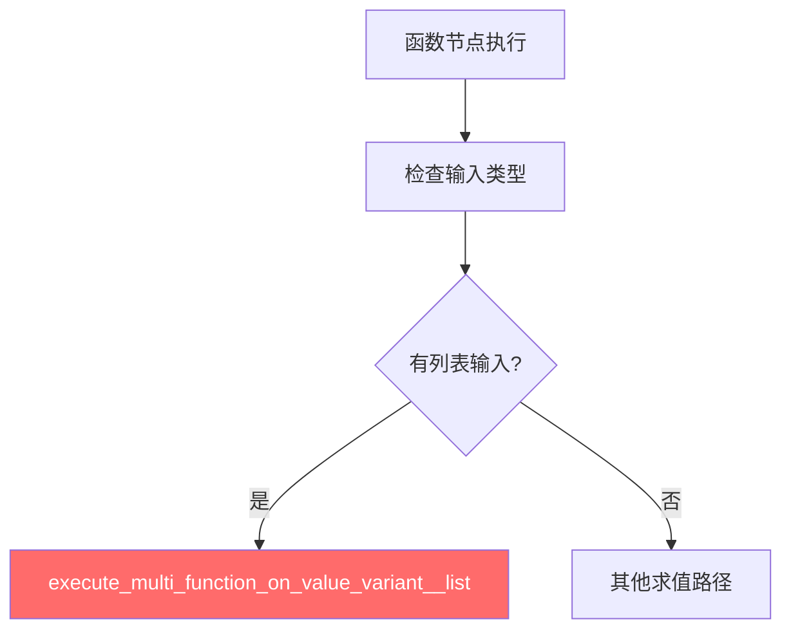

---

## 2. 核心问题：长度对齐

当函数节点同时接收不同长度的列表时，如何处理？

**答案**：最短列表被重复扩展到最长列表的长度，然后逐元素执行函数。

```
A: [1, 2, 3]       → [1,  2,  3 ]
B: [10, 20]         → [10, 20, 10]  (重复扩展)
C: 5                → [5,  5,  5 ]  (广播)
结果: [1+10×5, 2+20×5, 3+10×5] = [51, 102, 53]
```

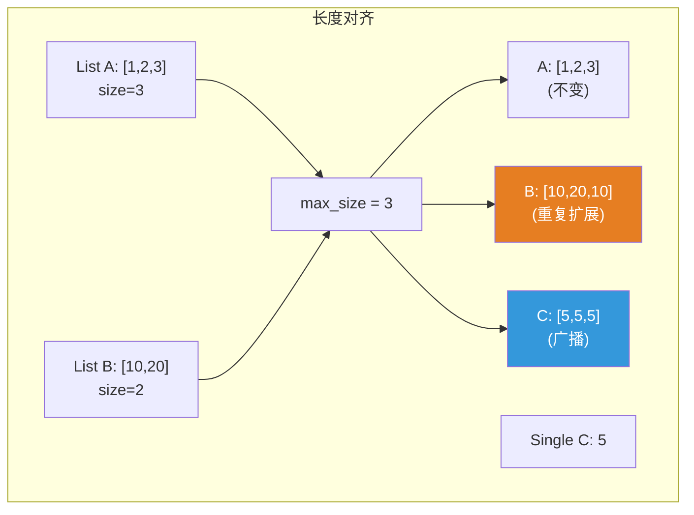

---

## 3. execute_multi_function_on_value_variant__list — 核心执行器

```cpp
void execute_multi_function_on_value_variant__list(
    const MultiFunction &fn,
    const Span<SocketValueVariant *> input_values,
    const Span<SocketValueVariant *> output_values,
    GeoNodesUserData *user_data)
```

### 完整执行流程

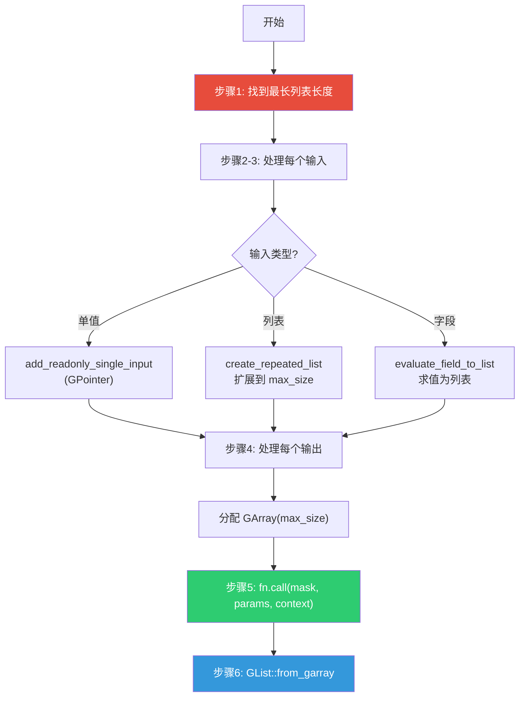

### 步骤 1：找到最长列表长度

```cpp
int64_t max_size = 0;
for (const int i : input_values.index_range()) {
  SocketValueVariant &input_variant = *input_values[i];
  if (input_variant.is_list()) {
    if (GListPtr list = input_variant.get<GListPtr>()) {
      max_size = std::max(max_size, list->size());
    }
  }
}
```

> **只检查列表输入**：单值和字段不贡献长度。如果所有输入都是单值/字段，`max_size` 为 0。

---

## 4. 输入处理的三种模式

### 单值 → 直接作为常量输入

```cpp
if (input_variant.is_single()) {
  const void *value = input_variant.get_single_ptr_raw();
  params.add_readonly_single_input(GPointer(cpp_type, value));
}
```

> **`GPointer`**：泛型指针，指向单个值。`add_readonly_single_input` 会自动将单值广播到所有索引。

### 列表 → 重复扩展

```cpp
else if (input_variant.is_list()) {
  GListPtr list_ptr = input_variant.get<GListPtr>();
  if (!list_ptr || list_ptr->size() == 0) {
    params.add_readonly_single_input(GPointer(cpp_type, cpp_type.default_value()));
    continue;
  }
  input_lists[i] = create_repeated_list(std::move(list_ptr), max_size);
  add_list_to_params(params, param_type, *input_lists[i]);
}
```

> **空列表处理**：空列表使用默认值作为常量输入。

### 字段 → 先求值为列表

```cpp
else if (input_variant.is_context_dependent_field()) {
  fn::GField field = input_variant.extract<fn::GField>();
  input_lists[i] = evaluate_field_to_list(std::move(field), max_size);
  add_list_to_params(params, param_type, *input_lists[i]);
}
```

> **`extract` vs `get`**：`extract` 转移所有权，调用后 SocketValueVariant 中的值被清空。

---

## 5. create_repeated_list — 列表重复扩展

```cpp
static GListPtr create_repeated_list(GListPtr list, const int64_t dst_size)
{
  if (list->size() >= dst_size) {
    return list;  // 已经足够长
  }

  if (const auto *data = std::get_if<nodes::GList::ArrayData>(&list->data())) {
    const int64_t size = list->size();
    const CPPType &cpp_type = list->cpp_type();

    GArray new_data(cpp_type, dst_size, NoInitialization{});

    // 整块重复拷贝
    const int64_t chunks = dst_size / size;
    for (const int64_t i : IndexRange(chunks)) {
      cpp_type.copy_construct_n(data->data, new_data[i * size], size);
    }

    // 处理尾部不完整的块
    const int64_t last_chunk_size = dst_size % size;
    if (last_chunk_size > 0) {
      cpp_type.copy_construct_n(data->data, new_data[chunks * size], last_chunk_size);
    }

    return GList::from_garray(std::move(new_data));
  }

  if (const auto *data = std::get_if<nodes::GList::SingleData>(&list->data())) {
    // SingleData → 只需调整 size（零开销！）
    return GList::create(list->cpp_type(), *data, dst_size);
  }
}
```

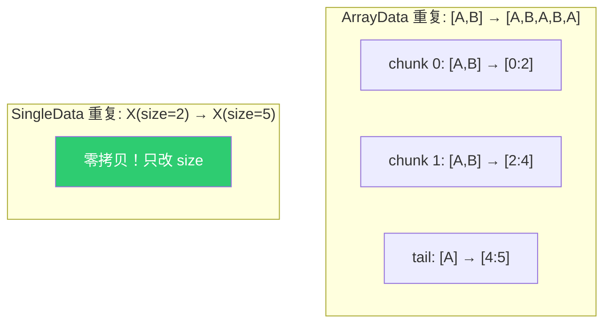

> **SingleData 的零开销扩展**：只需创建新 `GList`，复用 `SingleData`，只改 `size`。

---

## 6. add_list_to_params — 列表到参数的映射

```cpp
static void add_list_to_params(mf::ParamsBuilder &params,
                               const mf::ParamType &param_type,
                               const GList &list)
{
  const CPPType &cpp_type = param_type.data_type().single_type();

  if (const auto *array_data = std::get_if<nodes::GList::ArrayData>(&list.data())) {
    // ArrayData → GSpan（连续内存视图）
    params.add_readonly_single_input(GSpan(cpp_type, array_data->data, list.size()));
  }
  else if (const auto *single_data = std::get_if<nodes::GList::SingleData>(&list.data())) {
    // SingleData → GPointer（多函数框架自动广播）
    params.add_readonly_single_input(GPointer(cpp_type, single_data->value));
  }
}
```

> **SingleData 的广播**：`GPointer` 传入 `add_readonly_single_input` 时，多函数框架自动将单值广播到所有索引。比显式创建重复数组更高效。

---

## 7. 输出处理与 GListPtr 包装

```cpp
for (const int i : output_values.index_range()) {
  if (output_values[i] == nullptr) {
    params.add_ignored_single_output("");
    continue;
  }
  SocketValueVariant &output_variant = *output_values[i];
  const CPPType &cpp_type = param_type.data_type().single_type();

  GArray array(cpp_type, max_size, NoInitialization{});
  params.add_uninitialized_single_output(GMutableSpan(cpp_type, array.data(), max_size));

  output_variant.set(GList::from_garray(std::move(array)));
}

fn.call(mask, params, context);
```

> **输出数组在调用前就包装为 GListPtr**：看似奇怪，但安全。`GList::from_garray` 只创建共享引用，实际数据在 `fn.call()` 后才填充。

> **`add_uninitialized_single_output`**：告诉 MultiFunction 输出缓冲区未初始化，必须写入所有位置。

---

## 8. 完整数据流追踪

将两个浮点数列表相加的完整追踪：

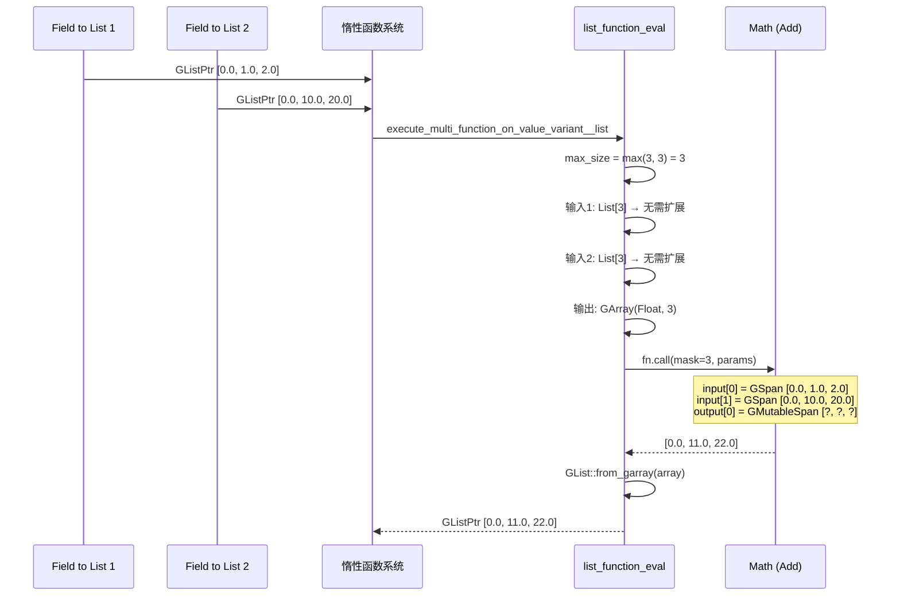

### 内存布局

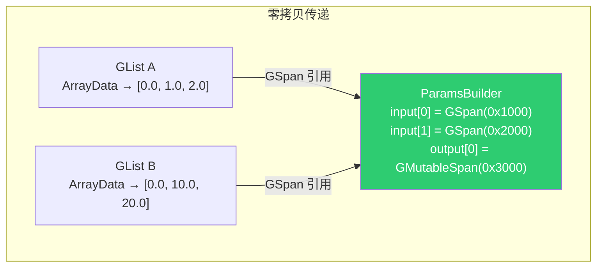

> **零拷贝**：从 Field to List 到 Math 节点，列表数据通过 `GSpan` 引用传递，没有拷贝。

---

## 9. ListFieldContext — 列表字段上下文

### 9.1 为什么需要 ListFieldContext？

`FieldEvaluator` 在求值字段时需要一个 `FieldContext`——它告诉求值器"你在什么环境下求值"。几何节点中常用的 `GeoNodesFieldContext` 从几何体属性读取数据，但列表没有几何体、没有域，只有大小。

`ListFieldContext` 就是列表环境下的字段上下文——它只支持 `IndexFieldInput`（索引字段），因为列表环境中唯一有意义的"属性"就是索引本身。

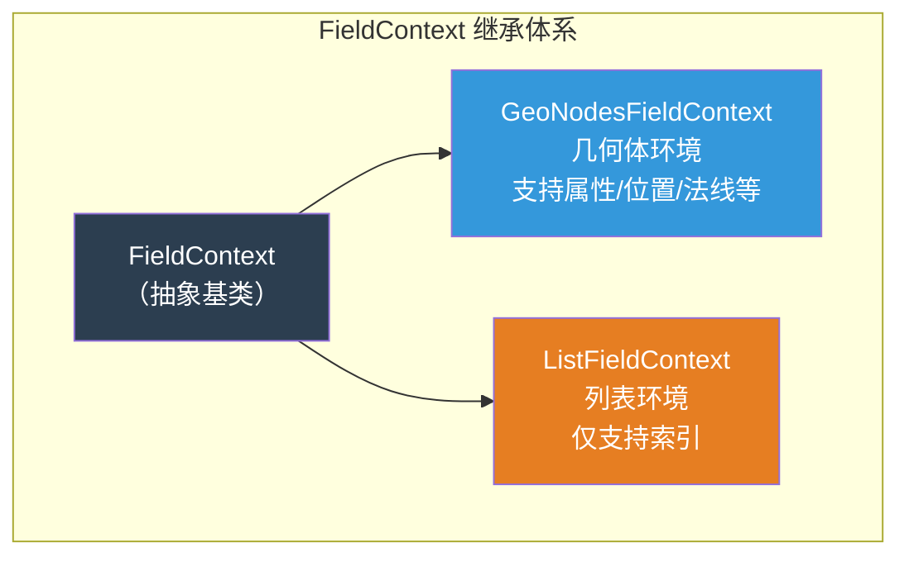

### 9.2 类定义与实现

```cpp
// list_function_eval.hh
class ListFieldContext : public FieldContext {
 public:
  ListFieldContext() = default;

  GVArray get_varray_for_input(const FieldInput &field_input,
                               const IndexMask &mask,
                               ResourceScope & /*scope*/) const override;
};
```

```cpp
// list_function_eval.cc
GVArray ListFieldContext::get_varray_for_input(const FieldInput &field_input,
                                               const IndexMask &mask,
                                               ResourceScope & /*scope*/) const
{
  const auto *id_field_input = dynamic_cast<const bke::IDAttributeFieldInput *>(&field_input);
  const auto *index_field_input = dynamic_cast<const fn::IndexFieldInput *>(&field_input);

  if (id_field_input == nullptr && index_field_input == nullptr) {
    return {};  // 不支持的字段输入 → 返回空
  }

  return fn::IndexFieldInput::get_index_varray(mask);
}
```

> **注释翻译**：
> - `get_varray_for_input` — 当字段求值器需要获取某个字段输入的值时调用此方法
> - `id_field_input` — ID 属性字段输入（如 `id` 属性），在列表环境中退化为索引
> - `index_field_input` — 索引字段输入，每个位置返回自己的索引值
> - 返回空 `GVArray` 表示"我不认识这个字段输入"，求值器会使用默认值

### 9.3 工作原理

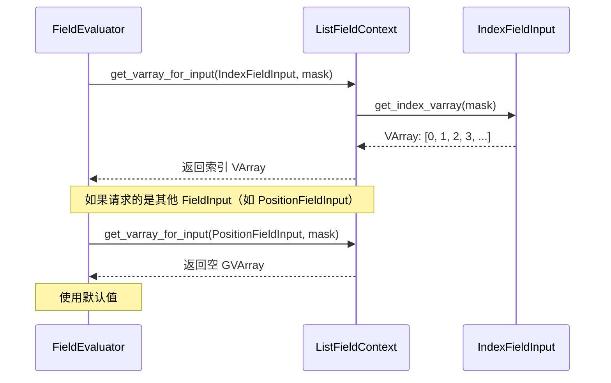

### 9.4 使用场景

`ListFieldContext` 在两个地方被使用：

| 场景 | 使用者 | 说明 |
|------|--------|------|
| Sort List 节点 | `get_varray_or_evaluate` | 求值 Group ID / Sort Weight 字段 |
| Sort List 节点 | `SampleIndexFunction` 包装 | 将 Selection 列表转为字段 |
| `evaluate_field_to_list` | 字段→列表转换 | 将字段求值为列表 |

> **关键**：在列表环境中，字段只能访问索引值。如果用户连接了一个依赖几何体属性的字段（如 `position.x`），`ListFieldContext` 无法提供数据，求值器会使用默认值。

---

## 10. SampleIndexFunction — 列表到字段的桥梁

### 10.1 核心问题

Blender 的字段系统（`Field<T>`）和多函数系统（`MultiFunction`）是为几何体属性设计的。字段求值时，每个位置返回一个值——例如 `position.x` 在第 i 个顶点返回第 i 个顶点的 x 坐标。

但列表不是字段。列表是一个有序的数据集合，没有"字段接口"——你不能直接把列表传给 `FieldEvaluator::set_selection()` 或 `FieldEvaluator::add()`。

**问题**：Sort List 节点的 Selection 输入可以是列表（`[true, false, true, true]`），但 `FieldEvaluator::set_selection` 只接受 `Field<bool>`。如何把列表适配为字段？

**答案**：`SampleIndexFunction`——一个 `MultiFunction` 子类，行为是"给定索引 i，返回列表中第 i 个元素"。

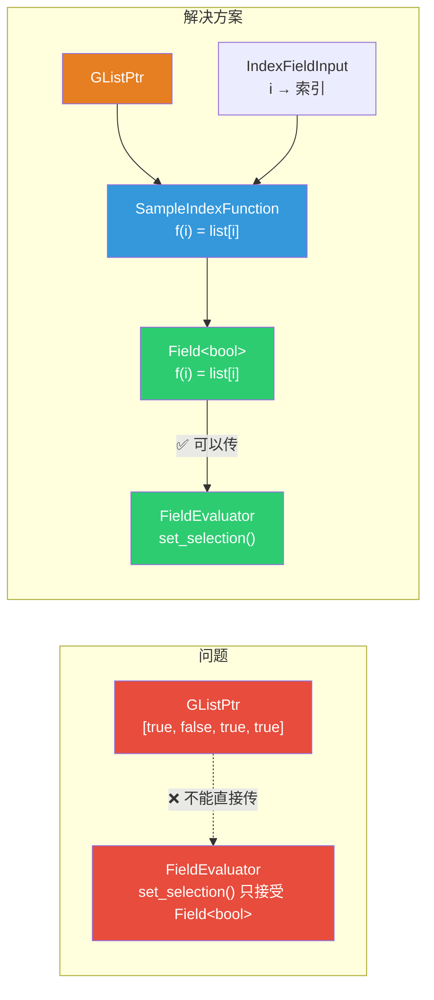

### 10.2 类定义

```cpp
// list_function_eval.hh
class SampleIndexFunction : public mf::MultiFunction {
  GListPtr list_;           // 持有列表的共享指针
  mf::Signature signature_; // 多函数签名

 public:
  SampleIndexFunction(GListPtr list);

  void call(const IndexMask &mask, mf::Params params, mf::Context /*context*/) const override;
  void hash_unique(UniqueHashBytes &hash) const override;
};
```

> **设计要点**：
> - **持有 `GListPtr`**：`GListPtr` 是共享指针（`ImplicitSharingPtr<GList>`），`SampleIndexFunction` 通过引用计数共享列表数据，不拷贝
> - **继承 `MultiFunction`**：可以包装为 `FieldOperation`，进而创建 `Field<T>`
> - **`signature_`**：多函数签名——声明输入参数（Index）和输出参数（Value）

### 10.3 构造函数

```cpp
SampleIndexFunction::SampleIndexFunction(GListPtr list) : list_(std::move(list))
{
  mf::SignatureBuilder builder{"Sample Index", signature_};
  builder.single_input<int>("Index");                    // 输入：索引（int 类型）
  builder.single_output("Value", list_->cpp_type());     // 输出：列表元素类型
  this->set_signature(&signature_);
}
```

> **注释翻译**：
> - `"Sample Index"` — 多函数的名称，用于调试和日志
> - `single_input<int>("Index")` — 声明一个 `int` 类型的单值输入，名为 "Index"
> - `single_output("Value", list_->cpp_type())` — 声明输出，类型由列表的元素类型决定（运行时通过 `CPPType` 指定，而非编译期模板参数）

### 10.4 call 方法详解

```cpp
void SampleIndexFunction::call(const IndexMask &mask,
                               mf::Params params,
                               mf::Context /*context*/) const
{
  // 步骤1：读取输入索引
  const VArraySpan<int> indices = params.readonly_single_input<int>(0, "Index");

  // 步骤2：获取输出缓冲区（未初始化）
  GMutableSpan dst = params.uninitialized_single_output(1, "Value");

  // 步骤3：过滤有效索引（在列表范围内）
  IndexMaskMemory memory;
  const IndexMask valid_indices = array_utils::indices_in_range(
      mask, indices, IndexRange(list_->size()), memory);

  // 步骤4：对无效索引填充默认值
  if (valid_indices.size() != mask.size()) {
    const IndexMask invalid_indices = valid_indices.complement(mask, memory);
    list_->cpp_type().fill_construct_indices(
        list_->cpp_type().default_value(), dst.data(), invalid_indices);
  }

  // 步骤5：根据列表数据类型读取值
  const GList::DataVariant &data = list_->data();
  if (const auto *array_data = std::get_if<nodes::GList::ArrayData>(&data)) {
    // ArrayData：从连续数组中按索引取值
    const GSpan src(list_->cpp_type(), array_data->data, list_->size());
    valid_indices.foreach_index(
        [&](const int i) { list_->cpp_type().copy_construct(src[indices[i]], dst[i]); });
  }
  else if (const auto *single_data = std::get_if<nodes::GList::SingleData>(&data)) {
    // SingleData：所有位置都是同一个值
    list_->cpp_type().fill_construct_indices(single_data->value, dst.data(), valid_indices);
  }
}
```

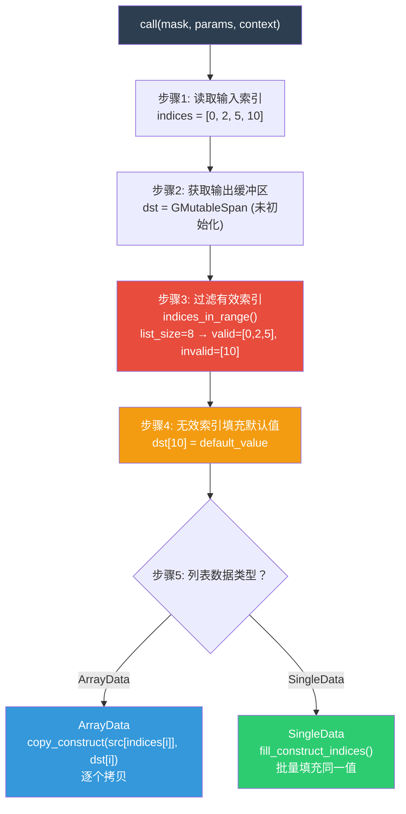

### 10.5 关键语法解释

**`VArraySpan<int> indices`**：

`VArraySpan` 是 `VArray` 的视图——如果底层是 `Span`（连续内存），直接引用（零拷贝）；否则物化为临时数组。这里索引输入可能来自字段求值结果（如 `IndexFieldInput`），`VArraySpan` 自动处理两种情况。

> **为什么不用 `VArray<int>`？** `VArraySpan` 提供了 `operator[]` 的直接访问，比 `VArray::operator[]` 的虚函数调用更快。当底层是 Span 时，`VArraySpan` 的 `operator[]` 是直接的数组索引。

**`params.uninitialized_single_output(1, "Value")`**：

返回未初始化的输出缓冲区。`1` 是参数索引（第二个参数，0 是 Index），`"Value"` 是参数名。**未初始化**意味着 `call` 方法必须写入所有 `mask` 覆盖的位置——否则输出中可能包含垃圾值。

**`array_utils::indices_in_range(mask, indices, range, memory)`**：

检查 `indices` 中哪些值在 `range`（`[0, list_size)`）范围内，返回有效的 `IndexMask`。

```
mask     = [0, 1, 2, 3]       （求值位置）
indices  = [0, 2, 5, 10]      （索引值）
range    = [0, 8)              （列表范围）
valid    = [0, 1, 2]           （位置 0,1,2 的索引在范围内）
invalid  = [3]                 （位置 3 的索引 10 越界）
```

**`fill_construct_indices(default_value, dst, invalid_indices)`**：

在 `dst` 的 `invalid_indices` 位置用默认值构造对象。越界索引返回类型默认值（如 `float` 返回 `0.0f`，`bool` 返回 `false`）。

> **为什么用 `fill_construct_indices` 而不是 `fill_indices`？** 因为 `dst` 是未初始化的缓冲区，必须用"构造"（placement new）而非"赋值"（operator=）。对非 trivial 类型（如 `std::string`），赋值到未初始化的内存是未定义行为。

**`copy_construct(src[indices[i]], dst[i])`**：

在 `dst[i]` 位置用 `src[indices[i]]` 的值构造对象。这是 `CPPType` 的泛型拷贝构造——对 trivial 类型用 `memcpy`，对非 trivial 类型调用拷贝构造函数。

### 10.6 hash_unique 方法

```cpp
void SampleIndexFunction::hash_unique(UniqueHashBytes &hash) const
{
  static constexpr int8_t id = 0;
  hash.add(&id);
  hash.add(list_.get());  // 用列表指针作为哈希的一部分
}
```

> **`hash_unique` 的作用**：字段去重。如果两个 `SampleIndexFunction` 持有**相同的列表指针**，它们的哈希相同，字段系统可以合并它们，避免重复计算。
>
> **`list_.get()`**：返回底层 `GList*` 指针。因为 `GListPtr` 是共享指针，如果两个 `SampleIndexFunction` 从同一个列表创建，它们持有相同的 `GList*`。
>
> **`static constexpr int8_t id = 0`**：类型标识符。如果将来有多个 `MultiFunction` 子类使用 `GList*` 作为哈希的一部分，可以用不同的 `id` 区分。

### 10.7 两个使用场景

#### 场景 1：Sort List 节点 — 列表→字段适配

Sort List 的 Selection 输入可以是列表，但 `FieldEvaluator::set_selection` 只接受 `Field<bool>`：

```cpp
// node_geo_sort_list.cc
if (selection_variant.is_list()) {
  auto fn = fn::FieldOperation::from(
      std::make_shared<SampleIndexFunction>(selection_variant.extract<GListPtr>()),
      {fn::IndexFieldInput::get_field()});
  field_evaluator.set_selection(fn::Field<bool>(std::move(fn)));
}
```

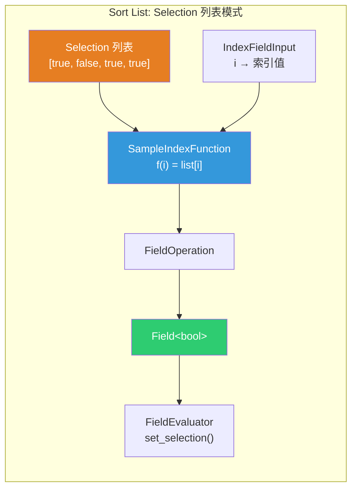

> **`fn::FieldOperation::from(multi_function, inputs)`**：创建一个字段操作节点。参数：
> 1. **多函数**：`SampleIndexFunction` — "给定索引，返回列表元素"
> 2. **输入字段列表**：`{fn::IndexFieldInput::get_field()}` — 索引字段
>
> 组合起来：`Field<bool> f(i) = SampleIndexFunction(list, IndexFieldInput(i)) = list[i]`

#### 场景 2：Get List Item 节点 — 按索引取值

Get List Item 节点在索引是字段时，使用 `SampleIndexFunction` 从列表中按索引取值：

```cpp
// node_geo_list_get_item.cc
if (!execute_multi_function_on_value_variant(
        std::make_shared<SampleIndexFunction>(std::move(list)),
        {&index},
        {&output_value},
        params.user_data(),
        error_message))
{
  params.set_default_remaining_outputs();
  params.error_message_add(NodeWarningType::Error, std::move(error_message));
  return;
}
```

> **注意**：这里使用的是 `execute_multi_function_on_value_variant`（不带 `__list` 后缀），不是 `execute_multi_function_on_value_variant__list`。两者的区别：
>
> | 函数 | 输入/输出 | 说明 |
> |------|----------|------|
> | `execute_multi_function_on_value_variant` | `SocketValueVariant` | 处理 Single/Field 模式，输出 Single 或 Field |
> | `execute_multi_function_on_value_variant__list` | `SocketValueVariant` | 处理 Single/Field/List 模式，输出 List |
>
> Get List Item 的输出是**单值**（取出一个元素），所以用前者；Sort List 的 Selection 需要适配为字段，也用前者。

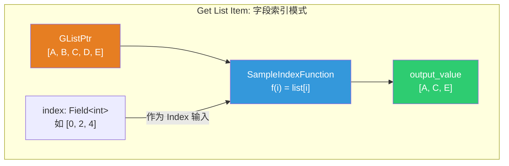

### 10.8 与 bke::SampleIndexFunction 的区别

代码库中存在**两个同名但不同**的 `SampleIndexFunction` 类：

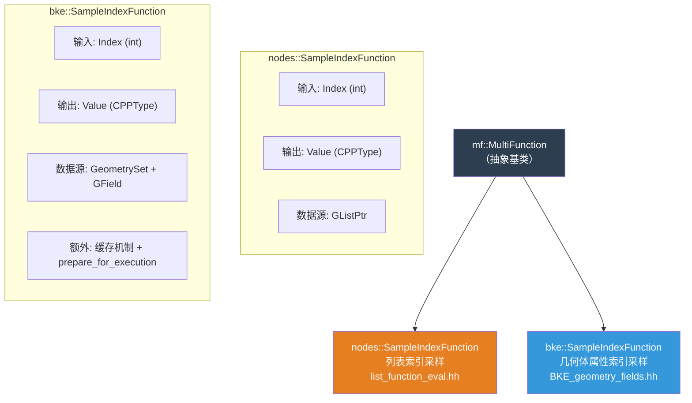

| 特性 | `nodes::SampleIndexFunction` | `bke::SampleIndexFunction` |
|------|------------------------------|----------------------------|
| 命名空间 | `blender::nodes` | `blender::bke` |
| 数据源 | `GListPtr`（列表） | `GeometrySet` + `GField`（几何体属性） |
| 输入 | Index (int) | Index (int) |
| 输出 | Value (CPPType) | Value (CPPType) |
| 缓存 | 无 | 有（`prepare_for_execution`） |
| 使用者 | Sort List, Get List Item | Sample Index, Raycast |
| 越界处理 | 填充默认值 | 填充默认值 |

> **为什么同名？** 两者功能相同——"给定索引，返回数据源中对应位置的值"——只是数据源不同。`nodes` 版本操作列表，`bke` 版本操作几何体属性。

---

## 11. evaluate_field_to_list — 字段到列表的桥梁

### 11.1 函数签名

```cpp
GListPtr evaluate_field_to_list(GField field, const int64_t count)
```

> **功能**：将字段求值为列表。给定一个字段和元素数量，求值后返回包含 `count` 个元素的 `GListPtr`。

### 11.2 实现

```cpp
GListPtr evaluate_field_to_list(GField field, const int64_t count)
{
  const CPPType &cpp_type = field.cpp_type();
  GArray array(cpp_type, count);  // 分配 count 大小的数组

  ListFieldContext context{};                  // 列表字段上下文
  fn::FieldEvaluator evaluator{context, count};
  evaluator.add_with_destination(std::move(field), array);  // 求值结果直接写入 array
  evaluator.evaluate();

  return GList::from_garray(std::move(array));  // 数组 → 列表
}
```

> **`add_with_destination`**：指定求值结果的写入目标。比 `add(field, &varray)` 更高效——后者先求值为 `VArray`，再物化到数组；前者直接写入目标数组，省去中间步骤。

### 11.3 数据流

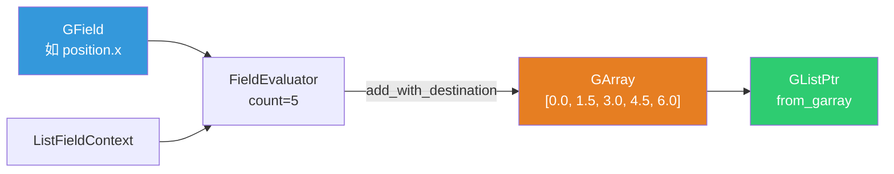

### 11.4 使用场景

`evaluate_field_to_list` 在 `execute_multi_function_on_value_variant__list` 中使用——当函数节点的输入是字段时，先求值为列表，再参与计算：

```cpp
else if (input_variant.is_context_dependent_field()) {
  fn::GField field = input_variant.extract<fn::GField>();
  input_lists[i] = evaluate_field_to_list(std::move(field), max_size);
  add_list_to_params(params, param_type, *input_lists[i]);
}
```

---

## 12. 两个方向的完整对照

列表系统中有两个方向的转换：

| 方向 | 函数 | 说明 |
|------|------|------|
| **列表 → 字段** | `SampleIndexFunction` | 把列表包装为字段，`f(i) = list[i]` |
| **字段 → 列表** | `evaluate_field_to_list` | 把字段求值为列表，`list[i] = field(i)` |

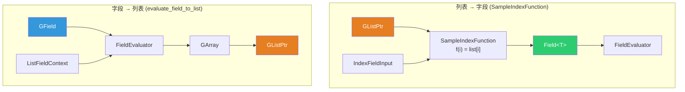

### 12.1 为什么需要两个方向？

因为 Sort List 节点的控制输入（Selection / Group ID / Sort Weight）可以是三种类型：

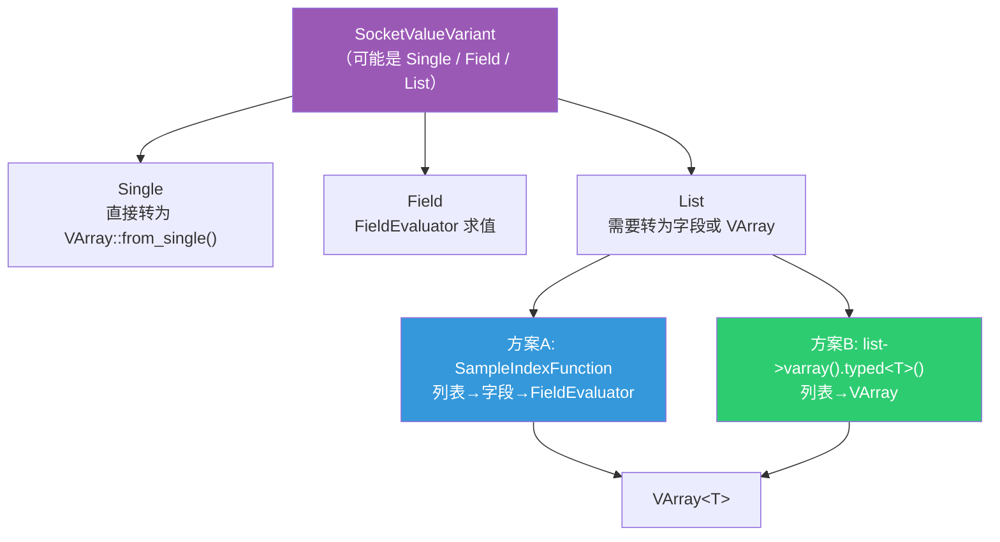

- **Selection** 使用**方案A**（`SampleIndexFunction`），因为 `set_selection` 只接受 `Field<bool>`
- **Group ID / Sort Weight** 使用**方案B**（`list->varray().typed<T>()`），因为 `get_varray_or_evaluate` 直接返回 `VArray<T>`

### 12.2 list_function_eval.hh 完整 API 一览

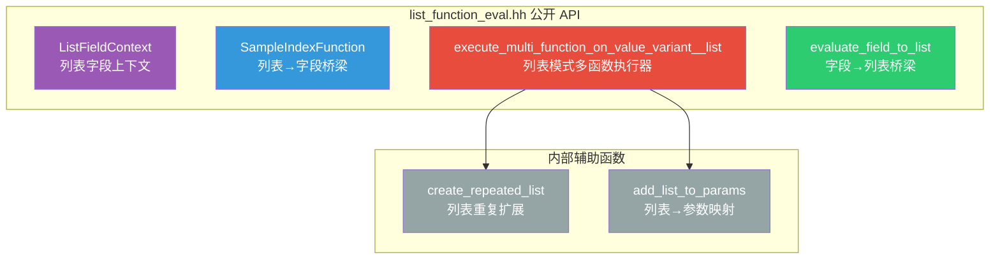

| API | 类型 | 输入 | 输出 | 使用者 |
|-----|------|------|------|--------|
| `ListFieldContext` | 类 | — | `FieldContext` | Sort List, evaluate_field_to_list |
| `SampleIndexFunction` | 类 | `GListPtr` | `MultiFunction` | Sort List, Get List Item |
| `execute_multi_function_on_value_variant__list` | 函数 | `MultiFunction` + `SocketValueVariant[]` | `SocketValueVariant[]` | 函数节点列表模式 |
| `evaluate_field_to_list` | 函数 | `GField` + `count` | `GListPtr` | execute_multi_function_on_value_variant__list |

---

> 📖 系列文档：[目录](01-列表系统架构与核心数据结构.md) | [上一篇](09-ClosureToList节点.md) | [下一篇](11-结构类型推断与列表.md)
