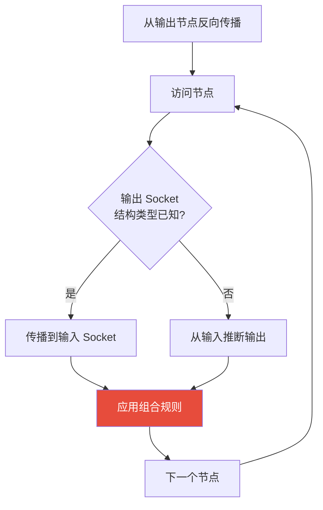
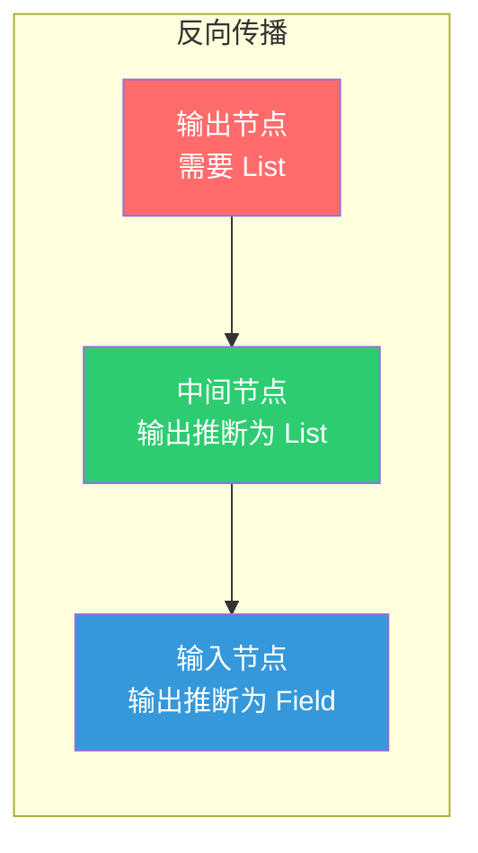
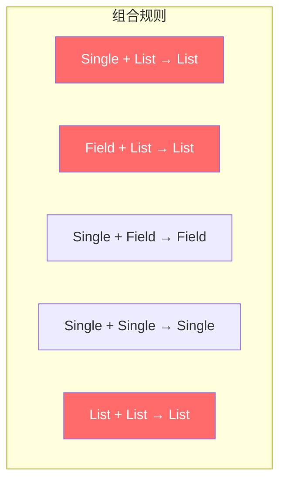
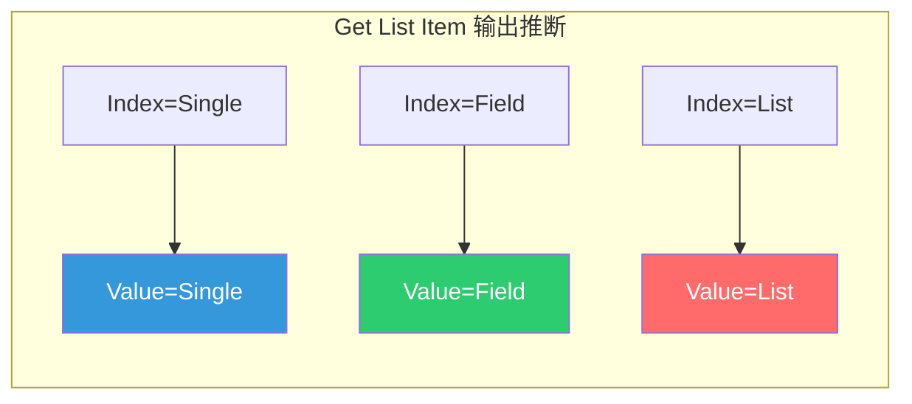
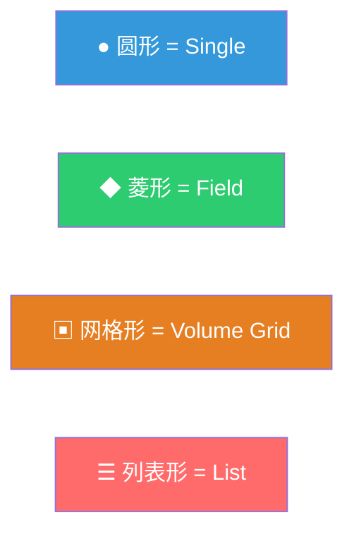

# 结构类型推断与列表

> 📖 系列文档：[目录](01-列表系统架构与核心数据结构.md) | [上一篇](10-列表函数求值系统.md) | [下一篇](12-列表节点对比与设计总结.md)
> 源码文件：[node_tree_structure_type_inferencing.cc](file:///e:/blender-git/blender/source/blender/blenkernel/intern/node_tree_structure_type_inferencing.cc)、[DNA_node_tree_interface_types.h](file:///e:/blender-git/blender/source/blender/makesdna/DNA_node_tree_interface_types.h)

---

## 目录

1. [结构类型推断系统概述](#1-结构类型推断系统概述)
2. [StructureType 枚举定义](#2-structuretype-枚举定义)
3. [推断算法](#3-推断算法)
4. [列表相关的组合规则](#4-列表相关的组合规则)
5. [列表节点的推断行为](#5-列表节点的推断行为)
6. [Socket 显示形状与推断](#6-socket-显示形状与推断)
7. [推断与节点可见性](#7-推断与节点可见性)

---

## 1. 结构类型推断系统概述

结构类型推断系统负责自动推断每个 Socket 的结构类型（Single/Field/List/Grid），使得用户不需要手动指定每个 Socket 的类型。



---

## 2. StructureType 枚举定义

```cpp
// DNA 层面（用于 .blend 文件序列化）
enum class NodeSocketInterfaceStructureType : int8_t {
  Auto = 0,    // 自动推断
  Single = 1,  // 单值
  Dynamic = 2, // 动态（可以是单值、字段或列表）
  Field = 3,   // 字段
  Grid = 4,    // 体积网格
  List = 5,    // 列表
};

// C++ 运行时
namespace nodes {
enum class StructureType : int8_t {
  Single = 1, Dynamic = 2, Field = 3, Grid = 4, List = 5,
};
}
```

> **`Auto` 只在 DNA 层面**：运行时不使用 `Auto`，推断系统会将 `Auto` 解析为具体的结构类型。

> **`Dynamic` 的含义**：Socket 可以接受多种结构类型。例如 Get List Item 的 Index 输入可以是单值、字段或列表。

---

## 3. 推断算法

推断算法基于**反向传播**：从下游节点的需求反向传播到上游节点。



### DataRequirement — 数据需求

当某个 Socket 需要特定结构类型的数据时，推断系统会设置 `DataRequirement`，然后将其转换为 `StructureType` 传播到上游。

---

## 4. 列表相关的组合规则



| 输入 A | 输入 B | 结果 | 说明 |
|--------|--------|------|------|
| Single | List | **List** | 单值自动提升为列表 |
| Field | List | **List** | 字段与列表组合为列表 |
| Single | Field | **Field** | 单值自动提升为字段 |
| List | List | **List** | 列表与列表组合为列表 |

> **提升链**：Single → Field → List。较低级别的结构类型自动提升为较高级别。

---

## 5. 列表节点的推断行为

| 节点 | 输入需求 | 输出推断 |
|------|---------|---------|
| Field to List | Field 输入需要 Field | 输出固定为 List |
| Closure to List | Closure 输入需要 Closure | 输出固定为 List |
| Get List Item | List 输入需要 List | 输出取决于 Index 的结构类型 |
| List Length | List 输入需要 List | 输出固定为 Single |
| Filter List | List 输入需要 List | 输出固定为 List |
| Join List | Dynamic 输入接受任意 | 输出固定为 List |

### Get List Item 的动态推断



当用户选择 "Auto" 时，推断系统根据 Index 输入的实际类型自动决定输出结构类型。用户也可以手动指定为 Single/Field/List。

---

## 6. Socket 显示形状与推断



推断系统不仅决定数据流，还影响 Socket 的视觉显示形状。当推断结果改变时，Socket 形状会自动更新。

---

## 7. 推断与节点可见性

某些节点会根据推断结果隐藏/显示 Socket。例如 `ignore_inferred_input_socket_visibility` 属性控制是否忽略推断驱动的 Socket 可见性。

```cpp
ntype.ignore_inferred_input_socket_visibility = true;  // Field to List
```

> **Field to List 为什么忽略推断可见性？** 它的 Field 输入 Socket 应该始终可见，不应被推断规则隐藏（即使推断系统认为输入应该是 Single）。
