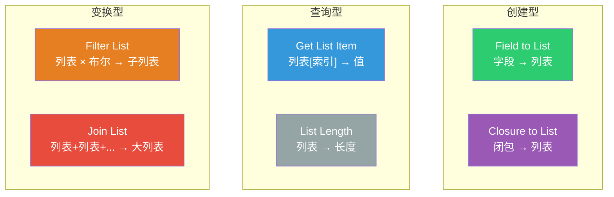
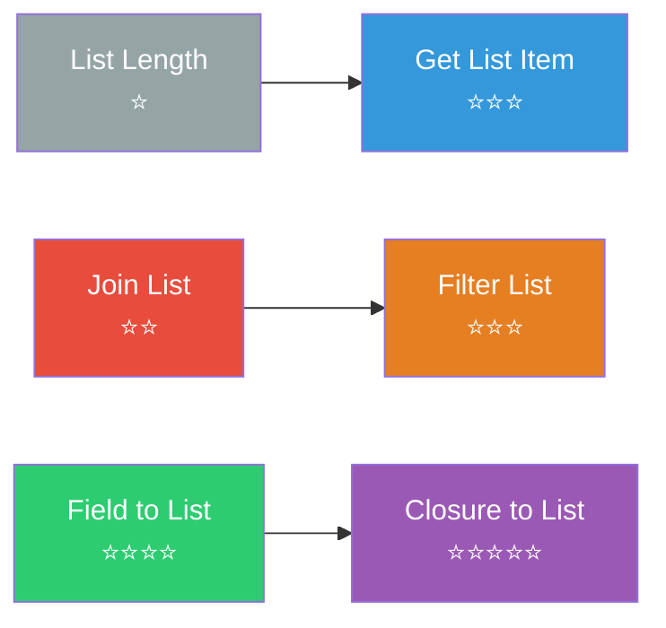
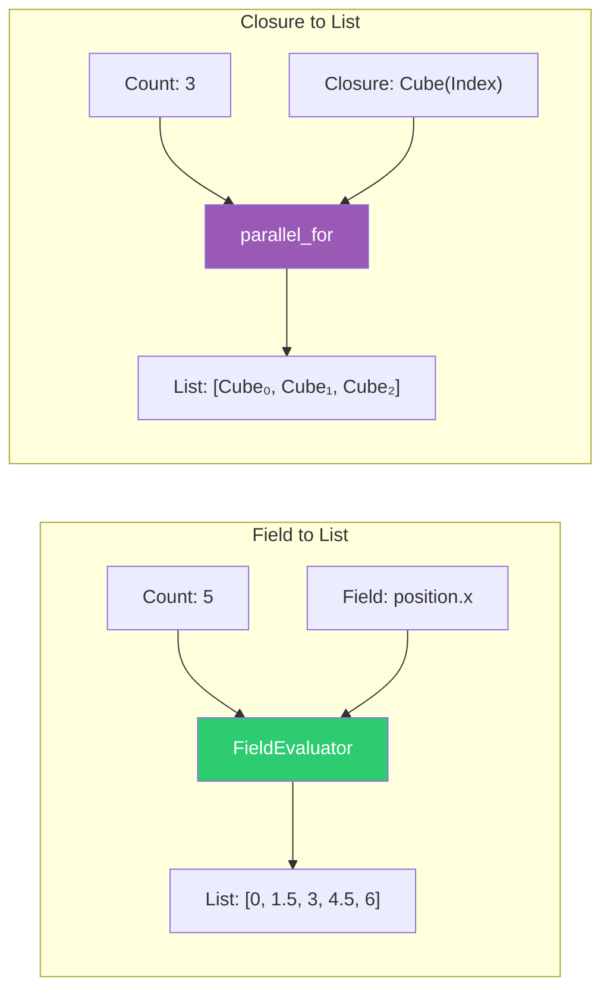
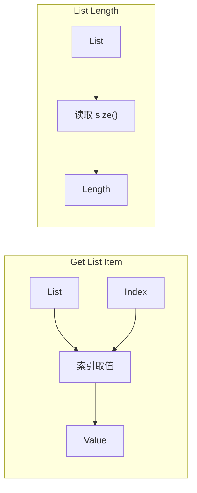
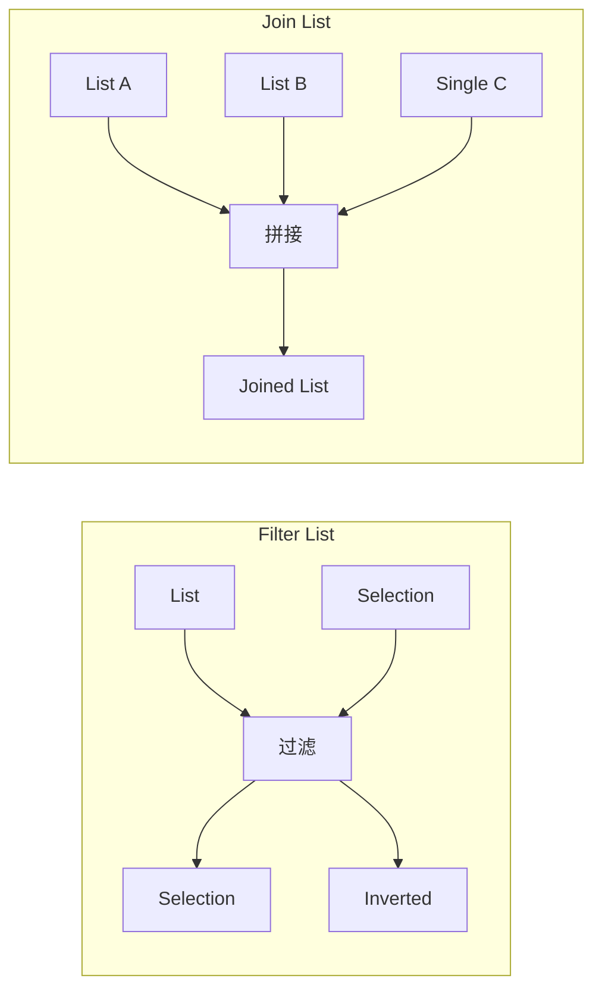
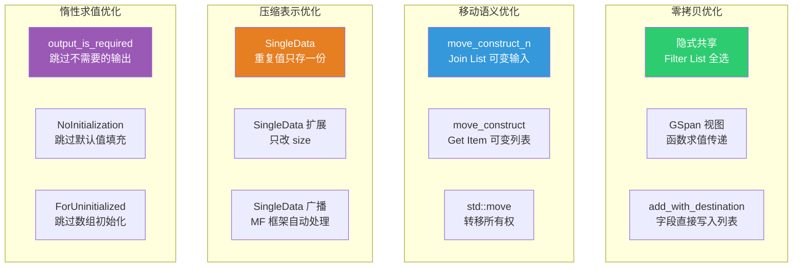
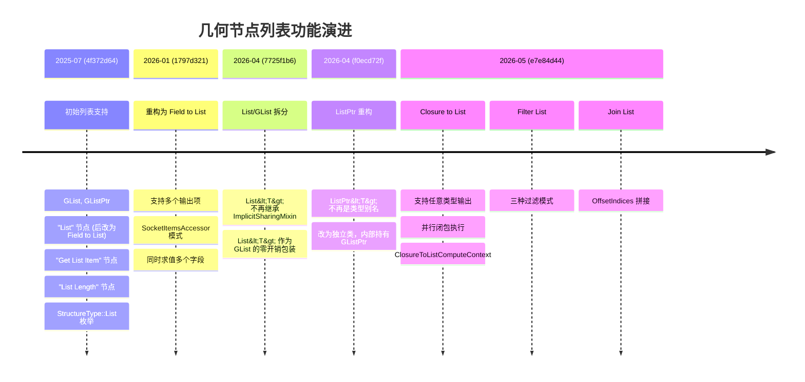

# 列表节点对比与设计总结

> 📖 系列文档：[目录](01-列表系统架构与核心数据结构.md) | [上一篇](11-结构类型推断与列表.md)

---

## 目录

1. [六个节点功能对比](#1-六个节点功能对比)
2. [复杂度排序与依赖关系](#2-复杂度排序与依赖关系)
3. [技术特性对比矩阵](#3-技术特性对比矩阵)
4. [数据流模式对比](#4-数据流模式对比)
5. [性能优化策略对比](#5-性能优化策略对比)
6. [DNA 存储方式对比](#6-dna-存储方式对比)
7. [设计模式总结](#7-设计模式总结)
8. [提交历史总览](#8-提交历史总览)

---

## 1. 六个节点功能对比

| 节点 | 功能 | 输入 | 输出 | 复杂度 |
|------|------|------|------|--------|
| List Length | 获取列表长度 | List | Single (Int) | ⭐ |
| Join List | 拼接多个列表 | Dynamic (multi) | List | ⭐⭐ |
| Get List Item | 按索引取值 | List + Dynamic | Dynamic | ⭐⭐⭐ |
| Filter List | 按条件过滤 | List + Dynamic | List × 2 | ⭐⭐⭐ |
| Field to List | 字段转列表 | Int + Field(s) | List(s) | ⭐⭐⭐⭐ |
| Closure to List | 闭包转列表 | Int + Closure | List(s) | ⭐⭐⭐⭐⭐ |

---

## 2. 复杂度排序与依赖关系

### 涉及文件数量

| 节点 | 直接涉及的源文件数 | 间接依赖 |
|------|-------------------|---------|
| List Length | 1 | GList, SocketValueVariant |
| Join List | 1 | GList, SocketValueVariant, OffsetIndices |
| Get List Item | 1 | GList, SocketValueVariant, MultiFunction |
| Filter List | 1 | GList, SocketValueVariant, ListFieldContext, IndexMask |
| Field to List | 1 + Accessor | GList, SocketValueVariant, ListFieldContext, FieldEvaluator, SocketItems |
| Closure to List | 1 + Accessor | GList, SocketValueVariant, Closure, ComputeContext, threading, SocketItems |

---

## 3. 技术特性对比矩阵

| 特性 | List Length | Join List | Get Item | Filter | Field to List | Closure to List |
|------|:----------:|:---------:|:--------:|:------:|:-------------:|:---------------:|
| 使用 MultiFunction | ❌ | ❌ | ✅ | ❌ | ❌ | ❌ |
| 使用 ListFieldContext | ❌ | ❌ | ❌ | ✅ | ✅ | ❌ |
| 使用 SocketItemsAccessor | ❌ | ❌ | ❌ | ❌ | ✅ | ✅ |
| 并行执行 | N/A | ❌ | 通过 MF | 通过 FE | 通过 FE | ✅ parallel_for |
| SingleData 优化 | N/A | ✅ | ✅ | ✅ | N/A | N/A |
| 移动语义优化 | N/A | ✅ | ✅ | ❌ | ❌ | ✅ |
| 零拷贝共享 | N/A | ❌ | ❌ | ✅ | ✅ | ❌ |
| 动态 Socket | ❌ | ❌ | ❌ | ❌ | ✅ | ✅ |
| 索引越界处理 | N/A | N/A | 默认值 | N/A | N/A | N/A |
| ComputeContext | ❌ | ❌ | ❌ | ❌ | ❌ | ✅ |
| 闭包签名 | ❌ | ❌ | ❌ | ❌ | ❌ | ✅ |

---

## 4. 数据流模式对比

### 创建模式

### 消费模式

### 变换模式

---

## 5. 性能优化策略对比

### 各节点的关键优化

| 节点 | 关键优化 | 效果 |
|------|---------|------|
| List Length | 无需优化 | 只读 `size()` |
| Join List | `move_construct_n` | 可变列表零拷贝移动 |
| Join List | `OffsetIndices` | 一次遍历计算所有偏移 |
| Get Item | `SampleIndexFunction` | 字段系统自动并行化 |
| Get Item | 移动 vs 拷贝判断 | 可变列表零拷贝取值 |
| Filter List | 全选零拷贝返回 | 共享原列表 |
| Filter List | SingleData 只改 size | 过滤几乎零开销 |
| Field to List | `add_with_destination` | 字段直接写入列表内存 |
| Field to List | 同时求值多个字段 | 合并公共子表达式 |
| Closure to List | `parallel_for` | 闭包并行执行 |
| Closure to List | 快速/通用路径 | 单值结果零拷贝构建 |

---

## 6. DNA 存储方式对比

| 节点 | 存储方式 | 存储内容 |
|------|---------|---------|
| List Length | `custom1` | 数据类型枚举 |
| Join List | `custom1` | 数据类型枚举 |
| Get List Item | `storage` (NodeGeometryListGetItem) | 数据类型 + 结构类型 |
| Filter List | `custom1` | 数据类型枚举 |
| Field to List | `storage` (GeometryNodeFieldToList) | 动态项数组 + next_identifier |
| Closure to List | `storage` (GeometryNodeClosureToList) | 动态项数组 + next_identifier |

> **`custom1` vs `storage`**：简单节点用 `custom1`（一个整数），复杂节点用 `storage`（堆分配的结构体，包含动态数组）。

---

## 7. 设计模式总结

### 模式 1：结构类型叠加

列表不是独立的 Socket 类型，而是在现有数据类型上叠加 `StructureType::List` 语义。这避免了组合爆炸。

### 模式 2：泛型 + 类型化零开销

`GList` / `List<T>` 遵循 Blender 的 `GVArray` / `VArray<T>` 模式——泛型基类 + `reinterpret_cast` 零开销包装。

### 模式 3：隐式共享 + 写时复制

所有列表数据通过 `ImplicitSharingPtr` 管理，实现零拷贝共享和按需深拷贝。

### 模式 4：SocketItemsAccessor

动态 Socket 的通用框架，将添加/删除/排序/序列化/UI 抽象为模板参数化的 Accessor。

### 模式 5：SingleData 压缩

重复值只存一份，逻辑上重复 N 次。过滤、扩展、广播等操作几乎零开销。

### 模式 6：多函数执行器

`execute_multi_function_on_value_variant__list` 统一处理单值/字段/列表输入，自动长度对齐和重复扩展。

---

## 8. 提交历史总览

