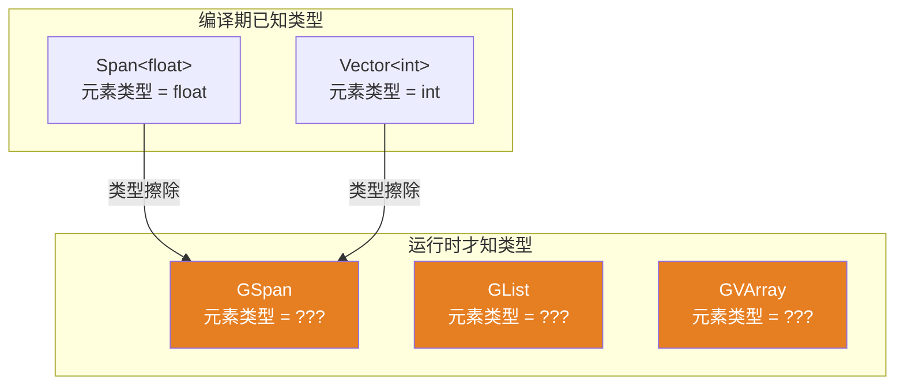
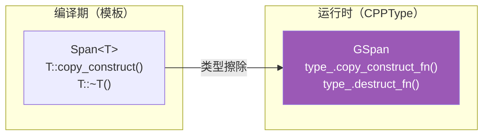
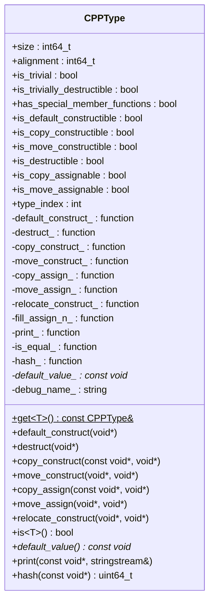
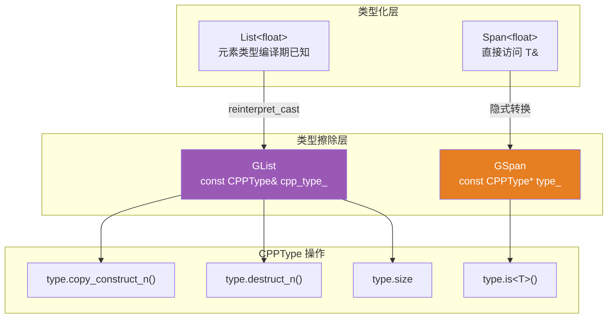
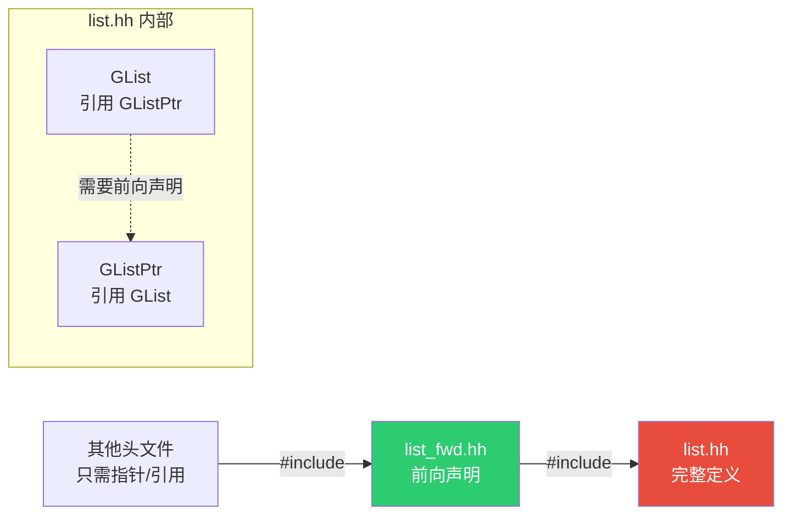

# CPPType — 运行时类型信息系统

> 📖 系列文档：[目录](01-列表系统架构与核心数据结构.md) | [上一篇](12-列表节点对比与设计总结.md) | [下一篇](14-GSpan与GPointer泛型视图.md)
> 源码文件：[BLI_cpp_type.hh](../../source/blender/blenlib/BLI_cpp_type.hh)、[BLI_cpp_type_make.hh](../../source/blender/blenlib/BLI_cpp_type_make.hh)

---

## 目录

1. [为什么需要 CPPType](#1-为什么需要-cpptype)
2. [核心设计思想](#2-核心设计思想)
3. [类结构与成员详解](#3-类结构与成员详解)
4. [类型注册机制](#4-类型注册机制)
5. [常用操作详解](#5-常用操作详解)
6. [在列表系统中的应用](#6-在列表系统中的应用)
7. [与 C++ RTTI 的对比](#7-与-c++-rtti-的对比)

---

## 1. 为什么需要 CPPType

C++ 的模板系统在编译期提供了强大的类型安全，但在某些场景下类型必须在运行时才能确定：



**问题**：当你有一个 `void*` 指针和运行时类型信息时，如何正确地构造、析构、拷贝、移动、比较元素？

**答案**：`CPPType` 将 C++ 类型的所有操作存储为函数指针，使得在类型擦除后仍能正确操作数据。

---

## 2. 核心设计思想

`CPPType` 的核心思想是**将类型的操作从编译期绑定变为运行时查找**：



每个 `CPPType` 实例是一个**单例**——对于同一个 C++ 类型，全局只有一个 `CPPType` 对象：

```cpp
const CPPType &float_type = CPPType::get<float>();
const CPPType &float_type2 = CPPType::get<float>();
// &float_type == &float_type2  （同一个对象）
```

> **单例设计**：`CPPType::get<T>()` 返回的是静态全局对象的引用。这使得比较类型只需比较指针——`&type1 == &type2` 就能判断两个类型是否相同，比字符串比较快得多。

---

## 3. 类结构与成员详解



### 公共成员

| 成员 | 类型 | 对应 C++ | 说明 |
|------|------|---------|------|
| `size` | `int64_t` | `sizeof(T)` | 单个元素占用的字节数 |
| `alignment` | `int64_t` | `alignof(T)` | 内存对齐要求 |
| `is_trivial` | `bool` | `std::is_trivial_v<T>` | 平凡类型：可以用 `memcpy` 拷贝 + 析构是空操作 + 有平凡默认构造函数 |
| `is_trivially_destructible` | `bool` | `std::is_trivially_destructible_v<T>` | 析构是空操作：不需要释放任何资源 |
| `has_special_member_functions` | `bool` | — | 是否有完整的特殊成员函数 |
| `type_index` | `int` | — | 唯一索引，用于快速比较 |

### Trivial 概念详解

**Trivial**（平凡）的英文原意是"琐碎的、不重要的"。在 C++ 中，它表示一个类型**"简单到不需要特殊处理"**——没有自定义的构造/析构/拷贝逻辑，编译器默认的行为就足够了。

用搬家类比：一本书直接拿走就行（trivial），一个鱼缸要先倒水捞鱼再搬（non-trivial）。


| 类型 | trivial | trivially_copyable | trivially_destructible | 原因 |
|------|:-------:|:------------------:|:---------------------:|------|
| `int`, `float`, `float3` | ✅ | ✅ | ✅ | 纯数值，无特殊逻辑 |
| `int[5]` | ✅ | ✅ | ✅ | 原生数组 |
| `std::string` | ❌ | ❌ | ❌ | 有堆分配，析构要释放，拷贝要深拷贝 |
| `std::vector<int>` | ❌ | ❌ | ❌ | 有堆分配 |
| `GeometrySet` | ❌ | ❌ | ❌ | 内部有共享指针 |
| 有虚函数的类 | ❌ | ❌ | ❌ | 虚函数表指针不能 memcpy |

**在 CPPType 中的实际影响**（以下为**示意代码**，展示优化逻辑，非 Blender 源码中的实际实现）：

```cpp
// 示意：copy_construct_n 的优化逻辑
void copy_construct_n(const void *src, void *dst, int64_t n) {
    if (is_trivial) {
        memcpy(dst, src, size * n);        // 一次内存拷贝，极快
    } else {
        for (int i = 0; i < n; i++) {
            copy_construct_(src + i * size, dst + i * size);  // 逐个拷贝
        }
    }
}

// 示意：destruct_n 的优化逻辑
void destruct_n(void *ptr, int64_t n) {
    if (is_trivially_destructible) {
        return;  // 什么都不做
    } else {
        for (int i = 0; i < n; i++) {
            destruct_(ptr + i * size);  // 逐个析构
        }
    }
}
```

> **实际实现**：Blender 源码中，这些优化在**类型注册时**就决定了——通过 `if constexpr (std::is_trivially_copy_constructible_v<T>)` 在编译期选择函数指针。例如 [BLI_cpp_type_make.hh:375~387](../../source/blender/blenlib/BLI_cpp_type_make.hh) 的注册逻辑：
>
> ```cpp
> if constexpr (std::is_copy_constructible_v<T>) {
>   if constexpr (std::is_trivially_copy_constructible_v<T>) {
>     // trivial 类型：直接用 copy_assign_（内部是 memcpy）
>     copy_construct_ = copy_assign_;
>     copy_construct_n_ = copy_assign_n_;
>   }
>   else {
>     // 非 trivial 类型：逐个调用构造函数
>     copy_construct_ = copy_construct_cb<T>;
>     copy_construct_n_ = copy_construct_n_cb<T>;
>   }
> }
> ```
>
> **实际例子对比**：
>
> | 类型 | `is_trivial` | `copy_construct_n_` 指向 | `destruct_n_` 指向 | 10000 个元素的操作 |
> |------|-------------|-------------------------|-------------------|-------------------|
> | `int` | ✅ true | `copy_assign_n_`（内部 `memcpy`） | `nullptr`（跳过） | `memcpy` 一次拷贝 40KB，零析构 |
> | `float3` | ✅ true | `copy_assign_n_`（内部 `memcpy`） | `nullptr`（跳过） | `memcpy` 一次拷贝 120KB，零析构 |
> | `GeometrySet` | ❌ false | `copy_construct_cb<T>`（逐个构造） | `destruct_cb<T>`（逐个析构） | 逐个调用构造函数，逐个析构共享指针 |
> | `std::string` | ❌ false | `copy_construct_cb<T>`（逐个构造） | `destruct_cb<T>`（逐个析构） | 逐个深拷贝字符串内容，逐个释放堆内存 |
>
> 对于 10000 个 `int`，`memcpy` 约 40KB 一次拷贝；逐个拷贝构造要调用 10000 次构造函数。差距可达 10-100 倍。对于 `GeometrySet`，逐个构造需要增加引用计数、逐个析构需要减少引用计数——无法批量优化。

### 函数指针成员

每个函数指针对应一个 C++ 操作：

| 函数指针 | 签名 | 对应操作 |
|---------|------|---------|
| `default_construct_` | `void(void*)` | 在未初始化内存上默认构造 |
| `destruct_` | `void(void*)` | 析构（不释放内存） |
| `copy_construct_` | `void(const void*, void*)` | 拷贝构造（src → 未初始化 dst） |
| `move_construct_` | `void(void*, void*)` | 移动构造（src → 未初始化 dst） |
| `copy_assign_` | `void(const void*, void*)` | 拷贝赋值（src → 已初始化 dst） |
| `move_assign_` | `void(void*, void*)` | 移动赋值（src → 已初始化 dst） |
| `relocate_construct_` | `void(void*, void*)` | 重定位（移动构造 + 析构源） |
| `is_equal_` | `bool(const void*, const void*)` | 比较两个值是否相等 |
| `hash_` | `uint64_t(const void*)` | 计算哈希值 |

> **`copy_construct` vs `copy_assign`**：`copy_construct` 在**未初始化**的内存上构造（placement new），`copy_assign` 在**已初始化**的内存上赋值（先析构旧值再构造新值，或直接 `operator=`）。

> **`relocate_construct`**：等价于移动构造 + 析构源。对于平凡类型，就是 `memcpy`。对于非平凡类型，先移动构造到目标，再析构源。这比"拷贝构造 + 析构源"更高效。

### 批量操作

每个单元素操作都有对应的批量版本：

```cpp
void default_construct_n(void *ptr, int64_t n);
void destruct_n(void *ptr, int64_t n);
void copy_construct_n(const void *src, void *dst, int64_t n);
void move_construct_n(void *src, void *dst, int64_t n);
void copy_assign_n(const void *src, void *dst, int64_t n);
void move_assign_n(void *src, void *dst, int64_t n);
void fill_assign_n(const void *value, void *dst, int64_t n);
void fill_construct_n(const void *value, void *dst, int64_t n);
```

> **批量操作的优化**：对于平凡类型（如 `float`、`int`），批量操作直接使用 `memcpy` 或 `memset`，比逐个操作快得多。对于非平凡类型（如 `std::string`），则逐个调用对应的操作。

### IndexMask 版本

还有接受 `IndexMask` 的版本，只对掩码指定的索引操作：

```cpp
void default_construct_indices(void *ptr, const IndexMask &mask);
void destruct_indices(void *ptr, const IndexMask &mask);
void copy_construct_indices(const void *src, void *dst, const IndexMask &mask);
// ...
```

> **IndexMask 的用途**：在几何节点中，经常只需要对部分元素操作（如被选中的顶点）。`IndexMask` 高效地表示这些索引，避免操作整个数组。

---

## 4. 类型注册机制

`CPPType` 使用宏在程序启动时注册类型，创建单例对象。

### 注册位置

注册分两层：

1. **基础类型**（[blenlib/intern/cpp_types.cc](../../source/blender/blenlib/intern/cpp_types.cc)）：`register_cpp_types()` 函数中注册：
```cpp
void register_cpp_types()
{
  BLI_CPP_TYPE_REGISTER(bool, CPPTypeFlags::BasicType);
  BLI_CPP_TYPE_REGISTER(float, CPPTypeFlags::BasicType);
  BLI_CPP_TYPE_REGISTER(float3, CPPTypeFlags::BasicType);
  BLI_CPP_TYPE_REGISTER(int32_t, CPPTypeFlags::BasicType);
  BLI_CPP_TYPE_REGISTER(std::string, CPPTypeFlags::BasicType);
  // ... 更多基础类型
}
```

2. **BKE 类型**（[blenkernel/intern/cpp_types.cc](../../source/blender/blenkernel/intern/cpp_types.cc)）：`BKE_cpp_types_init()` 先调用 `register_cpp_types()`，再注册业务类型：
```cpp
void BKE_cpp_types_init()
{
  register_cpp_types();  // 先注册基础类型
  BLI_CPP_TYPE_REGISTER(bke::GeometrySet, CPPTypeFlags::Printable | CPPTypeFlags::EqualityComparable);
  BLI_CPP_TYPE_REGISTER(Object *, CPPTypeFlags::BasicType);
  BLI_CPP_TYPE_REGISTER(nodes::ClosurePtr, CPPTypeFlags::EqualityComparable);
  BLI_CPP_TYPE_REGISTER(nodes::GListPtr, CPPTypeFlags::EqualityComparable);  // ← 列表类型在这里注册
  // ... 更多业务类型
}
```

### BLI_CPP_TYPE_REGISTER 宏

```cpp
#define BLI_CPP_TYPE_REGISTER(TYPE_NAME, FLAGS) \
  blender::detail::register_cpp_type<TYPE_NAME, FLAGS>(STRINGIFY(TYPE_NAME))
```

展开后调用 `detail::register_cpp_type<T, FLAGS>(name)`，其实现：

```cpp
template<typename T, CPPTypeFlags FLAGS>
inline void register_cpp_type(const StringRef type_name)
{
  static CPPType *cpp_type = new (detail::cpp_type_impl<T>.ptr())
      CPPType(TypeTag<T>(), TypeForValue<CPPTypeFlags, FLAGS>(), type_name);

  struct CPPTypeDestructor {
    ~CPPTypeDestructor() { std::destroy_at(cpp_type); }
  };
  static CPPTypeDestructor cpp_type_destructor;  // 程序退出时析构
}
```

> **`detail::cpp_type_impl<T>`**：定义在 [BLI_cpp_type.hh:440](../../source/blender/blenlib/BLI_cpp_type.hh) 的模板变量 `template<typename T> inline TypedBuffer<CPPType> cpp_type_impl{};`。`TypedBuffer<CPPType>` 是一块足够容纳 `CPPType` 对象的未初始化内存。`register_cpp_type` 在这块内存上 placement new 构造 `CPPType` 对象。

> **`CPPType::get<T>()` 的实现**：
> ```cpp
> template<typename T> inline const CPPType &CPPType::get()
> {
>   const CPPType &type = detail::cpp_type_impl<std::decay_t<T>>.ref();
>   BLI_assert(type.size > 0);  // 未注册则断言失败
>   return type;
> }
> ```
> 它直接返回 `cpp_type_impl<T>` 中之前构造的对象引用。`std::decay_t<T>` 确保引用类型（如 `float&`）也能正确查找。

> **`TypeTag<T>`**：空结构体，用于在构造函数中传递类型信息。`CPPType` 的构造函数是模板函数，通过 `TypeTag<T>` 推断类型 `T`，然后为每个函数指针成员绑定对应的 `T` 操作。

### CPPTypeFlags

原始注释翻译：

> 不同类型支持不同功能。像"可拷贝构造"这样的功能可以很容易地自动检测。但有些功能在 C++17 中难以自动检测，这些功能就用此枚举中的标志来表示，需要程序员手动指定。

```cpp
enum class CPPTypeFlags {
  None = 0,
  Hashable = 1 << 0,
  Printable = 1 << 1,
  EqualityComparable = 1 << 2,
  IdentityDefaultValue = 1 << 3,

  BasicType = Hashable | Printable | EqualityComparable,
};
ENUM_OPERATORS(CPPTypeFlags)
```

> **为什么需要区分这些标志？** 核心原因是 C++ 的类型特征（type traits）能力有限：
>
> - **可自动检测的**：`std::is_copy_constructible_v<T>`、`std::is_trivially_destructible_v<T>` 等，编译器能自动判断。这些在 `CPPType` 构造函数中通过 `if constexpr` 自动设置对应的函数指针。
> - **无法自动检测的**：C++ 没有 `std::is_hashable_v<T>`（哈希需要 `std::hash<T>` 特化，但无法检测特化是否存在）、没有 `std::is_printable_v<T>`（需要 `operator<<`，但检测困难）、没有 `std::is_equality_comparable_v<T>`（C++20 的 `std::equality_comparable` concept 可用，但 Blender 使用 C++17）。所以这些能力必须由程序员在注册时手动声明。
>
> **`ENUM_OPERATORS(CPPTypeFlags)`**：Blender 宏，为枚举类型生成位运算符（`|`、`&`、`^`、`~`、`|=`、`&=`）。C++ 的 `enum class` 默认不支持位运算，这个宏使 `BasicType = Hashable | Printable | EqualityComparable` 这样的组合写法合法。

| 标志 | 含义 | 为什么不能自动检测 |
|------|------|------------------|
| `Hashable` | 支持 `hash_` 函数（`std::hash<T>` 有特化） | C++17 无法检测 `std::hash<T>` 是否有有效特化 |
| `Printable` | 支持 `print_` 函数（`operator<<` 可用） | 检测 `operator<<` 是否存在在 C++17 中很困难 |
| `EqualityComparable` | 支持 `is_equal_` 函数（`operator==` 可用） | C++17 没有 `std::equality_comparable` concept |
| `IdentityDefaultValue` | 默认值是全零（如 `int(0)`, `float(0.0f)`） | 无法自动判断"全零是否是有效的默认值" |
| `BasicType` | `Hashable | Printable | EqualityComparable` 的组合 | — |

> **`IdentityDefaultValue` 的用途**：当默认值是全零时，可以用 `memset(0)` 快速初始化，比逐个默认构造快得多。例如 `float3(0,0,0)` 是全零，可以用 `memset`；但 `std::string()` 不是全零（内部有指针），不能用 `memset`。

> **各类型的标志分配**：
>
> | 类型 | 标志 | 原因 |
> |------|------|------|
> | `float`, `int`, `bool` | `BasicType` | 可哈希、可打印、可比较 |
> | `float3`, `int2` | `BasicType` | 向量类型也支持这些操作 |
> | `std::string` | `BasicType` | 字符串支持哈希、打印、比较 |
> | `GeometrySet` | `Printable \| EqualityComparable` | 不可哈希（没有 `std::hash` 特化） |
> | `GListPtr` | `EqualityComparable` | 只支持比较，不支持哈希和打印 |
> | `InstanceReference` | `None` | 不支持任何额外操作 |

---

## 5. 常用操作详解

### is\<T\>() — 类型检查

```cpp
template<typename T> bool is() const
{
  return this == &CPPType::get<T>();
}
```

> **比较指针而非名称**：因为 `CPPType::get<T>()` 返回单例，所以只需比较指针就能判断类型是否相同。这比字符串比较（`name == "float"`）快得多，且不会出错。

### default_value() — 获取默认值

```cpp
const void *default_value() const
{
  return default_value_;
}
```

返回指向类型默认值的指针。对于 `float`，指向 `0.0f`；对于 `int`，指向 `0`；对于 `std::string`，指向空字符串。

### pointer_has_valid_alignment() — 对齐检查

```cpp
bool pointer_has_valid_alignment(const void *ptr) const
{
  return (uintptr_t(ptr) & alignment_mask_) == 0;
}
```

> **`alignment_mask_`**：预计算的掩码，`alignment - 1`。如果指针地址与掩码按位与为零，则对齐正确。这比取模运算快。

---

## 6. 在列表系统中的应用

`CPPType` 是列表系统类型擦除的基础：



### GList 中的使用

```cpp
// GList::ArrayData::span_for_write — 深拷贝时使用 CPPType
void *new_data = MEM_new_array_uninitialized_aligned(size, type.size, type.alignment, __func__);
type.copy_construct_n(this->data, new_data, size);  // 通过 CPPType 逐个拷贝构造
```

```cpp
// GList::ArrayData::ForDefaultValue — 创建默认值数组
ArrayData ArrayData::ForDefaultValue(const CPPType &type, int64_t size)
{
  void *data = MEM_new_array_uninitialized_aligned(size, type.size, type.alignment, __func__);
  type.default_construct_n(data, size);  // 通过 CPPType 逐个默认构造
  // ...
}
```

### GSpan 中的使用

```cpp
// GSpan::operator[] — 通过 CPPType 计算偏移
const void *operator[](int64_t index) const
{
  return POINTER_OFFSET(data_, type_->size * index);  // type_->size = sizeof(T)
}
```

### GVArray 中的使用

```cpp
// GVArray::typed<T>() — 类型检查
BLI_assert(impl_->type().is<T>());  // 运行时类型检查
```

---

## 7. 与 C++ RTTI 的对比

| 特性 | C++ RTTI (`typeid`) | CPPType |
|------|-------------------|---------|
| 类型名称 | ✅ `typeid(T).name()` | ✅ `debug_name_` |
| 类型比较 | ✅ `typeid(a) == typeid(b)` | ✅ `&type1 == &type2`（指针比较） |
| 构造/析构 | ❌ | ✅ 函数指针 |
| 拷贝/移动 | ❌ | ✅ 函数指针 |
| 哈希 | ❌ | ✅ `hash_` |
| 打印 | ❌ | ✅ `print_` |
| 默认值 | ❌ | ✅ `default_value_` |
| 对齐信息 | ❌ | ✅ `alignment` |
| 批量操作 | ❌ | ✅ `*_n` / `*_indices` |
| 性能开销 | 有（需启用 RTTI） | 无（编译期生成） |
| 跨编译单元 | 可能不一致 | 一致（单例） |

> **为什么不用 C++ RTTI？** Blender 编译时禁用了 RTTI（`-fno-rtti`），因为 RTTI 增加二进制大小且有性能开销。`CPPType` 提供了更丰富的功能，且通过宏在编译期生成，零运行时开销。

---

## 附录：前向声明头文件的作用

[NOD_geometry_nodes_list_fwd.hh](../../source/blender/nodes/NOD_geometry_nodes_list_fwd.hh) 只包含前向声明：

```cpp
namespace blender::nodes {
class GList;
class GListPtr;
template<typename T> class List;
template<typename T> class ListPtr;
}
```

**为什么 `NOD_geometry_nodes_list.hh` 需要包含自己的前向声明头文件？** 有两个原因：

**原因 1：类定义内部的交叉引用**。在 `list.hh` 中，类的定义顺序是 `GList`(第18行) → `List<T>`(第102行) → `GListPtr`(第135行) → `ListPtr<T>`(第154行)。但 `GList` 的方法签名引用了 `GListPtr`（如 `static GListPtr create(...)`），而 `GListPtr` 在后面才定义。没有前向声明，编译器在解析 `GListPtr` 时会报错"未知类型"。同样，`List<T>` 引用了 `ListPtr<T>`，也需要前向声明。

**原因 2：供其他头文件使用**。`list_fwd.hh` 使得其他文件只需 `#include "NOD_geometry_nodes_list_fwd.hh"` 就能使用 `GList*` 或 `ListPtr<T>&`（指针或引用），而不需要拉入整个 `list.hh` 的重量级依赖链（它包含了 `BLI_generic_virtual_array.hh`、`BLI_implicit_sharing_ptr.hh` 等）。这减少了编译时间和不必要的头文件依赖。


