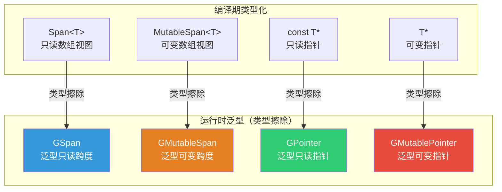
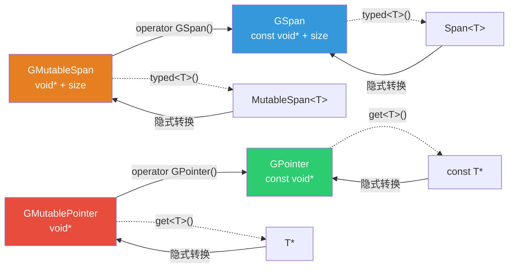
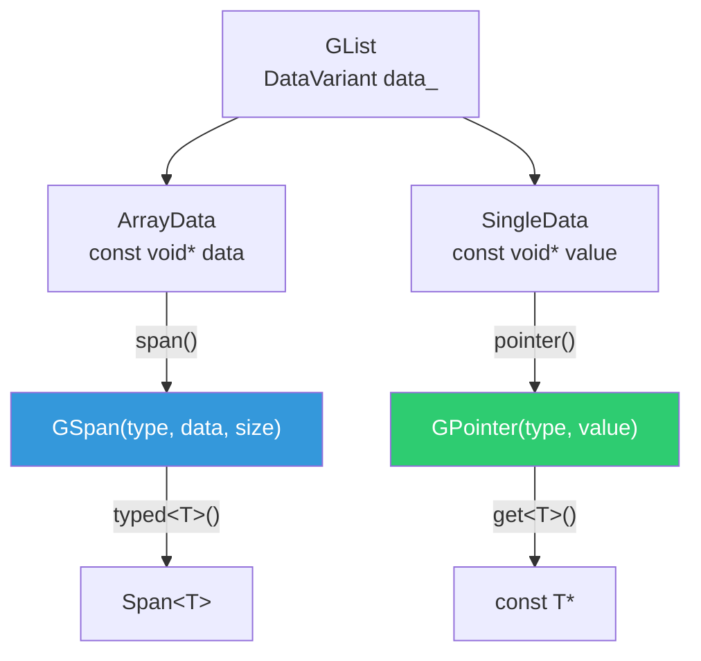

# GSpan、GMutableSpan、GPointer、GMutablePointer — 泛型数据视图

> 📖 系列文档：[目录](01-列表系统架构与核心数据结构.md) | [上一篇](13-CPPType运行时类型信息.md) | [下一篇](15-VArray与GVArray虚拟数组.md)
> 源码文件：[BLI_generic_span.hh](../../source/blender/blenlib/BLI_generic_span.hh)、[BLI_generic_pointer.hh](../../source/blender/blenlib/BLI_generic_pointer.hh)

---

## 目录

1. [类型擦除的 Span/Pointer 体系](#1-类型擦除的-spanpointer-体系)
2. [GSpan — 泛型只读跨度](#2-gspan--泛型只读跨度)
3. [GMutableSpan — 泛型可变跨度](#3-gmutablespan--泛型可变跨度)
4. [GPointer — 泛型只读指针](#4-gpointer--泛型只读指针)
5. [GMutablePointer — 泛型可变指针](#5-gmutablepointer--泛型可变指针)
6. [四者关系与转换规则](#6-四者关系与转换规则)
7. [在列表系统中的应用](#7-在列表系统中的应用)

---

## 1. 类型擦除的 Span/Pointer 体系

Blender 的泛型数据视图类遵循统一的命名模式：`G` 前缀表示泛型（Generic），对应编译期类型化的版本：

> **"Generic" 叫做泛型吗？** 是的。在 C++ 语境中，"Generic Programming"（泛型编程）通常指模板，但 Blender 的 `G` 前缀类更准确地说是**类型擦除**（Type Erasure）——编译期类型信息被"擦除"，改为运行时通过 `CPPType` 保存。这与 Java/C# 的泛型（Generics）不同——后者的类型参数在编译期擦除为 `Object`，而 Blender 的类型擦除保留完整的类型操作能力（构造/析构/拷贝等）。

> **为什么需要类型擦除版本？** 核心原因是**运行时多态**。几何节点系统中，Socket 的类型在运行时才能确定（用户可以动态添加/删除输出项）。如果只有 `Span<T>`，就无法将不同类型的 Span 存入同一个容器或传递给同一个函数。类型擦除版本通过 `CPPType` 在运行时描述类型，使得泛型代码可以处理任意类型的数据。



**核心区别**：类型化版本通过模板参数 `T` 在编译期知道元素类型，泛型版本通过 `const CPPType*` 在运行时知道元素类型。

> **为什么 GSpan/GPointer 等与 CPPType 紧密耦合？** 因为 `CPPType` 是类型擦除后的**唯一类型信息来源**。类型化版本 `Span<T>` 不需要 `CPPType`——编译器已经知道 `T` 的大小、对齐、构造/析构方法。但类型擦除后，所有类型信息都丢失了，只剩 `void*`。`CPPType` 填补了这个空缺——它存储了 `size`（用于计算元素偏移）、`alignment`（用于检查指针有效性）、`copy_construct`/`destruct` 等函数指针（用于操作 `void*` 数据）。没有 `CPPType`，`GSpan` 就无法知道每个元素多大、如何拷贝、如何析构——它只是一个盲目的 `void*` 指针。

---

## 2. GSpan — 泛型只读跨度

`GSpan` 是 `Span<T>` 的泛型版本，表示一段连续内存的只读视图。

### 数据成员

```cpp
class GSpan {
 protected:
  const CPPType *type_ = nullptr;
  const void *data_ = nullptr;
  int64_t size_ = 0;
};
```

| 成员 | 类型 | 说明 |
|------|------|------|
| `type_` | `const CPPType*` | 元素的运行时类型。可为 `nullptr`（空 GSpan） |
| `data_` | `const void*` | 指向首元素的指针。`const` 表示只读（隐式共享） |
| `size_` | `int64_t` | 元素数量（不是字节数） |

> **`data_` 为什么是 `const void*`？** 因为 `GSpan` 是只读视图。数据可能被多个拥有者共享（隐式共享），不允许修改。如果需要修改，使用 `GMutableSpan`。

> **为什么变量名叫 `type_` 而非 `type_ptr_`？** 这是 Blender 的命名惯例——指针成员不加 `_ptr` 后缀。原因有二：① `type_` 更简洁，读起来更自然（`type().size()` vs `type_ptr()->size()`）；② 访问方法 `type()` 返回 `const CPPType&`（解引用后的引用），而非指针，所以从使用者角度看，`type_` 是"类型"而非"类型指针"。Blender 代码库中所有指向 `CPPType` 的成员都叫 `type_`，保持一致性。

### 构造方式

```cpp
// 从 CPPType + 原始指针
GSpan(const CPPType &type, const void *buffer, int64_t size);

// 从类型化 Span（隐式转换）
GSpan(Span<T> array);  // 自动获取 CPPType::get<T>()

// 从类型化 MutableSpan（隐式转换，丢弃可变性）
GSpan(MutableSpan<T> array);
```

> **`Span<T>` → `GSpan` 的隐式转换**：这是安全的，因为 `Span<T>` 是 `GSpan` 的子集（只读 + 类型已知）。转换时自动获取 `CPPType::get<T>()`。

> **`CPPType::get<T>()` 是干什么的？** 它是获取类型 `T` 对应的 `CPPType` 单例的模板函数。对于每个已注册的类型 `T`，`CPPType::get<T>()` 返回同一个静态全局对象的引用。例如 `CPPType::get<float>()` 返回 `float` 类型的 `CPPType` 实例（包含 `size=4`, `alignment=4`, `is_trivial=true` 等），`CPPType::get<int>()` 返回 `int` 类型的实例。在 `GSpan(Span<T> array)` 构造函数中，`CPPType::get<T>()` 自动从编译期类型 `T` 获取运行时类型信息，完成类型化到泛型的桥接。

> **类型在哪里注册的？** 注册分两层，都在程序启动时执行：
>
> 1. **基础类型**（[blenlib/intern/cpp_types.cc](../../source/blender/blenlib/intern/cpp_types.cc)）：`register_cpp_types()` 函数中注册 `bool`、`float`、`float3`、`int32_t`、`std::string` 等基础类型。
>
> 2. **BKE 类型**（[blenkernel/intern/cpp_types.cc](../../source/blender/blenkernel/intern/cpp_types.cc)）：`BKE_cpp_types_init()` 先调用 `register_cpp_types()`，再注册 `GeometrySet`、`Object*`、`ClosurePtr`、**`GListPtr`** 等业务类型。
>
> 注册宏 `BLI_CPP_TYPE_REGISTER(TYPE_NAME, FLAGS)` 展开后调用 `detail::register_cpp_type<T, FLAGS>(name)`，在静态内存上 placement new 构造 `CPPType` 对象，并注册到全局查找表中。之后 `CPPType::get<T>()` 就能找到它——内部实现是 `detail::cpp_type_impl<std::decay_t<T>>.ref()`，返回之前构造的静态对象引用。如果类型未注册就调用 `CPPType::get<T>()`，会触发断言 `BLI_assert(type.size > 0)` 失败。
>
> ```mermaid
> sequenceDiagram
>     participant Startup as Blender 启动
>     participant BKE as BKE_cpp_types_init()
>     participant BLI as register_cpp_types()
>     participant Macro as BLI_CPP_TYPE_REGISTER
>     participant Static as 静态内存
>     participant User as 用户代码
>
>     Startup->>BKE: 调用
>     BKE->>BLI: register_cpp_types()
>     BLI->>Macro: BLI_CPP_TYPE_REGISTER(float, BasicType)
>     Macro->>Static: placement new CPPType(TypeTag<float>{}, ...)
>     Note over Static: cpp_type_impl<float> 现在有值了
>     BLI->>Macro: BLI_CPP_TYPE_REGISTER(int32_t, BasicType)
>     Macro->>Static: placement new CPPType(TypeTag<int32_t>{}, ...)
>     BKE->>Macro: BLI_CPP_TYPE_REGISTER(GListPtr, ...)
>     Macro->>Static: placement new CPPType(TypeTag<GListPtr>{}, ...)
>
>     User->>Static: CPPType::get<float>()
>     Static-->>User: 返回 float 的 CPPType 引用
> ```

### 元素访问

```cpp
const void *operator[](int64_t index) const
{
  BLI_assert(index < size_);
  return POINTER_OFFSET(data_, type_->size * index);
}
```

> **返回 `const void*` 而非 `const T&`**：因为类型在运行时才知道，无法返回类型化引用。调用者需要自己 `static_cast<const T*>(span[index])`。

> **`POINTER_OFFSET(ptr, offset)` 宏详解**：
> ```cpp
> #define POINTER_OFFSET(v, ofs) \
>   (reinterpret_cast<std::remove_reference_t<decltype(v)>>((char *)(v) + (ofs)))
> ```
> 
> 这个宏将指针 `v` 偏移 `ofs` 字节后返回同类型的指针。逐步拆解：
> 
> 1. **`(char *)(v) + (ofs)`**：将指针转为 `char*` 后加偏移。为什么用 `char*`？因为 C++ 中 `char` 的大小定义为 1 字节，`char*` 的指针算术以字节为单位。`void*` 不支持指针算术（C++ 标准禁止），`int*` 的 `+1` 会偏移 4 字节而非 1 字节。只有 `char*` 的 `+ofs` 精确偏移 `ofs` 字节。
> 
> 2. **`decltype(v)`**：C++11 关键字，获取表达式 `v` 的**声明类型**。如果 `v` 是 `const void*`，`decltype(v)` 就是 `const void*`；如果 `v` 是 `void*`，`decltype(v)` 就是 `void*`。
> 
> 3. **`std::remove_reference_t<decltype(v)>`**：移除引用类型。如果 `v` 是引用（如 `const void*&`），`remove_reference_t` 去掉 `&` 得到 `const void*`。这是防御性编程——确保 `reinterpret_cast` 的目标类型不是引用。
> 
> 4. **`reinterpret_cast<...>(...)`**：将偏移后的 `char*` 转回原始指针类型。如果输入是 `const void*`，输出也是 `const void*`；如果输入是 `void*`，输出也是 `void*`。这保持了 const 正确性。
> 
> **在 GSpan 中的使用**：`POINTER_OFFSET(data_, type_->size * index)` 计算 `data_` 偏移 `index` 个元素后的地址。`type_->size` 是每个元素的字节数（如 `float` 是 4），乘以 `index` 得到字节偏移量。

### typed\<T\>() — 转回类型化 Span

```cpp
template<typename T> Span<T> typed() const
{
  BLI_assert(size_ == 0 || type_ != nullptr);
  BLI_assert(type_ == nullptr || type_->is<T>());
  return Span<T>(static_cast<const T *>(data_), size_);
}
```

> **`type_->is<T>()`**：运行时类型检查。如果 `GSpan` 实际存储的不是 `T` 类型，会触发断言失败。这是安全的"向下转型"。

### 切片操作

```cpp
GSpan slice(int64_t start, int64_t size) const;
GSpan drop_front(int64_t n) const;
GSpan drop_back(int64_t n) const;
GSpan take_front(int64_t n) const;
GSpan take_back(int64_t n) const;
```

> **零拷贝**：切片操作只调整 `data_` 指针和 `size_`，不复制数据。

---

## 3. GMutableSpan — 泛型可变跨度

`GMutableSpan` 是 `MutableSpan<T>` 的泛型版本，表示一段连续内存的可变视图。

### 与 GSpan 的区别

| 特性 | GSpan | GMutableSpan |
|------|-------|-------------|
| `data_` 类型 | `const void*` | `void*` |
| 元素访问返回 | `const void*` | `void*` |
| `typed<T>()` 返回 | `Span<T>` | `MutableSpan<T>` |
| 可修改数据 | ❌ | ✅ |
| 隐式转换为 GSpan | — | ✅ |

### 隐式转换运算符

```cpp
operator GSpan() const
{
  return GSpan(type_, data_, size_);
}
```

> **`GMutableSpan` → `GSpan` 隐式转换**：丢弃可变性，从 `void*` 变为 `const void*`。这是安全的——可变视图可以当作只读视图使用，反之不行。

### copy_from — 批量赋值

```cpp
void copy_from(GSpan values)
{
  BLI_assert(type_ == &values.type());
  BLI_assert(size_ == values.size());
  type_->copy_assign_n(values.data(), data_, size_);
}
```

> **`copy_assign_n` 而非 `copy_construct_n`**：因为目标内存已经初始化（`GMutableSpan` 指向已有数据），需要赋值而非构造。

---

## 4. GPointer — 泛型只读指针

`GPointer` 是类型擦除的 `const T*`，指向单个值。

### 数据成员

```cpp
class GPointer {
 private:
  const CPPType *type_ = nullptr;
  const void *data_ = nullptr;
};
```

> **与 `GSpan` 的区别**：`GPointer` 指向单个值，没有 `size_`。`GSpan` 指向连续数组，有 `size_`。

### 构造方式

```cpp
// 从 GMutablePointer（隐式转换）
GPointer(GMutablePointer ptr);

// 从 CPPType + 原始指针
GPointer(const CPPType &type, const void *data);

// 从类型化指针（隐式转换）
GPointer(T *data);  // 自动获取 CPPType::get<T>()
```

> **`GMutablePointer` → `GPointer` 隐式转换**：与 `GMutableSpan` → `GSpan` 类似，丢弃可变性。

### is_type\<T\>() — 类型检查

```cpp
template<typename T> bool is_type() const
{
  return type_ != nullptr && type_->is<T>();
}
```

### get\<T\>() — 获取类型化指针

```cpp
template<typename T> const T *get() const
{
  BLI_assert(this->is_type<T>());
  return static_cast<const T *>(data_);
}
```

---

## 5. GMutablePointer — 泛型可变指针

`GMutablePointer` 是类型擦除的 `T*`，指向单个可变值。

### 与 GPointer 的区别

| 特性 | GPointer | GMutablePointer |
|------|----------|----------------|
| `data_` 类型 | `const void*` | `void*` |
| `get()` 返回 | `const void*` | `void*` |
| `get<T>()` 返回 | `const T*` | `T*` |
| 可修改数据 | ❌ | ✅ |
| `relocate_out<T>()` | ❌ | ✅ |
| `destruct()` | ❌ | ✅ |

### relocate_out\<T\>() — 重定位取出

```cpp
template<typename T> T relocate_out()
{
  BLI_assert(this->is_type<T>());
  T value;
  type_->relocate_assign(data_, &value);  // 移动构造到 value + 析构源
  data_ = nullptr;
  type_ = nullptr;
  return value;
}
```

> **`relocate_assign`**：移动构造 + 析构源。比"拷贝 + 析构源"更高效。调用后 `GMutablePointer` 变为空（`data_ = nullptr`），因为值已经被取走。

> **使用场景**：从 `LazyFunction` 的输出中取出值。输出值存储在 `void*` 内存中，通过 `relocate_out<T>()` 取出后，原始位置不再持有有效值。

### destruct() — 析构值

```cpp
void destruct()
{
  BLI_assert(data_ != nullptr);
  type_->destruct(data_);
}
```

> **何时使用？** 当值不再需要时，必须调用 `destruct()` 释放资源（如 `std::string` 的堆内存）。对于平凡类型（`float`、`int`），`destruct` 是空操作。

---

## 6. 四者关系与转换规则



**转换规则总结**：

| 从 | 到 | 方式 | 安全性 |
|----|-----|------|--------|
| `Span<T>` | `GSpan` | 隐式转换 | ✅ 安全 |
| `MutableSpan<T>` | `GMutableSpan` | 隐式转换 | ✅ 安全 |
| `MutableSpan<T>` | `GSpan` | 隐式转换（经 GMutableSpan） | ✅ 安全（丢弃可变性） |
| `GMutableSpan` | `GSpan` | 隐式转换 | ✅ 安全（丢弃可变性） |
| `GMutablePointer` | `GPointer` | 隐式转换 | ✅ 安全（丢弃可变性） |
| `GSpan` | `Span<T>` | `typed<T>()` | ⚠️ 需类型匹配 |
| `GMutableSpan` | `MutableSpan<T>` | `typed<T>()` | ⚠️ 需类型匹配 |
| `GSpan` | `GMutableSpan` | 无 | ❌ 不允许（需 const_cast） |
| `GPointer` | `GMutablePointer` | 无 | ❌ 不允许 |

---

## 7. 在列表系统中的应用

### GList::ArrayData 使用 GSpan/GMutableSpan

```cpp
struct ArrayData {
  const void *data;
  ImplicitSharingPtr<> sharing_info;

  GSpan span(const CPPType &type, int64_t size) const {
    return GSpan(type, data, size);
  }

  GMutableSpan span_for_write(const CPPType &type, int64_t size) {
    // 写时复制...
    return GMutableSpan(type, const_cast<void *>(data), size);
  }
};
```

### GList::SingleData 使用 GPointer

```cpp
struct SingleData {
  const void *value;
  ImplicitSharingPtr<> sharing_info;

  GPointer pointer(const CPPType &type) const {
    return GPointer(type, value);
  }
};
```

### List\<T\>::values() 使用 GSpan 和 GPointer

```cpp
template<typename T> std::variant<Span<T>, const T *> List<T>::values() const
{
  const std::variant<GSpan, GPointer> values = list_.values();
  if (const auto *span_values = std::get_if<GSpan>(&values)) {
    return span_values->typed<T>();    // GSpan → Span<T>
  }
  if (const auto *single_value = std::get_if<GPointer>(&values)) {
    return single_value->get<T>();     // GPointer → const T*
  }
}
```


