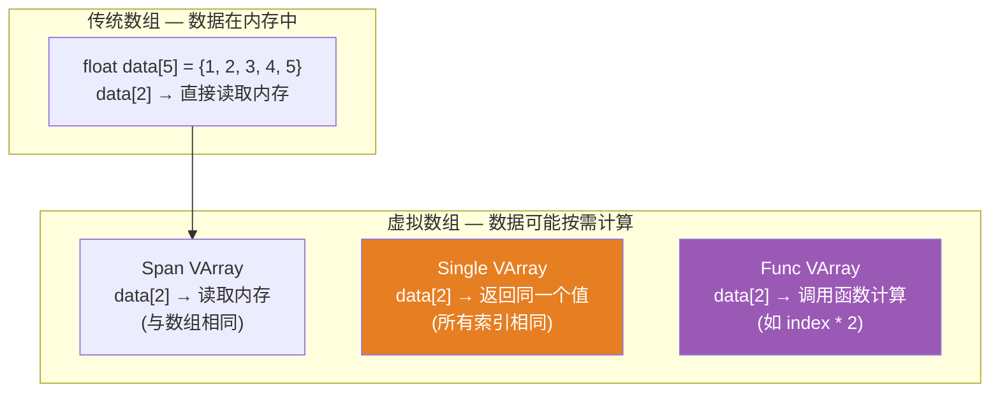
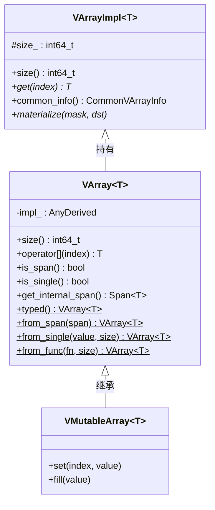
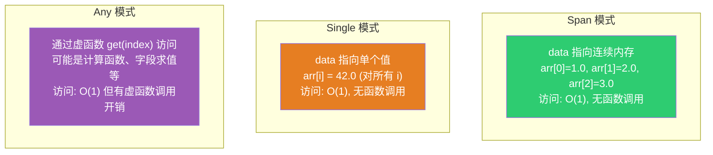
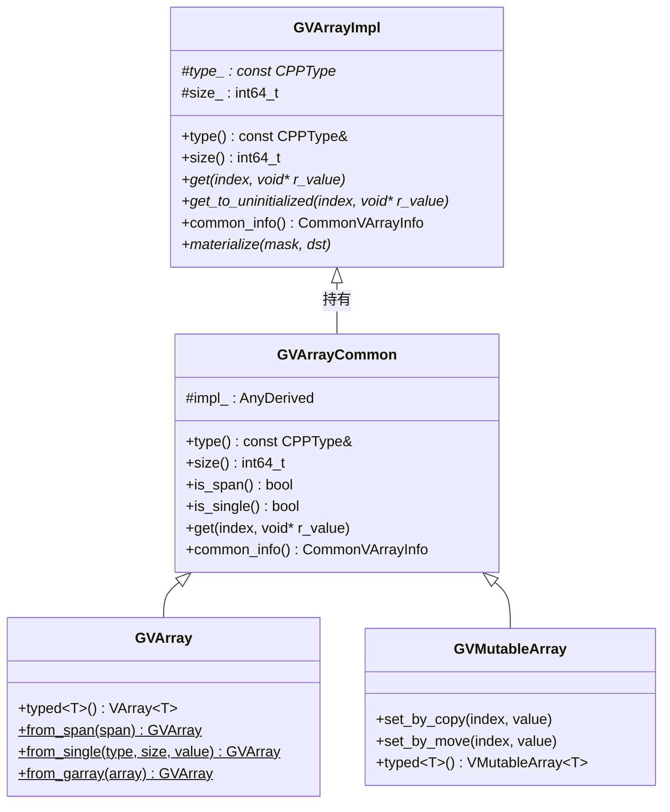
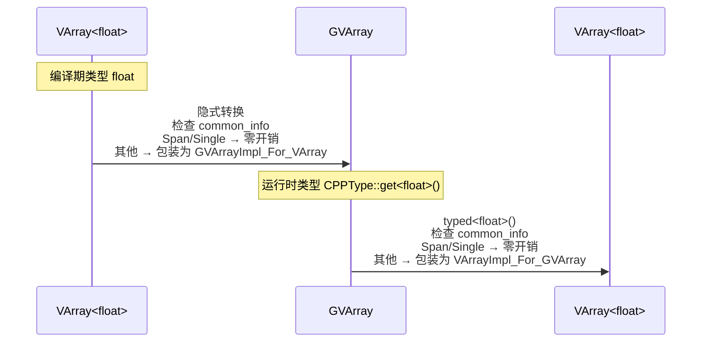
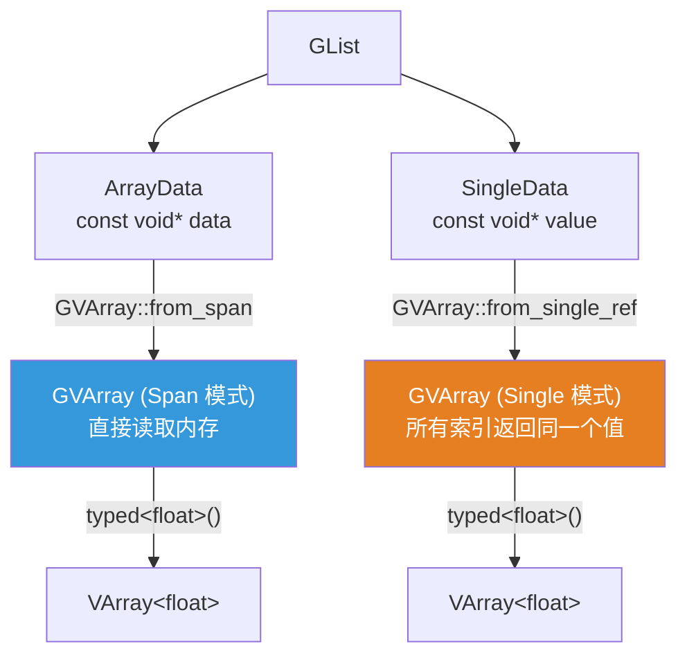
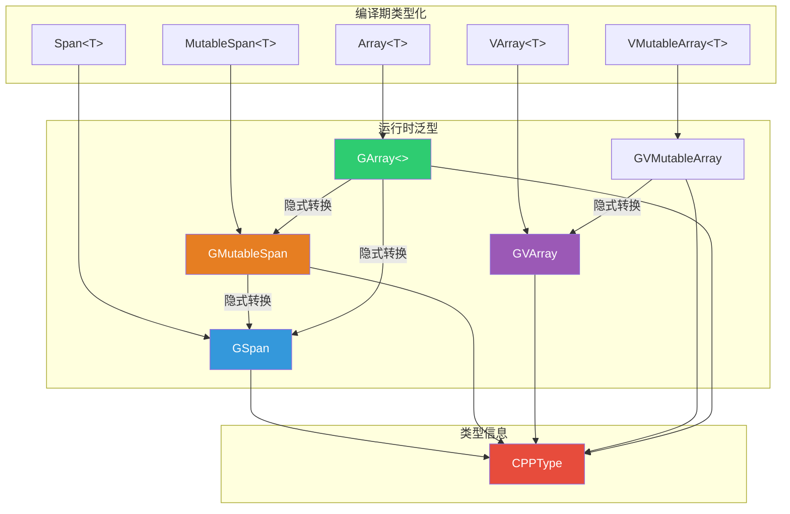

# VArray、GVArray、GArray — 虚拟数组与泛型数组

> 📖 系列文档：[目录](01-列表系统架构与核心数据结构.md) | [上一篇](14-GSpan与GPointer泛型视图.md) | [下一篇](01-列表系统架构与核心数据结构.md)
> 源码文件：[BLI_virtual_array.hh](../../source/blender/blenlib/BLI_virtual_array.hh)、[BLI_generic_virtual_array.hh](../../source/blender/blenlib/BLI_generic_virtual_array.hh)、[BLI_generic_array.hh](../../source/blender/blenlib/BLI_generic_array.hh)

---

## 目录

1. [VArray 是什么？为什么叫"虚拟"？](#1-varray-是什么为什么叫虚拟)
2. [VArray\<T\> — 类型化虚拟数组](#2-varrayt--类型化虚拟数组)
3. [GVArray — 泛型虚拟数组](#3-gvarray--泛型虚拟数组)
4. [VArray 与 GVArray 的互转](#4-varray-与-gvarray-的互转)
5. [GArray\<\> — 泛型动态数组](#5-garray--泛型动态数组)
6. [在列表系统中的应用](#6-在列表系统中的应用)

---

## 1. VArray 是什么？为什么叫"虚拟"？

**虚拟数组（Virtual Array）** 是一个抽象接口，它**表现得像数组**（可以通过索引访问元素），但**数据不一定存储在内存中**。



**为什么需要虚拟数组？**

1. **避免不必要的计算**：如果函数只需要访问几个元素，虚拟数组可以按需计算，而不是先计算整个数组
2. **统一接口**：调用者不需要知道数据是连续内存、单个值还是计算函数
3. **性能优化**：虚拟数组可以告诉调用者"我是连续内存"或"我是单值"，调用者可以针对这些情况优化

---

## 2. VArray\<T\> — 类型化虚拟数组

### 类层次



### 三种内部存储模式

`VArray` 通过 `CommonVArrayInfo` 告诉调用者数据的布局方式：

```cpp
struct CommonVArrayInfo {
  enum class Type : uint8_t {
    Any,    // 通用模式：通过虚函数逐个访问
    Span,   // 连续内存：可以直接读取
    Single, // 单值：所有索引返回同一个值
  };
  Type type;
  bool may_have_ownership;
  const void *data;
};
```



### 优化：devirtualize

`VArray` 的关键优化是**去虚拟化**——调用者检查 `common_info()`，针对 Span/Single 模式使用更快的访问方式：

```cpp
// 通用访问（慢）
for (int i = 0; i < varray.size(); i++) {
  result[i] = varray[i];  // 虚函数调用
}

// 优化访问（快）
const CommonVArrayInfo info = varray.common_info();
if (info.type == CommonVArrayInfo::Type::Span) {
  Span<float> span(static_cast<const float*>(info.data), varray.size());
  for (int i = 0; i < span.size(); i++) {
    result[i] = span[i];  // 直接内存访问，无虚函数调用
  }
}
else if (info.type == CommonVArrayInfo::Type::Single) {
  float value = *static_cast<const float*>(info.data);
  for (int i = 0; i < varray.size(); i++) {
    result[i] = value;  // 无需读取数组
  }
}
```

> **`materialize()`**：`VArray` 提供了 `materialize` 方法，自动将虚拟数组的数据写入连续内存，内部已经做了上述优化。

### 工厂方法

```cpp
// 从连续内存创建
static VArray<T> from_span(Span<T> span);

// 从单个值创建（所有索引返回同一个值）
static VArray<T> from_single(T value, int64_t size);

// 从计算函数创建
template<typename GetFn> static VArray<T> from_func(GetFn fn, int64_t size);

// 空 VArray
static VArray<T> empty();
```

---

## 3. GVArray — 泛型虚拟数组

`GVArray` 是 `VArray<T>` 的泛型版本，元素类型在运行时通过 `CPPType` 描述。

### 类层次



### 与 VArray\<T\> 的关键区别

| 特性 | `VArray<T>` | `GVArray` |
|------|------------|-----------|
| 元素类型 | 编译期 `T` | 运行时 `CPPType` |
| `get(index)` 返回 | `T`（值） | `void`（写入 `r_value` 指针） |
| `operator[]` 返回 | `T`（值） | 无（需用 `get`） |
| `typed<T>()` | — | 转为 `VArray<T>` |
| 内部存储 | `AnyDerived<VArrayImpl<T>>` | `AnyDerived<GVArrayImpl>` |

### get() 方法 — 泛型值获取

```cpp
void get(int64_t index, void *r_value) const
{
  impl_->get(index, r_value);  // 虚函数调用，将值写入 r_value
}

template<typename T> T get(int64_t index) const
{
  BLI_assert(this->type().is<T>());
  T value{};
  impl_->get(index, &value);
  return value;
}
```

> **`get(index, void*)` vs `get<T>(index)`**：前者是泛型接口（写入指定内存），后者是类型化便捷方法（返回值）。前者用于泛型代码，后者用于已知类型的代码。

### 工厂方法

```cpp
// 从 GSpan 创建
static GVArray from_span(GSpan span);

// 从单个值创建
static GVArray from_single(const CPPType &type, int64_t size, const void *value);

// 从 GArray 创建（共享所有权）
static GVArray from_garray(GArray<> array);

// 从计算函数创建
template<typename GetToUninitFn>
static GVArray from_func(const CPPType &type, int64_t size, GetToUninitFn &&fn);

// 空 GVArray
static GVArray from_empty(const CPPType &type);
```

> **`from_garray` vs `from_span`**：`from_span` 不拥有数据（数据可能被其他代码释放），`from_garray` 拥有数据（`GArray` 的生命周期由 `GVArray` 管理）。

---

## 4. VArray 与 GVArray 的互转

`VArray<T>` 和 `GVArray` 可以互相转换，但转换不是零开销的——需要创建适配器。



### VArray → GVArray（隐式转换）

```cpp
template<typename T> GVArray::GVArray(VArray<T> &&varray)
{
  const CommonVArrayInfo info = varray.common_info();
  if (info.type == CommonVArrayInfo::Type::Single) {
    // 单值模式：直接创建 GVArray（零开销）
    *this = GVArray::from_single(CPPType::get<T>(), varray.size(), info.data);
    return;
  }
  if (info.type == CommonVArrayInfo::Type::Span && !info.may_have_ownership) {
    // 连续内存 + 无所有权：直接创建 GVArray（零开销）
    *this = GVArray::from_span(GSpan(CPPType::get<T>(), info.data, varray.size()));
    return;
  }
  // 其他情况：需要适配器（有开销）
  *this = GVArray::from<GVArrayImpl_For_VArray<T>>(std::move(varray));
}
```

### GVArray → VArray（typed\<T\>()）

```cpp
template<typename T> VArray<T> GVArray::typed() const
{
  const CommonVArrayInfo info = this->common_info();
  if (info.type == CommonVArrayInfo::Type::Single) {
    return VArray<T>::from_single(*static_cast<const T *>(info.data), this->size());
  }
  if (info.type == CommonVArrayInfo::Type::Span && !info.may_have_ownership) {
    return VArray<T>::from_span(Span<T>(static_cast<const T *>(info.data), this->size()));
  }
  // 其他情况：需要适配器
  return VArray<T>::template from<VArrayImpl_For_GVArray<T>>(*this);
}
```

> **零开销转换条件**：当 `VArray` 内部是 Span 或 Single 模式时，可以零开销转换——只需提取 `data` 指针和 `size`，不需要适配器。其他情况需要创建适配器对象，有额外开销。

---

## 5. GArray\<\> — 泛型动态数组

`GArray<>` 是 `Array<T>` 的泛型版本，拥有数据的所有权。

### 与 GSpan 的区别

| 特性 | `GSpan` | `GArray<>` |
|------|---------|-----------|
| 所有权 | 不拥有数据（视图） | 拥有数据（分配/释放） |
| 可复制 | 浅拷贝（共享数据） | 深拷贝（复制数据） |
| 大小可变 | 不可变 | 可变（`reinitialize`） |
| 析构行为 | 无 | `destruct_n` + 释放内存 |
| 隐式转换为 GSpan | ✅ | ✅ |

### 数据成员

```cpp
template<typename Allocator = GuardedAllocator>
class GArray {
 protected:
  const CPPType *type_ = nullptr;
  void *data_ = nullptr;
  int64_t size_ = 0;
  BLI_NO_UNIQUE_ADDRESS Allocator allocator_;
};
```

> **`BLI_NO_UNIQUE_ADDRESS`**：C++20 属性 `[[no_unique_address]]`，告诉编译器 `Allocator` 可以与其他成员共享地址。当 `Allocator` 是空类时（如 `GuardedAllocator`），不占用额外内存。

> **`Allocator = GuardedAllocator`**：默认使用 Blender 的内存守护分配器，所有分配都会出现在内存泄漏报告中。`GArray<>` 等价于 `GArray<GuardedAllocator>`。

### 生命周期管理

```cpp
// 构造：分配内存 + 默认构造
GArray(const CPPType &type, int64_t size)
    : GArray(type, size, NoInitialization{})
{
  type_->default_construct_n(data_, size_);  // 逐个默认构造
}

// 构造：分配内存 + 不初始化
GArray(const CPPType &type, int64_t size, NoInitialization)
{
  size_ = size;
  data_ = this->allocate(size_);
}

// 析构：逐个析构 + 释放内存
~GArray()
{
  if (data_ != nullptr) {
    type_->destruct_n(data_, size_);  // 逐个析构
    this->deallocate(data_);          // 释放内存
  }
}
```

> **析构顺序**：先 `destruct_n`（调用每个元素的析构函数），再 `deallocate`（释放内存）。顺序不能反——如果先释放内存，`destruct_n` 就在访问已释放的内存。

### 隐式转换为 GSpan/GMutableSpan

```cpp
operator GSpan() const
{
  return GSpan(type_, data_, size_);
}

operator GMutableSpan()
{
  return GMutableSpan(type_, data_, size_);
}
```

> **`const GArray` → `GSpan`（只读），非 const `GArray` → `GMutableSpan`（可变）**：这是自然的——const 对象应该只提供只读视图。

---

## 6. 在列表系统中的应用

### GList 使用 GVArray

`GList` 的 `varray()` 方法返回 `GVArray`，将列表数据作为虚拟数组暴露：

```cpp
GVArray GList::varray() const
{
  return std::visit(
      [&](auto &&data) -> GVArray {
        using T = std::decay_t<decltype(data)>;
        if constexpr (std::is_same_v<T, ArrayData>) {
          if (data.sharing_info && data.sharing_info->is_mutable()) {
            // 可变数据 → Span 模式
            return GVArray::from_span(GSpan(cpp_type_, data.data, size_));
          }
          // 不可变数据 → Span 模式（只读）
          return GVArray::from_span(GSpan(cpp_type_, data.data, size_));
        }
        if constexpr (std::is_same_v<T, SingleData>) {
          // 单值 → Single 模式
          return GVArray::from_single_ref(cpp_type_, size_, data.value);
        }
      }, data_);
}
```



### List\<T\> 使用 VArray\<T\>

```cpp
template<typename T> VArray<T> List<T>::varray() const
{
  return list_.varray().template typed<T>();  // GVArray → VArray<T>
}
```

### GList::from_garray 使用 GArray

```cpp
GListPtr GList::from_garray(GArray<> array)
{
  auto *sharable_data = new ImplicitSharedValue<GArray<>>(std::move(array));
  ArrayData array_data;
  array_data.data = sharable_data->data.data();
  array_data.sharing_info = ImplicitSharingPtr<>(sharable_data);
  return GList::create(array.data().type(), std::move(array_data), array.data().size());
}
```

### Closure to List 使用 GArray

```cpp
// 快速路径：所有闭包结果都是单值
GArray<> array(type, count, NoInitialization());
threading::parallel_for(IndexRange(count), 128, [&](const IndexRange range) {
  for (const int list_i : range) {
    void *closure_result = const_cast<void *>(values[list_i].get_single_ptr_raw());
    type.move_construct(closure_result, array[list_i]);
  }
});
params.set_output(identifier, GList::from_garray(std::move(array)));
```

### GVArray::from_garray — 共享所有权

```cpp
static GVArray from_garray(GArray<> array);
```

> **`from_garray` 的特殊之处**：`GArray<>` 拥有数据所有权，`GVArray` 需要保持数据存活。内部会创建一个适配器，持有 `GArray<>` 的共享指针，确保数据在 `GVArray` 存活期间不被释放。

---

## 附录：类关系总览


