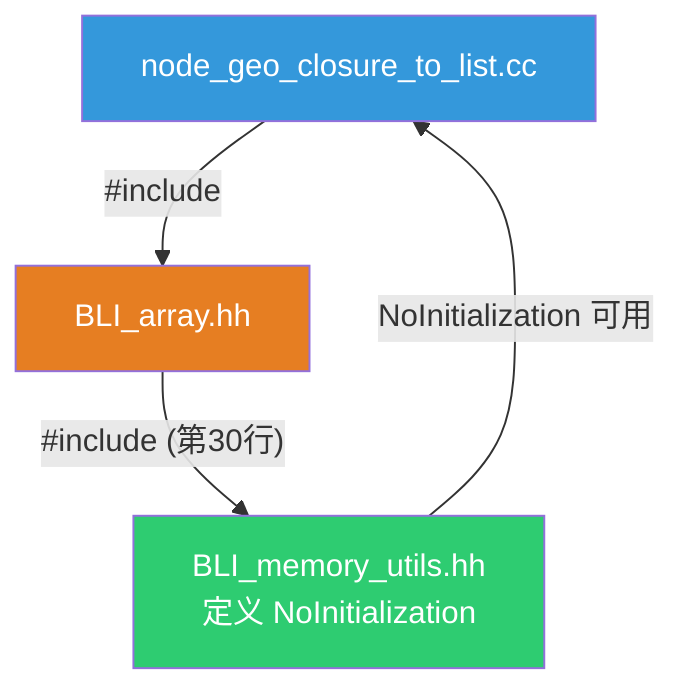
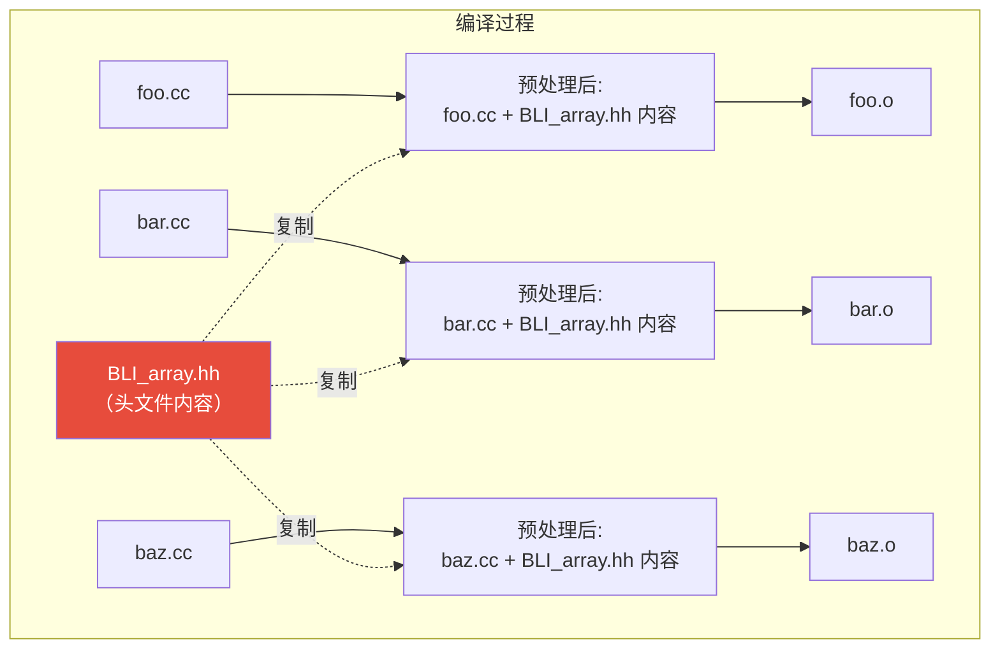
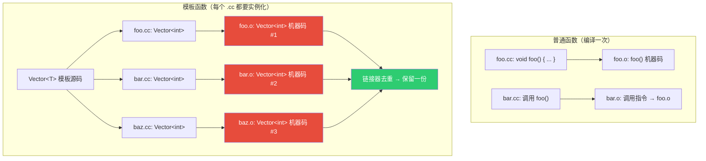
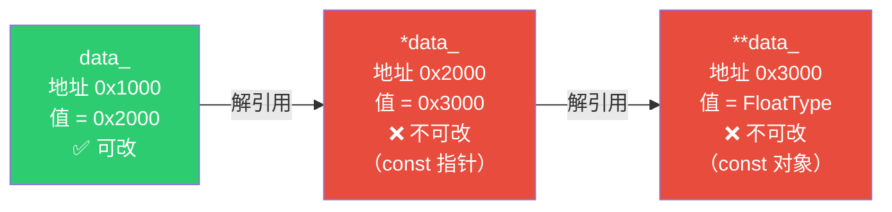
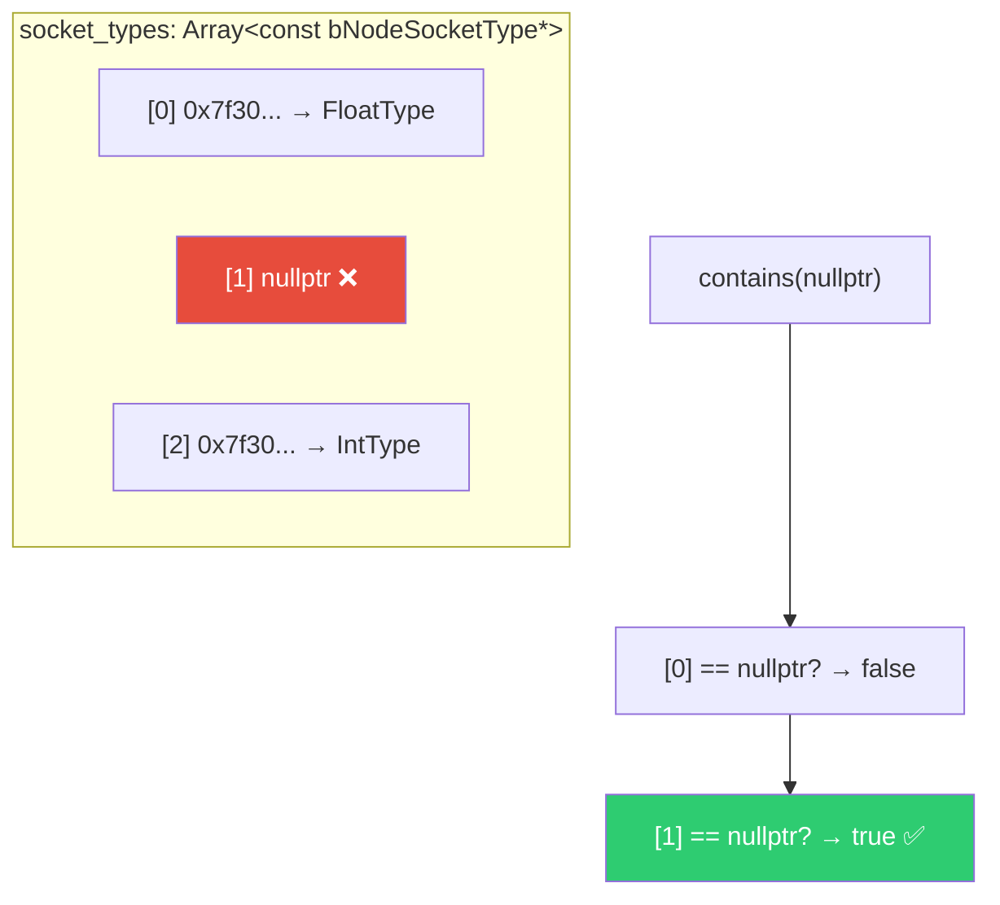
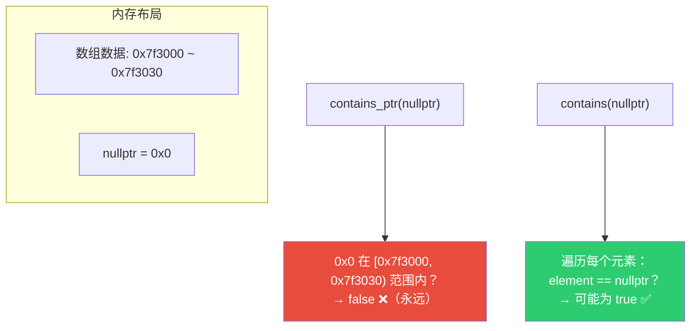
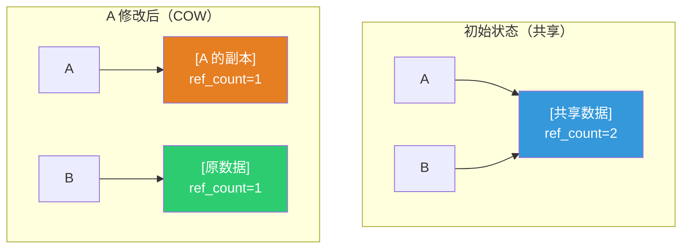

# C++ 编译模型与指针详解

> 本文档整理自 [09-ClosureToList节点.md](09-ClosureToList节点.md) 中关于 C++ 编译模型和指针的扩展讨论。

---

## 目录

- [1. C++ 编译模型](#1-c-编译模型)
  - [1.1 #include 是文本替换](#11-include-是文本替换)
  - [1.2 传递性包含](#12-传递性包含)
  - [1.3 每个翻译单元独立编译](#13-每个翻译单元独立编译)
  - [1.4 头文件保护的作用范围](#14-头文件保护的作用范围)
  - [1.5 模板实例化仍然重复](#15-模板实例化仍然重复)
  - [1.6 模块能加速几十倍吗？](#16-模块能加速几十倍吗)
  - [1.7 Blender 实际用的加速方案](#17-blender-实际用的加速方案)
- [2. C++ 指针与 const 详解](#2-c-指针与-const-详解)
  - [2.1 从右往左读规则](#21-从右往左读规则)
  - [2.2 const 修饰什么？](#22-const-修饰什么)
  - [2.3 非指针类型：const 放哪都一样](#23-非指针类型const-放哪都一样)
  - [2.4 一层指针的四种组合](#24-一层指针的四种组合)
  - [2.5 记忆方法](#25-记忆方法)
  - [2.6 两层指针详解](#26-两层指针详解)
  - [2.7 const 能放在哪些位置](#27-const-能放在哪些位置)
  - [2.8 Span 的只读语义与 const T *](#28-span-的只读语义与-const-t-)
- [3. Span 的 contains vs contains_ptr](#3-span-的-contains-vs-contains_ptr)
  - [3.1 contains — 值比较](#31-contains--值比较)
  - [3.2 contains_ptr — 地址检查](#32-contains_ptr--地址检查)
  - [3.3 为什么 contains(nullptr) 能查空指针](#33-为什么-containsnullptr-能查空指针)
  - [3.4 为什么不用 contains_ptr(nullptr)](#34-为什么不用-contains_ptrnullptr)
- [4. *this 与 range-based for](#4-this-与-range-based-for)
  - [4.1 this 和 *this 是什么](#41-this-和-this-是什么)
  - [4.2 range-based for 的展开](#42-range-based-for-的展开)
- [5. COW（写时复制）](#5-cow写时复制)
  - [5.1 什么是 COW](#51-什么是-cow)
  - [5.2 GListPtr 中的 COW](#52-glistptr-中的-cow)
  - [5.3 为什么闭包不需要 COW](#53-为什么闭包不需要-cow)

---

## 1. C++ 编译模型

### 1.1 #include 是文本替换

C++ 的 `#include` 是**预处理阶段**的文本替换——预处理器把被包含文件的内容原样复制到 `#include` 所在的位置。


### 1.2 传递性包含

`BLI_array.hh` 第30行有 `#include "BLI_memory_utils.hh"`，所以任何包含了 `BLI_array.hh` 的文件，都间接包含了 `BLI_memory_utils.hh`。



这叫**传递性包含**。虽然能工作，但好的 C++ 实践是：**每个文件显式包含自己用到的所有头文件**，不依赖传递性。因为：
1. 传递性包含可能在未来版本中被移除（头文件重构）
2. 阅读代码时看不出依赖关系

不过 Blender 代码库中这种情况很常见，因为 `BLI_array.hh` 和 `NoInitialization` 的关系非常紧密（`Array` 构造函数直接接受 `NoInitialization` 参数），不太可能被拆开。

### 1.3 每个翻译单元独立编译

C++ 的编译模型是**每个 .cc 文件（翻译单元）独立编译**。`#include` 是预处理阶段的文本替换——100 个 .cc 文件包含同一个 .hh，那个 .hh 的内容就被处理 100 次。



### 1.4 头文件保护的作用范围

**头文件保护（`#pragma once`）** 只防止**同一个 .cc 文件内**重复包含：

```cpp
// foo.cc
#include "BLI_array.hh"       // 第一次包含 → 处理
#include "BLI_array.hh"       // 第二次包含 → 跳过（#pragma once）
```

但**不同 .cc 文件**之间，头文件每次都会被处理：

```cpp
// foo.cc: #include "BLI_array.hh" → 处理一次
// bar.cc: #include "BLI_array.hh" → 再处理一次
// baz.cc: #include "BLI_array.hh" → 再处理一次
```

### 1.5 模板实例化仍然重复

模板实例化 = 编译器从模板生成具体代码。比如 `Vector<int>` — 编译器把 `Vector<T>` 中所有 `T` 替换成 `int`，生成 `Vector<int>::push_back()` 等具体函数的机器码。

**普通函数 vs 模板函数**：

| 类型 | 示例 | 编译方式 |
|------|------|---------|
| 普通函数 | `void foo()` | 编译一次，生成机器码，其他 .cc 直接调用 |
| 模板函数 | `Vector<T>::push_back()` | 不能直接编译（T 未知），必须等用户写 `Vector<int>` 时才生成机器码 |

所以每个 .cc 文件写 `Vector<int>` 时，编译器都要重新生成一遍机器码：

```
foo.cc 用了 Vector<int> → 生成 Vector<int> 机器码 → foo.o
bar.cc 用了 Vector<int> → 再生成一遍          → bar.o
baz.cc 用了 Vector<int> → 又生成一遍          → baz.o
```

链接器最后只保留一份（去重），但**编译时的工作已经做了三遍**。



**模块能帮什么？** 模块让编译器不需要重新解析模板源码（语法分析省了），但生成机器码这一步仍然每个 .cc 文件都要做。Blender 大量使用模板（`Array<T>`、`Span<T>`、`Vector<T>`、`Map<K,V>` 等），这是编译慢的另一个重要原因。

### 1.6 模块能加速几十倍吗？

不能。头文件重复是编译慢的重要原因之一，但不是唯一原因：

| 瓶颈 | 占比（典型大型项目） | 模块能优化？ |
|------|---------------------|-------------|
| 预处理（头文件展开） | ~15% | ✅ 大幅减少 |
| 编译+优化（含模板实例化） | ~50% | ⚠️ 部分减少（模板仍重复实例化） |
| 汇编 | ~10% | ❌ 无影响 |
| 链接 | ~25% | ❌ 无影响 |

业界实测，从传统头文件迁移到 C++20 模块，编译速度提升约 **2-5 倍**，不是几十倍。

### 1.7 Blender 实际用的加速方案

| 方案 | 原理 | 效果 |
|------|------|------|
| **Unity Build** | 把多个 .cc 合并成一个编译，头文件只处理一次 | 最有效，可减少 50%+ 编译时间 |
| **ccache** | 缓存编译结果，未修改的文件直接用缓存 | 增量编译极快 |
| **Ninja** | 比 Make 更快的构建系统，更好的并行调度 | 全量编译提速 |
| **预编译头文件（PCH）** | 把常用头文件预编译为二进制 | 减少预处理时间 |

---

## 2. C++ 指针与 const 详解

### 2.1 从右往左读规则

从变量名开始，往左读：`*` 表示"指针"，`const` 表示"不可修改"。

### 2.2 const 修饰什么？

一般规则是 `const` 修饰它**左边**的东西。但当 `const` 出现在最前面（左边没有东西）时，它修饰**右边**的东西。所以 `const int` 和 `int const` 完全等价。

```cpp
const int * p;    // const 修饰 int（左边没东西，修饰右边）
int const * p;    // const 修饰 int（修饰左边）
// 两者完全等价：指向 const int 的指针
```

### 2.3 非指针类型：const 放哪都一样

没有指针时，`const` 放前面放后面都一样，因为只有一个东西可修饰：

```cpp
const int x;    // x 不可改
int const x;    // x 不可改（完全等价）

const float y;  // y 不可改
float const y;  // y 不可改（完全等价）
```

**指针特殊**是因为指针涉及两个东西——指针本身和指向的值——`const` 可以分别修饰它们。非指针类型只有一个东西，所以 `const` 只有一种效果。

### 2.4 一层指针的四种组合

```cpp
int * p;            // p 是指针，指向 int
                    // p 可以改（指向别处），*p 可以改（修改指向的值）

const int * p;      // p 是指针，指向 const int
                    // p 可以改（指向别处），*p 不能改（指向的值不可修改）

int * const p;      // p 是 const 指针，指向 int
                    // p 不能改（不能指向别处），*p 可以改

const int * const p;// p 是 const 指针，指向 const int
                    // p 不能改，*p 也不能改
```

| 声明 | 等价写法 | 指针可改？ | 值可改？ |
|------|---------|-----------|---------|
| `int * p` | — | ✅ | ✅ |
| `const int * p` | `int const * p` | ✅ | ❌ |
| `int * const p` | — | ❌ | ✅ |
| `const int * const p` | `int const * const p` | ❌ | ❌ |

### 2.5 记忆方法

- `const` 在 `*` **左边** → 修饰指向的**值**（值不可改）
- `const` 在 `*` **右边** → 修饰**指针**本身（指针不可改）

```
const int *        → const 在 * 左边 → 值不可改
int * const        → const 在 * 右边 → 指针不可改
const int * const  → 两边都有 → 都不可改
```

### 2.6 两层指针详解

以 `Span<const bNodeSocketType *>` 的 `data_` 成员为例：

```cpp
T = const bNodeSocketType *           // T 是"指向 const 对象的指针"
const T = const bNodeSocketType * const  // const 修饰 T 本身，指针变成不可改
const T * = const bNodeSocketType * const *  // 再加一层指针
```

所以 `const T *data_` 的类型是 `const bNodeSocketType * const *data_`。

从右往左逐层读：

| 表达式 | 类型 | 含义 |
|--------|------|------|
| `data_` | `const bNodeSocketType * const *` | 指针（可改） |
| `*data_` | `const bNodeSocketType * const` | const 指针（不可改——不能让这个指针指向别处） |
| `**data_` | `const bNodeSocketType` | const 对象（不可改——不能修改对象内容） |

用具体地址举例：

```
地址 0x1000: data_  = 0x2000       （data_ 存储地址 0x2000）
地址 0x2000: *data_ = 0x3000       （0x2000 处存储地址 0x3000）
地址 0x3000: **data_ = FloatType   （0x3000 处存储实际对象）
```

- `data_ = 0x2001` ✅ 可以改（让 data_ 指向别处）
- `*data_ = 0x3001` ❌ 不可改（const 修饰了这个指针本身）
- `**data_.field = 0` ❌ 不可改（const 修饰了对象）



### 2.7 const 能放在哪些位置

以两层指针为例，`const` 可以出现在多个位置：

```cpp
const bNodeSocketType * const * const p;
// ↑1                  ↑2       ↑3
// 位置1: 修饰 bNodeSocketType → 对象不可改 (**p 不可改)
// 位置2: 修饰第一个 *  → 内层指针不可改 (*p 不可改)
// 位置3: 修饰第二个 *  → 外层指针不可改 (p 不可改)
```

每个 `*` 的左右两边各可以放一个 `const`，加上最前面一个。两层指针最多 3 个 `const`，分别控制 `**p`、`*p`、`p` 是否可改。

### 2.8 Span 的只读语义与 const T *

`Span<T>` 的 `data_` 成员是 `const T *`——指向 const 的指针。当 `T` 本身是指针时，`const T *` 意味着"指向 const 指针的指针"，所以 `*data_`（数组中的指针元素）不可修改。这是 `Span` 的只读语义——你不能通过 `Span` 修改数组内容，只能读取。

**`T` 是不是主要是指针？** 不一定。`T` 是模板参数，可以是任何类型：

- `Span<const bNodeSocketType *>` — T 是指针，存储多个类型信息
- `Span<SocketValueVariant>` — T 不是指针，存储值
- `Span<int>` — T 不是指针，存储整数
- `Span<float3>` — T 不是指针，存储向量

当 `T` 是指针时，`Span<T>` 的内存布局就是**指针数组**——连续存储的指针，每个指针指向实际对象。`contains(nullptr)` 就是检查指针数组中有没有空指针。

---

## 3. Span 的 contains vs contains_ptr

源码位置：[BLI_span.hh](../../source/blender/blenlib/BLI_span.hh) 第 277~298 行

### 3.1 contains — 值比较

```cpp
/**
 * Does a linear search to see of the value is in the array.
 * Returns true if it is, otherwise false.
 */
constexpr bool contains(const T &value) const
{
  for (const T &element : *this) {
    if (element == value) {
      return true;
    }
  }
  return false;
}
```

> 注释翻译：*"Does a linear search to see if the value is in the array."* — 线性搜索，检查值是否在数组中。

- 时间复杂度：O(n)
- 逐个比较元素值是否等于 `value`

### 3.2 contains_ptr — 地址检查

```cpp
/**
 * Does a constant time check to see if the pointer points to a value in the referenced array.
 * Return true if it is, otherwise false.
 */
constexpr bool contains_ptr(const T *ptr) const
{
  return (this->begin() <= ptr) && (ptr < this->end());
}
```

> 注释翻译：*"Does a constant time check to see if the pointer points to a value in the referenced array."* — 常数时间检查，判断指针是否指向数组中的某个值。

- 时间复杂度：O(1)
- 检查指针地址是否落在数组的内存范围内

### 3.3 为什么 contains(nullptr) 能查空指针

`socket_types` 是 `Array<const bNodeSocketType *>`——元素类型 `T` 是**指针**。`as_span()` 返回 `Span<const bNodeSocketType *>`。`contains(nullptr)` 检查数组中是否有任何指针等于 `nullptr`。

这完全合法：`T = const bNodeSocketType *`，`value = nullptr`，比较 `element == nullptr` 就是检查"这个指针是否为空"。



### 3.4 为什么不用 contains_ptr(nullptr)

两个方法做的是完全不同的事：

| 方法 | 问题 | 时间复杂度 | 含义 |
|------|------|-----------|------|
| `contains(value)` | "数组中有没有值等于 `value` 的元素？" | O(n) 线性搜索 | **值比较** |
| `contains_ptr(ptr)` | "内存地址 `ptr` 是否落在数组的内存范围内？" | O(1) 常数时间 | **地址检查** |

`contains_ptr(nullptr)` 永远返回 `false`——因为 `nullptr`（地址 0）不可能落在数组的数据内存范围内。这不是我们想要的！我们要的是"数组中有没有空指针"，不是"空地址是否在数组范围内"。



---

## 4. *this 与 range-based for

### 4.1 this 和 *this 是什么

`this` 是 C++ 成员函数中的隐式指针，指向调用该函数的对象本身。`*this` 是对指针的解引用，得到**对象本身**（引用）。

在 `Span<T>::contains` 中，`*this` 就是那个 `Span<T>` 对象。`for (const T &element : *this)` 等价于 `for (const T &element : span)`——遍历 Span 中的所有元素。

```cpp
Span<int> span = {1, 2, 3};
span.contains(2);
// 在 contains 内部：
// this = &span（指向 span 的指针）
// *this = span（span 对象本身）
// for (const int &element : *this) → 遍历 span 的元素 [1, 2, 3]
```

**为什么用 `*this` 而不是直接用成员变量？** 因为 range-based for 循环需要一个可迭代的对象，而 `*this` 就是 `Span<T>` 本身，它有 `begin()` 和 `end()` 方法。

### 4.2 range-based for 的展开

有 `begin()` 和 `end()` 就够了吗？不完全够。C++ range-based for 循环 `for (auto x : obj)` 实际展开为：

```cpp
auto && __range = obj;
auto __begin = __range.begin();   // 或 begin(__range) via ADL
auto __end = __range.end();       // 或 end(__range) via ADL
for (; __begin != __end; ++__begin) {
  auto x = *__begin;
  // 循环体
}
```

所以 `begin()` 和 `end()` 返回的对象还必须支持三个操作：

| 操作 | 含义 | `Span<T>::iterator` 的实现 |
|------|------|---------------------------|
| `operator!=` | 判断是否到达末尾 | 比较内部指针 |
| `operator++` | 移动到下一个元素 | 指针 +1 |
| `operator*` | 解引用获取当前元素 | 返回 `T&` |

`Span<T>` 的迭代器就是裸指针 `T*`，天然支持这三个操作。对于更复杂的容器（如 `Map`、`VectorSet`），迭代器是自定义类，需要手动实现这些操作符。

---

## 5. COW（写时复制）

### 5.1 什么是 COW

COW（Copy-On-Write，写时复制）是一种优化策略：多个对象**共享**同一份数据，只有当某个对象需要**修改**时才真正复制。

```
初始状态：A → [共享数据] ← B    （共享，零拷贝）
A 修改时：A → [A 的副本]        （A 写时复制）
           B → [原数据]          （B 不受影响）
```



### 5.2 GListPtr 中的 COW

在 `GListPtr` 中，`get_for_write()` 就是 COW 的实现——检查引用计数，如果 >1 说明有别人也在共享这份数据，先复制一份再返回可写引用；如果 =1 说明只有自己在用，直接修改即可。

```cpp
GList &GListPtr::get_for_write()
{
  if (data_->strong_users() > 1) {
    // 有别人在共享 → 复制一份
    data_ = data_->copy();
  }
  return const_cast<GList &>(*data_);
}
```

### 5.3 为什么闭包不需要 COW

闭包创建后就是**不可变的**——你不会"修改"一个闭包的内部状态，只会创建新的闭包或销毁旧的。没有修改操作，自然不需要写时复制。`ClosurePtr` 只需要共享读取和引用计数销毁，`ImplicitSharingPtr` 的默认行为就足够了。

这也是为什么 `ClosurePtr` 是简单的 `using` 别名，而 `GListPtr` 是独立的类——`GListPtr` 需要自定义 `operator->` 返回 `const GList*`（只读），强制通过 `get_for_write()` 修改（COW）；而 `ClosurePtr` 不需要这些保护。

---

> 📖 返回：[09-ClosureToList节点.md](09-ClosureToList节点.md) | [目录](01-列表系统架构与核心数据结构.md)
