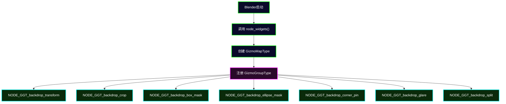
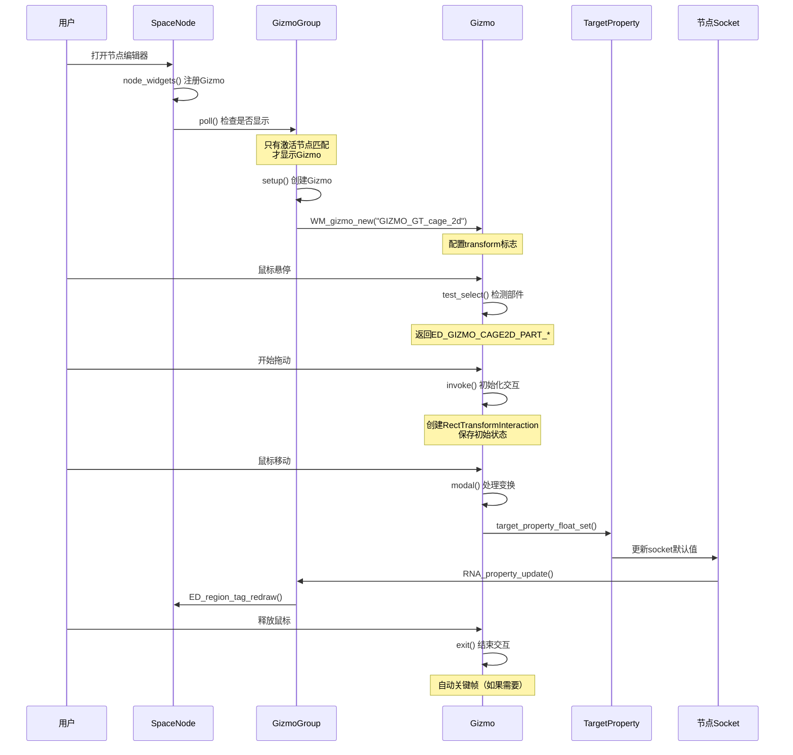

# 01-合成器Gizmo系统概述与架构

## 目录

- [1. 概述](#概述)
- [2. 注册系统](#注册系统)
- [3. 基础Gizmo类型](#基础gizmo类型)
- [4. 变换标志系统](#变换标志系统)
- [5. Cage2D部件系统](#cage2d部件系统)
- [6. 坐标空间系统](#坐标空间系统)
- [7. 系统架构流程](#系统架构流程)
- [8. 核心数据结构](#核心数据结构)

---

## 概述

Blender合成器（Compositor）的Gizmo系统是一个<span style="color:#00ff00">分层架构</span>，用于在节点编辑器的2D背景区（Backdrop）提供交互式控制。这个系统允许用户通过可视化的手柄（handles）直接操控节点参数，而不需要手动输入数值。

### 核心设计理念

<span style="color:#ff6600">Gizmo（小工具）</span>是Blender中的可视化交互控件，类似于3D视口中的变换手柄。在合成器中，Gizmo提供以下功能：

- <span style="color:#00ffff">直观操作</span>：拖动、缩放、旋转矩形/圆形遮罩
- <span style="color:#00ffff">实时反馈</span>：即时看到参数变化的效果
- <span style="color:#00ffff">精确控制</span>：通过鼠标操作获得亚像素级精度

### Python开发者的类比

如果您熟悉Python的GUI框架（如Tkinter、PyQt），可以这样理解：

| Python GUI | Blender Gizmo | 说明 |
|-----------|---------------|------|
| `Canvas` 或 `QGraphicsView` | `SpaceNode` | 绘制区域 |
| `Widget` 或 `QGraphicsItem` | `wmGizmo` | 可交互对象 |
| `Layout` 或 `QGraphicsScene` | `wmGizmoGroup` | 管理多个Gizmo的容器 |
| `EventFilter` | `modal` 函数 | 处理用户输入 |

---

## 注册系统

### Gizmo注册流程

所有合成器Gizmo都在节点编辑器初始化时注册。注册过程是<span style="color:#ffff00">自动化的</span>，不需要用户干预。

**定义位置**: `source/blender/editors/space_node/space_node.cc:1474-1486`

```cpp
static void node_widgets()
{
  /* 创建空间级别的gizmo映射表 */
  wmGizmoMapType_Params params{SPACE_NODE, RGN_TYPE_WINDOW};
  wmGizmoMapType *gzmap_type = WM_gizmogrouptype_ensure(&params);

  /* 注册各个gizmo组 */
  WM_gizmogrouptype_append_and_link(gzmap_type, NODE_GGT_backdrop_transform);
  WM_gizmogrouptype_append_and_link(gzmap_type, NODE_GGT_backdrop_crop);
  WM_gizmogrouptype_append_and_link(gzmap_type, NODE_GGT_backdrop_glare);
  WM_gizmogrouptype_append_and_link(gzmap_type, NODE_GGT_backdrop_corner_pin);
  WM_gizmogrouptype_append_and_link(gzmap_type, NODE_GGT_backdrop_box_mask);
  WM_gizmogrouptype_append_and_link(gzmap_type, NODE_GGT_backdrop_ellipse_mask);
  WM_gizmogrouptype_append_and_link(gzmap_type, NODE_GGT_backdrop_split);
}
```

### 核心概念解析

#### 1. GizmoMapType（Gizmo映射表类型）

<span style="color:#ff00ff">GizmoMapType</span> 定义了特定空间（如 `SPACE_NODE`）中可用的所有Gizmo类型。它是一个<span style="background:#444">全局注册表</span>，Blender在启动时加载。

**命名解释**：
- `gz` = Gizmo（Blender常用缩写）
- `map` = 映射表（存储多个gizmo类型）
- `type` = 类型（描述而非实例）

**Python类比**：
```python
# GizmoMapType 就像一个全局字典
gizmo_registry = {
    "SPACE_NODE": {
        "backdrop_transform": BackdropTransformGizmo,
        "box_mask": BoxMaskGizmo,
        # ...
    }
}
```

#### 2. GizmoGroupType（Gizmo组类型）

<span style="color:#ff00ff">GizmoGroupType</span> 定义了一组相关的Gizmo如何协作。每个节点类型（如Box Mask）有自己的GizmoGroup。

**命名解释**：
- `group` = 组（一个节点可以有多个gizmo）
- 例如：Corner Pin节点有4个gizmo（每个角落一个）

**Python类比**：
```python
class GizmoGroup:
    def poll(context):
        """决定是否显示此gizmo组"""
        return active_node.type == "BOX_MASK"

    def setup(context):
        """创建gizmo"""
        self.gizmos = [create_gizmo()]

    def refresh(context):
        """更新gizmo状态"""
        pass
```

### 注册流程图



---

## 基础Gizmo类型

Blender提供了两种核心的Gizmo类型用于合成器：

### 1. Cage2D（笼形Gizmo）

**定义位置**: `source/blender/editors/gizmo_library/gizmo_types/cage2d_gizmo.cc:1-1475`

<span style="color:#ffff00">Cage2D</span> 是一个矩形或圆形的"笼子"，围绕在其控制的内容周围。它提供：

- <span style="color:#00ff00">4个角落控制点</span>：从角落缩放
- <span style="color:#00ff00">4个边缘控制点</span>：从边缘单轴缩放
- <span style="color:#00ff00">1个中心控制点</span>：整体平移
- <span style="color:#00ff00">1个旋转控制点</span>：旋转（可选）

**命名解释**：
- `Cage` = 笼子/框架（围绕对象的边界框）
- `2D` = 二维（在平面中操作）

**适用Gizmo**：
- Box Mask
- Ellipse Mask
- Crop
- Backdrop Transform
- Split

### 2. Move3D（移动Gizmo）

<span style="color:#ffff00">Move3D</span> 是一个独立的3D移动手柄，常用于控制单个点。

**定义位置**: `source/blender/editors/gizmo_library/gizmo_types/move_3d_gizmo.cc`

**适用Gizmo**：
- Corner Pin（4个独立的点）
- Glare（Sun Beam位置）

**命名解释**：
- `Move` = 移动（只控制位置）
- `3D` = 三维（虽然用在2D中，但内部是3D向量）

### Cage2D vs Move3D 对比

| 特性 | Cage2D | Move3D |
|------|---------|--------|
| **控制对象** | 整体矩形/圆形 | 单个点 |
| **控制点数量** | 8-10个（集成） | 1个（独立） |
| **支持的变换** | 平移 + 旋转 + 缩放 | 仅平移 |
| **适用场景** | 矩形/圆形遮罩 | 任意四边形（Corner Pin） |
| **代码复杂度** | 高（内置逻辑） | 低（简单拖动） |

---

## 变换标志系统

变换标志定义了Gizmo支持哪些操作。这些标志使用位运算组合。

**定义位置**: `source/blender/editors/include/ED_gizmo_library.hh`

```cpp
enum eGizmoCageTransformFlag {
  ED_GIZMO_CAGE_XFORM_FLAG_TRANSLATE = (1 << 0),      // 平移
  ED_GIZMO_CAGE_XFORM_FLAG_ROTATE = (1 << 1),         // 旋转
  ED_GIZMO_CAGE_XFORM_FLAG_SCALE = (1 << 2),          // 缩放
  ED_GIZMO_CAGE_XFORM_FLAG_SCALE_UNIFORM = (1 << 3),   // 等比缩放
  ED_GIZMO_CAGE_XFORM_FLAG_SCALE_SIGNED = (1 << 4),    // 允许负缩放
};
```

### 位运算解析（Python开发者必读）

Blender使用<span style="color:#ff6600">位运算</span>来组合多个标志，这类似于Python中的位掩码（bitmask）。

**概念图解**：
```
标志位:    b4   b3   b2   b1   b0
            |    |    |    |    |
           Alt  Ctrl Shift(等比) 缩放 平移
```

**代码示例**：
```cpp
// 组合标志：平移 + 旋转 + 缩放
int flags = ED_GIZMO_CAGE_XFORM_FLAG_TRANSLATE |
            ED_GIZMO_CAGE_XFORM_FLAG_ROTATE |
            ED_GIZMO_CAGE_XFORM_FLAG_SCALE;

// 二进制表示：00111b = 0x07
// 检查是否支持缩放
if (flags & ED_GIZMO_CAGE_XFORM_FLAG_SCALE) {
    // 执行缩放逻辑
}
```

**Python等价代码**：
```python
# 位运算符在Python中也存在
TRANSLATE = (1 << 0)  # 0b00001
ROTATE    = (1 << 1)  # 0b00010
SCALE     = (1 << 2)  # 0b00100

flags = TRANSLATE | ROTATE | SCALE  # 0b00111 = 7

# 检查是否支持缩放
if flags & SCALE:
    print("支持缩放")
```

### 各标志详解

#### 1. TRANSLATE（平移）

**标志值**: `1 << 0` = `0x01`

允许用户拖动整个Gizmo（保持大小和旋转不变）。

**示例**：
```cpp
// 只有平移功能
RNA_enum_set(gizmo->ptr, "transform",
    ED_GIZMO_CAGE_XFORM_FLAG_TRANSLATE);
```

#### 2. ROTATE（旋转）

**标志值**: `1 << 1` = `0x02`

允许用户围绕Gizmo中心旋转。

**示例**：
```cpp
// 平移 + 旋转
RNA_enum_set(gizmo->ptr, "transform",
    ED_GIZMO_CAGE_XFORM_FLAG_TRANSLATE |
    ED_GIZMO_CAGE_XFORM_FLAG_ROTATE);
```

**注意**：旋转会在Gizmo顶部显示一个<span style="color:#ff00ff">圆形旋转手柄</span>。

#### 3. SCALE（缩放）

**标志值**: `1 << 2` = `0x04`

允许用户通过角落和边缘控制点缩放Gizmo。

**示例**：
```cpp
// 自由缩放（非等比）
RNA_enum_set(gizmo->ptr, "transform",
    ED_GIZMO_CAGE_XFORM_FLAG_TRANSLATE |
    ED_GIZMO_CAGE_XFORM_FLAG_SCALE);
```

#### 4. SCALE_UNIFORM（等比缩放）

**标志值**: `1 << 3` = `0x08`

强制缩放时保持宽高比。

**示例**：
```cpp
// 平移 + 等比缩放（Backdrop Transform使用）
RNA_enum_set(wwrapper->gizmo->ptr, "transform",
    ED_GIZMO_CAGE_XFORM_FLAG_TRANSLATE |
    ED_GIZMO_CAGE_XFORM_FLAG_SCALE_UNIFORM);
```

**实际效果**：
- 拖动角落时，同时缩放宽度和高度
- 拖动边缘时，同时缩放两个方向（从中心）

#### 5. SCALE_SIGNED（允许负缩放）

**标志值**: `1 << 4` = `0x10`

允许缩放为负值（翻转）。

**示例**：
```cpp
// 允许翻转
RNA_enum_set(gizmo->ptr, "transform",
    ED_GIZMO_CAGE_XFORM_FLAG_SCALE |
    ED_GIZMO_CAGE_XFORM_FLAG_SCALE_SIGNED);
```

**注意**：合成器Gizmo通常不使用此标志（不需要翻转）。

### 标志组合示例

| Gizmo类型 | 标志组合 | 十六进制 | 说明 |
|-----------|----------|----------|------|
| Box Mask | `TRANSLATE \| ROTATE \| SCALE` | `0x07` | 平移+旋转+自由缩放 |
| Ellipse Mask | `TRANSLATE \| ROTATE \| SCALE` | `0x07` | 同Box Mask |
| Crop | `TRANSLATE \| SCALE` | `0x05` | 平移+自由缩放，无旋转 |
| Transform | `TRANSLATE \| SCALE_UNIFORM` | `0x09` | 平移+等比缩放 |
| Split | `TRANSLATE \| ROTATE` | `0x03` | 平移+旋转 |

---

## Cage2D部件系统

Cage2D Gizmo将不同的控制区域划分为"部件"（parts），每个部件对应不同的操作。

**定义位置**: `source/blender/editors/include/ED_gizmo_library.hh`

```cpp
enum eGizmoCage2DPart {
  ED_GIZMO_CAGE2D_PART_TRANSLATE = 0,

  ED_GIZMO_CAGE2D_PART_SCALE,
  /* Edges */
  ED_GIZMO_CAGE2D_PART_SCALE_MIN_X,
  ED_GIZMO_CAGE2D_PART_SCALE_MAX_X,
  ED_GIZMO_CAGE2D_PART_SCALE_MIN_Y,
  ED_GIZMO_CAGE2D_PART_SCALE_MAX_Y,
  /* Corners */
  ED_GIZMO_CAGE2D_PART_SCALE_MIN_X_MIN_Y,
  ED_GIZMO_CAGE2D_PART_SCALE_MIN_X_MAX_Y,
  ED_GIZMO_CAGE2D_PART_SCALE_MAX_X_MIN_Y,
  ED_GIZMO_CAGE2D_PART_SCALE_MAX_X_MAX_Y,

  ED_GIZMO_CAGE2D_PART_ROTATE,
};
```

### 部件图示

```
┌─────────────────────────────────────┐
│  MIN_X_MAX_Y       MAX_X_MAX_Y    │
│        ●----------------●         │
│        |                |         │
│  MIN_Y ●                ● MAX_Y  │
│        |                |         │
│        ●----------------●         │
│  MIN_X_MIN_Y       MAX_X_MIN_Y    │
│                                     │
│              ○ ROTATE             │  ← 旋转手柄（顶部外侧）
└─────────────────────────────────────┘
          TRANSLATE (整个矩形内部)
```

### 各部件详解

#### 1. TRANSLATE（平移部件）

**枚举值**: `0`

<span style="color:#00ffff">整个矩形内部</span>都是平移区域。用户点击内部任何位置并拖动，都会移动整个Gizmo。

**代码逻辑**: `cage2d_gizmo.cc:1209-1216`

```cpp
if (gz->highlight_part == ED_GIZMO_CAGE2D_PART_TRANSLATE) {
  /* 防止调整大小改变位置 */
  copy_m4_m4(gz->matrix_offset, data->orig_matrix_offset);
  gz->matrix_offset[3][0] = data->orig_matrix_offset[3][0] +
                            (point_local[0] - data->orig_mouse[0]);
  gz->matrix_offset[3][1] = data->orig_matrix_offset[3][1] +
                            (point_local[1] - data->orig_mouse[1]);
}
```

**命名解释**：
- `matrix_offset[3][0]` = X轴平移
- `matrix_offset[3][1]` = Y轴平移
- `matrix_offset[3][2]` = Z轴平移（在2D中为0）

#### 2. ROTATE（旋转部件）

<span style="color:#00ffff">顶部外侧的圆形手柄</span>，点击并拖动可旋转Gizmo。

**代码逻辑**: `cage2d_gizmo.cc:1217-1256`

**命名解释**：
- `dial` = 拨盘/转盘（Blender用于旋转计算的辅助结构）
- `BLI_dial_init` = 初始化旋转拨盘
- `BLI_dial_angle` = 计算角度差

#### 3. 边缘缩放部件

| 部件 | 控制轴 | Pivot点 | 示例 |
|------|--------|---------|------|
| `SCALE_MIN_X` | X轴缩放 | 右边中点 | 拖动左边，从右边缩放 |
| `SCALE_MAX_X` | X轴缩放 | 左边中点 | 拖动右边，从左边缩放 |
| `SCALE_MIN_Y` | Y轴缩放 | 底边中点 | 拖动上边，从底边缩放 |
| `SCALE_MAX_Y` | Y轴缩放 | 上边中点 | 拖动下边，从上边缩放 |

**Pivot计算**: `cage2d_gizmo.cc:1120-1135`

```cpp
static void gizmo_pivot_from_scale_part(int part, float r_pt[2])
{
  switch (part) {
    case ED_GIZMO_CAGE2D_PART_SCALE_MIN_X: {
      // 从右边缩放 → pivot在右边 (0.5, 0.0)
      ARRAY_SET_ITEMS(r_pt, 0.5, 0.0);
      break;
    }
    case ED_GIZMO_CAGE2D_PART_SCALE_MAX_X: {
      // 从左边缩放 → pivot在左边 (-0.5, 0.0)
      ARRAY_SET_ITEMS(r_pt, -0.5, 0.0);
      break;
    }
    // ... 其他边缘
  }
}
```

**命名解释**：
- `pivot` = 枢轴点（缩放的参考点）
- `0.5` = 右边（归一化坐标，0.5 = 宽度的一半）
- `0.0` = 中间

#### 4. 角落缩放部件

| 部件 | Pivot点 | 示例 |
|------|---------|------|
| `SCALE_MIN_X_MIN_Y` | 右上角 | 拖动左下角，从右上角缩放 |
| `SCALE_MIN_X_MAX_Y` | 右下角 | 拖动左上角，从右下角缩放 |
| `SCALE_MAX_X_MIN_Y` | 左上角 | 拖动右下角，从左上角缩放 |
| `SCALE_MAX_X_MAX_Y` | 左下角 | 拖动右上角，从左下角缩放 |

**Pivot计算**: `cage2d_gizmo.cc:1136-1155`

```cpp
case ED_GIZMO_CAGE2D_PART_SCALE_MAX_X_MAX_Y: {
  // 拖动右上角，pivot在左下角
  ARRAY_SET_ITEMS(r_pt, -0.5, -0.5);  // (-0.5, -0.5)
  break;
}
```

### Pivot归一化坐标系统

<span style="color:#ff6600">重要概念</span>：Pivot使用归一化坐标 `[-0.5, 0.5]`，而非像素坐标。

```
坐标系统：
      Y
      ↑
   -0.5│       ● (-0.5, 0.5) ─────── ● (0.5, 0.5)
       │
────────┼─────────────────────────────────→ X
   0.0 │
       │       ● (-0.5, -0.5) ────── ● (0.5, -0.5)
  +0.5 │
```

**为什么使用归一化坐标？**
- <span style="color:#00ff00">独立性</span>：不依赖于Gizmo的实际尺寸
- <span style="color:#00ff00">复用性</span>：同一逻辑适用于任意大小的Gizmo

---

## 坐标空间系统

Blender使用<span style="color:#ff6600">多个矩阵</span>来管理不同坐标系之间的转换。

### 核心矩阵类型

| 矩阵名称 | 作用 | 定义位置 |
|---------|------|----------|
| `matrix_space` | 空间变换矩阵（缩放、平移） | `gz->matrix_space` |
| `matrix_offset` | Gizmo局部偏移矩阵 | `gz->matrix_offset` |
| `matrix_final` | 最终变换矩阵（世界坐标） | 计算得出 |
| `matrix_final_no_offset` | 最终矩阵不含偏移（用于交互） | 计算得出 |

### 坐标空间转换流程

**定义位置**: `source/blender/editors/space_node/node_gizmo.cc:43-67`

```cpp
/**
 * 计算节点编辑器的空间矩阵
 *
 * @param snode: 节点编辑器空间（包含缩放、偏移）
 * @param region: 区域（视口大小）
 * @param matrix_space: 输出矩阵
 */
static void node_gizmo_calc_matrix_space(const SpaceNode *snode,
                                        const ARegion *region,
                                        float matrix_space[4][4])
{
  // 初始化为单位矩阵
  unit_m4(matrix_space);

  // 应用缩放（snode->zoom）
  mul_v3_fl(matrix_space[0], snode->zoom);
  mul_v3_fl(matrix_space[1], snode->zoom);

  // 应用平移（snode->xof, snode->yof）
  // 从区域中心开始
  matrix_space[3][0] = (region->winx / 2) + snode->xof;
  matrix_space[3][1] = (region->winy / 2) + snode->yof;
}
```

### 坐标空间转换图


### 矩阵乘法顺序（关键）

**标准变换顺序**：
$$ \text{final} = \text{space} \times \text{offset} \times \text{scale} \times \text{rotation} $$

**代码示例**: `cage2d_gizmo.cc:1346-1354`

```cpp
/* 构建缩放矩阵 */
float matrix_scale[4][4];
unit_m4(matrix_scale);  // 初始化为单位矩阵

mul_v3_fl(matrix_scale[0], scale[0]);  // X轴缩放
mul_v3_fl(matrix_scale[1], scale[1]);  // Y轴缩放

/* 设置pivot点（缩放中心） */
transform_pivot_set_m4(matrix_scale, blender::float3(UNPACK2(pivot), 0.0f));

/* 应用变换：offset = offset * scale */
mul_m4_m4_post(gz->matrix_offset, matrix_scale);
```

**命名解释**：
- `mul_m4_m4_post` = 矩阵后乘（`A = A * B`）
- `mul_m4_m4_pre` = 矩阵前乘（`A = B * A`）
- `transform_pivot_set_m4` = 设置变换的pivot点

---

## 系统架构流程

### 完整的Gizmo生命周期



### 关键函数调用链

| 阶段 | 函数 | 位置 | 作用 |
|------|------|------|------|
| **注册** | `node_widgets()` | `space_node.cc:1474` | 注册所有GizmoGroupType |
| **轮询** | `WIDGETGROUP_node_*_poll()` | `node_gizmo.cc` | 决定是否显示Gizmo |
| **设置** | `WIDGETGROUP_node_*_setup()` | `node_gizmo.cc` | 创建Gizmo并配置参数 |
| **刷新** | `WIDGETGROUP_node_*_refresh()` | `node_gizmo.cc` | 更新Gizmo状态 |
| **绘制准备** | `draw_prepare()` | `node_gizmo.cc` | 计算`matrix_space` |
| **测试选择** | `gizmo_cage2d_test_select()` | `cage2d_gizmo.cc:990` | 检测鼠标点击的部件 |
| **调用** | `gizmo_cage2d_invoke()` | `cage2d_gizmo.cc:1083` | 初始化交互数据 |
| **模态** | `gizmo_cage2d_modal()` | `cage2d_gizmo.cc:1157` | 处理每帧的变换 |
| **退出** | `gizmo_cage2d_exit()` | `cage2d_gizmo.cc:1382` | 清理或应用变换 |

---

## 核心数据结构

### 1. NodeBBoxWidgetGroup（节点边框Gizmo组）

**定义位置**: `source/blender/editors/space_node/node_gizmo.cc:224-237`

```cpp
struct NodeBBoxWidgetGroup {
  wmGizmo *border;  // Cage2D gizmo指针

  struct {
    float2 dims;     // 图像尺寸
    float2 offset;   // 背景偏移
  } state;

  struct {
    PointerRNA ptr;      // RNA指针（指向节点socket）
    PropertyRNA *prop;    // 属性指针
    bContext *context;    // 上下文（用于更新）
  } update_data;
};
```

**命名解释**：
- `BBox` = Bounding Box（边界框）
- `dims` = dimensions（尺寸）
- `offset` = offset（偏移）
- `ptr` = pointer（指针）

### 2. RectTransformInteraction（矩形变换交互数据）

**定义位置**: `source/blender/editors/gizmo_library/gizmo_types/cage2d_gizmo.cc:1056-1062`

```cpp
struct RectTransformInteraction {
  float orig_mouse[2];              // 初始鼠标位置（本地坐标）
  float orig_matrix_offset[4][4];   // 初始Gizmo矩阵
  float orig_matrix_final_no_offset[4][4];  // 初始最终矩阵（无偏移）
  Dial *dial;                      // 旋转拨盘（用于旋转计算）
  bool use_temp_uniform;            // 临时等比缩放标志（Shift键）
};
```

**用途**：在拖动过程中，需要保存初始状态以计算相对变换。

### 3. wmGizmo（Gizmo基类）

**定义位置**: `source/blender/windowmanager/WM_types.hh`（简化版）

```cpp
struct wmGizmo {
  /* 标识符 */
  const char *idname;  // Gizmo类型名称（如"GIZMO_GT_cage_2d"）

  /* 矩阵系统 */
  float matrix_space[4][4];    // 空间变换矩阵
  float matrix_offset[4][4];    // 局部偏移矩阵
  float matrix_basis[4][4];    // 基础矩阵

  /* 状态 */
  int flag;              // Gizmo标志（WM_GIZMO_*）
  int highlight_part;    // 当前高亮的部件

  /* 指针RNA（用于访问属性） */
  PointerRNA ptr;

  /* 交互数据 */
  void *interaction_data;  // 拖动时的临时数据

  /* 最终变换（计算得出） */
  float scale_final;        // 最终缩放
  float matrix_final[4][4]; // 最终矩阵
};
```

**常用标志**：
```cpp
WM_GIZMO_DRAW_MODAL       // 总是绘制（即使不是激活状态）
WM_GIZMO_DRAW_NO_SCALE   // 不应用缩放绘制
WM_GIZMO_HIDDEN          // 隐藏Gizmo
```

---

## 总结

### 核心要点

1. **注册机制**：Gizmo通过 `node_widgets()` 函数注册到 `SPACE_NODE` 空间
2. **两种Gizmo类型**：`Cage2D`（矩形/圆形笼子）和 `Move3D`（独立点）
3. **变换标志**：使用位运算组合 `TRANSLATE`、`ROTATE`、`SCALE`、`SCALE_UNIFORM`
4. **部件系统**：Cage2D有多个部件（角落、边缘、中心、旋转），每个对应不同操作
5. **坐标空间**：使用多个矩阵管理不同坐标系之间的转换
6. **生命周期**：注册 → 轮询 → 设置 → 刷新 → 交互 → 退出

### Python开发者的快速对照

| C++ 概念 | Python 类比 |
|----------|-------------|
| `wmGizmo` | `tkinter.Canvas.create_*()` 返回的ID |
| `wmGizmoGroup` | 类，管理多个Canvas对象 |
| `GizmoMapType` | 全局字典，注册所有Gizmo类型 |
| 位运算标志 | `enum.Flag` 或 `enum.IntFlag` |
| 矩阵变换 | `numpy.dot()` 或 `PIL.Image.transform()` |
| `modal()` 函数 | `bind('<B1-Motion>', callback)` |

### 下一步

阅读以下文档以深入了解：
- [02-遮罩类Gizmo详解](./02-遮罩类Gizmo详解（Box%20Mask%20+%20Ellipse%20Mask）.md) - Box Mask和Ellipse Mask的实现
- [03-变换裁剪类Gizmo详解](./03-变换裁剪类Gizmo详解（Transform%20+%20Crop）.md) - Backdrop Transform和Crop的实现
- [06-修饰键扩展开发指南](./06-修饰键扩展开发指南（Ctrl%2FAlt支持）.md) - 如何添加Ctrl/Alt支持

---

**文档版本**: Blender 4.2+
**相关文件**: `source/blender/editors/space_node/node_gizmo.cc`, `source/blender/editors/gizmo_library/gizmo_types/cage2d_gizmo.cc`
