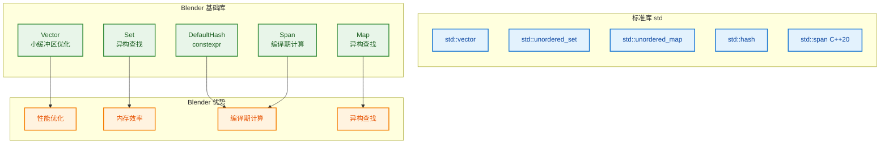
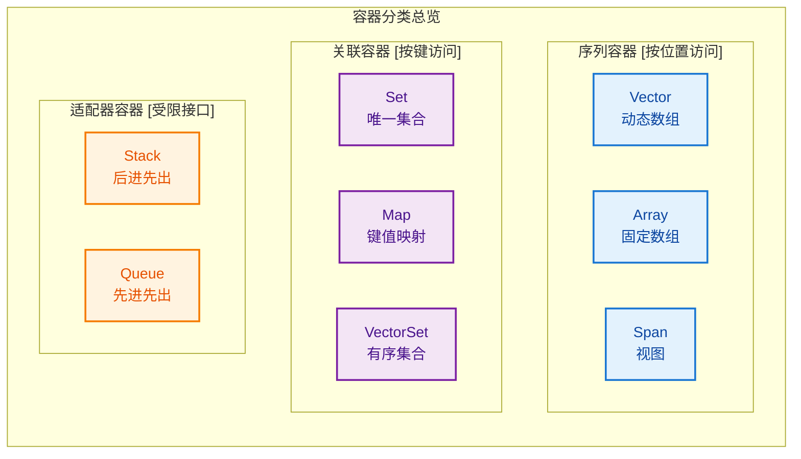
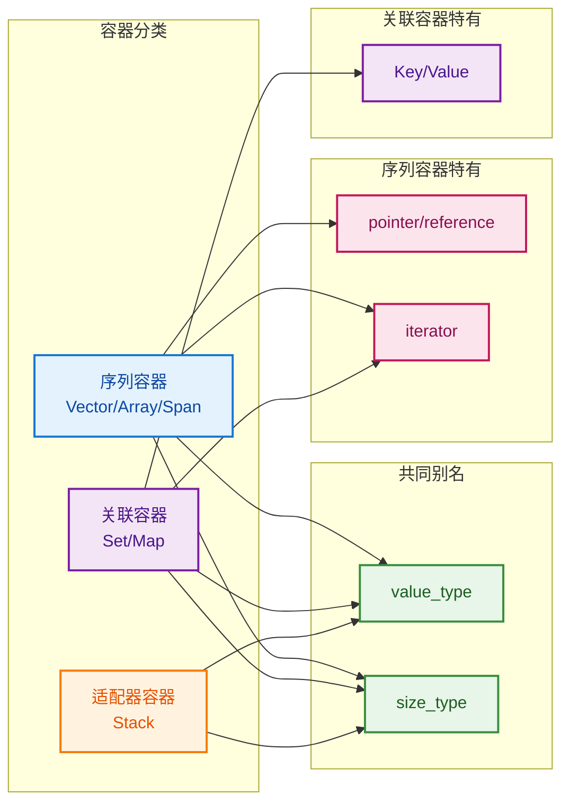
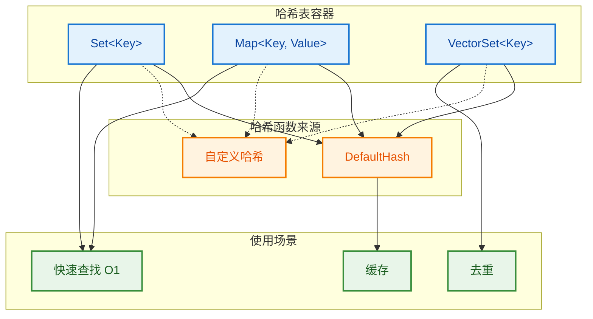
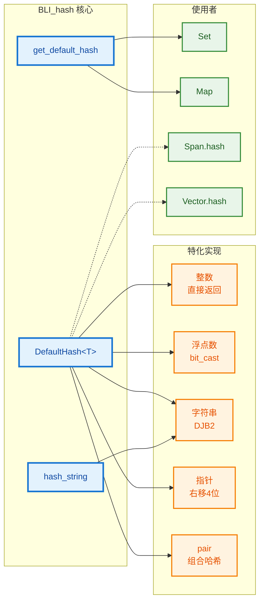
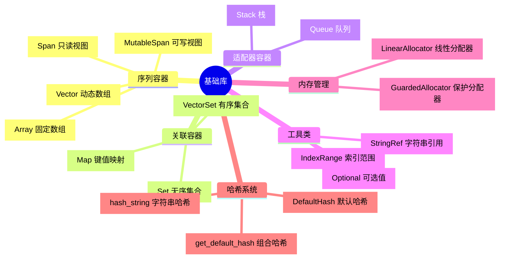

# Blender 基础库总览

> 介绍 Blender blenlib 基础库的设计哲学、与标准库的区别、以及核心概念

---

## 📋 目录

1. [为什么"重复造轮子"？](#为什么重复造轮子)
2. [类型别名（Type Aliases）](#类型别名)
3. [哈希系统在基础库中的应用](#哈希系统)
4. [基础库组件概览](#组件概览)

---

## 为什么重复造轮子？

### 设计哲学

Blender 的基础库（blenlib）虽然提供了许多与 C++ 标准库类似的功能，但设计上针对 Blender 的特定需求进行了优化。

### 与标准库的主要区别



### 详细对比

#### 1. 异构查找（Heterogeneous Lookup）

**标准库的问题：**

```cpp
// ❌ std::unordered_set 查找时必须构造完整类型
std::unordered_set<std::string> std_set;
std_set.insert("blender");

// 查找时隐式构造 std::string，分配内存
if (std_set.find("blender") != std_set.end()) {
    // 有内存分配开销
}
```

**Blender 的解决方案：**

```cpp
// ✅ Set 支持用 StringRef 查找，零内存分配
Set<std::string> blender_set;
blender_set.add("blender");

// StringRef 只是指针+长度，不分配内存
if (blender_set.contains_as(StringRef("blender"))) {
    // 无内存分配，直接比较
}
```

#### 2. 编译期计算（constexpr）

| 特性 | 标准库 | Blender 基础库 |
|------|--------|----------------|
| Vector 大小获取 | 运行时 | `constexpr` |
| 哈希计算 | 运行时 | `constexpr` |
| Span 切片 | 运行时 | `constexpr` |
| Array 索引 | 运行时 | `constexpr` |

```cpp
// ✅ 编译期计算示例
constexpr Vector<int, 4> vec = {1, 2, 3, 4};
constexpr int64_t size = vec.size();  // 编译时常量

constexpr Span<int> span = vec;
constexpr auto sub = span.slice(1, 2);  // 编译期切片

constexpr uint64_t hash = DefaultHash<int>{}(42);  // 编译期哈希
```

#### 3. 小缓冲区优化（Small Buffer Optimization）

```cpp
// Vector 默认在栈上预留空间，避免小数组的堆分配
Vector<int, 4> small_vec;  // 4个int在栈上，不分配堆内存
small_vec.append(1);       // 无堆分配
small_vec.append(2);
small_vec.append(3);
small_vec.append(4);
small_vec.append(5);       // 第5个时才分配堆内存
```

#### 4. 统一的 64 位哈希

```cpp
// ❌ std::hash 返回 size_t，平台相关
std::hash<int>{}(42);  // 32位平台返回32位，64位平台返回64位

// ✅ DefaultHash 始终返回 uint64_t
template<typename T>
struct DefaultHash {
    constexpr uint64_t operator()(const T& value) const;
};
```

#### 5. 内存分配器定制

```cpp
// Blender 容器支持自定义分配器
template<typename T, int64_t InlineBufferCapacity = 4, typename Allocator = GuardedAllocator>
class Vector;

// 使用线性分配器
LinearAllocator<> allocator;
Vector<int, 0, LinearAllocator<>> vec{allocator};
```

### 详细对比表

| Blender 容器 | 标准库对应 | Python 对应 | 主要区别 |
|-------------|-----------|------------|---------|
| `Vector<T>` | `std::vector<T>` | `list` | ✅ 小缓冲区优化，默认 `constexpr` |
| `Array<T, N>` | `std::array<T, N>` | 无（固定大小列表） | ✅ 更丰富的 API，支持 `constexpr` 算法 |
| `Span<T>` | `std::span<T>` (C++20) | `memoryview` / 切片 | ✅ C++17 可用，更多编译期功能 |
| `MutableSpan<T>` | 无直接对应 | `bytearray` | ✅ Blender 特有，可写的视图 |
| `Set<T>` | `std::unordered_set<T>` | `set` | ✅ 异构查找，更好的探测策略 |
| `Map<K, V>` | `std::unordered_map<K, V>` | `dict` | ✅ 异构查找，小缓冲区优化 |
| `VectorSet<T>` | 无直接对应 | `dict.fromkeys()` 保持顺序 | ✅ 保持插入顺序的 Set |
| `Stack<T>` | `std::stack<T>` | 无（用 list 模拟） | ✅ 更轻量，支持遍历 |
| `StringRef` | `std::string_view` (C++17) | 字符串切片 | ✅ 更早可用，与 Blender 字符串集成 |
| `IndexRange` | 无直接对应 | `range()` | ✅ Blender 特有，支持并行算法 |

### 优缺点详细对比

#### Vector vs std::vector

| 特性 | Blender Vector | std::vector | 说明 |
|------|---------------|-------------|------|
| 小缓冲区优化 | ✅ 默认支持 | ❌ 不支持 | Vector<int, 4> 前4个元素在栈上 |
| constexpr | ✅ 全面支持 | ⚠️ C++20 部分支持 | 编译期构造、访问、修改 |
| 内存分配器 | ✅ 可定制 | ⚠️ C++11 支持 | LinearAllocator 等高性能分配器 |
| 接口丰富度 | ✅ 更丰富 | 标准接口 | contains(), remove_if() 等 |
| 标准兼容性 | ❌ Blender 特有 | ✅ 标准 | 与外部库交互需要转换 |

#### Set vs std::unordered_set

| 特性 | Blender Set | std::unordered_set | 说明 |
|------|-------------|-------------------|------|
| 异构查找 | ✅ contains_as(StringRef) | ❌ 需要构造完整键 | 避免字符串拷贝 |
| 探测策略 | ✅ 可定制 | ❌ 固定 | 针对特定数据分布优化 |
| 小缓冲区优化 | ✅ 支持 | ❌ 不支持 | 小集合无堆分配 |
| constexpr | ✅ 支持 | ❌ 不支持 | 编译期集合操作 |
| 稳定性 | ✅ 迭代器更稳定 | 重新哈希失效 | 开放寻址 vs 桶链 |

#### Span vs std::span

| 特性 | Blender Span | std::span (C++20) | 说明 |
|------|-------------|------------------|------|
| C++17 可用 | ✅ | ❌ | 更早的编译器支持 |
| constexpr 切片 | ✅ slice() | ⚠️ 部分支持 | 编译期计算子范围 |
| 哈希支持 | ✅ hash() | ❌ | 可作为哈希表键 |
| first/last | ✅ 返回 Span | ✅ 返回 span | 功能相同 |
| 标准兼容性 | ❌ | ✅ | std::span 是标准 |

### 常见问题解答

#### 1. 标准库这么多缺点怎么不解决？

**历史原因：**
- C++ 标准库需要**向后兼容**，不能随意改变现有行为
- 修改可能影响数百万行现有代码
- 标准委员会决策缓慢，新特性需要多年才能通过

**设计目标不同：**
- 标准库追求**通用性**，覆盖所有场景
- Blender 基础库追求**特定场景性能**，针对几何计算优化

**示例：**
```cpp
// 标准库不能轻易添加小缓冲区优化，因为会改变 sizeof(vector)
// 现有代码可能依赖 vector 的大小

// Blender 可以自由创新，因为只在 Blender 内部使用
Vector<int, 4> vec;  // sizeof = 32 (包含4个int的内联存储)
```

#### 2. "不分配内存"是什么意思？哪来的字符啊？

**澄清：** StringRef **自己不分配内存**，但它引用**其他地方已经分配好的**字符串数据。

```cpp
// 场景1：引用字符串字面量（编译时分配在静态存储区）
StringRef ref1 = "hello";  // StringRef 不分配，但 "hello" 在程序启动时就存在了
// "hello" 存储在 .rodata 段（只读数据段），是编译器在编译时分配的

// 场景2：引用 std::string 的数据（std::string 已经分配了内存）
std::string str = "world";  // std::string 在堆上分配内存存储 "world"
StringRef ref2(str);        // StringRef 只是指向 str 已有的数据，自己不分配

// 场景3：引用 Vector<char> 的数据（Vector 已经分配了内存）
Vector<char> vec = {'a', 'b', 'c'};  // Vector 分配内存存储字符
StringRef ref3(vec.data(), vec.size());  // StringRef 只是引用，不分配

// 对比：std::string 会复制数据
std::string str_copy = "hello";  // 分配新内存，复制 "hello"
// 而 StringRef 只是："给我个指针，我看看就行"
```

**关键理解：**

| 操作 | 谁分配内存 | 内存位置 | 说明 |
|------|-----------|---------|------|
| `"hello"` 字面量 | 编译器 | 静态存储区 (.rodata) | 程序启动就存在 |
| `std::string str = "hello"` | std::string | 堆 (heap) | 运行时动态分配 |
| `StringRef ref = "hello"` | **不分配** | 指向已有数据 | 只是引用 |

#### 为什么 `"hello"` 要在编译时分配？

**1. 生命周期需求**

字符串字面量需要在**整个程序运行期间**都有效：

```cpp
const char* get_message() {
    return "hello";  // 返回指向静态存储区的指针
}  // 函数返回后，"hello" 依然存在！

void use_message() {
    const char* msg = get_message();
    // msg 仍然有效，因为 "hello" 在静态存储区
    printf("%s", msg);  // 安全
}
```

如果 `"hello"` 在栈上分配，函数返回后就会被销毁，返回的指针就悬空了。

**2. 共享需求**

同一个字符串字面量在程序中可能**多处使用**，编译时分配可以**共享同一份数据**：

```cpp
// 源代码中多次出现 "hello"
const char* a = "hello";
const char* b = "hello";
const char* c = "hello";

// 编译器优化后：只存储一份 "hello"
// a, b, c 都指向同一个地址
// 节省内存
```

**3. 不可变性**

字符串字面量是**只读**的，放在 `.rodata` 段（只读数据段）可以保护数据：

```cpp
char* p = "hello";
p[0] = 'H';  // ❌ 运行时错误！段错误（Segmentation Fault）
// .rodata 段是只读的，修改会崩溃
```

#### 为什么 `std::string` 不借用 `"hello"`？

**因为 `std::string` 的设计目标是"拥有"数据！**

```cpp
// std::string 的语义：我拥有这份数据，我可以修改它
std::string str = "hello";  // 复制 "hello" 到堆上
str[0] = 'H';               // ✅ 可以修改，因为是我自己的拷贝
// 现在 str = "Hello"

// 如果 std::string 借用 "hello"：
std::string str = "hello";  // 假设只是借用
str[0] = 'H';               // ❌ 崩溃！"hello" 在只读内存
```

**std::string vs StringRef 的设计目标对比：**

| 特性 | std::string | StringRef |
|------|-------------|-----------|
| **设计目标** | 拥有数据，可修改 | 借用数据，只读 |
| **内存分配** | 总是分配（小字符串优化除外） | 永不分配 |
| **可修改性** | ✅ 可以修改内容 | ❌ 只读 |
| **生命周期** | 独立，自己管理 | 依赖原数据 |
| **适用场景** | 需要修改字符串 | 只需要查看字符串 |

**形象比喻：**

```
"hello" 字面量 = 图书馆的公共藏书（只读，大家共享）

std::string = 复印一本书带回家（自己的拷贝，可以涂改）
              ↓
              为什么要复印？因为我想在书上做笔记！
              图书馆的书不能涂改，所以必须自己复印一份

StringRef = 借书证（只是指向图书馆的书，不能涂改）
            ↓
            我只是看看，不需要涂改，所以不用复印
```

**代码示例对比：**

```cpp
// 场景：函数接收字符串参数

// 方式1：std::string（拥有数据）
void process_string(std::string str) {
    // str 是自己的拷贝，可以安全修改
    str += " world";  // ✅ 修改自己的拷贝
    std::cout << str << std::endl;
}  // str 销毁，释放内存

// 方式2：StringRef（借用数据）
void process_ref(StringRef ref) {
    // ref 只是引用，不能修改原数据
    // ref += " world";  // ❌ 编译错误！StringRef 不支持修改
    std::cout << ref << std::endl;
}  // ref 销毁，不释放内存（因为不拥有数据）

// 调用
process_string("hello");   // 分配内存，复制 "hello"
process_ref("hello");      // 不分配，只是指向字面量
```

**形象比喻：**

```
std::string = 复印一本书（自己买纸复印）
StringRef   = 借一本书看（不复印，只是指向原书）

"hello" 字面量 = 图书馆里的公共藏书（一直存在）
std::string    = 你自己买的书（自己分配资源）
StringRef      = 借书证（不拥有书，只是指向书）
```

**❌ 错误用法（悬空引用）：**

```cpp
StringRef bad_ref;
{
    std::string temp = "temporary";  // temp 在栈上分配内存
    bad_ref = StringRef(temp);       // bad_ref 指向 temp 的数据
}  // temp 销毁，内存释放！

// 现在 bad_ref 指向已释放的内存（悬空指针）
// 使用 bad_ref 会导致未定义行为（崩溃或垃圾数据）
```

**类比 Python：**

```python
# Python 字符串切片会创建新对象（复制数据）
s = "hello"
view = s[1:4]  # 创建新字符串 "ell"，复制数据

# memoryview 不复制（类似 StringRef）
import array
arr = array.array('b', [1, 2, 3, 4])  # arr 分配内存
mv = memoryview(arr)  # mv 只是引用 arr 的数据，不复制

# 如果 arr 被删除，mv 也会失效
```

#### 3. 为什么 size_t 平台相关是个问题？

```cpp
// 32位系统
sizeof(size_t) = 4;  // 最大 4GB 内存

// 64位系统
sizeof(size_t) = 8;  // 最大 16EB 内存

// 问题1：序列化兼容性
struct Data {
    size_t count;  // 32位系统写4字节，64位系统读8字节
    char data[];
};

// 问题2：哈希值不一致
std::hash<int>{}(42);
// 32位: 返回 uint32_t
// 64位: 返回 uint64_t
// 网络传输哈希值时出问题！

// 问题3：模板实例化爆炸
template<size_t N> class Buffer;  // 32位和64位是不同的类型！
```

**Blender 的解决方案：**
```cpp
// 统一使用 int64_t
using size_type = int64_t;  // 始终 8 字节

// 序列化兼容
struct Data {
    int64_t count;  // 始终 8 字节
    char data[];
};

// 哈希值一致
DefaultHash<int>{}(42);  // 始终返回 uint64_t
```

### 对照使用建议

| 场景 | 推荐选择 | 原因 |
|------|----------|------|
| Blender 插件/模块开发 | Blender 基础库 | 性能更好，与 Blender 集成 |
| 跨平台一致性要求高 | Blender 基础库 | 统一实现，无编译器差异 |
| 编译期计算需求 | Blender 基础库 | 大量 `constexpr` 支持 |
| 与外部库交互 | 标准库 | 标准接口，兼容性好 |
| 简单脚本/工具 | 标准库 | 无需额外依赖 |

---

## 类型别名

### 什么是类型别名？

类型别名（Type Alias）使用 `using` 关键字为现有类型创建新名称，是 C++11 引入的现代替代 `typedef` 的方式。

```cpp
// 旧方式（typedef）
typedef std::vector<int> IntVector;

// 新方式（using）
using IntVector = std::vector<int>;
```

### 为什么需要这些 using？

#### 1. 标准兼容性

Blender 基础库的容器与 C++ 标准容器保持一致的接口：

```cpp
// 标准容器
std::vector<int> std_vec;
using T1 = std::vector<int>::value_type;  // int

// Blender 容器
Vector<int> blender_vec;
using T2 = Vector<int>::value_type;  // int

// 泛型代码可以同时使用两者
template<typename Container>
void process(Container& c) {
    using T = typename Container::value_type;
    for (T& elem : c) {
        // 处理元素
    }
}

process(std_vec);      // 可以
process(blender_vec);  // 也可以
```

#### 2. 泛型编程支持

```cpp
// 算法可以适用于任何容器
template<typename Container>
typename Container::value_type sum(const Container& c) {
    using T = typename Container::value_type;
    T result = 0;
    for (const T& elem : c) {
        result += elem;
    }
    return result;
}

// 可以用于 Vector、Array、Span、std::vector 等
Vector<int> vec = {1, 2, 3};
Array<float> arr = {1.0f, 2.0f, 3.0f};
Span<int> span = vec;

int s1 = sum(vec);
float s2 = sum(arr);
int s3 = sum(span);
```

#### 3. 代码清晰性

```cpp
// ❌ 直接使用原始类型
void process(const int* data, int64_t size);

// ✅ 使用类型别名
void process(Vector<int>::const_pointer data, Vector<int>::size_type size);
// 更清晰，与容器类型关联
```

### 基础库中的类型别名

#### 序列容器（Vector、Array、Span）

```cpp
// BLI_vector.hh
using value_type = T;
using pointer = T*;
using const_pointer = const T*;
using reference = T&;
using const_reference = const T&;
using iterator = T*;
using const_iterator = const T*;
using size_type = int64_t;
using allocator_type = Allocator;

// BLI_span.hh（只读视图，iterator 是 const）
using value_type = T;
using pointer = T*;
using const_pointer = const T*;
using reference = T&;
using const_reference = const T&;
using iterator = const T*;  // 注意：const T*
using size_type = int64_t;

// BLI_array.hh
using value_type = T;
using pointer = T*;
using const_pointer = const T*;
using reference = T&;
using const_reference = const T&;
using iterator = T*;
using const_iterator = const T*;
using size_type = int64_t;
```

#### 关联容器（Set、Map）

```cpp
// BLI_set.hh
using value_type = Key;
using pointer = Key*;
using const_pointer = const Key*;
using reference = Key&;
using const_reference = const Key&;
using iterator = Iterator;  // 自定义迭代器
using size_type = int64_t;

// BLI_map.hh
using Key = Key;
using Value = Value;
using size_type = int64_t;
```

#### 适配器容器（Stack）

```cpp
// BLI_stack.hh
using value_type = T;
using pointer = T*;
using const_pointer = const T*;
using reference = T&;
using const_reference = const T&;
using size_type = int64_t;
// 注意：Stack 没有 iterator，因为不是序列容器
```

### 类型别名对照表

| 别名 | 含义 | 使用场景 | 哪些容器有 |
|------|------|----------|------------|
| `value_type` | 元素类型 | 获取容器存储的类型 | 所有容器 |
| `pointer` | 指针类型 | 指向元素的指针 | 序列容器、Set |
| `const_pointer` | const 指针 | 只读指针 | 序列容器、Set |
| `reference` | 引用类型 | 元素引用 | 序列容器、Set |
| `const_reference` | const 引用 | 只读引用 | 序列容器、Set |
| `iterator` | 迭代器类型 | 遍历容器 | 序列容器、Set、Map |
| `const_iterator` | const 迭代器 | 只读遍历 | Vector、Array |
| `size_type` | 大小类型 | 索引和大小 | 所有容器（都是 int64_t） |
| `allocator_type` | 分配器类型 | 内存分配 | Vector、Array |
| `Key` | 键类型 | Map 的键 | Map |
| `Value` | 值类型 | Map 的值 | Map |

### 类型别名命名规范

#### 有 C++ 官方标准吗？

**是的！** 这些命名来自 C++ 标准库的**命名规范**（Naming Conventions），主要在以下文档中定义：

| 标准文档 | 内容 | 具体链接 |
|----------|------|----------|
| **C++ Standard [container.requirements]** | 定义了所有容器的类型别名要求 | [cppreference - 容器要求](https://en.cppreference.com/w/cpp/named_req/Container) |
| **C++ Standard [allocator.requirements]** | 定义了分配器相关的类型别名 | [cppreference - 分配器要求](https://en.cppreference.com/w/cpp/named_req/Allocator) |
| **cppreference.com** | 实用的在线参考文档 | [std::vector 类型别名](https://en.cppreference.com/w/cpp/container/vector) |

**标准容器中的类型别名（以 std::vector 为例）：**

```cpp
// C++ 标准定义（简化）
template<typename T, typename Allocator = std::allocator<T>>
class vector {
public:
    using value_type = T;
    using pointer = T*;
    using const_pointer = const T*;
    using reference = T&;
    using const_reference = const T&;
    using iterator = /* implementation-defined */;
    using const_iterator = /* implementation-defined */;
    using size_type = std::size_t;
    using difference_type = std::ptrdiff_t;
    using allocator_type = Allocator;
    // ...
};
```

#### 命名错了会有提示吗？

**不会直接报错，但会导致泛型编程失败！**

```cpp
// ❌ 错误的命名（编译通过，但不符合规范）
template<typename T>
class MyContainer {
public:
    using ValueType = T;        // 错误：应该是 value_type
    using Ptr = T*;             // 错误：应该是 pointer
    using Size = int64_t;       // 错误：应该是 size_type
};

// ✅ 正确的命名（符合标准）
template<typename T>
class MyContainer {
public:
    using value_type = T;       // 正确
    using pointer = T*;         // 正确
    using size_type = int64_t;  // 正确
};
```

**问题场景：**

```cpp
// 泛型函数依赖标准命名
template<typename Container>
void process(Container& c) {
    // ❌ 如果容器使用 ValueType 而不是 value_type，这里编译失败
    using T = typename Container::value_type;
    
    // ❌ 如果容器使用 Size 而不是 size_type，这里编译失败
    for (typename Container::size_type i = 0; i < c.size(); i++) {
        // ...
    }
}

// 使用
MyContainer<int> container;
process(container);  // 错误命名时编译失败！
```

**编译错误示例：**

```
error: no type named 'value_type' in 'MyContainer<int>'
    using T = typename Container::value_type;
              ~~~~~~~~~~~~~~~~~~~~~~~~^~~~~~~~~
note: did you mean 'ValueType'?
    using ValueType = T;
          ^
```

#### 命名规范总结

| 类别 | 命名模式 | 示例 |
|------|----------|------|
| **元素类型** | `value_type` | `using value_type = T;` |
| **指针类型** | `pointer` / `const_pointer` | `using pointer = T*;` |
| **引用类型** | `reference` / `const_reference` | `using reference = T&;` |
| **迭代器类型** | `iterator` / `const_iterator` | `using iterator = T*;` |
| **大小类型** | `size_type` | `using size_type = std::size_t;` |
| **差值类型** | `difference_type` | `using difference_type = std::ptrdiff_t;` |
| **分配器类型** | `allocator_type` | `using allocator_type = Allocator;` |
| **键类型** | `key_type` / `Key` | `using key_type = Key;` |
| **映射值类型** | `mapped_type` / `Value` | `using mapped_type = Value;` |

**命名约定规则：**

1. **全小写 + 下划线**：`value_type`, `size_type`, `allocator_type`
2. **语义明确**：名称直接反映类型的用途
3. **与标准库一致**：便于泛型编程和代码复用

#### 如何验证命名是否正确？

```cpp
// 使用 static_assert 验证容器符合标准概念
template<typename Container>
void check_container() {
    // 检查必需的类型别名是否存在
    using value_type = typename Container::value_type;
    using size_type = typename Container::size_type;
    using iterator = typename Container::iterator;
    
    // 检查 size_type 是否是无符号整数
    static_assert(std::is_unsigned_v<size_type>, 
                  "size_type must be unsigned");
    
    // 检查 iterator 是否可以解引用为 value_type
    static_assert(std::is_same_v<decltype(*std::declval<iterator>()), 
                                  value_type&>,
                  "iterator must dereference to value_type&");
}

// 验证 Vector
check_container<Vector<int>>();  // 编译通过

// 验证自定义容器
check_container<MyContainer<int>>();  // 如果命名错误，编译失败
```

### 容器分类详解

#### 什么是序列容器（Sequence Containers）？

**定义：** 元素按**线性顺序**存储，可以通过**位置（索引）**访问。

**特点：**
- 元素有明确的先后顺序
- 支持通过索引访问（`container[i]`）
- 可以遍历（有 `begin()`/`end()`）

**Blender 中的序列容器：**

| 容器 | 特点 | 类比 Python |
|------|------|------------|
| `Vector<T>` | 动态大小，可扩容 | `list` |
| `Array<T, N>` | 固定大小，编译期确定 | `tuple`（但可修改） |
| `Span<T>` | 只读视图，不拥有数据 | `memoryview` |
| `MutableSpan<T>` | 可写视图，不拥有数据 | 无直接对应 |

**使用场景：**
```cpp
// 存储顶点坐标列表
Vector<float3> vertices;
vertices.append({0, 0, 0});
vertices.append({1, 0, 0});
vertices.append({0, 1, 0});

// 通过索引访问
float3 first = vertices[0];  // {0, 0, 0}

// 遍历
for (const float3& v : vertices) {
    // 处理每个顶点
}
```

---

#### 什么是关联容器（Associative Containers）？

**定义：** 元素通过**键（Key）**访问，而不是位置。

**特点：**
- 通过键快速查找（通常是 O(1) 或 O(log n)）
- 元素自动排序或哈希分布
- 键必须唯一（Set）或键值对（Map）

**Blender 中的关联容器：**

| 容器 | 特点 | 类比 Python |
|------|------|------------|
| `Set<T>` | 唯一元素集合 | `set` |
| `Map<K, V>` | 键值对映射 | `dict` |
| `VectorSet<T>` | 保持插入顺序的 Set | `dict.fromkeys()` |

**使用场景：**
```cpp
// 存储已访问的节点（去重）
Set<int> visited_nodes;
visited_nodes.add(1);
visited_nodes.add(2);
visited_nodes.add(1);  // 重复，不会添加
// visited_nodes = {1, 2}

// 名称到索引的映射
Map<std::string, int> name_to_index;
name_to_index.add("cube", 0);
name_to_index.add("sphere", 1);
int idx = name_to_index.lookup("cube");  // 0
```

---

#### 什么是适配器容器（Adapter Containers）？

**定义：** 基于其他容器实现的**受限接口**容器。

**特点：**
- 限制底层容器的操作，提供特定语义
- 通常不支持遍历（没有迭代器）
- 专注于特定操作（如栈的 push/pop）

**Blender 中的适配器容器：**

| 容器 | 特点 | 类比 Python |
|------|------|------------|
| `Stack<T>` | 后进先出（LIFO） | 用 `list` 模拟栈 |
| `Queue<T>` | 先进先出（FIFO） | `collections.deque` |

**使用场景：**
```cpp
// DFS 遍历图
Stack<int> to_visit;
to_visit.push(start_node);

while (!to_visit.is_empty()) {
    int node = to_visit.pop();  // 取出最后加入的
    // 处理 node
    // 将邻居加入栈
}

// BFS 遍历图
Queue<int> to_visit;
to_visit.push(start_node);

while (!to_visit.is_empty()) {
    int node = to_visit.pop();  // 取出最早加入的
    // 处理 node
}
```

---

#### 容器分类对比表

| 特性 | 序列容器 | 关联容器 | 适配器容器 |
|------|---------|---------|-----------|
| **访问方式** | 索引（位置） | 键 | 只能访问顶部/头部 |
| **遍历** | ✅ 支持 | ✅ 支持 | ❌ 通常不支持 |
| **元素顺序** | 插入顺序 | 哈希/排序顺序 | 插入顺序（但受限） |
| **查找速度** | O(n) | O(1) 或 O(log n) | 只能访问特定元素 |
| **典型用途** | 列表、数组 | 查找表、去重 | 算法实现（DFS/BFS） |



---

#### 还有哪些基础知识？

##### 1. 容器适配器模式（Container Adapters）

适配器容器通常是基于序列容器实现的：

```cpp
// Stack 可以用 Vector 实现
template<typename T>
class Stack {
    Vector<T> data_;  // 底层容器
public:
    void push(const T& value) { data_.append(value); }
    T pop() { return data_.pop_last(); }
    bool is_empty() const { return data_.is_empty(); }
};
```

##### 2. 视图（Views）vs 容器

| 特性 | 容器（Vector/Array） | 视图（Span） |
|------|---------------------|-------------|
| **拥有数据** | ✅ 是 | ❌ 否 |
| **分配内存** | ✅ 是 | ❌ 否 |
| **生命周期** | 独立 | 依赖原数据 |
| **用途** | 存储数据 | 传递/观察数据 |

##### 3. 选择容器的决策树

```
需要存储数据？
├── 是 → 需要动态大小？
│   ├── 是 → Vector
│   └── 否 → Array
└── 否 → 需要按键查找？
    ├── 是 → 需要键值对？
    │   ├── 是 → Map
    │   └── 否 → Set
    └── 否 → 需要特定算法？
        ├── 是 → Stack/Queue
        └── 否 → Span（视图）
```

##### 4. 迭代器类别（Iterator Categories）

```cpp
// 输入迭代器（Input Iterator）
// 只能读取一次，单向移动

// 输出迭代器（Output Iterator）
// 只能写入，单向移动

// 前向迭代器（Forward Iterator）
// 可读写，单向移动，可多次读取
// Set、Map 的迭代器

// 双向迭代器（Bidirectional Iterator）
// 可读写，双向移动
// List 的迭代器

// 随机访问迭代器（Random Access Iterator）
// 可读写，可随机访问（+n, -n, [], 比较）
// Vector、Array、Span 的迭代器
```

##### 5. 复杂度保证（Complexity Guarantees）

| 操作 | Vector | Array | Set/Map | Stack |
|------|--------|-------|---------|-------|
| 访问 | O(1) | O(1) | - | - |
| 查找 | O(n) | O(n) | O(1) | - |
| 插入尾部 | 均摊 O(1) | - | O(1) | O(1) |
| 删除 | O(n) | - | O(1) | O(1) |
| 遍历 | O(n) | O(n) | O(n) | - |

### 为什么只有这些？

类型别名的选择遵循**最小必要原则**：

1. **标准兼容性**：与 `std::` 容器保持一致，便于泛型编程
2. **实际需求**：只提供实际会用到的类型别名
3. **容器特性**：根据容器特性选择（如 Stack 没有 iterator）



---

## 哈希系统

### 哈希在基础库中的应用

哈希系统是 Blender 基础库的核心组件，主要用于：



### 基础库中使用哈希的地方

#### 1. 哈希表容器

```cpp
// Set - 无序唯一元素集合
Set<std::string> unique_names;
unique_names.add("cube");
unique_names.add("sphere");
if (unique_names.contains("cube")) {  // O(1) 查找
    // ...
}

// Map - 键值对映射
Map<std::string, int> name_to_index;
name_to_index.add("cube", 0);
name_to_index.add("sphere", 1);
int index = name_to_index.lookup("cube");  // O(1) 查找

// VectorSet - 保持插入顺序的 Set
VectorSet<int> ordered_unique;
ordered_unique.add(3);
ordered_unique.add(1);
ordered_unique.add(2);
// 遍历时顺序：3, 1, 2
```

#### 2. 数据结构的哈希方法

```cpp
// Span 的哈希
Span<int> span = {1, 2, 3};
uint64_t h = span.hash();  // 组合所有元素的哈希

// Vector 的哈希
Vector<float> vec = {1.0f, 2.0f, 3.0f};
uint64_t h = vec.hash();

// 自定义类型的哈希
struct Vector3 {
    float x, y, z;
    uint64_t hash() const {
        return get_default_hash(x, y, z);
    }
};
```

#### 3. 异构查找

```cpp
Set<std::string> names;
names.add("blender");

// 用 StringRef 查找，避免构造 std::string
StringRef key = "blender";
if (names.contains_as(key)) {  // 无内存分配
    // ...
}

// Map 同样支持
Map<std::string, int> scores;
scores.add("player1", 100);
int score = scores.lookup_as(StringRef("player1"));  // O(1)
```

#### 4. 组合哈希

```cpp
// 多字段组合哈希
struct Vertex {
    float3 position;
    float3 normal;
    float2 uv;
    
    uint64_t hash() const {
        return get_default_hash(position, normal, uv);
    }
};

// pair 的哈希
std::pair<int, std::string> key = {42, "test"};
uint64_t h = DefaultHash<std::pair<int, std::string>>{}(key);
```

### 哈希系统架构



### 为什么需要自定义哈希系统？

| 特性 | std::hash | DefaultHash | 优势 |
|------|-----------|-------------|------|
| 异构查找 | ❌ | ✅ | 避免不必要的类型转换 |
| 编译期计算 | ❌ | ✅ | constexpr 支持 |
| 统一64位 | size_t平台相关 | 始终 uint64_t | 跨平台一致 |
| 字符串哈希 | 编译器实现不同 | 统一 DJB2 | 可预测行为 |
| 组合哈希 | 手动实现 | get_default_hash | 方便多字段哈希 |

---

## 组件概览

### 基础库文件分类



### 学习路径建议

```
00_Overview（本文档）
    ↓
01_Vector → 02_Span → 03_Array
    ↓
04_Set → 05_Map
    ↓
06_StringRef → 07_IndexRange
    ↓
08_Hash → 09_Assert → 10_Optional
```

---

## ✅ 总结

Blender 基础库的设计目标：

1. **性能优先**：小缓冲区优化、编译期计算、异构查找
2. **内存效率**：自定义分配器、避免不必要的拷贝
3. **类型安全**：强类型系统、constexpr 验证
4. **标准兼容**：与 std:: 容器接口一致，便于泛型编程
5. **跨平台一致**：统一实现，无编译器差异

虽然看起来是"重复造轮子"，但这些设计选择使 Blender 能够在性能关键的场景（如几何节点计算）中获得显著优势。
