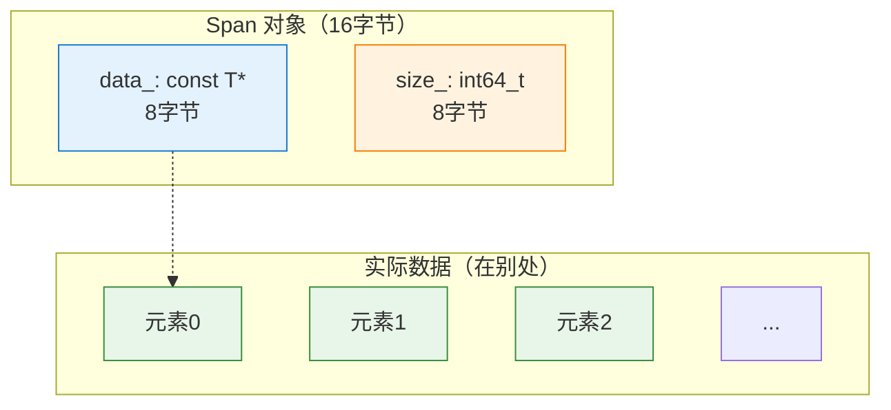
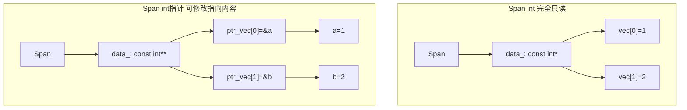
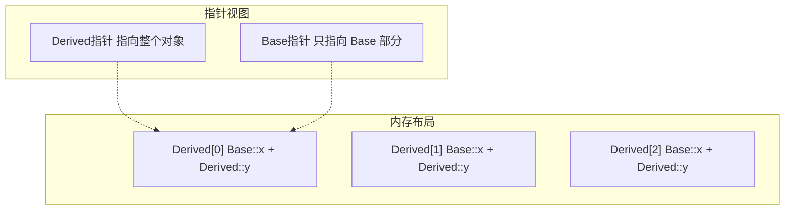
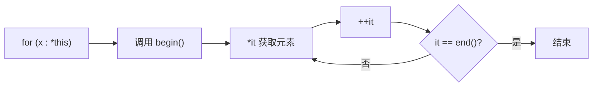
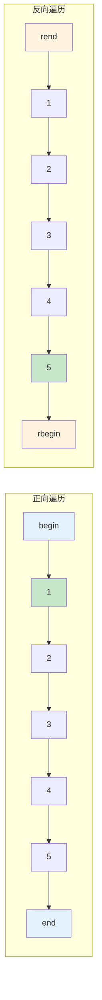

# Span<T> / MutableSpan<T> - 非拥有视图

> 对连续内存范围的非拥有视图，提供安全的数组访问和切片操作

---

## 📖 源码注释翻译与解释

### 文件头注释 (BLI_span.hh:7~57)

> **原文：**
> ```cpp
> /** \file
>  * \ingroup bli
>  *
>  * A `Span` is a non-owning reference to an array of elements. It encapsulates a pointer and a
>  * size. The elements are not owned, so they are not destructed when the span is destructed.
>  *
>  * A span can point to data owned by a `Vector`, `Array` or a raw array. It can also point to data
>  * inside another span. The span does not own the data, so the span is only valid as long as the
>  * underlying data is valid.
>  *
>  * Spans are typically used as function parameters. When a function takes a span as parameter, it
>  * can accept any container that stores elements contiguously in memory. This includes `Vector`,
>  * `Array`, `std::vector`, `std::array` and raw arrays.
>  *
>  * Functions should generally not return spans. If a function computes new data, it should return
>  * a `Vector` or `Array`. If a function returns a sub-span of its input, returning a `Span` is ok.
>  *
>  * `MutableSpan` is similar to `Span`, but allows modifying the referenced elements.
>  */
> ```

**翻译：**

`Span` 是对数组元素的**非拥有引用**。它封装了一个指针和一个大小。元素不被拥有，所以当 span 被销毁时元素不会被析构。

Span 可以指向由 `Vector`、`Array` 或原始数组拥有的数据。它也可以指向另一个 span 内部的数据。Span 不拥有数据，所以 span 只有在底层数据有效时才有效。

Span 通常用作**函数参数**。当函数接受 span 作为参数时，它可以接受任何在内存中连续存储元素的容器。这包括 `Vector`、`Array`、`std::vector`、`std::array` 和原始数组。

函数通常**不应该返回 span**。如果函数计算新数据，它应该返回 `Vector` 或 `Array`。如果函数返回其输入的子 span，返回 `Span` 是可以的。

`MutableSpan` 类似于 `Span`，但允许修改引用的元素。

### 类注释 (BLI_span.hh:70~72)

```cpp
/**
 * A non-owning reference to an array of elements.
 */
template<typename T> class Span {
```

### 构造函数注释

#### 默认构造 (BLI_span.hh:89~92)

```cpp
/**
 * Create a reference to an empty array.
 */
constexpr Span() = default;
```

#### 初始化列表构造 (BLI_span.hh:107~120)

```cpp
/**
 * Reference an initializer_list. Note that the data in the initializer_list is only valid until
 * the expression containing it is fully computed.
 *
 * Do:
 *  call_function_with_array({1, 2, 3, 4});
 *
 * Don't:
 *  Span<int> span = {1, 2, 3, 4};
 *  call_function_with_array(span);
 */
constexpr Span(const std::initializer_list<T> &list) : Span(list.begin(), int64_t(list.size()))
{
}
```

### 切片方法注释

#### slice (BLI_span.hh:137~147)

```cpp
/**
 * Returns a contiguous part of the array. This invokes undefined behavior when the start or size
 * is negative.
 */
constexpr Span slice(int64_t start, int64_t size) const
{
  BLI_assert(start >= 0);
  BLI_assert(size >= 0);
  return Span(data_ + start, size);
}
```

#### slice_safe (BLI_span.hh:154~164)

```cpp
/**
 * Returns a new span that only contains the elements that are in both spans.
 */
constexpr Span slice_safe(int64_t start, int64_t size) const
{
  const int64_t new_start = std::max<int64_t>(0, start);
  const int64_t new_end = std::min<int64_t>(size_, start + size);
  return Span(data_ + new_start, std::max<int64_t>(0, new_end - new_start));
}
```

#### drop_front (BLI_span.hh:171~180)

```cpp
/**
 * Returns a new span with the first n elements removed.
 */
constexpr Span drop_front(int64_t n) const
{
  BLI_assert(n >= 0);
  const int64_t new_size = std::max<int64_t>(0, size_ - n);
  return Span(data_ + n, new_size);
}
```

#### drop_back (BLI_span.hh:182~191)

```cpp
/**
 * Returns a new span with the last n elements removed.
 */
constexpr Span drop_back(int64_t n) const
{
  BLI_assert(n >= 0);
  const int64_t new_size = std::max<int64_t>(0, size_ - n);
  return Span(data_, new_size);
}
```

#### take_front (BLI_span.hh:193~202)

```cpp
/**
 * Returns a new span with only the first n elements.
 */
constexpr Span take_front(int64_t n) const
{
  BLI_assert(n >= 0);
  return Span(data_, std::min<int64_t>(n, size_));
}
```

#### take_back (BLI_span.hh:204~213)

```cpp
/**
 * Returns a new span with only the last n elements.
 */
constexpr Span take_back(int64_t n) const
{
  BLI_assert(n >= 0);
  const int64_t new_size = std::min<int64_t>(n, size_);
  return Span(data_ + size_ - new_size, new_size);
}
```

### 数据访问注释

#### data() (BLI_span.hh:215~222)

```cpp
/**
 * Returns a pointer to the beginning of the referenced array.
 */
constexpr const T *data() const
{
  return data_;
}
```

---

## 🎯 核心概念

### Span 的命名是什么意思？

**"Span"** 在英语中有"跨度"、"范围"的意思。在 C++ 中，它表示对一段**连续内存**的引用。

```
内存: [0][1][2][3][4][5][6][7][8][9]
           ↑              ↑
         start          end
           <--- span --->
              (范围)
```

类比：
- Python 的 `memoryview`
- Rust 的切片 `&[T]`
- Go 的切片 `[]T`

### 为什么需要 Span？

**问题：函数参数应该接受什么类型？**

```cpp
// ❌ 只接受 Vector：太局限
void process(Vector<int> &vec);

// ❌ 只接受原始指针：不安全
void process(int *data, int size);

// ✅ 接受 Span：通用且安全
void process(Span<int> span);
// 可以传入：Vector、Array、std::vector、原始数组等
```

---

## 📦 内存布局



**关键点：**
- Span 本身只存储**指针**和**大小**（16字节）
- 数据存储在**别处**（由调用者管理生命周期）
- Span 不拥有数据，只是**查看**数据

---

## 🚀 基础用法

### 构造

```cpp
#include "BLI_span.hh"

using namespace blender;

// 1. 从原始数组构造
int arr[] = {1, 2, 3, 4, 5};
Span<int> span1(arr, 5);

// 2. 从 Vector 构造
Vector<int> vec = {1, 2, 3};
Span<int> span2(vec);

// 3. 从 Array 构造
Array<int> arr2(5);
Span<int> span3(arr2);

// 4. 空 Span
Span<int> empty_span;
```

### 访问元素

```cpp
Span<int> span = {1, 2, 3, 4, 5};

// 索引访问
int first = span[0];      // 1
int last = span[4];       // 5

// 边界检查访问（安全）
int safe = span.first();  // 1
int safe_last = span.last();  // 5

// 大小
int64_t size = span.size();  // 5
bool empty = span.is_empty();  // false

// 遍历
for (int value : span) {
    // 1, 2, 3, 4, 5
}
```

---

## ✂️ 切片操作

```cpp
Span<int> span = {0, 1, 2, 3, 4, 5, 6, 7, 8, 9};

// slice: 取中间部分
Span<int> mid = span.slice(2, 4);  // {2, 3, 4, 5}

// slice_safe: 安全的切片（越界自动处理）
Span<int> safe = span.slice_safe(8, 5);  // {8, 9}（不会越界）

// drop_front: 去掉前面 n 个
Span<int> dropped = span.drop_front(3);  // {3, 4, 5, 6, 7, 8, 9}

// drop_back: 去掉后面 n 个
Span<int> dropped_back = span.drop_back(3);  // {0, 1, 2, 3, 4, 5, 6}

// take_front: 只取前面 n 个
Span<int> front = span.take_front(3);  // {0, 1, 2}

// take_back: 只取后面 n 个
Span<int> back = span.take_back(3);  // {7, 8, 9}
```

**切片的特点：**
- 零拷贝：只是调整指针和大小
- O(1) 复杂度
- 返回新的 Span，原 Span 不变

---

## 🔄 MutableSpan - 可变视图

```cpp
// MutableSpan 允许修改元素
Vector<int> vec = {1, 2, 3, 4, 5};
MutableSpan<int> mutable_span(vec);

// 修改元素
mutable_span[0] = 100;  // vec 也变成 {100, 2, 3, 4, 5}

// 填充
mutable_span.fill(42);  // vec 变成 {42, 42, 42, 42, 42}

// 复制数据
Array<int> src = {10, 20, 30};
mutable_span.copy_from(src);  // vec 前3个元素变成 {10, 20, 30}
```

**Span vs MutableSpan：**

| 特性 | Span<T> | MutableSpan<T> |
|------|---------|----------------|
| 可读 | ✅ | ✅ |
| 可写 | ❌ | ✅ |
| 数据指针 | `const T*` | `T*` |
| 适用场景 | 只读访问 | 需要修改 |

---

## 🎯 函数参数最佳实践

### 为什么使用 Span 作为参数？

```cpp
// ❌ 不好：只接受 Vector
void process_vertices(Vector<float3> &vertices);

// ✅ 好：接受任何连续存储的容器
void process_vertices(Span<float3> vertices);

// 调用方式：
Vector<float3> vec;
Array<float3> arr;
std::vector<float3> std_vec;
float3 raw_arr[10];

process_vertices(vec);      // ✅
process_vertices(arr);      // ✅
process_vertices(std_vec);  // ✅
process_vertices({raw_arr, 10});  // ✅
```

### 实际示例

```cpp
// 计算顶点平均位置
float3 compute_center(Span<float3> positions)
{
  float3 center = float3::zero();
  for (const float3 &pos : positions) {
    center += pos;
  }
  return center / float(positions.size());
}

// 修改顶点位置
void offset_vertices(MutableSpan<float3> positions, const float3 &offset)
{
  for (float3 &pos : positions) {
    pos += offset;
  }
}
```

---

## 🎨 高级用法

### 类型转换

```cpp
// Span 可以隐式转换为 Span<const T>
Span<int> mutable_span = ...;
Span<const int> const_span = mutable_span;  // ✅ 隐式转换

// 但不能反向转换
Span<const int> const_span = ...;
Span<int> mutable_span = const_span;  // ❌ 编译错误
```

### 与算法结合

```cpp
Span<int> span = {3, 1, 4, 1, 5, 9, 2, 6};

// 排序（需要 MutableSpan）
MutableSpan<int> mutable_span = ...;
std::sort(mutable_span.begin(), mutable_span.end());

// 查找
auto it = std::find(span.begin(), span.end(), 5);

// 累加
int sum = std::accumulate(span.begin(), span.end(), 0);
```

### 空 Span 检查

```cpp
void process(Span<int> span)
{
  // 检查是否为空
  if (span.is_empty()) {
    return;  // 提前返回
  }
  
  // 或者使用断言
  BLI_assert(!span.is_empty());
  
  // 处理数据...
}
```

---

## ⚡ 性能特点

| 操作 | 复杂度 | 说明 |
|------|--------|------|
| 构造 | O(1) | 只是复制指针和大小 |
| 索引访问 | O(1) | 直接指针运算 |
| 切片 | O(1) | 只调整指针和大小 |
| 遍历 | O(n) | 与原始数组相同 |
| 大小 | O(1) | 直接返回 size_ |

### 性能建议

```cpp
// ✅ 按值传递 Span（小对象，16字节）
void process(Span<int> span);

// ❌ 不需要按引用传递
void process(const Span<int> &span);  // 没必要

// ✅ 使用范围 for 循环（编译器优化好）
for (const auto &elem : span) { ... }

// ✅ 使用 first()/last() 代替手动索引
auto first = span.first();  // 安全且有边界检查
auto last = span.last();
```

---

## 🎯 节点开发典型模式

### 模式 1：处理几何体属性

```cpp
void process_mesh(const Mesh &mesh)
{
  // 获取位置属性
  Span<float3> positions = mesh.vert_positions();
  
  // 处理每个顶点
  for (const float3 &pos : positions) {
    // 处理顶点位置...
  }
}
```

### 模式 2：字段求值输出

```cpp
void evaluate_field(const Field<float> &field,
                    Span<float3> positions,
                    MutableSpan<float> results)
{
  BLI_assert(positions.size() == results.size());
  
  for (int64_t i : positions.index_range()) {
    results[i] = field.evaluate(positions[i]);
  }
}
```

### 模式 3：多几何体处理

```cpp
void merge_meshes(Span<Mesh *> meshes,
                  MutableSpan<float3> all_positions,
                  MutableSpan<int> all_indices)
{
  int64_t offset = 0;
  for (const Mesh *mesh : meshes) {
    Span<float3> positions = mesh->vert_positions();
    all_positions.slice(offset, positions.size()).copy_from(positions);
    offset += positions.size();
  }
}
```

---

## 🤔 常见问题深度解答

### Span 的命名是什么意思？

**"Span"** 在英语中是"跨度"、"范围"的意思。在编程中表示对一段连续内存的引用。

类比：
- Python: `memoryview`
- Rust: `&[T]`
- Go: `[]T`

### 问题 1: "However, if T is a non-const pointer, the pointed-to elements can be modified" 是什么意思？

**源码位置：** `BLI_span.hh:12~13`

**解释：**

这是关于指针类型的特殊情况。Span 本身是只读的（不能修改 `data_` 指针），但如果 `T` 是指针类型，可以通过 Span 修改指针**指向的内容**。

```cpp
// 情况 1: T = int (非指针)
Vector<int> vec = {1, 2, 3};
Span<int> span = vec;
// span[0] = 100;  // ❌ 编译错误！Span<int> 是只读的

// 情况 2: T = int* (指针类型)
int a = 1, b = 2, c = 3;
Vector<int*> ptr_vec = {&a, &b, &c};
Span<int*> ptr_span = ptr_vec;

// ptr_span[0] = &c;  // ❌ 编译错误！不能修改指针本身
*ptr_span[0] = 100;   // ✅ 可以！修改指针指向的内容
// 现在 a = 100
```

**图示：**



---

### 问题 2: `using value_type = T;` 等类型别名是干什么的？

**源码位置：** `BLI_span.hh:76~82`

```cpp
using value_type = T;
using pointer = T *;
using const_pointer = const T *;
using reference = T &;
using const_reference = const T &;
using iterator = const T *;
using size_type = int64_t;
```

**解释：**

这些是**类型别名**（type alias），用于：

1. **标准兼容性**：与 C++ 标准容器（如 `std::vector`）保持一致
2. **泛型编程**：模板代码可以通过这些别名访问类型信息
3. **代码清晰**：使用 `value_type` 比直接使用 `T` 更语义化

**使用示例：**

```cpp
// 泛型函数，适用于任何容器
template<typename Container>
void process(Container &c) {
    using T = typename Container::value_type;
    
    for (typename Container::size_type i = 0; i < c.size(); i++) {
        T &element = c[i];
        // 处理 element
    }
}

// 可以用于 Span、Vector、std::vector 等
Span<float> span;
Vector<int> vec;
process(span);  // T = float
process(vec);   // T = int
```

**对应关系：**

| 别名 | 含义 | 示例 (T=int) |
|------|------|--------------|
| `value_type` | 元素类型 | `int` |
| `pointer` | 指针类型 | `int*` |
| `const_pointer` | const 指针 | `const int*` |
| `reference` | 引用类型 | `int&` |
| `const_reference` | const 引用 | `const int&` |
| `iterator` | 迭代器类型 | `const int*` |
| `size_type` | 大小类型 | `int64_t` |

---

### 问题 3: 模板构造函数 `template<typename U> Span(const U *start, int64_t size)` 是干什么的？

**源码位置：** `BLI_span.hh:99~105`

```cpp
template<typename U>
constexpr Span(const U *start, int64_t size)
  requires(is_span_convertible_pointer_v<U, T>)
    : data_(static_cast<const T *>(start)), size_(size)
{
  BLI_assert(size >= 0);
}
```

#### 如何计算普通数组的大小？

在调用这个构造函数之前，你需要知道数组的大小：

```cpp
// 方法1：使用 sizeof（编译期确定大小）
int arr[] = {1, 2, 3, 4, 5};
constexpr int64_t size = sizeof(arr) / sizeof(arr[0]);  // 5
Span<int> span(arr, size);

// 方法2：使用 std::size（C++17）
#include <iterator>
int arr[] = {1, 2, 3, 4, 5};
Span<int> span(arr, std::size(arr));  // 5

// 方法3：对于 std::vector（运行期大小）
std::vector<int> vec = {1, 2, 3, 4, 5};
Span<int> span(vec.data(), int64_t(vec.size()));

// 方法4：对于 C 数组传参（必须同时传递大小）
void process(int* arr, int64_t size) {
    Span<int> span(arr, size);  // 接收方不知道原始大小，必须传递
}
```

#### 什么是模板类里的模板函数？如何调用？

**定义：**
```cpp
template<typename T>  // 类的模板参数
class Span {
public:
    template<typename U>  // 构造函数的模板参数（独立于类的模板参数）
    constexpr Span(const U *start, int64_t size)
      requires(is_span_convertible_pointer_v<U, T>)
        : data_(static_cast<const T *>(start)), size_(size)
    {}
};
```

**调用方式：**

```cpp
// 情况1：编译器自动推导 U（最常见）
Derived derived_data[10];
Span<Base> base_span(derived_data, 10);  // U = Derived, T = Base
// 编译器自动从参数 derived_data（Derived*）推导出 U = Derived
// T = Base 从 Span<Base> 显式指定

// 情况2：显式指定 U（很少需要，语法也错了）
// 这种写法不正确，不需要这样写

// 情况3：使用 auto 推导（效果相同）
auto base_span = Span<Base>(derived_data, 10);  // T = Base 显式指定
// 与情况1完全等价，只是写法不同
```

**情况1和情况3的区别：**

实际上它们**本质相同**，都是：
- `T = Base`（显式指定，因为写了 `Span<Base>`）
- `U = Derived`（编译器从 `derived_data` 的类型 `Derived*` 推导）

```cpp
// 这两种写法完全等价：
Span<Base> span1(derived_data, 10);
auto span2 = Span<Base>(derived_data, 10);

// 都调用了：
// Span<Base>::Span<Derived>(derived_data, 10)
//          ↑T        ↑U
```

#### `data_(static_cast<const T *>(start))` 转换了什么？

**关键理解：只转换了一个指针（start），不是转换整个数组！**

```cpp
// 示例：Derived* 转换为 Base*
class Base { public: int x; };
class Derived : public Base { public: int y; };

Derived derived_data[3];  // 3 个 Derived 对象
// 内存布局：[Derived][Derived][Derived]
//           = [Base+y][Base+y][Base+y]

// 转换过程：
Span<Base> span(derived_data, 3);
// 内部执行：
// data_ = static_cast<const Base*>(derived_data);
//         ↑ 只转换了这一个指针！
```

**发生了什么：**

```
调用前：
  start = derived_data = 0x1000 (Derived* 类型)
  
调用后：
  data_ = 0x1000 (const Base* 类型)
  
只是指针变量的类型变了，地址值没变！
```

**不是转换整个数组：**

```cpp
// ❌ 错误理解：
// 把 [Derived][Derived][Derived] 转换成 [Base][Base][Base]
// 这涉及复制和切片，开销很大！

// ✅ 正确理解：
// derived_data 是 Derived* 类型，指向数组第一个元素
// data_ 是 const Base* 类型，指向同一个地址
// 只是指针类型的转换，没有复制数据！
```

**为什么能这样？**

```cpp
// C++ 保证：派生类对象的前缀就是基类部分
// Derived 对象内存布局：
// [Base::x][Derived::y]
//  ↑ data_ 指向这里（Base* 视角）
//  ↑ derived_data 指向这里（Derived* 视角）

// 两个指针指向同一地址，只是解释不同：
// - Derived* 看到：Base::x 和 Derived::y
// - Base* 只看到：Base::x（这是安全的）
```

**可视化：**



**为什么可以这样做？**
- C++ 保证派生类对象的前缀是基类部分
- `static_cast` 会调整指针偏移（如果需要）
- **没有数据复制**，只是指针的重新解释

#### C++20 `requires` 子句详解

**这句话的意思：**

> "只有当 `U*` 可以转换为 `T*` 时，这个构造函数才参与重载决议。如果不满足条件，编译器会安静地忽略这个构造函数，而不是报错。"

**什么是"重载决议"？**

```cpp
class Span {
public:
    // 构造函数1：普通版本
    constexpr Span(const T *start, int64_t size);
    
    // 构造函数2：模板版本（带 requires）
    template<typename U>
    constexpr Span(const U *start, int64_t size)
      requires(is_span_convertible_pointer_v<U, T>);
};

// 调用时：
Span<Base> span(derived_ptr, 10);
// 编译器会考虑两个构造函数，选择最匹配的
```

**"安静地忽略"是什么意思？**

```cpp
class Unrelated { /* 不继承 Base */ };
Unrelated unrelated_data[10];

// ❌ 如果没有 requires：
Span<Base> span(unrelated_data, 10);
// 编译错误！Unrelated* 不能转为 Base*

// ✅ 有 requires 时：
Span<Base> span(unrelated_data, 10);
// 模板构造函数被"忽略"，尝试普通构造函数
// 普通构造函数：const T* = const Base*
// unrelated_data 是 Unrelated*，不能匹配
// 最终：编译错误（但错误信息更清晰）
```

**对比：有/没有 requires**

```cpp
// 没有 requires（C++17 及以前的做法）
template<typename U>
constexpr Span(const U *start, int64_t size)
    : data_(static_cast<const T *>(start)), size_(size)  // 错误在这里
// 编译错误：static_cast 失败，错误信息混乱

// 有 requires（C++20）
template<typename U>
constexpr Span(const U *start, int64_t size)
  requires(is_span_convertible_pointer_v<U, T>)  // 约束在这里检查
    : data_(static_cast<const T *>(start)), size_(size)
// 不满足约束时，模板不参与重载，错误信息更清晰
```

#### 调用例子

```cpp
// 例子1：基本用法（类型相同）
int arr[] = {1, 2, 3};
Span<int> span(arr, 3);  // U = int, T = int，类型相同

// 例子2：添加 const
int arr[] = {1, 2, 3};
Span<const int> span(arr, 3);  // U = int, T = const int
// 允许：int* -> const int*（添加 const）

// 例子3：派生类转基类
class Base {};
class Derived : public Base {};
Derived derived_arr[3];
Span<Base> span(derived_arr, 3);  // U = Derived, T = Base
// 允许：Derived* -> Base*（向上转型）

// 例子4：void* 转换
int arr[] = {1, 2, 3};
void* void_ptr = arr;
Span<void> span(void_ptr, 3);  // U = int, T = void
// 允许：非 const 指针转 void*

// 例子5：不允许的转换（编译错误）
const int arr[] = {1, 2, 3};
Span<int> span(arr, 3);  // U = const int, T = int
// 错误：不允许移除 const！
```

---

### 问题 3.5: 两个模板构造函数的区别？

**源码对比：**

```cpp
// 构造函数 A：BLI_span.hh:99~105
// 从原始指针构造
template<typename U>
constexpr Span(const U *start, int64_t size)
  requires(is_span_convertible_pointer_v<U, T>)
    : data_(static_cast<const T *>(start)), size_(size)
{
  BLI_assert(size >= 0);
}

// 构造函数 B：BLI_span.hh:126~136
// 从 Span<U> 构造
template<typename U>
constexpr Span(Span<U> span)
  requires(is_span_convertible_pointer_v<U, T>)
    : data_(static_cast<const T *>(span.data())), size_(span.size())
{
}
```

**区别：**

| 特性 | 构造函数 A (99~105) | 构造函数 B (126~136) |
|------|-------------------|-------------------|
| **参数** | 原始指针 `const U*` | 另一个 Span `Span<U>` |
| **用途** | 从 C 数组、vector 数据构造 | 从不同类型的 Span 转换 |
| **典型场景** | `Span<Base>(derived_arr, n)` | `Span<Base>(span_derived)` |

**使用示例：**

```cpp
class Base {};
class Derived : public Base {};

// 场景1：从原始指针构造（构造函数 A）
Derived derived_arr[10];
Span<Base> span1(derived_arr, 10);  // 调用 A

// 场景2：从 Span 转换（构造函数 B）
Span<Derived> span_derived(derived_arr, 10);
Span<Base> span2(span_derived);  // 调用 B

// 场景3：隐式转换（构造函数 B）
void process(Span<Base> bases);  // 函数参数
Span<Derived> derived_span = ...;
process(derived_span);  // 隐式调用构造函数 B 转换
```

---

### 问题 3.6: `is_span_convertible_pointer_v` 详解

**源码位置：** `BLI_memory_utils.hh:245~263`

```cpp
template<typename From, typename To>
inline constexpr bool is_span_convertible_pointer_v =
    /* 1. 确保是指针 */
    std::is_pointer_v<From> && std::is_pointer_v<To> &&
    (
        /* 2. 类型相同 */
        std::is_same_v<From, To> ||
        
        /* 3. 允许添加 const */
        std::is_same_v<std::remove_pointer_t<From>, 
                       std::remove_const_t<std::remove_pointer_t<To>>> ||
        
        /* 4. 允许非 const 指针转 void* */
        (!std::is_const_v<std::remove_pointer_t<From>> && 
         std::is_same_v<To, void *>) ||
        
        /* 5. 允许任何指针转 const void* */
        std::is_same_v<To, const void *>
    );
```

**逐条解释：**

```cpp
// 条件1：必须都是指针
is_span_convertible_pointer_v<int, int>           // false（不是指针）
is_span_convertible_pointer_v<int*, int*>         // 继续检查其他条件
is_span_convertible_pointer_v<int*, float*>       // 继续检查其他条件

// 条件2：类型完全相同
is_span_convertible_pointer_v<int*, int*>         // ✅ true
is_span_convertible_pointer_v<Derived*, Derived*> // ✅ true

// 条件3：允许添加 const
// std::remove_pointer_t<int*> = int
// std::remove_pointer_t<const int*> = const int
// std::remove_const_t<const int> = int
// 所以：int == int ✅
is_span_convertible_pointer_v<int*, const int*>   // ✅ true（添加 const）
is_span_convertible_pointer_v<const int*, int*>   // ❌ false（移除 const 不允许）

// 条件4：非 const 指针可以转 void*
is_span_convertible_pointer_v<int*, void*>        // ✅ true
is_span_convertible_pointer_v<const int*, void*>  // ❌ false（const 不能转 void*）

// 条件5：任何指针可以转 const void*
is_span_convertible_pointer_v<int*, const void*>        // ✅ true
is_span_convertible_pointer_v<const int*, const void*>  // ✅ true
is_span_convertible_pointer_v<Derived*, const void*>    // ✅ true
```

**为什么不允许任意指针转换？**

```cpp
class Base { int x; };
class Derived : public Base { int y; };
class Unrelated { int z; };

// 允许：Derived* -> Base*（继承关系）
Span<Base> span1(derived_arr, 10);  // ✅

// 不允许：Unrelated* -> Base*（无继承关系）
Span<Base> span2(unrelated_arr, 10);  // ❌ 编译错误
// 原因：指针值可能不同（多重继承时）
```

**完整示例：**

```cpp
// 测试各种转换
static_assert(is_span_convertible_pointer_v<int*, int*> == true);
static_assert(is_span_convertible_pointer_v<int*, const int*> == true);
static_assert(is_span_convertible_pointer_v<const int*, int*> == false);
static_assert(is_span_convertible_pointer_v<int*, void*> == true);
static_assert(is_span_convertible_pointer_v<int*, const void*> == true);
static_assert(is_span_convertible_pointer_v<Derived*, Base*> == false);  //  surprising!
// 注意：is_span_convertible_pointer_v 检查的是指针转换，不是类继承
// Derived* -> Base* 的转换需要 static_cast，不是隐式转换
```

**注意：** `is_span_convertible_pointer_v` 比 `std::is_convertible_v` 更严格，它只允许安全的指针转换，不允许任意的类层次转换。

---

### 问题 4: 为什么可以直接 `data_ + start`？

**源码位置：** `BLI_span.hh:146`

```cpp
return Span(data_ + start, size);
```

**解释：**

这是**指针算术**。`data_` 是 `const T*`，`start` 是索引值。

```cpp
const T *data_;  // 指向数组起始
int64_t start;   // 起始索引

// data_ + start 的计算：
// 实际地址 = data_的地址 + start * sizeof(T)
```

**示例：**

```cpp
int arr[10] = {0, 1, 2, 3, 4, 5, 6, 7, 8, 9};
Span<int> span(arr, 10);

// span.data() = 0x1000 (假设)
// slice(3, 4) 时：
// data_ + start = 0x1000 + 3 * sizeof(int) = 0x100C
// 指向 arr[3] = 3
```

**为什么安全：**
- 前面的 `BLI_assert` 确保了 `start >= 0` 且 `start + size <= size_`
- 指针始终在有效范围内

---

### 问题 5: 为什么大量使用 `constexpr`？

**解释：**

`constexpr` 表示**常量表达式**，可以在编译时求值。

**好处：**

| 特性 | 说明 |
|------|------|
| **编译时计算** | 函数在编译时执行，运行时零开销 |
| **用于常量上下文** | 可用于数组大小、模板参数等需要常量的地方 |
| **更好的优化** | 编译器可以内联和优化 |

**示例：**

```cpp
// ✅ constexpr 构造函数
constexpr Span<int> empty_span;  // 编译时创建

// ✅ constexpr 方法
constexpr int64_t size = span.size();  // 编译时计算

// ✅ 用于需要常量的地方
constexpr Span<int> s(data, 5);
static_assert(s.size() == 5);  // 编译时断言

// ✅ 编译时切片
constexpr Span<int> sub = s.slice(1, 3);
static_assert(sub.size() == 3);
```

**对比：**

```cpp
// 没有 constexpr
Span<int> make_span() { return Span<int>(data, 5); }
int arr[make_span().size()];  // ❌ 编译错误：需要常量

// 有 constexpr
constexpr Span<int> make_span() { return Span<int>(data, 5); }
int arr[make_span().size()];  // ✅ 可以编译
```

---

### 问题 6: `for (const T &element : *this)` 为什么能这样用？

**源码位置：** `BLI_span.hh:304~313`

```cpp
constexpr int64_t count(const T &value) const
{
  int64_t counter = 0;
  for (const T &element : *this) {  // <-- 这里
    if (element == value) {
      counter++;
    }
  }
  return counter;
}
```

**解释：**

这是**基于范围的 for 循环**（range-based for loop）。`*this` 是 Span 对象本身。

要让类支持 range-based for，需要定义 `begin()` 和 `end()` 方法：

```cpp
class Span {
public:
  constexpr const T *begin() const { return data_; }
  constexpr const T *end() const { return data_ + size_; }
  
  // 编译器会将：
  //   for (const T &element : *this)
  // 转换为：
  //   for (auto it = this->begin(); it != this->end(); ++it)
  //     const T &element = *it;
};
```

**图示：**



---

### 问题 7: `friend bool operator==` 是干什么的？

**源码位置：** `BLI_span.hh:429~435`

```cpp
friend bool operator==(const Span<T> a, const Span<T> b)
{
  if (a.size() != b.size()) {
    return false;
  }
  return std::equal(a.begin(), a.end(), b.begin());
}
```

**解释：**

`friend` 声明允许非成员函数访问类的私有成员。

**为什么用 `friend`：**

```cpp
// 不用 friend 的方式（对称性不好）
bool operator==(const Span<T> &other) const {
  // this == other，不对称
}

// 用 friend 的方式（完全对称）
friend bool operator==(const Span<T> a, const Span<T> b) {
  // a == b 或 b == a，完全对称
}
```

**实现细节：**

```cpp
// 1. 首先检查大小
if (a.size() != b.size()) return false;  // 大小不同，肯定不相等

// 2. 使用 std::equal 逐个元素比较
return std::equal(
    a.begin(),    // 第一个范围起始
    a.end(),      // 第一个范围结束
    b.begin()     // 第二个范围起始（假设大小相同）
);
```

**使用：**

```cpp
Span<int> a = vec1;
Span<int> b = vec2;

if (a == b) {  // 调用 operator==
  // 元素完全相同
}
```

---

### 问题 8: `sizeof` 和 `reinterpret_cast` 是内置的吗？

#### `sizeof`

- **类型：** 运算符（operator），不是函数
- **作用：** 编译时计算类型或对象的大小（字节数）
- **特点：**
  - 编译时求值，无运行时开销
  - 对数组返回整个数组的大小
  - 对指针返回指针本身的大小

```cpp
sizeof(int);        // 4 (通常)
sizeof(int64_t);    // 8
sizeof(T);          // 编译时确定

int arr[10];
sizeof(arr);        // 40 (10 * 4)
sizeof(arr[0]);     // 4

// 计算数组元素个数
size_t count = sizeof(arr) / sizeof(arr[0]);  // 10
```

#### `reinterpret_cast`

- **类型：** C++ 类型转换运算符
- **作用：** 进行底层的位重新解释转换
- **危险：** 可能破坏类型系统，需要谨慎使用

```cpp
// 典型用途 1: 指针类型转换（不改变位模式）
Span<char> char_span = ...;
Span<int> int_span = char_span.cast<int>();
// 内部使用：
// reinterpret_cast<const int*>(char_span.data())

// 典型用途 2: 指针和整数的转换
void* ptr = ...;
uintptr_t addr = reinterpret_cast<uintptr_t>(ptr);

// ⚠️ 危险用法（避免）
float f = 3.14f;
int i = reinterpret_cast<int&>(f);  // 位模式解释错误！
```

**四种 C++ 类型转换：**

| 转换 | 用途 | 安全性 |
|------|------|--------|
| `static_cast` | 相关类型间转换（如 double->int） | 较安全 |
| `dynamic_cast` | 多态类型间转换 | 运行时检查 |
| `const_cast` | 添加/移除 const | 可能危险 |
| `reinterpret_cast` | 底层位重新解释 | 最危险 |

---

### 补充问题：运算符和函数的区别？

```cpp
// sizeof 是运算符，不是函数
sizeof(int);     // ✅ 正确
sizeof int;      // ✅ 也可以（但通常用括号）

// 函数调用需要括号
int size = get_size();  // 必须加括号

// sizeof 对变量可以不加括号
int x;
sizeof(x);   // ✅
sizeof x;    // ✅ 也可以
```

---

### 问题 9: `hash()` 函数为什么要这样实现？

**源码位置：** `BLI_span.hh:410~417`

```cpp
constexpr uint64_t hash() const
{
  uint64_t hash = 0;
  for (const T &value : *this) {
    hash = hash * 33 ^ get_default_hash(value);
  }
  return hash;
}
```

**解释：**

这是**多项式滚动哈希**（Polynomial Rolling Hash），常用于字符串和序列哈希。

**公式解析：**

```
hash = ((((h0 * 33 + h1) * 33 + h2) * 33 + h3) ... )

其中：
- h0 = hash(value[0])
- h1 = hash(value[1])
- 33 = 基数（magic number）
- ^ = XOR（异或）
```

**为什么选择 33？**

- **33 = 32 + 1 = 2^5 + 1**
- 可以用位移和加法快速计算：`hash * 33 = (hash << 5) + hash`
- 经验证在字符串哈希中分布良好

**为什么用 XOR？**

```cpp
// 纯乘法版本（不好）
hash = hash * 33 + get_default_hash(value);

// 乘法 + XOR 版本（更好）
hash = hash * 33 ^ get_default_hash(value);
```

XOR 可以：
- 混合高位和低位的信息
- 减少哈希冲突
- 使分布更均匀

**`get_default_hash` 是什么？**

```cpp
// 为不同类型提供默认哈希函数
template<typename T>
uint64_t get_default_hash(const T &value) {
    // 对基本类型：直接返回值的位模式
    // 对复杂类型：调用 value.hash()
    // 对指针：返回指针地址的哈希
}
```

**示例：**

```cpp
Span<int> span = {1, 2, 3};
uint64_t h = span.hash();

// 计算过程：
// hash = 0
// hash = 0 * 33 ^ hash(1) = hash(1)
// hash = hash(1) * 33 ^ hash(2)
// hash = (hash(1) * 33 ^ hash(2)) * 33 ^ hash(3)
```

**用途：**
- 在哈希表（Map/Set）中使用 Span 作为键
- 快速比较两个 Span 是否可能相等

---

### 问题 10: `rbegin()` 和 `rend()` 是干什么的？为什么这样实现？

**源码位置：** `BLI_span.hh:233~240`

```cpp
constexpr std::reverse_iterator<const T *> rbegin() const
{
  return std::reverse_iterator<const T *>(this->end());
}
constexpr std::reverse_iterator<const T *> rend() const
{
  return std::reverse_iterator<const T *>(this->begin());
}
```

**解释：**

这是**反向迭代器**（reverse iterator），用于**从后向前**遍历容器。

**为什么需要反向迭代器？**

```cpp
Span<int> span = {1, 2, 3, 4, 5};

// 正向遍历：1, 2, 3, 4, 5
for (auto it = span.begin(); it != span.end(); ++it) {
    std::cout << *it << " ";  // 1 2 3 4 5
}

// 反向遍历：5, 4, 3, 2, 1
for (auto it = span.rbegin(); it != span.rend(); ++it) {
    std::cout << *it << " ";  // 5 4 3 2 1
}
```

**为什么 `rbegin()` 返回 `end()`，`rend()` 返回 `begin()`？**

这是**反向迭代器的设计技巧**：

```
正常迭代器：  begin()                    end()
              ↓                          ↓
数据：       [1]    [2]    [3]    [4]    [5]
              ↑      ↑      ↑      ↑      ↑
              it++  正向遍历方向

反向迭代器：  rend()                     rbegin()
              ↓                          ↓
数据：       [1]    [2]    [3]    [4]    [5]
              ↑      ↑      ↑      ↑      ↑
                     反向遍历方向  ++it
```

**关键设计：**

| 方法 | 返回 | 实际指向 | 解引用得到 |
|------|------|----------|-----------|
| `rbegin()` | `reverse_iterator(end())` | 最后一个元素之后 | 最后一个元素 (5) |
| `rend()` | `reverse_iterator(begin())` | 第一个元素之前 | 第一个元素 (1) |

**为什么这样设计？**

1. **统一遍历模式**：正向和反向都可以用 `!=` 和 `++` 遍历
2. **半开区间一致性**：`[begin, end)` 和 `[rbegin, rend)` 都是半开区间
3. **算法兼容性**：标准算法可以同时支持正向和反向迭代器

```cpp
// 使用反向迭代器查找最后一个满足条件的元素
Span<int> span = {1, 2, 3, 4, 5};
auto it = std::find_if(span.rbegin(), span.rend(), 
                       [](int x) { return x > 3; });
// 找到 5（从后往前第一个大于3的）

// 如果不用反向迭代器，需要手动倒序遍历
for (int i = span.size() - 1; i >= 0; --i) {
    if (span[i] > 3) { /* 找到 */ break; }
}
```

**实现原理：**

```cpp
// std::reverse_iterator 的工作原理
template<typename Iterator>
class reverse_iterator {
    Iterator current_;  // 存储正向迭代器
    
public:
    // 构造函数：接收正向迭代器
    explicit reverse_iterator(Iterator it) : current_(it) {}
    
    // 解引用：返回前一个元素
    auto operator*() const {
        Iterator tmp = current_;
        return *(--tmp);  // 先减一再解引用
    }
    
    // 递增：实际上是递减正向迭代器
    reverse_iterator& operator++() {
        --current_;  // 注意：反向迭代器的 ++ 对应正向的 --
        return *this;
    }
};
```

**可视化：**



---

## ✅ 检查清单

- [ ] 理解 Span 是**非拥有**的视图
- [ ] 理解 Span 只存储**指针+大小**
- [ ] 掌握 Span 的**构造方式**（数组、Vector、Array）
- [ ] 掌握**切片操作**（slice、drop、take）
- [ ] 区分 `Span<T>` 和 `MutableSpan<T>`
- [ ] 会使用 Span 作为**函数参数**
- [ ] 理解 `constexpr` 的用途
- [ ] 理解反向迭代器的工作原理
