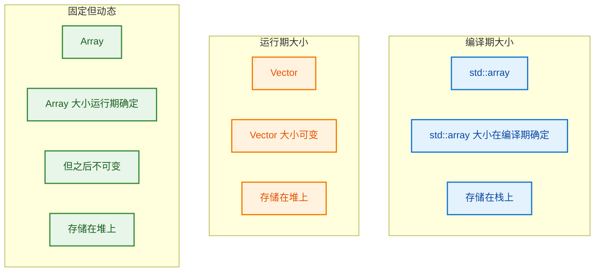
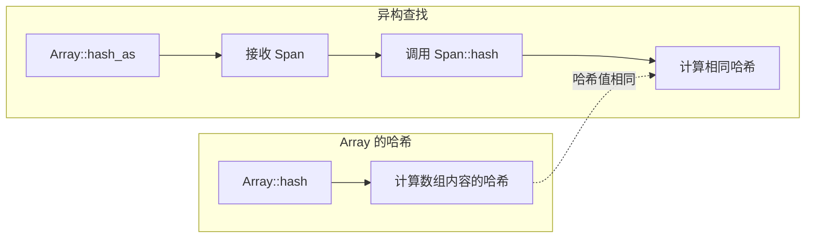
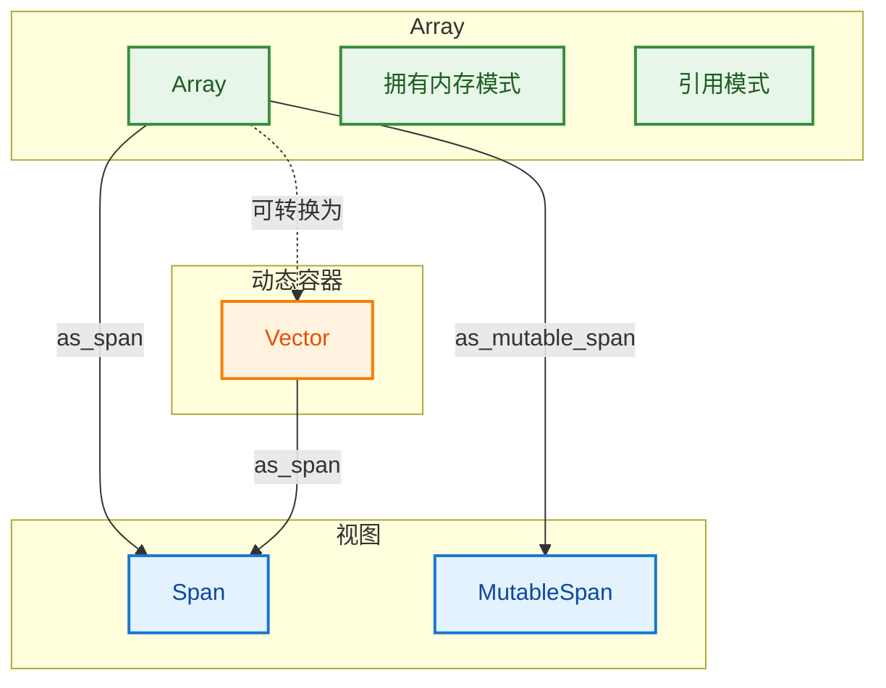

# Array - 固定大小数组

> 编译期确定大小的数组容器，支持动态分配但大小不可变
- [Array - 固定大小数组](#array---固定大小数组)
  - [📖 源码注释翻译](#-源码注释翻译)
  - [🏗️ 核心概念](#️-核心概念)
    - [Array vs Vector vs std::array](#array-vs-vector-vs-stdarray)
  - [💡 基本用法](#-基本用法)
    - [构造方式](#构造方式)
    - [与 Vector 的关键区别](#与-vector-的关键区别)
  - [🔧 高级特性详解](#-高级特性详解)
    - [1. 异构查找支持 - `hash_as()` (BLI\_array.hh:381~384)](#1-异构查找支持---hash_as-bli_arrayhh381384)
    - [2. 类型转换构造函数 (BLI\_span.hh:99~105)](#2-类型转换构造函数-bli_spanhh99105)
    - [3. Array 作为引用类型](#3-array-作为引用类型)
  - [📊 性能对比](#-性能对比)
    - [编译器优化](#编译器优化)
    - [内存布局](#内存布局)
  - [✅ 最佳实践](#-最佳实践)
    - [什么时候用 Array？](#什么时候用-array)
    - [示例：网格顶点处理](#示例网格顶点处理)
  - [🔗 与其他组件的关系](#-与其他组件的关系)
  - [✅ 总结](#-总结)
  - [🤔 深度问题解答](#-深度问题解答)
    - [问题 1: 为什么小于100时 InlineBufferCapacity 是 4？](#问题-1-为什么小于100时-inlinebuffercapacity-是-4)
    - [问题 2: `InlineBufferCapacity = default_inline_buffer_capacity(sizeof(T))` 是什么？](#问题-2-inlinebuffercapacity--default_inline_buffer_capacitysizeoft-是什么)
    - [问题 3: `BLI_NO_UNIQUE_ADDRESS`、`allocator_`、`TypedBuffer` 是什么？](#问题-3-bli_no_unique_addressallocator_typedbuffer-是什么)
      - [3.1 `BLI_NO_UNIQUE_ADDRESS` 是什么？](#31-bli_no_unique_address-是什么)
      - [3.2 `allocator_` 是什么？](#32-allocator_-是什么)
      - [3.3 `TypedBuffer<T, N>` 是什么？](#33-typedbuffert-n-是什么)
    - [问题 4: `noexcept` 是什么？](#问题-4-noexcept-是什么)
    - [问题 5: `NoExceptConstructor` 和 `NoInitialization` 是什么？](#问题-5-noexceptconstructor-和-noinitialization-是什么)
      - [5.1 `NoExceptConstructor`](#51-noexceptconstructor)
      - [5.2 `NoInitialization`](#52-noinitialization)
    - [问题 6: 逐个解释 Array 的构造函数](#问题-6-逐个解释-array-的构造函数)
      - [6.1 默认构造函数](#61-默认构造函数)
      - [6.2 NoExceptConstructor 版本](#62-noexceptconstructor-版本)
      - [6.3 从 Span 构造（复制数据）](#63-从-span-构造复制数据)
      - [6.4 从初始化列表构造](#64-从初始化列表构造)
      - [6.5 指定大小构造（默认初始化）](#65-指定大小构造默认初始化)
      - [6.6 指定大小和初始值构造](#66-指定大小和初始值构造)
      - [6.7 不初始化构造](#67-不初始化构造)
      - [6.8 拷贝构造](#68-拷贝构造)
      - [6.9 移动构造](#69-移动构造)
  - [📚 构造函数总结表](#-构造函数总结表)

---

## 📖 源码注释翻译

> **文件头注释 (BLI_array.hh:7~15):**
> ```cpp
> /** \file
>  * \ingroup bli
>  *
>  * An `Array<T>` is a container that encapsulates a dynamically allocated fixed size array.
>  * In contrast to `Vector`, the size is determined during construction and cannot be changed
>  * afterwards. The main benefit of using this over `Vector` is that the compiler knows that the
>  * size does not change, which results in better generated code in many cases.
>  * An `Array` can also be used as a reference type to an existing array. In that case it does not
>  * own the memory.
>  *
>  * In most cases `Array` should be used with `std::unique_ptr<T[]>` as allocator. Using the default
>  * allocator (`GuardedAllocator`) is useful for debugging purposes.
>  */
> ```

**翻译：**

`Array<T>` 是一个封装了**动态分配的固定大小数组**的容器。与 `Vector` 不同，大小在构造时确定且之后**不能改变**。使用 `Array` 而不是 `Vector` 的主要好处是**编译器知道大小不会改变**，这在许多情况下会产生更好的生成代码。`Array` 也可以用作**引用类型**指向现有数组，这种情况下它不拥有内存。

在大多数情况下，`Array` 应该与 `std::unique_ptr<T[]>` 一起用作分配器。使用默认分配器 (`GuardedAllocator`) 对调试很有用。

---

## 🏗️ 核心概念

### Array vs Vector vs std::array



| 特性 | `std::array<T, N>` | `Vector<T>` | `Array<T>` |
|------|-------------------|-------------|------------|
| **大小确定时机** | 编译期 | 运行期 | 运行期 |
| **大小可变性** | ❌ 固定 | ✅ 可变 | ❌ 固定 |
| **存储位置** | **栈** | **堆** | **堆** |
| **默认构造** | N个元素 | 0个元素 | 必须指定大小 |
| **适用场景** | 编译期已知大小 | 大小经常变化 | 运行期确定后不变 |

**为什么 `std::array` 存在栈上，而 `Array` 存在堆上？**

这是由它们的**设计目标**决定的：

**`std::array` - 编译期确定大小 → 栈分配**
```cpp
std::array<int, 100> arr;  // 100 在编译期已知
// 编译器知道需要 100 * 4 = 400 字节
// 直接在栈上分配 400 字节
```

**`Array` - 运行期确定大小 → 堆分配**
```cpp
int n = get_user_input();  // n 在运行期才能知道
Array<int> arr(n);         // 编译器不知道需要多少内存
// 必须在堆上动态分配
```

**栈 vs 堆 的区别：**

| 特性 | 栈 (Stack) | 堆 (Heap) |
|------|-----------|-----------|
| **分配时机** | 编译期确定 | 运行期确定 |
| **分配速度** | ⚡ 极快（一条指令） | 🐢 较慢（系统调用） |
| **大小限制** | 📏 很小（通常 1-8 MB） | 💾 很大（可用内存） |
| **生命周期** | 自动（作用域结束释放） | 手动（需要 delete/free） |
| **碎片** | ❌ 无 | ✅ 有 |
| **灵活性** | ❌ 大小固定 | ✅ 大小可变 |

**优缺点对比：**

**`std::array`（栈）的优缺点：**
- ✅ **优点：** 分配极快、无内存碎片、CPU缓存友好
- ❌ **缺点：** 大小必须在编译期知道、大小受限（不能太大）

**`Array`（堆）的优缺点：**
- ✅ **优点：** 大小运行期确定、可以很大（受限于可用内存）
- ❌ **缺点：** 分配较慢、可能产生内存碎片、需要指针间接访问

**什么时候用什么？**

```cpp
// ✅ 用 std::array：编译期知道大小，且不大
std::array<int, 4> small_data;  // 4个int = 16字节，栈分配很快

// ✅ 用 Array：运行期才知道大小
int vertex_count = mesh.vertex_count();  // 运行期读取文件才知道
Array<float3> vertices(vertex_count);     // 可能很大，用堆分配

// ❌ 错误：std::array 不能用于运行期大小
int n = get_input();
std::array<int, n> bad;  // 编译错误！n 不是编译期常量

// ❌ 错误：Array 不适合小且大小固定的情况
Array<int> arr(4);  // 可以工作，但比 std::array<int, 4> 慢
```

---

## 💡 基本用法

### 构造方式

```cpp
#include "BLI_array.hh"

using namespace blender;

// 方式1：指定大小，默认构造元素
Array<int> arr1(5);  // [0, 0, 0, 0, 0]

// 方式2：指定大小和初始值
Array<int> arr2(5, 42);  // [42, 42, 42, 42, 42]

// 方式3：从初始化列表构造
Array<int> arr3 = {1, 2, 3, 4, 5};  // [1, 2, 3, 4, 5]

// 方式4：从 Span 构造（复制数据）
Span<int> span = ...;
Array<int> arr4(span);  // 复制 span 的数据

// 方式5：引用外部数据（不拥有内存）
int external_data[10];
Array<int> arr5(external_data, 10, NoValueConstruction());
// arr5 只是引用 external_data，不分配内存，不拥有数据
```

### 与 Vector 的关键区别

```cpp
// Vector：大小可变
Vector<int> vec;
vec.append(1);  // ✅ 可以添加元素
vec.append(2);
vec.append(3);  // vec = [1, 2, 3]

// Array：大小固定
Array<int> arr(3);
arr[0] = 1;
arr[1] = 2;
arr[2] = 3;
// arr.append(4);  // ❌ 编译错误！Array 没有 append 方法
```

**⚠️ 重要澄清：Array 没有 append 方法！**

```cpp
// ❌ 错误理解：
Array<int> arr;  // 空数组
arr.append(1);   // ❌ 编译错误！Array 没有 append
arr.append(2);   // ❌ 编译错误！

// ✅ 正确使用：
// 方式1：构造时指定大小
Array<int> arr(3);  // 大小为 3
arr[0] = 1;         // ✅ 赋值已有元素
arr[1] = 2;
arr[2] = 3;

// 方式2：用初始化列表
Array<int> arr = {1, 2, 3};  // 大小为 3

// 方式3：用 Vector（如果需要 append）
Vector<int> vec;
vec.append(1);  // ✅ Vector 有 append
vec.append(2);
vec.append(3);
```

**为什么 Array 没有 append？**

```cpp
// Array 的设计目标：大小固定
Array<int> arr(3);  // 构造时就确定了大小为 3

// 内存布局：
// [size_=3][data_指向内存][元素0][元素1][元素2]
//                      ↑
//                     已经分配好 3 个元素的空间

// 没有多余空间给 append！
// 如果需要 append，应该用 Vector
```

**如果需要 append，用 Vector**

```cpp
// 不确定大小时，用 Vector
Vector<int> vec;
vec.append(1);  // ✅ 动态扩容
vec.append(2);
vec.append(3);

// 确定大小后，可以转为 Array（如果需要）
Array<int> arr(vec.size());
for (int i : vec.index_range()) {
    arr[i] = vec[i];
}
```

---

## 🔧 高级特性详解

### 1. 异构查找支持 - `hash_as()` (BLI_array.hh:381~384)

**源码：**
```cpp
static uint64_t hash_as(const Span<T> values)
{
  return values.hash();
}
```

**这是什么？**

`hash_as()` 是一个**静态方法**，用于支持**异构查找**（Heterogeneous Lookup）。它允许用 `Span<T>` 来查找 `Array<T>`，而不需要构造 `Array`。

**什么是静态方法（Static Method）？**

```cpp
class Array {
public:
    // 普通方法（实例方法）：必须通过对象调用
    uint64_t hash() const;  // 需要 Array 对象
    
    // 静态方法：不需要对象，直接通过类名调用
    static uint64_t hash_as(const Span<T> values);  // 不需要 Array 对象
};

// 使用对比：
Array<int> arr = {1, 2, 3};
uint64_t h1 = arr.hash();           // ✅ 普通方法：需要 arr 对象

uint64_t h2 = Array<int>::hash_as(span);  // ✅ 静态方法：不需要 Array 对象，直接用类名
// 或者：
uint64_t h3 = arr.hash_as(span);    // ✅ 也可以用对象调用（但没必要）
```

**静态方法的特点：**
1. **不依赖对象**：不需要创建类的实例就能调用
2. **没有 `this` 指针**：不能访问非静态成员变量
3. **通过类名调用**：`ClassName::method()`

**Python 类比：**
```python
class Array:
    # 实例方法（普通方法）
    def hash(self):           # 需要 self
        return hash(self.data)
    
    # 静态方法
    @staticmethod
    def hash_as(values):      # 不需要 self
        return hash(values)

# 使用：
arr = Array([1, 2, 3])
h1 = arr.hash()             # 实例方法

h2 = Array.hash_as([1,2,3]) # 静态方法，不需要创建 Array 对象
```

---

**什么是异构查找（Heterogeneous Lookup）？**

**"异构"** = **"不同类型"**

```cpp
// 同构查找（Homogeneous）：键的类型必须相同
Set<Array<int>> set;
set.add(Array<int>{1, 2, 3});  // 存储 Array<int>

Array<int> key = {1, 2, 3};
set.contains(key);  // ✅ 相同类型：Array<int> 查找 Array<int>

// 异构查找（Heterogeneous）：可以用不同类型查找
Span<int> span = {1, 2, 3};  // 不同类型：Span<int>
set.contains_as(span);        // ✅ 不同类型查找：Span<int> 查找 Array<int>
```

**为什么要异构查找？**

```cpp
// 场景：你有一个 C 数组，想在 Set<Array<int>> 中查找
int data[] = {1, 2, 3};  // C 数组

// ❌ 没有异构查找时：必须构造 Array（堆分配！）
Array<int> key(3);
key[0] = data[0]; key[1] = data[1]; key[2] = data[2];
bool found = set.contains(key);  // 需要堆分配

// ✅ 有异构查找时：直接用 Span 包装（无堆分配）
Span<int> span(data, 3);         // 只是指针+大小，栈上创建
bool found = set.contains_as(span);  // 无需堆分配
```

**Python 类比：**

```python
# Python 的 dict 支持异构查找（通过 __hash__ 和 __eq__）
d = {"hello": 1}  # 键是 str

# 同构查找：str 查找 str
"hello" in d  # True

# Python 的 str 和 bytes 哈希不兼容，所以不能用 bytes 查找
b"hello" in d  # False（哈希值不同）

# 如果 Python 支持类似 C++ 的异构查找：
# d.contains_as(b"hello")  # 理论上可以设计为 True
```

**更贴切的 Python 类比：字典的键类型转换**

```python
# Python 中，dict 的键必须可哈希
# 但 numpy 数组不能直接当 dict 键
import numpy as np
arr = np.array([1, 2, 3])

# ❌ 错误：numpy 数组不可哈希
d = {arr: "value"}  # TypeError

# ✅ 解决：转换为 tuple（类似 C++ 的异构查找思想）
d = {tuple(arr): "value"}  # 可以
key = np.array([1, 2, 3])
if tuple(key) in d:  # 用不同类型（tuple）查找原类型（numpy 数组）
    print("Found!")
```

**总结：**

| 概念 | C++ | Python 类比 |
|------|-----|------------|
| **静态方法** | `static uint64_t hash_as(...)` | `@staticmethod def hash_as(...)` |
| **异构查找** | `set.contains_as(span)` | 用不同类型查找，类似 `tuple(arr)` 查 `numpy` |
| **目的** | 避免构造对象的开销 | 避免类型转换的开销 |

**为什么要这样设计？**

```cpp
// 场景：在 Set<Array<int>> 中查找
Set<Array<int>> arrays;
arrays.add(Array<int>{1, 2, 3});

// ❌ 没有 hash_as 时：必须构造 Array
Array<int> key(3);
key[0] = 1; key[1] = 2; key[2] = 3;
bool found = arrays.contains(key);  // 需要构造 Array（堆分配！）

// ✅ 有 hash_as 时：可以用 Span 查找
int data[] = {1, 2, 3};  // data 在栈上，编译器分配，已经存在
Span<int> key_span(data, 3);  // Span 只是包装指针+大小，自己不分配内存
bool found = arrays.contains_as(key_span);  // 无需构造 Array（无需堆分配）

// 详细解释：
// 1. int data[] = {1, 2, 3}; 
//    → 编译器在栈上分配 3 * sizeof(int) = 12 字节
//    → 这块内存本来就存在，不是 Span 分配的
//
// 2. Span<int> key_span(data, 3);
//    → Span 内部只有两个成员：const int* data_ 和 int64_t size_
//    → 只是保存指针和大小，不分配新的内存来存储 {1, 2, 3}
//    → 相当于：struct Span { const int* data_; int64_t size_; };
//    → 总大小：8 + 8 = 16 字节（在栈上）
//
// 3. 对比：构造 Array 需要堆分配
//    Array<int> arr(3);  // 在堆上分配 12 字节，还要记录大小、分配器等
```

**为什么方法名以 `_as` 结尾？**

这是 Blender 基础库的**命名约定**，表示**"用不同类型查找"**：

| 方法 | 含义 | 示例 |
|------|------|------|
| `contains(key)` | 用相同类型查找 | `set.contains(Array{1,2,3})` |
| `contains_as(span)` | 用 Span 类型查找 | `set.contains_as(Span{...})` |
| `lookup(key)` | 用相同类型查找 | `map.lookup("hello")` |
| `lookup_as(ref)` | 用 StringRef 查找 | `map.lookup_as(StringRef{"hello"})` |

**`_as` 的含义："as" = "作为..."，即用不同类型的键进行查找。**

**为什么用 Set 举例而不是直接计算 Span 的 hash？**

```cpp
// 直接计算 Span 的 hash 当然可以：
Span<int> span(data, 3);
uint64_t h = span.hash();  // ✅ 可以计算

// 但问题是：如何在 Set<Array<int>> 中查找？
Set<Array<int>> set;
set.add(Array<int>{1, 2, 3});  // 存储的是 Array

// 查找时需要比较哈希值
// Array{1,2,3}.hash() 必须等于 Span{1,2,3}.hash()
// 这就是 hash_as() 的作用：确保两者哈希一致！

// 如果不一致：
Array{1,2,3}.hash()  !=  Span{1,2,3}.hash()  // ❌ 找不到！

// 有了 hash_as()：
Array{1,2,3}.hash()  ==  Array::hash_as(Span{1,2,3})  // ✅ 一致！
```

**关键点：**
- `hash_as()` 不是给用户直接调用的
- 它是给 **Set/Map 内部** 使用的，确保异构查找时哈希一致
- 用户只需要调用 `contains_as()`，`hash_as()` 在内部自动使用

**工作原理：**



**完整示例：**

```cpp
// Array 的哈希方法
uint64_t hash() const
{
  return this->as_span().hash();  // 转换为 Span 后计算哈希
}

// 静态方法：支持异构查找
static uint64_t hash_as(const Span<T> values)
{
  return values.hash();  // 直接计算 Span 的哈希
}

// 两者计算方式相同，确保哈希一致！
Array<int> arr = {1, 2, 3};
Span<int> span = arr;

assert(arr.hash() == Array<int>::hash_as(span));  // ✅ 相同
```

**优势：**
- **避免内存分配**：不需要构造 `Array`，用 `Span` 即可查找
- **性能更好**：`Span` 只是指针+大小，零拷贝
- **灵活性**：可以用任何连续内存（C数组、Vector数据等）进行查找

---

### 2. 类型转换构造函数 (BLI_span.hh:99~105)

**源码：**
```cpp
template<typename U>
constexpr Span(const U *start, int64_t size)
  requires(is_span_convertible_pointer_v<U, T>)
    : data_(static_cast<const T *>(start)), size_(size)
{
  BLI_assert(size >= 0);
}
```

**这是什么？**

这是一个**模板构造函数**，允许从**派生类指针**构造**基类指针**的 `Span`。

**`is_span_convertible_pointer_v` 是什么？**

```cpp
// 定义在 BLI_memory_utils.hh:252
inline constexpr bool is_span_convertible_pointer_v =
    /* 确保是指针 */
    std::is_pointer_v<From> && std::is_pointer_v<To> &&
    (
        /* 类型相同 */
        std::is_same_v<From, To> ||
        /* 允许添加 const */
        std::is_same_v<std::remove_pointer_t<From>, 
                       std::remove_const_t<std::remove_pointer_t<To>>> ||
        /* 允许非 const 指针转 void* */
        (!std::is_const_v<std::remove_pointer_t<From>> && 
         std::is_same_v<To, void *>) ||
        /* 允许任何指针转 const void* */
        std::is_same_v<To, const void *>
    );
```

**简单说，它检查：**
1. 两者都是指针
2. 满足以下之一：
   - 类型完全相同
   - 允许添加 const（`int*` → `const int*`）
   - 允许转 `void*`
   - 允许转 `const void*`

**使用场景：**

```cpp
class Base { /* ... */ };
class Derived : public Base { /* ... */ };

// 场景1：派生类指针转基类指针
Derived derived_data[10];

// ✅ 可以构造 Span<Base>，因为 Derived* 可以转为 Base*
Span<Base> base_span(derived_data, 10);

// 场景2：非 const 转 const
int data[] = {1, 2, 3};

// ✅ 可以构造 Span<const int>，允许添加 const
Span<const int> const_span(data, 3);

// 场景3：错误用法
const int const_data[] = {1, 2, 3};

// ❌ 不能构造 Span<int>，不允许移除 const
// Span<int> mutable_span(const_data, 3);  // 编译错误！
```

**为什么需要这个构造函数？**

```cpp
// 示例：几何处理函数接收 Span<float3>
void process_vertices(Span<float3> positions);

// 你有 float4 数据（齐次坐标）
struct float4 { float x, y, z, w; };
float4 vertices[100];

// ❌ 没有模板构造函数时：
// 需要手动转换每个元素

// ✅ 有模板构造函数时：
// 如果 float4 可以隐式转为 float3
process_vertices(Span<float3>(vertices, 100));
```

**C++20 `requires` 子句：**

```cpp
template<typename U>
constexpr Span(const U *start, int64_t size)
  requires(is_span_convertible_pointer_v<U, T>)  // 约束条件
```

这表示：**只有当 `U*` 可以转换为 `T*` 时，这个构造函数才参与重载决议**。

如果不满足条件，编译器会**安静地忽略**这个构造函数，而不是报错。

---

### 3. Array 作为引用类型

**重要特性：** `Array` 可以不拥有内存，只是引用外部数据。

```cpp
// 外部数据
int external_data[5] = {1, 2, 3, 4, 5};

// 创建引用 Array（不拥有内存）
Array<int> ref_array(external_data, 5, NoValueConstruction());

// 使用 ref_array 就像使用普通 Array
int first = ref_array[0];  // 1
ref_array[1] = 100;        // 修改 external_data[1]

// ref_array 析构时不会释放内存，因为它不拥有数据
```

**与 Span 的区别：**

| 特性 | Array（引用模式） | Span |
|------|------------------|------|
| **拥有数据** | 可选（构造时决定） | ❌ 永不拥有 |
| **可修改** | ✅ 可以 | `MutableSpan` 可以 |
| **大小存储** | 内部存储 size_ | 内部存储 size_ |
| **用途** | 需要 Array 接口但不想分配 | 只读/可写视图 |

---

## 📊 性能对比

### 编译器优化

由于 `Array` 的大小在构造后不变，编译器可以进行更多优化：

```cpp
// Array：编译器知道大小不变
Array<float> arr(4);
for (int64_t i = 0; i < arr.size(); i++) {  // arr.size() 是常量
    arr[i] *= 2;
}
// 编译器可以展开循环，因为大小固定

// Vector：编译器不知道大小是否变化
Vector<float> vec(4);
for (int64_t i = 0; i < vec.size(); i++) {  // vec.size() 可能变化
    vec[i] *= 2;
}
// 编译器必须每次检查大小
```

### 内存布局

```cpp
// Array 的内存布局
Array<int> arr(4);
// [size_] [allocator_] [data_] --> [int][int][int][int]
//   8        8            8         堆上分配的数组

// std::array 的内存布局
std::array<int, 4> std_arr;
// [int][int][int][int]
// 全部在栈上，无额外开销
```

---

## ✅ 最佳实践

### 什么时候用 Array？

| 场景 | 推荐 | 原因 |
|------|------|------|
| 编译期已知大小 | `std::array` | 栈分配，零开销 |
| 运行期确定大小后不变 | `Array` | 编译器优化更好 |
| 大小可能变化 | `Vector` | 灵活性 |
| 只需要视图 | `Span` | 零拷贝 |

### 示例：网格顶点处理

```cpp
// 读取网格顶点数（运行期确定）
int64_t vertex_count = mesh.vertex_count();

// 分配固定大小的数组
Array<float3> positions(vertex_count);
Array<float3> normals(vertex_count);
Array<float2> uvs(vertex_count);

// 填充数据（大小不会变化）
for (int64_t i = 0; i < vertex_count; i++) {
    positions[i] = mesh.vertex_position(i);
    normals[i] = mesh.vertex_normal(i);
    uvs[i] = mesh.vertex_uv(i);
}

// 传递给处理函数
process_mesh(Span<float3>(positions), 
             Span<float3>(normals), 
             Span<float2>(uvs));
```

---

## 🔗 与其他组件的关系



---

## ✅ 总结

| 特性 | 说明 |
|------|------|
| **大小固定** | 构造后不可改变，编译器可优化 |
| **堆分配** | 大小运行期确定，可处理大数据 |
| **两种模式** | 拥有内存 或 引用外部数据 |
| **异构查找** | `hash_as()` 支持用 Span 查找 |
| **类型转换** | 支持派生类指针构造基类 Span |
| **与 Vector 互操作** | 可转换为 Span，便于函数接口 |

---

## 🤔 深度问题解答

### 问题 1: 为什么小于100时 InlineBufferCapacity 是 4？

**源码位置：** `BLI_memory_utils.hh:269~277`

```cpp
constexpr int64_t default_inline_buffer_capacity(size_t element_size)
{
  return (int64_t(element_size) < 100) ? 4 : 0;
}
```

**解释：**

这是**小对象优化（Small Object Optimization, SOO）**的策略：

```cpp
// 如果元素大小 < 100 字节，内联缓冲区可以存 4 个元素
// 如果元素大小 >= 100 字节，禁用内联缓冲区
```

**为什么是 100 字节？**

```cpp
// 100 字节是一个经验阈值：
// - 小于 100 字节：认为是"小对象"，适合栈上缓存
// - 大于等于 100 字节：认为是"大对象"，避免意外的大栈分配

// 示例：
Array<int> arr(10);           // int = 4 字节 < 100，内联容量 = 4
// 内存布局：inline_buffer_[4] + 堆分配剩余 6 个

Array<BigStruct> arr(10);     // BigStruct = 200 字节 >= 100，内联容量 = 0
// 内存布局：无内联缓冲区，全部堆分配
```

**为什么是 4 个元素？**

```cpp
// 4 个元素是一个折中选择：
// - 足够小：不会占用太多栈空间（最大 4 * 100 = 400 字节）
// - 足够大：覆盖很多常见的小数组场景

// 常见场景：
Array<float3> positions(4);   // 3D 模型的 4 个顶点（四边形）
// float3 = 12 字节 < 100，内联容量 = 4
// 正好 4 个顶点可以完全存在内联缓冲区，无需堆分配！
```

**小对象优化的好处：**

```cpp
// 场景：函数返回小数组
Array<int> get_small_array() {
    Array<int> arr(3);  // 3 个 int = 12 字节 < 100
    // 内联容量 = 4，所以 3 个元素完全存在栈上
    // 无需堆分配！
    arr[0] = 1; arr[1] = 2; arr[2] = 3;
    return arr;  // 移动语义，高效返回
}

// 对比没有 SOO：
// Array<int> arr(3);  // 必须堆分配 12 字节
// 堆分配是系统调用，比栈分配慢 100 倍以上！
```

---

### 问题 2: `InlineBufferCapacity = default_inline_buffer_capacity(sizeof(T))` 是什么？

**源码位置：** `BLI_array.hh:44`

```cpp
template<
    typename T,
    int64_t InlineBufferCapacity = default_inline_buffer_capacity(sizeof(T)),
    typename Allocator = GuardedAllocator>
class Array {
```

**解释：**

这是 C++ 的**默认模板参数**：

```cpp
// 完整写法（显式指定所有参数）：
Array<int, 4, GuardedAllocator> arr(10);
//      ↑T  ↑InlineBufferCapacity  ↑Allocator

// 简写（使用默认值）：
Array<int> arr(10);
// 编译器自动推导：
// InlineBufferCapacity = default_inline_buffer_capacity(sizeof(int))
//                      = default_inline_buffer_capacity(4)
//                      = 4  // 因为 4 < 100
```

**模板参数 vs 函数参数：**

```cpp
// 模板参数：编译期确定，影响类型
Array<int, 4> arr1;   // 类型是 Array<int, 4>
Array<int, 8> arr2;   // 类型是 Array<int, 8>（不同类型！）

// 函数参数：运行期确定，不影响类型
Array<int> arr(10);   // 10 是运行期参数
Array<int> arr(20);   // 同一个类型 Array<int>
```

**为什么要用模板参数？**

```cpp
// 内联缓冲区大小必须在编译期确定：
template<int64_t InlineBufferCapacity>
class Array {
    TypedBuffer<T, InlineBufferCapacity> inline_buffer_;
    // 编译器需要知道 InlineBufferCapacity 才能确定 inline_buffer_ 的大小
};

// 如果 InlineBufferCapacity 是运行期参数：
class Array {
    // 错误！编译器不知道要分配多少内存
    TypedBuffer<T, ?> inline_buffer_;  // ❌ 不可能！
};
```

---

### 问题 3: `BLI_NO_UNIQUE_ADDRESS`、`allocator_`、`TypedBuffer` 是什么？

**源码位置：** `BLI_array.hh:69,72`

```cpp
/** Used for allocations when the inline buffer is too small. */
BLI_NO_UNIQUE_ADDRESS Allocator allocator_;

/** A placeholder buffer that will remain uninitialized until it is used. */
BLI_NO_UNIQUE_ADDRESS TypedBuffer<T, InlineBufferCapacity> inline_buffer_;
```

#### 3.1 `BLI_NO_UNIQUE_ADDRESS` 是什么？

**宏定义位置：** `BLI_utildefines.h:573~583`

```cpp
#if defined(_MSC_VER) && !defined(__clang__)
#  define BLI_NO_UNIQUE_ADDRESS [[msvc::no_unique_address]]
#elif defined(__has_cpp_attribute)
#  if __has_cpp_attribute(no_unique_address)
#    define BLI_NO_UNIQUE_ADDRESS [[no_unique_address]]
#  else
#    define BLI_NO_UNIQUE_ADDRESS  // 空定义
#  endif
#else
#  define BLI_NO_UNIQUE_ADDRESS [[no_unique_address]]
#endif
```

**逐行详细解释：**

```cpp
#if defined(_MSC_VER) && !defined(__clang__)
```
**检查是否是 MSVC 编译器（且不是 Clang-cl）**
- `_MSC_VER`：微软 Visual C++ 编译器定义的宏，表示版本号
- `!defined(__clang__)`：排除 Clang（Clang 可以伪装成 MSVC，但有 `__clang__` 宏）
- **为什么特殊处理 MSVC？** 微软对 C++ 标准的实现有时有自己的语法

```cpp
#  define BLI_NO_UNIQUE_ADDRESS [[msvc::no_unique_address]]
```
**MSVC 专用语法**：微软要求加上 `msvc::` 命名空间前缀
- 标准 C++20 是 `[[no_unique_address]]`
- MSVC 要求写成 `[[msvc::no_unique_address]]`

---

```cpp
#elif defined(__has_cpp_attribute)
```
**检查编译器是否支持 `__has_cpp_attribute` 特性测试宏**
- `__has_cpp_attribute` 是 C++20 引入的**特性测试宏**
- 作用：**在编译期检查**编译器是否支持某个 C++ 属性
- 支持此宏的编译器：GCC 5+、Clang 3.6+、MSVC 2017+

```cpp
#  if __has_cpp_attribute(no_unique_address)
```
**检查是否支持 `no_unique_address` 属性**
- `__has_cpp_attribute(x)` 返回 1（支持）或 0（不支持）
- 这允许在**编译期**检测特性，而不是硬编码编译器版本

```cpp
#    define BLI_NO_UNIQUE_ADDRESS [[no_unique_address]]
```
**支持！使用标准 C++20 语法**

```cpp
#  else
#    define BLI_NO_UNIQUE_ADDRESS  // 空定义
#  endif
```
**不支持！定义为空**
- 空定义意味着宏展开后什么都没有
- 代码 `BLI_NO_UNIQUE_ADDRESS Allocator allocator_;` 变成 `Allocator allocator_;`
- 功能回退到 C++17 行为（有内存浪费，但能编译运行）

---

```cpp
#else
#  define BLI_NO_UNIQUE_ADDRESS [[no_unique_address]]
#endif
```
**兜底分支：不支持 `__has_cpp_attribute` 的老编译器**
- 假设支持 C++20（或者希望编译失败来提醒用户）
- 直接使用标准语法
- 如果不支持，编译会报错，用户就知道需要升级编译器

---

**条件分支流程图：**

```
开始
  │
  ▼
是 MSVC 且不是 Clang? ──Yes──► 定义 [[msvc::no_unique_address]]
  │ No
  ▼
支持 __has_cpp_attribute? ──No──► 定义 [[no_unique_address]]（兜底）
  │ Yes
  ▼
支持 no_unique_address? ──Yes──► 定义 [[no_unique_address]]
  │ No
  ▼
定义为空（回退）
```

**为什么这样设计？**

| 编译器 | 处理方式 | 原因 |
|--------|---------|------|
| MSVC | `[[msvc::no_unique_address]]` | 微软要求 vendor 前缀 |
| GCC/Clang (新) | `[[no_unique_address]]` | 标准 C++20 语法 |
| GCC/Clang (旧) | 空定义 | 优雅降级，不影响功能 |
| 其他 | `[[no_unique_address]]` | 假设支持 C++20 |

**什么是 `__has_cpp_attribute`？**

```cpp
// C++20 特性测试机制的一部分
// 允许在编译期检查编译器支持哪些特性

// 使用示例：
#if __has_cpp_attribute(no_unique_address)
    // 编译器支持 no_unique_address
#else
    // 编译器不支持，需要替代方案
#endif

// 其他可测试的特性：
__has_cpp_attribute(nodiscard)      // 检查 [[nodiscard]]
__has_cpp_attribute(maybe_unused)   // 检查 [[maybe_unused]]
__has_cpp_attribute(deprecated)     // 检查 [[deprecated]]
```

**为什么不用编译器版本号判断？**

```cpp
// ❌ 不推荐：硬编码版本号
#if GCC_VERSION >= 110000  // GCC 11.0
    // 但 GCC 11 一定支持吗？可能编译选项不同
#endif

// ✅ 推荐：特性测试
#if __has_cpp_attribute(no_unique_address)
    // 实际测试是否支持，更准确
#endif
```

**特性测试的优势：**
1. **准确**：实际测试特性，不是猜测版本
2. **灵活**：同一版本编译器可能有不同配置
3. **未来兼容**：新编译器自动支持，无需更新代码

**这是什么？**

`BLI_NO_UNIQUE_ADDRESS` 是 C++20 特性 `[[no_unique_address]]` 的跨平台包装宏，用于**空基类优化（Empty Base Optimization, EBO）**。

**为什么空类也会占用内存？**

```cpp
class Empty {};  // 空类，没有成员变量

// 问题：C++ 规定每个对象至少占用 1 字节！
Empty e;
sizeof(e);  // 1（不是 0！）

// 原因：每个对象必须有唯一的内存地址
Empty e1, e2;
&e1 != &e2;  // 必须不同，所以需要至少 1 字节来区分
```

**问题场景：**

```cpp
class Empty {};

class Wrapper {
    Empty e;      // 占用 1 字节
    int x;        // 占用 4 字节
    // 填充 3 字节（对齐到 4 字节边界）
};

sizeof(Wrapper);  // 可能是 8（不是 5！）
// 内存布局：[Empty:1][padding:3][int x:4] = 8 字节
```

**解决方案：`[[no_unique_address]]`**

```cpp
class Wrapper {
    [[no_unique_address]] Empty e;  // 提示编译器：可以与其他成员共享地址
    int x;
};

sizeof(Wrapper);  // 4！Empty 不占额外空间
// 内存布局：[int x:4]
// Empty e 与 x 共享地址（但不会被使用）
```

**编译器如何处理？**

```cpp
// 没有 [[no_unique_address]]
class Bad {
    Empty e;   // 地址：0x1000
    int x;     // 地址：0x1004（必须不同）
};

// 有 [[no_unique_address]]
class Good {
    [[no_unique_address]] Empty e;  // 地址：0x1000（与 x 共享）
    int x;                          // 地址：0x1000
};
// 注意：e 和 x 地址相同，但 e 是空类，不会访问它的数据，所以安全
```

**在 Blender 中的实际应用：**

```cpp
// GuardedAllocator 通常是空类（只有方法，没有成员变量）
class GuardedAllocator {
public:
    void* allocate(size_t size) { return MEM_mallocN(size, "Array"); }
    void deallocate(void* ptr) { MEM_freeN(ptr); }
    // 没有成员变量！sizeof(GuardedAllocator) = 1
};

// Array 的内存布局（没有 BLI_NO_UNIQUE_ADDRESS）：
class Array {
    Allocator allocator_;           // 1 字节 + 7 字节填充
    int64_t size_;                  // 8 字节
    T* data_;                       // 8 字节
    TypedBuffer<T, N> inline_buffer_; // N * sizeof(T) 字节
};
// 总大小：24 + N * sizeof(T) 字节（有浪费！）

// Array 的内存布局（有 BLI_NO_UNIQUE_ADDRESS）：
class Array {
    BLI_NO_UNIQUE_ADDRESS Allocator allocator_;  // 0 字节（与 size_ 共享）
    int64_t size_;                               // 8 字节
    T* data_;                                    // 8 字节
    BLI_NO_UNIQUE_ADDRESS TypedBuffer<T, N> inline_buffer_; // 优化布局
};
// 总大小：16 + N * sizeof(T) 字节（节省 8 字节！）
```

**为什么这很重要？**

```cpp
// 场景：创建大量小 Array
Array<int, 4> arr[1000];  // 1000 个 Array

// 没有 BLI_NO_UNIQUE_ADDRESS：
// 每个 Array 浪费 8 字节，总共浪费 8000 字节

// 有 BLI_NO_UNIQUE_ADDRESS：
// 每个 Array 节省 8 字节，总共节省 8000 字节
```

**跨平台兼容性：**

```cpp
// MSVC（微软编译器）
#define BLI_NO_UNIQUE_ADDRESS [[msvc::no_unique_address]]

// GCC/Clang（支持 C++20）
#define BLI_NO_UNIQUE_ADDRESS [[no_unique_address]]

// 旧编译器（不支持 C++20）
#define BLI_NO_UNIQUE_ADDRESS  // 空定义，不影响功能
```

**总结：**

| 特性 | 没有 `BLI_NO_UNIQUE_ADDRESS` | 有 `BLI_NO_UNIQUE_ADDRESS` |
|------|---------------------------|---------------------------|
| 空类大小 | 1 字节 + 填充 | 0 字节（共享地址） |
| Array 对象大小 | 24 + 缓冲区 | 16 + 缓冲区 |
| 内存浪费 | 有（对齐填充） | 无 |
| 兼容性 | 所有 C++ | C++20+（旧编译器忽略） |

#### 3.2 `allocator_` 是什么？

**分配器（Allocator）**：负责内存分配和释放的对象。

```cpp
// 简单理解：Allocator 是一个"内存分配器对象"
class Allocator {
public:
    // 分配内存
    void* allocate(size_t size) {
        return malloc(size);  // 或 new，或内存池，或...
    }
    
    // 释放内存
    void deallocate(void* ptr) {
        free(ptr);  // 或 delete，或归还内存池，或...
    }
};
```

**为什么需要分配器？**

**场景：不同的内存管理需求**

```cpp
// 场景1：普通程序 - 使用标准分配
Array<int> arr(100);  // 使用默认 GuardedAllocator
// 内部：allocator_.allocate(100 * sizeof(int))

// 场景2：调试模式 - 需要检测内存错误
Array<int, 4, GuardedAllocator> arr(100);
// GuardedAllocator 会在内存周围加"保护页"，检测越界访问

// 场景3：高性能 - 从内存池分配（避免频繁系统调用）
Array<int, 4, PoolAllocator> arr(100);
// PoolAllocator 预先分配一大块内存，从中切分小块

// 场景4：特殊对齐 - SIMD 需要 16/32 字节对齐
Array<int, 4, AlignedAllocator<32>> arr(100);
// AlignedAllocator 确保内存 32 字节对齐
```

**GuardedAllocator 具体做什么？**

```cpp
// 简化版 GuardedAllocator
class GuardedAllocator {
public:
    void* allocate(size_t size) {
        // 实际分配：size + 前缀 + 后缀保护区域
        void* ptr = MEM_mallocN(size + GUARD_SIZE * 2, "Array");
        
        // 在前缀和后缀填充特殊模式（如 0xDEADBEEF）
        fill_guard_pattern(ptr, GUARD_SIZE);
        fill_guard_pattern((char*)ptr + GUARD_SIZE + size, GUARD_SIZE);
        
        // 返回用户可用区域（跳过前缀保护）
        return (char*)ptr + GUARD_SIZE;
    }
    
    void deallocate(void* ptr) {
        // 检查保护区域是否被修改（越界检测）
        check_guard_pattern(ptr - GUARD_SIZE);
        
        // 释放实际分配的内存
        MEM_freeN((char*)ptr - GUARD_SIZE);
    }
};
```

**可视化**

```
普通分配器：
[用户数据]
  ↑ ptr

GuardedAllocator：
[前缀保护][用户数据][后缀保护]
            ↑ ptr（返回给用户）

如果用户越界写入：
[前缀保护][用户数据][被修改！]
                          ↑ 检测到 0xDEADBEEF 被修改 → 报错！
```

**默认分配器：GuardedAllocator**

```cpp
// 默认分配器：GuardedAllocator
Array<int> arr(10);
// 内部调用：allocator_.allocate(10 * sizeof(int))

// 自定义分配器：
Array<int, 4, MyAllocator> arr(10);
// 使用 MyAllocator 分配内存
```

**为什么需要分配器？总结**

```cpp
// 1. 灵活性：可以切换不同的内存管理策略
//    - GuardedAllocator：调试模式，检测内存错误
//    - std::allocator：标准分配器
//    - PoolAllocator：从内存池分配（更快）

// 2. 测试：可以用 mock 分配器测试内存分配行为

// 3. 特殊需求：某些平台可能需要特殊的内存对齐
```

#### 3.3 `TypedBuffer<T, N>` 是什么？

**类型化缓冲区**：一块可以存储 N 个 T 类型对象的原始内存。

```cpp
// 定义（简化）：
template<typename T, int64_t N>
class TypedBuffer {
    alignas(alignof(T)) char buffer_[sizeof(T) * N];
    // 原始字节数组，但对齐到 T 的对齐要求
};

// 用途：
TypedBuffer<int, 4> buffer;
// 内部：char buffer_[16];  // 4 * sizeof(int)
// 但这 16 字节是"未初始化"的原始内存

// 手动构造对象：
new (buffer.buffer_) int(42);  // placement new

// 手动析构对象：
((int*)buffer.buffer_)->~int();
```

**为什么需要 TypedBuffer？**

```cpp
// 问题：如果直接用 T array_[N]；
class Array {
    int inline_buffer_[4];  // 这 4 个 int 会被默认构造！
};

// 但 Array 需要延迟构造：
Array<int> arr;  // 初始为空，inline_buffer_ 应该未使用
arr[0] = 1;      // 现在才赋值第一个元素（注意：不是 append！）

// 解决方案：用原始内存，需要时才构造
class Array {
    TypedBuffer<int, 4> inline_buffer_;  // 原始内存，未构造
};
```

---

### 问题 4: `noexcept` 是什么？

**解释：**

`noexcept` 是 C++ 的**异常规范**，表示"这个函数不会抛出异常"。

```cpp
// 函数声明不会抛出异常
void func() noexcept;  // 承诺：我不会抛异常

// 如果函数抛异常：
void bad_func() noexcept {
    throw std::runtime_error("error");  // ❌ 程序会终止！
}
```

**为什么重要？**

```cpp
// 1. 性能优化
// 编译器知道 func 不会抛异常，可以生成更高效的代码
// （不需要生成异常处理的栈展开代码）

// 2. 移动语义
class MyClass {
public:
    // 移动构造函数标记 noexcept 很重要！
    MyClass(MyClass&& other) noexcept;  // ✅ 承诺不抛异常
};

std::vector<MyClass> vec;
vec.push_back(MyClass());  // 如果移动构造是 noexcept，vector 会优先使用移动
                          // 否则 vector 会使用拷贝（性能差）
```

**在 Array 中：**

```cpp
// BLI_array.hh:78
Array(Allocator allocator = {}) noexcept : allocator_(allocator)
{
    data_ = inline_buffer_;
    size_ = 0;
}
// 这个构造函数只是简单赋值，不会分配内存，所以标记 noexcept
```

---

### 问题 5: `NoExceptConstructor` 和 `NoInitialization` 是什么？

#### 5.1 `NoExceptConstructor`

**用途：** 标记构造函数为"不抛异常"，用于**委托构造**。

```cpp
// 源码位置：BLI_array.hh:84
Array(NoExceptConstructor, Allocator allocator = {}) noexcept : Array(allocator) {}

// 使用场景：
Array(NoExceptConstructor, Allocator allocator = {}) noexcept 
    : Array(allocator)  // 委托给另一个构造函数
{
    // 这个构造函数本身不抛异常（noexcept）
    // 它只是调用另一个构造函数
}
```

**为什么需要？**

```cpp
// 场景：多个构造函数共享初始化逻辑
class Array {
public:
    // 基础构造函数
    Array(Allocator allocator = {}) noexcept : allocator_(allocator) {
        data_ = inline_buffer_;
        size_ = 0;
    }
    
    // 其他构造函数可以"委托"给基础构造函数
    Array(NoExceptConstructor, Allocator allocator = {}) noexcept 
        : Array(allocator) {}  // 委托构造
    
    // 带大小的构造函数
    explicit Array(int64_t size, Allocator allocator = {}) 
        : Array(NoExceptConstructor(), allocator)  // 先委托给 noexcept 版本
    {
        // 然后执行额外的初始化
        data_ = this->get_buffer_for_size(size);
        default_construct_n(data_, size);
        size_ = size;
    }
};

// 关键点：
// 1. NoExceptConstructor 是一个空标签类型
// 2. 它区分了"基础构造"和"扩展构造"
// 3. 带大小的构造函数可能抛异常（内存分配失败），所以不能用 noexcept
```

#### 5.2 `NoInitialization`

**用途：** 创建**未初始化**的数组，跳过默认构造。

```cpp
// 源码位置：BLI_array.hh:168
Array(int64_t size, NoInitialization, Allocator allocator = {})
    : Array(NoExceptConstructor(), allocator)
{
    BLI_assert(size >= 0);
    data_ = this->get_buffer_for_size(size);
    size_ = size;
    // 注意：没有调用 default_construct_n！
}
```

**使用场景：**

```cpp
// 场景：你要手动构造每个元素
Array<std::string> arr(10, NoInitialization());
// arr 现在有 10 个未初始化的 std::string

// 手动构造
new (&arr[0]) std::string("hello");  // placement new
new (&arr[1]) std::string("world");
// ...

// ⚠️ 危险：如果忘记构造某个元素，使用它会导致未定义行为！
```

**为什么需要？**

```cpp
// 性能优化：避免不必要的默认构造
// 场景：你要用自定义逻辑填充数组

// 方法1：默认构造后再赋值（低效）
Array<std::string> arr(1000);  // 1000 次默认构造
for (int i = 0; i < 1000; i++) {
    arr[i] = generate_string(i);  // 1000 次赋值
}
// 总共：1000 次默认构造 + 1000 次赋值

// 方法2：不初始化，直接构造（高效）
Array<std::string> arr(1000, NoInitialization());  // 0 次构造
for (int i = 0; i < 1000; i++) {
    new (&arr[i]) std::string(generate_string(i));  // 1000 次直接构造
}
// 总共：1000 次直接构造（更高效）
```

---

### 问题 6: 逐个解释 Array 的构造函数

**源码位置：** `BLI_array.hh:75~199`

#### 6.1 默认构造函数

```cpp
/**
 * By default an empty array is created.
 */
Array(Allocator allocator = {}) noexcept : allocator_(allocator)
{
    data_ = inline_buffer_;  // 指向内联缓冲区
    size_ = 0;               // 大小为 0
}
```

**用途：** 创建一个空数组。

```cpp
Array<int> arr;  // 空数组，data_ 指向 inline_buffer_，size_ = 0
```

---

#### 6.2 NoExceptConstructor 版本

```cpp
Array(NoExceptConstructor, Allocator allocator = {}) noexcept : Array(allocator) {}
```

**用途：** 供其他构造函数委托使用，标记为不抛异常。

```cpp
// 被其他构造函数使用：
Array(int64_t size, Allocator allocator = {}) 
    : Array(NoExceptConstructor(), allocator)  // 委托给 noexcept 版本
{
    // ...
}
```

---

#### 6.3 从 Span 构造（复制数据）

```cpp
/**
 * Create a new array that contains copies of all values.
 */
template<typename U>
Array(Span<U> values, Allocator allocator = {})
    requires(std::is_convertible_v<U, T>)
    : Array(NoExceptConstructor(), allocator)
{
    const int64_t size = values.size();
    data_ = this->get_buffer_for_size(size);
    uninitialized_convert_n<U, T>(values.data(), size, data_);
    size_ = size;
}
```

**用途：** 从 Span 复制数据创建新数组。

```cpp
Span<int> span = ...;
Array<int> arr(span);  // 复制 span 的所有元素

// 也支持类型转换：
Span<float> float_span = ...;
Array<double> arr(float_span);  // float -> double 转换
```

---

#### 6.4 从初始化列表构造

```cpp
/**
 * Create a new array that contains copies of all values.
 */
template<typename U>
Array(const std::initializer_list<U> &values, Allocator allocator = {})
    requires(std::is_convertible_v<U, T>)
    : Array(Span<U>(values), allocator)
{
}

Array(const std::initializer_list<T> &values, Allocator allocator = {})
    : Array(Span<T>(values), allocator)
{
}
```

**用途：** 从 `{...}` 初始化列表构造。

```cpp
Array<int> arr = {1, 2, 3, 4, 5};  // 从初始化列表构造
```

---

#### 6.5 指定大小构造（默认初始化）

```cpp
/**
 * Create a new array with the given size. All values will be default constructed.
 * For trivial types like int, default construction does nothing.
 */
explicit Array(int64_t size, Allocator allocator = {}) 
    : Array(NoExceptConstructor(), allocator)
{
    BLI_assert(size >= 0);
    data_ = this->get_buffer_for_size(size);
    default_construct_n(data_, size);  // 默认构造每个元素
    size_ = size;
}
```

**用途：** 创建指定大小的数组，元素默认构造。

```cpp
Array<int> arr(10);           // 10 个 int，未初始化（int 是 trivial 类型）
Array<std::string> arr2(10);  // 10 个空字符串（调用默认构造函数）
```

---

#### 6.6 指定大小和初始值构造

```cpp
/**
 * Create a new array with the given size. All values will be initialized 
 * by copying the given default.
 */
Array(int64_t size, const T &value, Allocator allocator = {})
    : Array(NoExceptConstructor(), allocator)
{
    BLI_assert(size >= 0);
    if (std::is_trivially_copyable_v<T> && memory_is_zero(&value, sizeof(T))) {
        data_ = this->get_buffer_for_size(size, true);  // 零填充
    }
    else {
        data_ = this->get_buffer_for_size(size);
        uninitialized_fill_n(data_, size, value);  // 复制 value 到每个元素
    }
    size_ = size;
}
```

**用途：** 创建指定大小的数组，所有元素初始化为给定值。

```cpp
Array<int> arr(5, 42);  // [42, 42, 42, 42, 42]

// 优化：如果 value 是 0 且 T 可平凡复制，使用零填充（更快）
Array<int> arr2(1000, 0);  // 使用 memset（比逐个赋值快）
```

---

#### 6.7 不初始化构造

```cpp
/**
 * Create a new array with uninitialized elements. 
 * The caller is responsible for constructing the elements.
 * 
 * Usage:
 *  Array<std::string> my_strings(10, NoInitialization());
 */
Array(int64_t size, NoInitialization, Allocator allocator = {})
    : Array(NoExceptConstructor(), allocator)
{
    BLI_assert(size >= 0);
    data_ = this->get_buffer_for_size(size);
    size_ = size;
    // 注意：没有调用 default_construct_n！
}
```

**用途：** 创建未初始化的数组，用于性能优化场景。

```cpp
Array<std::string> arr(10, NoInitialization());
// 手动构造每个元素
for (int i = 0; i < 10; i++) {
    new (&arr[i]) std::string("value " + std::to_string(i));
}
```

---

#### 6.8 拷贝构造

```cpp
Array(const Array &other) : Array(other.as_span(), other.allocator_) {}
```

**用途：** 从另一个 Array 复制数据。

```cpp
Array<int> arr1 = {1, 2, 3};
Array<int> arr2(arr1);  // 复制 arr1 的数据
// arr1 和 arr2 是独立的两个数组
```

---

#### 6.9 移动构造

```cpp
Array(Array &&other) noexcept(std::is_nothrow_move_constructible_v<T>)
    : Array(NoExceptConstructor(), other.allocator_)
{
    if (other.data_ == other.inline_buffer_) {
        // 如果 other 使用内联缓冲区，需要复制数据
        uninitialized_relocate_n(other.data_, other.size_, data_);
    }
    else {
        // 如果 other 使用堆分配，直接接管指针
        data_ = other.data_;
    }
    size_ = other.size_;

    // 重置 other 为空状态
    other.data_ = other.inline_buffer_;
    other.size_ = 0;
}
```

**用途：** 从另一个 Array "窃取" 资源，不复制数据。

```cpp
Array<int> create_array() {
    Array<int> arr(1000);
    // ... 填充数据
    return arr;  // 移动构造，不复制 1000 个元素！
}

Array<int> arr2 = create_array();  // 移动语义
```

**关键点：**
- 如果源数组使用内联缓冲区：必须复制数据（因为内联缓冲区是栈内存，不能转移）
- 如果源数组使用堆分配：直接接管指针（高效）
- `noexcept(...)`：条件不抛异常，取决于 T 的移动构造是否不抛异常

---

## 📚 构造函数总结表

| 构造函数 | 参数 | 用途 | 示例 |
|---------|------|------|------|
| 默认构造 | `(allocator = {})` | 创建空数组 | `Array<int> arr;` |
| NoExcept 构造 | `(NoExceptConstructor, allocator)` | 委托构造标记 | 内部使用 |
| Span 构造 | `(Span<U>, allocator)` | 从 Span 复制 | `Array<int> arr(span);` |
| 初始化列表 | `({...}, allocator)` | 从列表构造 | `Array<int> arr = {1,2,3};` |
| 指定大小 | `(size, allocator)` | 默认初始化 | `Array<int> arr(10);` |
| 指定大小和值 | `(size, value, allocator)` | 填充值 | `Array<int> arr(5, 42);` |
| 不初始化 | `(size, NoInitialization, allocator)` | 不构造元素 | `Array<int> arr(10, NoInitialization());` |
| 拷贝构造 | `(const Array&)` | 复制数据 | `Array<int> arr2(arr1);` |
| 移动构造 | `(Array&&)` | 窃取资源 | `Array<int> arr2 = std::move(arr1);` |
