# IndexMask 深度解析 - Blender 的稀疏索引集合

> 基于 `source/blender/blenlib/BLI_index_mask.hh` 与 `intern/index_mask.cc` 的完整源码分析，评估设计优劣，并与业界同类方案对比。

---

## 📋 快速上手（如果你只想"会用"）

> **IndexMask 是什么？** 它是一个**有序的唯一索引集合**，用来表示"哪些元素被选中"。比如 100 万个顶点中只选中了 100 个，用 `bool[100万]` 浪费内存，用 `int[100]` 跳转太多，IndexMask 折中两者。

### 最常用的 5 个操作

```cpp
// 1. 从布尔数组构造（字段求值结果 → IndexMask）
Array<bool> bools(size);
// ... 填充 bools ...
IndexMaskMemory memory;
IndexMask mask = IndexMask::from_bools(bools, memory);

// 2. 遍历（顺序访问每个选中的索引）
mask.foreach_index([&](const int64_t i) {
    positions[i] += offset;  // 只处理选中的点
});

// 3. 并行遍历（多线程加速）
mask.foreach_index_optimized(parallel_fn, 4096);

// 4. 切片（取子集，零拷贝）
IndexMask sub = mask.slice(IndexRange(100, 50));  // 第 100~149 个选中的索引

// 5. 判断空/大小
if (mask.is_empty()) { /* 没有选中任何元素 */ }
int64_t count = mask.size();  // 选中多少个
```

### 什么时候用 IndexMask？

| 场景 | 推荐方案 |
|------|----------|
| 稀疏选中（选中 < 10%） | ✅ **IndexMask** — 省内存 |
| 密集选中（选中 > 50%） | `Array<bool>` 或 `BitVector` — 更快 |
| 只需要遍历一次 | `Array<bool>` — 简单 |
| 需要频繁切片/组合 | ✅ **IndexMask** — 零拷贝切片 |
| 需要并行处理 | ✅ **IndexMask** — 天然分段并行 |

### 核心概念一句话

- **段（Segment）**：每 16384 个连续索引为一段，段内用 `int16_t` 存偏移
- **非拥有式**：IndexMask 只是"视图"，内存由 `IndexMaskMemory` 管理
- **不可变**：构造后不能增删，需要新掩码就重新构造

---

## 🗺️ 总览：IndexMask 是什么？

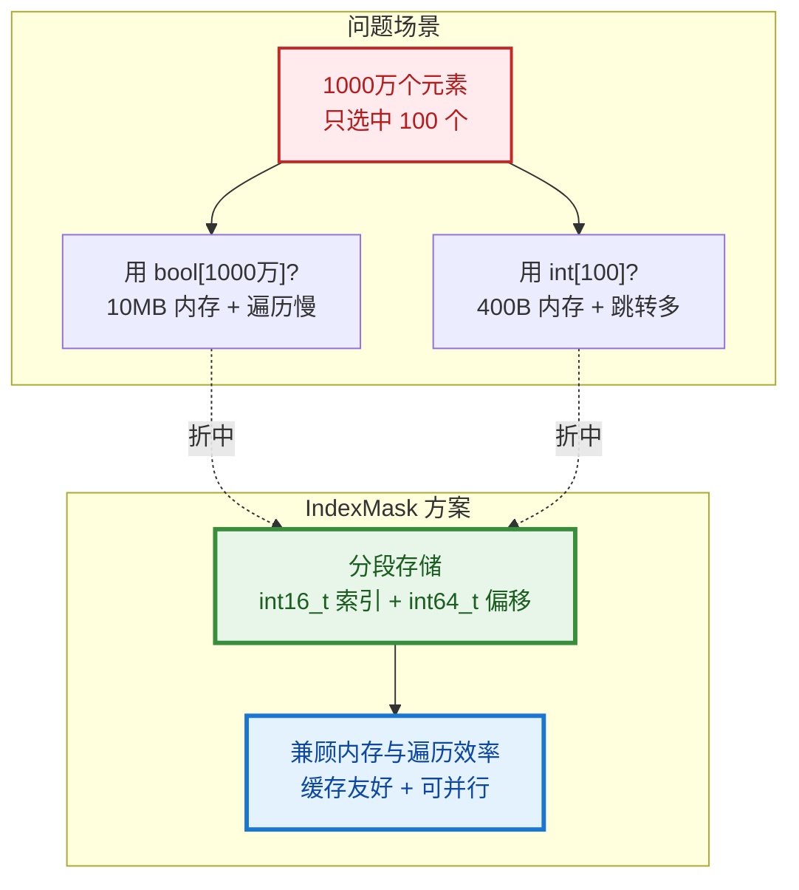
```mermaid
flowchart TB
    subgraph 问题["问题场景"]
        A["1000万个元素<br/>只选中 100 个"] --> B["用 bool[1000万]?<br/>10MB 内存 + 遍历慢"]
        A --> C["用 int[100]?<br/>400B 内存 + 跳转多"]
    end

    subgraph 方案["IndexMask 方案"]
        D["分段存储<br/>int16_t 索引 + int64_t 偏移"] --> E["兼顾内存与遍历效率<br/>缓存友好 + 可并行"]
    end

    B -.->|折中| D
    C -.->|折中| D

    style A fill:#ffebee,stroke:#c62828,stroke-width:2px,color:#b71c1c
    style D fill:#e8f5e9,stroke:#388e3c,stroke-width:3px,color:#1b5e20
    style E fill:#e3f2fd,stroke:#1976d2,stroke-width:3px,color:#0d47a1
```

**一句话定义：** `IndexMask` 是 Blender 基础库中用于表示**有序唯一索引集合**的数据结构，采用**分段压缩**策略，在稀疏场景下比 `bool[]` 更省内存，比 `int[]` 更缓存友好。

---

## 1️⃣ 核心设计：分段压缩

### 1.1 为什么选 16384？

```cpp
// BLI_index_mask.hh:33~52
/**
 * Constants that define the maximum segment size. Segment sizes are limited so that the indices
 * within each segment can be stored as #int16_t, which allows the mask to stored much more
 * compactly than if 32 or 64 bit ints would be used.
 * - Using 8 bit ints does not work well, because then the maximum segment size would be too small
 *   for eliminate per-segment overhead in many cases and also leads to many more segments.
 * - The most-significant-bit is not used so that signed integers can be used which avoids common
 *   issues when mixing signed and unsigned ints.
 * - The second most-significant bit is not used for indices so that #max_segment_size itself can
 *   be stored in the #int16_t.
 * - The maximum number of indices in a segment is 16384, which is generally enough to make the
 *   overhead per segment negligible when processing large index masks.
 * - A power of two is used for #max_segment_size, because that allows for faster construction of
 *   index masks for index ranges.
 */
static constexpr int64_t max_segment_size_shift = 14;
static constexpr int64_t max_segment_size = (1 << max_segment_size_shift); /* 16384 */
static constexpr int64_t max_segment_size_mask_low = max_segment_size - 1;
static constexpr int64_t max_segment_size_mask_high = ~max_segment_size_mask_low;
```

**注释翻译：**

> 定义最大段大小的常量。段大小受限，使得每个段内的索引可以存储为 `int16_t`，这让掩码比使用 32 或 64 位整数时紧凑得多。
> - 使用 8 位整数效果不好，因为最大段大小会太小，在很多情况下无法消除每段开销，还会导致段数量过多。
> - 最高位不使用，这样可以改用有符号整数，避免 signed/unsigned 混用时常见的问题。
> - 次高位也不用于索引，这样 `max_segment_size` 本身也能存进 `int16_t`。
> - 每段最大索引数为 16384，通常足以在处理大索引掩码时让每段开销忽略不计。
> - `max_segment_size` 使用 2 的幂，这样可以更快地构造索引范围的索引掩码。

**补充：两个位掩码常量的作用**

| 常量 | 值 | 用途 |
|------|-----|------|
| `max_segment_size_mask_low` | `0x3FFF` (16383) | 用 `&` 提取索引的低 14 位（段内偏移） |
| `max_segment_size_mask_high` | `~0x3FFF` | 用 `&` 提取索引的高 50 位（段号 × 16384） |

```cpp
// 快速计算段号和段内偏移（位运算替代除法/取模）
int64_t segment_index = index & max_segment_size_mask_high;  // index / 16384 * 16384
int64_t offset_in_segment = index & max_segment_size_mask_low; // index % 16384
```

**为什么用位掩码而不是 `%` 和 `/`？**
- 除法是 CPU 最慢的整数运算之一（数十个周期）
- 位运算是单周期操作
- 16384 = 2^14，所以可以用位掩码精确替代

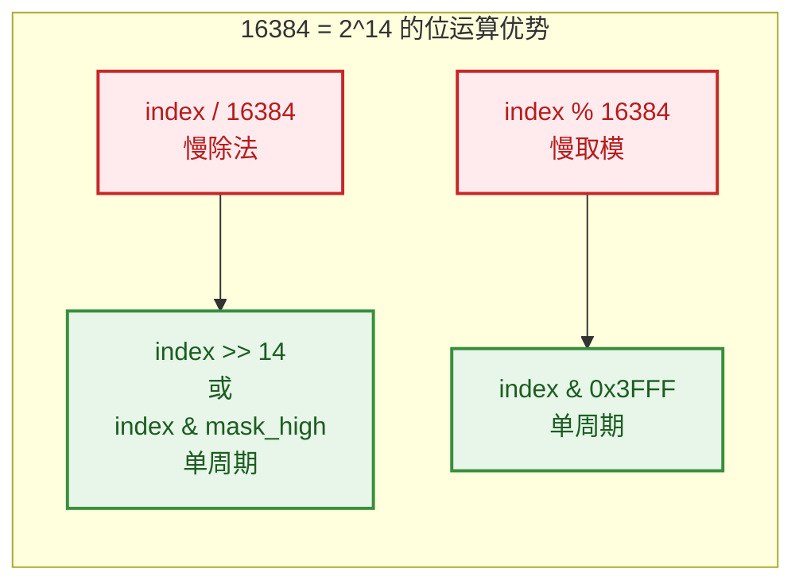
```mermaid
flowchart LR
    subgraph 位运算优化["16384 = 2^14 的位运算优势"]
        A["index / 16384<br/>慢除法"] --> B["index >> 14<br/>或<br/>index & mask_high<br/>单周期"]
        C["index % 16384<br/>慢取模"] --> D["index & 0x3FFF<br/>单周期"]
    end

    style A fill:#ffebee,stroke:#c62828,stroke-width:2px,color:#b71c1c
    style C fill:#ffebee,stroke:#c62828,stroke-width:2px,color:#b71c1c
    style B fill:#e8f5e9,stroke:#388e3c,stroke-width:2px,color:#1b5e20
    style D fill:#e8f5e9,stroke:#388e3c,stroke-width:2px,color:#1b5e20
```

### 一个具体例子：IndexMask 怎么存索引 {3, 7, 16385, 32770}？

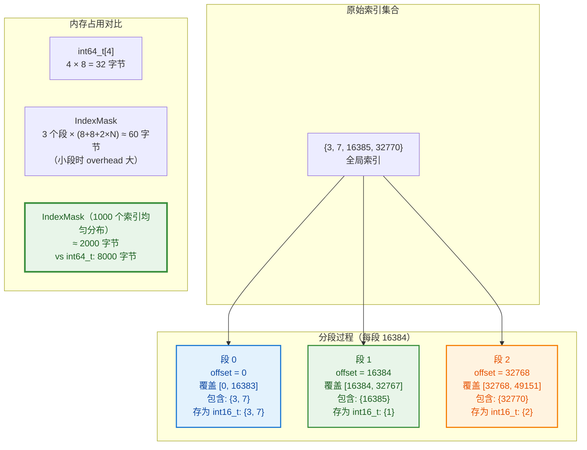
```mermaid
flowchart TB
    subgraph 原始索引["原始索引集合"]
        RAW["{3, 7, 16385, 32770}<br/>全局索引"]
    end

    subgraph 分段过程["分段过程（每段 16384）"]
        SEG0["段 0<br/>offset = 0<br/>覆盖 [0, 16383]<br/>包含: {3, 7}<br/>存为 int16_t: {3, 7}"]
        SEG1["段 1<br/>offset = 16384<br/>覆盖 [16384, 32767]<br/>包含: {16385}<br/>存为 int16_t: {1}"]
        SEG2["段 2<br/>offset = 32768<br/>覆盖 [32768, 49151]<br/>包含: {32770}<br/>存为 int16_t: {2}"]
    end

    subgraph 内存占用["内存占用对比"]
        INT64["int64_t[4]<br/>4 × 8 = 32 字节"]
        IMASK["IndexMask<br/>3 个段 × (8+8+2×N) ≈ 60 字节<br/>（小段时 overhead 大）"]
        IMASK2["IndexMask（1000 个索引均匀分布）<br/>≈ 2000 字节<br/>vs int64_t: 8000 字节"]
    end

    RAW --> SEG0
    RAW --> SEG1
    RAW --> SEG2

    style SEG0 fill:#e3f2fd,stroke:#1976d2,stroke-width:2px,color:#0d47a1
    style SEG1 fill:#e8f5e9,stroke:#388e3c,stroke-width:2px,color:#1b5e20
    style SEG2 fill:#fff3e0,stroke:#f57c00,stroke-width:2px,color:#e65100
    style IMASK2 fill:#e8f5e9,stroke:#388e3c,stroke-width:3px,color:#1b5e20
```

**注意：** 上面的例子只有 4 个索引，IndexMask 的段 overhead（每个段需要 offset 指针等）反而让它比 `int64_t[]` 更占内存。IndexMask 的优势在**大量索引**时才体现。

---

### 16384 是怎么来的？逐条解读注释中的设计决策

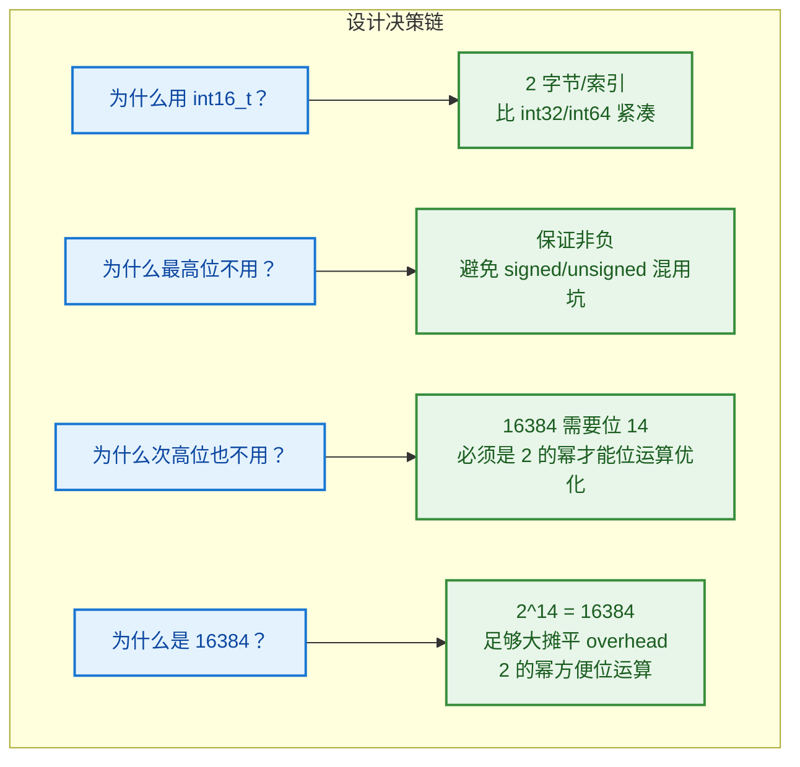
```mermaid
flowchart TB
    subgraph 问题链["设计决策链"]
        Q1["为什么用 int16_t？"] --> A1["2 字节/索引<br/>比 int32/int64 紧凑"]
        Q2["为什么最高位不用？"] --> A2["保证非负<br/>避免 signed/unsigned 混用坑"]
        Q3["为什么次高位也不用？"] --> A3["16384 需要位 14<br/>必须是 2 的幂才能位运算优化"]
        Q4["为什么是 16384？"] --> A4["2^14 = 16384<br/>足够大摊平 overhead<br/>2 的幂方便位运算"]
    end

    style Q1 fill:#e3f2fd,stroke:#1976d2,stroke-width:2px,color:#0d47a1
    style Q2 fill:#e3f2fd,stroke:#1976d2,stroke-width:2px,color:#0d47a1
    style Q3 fill:#e3f2fd,stroke:#1976d2,stroke-width:2px,color:#0d47a1
    style Q4 fill:#e3f2fd,stroke:#1976d2,stroke-width:2px,color:#0d47a1
    style A1 fill:#e8f5e9,stroke:#388e3c,stroke-width:2px,color:#1b5e20
    style A2 fill:#e8f5e9,stroke:#388e3c,stroke-width:2px,color:#1b5e20
    style A3 fill:#e8f5e9,stroke:#388e3c,stroke-width:2px,color:#1b5e20
    style A4 fill:#e8f5e9,stroke:#388e3c,stroke-width:2px,color:#1b5e20
```

#### ① 最高位不用 → 避免 signed/unsigned 混用陷阱

C/C++ 有个著名陷阱：signed 和 unsigned 混用时，signed 会被隐式提升为 unsigned：

```cpp
int16_t a = -1;      // 二进制: 1111111111111111
uint16_t b = 1;
if (a < b) {         // 实际上 a 被提升为 uint16_t → 65535
    // 这行不会执行！65535 < 1 是 false
}
```

如果最高位用于数据（表示 32768~65535），负数补码和正数会混在一起，极易踩坑。空出最高位，所有值都是 0~16383（正数），自然避开。

#### ② 次高位也不用 → 为了存下 16384 这个值本身

**核心问题：为什么代码里需要把 `max_segment_size` 存进 `int16_t`？**

看这段源码：

```cpp
// intern/index_mask.cc:48~54
std::array<int16_t, max_segment_size> build_static_indices_array()
{
  std::array<int16_t, max_segment_size> data;
  for (int16_t i = 0; i < max_segment_size; i++) {
    data[size_t(i)] = i;
  }
  return data;
}
```

注意 `for` 循环：`int16_t i = 0; i < max_segment_size; i++`。这里的 `i` 是 `int16_t`，循环上限 `max_segment_size` 必须能存进 `int16_t`！

如果 `max_segment_size = 32767`（2^15 - 1），`i` 递增到 32767 后 `i++` 会溢出成 -32768，死循环！所以 `max_segment_size` 本身必须是 `int16_t` 能合法表示的值。

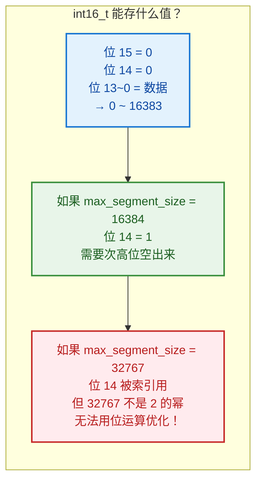
```mermaid
flowchart LR
    subgraph 位分配["int16_t 能存什么值？"]
        A["位 15 = 0<br/>位 14 = 0<br/>位 13~0 = 数据<br/>→ 0 ~ 16383"] --> B["如果 max_segment_size = 16384<br/>位 14 = 1<br/>需要次高位空出来"]
        B --> C["如果 max_segment_size = 32767<br/>位 14 被索引用<br/>但 32767 不是 2 的幂<br/>无法用位运算优化！"]
    end

    style A fill:#e3f2fd,stroke:#1976d2,stroke-width:2px,color:#0d47a1
    style B fill:#e8f5e9,stroke:#388e3c,stroke-width:2px,color:#1b5e20
    style C fill:#ffebee,stroke:#c62828,stroke-width:2px,color:#b71c1c
```

**所以次高位不用的真正原因：**
1. `max_segment_size` 要作为 `int16_t` 循环上限，必须能存进 `int16_t`
2. 16384 刚好是 `2^14`，位 14 为 1，需要次高位空出来
3. 16384 同时是 2 的幂，满足位运算优化需求

```
16383 = 0011111111111111  (位 14 = 0，可以存，但不是 2 的幂)
16384 = 0100000000000000  (位 14 = 1，是 2 的幂，需要次高位空出来)
```

#### ③ 2 的幂 → 整段复用静态预分配

**什么是"全局静态预分配"？**

```cpp
// intern/index_mask.cc:48~54
// 程序启动时预分配的一个全局数组：{0, 1, 2, ..., 16383}
std::array<int16_t, max_segment_size> build_static_indices_array()
{
  std::array<int16_t, max_segment_size> data;
  for (int16_t i = 0; i < max_segment_size; i++) {
    data[size_t(i)] = i;
  }
  return data;
}

// intern/index_mask.cc:57~101
// 预分配 21 亿索引的静态掩码，所有 [0, N) 范围都复用它
const IndexMask &get_static_index_mask_for_min_size(const int64_t min_size)
{
  static IndexMask static_mask = []() {
    // ... 131072 个段，全部指向同一个 static_offsets 数组 ...
    return mask;
  }();
  return static_mask;
}
```

**关键点：**
- `static_offsets` 是一个全局静态数组 `{0, 1, 2, ..., 16383}`
- 所有"完整段"（包含 16384 个连续索引）都可以**复用**这个数组，不需要自己分配
- 只有"部分段"（比如最后 8192 个索引）需要单独分配

**为什么段大小必须是 16384 才能复用？**

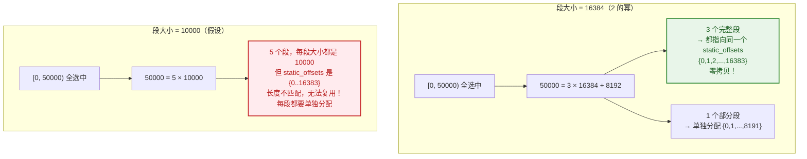
```mermaid
flowchart TB
    subgraph 段大小16384["段大小 = 16384（2 的幂）"]
        A["[0, 50000) 全选中"] --> B["50000 = 3 × 16384 + 8192"]
        B --> C["3 个完整段<br/>→ 都指向同一个 static_offsets<br/>{0,1,2,...,16383}<br/>零拷贝！"]
        B --> D["1 个部分段<br/>→ 单独分配 {0,1,...,8191}"]
    end

    subgraph 段大小10000["段大小 = 10000（假设）"]
        E["[0, 50000) 全选中"] --> F["50000 = 5 × 10000"]
        F --> G["5 个段，每段大小都是 10000<br/>但 static_offsets 是 {0..16383}<br/>长度不匹配，无法复用！<br/>每段都要单独分配"]
    end

    style C fill:#e8f5e9,stroke:#388e3c,stroke-width:2px,color:#1b5e20
    style G fill:#ffebee,stroke:#c62828,stroke-width:2px,color:#b71c1c
```

**如果段大小是 10000，能让 static_offsets 也变成 10000 吗？**

技术上可以，但会失去**整段复用**的能力：
- 段大小 = 16384 时，所有完整段都复用**同一个** `static_offsets`
- 段大小 = 10000 时，每个段长度不同，需要**各自分配**，无法共享

```
段大小 = 16384:  所有完整段 → 指向同一个 {0..16383} 数组
段大小 = 10000:  段 0 → {0..9999}, 段 1 → {0..9999}, ... 每段都要自己分配
```

**2 的幂的额外好处：** 可以用位运算快速计算段号和偏移（`>> 14` 和 `& 0x3FFF`），而 10000 必须用慢速的除法和取模。

#### ④ mask_low / mask_high → 用位运算替代除法

| 常量 | 值 | 作用 |
|------|-----|------|
| `mask_low` | `0x3FFF` (0011111111111111) | `index & mask_low` = 段内偏移（替代 `% 16384`） |
| `mask_high` | `~0x3FFF` | `index & mask_high` = 段起始地址（替代 `/ 16384 * 16384`） |

```cpp
// index = 32770
// 二进制: 1000000000000010

32770 & 0x3FFF    // = 0000000000000010 = 2      → 段内偏移
32770 & ~0x3FFF   // = 1000000000000000 = 32768  → 段起始地址（段号 = 2）
```

`low` = 保留**低位** → 得到低地址部分（段内偏移）  
`high` = 保留**高位** → 得到高地址部分（段起始/段号）


### 1.2 内存布局详解：逐字段解读

#### 调试视图中的 IndexMaskData

当你在调试器中看到这样的内容：

```
blender::index_mask::IndexMaskData = 
{indices_num_=101 segments_num_=24 indices_by_segment_=0x0000029aa356c7a8 ...}
    indices_num_ = 101              ← 总共选中了 101 个索引
    segments_num_ = 24              ← 分布在 24 个段中
    indices_by_segment_ = 0x...     ← 指向 24 个 int16_t[] 数组的指针数组
    segment_offsets_ = 0x...        ← 24 个段的全局起始偏移
    cumulative_segment_sizes_ = 0x...  ← 累积段大小（用于快速定位）
    begin_index_in_segment_ = 0     ← 第一个段从第 0 个元素开始
    end_index_in_segment_ = 2       ← 最后一个段到第 2 个元素结束（不含）
```

#### 逐字段详细解释

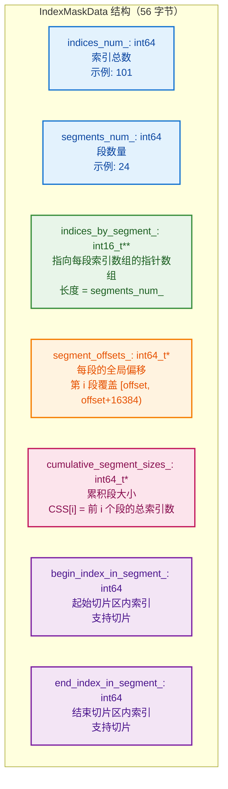
```mermaid
flowchart TB
    subgraph IndexMaskData["IndexMaskData 结构（56 字节）"]
        IN["indices_num_: int64<br/>索引总数<br/>示例: 101"]
        SN["segments_num_: int64<br/>段数量<br/>示例: 24"]
        IBS["indices_by_segment_: int16_t**<br/>指向每段索引数组的指针数组<br/>长度 = segments_num_"]
        SO["segment_offsets_: int64_t*<br/>每段的全局偏移<br/>第 i 段覆盖 [offset, offset+16384)"]
        CSS["cumulative_segment_sizes_: int64_t*<br/>累积段大小<br/>CSS[i] = 前 i 个段的总索引数"]
        BIS["begin_index_in_segment_: int64<br/>起始切片区内索引<br/>支持切片"]
        EIS["end_index_in_segment_: int64<br/>结束切片区内索引<br/>支持切片"]
    end

    style IN fill:#e3f2fd,stroke:#1976d2,stroke-width:2px,color:#0d47a1
    style SN fill:#e3f2fd,stroke:#1976d2,stroke-width:2px,color:#0d47a1
    style IBS fill:#e8f5e9,stroke:#388e3c,stroke-width:2px,color:#1b5e20
    style SO fill:#fff3e0,stroke:#f57c00,stroke-width:2px,color:#e65100
    style CSS fill:#fce4ec,stroke:#c2185b,stroke-width:2px,color:#880e4f
    style BIS fill:#f3e5f5,stroke:#7b1fa2,stroke-width:2px,color:#4a148c
    style EIS fill:#f3e5f5,stroke:#7b1fa2,stroke-width:2px,color:#4a148c
```

#### 源码注释逐条翻译

```cpp
// source/blender/blenlib/BLI_index_mask.hh:65~71

/**
 * Base type of #IndexMask. This only exists to make it more convenient to construct an index mask
 * in a few functions with #IndexMask::data_for_inplace_construction.
 *
 * The names intentionally have a trailing underscore here even though they are public in
 * #IndexMaskData because they are private in #IndexMask.
 */
```

**注释翻译：**

> IndexMask 的基类型。它只存在于让少数函数通过 `IndexMask::data_for_inplace_construction` 更方便地构造索引掩码。
>
> 这里的名字故意保留了尾部下划线，尽管它们在 IndexMaskData 中是 public 的，因为这些字段在 IndexMask 中是 private 的。

**为什么需要这个注释？**

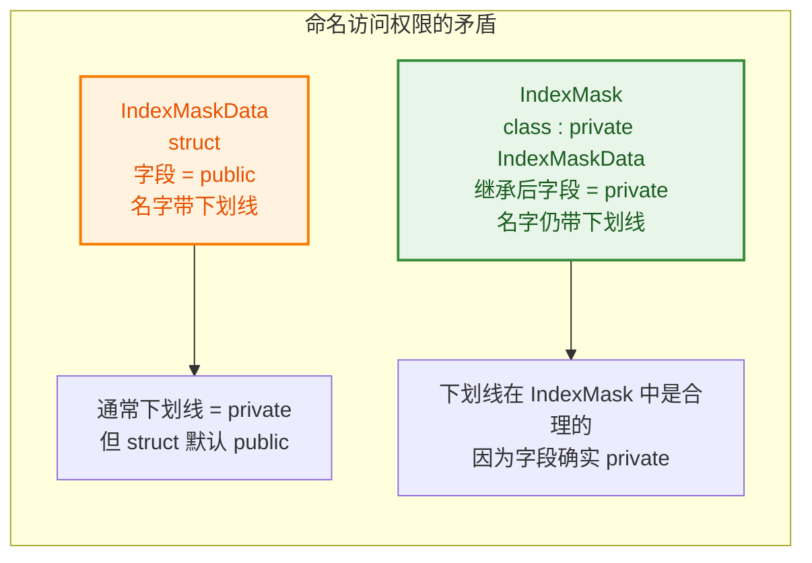
```mermaid
flowchart LR
    subgraph 命名矛盾["命名访问权限的矛盾"]
        A["IndexMaskData<br/>struct<br/>字段 = public<br/>名字带下划线"] --> B["通常下划线 = private<br/>但 struct 默认 public"]
        C["IndexMask<br/>class : private IndexMaskData<br/>继承后字段 = private<br/>名字仍带下划线"] --> D["下划线在 IndexMask 中是合理的<br/>因为字段确实 private"]
    end

    style A fill:#fff3e0,stroke:#f57c00,stroke-width:2px,color:#e65100
    style C fill:#e8f5e9,stroke:#388e3c,stroke-width:2px,color:#1b5e20
```

---

```cpp
// source/blender/blenlib/BLI_index_mask.hh:72~107

struct IndexMaskData {
  /**
   * Size of the index mask, i.e. the number of indices.
   * 索引掩码的大小，即索引的数量。
   */
  int64_t indices_num_;

  /**
   * Number of segments in the index mask. Each segment contains at least one of the indices.
   * 索引掩码中的段数。每个段至少包含一个索引。
   */
  int64_t segments_num_;

  /**
   * Pointer to the index array for every segment. The size of each array can be computed from
   * #cumulative_segment_sizes_.
   * 指向每个段的索引数组的指针。每个数组的大小可以从 cumulative_segment_sizes_ 计算得出。
   */
  const int16_t **indices_by_segment_;

  /**
   * Offset that is applied to the indices in each segment.
   * 应用于每个段中索引的偏移量。
   * 第 i 段的全局索引 = segment_offsets_[i] + indices_by_segment_[i][j]
   */
  const int64_t *segment_offsets_;

  /**
   * Encodes the size of each segment. The size of a specific segment can be computed by
   * subtracting consecutive values (also see #OffsetIndices). The size of this array is one
   * larger than #segments_num_. Note that the first value is _not_ necessarily zero when an
   * index mask is a slice of another mask.
   * 编码每个段的大小。特定段的大小可以通过相邻值的差计算（参见 OffsetIndices）。
   * 这个数组的大小比 segments_num_ 大 1。
   * 注意：当索引掩码是另一个掩码的切片时，第一个值不一定为零。
   */
  const int64_t *cumulative_segment_sizes_;

  /**
   * Index into the first segment where the #IndexMask starts. This exists to support slicing
   * without having to modify and therefor allocate a new #indices_by_segment_ array.
   * 第一个段中 IndexMask 开始的索引。这支持切片而无需修改/分配新的 indices_by_segment_ 数组。
   */
  int64_t begin_index_in_segment_;

  /**
   * Index into the last segment where the #IndexMask ends. This exists to support slicing without
   * having to modify and therefore allocate a new #cumulative_segment_sizes_ array.
   * 最后一个段中 IndexMask 结束的索引。这支持切片而无需修改/分配新的 cumulative_segment_sizes_ 数组。
   */
  int64_t end_index_in_segment_;
};
```

**为什么 `segments_num_` 用 `int64_t` 而不是 `int32_t`？**

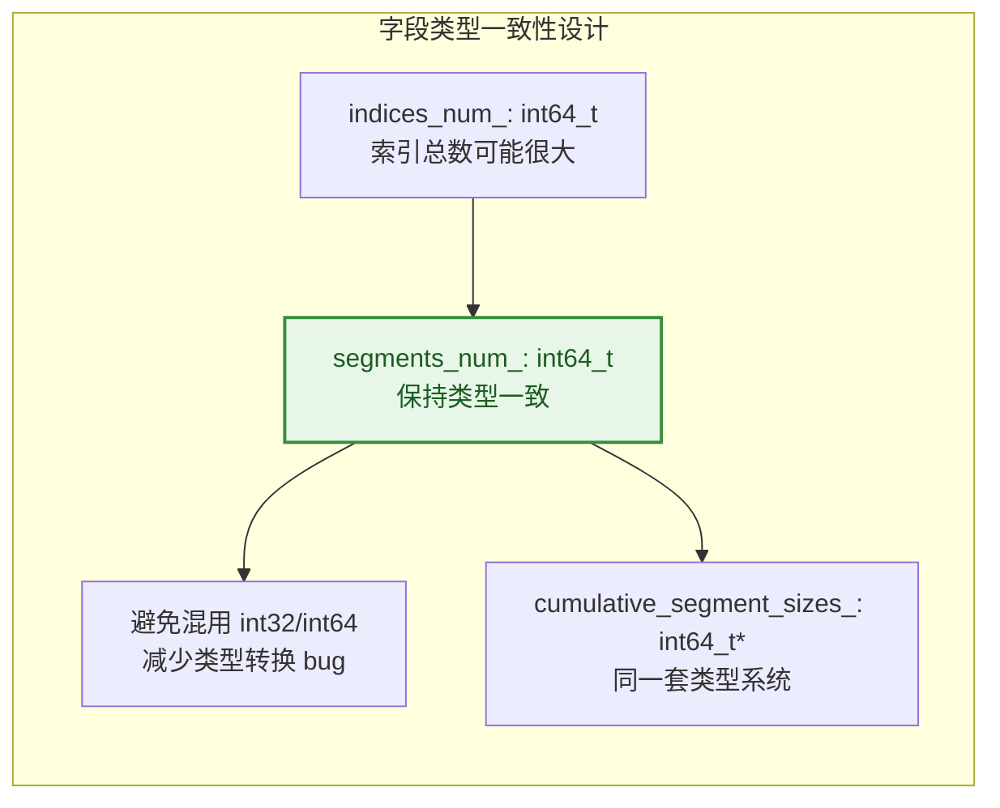
```mermaid
flowchart LR
    subgraph 一致性设计["字段类型一致性设计"]
        A["indices_num_: int64_t<br/>索引总数可能很大"] --> B["segments_num_: int64_t<br/>保持类型一致"]
        B --> C["避免混用 int32/int64<br/>减少类型转换 bug"]
        B --> D["cumulative_segment_sizes_: int64_t*<br/>同一套类型系统"]
    end

    style B fill:#e8f5e9,stroke:#388e3c,stroke-width:2px,color:#1b5e20
```

虽然实际段数不可能达到 2^63，但 Blender 基础库的设计哲学是：**索引相关的所有整数统一用 `int64_t`**。这避免了：
1. `int32_t` 和 `int64_t` 混用时的隐式转换警告
2. 不同平台 `int` 大小不一致的问题（Windows 上 `long` 是 32 位，Linux 上是 64 位）
3. 代码阅读时的认知负担（"这个字段是 int 还是 int64？"）

#### 实际数据布局可视化

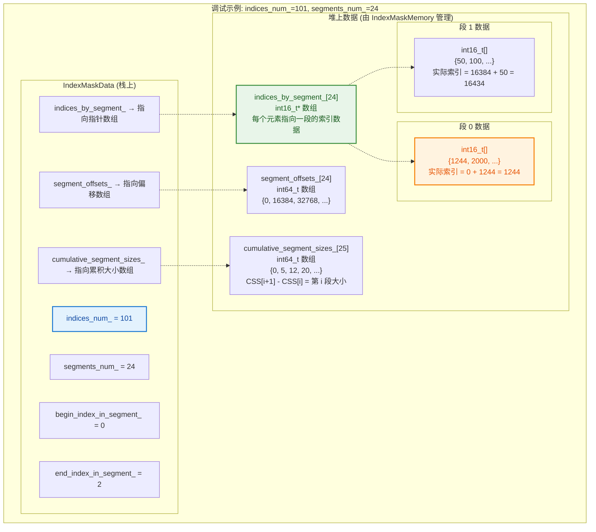
```mermaid
flowchart TB
    subgraph 调试示例["调试示例: indices_num_=101, segments_num_=24"]
        subgraph IndexMaskData结构["IndexMaskData (栈上)"]
            D0["indices_num_ = 101"]
            D1["segments_num_ = 24"]
            D2["indices_by_segment_ → 指向指针数组"]
            D3["segment_offsets_ → 指向偏移数组"]
            D4["cumulative_segment_sizes_ → 指向累积大小数组"]
            D5["begin_index_in_segment_ = 0"]
            D6["end_index_in_segment_ = 2"]
        end

        subgraph 堆上数据["堆上数据 (由 IndexMaskMemory 管理)"]
            IBS["indices_by_segment_[24]<br/>int16_t* 数组<br/>每个元素指向一段的索引数据"]
            SO["segment_offsets_[24]<br/>int64_t 数组<br/>{0, 16384, 32768, ...}"]
            CSS["cumulative_segment_sizes_[25]<br/>int64_t 数组<br/>{0, 5, 12, 20, ...}<br/>CSS[i+1] - CSS[i] = 第 i 段大小"]

            subgraph 段0["段 0 数据"]
                S0_DATA["int16_t[]<br/>{1244, 2000, ...}<br/>实际索引 = 0 + 1244 = 1244"]
            end

            subgraph 段1["段 1 数据"]
                S1_DATA["int16_t[]<br/>{50, 100, ...}<br/>实际索引 = 16384 + 50 = 16434"]
            end
        end

        D2 -.-> IBS
        D3 -.-> SO
        D4 -.-> CSS
        IBS -.-> S0_DATA
        IBS -.-> S1_DATA
    end

    style D0 fill:#e3f2fd,stroke:#1976d2,stroke-width:2px,color:#0d47a1
    style IBS fill:#e8f5e9,stroke:#388e3c,stroke-width:2px,color:#1b5e20
    style S0_DATA fill:#fff3e0,stroke:#f57c00,stroke-width:2px,color:#e65100
```

#### 关键洞察：为什么需要这么多指针？

| 字段 | 如果不存在会怎样？ | 存在的价值 |
|------|------------------|-----------|
| `indices_by_segment_` | 无法访问段的索引数据 | 核心数据访问 |
| `segment_offsets_` | 不知道每段的全局范围 | 计算实际索引 = offset + 段内偏移 |
| `cumulative_segment_sizes_` | 无法 O(log n) 定位第 k 个索引 | 支持二分查找、切片 |
| `begin/end_index_in_segment_` | 切片必须复制数据 | **零拷贝切片**的关键 |

#### 切片如何工作？

```cpp
// 原始掩码: 段 0 = {0,1,2,3,4}, 段 1 = {5,6,7,8,9}
// slice(2, 5) → 取第 2~6 个索引

// 原始状态:
// begin_index_in_segment_ = 0
// end_index_in_segment_ = 5 (段 0 大小)

// 切片后:
// begin_index_in_segment_ = 2  ← 从段 0 的第 2 个开始
// end_index_in_segment_ = 2    ← 到段 1 的第 2 个结束
// indices_num_ = 5
// 
// 结果: {2,3,4} (段 0 的后 3 个) + {5,6} (段 1 的前 2 个) = {2,3,4,5,6}
// 但段数据指针完全没有复制！只是调整了 begin/end 值
```

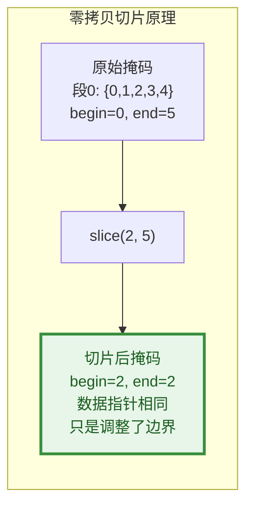
```mermaid
flowchart LR
    subgraph 切片原理["零拷贝切片原理"]
        ORIG["原始掩码<br/>段0: {0,1,2,3,4}<br/>begin=0, end=5"] --> SLICE["slice(2, 5)"]
        SLICE --> RESULT["切片后掩码<br/>begin=2, end=2<br/>数据指针相同<br/>只是调整了边界"]
    end

    style RESULT fill:#e8f5e9,stroke:#388e3c,stroke-width:3px,color:#1b5e20
```

---

### 为什么用 `class IndexMask : private IndexMaskData` 继承而不是成员？

```cpp
// source/blender/blenlib/BLI_index_mask.hh:219
class IndexMask : private IndexMaskData {
```

**private 继承 vs 成员对象的对比：**

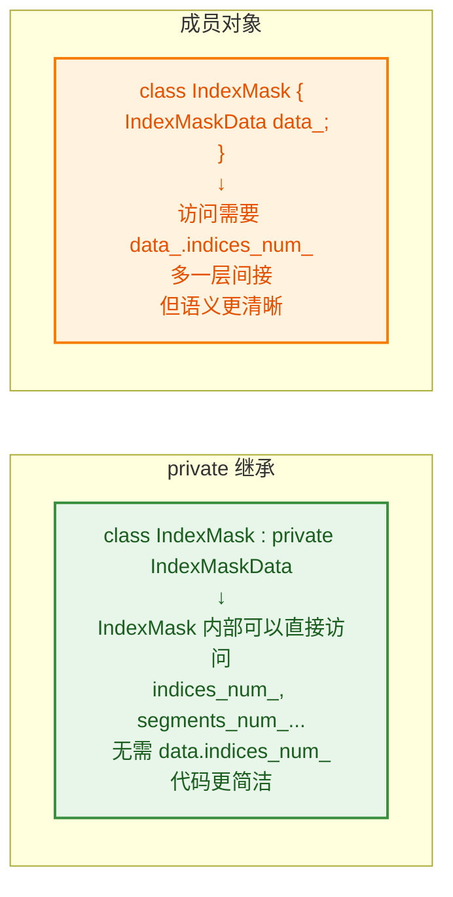
```mermaid
flowchart LR
    subgraph 继承方式["private 继承"]
        A["class IndexMask : private IndexMaskData<br/>↓<br/>IndexMask 内部可以直接访问<br/>indices_num_, segments_num_...<br/>无需 data.indices_num_<br/>代码更简洁"]
    end

    subgraph 成员方式["成员对象"]
        B["class IndexMask {<br/>  IndexMaskData data_;<br/>}<br/>↓<br/>访问需要 data_.indices_num_<br/>多一层间接<br/>但语义更清晰"]
    end

    style A fill:#e8f5e9,stroke:#388e3c,stroke-width:2px,color:#1b5e20
    style B fill:#fff3e0,stroke:#f57c00,stroke-width:2px,color:#e65100
```

**选择 private 继承的原因：**

| 方面 | private 继承 | 成员对象 |
|------|-------------|----------|
| **访问语法** | `indices_num_` 直接访问 | `data_.indices_num_` 间接访问 |
| **内存布局** | 基类子对象在开头，与 struct 布局一致 | 成员在内部，可能有对齐填充 |
| **切片操作** | `IndexMaskData&` 可以直接引用整个状态 | 需要额外取地址操作 |
| **语义表达** | "是一个实现细节"（is-implemented-in-terms-of） | "有一个数据块" |
| **构造便利性** | `data_for_inplace_construction()` 返回基类引用 | 需要额外封装 |

**核心原因：让 `data_for_inplace_construction()` 成为可能**

```cpp
// 这个函数返回 IndexMaskData 的引用，允许外部直接填充字段
IndexMaskData &data_for_inplace_construction()
{
  return *this;  // 继承后 *this 就是 IndexMaskData
}

// 如果是成员对象，需要这样写：
IndexMaskData &data_for_inplace_construction()
{
  return data_;  // 也可以，但继承更自然
}
```

private 继承在 C++ 中被称为 **"is-implemented-in-terms-of"**（以实现细节的方式是一个），它明确表示：IndexMask 不是 IndexMaskData（对外），但在实现上就是一块 IndexMaskData 内存。

---

### IndexMask 类注释完整翻译

```cpp
// source/blender/blenlib/BLI_index_mask.hh:175~218

/**
 * An #IndexMask is a sequence of unique and sorted indices (`BLI_unique_sorted_indices.hh`).
 * It's commonly used when a subset of elements in an array has to be processed.
 *
 * IndexMask 是一个唯一且有序索引的序列。它通常用于需要处理数组中某个子集元素的场景。
 */
```

**核心特性：** 唯一（不重复）且有序（升序排列）。这保证了可以用二分查找做 `contains()`，也支持高效的集合并/交/差运算。

```cpp
 * #IndexMask is a non-owning container. That data it references is usually either statically
 * allocated or is owned by an #IndexMaskMemory.
 *
 * IndexMask 是一个非拥有式容器。它引用的数据通常是静态分配的，或者由 IndexMaskMemory 拥有。
 */
```

**非拥有式的含义：** IndexMask 对象本身只是一块 56 字节的"视图"，不管理内存生命周期。真正的内存由外部（静态存储或 IndexMaskMemory）管理。

```cpp
 * Internally, an index mask is split into an arbitrary number of ordered segments. Each segment
 * contains up to #max_segment_size (2^14 = 16384) indices. The indices in a segment are stored as
 * `int16_t`, but each segment also has a `int64_t` offset.
 *
 * 内部实现上，索引掩码被分割为任意数量的有序段。每个段最多包含 max_segment_size (2^14 = 16384) 个索引。
 * 段内的索引以 int16_t 存储，但每个段还有一个 int64_t 偏移量。
 */
```

**段的核心设计：** `int16_t` 存段内偏移（省内存）+ `int64_t` 存段全局偏移（支持大数组）。

```cpp
 * The data structure is designed to satisfy the following key requirements:
 * - Construct index mask for an #IndexRange in O(1) time (after initial setup).
 * - Support efficient slicing (O(log n) with a low constant factor).
 * - Support multi-threaded construction without severe serial bottlenecks.
 * - Support efficient iteration over indices that uses #IndexRange when possible.
 *
 * 该数据结构的设计满足以下关键需求：
 * - 为 IndexRange 构造索引掩码的时间复杂度为 O(1)（初始设置之后）。
 * - 支持高效的切片（O(log n)，常数因子很小）。
 * - 支持多线程构造，没有严重的串行瓶颈。
 * - 支持高效的索引遍历，尽可能使用 IndexRange。
 */
```

**四大设计目标解读：**

| 目标 | 实现方式 |
|------|----------|
| O(1) 构造范围 | 静态预分配 21 亿索引的掩码，切片即可 |
| 高效切片 | `begin/end_index_in_segment_` 调整边界，零拷贝 |
| 多线程构造 | 分段独立分配，无锁 |
| 高效遍历 | `foreach_segment` 段内连续访问，缓存友好 |

```cpp
 * Construction:
 *   A new index mask is usually created by calling one of its constructors which are O(1), or for
 *   more complex masks, by calling various `IndexMask::from_*` functions that create masks from
 *   various sources. Those generally need additional memory which is provided with by an
 *   #IndexMaskMemory.
 *
 *   构造：
 *   新的索引掩码通常通过调用 O(1) 的构造函数创建。对于更复杂的掩码，可以调用各种
 *   IndexMask::from_* 函数从不同的源创建。这些函数通常需要额外的内存，由 IndexMaskMemory 提供。
 */
```

```cpp
 *   Some of the `IndexMask::from_*` functions have an `IndexMask universe` input. When provided,
 *   the function will only consider the indices in the "universe". The term comes from
 *   mathematics: https://en.wikipedia.org/wiki/Universe_(mathematics).
 *
 *   部分 IndexMask::from_* 函数有一个 IndexMask universe 输入参数。如果提供了该参数，
 *   函数只会考虑 "universe" 中的索引。这个术语来自数学中的"全集"概念。
 */
```

**Universe（全集）的含义：** 比如你想从布尔数组构造掩码，但只关心其中一部分索引（比如某个顶点组内的顶点），可以把那个顶点组的掩码作为 universe 传入，函数会自动过滤。

```cpp
 * Iteration:
 *   To iterate over the indices, one usually has to use one of the `foreach_*` functions which
 *   require a callback function. Due to the internal segmentation of the index mask, this is more
 *   efficient than using a normal C++ iterator and range-based for loops.
 *
 *   遍历：
 *   要遍历索引，通常必须使用某个 foreach_* 函数，这些函数需要一个回调函数。
 *   由于索引掩码的内部分段特性，这比使用普通 C++ 迭代器和基于范围的 for 循环更高效。
 */
```

**为什么回调比迭代器高效？** 因为段内数据是连续的，编译器可以把回调内联到段遍历循环中，做 SIMD 优化。标准迭代器每次 `++` 都要检查段边界。

```cpp
 *   There are multiple variants of the `foreach_*` functions which are useful in different
 *   scenarios. The callback can generally take one or two arguments. The first is the index
 *   stored in the mask and the second is the index that would have to be passed into `operator[]`
 *   to get the first index.
 *
 *   foreach_* 函数有多个变体，适用于不同场景。回调通常可以接收一个或两个参数。
 *   第一个是掩码中存储的索引，第二个是要传入 operator[] 才能得到第一个索引的索引（即位置）。
 */
```

**双参数回调：** `fn(index, pos)` 中 `pos` 是该索引在掩码中的位置（0, 1, 2, ...），`index` 是实际的全局索引。这样你可以同时知道"这是第几个选中的"和"它实际是什么索引"。

```cpp
 *   The `foreach_*` methods also accept an execution mode optional argument. When that is
 *   provided, multi-threading might be used. Integrating multi-threading at this level works well
 *   because mask iteration and parallelism are often used at the same time.
 *
 *   foreach_* 方法还接受一个可选的执行模式参数。如果提供了该参数，可能会使用多线程。
 *   在这个层面集成多线程效果很好，因为掩码遍历和并行性通常是同时使用的。
 */
```

```cpp
 * Extraction:
 *   An #IndexMask can be converted into various other forms using the `to_*` methods.
 *
 *   提取：
 *   IndexMask 可以使用 to_* 方法转换为各种其他形式。
 */
```

**提取方法：** `to_bools()` → `bool[]`, `to_bits()` → 位数组, `to_indices()` → `int64_t[]`。

---

**关键设计：非拥有式（non-owning）**

```cpp
// BLI_index_mask.hh:109~114
/**
 * #IndexMask does not own any memory itself. In many cases the memory referenced by a mask has
 * static life-time (e.g. when a mask is a range). To create more complex masks, additional memory
 * is necessary. #IndexMaskMemory is a simple wrapper around a linear allocator that has to be
 * passed to functions that might need to allocate extra memory.
 */
```

> **翻译：** IndexMask 本身不拥有任何内存。很多情况下被引用的内存是静态生命周期的（比如表示一个范围时）。创建更复杂的掩码需要额外内存，IndexMaskMemory 是一个线性分配器的简单包装，必须传给可能需要分配额外内存的函数。

**为什么这样设计？**
- `IndexMask` 可以轻量复制（只复制 56 字节的结构）
- 多个 `IndexMask` 可以共享同一段数据（切片时零拷贝）
- 内存生命周期由 `IndexMaskMemory` 统一管理，批量释放

---

## 2️⃣ 配套类详解

### 2.1 IndexMaskMemory - 线性分配器包装

```cpp
// BLI_index_mask.hh:115~125
class IndexMaskMemory : public LinearAllocator<> {
 private:
  /** Inline buffer to avoid heap allocations when working with small index masks. */
  AlignedBuffer<1024, 8> inline_buffer_;

 public:
  IndexMaskMemory()
  {
    this->provide_buffer(inline_buffer_);
  }
};
```

**注释翻译：** 内联缓冲区，避免处理小索引掩码时的堆分配。

**设计亮点：**
- 继承 `LinearAllocator<>`：线性分配，无单独释放，析构时统一释放所有内存
- 1024 字节内联缓冲：小掩码（< 512 个索引）完全不用堆分配
- 对齐 8 字节：保证 int64_t 访问效率

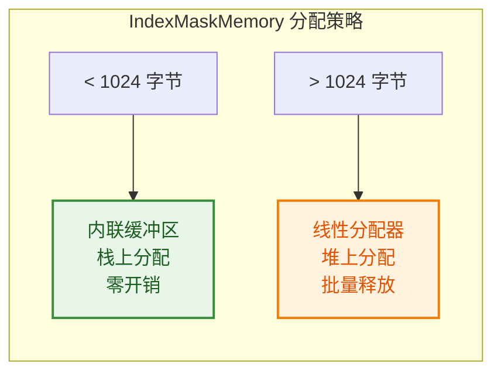
```mermaid
flowchart LR
    subgraph 分配策略["IndexMaskMemory 分配策略"]
        A["< 1024 字节"] --> B["内联缓冲区<br/>栈上分配<br/>零开销"]
        C["> 1024 字节"] --> D["线性分配器<br/>堆上分配<br/>批量释放"]
    end

    style B fill:#e8f5e9,stroke:#388e3c,stroke-width:2px,color:#1b5e20
    style D fill:#fff3e0,stroke:#f57c00,stroke-width:2px,color:#e65100
```

### 2.2 IndexMaskSegment - 带偏移的索引段

```cpp
// BLI_index_mask.hh:131~145
class IndexMaskSegment : public OffsetSpan<int64_t, int16_t> {
 public:
  using OffsetSpan<int64_t, int16_t>::OffsetSpan;

  explicit IndexMaskSegment(const OffsetSpan<int64_t, int16_t> span);

  IndexMaskSegment slice(const IndexRange &range) const;
  IndexMaskSegment slice(const int64_t start, const int64_t size) const;

  /**
   * Get a new segment where each index is modified by the given amount. This works in constant
   * time, because only the offset value is changed.
   */
  IndexMaskSegment shift(const int64_t shift) const;
};
```

**注释翻译：** 获取一个新段，其中每个索引都被给定量修改。这在常数时间内完成，因为只改变偏移值。

```cpp
// BLI_offset_span.hh:21~66
/**
 * An #OffsetSpan is a #Span with a constant offset that is added to every value when accessed.
 * This allows e.g. storing multiple `int64_t` indices as an array of `int16_t` with an additional
 * `int64_t` offset.
 */
template<typename T, typename BaseT> class OffsetSpan {
 private:
  T offset_ = 0;           // 全局偏移
  Span<BaseT> data_;       // 基础数据（int16_t 索引）

 public:
  T operator[](const int64_t i) const
  {
    return T(data_[i]) + offset_;  // 访问时自动加偏移
  }
  // ...
};
```

**OffsetSpan 注释翻译：** OffsetSpan 是一个带有常量偏移的 Span，访问每个值时都会加上这个偏移。这允许将多个 int64_t 索引存储为 int16_t 数组，再加上一个 int64_t 偏移。

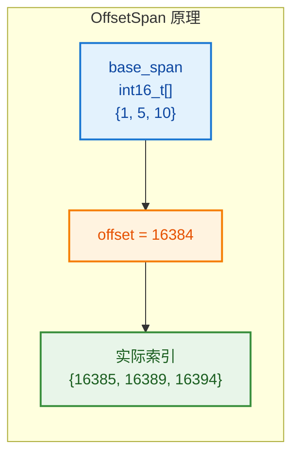
```mermaid
flowchart LR
    subgraph OffsetSpan原理["OffsetSpan 原理"]
        BASE["base_span<br/>int16_t[]<br/>{1, 5, 10}"] --> ADD["offset = 16384"]
        ADD --> RES["实际索引<br/>{16385, 16389, 16394}"]
    end

    style BASE fill:#e3f2fd,stroke:#1976d2,stroke-width:2px,color:#0d47a1
    style ADD fill:#fff3e0,stroke:#f57c00,stroke-width:2px,color:#e65100
    style RES fill:#e8f5e9,stroke:#388e3c,stroke-width:2px,color:#1b5e20
```

### 2.3 RawMaskIterator - 原始掩码迭代器

```cpp
// BLI_index_mask.hh:53~63
/**
 * Encodes a position in an #IndexMask. The term "raw" just means that this does not have the usual
 * iterator methods like `operator++`. Supporting those would require storing more data. Generally,
 * the fastest way to iterate over an #IndexMask is using a `foreach_*` method anyway.
 */
struct RawMaskIterator {
  /** Index of the segment in the index mask. */
  int64_t segment_i;
  /** Element within the segment. */
  int16_t index_in_segment;
};
```

**注释翻译：** 编码在 IndexMask 中的位置。"raw" 一词意味着它没有通常的迭代器方法（如 `operator++`）。支持那些方法需要存储更多数据。通常来说，遍历 IndexMask 最快的方式是使用 `foreach_*` 方法。

**为什么叫 "Raw"？**
- 不是标准 C++ 迭代器（没有 `++`、`--`、`*`）
- 只是一个"坐标"（段号 + 段内索引）
- 遍历用 `foreach_index` / `foreach_segment`，编译器可以更好地优化

---

## 3️⃣ 构造方法全景

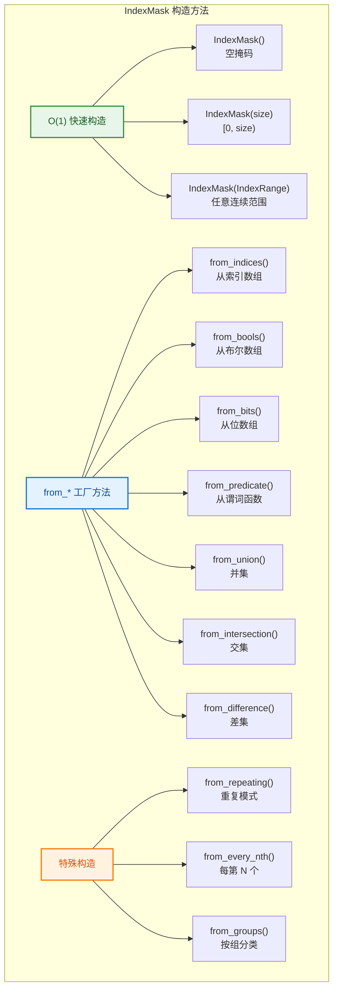
```mermaid
flowchart TB
    subgraph 构造方法["IndexMask 构造方法"]
        A["O(1) 快速构造"] --> A1["IndexMask()<br/>空掩码"]
        A --> A2["IndexMask(size)<br/>[0, size)"]
        A --> A3["IndexMask(IndexRange)<br/>任意连续范围"]

        B["from_* 工厂方法"] --> B1["from_indices()<br/>从索引数组"]
        B --> B2["from_bools()<br/>从布尔数组"]
        B --> B3["from_bits()<br/>从位数组"]
        B --> B4["from_predicate()<br/>从谓词函数"]
        B --> B5["from_union()<br/>并集"]
        B --> B6["from_intersection()<br/>交集"]
        B --> B7["from_difference()<br/>差集"]

        C["特殊构造"] --> C1["from_repeating()<br/>重复模式"]
        C --> C2["from_every_nth()<br/>每第 N 个"]
        C --> C3["from_groups()<br/>按组分类"]
    end

    style A fill:#e8f5e9,stroke:#388e3c,stroke-width:2px,color:#1b5e20
    style B fill:#e3f2fd,stroke:#1976d2,stroke-width:2px,color:#0d47a1
    style C fill:#fff3e0,stroke:#f57c00,stroke-width:2px,color:#e65100
```

### 3.1 静态掩码优化：O(1) 构造大范围的秘密

```cpp
// intern/index_mask.cc:57~101
const IndexMask &get_static_index_mask_for_min_size(const int64_t min_size)
{
  static constexpr int64_t size_shift = 31;
  static constexpr int64_t max_size = (int64_t(1) << size_shift);      /* 2'147'483'648 */
  static constexpr int64_t segments_num = max_size / max_segment_size; /*       131'072 */

  /* Make sure we are never requesting a size that's larger than what was statically allocated.
   * If that's ever needed, we can either increase #size_shift or dynamically allocate an even
   * larger mask. */
  BLI_assert(min_size <= max_size);

  static IndexMask static_mask = []() {
    static Array<const int16_t *> indices_by_segment(segments_num);
    /* The offsets and cumulative segment sizes array contain the same values here, so just use a
     * single array for both. */
    static Array<int64_t> segment_offsets(segments_num + 1);

    static const int16_t *static_offsets = get_static_indices_array().data();

    /* Isolate because the mutex protecting the initialization of #static_mask is locked. */
    threading::isolate_task([&]() {
      threading::parallel_for(IndexRange(segments_num), 1024, [&](const IndexRange range) {
        for (const int64_t segment_i : range) {
          indices_by_segment[segment_i] = static_offsets;
          segment_offsets[segment_i] = segment_i * max_segment_size;
        }
      });
    });
    segment_offsets.last() = max_size;

    IndexMask mask;
    IndexMaskData &data = mask.data_for_inplace_construction();
    data.indices_num_ = max_size;
    data.segments_num_ = segments_num;
    // ...
    return mask;
  }();
  return static_mask;
}
```

**注释翻译：**
- 第 63~65 行：确保我们永远不会请求比静态分配的更大的大小。如果需要，可以增加 `size_shift` 或动态分配更大的掩码。
- 第 71~72 行：偏移和累积段大小数组在这里包含相同的值，所以只用一个数组来充当两者。
- 第 76 行：隔离是因为保护 `static_mask` 初始化的互斥锁被锁定了。

**设计精妙之处：**
- 预分配 **21 亿** 索引的静态掩码（`2^31`）
- 所有 `[0, N)` 范围的掩码都是这个静态掩码的**切片**（只调整 begin/end 指针）
- 构造 `IndexMask(1000000)` 只需几次整数运算，O(1)！

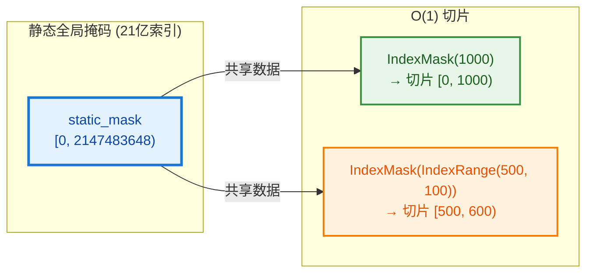
```mermaid
flowchart LR
    subgraph 静态掩码["静态全局掩码 (21亿索引)"]
        STATIC["static_mask<br/>[0, 2147483648)"]
    end

    subgraph 切片["O(1) 切片"]
        M1["IndexMask(1000)<br/>→ 切片 [0, 1000)"]
        M2["IndexMask(IndexRange(500, 100))<br/>→ 切片 [500, 600)"]
    end

    STATIC -->|共享数据| M1
    STATIC -->|共享数据| M2

    style STATIC fill:#e3f2fd,stroke:#1976d2,stroke-width:3px,color:#0d47a1
    style M1 fill:#e8f5e9,stroke:#388e3c,stroke-width:2px,color:#1b5e20
    style M2 fill:#fff3e0,stroke:#f57c00,stroke-width:2px,color:#e65100
```

### 3.2 从布尔数组构造：分支less优化

```cpp
// BLI_index_mask.hh:1073~1096
template<typename Fn>
inline IndexMask IndexMask::from_predicate(const IndexMask &universe,
                                           LinearAllocator<> &memory,
                                           Fn &&predicate,
                                           const exec_mode::Mode mode)
{
  return detail::from_predicate_impl(
      universe,
      memory,
      [&](const IndexMaskSegment indices, int16_t *__restrict r_true_indices) {
        int16_t *r_current = r_true_indices;
        const int16_t *in_end = indices.base_span().end();
        const int64_t offset = indices.offset();
        for (const int16_t *in_current = indices.base_span().data(); in_current < in_end;
             in_current++) {
          const int16_t local_index = *in_current;
          const int64_t global_index = int64_t(local_index) + offset;
          const bool condition = predicate(global_index);
          *r_current = local_index;
          /* This expects the boolean to be either 0 or 1 which is generally the case but may not
           * be if the values are uninitialized. */
          BLI_assert(ELEM(int8_t(condition), 0, 1));
          /* Branchless conditional increment. */
          r_current += condition;
        }
        const int16_t true_indices_num = int16_t(r_current - r_true_indices);
        return true_indices_num;
      },
      mode);
}
```

**关键注释翻译：**
- 第 1086~1087 行：这期望布尔值要么是 0 要么是 1，通常是这样，但如果值未初始化则可能不是。
- 第 1089 行：**无分支条件增量**（Branchless conditional increment）

**语法亮点：`__restrict`**

```cpp
int16_t *__restrict r_true_indices
```

`__restrict` 是 C/C++ 的** restrict 关键字**（C99 引入，C++ 通过编译器扩展支持），它告诉编译器：这个指针是访问它所指向内存的唯一方式（没有其他指针别名）。这允许编译器进行更激进的优化（如循环向量化、指令重排）。

**分支less技巧解析：**

```cpp
*r_current = local_index;   // 总是写入
r_current += condition;     // condition 为 true(1) 时前进，false(0) 时不动
```

传统写法（有分支）：
```cpp
if (condition) {
    *r_current = local_index;
    r_current++;
}
```

分支less写法的优势：
- 避免分支预测失败（现代 CPU 分支预测失败的代价很高）
- 编译器可以更好地向量化（SIMD）
- 执行时间更稳定（不受数据分布影响）

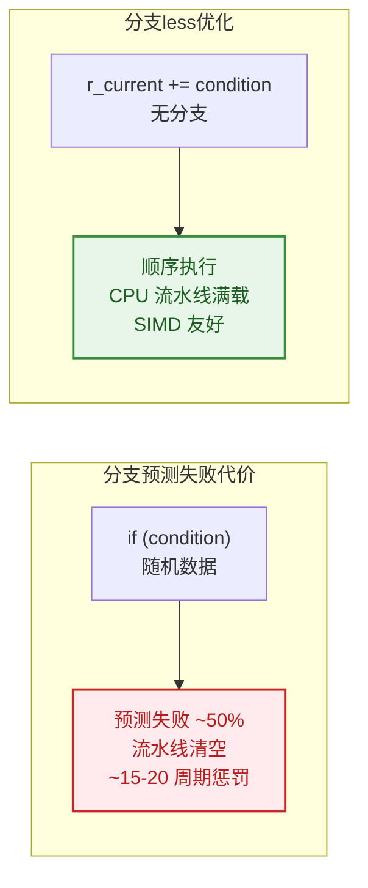
```mermaid
flowchart LR
    subgraph 分支预测["分支预测失败代价"]
        A["if (condition)<br/>随机数据"] --> B["预测失败 ~50%<br/>流水线清空<br/>~15-20 周期惩罚"]
    end

    subgraph 分支less["分支less优化"]
        C["r_current += condition<br/>无分支"] --> D["顺序执行<br/>CPU 流水线满载<br/>SIMD 友好"]
    end

    style B fill:#ffebee,stroke:#c62828,stroke-width:2px,color:#b71c1c
    style D fill:#e8f5e9,stroke:#388e3c,stroke-width:2px,color:#1b5e20
```

---

## 4️⃣ 遍历系统：为什么不用普通迭代器？

### 4.1 foreach_index 的设计哲学

```cpp
// BLI_index_mask.hh:449~450
/**
 * Calls the function once for every index.
 *
 * Supported function signatures:
 * - `(int64_t i)`
 * - `(int64_t i, int64_t pos)`
 *
 * `i` is the index that should be processed and `pos` is the position of that index in the mask:
 *   `i == mask[pos]`
 */
template<ForeachIndexFn Fn, exec_mode::Tag Mode = exec_mode::Serial>
void foreach_index(Fn &&fn, Mode mode = exec_mode::serial) const;
```

**注释翻译：** 对每个索引调用一次函数。支持的函数签名：`(int64_t i)` 或 `(int64_t i, int64_t pos)`。`i` 是要处理的索引，`pos` 是该索引在掩码中的位置（`i == mask[pos]`）。

**为什么用回调而不是迭代器？**

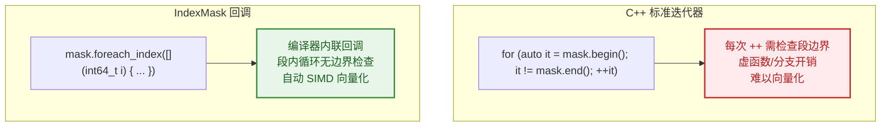
```mermaid
flowchart TB
    subgraph 迭代器方式["C++ 标准迭代器"]
        A["for (auto it = mask.begin(); it != mask.end(); ++it)"] --> B["每次 ++ 需检查段边界<br/>虚函数/分支开销<br/>难以向量化"]
    end

    subgraph 回调方式["IndexMask 回调"]
        C["mask.foreach_index([](int64_t i) { ... })"] --> D["编译器内联回调<br/>段内循环无边界检查<br/>自动 SIMD 向量化"]
    end

    style B fill:#ffebee,stroke:#c62828,stroke-width:2px,color:#b71c1c
    style D fill:#e8f5e9,stroke:#388e3c,stroke-width:2px,color:#1b5e20
```

### 4.2 C++20 Concepts 约束

```cpp
// BLI_index_mask.hh:147~173
template<typename Fn>
concept IndexFn = std::invocable<Fn, int64_t>;
template<typename Fn>
concept IndexPosFn = std::invocable<Fn, int64_t, int64_t>;
template<typename Fn>
concept ForeachIndexFn = IndexFn<Fn> || IndexPosFn<Fn>;

template<typename Fn>
concept SegmentFn = std::invocable<Fn, IndexMaskSegment>;
template<typename Fn>
concept SegmentPosFn = std::invocable<Fn, IndexMaskSegment, int64_t>;
template<typename Fn>
concept ForeachSegmentFn = SegmentFn<Fn> || SegmentPosFn<Fn>;
```

**语法解释：C++20 Concepts**

`concept` 是 C++20 引入的**概念约束**，用于在编译期检查模板参数是否满足某些条件。

```cpp
// 传统写法（C++17 及以前）：SFINAE 或 static_assert
// 错误信息晦涩难懂

template<typename Fn>
concept IndexFn = std::invocable<Fn, int64_t>;
// 含义：Fn 必须是一个可以被 int64_t 调用的类型
// 等价于：fn(42) 必须能编译通过
```

**使用 Concepts 的好处：**
- 错误信息清晰：如果传入的 lambda 签名不对，编译器会直接说"不满足 ForeachIndexFn 概念"
- 编译期重载：根据 lambda 签名自动选择最佳实现（1 参数还是 2 参数）
- 自文档化：代码本身就是接口契约

### 4.3 并行遍历

```cpp
// BLI_index_mask.hh:849~881
template<ForeachIndexFn Fn, exec_mode::Tag Mode>
inline void IndexMask::foreach_index(Fn &&fn, const Mode mode) const
{
  if constexpr (mode.is_parallel) {
    threading::parallel_for(
        this->index_range(), mode.grain_size(4096), [&](const IndexRange range) {
          const IndexMask sub_mask = this->slice(range);
          sub_mask.foreach_index([&](const int64_t i, [[maybe_unused]] const int64_t index_pos) {
            if constexpr (std::is_invocable_r_v<void, Fn, int64_t, int64_t>) {
              fn(i, index_pos + range.start());
            }
            else {
              fn(i);
            }
          });
        });
  }
  else {
    this->foreach_segment(
        [&](const IndexMaskSegment indices, [[maybe_unused]] const int64_t start_segment_pos) {
          if constexpr (IndexPosFn<Fn>) {
            for (const int64_t i : indices.index_range()) {
              fn(indices[i], start_segment_pos + i);
            }
          }
          else {
            for (const int64_t index : indices) {
              fn(index);
            }
          }
        });
  }
}
```

**语法亮点解析：**

| 语法 | 含义 |
|------|------|
| `if constexpr` | C++17 编译期 if，不满足的分支完全不被编译 |
| `[[maybe_unused]]` | C++17 属性，告诉编译器这个变量可能不用，不要警告 |
| `std::is_invocable_r_v<void, Fn, int64_t, int64_t>` | 检查 Fn 是否能以 (int64_t, int64_t) 调用并返回 void |
| `mode.grain_size(4096)` | 并行粒度：每 4096 个索引一个任务 |

**并行策略：**
- 将掩码按索引位置切片（不是按段切片）
- 每 4096 个索引作为一个并行任务
- 任务内部串行遍历，避免线程竞争

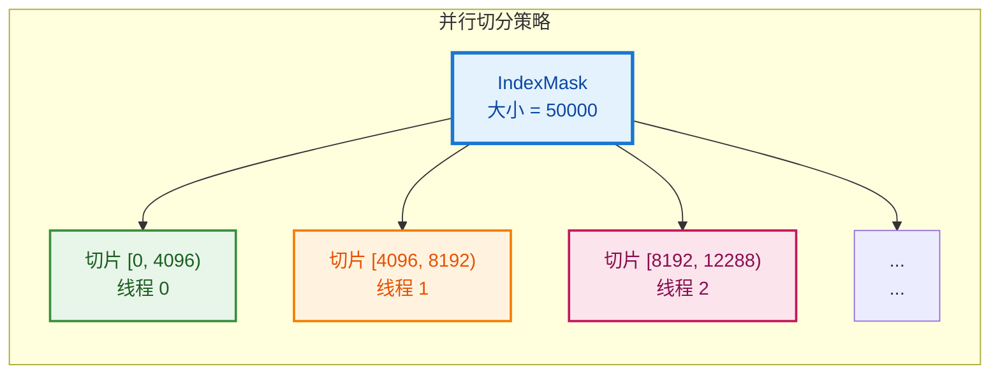
```mermaid
flowchart LR
    subgraph 并行切分["并行切分策略"]
        MASK["IndexMask<br/>大小 = 50000"] --> S0["切片 [0, 4096)<br/>线程 0"]
        MASK --> S1["切片 [4096, 8192)<br/>线程 1"]
        MASK --> S2["切片 [8192, 12288)<br/>线程 2"]
        MASK --> S3["...<br/>..."]
    end

    style MASK fill:#e3f2fd,stroke:#1976d2,stroke-width:3px,color:#0d47a1
    style S0 fill:#e8f5e9,stroke:#388e3c,stroke-width:2px,color:#1b5e20
    style S1 fill:#fff3e0,stroke:#f57c00,stroke-width:2px,color:#e65100
    style S2 fill:#fce4ec,stroke:#c2185b,stroke-width:2px,color:#880e4f
```

---

## 5️⃣ 切片系统：O(log n) 的零拷贝切片

### 5.1 切片实现

```cpp
// intern/index_mask.cc:124~141
IndexMask IndexMask::slice(const int64_t start, const int64_t size) const
{
  if (size == 0) {
    return {};
  }
  const RawMaskIterator first_it = this->index_to_iterator(start);
  const RawMaskIterator last_it = this->index_to_iterator(start + size - 1);

  IndexMask sliced = *this;
  sliced.indices_num_ = size;
  sliced.segments_num_ = last_it.segment_i - first_it.segment_i + 1;
  sliced.indices_by_segment_ += first_it.segment_i;        // 指针偏移
  sliced.segment_offsets_ += first_it.segment_i;           // 指针偏移
  sliced.cumulative_segment_sizes_ += first_it.segment_i;  // 指针偏移
  sliced.begin_index_in_segment_ = first_it.index_in_segment;
  sliced.end_index_in_segment_ = last_it.index_in_segment + 1;
  return sliced;
}
```

**设计精妙：**
- 不复制任何索引数据！
- 只调整指针和边界值
- 时间复杂度 O(log n)（两次二分查找定位迭代器）

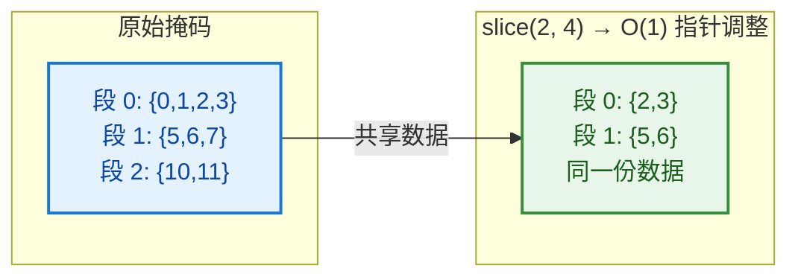
```mermaid
flowchart LR
    subgraph 原始掩码["原始掩码"]
        O["段 0: {0,1,2,3}<br/>段 1: {5,6,7}<br/>段 2: {10,11}"]
    end

    subgraph 切片后["slice(2, 4) → O(1) 指针调整"]
        S["段 0: {2,3}<br/>段 1: {5,6}<br/>同一份数据"]
    end

    O -->|共享数据| S

    style O fill:#e3f2fd,stroke:#1976d2,stroke-width:2px,color:#0d47a1
    style S fill:#e8f5e9,stroke:#388e3c,stroke-width:2px,color:#1b5e20
```

### 5.2 迭代器定位：二分查找

```cpp
// BLI_index_mask.hh:784~796
inline RawMaskIterator IndexMask::index_to_iterator(const int64_t index) const
{
  BLI_assert(index >= 0);
  BLI_assert(index < indices_num_);
  RawMaskIterator it;
  const int64_t full_index = index + cumulative_segment_sizes_[0] + begin_index_in_segment_;
  it.segment_i = binary_search::last_if(
      cumulative_segment_sizes_,
      cumulative_segment_sizes_ + segments_num_ + 1,
      [&](const int64_t cumulative_size) { return cumulative_size <= full_index; });
  it.index_in_segment = full_index - cumulative_segment_sizes_[it.segment_i];
  return it;
}
```

**算法：** 在 `cumulative_segment_sizes_` 数组上做二分查找，找到第 `index` 个元素所在的段。

---

## 6️⃣ 业界对比：其他项目的稀疏索引集合

```mermaid
flowchart TB
    subgraph 对比矩阵["稀疏索引集合方案对比"]
        direction LR
        A["方案"] --> B["存储方式"] --> C["遍历效率"] --> D["内存效率"] --> E["并行友好"] --> F["适用场景"]

        A1["IndexMask<br/>(Blender)"] --> B1["int16[] + offset<br/>分段"] --> C1["⭐⭐⭐<br/>缓存友好"] --> D1["⭐⭐⭐<br/>极稀疏优"] --> E1["⭐⭐⭐<br/>天然分段"] --> F1["几何处理<br/>字段求值"]
        A2["SparseBitVector<br/>(LLVM)"] --> B2["链表 + bitword<br/>128位块"] --> C2["⭐⭐<br/>链表跳转"] --> D2["⭐⭐<br/>中等稀疏"] --> E2["⭐<br/>需同步"] --> F2["编译器<br/>稀疏集合"]
        A3["BitVector<br/>(LLVM)"] --> B3["uint32[]<br/>密集位图"] --> C3["⭐⭐⭐<br/>SIMD友好"] --> D3["⭐<br/>密集才优"] --> E3["⭐⭐<br/>SIMD并行"] --> F3["密集位运算<br/>寄存器分配"]
        A4["Roaring Bitmap<br/>(通用)"] --> B4["array/bit/run<br/>自适应容器"] --> C4["⭐⭐⭐<br/>缓存友好"] --> D4["⭐⭐⭐<br/>自适应优"] --> E4["⭐⭐⭐<br/>分片并行"] --> F4["数据库<br/>大数据"]
        A5["std::vector<bool><br/>(C++ STL)"] --> B5["bit-packed<br/>特化vector"] --> C5["⭐<br/>位访问慢"] --> D5["⭐⭐<br/>固定开销"] --> E5["⭐<br/>难并行"] --> F5["不推荐<br/>历史包袱"]
        A6["NumPy nonzero<br/>(Python)"] --> B6["int64[]<br/>索引数组"] --> C6["⭐⭐<br/>连续但大"] --> D6["⭐⭐<br/>8字节/索引"] --> E6["⭐⭐<br/>向量化"] --> F6["科学计算<br/>Python生态"]
    end

    style A1 fill:#e3f2fd,stroke:#1976d2,stroke-width:3px,color:#0d47a1
    style A4 fill:#e8f5e9,stroke:#388e3c,stroke-width:2px,color:#1b5e20
```

### 6.1 LLVM SparseBitVector

```cpp
// LLVM 设计（简化）
template<unsigned ElementSize = 128>
class SparseBitVector {
    std::list<SparseBitVectorElement<ElementSize>> Elements;
    mutable ElementListIter CurrElementIter;  // 缓存上次访问位置
};
```

**与 IndexMask 的关键差异：**

| 特性 | LLVM SparseBitVector | Blender IndexMask |
|------|---------------------|-------------------|
| **结构** | 链表 + 128位块 | 数组 + 16384索引段 |
| **修改** | 支持动态 set/reset | 构造后不可变（函数式） |
| **遍历** | 链表跳转，缓存不友好 | 数组顺序，缓存友好 |
| **随机访问** | O(段数) 线性 | O(log 段数) 二分 |
| **迭代器** | 完整 C++ 迭代器 | Raw 坐标，回调遍历 |
| **并行** | 链表难并行 | 天然分段并行 |

**LLVM 选择链表的原因：** 编译器场景需要频繁 set/reset 位，链表插入删除 O(1)。Blender 场景是**构造一次、遍历多次**，数组更适合。

### 6.2 Roaring Bitmap

```
Roaring Bitmap 结构（每 65536 个值一个 container）：
┌─────────────────────────────────────┐
│  Container 0 (values 0~65535)       │
│  ├── Array Container: uint16[]       │  < 4096 个值
│  ├── Bitmap Container: uint64[1024]  │  >= 4096 个值
│  └── Run Container: run[]            │  连续段多
├─────────────────────────────────────┤
│  Container 1 (values 65536~131071)  │
│  ...                                │
└─────────────────────────────────────┘
```

**与 IndexMask 的对比：**

| 特性 | Roaring Bitmap | IndexMask |
|------|---------------|-----------|
| **块大小** | 65536（2^16） | 16384（2^14） |
| **块内存储** | 自适应（array/bit/run） | 统一 int16[] |
| **容器类型** | 多种（复杂） | 单一（简单） |
| **序列化** | 优秀（标准格式） | 无（内存结构） |
| **集运算** | 高度优化 | 通过 Expression 系统 |
| **目标** | 持久化、网络传输 | 内存计算、几何处理 |

**IndexMask 更简单的原因：** Blender 不需要序列化到磁盘或网络，只需要内存中高效遍历。单一格式减少了分支和代码复杂度。

### 6.3 NumPy Boolean Indexing

```python
# NumPy 方式
mask = arr > 0.5          # 创建 bool[]
result = arr[mask]        # 内部调用 nonzero() → int64[]
indices = np.nonzero(mask)[0]  # 显式获取索引数组
```

**NumPy 内部实现：**
- 布尔掩码就是 `bool[]` 数组
- `nonzero()` 遍历一次生成 `int64[]` 索引数组
- 后续用 `int64[]` 索引访问原数组

**与 IndexMask 的差异：**
- NumPy 没有分段概念，直接 `int64[]` — 简单但内存占用大（8 字节/索引）
- IndexMask 的 `int16[]` + offset 更紧凑（2 字节/索引）
- NumPy 的 `nonzero()` 类似 `IndexMask::from_bools()`

---

## 7️⃣ 设计评估：优劣分析

### 7.1 优势

```mermaid
flowchart LR
    subgraph 优势["IndexMask 设计优势"]
        A1["内存高效<br/>int16_t = 2B/索引<br/>vs int64_t = 8B"] 
        A2["缓存友好<br/>段内连续访问<br/>预取有效"]
        A3["并行天然<br/>段级/切片级并行<br/>无锁"]
        A4["零拷贝切片<br/>O(log n) 切片<br/>共享数据"]
        A5["分支less遍历<br/>SIMD 友好<br/>稳定性能"]
        A6,"静态优化<br/>大范围 O(1)<br/>预分配 21亿"]
    end

    style A1 fill:#e8f5e9,stroke:#388e3c,stroke-width:2px,color:#1b5e20
    style A2 fill:#e8f5e9,stroke:#388e3c,stroke-width:2px,color:#1b5e20
    style A3 fill:#e8f5e9,stroke:#388e3c,stroke-width:2px,color:#1b5e20
    style A4 fill:#e8f5e9,stroke:#388e3c,stroke-width:2px,color:#1b5e20
    style A5 fill:#e8f5e9,stroke:#388e3c,stroke-width:2px,color:#1b5e20
    style A6 fill:#e8f5e9,stroke:#388e3c,stroke-width:2px,color:#1b5e20
```

### 7.2 劣势与权衡

| 劣势 | 说明 | 缓解方式 |
|------|------|----------|
| **不可变** | 构造后不能增删索引 | 函数式风格，重新构造新掩码 |
| **密集场景 overhead** | 选中 >50% 时，bool[] 可能更快 | `to_bools()` 转换后处理 |
| **随机访问慢** | `operator[]` 是 O(log n) | 用 `foreach_index` 顺序访问 |
| **非标准迭代器** | 不能用 range-based for | 习惯回调式遍历 |
| **C++20 Concepts** | 需要较新编译器 | Blender 已要求 C++20 |
| **无持久化格式** | 不能序列化到磁盘 | 需要时转 `int64[]` |

### 7.3 复杂度总结

| 操作 | 时间复杂度 | 空间复杂度 | 备注 |
|------|-----------|-----------|------|
| 构造（范围） | O(1) | O(1) | 静态掩码切片 |
| 构造（from_bools） | O(N) | O(K) | K = 选中数量 |
| 构造（from_indices） | O(K log K) | O(K) | 需排序去重 |
| 切片 | O(log n) | O(1) | 零拷贝 |
| 遍历 | O(K) | O(1) | K = 掩码大小 |
| 并行遍历 | O(K/P) | O(1) | P = 线程数 |
| 查找 contains | O(log n) | O(1) | 二分查找 |
| 并/交/差 | O(K1 + K2) | O(K_result) | 通过 Expression |

---

## 8️⃣ 在 Blender 中的使用模式

### 8.1 字段求值 → IndexMask

```cpp
// 典型流程（如 Split Curve 节点）
fn::FieldEvaluator evaluator(context, size);
evaluator.add(selection_field);
evaluator.evaluate();
const IndexMask selection = evaluator.get_evaluated_as_mask(0);
// selection 现在驱动后续几何操作
```

### 8.2 IndexMask → 几何操作

```cpp
// 方式 1：遍历修改
mask.foreach_index([&](const int64_t i) {
    positions[i] += offset;
});

// 方式 2：gather 属性
bke::gather_attributes(src_attrs, domain, filter, dst_to_src, dst_attrs);

// 方式 3：转换为 bool 数组
Array<bool> bools(size);
mask.to_bools(bools.as_mutable_span());
```

### 8.3 组合运算

```cpp
IndexMaskMemory memory;
IndexMask union_mask = IndexMask::from_union(mask_a, mask_b, memory);
IndexMask intersect_mask = IndexMask::from_intersection(mask_a, mask_b, memory);
IndexMask diff_mask = IndexMask::from_difference(mask_a, mask_b, memory);
```

---

## 9️⃣ 你应该了解到什么程度？

```mermaid
flowchart TB
    subgraph 层次["学习层次建议"]
        direction LR
        L1["L1: 使用者<br/>知道它是稀疏索引集合<br/>会用 foreach_index<br/>会用 from_bools"] --> L2["L2: 进阶使用者<br/>理解分段存储<br/>会用并行遍历<br/>会用切片和组合运算"]
        L2 --> L3["L3: 贡献者<br/>理解内存布局<br/>能评估算法复杂度<br/>能修改/扩展功能"]
        L3 --> L4["L4: 设计者<br/>理解所有设计权衡<br/>能与 Roaring/LLVM 对比<br/>能设计类似结构"]
    end

    style L1 fill:#e3f2fd,stroke:#1976d2,stroke-width:2px,color:#0d47a1
    style L2 fill:#e8f5e9,stroke:#388e3c,stroke-width:2px,color:#1b5e20
    style L3 fill:#fff3e0,stroke:#f57c00,stroke-width:2px,color:#e65100
    style L4 fill:#fce4ec,stroke:#c2185b,stroke-width:3px,color:#880e4f
```

| 层次 | 目标人群 | 需要掌握 |
|------|----------|----------|
| **L1 使用者** | 写 Blender 节点/工具 | `foreach_index`, `from_bools`, `is_empty`, `size` |
| **L2 进阶** | 优化性能瓶颈 | 并行遍历、切片、组合运算、内存管理 |
| **L3 贡献者** | 给 Blender 提交补丁 | 分段结构、`__restrict`、分支less、静态掩码 |
| **L4 设计者** | 设计新基础库 | 与业界对比、权衡分析、硬件特性利用 |

---

## ✅ 总结

**IndexMask 是 Blender 为几何处理场景量身定制的稀疏索引集合。** 它的核心创新是：

1. **分段压缩**：int16_t 索引 + int64_t 偏移，2 字节/索引
2. **函数式不可变**：构造后只读，零拷贝切片共享数据
3. **回调式遍历**：放弃 C++ 迭代器，换取编译器优化和 SIMD 友好
4. **并行原生**：段级/切片级并行，无需锁同步
5. **静态优化**：预分配 21 亿索引的静态掩码，大范围 O(1) 构造

**与业界方案相比：**
- 比 LLVM SparseBitVector 更缓存友好（数组 vs 链表）
- 比 Roaring Bitmap 更简单（单一格式 vs 自适应容器）
- 比 NumPy nonzero 更紧凑（2B vs 8B / 索引）
- 比 std::vector<bool> 更高效（专门设计 vs 历史包袱）

**如果你只记住一件事：** IndexMask 用 **空间换时间**（压缩存储）的同时，又用 **分段设计** 保证了 **时间换空间**（缓存友好遍历）。这是它最精妙的地方。

---

## 📁 相关文件

| 文件 | 路径 | 说明 |
|------|------|------|
| `BLI_index_mask.hh` | `source/blender/blenlib/` | 主头文件（1300+ 行） |
| `intern/index_mask.cc` | `source/blender/blenlib/intern/` | 实现文件 |
| `BLI_index_mask_expression.hh` | `source/blender/blenlib/` | 表达式系统（并/交/差） |
| `BLI_offset_span.hh` | `source/blender/blenlib/` | OffsetSpan 基类 |
| `BLI_linear_allocator.hh` | `source/blender/blenlib/` | 线性分配器 |
