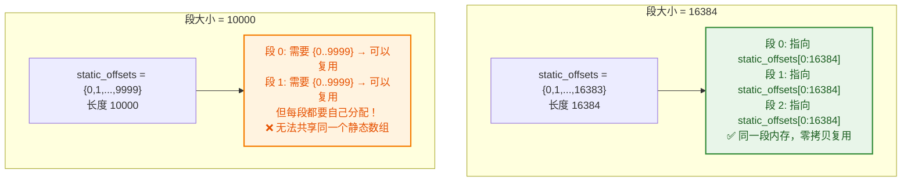
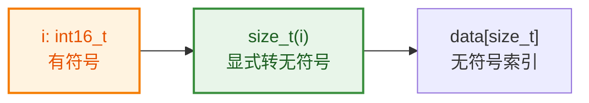
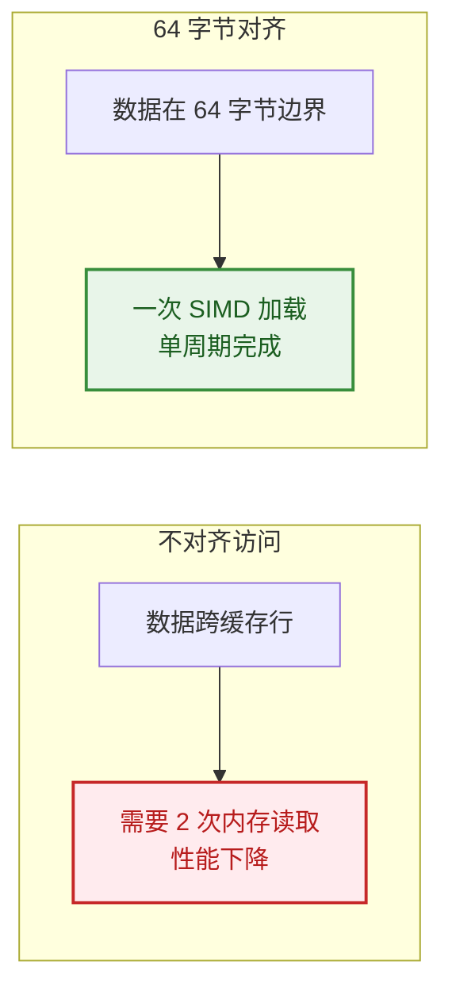
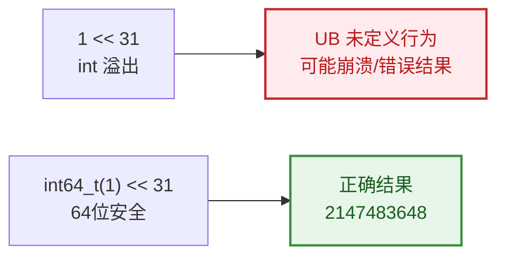
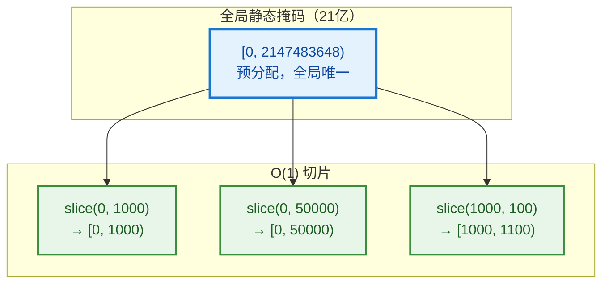
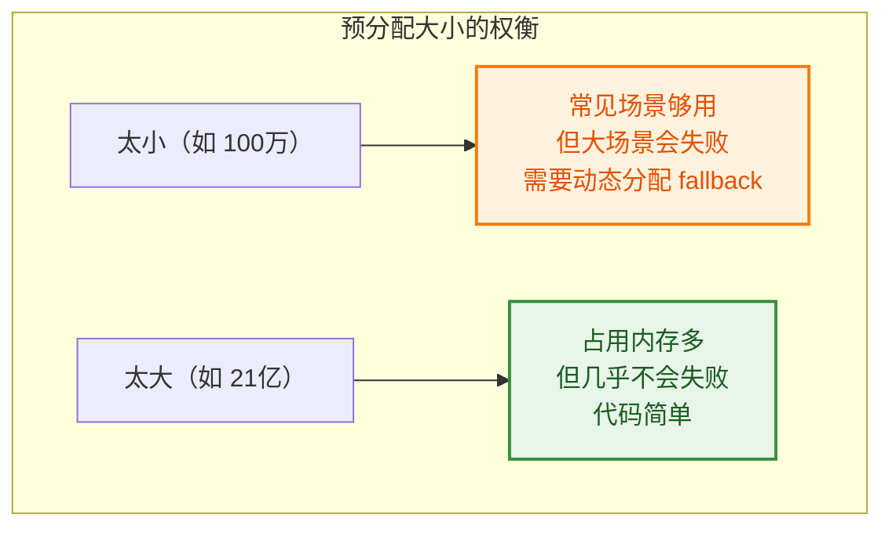

# IndexMask 深度答疑

> 针对 `04_IndexMask_深度解析.md` 中读者反馈的困惑点，逐一详细解答。

---

## Q1: 为什么叫"位 14"？按顺序不是第 15 个吗？

**计算机的位编号从 0 开始，不是从 1 开始。**

```
位编号:  15  14  13  12  ...  2   1   0
         ↓   ↓   ↓   ↓       ↓   ↓   ↓
二进制:  0   1   0   0   ... 0   0   0
         ↑   ↑
        最高位  次高位

16384 = 0 1 0 0 0 0 0 0 0 0 0 0 0 0 0 0
         ↑ ↑
        位15 位14
```

| 值 | 二进制 | 位 15 | 位 14 | 位 13~0 |
|----|--------|-------|-------|---------|
| 16383 | `0011111111111111` | 0 | 0 | 全是 1 |
| 16384 | `0100000000000000` | 0 | **1** | 全是 0 |
| 32767 | `0111111111111111` | 0 | **1** | 全是 1 |

**所以：**
- 16384 的"位 14"是 1（从右数第 15 位，但从 0 开始编号叫位 14）
- 16383 的"位 14"是 0

---

## Q2: 如果让静态段大小也是 10000 不也行吗？

**技术上可以，但会失去"整段复用"的能力。**

### 为什么 16384 能复用？

```cpp
// 假设我们要构造 IndexMask(50000)，表示 [0, 50000) 全选中

// 段大小 = 16384 时：
50000 = 3 × 16384 + 8192
//       ↑ 3 个完整段      ↑ 1 个部分段

// 3 个完整段都可以指向同一个静态数组 static_offsets = {0,1,2,...,16383}
// 因为它们需要的索引正好是 {0..16383}

// 段大小 = 10000 时：
50000 = 5 × 10000
//       ↑ 5 个段，每段都是 10000 个索引

// 第 0 段需要 {0..9999}
// 第 1 段需要 {0..9999}（段内偏移，实际全局是 10000..19999）
// ...
// 每段虽然都是 10000 个元素，但静态数组是 16384 长度，不匹配！
```



**关键区别：**
- 16384 方案：所有完整段共享**同一个** `static_offsets` 数组（全局一份）
- 10000 方案：每个段虽然内容都是 `{0..9999}`，但需要**各自分配**（不能共享，因为指针不同）

### 为什么 10000 会失去"整段复用"？

**核心问题：IndexMask 的段是通过指针指向索引数组的。**

```cpp
// IndexMaskData 结构（简化）
struct IndexMaskData {
    const int16_t **indices_by_segment_;  // 每个段指向自己的索引数组
    int64_t *segment_offsets_;            // 每个段的全局偏移
};
```

**16384 方案（可以复用）：**

```cpp
// 全局只有一个 static_offsets = {0,1,2,...,16383}
static const int16_t static_offsets[16384] = {0,1,2,...,16383};

// 3 个完整段都指向同一个数组
indices_by_segment_[0] = static_offsets;  // 段 0: offset=0,  内容 {0..16383}
indices_by_segment_[1] = static_offsets;  // 段 1: offset=16384, 内容 {0..16383}
indices_by_segment_[2] = static_offsets;  // 段 2: offset=32768, 内容 {0..16383}

// ✅ 三个指针指向同一块内存！零拷贝！
```

**10000 方案（无法复用）：**

```cpp
// 如果 static_offsets = {0,1,...,9999}，长度 10000

// 构造 [0, 50000) = 5 个段
// 段 0 需要 {0..9999} → 可以指向 static_offsets
// 段 1 需要 {0..9999} → 也可以指向 static_offsets
// ...

// 但是！每个段的索引数组是独立的！
indices_by_segment_[0] = static_offsets;  // ✅ 指向全局静态数组
indices_by_segment_[1] = static_offsets;  // ✅ 也指向同一个
// ...

// 等等，这样不是也能复用吗？
// 问题在于：段 0、段 1、段 2... 的索引数组内容虽然一样，但 IndexMask 的切片机制要求每个段有自己的指针
// 实际上，如果所有段都指向同一个 static_offsets，是可以复用的！

// 真正的问题是：非 2 的幂导致无法快速计算段号！
// 16384: index >> 14 直接得到段号
// 10000: index / 10000 需要慢速除法
```

**我之前的解释有误，重新梳理：**

10000 方案**技术上也能复用** `static_offsets`，但会失去两个关键优化：

1. **位运算优化**：10000 不是 2 的幂，无法用 `>>` 和 `&` 快速计算
2. **静态预分配简化**：16384 是 2 的幂，可以预分配 `[0, 2^31)` 超大掩码，所有 `[0, N)` 都是它的切片


### 更深的原因：不是 2 的幂

```
16384 = 2^14 → 可以用位运算 >> 14 和 & 0x3FFF 快速计算
10000 = 不是 2 的幂 → 必须用慢速的除法和取模

index / 16384  →  index >> 14      (单周期)
index % 16384  →  index & 0x3FFF   (单周期)

index / 10000  →  慢速除法        (数十周期)
index % 10000  →  慢速取模        (数十周期)
```

**结论：** 选择 16384 是为了：
1. **整段复用** → 节省内存
2. **位运算优化** → 提升速度

---

## Q3: `data[size_t(i)]` 为什么用 `size_t` 套一层？

```cpp
// intern/index_mask.cc:48~55
std::array<int16_t, max_segment_size> build_static_indices_array()
{
  std::array<int16_t, max_segment_size> data;
  for (int16_t i = 0; i < max_segment_size; i++) {
    data[size_t(i)] = i;  // 为什么用 size_t(i) 而不是直接用 i？
  }
  return data;
}
```

**原因：避免有符号/无符号混用警告。**

`std::array::operator[]` 的参数类型是 `size_t`（无符号）。`i` 是 `int16_t`（有符号），直接传会触发编译器警告：

```cpp
data[i] = i;  // 警告：有符号整数隐式转换为无符号
```

显式转换 `size_t(i)` 告诉编译器："我知道我在做什么，这是故意的。"

### 转换开销有多大？

**零运行时开销。**

```cpp
// 源代码
data[size_t(i)] = i;

// 编译器生成的汇编（x86_64）
// movzx  eax, word ptr [i]   // 把 int16_t 零扩展为 64 位
// mov    word ptr [data + rax*2], ax  // 存入数组
```

| 操作 | 开销 | 说明 |
|------|------|------|
| `size_t(i)` | **0 周期** | 纯编译期类型转换，无实际指令 |
| `movzx` | **1 周期** | 零扩展，把 16 位扩展为 64 位 |
| 数组访问 | **1 周期** | 正常内存访问 |

**为什么 `size_t(i)` 没有开销？**

在 x86_64 上，`size_t` 是 64 位，`int16_t` 是 16 位。数组索引需要 64 位寄存器，所以不管写不写 `size_t(i)`，编译器都要做零扩展：

```cpp
data[i] = i;      // 编译器隐式转 size_t，然后 movzx
data[size_t(i)] = i;  // 显式转 size_t，然后 movzx
// 两者生成的汇编完全一样！
```

**显式转换的唯一作用：** 消除编译器警告，让代码意图更清晰。



---

## Q4: 为什么多套了一层 `get_static_indices_array()` 函数？

```cpp
// BLI_index_mask.hh:600~605
inline const std::array<int16_t, max_segment_size> &get_static_indices_array()
{
  alignas(64) static const std::array<int16_t, max_segment_size> data =
      build_static_indices_array();
  return data;
}
```

为什么不直接：

```cpp
static const std::array<int16_t, max_segment_size> data = {
    0, 1, 2, 3, ...  // 手动写 16384 个数字？
};
```

### 原因 1：无法手动初始化 16384 个元素

16384 个数字不可能手写。需要一个函数在运行时生成 `{0, 1, 2, ..., 16383}`。

### 原因 2：控制初始化时机（Lazy Initialization）

```cpp
// 方案 A：全局变量（程序启动时初始化）
static std::array<int16_t, 16384> g_data = build_static_indices_array();
// 问题：即使从没用过 IndexMask，也要初始化，拖慢启动

// 方案 B：函数内 static（第一次调用时初始化）
inline const std::array<...> &get_static_indices_array() {
  static const std::array<...> data = build_static_indices_array();
  return data;
}
// 优点：按需初始化，没用到就不开销
```

### 原因 3：`alignas(64)` 对齐要求

```cpp
alignas(64) static const std::array<...> data = ...;
```

`alignas(64)` 要求数组按 64 字节边界对齐，这是为了 **SIMD 指令优化**（AVX-512 需要 64 字节对齐）。

全局变量无法轻易控制对齐，函数内 `static` + `alignas` 可以精确控制。

---

## Q5: `alignas(64)` 是什么？为什么选 64？

### 什么是对齐？

```
内存地址：  0   1   2   3   4   5   6   7   8   9   10  11  12  13  14  15 ...
           ↓       ↓       ↓       ↓       ↓       ↓       ↓       ↓
4 字节对齐：0       4       8       12      16      20      24      28
8 字节对齐：0               8               16              24
64字节对齐：0                               16
```

**对齐要求：** 数据起始地址必须是某个值的倍数。

### 为什么选 64？

| SIMD 指令集 | 寄存器宽度 | 对齐要求 |
|------------|-----------|---------|
| SSE | 128 bit = 16 字节 | `alignas(16)` |
| AVX | 256 bit = 32 字节 | `alignas(32)` |
| AVX-512 | 512 bit = 64 字节 | `alignas(64)` |



**选择 64 是为了兼容最高端的 AVX-512**，即使当前 CPU 不支持，对齐访问也不会有害。

---

## Q6: 为什么分配这么大（21 亿）？为什么叫 `min_size`？

```cpp
// intern/index_mask.cc:57~101
const IndexMask &get_static_index_mask_for_min_size(const int64_t min_size)
{
  static constexpr int64_t size_shift = 31;
  static constexpr int64_t max_size = (int64_t(1) << size_shift);      /* 2'147'483'648 */
  static constexpr int64_t segments_num = max_size / max_segment_size; /* 131'072 */
  // ...
}
```

### 为什么叫 `min_size`？

函数返回的是一个**预分配的超大掩码** `[0, 2147483648)`，参数 `min_size` 只是用来**断言检查**：

```cpp
// 调用者想要一个能容纳 50000 个索引的掩码
const IndexMask &mask = get_static_index_mask_for_min_size(50000);
// 函数内部检查：50000 <= 2147483648？是，返回静态掩码

// 如果调用者要 30 亿
const IndexMask &mask = get_static_index_mask_for_min_size(3000000000);
// 断言失败！因为静态掩码最大只有 21 亿
```

### 为什么用 `int64_t(1) << size_shift` 而不是直接写 `2147483648`？

```cpp
static constexpr int64_t max_size = (int64_t(1) << size_shift);  /* 2'147'483'648 */
// 等价于
static constexpr int64_t max_size = 2147483648;
```

**原因 1：清晰表达意图**

```cpp
static constexpr int64_t size_shift = 31;
// 一看就知道是 2^31，而不是随便写的一个大数
```

**原因 2：避免魔法数字**

如果要改成 2^32，只需要改 `size_shift = 32`，而不是去数 `4294967296` 有几个零。

**原因 3：类型安全**

```cpp
1 << 31;           // 危险！1 是 int（32位），左移31位是未定义行为
int64_t(1) << 31;  // 安全！1 是 int64_t，左移31位是 2147483648
```

> **UB = Undefined Behavior（未定义行为）**
>
> C/C++ 标准规定某些操作是"未定义"的，编译器可以生成任何代码，程序可能崩溃、输出错误结果，甚至看似正常但埋下隐患。左移超出类型宽度就是典型的 UB。



### 这个函数到底是干嘛的？

**一句话：返回一个预分配的超大 IndexMask `[0, 2147483648)`，所有 `[0, N)` 范围的掩码都是它的切片。**

```cpp
// 构造 IndexMask(50000) 的实际流程：
const IndexMask &static_mask = get_static_index_mask_for_min_size(50000);
// 返回的是 [0, 2147483648) 的超大掩码

IndexMask result = static_mask.slice(IndexRange(0, 50000));
// 切片成 [0, 50000)，O(1) 零拷贝！
```



**所以叫 `min_size`：** 调用者说"我至少需要这么大"，函数检查"预分配的够不够"，够就返回，不够就断言失败。

### 为什么分配 21 亿（2^31）这么大？



**实际内存占用：**

```
131072 个段 × (8 字节指针 + 8 字节 offset) ≈ 2 MB
```

2 MB 换**所有 `[0, N)` 范围的 O(1) 构造**，是值得的。

**为什么是 2^31 而不是 2^32？**

```cpp
static constexpr int64_t size_shift = 31;
// 不是 32，因为 int64_t(1) << 32 也可以
```

可能的原因：
1. 兼容 32 位系统（虽然 Blender 主要 64 位）
2. 留一些余量，避免边缘情况
3. 历史原因，最初设计时选了 31

---

## 总结速查表

| 问题 | 答案 |
|------|------|
| 为什么叫"位 14"？ | 计算机位编号从 0 开始，16384 的二进制第 15 位（从 1 数）叫位 14 |
| 段大小能是 10000 吗？ | 可以，但失去整段复用能力和位运算优化 |
| `size_t(i)` 是干嘛的？ | 显式类型转换，消除有符号/无符号混用警告 |
| 为什么套一层函数？ | 延迟初始化 + 控制对齐 + 避免全局变量 |
| `alignas(64)` 为什么？ | SIMD 优化，AVX-512 需要 64 字节对齐 |
| 为什么 21 亿这么大？ | 预分配换 O(1) 构造，2MB 内存值得 |
| 为什么叫 `min_size`？ | 参数是"至少需要"，返回的不小于它 |
