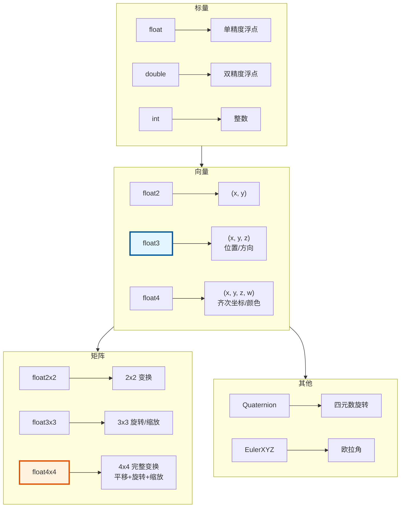

# 数学类型 - float2/float3/float4/float4x4

> Blender 几何节点开发中最常用的数学类型，用于表示向量、点、颜色和变换矩阵

---

## 🎯 核心类型概览



---

## 📐 float3 - 3D 向量

### 构造

```cpp
#include "BLI_math_vector.hh"

namespace blender::nodes {

void float3_construct_examples() {
    // 1. 默认构造 - 零向量
    float3 v1;  // (0, 0, 0)
    
    // 2. 分量构造
    float3 v2(1.0f, 2.0f, 3.0f);
    
    // 3. 初始化列表
    float3 v3 = {1.0f, 2.0f, 3.0f};
    
    // 4. 静态常量
    float3 zero = float3::zero();      // (0, 0, 0)
    float3 one = float3::one();        // (1, 1, 1)
    float3 unit_x = float3::unit_x();  // (1, 0, 0)
    float3 unit_y = float3::unit_y();  // (0, 1, 0)
    float3 unit_z = float3::unit_z();  // (0, 0, 1)
}

} // namespace blender::nodes
```

### 算术运算

```cpp
void float3_arithmetic_examples() {
    float3 a(1, 2, 3);
    float3 b(4, 5, 6);
    float s = 2.0f;
    
    // 加减
    float3 add = a + b;        // (5, 7, 9)
    float3 sub = a - b;        // (-3, -3, -3)
    
    // 标量乘除
    float3 mul = a * s;        // (2, 4, 6)
    float3 div = a / s;        // (0.5, 1, 1.5)
    
    // 逐元素乘除
    float3 emul = a * b;       // (4, 10, 18)
    float3 ediv = a / b;       // (0.25, 0.4, 0.5)
    
    // 复合赋值
    a += b;                    // a = (5, 7, 9)
    a *= s;                    // a = (10, 14, 18)
    
    // 负号
    float3 neg = -a;           // (-10, -14, -18)
}
```

### 向量运算

```cpp
void float3_vector_operations() {
    float3 a(1, 2, 3);
    float3 b(4, 5, 6);
    
    // 点积
    float dot = math::dot(a, b);           // 1*4 + 2*5 + 3*6 = 32
    
    // 叉积
    float3 cross = math::cross(a, b);      // (-3, 6, -3)
    
    // 长度
    float len = math::length(a);           // sqrt(14) ≈ 3.74
    float len_sq = math::length_squared(a); // 14
    
    // 距离
    float dist = math::distance(a, b);
    float dist_sq = math::distance_squared(a, b);
    
    // 归一化
    float3 normalized = math::normalize(a);  // 单位向量
    
    // 反射
    float3 incident(1, -1, 0);
    float3 normal(0, 1, 0);
    float3 reflected = math::reflect(incident, normal);
    
    // 投影
    float3 projected = math::project(a, b);  // a 在 b 上的投影
}
```

### 常用函数

```cpp
void float3_common_functions() {
    float3 a(1, 2, 3);
    float3 b(4, 5, 6);
    
    // 绝对值
    float3 abs_a = math::abs(a);           // (1, 2, 3)
    
    // 最小/最大
    float3 min_v = math::min(a, b);        // (1, 2, 3)
    float3 max_v = math::max(a, b);        // (4, 5, 6)
    
    // 钳制
    float3 clamped = math::clamp(a, float3(0), float3(2));  // (1, 2, 2)
    
    // 线性插值
    float3 lerp = math::interpolate(a, b, 0.5f);  // (2.5, 3.5, 4.5)
    
    // 取整
    float3 floor_v = math::floor(a);
    float3 ceil_v = math::ceil(a);
    float3 round_v = math::round(a);
    
    // 符号
    float3 sign_v = math::sign(a);         // (1, 1, 1)
}
```

---

## 🔲 float4 - 4D 向量/颜色

```cpp
void float4_examples() {
    // 构造
    float4 v1(1, 2, 3, 4);
    float4 color(1.0f, 0.5f, 0.0f, 1.0f);  // RGBA
    
    // 从 float3 构造（w=1）
    float3 pos(1, 2, 3);
    float4 homogeneous(pos, 1.0f);  // 齐次坐标
    
    // 运算（与 float3 类似）
    float4 a(1, 2, 3, 4);
    float4 b(5, 6, 7, 8);
    float4 sum = a + b;  // (6, 8, 10, 12)
    
    // 颜色混合
    float4 color1(1, 0, 0, 1);  // 红色
    float4 color2(0, 0, 1, 1);  // 蓝色
    float4 mixed = math::interpolate(color1, color2, 0.5f);  // 紫色
}
```

---

## 🎯 float4x4 - 变换矩阵

### 构造

```cpp
#include "BLI_math_matrix.hh"

void float4x4_construct_examples() {
    // 1. 单位矩阵
    float4x4 identity = float4x4::identity();
    // | 1 0 0 0 |
    // | 0 1 0 0 |
    // | 0 0 1 0 |
    // | 0 0 0 1 |
    
    // 2. 从位置/旋转/缩放构造
    float3 location(1, 2, 3);
    math::Quaternion rotation = math::to_quaternion(math::EulerXYZ(0, 0, 0));
    float3 scale(2, 2, 2);
    
    float4x4 transform = math::from_loc_rot_scale<float4x4>(location, rotation, scale);
    
    // 3. 纯平移
    float4x4 translate = math::from_location<float4x4>(float3(1, 2, 3));
    
    // 4. 纯缩放
    float4x4 scale_mat = math::from_scale<float4x4>(float3(2, 2, 2));
    
    // 5. 纯旋转
    float4x4 rotate = math::from_rotation<float4x4>(rotation);
}
```

### 矩阵运算

```cpp
void float4x4_operations() {
    float4x4 a = float4x4::identity();
    float4x4 b = math::from_location<float4x4>(float3(1, 2, 3));
    
    // 矩阵乘法
    float4x4 combined = a * b;
    
    // 逆矩阵
    float4x4 inverse = math::invert(b);
    
    // 转置
    float4x4 transposed = math::transpose(b);
    
    // 行列式
    float det = math::determinant(b);
}
```

### 变换应用

```cpp
void float4x4_transform_examples() {
    float4x4 transform = math::from_loc_rot_scale<float4x4>(
        float3(1, 2, 3),                    // 平移
        math::to_quaternion(math::EulerXYZ(0, 0, 0)),  // 旋转
        float3(2, 2, 2)                     // 缩放
    );
    
    // 变换点（受平移影响）
    float3 point(1, 0, 0);
    float3 transformed_point = math::transform_point(transform, point);
    
    // 变换方向（不受平移影响）
    float3 direction(1, 0, 0);
    float3 transformed_dir = math::transform_direction(transform, direction);
    
    // 变换法线（考虑非均匀缩放）
    float3 normal(0, 1, 0);
    float3 transformed_normal = math::transform_normal(transform, normal);
}
```

---

## 🔄 旋转表示

### 欧拉角

```cpp
void euler_examples() {
    // 构造
    math::EulerXYZ euler(0.0f, 0.0f, 0.0f);  // 绕 X, Y, Z 轴旋转（弧度）
    
    // 从四元数转换
    math::Quaternion quat = math::to_quaternion(euler);
    
    // 从矩阵提取
    float4x4 mat = get_transform();
    math::EulerXYZ euler_from_mat = math::to_euler(mat);
}
```

### 四元数

```cpp
void quaternion_examples() {
    // 构造
    math::Quaternion q1;  // 单位四元数（无旋转）
    math::Quaternion q2(1, 0, 0, 0);  // (w, x, y, z)
    
    // 从欧拉角
    math::Quaternion q3 = math::to_quaternion(math::EulerXYZ(0, 0, 0));
    
    // 从轴角
    float3 axis(0, 1, 0);
    float angle = math::radians(90.0f);
    math::Quaternion q4 = math::quaternion_from_axis_angle(axis, angle);
    
    // 乘法（组合旋转）
    math::Quaternion combined = q1 * q2;
    
    // 逆
    math::Quaternion inv = math::conjugate(q1);
    
    // 归一化
    math::Quaternion normalized = math::normalize(q1);
    
    // 插值
    math::Quaternion slerp = math::slerp(q1, q2, 0.5f);
}
```

---

## 🎨 节点开发中的典型用法

### 模式 1：处理顶点位置

```cpp
static void node_geo_exec(GeoNodeExecParams params)
{
    GeometrySet geometry = params.extract_input<GeometrySet>("Geometry"_ustr);
    const float3 offset = params.get_input<float3>("Offset"_ustr);
    
    if (Mesh *mesh = geometry.get_mesh_for_write()) {
        MutableSpan<float3> positions = mesh->vert_positions_for_write();
        
        for (float3 &pos : positions) {
            pos += offset;  // 向量加法
        }
    }
}
```

### 模式 2：变换几何体

```cpp
static void node_geo_exec(GeoNodeExecParams params)
{
    GeometrySet geometry = params.extract_input<GeometrySet>("Geometry"_ustr);
    const float3 translation = params.get_input<float3>("Translation"_ustr);
    const math::Quaternion rotation = params.get_input<math::Quaternion>("Rotation"_ustr);
    const float3 scale = params.get_input<float3>("Scale"_ustr);
    
    // 构建变换矩阵
    float4x4 transform = math::from_loc_rot_scale<float4x4>(translation, rotation, scale);
    
    if (Mesh *mesh = geometry.get_mesh_for_write()) {
        MutableSpan<float3> positions = mesh->vert_positions_for_write();
        
        for (float3 &pos : positions) {
            pos = math::transform_point(transform, pos);
        }
    }
}
```

### 模式 3：计算法线

```cpp
static void compute_normals(Span<float3> positions, 
                            Span<int> corner_verts,
                            MutableSpan<float3> normals)
{
    for (int64_t i : normals.index_range()) {
        // 获取面的顶点
        float3 v0 = positions[corner_verts[i * 3 + 0]];
        float3 v1 = positions[corner_verts[i * 3 + 1]];
        float3 v2 = positions[corner_verts[i * 3 + 2]];
        
        // 计算边向量
        float3 edge1 = v1 - v0;
        float3 edge2 = v2 - v0;
        
        // 叉积得到法线
        float3 normal = math::normalize(math::cross(edge1, edge2));
        normals[i] = normal;
    }
}
```

---

## ✅ 检查清单

- [ ] 掌握 float3 的构造和基本运算
- [ ] 理解点积和叉积的几何意义
- [ ] 会用 normalize 和 length
- [ ] 掌握 float4x4 的构造方式
- [ ] 理解 transform_point vs transform_direction
- [ ] 了解欧拉角和四元数的转换

---

## 📁 相关文件

| 文件 | 路径 |
|-----|------|
| BLI_math_vector.hh | `source/blender/blenlib/BLI_math_vector.hh` |
| BLI_math_matrix.hh | `source/blender/blenlib/BLI_math_matrix.hh` |
| BLI_math_rotation.hh | `source/blender/blenlib/BLI_math_rotation.hh` |

---

## 🔗 相关文档

- [01_Vector.md](01_Vector.md) - 动态数组
- [02_Span.md](02_Span.md) - 非拥有视图
