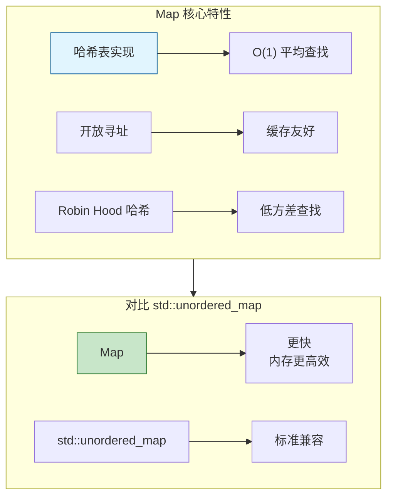

# Map<K,V> / Set<T> - 哈希表和集合

> 高效的键值对存储和唯一元素集合

---

## 📖 源码注释翻译与解释

### Map 文件头注释 (BLI_map.hh:7~53)

> **原文注释：**
> ```cpp
> /** \file
>  * \ingroup bli
>  *
>  * A `Map<Key, Value>` is an unordered associative container that stores key-value pairs.
>  * The keys have to be unique. It is designed to be a more convenient and efficient replacement for
>  * `std::unordered_map`. All core operations (add, lookup, remove and contains) can be done in O(1)
>  * amortized expected time.
>  *
>  * Your default choice for a hash map in Blender should be `Map`.
>  *
>  * Map is implemented using open addressing in a slot array with a power-of-two size.
>  * Every slot is in one of three states: empty, occupied or removed. If a slot is occupied, it
>  * contains a Key and Value instance.
>  *
>  * Benchmarking and comparing hash tables is hard, because many factors influence the result. The
>  * performance of a hash table depends on the combination of the hash function, probing strategy,
>  * max load factor, data types, slot type and data distribution. This implementation is designed to
>  * be relatively fast by default in all cases. However, it also offers many customization points
>  * that allow it to be optimized for a specific use case.
>  *
>  * A rudimentary benchmark can be found in BLI_map_test.cc. The results of that benchmark are there
>  * as well. The numbers show that in this specific case Map outperforms std::unordered_map
>  * consistently by a good amount.
>  *
>  * Some noteworthy information:
>  * - Key and Value must be movable types.
>  * - Pointers to keys and values might be invalidated when the map is changed or moved.
>  * - The hash function can be customized. See BLI_hash.hh for details.
>  * - The probing strategy can be customized. See BLI_probing_strategies.hh for details.
>  * - The slot type can be customized. See BLI_map_slots.hh for details.
>  * - Small buffer optimization is enabled by default, if Key and Value are not too large.
>  * - The methods `add_new` and `remove_contained` should be used instead of `add` and `remove`
>  *   whenever appropriate. Assumptions and intention are described better this way.
>  * - There are multiple methods to add and lookup keys for different use cases.
>  * - You cannot use a range-for loop on the map directly. Instead use the keys(), values() and
>  *   items() iterators. If your map is non-const, you can also change the values through those
>  *   iterators (but not the keys).
>  * - Lookups can be performed using types other than Key without conversion. For that use the
>  *   methods ending with `_as`. The template parameters Hash and IsEqual have to support the other
>  *   key type. This can greatly improve performance when the map uses strings as keys.
>  * - The default constructor is cheap, even when a large InlineBufferCapacity is used. A large
>  *   slot array will only be initialized when the first element is added.
>  * - The `print_stats` method can be used to get information about the distribution of keys and
>  *   memory usage of the map.
>  * - The method names don't follow the std::unordered_map names in many cases. Searching for such
>  *   names in this file will usually let you discover the new name.
>  */
> ```

**中文翻译与详细解释：**

| 段落 | 翻译 | 关键要点 |
|------|------|----------|
| **核心定义** | `Map<Key, Value>` 是一个无序关联容器，存储键值对。键必须是唯一的。 | 键唯一，无序存储 |
| **设计目标** | 它被设计为 `std::unordered_map` 的更方便、更高效的替代品。 | 比标准库更快 |
| **复杂度** | 所有核心操作（添加、查找、删除、包含）都可以在 O(1) 均摊期望时间内完成。 | O(1) 平均性能 |
| **默认选择** | 在 Blender 中，哈希表的默认选择应该是 `Map`。 | 推荐作为默认 |
| **实现方式** | Map 使用开放寻址法，在大小为 2 的幂的槽数组中实现。 | 开放寻址，2的幂大小 |
| **槽状态** | 每个槽处于三种状态之一：空、已占用或已删除。 | 三种槽状态 |
| **性能因素** | 哈希表的性能取决于哈希函数、探测策略、最大负载因子、数据类型、槽类型和数据分布的组合。 | 多因素影响性能 |
| **基准测试** | 简单的基准测试可以在 BLI_map_test.cc 中找到。结果显示 Map 始终比 std::unordered_map 快很多。 | 实际性能优势 |

**重要注意事项：**

| 要点 | 说明 |
|------|------|
| 可移动类型 | Key 和 Value 必须是可移动类型 |
| 指针失效 | 当 map 被修改或移动时，指向键和值的指针可能失效 |
| 自定义哈希 | 哈希函数可以自定义（见 BLI_hash.hh） |
| 自定义探测 | 探测策略可以自定义（见 BLI_probing_strategies.hh） |
| 小缓冲区优化 | 默认启用，如果 Key 和 Value 不是太大 |
| 推荐方法 | 适当使用 `add_new` 和 `remove_contained` 代替 `add` 和 `remove` |
| 迭代方式 | 不能直接在 map 上使用范围 for，使用 keys()、values()、items() |
| 异构查找 | 可以使用 `_as` 后缀方法用其他类型查找，无需转换 |
| 延迟初始化 | 默认构造便宜，大槽数组只在添加第一个元素时初始化 |
| 统计信息 | `print_stats` 方法可获取键分布和内存使用信息 |

### MapItem 结构注释 (BLI_map.hh:65~71)

> **原文：**
> ```cpp
> /**
>  * A key-value-pair stored in a #Map. This is used when looping over Map.items().
>  */
> template<typename Key, typename Value> struct MapItem {
>   const Key &key;
>   const Value &value;
> };
> ```

**翻译：** 存储在 #Map 中的键值对。这在遍历 Map.items() 时使用。

### MutableMapItem 结构注释 (BLI_map.hh:73~79)

> **原文：**
> ```cpp
> /**
>  * Same as #MapItem, but the value is mutable. The key is still const because changing it might
>  * change its hash value which would lead to undefined behavior in the #Map.
>  */
> template<typename Key, typename Value> struct MutableMapItem {
>   const Key &key;
>   Value &value;
> };
> ```

**翻译：** 与 #MapItem 相同，但值是可变的。键仍然是 const，因为修改它可能会改变其哈希值，这会在 #Map 中导致未定义行为。

**重要：** 键不能修改，因为哈希表依赖键的哈希值定位。修改键会破坏哈希表结构。

---

## 🎯 Map<K,V> - 哈希表

### 核心特性



### 构造

```cpp
#include "BLI_map.hh"

namespace blender::nodes {

void map_construct_examples() {
    // 1. 默认构造
    Map<std::string, int> map1;
    
    // 2. 初始化列表
    Map<std::string, int> map2 = {{"a", 1}, {"b", 2}, {"c", 3}};
    
    // 3. 从 Vector 构造
    Vector<std::pair<std::string, int>> items = {{"x", 10}, {"y", 20}};
    Map<std::string, int> map3(items);
    
    // 4. 预留空间
    Map<int, float> map4;
    map4.reserve(1000);  // 预分配空间
}

} // namespace blender::nodes
```

### 添加元素

```cpp
void map_add_examples() {
    Map<std::string, int> map;
    
    // 1. add - 添加新键值对（键必须不存在）
    map.add("key1", 100);
    // map.add("key1", 200);  // 错误：键已存在
    
    // 2. add_overwrite - 添加或覆盖
    map.add_overwrite("key1", 200);  // OK
    
    // 3. add_default - 添加默认值（如果键不存在）
    int &val = map.add_default("key2");  // val = 0
    
    // 4. add_multiple - 批量添加
    Vector<std::string> keys = {"a", "b", "c"};
    Vector<int> values = {1, 2, 3};
    map.add_multiple(keys, values);
    
    // 5. 初始化列表批量添加
    map.add_multiple({{"d", 4}, {"e", 5}});
}
```

### 查找元素

```cpp
void map_lookup_examples() {
    Map<std::string, int> map = {{"a", 1}, {"b", 2}, {"c", 3}};
    
    // 1. lookup - 查找（返回指针，可能为 null）
    const int *val = map.lookup("a");
    if (val != nullptr) {
        // 使用 *val
    }
    
    // 2. lookup_opt - 查找（返回 optional）
    std::optional<int> opt = map.lookup_opt("a");
    if (opt.has_value()) {
        // 使用 *opt
    }
    
    // 3. lookup_or_default - 查找或返回默认值
    int val1 = map.lookup_or_default("a", 0);    // 返回 1
    int val2 = map.lookup_or_default("z", 0);    // 返回 0
    
    // 4. lookup_key - 查找键（返回键的引用）
    const std::string &key = map.lookup_key("a");
    
    // 5. contains - 检查是否存在
    bool has_a = map.contains("a");  // true
    bool has_z = map.contains("z");  // false
}
```

### 修改元素

```cpp
void map_modify_examples() {
    Map<std::string, int> map = {{"a", 1}, {"b", 2}};
    
    // 1. lookup_or_add - 查找或添加
    int &val = map.lookup_or_add("c", 100);  // 添加 c=100
    int &val2 = map.lookup_or_add("a", 200); // 返回 a=1 的引用
    
    // 2. remove - 删除
    map.remove("a");
    map.remove_as("b");  // 返回被删除的值
    
    // 3. remove_if - 条件删除
    map.remove_if([](const std::string &key, const int &value) {
        return value < 10;
    });
    
    // 4. clear - 清空
    map.clear();
}
```

### 遍历

```cpp
void map_iteration_examples() {
    Map<std::string, int> map = {{"a", 1}, {"b", 2}, {"c", 3}};
    
    // 1. 遍历键值对
    for (const auto &[key, value] : map.items()) {
        // key: "a", "b", "c"
        // value: 1, 2, 3
    }
    
    // 2. 只遍历键
    for (const std::string &key : map.keys()) {
        // key: "a", "b", "c"
    }
    
    // 3. 只遍历值
    for (const int &value : map.values()) {
        // value: 1, 2, 3
    }
    
    // 4. 遍历并修改值
    for (auto &[key, value] : map.items()) {
        value *= 2;
    }
}
```

---

## 🎯 Set<T> - 唯一元素集合

### 构造

```cpp
#include "BLI_set.hh"

void set_construct_examples() {
    // 1. 默认构造
    Set<int> set1;
    
    // 2. 初始化列表
    Set<int> set2 = {1, 2, 3, 4, 5};
    
    // 3. 从 Vector 构造
    Vector<int> items = {1, 2, 3};
    Set<int> set3(items);
    
    // 4. 预留空间
    Set<std::string> set4;
    set4.reserve(100);
}
```

### 添加和删除

```cpp
void set_modify_examples() {
    Set<int> set;
    
    // 1. add - 添加元素
    set.add(1);
    set.add(2);
    set.add(2);  // 重复，不会添加
    
    // 2. add_multiple - 批量添加
    set.add_multiple({3, 4, 5});
    
    // 3. remove - 删除
    set.remove(1);
    
    // 4. remove_if - 条件删除
    set.remove_if([](int value) {
        return value < 10;
    });
    
    // 5. clear - 清空
    set.clear();
}
```

### 查找

```cpp
void set_lookup_examples() {
    Set<int> set = {1, 2, 3, 4, 5};
    
    // 1. contains - 检查是否存在
    bool has_3 = set.contains(3);  // true
    bool has_10 = set.contains(10);  // false
    
    // 2. 交集/并集/差集
    Set<int> other = {4, 5, 6, 7, 8};
    
    Set<int> intersection = set::intersect(set, other);  // {4, 5}
    Set<int> union_set = set::union_set(set, other);     // {1, 2, 3, 4, 5, 6, 7, 8}
    Set<int> difference = set::difference(set, other);   // {1, 2, 3}
}
```

### 遍历

```cpp
void set_iteration_examples() {
    Set<int> set = {1, 2, 3, 4, 5};
    
    // 遍历
    for (const int &value : set) {
        // value: 1, 2, 3, 4, 5
    }
}
```

---

## 🎯 节点开发中的典型用法

### 模式 1：属性名去重

```cpp
static void collect_unique_attributes(const GeometrySet &geometry,
                                      Set<std::string> &r_names)
{
    if (const Mesh *mesh = geometry.get_mesh()) {
        const bke::AttributeAccessor attributes = *mesh->attributes();
        attributes.foreach_attribute([&](const bke::AttributeIter &iter) {
            r_names.add(iter.name);
        });
    }
    // 处理其他几何类型...
}
```

### 模式 2：缓存查找

```cpp
class NodeCache {
    Map<std::string, GeometrySet> cache_;
    
public:
    GeometrySet &lookup_or_compute(const std::string &key,
                                   FunctionRef<GeometrySet()> compute_fn)
    {
        if (!cache_.contains(key)) {
            cache_.add(key, compute_fn());
        }
        return cache_.lookup(key);
    }
};
```

### 模式 3：统计计数

```cpp
static Map<std::string, int> count_materials(const Mesh &mesh)
{
    Map<std::string, int> counts;
    
    Span<int> material_indices = mesh.material_indices();
    for (int mat_index : material_indices) {
        Material *mat = mesh.materials[mat_index];
        std::string name = mat->id.name + 2;  // 跳过 "MA"
        
        int &count = counts.lookup_or_add(name, 0);
        count++;
    }
    
    return counts;
}
```

---

## ✅ 检查清单

- [ ] 理解 Map 的 O(1) 查找复杂度
- [ ] 掌握 add / add_overwrite / lookup_or_add 的区别
- [ ] 会用结构化绑定遍历 items()
- [ ] 了解 Set 的去重特性
- [ ] 掌握交集/并集/差集操作

---

## 📁 相关文件

| 文件 | 路径 |
|-----|------|
| BLI_map.hh | `source/blender/blenlib/BLI_map.hh` |
| BLI_set.hh | `source/blender/blenlib/BLI_set.hh` |

---

## 🔗 相关文档

- [01_Vector.md](01_Vector.md) - 动态数组
- [02_Span.md](02_Span.md) - 非拥有视图
