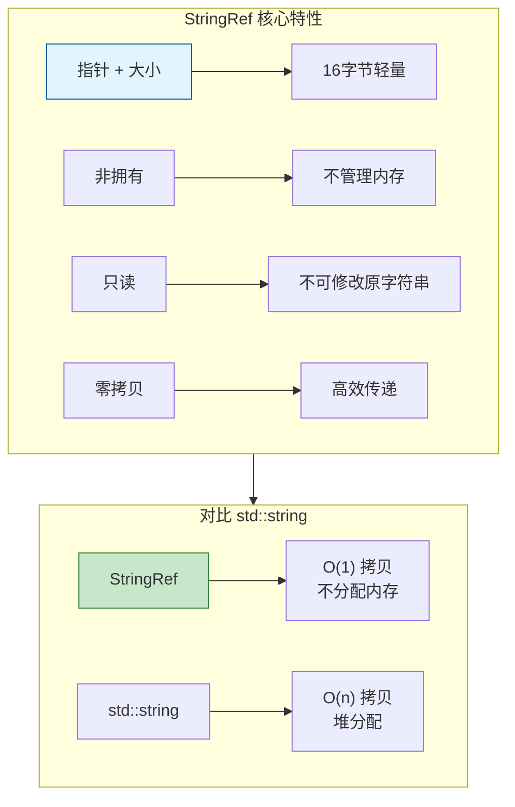

# StringRef - 字符串视图

> 轻量级字符串引用，零拷贝字符串处理

---

## 📖 源码注释翻译与解释

### StringRef 文件头注释 (BLI_string_ref.hh:7~32)

> **原文注释：**
> ```cpp
> /** \file
>  * \ingroup bli
>  *
>  * A `StringRef` references a const char array owned by someone else. It is just a pointer
>  * and a size. Since the memory is not owned, StringRef should not be used to transfer ownership of
>  * the string. The data referenced by a StringRef cannot be mutated through it.
>  *
>  * A StringRef is NOT null-terminated. This makes it much more powerful within C++, because we can
>  * also cut off parts of the end without creating a copy. When interfacing with C code that expects
>  * null-terminated strings, `StringRefNull` can be used. It is essentially the same as
>  * StringRef, but with the restriction that the string has to be null-terminated.
>  *
>  * Whenever possible, string parameters should be of type StringRef and the string return type
>  * should be StringRefNull. Don't forget that the StringRefNull does not own the string, so don't
>  * return it when the string exists only in the scope of the function. This convention makes
>  * functions usable in the most contexts.
>  *
>  * StringRef vs. std::string_view:
>  *   Both types are certainly very similar. The main benefit of using StringRef in Blender is that
>  *   this allows us to add convenience methods at any time. Especially, when doing a lot of string
>  *   manipulation, this helps to keep the code clean. Furthermore, we need StringRefNull anyway,
>  *   because there is a lot of C code that expects null-terminated strings. Conversion between
>  *   StringRef and string_view is very cheap and可以在 API 边界以基本零成本完成。Another benefit of using StringRef is that it uses signed integers, thus developers
>  *   have to deal less with issues resulting from unsigned integers.
>  */
> ```

**中文翻译与详细解释：**

| 段落 | 翻译 | 关键要点 |
|------|------|----------|
| **核心定义** | `StringRef` 引用一个由其他对象拥有的 const char 数组。它只是一个指针和一个大小。 | 指针+大小，非拥有 |
| **所有权** | 由于不拥有内存，StringRef 不应用于转移字符串的所有权。 | 不转移所有权 |
| **不可变性** | StringRef 引用的数据不能通过它修改。 | 只读视图 |
| **非空终止** | StringRef **不是**空终止的。这使得它在 C++ 中更强大，因为可以切断末尾部分而无需创建副本。 | 关键区别！ |
| **C 代码交互** | 当与期望空终止字符串的 C 代码交互时，可以使用 `StringRefNull`。 | StringRefNull 用于 C API |
| **参数约定** | 尽可能使用 StringRef 作为字符串参数，StringRefNull 作为返回类型。 | 函数签名最佳实践 |
| **生命周期警告** | 别忘了 StringRefNull 不拥有字符串，所以当字符串只在函数作用域内存在时不要返回它。 | 悬垂引用风险 |
| **与 string_view 对比** | 两者非常相似。在 Blender 中使用 StringRef 的主要好处是可以随时添加便利方法。 | 可扩展性 |
| **有符号整数** | 使用 StringRef 的另一个好处是它使用有符号整数，开发者因此更少处理无符号整数导致的问题。 | `int64_t` vs `size_t` |

**StringRef vs StringRefNull：**

| 特性 | StringRef | StringRefNull |
|------|-----------|---------------|
| 空终止 | ❌ 否 | ✅ 是 |
| 用途 | C++ 内部处理 | C API 交互 |
| 切片效率 | 高（无需复制） | 低（需保持空终止） |
| 安全性 | 需注意长度 | 可直接传给 C 函数 |

### StringRefBase 类注释 (BLI_string_ref.hh:45~48)

> **原文：**
> ```cpp
> /**
>  * A common base class for StringRef and StringRefNull. This should never be used in other files.
>  * It only exists to avoid some code duplication.
>  */
> class StringRefBase {
> ```

**翻译：** StringRef 和 StringRefNull 的公共基类。不应该在其他文件中使用。它只存在以避免一些代码重复。

### not_found 常量注释 (BLI_string_ref.hh:57~58)

> **原文：**
> ```cpp
> /** Similar to #string_view::npos, but signed. */
> static constexpr int64_t not_found = -1;
> ```

**翻译：** 类似于 `string_view::npos`，但是有符号的。

**说明：**
- `std::string_view::npos` 是 `size_t` 类型（无符号），值为 `size_t(-1)`
- `StringRef::not_found` 是 `int64_t` 类型（有符号），值为 `-1`
- 有符号整数更容易处理，避免无符号溢出问题

### copy_utf8_truncated 方法注释 (BLI_string_ref.hh:73~78)

> **原文：**
> ```cpp
> /**
>  * Copy the string into a char array. The copied string will be null-terminated. If it does not
>  * fit, it will be truncated while keeping it valid UTF8 (assuming the #StringRef itself is
>  * valid UTF8).
>  */
> void copy_utf8_truncated(char *dst, int64_t dst_size) const;
> ```

**翻译：** 将字符串复制到 char 数组中。复制的字符串将是空终止的。如果放不下，它会被截断同时保持有效的 UTF8（假设 #StringRef 本身是有效的 UTF8）。

**重要特性：**
- 确保目标缓冲区总是以 null 结尾
- 截断时保持 UTF8 有效性（不会在多字节字符中间截断）

---

## 🎯 核心概念



---

## 🚀 常用操作

### 构造

```cpp
#include "BLI_string_ref.hh"

namespace blender::nodes {

void stringref_construct_examples() {
    // 1. 默认构造 - 空字符串
    StringRef ref1;  // ""
    
    // 2. 从 C 字符串
    StringRef ref2 = "hello world";
    
    // 3. 从 std::string
    std::string str = "hello";
    StringRef ref3 = str;
    
    // 4. 从指针和大小
    const char *data = "hello world";
    StringRef ref4(data, 5);  // "hello"
    
    // 5. 从单个字符
    StringRef ref5('a');  // "a"
    
    // 6. 空字符串常量
    StringRef empty = StringRef::Empty;
}

} // namespace blender::nodes
```

### 访问

```cpp
void stringref_access_examples() {
    StringRef ref = "hello world";
    
    // 1. 大小
    int64_t size = ref.size();  // 11
    bool empty = ref.is_empty();  // false
    
    // 2. 索引访问
    char c = ref[0];  // 'h'
    
    // 3. 首尾字符
    char first = ref.first();  // 'h'
    char last = ref.last();    // 'd'
    
    // 4. 原始指针
    const char *data = ref.data();
}
```

### 查找

```cpp
void stringref_find_examples() {
    StringRef ref = "hello world";
    
    // 1. find - 查找子串
    std::optional<int64_t> pos1 = ref.find("world");  // 6
    std::optional<int64_t> pos2 = ref.find("xyz");    // nullopt
    
    // 2. find_first - 查找字符
    std::optional<int64_t> pos3 = ref.find_first('o');  // 4
    
    // 3. find_last - 反向查找
    std::optional<int64_t> pos4 = ref.find_last('o');  // 7
    
    // 4. contains - 包含检查
    bool has_world = ref.contains("world");  // true
    bool has_xyz = ref.contains("xyz");      // false
    
    // 5. startswith / endswith
    bool starts = ref.startswith("hello");  // true
    bool ends = ref.endswith("world");      // true
}
```

### 切片

```cpp
void stringref_slice_examples() {
    StringRef ref = "hello world";
    
    // 1. substr - 子串
    StringRef sub1 = ref.substr(0, 5);   // "hello"
    StringRef sub2 = ref.substr(6, 5);   // "world"
    
    // 2. drop_front - 去掉前 n 个
    StringRef sub3 = ref.drop_front(6);  // "world"
    
    // 3. drop_back - 去掉后 n 个
    StringRef sub4 = ref.drop_back(6);   // "hello"
    
    // 4. take_front - 取前 n 个
    StringRef sub5 = ref.take_front(5);  // "hello"
    
    // 5. take_back - 取后 n 个
    StringRef sub6 = ref.take_back(5);   // "world"
}
```

### 分割

```cpp
void stringref_split_examples() {
    // 1. 按字符分割
    StringRef ref1 = "a,b,c,d,e";
    Vector<StringRef> parts1 = ref1.split(',');
    // parts1: ["a", "b", "c", "d", "e"]
    
    // 2. 按字符串分割
    StringRef ref2 = "hello::world::test";
    Vector<StringRef> parts2 = ref2.split("::");
    // parts2: ["hello", "world", "test"]
    
    // 3. 限制分割次数
    Vector<StringRef> parts3 = ref1.split(',', 2);
    // parts3: ["a", "b", "c,d,e"]
}
```

### 修剪

```cpp
void stringref_trim_examples() {
    // 1. 修剪空白
    StringRef ref1 = "  hello world  ";
    StringRef trimmed1 = ref1.trim();  // "hello world"
    
    // 2. 修剪左边
    StringRef trimmed2 = ref1.trim_start();  // "hello world  "
    
    // 3. 修剪右边
    StringRef trimmed3 = ref1.trim_end();    // "  hello world"
    
    // 4. 修剪指定字符
    StringRef ref2 = "...hello...";
    StringRef trimmed4 = ref2.trim('.');  // "hello"
}
```

---

## 🎯 节点开发中的典型用法

### 模式 1：属性名处理

```cpp
static void process_attribute_name(StringRef name)
{
    // 检查是否是内置属性
    if (name.startswith(".")) {
        // 内置属性
    }
    
    // 分割命名空间
    if (std::optional<int64_t> pos = name.find_first('.')) {
        StringRef namespace_name = name.substr(0, *pos);
        StringRef attr_name = name.drop_front(*pos + 1);
        // 处理...
    }
}
```

### 模式 2：文件路径处理

```cpp
static StringRef get_file_extension(StringRef path)
{
    if (std::optional<int64_t> pos = path.find_last('.')) {
        return path.drop_front(*pos + 1);
    }
    return StringRef::Empty;
}

static StringRef get_file_name(StringRef path)
{
    // 统一分隔符
    std::string normalized = path;
    std::replace(normalized.begin(), normalized.end(), '\\', '/');
    
    StringRef ref = normalized;
    if (std::optional<int64_t> pos = ref.find_last('/')) {
        return ref.drop_front(*pos + 1);
    }
    return ref;
}
```

### 模式 3：枚举字符串解析

```cpp
static std::optional<int> parse_enum_value(StringRef value,
                                           Span<StringRef> enum_items)
{
    for (int i : enum_items.index_range()) {
        if (enum_items[i] == value) {
            return i;
        }
    }
    return std::nullopt;
}
```

---

## ✅ 检查清单

- [ ] 理解 StringRef 是非拥有视图
- [ ] 掌握 substr / drop / take 操作
- [ ] 会用 split 分割字符串
- [ ] 了解 trim 用法
- [ ] 注意生命周期安全

---

## 📁 相关文件

| 文件 | 路径 |
|-----|------|
| BLI_string_ref.hh | `source/blender/blenlib/BLI_string_ref.hh` |

---

## 🔗 相关文档

- [01_Vector.md](01_Vector.md) - 动态数组
- [02_Span.md](02_Span.md) - 非拥有视图
