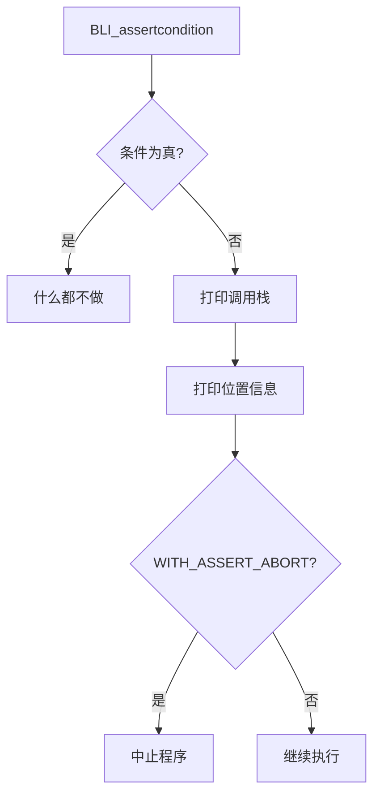

# BLI_assert - 断言系统

> Blender 的断言系统，用于调试时检查假设条件，帮助捕获程序错误

---

## 📖 源码注释翻译与解释

### 文件头注释 (BLI_assert.h:7~14)

> **原文注释：**
> ```cpp
> /** \file
>  * \ingroup bli
>  *
>  * Defines:
>  * - #BLI_assert
>  * - #BLI_STATIC_ASSERT
>  * - #BLI_STATIC_ASSERT_ALIGN
>  */
> ```

**翻译：** 定义了 BLI_assert、BLI_STATIC_ASSERT、BLI_STATIC_ASSERT_ALIGN

---

## 🎯 BLI_assert 详解

### 源码实现 (BLI_assert.h:46~51)

> **原文：**
> ```cpp
> /* BLI_assert */
> #  define BLI_assert(a) \
>     (void)((!(a)) ? ((_BLI_assert_print_backtrace(), \
>                       _BLI_ASSERT_PRINT_POS(a), \
>                       _BLI_ASSERT_ABORT(), \
>                       NULL)) : \
>                     NULL)
> ```

**逐行解析：**

```cpp
(void)(              // 1. 将整个表达式转换为 void，避免未使用返回值警告
    (!(a))          // 2. 检查条件 a 是否为假
    ? (             // 3. 如果为假（断言失败）
        _BLI_assert_print_backtrace(),  // 3.1 打印调用栈
        _BLI_ASSERT_PRINT_POS(a),       // 3.2 打印位置信息（文件、行号、函数）
        _BLI_ASSERT_ABORT(),            // 3.3 中止程序（仅在 WITH_ASSERT_ABORT 时）
        NULL                            // 3.4 返回 NULL（占位）
    )
    : NULL          // 4. 如果为真（断言通过），什么都不做
)
```

**执行流程：**



---

## 🔧 三种断言类型

### 1. BLI_assert - 运行时断言

**用途：** 检查运行时条件

```cpp
void process_array(Span<int> arr) {
    // 检查前置条件
    BLI_assert(!arr.is_empty());  // 数组不能为空
    
    // 检查索引有效性
    int64_t index = compute_index();
    BLI_assert(index >= 0 && index < arr.size());
    
    // 使用 arr[index]
}
```

**特点：**
- 仅在 **Debug 模式**（NDEBUG 未定义）时有效
- Release 模式下被替换为 `(void)0`，零开销

```cpp
// Debug 模式
#define BLI_assert(a) \
    (void)((!(a)) ? (/* 打印信息并中止 */) : NULL)

// Release 模式（NDEBUG 定义）
#define BLI_assert(a) ((void)0)  // 什么都不做
```

---

### 2. BLI_STATIC_ASSERT - 编译时断言

**源码实现 (BLI_assert.h:67~84)**

> **原文：**
> ```cpp
> #if defined(__cplusplus)
> /* C++11 */
> #  define BLI_STATIC_ASSERT(a, msg) static_assert(a, msg);
> #elif defined(_MSC_VER)
> /* Visual Studio */
> #  define BLI_STATIC_ASSERT(a, msg) static_assert(a, msg);
> #elif defined(__COVERITY__)
> /* Workaround error with COVERITY. */
> #  define BLI_STATIC_ASSERT(a, msg)
> #elif defined(__STDC_VERSION__) && (__STDC_VERSION__ >= 201112L)
> /* C11 */
> #  define BLI_STATIC_ASSERT(a, msg) _Static_assert(a, msg);
> #else
> /* Old unsupported compiler */
> #  define BLI_STATIC_ASSERT(a, msg)
> #endif
> ```

**用途：** 编译时检查条件，失败时编译错误

```cpp
// 检查类型大小
BLI_STATIC_ASSERT(sizeof(int) == 4, "int must be 4 bytes");

// 检查结构体大小
struct MyStruct {
    int a;
    float b;
};
BLI_STATIC_ASSERT(sizeof(MyStruct) == 8, "MyStruct size mismatch");

// 检查数组大小
template<int N>
void process() {
    BLI_STATIC_ASSERT(N > 0, "N must be positive");
}
```

**与 BLI_assert 的区别：**

| 特性 | BLI_assert | BLI_STATIC_ASSERT |
|------|-----------|-------------------|
| 检查时机 | 运行时 | 编译时 |
| 失败结果 | 打印信息，可能中止 | 编译错误 |
| Release 模式 | 消失 | 仍然有效 |
| 用途 | 运行时条件检查 | 编译时类型/大小检查 |

---

### 3. BLI_STATIC_ASSERT_ALIGN - 对齐断言

**源码实现 (BLI_assert.h:86~87)**

> **原文：**
> ```cpp
> #define BLI_STATIC_ASSERT_ALIGN(st, align) \
>   BLI_STATIC_ASSERT((sizeof(st) % (align) == 0), "Structure must be strictly aligned")
> ```

**用途：** 检查结构体大小是否按指定字节对齐

```cpp
// 确保结构体按 16 字节对齐（SIMD 要求）
struct SIMDVector {
    float data[4];
};
BLI_STATIC_ASSERT_ALIGN(SIMDVector, 16);  // sizeof(SIMDVector) 必须是 16 的倍数

// 用于内存池分配
struct Node {
    void *next;
    int data;
};
BLI_STATIC_ASSERT_ALIGN(Node, 8);  // 确保 8 字节对齐
```

---

## 🚨 BLI_assert_unreachable

**源码实现 (BLI_assert.h:93~98)**

> **原文：**
> ```cpp
> /**
>  * Indicates that this line of code should never be executed. If it is reached, it will abort in
>  * debug builds and print an error in release builds.
>  */
> #define BLI_assert_unreachable() \
>   { \
>     _BLI_assert_unreachable_print(__FILE__, __LINE__, __func__); \
>     BLI_assert_msg(0, "This line of code is marked to be unreachable."); \
>   } \
>   ((void)0)
> ```

**用途：** 标记不应该执行到的代码路径

```cpp
enum class Color { Red, Green, Blue };

void process_color(Color c) {
    switch (c) {
        case Color::Red:
            // 处理红色
            break;
        case Color::Green:
            // 处理绿色
            break;
        case Color::Blue:
            // 处理蓝色
            break;
    }
    
    // 如果添加了新颜色但忘记处理，会在这里捕获
    BLI_assert_unreachable();  // 不应该执行到这里！
}
```

**vs 普通 assert：**

```cpp
// 普通 assert：检查条件
BLI_ASSERT(x > 0);

// unreachable：标记不可达代码
BLI_assert_unreachable();  // 类似于 assert(false)
```

---

## 📝 BLI_assert_msg - 带消息的断言

**源码实现 (BLI_assert.h:53~59)**

> **原文：**
> ```cpp
> /** A version of #BLI_assert() to pass an additional message to be printed on failure. */
> #  define BLI_assert_msg(a, msg) \
>     (void)((!(a)) ? ((_BLI_assert_print_backtrace(), \
>                       _BLI_ASSERT_PRINT_POS(a), \
>                       _BLI_assert_print_extra(msg), \
>                       _BLI_ASSERT_ABORT(), \
>                       NULL)) : \
>                     NULL)
> ```

**用途：** 断言失败时打印额外信息

```cpp
void divide(int a, int b) {
    BLI_assert_msg(b != 0, "Division by zero!");
    return a / b;
}

void access_array(Span<int> arr, int index) {
    BLI_assert_msg(index >= 0 && index < arr.size(), 
                   "Array index out of bounds!");
    return arr[index];
}
```

---

## 🔍 内部实现细节

### 打印位置信息 (BLI_assert.h:32~38)

```cpp
#if defined(__GNUC__)
#  define _BLI_ASSERT_PRINT_POS(a) _BLI_assert_print_pos(__FILE__, __LINE__, __func__, #a)
#elif defined(_MSC_VER)
#  define _BLI_ASSERT_PRINT_POS(a) _BLI_assert_print_pos(__FILE__, __LINE__, __func__, #a)
#else
#  define _BLI_ASSERT_PRINT_POS(a) _BLI_assert_print_pos(__FILE__, __LINE__, "<?>", #a)
#endif
```

**关键点：**
- `__FILE__`：当前文件名
- `__LINE__`：当前行号
- `__func__`：当前函数名（C99/C++11）
- `#a`：将表达式 a 转换为字符串（宏的 stringification）

### 中止行为控制 (BLI_assert.h:40~44)

```cpp
#ifdef WITH_ASSERT_ABORT
#  define _BLI_ASSERT_ABORT _BLI_assert_abort
#else
#  define _BLI_ASSERT_ABORT() (void)0
#endif
```

**编译选项：**
- 定义 `WITH_ASSERT_ABORT`：断言失败时中止程序
- 未定义：仅打印信息，继续执行

---

## 💡 最佳实践

### 1. 使用场景

```cpp
// ✅ 检查前置条件
void process(Span<float> data) {
    BLI_assert(!data.is_empty());
    // ...
}

// ✅ 检查不变量
for (int i = 0; i < n; i++) {
    BLI_assert(i >= 0 && i < capacity);
    // ...
}

// ✅ 检查后置条件
int result = compute();
BLI_assert(result >= 0);
return result;

// ✅ 标记不应该到达的代码
switch (type) {
    case A: return process_a();
    case B: return process_b();
}
BLI_assert_unreachable();
```

### 2. 避免滥用

```cpp
// ❌ 不要用 assert 检查用户输入
BLI_ASSERT(user_input > 0);  // 用户可能输入负数！

// ✅ 用错误处理
if (user_input <= 0) {
    return ERROR_INVALID_INPUT;
}

// ❌ 不要在 assert 中放副作用
BLI_ASSERT(++counter > 0);  // Release 模式下 ++counter 不会执行！

// ✅ 副作用放在外面
++counter;
BLI_ASSERT(counter > 0);
```

### 3. 编译时检查 vs 运行时检查

```cpp
// ✅ 编译时检查（类型、大小）
BLI_STATIC_ASSERT(sizeof(int) == 4, "int size check");

// ✅ 运行时检查（值、状态）
BLI_ASSERT(ptr != nullptr);
```

---

## 🎯 总结

| 宏 | 用途 | 模式 | 失败行为 |
|----|------|------|----------|
| `BLI_assert` | 运行时条件检查 | Debug 有效 | 打印信息，可能中止 |
| `BLI_assert_msg` | 带消息的运行时检查 | Debug 有效 | 打印信息+消息，可能中止 |
| `BLI_STATIC_ASSERT` | 编译时条件检查 | 始终有效 | 编译错误 |
| `BLI_STATIC_ASSERT_ALIGN` | 对齐检查 | 始终有效 | 编译错误 |
| `BLI_assert_unreachable` | 标记不可达代码 | Debug 中止，Release 打印 | 中止/打印 |

**核心原则：**
- 断言用于检查**程序员的假设**，不是用户错误
- Debug 模式尽可能严格，Release 模式零开销
- 编译时检查优先于运行时检查
