# BLI_hash - Blender 哈希系统

> Blender 的通用哈希函数库，为 Set、Map 等哈希表提供默认哈希实现

---

## 📖 文件头注释翻译与概述

> **原文注释 (BLI_hash.hh:7~62)：**
> ```cpp
> /** \file
>  * \ingroup bli
>  *
>  * A specialization of `DefaultHash<T>` provides a hash function for values of type T.
>  * This hash function is used by default in hash table implementations in blenlib.
>  *
>  * The actual hash function is in the `operator()` method of `DefaultHash<T>`. The following code
>  * computes the hash of some value using DefaultHash.
>  *
>  *   T value = ...;
>  *   DefaultHash<T> hash_function;
>  *   uint32_t hash = hash_function(value);
>  *
>  * Hash table implementations like Set support heterogeneous key lookups. That means that
>  * one can do a lookup with a key of type A in a hash table that stores keys of type B. This is
>  * commonly done when B is std::string, because the conversion from e.g. a #StringRef to
>  * std::string can be costly and is unnecessary. To make this work, values of type A and B that
>  * compare equal have to have the same hash value. This is achieved by defining potentially
>  * multiple `operator()` in a specialization of #DefaultHash. All those methods have to compute the
>  * same hash for values that compare equal.
>  *
>  * The computed hash is an unsigned 64 bit integer. Ideally, the hash function would generate
>  * uniformly random hash values for a set of keys. However, in many cases trivial hash functions
>  * are faster and produce a good enough distribution. In general it is better when more information
>  * is in the lower bits of the hash. By choosing a good probing strategy, the effects of a bad hash
>  * function are less noticeable though. In this context a good probing strategy is one that takes
>  * all bits of the hash into account eventually. One has to check on a case by case basis to see if
>  * a better but more expensive or trivial hash function works better.
>  *
>  * There are three main ways to provide a hash table implementation with a custom hash function.
>  *
>  * - When you want to provide a default hash function for your own custom type: Add a `hash()`
>  *   member function to it. The function should return `uint64_t` and take no arguments. This
>  *   method will be called by the default implementation of #DefaultHash. It will automatically be
>  *   used by hash table implementations.
>  *
>  * - When you want to provide a default hash function for a type that you cannot modify: Add a new
>  *   specialization to the #DefaultHash struct. This can be done by writing code like below in
>  *   either global or `blender` namespace.
>  *
>  *     template<> struct DefaultHash<TheType> {
>  *       uint64_t operator()(const TheType &value) const {
>  *         return ...;
>  *       }
>  *     };
>  *
>  * - When you want to provide a different hash function for a type that already has a default hash
>  *   function: Implement a struct like the one below and pass it as template parameter to the hash
>  *   table explicitly.
>  *
>  *     struct MyCustomHash {
>  *       uint64_t operator()(const TheType &value) const {
>  *         return ...;
>  *       }
>  *     };
>  */
> ```

**中文翻译：**

`DefaultHash<T>` 的特化为类型 T 提供哈希函数。这个哈希函数在 blenlib 的哈希表实现中作为默认使用。

实际的哈希函数在 `DefaultHash<T>` 的 `operator()` 方法中。以下代码使用 DefaultHash 计算某个值的哈希：

```cpp
T value = ...;
DefaultHash<T> hash_function;
uint32_t hash = hash_function(value);
```

像 Set 这样的哈希表实现支持**异构键查找**（heterogeneous key lookups）。这意味着可以用类型 A 的键在存储类型 B 的键的哈希表中查找。当 B 是 `std::string` 时这很常见，因为从 `StringRef` 转换到 `std::string` 可能很昂贵且不必要。为了实现这一点，比较相等的类型 A 和 B 的值必须有相同的哈希值。这是通过在 `DefaultHash` 的特化中定义多个 `operator()` 来实现的。所有这些方法必须为比较相等的值计算相同的哈希。

计算出的哈希是一个**无符号 64 位整数**。理想情况下，哈希函数应该为一组键生成均匀随机的哈希值。然而，在许多情况下，简单的哈希函数更快且产生足够好的分布。一般来说，哈希的低位包含更多信息会更好。但通过选择一个好的探测策略，坏哈希函数的影响就不那么明显了。在这个上下文中，好的探测策略是指最终考虑哈希所有位的策略。必须根据具体情况检查，看更好但更昂贵的哈希函数还是简单的哈希函数效果更好。

提供自定义哈希函数给哈希表实现有**三种主要方式**：

1. **为自己的自定义类型提供默认哈希函数**：添加一个 `hash()` 成员函数。函数应返回 `uint64_t` 且不带参数。这个方法会被 `DefaultHash` 的默认实现调用。它会被哈希表实现自动使用。

2. **为无法修改的类型提供默认哈希函数**：向 `DefaultHash` 结构添加新的特化。可以在全局或 `blender` 命名空间中编写如下代码。

3. **为已有默认哈希函数的类型提供不同的哈希函数**：实现一个结构并作为模板参数显式传递给哈希表。

---

## 🏗️ 架构概览

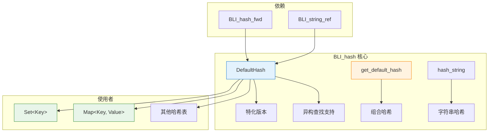

---

## 🎯 DefaultHash 基础模板

### 源码解析 (BLI_hash.hh:74~107)

```cpp
/**
 * If there is no other specialization of #DefaultHash for a given type, look for a hash function
 * on the type itself. Implementing a `hash()` method on a type is often significantly easier than
 * specializing #DefaultHash.
 *
 * To support heterogeneous lookup, a type can also implement a static `hash_as(const OtherType &)`
 * function.
 *
 * In the case of an enum type, the default hash is just to cast the enum value to an integer.
 */
template<typename T> struct DefaultHash {
  constexpr uint64_t operator()(const T &value) const
  {
    if constexpr (std::is_enum_v<T>) {
      /* For enums use the value as hash directly. */
      return uint64_t(value);
    }
    else {
      /* Try to call the `hash()` function on the value. */
      /* If this results in a compiler error, no hash function for the type has been found. */
      return value.hash();
    }
  }

  template<typename U> constexpr uint64_t operator()(const U &value) const
  {
    /* Try calling the static `T::hash_as(value)` function with the given value. The returned hash
     * should be "compatible" with `T::hash()`. Usually that means that if `value` is converted to
     * `T` its hash does not change. */
    /* If this results in a compiler error, no hash function for the heterogeneous lookup has been
     * found. */
    return T::hash_as(value);
  }
};
```

**逐段解析：**

| 部分 | 说明 |
|------|------|
| `constexpr` | 编译时计算，零运行时开销 |
| `std::is_enum_v<T>` | C++17 类型特征，检查 T 是否为枚举 |
| `value.hash()` | 调用类型的成员函数 |
| `T::hash_as(value)` | 静态方法，支持异构查找 |

**工作流程：**

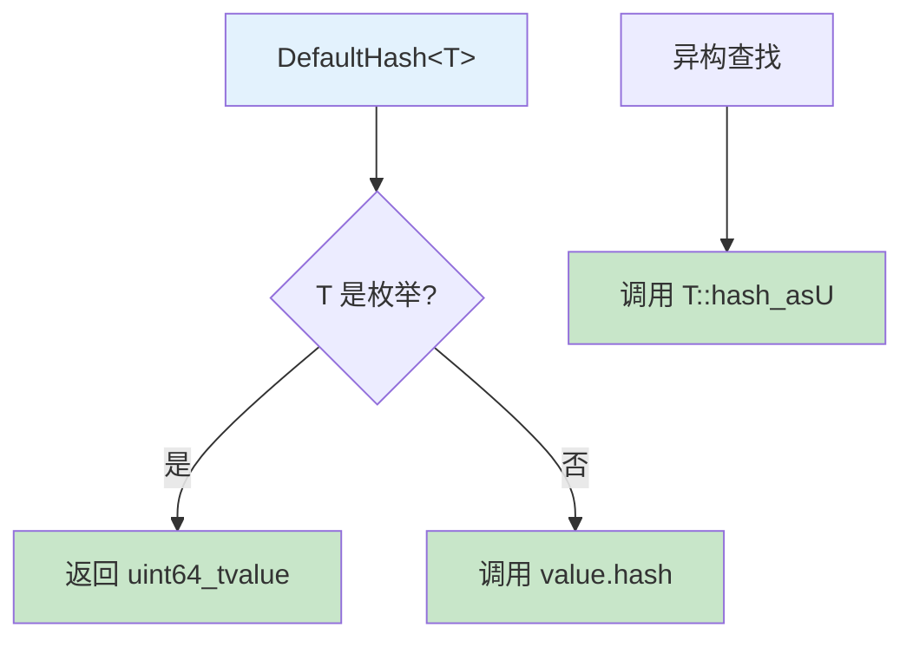

---

## 🔢 整数类型的简单哈希

### 宏定义 (BLI_hash.hh:119~125)

```cpp
#define TRIVIAL_DEFAULT_INT_HASH(TYPE) \
  template<> struct DefaultHash<TYPE> { \
    constexpr uint64_t operator()(TYPE value) const \
    { \
      return uint64_t(value); \
    } \
  }
```

**注释翻译 (BLI_hash.hh:127~131)：**

> We cannot make any assumptions about the distribution of keys, so use a trivial hash function by default. The default probing strategy is designed to take all bits of the hash into account to avoid worst case behavior when the lower bits are all zero. Special hash functions can be implemented when more knowledge about a specific key distribution is available.

**中文：** 我们不能对键的分布做任何假设，所以默认使用简单的哈希函数。默认探测策略设计为考虑哈希的所有位，以避免低位全为零时的最坏情况。当有更多关于特定键分布的知识时，可以实现特殊的哈希函数。

**应用：**

```cpp
TRIVIAL_DEFAULT_INT_HASH(int8_t);
TRIVIAL_DEFAULT_INT_HASH(uint8_t);
TRIVIAL_DEFAULT_INT_HASH(int16_t);
TRIVIAL_DEFAULT_INT_HASH(uint16_t);
TRIVIAL_DEFAULT_INT_HASH(int32_t);
TRIVIAL_DEFAULT_INT_HASH(uint32_t);
TRIVIAL_DEFAULT_INT_HASH(int64_t);
TRIVIAL_DEFAULT_INT_HASH(uint64_t);
```

**为什么简单哈希对整数有效：**

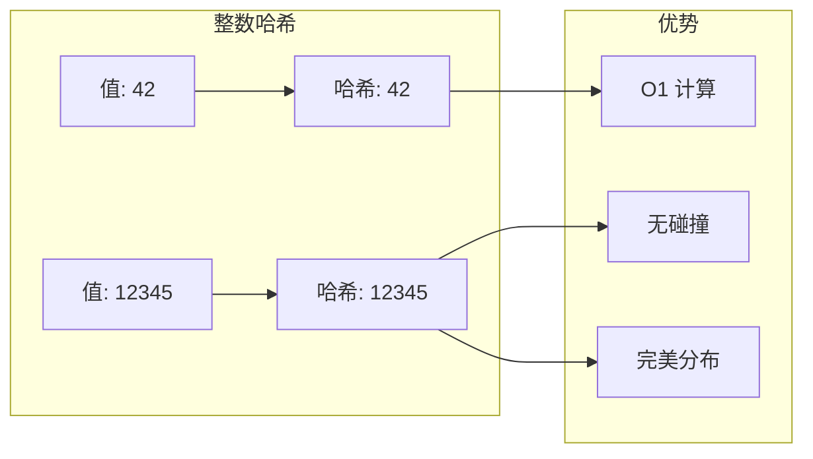

---

## 🌊 浮点数哈希

### 源码 (BLI_hash.hh:142~158)

```cpp
/**
 * One should try to avoid using floats as keys in hash tables, but sometimes it is convenient.
 */
template<> struct DefaultHash<float> {
  constexpr uint64_t operator()(float value) const
  {
    /* Explicit `uint64_t` cast to suppress CPPCHECK warning. */
    return uint64_t(std::bit_cast<uint32_t>(value));
  }
};

template<> struct DefaultHash<double> {
  constexpr uint64_t operator()(double value) const
  {
    return std::bit_cast<uint64_t>(value);
  }
};
```

**注释翻译：** 应该尽量避免在哈希表中使用浮点数作为键，但有时这很方便。

**关键：std::bit_cast**

```cpp
// C++20 std::bit_cast: 将 float 的位模式解释为 uint32_t
float f = 3.14f;
uint32_t bits = std::bit_cast<uint32_t>(f);  // 直接复制位，不转换值
```

**为什么不用 (uint32_t)f？**

```cpp
float f = 3.14f;

// ❌ 错误：值转换
uint32_t wrong = (uint32_t)f;  // 3 (截断小数)

// ✅ 正确：位复制
uint32_t correct = std::bit_cast<uint32_t>(f);  // 1078523331 (位模式)
```

**浮点数哈希的问题：**

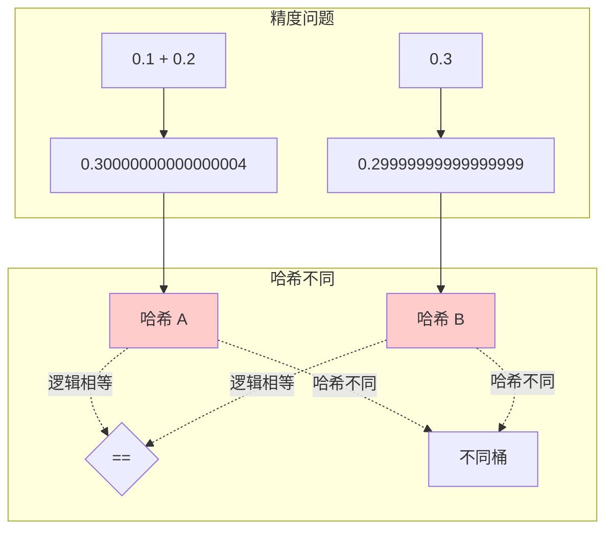

---

## 📝 字符串哈希

### 核心函数 (BLI_hash.hh:167~174)

```cpp
constexpr uint64_t hash_string(StringRef str)
{
  uint64_t hash = 5381;
  for (char c : str) {
    hash = hash * 33 + c;
  }
  return hash;
}
```

**算法解析：**

这是经典的 **DJB2 哈希算法**（由 Daniel J. Bernstein 发明）。

**为什么选择 5381 和 33？**

| 参数 | 值 | 原因 |
|------|-----|------|
| 初始值 | 5381 | 经验证的良好起始值 |
| 乘数 | 33 | 33 = 32 + 1 = 2^5 + 1，可用位移优化 |

**计算示例：**

```cpp
hash_string("abc"):
  hash = 5381
  hash = 5381 * 33 + 'a'(97) = 177670 + 97 = 177767
  hash = 177767 * 33 + 'b'(98) = 5866311 + 98 = 5866409
  hash = 5866409 * 33 + 'c'(99) = 193591497 + 99 = 193591596
```

**可视化：**

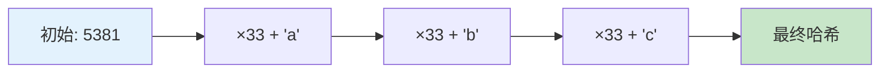

### 字符串类型特化 (BLI_hash.hh:176~206)

```cpp
template<> struct DefaultHash<std::string> {
  /**
   * Take a #StringRef as parameter to support heterogeneous lookups in hash table implementations
   * when std::string is used as key.
   */
  constexpr uint64_t operator()(StringRef value) const
  {
    return hash_string(value);
  }
};

template<> struct DefaultHash<StringRef> {
  constexpr uint64_t operator()(StringRef value) const
  {
    return hash_string(value);
  }
};

template<> struct DefaultHash<StringRefNull> {
  constexpr uint64_t operator()(StringRef value) const
  {
    return hash_string(value);
  }
};

template<> struct DefaultHash<std::string_view> {
  constexpr uint64_t operator()(StringRef value) const
  {
    return hash_string(value);
  }
};
```

**异构查找的关键：**

```cpp
Set<std::string> names;
names.add("blender");

// ✅ 可以用 StringRef 查找，无需构造 std::string
StringRef key = "blender";
bool found = names.contains_as(key);  // 使用 StringRef 查找

// 原理：std::string 和 StringRef 的哈希函数相同
// hash(std::string("blender")) == hash(StringRef("blender"))
```

---

## 🎯 指针哈希

### 源码 (BLI_hash.hh:208~218)

```cpp
/**
 * While we cannot guarantee that the lower 4 bits of a pointer are zero, it is often the case.
 */
template<typename T> struct DefaultHash<T *> {
  constexpr uint64_t operator()(const T *value) const
  {
    uintptr_t ptr = uintptr_t(value);
    uint64_t hash = uint64_t(ptr >> 4);
    return hash;
  }
};
```

**注释翻译：** 虽然我们不能保证指针的低 4 位为零，但通常是这样。

**右移 4 位的原因：**

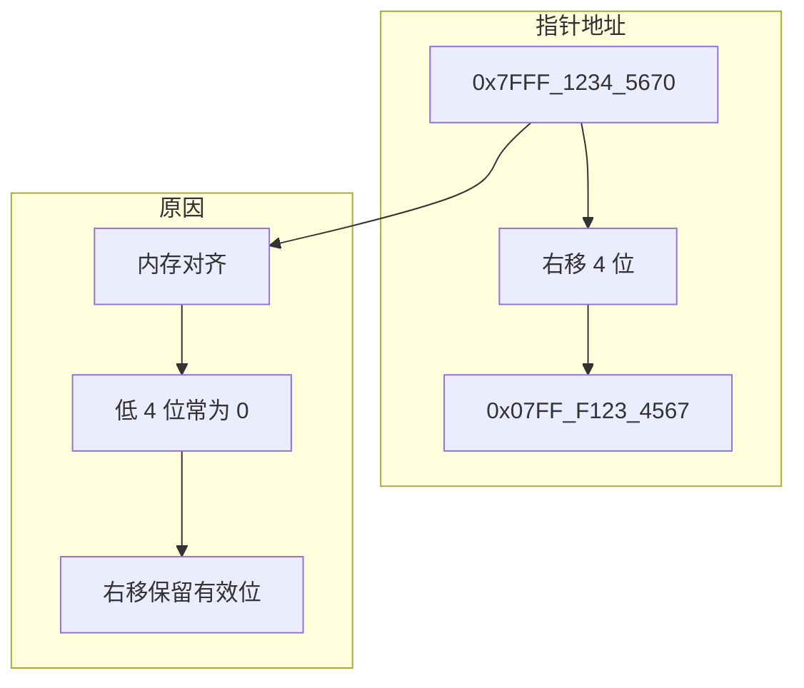

大多数系统上，对象至少按 8 或 16 字节对齐，所以低 3-4 位通常是 0。右移可以保留更多有效信息在哈希中。

---

## 🔗 组合哈希

### 实现细节 (BLI_hash.hh:220~241)

```cpp
namespace blenlib_detail {
static constexpr std::array<uint64_t, 5> default_hash_factors = {
    19349669, 83492791, 3632623, 8789800933, 7235126189};

template<size_t... I, typename... Args>
constexpr uint64_t get_default_hash_array(std::index_sequence<I...> /*indices*/,
                                          const Args &...args)
{
  static_assert(sizeof...(Args) == sizeof...(I));
  static_assert(sizeof...(Args) <= default_hash_factors.size());
  return (0 ^ ... ^ (default_hash_factors[I] * DefaultHash<std::decay_t<Args>>{}(args)));
}
}  // namespace blenlib_detail

template<typename T, typename... Args>
constexpr uint64_t get_default_hash(const T &v, const Args &...args)
{
  return DefaultHash<std::decay_t<T>>{}(v) ^
         blenlib_detail::get_default_hash_array(std::make_index_sequence<sizeof...(Args)>(),
                                                args...);
}
```

**算法解析：**

```cpp
// get_default_hash(a, b, c) 展开为：
hash(a) ^ (factor[0] * hash(b)) ^ (factor[1] * hash(c))
```

**折叠表达式 (C++17)：**

```cpp
(0 ^ ... ^ (default_hash_factors[I] * hash(args)))
// 展开为：
0 ^ (factor[0] * hash(arg0)) ^ (factor[1] * hash(arg1)) ^ ...
```

**为什么用 XOR 和乘法？**

| 操作 | 作用 |
|------|------|
| 乘法 | 放大差异，混合位 |
| XOR | 组合多个哈希值，不溢出 |
| 质数因子 | 减少哈希冲突 |

**使用示例：**

```cpp
// 组合多个字段的哈希
struct Point {
    float x, y, z;
    
    uint64_t hash() const {
        return get_default_hash(x, y, z);
        // 等价于：hash(x) ^ (19349669 * hash(y)) ^ (83492791 * hash(z))
    }
};

// pair 的哈希
template<typename T1, typename T2>
struct DefaultHash<std::pair<T1, T2>> {
    uint64_t operator()(const std::pair<T1, T2> &value) const {
        return get_default_hash(value.first, value.second);
    }
};
```

---

## 🔗 智能指针和引用包装器

### 实现 (BLI_hash.hh:243~259)

```cpp
/** Support hashing different kinds of pointer types. */
template<typename T> struct PointerHashes {
  template<typename U> constexpr uint64_t operator()(const U &value) const
  {
    return get_default_hash(&*value);
  }
};

template<typename T> struct DefaultHash<std::unique_ptr<T>> : public PointerHashes<T> {};
template<typename T> struct DefaultHash<std::shared_ptr<T>> : public PointerHashes<T> {};

template<typename T> struct DefaultHash<std::reference_wrapper<T>> {
  constexpr uint64_t operator()(const std::reference_wrapper<T> &value) const
  {
    return get_default_hash(value.get());
  }
};
```

**设计模式：CRTP（Curiously Recurring Template Pattern）**

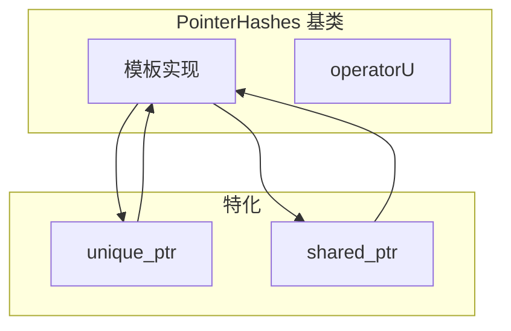

**&*value 的含义：**

```cpp
std::unique_ptr<int> ptr = std::make_unique<int>(42);

&*ptr 的含义：
1. *ptr  -> 解引用，得到 int&
2. &(*ptr) -> 取地址，得到 int*

结果：获取底层原始指针
```

---

## 🎨 可视化：完整哈希系统

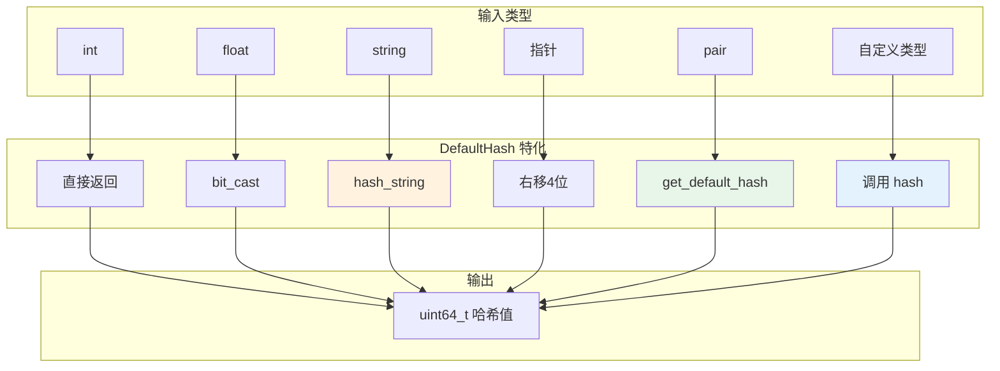

---

## 🔗 与其他基础库的关系

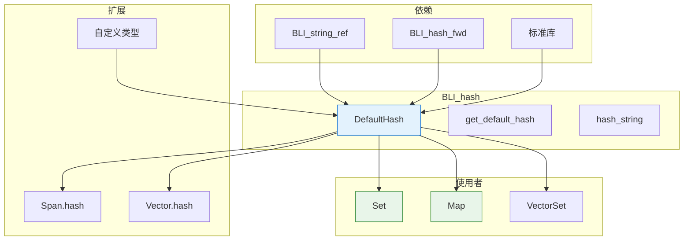

### 具体依赖关系

| 文件 | 关系 | 说明 |
|------|------|------|
| `BLI_hash_fwd.hh` | 前向声明 | 声明 `get_default_hash` 模板 |
| `BLI_string_ref.hh` | 依赖 | 使用 `StringRef` 进行字符串哈希 |
| `BLI_set.hh` | 被使用 | Set 使用 DefaultHash 作为默认哈希 |
| `BLI_map.hh` | 被使用 | Map 使用 DefaultHash 作为默认哈希 |
| `BLI_span.hh` | 扩展 | Span 实现 `hash()` 方法使用 get_default_hash |
| `BLI_vector.hh` | 扩展 | Vector 实现 `hash()` 方法使用 get_default_hash |

---

## 💡 使用示例

### 1. 为基本类型生成哈希

```cpp
#include "BLI_hash.hh"

using namespace blender;

// 整数 - 直接返回
int x = 42;
uint64_t h1 = DefaultHash<int>{}(x);  // 42

// 浮点数 - 位转换
float f = 3.14f;
uint64_t h2 = DefaultHash<float>{}(f);  // 位模式

// 字符串 - DJB2
StringRef str = "hello";
uint64_t h3 = DefaultHash<StringRef>{}(str);
```

### 2. 为自定义类型添加哈希

```cpp
struct Vector3 {
    float x, y, z;
    
    // 方法 1: 添加 hash() 成员函数
    uint64_t hash() const {
        return get_default_hash(x, y, z);
    }
};

// 现在可以在 Set/Map 中使用
Set<Vector3> vector_set;
vector_set.add({1.0f, 2.0f, 3.0f});
```

### 3. 为无法修改的类型特化

```cpp
// 为第三方库的类型添加哈希
namespace blender {
template<>
struct DefaultHash<ExternalType> {
    uint64_t operator()(const ExternalType &value) const {
        return get_default_hash(value.field1, value.field2);
    }
};
}
```

### 4. 异构查找

```cpp
Set<std::string> names;
names.add("blender");

// 用 StringRef 查找，避免构造 std::string
StringRef key = "blender";
if (names.contains_as(key)) {
    // 找到！
}
```

---

## 📊 性能考量

### 哈希函数选择

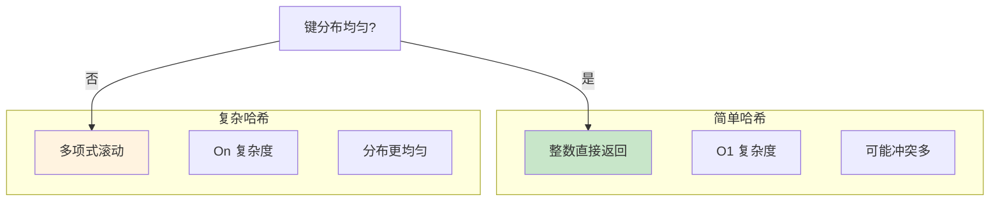

### 探测策略配合

```cpp
// 好的探测策略可以缓解坏哈希函数的影响
Set<Key, 
    64,                    // InlineBufferCapacity
    DefaultProbingStrategy, // 考虑所有位
    DefaultHash<Key>        // 即使是简单哈希也工作良好
>;
```

---

## 🤔 为什么"重复造轮子"？

### C++ 标准库已有 std::hash，为什么还需要 BLI_hash？

**1. 异构查找支持（Heterogeneous Lookup）**

```cpp
// ❌ std::unordered_set 的问题
std::unordered_set<std::string> std_set;
std_set.insert("blender");

// 查找时必须构造 std::string
std::string key = "blender";  // 分配内存，复制字符串
std_set.find(key);            // 可以工作

// 或者
std_set.find("blender");      // 隐式构造 std::string，同样有开销
```

```cpp
// ✅ Blender 的 Set 支持异构查找
Set<std::string> blender_set;
blender_set.add("blender");

// 用 StringRef 查找，零开销
StringRef key = "blender";    // 只是指针+长度，不分配内存
blender_set.contains_as(key); // 直接比较，无需转换
```

**2. 编译时计算（constexpr）**

```cpp
// ❌ std::hash 通常不是 constexpr
template<typename T>
struct std::hash {
    size_t operator()(const T& value) const;  // 运行时计算
};

// ✅ DefaultHash 全是 constexpr
template<typename T>
struct DefaultHash {
    constexpr uint64_t operator()(const T& value) const;  // 编译时计算
};

// 可以在编译时使用
constexpr int x = 42;
constexpr uint64_t h = DefaultHash<int>{}(x);  // 编译时常量
```

**3. 统一的 64 位哈希**

```cpp
// ❌ std::hash 返回 size_t，平台相关（32位/64位）
std::hash<int>{}(42);  // 在32位平台返回32位，64位平台返回64位

// ✅ DefaultHash 始终返回 uint64_t
template<typename T>
struct DefaultHash {
    constexpr uint64_t operator()(const T& value) const;  // 始终是64位
};
```

**4. 更好的字符串哈希**

```cpp
// ❌ std::hash<std::string> 实现因编译器而异
// MSVC、GCC、Clang 使用不同算法

// ✅ Blender 使用统一的 DJB2 算法
constexpr uint64_t hash_string(StringRef str) {
    uint64_t hash = 5381;
    for (char c : str) {
        hash = hash * 33 + c;  // 所有平台一致
    }
    return hash;
}
```

### 对照使用表

| 场景 | 标准库 (std::hash) | Blender (DefaultHash) | 推荐 |
|------|-------------------|----------------------|------|
| 通用哈希 | `std::hash<T>{}(value)` | `DefaultHash<T>{}(value)` | Blender |
| 字符串查找 | `std::unordered_set<std::string>` | `Set<std::string>` | Blender |
| 编译时计算 | ❌ 不支持 | ✅ `constexpr` | Blender |
| 跨平台一致性 | ❌ 实现不同 | ✅ 统一实现 | Blender |
| 与外部库交互 | ✅ 标准接口 | ❌ 需要转换 | 标准库 |
| 简单脚本 | ✅ 无需额外头文件 | ❌ 需要 BLI 头文件 | 标准库 |

### 代码对照示例

```cpp
// ========== 标准库方式 ==========
#include <unordered_set>
#include <string>
#include <functional>

std::unordered_set<std::string> std_set;
std_set.insert("hello");

// 查找（有内存分配）
bool found = std_set.find("hello") != std_set.end();

// 获取哈希（运行时）
std::hash<std::string> hasher;
size_t hash_value = hasher("hello");


// ========== Blender 方式 ==========
#include "BLI_set.hh"
#include "BLI_string_ref.hh"

Set<std::string> blender_set;
blender_set.add("hello");

// 查找（无内存分配）
bool found = blender_set.contains_as(StringRef("hello"));

// 获取哈希（编译时）
constexpr uint64_t hash_value = DefaultHash<StringRef>{}("hello");
```

---

## 📦 为什么只包含前向头文件？

### 问题分析

在 `BLI_span.hh:63` 中：

```cpp
#include "BLI_hash_fwd.hh"  // 前向声明头文件
```

但在 `BLI_span.hh:414` 中使用了 `get_default_hash`：

```cpp
constexpr uint64_t hash() const
{
    uint64_t hash = 0;
    for (const T &value : *this) {
        hash = hash * 33 ^ get_default_hash(value);  // <-- 使用了 get_default_hash
    }
    return hash;
}
```

**为什么能编译通过？**

### 答案：模板函数的延迟实例化

```cpp
// BLI_hash_fwd.hh:7~15
#pragma once
#include <cstdint>

namespace blender {

template<typename T, typename... Args>
constexpr uint64_t get_default_hash(const T &v, const Args &...args);

}  // namespace blender
```

**关键点：**

| 概念 | 说明 |
|------|------|
| **前向声明** | 只声明函数签名，不提供实现 |
| **模板延迟实例化** | 模板定义在使用时才需要 |
| **编译阶段** | 声明在编译期可用，链接期才需要实现 |

### 工作流程

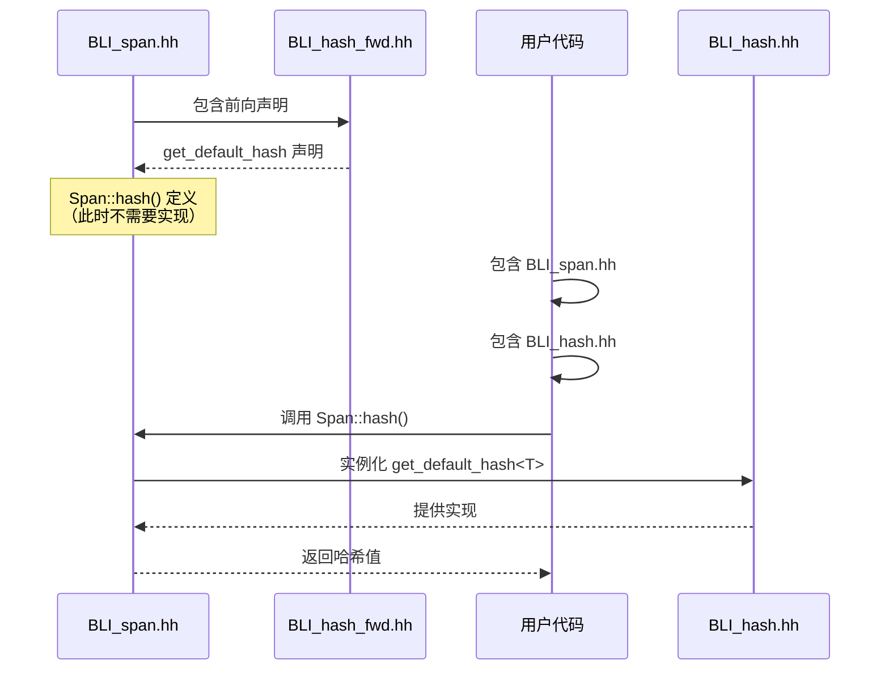

### 为什么这样设计？

**1. 减少编译依赖**

```cpp
// ❌ 如果直接包含完整头文件
#include "BLI_hash.hh"  // 会引入更多依赖

// 依赖链：
// BLI_hash.hh -> BLI_string_ref.hh -> ...
// 编译时间增加
```

```cpp
// ✅ 只包含前向声明
#include "BLI_hash_fwd.hh"  // 最小依赖

// 只有实际使用 hash() 时才需要完整定义
```

**2. 避免循环包含**

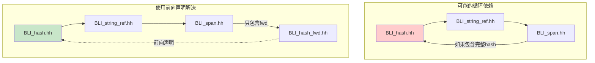

**3. 模板特性利用**

```cpp
// 模板声明（在 fwd 头文件中）
template<typename T>
void foo(T value);  // 只有声明

// 模板定义（在完整头文件中）
template<typename T>
void foo(T value) {  // 有实现
    // ...
}

// 使用（在其他文件中）
template void foo<int>(int);  // 显式实例化时才需要定义
```

### 实际使用时的要求

```cpp
// ========== 文件：my_code.cc ==========

// 如果只使用 Span，不调用 hash()
#include "BLI_span.hh"

void func1() {
    Span<int> span = ...;
    // 不调用 hash()，不需要 BLI_hash.hh
}

// 如果调用 hash()
#include "BLI_span.hh"
#include "BLI_hash.hh"  // <-- 必须包含！

void func2() {
    Span<int> span = ...;
    uint64_t h = span.hash();  // 需要 get_default_hash 的实现
}
```

### 前向头文件模式总结

| 头文件类型 | 内容 | 用途 |
|------------|------|------|
| `BLI_hash_fwd.hh` | 模板声明 | 在类定义中使用哈希类型 |
| `BLI_hash.hh` | 模板定义 | 实际调用哈希函数时使用 |

**最佳实践：**

```cpp
// 在头文件中（类定义）
#include "BLI_hash_fwd.hh"

class MyClass {
public:
    uint64_t hash() const;  // 声明
};

// 在源文件中（实现）
#include "BLI_hash.hh"

uint64_t MyClass::hash() const {
    return get_default_hash(member1, member2);  // 实现
}
```

---

## ✅ 总结

| 特性 | 说明 |
|------|------|
| **默认行为** | 枚举转整数，其他类型调用 `hash()` 成员函数 |
| **异构查找** | 通过 `hash_as()` 静态方法支持 |
| **字符串哈希** | DJB2 算法，乘数 33，初始值 5381 |
| **组合哈希** | XOR + 质数乘法，支持多字段组合 |
| **编译时计算** | 大量使用 `constexpr`，零运行时开销 |
| **扩展性** | 三种方式提供自定义哈希：成员函数、特化、自定义结构 |
