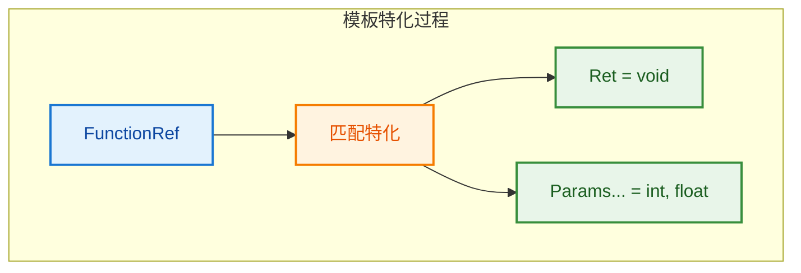
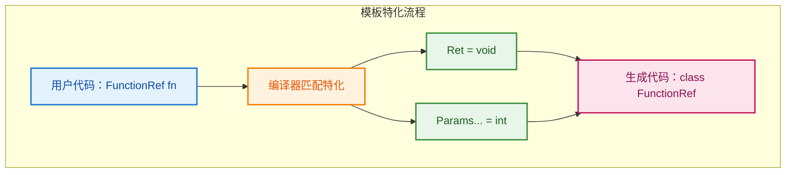
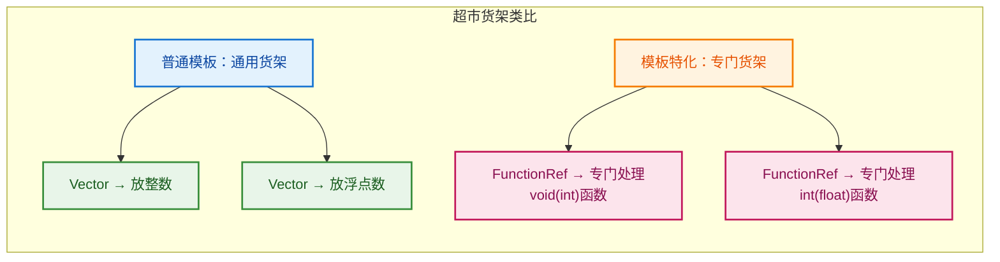
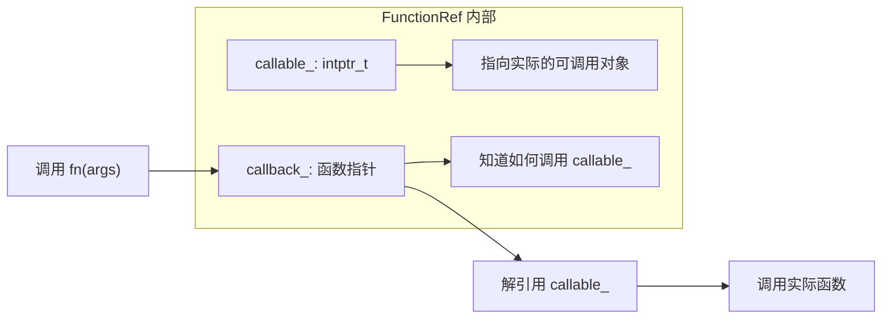
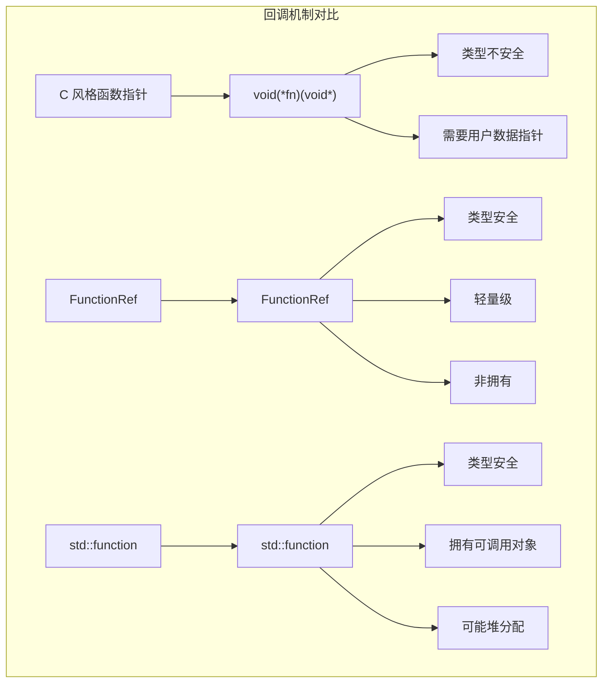

# FunctionRef - 轻量级函数引用

> 非拥有的、类型安全的可调用对象引用，用于传递回调函数

---

## 📖 源码注释翻译

**文件：** `source/blender/blenlib/BLI_function_ref.hh`

> **文件头注释 (BLI_function_ref.hh:15~70):**
> ```cpp
> /** \file
>  * \ingroup bli
>  *
>  * A `FunctionRef<Signature>` is a non-owning reference to some callable object with a specific
>  * signature. It can be used to pass some callback to another function.
>  *
>  * A `FunctionRef` is small and cheap to copy. Therefore it should generally be passed by value.
>  *
>  * Example signatures:
>  *   `FunctionRef<void()>`        - A function without parameters and void return type.
>  *   `FunctionRef<int(float)>`    - A function with a float parameter and an int return value.
>  *   `FunctionRef<int(int, int)>` - A function with two int parameters and an int return value.
>  *
>  * There are multiple ways to achieve that, so here is a comparison of the different approaches:
>  * 1. Pass function pointer and user data (as void *) separately:
>  *    - The only method that is compatible with C interfaces.
>  *    - Is cumbersome to work with in many cases, because one has to keep track of two parameters.
>  *    - Not type safe at all, because of the void pointer.
>  *    - It requires workarounds when one wants to pass a lambda into a function.
>  * 2. Using `std::function`:
>  *    - It works well with most callables and is easy to use.
>  *    - Owns the callable, so it can be returned from a function more safely than other methods.
>  *    - Requires that the callable is copyable.
>  *    - Requires an allocation when the callable is too large (typically > 16 bytes).
>  * 3. Using a template for the callable type:
>  *    - Most efficient solution at runtime, because compiler knows the exact callable at the place
>  *      where it is called.
>  *    - Works well with all callables.
>  *    - Requires the function to be in a header file.
>  *    - It's difficult to constrain the signature of the function.
>  * 4. Using `FunctionRef`:
>  *    - Second most efficient solution at runtime.
>  *    - It's easy to constrain the signature of the callable.
>  *    - Does not require the function to be in a header file.
>  *    - Works well with all callables.
>  *    - It's a non-owning reference, so it *cannot* be stored safely in general.
>  *
>  * The fact that this is a non-owning reference makes `FunctionRef` very well suited for some use
>  * cases, but one has to be a bit more careful when using it to make sure that the referenced
>  * callable is not destructed.
>  *
>  * In particular, one must not construct a `FunctionRef` variable from a lambda directly as shown
>  * below. This is because the lambda object goes out of scope after the line finished executing and
>  * will be destructed. Calling the reference afterwards invokes undefined behavior.
>  *
>  * Don't:
>  *   FunctionRef<int()> ref = []() { return 0; };
>  * Do:
>  *   auto f = []() { return 0; };
>  *   FuntionRef<int()> ref = f;
>  *
>  * It is fine to pass a lambda directly to a function:
>  *
>  *   void some_function(FunctionRef<int()> f);
>  *   some_function([]() { return 0; });
>  */
> ```

**翻译：**

`FunctionRef<Signature>` 是对具有特定签名的可调用对象的**非拥有引用**。它可以用来向另一个函数传递回调。

`FunctionRef` 很小且复制开销低。因此通常应该**按值传递**。

**示例签名：**
- `FunctionRef<void()>` - 无参数、void 返回类型的函数
- `FunctionRef<int(float)>` - float 参数、int 返回值的函数
- `FunctionRef<int(int, int)>` - 两个 int 参数、int 返回值的函数

**四种传递回调的方法对比：**

1. **分别传递函数指针和用户数据（void*）**
   - 唯一与 C 接口兼容的方法
   - 使用繁琐，需要跟踪两个参数
   - 类型不安全（void 指针）
   - 传递 lambda 时需要变通方法

2. **使用 `std::function`**
   - 与大多数可调用对象配合良好，易于使用
   - 拥有可调用对象，可以更安全地从函数返回
   - 要求可调用对象可复制
   - 可调用对象太大时（通常 > 16 字节）需要堆分配

3. **使用模板作为可调用类型**
   - 运行时最高效的解决方案，编译器在调用处知道确切的可调用对象
   - 与所有可调用对象配合良好
   - 要求函数在头文件中
   - 难以约束函数签名

4. **使用 `FunctionRef`**
   - 运行时第二高效的解决方案
   - 易于约束可调用对象的签名
   - 不要求函数在头文件中
   - 与所有可调用对象配合良好
   - **非拥有引用**，因此通常不能安全地存储

非拥有引用这一特性使 `FunctionRef` 非常适合某些用例，但使用时需要更加小心，确保被引用的可调用对象没有被销毁。

特别要注意的是，**不能**像下面这样直接从 lambda 构造 `FunctionRef` 变量：

```cpp
// ❌ 错误：
FunctionRef<int()> ref = []() { return 0; };
```

这是因为 lambda 对象在执行完该行后就会超出作用域并被销毁。之后调用该引用会触发**未定义行为**。

```cpp
// ✅ 正确：
auto f = []() { return 0; };
FunctionRef<int()> ref = f;
```

但直接传递 lambda 给函数是可以的：

```cpp
void some_function(FunctionRef<int()> f);
some_function([]() { return 0; });  // ✅ 安全
```

---

## 🎯 核心概念

### 什么是 `FunctionRef<void(bke::GeometrySet &)>`？

**用户问题：** `void(bke::GeometrySet &)` 这是什么语法？函数指针也不这样啊

**解释：**

这是 C++ 的**函数类型**语法，不是函数指针！

```cpp
// 函数类型（Function Type）
void(int)           // 接受 int，返回 void 的函数类型
int(float, float)   // 接受两个 float，返回 int 的函数类型
void(bke::GeometrySet &)  // 接受 GeometrySet 引用，返回 void 的函数类型

// 函数指针（Function Pointer）
void(*)(int)              // 指向 void(int) 函数的指针
int(*)(float, float)      // 指向 int(float, float) 函数的指针
void(*)(bke::GeometrySet &)  // 指向 void(bke::GeometrySet &) 函数的指针

// 对比：
FunctionRef<void(int)> fn;   // FunctionRef 包装函数类型
void (*fn_ptr)(int);          // 函数指针
```

**函数类型 vs 函数指针：**

| 特性 | 函数类型 `void(int)` | 函数指针 `void(*)(int)` |
|------|---------------------|------------------------|
| **本质** | 描述签名 | 存储地址 |
| **大小** | 无（编译期概念） | 8 字节（指针） |
| **用途** | 模板参数、类型推导 | 运行时调用 |
| **可变性** | 固定 | 可指向不同函数 |

```cpp
// 函数类型在模板中的使用：
template<typename Function> class FunctionRef;

template<typename Ret, typename... Params>
class FunctionRef<Ret(Params...)> {  // 特化：Ret(Params...) 是函数类型
    // ...
};

// 实例化：
FunctionRef<void(int)>  // Ret = void, Params... = int
FunctionRef<int(float, float)>  // Ret = int, Params... = float, float
```

---

## 🔧 源码逐行解析

### 模板声明和特化

```cpp
// 72: 主模板声明（不完整，需要特化）
template<typename Function> class FunctionRef;

// 74: 函数类型特化
// Ret = 返回类型
// Params... = 可变参数包（参数类型列表）
template<typename Ret, typename... Params>
class FunctionRef<Ret(Params...)> {
```

**为什么需要模板特化？**

```cpp
// ❌ 如果这样设计：
template<typename T>
class FunctionRef {
    T fn;  // 假设 T = void(int)，void(int) fn; 语法错误！
};
// 问题：函数类型不能直接声明变量！

// ✅ 正确设计：模板特化
template<typename Ret, typename... Params>
class FunctionRef<Ret(Params...)> {
    Ret (*callback_)(intptr_t, Params...);  // 函数指针，可以声明
    intptr_t callable_;
};
```

**可视化：**



**详细解释：**

```cpp
// 主模板声明（第72行）：告诉编译器"有这个东西"
template<typename Function> 
class FunctionRef;
// 注意：没有花括号实现，这是"不完整声明"
// 用途：防止编译器报错，实际的实现在特化中

// 函数类型特化（第74行）：具体实现
template<typename Ret, typename... Params>
class FunctionRef<Ret(Params...)> {
//                    ↑
//                    这是函数类型！
//                    Ret(Params...) = void(int) 或 int(float, float) 等
```

**关键语法：`FunctionRef<Ret(Params...)>`**

```cpp
// 尖括号 <> 里面写的是函数类型
// Ret(Params...) 表示：返回 Ret，接受 Params... 参数的函数类型

// 示例：
FunctionRef<void(int)>              // Ret=void,   Params...=int
FunctionRef<int(float, float)>      // Ret=int,    Params...=float,float  
FunctionRef<void(bke::GeometrySet&)> // Ret=void,   Params...=bke::GeometrySet&
```

**为什么需要 `typename Ret, typename... Params`？**

```cpp
// 如果只有一个模板参数：
template<typename FunctionSignature>
class FunctionRef {
    // 怎么从这个签名里提取返回类型和参数类型？
    // 很难做到！
};

// 分成多个模板参数：
template<typename Ret, typename... Params>
class FunctionRef<Ret(Params...)> {
    // 直接获得：Ret 和 Params...
    Ret (*callback_)(intptr_t, Params...);  // 使用 Ret 和 Params...
};
```

**完整可视化：**



**类比理解：**



### 成员变量

```cpp
// 79: 回调函数指针
// 这是一个"跳板"函数，知道如何调用实际的可调用对象
Ret (*callback_)(intptr_t callable, Params... params) = nullptr;

// 90: 可调用对象的指针（存储为整数类型）
// 使用 intptr_t 避免与函数指针转换时的警告
intptr_t callable_;
```

**为什么需要 callback_ 和 callable_ 两个成员？**



### 回调函数模板

```cpp
// 92-95: 静态模板函数，将 intptr_t 转换回 Callable 并调用
template<typename Callable>
static Ret callback_fn(intptr_t callable, Params... params)
{
    // reinterpret_cast: 将整数重新解释为指针
    // std::forward: 完美转发参数（保持引用类型）
    return (*reinterpret_cast<Callable *>(callable))(std::forward<Params>(params)...);
}
```

**工作流程：**

```cpp
// 1. 创建 FunctionRef 时：
auto lambda = [](int x) { return x * 2; };
FunctionRef<int(int)> fn = lambda;

// 内部发生：
// callback_ = &callback_fn<decltype(lambda)>  // 指向模板实例化的函数
// callable_ = reinterpret_cast<intptr_t>(&lambda)  // lambda 的地址

// 2. 调用 fn(5) 时：
// callback_(callable_, 5)
// ↓
// callback_fn<decltype(lambda)>(&lambda, 5)
// ↓
// (*reinterpret_cast<decltype(lambda)*>(&lambda))(5)
// ↓
// lambda(5)
// ↓
// 10
```

### 构造函数

```cpp
// 112-140: 模板构造函数，接受任何可调用对象
template<typename Callable>
FunctionRef(Callable &&callable)
    // requires 子句：约束条件
    requires(!std::is_same_v<std::remove_cv_t<std::remove_reference_t<Callable>>, FunctionRef> &&
             std::is_invocable_r_v<Ret, Callable, Params...>)
    : callback_(callback_fn<typename std::remove_reference_t<Callable>>),
      callable_(intptr_t(&callable))
{
    // 119-139: 处理空可调用对象的情况
    if constexpr (std::is_constructible_v<bool, Callable>) {
        // ...
    }
}
```

**逐行解释：**

```cpp
template<typename Callable>
FunctionRef(Callable &&callable)
```
- 万能引用（Universal Reference）：可以绑定到左值或右值

```cpp
requires(
    // 条件1：Callable 不是 FunctionRef 本身
    !std::is_same_v<std::remove_cv_t<std::remove_reference_t<Callable>>, FunctionRef> &&
    // 条件2：Callable 可以用 Params... 调用，并返回 Ret
    std::is_invocable_r_v<Ret, Callable, Params...>
)
```
- C++20 requires 子句：编译期约束
- 防止无限递归（FunctionRef 构造 FunctionRef）
- 确保类型安全（签名匹配）

```cpp
: callback_(callback_fn<typename std::remove_reference_t<Callable>>),
  callable_(intptr_t(&callable))
```
- 初始化 callback_：指向实例化的 callback_fn 模板函数
- 初始化 callable_：可调用对象的地址

### 调用运算符

```cpp
// 147-151: 函数调用运算符
Ret operator()(Params... params) const
{
    BLI_assert(callback_ != nullptr);  // 安全检查
    return callback_(callable_, std::forward<Params>(params)...);
}
```

### 布尔转换

```cpp
// 157-162: 检查是否引用了有效的可调用对象
operator bool() const
{
    return callback_ != nullptr;
}
```

---

## 🎨 使用场景对比

### 函数指针 vs FunctionRef vs std::function



| 特性 | 函数指针 | FunctionRef | std::function |
|------|---------|-------------|---------------|
| **类型安全** | ❌ 需要 void* | ✅ 完全类型安全 | ✅ 完全类型安全 |
| **支持 Lambda** | ❌ 需要变通 | ✅ 直接支持 | ✅ 直接支持 |
| **支持捕获** | ❌ 不支持 | ✅ 支持 | ✅ 支持 |
| **内存开销** | 8 字节 | 16 字节 | 32+ 字节（可能堆分配） |
| **复制开销** | O(1) | O(1) | O(n)（深拷贝） |
| **拥有性** | N/A | 非拥有 | 拥有 |
| **可存储性** | ✅ | ❌ 谨慎 | ✅ |

### 什么时候用什么？

```cpp
// 1. C 接口兼容性 - 用函数指针
void c_api_callback(void (*callback)(void*), void* user_data);

// 2. 高性能、非存储 - 用 FunctionRef
void process_items(FunctionRef<void(Item&)> callback);

// 3. 需要存储、返回 - 用 std::function
std::function<void()> make_callback();  // 可以返回
class Task {
    std::function<void()> callback_;  // 可以存储
};
```

---

## 💡 实际使用示例

### foreach_real_geometry 中的使用

**源码位置：** `source/blender/geometry/intern/foreach_geometry.cc:70~95`

```cpp
void foreach_real_geometry(bke::GeometrySet &geometry,
                           FunctionRef<void(bke::GeometrySet &geometry_set)> fn)
{
    // ... 提取几何体 ...
    
    // 90-95: 并行处理每个几何体
    threading::parallel_for(geometries_with_paths.index_range(), 1, 
        [&](const IndexRange range) {
            for (const int i : range) {
                bke::GeometrySet &geometry_to_modify = geometries_with_paths[i].geometry;
                fn(geometry_to_modify);  // 调用传入的回调
            }
        });
    
    // ... 重新插入修改后的几何体 ...
}
```

**为什么用 FunctionRef？**

```cpp
// 1. 不需要存储回调，只是临时使用
// 2. 需要类型安全（GeometrySet& 参数）
// 3. 性能关键（并行处理）
// 4. 轻量级（不分配内存）

// 使用示例：
foreach_real_geometry(geometry_set, [&](GeometrySet &geo) {
    // 处理每个几何体
    split_curves(geo, ...);
});
```

### 错误用法

```cpp
// ❌ 错误：存储 FunctionRef
class Bad {
    FunctionRef<void()> fn_;  // 危险！可能引用已销毁的对象
public:
    void set_callback(FunctionRef<void()> fn) { fn_ = fn; }
    void call() { fn_(); }  // 可能崩溃！
};

// ✅ 正确：如果需要存储，用 std::function
class Good {
    std::function<void()> fn_;  // 安全，拥有可调用对象
public:
    void set_callback(std::function<void()> fn) { fn_ = std::move(fn); }
    void call() { fn_(); }
};
```

---

## ✅ 总结

| 要点 | 说明 |
|------|------|
| **本质** | 非拥有的、类型安全的可调用对象引用 |
| **大小** | 16 字节（两个指针） |
| **用途** | 传递回调函数，不存储 |
| **优势** | 轻量、类型安全、支持所有可调用对象 |
| **劣势** | 非拥有，不能安全存储 |
| **vs 函数指针** | 类型安全，支持 lambda |
| **vs std::function** | 更轻量，但不拥有 |
