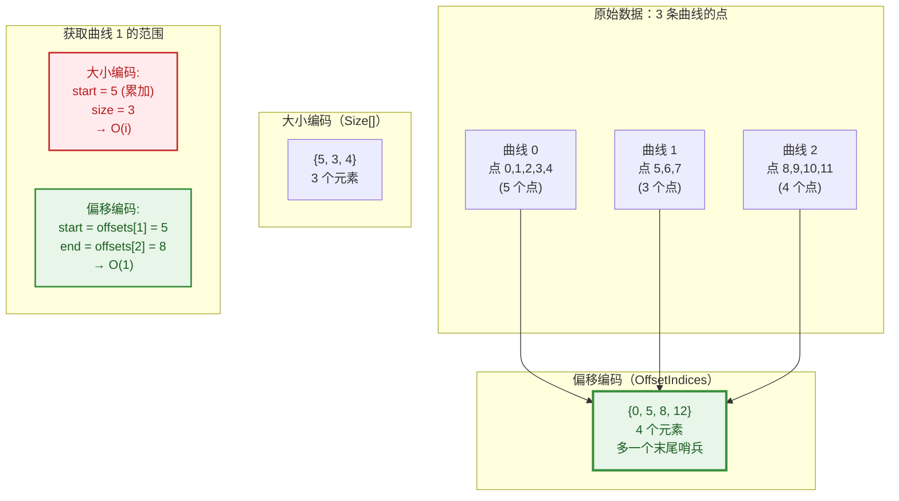
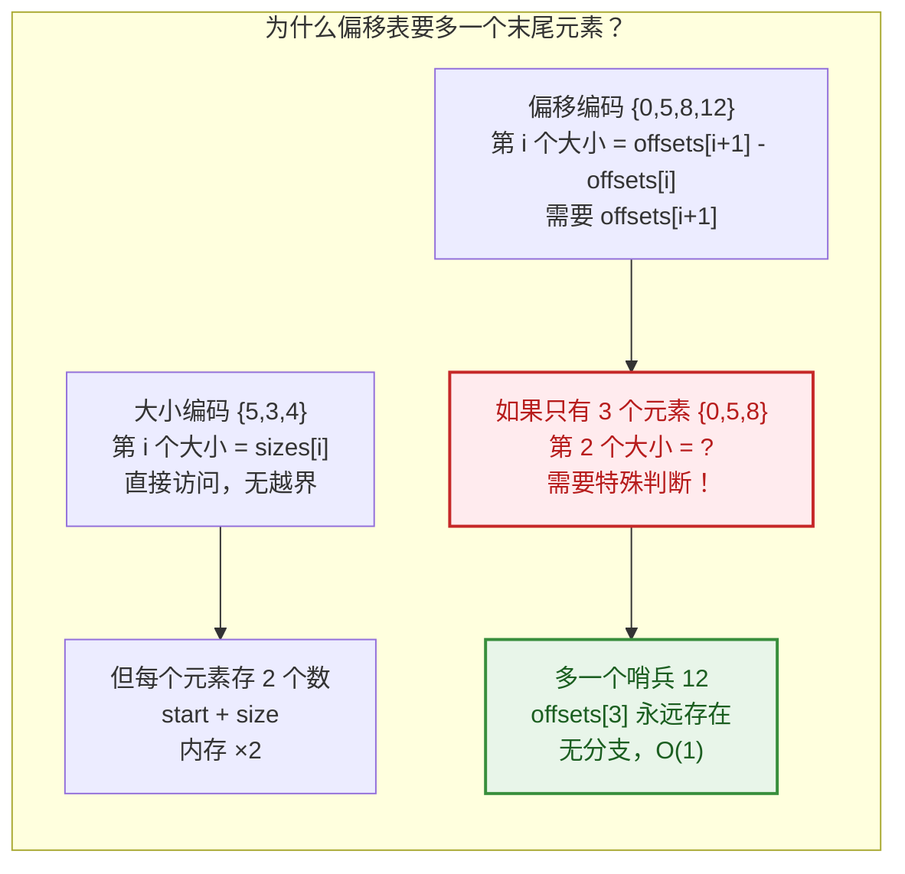
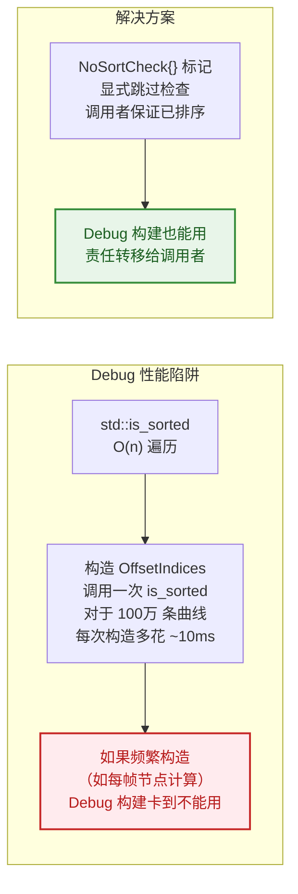
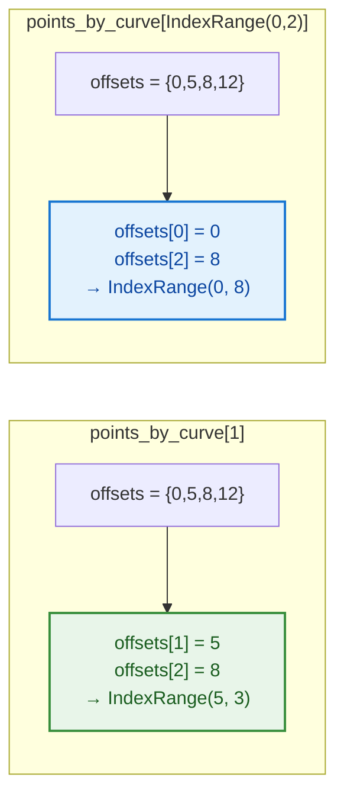
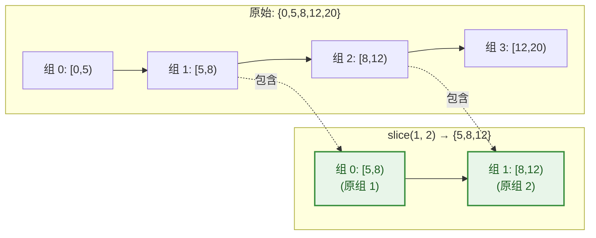
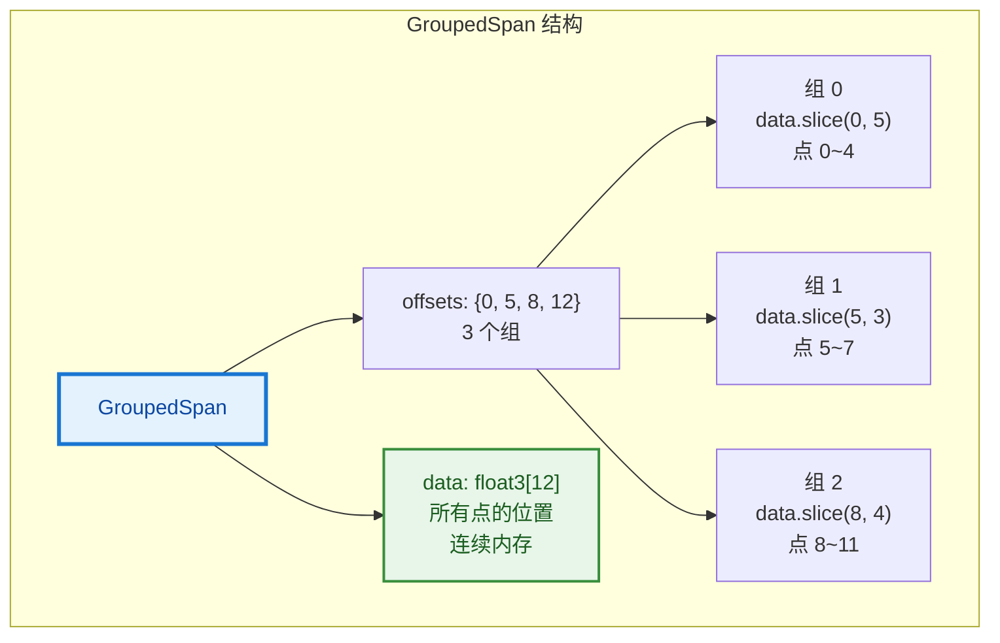
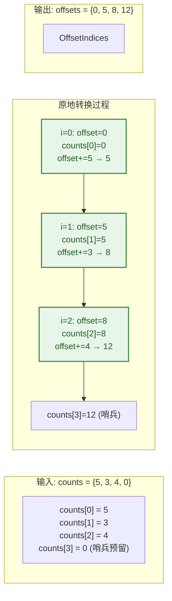
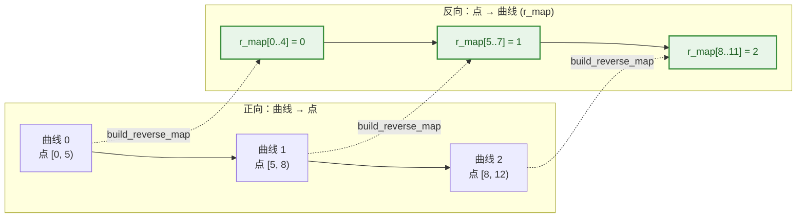
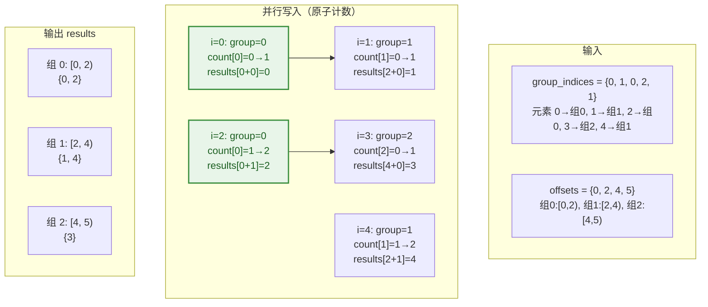
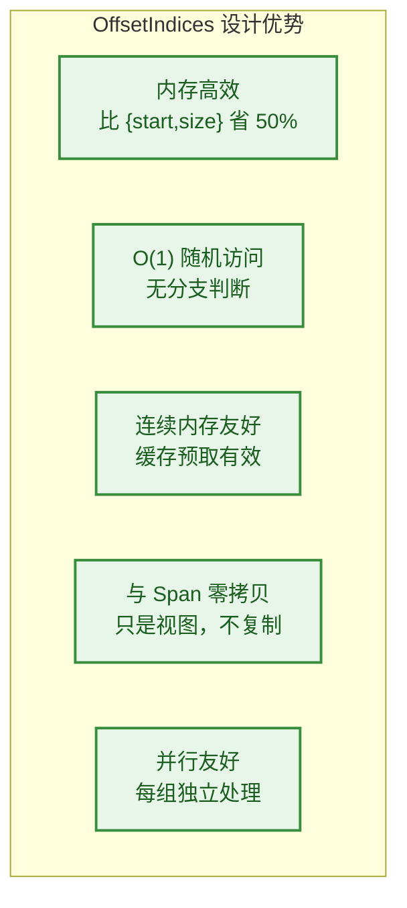

# OffsetIndices 深度解析 - Blender 的变长数组偏移表

> 基于 `source/blender/blenlib/BLI_offset_indices.hh` 与 `intern/offset_indices.cc` 的完整源码分析。
>
> 这是 Blender 几何处理中最基础、最常用的数据结构之一。`CurvesGeometry` 的 `curve_offsets`、网格的面-顶点关联、粒子的分组……底层全是它。
- [OffsetIndices 深度解析 - Blender 的变长数组偏移表](#offsetindices-深度解析---blender-的变长数组偏移表)
  - [📋 快速上手](#-快速上手)
    - [为什么用偏移而不是大小？](#为什么用偏移而不是大小)
  - [1️⃣ 核心设计：偏移表编码](#1️⃣-核心设计偏移表编码)
    - [1.1 一个具体例子](#11-一个具体例子)
    - [1.2 源码注释逐条翻译](#12-源码注释逐条翻译)
  - [2️⃣ OffsetIndices 类详解](#2️⃣-offsetindices-类详解)
    - [2.1 类定义与模板约束](#21-类定义与模板约束)
    - [2.2 构造函数](#22-构造函数)
    - [2.3 核心方法](#23-核心方法)
    - [2.4 运算符重载：获取第 i 个范围](#24-运算符重载获取第-i-个范围)
    - [2.5 切片](#25-切片)
  - [3️⃣ GroupedSpan：OffsetIndices + 数据的组合](#3️⃣-groupedspanoffsetindices--数据的组合)
    - [3.1 设计意图](#31-设计意图)
    - [3.2 使用示例](#32-使用示例)
  - [4️⃣ 工具函数详解](#4️⃣-工具函数详解)
    - [4.1 accumulate\_counts\_to\_offsets：大小数组 → 偏移表](#41-accumulate_counts_to_offsets大小数组--偏移表)
    - [4.2 build\_reverse\_map：建立反向映射](#42-build_reverse_map建立反向映射)
    - [4.3 reverse\_indices\_in\_groups：按组反转索引](#43-reverse_indices_in_groups按组反转索引)
  - [5️⃣ 在 Blender 中的实际使用](#5️⃣-在-blender-中的实际使用)
    - [5.1 CurvesGeometry：曲线 → 点映射](#51-curvesgeometry曲线--点映射)
    - [5.2 在 Split Curve 节点中的使用](#52-在-split-curve-节点中的使用)
    - [5.3 与 IndexMask 的配合](#53-与-indexmask-的配合)
  - [6️⃣ 设计评估](#6️⃣-设计评估)
    - [6.1 优势](#61-优势)
    - [6.2 劣势与限制](#62-劣势与限制)
  - [✅ 总结](#-总结)
  - [📁 相关文件](#-相关文件)

---

## 📋 快速上手

> **OffsetIndices 是什么？** 它是一个**偏移表**，把"每个组有多大"编码成"每个组从哪里开始"。
>
> 比如 3 条曲线分别有 5、3、4 个点，它存的是 `{0, 5, 8, 12}`，而不是 `{5, 3, 4}`。

```cpp
// 最常见的使用方式
const OffsetIndices<int> points_by_curve = src_curves.points_by_curve();
for (const int curve_i : src_curves.curves_range()) {
    const IndexRange points = points_by_curve[curve_i];  // 获取曲线 i 的点范围
    // points.start() = 起始点索引
    // points.size()  = 点数
}
```

### 为什么用偏移而不是大小？

| 存储方式 | 内存 | 获取第 i 组范围 | 获取总大小 |
|---------|------|----------------|-----------|
| **{start, size} 数组** `{0,5},{5,3},{8,4}` | 6 × 4B = 24B | 直接访问：O(1) | 累加 size：O(n) |
| **偏移数组** `{0,5,8,12}` | 4 × 4B = 16B | `offsets[i+1] - offsets[i]`：O(1) | 最后一个元素：O(1) |

**偏移表比 {start, size} 方案节省 8B（3 组时），且获取总大小是 O(1)。**

---

## 1️⃣ 核心设计：偏移表编码

### 1.1 一个具体例子



### 1.2 源码注释逐条翻译

```cpp
// source/blender/blenlib/BLI_offset_indices.hh:26~36

/**
 * This class is a thin wrapper around an array of increasing indices that makes it easy to
 * retrieve an index range at a specific index. Each index range is typically a representation of
 * a contiguous chunk of a larger array.
 *
 * 这个类是一个递增索引数组的薄包装，使得在特定索引处检索索引范围变得容易。
 * 每个索引范围通常代表更大数组中的一个连续块。
 *
 * Another common way to store many index ranges is to store the start and size of every range.
 * Using #OffsetIndices instead requires that chunks are ordered consecutively but halves the
 * memory consumption. Another downside is that the underlying array has to be one element longer
 * than the total number of ranges. The extra element necessary to encode the size of the last
 * range without requiring a branch for each range access.
 *
 * 另一种存储多个索引范围的常见方式是存储每个范围的起始和大小。
 * 使用 OffsetIndices 则要求块是连续排列的，但内存消耗减半。
 * 另一个缺点是底层数组必须比范围总数多一个元素。
 * 这个额外元素是必要的，用于编码最后一个范围的大小，这样每次范围访问就不需要分支判断。
 */
```

**关键洞察：**



| 方案 | 内存/组 | 随机访问 | 需要分支？ |
|------|---------|----------|-----------|
| `{start, size}[]` | 8B | O(1) | 否 |
| `offsets[]` (无哨兵) | 4B | O(1) | **是**（最后一组特殊处理）|
| `offsets[]` (**有哨兵**) | 4.33B | O(1) | **否** ✓ |

**有哨兵的偏移表是最佳折中：接近大小数组的内存效率，又没有分支开销。**

---

## 2️⃣ OffsetIndices 类详解

### 2.1 类定义与模板约束

```cpp
// source/blender/blenlib/BLI_offset_indices.hh:37~42

template<typename T> class OffsetIndices {
 private:
  static_assert(std::is_integral_v<T>);

  Span<T> offsets_;
```

**语法解释：**

| 语法 | 含义 |
|------|------|
| `template<typename T>` | 模板参数：偏移值的类型 |
| `static_assert(std::is_integral_v<T>)` | 编译期断言：T 必须是整数类型（int、int64_t 等） |
| `Span<T> offsets_` | 底层数据：只读视图，不拥有内存 |

**为什么是 `Span` 而不是 `Vector`？** 因为 `OffsetIndices` 只是一个**视图**（view），它可以指向任何整数数组（`Vector<int>`、`Array<int>`、C 数组等），不需要复制数据。

### 2.2 构造函数

```cpp
// source/blender/blenlib/BLI_offset_indices.hh:44~55

OffsetIndices() = default;

OffsetIndices(const Span<T> offsets) : offsets_(offsets)
{
  BLI_assert(offsets_.size() < 2 || std::is_sorted(offsets_.begin(), offsets_.end()));
}
```

**注释翻译：** 检查偏移数组是否已排序（debug 模式）。如果数组有 0 或 1 个元素，自然有序，跳过检查。

```cpp
/**
 * Same as above, but skips the debug check that indices are sorted, because that can have a
 * high performance impact making debug builds unusable for files that would be fine otherwise.
 * This can be used when it is known that the indices are sorted already.
 *
 * 同上，但跳过索引已排序的 debug 检查，因为这在 debug 构建中可能有很高的性能开销，
 * 导致本来正常的文件无法使用。当已知索引已排序时可以使用这个。
 */
OffsetIndices(const Span<T> offsets, NoSortCheck /*no_sort_check*/) : offsets_(offsets) {}
```

**为什么需要 `NoSortCheck` 版本？**



**语法亮点：无名参数 `NoSortCheck /*no_sort_check*/`**

```cpp
OffsetIndices(const Span<T> offsets, NoSortCheck /*no_sort_check*/)
```

- `NoSortCheck` 是参数类型（空结构体标签）
- `/*no_sort_check*/` 是注释掉的参数名
- 这意味着：**参数只用于重载区分，不实际使用**
- 调用方式：`OffsetIndices(offsets, NoSortCheck{})`

这是 C++ 中常见的**标签分发（Tag Dispatching）**技巧。

### 2.3 核心方法

```cpp
// source/blender/blenlib/BLI_offset_indices.hh:57~75

/** Return the total number of elements in the referenced arrays. */
T total_size() const
{
  return offsets_.size() > 1 ? offsets_.last() - offsets_.first() : 0;
}
```

**注释翻译：** 返回被引用数组中的元素总数。

```cpp
/**
 * Return the number of ranges encoded by the offsets, not including the last value used
 * internally.
 *
 * 返回偏移编码的范围数量，不包括内部使用的最后一个值。
 */
int64_t size() const
{
  return std::max<int64_t>(offsets_.size() - 1, 0);
}
```

**关键：** `offsets_.size() - 1` 因为有哨兵元素。如果 `offsets_` 为空，`size()` 返回 0 而不是 -1。

```cpp
bool is_empty() const
{
  return this->size() == 0;
}

IndexRange index_range() const
{
  return IndexRange(this->size());
}
```

### 2.4 运算符重载：获取第 i 个范围

```cpp
// source/blender/blenlib/BLI_offset_indices.hh:82~96

IndexRange operator[](const int64_t index) const
{
  BLI_assert(index >= 0);
  BLI_assert(index < offsets_.size() - 1);
  const int64_t begin = offsets_[index];
  const int64_t end = offsets_[index + 1];
  return IndexRange::from_begin_end(begin, end);
}
```

**核心操作：** `offsets[i]` 返回第 `i` 个组的 `IndexRange`（起始索引 + 大小）。

```cpp
IndexRange operator[](const IndexRange indices) const
{
  const int64_t begin = offsets_[indices.start()];
  const int64_t end = offsets_[indices.one_after_last()];
  return IndexRange::from_begin_end(begin, end);
}
```

**重载版本：** 传入 `IndexRange` 获取**多个连续组**合并后的范围。



### 2.5 切片

```cpp
// source/blender/blenlib/BLI_offset_indices.hh:98~107

/**
 * Return a subset of the offsets describing the specified range of source elements.
 * This is a slice into the source ranges rather than the indexed elements described by the
 * offset values.
 *
 * 返回描述指定源元素范围偏移的子集。
 * 这是对源范围的切片，而不是对偏移值描述的索引元素的切片。
 */
OffsetIndices slice(const IndexRange range) const
{
  BLI_assert(range.is_empty() || offsets_.index_range().drop_back(1).contains(range.last()));
  return OffsetIndices(offsets_.slice(range.start(), range.size() + 1));
}
```

**注释翻译：** 这是对**源范围**的切片，而不是对偏移值描述的索引元素的切片。

**什么意思？**

```cpp
// 原始偏移表: {0, 5, 8, 12, 20}  (4 个组)
// 组 0: [0, 5), 组 1: [5, 8), 组 2: [8, 12), 组 3: [12, 20)

// slice(IndexRange(1, 2)) → 取组 1 和组 2
// 结果: {5, 8, 12}  (2 个组)
// 注意：不是对元素切片！不是 {8, 12}！
```



**为什么 `slice` 的大小是 `range.size() + 1`？** 因为需要保留哨兵元素！取 2 个组需要 3 个偏移值。

---

## 3️⃣ GroupedSpan：OffsetIndices + 数据的组合

### 3.1 设计意图

```cpp
// source/blender/blenlib/BLI_offset_indices.hh:115~152

/**
 * References many separate spans in a larger contiguous array. This gives a more efficient way to
 * store many grouped arrays, without requiring many small allocations, giving the general benefits
 * of using contiguous memory.
 *
 * 引用一个大连续数组中的多个独立 Span。这提供了一种更高效的方式来存储多个分组数组，
 * 不需要多次小分配，获得了使用连续内存的通用好处。
 *
 * \note If the offsets are shared between many #GroupedSpan objects, it will be more efficient
 * to retrieve the #IndexRange only once and slice each span.
 *
 * 注意：如果偏移在多个 GroupedSpan 对象之间共享，更高效的做法是只检索一次 IndexRange，
 * 然后对每个 Span 切片。
 */
template<typename T> struct GroupedSpan {
  OffsetIndices<int> offsets;
  Span<T> data;
  // ...
};
```



**GroupedSpan 的本质：** 把 "偏移表 + 一块大数组" 打包，提供按组访问的语法糖。

### 3.2 使用示例

```cpp
// 所有曲线的点位置存在一个大数组中
Span<float3> all_positions = curves.positions();  // 1000 个点

// 用 GroupedSpan 按曲线分组访问
GroupedSpan<float3> positions_by_curve = {
    curves.points_by_curve(),  // 偏移表
    all_positions               // 数据
};

// 访问曲线 2 的所有点
Span<float3> curve2_positions = positions_by_curve[2];
// 等价于: all_positions.slice(curves.points_by_curve()[2])
```

---

## 4️⃣ 工具函数详解

### 4.1 accumulate_counts_to_offsets：大小数组 → 偏移表

```cpp
// source/blender/blenlib/intern/offset_indices.cc:17~38

OffsetIndices<int> accumulate_counts_to_offsets(MutableSpan<int> counts_to_offsets,
                                                const int start_offset)
{
  int offset = start_offset;
  int64_t offset_i64 = start_offset;

  for (const int i : counts_to_offsets.index_range().drop_back(1)) {
    const int count = counts_to_offsets[i];
    BLI_assert(count >= 0);
    counts_to_offsets[i] = offset;   // 原地覆盖：大小 → 偏移
    offset += count;
#ifndef NDEBUG
    offset_i64 += count;
#endif
  }
  counts_to_offsets.last() = offset;  // 哨兵

  BLI_assert_msg(offset == offset_i64, "Integer overflow occurred");
  UNUSED_VARS_NDEBUG(offset_i64);

  return OffsetIndices<int>(counts_to_offsets);
}
```

**注释翻译：** 这个变体比不带溢出检查的版本慢约 8%。由于这个函数经常是串行瓶颈，我们为需要溢出检查的情况使用单独的代码路径。

**算法过程：**



**关键设计：原地转换**
- 输入是大小数组，输出是偏移数组
- **同一个数组原地转换**，不需要额外内存
- 时间复杂度 O(n)，空间复杂度 O(1)

**为什么用 `int64_t offset_i64`？**

```cpp
int offset = start_offset;       // 32 位，实际计算用
int64_t offset_i64 = start_offset; // 64 位，仅用于溢出检查
```

- `int offset` 用于实际赋值（因为数组类型是 `int`）
- `int64_t offset_i64` 用于验证没有溢出
- 如果 `offset` 溢出（超过 `INT_MAX`），`offset != offset_i64`，断言失败
- `UNUSED_VARS_NDEBUG(offset_i64)`：release 模式下这个变量未使用， suppress 警告

### 4.2 build_reverse_map：建立反向映射

```cpp
// source/blender/blenlib/intern/offset_indices.cc:145~152

void build_reverse_map(OffsetIndices<int> offsets, MutableSpan<int> r_map)
{
  threading::parallel_for(offsets.index_range(), 1024, [&](const IndexRange range) {
    for (const int64_t i : range) {
      r_map.slice(offsets[i]).fill(i);  // 把第 i 组的所有位置填上 i
    }
  });
}
```

**用途：** 给定分组（如曲线 → 点），建立反向映射（点 → 曲线）。



### 4.3 reverse_indices_in_groups：按组反转索引

```cpp
// source/blender/blenlib/intern/offset_indices.cc:171~199

void reverse_indices_in_groups(const Span<int> group_indices,
                               const OffsetIndices<int> offsets,
                               MutableSpan<int> results,
                               const bool sort)
{
  // ...
  /* `counts` keeps track of how many elements have been added to each group, and is incremented
   * atomically by many threads in parallel. `calloc` can be measurably faster than a parallel fill
   * of zero. Alternatively the offsets could be copied and incremented directly, but the cost of
   * the copy is slightly higher than the cost of `calloc`.
   *
   * counts 跟踪每个组已添加多少元素，由多线程并行原子递增。
   * calloc 可以比并行填充零明显更快。
   * 另一种方案是直接复制偏移并递增，但复制的成本略高于 calloc 的成本。
   */
  Array<int> counts(offsets.size(), 0);
  threading::parallel_for(group_indices.index_range(), 1024, [&](const IndexRange range) {
    for (const int64_t i : range) {
      const int group_index = group_indices[i];
      const int index_in_group = atomic_fetch_and_add_int32(&counts[group_index], 1);
      results[offsets[group_index][index_in_group]] = int(i);
    }
  });
  if (sort) {
    sort_small_groups(offsets, results);
  }
}
```

**算法解读：**

这是**并行分组收集**的经典模式：
1. `group_indices[i]` 告诉第 `i` 个元素属于哪个组
2. `counts[group]` 原子递增，获取该组内的位置
3. `results[offsets[group][position]] = i` 把元素写入正确的位置



---

## 5️⃣ 在 Blender 中的实际使用

### 5.1 CurvesGeometry：曲线 → 点映射

```cpp
// source/blender/blenkernel/BKE_curves.hh:1053~1057

inline OffsetIndices<int> CurvesGeometry::points_by_curve() const
{
  return OffsetIndices<int>({this->curve_offsets, this->curve_num + 1},
                            offset_indices::NoSortCheck{});
}
```

**为什么用 `NoSortCheck`？** 因为 `curve_offsets` 在构造时已经保证有序，不需要每次 `points_by_curve()` 都检查。

### 5.2 在 Split Curve 节点中的使用

```cpp
// source/blender/nodes/geometry/nodes/node_geo_curve_split.cc:42

const OffsetIndices<int> points_by_curve = src_curves.points_by_curve();
const VArray<bool> src_cyclic = src_curves.cyclic();

for (const int curve_i : src_curves.curves_range()) {
    const IndexRange points = points_by_curve[curve_i];
    const Span<bool> curve_points_to_split = points_to_split.as_span().slice(points);
    // ... 处理每条曲线的点 ...
}
```

### 5.3 与 IndexMask 的配合

```cpp
// source/blender/blenlib/intern/offset_indices.cc:112~126

int sum_group_sizes(const OffsetIndices<int> offsets, const IndexMask &mask)
{
  int count = 0;
  mask.foreach_segment_optimized([&](const auto segment) {
    if constexpr (std::is_same_v<std::decay_t<decltype(segment)>, IndexRange>) {
      // segment 是连续的 IndexRange
      count += offsets[segment].size();  // 直接算整个范围的大小
    }
    else {
      // segment 是稀疏的 IndexMaskSegment
      for (const int64_t i : segment) {
        count += offsets[i].size();  // 逐个累加
      }
    }
  });
  return count;
}
```

**语法亮点：`if constexpr` + `std::is_same_v`**

```cpp
if constexpr (std::is_same_v<std::decay_t<decltype(segment)>, IndexRange>)
```

| 语法 | 含义 |
|------|------|
| `decltype(segment)` | 获取 segment 的实际类型 |
| `std::decay_t<...>` | 去掉引用和 const，得到原始类型 |
| `std::is_same_v<A, B>` | 编译期判断 A 和 B 是否相同类型 |
| `if constexpr` | 编译期分支，不满足的分支不编译 |

这是 C++17 **编译期多态**的经典用法：一个 lambda 处理两种不同类型的 segment，编译器会为每种类型生成最优代码。

---

## 6️⃣ 设计评估

### 6.1 优势



### 6.2 劣势与限制

| 劣势 | 说明 |
|------|------|
| **组必须连续** | 不能表示不连续的子数组 |
| **只读视图** | 修改组大小需要重建偏移表 |
| **额外哨兵元素** | 比纯大小数组多一个元素的内存开销 |

---

## ✅ 总结

**OffsetIndices 是 Blender 几何处理的基础设施。** 它的核心设计决策：

1. **偏移表编码**：用 `{0, 5, 8, 12}` 代替 `{5, 3, 4}`，O(1) 随机访问
2. **末尾哨兵**：多一个元素消除分支判断
3. **Span 视图**：零拷贝，可指向任何整数数组
4. **原地转换**：`accumulate_counts_to_offsets` 同数组覆盖，O(n) 时间 O(1) 空间

**如果你只记住一件事：** `OffsetIndices` 用 **一个元素的额外内存** 换取了 **O(1) 随机访问** 和 **无分支遍历**，这是几何处理中每秒访问数百万次的操作，收益巨大。

---

## 📁 相关文件

| 文件 | 路径 | 说明 |
|------|------|------|
| `BLI_offset_indices.hh` | `source/blender/blenlib/` | 主头文件 |
| `intern/offset_indices.cc` | `source/blender/blenlib/intern/` | 实现文件 |
| `tests/BLI_offset_indices_test.cc` | `source/blender/blenlib/tests/` | 单元测试 |
| `BKE_curves.hh` | `source/blender/blenkernel/` | `points_by_curve()` 使用示例 |
| `node_geo_curve_split.cc` | `source/blender/nodes/geometry/nodes/` | 节点中的实际使用 |
