# GArray 深度解析

> 源文件：[BLI_generic_array.hh](file:///e:/blender-git/blender/source/blender/blenlib/BLI_generic_array.hh)

---

## 目录

- [GArray 深度解析](#garray-深度解析)
  - [目录](#目录)
  - [1. 核心定位：为什么需要 GArray？](#1-核心定位为什么需要-garray)
    - [原始注释翻译](#原始注释翻译)
    - [核心问题](#核心问题)
  - [2. 类型体系全景图](#2-类型体系全景图)
    - [所有权语义对比](#所有权语义对比)
  - [3. 类成员详解](#3-类成员详解)
    - [成员解读表](#成员解读表)
    - [内存布局可视化](#内存布局可视化)
  - [4. 构造函数逐一剖析](#4-构造函数逐一剖析)
    - [4.1 默认构造 — `GArray(Allocator allocator = {})`](#41-默认构造--garrayallocator-allocator--)
    - [4.2 带类型和大小的构造 — `GArray(const CPPType&, int64_t size)`](#42-带类型和大小的构造--garrayconst-cpptype-int64_t-size)
    - [4.3 不初始化构造 — `GArray(const CPPType&, int64_t, NoInitialization)`](#43-不初始化构造--garrayconst-cpptype-int64_t-noinitialization)
    - [4.4 接管缓冲区 — `GArray(const CPPType&, void*, int64_t)`](#44-接管缓冲区--garrayconst-cpptype-void-int64_t)
    - [4.5 从 GSpan 拷贝 — `GArray(const GSpan)`](#45-从-gspan-拷贝--garrayconst-gspan)
    - [4.6 拷贝构造 / 移动构造](#46-拷贝构造--移动构造)
    - [4.7 析构函数 — 两步清理](#47-析构函数--两步清理)
    - [4.8 赋值运算符 — 构造 vs 赋值的关键区别](#48-赋值运算符--构造-vs-赋值的关键区别)
      - [构造 vs 赋值的本质区别](#构造-vs-赋值的本质区别)
      - [构造与赋值调用方式对比](#构造与赋值调用方式对比)
      - [`copy_assign_container` — copy-and-swap 异常安全模式](#copy_assign_container--copy-and-swap-异常安全模式)
      - [`move_assign_container` — destroy-and-construct 模式](#move_assign_container--destroy-and-construct-模式)
      - [`std::move` 到底干了什么？](#stdmove-到底干了什么)
  - [5. 隐式类型转换：GArray → GSpan / GMutableSpan](#5-隐式类型转换garray--gspan--gmutablespan)
    - [转换链](#转换链)
    - [为什么不继承？](#为什么不继承)
    - [实际效果](#实际效果)
  - [6. reinitialize：原地重置的精巧实现](#6-reinitialize原地重置的精巧实现)
  - [7. 内存管理：allocate / deallocate](#7-内存管理allocate--deallocate)
    - [分配字节数计算](#分配字节数计算)
    - [AT 参数](#at-参数)
  - [8. 运算符与访问方式](#8-运算符与访问方式)
    - [operator\[\] — 按"元素索引"访问](#operator--按元素索引访问)
    - [典型访问模式](#典型访问模式)
  - [9. 奇怪/非基础语法解析](#9-奇怪非基础语法解析)
    - [9.1 `BLI_NO_UNIQUE_ADDRESS`](#91-bli_no_unique_address)
    - [9.2 `NoExceptConstructor` 参数](#92-noexceptconstructor-参数)
    - [9.3 `NoInitialization` 标签](#93-noinitialization-标签)
    - [9.4 `copy_assign_container` / `move_assign_container`](#94-copy_assign_container--move_assign_container)
    - [9.5 `POINTER_OFFSET` 宏](#95-pointer_offset-宏)
    - [9.6 模板默认参数 `Allocator = GuardedAllocator`](#96-模板默认参数-allocator--guardedallocator)
  - [10. 几何节点中的 7 大使用模式](#10-几何节点中的-7-大使用模式)
    - [模式总览](#模式总览)
    - [模式 1：字段求值缓冲区 🎯](#模式-1字段求值缓冲区-)
    - [模式 2：域转换中间缓冲区 🔄](#模式-2域转换中间缓冲区-)
    - [模式 3：索引收集 (gather) 📋](#模式-3索引收集-gather-)
    - [模式 4：列表构建（NoInitialization + move\_construct）⚡](#模式-4列表构建noinitialization--move_construct)
    - [模式 5：延迟分配 ⏳](#模式-5延迟分配-)
    - [模式 6：隐式共享 🔗](#模式-6隐式共享-)
    - [模式 7：空列表哨兵 🚫](#模式-7空列表哨兵-)
  - [11. GArray vs Array 对比](#11-garray-vs-array-对比)
  - [12. 设计哲学总结](#12-设计哲学总结)
    - [一句话总结](#一句话总结)


---

## 1. 核心定位：为什么需要 GArray？

### 原始注释翻译

> *This is a generic counterpart to #Array, used when the type is not known at runtime.*
>
> 这是 `Array` 的**泛型对应物**，用于**类型在运行时才可知**的场景。

> *`GArray` should generally only be used for passing data around in dynamic contexts.*
>
> `GArray` 通常只应在**动态上下文中传递数据**时使用。

> *It does not support a few things that #Array supports:*
> *- Small object optimization / inline buffer.*
> *- Exception safety and various more specific constructors.*
>
> 它不支持 `Array` 的一些特性：
> - **小对象优化 / 内联缓冲区**（即不会在对象内部预留小数组空间）
> - **异常安全**和各种更特殊的构造函数

### 核心问题

在几何节点中，属性的类型（`float`、`int`、`float3`、`bool`、`ColorGeometry4f`……）在**编译期不可知**——同一个节点可能处理任意类型的属性。`Array<T>` 要求 `T` 在编译期确定，无法满足这一需求。

`GArray` 通过**类型擦除**（Type Erasure）解决此问题：将 `T` 替换为运行时的 `CPPType*` 指针，数据存储为 `void*`，从而实现"编译期不知道类型，运行时安全操作"。

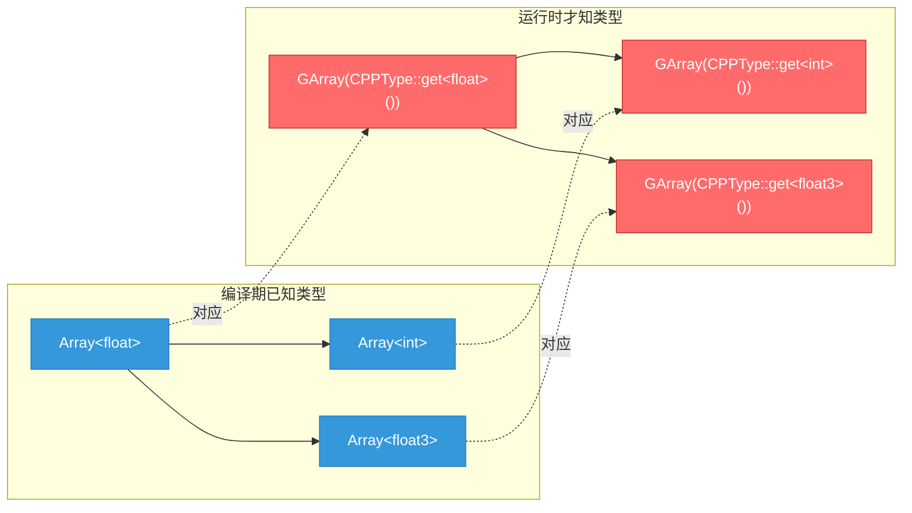
```mermaid
graph LR
    subgraph 编译期已知类型
        A["Array&lt;float&gt;"] --> B["Array&lt;int&gt;"]
        A --> C["Array&lt;float3&gt;"]
    end
    subgraph 运行时才知类型
        D["GArray(CPPType::get&lt;float&gt;())"]
        D --> E["GArray(CPPType::get&lt;int&gt;())"]
        D --> F["GArray(CPPType::get&lt;float3&gt;())"]
    end
    A -.对应.-> D
    B -.对应.-> E
    C -.对应.-> F

    style D fill:#ff6b6b,color:#fff,stroke:#c0392b
    style E fill:#ff6b6b,color:#fff,stroke:#c0392b
    style F fill:#ff6b6b,color:#fff,stroke:#c0392b
    style A fill:#3498db,color:#fff,stroke:#2980b9
    style B fill:#3498db,color:#fff,stroke:#2980b9
    style C fill:#3498db,color:#fff,stroke:#2980b9
```

---

## 2. 类型体系全景图

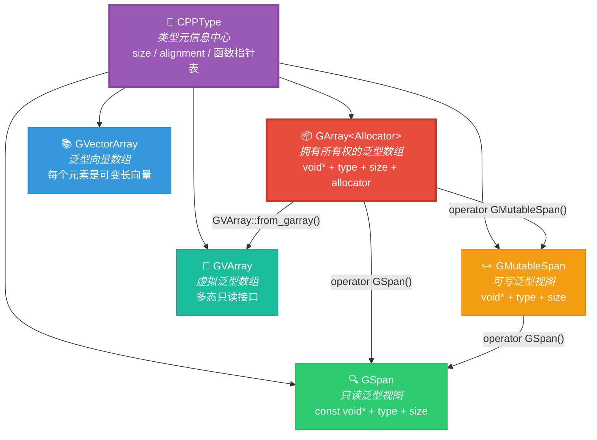
```mermaid
graph TB
    CPPType["🧬 CPPType<br/><i>类型元信息中心</i><br/>size / alignment / 函数指针表"]
    GSpan["🔍 GSpan<br/><i>只读泛型视图</i><br/>const void* + type + size"]
    GMutableSpan["✏️ GMutableSpan<br/><i>可写泛型视图</i><br/>void* + type + size"]
    GArray["📦 GArray&lt;Allocator&gt;<br/><i>拥有所有权的泛型数组</i><br/>void* + type + size + allocator"]
    GVArray["🔮 GVArray<br/><i>虚拟泛型数组</i><br/>多态只读接口"]
    GVectorArray["📚 GVectorArray<br/><i>泛型向量数组</i><br/>每个元素是可变长向量"]

    CPPType --> GSpan
    CPPType --> GMutableSpan
    CPPType --> GArray
    CPPType --> GVArray
    CPPType --> GVectorArray

    GArray -->|"operator GSpan()"| GSpan
    GArray -->|"operator GMutableSpan()"| GMutableSpan
    GMutableSpan -->|"operator GSpan()"| GSpan
    GArray -->|"GVArray::from_garray()"| GVArray

    style CPPType fill:#9b59b6,color:#fff,stroke:#8e44ad,stroke-width:3px
    style GArray fill:#e74c3c,color:#fff,stroke:#c0392b,stroke-width:3px
    style GSpan fill:#2ecc71,color:#fff,stroke:#27ae60
    style GMutableSpan fill:#f39c12,color:#fff,stroke:#e67e22
    style GVArray fill:#1abc9c,color:#fff,stroke:#16a085
    style GVectorArray fill:#3498db,color:#fff,stroke:#2980b9
```

### 所有权语义对比

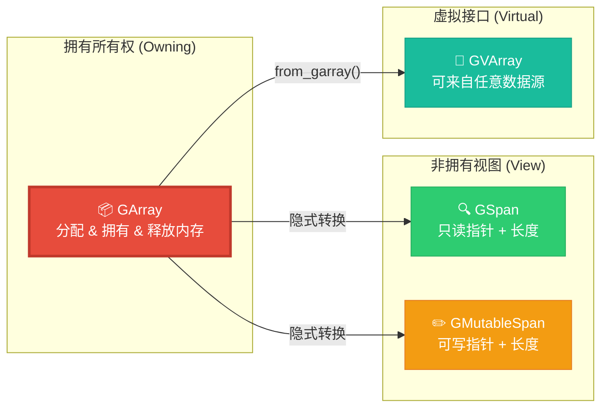
```mermaid
graph LR
    subgraph "拥有所有权 (Owning)"
        GArray["📦 GArray<br/>分配 & 拥有 & 释放内存"]
    end
    subgraph "非拥有视图 (View)"
        GSpan["🔍 GSpan<br/>只读指针 + 长度"]
        GMutableSpan["✏️ GMutableSpan<br/>可写指针 + 长度"]
    end
    subgraph "虚拟接口 (Virtual)"
        GVArray["🔮 GVArray<br/>可来自任意数据源"]
    end

    GArray -->|"隐式转换"| GSpan
    GArray -->|"隐式转换"| GMutableSpan
    GArray -->|"from_garray()"| GVArray

    style GArray fill:#e74c3c,color:#fff,stroke:#c0392b,stroke-width:3px
    style GSpan fill:#2ecc71,color:#fff,stroke:#27ae60
    style GMutableSpan fill:#f39c12,color:#fff,stroke:#e67e22
    style GVArray fill:#1abc9c,color:#fff,stroke:#16a085
```

---

## 3. 类成员详解

```cpp
template<typename Allocator = GuardedAllocator>
class GArray {
 protected:
  const CPPType *type_ = nullptr;   // 运行时类型描述符
  void *data_ = nullptr;            // 堆分配的原始数据缓冲区
  int64_t size_ = 0;                // 元素数量（不是字节数！）
  BLI_NO_UNIQUE_ADDRESS Allocator allocator_;  // 内存分配器

  // ...
};
```

### 成员解读表

| 成员 | 类型 | 含义 | 注意事项 |
|------|------|------|---------|
| `type_` | `const CPPType*` | 指向类型元信息的指针 | 默认构造后为 `nullptr`，使用前**必须**赋值 |
| `data_` | `void*` | 数据缓冲区起始地址 | `void*` 意味着"不知道元素类型"，需配合 `type_` 使用 |
| `size_` | `int64_t` | 元素个数 | ⚠️ **不是**字节数！字节数 = `size_ * type_->size` |
| `allocator_` | `Allocator` | 内存分配策略 | 默认 `GuardedAllocator`（带内存守护的 MEM_* 封装） |

> **缓冲区（buffer）是什么？** 一块**连续的内存区域**，用于存储同类型数据的数组。不是什么特殊的东西，就是"一段内存"的另一种叫法。`int arr[10]` 是栈上的缓冲区，`new int[10]` 是堆上的缓冲区。
>
> **堆缓冲区** = 通过堆分配（`malloc`/`new`/`allocator.allocate`）获得的缓冲区，生命周期由程序员控制，直到显式释放。GArray 的 `data_` 就是指向堆缓冲区的指针。

### 内存布局可视化

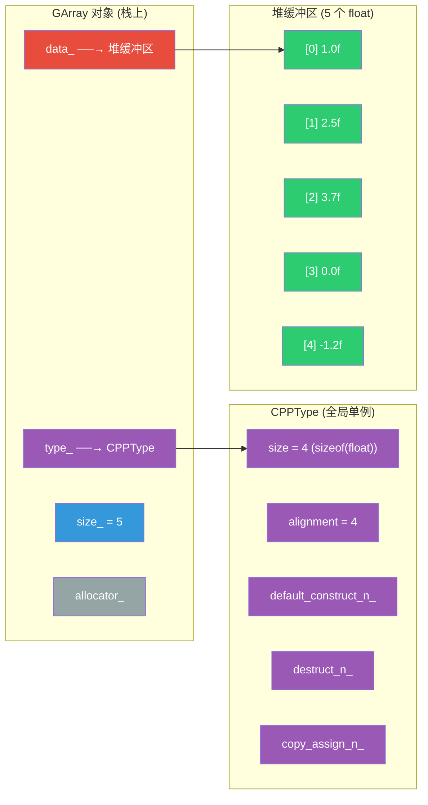
```mermaid
graph LR
    subgraph "GArray 对象 (栈上)"
        T["type_ ──→ CPPType"]
        D["data_ ──→ 堆缓冲区"]
        S["size_ = 5"]
        A["allocator_"]
    end

    subgraph "CPPType (全局单例)"
        TS["size = 4 (sizeof(float))"]
        TA["alignment = 4"]
        TF["default_construct_n_"]
        TD["destruct_n_"]
        TC["copy_assign_n_"]
    end

    subgraph "堆缓冲区 (5 个 float)"
        F0["[0] 1.0f"]
        F1["[1] 2.5f"]
        F2["[2] 3.7f"]
        F3["[3] 0.0f"]
        F4["[4] -1.2f"]
    end

    T --> TS
    D --> F0

    style T fill:#9b59b6,color:#fff
    style D fill:#e74c3c,color:#fff
    style S fill:#3498db,color:#fff
    style A fill:#95a5a6,color:#fff
    style F0 fill:#2ecc71,color:#fff
    style F1 fill:#2ecc71,color:#fff
    style F2 fill:#2ecc71,color:#fff
    style F3 fill:#2ecc71,color:#fff
    style F4 fill:#2ecc71,color:#fff
    style TS fill:#9b59b6,color:#fff
    style TA fill:#9b59b6,color:#fff
    style TF fill:#9b59b6,color:#fff
    style TD fill:#9b59b6,color:#fff
    style TC fill:#9b59b6,color:#fff
```

---

## 4. 构造函数逐一剖析

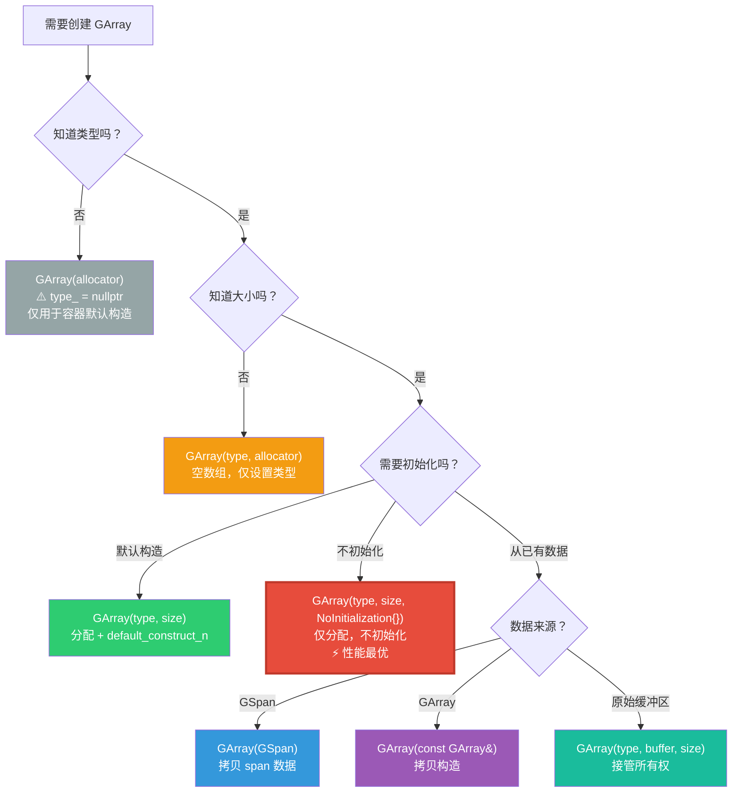
```mermaid
flowchart TD
    START["需要创建 GArray"] --> Q1{"知道类型吗？"}
    Q1 -->|否| C1["GArray(allocator)<br/>⚠️ type_ = nullptr<br/>仅用于容器默认构造"]
    Q1 -->|是| Q2{"知道大小吗？"}
    Q2 -->|否| C2["GArray(type, allocator)<br/>空数组，仅设置类型"]
    Q2 -->|是| Q3{"需要初始化吗？"}
    Q3 -->|"默认构造"| C3["GArray(type, size)<br/>分配 + default_construct_n"]
    Q3 -->|"不初始化"| C4["GArray(type, size, NoInitialization{})<br/>仅分配，不初始化<br/>⚡ 性能最优"]
    Q3 -->|"从已有数据"| Q4{"数据来源？"}
    Q4 -->|"GSpan"| C5["GArray(GSpan)<br/>拷贝 span 数据"]
    Q4 -->|"GArray"| C6["GArray(const GArray&)<br/>拷贝构造"]
    Q4 -->|"原始缓冲区"| C7["GArray(type, buffer, size)<br/>接管所有权"]

    style C1 fill:#95a5a6,color:#fff
    style C2 fill:#f39c12,color:#fff
    style C3 fill:#2ecc71,color:#fff
    style C4 fill:#e74c3c,color:#fff,stroke:#c0392b,stroke-width:3px
    style C5 fill:#3498db,color:#fff
    style C6 fill:#9b59b6,color:#fff
    style C7 fill:#1abc9c,color:#fff
```

### 4.1 默认构造 — `GArray(Allocator allocator = {})`

```cpp
GArray(Allocator allocator = {}) noexcept : allocator_(allocator) {}
```

> *The default constructor creates an empty array, the only situation in which the type is allowed to be null.*
> *This default constructor exists so `GArray` can be used in containers.*
>
> 默认构造创建空数组，这是**唯一允许 type 为 null 的情况**。
> 存在此构造函数是为了让 `GArray` 能放在容器（如 `Vector<GArray<>>`）中。

**注意**：构造后 `type_`、`data_`、`size_` 全部为零/null，**必须**在使用前设置类型。

> **哪个是默认构造函数？** 能**无参调用**的构造函数就是默认构造函数。这个构造函数所有参数都有默认值（`allocator = {}`），所以 `GArray<> a;` 能直接调用它。其他构造函数都需要至少传一个参数，无法无参调用。
>
> **隐式默认构造函数会干什么？** 编译器自动生成的默认构造函数会对每个成员执行默认初始化：`int` 等平凡类型不初始化（值不确定），`string` 等非平凡类型调用其默认构造函数。如果类有基类，先调用基类的默认构造函数。
>
> **多个能无参调用的构造函数怎么办？** 不可能——C++ 规定只能有一个默认构造函数。如果写了两个都能无参调用的构造函数，编译报错歧义。
>
> **如果没有默认构造函数会怎样？** C++ 中，如果类没有声明任何构造函数，编译器会自动生成一个（隐式默认构造函数）。但一旦你声明了**任何**构造函数，编译器就不再自动生成。此时如果需要无参构造，必须自己写。
>
> **`= default` vs 手写空函数体的区别？**
> ```cpp
> GArray() = default;                        // 告诉编译器"帮我生成"
> GArray() noexcept : allocator_() {}        // 手写等价实现
> ```
> `= default` 的优势：当**所有成员都是平凡类型**时，编译器生成的版本是**平凡的**（trivial），可以用 `memcpy` 复制对象、不需要调用析构函数。手写版本即使用户代码等价，编译器也不一定认为它是平凡的。GArray 这里手写是因为需要初始化 `allocator_`，且标记了 `noexcept`。
>
> **`= default` 能让非平凡类型变平凡吗？** 不能。`= default` 的意思是"帮我生成默认实现"，不是"让它变平凡"。如果类有 `std::string` 成员，无论构造函数写 `= default` 还是手写，这个类都是**非平凡的**——因为 `string` 本身非平凡，编译器生成的 `= default` 会调用 `string` 的默认构造函数。一个类是平凡的，需要**所有**条件同时满足：所有成员都是平凡类型、没有虚函数/虚基类、没有用户定义的特殊成员函数。
>
> **非平凡类型为什么"必须初始化"？** 非平凡类型有**类不变量**（invariants）——对象在生命周期内必须始终满足的条件。成员函数可以**假定**不变量成立，也必须**保证**退出时不变量仍然成立。例如 `std::string` 内部有 `ptr_`、`size_`、`cap_`，不变量是"ptr_ 永远指向有效内存，size_ 是字符串长度"。如果不初始化，`ptr_` 是随机值→不变量被打破→调用 `c_str()` 解引用随机指针→崩溃。默认构造函数的职责就是建立这些不变量。平凡类型没有不变量——`int` 的所有位模式都是合法的，所以不需要初始化。
>
> **如何判断一个类型是否平凡？** C++ 标准定义，类型 `T` 是平凡的当且仅当**所有**条件同时满足：
>
> | 条件 | 说明 |
> |---|---|
> | 没有虚函数 | 无 vtable |
> | 没有虚基类 | 无虚继承开销 |
> | 没有用户定义的构造函数 | 编译器生成的才行 |
> | 没有用户定义的析构函数 | 同上 |
> | 没有用户定义的拷贝/移动操作 | 同上 |
> | 所有非静态成员都是平凡类型 | 递归要求 |
> | 所有基类都是平凡类型 | 递归要求 |
>
> ```cpp
> struct A { int x; float y; };           // ✅ 平凡：全是基础类型
> struct B { int x; std::string s; };     // ❌ 非平凡：string 非平凡
> struct C { int x; virtual void f(); };  // ❌ 非平凡：有虚函数
> struct D { ~D() {} };                   // ❌ 非平凡：用户定义析构函数
> struct E : A { double z; };             // ✅ 平凡：基类和成员都平凡
> struct F { A a; B b; };                 // ❌ 非平凡：B 非平凡
> ```
>
> **结构体和类都能是平凡的**。`struct` 和 `class` 的唯一区别是默认访问权限（`struct` 默认 public，`class` 默认 private），与是否平凡无关。
>
> **"平凡"(trivial) 这个名字好怪？** 来自 C++ 标准术语 `std::is_trivial_v<T>`。可以理解为"朴素的/原生的/无需特殊处理的"——没有自定义构造/析构/虚函数，内存操作就是 `memcpy`/`memmove`。与之相对的是"非平凡"(non-trivial)，即有自定义特殊成员函数，需要逐个调用构造/析构。

### 4.2 带类型和大小的构造 — `GArray(const CPPType&, int64_t size)`

```cpp
GArray(const CPPType &type, int64_t size, Allocator allocator = {})
    : GArray(type, size, NoInitialization{}, allocator)
{
    type_->default_construct_n(data_, size_);  // 默认构造每个元素
}
```

**委托构造链**：先调用 `NoInitialization` 版本分配原始内存，再调用 `CPPType::default_construct_n` 初始化。

- 对于**平凡类型**（`float`、`int` 等）：`default_construct_n` **什么也不做**（内存内容不确定）
- 对于**非平凡类型**（如 `std::string`）：会调用默认构造函数

> **"默认构造"指什么？** C++ 有两种初始化语义：
> - `new (ptr) T;` — 默认初始化（default initialization），对 `int` 不初始化
> - `new (ptr) T();` — 值初始化（value initialization），对 `int` 零初始化为 0
>
> `default_construct_n` 对应前者，所以 `int` 内存不确定。如需零初始化，应使用 `value_initialize_n`。
>
> **两种初始化各自调用了什么构造函数？**
>
> | | `new (ptr) T;` 默认初始化 | `new (ptr) T();` 值初始化 |
> |---|---|---|
> | 平凡类型（`int`） | **什么都不做**，内存不确定 | **零初始化**为 0 |
> | 非平凡类型（`string`） | 调用默认构造函数 → 空串 `""` | 调用默认构造函数 → 空串 `""` |
>
> 对 `int`：两者都没有"调用构造函数"——`int` 没有构造函数。区别纯粹是编译器行为：默认初始化跳过，值初始化填零。
>
> 对 `string`：两者结果一样，都调用默认构造函数。`string` 的默认构造函数**必须初始化**（设 `size_=0`、指向 SSO 缓冲区等），否则对象处于非法状态。"默认构造"不等于"不初始化"，它只是"调用默认构造函数"的简称。
>
> **平凡类型值初始化有额外消耗吗？** 有。值初始化需要把内存清零（等价于 `memset(ptr, 0, n * sizeof(T))`），而默认初始化什么都不做。对于大数组（如百万个 `float`），这个 `memset` 的开销不可忽略。这就是 Blender 区分 `default_construct_n`（不初始化）和 `value_initialize_n`（零初始化）的原因——让调用方按需选择。
>
> **`_n` 系列的优化**：`default_construct_n_cb` 委托给 `default_construct_indices_cb`，后者对平凡类型通过 `if constexpr` 直接 `return`（零开销）；对非平凡类型逐个构造。`copy_assign_n` 等对平凡类型走 `index_mask::detail::copy_assign_segment`，带循环展开和 `__restrict` 优化，连续范围可被编译器优化为 `memcpy`。平凡类型的 `copy_construct` 直接复用 `copy_assign`，因为两者在内存层面都是 `memcpy`。
>
> **`_n` 和 `_n_` 的区别？** 带尾部下划线的是私有函数指针，不带的是公开接口：
> ```cpp
> // 公开接口（public）
> void default_construct_n(void *ptr, int64_t n) const;   // 调用下面的指针
>
> // 私有函数指针（private）
> void (*default_construct_n_)(void *ptr, int64_t n) = nullptr;  // 实际实现
> ```
> 公开接口内部就是调用对应的函数指针。命名约定：带尾部下划线 = 内部存储，不带 = 对外接口。
>
> **三层变体的关系**：
>
> | 变体 | 用途 | 优化 |
> |---|---|---|
> | `xxx(ptr)` | 单个元素 | 直接调用，无循环 |
> | `xxx_n(ptr, n)` | 连续 n 个元素 | 委托给 `_indices`，`IndexMask(n)` 表示连续范围，平凡类型可优化为 `memcpy` |
> | `xxx_indices(ptr, mask)` | 按 IndexMask 选中的元素 | 平凡类型走 `index_mask::detail` 手写循环展开；非平凡类型逐个调用 |
>
> 此外还有 `_compressed` 变体（如 `copy_assign_compressed`），用于将 mask 选中的元素**紧凑排列**到目标（不留间隙），常用于 gather 操作。

### 4.3 不初始化构造 — `GArray(const CPPType&, int64_t, NoInitialization)`

```cpp
GArray(const CPPType &type, const int64_t size,
       NoInitialization /*not_init_tag*/, Allocator allocator = {})
    : GArray(type, allocator)
{
    BLI_assert(size >= 0);
    size_ = size;
    data_ = this->allocate(size_);  // 仅分配内存，不初始化
}
```

> ⚡ **性能关键路径**：当你打算立即覆盖所有元素时，用 `NoInitialization{}` 避免多余的默认构造开销。

### 4.4 接管缓冲区 — `GArray(const CPPType&, void*, int64_t)`

```cpp
GArray(const CPPType &type, void *buffer, int64_t size, Allocator allocator = {})
    : GArray(type, allocator)
{
    BLI_assert(size >= 0);
    BLI_assert(buffer != nullptr || size == 0);
    BLI_assert(type_->pointer_has_valid_alignment(buffer));
    data_ = buffer;
    size_ = size;
}
```

> *Take ownership of a buffer with a provided size. The buffer should be allocated with the same allocator provided to the constructor.*
>
> 接管一个已有缓冲区的所有权。该缓冲区必须使用**相同的分配器**分配。

**关键断言**：`type_->pointer_has_valid_alignment(buffer)` — 检查缓冲区地址是否满足类型对齐要求。

> **"接管"到底是什么意思？** GArray 只是个记事本，记录 `(type_, data_, size_)` 三个值，析构时按记录释放。所谓"接管"就是——你把指针告诉 GArray，GArray 记下来，以后帮你释放。
>
> ```mermaid
> sequenceDiagram
>     participant Caller as 调用方
>     participant Heap as 堆内存
>     participant GA as GArray
>
>     Caller->>Heap: allocator.allocate(40, 4) → 得到 0x1000
>     Caller->>GA: GArray(type, 0x1000, 10, allocator)
>     Note over GA: data_ = 0x1000, size_ = 10, allocator_ = allocator
>     Note over Caller: Caller 不再持有 0x1000，所有权已转移给 GArray
>     Note over GA: ... 使用 GArray ...
>     GA->>GA: ~GArray()
>     GA->>Heap: type_->destruct_n(0x1000, 10)
>     GA->>Heap: allocator_.deallocate(0x1000)
>     Note over Heap: 内存释放 ✅
> ```
>
> **为什么必须用同一个 allocator？** 因为释放必须匹配分配方式：
> ```cpp
> // ✅ 正确：分配和释放用同一个 allocator
> auto *buf = GuardedAllocator{}.allocate(40, 4, AT);
> GArray<> arr(type, buf, 10);  // allocator_ 默认是 GuardedAllocator
> // 析构时：GuardedAllocator{}.deallocate(buf) → 匹配 ✅
>
> // ❌ 错误：分配用 malloc，释放用 GuardedAllocator
> auto *buf = std::malloc(40);
> GArray<> arr(type, buf, 10);
> // 析构时：GuardedAllocator{}.deallocate(buf)
> // 内部调用 MEM_freeN(buf)，但 buf 是 malloc 分配的 → UB ❌
> ```
> 本质就是**配对原则**：谁分配的，谁释放。GArray 的 `deallocate` 用的是自己的 `allocator_`，所以传入的 buffer 必须也是用同种 allocator 分配的。

### 4.5 从 GSpan 拷贝 — `GArray(const GSpan)`

```cpp
GArray(const GSpan span, Allocator allocator = {})
    : GArray(span.type(), span.size(), allocator)
{
    type_->copy_assign_n(span.data(), data_, size_);
}
```

> *Create an array by copying values from a generic span.*
>
> 从泛型 span 拷贝值来创建数组。

注意使用 `copy_assign_n` 而非 `copy_construct_n`，因为 `data_` 已经通过委托构造被默认初始化过了。

### 4.6 拷贝构造 / 移动构造

```cpp
// 拷贝构造：委托给 GSpan 版本
GArray(const GArray &other) : GArray(other.as_span(), other.allocator()) {}

// 移动构造：窃取指针，清空源对象
GArray(GArray &&other)
    : type_(other.type_), data_(other.data_), size_(other.size_), allocator_(other.allocator_)
{
    other.data_ = nullptr;
    other.size_ = 0;
}
```

移动构造的精妙之处：**不分配任何内存**，仅转移三个指针/值，然后将源对象的 `data_` 置 `nullptr`、`size_` 置 0，确保源对象析构时不会释放已转移的内存。

> **`&&` 是什么？** 这是 C++11 的**右值引用**，是一个整体符号，不是两个 `&`。它表示"这个参数绑定到右值（临时对象或 `std::move` 的结果）"。编译器根据传入参数是左值还是右值自动选择拷贝构造（`const &`）或移动构造（`&&`）。
>
> **调用方式**：
> ```cpp
> GArray<> a(type, 5);
> GArray<> b(std::move(a));   // std::move 将 a 转为右值 → 调用移动构造
> GArray<> c = make_array();  // 返回值是右值 → 自动调用移动构造
> GArray<> d(a);              // a 是左值 → 调用拷贝构造
> ```

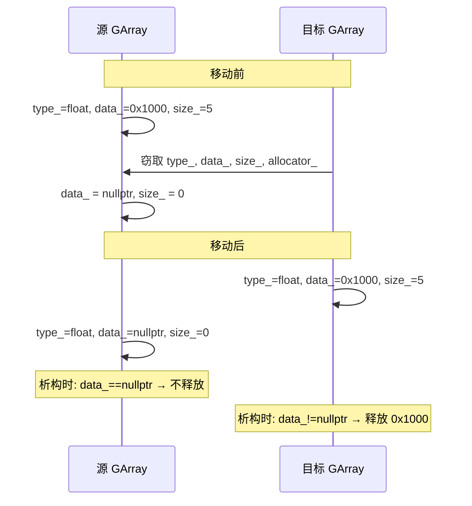
```mermaid
sequenceDiagram
    participant Src as 源 GArray
    participant Dst as 目标 GArray

    Note over Src,Dst: 移动前
    Src->>Src: type_=float, data_=0x1000, size_=5

    Dst->>Src: 窃取 type_, data_, size_, allocator_
    Src->>Src: data_ = nullptr, size_ = 0

    Note over Src,Dst: 移动后
    Dst->>Dst: type_=float, data_=0x1000, size_=5
    Src->>Src: type_=float, data_=nullptr, size_=0

    Note over Src: 析构时: data_==nullptr → 不释放
    Note over Dst: 析构时: data_!=nullptr → 释放 0x1000
```

### 4.7 析构函数 — 两步清理

```cpp
~GArray()
{
    if (data_ != nullptr) {
        type_->destruct_n(data_, size_);   // ① 析构每个元素
        this->deallocate(data_);            // ② 释放缓冲区内存
    }
}
```

两步缺一不可：

- `destruct_n`：调用每个元素的析构函数（如 `std::string` 释放内部堆内存），但**不释放 `data_` 本身指向的缓冲区**
- `deallocate`：释放 `data_` 指向的缓冲区内存

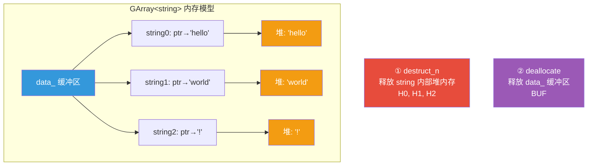
```mermaid
graph TB
    subgraph "GArray&lt;string&gt; 内存模型"
        BUF["data_ 缓冲区"]
        S0["string0: ptr→'hello'"]
        S1["string1: ptr→'world'"]
        S2["string2: ptr→'!'"]
        H0["堆: 'hello'"]
        H1["堆: 'world'"]
        H2["堆: '!'"]
    end
    BUF --> S0
    BUF --> S1
    BUF --> S2
    S0 --> H0
    S1 --> H1
    S2 --> H2

    STEP1["① destruct_n<br/>释放 string 内部堆内存<br/>H0, H1, H2"]
    STEP2["② deallocate<br/>释放 data_ 缓冲区<br/>BUF"]

    style STEP1 fill:#e74c3c,color:#fff
    style STEP2 fill:#9b59b6,color:#fff
    style BUF fill:#3498db,color:#fff
    style H0 fill:#f39c12,color:#fff
    style H1 fill:#f39c12,color:#fff
    style H2 fill:#f39c12,color:#fff
```

对于**平凡类型**（如 `int`）：`destruct_n` 什么都不做，但 `deallocate` 仍需释放缓冲区。

### 4.8 赋值运算符 — 构造 vs 赋值的关键区别

```cpp
// 拷贝赋值
GArray &operator=(const GArray &other)
{
    return copy_assign_container(*this, other);
}

// 移动赋值
GArray &operator=(GArray &&other)
{
    return move_assign_container(*this, std::move(other));
}
```

#### 构造 vs 赋值的本质区别

|          | 构造（Constructor）                | 赋值（Assignment）                              |
| -------- | ---------------------------------- | ----------------------------------------------- |
| 前提     | 对象**不存在**，从零创建           | 对象**已存在**，需先清理旧状态                  |
| 调用时机 | `GArray<> a(b);`                   | `a = b;`（a 已存在）                            |
| 拷贝版本 | `GArray(const GArray&)` 分配新内存 | `operator=(const GArray&)` 先析构旧数据，再拷贝 |
| 移动版本 | `GArray(GArray&&)` 窃取指针        | `operator=(GArray&&)` 先析构旧数据，再窃取指针  |

```cpp
GArray<> a(CPPType::get<float>(), 10);  // a 拥有 10 个 float
GArray<> b(CPPType::get<int>(), 5);     // b 拥有 5 个 int
a = b;  // 赋值！必须先析构 a 的 10 个 float + 释放缓冲区，再拷贝 b 的数据
```

#### 构造与赋值调用方式对比

```cpp
const CPPType &type = CPPType::get<float>();

// === 构造函数 ===
GArray<> a1;                                    // 默认构造：空，type_=nullptr
GArray<> a2(type, 10);                          // 带类型+大小
GArray<> a3(type, 10, NoInitialization{});      // 不初始化
GArray<> a4(type, buf, 10);                     // 接管缓冲区
GArray<> a5(span);                              // 从 GSpan 拷贝
GArray<> a6(a2);                                // 拷贝构造
GArray<> a7(std::move(a2));                     // 移动构造

// === 赋值运算符 ===
GArray<> dst(type, 5);
GArray<> src(type, 3);

dst = src;                  // 拷贝赋值：深拷贝 src 到 dst
dst = std::move(src);       // 移动赋值：窃取 src 数据，src 变空

// === 构造 vs 赋值的调用时机 ===
GArray<> x(type, 10);       // 构造：x 从零创建
GArray<> y = x;             // 构造！不是赋值。y 还不存在 → 调用拷贝构造
GArray<> z = std::move(x);  // 构造！不是赋值。z 还不存在 → 调用移动构造

z = y;                      // 赋值！z 已存在 → 调用拷贝赋值运算符
z = std::move(y);           // 赋值！z 已存在 → 调用移动赋值运算符
```

> **易混淆点**：`GArray<> y = x;` 看起来像赋值，但这是**拷贝构造**（`y` 还不存在）。只有当对象已存在时用 `=` 才是赋值。

#### `copy_assign_container` — copy-and-swap 异常安全模式

```cpp
template<typename Container>
Container &copy_assign_container(Container &dst, const Container &src)
{
    if (&src == &dst) return dst;        // 自赋值检测
    Container container_copy{src};        // 先拷贝构造一个副本
    dst = std::move(container_copy);      // 再移动赋值给目标
    return dst;
}
```

为什么这么绕？这是经典的 **copy-and-swap** 异常安全模式：

- 如果 `Container container_copy{src}` 抛异常 → `dst` 不受影响（强异常安全保证）
- 移动赋值通常 `noexcept`，不会抛异常
- 如果直接析构 `dst` 再构造 → 析构后构造前抛异常，`dst` 处于死状态

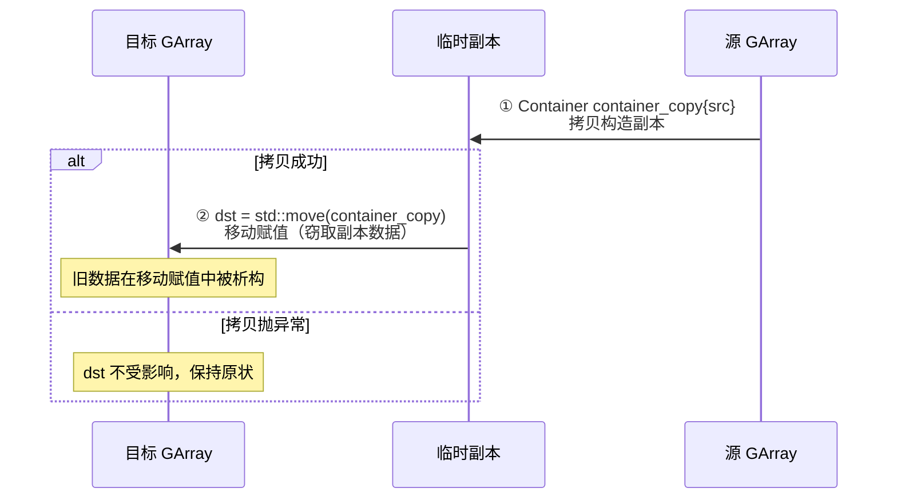
```mermaid
sequenceDiagram
    participant Dst as 目标 GArray
    participant Copy as 临时副本
    participant Src as 源 GArray

    Src->>Copy: ① Container container_copy{src}<br/>拷贝构造副本
    alt 拷贝成功
        Copy->>Dst: ② dst = std::move(container_copy)<br/>移动赋值（窃取副本数据）
        Note over Dst: 旧数据在移动赋值中被析构
    else 拷贝抛异常
        Note over Dst: dst 不受影响，保持原状
    end
```

#### `move_assign_container` — destroy-and-construct 模式

```cpp
template<typename Container>
Container &move_assign_container(Container &dst, Container &&src) noexcept(...)
{
    if (&dst == &src) return dst;       // 自移动检测
    dst.~Container();                    // 先析构目标
    if constexpr (std::is_nothrow_move_constructible_v<Container>) {
        new (&dst) Container(std::move(src));  // 移动构造到目标地址
    } else {
        try {
            new (&dst) Container(std::move(src));
        } catch (...) {
            new (&dst) Container(NoExceptConstructor());  // 失败时置为空状态
            throw;
        }
    }
    return dst;
}
```

移动赋值采用"先析构再 placement new"而非 copy-and-swap，因为移动构造不需要额外分配，直接窃取指针即可。如果移动构造意外抛异常，用 `NoExceptConstructor` 把目标恢复为空状态，避免悬空。

#### `std::move` 到底干了什么？

```cpp
GArray &operator=(GArray &&other)
{
    return move_assign_container(*this, std::move(other));
}
```

`other` 的类型已经是 `GArray&&`（右值引用），但在函数体内 **`other` 本身是左值**（C++ 规则：有名字的右值引用是左值）。

`std::move(other)` 做的事：**无条件地将 `other` 转换为右值引用**，等价于 `static_cast<GArray&&>(other)`。它本身不移动任何数据，只是一个类型转换。

为什么需要：确保 `move_assign_container` 内部的 `new (&dst) Container(std::move(src))` 调用的是移动构造而非拷贝构造。

> **`std::move` 的源码拆解**
>
> 通用定义（`<type_traits>` 中）：
> ```cpp
> template <class _Ty>
> constexpr remove_reference_t<_Ty>&& move(_Ty&& _Arg) noexcept {
>     return static_cast<remove_reference_t<_Ty>&&>(_Arg);
> }
> ```
>
> 调用 `std::move(array)`，`array` 是 `GArray<>` 左值时，推导过程：
>
> | 步骤 | 表达式 | 结果 |
> |---|---|---|
> | `_Ty` 推导 | 左值 + `_Ty&&` → `_Ty = GArray<>&` | `GArray<>&` |
> | 参数类型 | `_Ty&&` = `GArray<>& &&` → 折叠 | `GArray<>&` |
> | `remove_reference_t<_Ty>` | `remove_reference_t<GArray<>&>` | `GArray<>` |
> | 返回类型 | `remove_reference_t<_Ty>&&` = `GArray<>&&` | `GArray<>&&` |
> | 函数体 | `static_cast<GArray<>&&>(_Arg)` | 转为右值引用 |
>
> **为什么模板参数是 `GArray<>&` 而不是 `GArray<>`？** 因为 `move` 的参数是 `_Ty&&`（转发引用），C++ 有特殊推导规则：传入左值时 `_Ty` 推导为 `T&`（带引用），然后 `_Ty&&` 折叠为 `T&`。如果 `_Ty` 总是推导为 `GArray<>`，那 `_Ty&&` 就是 `GArray<>&&`，左值无法绑定到右值引用，编译失败。让 `_Ty` 推导为 `T&`，折叠后变成 `T&`，左值就能绑定了。`remove_reference_t` 的作用就是去掉这个可能多出来的 `&`，保证返回类型**总是 `T&&`**。
>
> | 传入 | `_Ty` 推导为 | `_Ty&&` 折叠为 | `remove_reference_t<_Ty>&&` |
> |---|---|---|---|
> | 左值 `array` | `GArray<>&` | `GArray<>&` | `GArray<>&&` |
> | 右值 `std::move(array)` | `GArray<>` | `GArray<>&&` | `GArray<>&&` |
>
> **"绑定"是什么意思？** 绑定 = 函数参数接收实参。调用 `f(x)` 时，参数类型和实参要"匹配得上"：
> ```cpp
> void f(int&  r);   // 左值引用参数
> void f(int&& rr);  // 右值引用参数
>
> int a = 42;
> f(a);              // a 是左值 → 绑定到 int&   ✅
> f(42);             // 42 是右值 → 绑定到 int&&  ✅
> // int&& rr = a;   // a 是左值 → 绑定到 int&&？ ❌ 编译失败！
> ```
> 规则：左值引用 `T&` 只能绑定左值，右值引用 `T&&` 只能绑定右值。
>
> **为什么左值不能绑定到右值引用？** 右值引用意味着"我可以窃取这个对象的资源"，但左值后面还要用——不能偷。`int&& rr = a;` 如果允许，后续用 `a` 时值可能已被窃取，所以编译器禁止。
>
> **为什么折叠后 `T&` 就能绑定左值了？** `_Ty = GArray<>&` 时，`_Ty&&` 折叠为 `GArray<>&`（左值引用），左值当然能绑定到左值引用。关键：折叠把"右值引用"变成了"左值引用"，参数类型变了，所以能接收左值了。
>
> **完整逻辑链**：
> ```
> 目标：std::move(array) 要能接受左值，返回右值引用
>
> 问题：参数类型如果是 T&&（右值引用），左值绑不上
>
> 解决：
>   1. _Ty 推导为 T&（带引用）→ _Ty&& 折叠为 T& → 左值能绑定了 ✅
>   2. 但返回类型 remove_reference_t<_Ty>&&：
>      - _Ty = T&  → remove_reference_t<T&> = T  → T&& ✅
>      - _Ty = T   → remove_reference_t<T>  = T  → T&& ✅
>   3. 不管哪种情况，返回类型都是 T&& ✅
>
> 一句话：_Ty 带引用是为了让参数能接收左值，remove_reference_t 是为了消除这个引用对返回类型的影响。
> ```
>
> **为什么不能直接 `static_cast<_Ty&&>`？** 因为左值情况下 `_Ty&&` 会折叠为 `T&`，cast 后还是左值引用，没有转为右值：
> ```
> _Ty = GArray<>& （左值推导）
>
> static_cast<_Ty&&>(_Arg)
> = static_cast<GArray<>&>(_Arg)        ← 折叠后是左值引用！什么都没做 ❌
>
> static_cast<remove_reference_t<_Ty>&&>(_Arg)
> = static_cast<GArray<>&&>(_Arg)       ← 先去掉 & 再加 &&，转为右值引用 ✅
> ```
> `remove_reference_t<_Ty>&&` 保证**永远是 `T&&`**，不受引用折叠影响。
>
> | | `_Ty = GArray<>` | `_Ty = GArray<>&` |
> |---|---|---|
> | `_Ty&&` | `GArray<>&&` ✅ | `GArray<>&` ❌ 折叠了 |
> | `remove_reference_t<_Ty>&&` | `GArray<>&&` ✅ | `GArray<>&&` ✅ 总是右值引用 |
>
> **`_Ty` 是右值时 `remove_reference_t` 会怎样？** 什么都不做。`remove_reference_t` 只在有 `&` 或 `&&` 时才去掉，否则原样返回：
> ```
> remove_reference_t<GArray<>>   = GArray<>    （无变化）
> remove_reference_t<GArray<>&>  = GArray<>    （去掉 &）
> remove_reference_t<GArray<>&&> = GArray<>    （去掉 &&）
> ```
> `&&` 也是引用——C++ 的引用有两种：左值引用 `&` 和右值引用 `&&`，都是"引用类型"。`remove_reference_t` 的实现有三个特化版本：
> ```cpp
> template<typename T> struct remove_reference      { using type = T; };   // 无引用 → 不变
> template<typename T> struct remove_reference<T&>  { using type = T; };   // 左值引用 → 去掉 &
> template<typename T> struct remove_reference<T&&> { using type = T; };   // 右值引用 → 去掉 &&
> ```
> `&&` 不是"两个 &"，而是一个整体符号，表示右值引用。`remove_reference_t` 的职责是去掉**任何**引用，不管左值还是右值。
>
> **右值为什么也能"引用"？** "引用"的本质是"别名"——给对象起另一个名字。右值（临时对象）也是对象，在内存中占空间，只是没有名字、寿命短暂。`&&` 做两件事：① 给临时对象起别名，延长其寿命到引用的作用域结束；② 标记"可窃取"——编译器知道没人再用这个值，允许移动语义窃取其资源。
>
> "右值引用"不是"引用本身是右值"，而是"**绑定到右值的引用**"。引用本身是左值（有名字），但它绑定的是一个右值（临时对象）。
>
> | 术语 | 含义 |
> |---|---|
> | 左值引用 `T&` | 绑定到左值的引用（别名），不可窃取 |
> | 右值引用 `T&&` | 绑定到右值的引用（别名），**可窃取** |
>
> **源码中的宏含义**：
>
> | 宏 | 展开为 | 含义 |
> |---|---|---|
> | `_EXPORT_STD` | `export` 或 空 | C++20 模块支持，构建标准库模块时加 `export` |
> | `_NODISCARD` | `[[nodiscard]]` 或 空 | 忽略返回值时编译器警告。`std::move` 返回值不用就是 bug |
> | `_MSVC_INTRINSIC` | `[[msvc::intrinsic]]` 或 空 | MSVC 专有属性，告诉编译器此函数极简，可内建实现（零指令） |
>
> `[[nodiscard]]` 示例：
> ```cpp
> std::move(array);  // 忘记用返回值！[[nodiscard]] 让编译器警告
> f(std::move(array));  // 正确：返回值被使用
> ```
>
> **`template<>` 是什么？** IDE 提示中的 `template<>` 表示"这是模板的一个具体实例化版本"。通用模板用 `template<class _Ty>`，实例化后所有 `_Ty` 被替换，`template<>` 保留以表明"这来自模板"。
>
> **为什么提示 `<utility>` 但跳转到 `<type_traits>`？** C++ 标准规定 `std::move` 属于 `<utility>`，但 `<utility>` 内部 `#include <type_traits>`，实际定义写在 `<type_traits>` 中（因为 `remove_reference_t` 定义在那里）。IDE 说 "provided by `<utility>`" 是标准规定的所属头文件，Ctrl+click 跳转到 `<type_traits>` 是实际定义的物理文件。这是标准库的内部组织方式，不是两个不同的东西。
>
> **为什么提示和跳转不一样？** IDE 悬停显示的是**实例化后的版本**（模板参数已替换），Ctrl+click 跳转到的是**通用定义**（模板参数还是 `_Ty`）。是同一个东西，不同视角。
>
> **为什么这么难理解？** 两层间接叠加：① 引用折叠（`_Ty&&` 不是右值引用，而是转发引用，`_Ty` 可推导为 `T&`）；② `remove_reference_t`（消除引用折叠的影响，保证返回 `T&&`）。

> **`std::move` 有运行时开销吗？** 零开销。`std::move` 在编译后完全消失，不生成任何机器指令。它就是一个 `static_cast`，纯粹编译期类型转换。"移动"发生在移动构造函数/移动赋值运算符内部，`std::move` 本身不移动任何数据。
>
> **`static_cast` 各种用法的运行时开销：**
>
> | `static_cast` 用途 | 运行时开销 | 原因 |
> |---|---|---|
> | `static_cast<T&&>(x)` | **零** | 纯类型别名，不生成任何指令 |
> | `static_cast<void*>(ptr)` | **零** | 纯类型别名 |
> | `static_cast<const T*>(ptr)` | **零** | 纯类型别名 |
> | `static_cast<T*>(const_ptr)` | ❌ 编译错误 | 不能用 static_cast 去 const |
> | `static_cast<Derived*>(base_ptr)` | **零** | 指针偏移编译期已知，不检查类型 |
> | `static_cast<Base*>(derived_ptr)` | **零** | 向上转换，可能指针偏移但编译期已知 |
> | `static_cast<int>(3.14f)` | **有** | 浮点→整数需要转换指令（cvttss2si 等） |
> | `static_cast<double>(42)` | **通常零** | 整数→浮点通常零开销 |
> | `static_cast<int>(enum_val)` | **零** | 枚举底层就是整数 |
> | `static_cast<bool>(ptr)` | **零** | 等价于 `ptr != nullptr` |
> | `static_cast<uint8_t>(int_val)` | **零** | 截断，编译期处理 |
> | `static_cast<Class>(value)` | **有** | 调用显式构造函数，开销=构造函数开销 |
>
> **总结**：`static_cast` 只在**数值类型转换**（浮点↔整数）和**调用构造函数**时有运行时开销，其余全部零开销。`static_cast` 不做运行时类型检查（那是 `dynamic_cast` 的事），所以向下转换不安全但零开销。

#### `std::move` vs `std::forward` — 无条件移动 vs 有条件转发

```cpp
// std::move：无条件转为右值
std::move(x)  ≡  static_cast<T&&>(x)   // 总是移动

// std::forward：有条件转发
std::forward<T>(x)                      // T 是左值引用 → 保持左值（拷贝）
                                        // T 不是引用   → 转为右值（移动）
```

**什么时候用 `std::move`，什么时候用 `std::forward`？**

| 场景 | 使用 | 原因 |
|---|---|---|
| 函数内部，不再需要某个变量 | `std::move` | 无条件移动，明确表达意图 |
| 转发引用参数（`T&&` 模板） | `std::forward<T>` | 保留调用方传入的值类别 |
| 按值接收的 sink 参数 | `std::move` | 所有权已转移，总是移动 |

**为什么 `from_garray` 按值传递而 `from_container` 用转发引用？**

```cpp
// from_garray：按值接收（sink 参数）
GListPtr GList::from_garray(GArray<> array) {
    // array 的所有权已转移到这里，总是移动
    auto *sharable_data = new ImplicitSharedValue<GArray<>>(std::move(array));
}

// from_container：转发引用（可能左值也可能右值）
template<typename ContainerT>
GListPtr GList::from_container(ContainerT &&container) {
    // 不确定调用方传的是左值还是右值，必须转发
    auto *sharable_data = new ImplicitSharedValue<std::decay_t<ContainerT>>(
        std::forward<ContainerT>(container));
}
```

| 调用方式 | `ContainerT` 推导为 | `ContainerT &&` 折叠为 | `std::forward` 行为 |
|---|---|---|---|
| `from_container(vec)` | `Vector<int>&` | `Vector<int>&` | 保持左值 → 拷贝构造 |
| `from_container(std::move(vec))` | `Vector<int>` | `Vector<int>&&` | 转为右值 → 移动构造 |

**为什么分两种？** 因为**信息量不同**：
- `std::move`：你**确定**不再需要这个对象 → 无条件移动
- `std::forward`：你**不确定**调用方是否还需要 → 保留原始意图

```cpp
// 场景 A：你自己的局部变量，用完即弃 → 你有全部信息 → std::move
GArray<> array = ...;
process(std::move(array));  // 我说了算，就是要移动

// 场景 B：模板转发，不知道调用方传的是左值还是右值 → 信息不够 → std::forward
template<typename T>
void wrapper(T &&x) {
    inner(std::forward<T>(x));  // 交给调用方决定
}

wrapper(vec);              // 调用方传左值 → forward 保持左值 → inner 拷贝
wrapper(std::move(vec));   // 调用方传右值 → forward 转为右值 → inner 移动
```

如果 `std::forward` 无条件移动，那传左值时也会移动——调用方还指望用这个对象呢，就被你偷走了。所以必须有条件转发。

**按值传递作为 sink 参数的优势**：调用方决定是否 `std::move`——移动则零拷贝，不移动则深拷贝（也能工作）。比 `const T&`（无法移动）和 `T&&`（拒绝左值）更灵活。

#### 为什么 `from_garray` 里要 `std::move` 两次？

```cpp
// 调用方
GList::from_garray(std::move(array));   // ← 第一次 std::move

// 被调用方
GListPtr GList::from_garray(GArray<> array)  // array 是按值接收的参数
{
    auto *sharable_data = new ImplicitSharedValue<GArray<>>(std::move(array));  // ← 第二次 std::move
}
```

**关键规则：有名字的变量就是左值**，不管它是怎么构造来的。

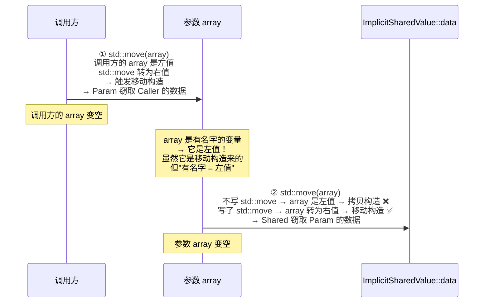
```mermaid
sequenceDiagram
    participant Caller as 调用方
    participant Param as 参数 array
    participant Shared as ImplicitSharedValue::data

    Caller->>Param: ① std::move(array)<br/>调用方的 array 是左值<br/>std::move 转为右值<br/>→ 触发移动构造<br/>→ Param 窃取 Caller 的数据
    Note over Caller: 调用方的 array 变空

    Note over Param: array 是有名字的变量<br/>→ 它是左值！<br/>虽然它是移动构造来的<br/>但"有名字 = 左值"

    Param->>Shared: ② std::move(array)<br/>不写 std::move → array 是左值 → 拷贝构造 ❌<br/>写了 std::move → array 转为右值 → 移动构造 ✅<br/>→ Shared 窃取 Param 的数据
    Note over Param: 参数 array 变空
```

两次移动，每次都是 O(1)（只转移 3 个指针/整数），没有深拷贝：

| 步骤 | 操作 | 实际发生 | 开销 |
|---|---|---|---|
| ① `std::move(array)` | 调用方 → 参数 | `GArray(GArray&&)` 移动构造 | O(1)，转移指针 |
| ② `std::move(array)` | 参数 → `ImplicitSharedValue::data` | `GArray(GArray&&)` 移动构造 | O(1)，转移指针 |

如果**漏掉第二次 `std::move`**：

```cpp
new ImplicitSharedValue<GArray<>>(array);  // array 是左值
// → 匹配 ImplicitSharedValue(const GArray<>& args) → 拷贝构造
// → 深拷贝整个缓冲区 → O(n) ❌
```

**总结**：每次把对象传给下一层，都需要 `std::move` 重新声明"我要移动"，因为进入新作用域后变量又变成了左值。`std::move` 不会"传递"——它只影响当前这一次调用。

#### 实战案例：`from_garray` 中的移动链

```cpp
GListPtr GList::from_garray(GArray<> array)          // ① 调用方 std::move → 移动构造到 array
{
    auto *sharable_data = new ImplicitSharedValue<GArray<>>(std::move(array));
    // ② std::move(array) → 触发 ImplicitSharedValue 的变参构造
    //    → data(std::forward<GArray<>&&>(array))
    //    → GArray(GArray&&) 移动构造 data 成员
    //    → 窃取 array 的 data_/size_/type_，array 变空

    ArrayData array_data;
    array_data.data = sharable_data->data.data();
    array_data.sharing_info = ImplicitSharingPtr<>(sharable_data);
    return GList::create(
        sharable_data->data.type(), std::move(array_data), sharable_data->data.size());
    // ③ std::move(array_data) → DataVariant 按值接收 → 移动构造
}
```

**为什么每个环节都 `std::move`？** 因为每个中间对象都是"最后一次使用"。不 `std::move` 就会触发深拷贝，而源对象马上就销毁了——白白浪费。

---

## 5. 隐式类型转换：GArray → GSpan / GMutableSpan

```cpp
operator GSpan() const
{
    BLI_assert(size_ == 0 || type_ != nullptr);
    return GSpan(type_, data_, size_);
}

operator GMutableSpan()
{
    BLI_assert(size_ == 0 || type_ != nullptr);
    return GMutableSpan(type_, data_, size_);
}
```

这是 `GArray` 最核心的接口设计——**不继承，而是隐式转换**。

### 转换链

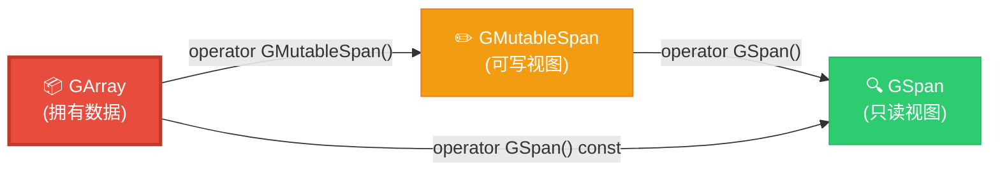
```mermaid
graph LR
    GA["📦 GArray<br/>(拥有数据)"] -->|"operator GMutableSpan()"| GMS["✏️ GMutableSpan<br/>(可写视图)"]
    GMS -->|"operator GSpan()"| GS["🔍 GSpan<br/>(只读视图)"]
    GA -->|"operator GSpan() const"| GS

    style GA fill:#e74c3c,color:#fff,stroke:#c0392b,stroke-width:3px
    style GMS fill:#f39c12,color:#fff,stroke:#e67e22
    style GS fill:#2ecc71,color:#fff,stroke:#27ae60
```

### 为什么不继承？

1. **切片问题**：如果 `GArray` 继承 `GMutableSpan`，将 `GArray` 传给接受 `GSpan` 的函数时会发生对象切片，丢失 `GArray` 的析构逻辑
2. **所有权语义**：`GArray` 拥有数据，`GSpan` 不拥有。继承会混淆"拥有 vs 借用"的语义
3. **const 正确性**：`const GArray` 应该能转为 `GSpan`（只读），`GArray`（非 const）应该能转为 `GMutableSpan`（可写）。继承无法优雅地实现这一点

### 实际效果

```cpp
GArray<> array(CPPType::get<float>(), 10);

// 以下全部合法，无需显式转换：
GSpan span = array;                    // ✅ 隐式转 GSpan
GMutableSpan mutable_span = array;     // ✅ 隐式转 GMutableSpan

// 直接传给接受 span 的函数：
fn::FieldEvaluator evaluator(context, domain_size);
evaluator.add_with_destination(field_, array.as_mutable_span());  // ✅
```

---

## 6. reinitialize：原地重置的精巧实现

```cpp
void reinitialize(const int64_t new_size)
{
    BLI_assert(new_size >= 0);
    int64_t old_size = size_;

    type_->destruct_n(data_, size_);   // 1. 先析构所有旧元素
    size_ = 0;                          // 2. 临时置零（异常安全）

    if (new_size <= old_size) {
        // 新大小 ≤ 旧大小：复用已有缓冲区
        type_->default_construct_n(data_, new_size);  // 3a. 在旧内存上默认构造
    }
    else {
        // 新大小 > 旧大小：需要重新分配
        void *new_data = this->allocate(new_size);
        try {
            type_->default_construct_n(new_data, new_size);  // 3b. 在新内存上默认构造
        }
        catch (...) {
            this->deallocate(new_data);  // 异常时释放新内存
            throw;
        }
        if (this->data_) {
            this->deallocate(data_);     // 4. 释放旧缓冲区
        }
        data_ = new_data;
    }

    size_ = new_size;                    // 5. 最后更新大小
}
```

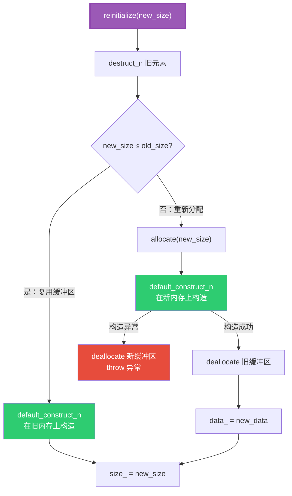
```mermaid
flowchart TD
    A["reinitialize(new_size)"] --> B["destruct_n 旧元素"]
    B --> C{"new_size ≤ old_size?"}
    C -->|"是：复用缓冲区"| D["default_construct_n<br/>在旧内存上构造"]
    C -->|"否：重新分配"| E["allocate(new_size)"]
    E --> F["default_construct_n<br/>在新内存上构造"]
    F -->|"构造成功"| G["deallocate 旧缓冲区"]
    F -->|"构造异常"| H["deallocate 新缓冲区<br/>throw 异常"]
    G --> I["data_ = new_data"]
    D --> J["size_ = new_size"]
    I --> J

    style A fill:#9b59b6,color:#fff,stroke:#8e44ad,stroke-width:3px
    style D fill:#2ecc71,color:#fff
    style F fill:#2ecc71,color:#fff
    style H fill:#e74c3c,color:#fff
```

**设计亮点**：
- `size_ = 0` 临时置零是异常安全措施——如果 `default_construct_n` 抛异常，对象处于"空但合法"状态
- 新大小更小时**不释放内存**，复用已有缓冲区，减少分配次数
- 新大小更大时使用 try-catch 保证异常安全

---

## 7. 内存管理：allocate / deallocate

```cpp
void *allocate(int64_t size)
{
    const int64_t item_size = type_->size;        // 单个元素的字节大小
    const int64_t alignment = type_->alignment;   // 对齐要求
    return allocator_.allocate(size_t(size) * item_size, alignment, AT);
}

void deallocate(void *ptr)
{
    allocator_.deallocate(ptr);
}
```

### 分配字节数计算

```
总字节数 = 元素数量 × type_->size
```

例如：`GArray<>(CPPType::get<float3>(), 100)` 分配 `100 × 12 = 1200` 字节。

### AT 参数

`AT` 是 Blender 定义的宏，展开为 `__FILE__ ":" STRINGIFY(__LINE__)`，用于内存调试时追踪分配来源。`GuardedAllocator` 会在内部记录此信息。

---

## 8. 运算符与访问方式

### operator[] — 按"元素索引"访问

```cpp
void *operator[](int64_t index)
{
    BLI_assert(index < size_);
    return POINTER_OFFSET(data_, type_->size * index);
}
```

**关键**：返回的是 `void*`（指向第 `index` 个元素的指针），而不是元素值本身。因为编译期不知道类型，无法返回具体值。

**POINTER_OFFSET 宏**：等价于 `(char*)ptr + byte_offset`，按字节偏移。

```cpp
#define POINTER_OFFSET(v, ofs) \
  (reinterpret_cast<std::remove_reference_t<decltype(v)>>((char *)(v) + (ofs)))
```

> **为什么需要 `remove_reference`？** 防御性编程。`decltype` 有两条规则：
> 1. `decltype(变量名)` → 返回变量的**声明类型**（`decltype(data_)` → `void*`）
> 2. `decltype(表达式)` → 如果表达式是左值，返回 `T&`
>
> 对 `decltype(data_)` 走规则 1，返回 `void*`，不需要 `remove_reference`。但宏是通用工具，`v` 可能是其他表达式（如 `*ptr`），此时 `decltype(*ptr)` 走规则 2 返回 `int&`。`remove_reference` 确保无论哪种情况都得到指针类型而非引用。
>
> **成员变量 `void *data_` 没有引用，为什么之前说 `decltype(data_)` → `void*&`？** 之前的说法有误。`decltype(data_)` 对成员变量返回声明类型 `void*`，不是 `void*&`。`remove_reference` 是为宏的通用性而加的防御措施。

> **`decltype` 是什么？** `decltype` = **decl**ared **type**（声明的类型），C++11 关键字，在编译期获取表达式的类型。
> ```cpp
> int x = 42;
> decltype(x)       → int        // 规则1：变量名 → 声明类型
> decltype((x))     → int&       // 规则2：左值表达式 → 加引用
> decltype(x + 1.0) → double     // 规则2：右值表达式 → 结果类型
> decltype(&x)      → int*       // 规则2：取地址 → 指针
>
> void *data_ = nullptr;
> decltype(data_)   → void*      // 规则1：变量名 → 声明类型
> decltype((data_)) → void*&     // 规则2：加括号变成表达式 → 左值引用
>
> // 常见用途：尾置返回类型
> template<typename A, typename B>
> auto add(A a, B b) -> decltype(a + b) { return a + b; }
> ```

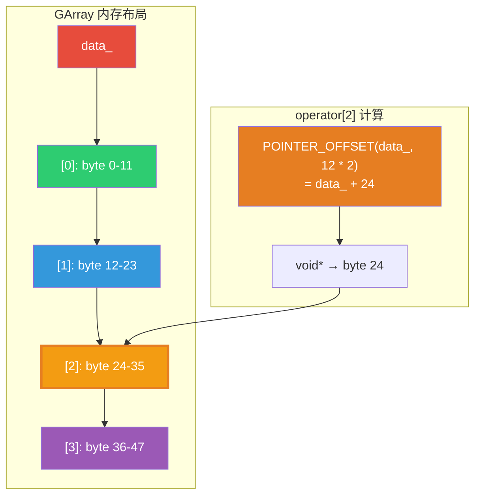
```mermaid
graph TD
    subgraph "GArray<float3> 内存布局"
        D["data_"] --> E0["[0]: byte 0-11"]
        E0 --> E1["[1]: byte 12-23"]
        E1 --> E2["[2]: byte 24-35"]
        E2 --> E3["[3]: byte 36-47"]
    end

    subgraph "operator[2] 计算"
        CALC["POINTER_OFFSET(data_, 12 * 2)<br/>= data_ + 24"] --> PTR["void* → byte 24"]
    end

    PTR --> E2

    style D fill:#e74c3c,color:#fff
    style E0 fill:#2ecc71,color:#fff
    style E1 fill:#3498db,color:#fff
    style E2 fill:#f39c12,color:#fff,stroke:#e67e22,stroke-width:3px
    style E3 fill:#9b59b6,color:#fff
    style CALC fill:#e67e22,color:#fff
```

### 典型访问模式

```cpp
GArray<> array(CPPType::get<float>(), 5);

// 方式1：通过 typed() 转为具体类型的 Span
Span<float> typed_span = array.as_span().typed<float>();
float val = typed_span[0];  // ✅ 类型安全

// 方式2：通过 CPPType 操作 void*
const CPPType &type = array.type();
void *elem_ptr = array[0];           // void* 指向第一个元素
type.copy_assign(elem_ptr, &src);    // 通过 CPPType 拷贝赋值
```

---

## 9. 奇怪/非基础语法解析

### 9.1 `BLI_NO_UNIQUE_ADDRESS`

```cpp
BLI_NO_UNIQUE_ADDRESS Allocator allocator_;
```

**含义**：等价于 C++20 的 `[[no_unique_address]]` 属性。

**作用**：告诉编译器这个成员**不需要独占地址空间**。如果 `Allocator` 是空类（无数据成员），编译器可以将其优化为**零大小**，不占用 `GArray` 对象的任何字节。

**实际效果**：
- `GuardedAllocator` 是空类 → `sizeof(GArray<GuardedAllocator>)` 不因 `allocator_` 而增大
- 如果不用此属性，空类成员仍占 1 字节（C++ 规定任何对象大小 ≥ 1）

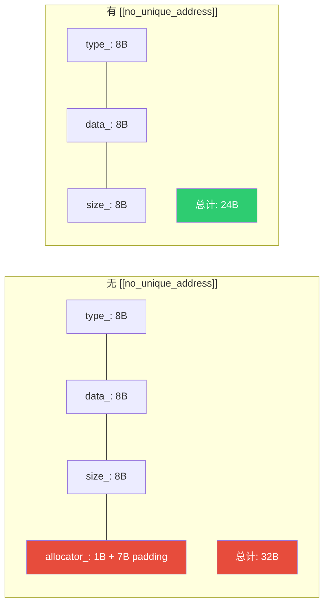
```mermaid
graph LR
    subgraph "无 [[no_unique_address]]"
        M1["type_: 8B"] --- M2["data_: 8B"] --- M3["size_: 8B"] --- M4["allocator_: 1B + 7B padding"]
        T1["总计: 32B"]
    end
    subgraph "有 [[no_unique_address]]"
        N1["type_: 8B"] --- N2["data_: 8B"] --- N3["size_: 8B"]
        T2["总计: 24B"]
    end

    style M4 fill:#e74c3c,color:#fff
    style T1 fill:#e74c3c,color:#fff
    style T2 fill:#2ecc71,color:#fff
```

### 9.2 `NoExceptConstructor` 参数

```cpp
GArray(NoExceptConstructor, Allocator allocator = {}) noexcept : GArray(allocator) {}
```

**含义**：`NoExceptConstructor` 是一个空标签类型，用于标记"我要一个 noexcept 的默认构造"。

**用途**：某些容器（如 `Vector`）需要其元素类型有 noexcept 默认构造函数，以便在扩容时使用 `memcpy` 而非移动构造。`NoExceptConstructor` 参数让 `GArray` 满足这一要求。

### 9.3 `NoInitialization` 标签

```cpp
GArray(const CPPType &type, const int64_t size, NoInitialization /*not_init_tag*/, ...)
```

**含义**：`NoInitialization` 是一个空标签类型，表示"不要初始化内存"。

**为什么需要**：区分"分配并默认构造"和"仅分配"两种语义。C++ 不支持函数重载基于"是否初始化"，所以用标签类型区分。

**类比**：`std::vector::reserve` vs `std::vector::resize`——前者只分配，后者分配并初始化。

### 9.4 `copy_assign_container` / `move_assign_container`

```cpp
GArray &operator=(const GArray &other)
{
    return copy_assign_container(*this, other);
}

GArray &operator=(GArray &&other)
{
    return move_assign_container(*this, std::move(other));
}
```

定义在 `BLI_memory_utils.hh` 中的通用赋值辅助函数，实现了**异常安全**的赋值语义。详见 [4.8 赋值运算符](#48-赋值运算符--构造-vs-赋值的关键区别)。

### 9.5 `POINTER_OFFSET` 宏

```cpp
return POINTER_OFFSET(data_, type_->size * index);
```

展开为类似 `(void*)((char*)(data_) + (type_->size * index))`。将 `void*` 先转为 `char*`（字节级指针），偏移指定字节数，再转回 `void*`。

### 9.6 模板默认参数 `Allocator = GuardedAllocator`

```cpp
template<typename Allocator = GuardedAllocator>
class GArray { ... };
```

日常使用中你几乎总是写 `GArray<>`（带尖括号但不含参数），此时 `Allocator` 默认为 `GuardedAllocator`——Blender 的内存守护分配器，在调试模式下会检测内存泄漏和越界访问。

---

## 10. 几何节点中的 7 大使用模式

### 模式总览

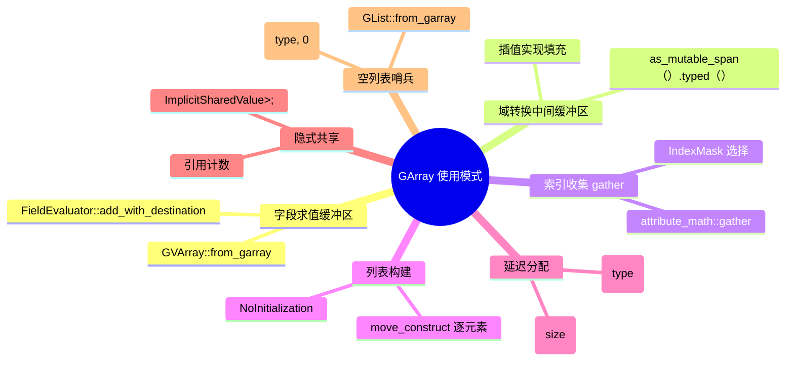
```mermaid
mindmap
  root((GArray 使用模式))
    字段求值缓冲区
      FieldEvaluator::add_with_destination
      GVArray::from_garray
    域转换中间缓冲区
      as_mutable_span（）.typed<T>（）
      插值实现填充
    索引收集 gather
      attribute_math::gather
      IndexMask 选择
    列表构建
      NoInitialization
      move_construct 逐元素
    延迟分配
      GArray(type)
      reinitialize(size)
    隐式共享
      ImplicitSharedValue<GArray<>>;
      引用计数
    空列表哨兵
      GArray(type, 0)
      GList::from_garray
```

---

### 模式 1：字段求值缓冲区 🎯

**最常见模式**：将 `GArray` 作为 `FieldEvaluator` 的输出目标，求值后转为 `GVArray` 返回。

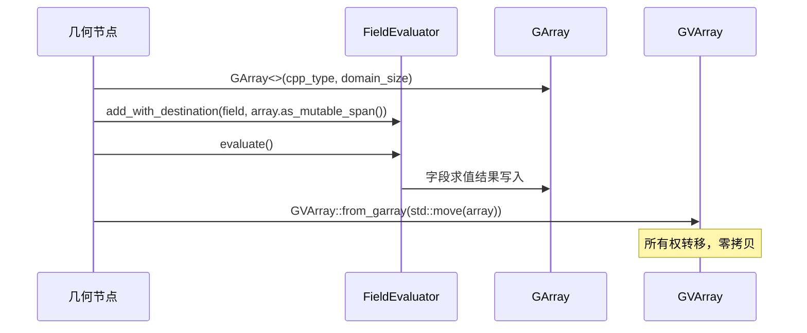
```mermaid
sequenceDiagram
    participant Node as 几何节点
    participant FE as FieldEvaluator
    participant GA as GArray
    participant GVA as GVArray

    Node->>GA: GArray<>(cpp_type, domain_size)
    Node->>FE: add_with_destination(field, array.as_mutable_span())
    Node->>FE: evaluate()
    FE->>GA: 字段求值结果写入
    Node->>GVA: GVArray::from_garray(std::move(array))
    Note over GVA: 所有权转移，零拷贝
```

**真实代码**（模糊属性节点 [node_geo_blur_attribute.cc](file:///e:/blender-git/blender/source/blender/nodes/geometry/nodes/node_geo_blur_attribute.cc)）：

```cpp
const int64_t domain_size = context.attributes()->domain_size(context.domain());

GArray<> buffer_a(*type_, domain_size);  // ① 分配缓冲区

FieldEvaluator evaluator(context, domain_size);
evaluator.add_with_destination(value_field_, buffer_a.as_mutable_span());  // ② 求值目标
evaluator.add(weight_field_);
evaluator.evaluate();  // ③ 求值，结果写入 buffer_a

// ④ 转为 GVArray 返回（移动语义，零拷贝）
return GVArray::from_garray(std::move(buffer_a));
```

---

### 模式 2：域转换中间缓冲区 🔄

**场景**：将属性从一个域（如 Corner）转换到另一个域（如 Point），需要中间缓冲区存储插值结果。

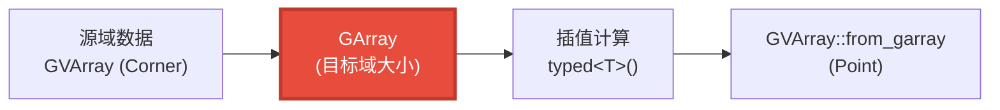
```mermaid
graph LR
    A["源域数据<br/>GVArray (Corner)"] --> B["GArray<br/>(目标域大小)"]
    B --> C["插值计算<br/>typed&lt;T&gt;()"]
    C --> D["GVArray::from_garray<br/>(Point)"]

    style B fill:#e74c3c,color:#fff,stroke:#c0392b,stroke-width:3px
```

**真实代码**（[mesh_attributes.cc](file:///e:/blender-git/blender/source/blender/blenkernel/intern/mesh_attributes.cc) Corner→Point 转换）：

```cpp
static GVArray adapt_mesh_domain_corner_to_point(const Mesh &mesh, const GVArray &varray)
{
    GArray<> values(varray.type(), mesh.verts_num);  // ① 用目标域大小分配
    attribute_math::to_static_type(varray.type(), [&]<typename T>() {
        if constexpr (!std::is_void_v<attribute_math::DefaultMixer<T>>) {
            adapt_mesh_domain_corner_to_point_impl<T>(
                mesh, varray.typed<T>(),
                values.as_mutable_span().typed<T>());  // ② 类型化后填充
        }
    });
    return GVArray::from_garray(std::move(values));  // ③ 转为 GVArray
}
```

**关键手法**：`values.as_mutable_span().typed<T>()` — 先转 `GMutableSpan`，再 `typed<T>()` 获取 `MutableSpan<T>`，在编译期类型安全的接口中操作。

---

### 模式 3：索引收集 (gather) 📋

**场景**：按 `IndexMask` 从源数据中选取部分元素到 `GArray`。

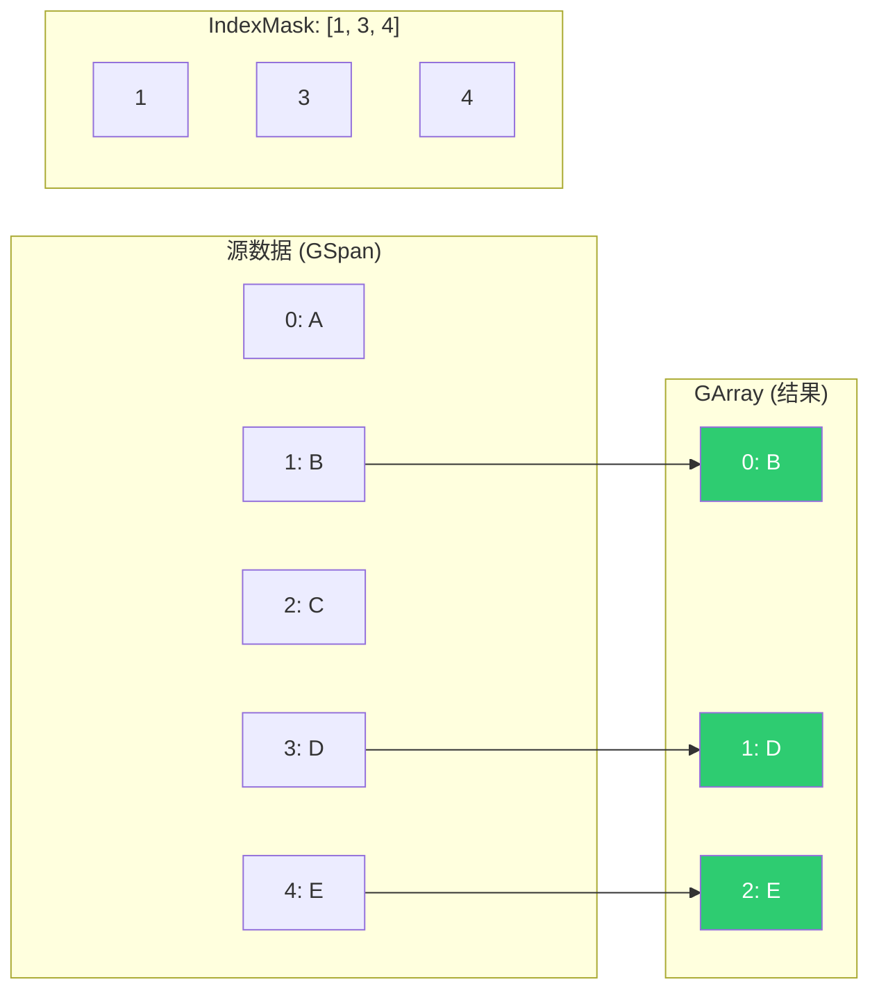
```mermaid
graph LR
    subgraph "源数据 (GSpan)"
        S0["0: A"]
        S1["1: B"]
        S2["2: C"]
        S3["3: D"]
        S4["4: E"]
    end
    subgraph "IndexMask: [1, 3, 4]"
        M1["1"]
        M2["3"]
        M3["4"]
    end
    subgraph "GArray (结果)"
        R0["0: B"]
        R1["1: D"]
        R2["2: E"]
    end

    S1 --> R0
    S3 --> R1
    S4 --> R2

    style R0 fill:#2ecc71,color:#fff
    style R1 fill:#2ecc71,color:#fff
    style R2 fill:#2ecc71,color:#fff
```

**真实代码**（列表过滤节点 [node_geo_filter_list.cc](file:///e:/blender-git/blender/source/blender/nodes/geometry/nodes/node_geo_filter_list.cc)）：

```cpp
GArray<> dst_data(list_type, mask.size());  // ① 按掩码大小分配
array_utils::gather(                        // ② 按 IndexMask 收集
    GSpan(list_type, src_data.data, list->size()),
    mask, dst_data);
return GList::from_garray(std::move(dst_data));  // ③ 转为列表
```

---

### 模式 4：列表构建（NoInitialization + move_construct）⚡

**场景**：性能敏感路径，避免多余的默认初始化。

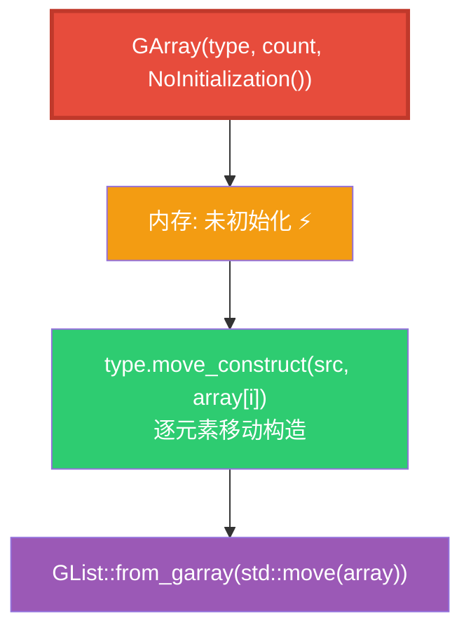
```mermaid
flowchart TD
    A["GArray(type, count, NoInitialization())"] --> B["内存: 未初始化 ⚡"]
    B --> C["type.move_construct(src, array[i])<br/>逐元素移动构造"]
    C --> D["GList::from_garray(std::move(array))"]

    style A fill:#e74c3c,color:#fff,stroke:#c0392b,stroke-width:3px
    style B fill:#f39c12,color:#fff
    style C fill:#2ecc71,color:#fff
    style D fill:#9b59b6,color:#fff
```

**真实代码**（闭包转列表节点 [node_geo_closure_to_list.cc](file:///e:/blender-git/blender/source/blender/nodes/geometry/nodes/node_geo_closure_to_list.cc)）：

```cpp
GArray<> array(type, count, NoInitialization());  // ① 不初始化！
threading::parallel_for(IndexRange(count), 128, [&](const IndexRange range) {
    for (const int list_i : range) {
        void *closure_result = const_cast<void *>(values[list_i].get_single_ptr_raw());
        type.move_construct(closure_result, array[list_i]);  // ② 移动构造到目标位置
    }
});
params.set_output(identifier, GList::from_garray(std::move(array)));  // ③ 输出
```

**为什么不用默认构造？** 因为 `default_construct_n` 对非平凡类型会调用默认构造函数，然后 `move_construct` 又会覆盖——这是**双重初始化**，浪费性能。

---

### 模式 5：延迟分配 ⏳

**场景**：先创建空 `GArray`（仅设类型），后续按需 `reinitialize`。

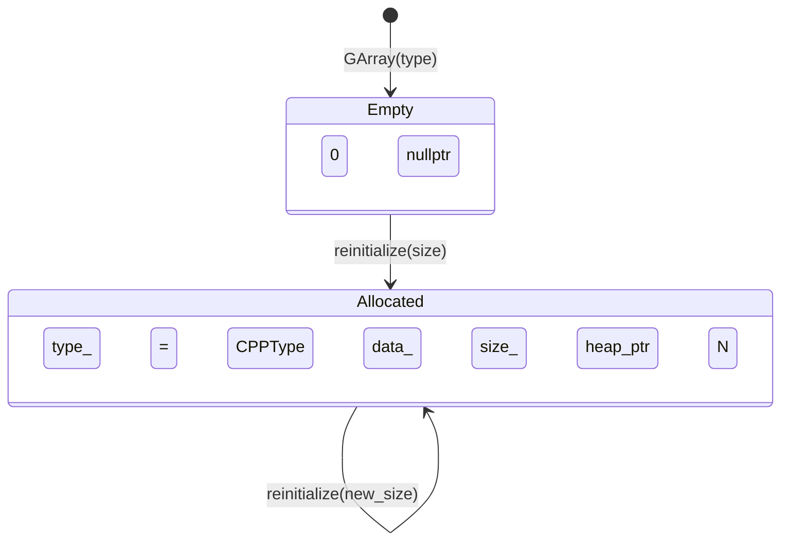
```mermaid
stateDiagram-v2
    [*] --> Empty: GArray(type)
    Empty --> Allocated: reinitialize(size)
    Allocated --> Allocated: reinitialize(new_size)

    state Empty {
        type_ = CPPType
        data_ = nullptr
        size_ = 0
    }
    state Allocated {
        type_ = CPPType
        data_ = heap_ptr
        size_ = N
    }
```

**真实代码**（曲线采样节点 [node_geo_curve_sample.cc](file:///e:/blender-git/blender/source/blender/nodes/geometry/nodes/node_geo_curve_sample.cc)）：

```cpp
GArray<> src_original_values(source_data_->type());   // 空，仅设类型
GArray<> src_evaluated_values(source_data_->type());   // 空，仅设类型

auto sample_curve = [&](const int curve_i, const IndexMask &mask) {
    // ... 后续按需 reinitialize
    src_original_values.reinitialize(evaluated_points.size());
    // ... 填充数据
};
```

---

### 模式 6：隐式共享 🔗

**场景**：多个消费者共享同一块 `GArray` 数据，通过引用计数避免拷贝。

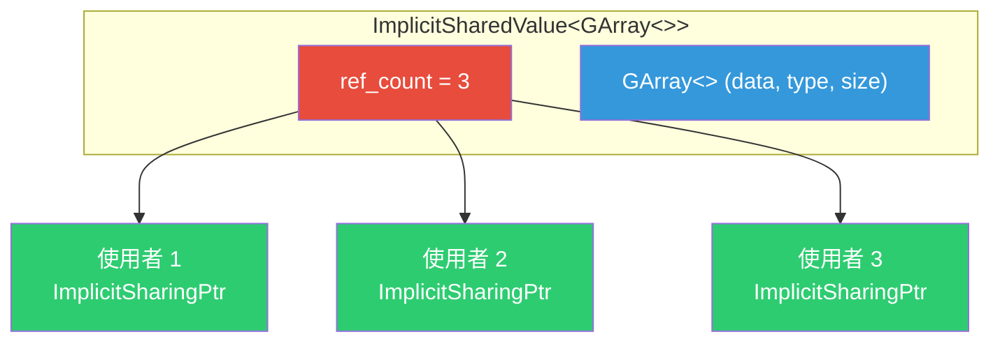
```mermaid
graph TB
    subgraph "ImplicitSharedValue&lt;GArray&lt;&gt;&gt;"
        RC["ref_count = 3"]
        GA["GArray&lt;&gt; (data, type, size)"]
    end

    RC --> U1["使用者 1<br/>ImplicitSharingPtr"]
    RC --> U2["使用者 2<br/>ImplicitSharingPtr"]
    RC --> U3["使用者 3<br/>ImplicitSharingPtr"]

    style RC fill:#e74c3c,color:#fff
    style GA fill:#3498db,color:#fff
    style U1 fill:#2ecc71,color:#fff
    style U2 fill:#2ecc71,color:#fff
    style U3 fill:#2ecc71,color:#fff
```

**真实代码**（[geometry_component_edit_data.cc](file:///e:/blender-git/blender/source/blender/blenkernel/intern/geometry_component_edit_data.cc)）：

```cpp
static ImplicitSharingPtrAndData save_shared_attribute(const GAttributeReader &attribute)
{
    if (attribute.sharing_info && attribute.varray.is_span()) {
        // 已有共享信息，直接复用
        const void *data = attribute.varray.get_internal_span().data();
        attribute.sharing_info->add_user();
        return {ImplicitSharingPtr(attribute.sharing_info), data};
    }
    // 否则，将数据物化到新的共享 GArray
    auto *data = new ImplicitSharedValue<GArray<>>(attribute.varray.type(), attribute.varray.size());
    attribute.varray.materialize(data->data.data());
    return {ImplicitSharingPtr<>(data), data->data.data()};
}
```

---

### 模式 7：空列表哨兵 🚫

**场景**：表示一个空列表，类型已知但无元素。

```cpp
// 空列表 = 类型已知 + 0 个元素
params.set_output("Inverted"_ustr, GList::from_garray(GArray<>(list->cpp_type(), 0)));
```

---

## 11. GArray vs Array 对比

```mermaid
graph TB
    subgraph "Array&lt;T&gt; — 编译期类型"
        A1["✅ 类型安全"]
        A2["✅ 小对象优化 (inline buffer)"]
        A3["✅ 异常安全构造"]
        A4["✅ 返回 T& 引用"]
        A5["✅ 编译器可内联优化"]
        A6["❌ 类型必须编译期已知"]
    end
    subgraph "GArray — 运行时类型"
        G1["✅ 类型运行时可知"]
        G2["✅ 可存储任意类型数据"]
        G3["✅ 适合动态分发"]
        G4["❌ 返回 void* 指针"]
        G5["❌ 无小对象优化"]
        G6["❌ 每次操作通过函数指针间接调用"]
    end

    style A1 fill:#2ecc71,color:#fff
    style A2 fill:#2ecc71,color:#fff
    style A3 fill:#2ecc71,color:#fff
    style A4 fill:#2ecc71,color:#fff
    style A5 fill:#2ecc71,color:#fff
    style A6 fill:#e74c3c,color:#fff
    style G1 fill:#2ecc71,color:#fff
    style G2 fill:#2ecc71,color:#fff
    style G3 fill:#2ecc71,color:#fff
    style G4 fill:#e74c3c,color:#fff
    style G5 fill:#e74c3c,color:#fff
    style G6 fill:#e74c3c,color:#fff
```

| 特性 | `Array<T>` | `GArray<>` |
|------|-----------|------------|
| 类型确定时机 | 编译期 | 运行时 |
| 数据指针类型 | `T*` | `void*` |
| 元素访问返回 | `T&` | `void*` |
| 小对象优化 | ✅ 有（inline buffer） | ❌ 无 |
| 异常安全 | ✅ 完整 | ⚠️ 部分 |
| 内存开销 | 24B + inline buffer | 24B（空分配器时） |
| 操作方式 | 直接调用 | 通过 `CPPType` 函数指针 |
| 适用场景 | 类型已知的算法内部 | 跨类型传递、动态分发 |

---

## 12. 设计哲学总结

```mermaid
graph LR
    CORE["🎯 核心哲学<br/>类型擦除 + 所有权清晰"]

    CORE --> P1["📦 所有权唯一<br/>GArray 拥有数据<br/>GSpan/GMutableSpan 只是视图"]
    CORE --> P2["🔄 隐式转换优于继承<br/>operator GSpan/GMutableSpan<br/>避免切片和语义混淆"]
    CORE --> P3["⚡ 性能意识<br/>NoInitialization 避免双重初始化<br/>BLI_NO_UNIQUE_ADDRESS 消除空类开销"]
    CORE --> P4["🛡️ 异常安全<br/>reinitialize 的 try-catch<br/>size_ 临时置零"]
    CORE --> P5["🔗 零拷贝传递<br/>std::move 转移所有权<br/>GVArray::from_garray"]

    style CORE fill:#9b59b6,color:#fff,stroke:#8e44ad,stroke-width:4px
    style P1 fill:#e74c3c,color:#fff
    style P2 fill:#3498db,color:#fff
    style P3 fill:#f39c12,color:#fff
    style P4 fill:#2ecc71,color:#fff
    style P5 fill:#1abc9c,color:#fff
```

### 一句话总结

> **GArray 是几何节点类型擦除体系的"数据容器"角色**——它在编译期不知道元素类型，但通过 `CPPType` 在运行时安全地构造、析构、拷贝和移动元素；它拥有数据所有权，又能零成本地转换为只读/可写视图；它是字段求值、域转换、属性重排等操作中不可或缺的中间缓冲区。

---

*文档生成日期：2026-06-03 | 源码版本：Blender main 分支*
