# GArray 深度解析

> 源文件：[BLI_generic_array.hh](file:///e:/blender-git/blender/source/blender/blenlib/BLI_generic_array.hh)

---

## 目录

1. [核心定位：为什么需要 GArray？](#1-核心定位为什么需要-garray)
2. [类型体系全景图](#2-类型体系全景图)
3. [类成员详解](#3-类成员详解)
4. [构造函数逐一剖析](#4-构造函数逐一剖析)
5. [隐式类型转换：GArray → GSpan / GMutableSpan](#5-隐式类型转换garray--gspan--gmutablespan)
6. [reinitialize：原地重置的精巧实现](#6-reinitialize原地重置的精巧实现)
7. [内存管理：allocate / deallocate](#7-内存管理allocate--deallocate)
8. [运算符与访问方式](#8-运算符与访问方式)
9. [奇怪/非基础语法解析](#9-奇怪非基础语法解析)
10. [几何节点中的 7 大使用模式](#10-几何节点中的-7-大使用模式)
11. [GArray vs Array 对比](#11-garray-vs-array-对比)
12. [设计哲学总结](#12-设计哲学总结)

---

## 1. 核心定位：为什么需要 GArray？

### 原始注释翻译

> *This is a generic counterpart to #Array, used when the type is not known at runtime.*
>
> 这是 `Array` 的**泛型对应物**，用于**类型在运行时才可知**的场景。

> *`GArray` should generally only be used for passing data around in dynamic contexts.*
>
> `GArray` 通常只应在**动态上下文中传递数据**时使用。

> *It does not support a few things that #Array supports:*
> *- Small object optimization / inline buffer.*
> *- Exception safety and various more specific constructors.*
>
> 它不支持 `Array` 的一些特性：
> - **小对象优化 / 内联缓冲区**（即不会在对象内部预留小数组空间）
> - **异常安全**和各种更特殊的构造函数

### 核心问题

在几何节点中，属性的类型（`float`、`int`、`float3`、`bool`、`ColorGeometry4f`……）在**编译期不可知**——同一个节点可能处理任意类型的属性。`Array<T>` 要求 `T` 在编译期确定，无法满足这一需求。

`GArray` 通过**类型擦除**（Type Erasure）解决此问题：将 `T` 替换为运行时的 `CPPType*` 指针，数据存储为 `void*`，从而实现"编译期不知道类型，运行时安全操作"。

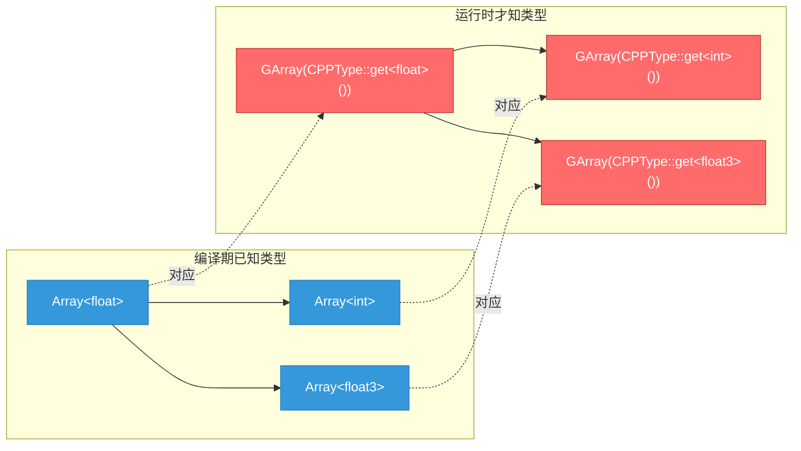

---

## 2. 类型体系全景图

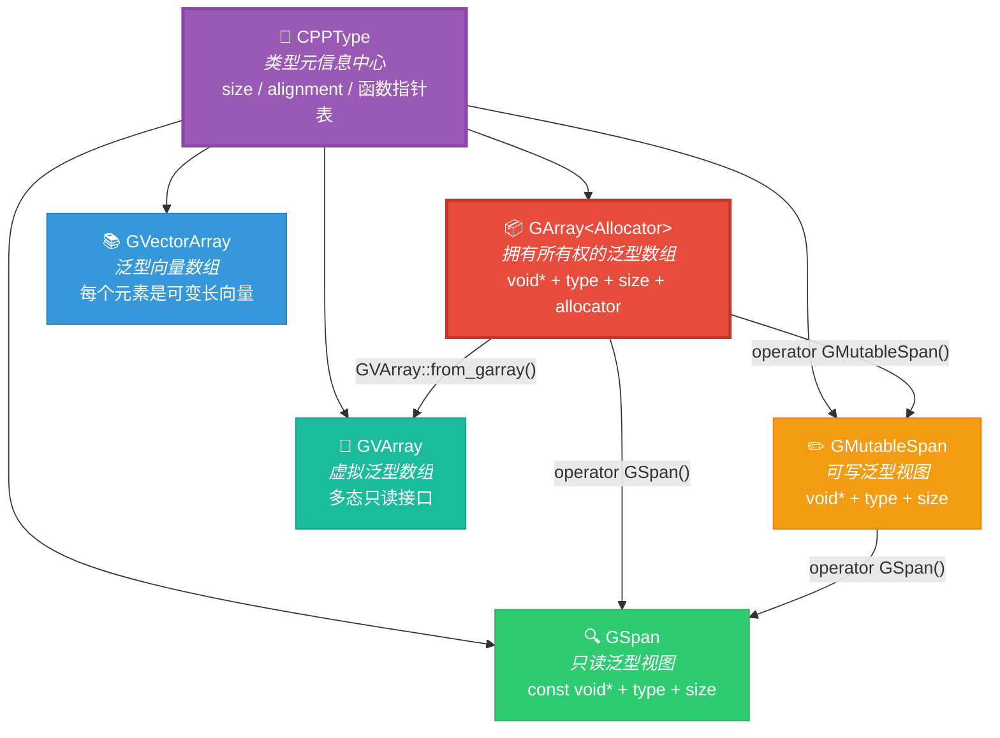

### 所有权语义对比

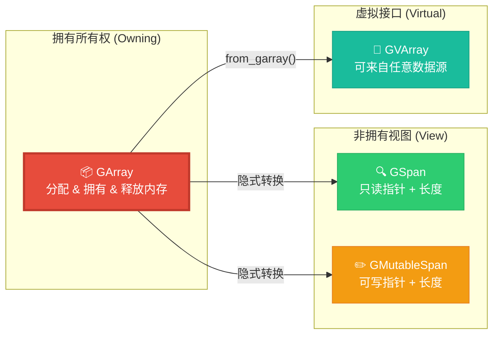

---

## 3. 类成员详解

```cpp
template<typename Allocator = GuardedAllocator>
class GArray {
 protected:
  const CPPType *type_ = nullptr;   // 运行时类型描述符
  void *data_ = nullptr;            // 堆分配的原始数据缓冲区
  int64_t size_ = 0;                // 元素数量（不是字节数！）
  BLI_NO_UNIQUE_ADDRESS Allocator allocator_;  // 内存分配器

  // ...
};
```

### 成员解读表

| 成员 | 类型 | 含义 | 注意事项 |
|------|------|------|---------|
| `type_` | `const CPPType*` | 指向类型元信息的指针 | 默认构造后为 `nullptr`，使用前**必须**赋值 |
| `data_` | `void*` | 数据缓冲区起始地址 | `void*` 意味着"不知道元素类型"，需配合 `type_` 使用 |
| `size_` | `int64_t` | 元素个数 | ⚠️ **不是**字节数！字节数 = `size_ * type_->size` |
| `allocator_` | `Allocator` | 内存分配策略 | 默认 `GuardedAllocator`（带内存守护的 MEM_* 封装） |

### 内存布局可视化

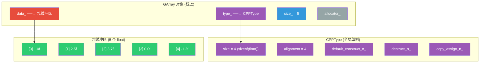

---

## 4. 构造函数逐一剖析

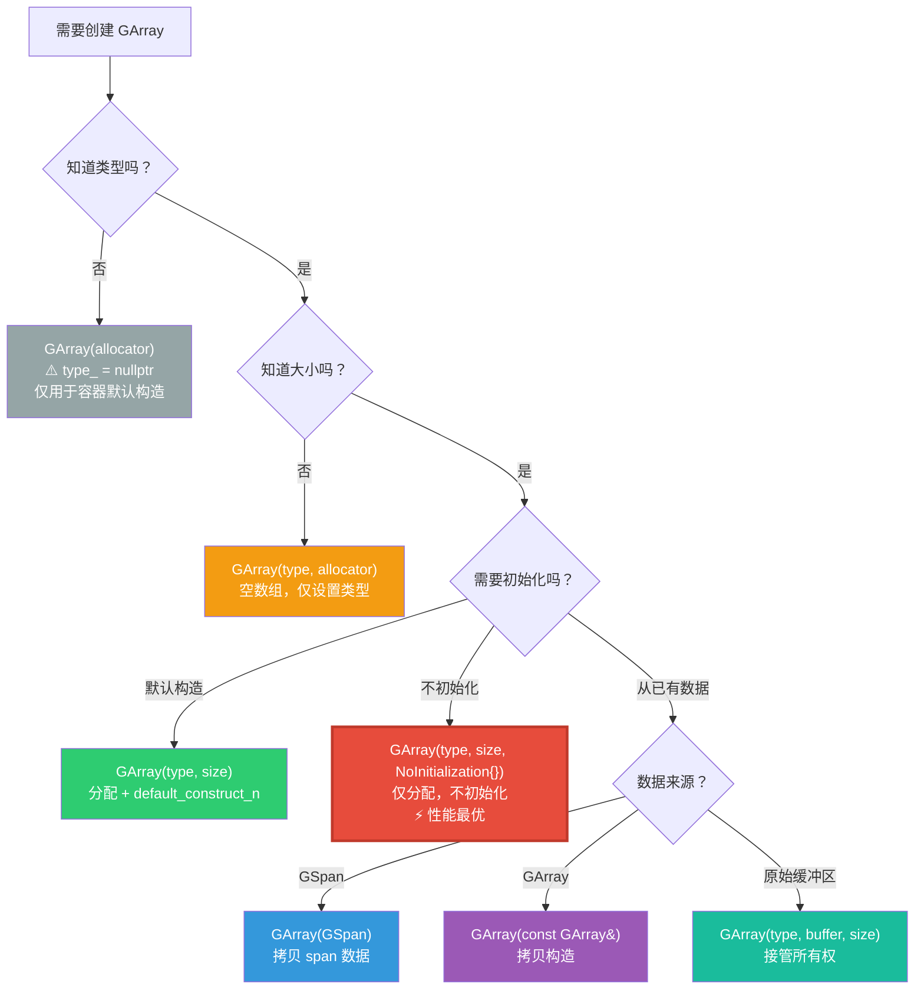

### 4.1 默认构造 — `GArray(Allocator allocator = {})`

```cpp
GArray(Allocator allocator = {}) noexcept : allocator_(allocator) {}
```

> *The default constructor creates an empty array, the only situation in which the type is allowed to be null.*
> *This default constructor exists so `GArray` can be used in containers.*
>
> 默认构造创建空数组，这是**唯一允许 type 为 null 的情况**。
> 存在此构造函数是为了让 `GArray` 能放在容器（如 `Vector<GArray<>>`）中。

**注意**：构造后 `type_`、`data_`、`size_` 全部为零/null，**必须**在使用前设置类型。

### 4.2 带类型和大小的构造 — `GArray(const CPPType&, int64_t size)`

```cpp
GArray(const CPPType &type, int64_t size, Allocator allocator = {})
    : GArray(type, size, NoInitialization{}, allocator)
{
    type_->default_construct_n(data_, size_);  // 默认构造每个元素
}
```

**委托构造链**：先调用 `NoInitialization` 版本分配原始内存，再调用 `CPPType::default_construct_n` 初始化。

- 对于**平凡类型**（`float`、`int` 等）：`default_construct_n` **什么也不做**（内存内容不确定）
- 对于**非平凡类型**（如 `std::string`）：会调用默认构造函数

### 4.3 不初始化构造 — `GArray(const CPPType&, int64_t, NoInitialization)`

```cpp
GArray(const CPPType &type, const int64_t size,
       NoInitialization /*not_init_tag*/, Allocator allocator = {})
    : GArray(type, allocator)
{
    BLI_assert(size >= 0);
    size_ = size;
    data_ = this->allocate(size_);  // 仅分配内存，不初始化
}
```

> ⚡ **性能关键路径**：当你打算立即覆盖所有元素时，用 `NoInitialization{}` 避免多余的默认构造开销。

### 4.4 接管缓冲区 — `GArray(const CPPType&, void*, int64_t)`

```cpp
GArray(const CPPType &type, void *buffer, int64_t size, Allocator allocator = {})
    : GArray(type, allocator)
{
    BLI_assert(size >= 0);
    BLI_assert(buffer != nullptr || size == 0);
    BLI_assert(type_->pointer_has_valid_alignment(buffer));
    data_ = buffer;
    size_ = size;
}
```

> *Take ownership of a buffer with a provided size. The buffer should be allocated with the same allocator provided to the constructor.*
>
> 接管一个已有缓冲区的所有权。该缓冲区必须使用**相同的分配器**分配。

**关键断言**：`type_->pointer_has_valid_alignment(buffer)` — 检查缓冲区地址是否满足类型对齐要求。

### 4.5 从 GSpan 拷贝 — `GArray(const GSpan)`

```cpp
GArray(const GSpan span, Allocator allocator = {})
    : GArray(span.type(), span.size(), allocator)
{
    type_->copy_assign_n(span.data(), data_, size_);
}
```

> *Create an array by copying values from a generic span.*
>
> 从泛型 span 拷贝值来创建数组。

注意使用 `copy_assign_n` 而非 `copy_construct_n`，因为 `data_` 已经通过委托构造被默认初始化过了。

### 4.6 拷贝构造 / 移动构造

```cpp
// 拷贝构造：委托给 GSpan 版本
GArray(const GArray &other) : GArray(other.as_span(), other.allocator()) {}

// 移动构造：窃取指针，清空源对象
GArray(GArray &&other)
    : type_(other.type_), data_(other.data_), size_(other.size_), allocator_(other.allocator_)
{
    other.data_ = nullptr;
    other.size_ = 0;
}
```

移动构造的精妙之处：**不分配任何内存**，仅转移三个指针/值，然后将源对象的 `data_` 置 `nullptr`、`size_` 置 0，确保源对象析构时不会释放已转移的内存。

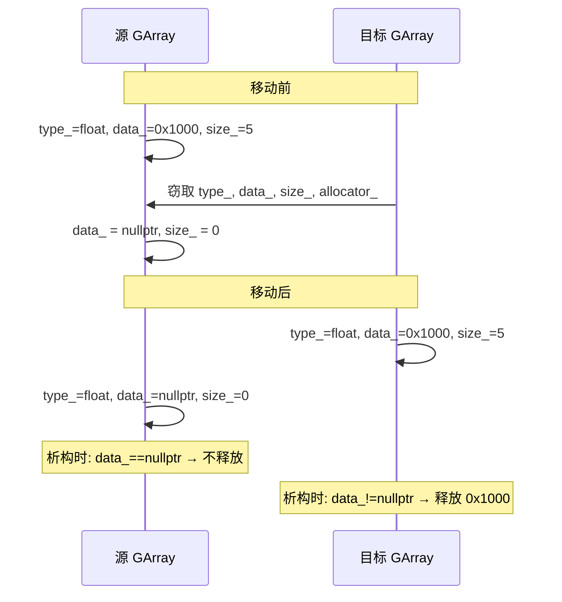

---

## 5. 隐式类型转换：GArray → GSpan / GMutableSpan

```cpp
operator GSpan() const
{
    BLI_assert(size_ == 0 || type_ != nullptr);
    return GSpan(type_, data_, size_);
}

operator GMutableSpan()
{
    BLI_assert(size_ == 0 || type_ != nullptr);
    return GMutableSpan(type_, data_, size_);
}
```

这是 `GArray` 最核心的接口设计——**不继承，而是隐式转换**。

### 转换链

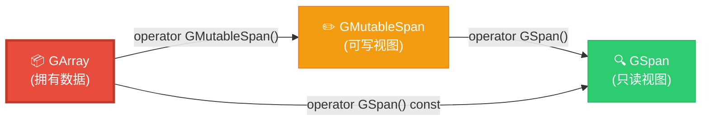

### 为什么不继承？

1. **切片问题**：如果 `GArray` 继承 `GMutableSpan`，将 `GArray` 传给接受 `GSpan` 的函数时会发生对象切片，丢失 `GArray` 的析构逻辑
2. **所有权语义**：`GArray` 拥有数据，`GSpan` 不拥有。继承会混淆"拥有 vs 借用"的语义
3. **const 正确性**：`const GArray` 应该能转为 `GSpan`（只读），`GArray`（非 const）应该能转为 `GMutableSpan`（可写）。继承无法优雅地实现这一点

### 实际效果

```cpp
GArray<> array(CPPType::get<float>(), 10);

// 以下全部合法，无需显式转换：
GSpan span = array;                    // ✅ 隐式转 GSpan
GMutableSpan mutable_span = array;     // ✅ 隐式转 GMutableSpan

// 直接传给接受 span 的函数：
fn::FieldEvaluator evaluator(context, domain_size);
evaluator.add_with_destination(field_, array.as_mutable_span());  // ✅
```

---

## 6. reinitialize：原地重置的精巧实现

```cpp
void reinitialize(const int64_t new_size)
{
    BLI_assert(new_size >= 0);
    int64_t old_size = size_;

    type_->destruct_n(data_, size_);   // 1. 先析构所有旧元素
    size_ = 0;                          // 2. 临时置零（异常安全）

    if (new_size <= old_size) {
        // 新大小 ≤ 旧大小：复用已有缓冲区
        type_->default_construct_n(data_, new_size);  // 3a. 在旧内存上默认构造
    }
    else {
        // 新大小 > 旧大小：需要重新分配
        void *new_data = this->allocate(new_size);
        try {
            type_->default_construct_n(new_data, new_size);  // 3b. 在新内存上默认构造
        }
        catch (...) {
            this->deallocate(new_data);  // 异常时释放新内存
            throw;
        }
        if (this->data_) {
            this->deallocate(data_);     // 4. 释放旧缓冲区
        }
        data_ = new_data;
    }

    size_ = new_size;                    // 5. 最后更新大小
}
```

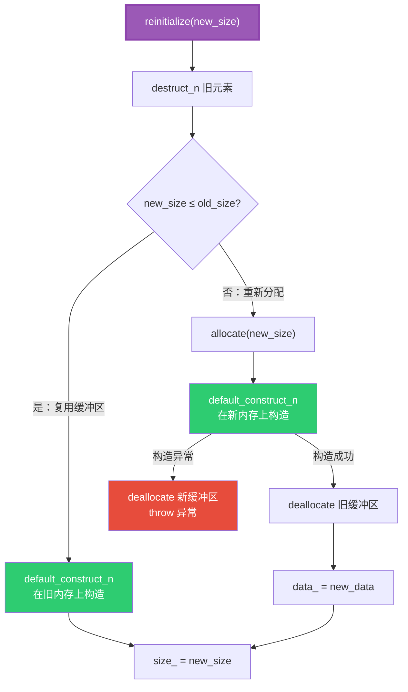

**设计亮点**：
- `size_ = 0` 临时置零是异常安全措施——如果 `default_construct_n` 抛异常，对象处于"空但合法"状态
- 新大小更小时**不释放内存**，复用已有缓冲区，减少分配次数
- 新大小更大时使用 try-catch 保证异常安全

---

## 7. 内存管理：allocate / deallocate

```cpp
void *allocate(int64_t size)
{
    const int64_t item_size = type_->size;        // 单个元素的字节大小
    const int64_t alignment = type_->alignment;   // 对齐要求
    return allocator_.allocate(size_t(size) * item_size, alignment, AT);
}

void deallocate(void *ptr)
{
    allocator_.deallocate(ptr);
}
```

### 分配字节数计算

```
总字节数 = 元素数量 × type_->size
```

例如：`GArray<>(CPPType::get<float3>(), 100)` 分配 `100 × 12 = 1200` 字节。

### AT 参数

`AT` 是 Blender 定义的宏，展开为 `__FILE__ ":" STRINGIFY(__LINE__)`，用于内存调试时追踪分配来源。`GuardedAllocator` 会在内部记录此信息。

---

## 8. 运算符与访问方式

### operator[] — 按"元素索引"访问

```cpp
void *operator[](int64_t index)
{
    BLI_assert(index < size_);
    return POINTER_OFFSET(data_, type_->size * index);
}
```

**关键**：返回的是 `void*`（指向第 `index` 个元素的指针），而不是元素值本身。因为编译期不知道类型，无法返回具体值。

**POINTER_OFFSET 宏**：等价于 `(char*)ptr + byte_offset`，按字节偏移。

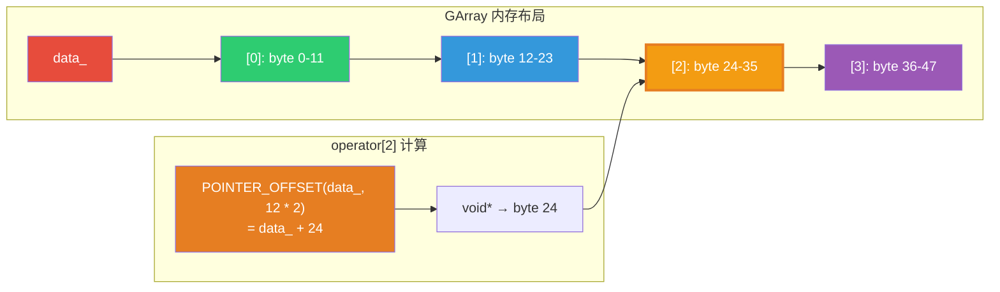

### 典型访问模式

```cpp
GArray<> array(CPPType::get<float>(), 5);

// 方式1：通过 typed() 转为具体类型的 Span
Span<float> typed_span = array.as_span().typed<float>();
float val = typed_span[0];  // ✅ 类型安全

// 方式2：通过 CPPType 操作 void*
const CPPType &type = array.type();
void *elem_ptr = array[0];           // void* 指向第一个元素
type.copy_assign(elem_ptr, &src);    // 通过 CPPType 拷贝赋值
```

---

## 9. 奇怪/非基础语法解析

### 9.1 `BLI_NO_UNIQUE_ADDRESS`

```cpp
BLI_NO_UNIQUE_ADDRESS Allocator allocator_;
```

**含义**：等价于 C++20 的 `[[no_unique_address]]` 属性。

**作用**：告诉编译器这个成员**不需要独占地址空间**。如果 `Allocator` 是空类（无数据成员），编译器可以将其优化为**零大小**，不占用 `GArray` 对象的任何字节。

**实际效果**：
- `GuardedAllocator` 是空类 → `sizeof(GArray<GuardedAllocator>)` 不因 `allocator_` 而增大
- 如果不用此属性，空类成员仍占 1 字节（C++ 规定任何对象大小 ≥ 1）

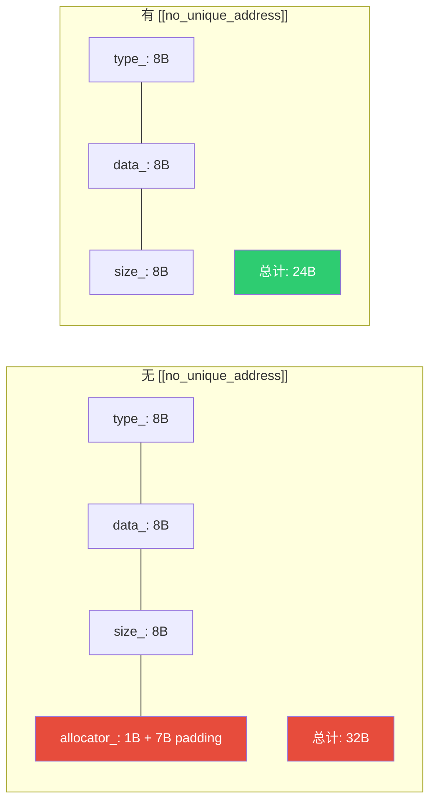

### 9.2 `NoExceptConstructor` 参数

```cpp
GArray(NoExceptConstructor, Allocator allocator = {}) noexcept : GArray(allocator) {}
```

**含义**：`NoExceptConstructor` 是一个空标签类型，用于标记"我要一个 noexcept 的默认构造"。

**用途**：某些容器（如 `Vector`）需要其元素类型有 noexcept 默认构造函数，以便在扩容时使用 `memcpy` 而非移动构造。`NoExceptConstructor` 参数让 `GArray` 满足这一要求。

### 9.3 `NoInitialization` 标签

```cpp
GArray(const CPPType &type, const int64_t size, NoInitialization /*not_init_tag*/, ...)
```

**含义**：`NoInitialization` 是一个空标签类型，表示"不要初始化内存"。

**为什么需要**：区分"分配并默认构造"和"仅分配"两种语义。C++ 不支持函数重载基于"是否初始化"，所以用标签类型区分。

**类比**：`std::vector::reserve` vs `std::vector::resize`——前者只分配，后者分配并初始化。

### 9.4 `copy_assign_container` / `move_assign_container`

```cpp
GArray &operator=(const GArray &other)
{
    return copy_assign_container(*this, other);
}

GArray &operator=(GArray &&other)
{
    return move_assign_container(*this, std::move(other));
}
```

这是 Blender blenlib 的通用赋值模式，定义在 `BLI_utility_mixins.hh` 中。这些辅助函数实现了**自赋值检测**和**先构造后交换**的异常安全赋值。

### 9.5 `POINTER_OFFSET` 宏

```cpp
return POINTER_OFFSET(data_, type_->size * index);
```

展开为类似 `(void*)((char*)(data_) + (type_->size * index))`。将 `void*` 先转为 `char*`（字节级指针），偏移指定字节数，再转回 `void*`。

### 9.6 模板默认参数 `Allocator = GuardedAllocator`

```cpp
template<typename Allocator = GuardedAllocator>
class GArray { ... };
```

日常使用中你几乎总是写 `GArray<>`（带尖括号但不含参数），此时 `Allocator` 默认为 `GuardedAllocator`——Blender 的内存守护分配器，在调试模式下会检测内存泄漏和越界访问。

---

## 10. 几何节点中的 7 大使用模式

### 模式总览

```mermaid
mindmap
  root((GArray 使用模式))
    字段求值缓冲区
      FieldEvaluator::add_with_destination
      GVArray::from_garray
    域转换中间缓冲区
      as_mutable_span().typed&lt;T&gt;()
      插值实现填充
    索引收集 gather
      attribute_math::gather
      IndexMask 选择
    列表构建
      NoInitialization
      move_construct 逐元素
    延迟分配
      GArray(type) 空
      reinitialize(size)
    隐式共享
      ImplicitSharedValue&lt;GArray&lt;&gt;&gt;
      引用计数
    空列表哨兵
      GArray(type, 0)
      GList::from_garray
```

---

### 模式 1：字段求值缓冲区 🎯

**最常见模式**：将 `GArray` 作为 `FieldEvaluator` 的输出目标，求值后转为 `GVArray` 返回。

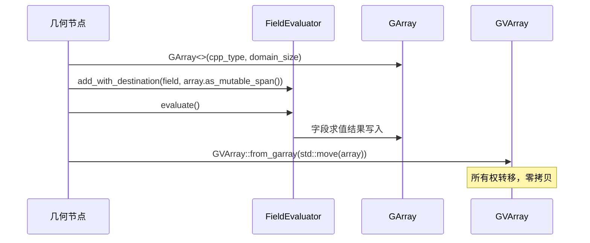

**真实代码**（模糊属性节点 [node_geo_blur_attribute.cc](file:///e:/blender-git/blender/source/blender/nodes/geometry/nodes/node_geo_blur_attribute.cc)）：

```cpp
const int64_t domain_size = context.attributes()->domain_size(context.domain());

GArray<> buffer_a(*type_, domain_size);  // ① 分配缓冲区

FieldEvaluator evaluator(context, domain_size);
evaluator.add_with_destination(value_field_, buffer_a.as_mutable_span());  // ② 求值目标
evaluator.add(weight_field_);
evaluator.evaluate();  // ③ 求值，结果写入 buffer_a

// ④ 转为 GVArray 返回（移动语义，零拷贝）
return GVArray::from_garray(std::move(buffer_a));
```

---

### 模式 2：域转换中间缓冲区 🔄

**场景**：将属性从一个域（如 Corner）转换到另一个域（如 Point），需要中间缓冲区存储插值结果。


**真实代码**（[mesh_attributes.cc](file:///e:/blender-git/blender/source/blender/blenkernel/intern/mesh_attributes.cc) Corner→Point 转换）：

```cpp
static GVArray adapt_mesh_domain_corner_to_point(const Mesh &mesh, const GVArray &varray)
{
    GArray<> values(varray.type(), mesh.verts_num);  // ① 用目标域大小分配
    attribute_math::to_static_type(varray.type(), [&]<typename T>() {
        if constexpr (!std::is_void_v<attribute_math::DefaultMixer<T>>) {
            adapt_mesh_domain_corner_to_point_impl<T>(
                mesh, varray.typed<T>(),
                values.as_mutable_span().typed<T>());  // ② 类型化后填充
        }
    });
    return GVArray::from_garray(std::move(values));  // ③ 转为 GVArray
}
```

**关键手法**：`values.as_mutable_span().typed<T>()` — 先转 `GMutableSpan`，再 `typed<T>()` 获取 `MutableSpan<T>`，在编译期类型安全的接口中操作。

---

### 模式 3：索引收集 (gather) 📋

**场景**：按 `IndexMask` 从源数据中选取部分元素到 `GArray`。

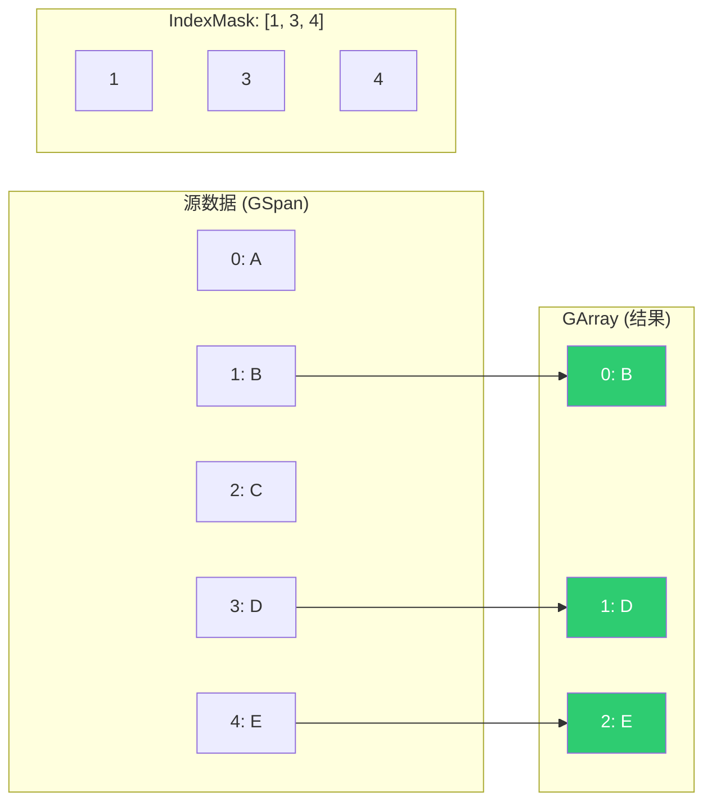

**真实代码**（列表过滤节点 [node_geo_filter_list.cc](file:///e:/blender-git/blender/source/blender/nodes/geometry/nodes/node_geo_filter_list.cc)）：

```cpp
GArray<> dst_data(list_type, mask.size());  // ① 按掩码大小分配
array_utils::gather(                        // ② 按 IndexMask 收集
    GSpan(list_type, src_data.data, list->size()),
    mask, dst_data);
return GList::from_garray(std::move(dst_data));  // ③ 转为列表
```

---

### 模式 4：列表构建（NoInitialization + move_construct）⚡

**场景**：性能敏感路径，避免多余的默认初始化。

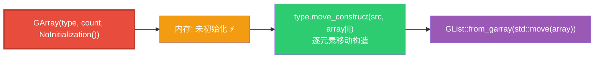

**真实代码**（闭包转列表节点 [node_geo_closure_to_list.cc](file:///e:/blender-git/blender/source/blender/nodes/geometry/nodes/node_geo_closure_to_list.cc)）：

```cpp
GArray<> array(type, count, NoInitialization());  // ① 不初始化！
threading::parallel_for(IndexRange(count), 128, [&](const IndexRange range) {
    for (const int list_i : range) {
        void *closure_result = const_cast<void *>(values[list_i].get_single_ptr_raw());
        type.move_construct(closure_result, array[list_i]);  // ② 移动构造到目标位置
    }
});
params.set_output(identifier, GList::from_garray(std::move(array)));  // ③ 输出
```

**为什么不用默认构造？** 因为 `default_construct_n` 对非平凡类型会调用默认构造函数，然后 `move_construct` 又会覆盖——这是**双重初始化**，浪费性能。

---

### 模式 5：延迟分配 ⏳

**场景**：先创建空 `GArray`（仅设类型），后续按需 `reinitialize`。

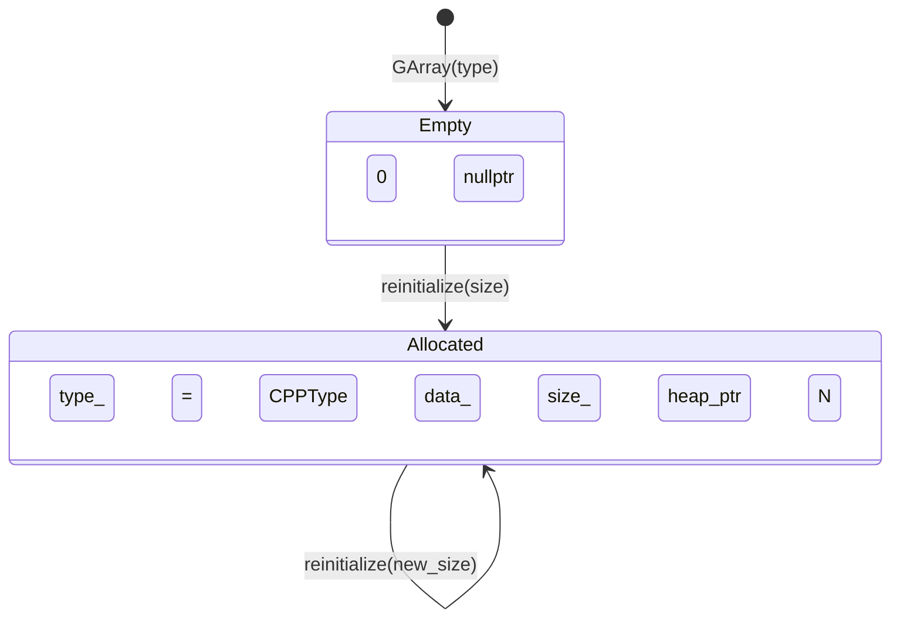

**真实代码**（曲线采样节点 [node_geo_curve_sample.cc](file:///e:/blender-git/blender/source/blender/nodes/geometry/nodes/node_geo_curve_sample.cc)）：

```cpp
GArray<> src_original_values(source_data_->type());   // 空，仅设类型
GArray<> src_evaluated_values(source_data_->type());   // 空，仅设类型

auto sample_curve = [&](const int curve_i, const IndexMask &mask) {
    // ... 后续按需 reinitialize
    src_original_values.reinitialize(evaluated_points.size());
    // ... 填充数据
};
```

---

### 模式 6：隐式共享 🔗

**场景**：多个消费者共享同一块 `GArray` 数据，通过引用计数避免拷贝。

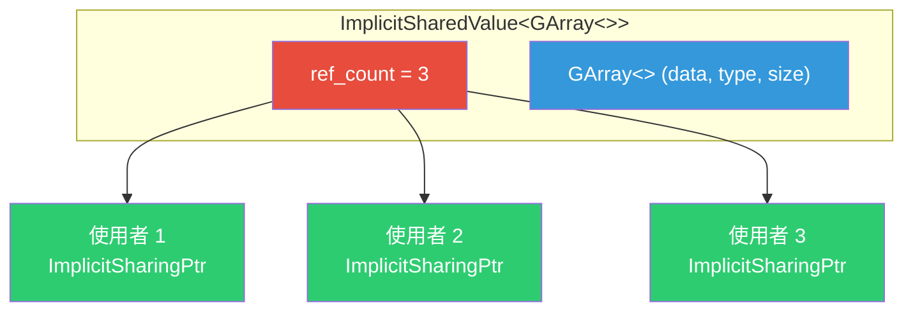

**真实代码**（[geometry_component_edit_data.cc](file:///e:/blender-git/blender/source/blender/blenkernel/intern/geometry_component_edit_data.cc)）：

```cpp
static ImplicitSharingPtrAndData save_shared_attribute(const GAttributeReader &attribute)
{
    if (attribute.sharing_info && attribute.varray.is_span()) {
        // 已有共享信息，直接复用
        const void *data = attribute.varray.get_internal_span().data();
        attribute.sharing_info->add_user();
        return {ImplicitSharingPtr(attribute.sharing_info), data};
    }
    // 否则，将数据物化到新的共享 GArray
    auto *data = new ImplicitSharedValue<GArray<>>(attribute.varray.type(), attribute.varray.size());
    attribute.varray.materialize(data->data.data());
    return {ImplicitSharingPtr<>(data), data->data.data()};
}
```

---

### 模式 7：空列表哨兵 🚫

**场景**：表示一个空列表，类型已知但无元素。

```cpp
// 空列表 = 类型已知 + 0 个元素
params.set_output("Inverted"_ustr, GList::from_garray(GArray<>(list->cpp_type(), 0)));
```

---

## 11. GArray vs Array 对比

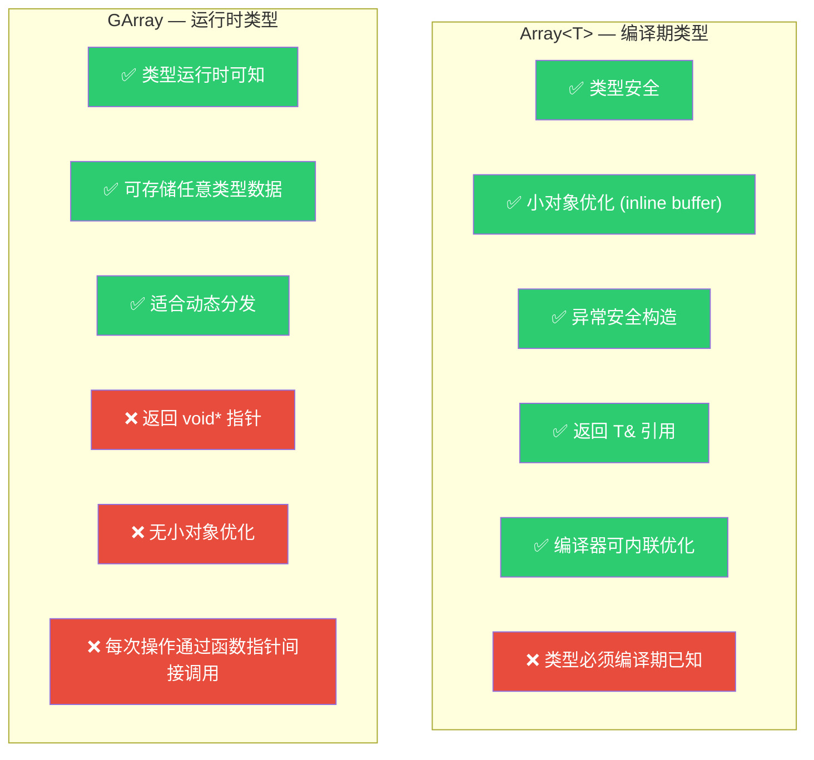

| 特性 | `Array<T>` | `GArray<>` |
|------|-----------|------------|
| 类型确定时机 | 编译期 | 运行时 |
| 数据指针类型 | `T*` | `void*` |
| 元素访问返回 | `T&` | `void*` |
| 小对象优化 | ✅ 有（inline buffer） | ❌ 无 |
| 异常安全 | ✅ 完整 | ⚠️ 部分 |
| 内存开销 | 24B + inline buffer | 24B（空分配器时） |
| 操作方式 | 直接调用 | 通过 `CPPType` 函数指针 |
| 适用场景 | 类型已知的算法内部 | 跨类型传递、动态分发 |

---

## 12. 设计哲学总结

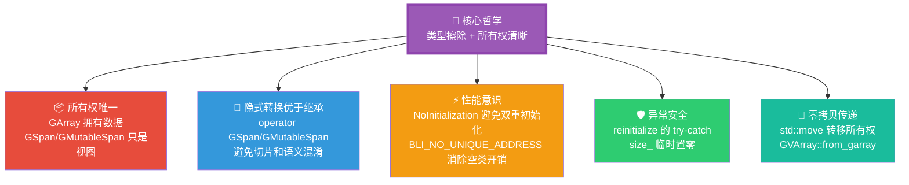

### 一句话总结

> **GArray 是几何节点类型擦除体系的"数据容器"角色**——它在编译期不知道元素类型，但通过 `CPPType` 在运行时安全地构造、析构、拷贝和移动元素；它拥有数据所有权，又能零成本地转换为只读/可写视图；它是字段求值、域转换、属性重排等操作中不可或缺的中间缓冲区。

---

*文档生成日期：2026-06-03 | 源码版本：Blender main 分支*
