# AlignedBuffer 与 TypedBuffer 深度解析

> 源文件：[BLI_memory_utils.hh](file:///e:/blender-git/blender/source/blender/blenlib/BLI_memory_utils.hh)

---

## 目录

- [AlignedBuffer 与 TypedBuffer 深度解析](#alignedbuffer-与-typedbuffer-深度解析)
  - [目录](#目录)
  - [1. 它们解决什么问题？](#1-它们解决什么问题)
    - [1.1 核心问题：未初始化的预留内存](#11-核心问题未初始化的预留内存)
    - [1.2 为什么不能用数组？](#12-为什么不能用数组)
  - [2. AlignedBuffer — 对齐的原始字节缓冲区](#2-alignedbuffer--对齐的原始字节缓冲区)
    - [2.1 完整源码与注释翻译](#21-完整源码与注释翻译)
    - [2.2 设计拆解](#22-设计拆解)
    - [2.3 关键语法：`alignas(Alignment)`](#23-关键语法alignasalignment)
    - [2.4 关键语法：`std::conditional_t<Size == 0, Empty, Sized>`](#24-关键语法stdconditional_tsize--0-empty-sized)
    - [2.5 隐式转换为 `void*`](#25-隐式转换为-void)
  - [3. TypedBuffer — 类型化的未初始化缓冲区](#3-typedbuffer--类型化的未初始化缓冲区)
    - [3.1 完整源码与注释翻译](#31-完整源码与注释翻译)
    - [3.2 设计层次](#32-设计层次)
    - [3.3 为什么 `Size=0` 时需要特殊处理？](#33-为什么-size0-时需要特殊处理)
    - [3.4 隐式转换为 `T*` — 最核心的便利](#34-隐式转换为-t--最核心的便利)
  - [4. 两者关系与设计层次](#4-两者关系与设计层次)
    - [何时用 AlignedBuffer vs TypedBuffer？](#何时用-alignedbuffer-vs-typedbuffer)
  - [5. 语法专题：逐行拆解](#5-语法专题逐行拆解)
    - [5.1 `std::conditional_t` — 编译期类型选择](#51-stdconditional_t--编译期类型选择)
    - [5.2 `if constexpr` — 编译期分支](#52-if-constexpr--编译期分支)
    - [5.3 `static constexpr` 成员函数](#53-static-constexpr-成员函数)
    - [5.4 `std::byte` vs `char` 作为原始内存](#54-stdbyte-vs-char-作为原始内存)
  - [6. 六大使用模式](#6-六大使用模式)
    - [模式总览](#模式总览)
    - [模式 1：容器 SBO 内联缓冲区 📦](#模式-1容器-sbo-内联缓冲区-)
    - [模式 2：哈希表槽位延迟构造 🔑](#模式-2哈希表槽位延迟构造-)
    - [模式 3：类型擦除存储 🎭](#模式-3类型擦除存储-)
    - [模式 4：对象池内存块 🏊](#模式-4对象池内存块-)
    - [模式 5：运行时类型系统 🧬](#模式-5运行时类型系统-)
    - [模式 6：变参模板临时缓冲区 🧩](#模式-6变参模板临时缓冲区-)
  - [7. 与 BLI\_NO\_UNIQUE\_ADDRESS 的协作](#7-与-bli_no_unique_address-的协作)
    - [7.1 Size=0 时零开销](#71-size0-时零开销)
    - [7.2 实际效果：Vector 的大小](#72-实际效果vector-的大小)
  - [8. default\_inline\_buffer\_capacity — 内联缓冲区容量决策](#8-default_inline_buffer_capacity--内联缓冲区容量决策)
  - [9. 总结速查表](#9-总结速查表)
    - [类对比](#类对比)
    - [使用模式速查](#使用模式速查)
    - [关键概念](#关键概念)


---

## 1. 它们解决什么问题？

### 1.1 核心问题：未初始化的预留内存

C++ 中，声明一个类类型的变量会**自动调用构造函数**。但有些场景你需要"预留内存，稍后再构造"：

```cpp
// ❌ 问题：声明时自动构造
std::string str;  // 立即调用默认构造函数，分配堆内存

// ✅ 需求：只预留内存，不构造
// ???  raw_memory_for_string;  // 不调用构造函数！
```

**典型场景**：

| 场景 | 为什么需要未初始化内存 |
|------|---------------------|
| 容器内联缓冲区 | Vector 只有 3 个元素时，存在栈上，不需要堆分配。但元素何时构造？——append 时才构造 |
| 哈希表槽位 | 空槽位不应该有 Key/Value 对象。只有插入时才 placement new |
| 类型擦除存储 | `Any` 类型存储任意值，编译期不知道类型，无法声明具体变量 |
| 对象池 | 预分配一大块内存，按需构造对象 |

### 1.2 为什么不能用数组？

```cpp
// ❌ 方案 1：直接用数组
T buffer[4];  // 立即调用 T 的默认构造函数 4 次！
              // 如果 T 没有默认构造函数，编译失败

// ❌ 方案 2：用 std::byte 数组
std::byte buffer[sizeof(T) * 4];  // 不调用构造函数 ✅
// 但没有对齐保证！如果 T 需要 16 字节对齐，buffer 可能只有 1 字节对齐

// ❌ 方案 3：用 aligned_storage
typename std::aligned_storage<sizeof(T), alignof(T)>::type buffer;
// C++11 风格，冗长且在 C++23 被废弃

// ✅ 方案 4：用 TypedBuffer
TypedBuffer<T, 4> buffer;  // 不调用构造函数 ✅，对齐正确 ✅，可当 T* 用 ✅
```

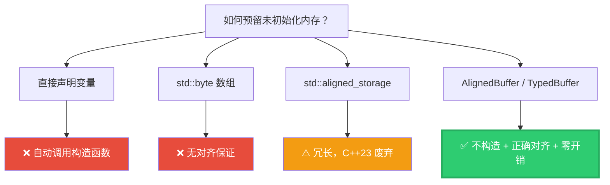

---

## 2. AlignedBuffer — 对齐的原始字节缓冲区

### 2.1 完整源码与注释翻译

```cpp
// BLI_memory_utils.hh:113~147

/**
 * An `AlignedBuffer` is a byte array with at least the given size and alignment.
 * The buffer will not be initialized by the default constructor.
 */
template<size_t Size, size_t Alignment> class AlignedBuffer {
  struct Empty {};
  struct alignas(Alignment) Sized {
    /* Don't create an empty array. This causes problems with some compilers. */
    std::byte buffer_[Size > 0 ? Size : 1];
  };

  using BufferType = std::conditional_t<Size == 0, Empty, Sized>;
  BLI_NO_UNIQUE_ADDRESS BufferType buffer_;

 public:
  operator void *()             { return this; }
  operator const void *() const { return this; }
  void *ptr()                   { return this; }
  const void *ptr() const       { return this; }
};
```

**注释翻译**：

> *An `AlignedBuffer` is a byte array with at least the given size and alignment. The buffer will not be initialized by the default constructor.*
>
> `AlignedBuffer` 是一个具有指定大小和对齐的字节数组。默认构造函数**不会初始化**缓冲区。

> *Don't create an empty array. This causes problems with some compilers.*
>
> 不要创建空数组（`buffer_[0]`）。这在某些编译器上会导致问题。所以用 `Size > 0 ? Size : 1`，当 Size=0 时分配 1 字节（但会被 `Empty` 分支优化掉）。

### 2.2 设计拆解

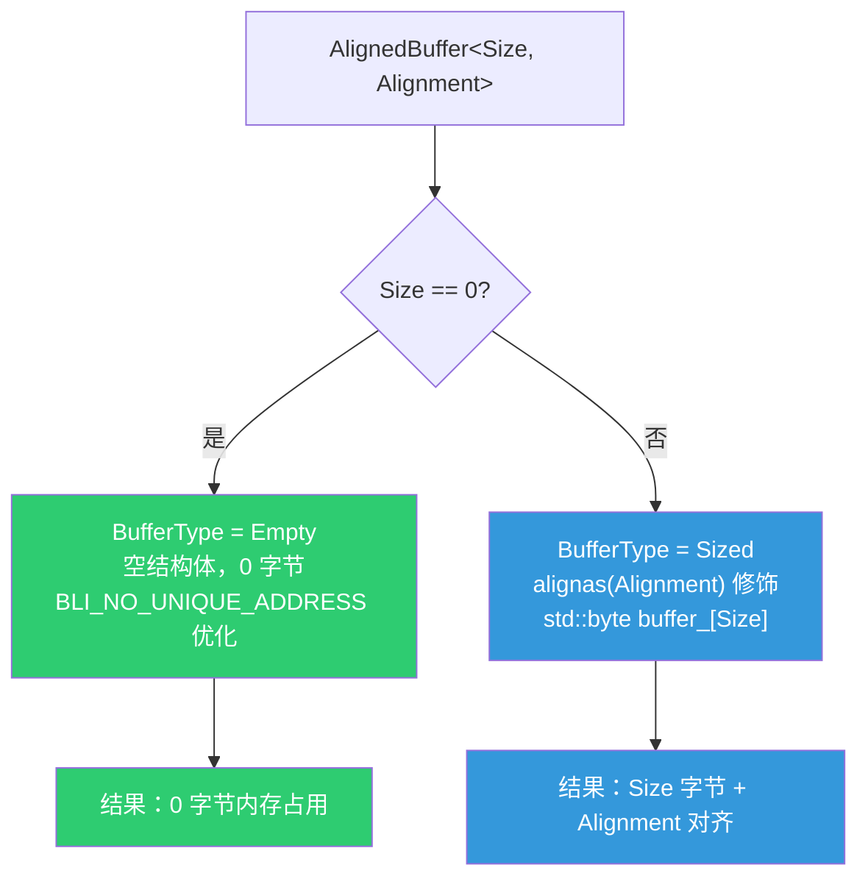

### 2.3 关键语法：`alignas(Alignment)`

```cpp
struct alignas(Alignment) Sized {
    std::byte buffer_[Size > 0 ? Size : 1];
};
```

`alignas(Alignment)` 告诉编译器：`Sized` 结构体的起始地址必须是 `Alignment` 的倍数。


### 2.4 关键语法：`std::conditional_t<Size == 0, Empty, Sized>`

```cpp
using BufferType = std::conditional_t<Size == 0, Empty, Sized>;
```

这是编译期的**类型选择**：

| 条件 | 选择的类型 | 效果 |
|------|-----------|------|
| `Size == 0` | `Empty` | 空结构体，配合 `BLI_NO_UNIQUE_ADDRESS` 占 0 字节 |
| `Size > 0` | `Sized` | 实际的字节数组 |

等价于：

```cpp
if constexpr (Size == 0) {
  using BufferType = Empty;
} else {
  using BufferType = Sized;
}
```

但 `std::conditional_t` 是**类型别名**，不是代码分支，更简洁。

### 2.5 隐式转换为 `void*`

```cpp
operator void *()             { return this; }
operator const void *() const { return this; }
void *ptr()                   { return this; }
const void *ptr() const       { return this; }
```

**为什么 `return this` 就够了？** 因为 `AlignedBuffer` 只有一个成员 `buffer_`，且 `BLI_NO_UNIQUE_ADDRESS` 保证它从对象起始地址开始。所以 `this` 指针就是缓冲区的起始地址。

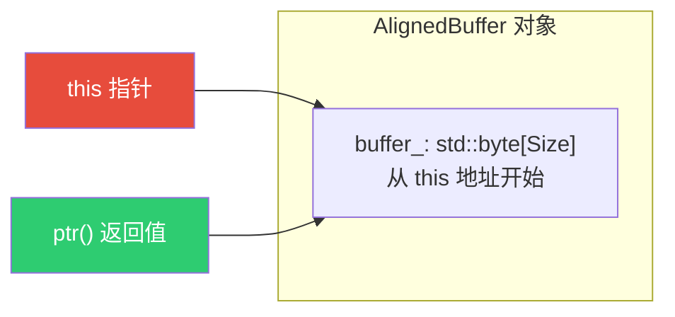

---

## 3. TypedBuffer — 类型化的未初始化缓冲区

### 3.1 完整源码与注释翻译

```cpp
// BLI_memory_utils.hh:149~220

/**
 * This can be used to reserve memory for C++ objects whose lifetime is different from the
 * lifetime of the object they are embedded in. It's used by containers with small buffer
 * optimization and hash table implementations.
 */
template<typename T, int64_t Size = 1> class TypedBuffer {
 private:
  /** Required so that `sizeof(T)` is not required when `Size` is 0. */
  static constexpr size_t get_size()
  {
    if constexpr (Size == 0) {
      return 0;
    }
    else {
      return sizeof(T) * size_t(Size);
    }
  }

  /** Required so that `alignof(T)` is not required when `Size` is 0. */
  static constexpr size_t get_alignment()
  {
    if constexpr (Size == 0) {
      return 1;
    }
    else {
      return alignof(T);
    }
  }

  BLI_NO_UNIQUE_ADDRESS AlignedBuffer<get_size(), get_alignment()> buffer_;

 public:
  operator T *()             { return static_cast<T *>(buffer_.ptr()); }
  operator const T *() const { return static_cast<const T *>(buffer_.ptr()); }
  T &operator*()             { return *static_cast<T *>(buffer_.ptr()); }
  const T &operator*() const { return *static_cast<const T *>(buffer_.ptr()); }
  T *ptr()                   { return static_cast<T *>(buffer_.ptr()); }
  const T *ptr() const       { return static_cast<const T *>(buffer_.ptr()); }
  T &ref()                   { return *static_cast<T *>(buffer_.ptr()); }
  const T &ref() const       { return *static_cast<const T *>(buffer_.ptr()); }
};
```

**注释翻译**：

> *This can be used to reserve memory for C++ objects whose lifetime is different from the lifetime of the object they are embedded in. It's used by containers with small buffer optimization and hash table implementations.*
>
> 这可用于为**生命周期与所属对象不同**的 C++ 对象预留内存。它被**小缓冲区优化（SBO）的容器**和**哈希表实现**使用。

> *Required so that `sizeof(T)` is not required when `Size` is 0.*
>
> 必须这样做，以便 `Size=0` 时不要求 `sizeof(T)` ——因为某些不完整类型（如前向声明）没有 `sizeof`。

> *Required so that `alignof(T)` is not required when `Size` is 0.*
>
> 必须这样做，以便 `Size=0` 时不要求 `alignof(T)` ——同理。

### 3.2 设计层次

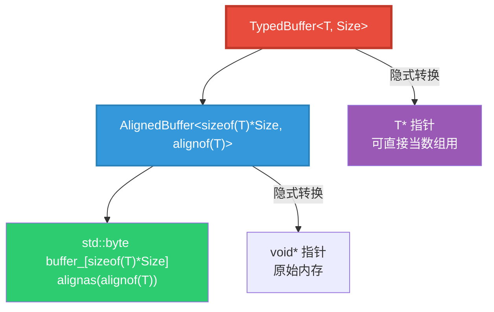

### 3.3 为什么 `Size=0` 时需要特殊处理？

```cpp
// 如果 Size=0 时直接写 sizeof(T) * Size：
AlignedBuffer<sizeof(T) * 0, alignof(T)>  // sizeof(T) * 0 = 0

// 但如果 T 是不完整类型呢？
struct MyType;  // 前向声明，sizeof(MyType) 编译错误！
TypedBuffer<MyType, 0> buffer;  // 不应该需要 sizeof！
```

`if constexpr (Size == 0)` 分支返回 0/1，**完全绕过** `sizeof(T)` 和 `alignof(T)` 的求值，使得不完整类型也能编译。

### 3.4 隐式转换为 `T*` — 最核心的便利

```cpp
operator T *() { return static_cast<T *>(buffer_.ptr()); }
```

这意味着 `TypedBuffer<T, 4>` 可以**直接当 `T*` 用**：

```cpp
TypedBuffer<int, 4> buf;

// 隐式转换为 int*
int *ptr = buf;       // ✅
buf[0] = 42;          // ✅ 等价于 ptr[0] = 42
buf[1] = 99;          // ✅

// 也可以用 ptr()
int *p = buf.ptr();   // ✅ 显式

// 解引用
int &first = *buf;    // ✅ 返回第一个元素的引用
```

**原理**：`buffer_.ptr()` 返回 `void*`，`static_cast<T*>(void*)` 将原始内存重新解释为 `T` 数组。这是安全的，因为 `AlignedBuffer` 保证了正确的大小和对齐。

---

## 4. 两者关系与设计层次

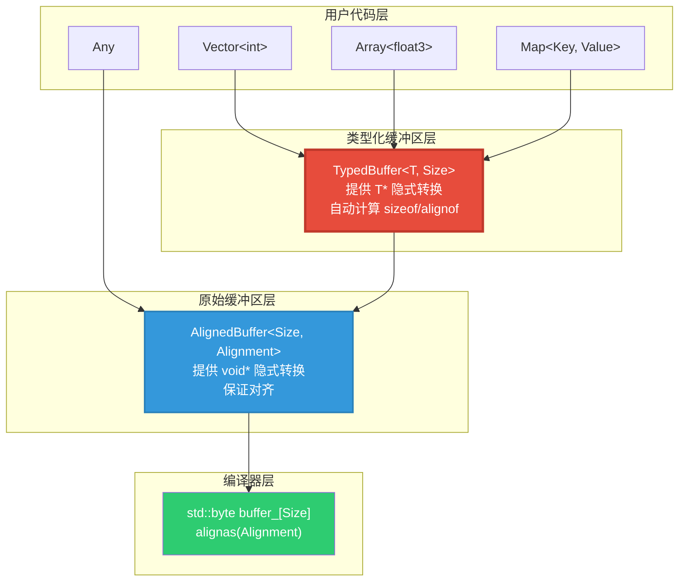

### 何时用 AlignedBuffer vs TypedBuffer？

| 场景 | 选择 | 原因 |
|------|------|------|
| 编译期知道元素类型 T | `TypedBuffer<T>` | 自动计算大小/对齐，提供 T* 转换 |
| 运行时才知道类型 | `AlignedBuffer<>` | 只需指定字节数和对齐，不依赖具体类型 |
| Size=0 且 T 可能不完整 | `TypedBuffer<T, 0>` | 特殊分支绕过 sizeof/alignof |
| 存储任意类型值（Any） | `AlignedBuffer<>` | 类型擦除，无法使用 TypedBuffer |

---

## 5. 语法专题：逐行拆解

### 5.1 `std::conditional_t` — 编译期类型选择

```cpp
using BufferType = std::conditional_t<Size == 0, Empty, Sized>;
```

等价于：

```cpp
// C++17 if constexpr 版本（概念上）
using BufferType = /* Size == 0 ? Empty : Sized */;
```

`std::conditional_t<条件, 类型A, 类型B>` 是 C++14 引入的类型别名，在编译期根据条件选择类型。

### 5.2 `if constexpr` — 编译期分支

```cpp
static constexpr size_t get_size()
{
  if constexpr (Size == 0) {
    return 0;          // 此分支不求值 sizeof(T)
  }
  else {
    return sizeof(T) * size_t(Size);  // 此分支才求值 sizeof(T)
  }
}
```

`if constexpr` 是 C++17 特性：**编译期分支**。条件为 false 的分支**不会被编译**，所以 `sizeof(T)` 不会在 `Size=0` 时被求值。

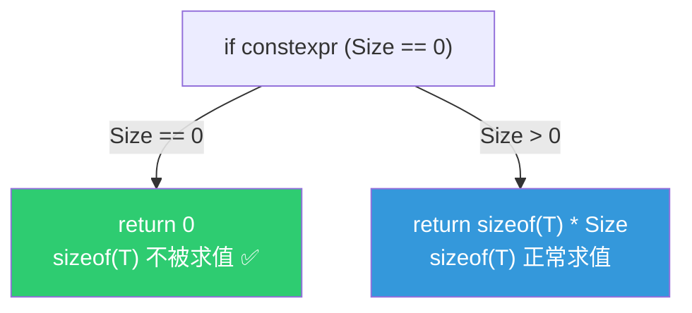

### 5.3 `static constexpr` 成员函数

```cpp
static constexpr size_t get_size() { ... }
```

- `static`：不依赖 `this`，可以在编译期调用
- `constexpr`：可以在编译期求值，用作模板参数

### 5.4 `std::byte` vs `char` 作为原始内存

```cpp
std::byte buffer_[Size > 0 ? Size : 1];
```

`std::byte` 是 C++17 引入的**最小内存单位类型**，与 `char` 的区别：

| 特性 | `std::byte` | `char` |
|------|------------|--------|
| 语义 | 纯内存字节 | 字符或小整数 |
| 算术运算 | ❌ 不允许 | ✅ 允许 |
| 隐式转换 | ❌ 不允许 | ✅ 允许 |
| 用途 | 原始内存缓冲区 | 字符串/小整数 |

使用 `std::byte` 表达意图："这里就是原始字节，不要做字符操作"。

---

## 6. 六大使用模式

### 模式总览

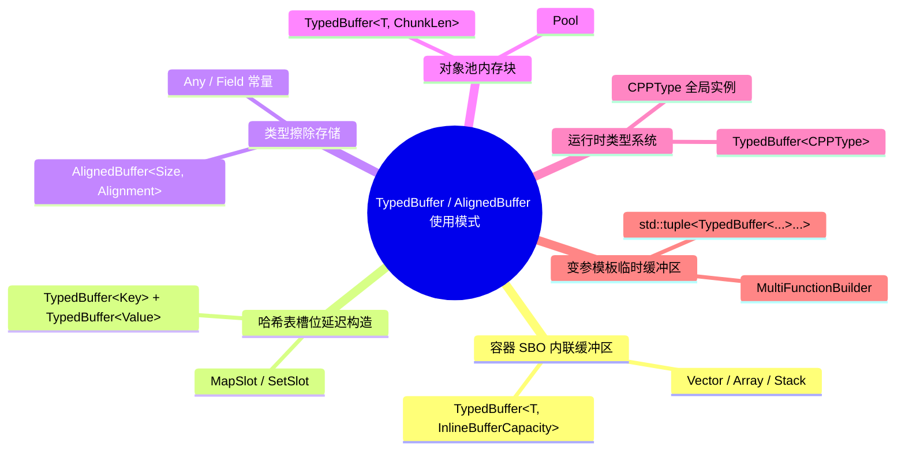

---

### 模式 1：容器 SBO 内联缓冲区 📦

**最常见的用途**：Vector/Array/Stack 等容器在小数据量时避免堆分配。

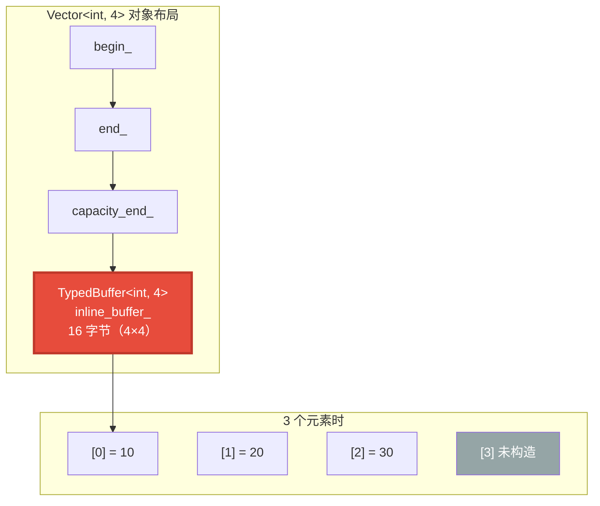

**源码**：

```cpp
// BLI_vector.hh:103
BLI_NO_UNIQUE_ADDRESS TypedBuffer<T, InlineBufferCapacity> inline_buffer_;

// BLI_array.hh:72
BLI_NO_UNIQUE_ADDRESS TypedBuffer<T, InlineBufferCapacity> inline_buffer_;

// BLI_stack.hh:101
BLI_NO_UNIQUE_ADDRESS TypedBuffer<T, InlineBufferCapacity> inline_buffer_;
```

**关键**：`TypedBuffer` 不调用 `T` 的构造函数。元素在 `append` 时通过 placement new 构造：

```cpp
// Vector::append_unchecked_as
new (end_) T(std::forward<ForwardT>(value)...);  // placement new 在 inline_buffer_ 上构造
end_++;
```

---

### 模式 2：哈希表槽位延迟构造 🔑

**问题**：哈希表的槽位有三种状态（空、已占用、已删除），空槽位不应该有 Key/Value 对象。

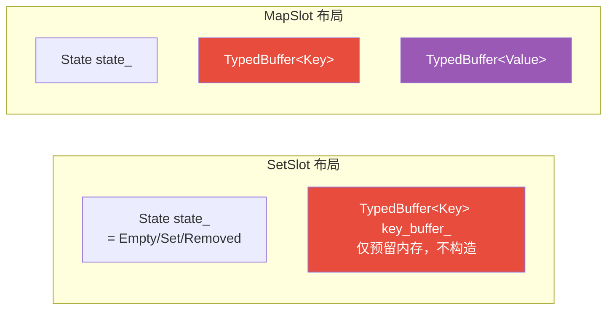

**源码**：

```cpp
// BLI_set_slots.hh:42
State state_;
TypedBuffer<Key> key_buffer_;

// BLI_map_slots.hh:57~58
State state_;
TypedBuffer<Key> key_buffer_;
TypedBuffer<Value> value_buffer_;
```

**生命周期管理**：

```cpp
// 插入时：placement new 构造
new (key_buffer_.ptr()) Key(std::move(key));
state_ = State::Set;

// 删除时：手动析构
key_buffer_.ref().~Key();
state_ = State::Removed;
```

---

### 模式 3：类型擦除存储 🎭

**问题**：`Any` 类型存储任意类型的值，编译期不知道类型，无法使用 `TypedBuffer`。

```cpp
// BLI_any.hh:120
AlignedBuffer<RealInlineBufferCapacity, Alignment> buffer_{};

// FN_field.hh:95
const CPPType *type = nullptr;
AlignedBuffer<inline_size, inline_alignment> value;
```

**为什么用 AlignedBuffer 而非 TypedBuffer？**

| 特性 | TypedBuffer | AlignedBuffer |
|------|------------|--------------|
| 需要编译期类型 T | ✅ 是 | ❌ 否 |
| 提供 T* 转换 | ✅ 是 | ❌ 只提供 void* |
| 适合类型擦除 | ❌ | ✅ |

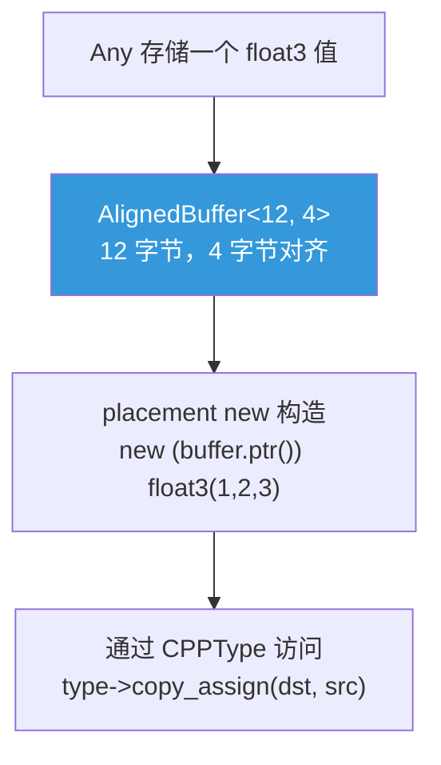

---

### 模式 4：对象池内存块 🏊

```cpp
// BLI_pool.hh:26
using Chunk = TypedBuffer<T, ChunkLen>;
```

Pool 使用 `TypedBuffer<T, ChunkLen>` 作为内存块——一大块连续的未初始化类型化内存，按需从中分配对象。

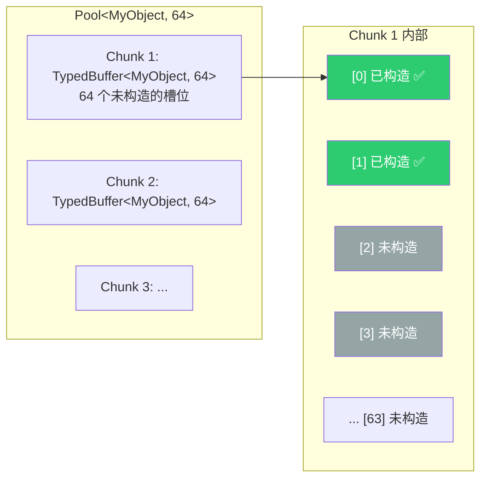

---

### 模式 5：运行时类型系统 🧬

```cpp
// BLI_cpp_type.hh:440
template<typename T> inline TypedBuffer<CPPType> cpp_type_impl{};
```

每个 C++ 类型 T 对应一个全局的 `TypedBuffer<CPPType>`，用于在运行时类型系统中预留 CPPType 大小的内存。随后通过 placement new 初始化：

```cpp
// BLI_cpp_type.cc 中注册
new (detail::cpp_type_impl<int>.ptr()) CPPType(...);
```

**为什么用 TypedBuffer 而非直接声明 CPPType？** 因为 `CPPType` 标记为 `NonCopyable, NonMovable`，没有默认构造函数。`TypedBuffer` 只预留内存，不调用构造函数，允许后续用自定义参数 placement new。

---

### 模式 6：变参模板临时缓冲区 🧩

```cpp
// FN_multi_function_builder.hh:208
std::tuple<TypedBuffer<typename ParamTags::base_type, MaxChunkSize>...> temporary_buffers;
```

这是最复杂的用法——利用参数包展开为每个函数参数类型生成一个独立的 `TypedBuffer`：

```cpp
// 假设 ParamTags... = FloatTag, IntTag, VectorTag
// 展开为：
std::tuple<
    TypedBuffer<float, MaxChunkSize>,
    TypedBuffer<int, MaxChunkSize>,
    TypedBuffer<float3, MaxChunkSize>
> temporary_buffers;
```

---

## 7. 与 BLI_NO_UNIQUE_ADDRESS 的协作

### 7.1 Size=0 时零开销

```cpp
// Vector<int, 0, RawAllocator> — 禁用内联缓冲区
// TypedBuffer<int, 0> 的内部：
AlignedBuffer<0, 1> buffer_;
// AlignedBuffer<0, 1> 的内部：
using BufferType = Empty;  // Size == 0 → Empty
BLI_NO_UNIQUE_ADDRESS Empty buffer_;  // 空类 + no_unique_address = 0 字节
```

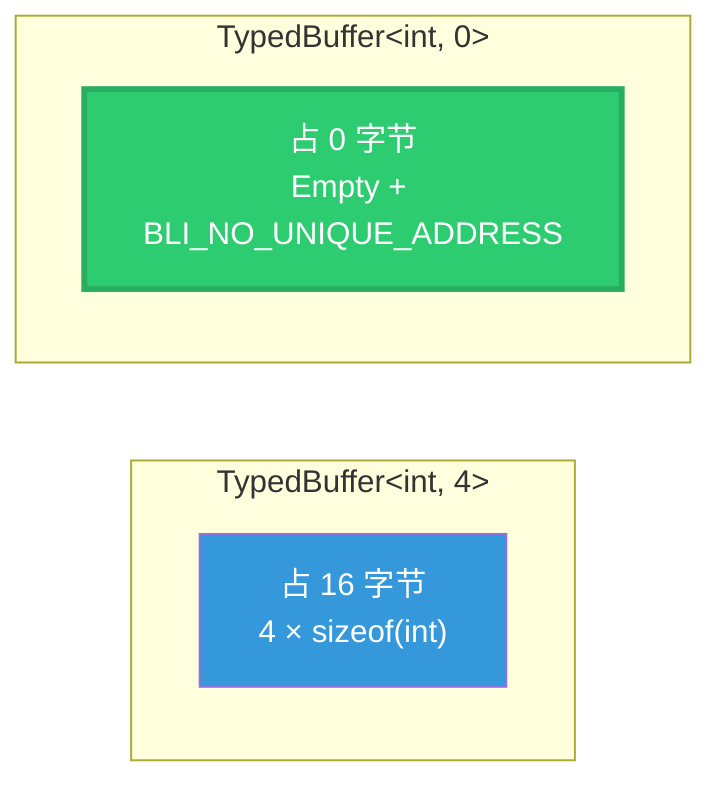

### 7.2 实际效果：Vector 的大小

```cpp
// Vector<int, 4, GuardedAllocator>
// 成员：begin_(8) + end_(8) + capacity_end_(8) + allocator_(0) + inline_buffer_(16)
// 总计：40 字节（64 位系统）

// Vector<int, 0, GuardedAllocator>
// 成员：begin_(8) + end_(8) + capacity_end_(8) + allocator_(0) + inline_buffer_(0)
// 总计：24 字节
```

---

## 8. default_inline_buffer_capacity — 内联缓冲区容量决策

```cpp
// BLI_memory_utils.hh:274~277
/**
 * Inline buffers for small-object-optimization should be disabled by default for large objects.
 * Otherwise we might get large unexpected allocations on the stack.
 */
constexpr int64_t default_inline_buffer_capacity(size_t element_size)
{
  return (int64_t(element_size) < 100) ? 4 : 0;
}
```

**注释翻译**：

> *Inline buffers for small-object-optimization should be disabled by default for large objects. Otherwise we might get large unexpected allocations on the stack.*
>
> 小对象优化的内联缓冲区应该对大对象**默认禁用**。否则可能导致**栈上出现意外的大分配**。

**逻辑**：

| 元素大小 | 内联容量 | 内联缓冲区大小 | 效果 |
|---------|---------|--------------|------|
| `sizeof(int)` = 4 | 4 | 16 字节 | ✅ 小，合理 |
| `sizeof(float3)` = 12 | 4 | 48 字节 | ✅ 可接受 |
| `sizeof(std::string)` ≈ 32 | 4 | 128 字节 | ⚠️ 有点大 |
| `sizeof(BigStruct)` = 200 | 0 | 0 字节 | ✅ 禁用，避免栈溢出 |

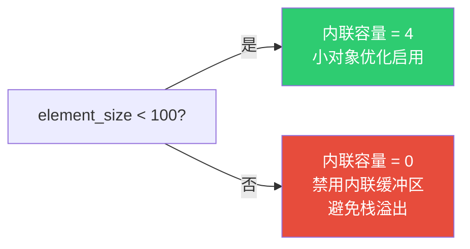

---

## 9. 总结速查表

### 类对比

| 特性 | AlignedBuffer | TypedBuffer |
|------|--------------|-------------|
| 模板参数 | `<Size, Alignment>` | `<T, Size=1>` |
| 存储内容 | 原始字节 (`std::byte`) | 类型化内存（自动计算大小/对齐） |
| 隐式转换为 | `void*` | `T*` |
| 需要编译期类型 | ❌ | ✅ |
| Size=0 时 | `Empty` 结构体（0 字节） | 内部 `AlignedBuffer<0,1>`（0 字节） |
| 适用场景 | 类型擦除、Any、Field | 容器 SBO、哈希表槽位、对象池 |

### 使用模式速查

| 模式 | 使用类 | 典型代码 |
|------|--------|---------|
| 容器 SBO | `TypedBuffer<T, N>` | `Vector`、`Array`、`Stack` 的 `inline_buffer_` |
| 哈希表槽位 | `TypedBuffer<T>` | `SetSlot::key_buffer_`、`MapSlot::key_buffer_ + value_buffer_` |
| 类型擦除 | `AlignedBuffer<N, A>` | `Any::buffer_`、`Field::value` |
| 对象池 | `TypedBuffer<T, N>` | `Pool::Chunk` |
| 运行时类型 | `TypedBuffer<CPPType>` | `cpp_type_impl<T>` |
| 变参模板 | `std::tuple<TypedBuffer<...>...>` | `MultiFunctionBuilder::temporary_buffers` |

### 关键概念

| 概念 | 一句话 |
|------|--------|
| **AlignedBuffer** | 对齐的原始字节缓冲区，不初始化，提供 `void*` |
| **TypedBuffer** | 类型化的未初始化缓冲区，提供 `T*`，基于 AlignedBuffer |
| **SBO** | Small Buffer Optimization，小数据存栈上，大数据存堆上 |
| **延迟构造** | 先预留内存，稍后 placement new 构造 |
| **`alignas`** | 指定类型/变量的对齐要求 |
| **`std::conditional_t`** | 编译期类型选择 |
| **`if constexpr`** | 编译期代码分支，false 分支不编译 |
| **`std::byte`** | C++17 原始内存字节类型，不允许算术运算 |
| **`BLI_NO_UNIQUE_ADDRESS`** | 空类成员不占空间 |

---

*文档生成日期：2026-06-03 | 源码版本：Blender main 分支*
