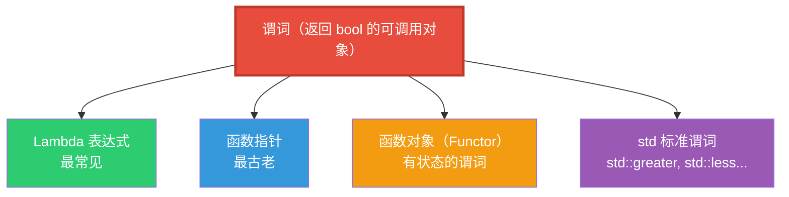
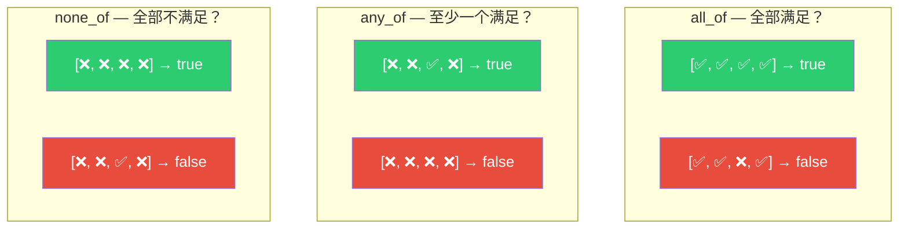
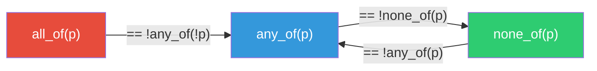
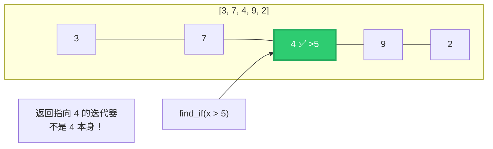
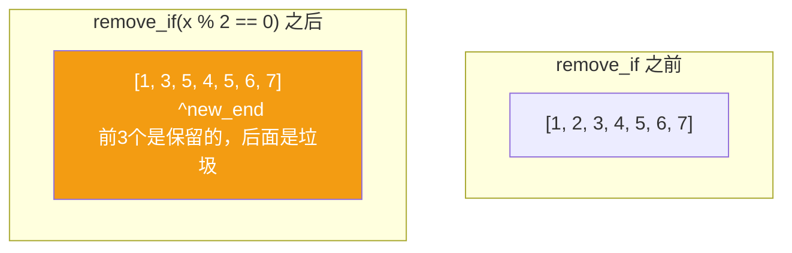
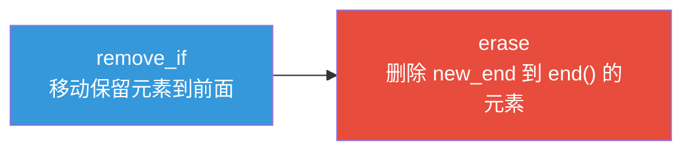
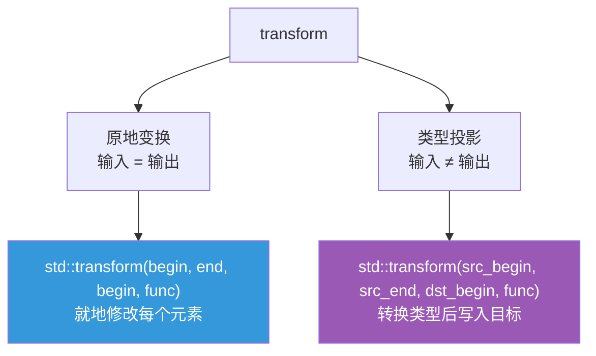
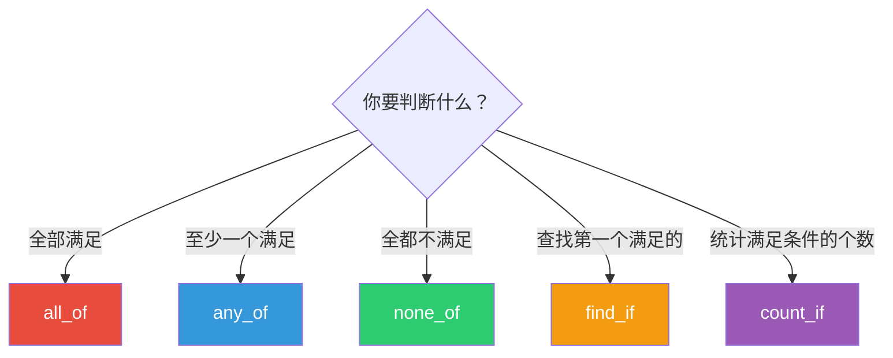
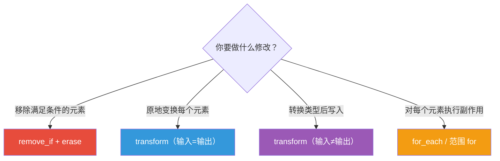

# STL 谓词算法详解 — all_of / any_of / none_of 及相关算法

> 在 Blender 几何节点源码中频繁出现的 `<algorithm>` 谓词算法

---

## 目录

1. [什么是谓词？](#1-什么是谓词)
2. [三大判断算法：all_of / any_of / none_of](#2-三大判断算法all_of--any-of--none-of)
3. [查找算法：find_if](#3-查找算法find_if)
4. [计数算法：count_if](#4-计数算法count_if)
5. [移除算法：remove_if 与 erase-remove 惯用法](#5-移除算法remove_if-与-erase-remove-惯用法)
6. [变换算法：transform](#6-变换算法transform)
7. [遍历算法：for_each](#7-遍历算法for_each)
8. [谓词的多种写法](#8-谓词的多种写法)
9. [算法选择指南](#9-算法选择指南)
10. [总结速查表](#10-总结速查表)

---

## 1. 什么是谓词？

### 1.1 定义

**谓词（Predicate）** 是一个**返回 bool 的可调用对象**——给它一个元素，它回答"是"或"否"。

```cpp
// 谓词：判断一个整数是否为偶数
auto is_even = [](int x) { return x % 2 == 0; };

is_even(4);  // true  → "是"
is_even(7);  // false → "否"
```

### 1.2 谓词的多种形态



```cpp
// ① Lambda（最常见）
std::all_of(vec.begin(), vec.end(), [](int x) { return x > 0; });

// ② 函数指针
bool is_positive(int x) { return x > 0; }
std::all_of(vec.begin(), vec.end(), is_positive);

// ③ 函数对象（可以有状态）
struct GreaterThan {
    int threshold;
    bool operator()(int x) const { return x > threshold; }
};
std::all_of(vec.begin(), vec.end(), GreaterThan{10});

// ④ 标准谓词
std::sort(vec.begin(), vec.end(), std::greater<int>());
```

### 1.3 一元谓词 vs 二元谓词

| 类型 | 参数个数 | 返回 bool | 用途 |
|------|---------|-----------|------|
| **一元谓词** (Unary Predicate) | 1 个 | ✅ | `all_of`, `find_if`, `count_if` |
| **二元谓词** (Binary Predicate) | 2 个 | ✅ | `sort`, `unique`, `equal` |

---

## 2. 三大判断算法：all_of / any_of / none_of

### 2.1 接口签名

```cpp
// <algorithm> 头文件
template<typename InputIt, typename UnaryPredicate>
bool all_of(InputIt first, InputIt last, UnaryPredicate p);

template<typename InputIt, typename UnaryPredicate>
bool any_of(InputIt first, InputIt last, UnaryPredicate p);

template<typename InputIt, typename UnaryPredicate>
bool none_of(InputIt first, InputIt last, UnaryPredicate p);
```

### 2.2 语义对比



| 算法 | 逻辑 | 等价代码 | 空范围返回 |
|------|------|---------|-----------|
| `all_of` | ∀元素, p(元素) == true | "每个都满足" | **true**（空真） |
| `any_of` | ∃元素, p(元素) == true | "至少一个满足" | **false** |
| `none_of` | ∀元素, p(元素) == false | "全都不满足" | **true**（空真） |

> ⚠️ **空范围（empty range）的特殊行为**：`all_of` 和 `none_of` 对空范围返回 `true`——这在逻辑上叫**空真（vacuous truth）**。"所有元素都满足条件"在没有任何元素时是成立的。

### 2.3 三者的逻辑关系



```cpp
// 这三种写法等价：
std::all_of(begin, end, p);       // 最直接
!std::any_of(begin, end, !p);     // 取反
std::none_of(begin, end, !p);     // 双重否定

// 这三种写法也等价：
std::any_of(begin, end, p);
!std::all_of(begin, end, !p);
!std::none_of(begin, end, p);
```

### 2.4 Blender 实例：all_of — 闭包结果单值判断

[node_geo_closure_to_list.cc](file:///e:/blender-git/blender/source/blender/nodes/geometry/nodes/node_geo_closure_to_list.cc)：

```cpp
if (std::all_of(values.begin(), values.end(), [](const bke::SocketValueVariant &value) {
      return value.is_single();
    }))
{
    // 快速路径：所有结果都是单值
    GArray<> array(type, count, NoInitialization());
    // ...
}
```

**语义**："如果**每一个**闭包结果都是单值，走快速路径"。

### 2.5 Blender 实例：all_of — 面选择

[mesh_selection.cc](file:///e:/blender-git/blender/source/blender/geometry/intern/mesh_selection.cc)：

```cpp
return IndexMask::from_predicate(faces.index_range(), memory, [&](const int64_t i) {
  const Span<int> indices = corner_verts_or_edges.slice(faces[i]);
  return std::all_of(
      indices.begin(), indices.end(),
      [&](const int i) { return vert_or_edge_selection[i]; });
});
```

**语义**："一个面被选中，当且仅当它的**所有**角点对应的顶点/边都被选中"。

### 2.6 Blender 实例：any_of — 曲线类型判断

[BKE_curves.hh](file:///e:/blender-git/blender/source/blender/blenkernel/BKE_curves.hh)：

```cpp
inline bool CurvesGeometry::has_curve_with_type(const Span<CurveType> types) const
{
  return std::any_of(
      types.begin(), types.end(),
      [&](CurveType type) { return this->has_curve_with_type(type); });
}
```

**语义**："曲线几何体中是否包含**任意一种**指定类型的曲线"。优雅地将单类型查询扩展为多类型查询。

### 2.7 Blender 实例：none_of — 布尔运算角点映射

[mesh_boolean.cc](file:///e:/blender-git/blender/source/blender/geometry/intern/mesh_boolean.cc)：

```cpp
if (std::none_of(out_face.begin(), out_face.end(),
    [&](int c) { return out_to_in_corner_map[c] == -1; }))
{
    // 所有角点都有映射 → 直接拷贝，不需要插值
}
```

**语义**："如果**没有任何**角点缺少映射，直接拷贝属性"。

---

## 3. 查找算法：find_if

### 3.1 接口签名

```cpp
template<typename InputIt, typename UnaryPredicate>
InputIt find_if(InputIt first, InputIt last, UnaryPredicate p);
```

**返回值**：指向第一个满足谓词的元素的迭代器。如果没找到，返回 `last`。

### 3.2 语义



### 3.3 Blender 实例：Scale Elements 分组

[node_geo_scale_elements.cc](file:///e:/blender-git/blender/source/blender/nodes/geometry/nodes/node_geo_scale_elements.cc)：

```cpp
static Span<int> front_indices_to_same_value(const Span<int> indices, const Span<int> values)
{
  const int value = values[indices.first()];
  const int &first_other = *std::find_if(
      indices.begin(), indices.end(),
      [&](const int index) { return values[index] != value; });
  return indices.take_front(&first_other - indices.begin());
}
```

**语义**："找到第一个与组内首个值**不同**的索引，将之前的相同值索引切分为一组"。利用 `find_if` 的"查找第一个不满足条件"语义实现分组切割。

### 3.4 find_if 的变体

| 算法 | 查找条件 | 返回值 |
|------|---------|--------|
| `find` | 等于指定值 | 迭代器 |
| `find_if` | 满足谓词 | 迭代器 |
| `find_if_not` | 不满足谓词 | 迭代器 |

```cpp
// find_if_not 等价于 find_if 的否定
auto it = std::find_if_not(begin, end, p);
// 等价于
auto it = std::find_if(begin, end, [](auto x) { return !p(x); });
```

---

## 4. 计数算法：count_if

### 4.1 接口签名

```cpp
template<typename InputIt, typename UnaryPredicate>
typename iterator_traits<InputIt>::difference_type
count_if(InputIt first, InputIt last, UnaryPredicate p);
```

### 4.2 Blender 实例：先计数再分配

[delaunay_2d.cc](file:///e:/blender-git/blender/source/blender/blenlib/intern/delaunay_2d.cc)：

```cpp
int ne = std::count_if(cdt->edges.begin(), cdt->edges.end(),
    [](const CDTEdge<T> *e) { return !is_deleted_edge(e); });
result.edge = Array<std::pair<int, int>>(ne);  // 精确分配

int nf = std::count_if(cdt->faces.begin(), cdt->faces.end(),
    [=](const CDTFace<T> *f) { return !f->deleted && f != cdt->outer_face; });
result.face = Array<Vector<int>>(nf);  // 精确分配
```

**模式**："先 `count_if` 统计数量，再分配精确大小的容器"——避免动态扩容。


### 4.3 count vs count_if

```cpp
// count：统计等于指定值的元素个数
int n = std::count(vec.begin(), vec.end(), 42);

// count_if：统计满足谓词的元素个数
int n = std::count_if(vec.begin(), vec.end(), [](int x) { return x > 0; });
```

---

## 5. 移除算法：remove_if 与 erase-remove 惯用法

### 5.1 关键理解：remove_if 不删除元素！

```cpp
auto new_end = std::remove_if(vec.begin(), vec.end(), p);
// vec 的大小没变！
// remove_if 只是把"不满足谓词"的元素移到前面，返回新的逻辑末尾
```



### 5.2 erase-remove 惯用法

```cpp
// 标准写法：erase-remove 惯用法
vec.erase(std::remove_if(vec.begin(), vec.end(), p), vec.end());

// 等价于 C++20 的：
std::erase_if(vec, p);
```



### 5.3 Blender 实例：Vector::remove_if

[BLI_vector.hh](file:///e:/blender-git/blender/source/blender/blenlib/BLI_vector.hh)：

```cpp
template<typename Predicate> int64_t remove_if(Predicate &&predicate)
{
  const T *prev_end = this->end();
  end_ = std::remove_if(this->begin(), this->end(), predicate);
  destruct_n(end_, prev_end - end_);  // 析构被移除的元素
  UPDATE_VECTOR_SIZE(this);
  return int64_t(prev_end - end_);
}
```

Blender 的 `Vector::remove_if` 封装了 erase-remove 惯用法，额外处理了元素析构。

---

## 6. 变换算法：transform

### 6.1 接口签名

```cpp
// 将函数应用到每个元素，结果写入输出范围
template<typename InputIt, typename OutputIt, typename UnaryOperation>
OutputIt transform(InputIt first1, InputIt last1, OutputIt d_first, UnaryOperation op);
```

### 6.2 两种用法



### 6.3 Blender 实例：类型投影

[layer_utils.cc](file:///e:/blender-git/blender/source/blender/blenkernel/intern/layer_utils.cc)：

```cpp
const Vector<Base *> bases = BKE_view_layer_array_from_bases_in_mode_params(...);
Vector<Object *> objects(bases.size());
std::transform(bases.begin(), bases.end(), objects.begin(),
    [](Base *base) { return base->object; });
```

**语义**：`Base*` → `Object*` 的类型投影，提取每个 Base 中的 object 成员。

### 6.4 Blender 实例：并行原地变换

[reorder.cc](file:///e:/blender-git/blender/source/blender/geometry/intern/reorder.cc)：

```cpp
template<typename T, typename Func>
static void parallel_transform(MutableSpan<T> values, const int64_t grain_size, const Func &func)
{
  threading::parallel_for(values.index_range(), grain_size, [&](const IndexRange range) {
    MutableSpan<T> values_range = values.slice(range);
    std::transform(values_range.begin(), values_range.end(), values_range.begin(), func);
  });
}
```

**语义**：将 `std::transform` 与 `threading::parallel_for` 结合，实现并行化的原地变换。

---

## 7. 遍历算法：for_each

### 7.1 接口签名

```cpp
template<typename InputIt, typename UnaryFunction>
Function for_each(InputIt first, InputIt last, UnaryFunction f);
```

### 7.2 for_each vs 范围 for 循环

```cpp
// 范围 for 循环（更常见）
for (const auto &item : container) {
    process(item);
}

// std::for_each（较少见）
std::for_each(container.begin(), container.end(), [](const auto &item) {
    process(item);
});
```

**区别**：

| 特性 | 范围 for | std::for_each |
|------|---------|--------------|
| 可读性 | ✅ 更好 | 一般 |
| 返回值 | 无 | 返回函数对象（可携带状态） |
| 可组合性 | ❌ 不可 | ✅ 可与算法链组合 |
| 使用频率 | ⭐⭐⭐⭐⭐ | ⭐ |

> 💡 **建议**：日常代码用范围 for 循环。`std::for_each` 仅在需要与算法链组合或利用返回值时使用。

---

## 8. 谓词的多种写法

### 8.1 Lambda 的各种形式

```cpp
// ① 最简 lambda
std::all_of(begin, end, [](int x) { return x > 0; });

// ② 捕获外部变量
int threshold = 10;
std::all_of(begin, end, [threshold](int x) { return x > threshold; });

// ③ 引用捕获（避免拷贝）
const VArray<bool> &selection = ...;
std::all_of(begin, end, [&](int i) { return selection[i]; });

// ④ 复杂谓词（多行）
std::all_of(begin, end, [&](const auto &item) {
    if (item.is_empty()) return false;
    if (item.size() > 100) return false;
    return item.is_valid();
});
```

### 8.2 谓词取反的写法

```cpp
// 需求：查找第一个不满足条件的元素

// 写法 1：find_if_not（C++11）
auto it = std::find_if_not(begin, end, predicate);

// 写法 2：find_if + 否定 lambda
auto it = std::find_if(begin, end, [&](const auto &x) { return !predicate(x); });

// 写法 3：none_of 的等价表达
bool none = !std::any_of(begin, end, predicate);
```

---

## 9. 算法选择指南

### 9.1 判断类



### 9.2 修改类



### 9.3 性能注意事项

| 算法 | 短路行为 | 说明 |
|------|---------|------|
| `all_of` | ✅ 有 | 遇到第一个 false 就停止 |
| `any_of` | ✅ 有 | 遇到第一个 true 就停止 |
| `none_of` | ✅ 有 | 遇到第一个 true 就停止 |
| `find_if` | ✅ 有 | 找到第一个就停止 |
| `count_if` | ❌ 无 | 必须遍历全部 |
| `remove_if` | ❌ 无 | 必须遍历全部 |
| `transform` | ❌ 无 | 必须遍历全部 |

> 💡 **短路（Short-circuiting）**：`all_of` 遇到第一个不满足的元素就立即返回 `false`，不会继续检查。这对性能很重要——如果第一个元素就不满足，后续成千上万的元素不会被访问。

---

## 10. 总结速查表

### 算法一览

| 算法 | 功能 | 返回类型 | 短路 | Blender 使用频率 |
|------|------|---------|------|-----------------|
| `all_of` | 全部满足？ | `bool` | ✅ | ⭐⭐⭐ |
| `any_of` | 至少一个满足？ | `bool` | ✅ | ⭐⭐⭐⭐ |
| `none_of` | 全都不满足？ | `bool` | ✅ | ⭐ |
| `find_if` | 查找第一个满足的 | 迭代器 | ✅ | ⭐⭐⭐ |
| `find_if_not` | 查找第一个不满足的 | 迭代器 | ✅ | ⭐ |
| `count_if` | 统计满足条件的个数 | 整数 | ❌ | ⭐⭐ |
| `remove_if` | 移动不满足的到前面 | 迭代器 | ❌ | ⭐ |
| `transform` | 变换/投影 | 迭代器 | ❌ | ⭐ |
| `for_each` | 遍历执行副作用 | 函数对象 | ❌ | ⭐ |

### 谓词概念速查

| 概念 | 一句话 |
|------|--------|
| **谓词（Predicate）** | 返回 bool 的可调用对象 |
| **一元谓词** | 接受 1 个参数的谓词 |
| **二元谓词** | 接受 2 个参数的谓词 |
| **Lambda** | 匿名函数，最常见的谓词写法 |
| **短路求值** | 遇到决定性结果立即停止遍历 |
| **erase-remove 惯用法** | `vec.erase(std::remove_if(...), vec.end())` |
| **空真（Vacuous truth）** | 空范围上 `all_of` 返回 true |

---

*文档生成日期：2026-06-04 | 源码版本：Blender main 分支*
